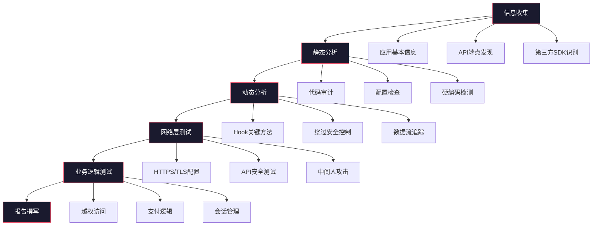
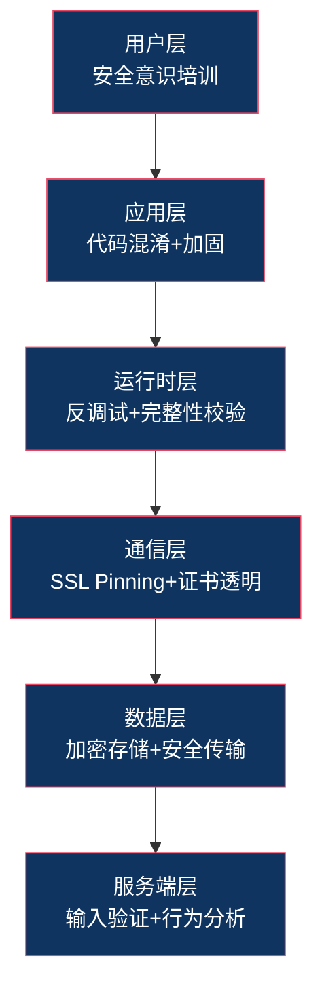

# 第18章 移动安全 — 本章小结

## 一、本章定位与知识全景

移动安全是信息安全领域中发展最快、攻防对抗最激烈的分支之一。截至2025年，全球活跃智能手机用户超过70亿，移动应用承载了金融交易、身份认证、企业办公、医疗健康等关键业务场景。与传统Web安全或网络安全不同，移动安全的攻击面包含操作系统内核、应用层、通信层、硬件层和用户行为层五个维度，形成了独特的攻防格局。

本章从理论基础出发，经核心技巧的系统训练，到实战案例的完整复现，构建了一条从入门到实战的完整学习路径。以下是对本章全部内容的系统回顾与知识提炼。

```mermaid
graph TD
    A[第18章 移动安全] --> B[理论基础]
    A --> C[核心技巧]
    A --> D[实战案例]
    A --> E[常见误区]
    A --> F[练习方法]
    A --> G[深度拓展]

    B --> B1[移动安全威胁全景]
    B --> B2[Android安全架构]
    B --> B3[iOS安全架构]
    B --> B4[OWASP Mobile Top 10]
    B --> B5[安全开发生命周期]
    B --> B6[威胁情报与态势感知]

    C --> C1[测试环境搭建]
    C --> C2[APK逆向分析]
    C --> C3[动态分析与Hook]
    C --> C4[渗透测试流程]
    C --> C5[数据存储安全测试]
    C --> C6[网络通信安全测试]
    C --> C7[身份认证安全测试]
    C --> C8[代码质量测试]
    C --> C9[自动化安全扫描]
    C --> C10[安全防御技术]

    D --> D1[恶意应用窃取凭据]
    D --> D2[SSL Pinning绕过]
    D --> D3[MDM方案安全缺陷]
    D --> D4[综合防御策略]

    style A fill:#1a1a2e,stroke:#e94560,color:#fff
    style B fill:#16213e,stroke:#0f3460,color:#fff
    style C fill:#16213e,stroke:#0f3460,color:#fff
    style D fill:#16213e,stroke:#0f3460,color:#fff
    style E fill:#16213e,stroke:#0f3460,color:#fff
    style F fill:#16213e,stroke:#0f3460,color:#fff
    style G fill:#16213e,stroke:#0f3460,color:#fff
```



## 二、理论基础回顾

### 2.1 移动安全的特殊性

移动安全与传统PC安全的根本差异体现在四个层面：

| 维度 | 传统PC安全 | 移动安全 |
|------|----------|---------|
| 攻击面 | 浏览器、网络服务、操作系统 | 传感器、NFC、蓝牙、摄像头、麦克风、应用商店 |
| 数据敏感度 | 以文件和账户为主 | 生物特征、位置轨迹、健康数据、支付凭据 |
| 用户行为 | 固定办公环境 | 随身携带，公共Wi-Fi、充电站等不可信环境 |
| 更新机制 | 统一补丁管理 | 碎片化严重（Android），依赖厂商和运营商 |
| 应用分发 | 可侧载，来源多样 | 应用商店审核机制，但存在审核绕过 |

理解这些差异是开展移动安全工作的前提——移动设备的传感器阵列（陀螺仪、加速度计、GPS、气压计）可以被恶意应用利用来进行键盘推断攻击（通过打字时的微振动推断输入内容），这是PC安全从未面对过的威胁类型。

### 2.2 Android安全架构

Android基于Linux内核构建了多层纵深防御体系：

**第一层：内核安全**
- 进程隔离：每个应用分配独立UID，运行在独立进程中
- SELinux/SEAndroid：强制访问控制（MAC），限制进程的文件、网络、IPC操作
- dm-verity：验证system分区完整性，防止持久化Rootkit

**第二层：应用沙箱**
- 每个应用运行在独立的Dalvik/ART虚拟机实例中
- 数据目录 `/data/data/<package>/` 权限隔离，其他应用无法访问
- Binder IPC机制提供受控的进程间通信

**第三层：权限模型**
- 安装时权限（Install-time）：安装时自动授予
- 运行时权限（Runtime）：Android 6.0引入，需用户动态授权（如相机、位置）
- 特殊权限（Special）：需用户在设置中手动授予（如SYSTEM_ALERT_WINDOW）

**第四层：应用签名与验证**
- 签名方案演进：v1（JAR签名）→ v2（APK签名方案v2）→ v3（支持密钥轮换）→ v4（增量安装）
- 签名验证由PackageManagerService在安装和更新时执行
- 签名不一致的更新将被拒绝，防止应用劫持

**第五层：Verified Boot**
- 启动链验证：bootloader → boot → system
- AVB（Android Verified Boot）2.0确保启动链每一环节的完整性

### 2.3 iOS安全架构

Apple通过硬件与软件的深度集成实现了业界最严格的移动安全防护：

**Secure Enclave Processor（SEP）**
- 独立于主处理器的安全协处理器，拥有自己的加密引擎和安全启动链
- 存储Touch ID/Face ID生物特征数据，主系统无法直接访问
- 即使内核被攻破，SEP中的密钥仍然安全

**代码签名与Notarization**
- 所有iOS应用必须经过Apple签名才能运行
- App Store审核 + 公证（Notarization）双重验证
- TestFlight分发也受签名约束

**沙箱机制**
- 每个应用运行在独立的沙箱中，文件系统访问受限
- App Group提供受控的应用间数据共享
- Extension机制实现有限的功能扩展

**Keychain安全**
- 硬件加密的密钥存储，受Secure Enclave保护
- 访问控制策略可配置（生物认证、设备密码等）
- Keychain数据在设备间同步时使用端到端加密

### 2.4 OWASP Mobile Top 10

OWASP Mobile Top 10为移动安全评估提供了标准化的威胁分类框架：

| 排名 | 威胁类别 | 核心风险 | 典型示例 |
|------|---------|---------|---------|
| M1 | 不当凭据使用 | 硬编码密钥、弱认证 | API密钥写在代码中 |
| M2 | 不充分的供应链安全 | 第三方库漏洞 | 使用有漏洞的旧版WebView |
| M3 | 不充分的认证/授权 | 弱密码策略、缺失MFA | 仅用4位PIN登录银行App |
| M4 | 不充分的输入/输出验证 | 注入、路径遍历 | Content Provider SQL注入 |
| M5 | 不安全的通信 | 缺失TLS、证书验证缺陷 | 明文传输登录凭据 |
| M6 | 不充分的隐私控制 | 过度收集、数据泄露 | 未授权的位置追踪 |
| M7 | 不充分的二进制保护 | 无混淆、无加固 | APK可直接反编译获取源码 |
| M8 | 安全配置错误 | Debug模式、Backup暴露 | AndroidManifest未关闭debuggable |
| M9 | 不安全的数据存储 | 明文存储敏感数据 | SharedPreferences存放密码 |
| M10 | 不充分的密码学 | 自定义加密、弱算法 | 使用MD5哈希密码 |

### 2.5 安全开发生命周期（Secure SDLC）

移动应用安全开发不是在开发完成后的"附加项"，而是贯穿整个生命周期的系统工程：


每个阶段的安全活动：

- **需求阶段**：识别合规要求（GDPR、个保法）、定义安全验收标准
- **设计阶段**：STRIDE威胁建模、数据流图分析、安全架构评审
- **编码阶段**：使用OWASP MASVS指导编码、静态代码分析（Semgrep、FindSecBugs）
- **测试阶段**：DAST动态扫描、手动渗透测试、模糊测试
- **发布阶段**：最终安全审核、签名验证、配置检查清单
- **运维阶段**：运行时应用自保护（RASP）、异常行为监控、漏洞响应

### 2.6 威胁情报与态势感知

移动威胁情报是防御体系的"眼睛"。它帮助安全团队了解当前的攻击趋势、攻击工具和攻击者的行为模式，从而提前部署防御措施。

**威胁情报的三个层次**：
- **战术情报**：具体的IoC（Indicators of Compromise），如恶意应用哈希、C2域名
- **操作情报**：攻击者的TTP（战术、技术、程序），如常用的混淆手段、数据外泄通道
- **战略情报**：攻击趋势、攻击组织画像、行业风险评估

**常用威胁情报源**：
- VirusTotal：恶意应用检测和样本分析
- Koodous：Android应用分析平台
- MITRE ATT&CK Mobile：移动攻击技术知识库
- 各厂商安全博客（Lookout、Zimperium、CrowdStrike）

## 三、核心技巧回顾

### 3.1 测试环境搭建

移动安全测试环境的搭建是所有实操的基础。一个完整的测试环境包含以下组件：

**物理设备层**
- Android测试机：推荐Google Pixel系列（官方支持Bootloader解锁、快速OTA）
- iOS测试机：需越狱设备或开发者账号配合Corellium云平台
- 路由器/网关：用于网络流量拦截

**工具链层**

| 类别 | 工具 | 用途 | 适用平台 |
|------|------|------|---------|
| 反编译 | jadx-gui | APK → Java源码 | Android |
| 反编译 | apktool | APK解包/重打包 | Android |
| 反编译 | Hopper/IDA Pro | 二进制逆向 | iOS |
| Hook框架 | Frida | 动态插桩 | Android/iOS |
| Hook框架 | Objection | 自动化绕过 | Android/iOS |
| 代理抓包 | mitmproxy | HTTP/HTTPS流量拦截 | 通用 |
| 代理抓包 | Burp Suite | Web渗透测试 | 通用 |
| 综合平台 | MobSF | 自动化安全扫描 | Android/iOS |
| 动态分析 | objection | 运行时环境探索 | Android/iOS |
| 调试器 | LLDB | iOS原生调试 | iOS |

**环境搭建的关键步骤**：
1. 安装ADB和配置设备调试模式
2. Root Android设备（Magisk方案）
3. 安装Frida-server并配置Gadget
4. 配置代理证书（CA证书安装到系统信任存储）
5. 验证环境：`frida-ps -U`确认设备连接，`mitmproxy`确认流量拦截正常

**常见陷阱**：
- Android 7.0+默认不信任用户安装的CA证书，需要将证书安装到系统存储（需Root或修改APK的network_security_config.xml）
- iOS 14+对TLS证书验证更严格，需要在Settings中手动信任
- Frida版本必须与Frida-server版本一致，否则会连接失败

### 3.2 APK逆向分析

APK逆向分析是Android安全测试的核心技能，分为静态分析和动态分析两条路径。

**静态分析流程**：
1. **解包**：`apktool d app.apk` 获取资源文件、Smali代码、AndroidManifest.xml
2. **反编译**：`jadx app.apk` 或 `jadx-gui app.apk` 获取近似Java源码
3. **代码审计**：
   - 搜索硬编码密钥：`grep -r "API_KEY\|SECRET\|PASSWORD" .`
   - 检查网络配置：`res/xml/network_security_config.xml`
   - 分析AndroidManifest.xml：导出组件、权限声明、备份配置
4. **Smali分析**：当jadx反编译失败或被混淆时，直接阅读Smali字节码

**代码混淆识别**：
- ProGuard/R8：将类名和方法名重命名为a、b、c
- DexGuard：更强的混淆，字符串加密、控制流混淆
- 壳保护：360加固、腾讯乐固、梆梆安全等，需先脱壳

### 3.3 动态分析与Hook技术

Frida是当前移动安全测试最强大的动态插桩框架，其核心能力是在运行时拦截和修改应用行为。

**Frida核心用法**：
```javascript
// Hook Java方法 - 修改返回值
Java.perform(function() {
    var LoginActivity = Java.use("com.target.app.LoginActivity");
    LoginActivity.verifyPassword.implementation = function(password) {
        console.log("[*] Password attempted: " + password);
        return true;  // 始终返回验证成功
    };
});

// Hook Native函数 - 拦截JNI调用
Interceptor.attach(Module.findExportByName("libnative.so", "check_root"), {
    onEnter: function(args) {
        console.log("[*] Root check called");
    },
    onLeave: function(retval) {
        retval.replace(0);  // 返回0表示未Root
    }
});

// 绕过SSL Pinning
Java.perform(function() {
    var TrustManager = Java.registerClass({
        name: "com.custom.TrustManager",
        implements: [Java.use("javax.net.ssl.X509TrustManager")],
        methods: {
            checkClientTrusted: function(chain, authType) {},
            checkServerTrusted: function(chain, authType) {},
            getAcceptedIssuers: function() { return []; }
        }
    });
    // 替换默认TrustManager...
});
```

**Objection自动化绕过**：
```bash
# 连接设备上的应用
objection -g com.target.app explore

# 常用命令
android sslpinning disable    # 绕过SSL Pinning
android root disable           # 绕过Root检测
android hooking list classes   # 列出所有类
android hooking search methods "login"  # 搜索包含login的方法
```

### 3.4 移动渗透测试流程

系统化的测试流程确保安全评估的全面性：



**各阶段关键检查点**：

| 阶段 | 检查项 | 工具 |
|------|--------|------|
| 信息收集 | 包名、版本、签名证书、SDK列表、反编译代码量 | apkanalyzer, jadx |
| 静态分析 | 不安全存储、硬编码密钥、导出组件、备份配置 | MobSF, Semgrep |
| 动态分析 | Root/越狱检测绕过、SSL Pinning绕过、Hook保护绕过 | Frida, Objection |
| 网络层 | TLS版本、证书验证、API鉴权、数据加密 | testssl.sh, Burp Suite |
| 业务逻辑 | 水平/垂直越权、支付篡改、重放攻击 | Burp Suite, Postman |
| 报告撰写 | 漏洞描述、复现步骤、风险评级、修复建议 | Markdown模板 |

### 3.5 专项安全测试

**数据存储安全测试**：
- SharedPreferences是否存储明文密码
- SQLite数据库是否加密（SQLCipher）
- 日志输出是否包含敏感信息（`logcat | grep "password\|token"`）
- 外部存储（SD卡）是否存放敏感数据
- 缓存文件和WebView缓存是否泄露信息

**网络通信安全测试**：
- TLS版本（必须TLS 1.2+，推荐TLS 1.3）
- 证书验证是否完整（不接受自签名证书）
- 是否实现了SSL Pinning（双向证书绑定）
- API通信是否使用Bearer Token或OAuth 2.0
- 敏感数据是否在URL参数中传输

**身份认证安全测试**：
- 密码策略（长度、复杂度、常见密码检测）
- 多因素认证实现是否安全
- 会话Token是否安全存储和传输
- Token过期和刷新机制是否合理
- 生物认证的回退策略（是否允许降级到PIN）

### 3.6 自动化安全扫描与代码质量

自动化工具是安全测试效率的倍增器，但不能替代手动测试：

**SAST（静态应用安全测试）**：
- **MobSF**：一站式扫描，支持Android/iOS，生成详细报告
- **Semgrep**：基于规则的代码模式匹配，支持自定义规则
- **QARK**：专注于Android应用的快速扫描

**DAST（动态应用安全测试）**：
- Burp Suite Extensions：Mobile Assistant、Autorize
- Drozer：Android组件安全测试框架

**自动化扫描的局限性**：
- 无法检测业务逻辑漏洞（如支付金额篡改）
- 误报率高，需要人工验证
- 对混淆和加壳代码的分析能力有限
- 无法替代渗透测试人员的创造性思维

### 3.7 移动安全防御技术

防御技术是安全测试的镜像——了解攻击手段后，需要知道如何防御：

| 防御层级 | 技术手段 | 实现方式 |
|---------|---------|---------|
| 代码层 | 代码混淆 | ProGuard/R8、DexGuard |
| 代码层 | 代码加固 | 360加固、梆梆安全、腾讯乐固 |
| 运行时 | Root/越狱检测 | SafetyNet/Play Integrity、自定义检测 |
| 运行时 | 反调试检测 | ptrace检测、时间差检测 |
| 运行时 | RASP | 运行时应用自保护，实时阻断攻击 |
| 网络层 | SSL Pinning | OkHttp CertificatePinner、TrustKit |
| 数据层 | 数据加密 | SQLCipher、Android Keystore、iOS Keychain |
| 数据层 | 安全传输 | TLS 1.3、Certificate Transparency |

## 四、实战案例复盘

### 4.1 案例一：恶意应用窃取用户凭据

**攻击链分析**：


**关键技术细节**：
- 仿冒应用使用与正版相似的图标和名称，降低用户警觉
- 利用Accessibility Service实现自动化操作（如自动填写登录表单）
- 通过反射调用隐藏敏感行为，规避静态分析检测
- 使用自定义加密算法回传数据，规避网络层DLP检测
- C2通信使用HTTPS或DNS隧道，增加检测难度

**防御要点**：
- 从官方渠道安装应用，检查开发者名称和应用评分
- 审查应用请求的权限是否与功能匹配
- 使用移动安全软件进行实时检测
- 开发者应实施代码完整性校验和反篡改机制

### 4.2 案例二：移动银行应用SSL Pinning绕过

**攻击场景**：安全研究人员在授权渗透测试中，需要绕过银行应用的SSL Pinning以分析API通信。

**绕过方法层次**：

| 层次 | 方法 | 难度 | 适用场景 |
|------|------|------|---------|
| 配置层 | 修改network_security_config.xml | 低 | 自定义CA信任配置 |
| 框架层 | Frida Hook SSLContext | 中 | 使用系统默认SSL验证 |
| 框架层 | Objection `sslpinning disable` | 低 | 标准实现的Pinning |
| 原生层 | Hook libssl.so的SSL_CTX_set_verify | 高 | NDK层实现的Pinning |
| 二进制层 | 修改.so文件中的验证逻辑 | 高 | 自定义加密库 |
| 内存层 | 使用Frida DUMP解密后的明文流量 | 中 | 所有场景（终极方案） |

**案例启示**：
- SSL Pinning不是"设置即安全"的银弹，实现方式决定了其强度
- 多层Pinning（Java层 + Native层 + 自定义协议）比单一实现更难绕过
- Certificate Transparency和证书锁定列表可以增加绕过难度
- 安全测试需要评估的是Pinning的强度，而非有无

### 4.3 案例三：企业MDM方案安全缺陷利用

**攻击面分析**：
- MDM Agent应用本身可能包含漏洞（权限提升、命令注入）
- MDM与设备之间的通信如果加密不当，可被中间人攻击
- 设备合规性检查逻辑可能被绕过（模拟合规状态）
- 远程擦除/锁定命令可被攻击者劫持（拒绝服务或勒索）

**关键教训**：
- MDM方案本身也是软件，需要接受安全审计
- 零信任架构：不应仅依赖MDM报告的设备状态做访问决策
- 最小权限原则：MDM Agent不应拥有超出管理需要的权限
- 通信安全：MDM控制通道必须使用强认证和加密

### 4.4 综合防御策略

三个案例共同揭示了一个核心原则：**安全是分层的，任何单一层级的防护都可能被绕过**。

防御策略应遵循"纵深防御"（Defense in Depth）原则：



## 五、关键技术工具速查表

以下是本章涉及的全部核心工具及其用途，按测试阶段分类：

| 测试阶段 | 工具名称 | 核心用途 | 平台 | 学习曲线 |
|---------|---------|---------|------|---------|
| **静态分析** | jadx / jadx-gui | APK反编译为Java源码 | Android | 低 |
| **静态分析** | apktool | APK解包与重打包 | Android | 低 |
| **静态分析** | Dex2jar | DEX转JAR文件 | Android | 低 |
| **静态分析** | MobSF | 一站式自动化扫描 | Android/iOS | 低 |
| **静态分析** | Semgrep | 基于规则的代码模式匹配 | 通用 | 中 |
| **动态分析** | Frida | 动态插桩框架 | Android/iOS | 中 |
| **动态分析** | Objection | 自动化运行时绕过 | Android/iOS | 低 |
| **动态分析** | Drozer | Android组件安全测试 | Android | 中 |
| **动态分析** | LLDB / GDB | 原生代码调试 | iOS/Android | 高 |
| **网络分析** | mitmproxy | HTTP/HTTPS流量拦截 | 通用 | 低 |
| **网络分析** | Burp Suite | Web/移动渗透测试 | 通用 | 中 |
| **网络分析** | Wireshark | 底层网络协议分析 | 通用 | 中 |
| **网络分析** | tcpdump | 命令行抓包 | Android | 低 |
| **逆向工程** | IDA Pro | 专业二进制逆向 | 通用 | 高 |
| **逆向工程** | Ghidra | 开源逆向工程平台 | 通用 | 高 |
| **逆向工程** | Hopper | macOS/iOS逆向 | macOS/iOS | 中 |
| **加固识别** | APKiD | 加固/混淆方案识别 | Android | 低 |
| **漏洞扫描** | QARK | Android快速漏洞扫描 | Android | 低 |
| **漏洞扫描** | AndroBugs | Android安全漏洞扫描 | Android | 低 |

## 六、常见误区深度解析

本章列举的八个误区不仅在初学者中普遍存在，甚至一些资深从业者也会陷入其中。以下是每个误区的深层分析和正确认知：

| 误区 | 事实真相 | 实际案例 | 正确做法 |
|------|---------|---------|---------|
| iOS不会被攻击 | iOS同样面临高级威胁，包括零点击漏洞 | Pegasus间谍软件利用iMessage零点击漏洞感染iOS设备 | 保持系统更新，禁用不需要的服务，使用MDM管理 |
| 应用商店审核等于安全 | 审核存在盲区，恶意应用可绕过检测 | Google Play多次发现携带恶意SDK的应用通过审核 | 多层验证：审核 + 运行时检测 + 用户教育 |
| Root检测等于安全 | Root检测可以被Frida/Xposed轻松绕过 | 几乎所有Root检测方案都有公开绕过方法 | Root检测是辅助手段，不能替代真正的安全控制 |
| 本地加密就安全了 | 密钥存储和管理才是关键问题 | 密钥硬编码在代码中，加密形同虚设 | 使用硬件安全模块（Keystore/Keychain）存储密钥 |
| 权限少就更安全 | 权限数量不代表安全水平 | 使用单个READ_EXTERNAL_STORAGE权限读取所有用户文件 | 按最小权限原则申请，关注权限的实际使用范围 |
| VPN保证网络安全 | VPN隧道本身可能被攻击或被恶意VPN记录流量 | 免费VPN应用暗中记录用户所有网络流量 | 使用可信VPN，结合端到端加密保护敏感通信 |
| 开源一定更安全 | 开源不等于被充分审计 | OpenSSL HeartBleed漏洞存在两年才被发现 | 主动审计依赖的开源组件，监控安全公告 |
| 移动设备不需要杀毒 | 移动恶意软件持续增长，攻击手段日益复杂 | 2024年移动恶意软件样本增长超过50% | 企业环境部署移动威胁防御（MTD）方案 |

## 七、学习路径与进阶方向

### 7.1 三阶段学习路径

**阶段一：入门基础（1-2个月）**
- 目标：理解移动安全基础概念，能使用工具进行简单分析
- 学习内容：
  - Android/iOS安全架构基础
  - APK解包和基本反编译（apktool + jadx）
  - mitmproxy/Burp Suite基本抓包
  - OWASP Mobile Top 10理解
- 练习：DIVA（Damn Insecure and Vulnerable App）全部挑战
- 产出：能独立完成简单的移动应用安全评估报告

**阶段二：技能提升（2-4个月）**
- 目标：掌握动态分析和Hook技术，能发现中等难度漏洞
- 学习内容：
  - Frida脚本编写（Java Hook、Native Hook、Interceptor）
  - SSL Pinning绕过（多种方案）
  - Root/越狱检测绕过
  - Smali代码阅读和修改
  - 应用重打包和二次签名
- 练习：InsecureBankv2、OWASP Uncrackable Apps Level 1-3
- 产出：能独立完成移动应用渗透测试

**阶段三：高级实战（4-6个月）**
- 目标：能分析复杂应用、编写自定义工具、发现高危漏洞
- 学习内容：
  - ARM汇编与iOS逆向
  - 自定义Frida脚本开发（主动调用、批量Hook）
  - 脱壳技术（FART、BlackDex、frida-dexdump）
  - NDK Native层安全分析
  - 移动恶意软件分析
  - CVE漏洞复现和分析
- 练习：真实应用漏洞挖掘（在授权范围内）、CTF移动安全题目
- 产出：能独立完成高级安全评估和漏洞挖掘

### 7.2 推荐靶场与练习平台

| 靶场/平台 | 类型 | 难度 | 特点 |
|----------|------|------|------|
| DIVA | Android | 入门 | 涵盖常见漏洞类型，适合初学者 |
| InsecureBankv2 | Android | 入门-中等 | 模拟银行应用，贴近真实场景 |
| OWASP Uncrackable Apps | Android | 中等-高级 | 三层挑战，重点训练逆向和Hook技能 |
| MSTG Crackmes | Android/iOS | 中等-高级 | 配合OWASP MSTG指南使用 |
| Damn Vulnerable iOS App | iOS | 中等 | iOS安全测试专用 |
| Mobexler | 移动渗透 | 综合 | 预装工具的虚拟机环境 |
| TryHackMe Mobile Rooms | 综合 | 入门-中等 | 在线交互式学习 |
| HackTheBox Mobile | 综合 | 中等-高级 | 高质量移动安全挑战 |

### 7.3 持续学习资源

**推荐书籍**：
- 《Mobile Application Hacker's Handbook》— 移动安全测试权威指南
- 《Android Hacker's Handbook》— Android安全深度解析
- 《iOS Hacker's Handbook》— iOS安全攻防
- 《Android安全攻防权威指南》— 中文Android安全经典
- 《Frida手册》— Frida官方文档和社区示例

**在线资源**：
- OWASP MASTG（Mobile Application Security Testing Guide）：最权威的移动安全测试指南
- OWASP MASVS（Mobile Application Security Verification Standard）：安全验证标准
- Frida官方文档和示例库：https://frida.re/docs/
- Android安全公告：https://source.android.com/docs/security/bulletin
- Apple安全研究：https://support.apple.com/en-us/100100

**会议与社区**：
- Black Hat / DEF CON：顶级安全会议，移动安全议题丰富
- MOSEC（移动安全峰会）：专注于移动安全的国际会议
- OWASP本地分会：参与本地安全社区活动
- GitHub开源项目：跟踪移动安全工具的最新发展

## 八、行业发展趋势

### 8.1 技术演进趋势

**AI驱动的攻防对抗**

AI正在重塑移动安全的攻防格局。在攻击侧，攻击者利用大语言模型（LLM）生成高度仿真的钓鱼应用描述和用户评价，使恶意应用更难被识别。深度伪造（Deepfake）技术被用于绕过人脸认证系统。在防御侧，AI驱动的恶意应用检测从签名匹配升级到行为分析——通过监控应用的API调用序列、网络流量模式和系统资源使用情况，实时识别异常行为。Google Play Protect已经在使用机器学习模型每天扫描超过1000亿个应用。

**隐私增强技术的普及**

随着全球隐私法规的收紧（GDPR、中国《个人信息保护法》、CCPA），移动应用正在引入更多隐私保护技术：
- **差分隐私（Differential Privacy）**：在数据分析中添加噪声，保护个体隐私
- **联邦学习（Federated Learning）**：数据不出设备，模型在本地训练后聚合参数
- **同态加密（Homomorphic Encryption）**：在加密数据上直接计算，无需解密
- **零知识证明（Zero-Knowledge Proof）**：证明身份或属性而不泄露具体信息
- **去标识化（De-identification）**：Apple的Private Relay、Google的Privacy Sandbox

**5G与边缘计算安全**

5G网络的普及带来了新的安全挑战：
- **网络切片安全**：不同切片之间的隔离性需要严格保障
- **边缘计算**：计算从云端下沉到边缘节点，攻击面扩大
- **海量IoT设备**：5G支持百万级设备连接/km²，设备安全参差不齐
- **MEC平台安全**：多接入边缘计算平台成为新的攻击目标

### 8.2 威胁演变趋势

**供应链攻击持续升级**

移动应用的供应链攻击已经从简单的第三方库漏洞，发展为系统性的开发工具和SDK污染：
- 恶意SDK在不知情的情况下被嵌入数千个合法应用
- 开发工具链被入侵（如XcodeGhost事件的现代版本）
- 依赖混淆攻击（Dependency Confusion）瞄准移动应用构建流程

**高级持续性威胁（APT）面向移动设备**

国家级攻击者已经将移动设备纳入其攻击武器库：
- 零点击漏洞利用（如Pegasus的FORCEDENTRY）无需用户交互即可感染设备
- 硬件级后门和固件漏洞利用成为新的威胁向量
- 卫星通信和新兴通信协议可能成为攻击切入点

**移动勒索软件与金融犯罪**

随着移动设备存储价值的增加和移动支付的普及：
- 移动勒索软件从简单的屏幕锁定发展为真正的文件加密
- 移动银行木马（如Cerberus、Anatsa）具备窃取凭据和自动化转账的能力
- 加密货币钱包成为高价值攻击目标

## 九、不同角色的行动指南

### 9.1 安全从业者

| 行动项 | 具体做法 | 优先级 |
|--------|---------|-------|
| 构建知识体系 | 以OWASP MASTG为骨架，结合本章内容系统学习 | 高 |
| 持续实践 | 每周至少完成一个靶场挑战或分析一个真实应用（授权范围内） | 高 |
| 工具精通 | 熟练掌握Frida、Burp Suite、jadx三件套，至少能编写自定义Frida脚本 | 高 |
| 跟踪前沿 | 订阅OWASP Mobile Security博客、Google Project Zero、Apple Security Research | 中 |
| 考取认证 | 考虑OSCP、OSCE、GIAC Mobile Device Security Analyst (GMOB) | 中 |
| 社区贡献 | 向开源工具提交Issue/PR，参与安全社区讨论 | 低 |

### 9.2 应用开发者

| 行动项 | 具体做法 | 优先级 |
|--------|---------|-------|
| 安全左移 | 在需求阶段引入威胁建模，使用STRIDE分析数据流 | 高 |
| 安全编码 | 参考OWASP MASVS和MASVS-PRIVACY进行编码 | 高 |
| CI/CD集成 | 在构建流水线中集成MobSF/Semgrep静态扫描 | 高 |
| 密钥管理 | 使用Android Keystore/iOS Keychain存储密钥，禁止硬编码 | 高 |
| 依赖管理 | 使用Dependabot/Snyk监控第三方库漏洞，及时更新 | 中 |
| 安全测试 | 每个大版本发布前进行渗透测试（内部或外部） | 中 |
| 隐私合规 | 遵循数据最小化原则，定期进行隐私影响评估 | 中 |

### 9.3 企业管理者

| 行动项 | 具体做法 | 优先级 |
|--------|---------|-------|
| 策略制定 | 制定企业移动设备使用政策（BYOD/COPE） | 高 |
| MDM/EMM部署 | 选择合适的移动设备管理方案（如Microsoft Intune、VMware Workspace ONE） | 高 |
| 安全培训 | 每季度进行移动安全意识培训，包括钓鱼识别、应用安装规范 | 高 |
| 应用管理 | 建立企业应用商店，只允许安装经过审核的应用 | 中 |
| 应急响应 | 建立移动安全事件响应流程（设备丢失、数据泄露、恶意应用感染） | 中 |
| 风险评估 | 定期进行移动安全风险评估，识别高风险场景 | 中 |
| 预算投入 | 将移动安全纳入信息安全预算，保障工具和人员投入 | 低 |

## 十、知识检验清单

学习完本章后，用以下问题检验自己的掌握程度。如果无法回答大部分问题，建议回到对应章节重新学习。

**理论基础检验**：
- [ ] 能否画出Android安全架构的五层防御模型？
- [ ] 能否解释Secure Enclave在iOS安全中的作用？
- [ ] 能否列出OWASP Mobile Top 10的前三项及其典型示例？
- [ ] 能否描述威胁情报的三个层次？

**核心技巧检验**：
- [ ] 能否独立搭建包含Frida + mitmproxy + jadx的测试环境？
- [ ] 能否使用Frida编写一个Hook Java方法的脚本？
- [ ] 能否绕过一个使用标准实现的SSL Pinning？
- [ ] 能否从AndroidManifest.xml中识别导出组件和安全隐患？
- [ ] 能否使用MobSF对一个APK进行自动化扫描并解读报告？

**实战能力检验**：
- [ ] 能否独立完成一个Android应用的完整渗透测试？
- [ ] 能否编写一份符合行业标准的移动安全测试报告？
- [ ] 能否分析一个移动恶意应用的攻击链？
- [ ] 能否为开发团队提供具体可行的安全修复建议？

## 结语

移动安全是一个攻防持续演进的领域。本章提供的知识框架和实践方法是进入这一领域的坚实基础，但绝不是终点。新的操作系统版本会引入新的安全机制，新的攻击技术会突破现有的防御边界——只有持续学习和实践，才能在这个领域保持专业水准。

记住以下核心原则：

> **安全不是产品，而是过程。** 移动安全的保障需要开发者在代码中注入安全基因，安全从业者在测试中发现并消除隐患，企业管理者在制度中建立安全防线，终端用户在使用中保持安全意识。四者缺一不可，方能构建真正安全的移动生态。

***
*本章结束。下一章将介绍物联网安全的相关知识。*
