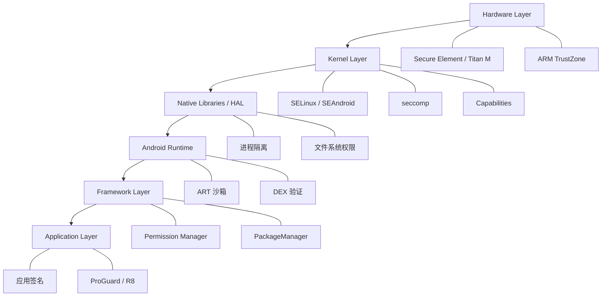
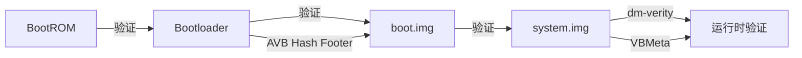
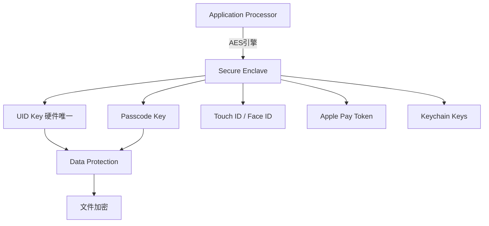
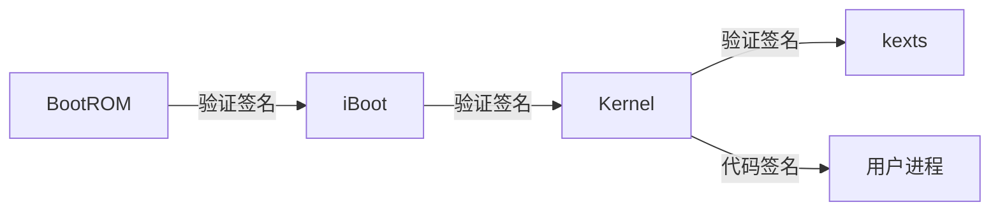
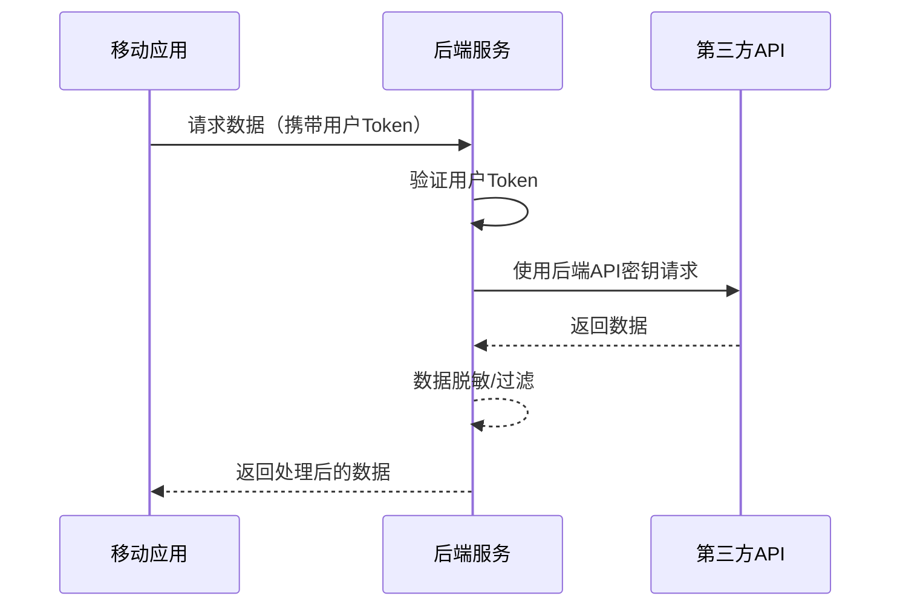
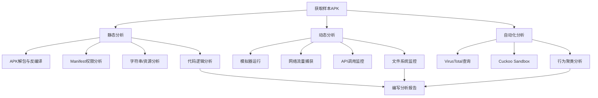
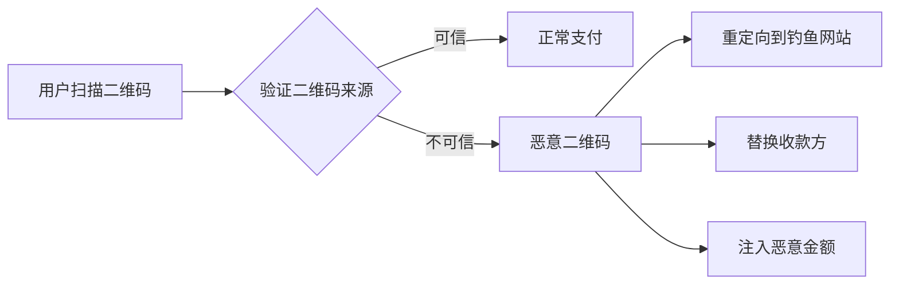
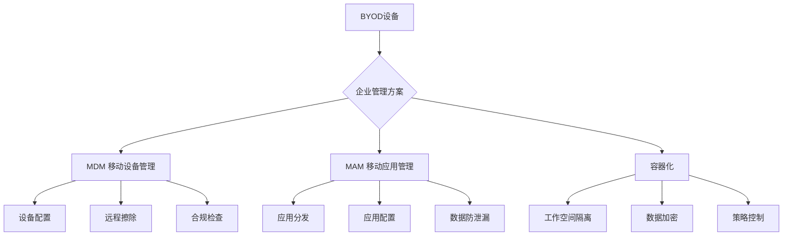

# 第18章 移动安全 - 深度拓展

本章是移动安全的进阶拓展区。前面的理论基础和核心技巧已经构建了移动安全的基本框架，本章将深入操作系统底层安全机制、剖析真实漏洞案例、演示高级攻防技术，并展望行业前沿方向。建议在完成前序章节后再阅读本章。

---

## 一、移动操作系统安全架构

### 1.1 Android安全架构深度分析

Android的安全模型是多层防御体系，从硬件层到应用层每一层都有独立的安全机制。理解这些层次之间的关系，是进行深度安全分析的前提。



#### 1.1.1 Linux内核安全

Android基于Linux内核，继承了其核心安全机制并在移动场景下做了大量定制：

**进程与用户隔离**：Android为每个应用分配唯一的UID（User ID），范围从10000到19999。这意味着即使应用代码存在漏洞，也无法直接访问其他应用的数据。查看方式：

```bash
# 查看应用的UID
adb shell dumpsys package com.example.app | grep userId
# 输出示例：userId=10134

# 查看应用进程
adb shell ps -A | grep 10134
# u0_a134   10134  5678  1234567 89012 0  0 0 com.example.app
```

UID隔离的底层实现是Linux的DAC（Discretionary Access Control）机制。每个应用的私有目录 `/data/data/<package>/` 的所有者就是该应用的UID，其他UID无权访问。但DAC有一个根本缺陷——root用户可以绕过所有限制，这就是为什么Android还需要MAC机制。

**SELinux/SEAndroid**：Android 5.0开始全面启用SELinux，采用强制访问控制（MAC）策略。即使进程以root运行，SELinux策略也能限制其行为。SEAndroid策略定义了每个域（domain）对每种资源类型的访问权限：

```bash
# 查看当前SELinux状态
adb shell getenforce
# Enforcing

# 查看进程的安全上下文
adb shell ps -Z | grep com.example.app
# u:r:untrusted_app:s0:c134,c256  u0_a134  ...  com.example.app

# 查看文件的安全上下文
adb shell ls -Z /data/data/com.example.app/
# u:object_r:app_data_file:s0:c134,c256 databases
# u:object_r:app_data_file:s0:c134,c256 shared_prefs
```

SEAndroid策略文件位于 `/system/etc/selinux/` 和 `/vendor/etc/selinux/`，以 `.cil`（Common Intermediate Language）格式存储。对于安全研究人员来说，理解SEAndroid策略是分析系统级漏洞的关键：

```bash
# 提取并查看SEAndroid策略
adb pull /sys/fs/selinux/policy /tmp/policy
sesearch --allow /tmp/policy -t app_data_file -c file
```

**seccomp（Secure Computing Mode）**：Android 8.0引入seccomp-bpf，限制应用可以调用的系统调用。系统调用白名单定义在 `bionic/libc/seccomp/` 中。这大幅缩小了内核攻击面——即使攻击者在应用进程中执行了代码，也无法调用不在白名单中的系统调用。

**Capabilities机制**：传统的Linux权限模型中，root拥有所有权限。Android使用Capabilities将root的权限拆分为细粒度的能力单元（如 `CAP_NET_ADMIN`、`CAP_SYS_PTRACE` 等）。Android进程只拥有必要的Capabilities，而非全部root权限。

#### 1.1.2 应用沙箱

Android应用沙箱的核心是进程隔离+文件系统隔离+IPC控制三重机制：

**进程隔离实现**：每个应用运行在独立的进程中，拥有独立的UID。Zygote进程是所有应用进程的父进程，通过fork创建子进程。应用进程的内存空间是独立的，一个应用的崩溃不会影响其他应用。

**Dalvik/ART虚拟机**：每个应用在独立的ART虚拟机实例中运行。ART从Android 5.0开始取代Dalvik，采用AOT（Ahead-Of-Time）编译而非JIT。ART的安全优势包括：

- DEX字节码验证：安装时验证DEX文件的合法性，防止恶意字节码执行
- 类加载隔离：每个应用有独立的类加载器，防止类注入
- 内存安全：垃圾回收机制减少内存相关漏洞

**Binder IPC机制**：Binder是Android最核心的IPC机制，所有跨进程通信都通过Binder驱动（/dev/binder）完成。Binder的安全控制点包括：

```java
// Binder调用中的身份验证
IBinder binder = ServiceManager.getService("activity");
Parcel data = Parcel.obtain();
Parcel reply = Parcel.obtain();

// Binder驱动自动附加调用者的UID/PID
// 服务端可以验证调用者身份
int callingUid = Binder.getCallingUid();
int callingPid = Binder.getCallingPid();

// 基于UID的权限检查
if (callingUid != Process.SYSTEM_UID) {
    throw new SecurityException("Permission denied");
}
```

Binder驱动在内核层自动为每次调用附加调用者的UID和PID，服务端无法伪造。这是Android权限系统可信的基石——如果Binder身份信息可以被伪造，整个权限系统就会崩溃。

#### 1.1.3 权限系统演进

Android的权限系统经历了多次重大变化：

| 版本 | 权限模型 | 特点 |
|------|---------|------|
| Android 1.x-5.x | 安装时权限 | 安装时一次性授予所有权限，用户只能全部接受或拒绝安装 |
| Android 6.0+ | 运行时权限 | 危险权限需要在运行时动态申请，用户可以逐个授予或拒绝 |
| Android 10+ | 范围存储 | 应用默认只能访问自己的文件和媒体集合 |
| Android 11+ | 一次性权限 | 位置、麦克风、摄像头支持"仅本次允许" |
| Android 12+ | 近似位置 | 用户可以选择仅授予近似位置而非精确位置 |
| Android 13+ | 通知权限 | POST_NOTIFICATIONS成为运行时权限 |
| Android 14+ | 照片选择器 | 部分媒体访问无需存储权限 |

运行时权限的实现机制：

```java
// 检查权限
if (ContextCompat.checkSelfPermission(this, Manifest.permission.CAMERA)
        != PackageManager.PERMISSION_GRANTED) {
    // 请求权限
    ActivityCompat.requestPermissions(this,
        new String[]{Manifest.permission.CAMERA}, REQUEST_CODE);
}

// 处理权限回调
@Override
public void onRequestPermissionsResult(int requestCode, String[] permissions, int[] grantResults) {
    if (requestCode == REQUEST_CODE) {
        if (grantResults.length > 0 && grantResults[0] == PackageManager.PERMISSION_GRANTED) {
            // 权限已授予
        } else {
            // 权限被拒绝
            if (shouldShowRequestPermissionRationale(Manifest.permission.CAMERA)) {
                // 用户拒绝了但没有选择"不再询问"
            } else {
                // 用户选择了"不再询问"，需要引导到设置页
            }
        }
    }
}
```

**权限滥用的安全风险**：即使应用声明了合法权限，恶意应用仍可以滥用这些权限。例如，一个手电筒应用申请了 `READ_CONTACTS` 和 `ACCESS_FINE_LOCATION` 权限，在用户授予后就可以窃取通讯录和位置信息。Android的权限组机制虽然简化了用户界面，但也导致了"权限升级"问题——应用申请组内一个权限，系统自动授予同组其他权限。

#### 1.1.4 应用签名机制

Android要求所有APK必须经过数字签名。签名不仅是身份标识，也是更新验证和权限授予的基础：

```bash
# 查看APK签名信息
keytool -printcert -jarfile app.apk

# 使用apksigner验证签名
apksigner verify --verbose --print-certs app.apk

# Android签名方案对比
# v1 (JAR签名): Android 1.0+
#   - 签名在META-INF/目录
#   - 仅验证单个文件，不保护APK结构
#   - 可以在签名后修改ZIP元数据（Janus漏洞）
#
# v2 (APK签名方案v2): Android 7.0+
#   - 签名在APK Signing Block中
#   - 验证整个APK文件的完整性
#   - 速度更快（不需要解压验证）
#
# v3 (密钥轮换): Android 9.0+
#   - 支持密钥轮换（新旧证书链）
#   - 签名块中包含Proof-of-Rotation记录
#
# v4 (增量安装): Android 11+
#   - 支持ADB增量安装（Incremental Install）
#   - 使用Merkle树验证数据块
```

v1签名的Janus漏洞（CVE-2017-13156）是一个经典案例：攻击者可以在不破坏v1签名的情况下向APK注入恶意DEX文件，因为v1签名只验证单个文件而非整个APK结构。这就是为什么Android 7.0引入了v2签名。

#### 1.1.5 Verified Boot启动链

Android Verified Boot（AVB）确保从bootloader到系统分区的完整启动链未被篡改：



dm-verity是启动后持续验证system分区完整性的关键机制。它使用Merkle树结构，每次读取数据块时都会验证其哈希值：

```bash
# 查看dm-verity状态
adb shell cat /proc/mounts | grep verity
# /dev/block/dm-0 /system ext4 ro,seclabel,...,verity

# 查看AVB版本信息
adb shell getprop ro.boot.vbmeta.device_state
# locked (锁定状态) / unlocked (解锁状态)

# 查看vbmeta分区信息
adb shell avbtool info_image --image /dev/block/bootdevice/by-name/vbmeta
```

设备锁定状态下（locked），启动链验证失败会阻止启动或擦除用户数据。解锁bootloader（unlocked）会禁用部分验证，这是Root和自定义ROM的前提条件，但也会降低设备安全性。

### 1.2 iOS安全架构深度分析

iOS的安全架构是"纵深防御"的典范，从硬件层到应用层构建了多层安全屏障。与Android的开放策略不同，iOS的安全设计哲学是"不信任任何人"——包括用户自己。

#### 1.2.1 硬件安全基础

**Secure Enclave Processor（SEP）**：SEP是Apple设计的独立安全协处理器，运行自己的实时操作系统（sepOS），与主处理器（AP）物理隔离。SEP拥有独立的加密引擎、安全存储和真随机数发生器。



SEP的核心安全特性：

- **UID Key**：设备制造时烧录在硅片中的256位AES密钥，不在任何总线上传输，只能由SEP的加密引擎使用。即使拆下闪存芯片也无法读取。
- **Passcode Key**：从用户密码派生，使用PBKDF2-HMAC-SHA256进行密钥拉伸，每次验证密码需要约80ms，暴力破解极为困难。
- **生物数据隔离**：Touch ID/Face ID的生物模板只存储在SEP中，不上传到Apple服务器，也不被应用读取。SEP只返回"匹配/不匹配"的布尔结果。

**Data Protection（数据保护）**：iOS使用基于硬件的文件级加密，每个文件有独立的加密密钥（per-file key），再用class key保护。Class key的可用性取决于设备状态：

| 保护等级 | Class Key可用条件 | 典型用途 |
|---------|------------------|---------|
| Complete Protection | 设备解锁时 | 邮件附件、健康数据 |
| Protected Unless Open | 文件打开时 | 正在编辑的文件 |
| Protected Until First User Auth | 首次解锁后 | 大部分应用数据 |
| No Protection | 始终可用 | 系统文件 |

设备未解锁时（首次开机后），Class key不被释放到内存中，即使物理获取设备也无法解密Complete Protection级别的文件。这就是为什么执法机构需要特殊手段才能解锁已锁定的iPhone。

#### 1.2.2 系统安全机制

**启动链安全**：iOS的启动链是硬件级的信任根（Hardware Root of Trust），从BootROM开始逐级验证：



BootROM是不可更新的掩码ROM（Mask ROM），写死在芯片中。如果BootROM存在漏洞（如checkm8漏洞，影响A5-A11芯片），是无法通过软件更新修复的。checkm8漏洞（2019年发现）就是一个BootROM漏洞，导致所有A5到A11芯片的设备永久可越狱。

**代码签名强制执行**：iOS要求所有执行的代码必须经过Apple签名或开发者证书签名。内核在exec系统调用时验证代码签名，运行时也会验证动态加载的库：

```bash
# 在越狱设备上查看代码签名信息
codesign -dvvv /Applications/Calculator.app
# Executable=/Applications/Calculator.app/Calculator
# Identifier=com.apple.calculator
# Signature Size=...
# Authority=Apple iPhone OS Application Signing
# Authority=Apple iPhone Certification Authority
# Authority=Apple Root CA
```

**KTRR和PPL**：KTRR（Kernel Text Readonly Region）是硬件级的内核代码段写保护，从Apple A10芯片开始支持。即使内核被攻破，攻击者也无法修改已加载的内核代码。PPL（Page Protection Layer）进一步保护页表本身不被修改。这些硬件保护使得iOS越狱在A10+设备上变得极其困难。

#### 1.2.3 应用沙箱与权限

iOS应用沙箱比Android更严格：

- 每个应用运行在独立的容器（container）中，有独立的目录结构
- 应用之间无法直接通信（除了有限的URL Scheme和App Group机制）
- 所有可执行代码必须经过签名，运行时无法修改代码页
- 系统调用白名单限制（类似于Android的seccomp）

iOS的权限请求是"即时申请"模式——应用在需要时才请求权限，而不是安装时：

```objectivec
// 请求位置权限
#import <CoreLocation/CoreLocation.h>

CLLocationManager *manager = [[CLLocationManager alloc] init];
[manager requestWhenInUseAuthorization];

// 检查权限状态
CLAuthorizationStatus status = manager.authorizationStatus;
switch (status) {
    case kCLAuthorizationStatusAuthorizedWhenInUse:
        // 已授权
        break;
    case kCLAuthorizationStatusDenied:
        // 用户拒绝
        break;
    case kCLAuthorizationStatusNotDetermined:
        // 未决定
        break;
}
```

iOS权限的一个重要安全特性是，用户拒绝权限后，应用无法感知到权限请求的存在——它只能收到"被拒绝"的结果，无法区分"用户主动拒绝"和"系统策略拒绝"。这防止了应用通过反复请求权限来骚扰用户。

### 1.3 双平台安全架构对比

理解Android和iOS安全架构的差异，有助于在渗透测试中选择正确的攻击路径：

| 安全维度 | Android | iOS |
|---------|---------|-----|
| 信任根 | BootROM + Titan M/TEE | BootROM + Secure Enclave |
| 代码签名 | 安装时验证，运行时弱强制 | 安装+运行时强强制 |
| 应用沙箱 | UID隔离 + SELinux | Container + 代码签名强制 |
| 权限模型 | 安装时+运行时，可管理 | 即时申请，粒度粗 |
| 应用分发 | 多源（Play Store + 侧载） | 单源（App Store），企业证书有限分发 |
| 系统更新 | 碎片化（厂商/OEM延迟） | 统一推送，覆盖率高 |
| Root/越狱 | Bootloader解锁即可 | 需要内核/BootROM漏洞 |
| 加密 | 文件级（FBE） | 文件级（Data Protection）+ 硬件密钥 |
| 安全更新响应 | 依赖厂商，周期不定 | Apple直接推送，周期短 |

**渗透测试策略差异**：

Android应用测试侧重于：
- 组件暴露和Intent注入
- WebView安全配置
- 数据存储安全（外部存储、日志）
- Root检测绕过
- 网络通信安全

iOS应用测试侧重于：
- Keychain访问控制
- 数据保护等级
- 越狱检测绕过
- 证书固定绕过
- URL Scheme/Universal Link安全

---

## 二、OWASP Mobile Top 10 深度解析

OWASP Mobile Top 10是移动应用安全评估的核心框架。2024版本对风险分类进行了更新，反映了当前移动安全威胁的真实状况。以下对每个风险类别进行深度解析，包含漏洞原理、攻击方法、代码示例和防御方案。

### 2.1 M1：不当的凭据使用

**漏洞原理**：开发者将API密钥、密码、Token等敏感凭据硬编码在应用代码中或以不安全方式存储。攻击者通过反编译即可获取这些凭据，进而访问后端服务。

**真实案例**：2023年Check Point研究报告显示，Google Play上超过1%的应用存在硬编码的AWS密钥，其中部分密钥可以访问数百万条用户数据。

**攻击演示**：

```bash
# 使用jadx反编译APK
jadx -d /tmp/decompiled/ target.apk

# 搜索硬编码的API密钥
grep -rn "API_KEY\|api_key\|apiKey\|SECRET\|secret_key\|password\|token" /tmp/decompiled/sources/ --include="*.java"

# 使用自动化工具MobSF扫描
# MobSF会自动检测常见的密钥模式
```

常见硬编码模式示例：

```java
// 危险：硬编码API密钥
public class ApiClient {
    private static final String API_KEY = "sk-1234567890abcdef";
    private static final String SECRET = "my_secret_password_123";
    
    public void connect() {
        OkHttpClient client = new OkHttpClient.Builder()
            .addInterceptor(chain -> {
                Request request = chain.request().newBuilder()
                    .addHeader("Authorization", "Bearer " + API_KEY)
                    .build();
                return chain.proceed(request);
            }).build();
    }
}

// 危险：SharedPreferences存储明文凭据
SharedPreferences prefs = getSharedPreferences("config", MODE_PRIVATE);
prefs.edit().putString("password", "admin123").apply();
```

**防御方案**：

```java
// 安全：使用Android KeyStore存储敏感数据
KeyStore keyStore = KeyStore.getInstance("AndroidKeyStore");
keyStore.load(null);

// 生成密钥
KeyGenerator keyGen = KeyGenerator.getInstance(
    KeyProperties.KEY_ALGORITHM_AES, "AndroidKeyStore");
keyGen.init(new KeyGenParameterSpec.Builder("my_alias",
    KeyProperties.PURPOSE_ENCRYPT | KeyProperties.PURPOSE_DECRYPT)
    .setBlockModes(KeyProperties.BLOCK_MODE_GCM)
    .setEncryptionPaddings(KeyProperties.ENCRYPTION_PADDING_NONE)
    .build());
SecretKey secretKey = keyGen.generateKey();

// 使用EncryptedSharedPreferences
MasterKey masterKey = new MasterKey.Builder(context)
    .setKeyScheme(MasterKey.KeyScheme.AES256_GCM)
    .build();

SharedPreferences securePrefs = EncryptedSharedPreferences.create(
    context, "secure_config", masterKey,
    EncryptedSharedPreferences.PrefKeyEncryptionScheme.AES256_SIV,
    EncryptedSharedPreferences.PrefValueEncryptionScheme.AES256_GCM);
```

对于API密钥，最佳实践是使用后端服务代理API调用，而非将密钥放在客户端：



### 2.2 M2：不当的供应链安全

**漏洞原理**：移动应用依赖大量第三方SDK和库，这些组件可能包含已知漏洞或恶意代码。开发者往往不审查第三方依赖的安全性。

**攻击向量**：

1. **已知漏洞库**：应用使用了存在CVE的旧版本库。例如OkHttp、Retrofit、Gson等常用库的旧版本可能存在安全漏洞。
2. **恶意SDK**：某些SDK在更新中注入恶意代码。2023年多个中国应用的SDK被发现包含后门。
3. **供应链投毒**：攻击者在开源库中植入恶意代码（如event-stream事件）。

**检测方法**：

```bash
# 使用OWASP Dependency-Check扫描依赖
dependency-check --project "MyApp" --scan ./app/libs/

# 查看APK中的第三方库
jadx -d /tmp/decompiled/ target.apk
ls /tmp/decompiled/sources/

# 检查已知漏洞
# 使用snyk扫描
snyk test --all-projects

# Android Gradle依赖树
./gradlew app:dependencies
```

**防御方案**：

```groovy
// build.gradle - 启用依赖锁定
dependencyLocking {
    lockAllConfigurations()
}

// 使用版本目录管理依赖
// libs.versions.toml
[versions]
okhttp = "4.12.0"
retrofit = "2.9.0"

[libraries]
okhttp = { module = "com.squareup.okhttp3:okhttp", version.ref = "okhttp" }
retrofit = { module = "com.squareup.retrofit2:retrofit", version.ref = "retrofit" }

// CI/CD中集成安全扫描
// GitHub Actions示例
// - name: SAST Scan
//   uses: github/codeql-action/analyze@v2
// - name: Dependency Check
//   uses: dependency-check/Dependency-Check_Action@main
```

### 2.3 M3：不安全的认证/授权

**漏洞原理**：应用缺乏服务端认证、会话管理存在缺陷、Token存储不安全、权限控制可被绕过。

**典型漏洞场景**：

```java
// 危险：仅依赖客户端认证
public boolean authenticate(String username, String password) {
    // 仅在本地验证，不发送到服务端
    String savedHash = getSharedPreferences("auth", MODE_PRIVATE)
        .getString("password_hash", "");
    return BCrypt.checkpw(password, savedHash);
}

// 危险：不安全的Token存储
public void saveToken(String token) {
    // Token存储在明文SharedPreferences中
    getSharedPreferences("auth", MODE_PRIVATE)
        .edit().putString("token", token).apply();
}

// 危险：JWT在客户端验证
public boolean validateJWT(String jwt) {
    String[] parts = jwt.split("\\.");
    String payload = new String(Base64.decode(parts[1], Base64.DEFAULT));
    JSONObject json = new JSONObject(payload);
    long exp = json.getLong("exp");
    return System.currentTimeMillis() / 1000 < exp;
    // 问题：攻击者可以修改JWT中的字段
    // 客户端不应该信任JWT内容
}
```

**会话管理安全**：

```java
// 安全的Token管理
public class TokenManager {
    private static final String KEY_ALIAS = "auth_token_key";
    
    // 使用Android KeyStore存储Token
    public void storeToken(Context context, String token) {
        try {
            Cipher cipher = getCipher(Cipher.ENCRYPT_MODE);
            byte[] encrypted = cipher.doFinal(token.getBytes());
            String iv = Base64.encodeToString(cipher.getIV(), Base64.DEFAULT);
            String encryptedToken = Base64.encodeToString(encrypted, Base64.DEFAULT);
            
            SharedPreferences prefs = context.getSharedPreferences(
                "secure_auth", Context.MODE_PRIVATE);
            prefs.edit()
                .putString("encrypted_token", encryptedToken)
                .putString("iv", iv)
                .apply();
        } catch (Exception e) {
            // 加密失败，不存储Token
        }
    }
    
    // Token刷新机制
    public void refreshToken(String refreshToken) {
        // 使用短期Access Token + 长期Refresh Token
        // Access Token有效期15分钟
        // Refresh Token有效期7天
        // Refresh Token使用后立即失效
    }
}
```

### 2.4 M4：不安全的通信

**漏洞原理**：应用使用HTTP而非HTTPS、证书验证不当、存在自定义TrustManager、允许明文流量。

**攻击演示——中间人攻击**：

```bash
# 使用mitmproxy进行中间人攻击
# 1. 启动mitmproxy
mitmproxy --listen-port 8080

# 2. 手机设置代理
# WiFi设置 → 手动代理 → 服务器:攻击者IP 端口:8080

# 3. 安装mitmproxy CA证书
# 浏览器访问 mitm.it 下载证书并安装

# 4. 如果应用有SSL Pinning，需要绕过
# 使用Frida脚本绕过
frida -U -f com.target.app -l bypass-ssl.js --no-pause
```

**SSL Pinning绕过脚本**（Frida）：

```javascript
// bypass-ssl-pinning.js - 通用SSL Pinning绕过
Java.perform(function() {
    console.log("[*] SSL Pinning Bypass loaded");
    
    // 1. 绕过OkHttp3 CertificatePinner
    try {
        var CertificatePinner = Java.use('okhttp3.CertificatePinner');
        CertificatePinner.check.overload('java.lang.String', 'java.util.List')
            .implementation = function(hostname, peerCertificates) {
            console.log('[+] Bypassing OkHttp3 pinning for: ' + hostname);
            return;
        };
        console.log('[+] OkHttp3 CertificatePinner bypassed');
    } catch(e) {
        console.log('[-] OkHttp3 not found: ' + e);
    }
    
    // 2. 绕过TrustManagerFactory
    try {
        var X509TrustManager = Java.use('javax.net.ssl.X509TrustManager');
        var SSLContext = Java.use('javax.net.ssl.SSLContext');
        
        var TrustManager = Java.registerClass({
            name: 'com.bypass.TrustManager',
            implements: [X509TrustManager],
            methods: {
                checkClientTrusted: function(chain, authType) {},
                checkServerTrusted: function(chain, authType) {},
                getAcceptedIssuers: function() { return []; }
            }
        });
        
        var TrustManagers = [TrustManager.$new()];
        var SSLContextInstance = SSLContext.getInstance("TLS");
        SSLContextInstance.init(null, TrustManagers, null);
        
        console.log('[+] Custom TrustManager bypassed');
    } catch(e) {
        console.log('[-] TrustManager bypass failed: ' + e);
    }
    
    // 3. 绕过Android系统级证书验证
    try {
        var ArrayList = Java.use('java.util.ArrayList');
        var Arrays = Java.use('java.util.Arrays');
        
        // 将用户CA证书添加为系统信任证书
        // Android 7+应用默认不信任用户安装的CA证书
        var NetworkSecurityPolicy = Java.use('android.security.NetworkSecurityPolicy');
        NetworkSecurityPolicy.isCleartextTrafficPermitted.implementation = function() {
            return true;
        };
        console.log('[+] Cleartext traffic permitted');
    } catch(e) {
        console.log('[-] NetworkSecurityPolicy bypass failed: ' + e);
    }
});
```

**防御方案——证书固定**：

```xml
<!-- res/xml/network_security_config.xml -->
<network-security-config>
    <domain-config>
        <domain includeSubdomains="true">api.example.com</domain>
        <pin-set expiration="2025-01-01">
            <!-- 主证书公钥的SHA-256哈希 -->
            <pin digest="SHA-256">XXXXXXXXXXXXXXXXXXXXXXXXXXXXXXXXXXXXXXXXXXX=</pin>
            <!-- 备用证书公钥的SHA-256哈希 -->
            <pin digest="SHA-256">YYYYYYYYYYYYYYYYYYYYYYYYYYYYYYYYYYYYYYYYYYY=</pin>
        </pin-set>
    </domain-config>
</network-security-config>
```

### 2.5 M5：不充分的输入/输出验证

**漏洞原理**：应用未对用户输入和服务端响应进行充分验证，导致注入类攻击。

**Android特有注入——ContentProvider SQL注入**：

```java
// 漏洞代码
public class UserProvider extends ContentProvider {
    private SQLiteDatabase db;
    
    @Override
    public Cursor query(Uri uri, String[] projection, String selection,
            String[] selectionArgs, String sortOrder) {
        // 危险：直接拼接用户输入到SQL查询
        String query = "SELECT * FROM users WHERE " + selection;
        return db.rawQuery(query, selectionArgs);
    }
}
```

攻击方式：

```bash
# 通过content URI注入SQL
adb shell content query --uri content://com.target.provider/users \
    --where "1=1 UNION SELECT username,password FROM admin--"

# 使用Frida自动化检测
frida -U -f com.target.app -l sql-injection-test.js
```

**WebView XSS**：

```java
// 漏洞：WebView加载不受信任的内容
WebView webView = findViewById(R.id.webView);
webView.getSettings().setJavaScriptEnabled(true);
webView.addJavascriptInterface(new WebAppInterface(), "Android");

// 用户输入直接注入到HTML中
String userInput = getIntent().getStringExtra("data");
webView.loadData("<html><body>" + userInput + "</body></html>", 
    "text/html", "UTF-8");

// 攻击者可以通过以下方式执行XSS：
// data=<script>Android.getContacts()</script>
// 或者利用file://协议读取本地文件
// data=<script>var x=new XMLHttpRequest();x.open('GET','file:///data/data/com.target/databases/users.db',false);x.send();Android.exfiltrate(x.responseText);</script>
```

**防御方案**：

```java
// 安全的WebView配置
WebView webView = findViewById(R.id.webView);
WebSettings settings = webView.getSettings();

// 最小化攻击面
settings.setJavaScriptEnabled(true); // 只在必要时启用
settings.setAllowFileAccess(false);  // 禁止文件访问
settings.setAllowFileAccessFromFileURLs(false); // 禁止File URL访问
settings.setAllowUniversalAccessFromFileURLs(false);
settings.setAllowContentAccess(false);

// 如果必须使用JavaScriptInterface，使用@JavascriptInterface注解
// Android 4.2+只有带注解的方法才会暴露给JavaScript
public class WebAppInterface {
    @JavascriptInterface
    public String getData() {
        // 验证调用来源
        // 注意：这个方法仍然有被滥用的风险
        return safeData;
    }
}

// 使用WebViewClient限制导航
webView.setWebViewClient(new WebViewClient() {
    @Override
    public boolean shouldOverrideUrlLoading(WebView view, WebResourceRequest request) {
        Uri uri = request.getUrl();
        // 只允许特定域名
        if (uri.getHost().equals("trusted.com")) {
            return false; // 允许加载
        }
        return true; // 阻止加载
    }
});
```

### 2.6 M6：不充分的隐私控制

**漏洞原理**：应用过度收集用户数据、缺乏透明度、数据共享不受控。

**隐私风险检测**：

```bash
# 使用MobSF分析应用的权限请求
# MobSF会列出所有权限并标记高风险权限

# 使用Exodus Privacy分析应用中的追踪器
# https://reports.exodus-privacy.eu.org/

# 使用Frida监控敏感API调用
```

```javascript
// privacy-monitor.js - 监控敏感API调用
Java.perform(function() {
    // 监控位置获取
    var LocationManager = Java.use('android.location.LocationManager');
    LocationManager.getLastKnownLocation.overload('java.lang.String')
        .implementation = function(provider) {
        console.log('[PRIVACY] Location requested via: ' + provider);
        console.log('[PRIVACY] Caller: ' + Java.use('android.util.Log')
            .getStackTraceString(Java.use('java.lang.Exception').$new()));
        return this.getLastKnownLocation(provider);
    };
    
    // 监控通讯录访问
    var ContentResolver = Java.use('android.content.ContentResolver');
    ContentResolver.query.overload(
        'android.net.Uri', '[Ljava.lang.String;', 
        'java.lang.String', '[Ljava.lang.String;', 'java.lang.String')
        .implementation = function(uri, projection, selection, selectionArgs, sortOrder) {
        if (uri.toString().contains('contacts')) {
            console.log('[PRIVACY] Contacts access detected');
            console.log('[PRIVACY] URI: ' + uri.toString());
        }
        return this.query(uri, projection, selection, selectionArgs, sortOrder);
    };
    
    // 监控剪贴板访问
    var ClipboardManager = Java.use('android.content.ClipboardManager');
    ClipboardManager.getText.implementation = function() {
        console.log('[PRIVACY] Clipboard read detected');
        return this.getText();
    };
    
    // 监控设备信息获取
    var TelephonyManager = Java.use('android.telephony.TelephonyManager');
    TelephonyManager.getDeviceId.implementation = function() {
        console.log('[PRIVACY] IMEI requested');
        return this.getDeviceId();
    };
    TelephonyManager.getSubscriberId.implementation = function() {
        console.log('[PRIVACY] IMSI requested');
        return this.getSubscriberId();
    };
});
```

### 2.7 M7：不充分的二进制保护

**漏洞原理**：应用缺乏代码混淆、反调试保护和完整性验证，容易被逆向工程分析。

**反调试保护示例**：

```java
// 检测调试器
public class AntiDebug {
    public static boolean isDebuggerConnected() {
        return Debug.isDebuggerConnected();
    }
    
    // 检测TracerPid
    public static boolean checkTracerPid() {
        try {
            BufferedReader reader = new BufferedReader(
                new FileReader("/proc/self/status"));
            String line;
            while ((line = reader.readLine()) != null) {
                if (line.startsWith("TracerPid:")) {
                    int pid = Integer.parseInt(line.split(":")[1].trim());
                    return pid != 0;
                }
            }
        } catch (Exception e) {}
        return false;
    }
    
    // 检测Frida
    public static boolean checkFrida() {
        // 检查Frida默认端口
        try {
            Socket socket = new Socket();
            socket.connect(new InetSocketAddress("127.0.0.1", 27042), 1000);
            socket.close();
            return true;
        } catch (Exception e) {
            return false;
        }
    }
    
    // 检测Xposed
    public static boolean checkXposed() {
        try {
            ClassLoader.getSystemClassLoader()
                .loadClass("de.robv.android.xposed.XposedBridge");
            return true;
        } catch (ClassNotFoundException e) {
            return false;
        }
    }
}
```

**绕过反调试保护**：

```javascript
// bypass-anti-debug.js
Java.perform(function() {
    // 绕过Debug.isDebuggerConnected
    var Debug = Java.use('android.os.Debug');
    Debug.isDebuggerConnected.implementation = function() {
        return false;
    };
    
    // 绕过TracerPid检测
    var Runtime = Java.use('java.lang.Runtime');
    Runtime.exec.overload('java.lang.String').implementation = function(cmd) {
        if (cmd.contains('TracerPid')) {
            console.log('[*] Bypassing TracerPid check');
            return this.exec("echo 0");
        }
        return this.exec(cmd);
    };
    
    // 绕过Frida检测
    // 方法1：修改Frida默认端口
    // 方法2：Hook Socket.connect
    var Socket = Java.use('java.net.Socket');
    Socket.connect.overload('java.net.SocketAddress', 'int')
        .implementation = function(address, timeout) {
        if (address.toString().contains('27042')) {
            console.log('[*] Blocking Frida port detection');
            throw Java.use('java.io.IOException').$new('Connection refused');
        }
        return this.connect(address, timeout);
    };
});
```

**代码混淆（ProGuard/R8）配置**：

```groovy
// app/build.gradle
android {
    buildTypes {
        release {
            minifyEnabled true
            shrinkResources true
            proguardFiles getDefaultProguardFile('proguard-android-optimize.txt'),
                'proguard-rules.pro'
        }
    }
}
```

```cpp
# proguard-rules.pro
# 保留公共API
-keep public class com.example.api.** { *; }

# 混淆所有内部实现
-keepclassmembers class com.example.internal.** {
    private <fields>;
    private <methods>;
}

# 字符串加密
# 使用DexGuard（商业版）或R8的字符串加密功能
```

### 2.8 M8：安全配置错误

**漏洞原理**：应用开启了调试模式、允许不安全备份、日志记录敏感信息、WebView配置不当。

**AndroidManifest.xml安全检查**：

```xml
<!-- 危险配置示例 -->
<application
    android:debuggable="true"           <!-- 危险：调试模式开启 -->
    android:allowBackup="true"          <!-- 危险：允许备份 -->
    android:fullBackupContent="true"    <!-- 危险：完整备份 -->
    android:networkSecurityConfig="@xml/network_security_config"
    android:usesCleartextTraffic="true" <!-- 危险：允许明文流量 -->
    >
    
    <!-- 危险：导出的Activity -->
    <activity android:name=".AdminActivity"
        android:exported="true">
        <intent-filter>
            <action android:name="com.target.ADMIN" />
        </intent-filter>
    </activity>
    
    <!-- 危险：无权限保护的ContentProvider -->
    <provider
        android:name=".UserProvider"
        android:authorities="com.target.provider"
        android:exported="true" />
</application>

<!-- 安全配置 -->
<application
    android:debuggable="false"
    android:allowBackup="false"
    android:usesCleartextTraffic="false"
    android:networkSecurityConfig="@xml/network_security_config">
    
    <!-- 非导出组件 -->
    <activity android:name=".AdminActivity"
        android:exported="false" />
    
    <!-- 有权限保护的ContentProvider -->
    <provider
        android:name=".UserProvider"
        android:authorities="com.target.provider"
        android:exported="true"
        android:permission="com.target.READ_DATA"
        android:readPermission="com.target.READ_DATA"
        android:writePermission="com.target.WRITE_DATA" />
</application>
```

**日志安全**：

```java
// 危险：生产代码中的日志
Log.d("Auth", "User password: " + password);
Log.i("API", "Token: " + token);
Log.e("Error", "Stack trace: " + exception);

// 安全：使用BuildConfig控制日志
public class SecureLog {
    public static void d(String tag, String message) {
        if (BuildConfig.DEBUG) {
            Log.d(tag, message);
        }
    }
    
    // 不记录敏感信息
    public static void auth(String message) {
        if (BuildConfig.DEBUG) {
            // 即使在Debug模式，也脱敏处理
            String sanitized = message.replaceAll("password=\\S+", "password=***");
            Log.d("Auth", sanitized);
        }
    }
}
```

### 2.9 M9：不安全的数据存储

**漏洞原理**：应用将敏感数据以明文形式存储在设备上，包括SharedPreferences、SQLite数据库、外部存储和日志文件中。

**数据存储安全检测**：

```bash
# 检查应用数据目录（需要Root）
adb shell su -c "ls -la /data/data/com.target.app/"

# 检查SharedPreferences
adb shell su -c "cat /data/data/com.target.app/shared_prefs/*.xml"

# 检查SQLite数据库
adb shell su -c "sqlite3 /data/data/com.target.app/databases/main.db 'SELECT * FROM users;'"

# 检查外部存储
adb shell ls -la /sdcard/Android/data/com.target.app/

# 检查应用日志
adb logcat -d | grep "com.target.app" | grep -i "password\|token\|key\|secret"
```

**SQLite加密**：

```java
// 使用SQLCipher加密数据库
// build.gradle: implementation 'net.zetetic:android-database-sqlcipher:4.5.4'

import net.sqlcipher.database.SQLiteDatabase;

public class SecureDatabase {
    static {
        SQLiteDatabase.loadLibs(context);
    }
    
    public SQLiteDatabase openDatabase(String password) {
        return SQLiteDatabase.openDatabase(
            dbPath, password, null,
            SQLiteDatabase.OPEN_READWRITE,
            new SQLiteDatabaseHook() {
                @Override
                public void preKey(SQLiteDatabase db) {}
                @Override
                public void postKey(SQLiteDatabase db) {
                    db.rawExecSQL("PRAGMA cipher_page_size = 4096");
                    db.rawExecSQL("PRAGMA kdf_iter = 64000");
                    db.rawExecSQL("PRAGMA cipher_hmac_algorithm = HMAC_SHA512");
                    db.rawExecSQL("PRAGMA cipher_kdf_algorithm = PBKDF2_HMAC_SHA512");
                }
            });
    }
}
```

### 2.10 M10：不充分的密码学使用

**漏洞原理**：使用弱加密算法、不安全的密钥管理、自定义加密实现、不安全的随机数生成。

**常见密码学错误**：

```java
// 错误1：使用ECB模式
Cipher cipher = Cipher.getInstance("AES/ECB/PKCS5Padding");
// ECB模式相同明文产生相同密文，泄露模式信息

// 错误2：使用弱哈希
MessageDigest md = MessageDigest.getInstance("MD5");
// MD5已被破解，不应用于安全场景

// 错误3：使用硬编码IV
byte[] iv = new byte[16]; // 全零IV
IvParameterSpec ivSpec = new IvParameterSpec(iv);

// 错误4：使用不安全的随机数
Random random = new Random(12345); // 固定种子
int token = random.nextInt();

// 错误5：自定义加密
public String encrypt(String data) {
    StringBuilder result = new StringBuilder();
    for (char c : data.toCharArray()) {
        result.append((char)(c + 3)); // 简单的凯撒加密
    }
    return result.toString();
}
```

**正确的加密实现**：

```java
// AES-GCM加密（推荐）
public class SecureCrypto {
    private static final String TRANSFORMATION = "AES/GCM/NoPadding";
    private static final int GCM_TAG_LENGTH = 128;
    private static final int IV_LENGTH = 12;
    
    public static byte[] encrypt(byte[] data, SecretKey key) throws Exception {
        Cipher cipher = Cipher.getInstance(TRANSFORMATION);
        
        // 使用安全的随机IV
        byte[] iv = new byte[IV_LENGTH];
        SecureRandom random = new SecureRandom();
        random.nextBytes(iv);
        
        GCMParameterSpec spec = new GCMParameterSpec(GCM_TAG_LENGTH, iv);
        cipher.init(Cipher.ENCRYPT_MODE, key, spec);
        
        byte[] encrypted = cipher.doFinal(data);
        
        // IV + 密文 拼接存储
        byte[] result = new byte[iv.length + encrypted.length];
        System.arraycopy(iv, 0, result, 0, iv.length);
        System.arraycopy(encrypted, 0, result, iv.length, encrypted.length);
        
        return result;
    }
    
    public static byte[] decrypt(byte[] data, SecretKey key) throws Exception {
        // 提取IV
        byte[] iv = new byte[IV_LENGTH];
        byte[] encrypted = new byte[data.length - IV_LENGTH];
        System.arraycopy(data, 0, iv, 0, IV_LENGTH);
        System.arraycopy(data, IV_LENGTH, encrypted, 0, encrypted.length);
        
        Cipher cipher = Cipher.getInstance(TRANSFORMATION);
        GCMParameterSpec spec = new GCMParameterSpec(GCM_TAG_LENGTH, iv);
        cipher.init(Cipher.DECRYPT_MODE, key, spec);
        
        return cipher.doFinal(encrypted);
    }
}
```

---

## 三、移动应用高级测试技术

### 3.1 Frida高级Hook技术

Frida是移动安全测试最强大的工具之一。除了基础的Java Hook外，Frida还支持Native Hook、内存操作和复杂的自动化测试。

#### 3.1.1 Native层Hook

```javascript
// native-hook.js - Hook Native函数
// Hook libc的open函数，监控文件访问
Interceptor.attach(Module.findExportByName('libc.so', 'open'), {
    onEnter: function(args) {
        this.path = args[0].readUtf8String();
        if (this.path && this.path.includes('/data/')) {
            console.log('[FILE] Open: ' + this.path);
        }
    },
    onLeave: function(retval) {
        if (this.path && this.path.includes('/data/')) {
            console.log('[FILE] Open result: ' + retval);
        }
    }
});

// Hook libssl的SSL_write/SSL_read，监控加密流量
Interceptor.attach(Module.findExportByName('libssl.so', 'SSL_write'), {
    onEnter: function(args) {
        this.ssl = args[0];
        this.buf = args[1];
        this.len = args[2].toInt32();
        console.log('[SSL] Write ' + this.len + ' bytes');
        console.log('[SSL] Data: ' + 
            Memory.readUtf8String(this.buf, Math.min(this.len, 256)));
    }
});

Interceptor.attach(Module.findExportByName('libssl.so', 'SSL_read'), {
    onEnter: function(args) {
        this.ssl = args[0];
        this.buf = args[1];
        this.len = args[2].toInt32();
    },
    onLeave: function(retval) {
        var bytesRead = retval.toInt32();
        if (bytesRead > 0) {
            console.log('[SSL] Read ' + bytesRead + ' bytes');
            console.log('[SSL] Data: ' + 
                Memory.readUtf8String(this.buf, Math.min(bytesRead, 256)));
        }
    }
});
```

#### 3.1.2 内存扫描与修改

```javascript
// memory-ops.js - 内存搜索和修改
// 搜索内存中的特定模式
function searchMemory(pattern) {
    Process.enumerateRanges('r--').forEach(function(range) {
        try {
            Memory.scan(range.base, range.size, pattern, {
                onMatch: function(address, size) {
                    console.log('[MEM] Found at: ' + address + 
                        ' in ' + range.base + ' (' + range.file.path + ')');
                },
                onComplete: function() {}
            });
        } catch (e) {}
    });
}

// 搜索"password"字符串
searchMemory("70 61 73 73 77 6f 72 64"); // "password" in hex

// 修改内存中的值
function patchMemory(address, newValue) {
    Memory.protect(address, newValue.length, 'rwx');
    Memory.writeByteArray(address, newValue);
    console.log('[MEM] Patched ' + address);
}

// 绕过Root检测
function bypassRootCheck() {
    Java.perform(function() {
        // Hook常见的Root检测方法
        var System = Java.use('java.lang.System');
        System.getProperty.overload('java.lang.String')
            .implementation = function(key) {
            if (key === 'ro.build.tags') {
                return 'release-keys'; // 隐藏test-keys标记
            }
            return this.getProperty(key);
        };
        
        // Hook文件存在检查
        var File = Java.use('java.io.File');
        File.exists.implementation = function() {
            var path = this.getAbsolutePath();
            var rootPaths = [
                '/system/app/Superuser.apk',
                '/sbin/su',
                '/system/bin/su',
                '/system/xbin/su',
                '/data/local/xbin/su',
                '/data/local/bin/su',
                '/system/sd/xbin/su',
                '/data/local/su'
            ];
            for (var i = 0; i < rootPaths.length; i++) {
                if (path.contains(rootPaths[i])) {
                    console.log('[ROOT] Hiding: ' + path);
                    return false;
                }
            }
            return this.exists();
        };
    });
}
```

#### 3.1.3 自动化测试脚本

```javascript
// auto-test.js - 自动化安全测试
Java.perform(function() {
    var findings = [];
    
    function report(severity, category, detail) {
        var finding = {
            severity: severity,
            category: category,
            detail: detail,
            timestamp: new Date().toISOString()
        };
        findings.push(finding);
        console.log('[' + severity + '] ' + category + ': ' + detail);
    }
    
    // 1. 检测硬编码密钥
    Java.enumerateLoadedClasses({
        onMatch: function(className) {
            if (className.startsWith('com.target')) {
                try {
                    var clazz = Java.use(className);
                    var fields = clazz.class.getDeclaredFields();
                    fields.forEach(function(field) {
                        if (field.getName().toLowerCase().includes('key') ||
                            field.getName().toLowerCase().includes('secret') ||
                            field.getName().toLowerCase().includes('password')) {
                            field.setAccessible(true);
                            report('HIGH', 'Hardcoded Credential',
                                className + '.' + field.getName());
                        }
                    });
                } catch (e) {}
            }
        },
        onComplete: function() {
            console.log('[*] Class enumeration complete');
        }
    });
    
    // 2. 监控加密API调用
    var Cipher = Java.use('javax.crypto.Cipher');
    Cipher.getInstance.overload('java.lang.String')
        .implementation = function(transformation) {
        if (transformation.contains('ECB')) {
            report('MEDIUM', 'Weak Crypto', 'ECB mode detected: ' + transformation);
        }
        if (transformation.contains('DES')) {
            report('HIGH', 'Weak Crypto', 'DES detected: ' + transformation);
        }
        return this.getInstance(transformation);
    };
    
    // 3. 监控网络请求
    var URL = Java.use('java.net.URL');
    URL.$init.overload('java.lang.String').implementation = function(url) {
        if (url.startsWith('http://')) {
            report('HIGH', 'Insecure HTTP', 'Plaintext URL: ' + url);
        }
        return this.$init(url);
    };
    
    // 输出报告
    setTimeout(function() {
        console.log('\n=== Security Test Report ===');
        console.log('Total findings: ' + findings.length);
        findings.forEach(function(f) {
            console.log('[' + f.severity + '] ' + f.category + ': ' + f.detail);
        });
    }, 10000);
});
```

### 3.2 iOS安全测试进阶

#### 3.2.1 越狱环境下的测试

```bash
# 在越狱iOS设备上安装必要的工具
# 通过Cydia/Sileo安装
apt install com.opa334.choicy
apt install com.miroglio.internetservicesblocker

# 使用Frida连接越狱设备
frida-ps -U
frida -U SpringBoard

# 使用Frida绕过越狱检测
frida -U -f com.target.app -l ios-bypass-jailbreak.js --no-pause
```

```javascript
// ios-bypass-jailbreak.js - 绕过iOS越狱检测
Interceptor.attach(Module.findExportByName(null, 'stat'), {
    onEnter: function(args) {
        this.path = args[0].readUtf8String();
    },
    onLeave: function(retval) {
        var jailbreakPaths = [
            '/Applications/Cydia.app',
            '/Library/MobileSubstrate/MobileSubstrate.dylib',
            '/bin/bash',
            '/usr/sbin/sshd',
            '/etc/apt',
            '/private/var/lib/apt/',
            '/usr/bin/ssh',
            '/private/var/stash'
        ];
        for (var i = 0; i < jailbreakPaths.length; i++) {
            if (this.path && this.path.includes(jailbreakPaths[i])) {
                retval.replace(-1); // 返回-1表示文件不存在
                console.log('[JAILBREAK] Hiding: ' + this.path);
                return;
            }
        }
    }
});

// 绕过URL Scheme检查
var canOpenURL = ObjC.classes.UIApplication['- canOpenURL:'];
Interceptor.attach(canOpenURL.implementation, {
    onEnter: function(args) {
        var url = ObjC.Object(args[2]);
        var urlStr = url.absoluteString();
        if (urlStr.includes('cydia') || urlStr.includes('sileo')) {
            console.log('[JAILBREAK] Blocking URL check: ' + urlStr);
            args[2] = NULL; // 使URL为nil
        }
    }
});
```

#### 3.2.2 iOS Keychain安全测试

```javascript
// keychain-dump.js - 导出Keychain数据
if (ObjC.available) {
    // 枚举所有Keychain项
    var query = ObjC.classes.NSMutableDictionary.$new();
    query.setObject_forKey_(ObjC.classes.kCFBooleanTrue, 
        kSecClass); // kSecReturnAttributes
    query.setObject_forKey_(ObjC.classes.kCFBooleanTrue, 
        kSecReturnData);
    query.setObject_forKey_(kSecMatchLimitAll, 
        ObjC.classes.kSecMatchLimit);
    
    // 使用Security framework的函数
    var SecItemCopyMatching = new NativeFunction(
        Module.findExportByName('Security', 'SecItemCopyMatching'),
        'int', ['pointer', 'pointer']);
    
    var result = Memory.alloc(Process.pointerSize);
    Memory.writePointer(result, NULL);
    
    var status = SecItemCopyMatching(query, result);
    if (status === 0) { // errSecSuccess
        var items = new ObjC.Object(Memory.readPointer(result));
        console.log('[KEYCHAIN] Found ' + items.count() + ' items');
        for (var i = 0; i < items.count(); i++) {
            var item = items.objectAtIndex_(i);
            console.log('[KEYCHAIN] Item ' + i + ': ' + item.toString());
        }
    } else {
        console.log('[KEYCHAIN] SecItemCopyMatching failed: ' + status);
    }
}
```

### 3.3 移动恶意软件分析

#### 3.3.1 Android恶意软件分析流程



**银行木马分析实例**：

```bash
# 1. 获取样本信息
aapt dump badging malware.apk
# package: name='com.fake.banking'
# application-label:'Banking App'
# uses-permission: android.permission.READ_SMS
# uses-permission: android.permission.RECEIVE_SMS
# uses-permission: android.permission.SYSTEM_ALERT_WINDOW

# 2. 反编译分析
apktool d malware.apk -o /tmp/malware_analysis/
jadx -d /tmp/malware_java/ malware.apk

# 3. 搜索关键行为模式
# 界面覆盖攻击（Overlay Attack）
grep -rn "TYPE_APPLICATION_OVERLAY\|SYSTEM_ALERT_WINDOW\|WindowManager" \
    /tmp/malware_java/sources/

# 短信拦截
grep -rn "SmsReceiver\|SMS_RECEIVED\|pdus\|getMessageBody" \
    /tmp/malware_java/sources/

# 键盘记录
grep -rn "InputMethodService\|onKeyDown\|AccessibilityService" \
    /tmp/malware_java/sources/

# 4. 分析C2通信
grep -rn "http://\|https://\|socket\|connect" \
    /tmp/malware_java/sources/ | grep -v "android\|google\|firebase"
```

#### 3.3.2 恶意软件行为监控

```javascript
// malware-monitor.js - 监控恶意行为
Java.perform(function() {
    // 监控短信读取
    var ContentResolver = Java.use('android.content.ContentResolver');
    ContentResolver.query.implementation = function(uri, projection, selection, selectionArgs, sortOrder) {
        if (uri.toString().includes('content://sms')) {
            console.log('[MALWARE] SMS access detected!');
            console.log('[MALWARE] URI: ' + uri.toString());
            console.log('[MALWARE] Caller: ' + 
                Java.use('android.util.Log').getStackTraceString(
                    Java.use('java.lang.Exception').$new()));
        }
        return this.query(uri, projection, selection, selectionArgs, sortOrder);
    };
    
    // 监控系统覆盖窗口
    var WindowManager = Java.use('android.view.WindowManagerImpl');
    WindowManager.addView.implementation = function(view, params) {
        var type = params.type.value;
        if (type === 2038) { // TYPE_APPLICATION_OVERLAY
            console.log('[MALWARE] Overlay window detected!');
            console.log('[MALWARE] View: ' + view.getClass().getName());
        }
        return this.addView(view, params);
    };
    
    // 监控设备管理员激活
    var DevicePolicyManager = Java.use('android.app.admin.DevicePolicyManager');
    DevicePolicyManager.isAdminActive.implementation = function(component) {
        var result = this.isAdminActive(component);
        console.log('[MALWARE] Device admin check: ' + component.toString() + 
            ' = ' + result);
        return result;
    };
    
    // 监控加密操作（勒索软件行为）
    var Cipher = Java.use('javax.crypto.Cipher');
    Cipher.doFinal.overload('[B').implementation = function(input) {
        var transformation = this.getAlgorithm();
        if (transformation.includes('AES') || transformation.includes('RSA')) {
            console.log('[MALWARE] Encryption detected: ' + transformation);
            console.log('[MALWARE] Input size: ' + input.length + ' bytes');
        }
        return this.doFinal(input);
    };
});
```

---

## 四、行业前沿动态

### 4.1 硬件安全增强

**ARM TrustZone演进**：TrustZone是ARM处理器的安全扩展，将处理器分为安全世界（Secure World）和普通世界（Normal World）。Android的可信执行环境（TEE）就基于TrustZone实现。新一代ARM架构（ARMv9）引入了CCA（Confidential Compute Architecture），进一步增强了安全隔离。

**独立安全芯片**：

| 平台 | 安全芯片 | 主要功能 |
|------|---------|---------|
| Google Pixel | Titan M2 | 密钥存储、Verified Boot、安全交易 |
| Apple | Secure Enclave | 密钥管理、生物识别、数据保护 |
| Samsung | Knox Vault | 硬件隔离、密钥存储、防篡改 |
| Qualcomm | SPU (Secure Processing Unit) | 密钥管理、DRM、生物识别 |

**硬件安全趋势**：
- 安全芯片与主CPU之间的通信通道更加加密和验证化
- 安全芯片开始承担更多的安全功能（支付、身份验证、加密货币钱包）
- 硬件支持的远程证明（Remote Attestation）成为云安全的基础

### 4.2 AI驱动的安全

**基于机器学习的恶意应用检测**：

传统的基于签名的检测方法无法应对每天出现的数十万个新恶意样本。机器学习方法通过分析应用的行为模式、权限特征和代码结构来识别恶意应用。

```python
# 特征工程示例
def extract_features(apk_path):
    features = {}
    
    # 1. 权限特征
    permissions = get_permissions(apk_path)
    features['permission_count'] = len(permissions)
    features['has_sms_permission'] = 'READ_SMS' in permissions
    features['has_location_permission'] = 'ACCESS_FINE_LOCATION' in permissions
    features['has_camera_permission'] = 'CAMERA' in permissions
    
    # 2. API调用特征
    api_calls = get_api_calls(apk_path)
    features['crypto_api_count'] = count_crypto_apis(api_calls)
    features['network_api_count'] = count_network_apis(api_calls)
    features['file_api_count'] = count_file_apis(api_calls)
    
    # 3. 代码复杂度特征
    features['class_count'] = count_classes(apk_path)
    features['method_count'] = count_methods(apk_path)
    features['string_entropy'] = calculate_string_entropy(apk_path)
    
    # 4. 组件特征
    features['exported_activities'] = count_exported_components(apk_path, 'activity')
    features['exported_services'] = count_exported_components(apk_path, 'service')
    features['exported_receivers'] = count_exported_components(apk_path, 'receiver')
    
    return features
```

**用户行为分析（UEBA）**：

通过分析用户的行为模式来检测异常行为。例如，用户通常在工作时间使用工作应用，如果在深夜突然访问大量敏感数据，系统会发出告警。

### 4.3 隐私增强技术

**差分隐私**：在数据发布时添加可控的噪声，使得单个用户的数据无法被识别，同时保持统计结果的准确性。Apple在iOS中使用差分隐私来收集用户行为数据。

**联邦学习**：模型训练在设备本地进行，只有模型参数更新（而非原始数据）被发送到中央服务器。Google的Gboard键盘就使用联邦学习来改进输入预测。

**隐私计算**：包括安全多方计算（MPC）、同态加密（HE）和可信执行环境（TEE）等技术，使得数据在不暴露原始内容的情况下被处理。

### 4.4 移动支付安全

移动支付面临的安全挑战比传统支付更为复杂，因为它结合了网络通信、硬件安全和生物识别等多个领域。

**NFC支付安全**：NFC支付使用SE（Secure Element）或HCE（Host Card Emulation）技术。SE方案将支付凭据存储在安全芯片中，安全性更高；HCE方案将凭据存储在云端，通过Token化降低风险。

**二维码支付风险**：



**生物识别支付安全**：生物识别（指纹、面部识别）提高了支付的便捷性和安全性，但也面临新的挑战：
- 指纹复制：高精度指纹膜可以欺骗部分传感器
- 面部照片攻击：2D面部识别可能被照片欺骗
- 生物数据泄露：与密码不同，生物特征无法更改

### 4.5 5G安全

5G网络带来了更高的带宽、更低的延迟和更大的连接密度，但也引入了新的安全挑战：

**网络切片安全**：5G支持网络切片（Network Slicing），为不同应用场景提供定制化的网络服务。切片之间的隔离是关键安全需求——一个切片的安全事件不应影响其他切片。

**边缘计算安全**：MEC（Multi-access Edge Computing）将计算资源部署在网络边缘，减少了数据传输延迟。但边缘节点的物理安全性通常低于核心网络，需要额外的安全措施。

**物联网设备安全**：5G将连接数以亿计的物联网设备，这些设备通常计算能力有限，难以运行复杂的安全软件。设备固件更新、身份认证和通信加密是关键安全问题。

### 4.6 移动办公安全

**BYOD（Bring Your Own Device）安全挑战**：



**MDM安全策略**：
- 设备加密强制（iOS默认开启，Android需要配置）
- 强密码策略（最小长度、复杂度、过期时间）
- 应用白名单/黑名单
- VPN强制（所有企业流量必须通过VPN）
- 远程擦除（设备丢失时）

**容器化方案**：
- Android Work Profile：将工作应用和数据隔离在独立的配置文件中
- Samsung Knox：在Samsung设备上提供硬件级的安全容器
- VMware Workspace ONE：跨平台的企业移动管理方案

### 4.7 跨平台框架安全

**Flutter安全问题**：
- Dart代码编译为原生代码（AOT），但Flutter引擎本身可能存在漏洞
- Flutter使用自己的渲染引擎（Skia），绕过了系统的UI安全机制
- Flutter应用的逆向分析工具不如Android/iOS成熟，但也在快速发展

**React Native安全问题**：
- JavaScript Bundle是明文存储的，容易被提取和修改
- Bridge通信是安全薄弱点，攻击者可以Hook Bridge函数
- 原生模块的代码保护依赖于平台本身的安全机制

**安全建议**：

```javascript
// React Native安全配置
// 1. 禁用调试模式
if (__DEV__) {
    // 仅在开发环境启用
} else {
    // 生产环境禁用所有调试功能
    global.XMLHttpRequest = undefined;
    global.FormData = undefined;
}

// 2. 安全存储
// 使用react-native-keychain
import * as Keychain from 'react-native-keychain';

await Keychain.setGenericPassword('username', 'token', {
    accessControl: Keychain.ACCESS_CONTROL.BIOMETRY_CURRENT_SET,
    accessible: Keychain.ACCESSIBLE.WHEN_UNLOCKED_THIS_DEVICE_ONLY
});

// 3. 代码混淆
// react-native.config.js
module.exports = {
    transformer: {
        getTransformOptions: async () => ({
            transform: {
                experimentalImportSupport: false,
                inlineRequires: true,
            },
        }),
    },
};
```

---

## 五、常见误区与纠正

### 误区1：Android应用只需要防Root检测

**错误认知**：许多开发者认为只要检测到Root设备就拒绝运行，应用就安全了。

**事实**：Root检测只是安全防护的一层，且容易被绕过。Frida、Xposed等工具可以轻松Hook检测方法返回假结果。安全防护应该是多层的：代码混淆 + 完整性校验 + 运行时检测 + 服务端验证。

**纠正方法**：

```java
// 多层防护策略
public class SecurityGuard {
    // 层1：代码完整性校验
    public boolean verifyIntegrity() {
        // 验证APK签名
        // 验证DEX文件哈希
        // 验证关键代码段
        return true;
    }
    
    // 层2：运行时环境检测
    public boolean checkEnvironment() {
        // 检测调试器
        // 检测Hook框架
        // 检测模拟器
        return true;
    }
    
    // 层3：行为分析
    public boolean analyzeBehavior() {
        // 检测异常的API调用模式
        // 检测内存中的代码修改
        // 检测网络代理
        return true;
    }
    
    // 层4：服务端验证
    public void serverValidation() {
        // 将设备指纹发送到服务端
        // 服务端综合判断风险
        // 动态调整安全策略
    }
}
```

### 误区2：iOS应用不需要安全测试

**错误认知**：iOS的安全机制比Android强，所以iOS应用不需要额外的安全测试。

**事实**：iOS的系统级安全确实更强，但应用层的安全问题（如硬编码密钥、不安全的网络通信、业务逻辑漏洞）在两个平台上都存在。越狱设备和企业证书分发也使得iOS应用可以被逆向分析。

### 误区3：使用HTTPS就够了

**错误认知**：应用使用HTTPS通信就安全了。

**事实**：HTTPS只是传输层的加密，不能防止中间人攻击（如果用户安装了恶意CA证书）、不能防止数据在终端泄露、不能防止重放攻击。还需要证书固定、请求签名、Token管理等多重措施。

### 误区4：混淆等于安全

**错误认知**：使用ProGuard/R8混淆代码后，应用就无法被逆向分析了。

**事实**：代码混淆只是增加了逆向分析的难度，不能完全防止。混淆后的代码仍然可以被反编译，关键逻辑（如加密算法、API调用）仍然可以被识别。需要配合其他保护措施（加壳、完整性校验、反调试）。

### 误区5：第三方SDK是安全的

**错误认知**：知名厂商的SDK是安全的，不需要审查。

**事实**：第三方SDK可能包含已知漏洞、过度权限请求、数据收集行为。2023年多个知名SDK被发现存在安全问题。应对所有第三方SDK进行安全评估，定期更新到最新版本，监控其网络行为。

---

## 六、推荐学习资源

### 6.1 权威书籍

| 书名 | 作者 | 特点 | 适用阶段 |
|------|------|------|---------|
| 《Android Hacker's Handbook》 | Joshua Drake 等 | Android安全权威指南，涵盖内核、驱动、应用层安全 | 中高级 |
| 《iOS Hacker's Handbook》 | Charlie Miller 等 | iOS安全深入分析，包括内核和硬件安全 | 中高级 |
| 《Mobile Application Hacker's Handbook》 | Dominic Chell 等 | 移动应用安全测试实战指南 | 入门到中级 |
| 《移动安全攻防秘籍》 | 张镇 | 中文移动安全实战，包含大量中国应用场景 | 入门到中级 |
| 《Android安全攻防权威指南》 | 吴卓群、杨欢 | Android安全技术详解，中文原创 | 入门到高级 |
| 《Android Internals》 | Jonathan Levin | Android系统内部机制深度解析 | 高级 |

### 6.2 核心在线资源

| 资源 | 地址 | 内容 |
|------|------|------|
| OWASP MASTG | https://mas.owasp.org/ | 移动应用安全测试指南（最权威的测试标准） |
| OWASP Mobile Security | https://owasp.org/www-project-mobile-security/ | 移动安全项目和工具 |
| Android Security | https://developer.android.com/topic/security | Android官方安全最佳实践 |
| Apple Platform Security | https://support.apple.com/guide/security/ | Apple平台安全指南 |
| Frida Documentation | https://frida.re/docs/home/ | Frida动态插桩文档 |
| MobSF Documentation | https://mobsf.github.io/docs/ | 移动安全框架文档 |
| Exodus Privacy | https://reports.exodus-privacy.eu.org/ | 应用隐私分析报告 |

### 6.3 实战工具链

| 工具 | 用途 | 地址 |
|------|------|------|
| MobSF | 综合移动安全测试框架 | https://github.com/MobSF/Mobile-Security-Framework-MobSF |
| Frida | 动态插桩（支持Java和Native） | https://frida.re/ |
| Objection | Frida的高级封装，运行时探索 | https://github.com/sensepost/objection |
| apktool | APK反编译和重打包 | https://ibotpeaches.github.io/Apktool/ |
| jadx | DEX到Java反编译器 | https://github.com/skylot/jadx |
| dex2jar | DEX到JAR转换 | https://github.com/pxb1988/dex2jar |
| APK Analyzer | Android Studio内置APK分析 | Android Studio |
| class-dump | iOS类信息提取 | https://github.com/nygard/class-dump |
| Hopper | macOS/iOS反汇编工具 | https://www.hopperapp.com/ |
| Ghidra | 开源逆向工程框架 | https://ghidra-sre.org/ |
| Needle | iOS安全测试框架 | https://github.com/mwrlabs/needle |
| r2frida | Radare2 + Frida集成 | https://github.com/nowsecure/r2frida |

### 6.4 认证路径

移动安全领域的认证可以帮助系统化知识体系：

- **GIAP（GIAC Mobile Device Security Analyst）**：专注移动设备安全分析
- **OSCP（Offensive Security Certified Professional）**：渗透测试基础认证，包含移动安全模块
- **CEH（Certified Ethical Hacker）**：道德黑客认证，包含移动安全章节
- **CSSLP（Certified Secure Software Lifecycle Professional）**：安全开发生命周期认证

---

## 七、思考题与实践

### 7.1 深度思考题

1. **Android权限模型**：Android的权限系统是如何从安装时权限演进到运行时权限的？这一演进过程中引入了哪些新的安全挑战？权限组机制为什么会导致权限升级问题？

2. **iOS Secure Enclave**：SEP与Android的KeyStore/TEE有什么本质区别？为什么SEP被认为更安全？SEP的独立操作系统（sepOS）是如何保证安全的？

3. **WebView安全**：为什么WebView是移动应用中最高风险的组件之一？从addJavascriptInterface到file://协议，WebView有多少种攻击面？如何最小化WebView的攻击面？

4. **SSL Pinning**：证书固定为什么要存储多个备用证书？如果主证书过期，固定策略应该如何更新？动态证书固定（如从服务端获取证书哈希）是否比静态固定更安全？

5. **Root/越狱检测**：为什么Root/越狱检测无法完全防止被绕过？如何设计一个"足够好"的检测方案？检测失败后应该采取什么策略？

### 7.2 实践练习

1. **环境搭建**：搭建完整的Android/iOS安全测试环境，包括模拟器、Frida、Burp Suite和MobSF。

2. **应用分析**：使用MobSF对一个真实应用进行全面的安全评估，生成完整报告。

3. **Frida脚本开发**：编写一个Frida脚本，自动检测应用中的硬编码密钥、不安全的加密算法和网络请求。

4. **SSL Pinning绕过**：对一个启用了证书固定的应用，使用至少三种不同的方法绕过SSL Pinning。

5. **恶意软件分析**：从MalwareBazaar获取一个Android恶意软件样本，完成完整的静态和动态分析。

6. **CTF挑战**：参加移动安全相关的CTF比赛（如OWASP CrackMe、DVCP）。

7. **安全审计**：对自己开发的应用进行安全审计，修复发现的安全问题。

---

> **本章寄语**：移动安全是一个快速发展的领域，新的攻击技术和防御手段不断涌现。理解操作系统底层安全机制是所有高级技术的基础，而持续实践是保持技能的关键。移动设备已经成为人类生活中最亲密的计算设备，保护移动安全就是保护用户的核心利益。安全从业者需要在"道"（理解安全原理）、"法"（掌握测试方法）、"术"（精通工具技术）、"器"（善用安全工具）四个层面持续精进。
