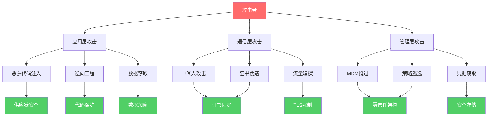
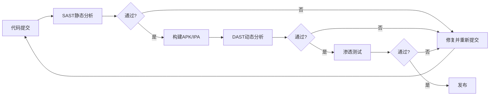
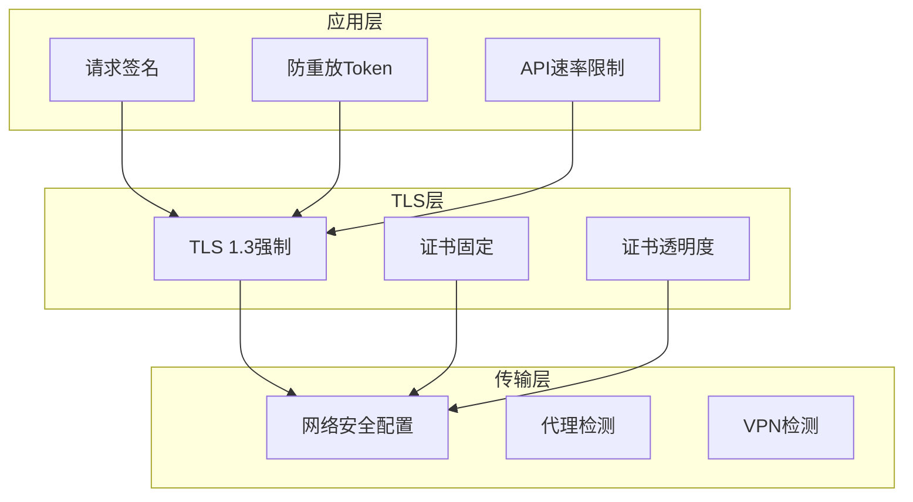
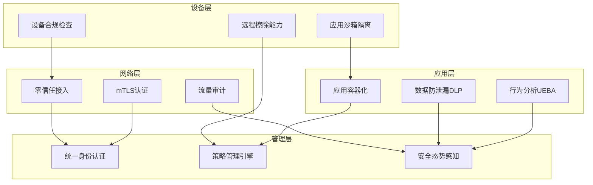
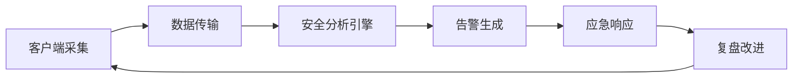

## 综合防御策略

前三个实战案例分别揭示了移动安全领域的三类典型威胁：恶意应用窃取凭据（应用层）、SSL Pinning绕过（通信层）、MDM安全缺陷利用（企业管理层）。这三个案例并非孤立存在——它们分别对应OWASP Mobile Top 10中的数据泄露、不安全通信和不安全的身份认证。真正的安全防御不能头痛医头，必须构建覆盖应用全生命周期的纵深防御体系。

本节从攻防对照出发，系统梳理防御策略的六大维度，每个维度都提供具体的实施方案、代码示例和工具链选择。

### 从攻击链到防御链：攻防映射

理解防御策略的第一步是将攻击者的行动路径映射到对应的防御环节：

| 攻击阶段 | 对应案例 | 防御环节 | 核心目标 |
|----------|---------|---------|---------|
| 应用分发与安装 | 案例一：恶意应用 | 供应链安全 | 阻断恶意代码注入 |
| 静态代码分析 | 案例一/二/三 | 代码保护与混淆 | 提高逆向成本 |
| 动态Hook与调试 | 案例二/三 | 运行时防护 | 检测并阻断Hook |
| 网络中间人攻击 | 案例二：SSL Pinning绕过 | 通信安全 | 确保通道完整性 |
| 配置与凭据窃取 | 案例三：MDM缺陷 | 数据保护 | 最小化泄露面 |
| 权限提升与越权 | 案例三：MDM缺陷 | 访问控制 | 强制权限边界 |



---

### 维度一：应用开发阶段的安全内建

安全不是上线前的检查清单，而是从第一行代码开始的工程实践。案例一中的恶意应用之所以能长期存活，正是因为缺乏开发阶段的安全内建机制。

#### 安全编码规范

安全编码是防御的第一道防线。以下是移动开发中最常见的编码缺陷及其修正方案：

**禁止硬编码敏感信息**——案例三中MDM客户端将auth_token存储在明文SharedPreferences中，这是最典型的安全编码反模式。正确做法是使用平台安全API：

```java
// 错误做法：明文存储
SharedPreferences prefs = context.getSharedPreferences("config", MODE_PRIVATE);
prefs.edit().putString("api_key", "sk-1234567890abcdef").apply();

// 正确做法：使用Android Keystore
public class SecureKeyStorage {
    private static final String KEYSTORE = "AndroidKeyStore";
    private static final String ALIAS = "app_api_key";
    
    public void storeKey(String key) throws Exception {
        KeyStore ks = KeyStore.getInstance(KEYSTORE);
        ks.load(null);
        
        // 生成AES密钥
        KeyGenerator kg = KeyGenerator.getInstance(
            KeyProperties.KEY_ALGORITHM_AES, KEYSTORE);
        kg.init(new KeyGenParameterSpec.Builder(ALIAS,
                KeyProperties.PURPOSE_ENCRYPT | KeyProperties.PURPOSE_DECRYPT)
            .setBlockModes(KeyProperties.BLOCK_MODE_GCM)
            .setEncryptionPaddings(KeyProperties.ENCRYPTION_PADDING_NONE)
            .setUserAuthenticationRequired(true)  // 需要用户认证
            .setUserAuthenticationValidityDurationSeconds(300)
            .build());
        kg.generateKey();
        
        // 使用密钥加密实际数据后存储到SharedPreferences
        Cipher cipher = Cipher.getInstance("AES/GCM/NoPadding");
        cipher.init(Cipher.ENCRYPT_MODE, getKey(ALIAS));
        byte[] encrypted = cipher.doFinal(key.getBytes(StandardCharsets.UTF_8));
        // 存储加密后的数据 + IV
    }
    
    private SecretKey getKey(String alias) throws Exception {
        KeyStore ks = KeyStore.getInstance(KEYSTORE);
        ks.load(null);
        return ((SecretKeyStore) ks).getKey(alias, null);
    }
}
```

iOS平台对应的方案是Keychain Services：

```swift
import Security

func storeInKeychain(key: String, value: String) -> Bool {
    let data = value.data(using: .utf8)!
    
    let query: [String: Any] = [
        kSecClass as String: kSecClassGenericPassword,
        kSecAttrAccount as String: key,
        kSecAttrAccessible as String: kSecAttrAccessibleWhenPasscodeSetThisDeviceOnly,
        kSecValueData as String: data
    ]
    
    // 先删除旧条目
    SecItemDelete(query as CFDictionary)
    
    let status = SecItemAdd(query as CFDictionary, nil)
    return status == errSecSuccess
}

func readFromKeychain(key: String) -> String? {
    let query: [String: Any] = [
        kSecClass as String: kSecClassGenericPassword,
        kSecAttrAccount as String: key,
        kSecReturnData as String: true,
        kSecMatchLimit as String: kSecMatchLimitOne
    ]
    
    var result: AnyObject?
    let status = SecItemCopyMatching(query as CFDictionary, &result)
    
    guard status == errSecSuccess, let data = result as? Data else {
        return nil
    }
    return String(data: data, encoding: .utf8)
}
```

**输入验证与输出编码**——所有来自外部的输入（用户输入、网络响应、Intent参数、Deep Link参数）都必须经过验证：

```kotlin
// Intent参数安全处理
class DeepLinkHandler : Activity() {
    override fun onCreate(savedInstanceState: Bundle?) {
        super.onCreate(savedInstanceState)
        
        val uri = intent.data ?: return
        
        // 1. 验证scheme和host
        if (uri.scheme != "myapp" || uri.host != "trusted.example.com") {
            Log.w("Security", "Invalid deep link: $uri")
            finish()
            return
        }
        
        // 2. 验证参数类型和范围
        val userId = uri.getQueryParameter("user_id")
        if (userId == null || !userId.matches(Regex("^\\d{1,10}$"))) {
            Log.w("Security", "Invalid user_id parameter")
            finish()
            return
        }
        
        // 3. 使用参数化查询防止SQL注入
        val cursor = contentResolver.query(
            Uri.parse("content://com.example/users"),
            arrayOf("name", "email"),
            "user_id = ?",  // 参数化查询
            arrayOf(userId),
            null
        )
    }
}
```

#### 代码混淆与二进制保护

案例二中攻击者能够轻松反编译银行App并定位SSL Pinning代码，说明混淆保护不足。有效的混淆策略需要多层配合：

```groovy
// build.gradle - 多层混淆配置
android {
    buildTypes {
        release {
            minifyEnabled true
            shrinkResources true
            proguardFiles getDefaultProguardFile('proguard-android-optimize.txt'),
                'proguard-rules.pro'
            
            // R8完整模式（比默认模式更激进）
            // proguard-android-optimize.txt 已包含优化规则
        }
    }
}

// proguard-rules.pro
-keepattributes Signature,Exceptions,*Annotation*,InnerClasses
-optimizations !code/simplification/arithmetic

# 保留JNI方法
-keepclasseswithmembernames class * {
    native <methods>;
}

# 混淆所有业务逻辑类
-keep class com.example.app.security.** { *; }  # 安全模块单独处理
-repackageclasses 'a'  # 将所有类压缩到单一包名

# 字符串加密（需要额外工具支持，如DexGuard或自定义Transform）
# 在R8之后额外处理字符串常量
```

对于高安全要求的应用，仅靠ProGuard/R8不够，还需要Native层保护：

```c
// native-security.c - 将关键安全逻辑下沉到NDK
#include <jni.h>
#include <string.h>
#include <android/log.h>

// 反调试：检测tracerpid
static int check_debugger() {
    char line[256];
    FILE *fp = fopen("/proc/self/status", "r");
    if (!fp) return 0;
    
    while (fgets(line, sizeof(line), fp)) {
        if (strncmp(line, "TracerPid:", 10) == 0) {
            int pid = atoi(line + 10);
            fclose(fp);
            return pid != 0;  // 非0表示被调试
        }
    }
    fclose(fp);
    return 0;
}

// 完整性校验
static int verify_integrity(JNIEnv *env, jobject context) {
    // 获取应用签名
    jclass pmClass = (*env)->FindClass(env, "android/content/pm/PackageManager");
    // ... 获取并比对签名哈希
    
    // 校验APK路径
    jclass ctxClass = (*env)->GetObjectClass(env, context);
    jmethodID getPackageCodePath = (*env)->GetMethodID(env, ctxClass,
        "getPackageCodePath", "()Ljava/lang/String;");
    jstring path = (*env)->CallObjectMethod(env, context, getPackageCodePath);
    const char *pathStr = (*env)->GetStringUTFChars(env, path, NULL);
    
    // 计算APK文件哈希并比对预期值
    // ...
    
    return 1;  // 完整性通过
}

JNIEXPORT jboolean JNICALL
Java_com_example_security_NativeVerifier_isSecureEnvironment(
    JNIEnv *env, jobject thiz, jobject context) {
    
    if (check_debugger()) {
        __android_log_print(ANDROID_LOG_WARN, "Security", "Debugger detected");
        return JNI_FALSE;
    }
    
    if (!verify_integrity(env, context)) {
        return JNI_FALSE;
    }
    
    return JNI_TRUE;
}
```

#### 安全测试流程

开发阶段的安全测试应覆盖三个层次，形成完整的质量门禁：



**SAST工具链选择**：

| 工具 | 平台 | 检测能力 | 集成方式 | 许可证 |
|------|------|---------|---------|-------|
| MobSF | Android/iOS | 全面的静态分析 | REST API / Docker | 开源 |
| Semgrep | Android/iOS | 自定义规则的模式匹配 | CI插件 | 开源+商业 |
| QARK | Android | 常见漏洞检测 | CLI | 开源 |
| Checkmarx | Android/iOS | 企业级SAST | IDE/CI集成 | 商业 |
| Fortify | Android/iOS | 深度数据流分析 | CI集成 | 商业 |

**DAST实践**——使用MobSF进行自动化动态分析：

```bash
# 启动MobSF Docker容器
docker run -it -p 8000:8000 opensecurity/mobile-security-framework-mobsf:latest

# 通过API上传并分析APK
curl -X POST http://localhost:8000/api/v1/upload \
    -H "Authorization: <api_key>" \
    -F "file=@app-release.apk"

# 获取扫描报告
curl -X GET http://localhost:8000/api/v1/report_json/<scan_hash> \
    -H "Authorization: <api_key>" | jq '.manifest_analysis, .code_analysis'
```

---

### 维度二：运行时防护体系

运行时防护是针对案例一和案例三中Hook、调试、Root环境的直接对策。其核心思想是：即使应用被逆向，也要让攻击者的每一步操作都有被检测和阻断的风险。

#### 多维度Root/越狱检测

单一检测手段很容易被绕过（案例三中MDM客户端仅依赖一个布尔开关），必须采用多维度交叉验证：

```java
public class ComprehensiveRootDetector {
    
    public enum RootRiskLevel {
        NONE, LOW, MEDIUM, HIGH, CRITICAL
    }
    
    public static class RootCheckResult {
        public RootRiskLevel level;
        public List<String> findings;
        public int score;  // 0-100
        
        public RootCheckResult() {
            this.findings = new ArrayList<>();
            this.score = 0;
        }
    }
    
    public static RootCheckResult performComprehensiveCheck(Context ctx) {
        RootCheckResult result = new RootCheckResult();
        int totalScore = 0;
        
        // 1. 检查su二进制文件（权重：15分）
        String[] suPaths = {
            "/system/bin/su", "/system/xbin/su", "/sbin/su",
            "/data/local/su", "/data/local/bin/su", "/data/local/xbin/su",
            "/system/sd/xbin/su", "/system/bin/failsafe/su",
            "/cache/su", "/data/su", "/dev/su"
        };
        for (String path : suPaths) {
            if (new File(path).exists()) {
                totalScore += 15;
                result.findings.add("su binary found: " + path);
                break;
            }
        }
        
        // 2. 检查Build属性（权重：10分）
        if (Build.TAGS != null && Build.TAGS.contains("test-keys")) {
            totalScore += 10;
            result.findings.add("test-keys build tag detected");
        }
        
        // 3. 检查Root管理应用（权重：20分）
        String[] rootApps = {
            "com.topjohnwu.magisk", "eu.chainfire.supersu",
            "com.koushikdutta.superuser", "com.thirdparty.superuser",
            "com.noshufou.android.su", "com.zachspong.temprootremovejb",
            "com.ramdroid.appquarantine"
        };
        PackageManager pm = ctx.getPackageManager();
        for (String pkg : rootApps) {
            try {
                pm.getPackageInfo(pkg, 0);
                totalScore += 20;
                result.findings.add("Root management app found: " + pkg);
                break;
            } catch (PackageManager.NameNotFoundException ignored) {}
        }
        
        // 4. 检查危险系统属性（权重：10分）
        try {
            Process proc = Runtime.getRuntime().exec(new String[]{
                "/system/bin/getprop", "ro.debuggable"
            });
            BufferedReader reader = new BufferedReader(
                new InputStreamReader(proc.getInputStream()));
            String value = reader.readLine();
            if ("1".equals(value)) {
                totalScore += 10;
                result.findings.add("ro.debuggable=1");
            }
        } catch (Exception ignored) {}
        
        // 5. 检查Magisk痕迹（权重：25分）
        String[] magiskPaths = {
            "/sbin/.magisk", "/data/adb/magisk",
            "/data/adb/modules", "/data/user_de/0/com.topjohnwu.magisk"
        };
        for (String path : magiskPaths) {
            if (new File(path).exists()) {
                totalScore += 25;
                result.findings.add("Magisk artifact found: " + path);
                break;
            }
        }
        
        // 6. SafetyNet/Play Integrity检测（权重：20分）
        // 通过Google Play Integrity API验证设备完整性
        // 注意：这是服务端验证，不能在客户端单独信任
        
        result.score = Math.min(totalScore, 100);
        if (result.score >= 60) result.level = RootRiskLevel.CRITICAL;
        else if (result.score >= 40) result.level = RootRiskLevel.HIGH;
        else if (result.score >= 20) result.level = RootRiskLevel.MEDIUM;
        else if (result.score > 0) result.level = RootRiskLevel.LOW;
        else result.level = RootRiskLevel.NONE;
        
        return result;
    }
}
```

#### 反调试与反Hook保护

案例二和案例三都依赖Frida进行动态分析。检测Frida等Hook框架是运行时防护的关键：

```java
public class AntiTamper {
    
    // 检测Frida
    public static boolean detectFrida() {
        // 方法1：检测Frida默认端口
        try {
            Socket socket = new Socket("127.0.0.1", 27042);
            socket.close();
            return true;
        } catch (Exception ignored) {}
        
        // 方法2：检测Frida相关进程
        try {
            BufferedReader reader = new BufferedReader(
                new FileReader("/proc/self/maps"));
            String line;
            while ((line = reader.readLine()) != null) {
                if (line.contains("frida") || line.contains("gadget")) {
                    reader.close();
                    return true;
                }
            }
            reader.close();
        } catch (Exception ignored) {}
        
        // 方法3：检测/proc/self/status中的线程名
        try {
            Process proc = Runtime.getRuntime().exec(
                new String[]{"ls", "/proc/self/task/"});
            BufferedReader reader = new BufferedReader(
                new InputStreamReader(proc.getInputStream()));
            String line;
            while ((line = reader.readLine()) != null) {
                String commPath = "/proc/self/task/" + line.trim() + "/comm";
                try {
                    BufferedReader commReader = new BufferedReader(
                        new FileReader(commPath));
                    String comm = commReader.readLine();
                    commReader.close();
                    if (comm != null && (comm.contains("gmain") || 
                        comm.contains("gdbus") || comm.contains("gum-js-loop"))) {
                        return true;
                    }
                } catch (Exception ignored) {}
            }
        } catch (Exception ignored) {}
        
        return false;
    }
    
    // Native层反调试（更难被绕过）
    // 在native-lib.c中
    /*
    void anti_debug() {
        // 使用ptrace自跟踪，阻止其他调试器attach
        ptrace(PTRACE_TRACEME, 0, 0, 0);
        
        // 定时检查/proc/self/status
        while (1) {
            FILE *fp = fopen("/proc/self/status", "r");
            if (fp) {
                char line[256];
                while (fgets(line, sizeof(line), fp)) {
                    if (strncmp(line, "TracerPid:", 10) == 0) {
                        int pid = atoi(line + 10);
                        if (pid != 0) {
                            // 被调试，采取防御措施
                            exit(1);
                        }
                    }
                }
                fclose(fp);
            }
            sleep(1);
        }
    }
    */
}
```

#### RASP（运行时应用自我保护）

RASP将上述所有检测能力整合为统一的运行时保护框架：

```java
public class RASPEngine {
    private static RASPEngine instance;
    private Handler handler;
    private boolean isRunning;
    
    public enum ThreatEvent {
        ROOT_DETECTED, DEBUGGER_ATTACHED, HOOK_FRAMEWORK_DETECTED,
        APP_TAMPERED, EMULATOR_DETECTED, MEMORY_INJECTION,
        CERTIFICATE_MISMATCH, SIGNATURE_INVALID
    }
    
    public interface ThreatListener {
        void onThreatDetected(ThreatEvent event, Map<String, Object> details);
    }
    
    private List<ThreatListener> listeners = new ArrayList<>();
    
    public void startProtection(Context context) {
        isRunning = true;
        handler = new Handler(Looper.getMainLooper());
        
        // 定时巡检（每30秒）
        Runnable checker = new Runnable() {
            @Override
            public void run() {
                if (!isRunning) return;
                
                Map<String, Object> details = new HashMap<>();
                
                // 综合检测
                if (AntiTamper.detectFrida()) {
                    details.put("framework", "Frida");
                    notifyListeners(ThreatEvent.HOOK_FRAMEWORK_DETECTED, details);
                }
                
                RootCheckResult rootResult = RootCheckDetector.performComprehensiveCheck(context);
                if (rootResult.level.ordinal() >= RootRiskLevel.MEDIUM.ordinal()) {
                    details.put("risk_level", rootResult.level);
                    details.put("findings", rootResult.findings);
                    notifyListeners(ThreatEvent.ROOT_DETECTED, details);
                }
                
                if (!verifyAppSignature(context)) {
                    notifyListeners(ThreatEvent.SIGNATURE_INVALID, details);
                }
                
                handler.postDelayed(this, 30000);
            }
        };
        handler.post(checker);
    }
    
    private void notifyListeners(ThreatEvent event, Map<String, Object> details) {
        for (ThreatListener listener : listeners) {
            listener.onThreatDetected(event, details);
        }
    }
    
    // 根据威胁等级采取不同响应策略
    public void handleThreat(ThreatEvent event, Map<String, Object> details) {
        switch (event) {
            case ROOT_DETECTED:
                // 降级处理：限制功能，记录日志
                restrictSensitiveFeatures();
                reportToServer(event, details);
                break;
            case HOOK_FRAMEWORK_DETECTED:
            case DEBUGGER_ATTACHED:
                // 中等响应：清除敏感数据，终止会话
                clearSensitiveData();
                forceLogout();
                reportToServer(event, details);
                break;
            case APP_TAMPERED:
            case SIGNATURE_INVALID:
                // 最高响应：立即终止
                reportToServer(event, details);
                System.exit(0);
                break;
        }
    }
}
```

---

### 维度三：网络通信安全

案例二的核心问题是SSL Pinning实现不完善。通信安全不仅是"用HTTPS"那么简单，需要从协议层到应用层的完整保护。

#### 分层通信安全架构



#### 证书固定最佳实践

案例二中银行App虽然实现了证书固定，但实现方式存在缺陷。以下是生产级的证书固定方案：

**方案一：Network Security Config（Android推荐）**

```xml
<!-- res/xml/network_security_config.xml -->
<?xml version="1.0" encoding="utf-8"?>
<network-security-config>
    <!-- 禁止明文流量 -->
    <base-config cleartextTrafficPermitted="false">
        <trust-anchors>
            <certificates src="system" />
        </trust-anchors>
    </base-config>
    
    <!-- 针对API域名实施证书固定 -->
    <domain-config>
        <domain includeSubdomains="true">api.example.com</domain>
        <pin-set expiration="2027-01-01">
            <!-- 主证书公钥哈希 -->
            <pin digest="SHA-256">AAAAAAAAAAAAAAAAAAAAAAAAAAAAAAAAAAAAAAAAAAA=</pin>
            <!-- 备用证书公钥哈希（证书轮换用） -->
            <pin digest="SHA-256">BBBBBBBBBBBBBBBBBBBBBBBBBBBBBBBBBBBBBBBBBBB=</pin>
            <!-- 备份CA证书公钥哈希 -->
            <pin digest="SHA-256">CCCCCCCCCCCCCCCCCCCCCCCCCCCCCCCCCCCCCCCCCCC=</pin>
        </pin-set>
        <trust-anchors>
            <certificates src="system" />
        </trust-anchors>
    </domain-config>
</network-security-config>
```

**方案二：OkHttp CertificatePinner（编程方式）**

```kotlin
// 证书固定配置 - 带证书轮换支持
object NetworkSecurityConfig {
    
    // 证书指纹通过后端接口动态获取，本地缓存
    private val certificatePinner: CertificatePinner by lazy {
        CertificatePinner.Builder()
            .add("api.example.com",
                "sha256/AAAAAAAAAAAAAAAAAAAAAAAAAAAAAAAAAAAAAAAAAAA=")  // 当前证书
            .add("api.example.com",
                "sha256/BBBBBBBBBBBBBBBBBBBBBBBBBBBBBBBBBBBBBBBBBBB=")  // 备用证书
            .build()
    }
    
    val okHttpClient: OkHttpClient by lazy {
        OkHttpClient.Builder()
            .certificatePinner(certificatePinner)
            // 自定义TrustManager作为第二层验证
            .sslSocketFactory(createSSLSocketFactory(), createTrustManager())
            // 禁止连接到非预期的主机名
            .hostnameVerifier { hostname, session ->
                hostname == "api.example.com" || 
                hostname.endsWith(".example.com")
            }
            // 超时设置
            .connectTimeout(15, TimeUnit.SECONDS)
            .readTimeout(15, TimeUnit.SECONDS)
            // 拦截器：添加请求签名
            .addInterceptor(SignatureInterceptor())
            // 拦截器：防重放
            .addInterceptor(ReplayProtectionInterceptor())
            .build()
    }
    
    // 双向证书验证（mTLS）
    private fun createSSLSocketFactory(): SSLSocketFactory {
        val kmf = KeyManagerFactory.getInstance(KeyManagerFactory.getDefaultAlgorithm())
        // 加载客户端证书（用于双向认证）
        val keyStore = KeyStore.getInstance("PKCS12")
        keyStore.load(App.context.assets.open("client.p12"), 
            "certificate_password".toCharArray())
        kmf.init(keyStore, "key_password".toCharArray())
        
        val sslContext = SSLContext.getInstance("TLSv1.3")
        sslContext.init(kmf.keyManagers, arrayOf(createTrustManager()), null)
        return sslContext.socketFactory
    }
}
```

#### 请求签名与防重放

仅靠TLS保护不够——即使通道安全，攻击者仍可能截获并重放请求。请求签名机制确保每个请求的完整性和时效性：

```kotlin
class SignatureInterceptor : Interceptor {
    companion object {
        private const val APP_SECRET = "stored_in_keystore"  // 从Keystore获取
        private const val SIGNATURE_VALIDITY_MS = 300_000L   // 5分钟有效
    }
    
    override fun intercept(chain: Interceptor.Chain): Response {
        val original = chain.request()
        
        // 1. 生成时间戳和Nonce
        val timestamp = System.currentTimeMillis().toString()
        val nonce = UUID.randomUUID().toString()
        
        // 2. 构造签名字符串
        val method = original.method
        val path = original.url.encodedPath
        val bodyHash = if (original.body != null) {
            hashBody(original.body!!)
        } else {
            ""
        }
        val signString = "$method\n$path\n$timestamp\n$nonce\n$bodyHash"
        
        // 3. HMAC-SHA256签名
        val signature = hmacSha256(APP_SECRET, signString)
        
        // 4. 添加签名头
        val signedRequest = original.newBuilder()
            .addHeader("X-Timestamp", timestamp)
            .addHeader("X-Nonce", nonce)
            .addHeader("X-Signature", signature)
            .addHeader("X-App-Version", BuildConfig.VERSION_NAME)
            .build()
        
        return chain.proceed(signedRequest)
    }
    
    private fun hmacSha256(key: String, data: String): String {
        val mac = Mac.getInstance("HmacSHA256")
        mac.init(SecretKeySpec(key.toByteArray(), "HmacSHA256"))
        return Base64.encodeToString(mac.doFinal(data.toByteArray()), Base64.NO_WRAP)
    }
    
    private fun hashBody(body: RequestBody): String {
        val buffer = okio.Buffer()
        body.writeTo(buffer)
        val md = MessageDigest.getInstance("SHA-256")
        return Base64.encodeToString(md.digest(buffer.readByteArray()), Base64.NO_WRAP)
    }
}
```

服务端验证逻辑（防止重放攻击）：

```python
# 服务端签名验证（Python示例）
import hmac
import hashlib
import time
import redis

redis_client = redis.Redis(host='localhost', port=6379, db=0)

def verify_request(request):
    timestamp = request.headers.get('X-Timestamp')
    nonce = request.headers.get('X-Nonce')
    signature = request.headers.get('X-Signature')
    
    # 1. 时间戳校验（防过期请求）
    try:
        request_time = int(timestamp)
        if abs(time.time() * 1000 - request_time) > 300_000:  # 5分钟窗口
            return False, "Request expired"
    except (ValueError, TypeError):
        return False, "Invalid timestamp"
    
    # 2. Nonce唯一性校验（防重放）
    nonce_key = f"nonce:{nonce}"
    if redis_client.exists(nonce_key):
        return False, "Replay attack detected"
    redis_client.setex(nonce_key, 600, "1")  # 10分钟过期
    
    # 3. 签名校验
    sign_string = f"{request.method}\n{request.path}\n{timestamp}\n{nonce}\n{body_hash}"
    expected_sig = hmac.new(
        APP_SECRET.encode(), sign_string.encode(), hashlib.sha256
    ).digest()
    
    if not hmac.compare_digest(signature, base64.b64encode(expected_sig)):
        return False, "Invalid signature"
    
    return True, "OK"
```

---

### 维度四：数据保护全生命周期

案例三暴露了MDM配置数据明文存储的问题。数据保护需要覆盖数据的产生、存储、传输、使用、销毁全生命周期。

#### 敏感数据分类与保护策略

| 数据类别 | 示例 | 存储方式 | 传输要求 | 生命周期 |
|---------|------|---------|---------|---------|
| 高敏感 | 密码、密钥、Token | Android Keystore / iOS Keychain | 仅内存，不落盘 | 会话级 |
| 中敏感 | 用户PII、支付信息 | 加密SQLite / EncryptedSharedPreferences | TLS + 签名 | 业务需要 |
| 低敏感 | 配置信息、缓存 | 普通存储（防篡改校验） | TLS | 应用生命周期 |
| 临时数据 | 日志、临时文件 | 应用私有目录 | TLS | 操作后立即清除 |

#### 安全存储实现

```kotlin
// 基于Jetpack Security的安全存储封装
class SecureStorage(context: Context) {
    
    private val masterKey = MasterKey.Builder(context)
        .setKeyScheme(MasterKey.KeyScheme.AES256_GCM)
        .build()
    
    // 安全的SharedPreferences
    private val securePrefs = EncryptedSharedPreferences.create(
        context,
        "secure_prefs",
        masterKey,
        EncryptedSharedPreferences.PrefKeyEncryptionScheme.AES256_SIV,
        EncryptedSharedPreferences.PrefValueEncryptionScheme.AES256_GCM
    )
    
    // 安全的数据库
    private val secureDb = SecureDatabaseHelper(context).writableDatabase
    
    fun storeToken(token: String) {
        securePrefs.edit().putString("auth_token", token).apply()
    }
    
    fun storeUserData(userId: String, data: Map<String, String>) {
        // 使用SQLCipher加密数据库
        secureDb.execSQL(
            "INSERT OR REPLACE INTO user_data (user_id, key, value) VALUES (?, ?, ?)",
            arrayOf(userId, "profile", encrypt(data.toString()))
        )
    }
    
    // 数据清除：退出登录时彻底清除
    fun secureClear() {
        // 清除SharedPreferences
        securePrefs.edit().clear().commit()
        
        // 清除数据库
        secureDb.execSQL("DELETE FROM user_data")
        secureDb.execSQL("VACUUM")
        
        // 覆写临时文件（防止数据恢复）
        val cacheDir = App.context.cacheDir
        cacheDir.listFiles()?.forEach { file ->
            if (file.isFile) {
                secureDeleteFile(file)
            }
        }
    }
    
    private fun secureDeleteFile(file: File) {
        val random = SecureRandom()
        val buffer = ByteArray(4096)
        
        // 三次覆写（DoD 5220.22-M标准简化版）
        repeat(3) {
            random.nextBytes(buffer)
            FileOutputStream(file).use { fos ->
                var remaining = file.length()
                while (remaining > 0) {
                    val toWrite = minOf(buffer.size.toLong(), remaining).toInt()
                    fos.write(buffer, 0, toWrite)
                    remaining -= toWrite
                }
                fos.fd.sync()
            }
        }
        file.delete()
    }
}
```

#### 剪贴板与截图防护

敏感数据经常通过剪贴板和截图泄露，这两个渠道容易被忽视：

```kotlin
class SensitiveScreenActivity : AppCompatActivity() {
    
    override fun onCreate(savedInstanceState: Bundle?) {
        super.onCreate(savedInstanceState)
        
        // 禁止截屏和录屏
        window.setFlags(
            WindowManager.LayoutParams.FLAG_SECURE,
            WindowManager.LayoutParams.FLAG_SECURE
        )
    }
    
    // 剪贴板安全处理
    fun copyToClipboardSecurely(text: String, label: String) {
        val clipboard = getSystemService(Context.CLIPBOARD_SERVICE) as ClipboardManager
        
        // 设置为敏感内容（Android 13+）
        val clip = ClipData.newPlainText(label, text).apply {
            description.extras = PersistableBundle().apply {
                putBoolean(ClipDescription.EXTRA_IS_SENSITIVE, true)
            }
        }
        clipboard.setPrimaryClip(clip)
        
        // 30秒后自动清除剪贴板
        Handler(Looper.getMainLooper()).postDelayed({
            if (Build.VERSION.SDK_INT >= Build.VERSION_CODES.P) {
                clipboard.clearPrimaryClip()
            } else {
                clipboard.setPrimaryClip(ClipData.newPlainText("", ""))
            }
        }, 30_000)
    }
}
```

---

### 维度五：企业移动安全管理

案例三揭示了MDM方案的安全缺陷。企业移动安全不能仅依赖MDM，需要构建零信任架构。

#### 企业移动安全架构



#### MDM客户端安全加固

针对案例三中发现的MDM客户端缺陷，以下是加固方案：

```java
public class SecureMDMClient {
    
    // 1. 配置加密存储（而非明文SharedPreferences）
    public void storeMDMConfig(MDMConfig config) {
        // 使用Android Keystore加密配置
        String encryptedConfig = encryptWithKeystore(config.toJson());
        
        // 存储到EncryptedSharedPreferences
        EncryptedSharedPreferences prefs = EncryptedSharedPreferences.create(
            context, "mdm_secure_config", masterKey,
            PrefKeyEncryptionScheme.AES256_SIV,
            PrefValueEncryptionScheme.AES256_GCM
        );
        prefs.edit()
            .putString("encrypted_config", encryptedConfig)
            .putLong("config_timestamp", System.currentTimeMillis())
            .apply();
    }
    
    // 2. Auth Token绑定设备指纹（防止Token被盗用）
    public String getBoundAuthToken() {
        String token = getStoredToken();
        String deviceFingerprint = getDeviceFingerprint();
        
        // Token = 原始Token + 设备指纹的HMAC
        // 服务端验证时会检查设备指纹是否匹配
        return token + "." + hmacSha256(token, deviceFingerprint);
    }
    
    private String getDeviceFingerprint() {
        // 多维度设备指纹，难以伪造
        StringBuilder sb = new StringBuilder();
        sb.append(Build.BOARD);
        sb.append(Build.BRAND);
        sb.append(Build.DEVICE);
        sb.append(Build.HARDWARE);
        sb.append(Build.MANUFACTURER);
        sb.append(Build.MODEL);
        sb.append(Build.SERIAL);
        // 加入不可变的硬件标识
        sb.append(Settings.Secure.getString(
            context.getContentResolver(), Settings.Secure.ANDROID_ID));
        
        return sha256(sb.toString());
    }
    
    // 3. Root检测不可被简单Hook绕过
    public boolean isDeviceSecure() {
        // 混合Java层和Native层检测
        boolean javaCheck = performJavaRootCheck();
        boolean nativeCheck = NativeRootChecker.check();  // JNI调用
        boolean serverCheck = requestServerValidation();   // 服务端辅助验证
        
        // 三层检测中至少两层通过才认为安全
        int passed = (javaCheck ? 1 : 0) + (nativeCheck ? 1 : 0) + (serverCheck ? 1 : 0);
        return passed >= 2;
    }
    
    // 4. 策略执行完整性保护
    public boolean enforcePolicy(Policy policy) {
        // 策略执行结果需要签名上报，防止客户端篡改
        String policyResult = executePolicy(policy);
        String signature = signWithDeviceKey(policyResult);
        
        // 服务端验证签名
        return reportPolicyResult(policyResult, signature);
    }
}
```

---

### 维度六：安全监控与应急响应

防御不可能100%有效。当攻击发生时，快速检测和响应能力决定了损失大小。

#### 安全事件监控体系



客户端安全事件上报：

```kotlin
class SecurityEventReporter(private val context: Context) {
    
    enum class EventType {
        ROOT_DETECTED, HOOK_DETECTED, DEBUGGER_ATTACHED,
        TAMPER_DETECTED, SSL_ERROR, CERT_MISMATCH,
        ABNORMAL_API_CALL, DATA_EXFILTRATION_ATTEMPT,
        EMULATOR_DETECTED, DOWNGRADE_ATTACK
    }
    
    data class SecurityEvent(
        val type: EventType,
        val severity: Int,          // 1-5
        val timestamp: Long,
        val deviceInfo: Map<String, String>,
        val details: Map<String, Any>,
        val stackTrace: String? = null
    )
    
    fun reportEvent(event: SecurityEvent) {
        // 本地加密存储（防止被清除）
        storeLocally(event)
        
        // 立即上报（高优先级事件）
        if (event.severity >= 3) {
            CoroutineScope(Dispatchers.IO).launch {
                try {
                    sendToServer(event)
                } catch (e: Exception) {
                    // 网络不可用时加入队列，下次重试
                    enqueueForRetry(event)
                }
            }
        }
        
        // 触发本地防御措施
        if (event.severity >= 4) {
            triggerLocalDefense(event)
        }
    }
    
    private fun triggerLocalDefense(event: SecurityEvent) {
        when (event.type) {
            EventType.TAMPER_DETECTED -> {
                // 应用被篡改：清除所有敏感数据
                SecureStorage(context).secureClear()
                // 阻止后续操作
                ForceStopHelper.forceStop()
            }
            EventType.HOOK_DETECTED -> {
                // Hook检测：清除会话，要求重新认证
                SessionManager.invalidate()
            }
            EventType.DATA_EXFILTRATION_ATTEMPT -> {
                // 数据外泄尝试：断开网络，锁定应用
                NetworkHelper.disableNetwork()
                AppLock.lock()
            }
            else -> {
                // 其他事件：记录并限制敏感功能
                FeatureRestriction.applyRestrictions()
            }
        }
    }
}
```

#### 应急响应流程

当检测到安全事件时，按以下流程执行：

| 响应等级 | 触发条件 | 客户端动作 | 服务端动作 | 通知范围 |
|---------|---------|-----------|-----------|---------|
| P0-紧急 | 应用被篡改、数据大规模外泄 | 清除数据并退出 | 封禁账号、溯源分析 | 安全团队+管理层 |
| P1-严重 | Root设备执行敏感操作、检测到Hook | 终止当前会话 | 强制重新认证、审计日志 | 安全团队 |
| P2-警告 | 异常API调用模式、证书告警 | 记录并上报 | 标记风险、加强监控 | 安全运营 |
| P3-信息 | 模拟器环境、低版本系统 | 静默记录 | 统计分析 | 无需通知 |

---

### 纵深防御体系总结

以上六个维度不是独立的，它们共同构成纵深防御体系。攻击者必须同时突破所有层次才能达成目标，这大幅提高了攻击成本。

**防御层次对照表——从三个案例出发**：

| 案例 | 暴露的薄弱环节 | 需要加固的防御维度 | 优先级 |
|------|--------------|------------------|-------|
| 案例一：恶意应用窃取凭据 | 缺乏运行时保护、数据明文存储 | 运行时防护 + 数据保护 | 高 |
| 案例二：SSL Pinning绕过 | Pinning实现单一、无多层验证 | 通信安全 + 代码保护 | 高 |
| 案例三：MDM缺陷利用 | 配置明文、Root检测可旁路 | 企业安全管理 + 运行时防护 | 紧急 |

**投入产出比建议**——不同安全投入的防御效果：

| 安全措施 | 实施成本 | 防御效果 | 建议优先级 |
|---------|---------|---------|----------|
| HTTPS + Network Security Config | 低 | 阻断大部分中间人攻击 | 最高 |
| EncryptedSharedPreferences | 低 | 防止明文数据泄露 | 最高 |
| 代码混淆（R8） | 低 | 提高逆向门槛 | 高 |
| 证书固定 | 中 | 防止高级中间人攻击 | 高 |
| Root/越狱检测 | 中 | 增加攻击者环境准备成本 | 高 |
| RASP运行时保护 | 高 | 实时检测并阻断攻击 | 中 |
| Native层保护 | 高 | 大幅增加逆向难度 | 中 |
| 完整的RASP + 行为分析 | 很高 | 接近全面防护 | 视业务需要 |

安全是一个持续的过程，而非一次性工程。每次安全事件都是改进防御体系的机会——分析根因、修补漏洞、更新检测规则、验证修复效果，这个循环永不停歇。

> **关键原则**：不要试图构建"不可攻破"的系统，那是不可能的。目标是让攻击成本远高于攻击收益，同时确保在攻击发生时能够快速检测和响应。安全防御的本质是经济学——提高攻击者的成本，降低防御者的损失。
