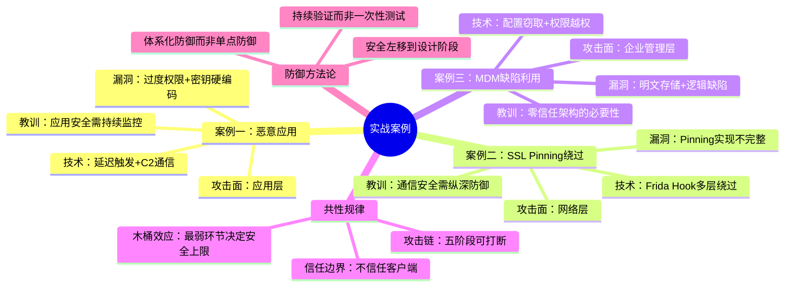

## 本节小结

本节通过三个覆盖不同攻击面的真实案例——恶意应用窃取凭据、银行App SSL Pinning绕过、企业MDM方案安全缺陷利用——完整展示了移动安全攻防的核心图景。本小结不再重复案例细节，而是从更高视角提炼跨案例的共性规律、攻击者思维模型和防御体系化方法论。

### 三个案例的核心信息回顾

在深入分析之前，先用一张表将三个案例的关键要素做对比梳理：

| 维度 | 案例一：恶意应用窃取凭据 | 案例二：SSL Pinning绕过 | 案例三：MDM安全缺陷 |
|------|--------------------------|------------------------|---------------------|
| 攻击面 | 应用层（恶意代码植入） | 网络层（通信加密保护） | 企业管理层（设备策略执行） |
| 核心技术 | 延迟触发 + C2多层通信 | Frida Hook + 多机制绕过 | 配置窃取 + 权限越权 |
| 攻击目标 | 用户隐私数据（通讯录、短信） | 金融API通信（交易数据） | 企业管理权限（设备控制权） |
| 漏洞根源 | 过度权限 + 密钥硬编码 | Pinning实现不完整 | 明文存储 + 逻辑校验缺失 |
| 影响范围 | 单个用户 | 所有App用户 | 全企业设备 |
| 攻击者技能要求 | 中等（修改现有应用） | 较高（逆向+Hook编程） | 高（多系统联合攻击） |
| 防御难度 | 低→中（规范可解决） | 中→高（需要体系化方案） | 高（需要架构级设计） |

### 跨案例共性规律提炼

#### 规律一：防御的木桶效应

三个案例无一例外地暴露了"木桶效应"——系统的安全强度取决于最薄弱的环节，而非最强的防线。

案例一中，应用商店有审核机制，但恶意代码通过延迟触发绕过了动态检测。案例二中，银行实施了多层SSL Pinning（OkHttp CertificatePinner + 自定义TrustManager + WebViewClient），但每一层都可以被Frida独立Hook绕过——防御层数虽多，但缺乏层间联动。案例三中，MDM客户端有Root检测和合规检查，但管理控制台的水平越权漏洞让客户端层面的所有防护形同虚设。

这个规律的工程含义是：安全评估不能只看"有没有某个功能"，必须验证"从攻击者视角能否绕过每个环节"。渗透测试的价值恰恰在于用攻击者思维验证防御的实际效果，而非停留在合规清单的勾选。

#### 规律二：信任边界模糊是根源

三个案例的本质问题都是**信任边界定义不清**：

- 案例一：应用商店信任了"静态扫描无恶意特征"的应用，没有持续监控运行时行为
- 案例二：服务端信任了"客户端声称的证书验证结果"，没有独立验证通信通道的完整性
- 案例三：MDM服务端信任了"客户端报告的设备状态"，没有采用零信任校验机制

信任边界的设计原则可以归纳为：

```text
不信任客户端 → 不信任单层验证 → 不信任静态检查 → 不信任一次性验证
```

每一条不信任原则对应一类防御策略：

| 不信任原则 | 对应防御策略 | 对应案例 |
|-----------|-------------|---------|
| 不信任客户端 | 服务端独立验证，不依赖客户端报告 | 案例二、三 |
| 不信任单层验证 | 多层独立验证 + 层间交叉校验 | 案例二 |
| 不信任静态检查 | 运行时行为监控 + 动态分析 | 案例一 |
| 不信任一次性验证 | 持续认证 + 会话行为分析 | 案例三 |

#### 规律三：攻击链的共性结构

尽管三个案例的技术细节不同，但攻击链都遵循相同的五阶段结构：


各案例的阶段映射：

| 阶段 | 案例一 | 案例二 | 案例三 |
|------|--------|--------|--------|
| 侦察 | 分析应用市场热门App | 识别目标银行App版本 | 枚举MDM方案供应商 |
| 初始突破 | 注入恶意代码到正常App | 安装mitmproxy CA证书 | 反编译MDM客户端APK |
| 权限提升 | 请求敏感权限（通讯录/短信） | Hook绕过多种Pinning机制 | 窃取管理Token + 绕过Root检测 |
| 目标达成 | C2外传用户数据 | 拦截并篡改API通信 | 获取全部设备管理权限 |
| 持久化 | START_STICKY + 开机自启 | 持续Hook维持绕过状态 | 利用30天会话Token持久访问 |

理解这个结构的价值在于：防御者可以在每个阶段设置检测点和阻断点。如果攻击链在任何一个阶段被打断，后续攻击就无法完成。这就是"纵深防御"的核心逻辑——不是期望某一层完美无缺，而是确保攻击者必须同时突破所有层才能成功。

### 攻击者思维模型

要真正理解移动安全防御，必须学会用攻击者的方式思考。以下是三个案例中攻击者使用的决策框架：

#### 攻击面枚举清单

攻击者在评估一个移动应用目标时，会系统性地枚举以下攻击面：

**应用本体**
- APK/IPA包结构（资源文件、Manifest配置、签名信息）
- 代码逻辑（业务逻辑漏洞、硬编码密钥、不安全的加密实现）
- 数据存储（SharedPreferences、SQLite、文件系统、日志输出）
- 组件暴露（Exported Activity/Service/Content Provider）

**通信通道**
- 网络协议（HTTP/HTTPS/WebSocket/自定义协议）
- 证书验证（无验证/部分验证/完整Pinning）
- API设计（认证方式、参数校验、速率限制）
- 数据格式（明文/加密/编码/序列化方式）

**运行环境**
- 操作系统版本（已知漏洞利用）
- 设备状态（Root/越狱/模拟器/调试器）
- 安装来源（官方商店/第三方/企业分发）
- 已安装应用（竞品/安全工具/Hook框架）

**管理后台**
- 认证机制（密码策略/MFA/会话管理）
- 授权模型（RBAC粒度/API权限范围）
- 运维接口（调试端口/管理API/日志系统）

#### 攻击成本-收益决策

攻击者并非对所有目标一视同仁。他们会评估投入产出比：

```text
攻击价值 = 目标数据价值 × 成功概率 / (技术难度 × 时间成本 × 被发现风险)
```

- 案例一（恶意应用）：技术难度低，可批量分发，被发现风险低→高ROI
- 案例二（SSL Pinning绕过）：技术难度中等，目标明确（银行用户）→中等ROI
- 案例三（MDM攻击）：技术难度高，但一旦成功控制全企业设备→极高ROI

这个模型对防御者的启示是：不要平均分配安全资源，而要根据自身资产价值和攻击者可能的ROI来确定防御优先级。

### 防御体系化方法论

#### 从单点防御到体系防御

三个案例共同暴露的问题是：防御措施往往是零散的、局部的。有效的移动安全防御必须是一个体系，而非一系列独立的措施。


#### 各防御层的具体实施要点

以下将三个案例中暴露的防御缺失，转化为可执行的防御检查清单：

**应用开发阶段**

| 防御措施 | 对应案例教训 | 验证方法 |
|---------|------------|---------|
| 权限最小化：只申请业务必需的权限 | 案例一：清理App申请通讯录/短信权限 | 检查Manifest权限声明与功能的对应关系 |
| 密钥管理：使用Android Keystore/iOS Keychain | 案例一：加密密钥硬编码在代码中 | grep搜索常见密钥模式，检查密钥轮换机制 |
| 代码混淆：ProGuard/R8 + Native层保护 | 案例三：反编译直接获取业务逻辑 | 反编译后检查类名/方法名可读性 |
| 安全存储：敏感配置加密存储 | 案例三：MDM配置明文存储在SharedPreferences | 检查/data/data/目录下的文件内容 |

**网络通信阶段**

| 防御措施 | 对应案例教训 | 验证方法 |
|---------|------------|---------|
| 证书固定：多层实现（Native + Java层） | 案例二：仅Java层实现易被Hook绕过 | 用mitmproxy测试是否可拦截通信 |
| 双向TLS：客户端证书 + 服务端证书 | 案例二：单向验证可被中间人攻击 | 移除客户端证书后测试连接是否被拒绝 |
| 请求签名：关键操作附带请求签名 | 案例二：API请求可被篡改重放 | 拦截请求后修改参数，观察服务端是否拒绝 |
| 传输加密：对敏感字段额外加密 | 案例二：依赖TLS但可被绕过 | 抓包后检查报文体是否仍为密文 |

**运行时防护阶段**

| 防御措施 | 对应案例教训 | 验证方法 |
|---------|------------|---------|
| Root/越狱检测：多维度检测+服务端验证 | 案例三：客户端检测被Hook绕过 | 在Root设备上测试管理功能是否可用 |
| 反调试检测：检测ptrace/Frida/Xposed | 案例二：无反调试保护，Frida自由Hook | 使用Frida注入测试是否触发检测 |
| 应用完整性校验：签名+文件哈希 | 案例一：恶意代码可注入正常App | 篡改APK后测试是否被识别 |
| RASP：运行时应用自我保护 | 案例一：无运行时行为监控 | 异常API调用序列是否触发告警 |

**企业管理阶段**

| 防御措施 | 对应案例教训 | 验证方法 |
|---------|------------|---------|
| 零信任架构：不信任客户端报告 | 案例三：服务端信任客户端设备状态 | 篡改客户端报告后检查服务端行为 |
| RBAC：严格的角色访问控制 | 案例三：水平越权查看其他设备 | 使用低权限Token访问高权限接口 |
| 会话管理：短有效期 + 操作级授权 | 案例三：30天会话Token | 测试Token过期/刷新/并发登录行为 |
| 审计日志：全操作可追溯 | 案例三：越权操作无审计记录 | 执行敏感操作后检查是否有日志记录 |

### 移动安全能力成熟度模型

根据三个案例反映的防御水平差异，可以将组织的移动安全能力划分为五个成熟度等级：

| 等级 | 名称 | 特征 | 对应案例中的表现 |
|------|------|------|----------------|
| L1 | 无意识 | 没有专门的移动安全措施 | 案例一中的第三方应用市场 |
| L2 | 合规驱动 | 满足基本合规要求，但无深度防御 | 案例一中的应用商店静态审核 |
| L3 | 技术防御 | 实施了专项技术措施，但存在绕过可能 | 案例二中的SSL Pinning实现 |
| L4 | 体系防御 | 纵深防御 + 持续监控 + 应急响应 | 案例三中MDM应有的水平 |
| L5 | 自适应 | 威胁情报驱动 + 自动化响应 + 持续改进 | 三个案例中均未达到 |

大多数组织处于L2到L3之间。从L3到L4的跃迁是最大的瓶颈，因为它要求从"技术点"思维转变为"体系面"思维——不再追求某个单一措施的完美，而是确保所有措施形成相互支撑的网络。

### 实战中的常见思维陷阱

在分析三个案例的过程中，以下思维陷阱值得特别警惕：

**陷阱一："我们有SSL Pinning，所以通信是安全的"**

案例二已经证明，SSL Pinning只是增加了攻击成本，并非不可绕过。正确的认知应该是：SSL Pinning是纵深防御的一层，需要配合请求签名、双向TLS、设备完整性检测等措施共同使用。

**陷阱二："Root检测通过了，设备就是可信的"**

案例三证明，客户端的任何检测都可以被Hook绕过。正确的做法是：客户端检测只是第一道防线，关键决策必须由服务端基于多维度信号独立做出。

**陷阱三："应用通过了应用商店审核，所以是安全的"**

案例一证明，静态审核无法发现延迟触发的恶意行为。应用安全是一个持续过程，不能依赖一次性审核。

**陷阱四："我们使用了加密，所以数据是安全的"**

案例一中密钥硬编码、案例二中TLS被绕过，都说明加密的效果取决于密钥管理和通信通道保护。加密是必要条件，但远非充分条件。

**陷阱五："安全是开发完成后加上去的"**

三个案例中暴露的很多问题（过度权限、硬编码密钥、缺少服务端验证）都是架构设计阶段就应解决的。安全必须在需求和设计阶段就融入，而非开发完成后的"加固"。

### 从案例到实践的行动建议

基于三个案例的综合分析，以下行动建议按照优先级排列，帮助团队从当前状态出发逐步提升移动安全水平：

**立即行动（1-2周内）**

1. 审查现有应用的权限声明，移除与业务无关的敏感权限
2. 扫描代码中的硬编码密钥和凭据，迁移到安全存储方案
3. 确认所有API接口都有服务端侧的身份验证和参数校验
4. 检查管理后台的访问控制，验证是否存在越权访问

**短期改进（1-3个月内）**

5. 实施证书固定，并在Native层和Java层双重实现
6. 集成Root/越狱检测和反调试保护
7. 建立移动应用安全测试流程（至少包含SAST和渗透测试）
8. 制定安全事件响应预案，明确移动安全事件的处理流程

**中期建设（3-6个月内）**

9. 实施完整的移动安全开发生命周期（MSDL）
10. 建设自动化安全扫描流水线（CI/CD集成）
11. 部署运行时应用自我保护（RASP）能力
12. 建立移动安全监控和威胁情报体系

**长期演进（持续进行）**

13. 定期红蓝对抗演练，验证防御体系的实际效果
14. 跟踪移动安全威胁趋势，更新防御策略
15. 建设安全能力平台化，将安全措施标准化和可复用
16. 培养团队的安全意识和安全工程能力

### 本节知识图谱



本节的三个案例共同指向一个核心结论：**移动安全是一个系统性工程，不存在银弹式的单一解决方案**。只有将安全融入开发全流程，构建纵深防御体系，并持续验证和改进，才能有效应对不断演进的移动安全威胁。下一节将讨论移动安全领域常见的认知误区和错误观念，帮助读者识别和纠正那些"看似正确实则有害"的安全观念。
