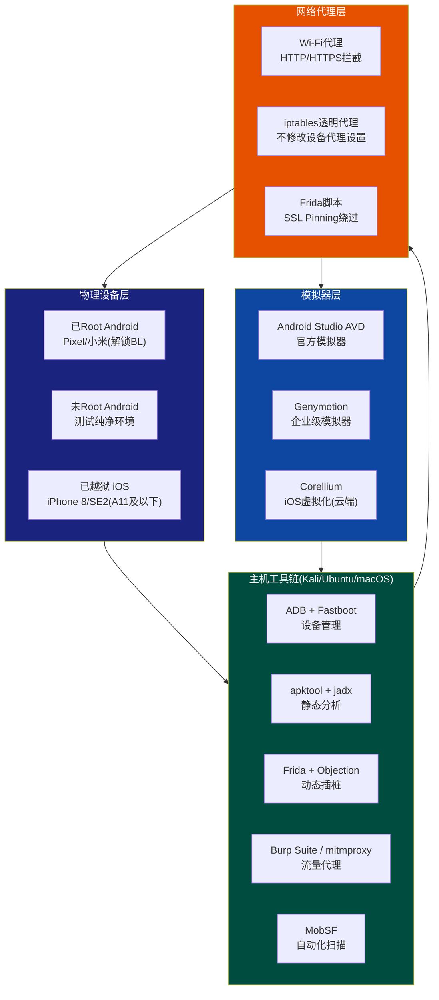

## 18.7 移动安全测试环境搭建

> 工欲善其事，必先利其器。移动安全测试的第一步不是写Frida脚本或逆向APK，而是搭建一个可靠、可复现、隔离的测试环境。环境搭建的质量直接决定后续所有测试工作的效率和可信度——一个配置不当的代理会导致抓包丢帧，一个未正确Root的设备会让动态注入全部失败。

本节按"物理设备→模拟器→主机工具链→网络代理→环境验证"的顺序，覆盖Android和iOS两大平台的完整环境搭建流程。每个步骤都提供验证命令，确保你可以逐项确认环境是否就绪。

### 18.7.1 测试环境总体架构

在动手之前，先理解测试环境的组件关系：



**推荐最低配置**：

| 角色 | 最低要求 | 推荐配置 |
|------|---------|---------|
| 主机系统 | 8GB RAM, 100GB SSD | 16GB+ RAM, 256GB+ SSD, Kali Linux或Ubuntu 22.04+ |
| Android物理设备 | 1台已Root | 2台（1台Root + 1台未Root），Android 10+ |
| iOS物理设备 | 无（可用模拟器替代） | 1台可越狱iPhone（A11及以下芯片），iOS 15-16 |
| 模拟器 | Android Studio AVD | AVD + Genymotion（并行使用） |
| 网络 | 能连接同一局域网 | 独立Wi-Fi热点（隔离测试流量） |

---

### 18.7.2 Android物理设备准备

#### 设备选择标准

选择测试设备时需要考虑三个核心因素：**Bootloader可解锁性**、**Root方案兼容性**、**芯片平台覆盖率**。

| 设备系列 | Bootloader解锁 | Root方案 | 优势 | 劣势 |
|---------|---------------|---------|------|------|
| Google Pixel 3-8 | 官方支持 | Magisk直接刷入 | 最佳兼容性，AOSP原生 | 国内不易购买 |
| 小米（国际版） | 官方申请（等待期7天） | Magisk | 性价比高，用户基数大 | 国行需额外步骤 |
| 一加（旧款） | 官方支持 | Magisk | 解锁简单 | 新款策略收紧 |
| 三星（Exynos版） | 需额外操作 | Magisk（部分机型） | 市场份额大 | Knox熔断不可逆 |
| 华为（2018年前） | 需第三方工具 | Magisk/KSU | — | 新机型完全锁死 |

**核心建议**：优先购买Google Pixel系列（Pixel 4a/5/6a性价比最高），它是Android安全研究的"标准机"——AOSP纯净系统、Bootloader一键解锁、OTA更新后重新Root简单。

#### Bootloader解锁与Root

现代Android Root方案对比：

| Root方案 | 原理 | 优势 | 劣势 | 适用场景 |
|---------|------|------|------|---------|
| **Magisk** | Systemless挂载，不修改system分区 | 隐藏性好(Zygisk)、模块丰富、OTA兼容 | 需要解锁BL | 首选方案，安全测试标配 |
| **KernelSU** | 内核级Root，直接在内核中实现权限管理 | 更深层隐藏、内核级Hook | 需要匹配的内核 | 高级隐藏场景 |
| **APatch** | 内核补丁方案，类似KernelSU | 兼容性较好 | 生态不如Magisk成熟 | KernelSU的替代方案 |

以Magisk为例的完整Root流程：

```bash
# 1. 确认设备已解锁Bootloader（以Pixel为例）
adb reboot bootloader
fastboot flashing unlock
# 设备会恢复出厂设置，重新开启USB调试

# 2. 提取当前设备的boot镜像
# 方法A：从设备直接提取（需Root，循环论证，适用于升级后重新Root）
adb shell "su -c dd if=/dev/block/by-name/boot of=/sdcard/boot.img"
adb pull /sdcard/boot.img

# 方法B：从官方OTA包/工厂镜像中提取对应版本的boot.img
# 下载地址：https://developers.google.com/android/images
# 解压工厂镜像，找到boot.img

# 3. 安装Magisk App到设备
adb install Magisk-v27.0.apk

# 4. 在Magisk App中选择"安装" → "选择并修补一个文件"
# 选择boot.img，Magisk会生成magisk_patched-xxxxx.img

# 5. 将修补后的镜像刷入设备
adb pull /sdcard/Download/magisk_patched-xxxxx.img
adb reboot bootloader
fastboot flash boot magisk_patched-xxxxx.img
fastboot reboot

# 6. 验证Root状态
adb shell "su -c id"
# 预期输出：uid=0(root) gid=0(root)

# 7. 验证SafetyNet/Play Integrity状态（用于测试Root隐藏效果）
# 安装YASNAC或Play Integrity API Checker App
```

#### Zygisk与隐藏配置

安全测试中，很多应用会检测Root环境。Magisk的Zygisk模块可以有效隐藏Root痕迹：

```bash
# Magisk App设置：
# 1. 开启 Zygisk（设置 → Zygisk → 开启）
# 2. 配置"排除列表"（DenyList）：
#    - 添加需要测试的目标应用（排除Root检测）
#    - 添加Google Play Services（通过SafetyNet检测）

# 常用隐藏模块（通过Magisk安装）：
# - Shamiko：高级隐藏模块，优于内置DenyList
# - Universal SafetyNet Fix：修复SafetyNet/Play Integrity
# - LSPosed：Xposed框架的Magisk模块版本，用于系统级Hook
```

#### 设备初始化配置

Root完成后，需要对设备进行一系列初始化配置：

```bash
# 1. 开发者选项配置
# 设置 → 关于手机 → 连续点击"版本号"7次 → 开启开发者模式
# 设置 → 开发者选项：
#   - USB调试：开启
#   - 通过USB安装：开启（部分国产ROM需要）
#   - USB调试授权：选择"一律允许"
#   - 保持唤醒：充电时不锁屏
#   - 窗口动画缩放 / 过渡动画缩放 / 动画时长缩放：全部设为0.5x（加速操作）

# 2. ADB连接验证
adb devices
# 预期输出：
# List of devices attached
# XXXXXXXX    device

# 3. 获取设备基本信息
adb shell getprop ro.build.version.sdk    # Android API Level
adb shell getprop ro.build.version.release # Android版本号
adb shell getprop ro.product.cpu.abi      # CPU架构(arm64-v8a/armeabi-v7a)
adb shell getprop ro.build.type           # 构建类型(userdebug/user/eng)

# 4. 安装测试用CA证书到系统级别（Android 7+默认不信任用户CA）
# 方法A：使用Magisk模块（推荐）
# 安装 "MagiskTrustUserCerts" 模块，将用户CA证书提升为系统信任
# 步骤：
#   1. 在设备上安装mitmproxy/Burp的CA证书（设置→安全→加密与凭据→安装证书）
#   2. 安装 MagiskTrustUserCerts 模块
#   3. 重启设备，用户CA证书将被移动到系统信任存储

# 方法B：手动安装（需要Root）
adb root
adb remount
# 将CA证书转换为系统格式
openssl x509 -inform PEM -subject_hash_old -in ca-cert.pem | head -1
# 假设输出 c8750f0d
cp ca-cert.pem c8750f0d.0
adb push c8750f0d.0 /system/etc/security/cacerts/
adb shell "chmod 644 /system/etc/security/cacerts/c8750f0d.0"
adb reboot
```

---

### 18.7.3 Android模拟器环境

物理设备有限时，模拟器是重要的补充。它在快速验证、自动化测试、CI/CD集成方面有独特优势。

#### Android Studio AVD（官方模拟器）

```bash
# 1. 安装Android Studio
# 下载：https://developer.android.com/studio
# 解压后运行：
./android-studio/bin/studio.sh

# 2. 通过SDK Manager安装必要组件
# Tools → SDK Manager → SDK Platforms：
#   - Android 13 (API 33)  ← 当前主流
#   - Android 14 (API 34)  ← 最新
# Tools → SDK Manager → SDK Tools：
#   - Android SDK Build-Tools
#   - Android SDK Platform-Tools
#   - Android Emulator
#   - Intel x86 Emulator Accelerator (HAXM) 或 Android Emulator hypervisor driver

# 3. 创建AVD设备
# Tools → Device Manager → Create Device
# 推荐配置：
#   - 设备：Pixel 6（主流机型）
#   - 系统镜像：API 33 (Google Play) 或 API 33 (Google APIs)
#   - 注意：选择 "Google Play" 镜像可模拟更真实的环境
#   - 高级设置：
#     - RAM: 2048MB+
#     - Internal Storage: 4096MB+
#     - 开启 Hardware - GLES 2.0（图形加速）

# 4. 启动并配置模拟器
emulator -avd Pixel_6_API_33 -writable-system -no-snapshot-load
# -writable-system：允许修改system分区（用于安装系统级CA证书）
# -no-snapshot-load：不加载快照，确保干净启动

# 5. Root模拟器（AVD Google APIs镜像自带adb root支持）
adb root
adb remount

# 6. 在模拟器中安装系统级CA证书（与物理设备类似）
adb push c8750f0d.0 /system/etc/security/cacerts/
adb shell "chmod 644 /system/etc/security/cacerts/c8750f0d.0"
adb reboot
```

#### Genymotion（企业级模拟器）

Genymotion比AVD性能更好，支持更多设备型号和Android版本，且内置ARM翻译层（解决ARM-only APK在x86模拟器上的兼容问题）：

```bash
# 1. 安装Genymotion Desktop
# 下载：https://www.genymotion.com/desktop/
# 个人版免费，商业版付费

# 2. 创建虚拟设备
# 打开Genymotion → 点击 "+" → 选择设备模板
# 推荐选择：
#   - Google Pixel 6 - API 33（带Google Play服务）
#   - 或 Samsung Galaxy S22 - API 33（测试三星特有行为）

# 3. 安装ARM翻译层（Open GApps / ARM Translation）
# 对于包含ARM原生库的APK，x86模拟器无法直接运行
# 方法：将 Genymotion-ARM-Translation.zip 拖拽到模拟器窗口
# 下载地址：GitHub搜索 "GenymotionARMTranslation"

# 4. Root操作（Genymotion默认已Root，使用SuperSU）
# 验证：
adb shell "su -c id"

# 5. 安装Google Play服务（如果选择的模板不包含）
# 拖拽 Open GApps 包到模拟器窗口
# 或在Genymotion设置中直接安装 "Open GApps"

# 6. Genymotion ADB连接
# 默认端口：5555起始，每个实例递增2
# 直接使用 adb connect localhost:5555 连接
```

#### 模拟器与物理设备对比

| 对比维度 | 物理设备 | AVD模拟器 | Genymotion |
|---------|---------|----------|------------|
| Root难度 | 需解锁BL+刷入Magisk | `adb root` 即可 | 默认已Root |
| 性能 | 最佳（原生硬件） | 较慢（尤其ARM镜像） | 较好（x86加速） |
| 网络抓包 | 需配置Wi-Fi代理 | 自动走主机网络 | 自动走主机网络 |
| CA证书安装 | 需Root+模块/手动 | `adb root` + 直接push | 直接push即可 |
| ARM兼容性 | 原生支持 | 需ARM镜像（慢） | ARM翻译层 |
| 传感器模拟 | 真实传感器 | 有限模拟 | 丰富模拟（GPS/电池/摄像头） |
| 适用场景 | 最终验证、物理攻击测试 | 快速开发验证、CI/CD | 全场景覆盖、多设备型号测试 |

---

### 18.7.4 iOS测试环境

iOS安全测试的门槛比Android高——Apple的封闭生态意味着大部分深度测试需要越狱设备。以下是完整的iOS测试环境搭建流程。

#### 越狱方案选择

| 越狱方案 | 支持芯片 | 支持iOS版本 | 越狱类型 | 持久性 | 推荐度 |
|---------|---------|------------|---------|--------|--------|
| **checkra1n** | A7-A11 | iOS 12-14.8 | 引导级(BootROM) | 每次重启需重新引导 | ★★★★★ |
| **palera1n** | A8-A11 | iOS 15-17.x | 引导级(BootROM) | 半持久 | ★★★★☆ |
| **Dopamine** | A12-A15 | iOS 15.0-15.4.1 | 内核级 | 半持久（重启需重新激活） | ★★★★☆ |
| **TrollStore** | A8-A15, M1 | iOS 14-17.0 | 巨魔商店(永久签) | 永久安装App | ★★★☆☆ |
| **Corellium** | 虚拟化 | 多版本 | 云端虚拟设备 | 永久 | ★★★★☆（企业级） |

**安全测试首选**：checkra1n（A11及以下设备）或palera1n（更新iOS版本）。BootROM越狱基于硬件漏洞，Apple无法通过软件更新修复，是最稳定的越狱方案。

#### 设备选择

```text
推荐设备（从高到低）：
1. iPhone 8 / 8 Plus (A11) — 最佳性价比，支持checkra1n + palera1n
2. iPhone SE 2代 (A13) — palera1n支持，性能好
3. iPhone X (A11) — checkra1n完美支持，Face ID设备可测试生物识别
4. iPad 6/7代 (A10/A10F) — 便宜，适合纯功能测试

避免购买：
- iPhone 12及以上（A14+，无BootROM越狱）
- 带有MDM锁/运营商锁的设备
- 已升级到最新iOS的A12+设备（无可用越狱）
```

#### macOS工具链安装

```bash
# === 基础开发工具 ===
# 安装Xcode Command Line Tools
xcode-select --install

# 安装Homebrew（macOS包管理器）
/bin/bash -c "$(curl -fsSL https://raw.githubusercontent.com/Homebrew/install/HEAD/install.sh)"

# === 核心安全工具 ===
# class-dump：提取Objective-C类信息（头文件、方法签名、协议）
brew install class-dump
# 使用示例：
class-dump -H /path/to/App.app -o ./headers/
# 输出：每个类的头文件，包含方法声明、属性定义、协议遵循

# optool：修改Mach-O二进制文件（注入dylib、修改load commands）
brew install optool

# ios-deploy：命令行安装/调试iOS App
brew install ios-deploy
# 使用示例：
ios-deploy --bundle_id com.target.app --debug

# iproxy：将设备端口映射到主机（用于SSH连接越狱设备）
brew install libimobiledevice
iproxy 2222 22  # 将设备的22端口映射到主机的2222端口

# === Frida ===
pip3 install frida-tools
# 获取与设备iOS版本匹配的frida-server：
# https://github.com/frida/frida/releases
# 下载 frida-server-{version}-ios-universal.xz

# 将frida-server推送到越狱设备
ssh -p 2222 root@localhost 'uname -m'  # 确认架构
scp -P 2222 frida-server root@localhost:/usr/sbin/frida-server
ssh -p 2222 root@localhost 'chmod +x /usr/sbin/frida-server'

# 在设备上启动frida-server
ssh -p 2222 root@localhost '/usr/sbin/frida-server -D &'
# 验证
frida-ps -U | head -20

# === Objection ===
pip3 install objection

# === 关键越狱源（在Cydia/Sileo中添加）===
# Frida官方源：https://build.frida.re
# Havoc源：包含多种安全测试插件
# 2753494703源：国内越狱插件源
```

#### 越狱后配置

```bash
# 1. 安装OpenSSH（越狱后默认包含，确认版本安全）
# 强烈建议修改默认密码（alpine是已知默认密码）
ssh -p 2222 root@localhost
passwd root    # 修改root密码
passwd mobile  # 修改mobile用户密码

# 2. 安装必要的越狱插件
# 通过Sileo/Cydia安装：
#   - AppSync Unified：允许安装未签名IPA
#   - Frida（从官方源）：设备端frida-server
#   - Filza File Manager：文件系统浏览器
#   - NewTerm 2：设备端终端
#   - Liberty Lite / A-Bypass：越狱检测绕过

# 3. 测试SSH连接和基本操作
ssh -p 2222 root@localhost
# 列出已安装应用
ls /var/containers/Bundle/Application/
# 查看Keychain数据（需要特定工具）
# 使用keychain_dumper或frida脚本

# 4. 安装应用到越狱设备
# 方法A：使用ios-deploy
ios-deploy --bundle /path/to/Target.app

# 方法B：使用AppSync Unified + ipa安装器
# 直接在设备上通过Filza安装IPA文件
```

#### 无越狱测试方案

如果没有越狱设备，仍然可以进行部分安全测试：

| 测试内容 | 无越狱可行性 | 替代方案 |
|---------|------------|---------|
| IPA静态分析 | ✅ 完全支持 | class-dump、plutil分析Info.plist |
| 网络流量抓包 | ✅ 支持（部分） | 安装CA证书后抓包，但无法绕过SSL Pinning |
| Frida动态Hook | ❌ 不支持 | 需要越狱设备或使用Frida Gadget注入 |
| Keychain数据读取 | ❌ 不支持 | 需要越狱 |
| 文件系统访问 | ❌ 不支持 | 需要越狱 |
| 越狱检测绕过测试 | ❌ 不适用 | — |

**Frida Gadget注入（免越狱方案）**：通过重签名IPA并在其中嵌入Frida.dylib，可以在未越狱设备上实现有限的动态Hook：

```bash
# 1. 解密IPA（需要先从越狱设备提取，或使用已解密的IPA）
# 2. 注入Frida Gadget dylib
insert_dylib --strip-codesig --all-loads \
    @rpath/FridaGadget.dylib Payload/Target.app/Target

# 3. 将FridaGadget.dylib复制到App目录
cp FridaGadget.dylib Payload/Target.app/Frameworks/

# 4. 重签名并安装
codesign -f -s "iPhone Developer: Your Name" Payload/Target.app
ios-deploy --bundle Payload/Target.app
```

---

### 18.7.5 主机工具链安装

以下所有命令在Kali Linux / Ubuntu 22.04+上测试通过。macOS用户需将`apt`替换为`brew`。

#### ADB与Fastboot

```bash
# ADB是Android调试的核心工具，Fastboot用于刷机/解锁Bootloader

# Debian/Ubuntu
sudo apt update
sudo apt install -y android-tools-adb android-tools-fastboot

# 验证安装
adb version
# 预期：Android Debug Bridge version 1.0.41

# 连接设备验证
adb devices -l
# 预期输出：
# XXXXXXXX            device usb:1-1 product:coral model:Pixel_4_XL transport_id:1

# 常用ADB命令速查
adb install target.apk              # 安装APK
adb install -r target.apk           # 覆盖安装
adb uninstall com.target.app        # 卸载应用
adb shell pm list packages          # 列出所有包名
adb shell pm path com.target.app    # 查看APK路径
adb pull /data/app/xxx/base.apk ./  # 提取APK
adb shell am start -n com.target.app/.MainActivity  # 启动Activity
adb logcat | grep -i "target"       # 过滤日志
adb forward tcp:27042 tcp:27042     # 端口转发（Frida默认端口）
adb shell screenrecord /sdcard/demo.mp4  # 录屏
adb shell screencap /sdcard/screen.png   # 截图
```

#### 静态分析工具链

```bash
# === apktool：APK反编译/重打包 ===
# 功能：将APK解包为smali代码和资源文件，支持修改后重新打包

# 安装
sudo apt install -y apktool

# 基本用法
apktool d target.apk -o decoded/    # 反编译
apktool b decoded/ -o modified.apk   # 重新打包
# 修改后的APK需要重新签名才能安装

# === jadx：反编译为Java源码 ===
# 功能：将APK/DEX反编译为可读的Java源码，支持命令行和GUI

# 安装
sudo apt install -y jadx
# 或下载最新版（功能更全）
wget https://github.com/skylot/jadx/releases/download/v1.5.0/jadx-1.5.0.zip
unzip jadx-1.5.0.zip -d /opt/tools/jadx/
export PATH="/opt/tools/jadx/bin:$PATH"

# 基本用法
jadx target.apk -d output/          # 命令行反编译
jadx-gui target.apk                 # GUI界面浏览（推荐初学者使用）

# 搜索敏感信息
grep -rn "api_key\|password\|secret\|token\|private_key" output/ --include="*.java"
grep -rn "http://" output/ --include="*.java" | grep -v "https://"

# === dex2jar：DEX转JAR ===
# 功能：将classes.dex转换为.jar文件，供JD-GUI等工具分析
# 注意：jadx已基本取代此工具，仅在需要JD-GUI时使用

wget https://github.com/pxb1988/dex2jar/releases/download/v2.4/dex-tools-v2.4.zip
unzip dex-tools-v2.4.zip -d /opt/tools/dex2jar/
export PATH="/opt/tools/dex2jar/dex-tools-v2.4:$PATH"

d2j-dex2jar target.apk              # 转换
# 输出：target-dex2jar.jar
# 用JD-GUI打开：java -jar jd-gui.jar target-dex2jar.jar

# === 完整的静态分析流程示例 ===
# 目标：分析一个APK的完整安全风险

# Step 1: 解包获取资源文件
apktool d suspicious.apk -o suspicious_decoded/
cat suspicious_decoded/AndroidManifest.xml  # 分析权限和组件

# Step 2: 反编译获取源码
jadx suspicious.apk -d suspicious_src/

# Step 3: 搜索硬编码凭据
grep -rn "AIza\|AKIA\|sk-\|ghp_\|xox[bps]-" suspicious_src/ --include="*.java"

# Step 4: 搜索不安全的网络通信
grep -rn "http://" suspicious_src/ --include="*.java"
grep -rn "TrustAllCerts\|ALLOW_ALL" suspicious_src/ --include="*.java"

# Step 5: 搜索导出的组件
grep -E 'exported="true"' suspicious_decoded/AndroidManifest.xml

# Step 6: 分析native库
file suspicious_decoded/lib/arm64-v8a/*.so
# 使用Ghidra/IDA Pro分析native代码中的安全问题
```

#### 动态分析工具链

```bash
# === Frida：动态插桩框架 ===
# Frida是移动端安全测试的核心工具，通过注入JavaScript脚本到目标进程
# 实现运行时Hook、内存读写、函数调用追踪

# 安装（主机端）
pip3 install frida-tools frida

# 验证
frida --version

# === 下载frida-server ===
# 重要：frida-server版本必须与主机端frida-tools版本一致！
FRIDA_VERSION=$(frida --version)
echo "Frida版本: $FRIDA_VERSION"

# Android frida-server
# 根据设备架构选择：frida-server-{version}-android-{arch}.xz
wget "https://github.com/frida/frida/releases/download/${FRIDA_VERSION}/frida-server-${FRIDA_VERSION}-android-arm64.xz"
xz -d frida-server-*.xz
mv frida-server-* frida-server

# 推送到设备
adb push frida-server /data/local/tmp/
adb shell "chmod 755 /data/local/tmp/frida-server"

# 启动frida-server（需要Root）
adb shell "su -c '/data/local/tmp/frida-server -D &'"

# 验证连接
frida-ps -U | head -20
# 应该能看到设备上运行的进程列表

# === Objection：Frida的高级封装 ===
# Objection将常用的Frida操作封装为简单命令，大幅降低使用门槛

pip3 install objection

# 连接到运行中的应用
objection -g com.target.app explore

# Objection常用命令（在objection交互shell中）：
# android hooking list activities          # 列出所有Activity
# android hooking list classes             # 列出所有类
# android hooking watch class com.target.app.LoginActivity  # 监控类的方法调用
# android sslpinning disable               # 一键绕过SSL Pinning
# android root disable                     # 一键绕过Root检测
# android sqlite execute "SELECT * FROM users"  # 执行SQL查询
# android file download /data/data/com.target.app/databases/app.db  # 下载文件
# memory dump all /tmp/dump.bin            # 内存dump
```

---

### 18.7.6 网络抓包环境

网络流量分析是移动安全测试的核心能力。你需要拦截应用与服务器之间的所有HTTP/HTTPS通信，分析API请求、Token传输、数据加密情况。

#### Burp Suite配置

Burp Suite是业界标准的Web/API安全测试工具，配合移动端使用效果最佳：

```bash
# 1. 下载并启动Burp Suite Community/Professional
# 下载：https://portswigger.net/burp/communitydownload
# 启动后进入 Proxy → Options → Proxy Listeners

# 2. 配置Burp监听所有接口（默认只监听127.0.0.1）
# Proxy → Options → Proxy Listeners → Edit → Binding:
#   - Bind to address: All interfaces
#   - Bind to port: 8080
#   注意：开放到所有接口有安全风险，仅在隔离网络中操作

# 3. 从主机导出CA证书
# 在浏览器中访问 http://burp → CA Certificate → 保存为 cacert.der

# 4. 转换证书格式（供Android使用）
# DER转PEM
openssl x509 -inform DER -in cacert.der -out burp-cert.pem
# 计算证书hash（Android系统证书命名规则）
CERT_HASH=$(openssl x509 -inform PEM -subject_hash_old -in burp-cert.pem | head -1)
cp burp-cert.pem "${CERT_HASH}.0"
# 例如：9a5ba575.0

# 5. 安装到Android设备（需要Root）
adb push "${CERT_HASH}.0" /data/local/tmp/
adb shell "su -c 'mount -o rw,remount /system'"
adb shell "su -c 'cp /data/local/tmp/${CERT_HASH}.0 /system/etc/security/cacerts/'"
adb shell "su -c 'chmod 644 /system/etc/security/cacerts/${CERT_HASH}.0'"
adb shell "su -c 'mount -o ro,remount /system'"
# 或者使用Magisk模块方案（见18.7.2节）

# 6. 在设备上配置Wi-Fi代理
# 设置 → Wi-Fi → 长按当前网络 → 修改网络 → 高级选项：
#   代理：手动
#   代理主机名：主机IP（如192.168.1.100）
#   代理端口：8080
```

#### mitmproxy配置

mitmproxy是开源的HTTPS代理工具，命令行友好，适合自动化和脚本化场景：

```bash
# 1. 安装
pip3 install mitmproxy

# 2. 启动（交互式）
mitmproxy --listen-port 8080 --set block_global=false
# --set block_global=false：允许非本机连接（默认拒绝）

# 3. 启动Web界面版本
mitmweb --listen-port 8080 --set block_global=false
# 浏览器自动打开 http://127.0.0.1:8081 查看流量

# 4. CA证书管理
# 首次运行会在 ~/.mitmproxy/ 生成CA证书
ls ~/.mitmproxy/
# mitmproxy-ca-cert.pem    — PEM格式（Android/iOS安装用）
# mitmproxy-ca-cert.p12    — PKCS12格式
# mitmproxy-ca-cert.cer    — DER格式

# 5. 设备上安装CA证书
# 在设备浏览器中访问 mitm.it → 下载对应平台的证书 → 安装
# Android: 设置 → 安全 → 加密与凭据 → 安装证书 → CA证书
# iOS: 设置 → 已下载的描述文件 → 安装 → 设置 → 通用 → 关于 → 证书信任设置 → 开启

# 6. 使用透明代理模式（不修改设备代理设置，适合无法配置代理的场景）
# 需要Linux主机配合iptables：
sudo iptables -t nat -A PREROUTING -i eth0 -p tcp --dport 80 -j REDIRECT --to-port 8080
sudo iptables -t nat -A PREROUTING -i eth0 -p tcp --dport 443 -j REDIRECT --to-port 8080
mitmproxy --mode transparent --listen-port 8080 --showhost

# 7. 使用mitmproxy脚本自动化处理
# 创建脚本 save_tokens.py：
cat << 'EOF' > save_tokens.py
from mitmproxy import http
import json, re

def response(flow: http.HTTPFlow):
    # 捕获所有包含Authorization头的请求
    auth = flow.request.headers.get("Authorization")
    if auth:
        print(f"[TOKEN] {flow.request.url}")
        print(f"  Authorization: {auth}")

    # 捕获所有JSON响应中的token
    if "application/json" in flow.response.headers.get("content-type", ""):
        try:
            body = json.loads(flow.response.text)
            if isinstance(body, dict):
                for key in ["token", "access_token", "jwt", "session_id"]:
                    if key in body:
                        print(f"[TOKEN] {flow.request.url}")
                        print(f"  {key}: {body[key]}")
        except:
            pass
EOF

mitmproxy -s save_tokens.py --listen-port 8080
```

#### SSL Pinning绕过

大部分现代应用都实现了SSL Pinning（证书固定），阻止代理抓包。绕过是移动安全测试的必备技能：

```bash
# 方法1：使用Frida脚本绕过（推荐，适用范围最广）
# 下载通用SSL Pinning绕过脚本
# https://codeshare.frida.re/@pcipolloni/universal-ssl-pinning-bypass-with-frida/

# 执行
frida -U -f com.target.app -l ssl-pinning-bypass.js --no-pause
# -f：spawn模式启动（注入时机更早）
# --no-pause：启动后不暂停

# 方法2：使用Objection一键绕过
objection -g com.target.app explore
# 在objection shell中：
> android sslpinning disable

# 方法3：使用Drony（不需要Root的代理方案）
# Drony是一个Android代理App，可以为单个App设置代理
# 适合未Root设备的流量拦截
# 缺点：无法绕过SSL Pinning

# 方法4：使用Frida Hook特定的SSL库
# 针对不同SSL实现的绕过策略：

# 4a. 绕过系统默认TrustManager
cat << 'EOF' > bypass-system-trustmanager.js
Java.perform(function() {
    var X509TrustManager = Java.use('javax.net.ssl.X509TrustManager');
    var SSLContext = Java.use('javax.net.ssl.SSLContext');

    var TrustManager = Java.registerClass({
        name: 'com.bypass.CustomTrustManager',
        implements: [X509TrustManager],
        methods: {
            checkClientTrusted: function(chain, authType) {},
            checkServerTrusted: function(chain, authType) {},
            getAcceptedIssuers: function() { return []; }
        }
    });

    var TrustManagers = [TrustManager.$new()];
    var SSLContextInit = SSLContext.getInstance('TLS');
    SSLContextInit.init(null, TrustManagers, null);
    console.log('[+] System TrustManager bypassed');
});
EOF

# 4b. 绕过OkHttp3 CertificatePinner
cat << 'EOF' > bypass-okhttp-pinner.js
Java.perform(function() {
    try {
        var CertificatePinner = Java.use('okhttp3.CertificatePinner');
        CertificatePinner.check.overload('java.lang.String', 'java.util.List')
            .implementation = function(hostname, peerCerts) {
            console.log('[+] OkHttp3 SSL pinning bypassed for: ' + hostname);
            return; // 跳过pin检查
        };
    } catch(e) {
        console.log('[-] OkHttp3 CertificatePinner not found: ' + e);
    }
});
EOF

# 方法5：使用apktool修改APK（不需要Frida）
# 适用于检测Frida的场景
apktool d target.apk -o target_mod/
# 编辑AndroidManifest.xml中的network_security_config
# 或修改res/xml/network_security_config.xml移除pin-set
# 重新打包签名
apktool b target_mod/ -o target_nopin.apk
jarsigner -verbose -sigalg SHA256withRSA -digestalg SHA-256 \
    -keystore test.keystore target_nopin.apk alias_name
```

---

### 18.7.7 MobSF自动化扫描平台

MobSF（Mobile Security Framework）是开源的一站式移动安全分析平台，支持Android/iOS应用的静态和动态分析：

```bash
# === Docker部署（推荐）===
docker pull opensecurity/mobile-security-framework-mobsf:latest
docker run -it -p 8000:8000 opensecurity/mobile-security-framework-mobsf:latest

# 访问 http://localhost:8000
# 上传APK/IPA即可开始自动化分析

# === 手动安装 ===
git clone https://github.com/MobSF/Mobile-Security-Framework-MobSF.git
cd Mobile-Security-Framework-MobSF
pip3 install -r requirements.txt
python3 setup.py
python3 run.py

# MobSF生成的报告包含：
# - 应用元数据（包名、版本、权限）
# - 安全评分（OWASP Mobile Top 10映射）
# - 代码分析结果（硬编码密钥、不安全API调用）
# - 证书和签名分析
# - 权限滥用风险
# - 网络安全配置分析
# - 可导出PDF报告
```

---

### 18.7.8 一键环境搭建脚本

以下脚本在Ubuntu 22.04/Kali Linux上自动安装全部主机端工具（不含物理设备配置）：

```bash
#!/bin/bash
# mobile-security-env-setup.sh
# 移动安全测试环境一键搭建脚本
# 适用系统：Ubuntu 22.04+ / Kali Linux
# 测试平台：Android + iOS

set -e
TOOLS_DIR="/opt/mobile-security-tools"
mkdir -p "$TOOLS_DIR"

echo "========================================="
echo "  移动安全测试环境搭建脚本"
echo "========================================="

# --- 系统更新 ---
echo "[1/8] 更新系统包..."
sudo apt update && sudo apt upgrade -y

# --- 基础工具 ---
echo "[2/8] 安装基础工具..."
sudo apt install -y \
    android-tools-adb android-tools-fastboot \
    apktool \
    jadx \
    python3-pip python3-venv \
    git curl wget unzip \
    openjdk-17-jdk \
    libimobiledevice-utils ifuse

# --- Python安全工具 ---
echo "[3/8] 安装Python安全工具..."
pip3 install --break-system-packages \
    frida-tools \
    frida \
    objection \
    mitmproxy \
    objection

# --- 下载Frida Server ---
echo "[4/8] 下载Frida Server..."
FRIDA_VER=$(frida --version)
for ARCH in arm64 arm x86_64 x86; do
    URL="https://github.com/frida/frida/releases/download/${FRIDA_VER}/frida-server-${FRIDA_VER}-android-${ARCH}.xz"
    wget -q "$URL" -O "${TOOLS_DIR}/frida-server-${ARCH}.xz" 2>/dev/null && \
        xz -d "${TOOLS_DIR}/frida-server-${ARCH}.xz" && \
        chmod +x "${TOOLS_DIR}/frida-server-${ARCH}" && \
        echo "  已下载 frida-server-${ARCH}" || \
        echo "  跳过 ${ARCH}（下载失败）"
done

# --- dex2jar ---
echo "[5/8] 安装dex2jar..."
D2J_VER="2.4"
wget -q "https://github.com/pxb1988/dex2jar/releases/download/v${D2J_VER}/dex-tools-v${D2J_VER}.zip" \
    -O /tmp/dex2jar.zip
unzip -o /tmp/dex2jar.zip -d "$TOOLS_DIR/"
rm /tmp/dex2jar.zip

# --- Burp Suite CA证书工具 ---
echo "[6/8] 安装证书处理工具..."
pip3 install --break-system-packages pyopenssl

# --- MobSF (Docker) ---
echo "[7/8] 检查MobSF Docker镜像..."
if command -v docker &> /dev/null; then
    docker pull opensecurity/mobile-security-framework-mobsf:latest
    echo "  MobSF Docker镜像已下载"
    echo "  启动命令: docker run -it -p 8000:8000 opensecurity/mobile-security-framework-mobsf:latest"
else
    echo "  Docker未安装，跳过MobSF。手动安装: https://github.com/MobSF/Mobile-Security-Framework-MobSF"
fi

# --- 环境变量 ---
echo "[8/8] 配置环境变量..."
cat << 'PROFILE' >> ~/.bashrc
# === 移动安全工具路径 ===
export MOBILE_SECURITY_TOOLS="/opt/mobile-security-tools"
export PATH="$MOBILE_SECURITY_TOOLS/dex-tools-v2.4:$PATH"
# Frida Server存放路径（按架构区分）
export FRIDA_SERVER_DIR="$MOBILE_SECURITY_TOOLS"
PROFILE

echo ""
echo "========================================="
echo "  环境搭建完成！"
echo "========================================="
echo ""
echo "已安装工具："
echo "  - ADB / Fastboot        : $(adb version | head -1)"
echo "  - apktool               : $(apktool --version 2>&1 | head -1)"
echo "  - jadx                  : $(jadx --version 2>&1 | head -1)"
echo "  - Frida                 : $(frida --version)"
echo "  - Objection             : $(objection version 2>&1 | head -1)"
echo "  - mitmproxy             : $(mitmproxy --version 2>&1 | head -1)"
echo ""
echo "下一步："
echo "  1. 连接Android设备：adb devices"
echo "  2. 推送frida-server：adb push ${TOOLS_DIR}/frida-server-arm64 /data/local/tmp/frida-server"
echo "  3. 启动MobSF：docker run -it -p 8000:8000 opensecurity/mobile-security-framework-mobsf:latest"
echo ""
```

保存并执行：

```bash
chmod +x mobile-security-env-setup.sh
sudo ./mobile-security-env-setup.sh
```

---

### 18.7.9 环境验证清单

搭建完成后，逐项验证环境是否就绪。任何一项失败都会影响后续测试工作：

```bash
# === Android设备连接 ===
adb devices                                          # ✅ 应显示设备ID和"device"
adb shell "su -c id"                                 # ✅ 应显示 uid=0(root)
adb shell "su -c 'getenforce'"                       # ✅ 可选，检查SELinux状态

# === 静态分析工具 ===
apktool --version                                    # ✅ 应显示版本号
jadx --version                                       # ✅ 应显示版本号
which dex2jar || which d2j-dex2jar                   # ✅ 应显示路径

# === Frida环境 ===
frida --version                                      # ✅ 主机端版本
frida-ps -U                                          # ✅ 应列出设备进程
frida-ps -U | grep -i "frida-server"                 # ✅ 应看到frida-server进程

# === 网络代理 ===
# 在设备上配置代理后，访问 http://example.com
# Burp Suite / mitmproxy 中应能看到请求
curl -x http://127.0.0.1:8080 https://example.com   # ✅ 应返回HTML内容

# === CA证书信任 ===
# 在设备浏览器中访问 https://example.com
# 检查证书链：应包含你的代理CA证书（Burp/mitmproxy）
# 如果提示"不安全"，说明CA证书未正确安装

# === Objection连接 ===
objection -g com.android.settings explore            # ✅ 应进入交互shell
# 测试命令：> android hooking list classes | head

# === 汇总检查 ===
echo "=== 环境验证汇总 ==="
tools=("adb" "apktool" "jadx" "frida" "objection" "mitmproxy")
for tool in "${tools[@]}"; do
    if command -v "$tool" &> /dev/null; then
        echo "[✅] $tool: $(command -v $tool)"
    else
        echo "[❌] $tool: 未找到"
    fi
done
```

常见问题排查：

| 问题现象 | 可能原因 | 解决方案 |
|---------|---------|---------|
| `adb devices` 显示 `unauthorized` | 设备未授权USB调试 | 在设备上点击"允许USB调试"弹窗 |
| `frida-ps -U` 报错 `Failed to attach` | frida-server版本不匹配 | 确保主机和设备端Frida版本一致 |
| `frida-ps -U` 报错 `Unable to connect` | frida-server未运行 | `adb shell "su -c '/data/local/tmp/frida-server -D &'"` |
| 代理抓包无流量 | 设备未配置代理/防火墙拦截 | 检查设备Wi-Fi代理设置；`sudo ufw allow 8080` |
| HTTPS证书错误 | CA证书未安装到系统信任存储 | 使用Magisk模块安装系统CA证书 |
| `apktool d` 失败 | apktool版本过旧 | 下载最新版：https://github.com/iBotPeaches/Apktool/releases |
| Genymotion中APK安装失败 | ARM原生库不兼容 | 安装ARM翻译层（Genymotion-ARM-Translation.zip） |
| `objection` 连接超时 | Frida Gadget模式下需spawn模式 | 使用 `objection -g com.target.app explore` 而非attach |

---

### 18.7.10 安全隔离与最佳实践

测试环境必须与生产环境严格隔离。一个失控的测试可能泄露个人数据、触发真实支付、或向真实服务器发送恶意请求。

**网络隔离**：

```bash
# 方案1：使用独立Wi-Fi热点
# 在主机上创建热点，设备连接热点
# 确保测试流量不经过生产网络

# 方案2：使用VPN + 测试网络
# 所有测试设备连接同一个VPN，流量在VPN内闭环

# 方案3：虚拟网络（高级）
# 使用VirtualBox/VMware创建隔离虚拟网络
# 主机和模拟器在同一个虚拟子网中通信
```

**数据保护**：

```bash
# 1. 测试设备不登录真实账号
# 使用专门的测试Google/Apple账号
# 避免真实通讯录、照片、邮件等个人数据泄露

# 2. 使用独立的测试证书
keytool -genkeypair -v -keystore test-release.keystore \
    -alias testkey -keyalg RSA -keysize 2048 -validity 10000
# 不要使用生产环境的签名证书

# 3. 测试APK不发布到公开渠道
# 所有修改后的APK仅在测试设备上运行

# 4. 定期清理测试数据
adb shell "su -c 'rm -rf /data/local/tmp/*'"
adb shell "su -c 'rm -rf /sdcard/Download/*'"
```

**工具版本管理**：

```bash
# 锁定工具版本，确保测试结果可复现
# 创建 requirements.txt：
cat << 'EOF' > mobile-security-requirements.txt
frida==16.2.1
frida-tools==12.3.0
objection==1.11.0
mitmproxy==10.1.5
EOF

# 使用虚拟环境隔离
python3 -m venv /opt/mobile-security-venv
source /opt/mobile-security-venv/bin/activate
pip install -r mobile-security-requirements.txt
```
