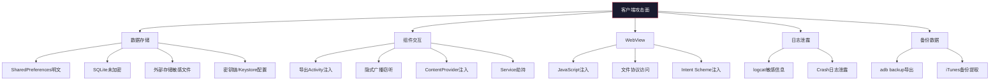
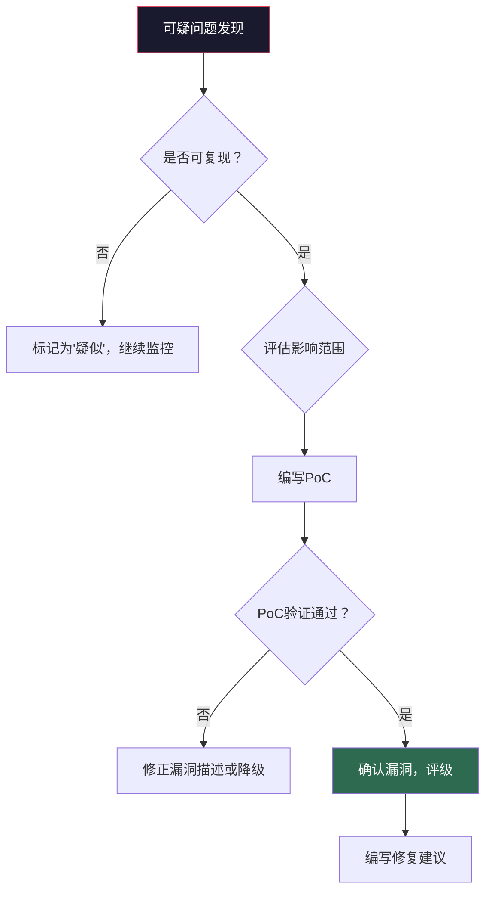

## 18.10 移动渗透测试流程

移动渗透测试不是"打开 jadx 看一看、用 Frida Hook 一下"的随机操作，而是一套有明确阶段划分、质量标准和交付物的工程化流程。本节提供从项目启动到报告交付的完整方法论，将前面章节介绍的单项技能（逆向分析、Hook、抓包）串联成一条完整的攻击链。

### 18.10.1 测试流程总览

一次完整的移动应用安全评估通常分为五个阶段，每个阶段都有明确的输入、输出和质量门控：


| 阶段 | 核心目标 | 主要产出 | 典型耗时占比 |
|------|---------|---------|------------|
| 规划与准备 | 明确范围、规避法律风险 | 授权书、测试计划 | 10% |
| 信息收集 | 获取目标应用的全面画像 | APK/IPA分析报告、API清单、技术栈信息 | 15% |
| 静态分析 | 从源码层面发现安全隐患 | 代码审计发现清单 | 20% |
| 动态分析 | 运行时发现逻辑漏洞和通信问题 | 动态测试记录、抓包数据 | 30% |
| 漏洞验证 | 确认漏洞可利用性、评估影响 | PoC代码、漏洞评级 | 15% |
| 报告撰写 | 输出可执行的安全评估报告 | 最终安全报告 | 10% |

> **关键原则**：静态分析和动态分析不是二选一，而是互补关系。静态分析擅长发现硬编码密钥、不安全API调用等"代码级"问题；动态分析擅长发现逻辑绕过、竞态条件、运行时行为等"行为级"问题。两者结合才能实现全面覆盖。

---

### 18.10.2 阶段一：规划与准备

在开始任何技术操作之前，必须完成以下准备工作。跳过这一步的测试人员，轻则测试效率低下，重则面临法律风险。

#### 1. 授权确认

获取书面授权是渗透测试的第一步，也是不可跳过的一步。授权文档应包含：

- **测试范围**：明确列出被测应用的包名、版本号、测试环境（生产/预发布/测试）
- **测试时间窗口**：起止日期和允许测试的时间段（如仅工作日 9:00-18:00）
- **禁止操作**：明确哪些操作不允许（如不允许对生产环境进行DoS测试）
- **紧急联系人**：测试过程中发现严重问题时的联系渠道
- **数据处理约定**：测试过程中获取的敏感数据的处理方式

#### 2. 测试计划编制

一份标准的移动应用安全测试计划应包含以下内容：

```markdown
## 移动应用安全测试计划模板

### 1. 项目概述
- 项目名称：[应用名称] 安全评估
- 委托方：[客户名称]
- 测试方：[测试团队/个人]
- 测试类型：白盒 / 灰盒 / 黑盒

### 2. 测试范围
- Android 应用：包名 xxx，版本 x.x.x
- iOS 应用：Bundle ID xxx，版本 x.x.x
- 后端 API：域名列表
- 不在范围内：[明确排除项]

### 3. 测试环境
- 测试设备：[型号、系统版本]
- 测试网络：[隔离网络/特定VPN]
- 测试账号：[由客户提供或自行注册]

### 4. 测试方法论
- 参考标准：OWASP Mobile Testing Guide
- 测试工具：[工具清单]
- 测试策略：[黑盒/灰盒/白盒的具体实施方式]

### 5. 时间安排
- 阶段划分与时间节点
- 里程碑与交付物

### 6. 风险管理
- 测试可能对业务造成的影响
- 缓解措施
```

#### 3. 白盒、灰盒与黑盒的选择

三种测试模式对资源和时间的要求差异显著：

| 维度 | 黑盒测试 | 灰盒测试 | 白盒测试 |
|------|---------|---------|---------|
| 源码访问 | 无 | 部分（如API文档） | 完整源码 |
| 测试账号 | 自行注册 | 客户提供测试账号 | 客户提供多角色账号 |
| 优势 | 模拟真实攻击者视角 | 效率与覆盖面的平衡 | 覆盖率最高 |
| 劣势 | 耗时最长、易遗漏 | 需要协调资源 | 可能忽略运行时行为 |
| 适用场景 | 上线前安全评估 | 常规安全审计 | 合规性检查、代码审计 |

---

### 18.10.3 阶段二：信息收集

信息收集的质量直接决定后续测试的深度和效率。目标是在动手测试之前，尽可能多地了解目标应用的技术架构、通信方式和潜在攻击面。

#### 1. APK/IPA 基本信息提取

获取安装包后，第一步是提取应用的基础元数据：

```bash
# ===== Android (APK) =====

# 获取包名、版本、SDK要求、应用标签
$ aapt dump badging target.apk | grep -E "package:|sdkVersion:|targetSdkVersion:|application-label:"

# 输出示例：
# package: name='com.example.app' versionCode='42' versionName='2.1.0'
# sdkVersion:'21'
# targetSdkVersion:'34'
# application-label:'Example App'

# 提取所有声明的权限
$ aapt dump permissions target.apk

# 列出APK内容（不解压）
$ unzip -l target.apk | head -50

# 检查是否使用了原生库（.so文件）
$ unzip -l target.apk | grep "\.so$"
# lib/arm64-v8a/libnative.so
# lib/armeabi-v7a/libnative.so

# 获取APK签名信息
$ apksigner verify --print-certs target.apk

# ===== iOS (IPA) =====

# 解压IPA
$ unzip target.ipa -d target_ios/

# 查看Info.plist
$ plutil -convert xml1 -o - target_ios/Payload/*.app/Info.plist

# 提取Bundle ID、版本、最低iOS版本
$ /usr/libexec/PlistBuddy -c "Print CFBundleIdentifier" target_ios/Payload/*.app/Info.plist
$ /usr/libexec/PlistBuddy -c "Print CFBundleShortVersionString" target_ios/Payload/*.app/Info.plist
```

#### 2. 技术栈识别

识别应用使用的技术栈有助于缩小攻击面和选择针对性的测试方法：

```bash
# 识别是否为混合应用（Cordova/React Native/Flutter）
$ grep -r "cordova\|ionic\|react-native\|flutter" target_decoded/assets/ --include="*.js" -l

# 识别WebView框架
$ grep -rn "WebView\|loadUrl\|evaluateJavascript" target_java/ --include="*.java"

# 识别网络库
$ grep -rn "okhttp3\|retrofit2\|volley\|HttpURLConnection" target_java/ --include="*.java"

# 识别数据存储方式
$ grep -rn "SharedPreferences\|SQLiteOpenHelper\|Room\|Realm" target_java/ --include="*.java"

# 识别使用的第三方SDK
$ ls target_decoded/lib/  # 原生库目录
$ find target_java/ -path "*/com/google/*" -name "*.java" | head -5
$ find target_java/ -path "*/com/facebook/*" -name "*.java" | head -5
$ find target_java/ -path "*/io/sentry/*" -name "*.java" | head -5
```

技术栈识别的目的是建立一张"技术依赖地图"，后续的静态分析和动态分析都依赖这张地图来定位重点区域。

#### 3. API 端点枚举

移动应用的大部分安全漏洞都存在于客户端与服务端的通信中。尽早枚举出所有API端点，是高效测试的关键：

```bash
# 方法一：从反编译代码中提取URL
$ grep -rn "https\?://" target_java/ --include="*.java" | grep -oP 'https?://[^\s"]+' | sort -u

# 方法二：从资源文件中提取
$ grep -rn "https\?://" target_decoded/assets/ target_decoded/res/values/strings.xml

# 方法三：从动态抓包中收集（配合mitmproxy）
$ mitmdump -s capture_urls.py -w traffic.flow

# capture_urls.py 内容：
```

```python
# mitmproxy脚本：自动收集所有API端点
from mitmproxy import http
import json

captured_urls = set()

def response(flow: http.HTTPFlow):
    url = flow.request.pretty_url
    if url not in captured_urls:
        captured_urls.add(url)
        entry = {
            "method": flow.request.method,
            "url": url,
            "status": flow.response.status_code,
            "content_type": flow.response.headers.get("content-type", ""),
            "request_content_type": flow.request.headers.get("content-type", ""),
        }
        print(json.dumps(entry))
```

```bash
# 方法四：使用MobSF自动化提取
# MobSF会自动解析APK中的所有URL和API端点
$ curl -X POST http://localhost:8000/api/v1/upload \
  -H "Authorization: <api_key>" \
  -F "file=@target.apk"
```

#### 4. 第三方库漏洞识别

第三方库是移动应用安全的"隐形炸弹"。许多应用的安全问题并非来自自身代码，而是来自引入的第三方依赖：

```bash
# 从build.gradle中提取依赖版本（白盒场景）
$ grep -E "implementation|compile" app/build.gradle

# 从反编译代码中识别第三方库（黑盒场景）
$ find target_java/ -path "*/com/*" -name "*.java" | \
  sed 's|/[^/]*\.java||' | sort -u | head -30

# 使用OWASP Dependency-Check扫描已知漏洞（需要SBOM或依赖列表）
$ dependency-check --project "MobileApp" --scan ./dependencies/ --format HTML

# 手动查询特定库的已知漏洞
# 例如：检查OkHttp版本是否有已知CVE
# 搜索：site:nvd.nist.gov OkHttp <version>
```

常见高风险第三方库类别：

| 库类别 | 典型库 | 常见风险 |
|--------|-------|---------|
| 网络请求 | OkHttp、Retrofit | SSL证书验证绕过、TLS降级 |
| 图片加载 | Glide、Picasso | 文件路径遍历、内存溢出 |
| 广告SDK | AdMob、Facebook Ads | 过度权限申请、数据外传 |
| 推送服务 | 极光推送、个推 | Token泄露、消息伪造 |
| 统计分析 | 友盟、Firebase Analytics | 隐私数据收集 |
| 加密库 | Bouncy Castle | 弱算法、实现缺陷 |

---

### 18.10.4 阶段三：静态分析

静态分析在不运行应用的情况下检查代码和配置，是发现"硬编码"类问题的最高效手段。详细的逆向分析技术参见 [18.8 APK逆向分析技术](#188-apk逆向分析技术)，本节聚焦于将静态分析嵌入渗透测试流程的方法论。

#### 1. AndroidManifest.xml 深度审查

AndroidManifest.xml 是Android应用的"配置清单"，其中的安全配置错误是最高频的漏洞来源之一：

```bash
# 解包APK
$ apktool d target.apk -o target_decoded/

# 完整查看AndroidManifest.xml
$ cat target_decoded/AndroidManifest.xml
```

审查清单及对应的风险等级：

| 检查项 | 关注点 | 风险等级 | 检测命令 |
|--------|-------|---------|---------|
| `android:debuggable="true"` | 允许调试附加，可dump内存 | 严重 | `grep "debuggable" AndroidManifest.xml` |
| `android:allowBackup="true"` | 允许adb backup导出应用数据 | 高危 | `grep "allowBackup" AndroidManifest.xml` |
| `android:exported="true"` | 组件对外暴露，可被外部调用 | 中-高危 | `grep "exported" AndroidManifest.xml` |
| `android:networkSecurityConfig` | 网络安全配置是否存在 | 信息 | `grep "networkSecurityConfig" AndroidManifest.xml` |
| 自定义权限保护级别 | `protectionLevel="normal"` 保护不足 | 中危 | `grep "protectionLevel" AndroidManifest.xml` |

```bash
# 自动化检测高风险配置
$ python3 - << 'EOF'
import xml.etree.ElementTree as ET

tree = ET.parse("target_decoded/AndroidManifest.xml")
root = tree.getroot()
ns = {"android": "http://schemas.android.com/apk/res/android"}

# 检查debuggable
app = root.find("application")
if app is not None:
    debuggable = app.get(f'{{{ns["android"]}}}debuggable')
    if debuggable == "true":
        print("[CRITICAL] android:debuggable=true")

    allow_backup = app.get(f'{{{ns["android"]}}}allowBackup')
    if allow_backup != "false":
        print("[HIGH] android:allowBackup is not false")

# 检查exported组件
for tag in ["activity", "service", "receiver", "provider"]:
    for elem in root.findall(f".//{tag}"):
        name = elem.get(f'{{{ns["android"]}}}name')
        exported = elem.get(f'{{{ns["android"]}}}exported')
        intent_filters = elem.findall("intent-filter")
        if exported == "true" or (exported is None and intent_filters):
            print(f"[MEDIUM] {tag}: {name} is exported")
EOF
```

#### 2. 密钥与凭据搜索

硬编码密钥是移动应用中最常见也最容易被利用的漏洞类型：

```bash
# 全面搜索硬编码密钥
$ grep -rn -E "(api[_-]?key|apikey|secret|password|token|private[_-]?key|access[_-]?key)\s*[:=]" \
  target_java/ --include="*.java" -i | grep -v "R.id\|R.string"

# 搜索Base64编码的密钥（长度>20的连续Base64字符）
$ grep -rn -E "[A-Za-z0-9+/]{40,}={0,2}" target_java/ --include="*.java"

# 搜索AWS/GCP/Azure云服务密钥
$ grep -rn -E "(AKIA[0-9A-Z]{16}|AIza[0-9A-Za-z\-_]{35}|[0-9a-f]{40})" target_java/

# 搜索Firebase配置
$ grep -rn "firebaseio.com\|google-services" target_decoded/

# 检查res/values/strings.xml中的敏感字符串
$ grep -i -E "(key|secret|token|password|url|endpoint)" target_decoded/res/values/strings.xml

# 检查assets目录中的配置文件
$ find target_decoded/assets/ -name "*.json" -o -name "*.xml" -o -name "*.properties" -o -name "*.yml" | \
  xargs grep -l -i "key\|secret\|password\|token"
```

#### 3. 组件安全审计

Android四大组件（Activity、Service、BroadcastReceiver、ContentProvider）的导出配置不当，可能导致未授权访问：

```bash
# 列出所有exported组件
$ grep -B1 "exported=\"true\"" target_decoded/AndroidManifest.xml

# 检查ContentProvider的权限保护
$ grep -A5 "<provider" target_decoded/AndroidManifest.xml

# 检查是否有隐式Intent过滤器导致的组件导出
$ grep -B2 -A5 "<intent-filter>" target_decoded/AndroidManifest.xml

# 使用drozer测试组件安全性（在设备上安装drozer agent后）
$ adb forward tcp:31415 tcp:31415
$ drozer console connect

# 列出所有可访问的Activity
dz> run app.activity.info -a com.target.app

# 列出所有可访问的BroadcastReceiver
dz> run app.broadcast.info -a com.target.app

# 列出所有可访问的ContentProvider
dz> run app.provider.info -a com.target.app

# 测试SQL注入（如果存在ContentProvider）
dz> run scanner.provider.injection -a com.target.app
```

#### 4. 代码安全模式检查

除了搜索明文密钥，还需要检查代码中的安全反模式：

```bash
# 检测不安全的随机数（java.util.Random而非SecureRandom）
$ grep -rn "new Random()" target_java/ --include="*.java"

# 检测不安全的加密模式（ECB）
$ grep -rn "AES/ECB\|Cipher.getInstance(\"AES\")" target_java/ --include="*.java"

# 检测硬编码IV
$ grep -rn "IvParameterSpec" target_java/ --include="*.java" | \
  xargs grep -l "new byte\[\]"

# 检测不安全的WebView配置
$ grep -rn "setJavaScriptEnabled(true)" target_java/ --include="*.java"
$ grep -rn "addJavascriptInterface" target_java/ --include="*.java"
$ grep -rn "setAllowFileAccess(true)" target_java/ --include="*.java"
$ grep -rn "setAllowUniversalAccessFromFileURLs(true)" target_java/ --include="*.java"

# 检测日志输出
$ grep -rn "Log\.\(d\|v\|i\|w\|e\)\s*(" target_java/ --include="*.java" | \
  grep -i "password\|token\|key\|secret\|credential"
```

---

### 18.10.5 阶段四：动态分析

动态分析通过运行应用并监控其行为来发现静态分析无法覆盖的逻辑漏洞。详细的Hook和动态调试技术参见 [18.9 动态分析与Hook技术](#189-动态分析与hook技术)，本节聚焦于系统化的动态测试流程。

#### 1. 测试环境准备

```bash
# 确认设备连接和Frida服务状态
$ adb devices
$ frida-ls-devices

# 推送并启动frida-server（版本需与frida-tools匹配）
$ FRIDA_VERSION=$(frida --version)
$ adb push frida-server-${FRIDA_VERSION}-android-arm64 /data/local/tmp/frida-server
$ adb shell "chmod 755 /data/local/tmp/frida-server"
$ adb shell "su -c '/data/local/tmp/frida-server -l 0.0.0.0:27042 &'"

# 验证Frida连接
$ frida-ps -U | grep target

# 配置网络代理（mitmproxy/Burp Suite）
$ adb shell settings put global http_proxy 192.168.1.100:8080
```

#### 2. SSL Pinning 绕过

绝大多数现代移动应用都实施了某种形式的证书固定。绕过SSL Pinning是网络层测试的前提：

```bash
# 方法一：使用Objection一键绕过（最简单）
$ objection -g "com.target.app" explore
# 在Objection控制台中：
[com.target.app] # android sslpinning disable

# 方法二：使用Frida通用SSL Pinning绕过脚本
$ frida -U -f com.target.app -l ssl_universal_bypass.js --no-pause
```

```javascript
// ssl_universal_bypass.js - 通用SSL Pinning绕过脚本
Java.perform(function() {
    // 绕过TrustManager验证
    var TrustManagerImpl = Java.use('com.android.org.conscrypt.TrustManagerImpl');
    if (TrustManagerImpl) {
        TrustManagerImpl.verifyChain.implementation = function() {
            return arguments[0];
        };
    }

    // 绕过OkHttp3 CertificatePinner
    try {
        var CertificatePinner = Java.use('okhttp3.CertificatePinner');
        CertificatePinner.check.overload('java.lang.String', 'java.util.List').implementation = function() {
            console.log('[+] OkHttp3 CertificatePinner.check() bypassed');
        };
    } catch(e) {}

    // 绕过WebView SSL错误
    try {
        var WebViewClient = Java.use('android.webkit.WebViewClient');
        WebViewClient.onReceivedSslError.implementation = function(view, handler, error) {
            handler.proceed();
            console.log('[+] WebView SSL error bypassed');
        };
    } catch(e) {}

    console.log('[*] SSL Pinning bypass loaded');
});
```

```bash
# 方法三：针对特定应用使用r0capture抓取SSL密钥
$ frida -U -f com.target.app -l r0capture.js --no-pause -o capture.pcap
```

#### 3. Root/越狱检测绕过

许多应用在检测到Root/越狱环境后会拒绝运行或限制功能。需要在测试前绕过这些检测：

```javascript
// root_bypass.js - 绕过常见Root检测
Java.perform(function() {
    // 绕过文件路径检测（su、magisk等）
    var File = Java.use('java.io.File');
    File.exists.implementation = function() {
        var path = this.getAbsolutePath();
        if (path.indexOf("su") !== -1 || path.indexOf("magisk") !== -1 ||
            path.indexOf("Superuser") !== -1 || path.indexOf("busybox") !== -1) {
            console.log('[+] Root file check bypassed: ' + path);
            return false;
        }
        return this.exists();
    };

    // 绕过Runtime.exec检测
    var Runtime = Java.use('java.lang.Runtime');
    Runtime.exec.overload('java.lang.String').implementation = function(cmd) {
        if (cmd.indexOf("su") !== -1 || cmd.indexOf("which") !== -1) {
            console.log('[+] Runtime.exec bypassed: ' + cmd);
            throw Java.use('java.io.IOException').$new("not found");
        }
        return this.exec(cmd);
    };

    // 绕过Build.TAGS检测
    var Build = Java.use('android.os.Build');
    Build.TAGS.value = "release-keys";

    console.log('[*] Root detection bypass loaded');
});
```

#### 4. 网络流量系统化捕获

网络层测试需要系统化地捕获和分析所有通信流量：

```bash
# 启动mitmproxy的透明模式
$ mitmproxy --mode transparent --listen-port 8080 --set flow_detail=2

# 使用mitmdump自动保存所有请求和响应
$ mitmdump -s capture_all.py -w traffic_all.flow --set flow_detail=3
```

```python
# capture_all.py - 系统化流量捕获脚本
from mitmproxy import http
import json
import os

OUTPUT_DIR = "/tmp/api_traffic"
os.makedirs(OUTPUT_DIR, exist_ok=True)

counter = {"n": 0}

def request(flow: http.HTTPFlow):
    counter["n"] += 1
    entry = {
        "id": counter["n"],
        "method": flow.request.method,
        "url": flow.request.pretty_url,
        "request_headers": dict(flow.request.headers),
        "request_body": flow.request.text,
    }
    with open(f"{OUTPUT_DIR}/{counter['n']:04d}_req.json", "w") as f:
        json.dump(entry, f, indent=2, ensure_ascii=False)

def response(flow: http.HTTPFlow):
    entry = {
        "url": flow.request.pretty_url,
        "status": flow.response.status_code,
        "response_headers": dict(flow.response.headers),
        "response_body": flow.response.text[:10000],  # 截断大响应
    }
    idx = counter["n"]
    with open(f"{OUTPUT_DIR}/{idx:04d}_resp.json", "w") as f:
        json.dump(entry, f, indent=2, ensure_ascii=False)
```

#### 5. 关键行为监控

使用Frida监控应用的敏感操作行为：

```javascript
// monitor_sensitive_apis.js - 监控敏感API调用
Java.perform(function() {
    // 监控文件读写
    var FileInputStream = Java.use('java.io.FileInputStream');
    FileInputStream.$init.overload('java.lang.String').implementation = function(path) {
        console.log('[FILE READ] ' + path);
        return this.$init(path);
    };

    // 监控剪贴板访问
    var ClipboardManager = Java.use('android.content.ClipboardManager');
    ClipboardManager.getText.implementation = function() {
        var text = this.getText();
        console.log('[CLIPBOARD READ] ' + text);
        return text;
    };
    ClipboardManager.setPrimaryClip.implementation = function(clip) {
        console.log('[CLIPBOARD WRITE] ' + clip.toString());
        return this.setPrimaryClip(clip);
    };

    // 监控加密操作
    var Cipher = Java.use('javax.crypto.Cipher');
    Cipher.getInstance.overload('java.lang.String').implementation = function(transformation) {
        console.log('[CRYPTO] Cipher.getInstance: ' + transformation);
        return this.getInstance(transformation);
    };

    // 监控HTTP请求
    var URL = Java.use('java.net.URL');
    URL.$init.overload('java.lang.String').implementation = function(url) {
        console.log('[HTTP URL] ' + url);
        return this.$init(url);
    };

    // 监控数据库操作
    var SQLiteDatabase = Java.use('android.database.sqlite.SQLiteDatabase');
    SQLiteDatabase.execSQL.overload('java.lang.String').implementation = function(sql) {
        console.log('[SQL] ' + sql);
        return this.execSQL(sql);
    };

    console.log('[*] Sensitive API monitor loaded');
});
```

---

### 18.10.6 阶段五：攻击面测试

在完成信息收集和初步分析后，需要系统性地对三大攻击面进行深入测试。

#### 1. 客户端攻击面

客户端攻击面包括设备本地的数据存储、日志输出、组件交互等：



具体测试方法（数据存储安全的详细内容参见[数据存储安全测试](#数据存储安全测试)）：

```bash
# 测试SharedPreferences敏感数据
$ adb shell "run-as com.target.app cat /data/data/com.target.app/shared_prefs/*.xml"

# 测试SQLite数据库
$ adb shell "run-as com.target.app sqlite3 /data/data/com.target.app/databases/*.db '.tables' '.dump'"

# 测试外部存储敏感文件
$ adb shell "find /sdcard/ -name '*target*' -o -name '*.db' -o -name '*.log'" 2>/dev/null

# 测试adb backup
$ adb backup -f backup.ab com.target.app
# 使用abe (Android Backup Extractor) 解析
$ java -jar abe.jar unpack backup.ab backup.tar
$ tar xf backup.tar

# 测试剪贴板泄露
$ adb shell "am start -a android.intent.action.SEND -t text/plain --es android.intent.extra.TEXT 'TEST_CLIPBOARD'"
```

#### 2. 网络攻击面

网络攻击面是移动渗透测试中发现漏洞最多的区域：

```bash
# 测试HTTP明文传输
$ mitmdump --set flow_detail=3 2>&1 | grep "http://"

# 测试TLS配置
$ nmap --script ssl-enum-ciphers -p 443 api.target.com

# 测试证书固定
$ frida -U -f com.target.app -l ssl_universal_bypass.js --no-pause
# 如果绕过后能正常抓到HTTPS流量，说明SSL Pinning是唯一的保护层

# 测试API认证机制
# 1. 不带Token访问受保护端点
$ curl -v https://api.target.com/v1/user/profile

# 2. 使用过期Token
$ curl -v -H "Authorization: Bearer EXPIRED_TOKEN" https://api.target.com/v1/user/profile

# 3. 修改Token中的用户ID
$ curl -v -H "Authorization: Bearer MODIFIED_TOKEN" https://api.target.com/v1/user/profile

# 测试CORS配置
$ curl -v -H "Origin: https://evil.com" https://api.target.com/v1/user/profile

# 测试API速率限制
$ for i in $(seq 1 100); do
    curl -s -o /dev/null -w "%{http_code}" https://api.target.com/v1/login \
      -d '{"username":"test","password":"test"}'
    echo ""
  done
```

#### 3. 服务端攻击面

服务端API是移动端安全的核心——客户端的保护措施再好，服务端不做验证也是白费：

```bash
# 测试SQL注入（通过API参数）
$ curl "https://api.target.com/v1/user?id=1' OR '1'='1"
$ curl "https://api.target.com/v1/search?q=' UNION SELECT username,password FROM users--"

# 测试IDOR（不安全的直接对象引用）
# 使用用户A的Token访问用户B的数据
$ curl -H "Authorization: Bearer USER_A_TOKEN" \
  https://api.target.com/v1/user/USER_B_ID/profile

# 测试越权操作
# 普通用户尝试管理员操作
$ curl -X POST -H "Authorization: Bearer NORMAL_USER_TOKEN" \
  -H "Content-Type: application/json" \
  -d '{"role":"admin"}' \
  https://api.target.com/v1/user/self/role

# 测试竞态条件
# 同时发送多个优惠券使用请求
$ seq 1 10 | xargs -P10 -I{} curl -X POST \
  -H "Authorization: Bearer USER_TOKEN" \
  -d '{"coupon_id":"COUPON_001"}' \
  https://api.target.com/v1/order/redeem

# 测试文件上传漏洞
$ curl -X POST -H "Authorization: Bearer USER_TOKEN" \
  -F "file=@shell.php;type=image/jpeg" \
  https://api.target.com/v1/upload/avatar
```

#### 4. OWASP Mobile Top 10 逐项测试清单

将OWASP Mobile Top 10的风险项转化为可执行的测试清单：

| 编号 | 测试项 | 测试方法 | 工具 |
|------|--------|---------|------|
| M1 | 凭据使用 | 搜索硬编码API密钥、密码、Token | jadx + grep |
| M2 | 供应链安全 | 识别第三方库版本，查询已知CVE | Dependency-Check |
| M3 | 认证/授权 | 测试仅客户端校验、Token可预测性 | Frida + Burp Suite |
| M4 | 输入/输出校验 | WebView注入、Intent注入 | drozer + Frida |
| M5 | 通信安全 | SSL Pinning强度、TLS配置 | mitmproxy + testssl.sh |
| M6 | 隐私控制 | 检查设备ID、位置、通讯录收集 | Frida监控 + 隐私政策对比 |
| M7 | 二进制保护 | 混淆强度、反调试、完整性校验 | jadx + Frida |
| M8 | 安全配置 | debuggable、allowBackup、组件导出 | Manifest分析 |
| M9 | 数据存储 | SharedPreferences、SQLite、外部存储 | ADB + Frida |
| M10 | 密码学 | 加密算法强度、密钥管理 | jadx代码审计 |

---

### 18.10.7 阶段六：漏洞验证与评级

发现可疑问题后，必须进行严格的漏洞验证。未经验证的"发现"不应出现在最终报告中。

#### 1. 漏洞验证流程



#### 2. 漏洞评级标准（CVSS v3.1 适配移动端）

| 评级 | CVSS分数 | 说明 | 移动端典型场景 |
|------|---------|------|---------------|
| 严重 | 9.0-10.0 | 可远程利用，无需用户交互，影响范围广 | RCE、认证完全绕过、数据库全量泄露 |
| 高危 | 7.0-8.9 | 需要一定条件但可利用 | SSRF、越权访问他人数据、SSL Pinning完全缺失 |
| 中危 | 4.0-6.9 | 需要特定条件或用户配合 | 本地数据明文存储、组件导出信息泄露、弱加密 |
| 低危 | 0.1-3.9 | 影响有限或利用难度高 | 日志信息泄露、版本信息泄露、不安全的HTTP方法 |
| 信息 | 0.0 | 不直接构成安全风险 | 安全建议、最佳实践偏离 |

#### 3. PoC 编写规范

每个已确认的漏洞都应配有可复现的PoC：

```markdown
## 漏洞PoC模板

### 漏洞标题
[简明扼要的漏洞描述]

### 漏洞类型
OWASP Mobile Top 10 M[X] - [风险名称]

### 影响组件
- 应用：com.target.app v2.1.0
- 平台：Android 14
- 具体组件/端点：[URL/Activity/Provider]

### 复现步骤
1. [详细的操作步骤]
2. [每一步都应可独立执行]
3. [包括截图或命令输出]

### 预期结果 vs 实际结果
- 预期：[应该发生什么]
- 实际：[实际发生了什么]

### 影响分析
- 影响范围：[影响哪些用户/数据]
- 利用难度：[低/中/高]
- 保密性/完整性/可用性影响：[C/I/A]

### 修复建议
[具体、可执行的修复方案，最好包含代码示例]
```

---

### 18.10.8 阶段七：报告撰写

安全测试报告是渗透测试的最终交付物。一份好的报告应该让开发团队能够直接根据报告修复漏洞，而不需要再追问测试人员。

#### 1. 报告结构

```markdown
# [应用名称] 移动应用安全评估报告

## 1. 执行摘要
- 测试概述（时间、范围、方法）
- 整体安全评级（严重/高/中/低）
- 关键发现总结（不超过5条）
- 风险趋势判断

## 2. 测试范围与方法
- 测试范围说明
- 使用的工具和方法论
- 测试限制与免责

## 3. 漏洞详情
### 3.1 [漏洞标题1]
- 严重等级：[严重/高/中/低]
- CVSS评分：[X.X]
- 影响组件：[组件描述]
- 漏洞描述：[技术描述]
- 复现步骤：[详细步骤]
- 证据截图：[截图]
- 修复建议：[具体方案]

### 3.2 [漏洞标题2]
...

## 4. 安全评估总结
- 按OWASP分类的漏洞分布统计
- 与上次评估的对比（如有）
- 安全成熟度评估

## 5. 修复建议优先级
| 优先级 | 漏洞 | 修复建议 | 预计工作量 |
|--------|------|---------|-----------|
| P0（立即） | [漏洞] | [建议] | [工作量] |
| P1（1周内） | [漏洞] | [建议] | [工作量] |
| P2（1月内） | [漏洞] | [建议] | [工作量] |

## 6. 附录
- A. 完整测试工具清单
- B. 测试账号信息
- C. 详细技术数据
```

#### 2. 漏洞描述规范

每个漏洞描述应遵循"问题→影响→证据→修复"四段式结构：

- **问题**：用一句话说清楚漏洞是什么
- **影响**：用一句话说清楚这个漏洞能造成什么后果
- **证据**：提供可复现的步骤和截图/输出
- **修复**：给出具体的修复代码或配置变更

避免使用"存在安全风险"这类模糊描述。取而代之的是："攻击者可通过 `adb backup` 导出应用数据，获取存储在 SharedPreferences 中的用户 OAuth Token，从而冒充该用户访问其账户。"

---

### 18.10.9 自动化与效率提升

手动测试是基础，但规模化的安全评估需要自动化工具的辅助。自动化工具的详细使用参见 [18.11 自动化安全扫描](#1811-自动化安全扫描)，本节介绍如何将自动化工具嵌入测试流程。

#### 1. MobSF 一键全量扫描

```bash
# 启动MobSF
$ docker run -d -p 8000:8000 opensecurity/mobile-security-framework-mobsf

# 通过API上传并扫描
$ FILE_HASH=$(curl -s -X POST http://localhost:8000/api/v1/upload \
  -H "Authorization: <api_key>" \
  -F "file=@target.apk" | jq -r '.hash')

# 等待扫描完成
$ while true; do
    STATUS=$(curl -s http://localhost:8000/api/v1/scan_status \
      -H "Authorization: <api_key>" \
      -d "{\"hash\": \"$FILE_HASH\"}" | jq -r '.status')
    [ "$STATUS" = "success" ] && break
    sleep 5
  done

# 获取JSON报告
$ curl -s http://localhost:8000/api/v1/report_json \
  -H "Authorization: <api_key>" \
  -d "{\"hash\": \"$FILE_HASH\"}" > mobsf_report.json

# 提取高危发现
$ jq '.high' mobsf_report.json
```

#### 2. 批量测试脚本

在需要对多个应用进行安全评估时，可以编写批量测试脚本：

```bash
#!/bin/bash
# batch_scan.sh - 批量APK安全扫描
APK_DIR="./apks"
REPORT_DIR="./reports"
mkdir -p "$REPORT_DIR"

for apk in "$APK_DIR"/*.apk; do
    APP_NAME=$(basename "$apk" .apk)
    echo "[*] Scanning: $APP_NAME"

    # 基本信息提取
    aapt dump badging "$apk" > "$REPORT_DIR/${APP_NAME}_info.txt" 2>&1

    # 反编译
    jadx -d "$REPORT_DIR/${APP_NAME}_jadx/" "$apk" 2>/dev/null

    # 搜索硬编码密钥
    grep -rn -E "(api_key|secret|password|token|private_key)" \
      "$REPORT_DIR/${APP_NAME}_jadx/" --include="*.java" -i \
      > "$REPORT_DIR/${APP_NAME}_secrets.txt" 2>/dev/null

    # 检查Manifest安全配置
    apktool d "$apk" -o "/tmp/${APP_NAME}_decoded/" 2>/dev/null
    python3 manifest_check.py "/tmp/${APP_NAME}_decoded/AndroidManifest.xml" \
      > "$REPORT_DIR/${APP_NAME}_manifest.txt"

    echo "[+] Done: $APP_NAME"
done
```

---

### 18.10.10 常见错误与避坑指南

即使是经验丰富的测试人员，也容易在以下环节犯错：

| 错误 | 后果 | 正确做法 |
|------|------|---------|
| 跳过授权文档直接测试 | 法律风险 | 测试前必须获取书面授权 |
| 只做静态分析不做动态分析 | 遗漏逻辑漏洞 | 两种方法互补使用 |
| 发现漏洞后不验证就报告 | 误报损害信誉 | 每个漏洞都必须可复现 |
| 忽略服务端API测试 | 遗漏最严重的漏洞 | 移动端漏洞往往在服务端 |
| 测试环境与生产环境未隔离 | 误操作影响生产数据 | 使用独立测试环境和测试账号 |
| 忽略应用更新后的重新测试 | 修复可能引入新问题 | 重大版本更新后重新评估 |
| 报告只列漏洞不给修复方案 | 开发团队无法修复 | 每个漏洞都附带具体修复建议 |
| 过度依赖自动化工具 | 遗漏逻辑和业务层漏洞 | 自动化做初筛，手动做深入测试 |
| 忽略第三方SDK的安全风险 | 供应链安全盲区 | 将第三方库纳入测试范围 |
| 测试完成后不清理环境 | 测试数据泄露 | 清理设备数据、代理配置、测试账号 |

---

### 18.10.11 移动渗透测试检查清单

以下清单覆盖移动渗透测试的核心检查项，可作为每次测试的参考框架：

```markdown
## 移动渗透测试完整检查清单

### 一、规划阶段
- [ ] 获取书面测试授权
- [ ] 确认测试范围（应用、版本、API域名）
- [ ] 准备测试设备和工具链
- [ ] 获取测试账号（如需要）
- [ ] 编制测试计划

### 二、信息收集
- [ ] 提取APK/IPA基本信息（包名、版本、权限）
- [ ] 识别技术栈（原生/混合/跨平台）
- [ ] 枚举所有API端点
- [ ] 识别第三方库及版本
- [ ] 分析应用的网络通信架构

### 三、客户端测试
- [ ] AndroidManifest.xml安全配置审查
- [ ] 组件导出安全检查（Activity/Service/Receiver/Provider）
- [ ] 硬编码凭据搜索（API密钥、密码、证书）
- [ ] 代码安全模式检查（不安全加密、不安全随机数）
- [ ] WebView安全配置审计
- [ ] 反编译代码业务逻辑审计

### 四、数据存储测试
- [ ] SharedPreferences敏感数据检查
- [ ] SQLite数据库加密检查
- [ ] 外部存储敏感文件搜索
- [ ] 日志信息泄露检测
- [ ] 剪贴板敏感数据检查
- [ ] Keystore/Keychain配置审计
- [ ] 应用备份数据检查

### 五、网络通信测试
- [ ] HTTPS强制使用验证
- [ ] SSL/TLS配置审计
- [ ] SSL Pinning实施检查与绕过
- [ ] API认证机制分析（Token/Session/API Key）
- [ ] 敏感数据传输加密验证
- [ ] WebSocket安全测试

### 六、身份认证测试
- [ ] 本地认证绕过测试
- [ ] Token安全分析（可预测性、过期机制、刷新机制）
- [ ] OAuth 2.0 / OIDC实现缺陷检查
- [ ] 生物识别旁路测试
- [ ] 多因素认证绕过测试

### 七、服务端API测试
- [ ] 注入测试（SQL/NoSQL/命令注入）
- [ ] 越权访问测试（水平越权/垂直越权）
- [ ] 竞态条件测试
- [ ] 速率限制测试
- [ ] 文件上传安全测试
- [ ] 业务逻辑漏洞测试

### 八、自动化扫描
- [ ] MobSF自动扫描
- [ ] Semgrep自定义规则扫描
- [ ] 第三方库已知漏洞扫描

### 九、漏洞验证
- [ ] 每个发现都已编写PoC
- [ ] 每个PoC都已成功复现
- [ ] 漏洞已按CVSS评级
- [ ] 修复建议已编写并验证可行性

### 十、报告与收尾
- [ ] 测试报告已按模板撰写
- [ ] 漏洞优先级排序已完成
- [ ] 测试环境数据已清理
- [ ] 测试工具和日志已归档
```

---

### 18.10.12 从单项技能到系统化能力

回顾本节内容，移动渗透测试流程的核心价值在于将前面章节介绍的单项技能——APK逆向分析（18.8）、动态分析与Hook（18.9）、自动化扫描（18.11）——串联成一条完整的攻击链。单项技能是"兵器"，测试流程是"阵法"。没有阵法的兵器只是散兵游勇，没有兵器的阵法只是纸上谈兵。

掌握本节内容后，你应该能够独立完成一次完整的移动应用安全评估：从拿到APK开始，经过信息收集→静态分析→动态分析→漏洞验证→报告输出，形成一个完整的闭环。随着实战经验的积累，你会逐渐形成自己的测试节奏和效率工具集——这才是从"照着清单做"到"凭直觉找漏洞"的进阶之路。
