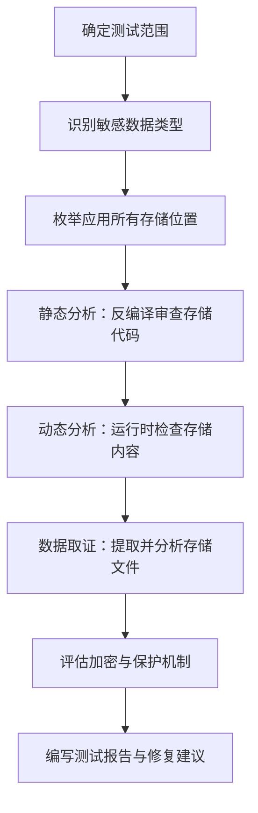

## 数据存储安全测试概述

移动应用在运行过程中不可避免地需要在设备本地存储数据——用户凭证、会话令牌、配置信息、业务缓存、离线数据等。数据存储安全测试的核心目标是验证这些本地存储的敏感数据是否受到充分保护，能否抵御物理取证、恶意应用、Root/越狱设备上的直接读取等威胁。

### 为什么数据存储是移动安全的重灾区

根据 OWASP Mobile Top 10，**不安全的数据存储（Insecure Data Storage）** 长期位列移动安全风险前列。根本原因在于：

1. **开发者过度信任设备环境**：认为"只有我的 App 能访问自己的沙盒"，忽略了 Root/越狱设备、ADB 调试、备份提取等场景
2. **平台存储 API 易用但默认不加密**：SharedPreferences、NSUserDefaults 等 API 极其便捷，开发者随手就用，但默认均为明文存储
3. **攻击面比 Web 更广**：移动设备可能丢失、被窃、被借用、被植入恶意软件，攻击者可直接接触存储介质

### 数据存储安全的威胁模型

```text
┌─────────────────────────────────────────────────────────┐
│                   威胁来源层次图                          │
├──────────┬──────────────────────────────────────────────┤
│ 第一层   │ 恶意应用（同设备，利用权限漏洞或 IPC 泄露）      │
│ 第二层   │ 物理攻击（设备丢失/被盗，直接读取存储）          │
│ 第三层   │ 备份攻击（ADB backup/iTunes 备份提取分析）       │
│ 第四层   │ Root/越狱设备（完全绕过沙盒限制）               │
│ 第五层   │ 供应链攻击（预装恶意软件、系统后门）             │
└──────────┴──────────────────────────────────────────────┘
```

### 测试总流程



---

## Android 数据存储安全测试

Android 应用的数据存储涉及多个层次，从简单的键值对存储到结构化数据库，每种机制都有独特的安全风险。

### SharedPreferences 安全测试

#### 机制解析

SharedPreferences 是 Android 最常用的轻量级键值对存储，底层以 XML 文件形式存储在 `/data/data/<包名>/shared_prefs/` 目录下。其默认行为是**明文存储**，任何有 Root 权限的进程均可直接读取。

#### 测试方法

**第一步：定位 SharedPreferences 文件**

```bash
# 列出应用所有 SharedPreferences 文件
adb shell "run-as <包名> ls -la /data/data/<包名>/shared_prefs/"

# Root 设备上直接查看
adb shell "su -c 'ls -la /data/data/<包名>/shared_prefs/'"
```

**第二步：提取并分析内容**

```bash
# 导出文件到本地
adb pull /data/data/<包名>/shared_prefs/ ./shared_prefs_dump/

# 查看内容（XML 格式）
cat ./shared_prefs_dump/*.xml
```

典型的不安全存储示例：

```xml
<!-- 高危：明文存储凭证 -->
<?xml version='1.0' encoding='utf-8'?>
<map>
    <string name="username">zhangsan</string>
    <string name="password">Myyour_password123</string>
    <string name="auth_token">eyJhbGciOiJIUzI1NiIs...</string>
    <string name="credit_card">6222021234567890</string>
    <boolean name="is_logged_in" value="true" />
    <string name="server_url">https://internal-api.company.com</string>
</map>
```

**第三步：反编译审查存储逻辑**

使用 jadx 或 apktool 反编译 APK，搜索所有 `getSharedPreferences` 和 `edit().put` 调用点：

```bash
# 使用 jadx 反编译
jadx -d output_dir target.apk

# 搜索所有 SharedPreferences 写入操作
grep -rn "putString\|putInt\|putBoolean" output_dir/ | grep -i "shared_pref\|getSharedPref"
```

关键检查项：

| 检查项 | 高危表现 | 安全标准 |
|--------|----------|----------|
| 密码存储 | 明文 `putString("password", pwd)` | 使用 EncryptedSharedPreferences 或不存储 |
| Token 存储 | 明文存储 JWT/OAuth Token | 加密存储或使用 Android Keystore |
| 敏感配置 | API 密钥、内部 URL 明文存储 | 使用 BuildConfig + NDK 混淆 |
| 用户隐私 | 身份证号、手机号明文存储 | 加密或仅存服务端 |

#### 安全替代方案：EncryptedSharedPreferences

Android Jetpack Security 库提供了 `EncryptedSharedPreferences`，透明加密所有键值对：

```kotlin
// 创建加密的 SharedPreferences
val masterKey = MasterKey.Builder(context)
    .setKeyScheme(MasterKey.KeyScheme.AES256_GCM)
    .build()

val securePrefs = EncryptedSharedPreferences.create(
    context,
    "secure_prefs",
    masterKey,
    EncryptedSharedPreferences.PrefKeyEncryptionScheme.AES256_SIV,
    EncryptedSharedPreferences.PrefValueEncryptionScheme.AES256_GCM
)

// 使用方式与普通 SharedPreferences 完全一致
securePrefs.edit().putString("auth_token", token).apply()
```

验证加密是否生效：

```bash
# 导出加密后的 SharedPreferences
adb pull /data/data/<包名>/shared_prefs/secure_prefs.xml

# 查看内容——键和值都应为密文
cat secure_prefs.xml
# 期望输出类似：
# <string name="ABCD1234encrypted...">EncryptedStringValue...</string>
```

### SQLite 数据库安全测试

#### 机制解析

SQLite 是 Android 最常用的结构化数据存储，数据库文件位于 `/data/data/<包名>/databases/` 目录。默认情况下数据库完全明文，且支持标准 SQL 查询。

#### 测试方法

**第一步：定位数据库文件**

```bash
# 列出数据库文件
adb shell "run-as <包名> ls -la /data/data/<包名>/databases/"

# 典型输出：
# -rw-rw---- 1 u0_a123 u0_a123  45056 app.db
# -rw-rw---- 1 u0_a123 u0_a123  32768 app.db-journal
# -rw-rw---- 1 u0_a123 u0_a123   8704 app.db-wal
```

**第二步：导出并分析数据库**

```bash
# 导出数据库文件
adb pull /data/data/<包名>/databases/app.db ./app_dump.db

# 使用 sqlite3 查看结构和数据
sqlite3 ./app_dump.db

# 查看所有表
.tables

# 查看表结构
.schema users

# 查询敏感数据
SELECT * FROM users;
SELECT * FROM auth_tokens;
SELECT * FROM payment_cards;
SELECT * FROM chat_messages;

# 搜索可能的敏感字段
SELECT name FROM sqlite_master WHERE type='table';
```

**第三步：自动化扫描敏感数据**

使用脚本自动扫描数据库中的敏感数据模式：

```python
#!/usr/bin/env python3
"""scan_db_sensitive.py - 扫描 SQLite 数据库中的敏感数据"""
import sqlite3
import re
import sys

SENSITIVE_PATTERNS = {
    '手机号': r'1[3-9]\d{9}',
    '身份证号': r'[1-9]\d{5}(?:19|20)\d{2}(?:0[1-9]|1[0-2])(?:0[1-9]|[12]\d|3[01])\d{3}[\dXx]',
    '银行卡号': r'[1-9]\d{15,18}',
    '邮箱地址': r'[a-zA-Z0-9._%+-]+@[a-zA-Z0-9.-]+\.[a-zA-Z]{2,}',
    'JWT Token': r'eyJ[A-Za-z0-9_-]{10,}\.[A-Za-z0-9_-]{10,}\.[A-Za-z0-9_-]{10,}',
    'API Key': r'(?:api[_-]?key|apikey|secret)[\'"\s]*[:=][\'"\s]*[A-Za-z0-9_-]{16,}',
    '密码字段': r'(?:password|passwd|pwd|pin)[\'"\s]*[:=][\'"\s]*\S+',
}

def scan_database(db_path):
    conn = sqlite3.connect(db_path)
    cursor = conn.cursor()

    # 获取所有表
    cursor.execute("SELECT name FROM sqlite_master WHERE type='table'")
    tables = [row[0] for row in cursor.fetchall()]

    findings = []
    for table in tables:
        try:
            cursor.execute(f"SELECT * FROM [{table}] LIMIT 1000")
            columns = [desc[0] for desc in cursor.description]
            rows = cursor.fetchall()

            for row_idx, row in enumerate(rows):
                for col_idx, value in enumerate(row):
                    if not isinstance(value, str):
                        continue
                    for pattern_name, pattern in SENSITIVE_PATTERNS.items():
                        if re.search(pattern, value, re.IGNORECASE):
                            findings.append({
                                'table': table,
                                'column': columns[col_idx],
                                'row': row_idx,
                                'type': pattern_name,
                                'sample': value[:50] + '...' if len(value) > 50 else value
                            })
        except Exception as e:
            print(f"Error scanning table {table}: {e}")

    conn.close()
    return findings

if __name__ == '__main__':
    results = scan_database(sys.argv[1])
    for f in results:
        print(f"[{f['type']}] {f['table']}.{f['column']} (row {f['row']}): {f['sample']}")
```

#### SQLCipher 加密方案

对于需要本地存储敏感数据的场景，应使用 SQLCipher 对整个数据库进行加密：

```kotlin
// 项目依赖
// implementation "net.zetetic:android-database-sqlcipher:4.5.4"
// implementation "androidx.sqlite:sqlite-ktx:2.4.0"

import net.sqlcipher.database.SQLiteDatabase
import net.sqlcipher.database.SupportFactory

// 初始化
SQLiteDatabase.loadLibs(context)

// 使用 SQLCipher 打开加密数据库
val passphrase = SQLiteDatabase.getBytes("用户密码或派生密钥".toCharArray())
val factory = SupportFactory(passphrase)
val db = Room.databaseBuilder(context, AppDatabase::class.java, "encrypted.db")
    .openHelperFactory(factory)
    .build()
```

验证数据库已加密：

```bash
# 尝试用普通 sqlite3 打开加密数据库
sqlite3 ./encrypted.db ".tables"
# 期望输出：Error: file is not a database
# 这证明加密生效

# 用 sqlcipher 工具验证（需要密钥）
sqlcipher ./encrypted.db
> PRAGMA key = 'your-passphrase';
> .tables
```

### 外部存储安全测试

#### 机制解析

外部存储（SD 卡或模拟外部存储）在 Android 上是**全局可读写**的，任何应用都可以访问。从 Android 10 开始引入 Scoped Storage 限制，但应用仍可通过 `requestLegacyExternalStorage` 或 `MANAGE_EXTERNAL_STORAGE` 权限绕过。

#### 测试方法

```bash
# 检查应用是否使用外部存储
adb shell "ls -laR /sdcard/Android/data/<包名>/"
adb shell "ls -laR /sdcard/<包名>/"
adb shell "ls -laR /storage/emulated/0/<包名>/"

# 检查下载目录
adb shell "ls -la /sdcard/Download/ | grep <包名>"

# 搜索敏感文件类型
adb shell "find /sdcard/ -name '*.db' -o -name '*.json' -o -name '*.txt' -o -name '*.log' | grep <包名>"
```

反编译检查外部存储使用：

```bash
# 搜索 getExternalStorageDirectory 等 API 调用
grep -rn "getExternalStorageDirectory\|getExternalFilesDir\|getExternalCacheDir\|Environment.getExternalStorage" output_dir/
```

#### 高危模式识别

| 存储位置 | 风险等级 | 说明 |
|----------|----------|------|
| `/sdcard/` 公共目录 | 极高 | 任何应用可读写 |
| `getExternalFilesDir()` | 中 | Android 10 前全局可读 |
| `getExternalCacheDir()` | 中 | 同上，且可被系统清理 |
| `getExternalMediaDir()` | 中 | 媒体文件，全局可访问 |

安全实践：敏感数据**绝不应存储在外部存储**，即使是加密后的数据。如果必须使用外部存储存放文件，应使用 Android Keystore 派生的密钥进行文件级加密。

### 日志安全测试（Logcat）

#### 机制解析

Android 的日志系统（Logcat）在调试阶段输出大量信息。虽然从 Android 4.1 开始第三方应用无法读取其他应用的日志，但以下场景仍然存在风险：

- ADB 连接时可查看所有日志
- Root 设备上可读取全部日志
- 部分 OEM ROM 存在日志权限漏洞
- 应用自身实现了文件日志功能

#### 测试方法

```bash
# 连接设备并清除历史日志
adb logcat -c

# 启动目标应用并执行关键操作（登录、支付、查看个人信息等）
# 然后捕获日志
adb logcat -d > full_logcat.txt

# 搜索敏感信息模式
grep -iE "(password|token|secret|key|credential|credit|card|ssn|pin|session|cookie|auth)" full_logcat.txt

# 搜索特定应用的日志
grep "<包名>" full_logcat.txt

# 使用 Logcat 过滤器
adb logcat -s "YourAppTag:*" > app_logs.txt
```

#### 反编译审查日志代码

```bash
# 搜索日志 API 调用
grep -rn "Log\.\(d\|v\|i\|w\|e\)\|println\|System\.out\.print\|Timber\.\|Logger\." output_dir/ | grep -v "test\|Test"
```

高危日志模式示例：

```java
// 危险：打印用户凭证
Log.d("Auth", "Login attempt: user=" + username + " pass=" + password);

// 危险：打印 Token
Log.i("API", "Authorization header: Bearer " + token);

// 危险：打印支付信息
Log.d("Payment", "Card number: " + cardNumber + " CVV: " + cvv);

// 危险：打印用户隐私
Log.d("User", "ID card: " + idNumber + " Phone: " + phone);
```

安全实践：

```kotlin
// 使用 BuildConfig 条件编译，Release 包完全移除日志
if (BuildConfig.DEBUG) {
    Log.d(TAG, "Login attempt for user: $username")
    // 绝不打印密码或 Token
}

// 或使用 Timber + 自定义 Tree，Release 包不种植 DebugTree
class ReleaseTree : Timber.Tree() {
    override fun log(priority: Int, tag: String?, message: String, t: Throwable?) {
        // 仅记录 ERROR 及以上级别到 Crashlytics
        if (priority >= Log.ERROR) {
            FirebaseCrashlytics.getInstance().log("$tag: $message")
        }
    }
}

// Application.onCreate 中
if (BuildConfig.DEBUG) {
    Timber.plant(Timber.DebugTree())
} else {
    Timber.plant(ReleaseTree())
}
```

### 剪贴板安全测试

#### 机制解析

Android 剪贴板是全局共享的，任何应用都可以读取剪贴板中的内容（Android 12 开始会显示 Toast 提示，但仍可读取）。

#### 测试方法

```bash
# 监控剪贴板内容变化（需要 Root）
adb shell "su -c 'service call clipboard 2 i32 1'"

# 手动操作后检查剪贴板
adb shell "uiautomator dump /dev/tty" | grep -i "password\|token\|密码"
```

反编译审查剪贴板使用：

```bash
grep -rn "ClipboardManager\|setPrimaryClip\|ClipData\|clipboard" output_dir/
```

需要关注的代码模式：

```kotlin
// 高危：将密码复制到剪贴板
clipboardManager.setPrimaryClip(ClipData.newPlainText("password", userPassword))

// 高危：复制 Token
clipboardManager.setPrimaryClip(ClipData.newPlainText("token", authToken))

// 可接受：复制非敏感信息（如分享链接）
clipboardManager.setPrimaryClip(ClipData.newPlainText("url", shareUrl))
```

安全替代方案：

```kotlin
// 使用 FLAG_SENSITIVE 标记敏感内容（Android 13+）
val clip = ClipData.newPlainText("sensitive", data)
clip.description.extras = PersistableBundle().apply {
    putBoolean(ClipDescription.EXTRA_IS_SENSITIVE, true)
}
clipboardManager.setPrimaryClip(clip)

// 更好的方案：避免使用剪贴板传递敏感数据
// 使用 Intent 或 ContentProvider 进行应用间数据传递
```

### Content Provider 安全测试

#### 机制解析

Content Provider 是 Android 四大组件之一，用于跨应用共享数据。如果权限配置不当，其他应用可以直接读取甚至篡改数据。

#### 测试方法

```bash
# 查看应用注册的 Content Provider
adb shell "dumpsys package <包名> | grep -A 20 'Content Providers'"

# 尝试查询 Content Provider
adb shell "content query --uri content://<包名>.provider/users"
adb shell "content query --uri content://<包名>.provider/settings"

# 使用 drozer 工具进行系统化测试
dz> run app.provider.finduri <包名>
dz> run app.provider.query content://<包名>.provider/users
dz> run app.provider.query content://<包名>.provider/users --selection "1=1"
```

反编译审查 Provider 权限：

```bash
# 检查 AndroidManifest.xml 中的 Provider 配置
grep -A 10 "provider" output_dir/AndroidManifest.xml

# 关注 exported="true" 和 permission 配置
```

危险配置示例：

```xml
<!-- 高危：exported 且无权限保护 -->
<provider
    android:name=".data.UserContentProvider"
    android:authorities="com.app.provider"
    android:exported="true" />

<!-- 中危：有读权限但使用了弱权限 -->
<provider
    android:name=".data.UserContentProvider"
    android:authorities="com.app.provider"
    android:exported="true"
    android:readPermission="android.permission.ACCESS_NETWORK_STATE" />
```

### 内部存储文件安全测试

#### 测试方法

```bash
# 列出内部存储所有文件
adb shell "run-as <包名> find /data/data/<包名>/ -type f" | head -100

# 检查文件权限
adb shell "run-as <包名> ls -laR /data/data/<包名>/files/"
adb shell "run-as <包name>/cache/"

# 导出所有内部存储文件
adb shell "run-as <包名> tar czf /sdcard/app_data.tar.gz -C /data/data/<包名> ."
adb pull /sdcard/app_data.tar.gz ./app_data.tar.gz
tar xzf app_data.tar.gz -C ./app_data_dump/

# 搜索敏感文件
find ./app_data_dump/ \( -name "*.json" -o -name "*.txt" -o -name "*.pem" \
    -o -name "*.key" -o -name "*.p12" -o -name "*.db" -o -name "*.log" \)
```

### Android Keystore 安全测试

#### 机制解析

Android Keystore 是硬件支持的密钥管理系统，密钥材料永远不会离开安全硬件（TEE/SE/StrongBox）。正确的使用模式是：用 Keystore 中的密钥加密数据，加密后的数据可以安全存储在任何位置。

#### 测试方法

```bash
# 列出应用在 Keystore 中的密钥
adb shell "su -c 'ls -la /data/misc/keystore/user_0/' | grep <UID>"

# 反编译审查 Keystore 使用
grep -rn "KeyStore\|KeyGenerator\|KeyPairGenerator\|Cipher\|AndroidKeyStore" output_dir/
```

检查密钥配置的安全性：

```kotlin
// 安全的 Keystore 配置示例
val keyGenSpec = KeyGenParameterSpec.Builder(
    "master_key",
    KeyProperties.PURPOSE_ENCRYPT or KeyProperties.PURPOSE_DECRYPT
)
    .setBlockModes(KeyProperties.BLOCK_MODE_GCM)
    .setEncryptionPaddings(KeyProperties.ENCRYPTION_PADDING_NONE)
    .setKeySize(256)
    .setUserAuthenticationRequired(true)      // 需要生物认证
    .setUserAuthenticationValidityDurationSeconds(30)  // 认证有效期
    .setUnlockedDeviceRequired(true)          // 设备必须解锁
    .setIsStrongBoxBacked(true)               // 使用 StrongBox 硬件
    .build()
```

不安全的模式：

```kotlin
// 危险：密钥无使用限制
val keyGenSpec = KeyGenParameterSpec.Builder(
    "master_key",
    KeyProperties.PURPOSE_ENCRYPT or KeyProperties.PURPOSE_DECRYPT
)
    .setBlockModes(KeyProperties.BLOCK_MODE_ECB)   // 不安全的分组模式
    .setEncryptionPaddings(KeyProperties.ENCRYPTION_PADDING_PKCS7)
    // 缺少 setUserAuthenticationRequired
    // 缺少 setUnlockedDeviceRequired
    .build()
```

### WebView 数据存储安全测试

WebView 有自己独立的存储体系，常被开发者忽略：

```bash
# 检查 WebView 存储目录
adb shell "run-as <包名> ls -laR /data/data/<包名>/app_webview/"
adb shell "run-as <包名> ls -laR /data/data/<包名>/app_webview/Default/"

# 检查 Web Storage (localStorage/sessionStorage)
adb shell "run-as <包名> cat /data/data/<包名>/app_webview/Default/Local\ Storage/leveldb/*.ldb"

# 检查 Web SQL Database
adb shell "run-as <包名> ls -la /data/data/<包名>/app_webview/Default/databases/"

# 检查 Cookies
adb shell "run-as <包名> cat /data/data/<包名>/app_webview/Default/Cookies"
```

反编译审查 WebView 配置：

```kotlin
// 高危：启用不必要的存储功能
webView.settings.apply {
    databaseEnabled = true                    // Web SQL
    domStorageEnabled = true                  // localStorage
    savePassword = true                       // 自动保存密码（已废弃但仍危险）
    allowFileAccess = true                    // 文件访问
    allowContentAccess = true                 // Content Provider 访问
}
```

### 备份安全测试

#### 机制解析

Android 的 `adb backup` 功能可以提取应用数据（除非应用明确禁止）。攻击者获取设备物理访问后可利用此机制提取全部应用数据。

#### 测试方法

```bash
# 检查 AndroidManifest.xml 中的备份配置
grep -i "allowBackup\|fullBackupContent\|dataExtractionRules" output_dir/AndroidManifest.xml

# 尝试执行备份
adb backup -f backup.ab -noapk <包名>

# 提取备份文件
java -jar abe.jar unpack backup.ab backup.tar
tar xf backup.tar -C ./backup_dump/

# 检查备份中是否包含敏感数据
find ./backup_dump/ -name "*.xml" -o -name "*.db" -o -name "*.json" | xargs grep -l "password\|token\|secret"
```

安全配置：

```xml
<!-- Android 12+ -->
<application
    android:allowBackup="false"
    android:dataExtractionRules="@xml/data_extraction_rules">

<!-- data_extraction_rules.xml -->
<?xml version="1.0" encoding="utf-8"?>
<data-extraction-rules>
    <cloud-backup>
        <exclude domain="sharedpref" path="." />
        <exclude domain="database" path="." />
        <exclude domain="file" path="sensitive/" />
    </cloud-backup>
    <device-transfer>
        <exclude domain="sharedpref" path="." />
        <exclude domain="database" path="." />
    </device-transfer>
</data-extraction-rules>
```

---

## iOS 数据存储安全测试

iOS 的沙盒机制比 Android 更严格，但仍然存在多种数据泄露风险。

### NSUserDefaults 安全测试

#### 机制解析

NSUserDefaults 以 plist 文件形式存储在应用沙盒的 `Library/Preferences/` 目录下，**明文存储**，且在设备备份中会被提取。

#### 测试方法

**通过 iExplorer/iMazing 提取（需设备连接）：**

```bash
# 通过越狱设备直接访问
ssh root@<设备IP>
cat /var/mobile/Containers/Data/Application/<UUID>/Library/Preferences/<BundleID>.plist

# 或使用 libimobiledevice 工具
ideviceinstaller -l  # 列出已安装应用
ideviceinfo -u <UDID>
```

**通过 iTunes/Finder 备份提取：**

```bash
# 创建备份（macOS）
# Finder 中选择"加密本地备份"或使用 idevicebackup2
idevicebackup2 backup ./ios_backup/

# 使用 iBackupBot 或自定义脚本解析备份
# 备份中的 Manifest.db 包含文件路径到哈希的映射

sqlite3 ./ios_backup/Manifest.db
> SELECT fileID, domain, relativePath, flags FROM Files
> WHERE relativePath LIKE '%Preferences%'
> AND domain LIKE '%<BundleID>%';
```

安全实践：

```swift
// 不安全：明文存储
UserDefaults.standard.set("Myyour_password", forKey: "password")
UserDefaults.standard.set(jwtToken, forKey: "auth_token")

// 安全：使用 Keychain 存储敏感数据
let query: [String: Any] = [
    kSecClass as String: kSecClassGenericPassword,
    kSecAttrAccount as String: "auth_token",
    kSecValueData as String: token.data(using: .utf8)!,
    kSecAttrAccessible as String: kSecAttrAccessibleWhenUnlockedThisDeviceOnly
]
SecItemAdd(query as CFDictionary, nil)
```

### iOS Keychain 安全测试

#### 机制解析

Keychain 是 iOS 的安全存储服务，数据使用硬件密钥加密。但 Keychain 有多种可访问性级别，配置不当会导致数据暴露。

#### 可访问性级别

| 保护级别 | 常量 | 行为 | 风险 |
|----------|------|------|------|
| 始终可访问 | `kSecAttrAccessibleAlways` | 设备锁定时仍可读 | 高——越狱设备可直接读取 |
| 本次解锁后 | `kSecAttrAccessibleAfterFirstUnlock` | 首次解锁后始终可读 | 中 |
| 仅解锁时 | `kSecAttrAccessibleWhenUnlocked` | 仅设备解锁时可读 | 低 |
| 仅解锁+本设备 | `kSecAttrAccessibleWhenUnlockedThisDeviceOnly` | 解锁时可读，不可迁移到其他设备 | 最低 |
| 完全保护 | `kSecAttrAccessibleWhenPasscodeSetThisDeviceOnly` | 需要密码且设备解锁 | 最安全 |

#### 测试方法

```bash
# 越狱设备上使用 Keychain-Dumper
# https://github.com/ptoomey3/Keychain-Dumper
scp Keychain-Dumper root@<设备IP>:/tmp/
ssh root@<设备IP> "chmod +x /tmp/Keychain-Dumper && /tmp/Keychain-Dumper"

# 输出示例：
# Service: com.app.auth
# Account: auth_token
# Data: eyJhbGciOiJIUzI1NiIs...
# Accessible: Always
# ─── 这表明 Token 使用了最低保护级别 ───
```

使用 Frida 动态监控 Keychain 操作：

```javascript
// hook_keychain.js
if (ObjC.available) {
    var SecItemAdd = Module.findExportByName("Security", "SecItemAdd");
    var SecItemCopyMatching = Module.findExportByName("Security", "SecItemCopyMatching");

    Interceptor.attach(SecItemAdd, {
        onEnter: function(args) {
            var query = new ObjC.Object(args[0]);
            var klass = query.objectForKey_(ObjC.classes.NSString.stringWithString_("class"));
            var account = query.objectForKey_(ObjC.classes.NSString.stringWithString_("v_Data"));
            console.log("[Keychain ADD] class=" + klass + " data=" + account);
        }
    });

    Interceptor.attach(SecItemCopyMatching, {
        onEnter: function(args) {
            var query = new ObjC.Object(args[0]);
            console.log("[Keychain QUERY] " + query);
        },
        onLeave: function(retval) {
            if (retval != 0) {
                var result = new ObjC.Object(retval);
                console.log("[Keychain RESULT] " + result);
            }
        }
    });
}
```

### iOS 文件系统安全测试

#### 测试方法

```bash
# 越狱设备上完整扫描应用沙盒
ssh root@<设备IP>
find /var/mobile/Containers/Data/Application/<UUID>/ -type f \
    \( -name "*.plist" -o -name "*.db" -o -name "*.sqlite" \
    -o -name "*.json" -o -name "*.log" -o -name "*.txt" \)

# 查看 plist 文件内容
plutil -convert xml1 -o - *.plist
cat *.plist

# 检查数据库
sqlite3 app.db ".tables"
sqlite3 app.db "SELECT * FROM users;"
```

#### 高危存储位置

| 位置 | 说明 | 风险 |
|------|------|------|
| `Library/Preferences/` | NSUserDefaults plist | 备份可提取 |
| `Documents/` | 用户可见文件 | iTunes 文件共享可能暴露 |
| `Library/Caches/` | 缓存文件 | 可能包含 API 响应、图片缓存 |
| `tmp/` | 临时文件 | 可能未及时清理 |
| `Library/Application Support/` | 应用支持文件 | 常存数据库 |

### iOS 备份安全测试

#### 测试方法

```bash
# 创建未加密备份
idevicebackup2 backup --full ./backup_unencrypted/

# 创建加密备份（推荐但需密码）
idevicebackup2 backup --full --encrypt ./backup_encrypted/

# 分析备份内容
# Manifest.db 包含文件路径映射
sqlite3 ./backup_unencrypted/Manifest.db

# 查找敏感文件
SELECT fileID, relativePath FROM Files
WHERE relativePath LIKE '%Preferences%'
   OR relativePath LIKE '%.db'
   OR relativePath LIKE '%.plist'
   OR relativePath LIKE '%Keychain%';

# 提取特定文件
# fileID 是文件名的 SHA1 哈希
cp ./backup_unencrypted/<fileID> ./extracted_file.plist
```

---

## 自动化测试工具

### MobSF（Mobile Security Framework）

MobSF 是最常用的移动安全自动化分析框架，支持静态和动态分析：

```bash
# 安装并启动 MobSF
docker pull opensecurity/mobsf:latest
docker run -it -p 8000:8000 opensecurity/mobsf:latest

# 上传 APK/IPA 进行分析
# MobSF 会自动扫描所有存储相关的安全问题
```

MobSF 的存储安全检查包括：
- SharedPreferences 敏感数据检测
- 数据库加密检查
- 外部存储使用分析
- 日志泄露检测
- 备份配置检查
- Content Provider 权限审查
- Keychain 使用分析（iOS）

### Frida 动态 Hook

```python
#!/usr/bin/env python3
"""hook_storage.py - 监控应用存储操作"""
import frida
import sys

JS_CODE = """
// 监控 SharedPreferences 写入
Java.perform(function() {
    var SharedPreferencesImpl = Java.use("android.app.SharedPreferencesImpl$EditorImpl");

    SharedPreferencesImpl.putString.implementation = function(key, value) {
        console.log("[SharedPreferences PUT] key=" + key + " value=" + value);
        return this.putString(key, value);
    };

    // 监控文件写入
    var FileOutputStream = Java.use("java.io.FileOutputStream");
    FileOutputStream.$init.overload('java.lang.String').implementation = function(path) {
        console.log("[FileWrite] " + path);
        return this.$init(path);
    };

    // 监控数据库操作
    var SQLiteDatabase = Java.use("android.database.sqlite.SQLiteDatabase");
    SQLiteDatabase.execSQL.overload('java.lang.String').implementation = function(sql) {
        console.log("[SQL] " + sql);
        return this.execSQL(sql);
    };
});
"""

device = frida.get_usb_device()
pid = device.spawn([sys.argv[1]])
session = device.attach(pid)
script = session.create_script(JS_CODE)
script.load()
device.resume(pid)
input("Press Enter to stop...")
```

### 使用 drozer 测试 IPC

```bash
# 安装 drozer
pip install drozer

# 连接设备
adb forward tcp:31415 tcp:31415
drozer console connect

# 枚举 Content Provider
dz> run app.provider.finduri <包名>

# 查询 Provider 数据
dz> run app.provider.query content://<包名>.provider/users

# SQL 注入测试
dz> run app.provider.query content://<包名>.provider/users --selection "' OR 1=1 --"

# 目录遍历测试
dz> run app.provider.read content://<包名>.provider/files/../../shared_prefs/auth.xml
```

---

## 综合检查清单

### Android 检查清单

| # | 检查项 | 严重程度 | 测试方法 |
|---|--------|----------|----------|
| 1 | SharedPreferences 中是否存在明文凭证 | 高 | 静态分析 + 文件提取 |
| 2 | SQLite 数据库是否加密 | 高 | 文件提取 + sqlite3 尝试打开 |
| 3 | 日志输出是否包含敏感信息 | 高 | Logcat 监控 + 代码审查 |
| 4 | 外部存储是否存放敏感文件 | 高 | 文件系统扫描 |
| 5 | 剪贴板是否被用于传递敏感数据 | 中 | 代码审查 + Frida |
| 6 | Content Provider 是否无权限保护 | 高 | drozer + Manifest 审查 |
| 7 | WebView 存储是否包含敏感数据 | 中 | 文件系统扫描 |
| 8 | allowBackup 是否为 true | 高 | Manifest 审查 + backup 尝试 |
| 9 | 内部存储文件权限是否过宽 | 中 | ls -la 检查 |
| 10 | Keystore 密钥是否设置了使用限制 | 中 | 代码审查 |

### iOS 检查清单

| # | 检查项 | 严重程度 | 测试方法 |
|---|--------|----------|----------|
| 1 | NSUserDefaults 中是否存在敏感数据 | 高 | plist 文件提取分析 |
| 2 | Keychain 是否使用了足够的保护级别 | 高 | Keychain-Dumper |
| 3 | Documents 目录是否包含敏感文件 | 高 | 文件系统扫描 |
| 4 | 临时文件是否及时清理 | 中 | 文件系统监控 |
| 5 | 日志输出是否包含敏感信息 | 高 | 设备日志监控 |
| 6 | 数据库是否使用了加密 | 高 | 文件提取 + 尝试打开 |
| 7 | 备份中是否暴露敏感数据 | 高 | 备份提取分析 |
| 8 | 是否禁用了 iTunes 文件共享 | 中 | Info.plist 审查 |

---

## 常见误区与纠正

### 误区一：Base64 编码就是加密

```kotlin
// 错误：Base64 只是编码，不是加密
val encoded = Base64.encodeToString(secret.toByteArray(), Base64.DEFAULT)
prefs.edit().putString("secret", encoded).apply()
// 任何工具都可以一行代码解码
```

### 误区二：自定义加密算法比标准算法更安全

```kotlin
// 错误：自造轮子
fun encrypt(data: String): String {
    return data.reversed().map { (it.code + 3).toChar() }.joinToString("")
}
// 正确：使用 Android Keystore + AES-GCM
```

### 误区三：存储在应用私有目录就安全了

```kotlin
// 错误认知：/data/data/<包名>/ 是安全的
// 事实：Root 设备、ADB backup、物理取证都可以访问
// 正确做法：对敏感数据加密后存储，无论目录
```

### 误区四：加密密钥硬编码在代码中

```kotlin
// 错误：密钥在反编译后直接可见
companion object {
    const val SECRET_KEY = "MySecretKey12345"
}

// 正确：使用 Android Keystore 管理密钥
// 密钥材料永远不会出现在代码或存储中
```

### 误区五：混淆了就安全了

ProGuard/R8 混淆只增加逆向难度，不提供安全保障。字符串常量（包括密钥）在混淆后仍然可以通过字符串搜索找到。

---

## 进阶：数据存储取证技术

### SQLite WAL 文件分析

SQLite 在 WAL（Write-Ahead Logging）模式下，已提交的事务可能仍保留在 `-wal` 文件中：

```bash
# 检查 WAL 文件
ls -la app.db-wal

# WAL 文件可能包含已删除但未清理的记录
# 使用 strings 提取可读内容
strings app.db-wal | grep -i "password\|token\|secret"

# 使用 forensic 工具解析 WAL
python3 -c "
import sqlite3
conn = sqlite3.connect('app.db')
# 强制 WAL checkpoint 以查看完整数据
conn.execute('PRAGMA wal_checkpoint(TRUNCATE)')
"
```

### 内存转储分析

在 Root/越狱设备上，可以转储应用内存中的敏感数据：

```bash
# Android: 使用 Frida 转储内存
frida -U -f <包名> -l dump_memory.js --no-pause

# dump_memory.js 内容
# Process.enumerateModules().forEach(function(m) {
#     Memory.scan(m.base, m.size, "password", {
#         onMatch: function(address, size) {
#             console.log('[!] Found at: ' + address);
#             console.log(hexdump(address, {length: 64}));
#         }
#     });
# });
```

---

## 总结

数据存储安全测试是移动安全评估中覆盖面最广、发现率最高的测试领域。核心原则可以归纳为三句话：

1. **敏感数据永远不应该明文存储**——无论是 SharedPreferences、NSUserDefaults、SQLite、还是文件系统
2. **存储位置的选择和保护级别同等重要**——外部存储比内部存储更危险，Keychain 的保护级别需要按数据敏感度匹配
3. **备份和日志是常被忽略的泄露渠道**——攻击者不一定需要拿到设备本身，备份文件和日志就足以提取大量敏感数据

测试时应按照"静态分析定位存储点 → 动态运行触发写入 → 数据取证提取内容 → 加密机制有效性验证"的流程系统化执行，确保不遗漏任何存储位置。
