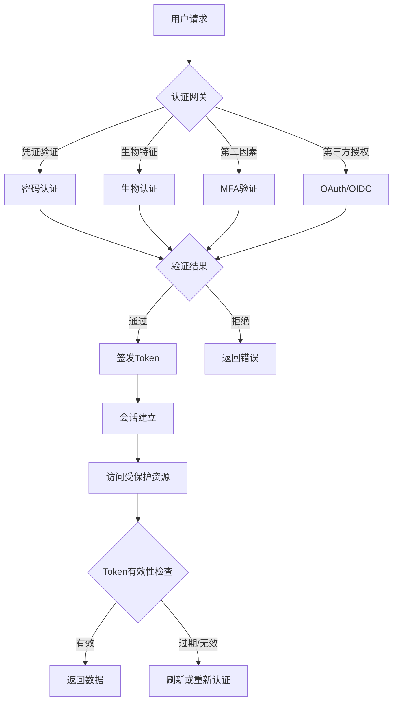
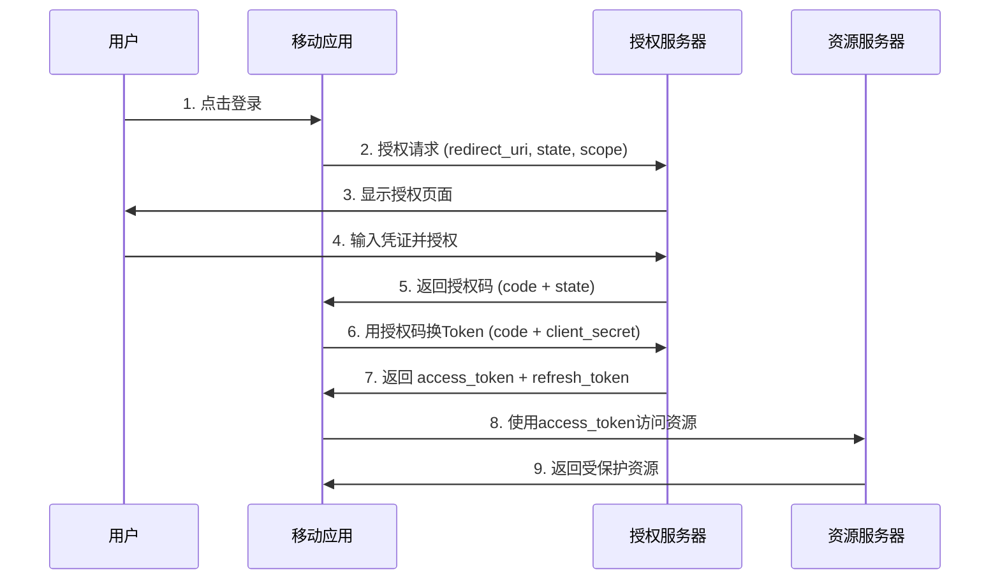

## 身份认证安全测试

身份认证是移动应用安全的第一道防线。当用户打开App的那一刻，认证机制就开始运作——从输入密码、指纹解锁到Token刷新，每一步都可能成为攻击者的突破口。移动平台的特殊性（设备可能被Root/越狱、网络环境不可控、本地存储可被访问）使得移动端的认证安全测试与Web端有显著差异。

本章从认证机制原理出发，系统讲解各类认证方式的安全测试方法，覆盖密码认证、生物认证、多因素认证、OAuth/OIDC、会话管理、Token机制等核心领域，提供完整的测试流程和实战案例。

### 认证安全的核心威胁模型

在开始测试之前，需要理解移动端认证面临的核心威胁：

| 威胁类别 | 具体场景 | 影响等级 |
|---------|---------|---------|
| 暴力破解 | 弱密码策略+无限次尝试 | 严重 |
| 凭证泄露 | 本地存储明文密码/Token | 严重 |
| 会话劫持 | Token被截获或重放 | 严重 |
| 认证绕过 | 直接访问受保护接口 | 严重 |
| 生物欺骗 | 照片/指纹膜绕过生物认证 | 高 |
| 中间人攻击 | SSL Pinning缺失导致凭证被截 | 高 |
| 逻辑缺陷 | 注册/登录/重置流程中的漏洞 | 高 |
| 侧信道泄露 | 错误信息暴露用户是否存在 | 中 |



### 密码认证安全测试

#### 密码策略测试

密码策略直接决定了暴力破解的难度。测试需要覆盖以下几个维度：

**密码复杂度要求验证**

构造不同复杂度的密码尝试注册或修改密码，验证策略是否严格执行：

```python
# 密码策略测试脚本
password_test_cases = [
    # (密码, 预期结果, 测试目的)
    ("123456", "拒绝", "纯数字弱密码"),
    ("password", "拒绝", "常见弱密码"),
    ("abcdefgh", "拒绝", "纯小写字母"),
    ("ABCDEFGH", "拒绝", "纯大写字母"),
    ("Pass1", "拒绝", "长度不足"),
    ("your_password", "通过", "符合基本要求"),
    ("your_password!2024#$", "通过", "高复杂度密码"),
    ("password123!", "拒绝", "包含常见词典单词"),
    ("qwerty", "拒绝", "键盘模式密码"),
    ("20240101", "拒绝", "日期格式密码"),
    ("aaa111BBB!!!", "拒绝", "重复字符模式"),
]

for password, expected, purpose in password_test_cases:
    response = register_or_change_password(password)
    result = "通过" if response.success else "拒绝"
    status = "✓" if result == expected else "✗ 漏洞"
    print(f"[{status}] {purpose}: '{password}' -> {result} (预期: {expected})")
```

**密码强度计分测试**

检查应用是否使用了OWASP推荐的密码强度评估（如zxcvbn）：

```python
# 测试密码强度评估是否合理
weak_but_complex = [
    "your_password!",      # 看似复杂但属于常见变形
    "Qwerty123!",     # 键盘模式+数字+符号
    "Admin1234!",     # 包含常见用户名
    "Welcome1!",      # 常见欢迎词变形
]

for pwd in weak_but_complex:
    score = zxcvbn.score(pwd)
    if score >= 3:
        print(f"[漏洞] '{pwd}' 得分 {score}/4，不应被接受为强密码")
```

#### 暴力破解防护测试

暴力破解防护是认证安全的基石。测试要点包括：

**账户锁定机制测试**

```python
import requests
import time

def test_account_lockout(username, max_attempts=10):
    """测试连续错误登录后的账户锁定机制"""
    lockout_detected = False
    lockout_after = None
    
    for i in range(1, max_attempts + 1):
        response = requests.post(LOGIN_URL, json={
            "username": username,
            "password": f"wrong_password_{i}"
        })
        
        if response.status_code == 423:  # Locked
            lockout_detected = True
            lockout_after = i
            print(f"[发现] 第{i}次尝试后账户被锁定")
            break
        elif response.status_code == 429:  # Too Many Requests
            lockout_detected = True
            lockout_after = i
            print(f"[发现] 第{i}次尝试后触发速率限制 (429)")
            break
        elif response.status_code == 200:
            print(f"[严重] 第{i}次尝试返回200，可能存在认证绕过")
            return
        
        time.sleep(0.5)
    
    if not lockout_detected:
        print(f"[漏洞] {max_attempts}次尝试后仍未锁定，存在暴力破解风险")
    else:
        # 测试锁定持续时间
        print(f"[*] 测试锁定持续时间...")
        locked_time = time.time()
        while True:
            time.sleep(30)
            resp = requests.post(LOGIN_URL, json={
                "username": username,
                "password": "test"
            })
            if resp.status_code != 423:
                duration = time.time() - locked_time
                print(f"[信息] 锁定持续 {duration:.0f} 秒后自动解除")
                break
```

**速率限制测试（区分IP和账户维度）**

```python
def test_rate_limiting():
    """测试速率限制是否区分IP维度和账户维度"""
    
    # 测试1: 同一IP对不同账户的速率限制
    print("=== 测试1: IP维度速率限制 ===")
    blocked = False
    for i in range(100):
        response = requests.post(LOGIN_URL, json={
            "username": f"user_{i}@test.com",  # 不同账户
            "password": "wrong"
        })
        if response.status_code == 429:
            print(f"[发现] IP维度速率限制在第{i+1}次请求触发")
            blocked = True
            break
    
    if not blocked:
        print("[漏洞] 仅依赖账户锁定，攻击者可对大量账户进行低频暴力破解")
    
    # 测试2: 不同IP对同一账户的速率限制
    print("\n=== 测试2: 账户维度速率限制 ===")
    # 需要多个IP代理来测试，此处为逻辑示意
    # 使用代理池对同一账户发起请求
    proxies_pool = ["socks5://proxy1:1080", "socks5://proxy2:1080"]
    for proxy in proxies_pool:
        for i in range(10):
            response = requests.post(LOGIN_URL, json={
                "username": "target@test.com",
                "password": f"wrong_{i}"
            }, proxies={"http": proxy, "https": proxy})
    
    # 用第三个IP测试账户是否被锁定
    response = requests.post(LOGIN_URL, json={
        "username": "target@test.com",
        "password": "test"
    })
    if response.status_code not in [423, 429]:
        print("[漏洞] 账户维度速率限制缺失，分布式暴力破解可行")
```

**验证码（CAPTCHA）测试**

```python
def test_captcha_bypass():
    """测试验证码是否在正确时机触发，以及是否可被绕过"""
    
    # 测试1: 验证码触发时机
    for i in range(20):
        resp = requests.post(LOGIN_URL, json={
            "username": "test@test.com",
            "password": "wrong"
        })
        data = resp.json()
        if "captcha" in data or "captchaRequired" in data:
            print(f"[信息] 验证码在第{i+1}次失败后触发")
            break
    
    # 测试2: 不带验证码参数直接请求
    resp = requests.post(LOGIN_URL, json={
        "username": "test@test.com",
        "password": "wrong"
        # 缺少 captcha 字段
    })
    if resp.status_code == 200:
        print("[漏洞] 验证码可绕过：不提交验证码参数仍可登录")
    
    # 测试3: 验证码可复用
    captcha_token = get_captcha()
    for i in range(5):
        resp = requests.post(LOGIN_URL, json={
            "username": "test@test.com",
            "password": f"wrong_{i}",
            "captcha": captcha_token  # 复用同一个验证码
        })
        if resp.status_code != 400:
            print(f"[漏洞] 验证码可复用，第{i+1}次仍被接受")
```

#### 错误信息枚举测试

认证接口的错误信息不应泄露用户是否存在：

```python
def test_user_enumeration():
    """测试是否存在用户枚举漏洞"""
    
    # 测试1: 登录接口错误信息差异
    exist_resp = requests.post(LOGIN_URL, json={
        "username": "admin@test.com", "password": "wrong"
    })
    noexist_resp = requests.post(LOGIN_URL, json={
        "username": "nonexistent@test.com", "password": "wrong"
    })
    
    if exist_resp.text != noexist_resp.text:
        print("[漏洞] 登录错误信息因用户是否存在而不同")
        print(f"  存在用户: {exist_resp.text[:100]}")
        print(f"  不存在用户: {noexist_resp.text[:100]}")
    
    if exist_resp.status_code != noexist_resp.status_code:
        print(f"[漏洞] HTTP状态码不同: {exist_resp.status_code} vs {noexist_resp.status_code}")
    
    # 测试2: 响应时间差异（时序攻击）
    import statistics
    exist_times = []
    noexist_times = []
    
    for _ in range(20):
        t1 = time.time()
        requests.post(LOGIN_URL, json={
            "username": "admin@test.com", "password": "wrong"
        })
        exist_times.append(time.time() - t1)
        
        t2 = time.time()
        requests.post(LOGIN_URL, json={
            "username": "nonexistent@test.com", "password": "wrong"
        })
        noexist_times.append(time.time() - t2)
    
    avg_exist = statistics.mean(exist_times)
    avg_noexist = statistics.mean(noexist_times)
    diff = abs(avg_exist - avg_noexist)
    
    if diff > 0.1:  # 超过100ms差异
        print(f"[漏洞] 响应时间差异显著: 存在={avg_exist:.3f}s, 不存在={avg_noexist:.3f}s, 差={diff:.3f}s")
    
    # 测试3: 密码重置接口
    resp1 = requests.post(RESET_URL, json={"email": "admin@test.com"})
    resp2 = requests.post(RESET_URL, json={"email": "nonexistent@test.com"})
    
    if resp1.text != resp2.text:
        print("[漏洞] 密码重置接口泄露用户是否存在")
    
    # 测试4: 注册接口
    resp = requests.post(REGISTER_URL, json={
        "username": "admin@test.com", "password": "Test1234!"
    })
    if "已存在" in resp.text or "already" in resp.text.lower():
        print("[漏洞] 注册接口泄露用户已注册信息")
```

**正确的错误信息设计**

| 场景 | 错误做法 | 正确做法 |
|------|---------|---------|
| 用户名不存在 | "用户不存在" | "用户名或密码错误" |
| 密码错误 | "密码错误" | "用户名或密码错误" |
| 账户被锁定 | "账户已锁定24小时" | "账户暂时不可用，请稍后重试" |
| 验证码错误 | "验证码不正确" | "验证失败，请重试" |
| 邮箱未注册 | "邮箱未注册" | "如果该邮箱已注册，您将收到重置邮件" |

### 生物认证安全测试

#### 指纹认证测试

移动端指纹认证的安全性取决于平台实现和应用层的配合：

**Android FingerprintManager / BiometricPrompt 测试**

```java
// 检查应用是否正确使用BiometricPrompt（而非已弃用的FingerprintManager）
// 测试1: 是否降级到不安全的认证方式
public void testBiometricFallback() {
    // 检查是否有 setDeviceCredentialAllowed(true)
    // 这允许PIN/图案作为生物认证的替代，可能降低安全性
    BiometricPrompt.PromptInfo promptInfo = new BiometricPrompt.PromptInfo.Builder()
        .setTitle("认证")
        .setSubtitle("验证身份")
        .setDeviceCredentialAllowed(true) // 安全风险：允许PIN绕过
        .build();
    
    // 正确做法：强制使用生物认证
    BiometricPrompt.PromptInfo securePrompt = new BiometricPrompt.PromptInfo.Builder()
        .setTitle("认证")
        .setSubtitle("验证身份")
        .setNegativeButtonText("取消")
        .setDeviceCredentialAllowed(false) // 禁止降级
        .build();
}
```

**iOS Face ID / Touch ID 测试**

```swift
// 测试LAContext配置是否安全
func testBiometricSecurity() {
    let context = LAContext()
    var error: NSError?
    
    // 测试1: 检查生物认证类型
    if context.canEvaluatePolicy(.deviceOwnerAuthenticationWithBiometrics, error: &error) {
        if #available(iOS 11.0, *) {
            switch context.biometryType {
            case .faceID:
                // 检查Info.plist中是否配置了NSFaceIDUsageDescription
                let desc = Bundle.main.infoDictionary?["NSFaceIDUsageDescription"] as? String
                if desc == nil {
                    print("[漏洞] 缺少Face ID使用说明，可能被App Store拒绝或误导用户")
                }
            case .touchID:
                print("[信息] 使用Touch ID")
            case .none:
                print("[信息] 无生物认证硬件")
            @unknown default:
                break
            }
        }
    }
    
    // 测试2: 检查是否使用 deviceOwnerAuthentication vs deviceOwnerAuthenticationWithBiometrics
    // deviceOwnerAuthentication 允许设备密码降级
    context.evaluatePolicy(.deviceOwnerAuthentication, localizedReason: "测试") { success, error in
        // deviceOwnerAuthentication 比 deviceOwnerAuthenticationWithBiometrics 安全性低
        // 因为它允许PIN/密码作为降级方案
    }
}
```

**生物认证绕过测试方法**

| 绕过技术 | 适用平台 | 难度 | 测试方法 |
|---------|---------|------|---------|
| Frida Hook认证回调 | Android/iOS | 中 | Hook BiometricPrompt的onAuthenticationSucceeded |
| Xposed模块注入 | Android | 中 | 使用TrustMeAlready等模块绕过认证 |
| 重打包修改逻辑 | Android | 低 | 反编译后修改认证结果判断逻辑 |
| 数据备份恢复 | Android | 中 | 通过ADB备份恢复篡改认证状态 |
| Keychain访问控制 | iOS | 高 | 修改Keychain访问策略绕过生物认证 |

```python
# Frida脚本：Hook Android BiometricPrompt认证结果
frida_script = """
Java.perform(function() {
    // Hook BiometricPrompt.AuthenticationCallback
    var AuthCallback = Java.use("androidx.biometric.BiometricPrompt$AuthenticationCallback");
    
    AuthCallback.onAuthenticationSucceeded.implementation = function(result) {
        console.log("[!] onAuthenticationSucceeded 被调用");
        console.log("[*] 调用栈: " + Java.use("android.util.Log").getStackTraceString(
            Java.use("java.lang.Exception").$new()));
        
        // 可以在这里注入伪造的认证成功
        // this.onAuthenticationSucceeded(result);
    };
    
    AuthCallback.onAuthenticationFailed.implementation = function() {
        console.log("[!] onAuthenticationFailed 被调用");
        // 危险：将失败改为成功
        // var CryptoObject = Java.use("androidx.biometric.BiometricPrompt$CryptoObject");
        // this.onAuthenticationSucceeded(CryptoObject.$new(null));
        
        this.onAuthenticationFailed();
    };
    
    // Hook KeyStore认证绑定
    var KeyStore = Java.use("java.security.KeyStore");
    KeyStore.getKey.overload('java.lang.String', '[C').implementation = function(alias, password) {
        console.log("[!] KeyStore.getKey called for alias: " + alias);
        return this.getKey(alias, password);
    };
});
"""

import frida
device = frida.get_usb_device()
session = device.attach("com.target.app")
script = session.create_script(frida_script)
script.load()
```

#### 面部识别测试

面部识别的安全性取决于是否使用了活体检测和3D结构光：

```python
def test_face_recognition_bypass():
    """测试面部识别绕过可能性"""
    
    test_methods = [
        ("照片攻击", "使用打印的照片或屏幕显示的照片"),
        ("视频回放", "使用录制的视频回放攻击"),
        ("3D面具", "使用3D打印面具测试"),
        ("双胞胎", "使用双胞胎或相似面容测试"),
        ("AI换脸", "使用DeepFake生成的面部"),
    ]
    
    for method, description in test_methods:
        print(f"\n[*] 测试: {method}")
        print(f"    描述: {description}")
        # 实际测试需要物理设备配合
    
    # 检查应用层面的活体检测
    # 通过反编译检查是否调用了BiometricPrompt而非自定义面部识别
    # 自定义面部识别（使用Camera API自行实现）通常安全性远低于平台API
```

**活体检测等级评估**

| 等级 | 检测能力 | 典型实现 | 可绕过性 |
|------|---------|---------|---------|
| L0 | 无活体检测 | 简单图像比对 | 极易绕过 |
| L1 | 2D活体检测 | 眨眼/摇头/张嘴 | 可用视频绕过 |
| L2 | 3D活体检测 | 结构光/ToF深度检测 | 需3D面具 |
| L3 | 多模态活体 | 红外+深度+纹理分析 | 极难绕过 |

### 多因素认证（MFA）安全测试

#### 短信验证码测试

短信验证码是移动端最常见的第二因素，但存在多种攻击面：

```python
def test_sms_otp_vulnerabilities():
    """测试短信验证码的安全漏洞"""
    
    # 测试1: 验证码暴力破解（通常为4-6位数字）
    print("=== 测试1: 验证码暴力破解 ===")
    # 先触发发送验证码
    requests.post(OTP_SEND_URL, json={"phone": "13800138000"})
    
    for code in range(10000):  # 4位验证码
        code_str = f"{code:04d}"
        resp = requests.post(OTP_VERIFY_URL, json={
            "phone": "13800138000",
            "code": code_str
        })
        if resp.status_code == 200:
            print(f"[严重] 验证码被暴力破解: {code_str}")
            break
    
    # 测试2: 验证码有效期过长
    print("\n=== 测试2: 验证码有效期 ===")
    requests.post(OTP_SEND_URL, json={"phone": "13800138000"})
    # 等待较长时间后尝试
    time.sleep(600)  # 10分钟后
    resp = requests.post(OTP_VERIFY_URL, json={
        "phone": "13800138000",
        "code": "0000"  # 任意验证码
    })
    if resp.status_code != 400:
        print("[漏洞] 验证码10分钟后仍有效")
    
    # 测试3: 验证码可复用
    print("\n=== 测试3: 验证码复用 ===")
    requests.post(OTP_SEND_URL, json={"phone": "13800138000"})
    code = intercept_sms()  # 获取验证码
    requests.post(OTP_VERIFY_URL, json={"phone": "13800138000", "code": code})
    resp = requests.post(OTP_VERIFY_URL, json={"phone": "13800138000", "code": code})
    if resp.status_code == 200:
        print("[漏洞] 验证码可重复使用")
    
    # 测试4: 验证码与手机号绑定（是否可以篡改手机号）
    print("\n=== 测试4: 手机号篡改 ===")
    requests.post(OTP_SEND_URL, json={"phone": "13800138000"})
    code = intercept_sms()
    resp = requests.post(OTP_VERIFY_URL, json={
        "phone": "13900139000",  # 不同手机号
        "code": code
    })
    if resp.status_code == 200:
        print("[严重] 验证码与手机号未绑定，可跨手机号使用")
    
    # 测试5: 验证码发送频率限制
    print("\n=== 测试5: 发送频率限制 ===")
    blocked = False
    for i in range(20):
        resp = requests.post(OTP_SEND_URL, json={"phone": "13800138000"})
        if resp.status_code == 429:
            print(f"[信息] 第{i+1}次发送时触发频率限制")
            blocked = True
            break
    if not blocked:
        print("[漏洞] 验证码发送无频率限制，可被用于短信轰炸")
```

**短信验证码安全标准**

| 安全要素 | 最低要求 | 推荐标准 |
|---------|---------|---------|
| 验证码长度 | 6位 | 6位数字或8位字母数字混合 |
| 有效期 | ≤10分钟 | ≤5分钟 |
| 使用次数 | 仅1次 | 仅1次，验证后立即失效 |
| 发送频率 | ≤1次/分钟 | ≤1次/分钟，每小时≤5次 |
| 失败次数限制 | ≤5次 | ≤3次后需重新发送 |
| 绑定校验 | 验证码与手机号绑定 | 绑定手机号+设备指纹+会话ID |

#### TOTP（基于时间的一次性密码）测试

```python
import pyotp
import time

def test_totp_security():
    """测试TOTP实现的安全性"""
    
    # 测试1: 时间窗口容忍度
    # 标准TOTP允许前后1个时间窗口（30秒）的偏差
    # 但实现可能过于宽松
    secret = "JBSWY3DPEHPK3PXP"  # 共享密钥
    totp = pyotp.TOTP(secret)
    
    current_code = totp.now()
    print(f"当前TOTP码: {current_code}")
    
    # 测试过去N个时间窗口的码是否仍被接受
    for offset in range(-5, 6):
        if offset == 0:
            continue
        past_time = time.time() + (offset * 30)
        past_code = totp.at(past_time)
        resp = requests.post(TOTP_VERIFY_URL, json={
            "code": past_code
        })
        accepted = resp.status_code == 200
        print(f"  时间偏移 {offset*30}s (码: {past_code}): {'接受' if accepted else '拒绝'}")
        if abs(offset) > 1 and accepted:
            print(f"    [漏洞] 时间窗口过大，偏移{offset}个窗口仍被接受")
    
    # 测试2: 是否允许重放攻击
    print("\n=== 测试2: 重放攻击 ===")
    code = totp.now()
    resp1 = requests.post(TOTP_VERIFY_URL, json={"code": code})
    resp2 = requests.post(TOTP_VERIFY_URL, json={"code": code})
    if resp1.status_code == 200 and resp2.status_code == 200:
        print("[漏洞] TOTP码可重复使用，存在重放攻击风险")
    
    # 测试3: 密钥生成安全性
    # 检查密钥是否使用足够的熵（至少128位）
    secret_length = len(secret) * 5  # Base32每个字符5位
    if secret_length < 128:
        print(f"[漏洞] TOTP密钥熵不足: {secret_length}位 (应≥128位)")
```

### OAuth 2.0 / OIDC 认证测试

移动端OAuth实现存在许多特有的安全问题，OWASP将Mobile OAuth不当实现列为移动端十大安全风险之一。

#### OAuth流程安全测试



**OAuth安全测试清单**

```python
def test_oauth_security():
    """OAuth 2.0 / OIDC 安全测试"""
    
    # 测试1: state参数验证
    print("=== 测试1: state参数防CSRF ===")
    # 不带state参数发起授权请求
    auth_url = f"{AUTH_ENDPOINT}?response_type=code&client_id={CLIENT_ID}&redirect_uri={REDIRECT_URI}"
    resp = requests.get(auth_url, allow_redirects=False)
    if resp.status_code in [200, 302]:
        print("[漏洞] 授权请求不强制要求state参数，存在CSRF风险")
    
    # 使用伪造的state参数
    auth_url_with_fake_state = f"{auth_url}&state=attacker_state"
    resp = requests.get(auth_url_with_fake_state, allow_redirects=False)
    # 检查回调时是否验证state
    
    # 测试2: redirect_uri验证
    print("\n=== 测试2: redirect_uri白名单 ===")
    malicious_redirects = [
        REDIRECT_URI + "/../../../etc/passwd",
        REDIRECT_URI.replace("https://", "http://"),
        "https://evil.com/callback",
        REDIRECT_URI + "?evil=param",
        REDIRECT_URI.replace(".com", ".co"),
        "com.target.app://callback.evil.com",
    ]
    
    for redirect in malicious_redirects:
        url = f"{AUTH_ENDPOINT}?response_type=code&client_id={CLIENT_ID}&redirect_uri={redirect}"
        resp = requests.get(url, allow_redirects=False)
        if resp.status_code in [200, 302] and "evil" in redirect:
            print(f"[漏洞] redirect_uri未严格校验: {redirect}")
    
    # 测试3: PKCE (Proof Key for Code Exchange) 验证
    print("\n=== 测试3: PKCE支持 ===")
    # 移动端应使用PKCE防止授权码拦截
    import hashlib, base64, secrets
    code_verifier = secrets.token_urlsafe(32)
    code_challenge = base64.urlsafe_b64encode(
        hashlib.sha256(code_verifier.encode()).digest()
    ).rstrip(b'=').decode()
    
    # 不带PKCE的请求
    resp = requests.get(f"{AUTH_ENDPOINT}?response_type=code&client_id={CLIENT_ID}&redirect_uri={REDIRECT_URI}")
    if resp.status_code in [200, 302]:
        print("[漏洞] 不使用PKCE也可获取授权码")
    
    # 测试4: 隐式授权模式（Implicit Grant）
    print("\n=== 测试4: 禁止隐式授权 ===")
    implicit_url = f"{AUTH_ENDPOINT}?response_type=token&client_id={CLIENT_ID}&redirect_uri={REDIRECT_URI}"
    resp = requests.get(implicit_url, allow_redirects=False)
    if "access_token" in resp.text or "access_token" in resp.headers.get('Location', ''):
        print("[严重] 仍支持不安全的隐式授权模式（response_type=token）")
    
    # 测试5: Token存储安全性
    print("\n=== 测试5: Token存储 ===")
    # 需要结合静态分析和动态分析
    # Android: 检查SharedPreferences、SQLite、文件系统
    # iOS: 检查Keychain访问控制
```

**常见OAuth安全问题对照表**

| 问题 | 风险 | 检测方法 | 修复建议 |
|------|------|---------|---------|
| 缺少state参数 | CSRF攻击导致账户关联 | 移除state发起请求 | 强制要求state并验证 |
| redirect_uri不严格 | 授权码/Token被劫持 | 尝试篡改redirect_uri | 精确匹配而非前缀匹配 |
| 无PKCE | 授权码被中间人截获 | 检查是否强制PKCE | 使用S256方法的PKCE |
| 隐式授权模式 | Token在URL中泄露 | 请求response_type=token | 使用授权码+PKCE |
| client_secret硬编码 | Secret被逆向提取 | 反编译检查 | 使用PKCE替代或后端代理 |
| Token明文存储 | 设备被Root后Token泄露 | 检查存储位置 | 使用Keystore/Keychain |
| scope过度授权 | 最小权限原则违反 | 检查请求的scope | 按需请求最小scope |

### 会话管理安全测试

#### Token机制测试

**JWT安全测试**

```python
import jwt
import json

def test_jwt_vulnerabilities(token):
    """测试JWT Token的安全漏洞"""
    
    # 测试1: 算法混淆攻击（alg=none）
    print("=== 测试1: 算法混淆 ===")
    try:
        header = jwt.get_unverified_header(token)
        print(f"  当前算法: {header.get('alg')}")
        
        # 尝试alg=none攻击
        payload = jwt.decode(token, options={"verify_signature": False})
        tampered = jwt.encode(payload, key='', algorithm='none')
        resp = requests.get(PROTECTED_URL, headers={"Authorization": f"Bearer {tampered}"})
        if resp.status_code == 200:
            print("[严重] alg=none攻击成功，JWT签名验证被绕过")
    except Exception as e:
        print(f"  alg=none攻击失败: {e}")
    
    # 测试2: RS256到HS256算法替换
    print("\n=== 测试2: 算法替换攻击 ===")
    if header.get('alg') == 'RS256':
        # 获取公钥（通常是公开的）
        public_key = get_public_key()
        payload = jwt.decode(token, public_key, algorithms=['RS256'])
        
        # 用公钥作为HMAC密钥重新签名
        try:
            tampered = jwt.encode(payload, public_key, algorithm='HS256')
            resp = requests.get(PROTECTED_URL, headers={"Authorization": f"Bearer {tampered}"})
            if resp.status_code == 200:
                print("[严重] RS256→HS256算法替换攻击成功")
        except Exception as e:
            print(f"  算法替换失败: {e}")
    
    # 测试3: 密钥强度（HMAC）
    print("\n=== 测试3: HMAC密钥强度 ===")
    if header.get('alg') == 'HS256':
        common_secrets = [
            'secret', 'password', '123456', 'jwt_secret',
            'key', 'test', 'admin', 'default',
        ]
        payload = jwt.decode(token, options={"verify_signature": False})
        for secret in common_secrets:
            try:
                jwt.decode(token, secret, algorithms=['HS256'])
                print(f"[严重] JWT使用弱密钥: '{secret}'")
                break
            except jwt.InvalidSignatureError:
                continue
    
    # 测试4: Token过期验证
    print("\n=== 测试4: 过期验证 ===")
    payload = jwt.decode(token, options={"verify_signature": False})
    exp = payload.get('exp')
    if exp:
        import datetime
        exp_time = datetime.datetime.fromtimestamp(exp)
        now = datetime.datetime.now()
        ttl = (exp_time - now).total_seconds()
        print(f"  Token TTL: {ttl:.0f}秒 ({ttl/3600:.1f}小时)")
        if ttl > 86400:  # 超过24小时
            print("[漏洞] Token有效期过长（>24小时），建议缩短至15-60分钟")
    else:
        print("[严重] Token没有过期时间（exp字段缺失）")
    
    # 测试5: 不验证过期Token
    print("\n=== 测试5: 过期Token是否被接受 ===")
    if exp and exp < time.time():
        resp = requests.get(PROTECTED_URL, headers={"Authorization": f"Bearer {token}"})
        if resp.status_code == 200:
            print("[严重] 已过期的Token仍被接受")
    
    # 测试6: 敏感信息泄露
    print("\n=== 测试6: Payload敏感信息 ===")
    sensitive_fields = ['password', 'ssn', 'credit_card', 'secret', 'private_key']
    for field in sensitive_fields:
        if field in payload:
            print(f"[漏洞] JWT payload包含敏感字段: {field}")
```

#### Refresh Token安全测试

```python
def test_refresh_token_security():
    """测试Refresh Token机制安全性"""
    
    # 测试1: Refresh Token复用检测
    print("=== 测试1: Refresh Token轮换 ===")
    tokens = refresh_access_token(REFRESH_TOKEN)
    new_refresh = tokens['refresh_token']
    
    # 尝试使用旧的refresh token
    old_token_resp = refresh_access_token(REFRESH_TOKEN)
    if old_token_resp.status_code == 200:
        print("[漏洞] 旧的Refresh Token仍可使用，缺少Token轮换")
    
    # 检查新的refresh token是否与旧的不同
    if new_refresh == REFRESH_TOKEN:
        print("[信息] Refresh Token未轮换（可能为设计选择，但降低安全性）")
    
    # 测试2: Refresh Token窃取后的检测
    print("\n=== 测试2: 并发Refresh检测 ===")
    # 模拟攻击者窃取了refresh token并同时使用
    import threading
    results = []
    
    def do_refresh():
        resp = refresh_access_token(REFRESH_TOKEN)
        results.append(resp.status_code)
    
    threads = [threading.Thread(target=do_refresh) for _ in range(3)]
    for t in threads:
        t.start()
    for t in threads:
        t.join()
    
    if results.count(200) > 1:
        print("[漏洞] 同一Refresh Token可并发使用，无法检测窃取")
    
    # 测试3: Refresh Token过期时间
    print("\n=== 测试3: Refresh Token生命周期 ===")
    # 刷新Token的有效期应合理（通常7-30天）
    # 过长增加泄露风险，过短影响用户体验
```

### 认证绕过测试

#### 直接API访问测试

```python
def test_direct_api_access():
    """测试是否可以直接绕过认证访问受保护的API"""
    
    protected_endpoints = [
        ("GET", "/api/v1/user/profile"),
        ("GET", "/api/v1/user/orders"),
        ("POST", "/api/v1/user/update"),
        ("GET", "/api/v1/admin/users"),
        ("DELETE", "/api/v1/user/account"),
    ]
    
    for method, endpoint in protected_endpoints:
        url = f"{BASE_URL}{endpoint}"
        
        # 测试1: 不带任何Token
        resp = requests.request(method, url)
        if resp.status_code == 200:
            print(f"[严重] {method} {endpoint} 无需认证即可访问")
        
        # 测试2: 空Token
        resp = requests.request(method, url, headers={"Authorization": ""})
        if resp.status_code == 200:
            print(f"[严重] {method} {endpoint} 空Token即可访问")
        
        # 测试3: 伪造Token格式
        resp = requests.request(method, url, headers={
            "Authorization": "Bearer invalid.token.here"
        })
        if resp.status_code == 200:
            print(f"[严重] {method} {endpoint} 伪造Token被接受")
        
        # 测试4: 已过期Token
        resp = requests.request(method, url, headers={
            "Authorization": f"Bearer {EXPIRED_TOKEN}"
        })
        if resp.status_code == 200:
            print(f"[漏洞] {method} {endpoint} 过期Token仍有效")
```

#### 越权访问测试（IDOR）

```python
def test_idor_in_auth():
    """测试认证后的越权访问"""
    
    # 使用用户A的Token访问用户B的资源
    user_a_token = get_token("user_a")
    user_b_id = "user_b_12345"
    
    # 测试1: 水平越权
    resp = requests.get(f"{BASE_URL}/api/v1/user/{user_b_id}/profile",
                       headers={"Authorization": f"Bearer {user_a_token}"})
    if resp.status_code == 200:
        print(f"[严重] 水平越权：用户A可访问用户B的数据")
    
    # 测试2: 通过修改请求参数越权
    resp = requests.get(f"{BASE_URL}/api/v1/orders?user_id={user_b_id}",
                       headers={"Authorization": f"Bearer {user_a_token}"})
    if resp.status_code == 200 and len(resp.json().get('orders', [])) > 0:
        print("[严重] 通过修改user_id参数实现越权")
    
    # 测试3: 垂直越权（普通用户访问管理员接口）
    user_token = get_token("normal_user")
    admin_endpoints = [
        "/api/v1/admin/users",
        "/api/v1/admin/config",
        "/api/v1/admin/logs",
    ]
    for endpoint in admin_endpoints:
        resp = requests.get(f"{BASE_URL}{endpoint}",
                           headers={"Authorization": f"Bearer {user_token}"})
        if resp.status_code == 200:
            print(f"[严重] 垂直越权：普通用户可访问管理接口 {endpoint}")
```

### 密码重置流程安全测试

密码重置是认证安全中最容易出现逻辑漏洞的环节：

```python
def test_password_reset_vulnerabilities():
    """测试密码重置流程的安全漏洞"""
    
    # 测试1: 重置Token安全性
    print("=== 测试1: 重置Token可预测性 ===")
    tokens = []
    for _ in range(10):
        resp = requests.post(RESET_URL, json={"email": "test@test.com"})
        token = extract_reset_token(resp)
        tokens.append(token)
    
    # 检查Token是否可预测（基于时间戳、序列号等）
    print(f"  收集到的Token: {[t[:20]+'...' for t in tokens]}")
    if len(set(tokens)) < 10:
        print("[严重] 重置Token存在重复")
    
    # 测试2: Token有效期
    print("\n=== 测试2: Token有效期 ===")
    resp = requests.post(RESET_URL, json={"email": "test@test.com"})
    token = extract_reset_token(resp)
    
    # 等待较长时间后使用
    time.sleep(1800)  # 30分钟
    resp = requests.post(RESET_CONFIRM_URL, json={
        "token": token,
        "new_password": "NewPass123!"
    })
    if resp.status_code == 200:
        print("[漏洞] 重置Token 30分钟后仍有效")
    
    # 测试3: Token是否可复用
    print("\n=== 测试3: Token复用 ===")
    requests.post(RESET_CONFIRM_URL, json={
        "token": token,
        "new_password": "NewPass123!"
    })
    resp = requests.post(RESET_CONFIRM_URL, json={
        "token": token,
        "new_password": "AnotherPass456!"
    })
    if resp.status_code == 200:
        print("[漏洞] 重置Token可重复使用")
    
    # 测试4: 旧密码重放
    print("\n=== 测试4: 新旧密码相同 ===")
    resp = requests.post(RESET_URL, json={"email": "test@test.com"})
    token = extract_reset_token(resp)
    current_password = get_current_password()  # 已知当前密码
    resp = requests.post(RESET_CONFIRM_URL, json={
        "token": token,
        "new_password": current_password  # 设为相同的旧密码
    })
    if resp.status_code == 200:
        print("[信息] 允许将密码重置为相同的旧密码（降低安全性）")
    
    # 测试5: 重置流程信息泄露
    print("\n=== 测试5: 邮箱泄露 ===")
    resp1 = requests.post(RESET_URL, json={"email": "existing@test.com"})
    resp2 = requests.post(RESET_URL, json={"email": "nonexistent@test.com"})
    if resp1.text != resp2.text:
        print("[漏洞] 密码重置响应泄露邮箱是否已注册")
```

### 本地认证数据安全测试

#### 本地存储安全

```python
def test_local_auth_storage(platform="android"):
    """测试本地认证数据存储安全性"""
    
    if platform == "android":
        storage_locations = [
            # SharedPreferences
            "/data/data/com.target.app/shared_prefs/*.xml",
            # SQLite数据库
            "/data/data/com.target.app/databases/*.db",
            # 内部存储文件
            "/data/data/com.target.app/files/*",
            # 缓存目录
            "/data/data/com.target.app/cache/*",
            # 外部存储（更不安全）
            "/sdcard/Android/data/com.target.app/*",
        ]
        
        sensitive_patterns = [
            r'["\']password["\'].*["\'].*["\']',  # 明文密码
            r'["\']token["\'].*["\'].*["\']',      # Token明文
            r'["\']secret["\'].*["\'].*["\']',     # Secret明文
            r'["\']api_key["\'].*["\'].*["\']',    # API Key
            r'Bearer\s+[A-Za-z0-9\-._~+/]+=*',    # Bearer Token
        ]
        
        for location in storage_locations:
            files = shell(f"ls {location} 2>/dev/null").split()
            for f in files:
                content = shell(f"cat {f}")
                for pattern in sensitive_patterns:
                    if re.search(pattern, content, re.IGNORECASE):
                        print(f"[漏洞] {f} 包含敏感认证数据")
    
    elif platform == "ios":
        # 检查Keychain访问控制
        keychain_items = query_keychain()
        for item in keychain_items:
            access_control = item.get('access_control')
            if access_control is None:
                print(f"[漏洞] Keychain项 {item['account']} 无访问控制保护")
            elif 'kSecAttrAccessibleAlways' in str(access_control):
                print(f"[漏洞] Keychain项 {item['account']} 使用不安全的访问控制（始终可访问）")
```

**Keychain安全访问控制等级（iOS）**

| 访问控制 | 安全等级 | 说明 |
|---------|---------|------|
| kSecAttrAccessibleAlways | 低 | 始终可访问，即使设备锁定 |
| kSecAttrAccessibleAfterFirstUnlock | 中 | 设备首次解锁后可访问 |
| kSecAttrAccessibleWhenUnlocked | 高 | 仅设备解锁时可访问 |
| kSecAttrAccessibleWhenPasscodeSet | 最高 | 仅设置密码且解锁时可访问 |
| + kSecAttrAccessControlBiometryAny | 最高+ | 任何注册的生物特征可访问 |
| + kSecAttrAccessControlBiometryCurrentSet | 最高++ | 仅当前注册的生物特征可访问 |

### 测试工具与环境

#### 推荐工具链

| 工具 | 用途 | 平台 |
|------|------|------|
| Burp Suite | HTTP代理抓包、Token分析 | 跨平台 |
| Frida | 运行时Hook、认证绕过 | Android/iOS |
| Objection | 快速Hook框架（内置Frida） | Android/iOS |
| mitmproxy | 自动化代理测试 | 跨平台 |
| jwt_tool | JWT漏洞扫描 | 跨平台 |
| MobSF | 自动化移动安全扫描 | 跨平台 |
| apktool | APK反编译分析 | Android |
| class-dump | Mach-O类信息提取 | iOS |
| Needle | iOS安全测试框架 | iOS |
| drozer | Android安全测试框架 | Android |

#### 自动化测试脚本模板

```python
#!/usr/bin/env python3
"""移动应用身份认证安全自动化测试框架"""

import requests
import json
import time
from dataclasses import dataclass
from typing import List, Optional
from enum import Enum

class Severity(Enum):
    CRITICAL = "严重"
    HIGH = "高"
    MEDIUM = "中"
    LOW = "低"
    INFO = "信息"

@dataclass
class TestResult:
    test_name: str
    category: str
    severity: Severity
    passed: bool
    detail: str
    evidence: Optional[str] = None

class AuthSecurityTester:
    def __init__(self, base_url: str, proxy: dict = None):
        self.base_url = base_url
        self.session = requests.Session()
        if proxy:
            self.session.proxies = proxy
        self.results: List[TestResult] = []
    
    def add_result(self, name, category, severity, passed, detail, evidence=None):
        result = TestResult(name, category, severity, passed, detail, evidence)
        self.results.append(result)
        status = "✓ PASS" if passed else "✗ FAIL"
        print(f"  [{status}] {name}: {detail}")
    
    def run_all_tests(self):
        """执行所有认证安全测试"""
        print("=" * 60)
        print("移动应用身份认证安全测试")
        print("=" * 60)
        
        self.test_password_policy()
        self.test_account_lockout()
        self.test_rate_limiting()
        self.test_user_enumeration()
        self.test_token_security()
        self.test_session_management()
        self.test_password_reset()
        self.test_api_auth_bypass()
        
        self.generate_report()
    
    def generate_report(self):
        """生成测试报告"""
        print("\n" + "=" * 60)
        print("测试报告")
        print("=" * 60)
        
        total = len(self.results)
        passed = sum(1 for r in self.results if r.passed)
        failed = total - passed
        
        print(f"总计: {total} | 通过: {passed} | 失败: {failed}")
        print(f"通过率: {passed/total*100:.1f}%")
        
        print("\n按严重程度统计:")
        for severity in Severity:
            items = [r for r in self.results if r.severity == severity and not r.passed]
            if items:
                print(f"  {severity.value}: {len(items)}个问题")
                for item in items:
                    print(f"    - {item.test_name}: {item.detail}")

if __name__ == "__main__":
    tester = AuthSecurityTester(
        base_url="https://api.target.com",
        proxy={"http": "http://127.0.0.1:8080", "https": "http://127.0.0.1:8080"}
    )
    tester.run_all_tests()
```

### 认证安全最佳实践速查

#### 移动端认证安全检查清单

```text
密码认证
├── [ ] 密码复杂度策略（≥8位，含大小写+数字+特殊字符）
├── [ ] 密码强度评估（使用zxcvbn等库）
├── [ ] 常见弱密码黑名单
├── [ ] 账户锁定机制（连续失败5次锁定15分钟）
├── [ ] IP维度速率限制
├── [ ] 验码机制（第3次失败后触发）
├── [ ] 统一错误信息（不泄露用户是否存在）
└── [ ] 密码哈希存储（bcrypt/Argon2，加盐）

生物认证
├── [ ] 使用平台BiometricPrompt/LAContext API
├── [ ] 绑定CryptoObject（密钥保护）
├── [ ] 禁止降级到设备密码
├── [ ] 活体检测（至少L2级别）
└── [ ] 认证失败计数和回退策略

多因素认证
├── [ ] 验证码≥6位，有效期≤5分钟
├── [ ] 验证码一次性使用
├── [ ] 发送频率限制（≤1次/分钟）
├── [ ] 验证码与会话/设备绑定
└── [ ] TOTP密钥熵≥128位

OAuth/OIDC
├── [ ] 使用授权码模式+PKCE
├── [ ] 禁止隐式授权（response_type=token）
├── [ ] state参数强制验证
├── [ ] redirect_uri精确匹配
├── [ ] scope最小权限原则
└── [ ] Token定期轮换

会话管理
├── [ ] JWT使用RS256或更强算法
├── [ ] Token有效期≤60分钟
├── [ ] Refresh Token轮换机制
├── [ ] Token存储使用Keystore/Keychain
├── [ ] 登出时服务端Token失效
└── [ ] 并发会话限制

密码重置
├── [ ] 重置Token随机且不可预测
├── [ ] Token有效期≤15分钟
├── [ ] Token一次性使用
├── [ ] 重置后所有会话失效
└── [ ] 不泄露邮箱是否已注册
```

### 常见误区与纠正

| 误区 | 正确认知 |
|------|---------|
| "密码哈希用MD5就行" | MD5/SHA1已被彩虹表攻击，必须使用bcrypt/scrypt/Argon2 |
| "验证码能防暴力破解" | 验证码是辅助手段，核心靠速率限制和账户锁定 |
| "JWT无需服务端校验" | JWT的签名验证必须在服务端进行，客户端验证仅用于UI |
| "生物认证比密码安全" | 生物认证是便利性增强，不能替代强密码（生物特征不可更改） |
| "OAuth Token永不过期" | Token必须有合理有效期，配合Refresh Token轮换 |
| "HTTPS就够了不需要证书绑定" | 移动端仍需SSL Pinning防止中间人攻击 |
| "本地加密存储就安全了" | Root/越狱设备上加密密钥仍可能被提取 |
| "只在前端做认证校验" | 所有认证校验必须在服务端完成，前端仅用于UX |
