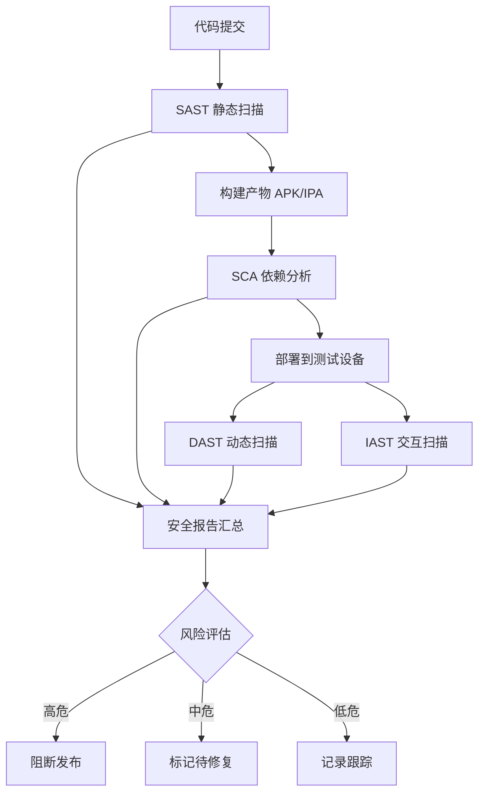
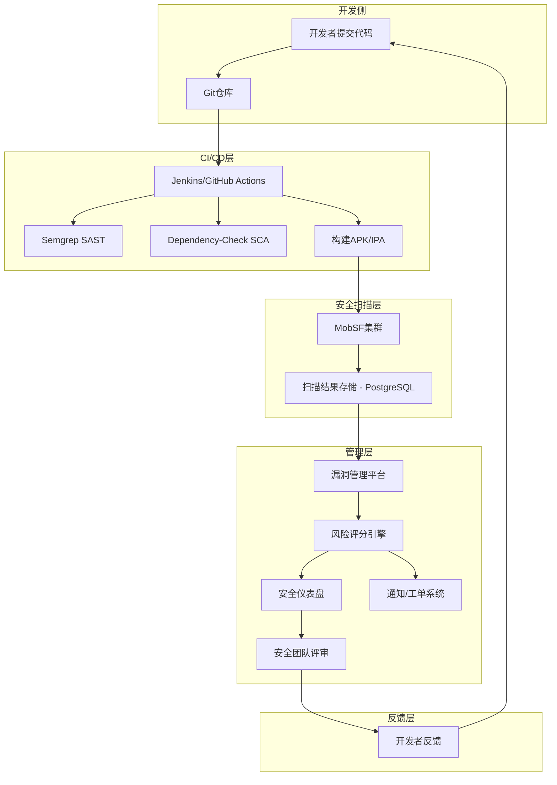

## 18.11 自动化安全扫描

手动渗透测试虽然深入，但面对频繁迭代的移动应用，纯人工模式无法跟上发布节奏。自动化安全扫描将安全检测嵌入开发流程，实现"每次提交即扫描、每次发布必检测"的安全左移（Shift-Left Security）目标。本节从扫描类型分类、核心工具实操、CI/CD集成、自定义规则编写四个维度，系统讲解如何构建移动应用自动化安全扫描体系。

### 18.11.1 自动化扫描类型与技术矩阵

移动应用自动化扫描分为四大类，各有侧重、互为补充：

| 扫描类型 | 全称 | 检测阶段 | 检测对象 | 典型工具 | 检测深度 |
|---------|------|---------|---------|---------|---------|
| **SAST** | 静态应用安全测试 | 编码/构建阶段 | 源码、字节码、APK/IPA | Semgrep、QARK、MobSF | 代码级，发现逻辑漏洞 |
| **DAST** | 动态应用安全测试 | 运行阶段 | 运行中的应用 | Frida objection、AppScan | 行为级，发现运行时漏洞 |
| **SCA** | 软件成分分析 | 构建阶段 | 第三方依赖库 | OWASP Dependency-Check、Snyk | 依赖级，发现已知漏洞 |
| **IAST** | 交互式应用安全测试 | 测试阶段 | 运行时+代码联动 | NowSecure、Oversecured | 综合级，误报率最低 |

**四类扫描的互补关系：**



**选型建议：**

- **个人开发者 / 小团队**：MobSF（一站式SAST+DAST）+ OWASP Dependency-Check（SCA），零成本覆盖核心需求
- **中型团队**：Semgrep（自定义SAST规则）+ MobSF + Snyk（SCA），支持CI/CD集成
- **企业级**：NowSecure / Oversecured（商业IAST）+ 自建Semgrep规则库 + 内部扫描平台

### 18.11.2 MobSF：一站式移动安全扫描平台

MobSF（Mobile Security Framework）是最广泛使用的开源移动安全测试框架，支持Android APK/IPA、iOS IPA、Windows APPX等格式，集静态分析、动态分析、Web API于一体。

#### 18.11.2.1 部署方式

**Docker部署（推荐）：**

```bash
# 拉取最新镜像
docker pull opensecurity/mobile-security-framework-mobsf:latest

# 启动容器，映射8000端口
docker run -it -p 8000:8000 \
  -v /tmp/mobsf_data:/root/.MobSF \
  opensecurity/mobile-security-framework-mobsf

# 访问 http://localhost:8000 进入Web界面
# API Key在首次启动时自动生成，查看日志获取
```

**源码部署：**

```bash
git clone https://github.com/MobSF/Mobile-Security-Framework-MobSF.git
cd Mobile-Security-Framework-MobSF
./setup.sh  # 自动安装依赖（Python 3.10+、Java、Android SDK等）
./run.sh    # 启动服务，默认监听 127.0.0.1:8000
```

**Docker Compose生产部署：**

```yaml
# docker-compose.yml
version: '3.8'
services:
  mobsf:
    image: opensecurity/mobile-security-framework-mobsf:latest
    ports:
      - "8000:8000"
    volumes:
      - mobsf_data:/root/.MobSF
    environment:
      - MOBSF_API_KEY=${MOBSF_API_KEY}  # 自定义API Key
    restart: unless-stopped
    healthcheck:
      test: ["CMD", "curl", "-f", "http://localhost:8000"]
      interval: 30s
      timeout: 10s
      retries: 3

volumes:
  mobsf_data:
```

#### 18.11.2.2 REST API自动化扫描流程

MobSF提供完整的REST API，可实现全自动化扫描流水线：

```bash
#!/bin/bash
# mobsf_scan.sh - MobSF自动化扫描脚本

MOBSF_URL="http://localhost:8000"
API_KEY="<your_api_key>"
APK_FILE="$1"
SCAN_TIMEOUT=300  # 扫描超时（秒）

if [ -z "$APK_FILE" ]; then
    echo "Usage: $0 <path_to_apk>"
    exit 1
fi

# 第一步：上传文件
echo "[*] 上传文件: $APK_FILE"
UPLOAD_RESP=$(curl -s -X POST "${MOBSF_URL}/api/v1/upload" \
    -H "Authorization: ${API_KEY}" \
    -F "file=@${APK_FILE}")

FILE_NAME=$(echo "$UPLOAD_RESP" | jq -r '.file_name')
FILE_HASH=$(echo "$UPLOAD_RESP" | jq -r '.hash')
SCAN_TYPE=$(echo "$UPLOAD_RESP" | jq -r '.scan_type')

echo "[+] 上传成功: ${FILE_NAME} (hash: ${FILE_HASH})"

# 第二步：触发扫描
echo "[*] 开始扫描..."
curl -s -X POST "${MOBSF_URL}/api/v1/scan" \
    -H "Authorization: ${API_KEY}" \
    -H "Content-Type: application/json" \
    -d "{\"hash\": \"${FILE_HASH}\", \"scan_type\": \"${SCAN_TYPE}\"}" > /dev/null

# 第三步：轮询扫描状态（MobSF异步扫描）
for i in $(seq 1 $SCAN_TIMEOUT); do
    STATUS=$(curl -s "${MOBSF_URL}/api/v1/scan_status" \
        -H "Authorization: ${API_KEY}" \
        -d "{\"hash\": \"${FILE_HASH}\"}" | jq -r '.status')
    if [ "$STATUS" = "finished" ]; then
        echo "[+] 扫描完成"
        break
    fi
    echo "[*] 扫描中... ($i/$SCAN_TIMEOUT)"
    sleep 1
done

# 第四步：获取JSON报告
echo "[*] 获取扫描报告..."
REPORT=$(curl -s "${MOBSF_URL}/api/v1/report_json" \
    -H "Authorization: ${API_KEY}" \
    -H "Content-Type: application/json" \
    -d "{\"hash\": \"${FILE_HASH}\"}")

# 第五步：提取高危漏洞
echo "$REPORT" | jq '.manifest_analysis[] | select(.severity == "high")' > high_vulns.json
echo "$REPORT" | jq '.code_analysis[] | select(.severity == "HIGH")' >> high_vulns.json

HIGH_COUNT=$(cat high_vulns.json | jq -s 'length')
echo "[!] 发现 ${HIGH_COUNT} 个高危漏洞，详情见 high_vulns.json"

# 第六步：生成PDF报告（可选）
curl -s -X POST "${MOBSF_URL}/api/v1/download_pdf" \
    -H "Authorization: ${API_KEY}" \
    -H "Content-Type: application/json" \
    -d "{\"hash\": \"${FILE_HASH}\"}" \
    -o "report_${FILE_HASH}.pdf"

echo "[+] PDF报告已生成: report_${FILE_HASH}.pdf"
```

#### 18.11.2.3 MobSF扫描报告解读

MobSF的JSON报告包含以下关键字段，理解每个字段的含义对漏洞评估至关重要：

| 字段路径 | 含义 | 关注点 |
|---------|------|-------|
| `version_info` | 应用版本信息 | target_sdk_version < 28 说明未适配新安全特性 |
| `permissions` | 权限声明 | 高危权限：READ_SMS、CAMERA、RECORD_AUDIO |
| `manifest_analysis` | AndroidManifest.xml分析 | exported组件、allowBackup、debuggable |
| `code_analysis` | 代码安全分析 | 硬编码密钥、不安全加密、SQL注入 |
| `binary_analysis` | 二进制分析 | so库是否开启PIE、Stack Canary |
| `android_api` | Android API使用 | 不安全的API调用（如Runtime.exec） |
| `trackers` | 行为追踪器 | 广告SDK、数据收集组件 |
| `domains` | 网络域名 | HTTP明文通信、可疑域名 |

**漏洞严重性评估矩阵：**

```text
高危（必须修复）：
  - exported=true 且无权限保护的组件
  - debuggable=true 残留
  - 硬编码的API密钥/密码
  - 明文存储敏感数据（SharedPreferences未加密）
  - 不安全的SSL实现（允许所有证书）

中危（建议修复）：
  - allowBackup=true
  - 使用弱加密算法（MD5、SHA1）
  - 未使用ProGuard/R8混淆
  - WebView启用JavaScript接口

低危（建议改进）：
  - 过多权限申请
  - 日志输出敏感信息
  - 未使用Content Provider权限保护
```

### 18.11.3 QARK：Python生态的Android安全扫描

QARK（Quick Android Review Kit）专注于Android应用的源码和APK分析，特别擅长发现Manifest配置错误和代码级漏洞。

#### 18.11.3.1 安装与基本使用

```bash
# 安装
pip install qark

# 扫描APK（自动生成HTML报告）
qark --apk /path/to/target.apk --report-type html

# 扫描源码目录
qark --java /path/to/source/java/ --report-type html

# 指定报告输出目录
qark --apk target.apk --report-type html --report-path /tmp/qark_report/

# 只运行特定检查器
qark --apk target.apk --exploit 0  # 不自动利用
```

#### 18.11.3.2 QARK检测能力详解

QARK内置以下检测模块，每个模块对应一类安全风险：

| 检测模块 | 检测内容 | OWASP映射 |
|---------|---------|-----------|
| Manifest检查 | exported组件、权限声明、备份配置 | M1 不当平台使用 |
| Intent检查 | 隐式Intent、PendingIntent劫持 | M1 不当平台使用 |
| WebView检查 | JavaScript接口暴露、文件访问 | M1 不当平台使用 |
| 加密检查 | 硬编码密钥、弱算法、IV复用 | M5 不安全通信 |
| 日志检查 | Log.d/Log.v输出敏感信息 | M9 逆向工程 |
| 文件检查 | World-readable文件权限 | M2 不安全数据存储 |
| SQL注入检查 | rawQuery拼接用户输入 | M7 客户端代码质量 |

**QARK与MobSF的对比：**

| 维度 | QARK | MobSF |
|------|------|-------|
| 安装复杂度 | pip一行命令 | Docker/源码，依赖较多 |
| 分析方式 | 仅静态分析 | 静态+动态 |
| iOS支持 | 不支持 | 支持 |
| 报告格式 | HTML | HTML/PDF/JSON |
| API接口 | 无 | 完整REST API |
| 自定义规则 | 不支持 | 部分支持 |
| 适用场景 | 快速单次扫描 | 持续集成流水线 |

### 18.11.4 Semgrep：自定义SAST规则引擎

Semgrep是通用的静态分析工具，其真正价值在于可编写高度定制化的安全规则，覆盖MobSF/QARK无法检测的业务逻辑漏洞。

#### 18.11.4.1 安装与基础使用

```bash
# 安装Semgrep CLI
pip install semgrep

# 使用官方规则库扫描Android项目
semgrep --config "p/android" /path/to/android-project/

# 使用多个规则集
semgrep --config "p/android" --config "p/java" /path/to/project/

# 仅扫描特定文件类型
semgrep --config "p/java" --include "*.java" /path/to/project/

# 输出JSON格式（便于自动化处理）
semgrep --config "p/android" --json -o results.json /path/to/project/
```

#### 18.11.4.2 自定义规则编写

Semgrep规则使用YAML格式，通过模式匹配（Pattern Matching）检测代码中的安全问题。以下是一套完整的移动安全检测规则库：

```yaml
# mobile-security-rules.yaml
# 移动应用安全扫描规则集
rules:

  # ======== 硬编码密钥检测 ========
  - id: hardcoded-api-key
    patterns:
      - pattern: |
          String $KEY = "...";
      - metavariable-regex:
          metavariable: $KEY
          regex: (?i)(api_key|apikey|api_secret|secret_key|auth_token|access_key)
    message: >
      检测到疑似硬编码API密钥: $KEY。
      应使用 Android Keystore 或服务端下发机制管理密钥。
    severity: ERROR
    languages: [java, kotlin]
    metadata:
      cwe: "CWE-798: Use of Hard-coded Credentials"
      owasp: "M9: Reverse Engineering"
      confidence: HIGH

  - id: hardcoded-password
    pattern-either:
      - pattern: |
          String password = "...";
      - pattern: |
          String $VAR = "...";
          ... password.equals($VAR);
      - pattern: |
          new String("...")
    message: >
      检测到疑似硬编码密码。密码不应以字符串常量形式存储在代码中。
    severity: ERROR
    languages: [java, kotlin]
    metadata:
      cwe: "CWE-798"

  # ======== 不安全加密检测 ========
  - id: insecure-cipher-ecb
    pattern-either:
      - pattern: |
          Cipher.getInstance("AES/ECB/...")
      - pattern: |
          Cipher.getInstance("AES")
    message: >
      ECB模式不提供语义安全性，相同明文产生相同密文。
      应使用 GCM 或 CBC 模式。
    severity: ERROR
    languages: [java, kotlin]

  - id: insecure-hash-md5
    pattern-either:
      - pattern: MessageDigest.getInstance("MD5")
      - pattern: MessageDigest.getInstance("md5")
    message: >
      MD5已被证明存在碰撞漏洞，不应用于安全场景。
      密码存储使用 bcrypt/scrypt，完整性校验使用 SHA-256。
    severity: WARNING
    languages: [java, kotlin]

  - id: insecure-random
    pattern-either:
      - pattern: new Random()
      - pattern: Math.random()
    message: >
      java.util.Random 和 Math.random() 使用伪随机算法，不适用于
      安全场景（如生成Token、密钥）。应使用 java.security.SecureRandom。
    severity: WARNING
    languages: [java, kotlin]

  # ======== 网络安全检测 ========
  - id: http-cleartext-traffic
    pattern-either:
      - pattern: new URL("http://...")
      - pattern: |
          new OkHttpClient.Builder().$METHOD()
      - pattern: |
          HttpURLConnection $X = ...
          $X.setHostnameVerifier(...)
    message: >
      检测到可能的HTTP明文通信。Android 9+默认禁止明文流量，
      应确保 network_security_config 正确配置。
    severity: WARNING
    languages: [java, kotlin]

  - id: insecure-trustmanager
    pattern-either:
      - pattern: |
          new X509TrustManager() {
            ...
            public void checkServerTrusted(...) {
              // empty or no-op
            }
            ...
          }
      - pattern: |
          TrustManager[] $TM = new TrustManager[] {
            new X509TrustManager() {
              ...
            }
          };
    message: >
      检测到自定义TrustManager禁用了证书验证。
      这使得应用容易遭受中间人攻击。
    severity: ERROR
    languages: [java, kotlin]

  # ======== 数据泄露检测 ========
  - id: log-leak-sensitivity
    patterns:
      - pattern-either:
          - pattern: Log.d($TAG, $SENSITIVE)
          - pattern: Log.v($TAG, $SENSITIVE)
          - pattern: Log.i($TAG, $SENSITIVE)
      - metavariable-regex:
          metavariable: $SENSITIVE
          regex: (?i)(password|token|secret|key|credential|session)
    message: >
      日志输出包含敏感字段。Release版本应禁用所有日志输出。
      使用 BuildConfig.DEBUG 或 ProGuard -assumenosideeffects 移除。
    severity: WARNING
    languages: [java, kotlin]

  - id: external-storage-write
    pattern-either:
      - pattern: |
          Environment.getExternalStorageDirectory()
      - pattern: |
          getExternalFilesDir(...)
    message: >
      外部存储（SD卡）对所有应用可读，不应写入敏感数据。
      使用内部存储或 EncryptedSharedPreferences。
    severity: WARNING
    languages: [java, kotlin]

  # ======== WebView安全检测 ========
  - id: webview-js-interface
    pattern-either:
      - pattern: |
          $WV.addJavascriptInterface(...)
      - pattern: |
          @JavascriptInterface
    message: >
      JavaScript接口暴露可能被恶意网页调用。
      确保 targetSdkVersion >= 17 且接口方法添加 @JavascriptInterface 注解，
      严格审查接口方法的安全性。
    severity: WARNING
    languages: [java]

  - id: webview-file-access
    pattern-either:
      - pattern: |
          $WV.getSettings().setAllowFileAccess(true)
      - pattern: |
          $WV.getSettings().setAllowFileAccessFromFileURLs(true)
      - pattern: |
          $WV.getSettings().setAllowUniversalAccessFromFileURLs(true)
    message: >
      WebView文件访问已启用，恶意网页可能读取本地文件。
      应显式关闭: setAllowFileAccessFromFileURLs(false)。
    severity: ERROR
    languages: [java, kotlin]

  # ======== 组件安全检测 ========
  - id: intent-implicit-export
    pattern-either:
      - pattern: |
          startActivity(new Intent("..."))
      - pattern: |
          sendBroadcast(new Intent("..."))
    message: >
      使用隐式Intent可能被恶意应用拦截。
      显式指定目标组件，或使用 setPackage() 限定范围。
    severity: INFO
    languages: [java, kotlin]
```

**使用自定义规则扫描：**

```bash
# 扫描Android项目
semgrep --config mobile-security-rules.yaml /path/to/android-project/

# 只运行ERROR级别规则
semgrep --config mobile-security-rules.yaml --severity ERROR /path/to/project/

# 与CI集成：仅报告新增问题（对比基线）
semgrep --config mobile-security-rules.yaml \
  --baseline-ref main \
  --json -o semgrep-results.json \
  /path/to/project/

# 扫描APK反编译后的源码
apktool d target.apk -o /tmp/decompiled/
semgrep --config mobile-security-rules.yaml /tmp/decompiled/
```

#### 18.11.4.3 Kotlin特定安全规则

Kotlin作为Android首选语言，有独特的安全陷阱：

```yaml
rules:
  - id: kotlin-unsafe-cast
    pattern-either:
      - pattern: |
          $X as $TYPE
      - pattern: |
          $X!! 
    message: >
      Kotlin不安全类型转换或非空断言可能导致运行时异常。
      安全攻击者可利用此触发拒绝服务。使用 as? 安全转换。
    severity: INFO
    languages: [kotlin]

  - id: kotlin-serialization-raw-json
    pattern-either:
      - pattern: |
          Json.decodeFromString<$T>($RAW)
      - pattern: |
          Gson().fromJson($RAW, ...)
    message: >
      反序列化用户输入的JSON可能导致对象注入。
      使用 kotlinx.serialization 并限制反序列化类型。
    severity: WARNING
    languages: [kotlin]
```

### 18.11.5 SCA：第三方依赖漏洞扫描

移动应用大量依赖第三方库，已知漏洞（CVE）是最常见的攻击面之一。SCA工具通过比对依赖版本与漏洞数据库，快速发现供应链风险。

#### 18.11.5.1 OWASP Dependency-Check

```bash
# 安装（需要Java 11+）
wget https://github.com/jeremylong/DependencyCheck/releases/latest/download/dependency-check-*-release.zip
unzip dependency-check-*-release.zip
export PATH=$PATH:$(pwd)/dependency-check/bin

# 扫描Android项目的Gradle依赖
dependency-check \
  --project "MyAndroidApp" \
  --scan /path/to/android-project/ \
  --format HTML \
  --out /tmp/dep-check-report/ \
  --enableExperimental

# 扫描构建产物（APK中的classes.dex和lib/）
dependency-check \
  --project "MyAndroidApp" \
  --scan /path/to/app.apk \
  --format JSON \
  --out /tmp/dep-check-report/
```

#### 18.11.5.2 Snyk依赖扫描

```bash
# 安装并认证
npm install -g snyk
snyk auth

# 扫描Gradle项目
cd /path/to/android-project/
snyk test

# 扫描特定依赖文件
snyk test --file=build.gradle

# 监控项目（持续跟踪新漏洞）
snyk monitor

# 生成SBOM（软件物料清单）
snyk sbom --format=spdx --all-projects > sbom.json
```

#### 18.11.5.3 Gradle内置依赖检查

```groovy
// build.gradle - 添加依赖检查插件
plugins {
    id 'org.owasp.dependencycheck' version '9.0.7'
}

dependencyCheck {
    failBuildOnCVSS = 7.0  // CVSS >= 7.0 时构建失败
    formats = ['HTML', 'JSON']
    suppressionFile = 'dependency-check-suppressions.xml'
    analyzers {
        androidEnabled = true  // 启用Android特定分析
    }
}
```

```bash
# 执行检查
./gradlew dependencyCheckAnalyze

# 查看报告
open build/reports/dependency-check-report.html
```

### 18.11.6 CI/CD集成：构建自动化安全流水线

自动化扫描的最大价值在于嵌入CI/CD流水线，实现安全门禁（Security Gate）。以下以GitHub Actions为例，展示完整的移动端安全扫描流水线。

#### 18.11.6.1 GitHub Actions完整流水线

```yaml
# .github/workflows/mobile-security-scan.yml
name: Mobile Security Scan

on:
  push:
    branches: [main, develop]
    paths:
      - 'app/src/**'
      - 'app/build.gradle'
      - 'build.gradle'
  pull_request:
    branches: [main]

env:
  MOBSF_URL: ${{ secrets.MOBSF_URL }}
  MOBSF_API_KEY: ${{ secrets.MOBSF_API_KEY }}

jobs:
  # ===== Job 1: 依赖漏洞扫描 =====
  sca-scan:
    name: SCA - Dependency Check
    runs-on: ubuntu-latest
    steps:
      - uses: actions/checkout@v4

      - name: Set up JDK 17
        uses: actions/setup-java@v4
        with:
          distribution: 'temurin'
          java-version: '17'

      - name: Cache Gradle
        uses: actions/cache@v4
        with:
          path: |
            ~/.gradle/caches
            ~/.gradle/wrapper
          key: gradle-${{ hashFiles('**/*.gradle*', '**/gradle-wrapper.properties') }}

      - name: Run Dependency Check
        run: |
          ./gradlew dependencyCheckAnalyze

      - name: Check for critical CVEs
        run: |
          if jq '.dependencies[].vulnerabilities[]? | select(.cvssv3.baseScore >= 9.0)' \
            build/reports/dependency-check-report.json | grep -q .; then
            echo "::error::发现CVSS >= 9.0的严重漏洞，阻断构建"
            exit 1
          fi

      - name: Upload SCA Report
        uses: actions/upload-artifact@v4
        with:
          name: sca-report
          path: build/reports/dependency-check-report.*

  # ===== Job 2: 静态代码扫描 =====
  sast-scan:
    name: SAST - Semgrep
    runs-on: ubuntu-latest
    steps:
      - uses: actions/checkout@v4

      - name: Run Semgrep
        uses: returntocorp/semgrep-action@v1
        with:
          config: >-
            p/android
            p/java
            .semgrep/mobile-security-rules.yaml
        env:
          SEMGREP_RULES: p/android p/java

      - name: Semgrep Results
        if: always()
        run: |
          semgrep --config "p/android" --config "p/java" \
            --json -o semgrep-results.json \
            --severity ERROR \
            app/src/
          
          ERROR_COUNT=$(jq '.results | length' semgrep-results.json)
          if [ "$ERROR_COUNT" -gt 0 ]; then
            echo "::error::发现 ${ERROR_COUNT} 个ERROR级别安全问题"
            jq '.results[] | "\(.path):\(.start.line) - \(.extra.message)"' semgrep-results.json
            exit 1
          fi

  # ===== Job 3: APK静态分析 =====
  mobsf-sast:
    name: SAST - MobSF
    needs: [sca-scan, sast-scan]
    runs-on: ubuntu-latest
    steps:
      - uses: actions/checkout@v4

      - name: Set up JDK 17
        uses: actions/setup-java@v4
        with:
          distribution: 'temurin'
          java-version: '17'

      - name: Build Release APK
        run: |
          ./gradlew assembleRelease
          find . -name "*.apk" -path "*/release/*" | head -1

      - name: Upload APK to MobSF
        id: upload
        run: |
          APK_PATH=$(find . -name "*.apk" -path "*/release/*" | head -1)
          RESPONSE=$(curl -s -X POST "${MOBSF_URL}/api/v1/upload" \
            -H "Authorization: ${MOBSF_API_KEY}" \
            -F "file=@${APK_PATH}")
          echo "hash=$(echo $RESPONSE | jq -r '.hash')" >> $GITHUB_OUTPUT

      - name: Trigger MobSF Scan
        run: |
          curl -s -X POST "${MOBSF_URL}/api/v1/scan" \
            -H "Authorization: ${MOBSF_API_KEY}" \
            -H "Content-Type: application/json" \
            -d "{\"hash\": \"${{ steps.upload.outputs.hash }}\", \"scan_type\": \"apk\"}"

      - name: Wait for Scan Completion
        run: |
          for i in $(seq 1 60); do
            STATUS=$(curl -s "${MOBSF_URL}/api/v1/scan_status" \
              -H "Authorization: ${MOBSF_API_KEY}" \
              -d "{\"hash\": \"${{ steps.upload.outputs.hash }}\"}" | jq -r '.status')
            if [ "$STATUS" = "finished" ]; then
              echo "Scan complete"
              exit 0
            fi
            sleep 5
          done
          echo "::error::MobSF扫描超时"
          exit 1

      - name: Check High Severity Findings
        run: |
          REPORT=$(curl -s "${MOBSF_URL}/api/v1/report_json" \
            -H "Authorization: ${MOBSF_API_KEY}" \
            -H "Content-Type: application/json" \
            -d "{\"hash\": \"${{ steps.upload.outputs.hash }}\"}")
          
          # 检查高危Manifest问题
          HIGH_MANIFEST=$(echo "$REPORT" | jq '[.manifest_analysis[] | select(.severity == "high")] | length')
          # 检查高危代码问题
          HIGH_CODE=$(echo "$REPORT" | jq '[.code_analysis[] | select(.severity == "HIGH")] | length')
          
          TOTAL_HIGH=$((HIGH_MANIFEST + HIGH_CODE))
          echo "高危漏洞: Manifest=${HIGH_MANIFEST}, Code=${HIGH_CODE}, Total=${TOTAL_HIGH}"
          
          if [ "$TOTAL_HIGH" -gt 0 ]; then
            echo "::error::MobSF发现 ${TOTAL_HIGH} 个高危漏洞"
            exit 1
          fi

      - name: Download PDF Report
        if: always()
        run: |
          curl -s -X POST "${MOBSF_URL}/api/v1/download_pdf" \
            -H "Authorization: ${MOBSF_API_KEY}" \
            -H "Content-Type: application/json" \
            -d "{\"hash\": \"${{ steps.upload.outputs.hash }}\"}" \
            -o mobsf-report.pdf

      - name: Upload MobSF Report
        if: always()
        uses: actions/upload-artifact@v4
        with:
          name: mobsf-report
          path: mobsf-report.pdf

  # ===== Job 4: 安全门禁汇总 =====
  security-gate:
    name: Security Gate
    needs: [sca-scan, sast-scan, mobsf-sast]
    runs-on: ubuntu-latest
    if: always()
    steps:
      - name: Evaluate Results
        run: |
          echo "===== 安全扫描结果汇总 ====="
          echo "SCA (依赖检查): ${{ needs.sca-scan.result }}"
          echo "SAST (Semgrep): ${{ needs.sast-scan.result }}"
          echo "MobSF (APK分析): ${{ needs.mobsf-sast.result }}"
          
          if [ "${{ needs.sca-scan.result }}" = "failure" ] || \
             [ "${{ needs.sast-scan.result }}" = "failure" ] || \
             [ "${{ needs.mobsf-sast.result }}" = "failure" ]; then
            echo "::error::安全门禁未通过，阻断发布"
            exit 1
          fi
          
          echo "安全门禁通过"
```

#### 18.11.6.2 GitLab CI配置

```yaml
# .gitlab-ci.yml
stages:
  - security

variables:
  MOBSF_URL: $MOBSF_URL
  MOBSF_API_KEY: $MOBSF_API_KEY

sca-dependency-check:
  stage: security
  image: owasp/dependency-check:latest
  script:
    - /usr/share/dependency-check/bin/dependency-check.sh
      --project "$CI_PROJECT_NAME"
      --scan .
      --format JSON
      --out reports/
    - |
      CRITICAL=$(jq '[.dependencies[].vulnerabilities[]? | select(.cvssv3.baseScore >= 9)] | length' reports/dependency-check-report.json)
      if [ "$CRITICAL" -gt 0 ]; then
        echo "发现 $CRITICAL 个严重漏洞"
        exit 1
      fi
  artifacts:
    paths:
      - reports/
    when: always

sast-semgrep:
  stage: security
  image: returntocorp/semgrep:latest
  script:
    - semgrep --config "p/android" --json -o semgrep-results.json --severity ERROR .
    - |
      ERRORS=$(jq '.results | length' semgrep-results.json)
      if [ "$ERRORS" -gt 0 ]; then
        echo "发现 $ERRORS 个安全错误"
        exit 1
      fi
  artifacts:
    paths:
      - semgrep-results.json
    when: always
```

### 18.11.7 扫描结果自动化处理

扫描工具输出原始结果后，需要自动化处理才能有效集成到开发流程。以下是一个扫描结果聚合处理器：

```python
#!/usr/bin/env python3
"""
mobile_security_aggregator.py
聚合多个扫描工具的结果，生成统一报告并推送通知。
"""

import json
import sys
from dataclasses import dataclass, field
from enum import IntEnum
from pathlib import Path
from typing import Optional


class Severity(IntEnum):
    INFO = 0
    LOW = 1
    MEDIUM = 2
    HIGH = 3
    CRITICAL = 4


@dataclass
class Finding:
    tool: str
    rule_id: str
    severity: Severity
    title: str
    file_path: Optional[str] = None
    line_number: Optional[int] = None
    description: str = ""
    recommendation: str = ""
    cwe: Optional[str] = None


@dataclass
class ScanReport:
    findings: list = field(default_factory=list)
    scan_metadata: dict = field(default_factory=dict)

    def add(self, finding: Finding):
        self.findings.append(finding)

    @property
    def high_critical_count(self):
        return len([f for f in self.findings if f.severity >= Severity.HIGH])

    @property
    def summary(self):
        counts = {}
        for f in self.findings:
            counts[f.severity.name] = counts.get(f.severity.name, 0) + 1
        return counts

    def to_json(self):
        return json.dumps({
            "summary": self.summary,
            "high_critical_count": self.high_critical_count,
            "findings": [
                {
                    "tool": f.tool,
                    "rule_id": f.rule_id,
                    "severity": f.severity.name,
                    "title": f.title,
                    "file": f.file_path,
                    "line": f.line_number,
                    "cwe": f.cwe,
                }
                for f in sorted(self.findings, key=lambda x: x.severity, reverse=True)
            ],
        }, indent=2, ensure_ascii=False)


def parse_semgrep(json_path: str) -> list:
    """解析Semgrep JSON输出"""
    findings = []
    with open(json_path) as f:
        data = json.load(f)

    for result in data.get("results", []):
        severity_map = {"ERROR": Severity.HIGH, "WARNING": Severity.MEDIUM, "INFO": Severity.LOW}
        findings.append(Finding(
            tool="Semgrep",
            rule_id=result["check_id"],
            severity=severity_map.get(result.get("extra", {}).get("severity", "INFO"), Severity.LOW),
            title=result.get("extra", {}).get("message", ""),
            file_path=result.get("path"),
            line_number=result.get("start", {}).get("line"),
            cwe=result.get("extra", {}).get("metadata", {}).get("cwe"),
        ))
    return findings


def parse_mobsf(json_path: str) -> list:
    """解析MobSF JSON报告"""
    findings = []
    with open(json_path) as f:
        data = json.load(f)

    for item in data.get("manifest_analysis", []):
        if item.get("severity") == "high":
            findings.append(Finding(
                tool="MobSF",
                rule_id=item.get("name", "manifest"),
                severity=Severity.HIGH,
                title=item.get("title", ""),
                description=item.get("description", ""),
            ))

    for item in data.get("code_analysis", []):
        sev = item.get("severity", "INFO")
        findings.append(Finding(
            tool="MobSF",
            rule_id=item.get("id", ""),
            severity=Severity[sev] if sev in Severity.__members__ else Severity.LOW,
            title=item.get("metadata", {}).get("owasp-mobile", ""),
            file_path=item.get("file"),
            line_number=item.get("line"),
            cwe=item.get("metadata", {}).get("cwe"),
        ))
    return findings


def parse_dependency_check(json_path: str) -> list:
    """解析OWASP Dependency-Check JSON报告"""
    findings = []
    with open(json_path) as f:
        data = json.load(f)

    for dep in data.get("dependencies", []):
        for vuln in dep.get("vulnerabilities", []):
            score = vuln.get("cvssv3", {}).get("baseScore", 0)
            if score >= 9:
                sev = Severity.CRITICAL
            elif score >= 7:
                sev = Severity.HIGH
            elif score >= 4:
                sev = Severity.MEDIUM
            else:
                sev = Severity.LOW

            findings.append(Finding(
                tool="Dependency-Check",
                rule_id=vuln.get("name", ""),
                severity=sev,
                title=vuln.get("description", "")[:200],
                file_path=dep.get("fileName"),
                cwe=vuln.get("name"),
            ))
    return findings


def main():
    report = ScanReport()

    # 聚合各工具结果
    parsers = [
        ("semgrep-results.json", parse_semgrep),
        ("mobsf-report.json", parse_mobsf),
        ("dependency-check-report.json", parse_dependency_check),
    ]

    for filename, parser in parsers:
        path = Path(filename)
        if path.exists():
            try:
                findings = parser(str(path))
                for f in findings:
                    report.add(f)
                print(f"[+] 解析 {filename}: {len(findings)} 条发现")
            except Exception as e:
                print(f"[-] 解析 {filename} 失败: {e}")

    # 输出汇总
    print(f"\n{'='*50}")
    print(f"安全扫描汇总: {len(report.findings)} 条发现")
    print(f"严重性分布: {report.summary}")
    print(f"高危+严重: {report.high_critical_count} 条")

    # 输出完整报告
    report_path = Path("aggregated-security-report.json")
    report_path.write_text(report.to_json(), encoding="utf-8")
    print(f"完整报告: {report_path}")

    # 安全门禁判断
    if report.high_critical_count > 0:
        print(f"\n[!] 安全门禁未通过: 存在 {report.high_critical_count} 个高危/严重漏洞")
        sys.exit(1)
    else:
        print("\n[+] 安全门禁通过")
        sys.exit(0)


if __name__ == "__main__":
    main()
```

### 18.11.8 常见误区与陷阱

#### 误区一：扫描工具结果全信

**错误做法：** 将工具报告的每个Finding都视为真实漏洞，逐个修复。

**正确做法：** 自动化扫描存在误报（False Positive），需要人工验证。典型误报场景：

- 硬编码字符串被误判为密钥（实际是常量标签）
- 自定义TrustManager用于证书固定（Pinning），被误判为禁用验证
- 测试代码中的不安全写法被扫描到

**处理策略：**

```yaml
# semgrep忽略测试文件
paths:
  exclude:
    - "**/test/**"
    - "**/androidTest/**"
    - "**/debug/**"
    - "**/*Test.java"
```

#### 误区二：只在发布前扫描一次

**错误做法：** 在打包APK前才运行一次扫描，发现大量问题后手忙脚乱。

**正确做法：** 多阶段扫描，不同阶段检查不同内容：

| 阶段 | 触发时机 | 扫描内容 | 反馈速度 |
|------|---------|---------|---------|
| 本地开发 | 保存文件 | Semgrep实时检查 | 秒级 |
| 代码提交 | git commit | Pre-commit hook扫描 | 秒级 |
| PR/MR | 创建PR | 完整SAST + SCA | 分钟级 |
| 构建产物 | assembleRelease | MobSF APK分析 | 5-15分钟 |
| 发布门禁 | 打Tag发布 | 全量扫描 + 安全审批 | 15-30分钟 |

#### 误区三：忽略SCA依赖扫描

**错误做法：** 只关注自身代码安全，不检查第三方库漏洞。

**实际情况：** 根据Synopsys 2024报告，84%的代码库包含至少一个已知开源漏洞。一个过时的OkHttp版本可能包含已公开的RCE漏洞，比自身代码漏洞更危险。

#### 误区四：规则库从不更新

**错误做法：** 一次配置后永不更新规则库。

**正确做法：** Semgrep规则库每周更新，MobSF规则库随版本迭代。在CI中使用 `p/android` 等远程规则集可自动获取最新规则，自定义规则需定期审查补充新检测模式。

#### 误区五：Android和iOS使用同一套规则

**错误做法：** 用Android规则扫描iOS项目。

**正确做法：** 两个平台的安全模型差异巨大。iOS扫描需要专门的工具和规则：

```bash
# iOS专用扫描
# MobSF支持IPA扫描
curl -X POST "${MOBSF_URL}/api/v1/upload" -F "file=@target.ipa"

# Objection（运行时iOS安全评估）
objection -g target.app explore -c "ios sslpinning disable"

# Needle（iOS渗透测试框架）
use storage/data/keychain_dump
run
```

### 18.11.9 进阶：构建企业级移动安全扫描平台

对于需要管理数十上百个移动应用的企业，单一工具不够用，需要构建统一的安全扫描平台。

#### 18.11.9.1 架构设计



#### 18.11.9.2 漏洞管理流程

1. **自动分类：** 根据扫描结果自动分配给对应模块的开发者
2. **SLA管理：** 高危24小时、中危7天、低危30天
3. **修复验证：** 修复后自动触发重新扫描确认
4. **趋势分析：** 跟踪各团队/应用的安全质量变化

#### 18.11.9.3 扫描性能优化

当扫描量大时，需要注意性能：

```python
# 并发扫描控制器
import asyncio
from dataclasses import dataclass
from enum import Enum

class ScanStatus(Enum):
    PENDING = "pending"
    RUNNING = "running"
    DONE = "done"
    FAILED = "failed"

@dataclass
class ScanTask:
    app_name: str
    file_path: str
    status: ScanStatus = ScanStatus.PENDING

class ScanScheduler:
    def __init__(self, max_concurrent=3):
        self.max_concurrent = max_concurrent
        self.semaphore = asyncio.Semaphore(max_concurrent)
        self.queue: list[ScanTask] = []
    
    async def submit(self, task: ScanTask):
        """提交扫描任务，超过并发上限则排队"""
        async with self.semaphore:
            task.status = ScanStatus.RUNNING
            try:
                await self._run_mobsf_scan(task)
                task.status = ScanStatus.DONE
            except Exception as e:
                task.status = ScanStatus.FAILED
                print(f"[!] {task.app_name} 扫描失败: {e}")
    
    async def run_batch(self, tasks: list[ScanTask]):
        """批量并发执行扫描"""
        coros = [self.submit(t) for t in tasks]
        await asyncio.gather(*coros)
    
    async def _run_mobsf_scan(self, task: ScanTask):
        """调用MobSF API执行扫描（示意）"""
        # 实际实现中调用MobSF REST API
        await asyncio.sleep(1)  # 模拟扫描耗时
```

**优化要点：**

- MobSF默认单实例一次只扫描一个APK，生产环境部署多实例+负载均衡
- Semgrep扫描大型项目时使用 `--jobs=4` 开启多线程
- Dependency-Check首次运行需要下载NVD数据库（约2GB），后续增量更新很快
- 将扫描结果缓存，相同hash的APK不重复扫描

### 18.11.10 本节小结

自动化安全扫描不是"有了工具就安全"，而是构建一个持续运转的安全质量保障体系。核心要点：

1. **扫描类型互补：** SAST（代码）+ SCA（依赖）+ DAST（运行时）三驾马车缺一不可
2. **工具选型务实：** 个人用MobSF即可起步，团队需要Semgrep自定义规则，企业需要统一平台
3. **CI/CD集成是关键：** 扫描不集成到流水线就是摆设，安全门禁必须阻断发布
4. **规则持续迭代：** 新漏洞、新攻击手法不断出现，规则库需要定期更新
5. **人工验证不可省：** 自动化工具降低工作量，但最终的安全判断需要人来做

记住，自动化扫描的目标不是"零漏洞"，而是"高危漏洞零容忍、已知漏洞可追踪、安全质量可度量"。
