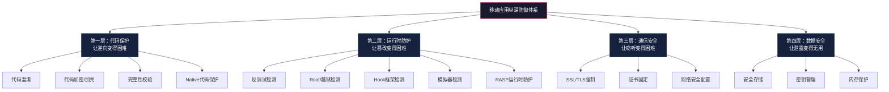
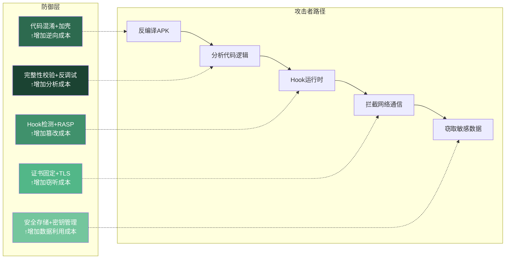

## 18.12 移动安全防御技术

> 知攻方能守，善守方能持久。移动安全防御不是单一技术的堆叠，而是从代码编译到运行时、从本地存储到网络通信、从客户端到服务端的纵深防御体系。

前面的章节从攻击者的视角拆解了移动应用的安全弱点——逆向分析、Hook篡改、数据窃取、通信劫持。本节反转视角，从防御者的角度系统性地构建安全屏障。理解攻击手法之后设计防御，才能做到有的放矢，而非盲目加固。

移动安全防御可以抽象为四层纵深模型：



### 18.12.1 代码保护

代码保护是防御的第一道屏障。其核心目标不是"让攻击者无法破解"——任何软件最终都能被逆向——而是**大幅提高逆向成本**，让攻击者投入的时间和精力超过预期收益。

#### 18.12.1.1 代码混淆

代码混淆通过改变代码的结构和标识符，使逆向分析后的人类可读性大幅降低，同时保持程序的运行逻辑不变。

**ProGuard/R8 混淆（Android 标准方案）**

R8是Google在Android Gradle Plugin 3.4+中引入的替代工具，整合了ProGuard的混淆功能与D8的DEX编译，构建速度更快，产出更小。以下是一份生产级的混淆配置：

```groovy
// build.gradle (Module)
android {
    buildTypes {
        release {
            // 启用代码压缩和混淆
            minifyEnabled true
            // 启用资源压缩（移除未使用的资源）
            shrinkResources true
            proguardFiles getDefaultProguardFile('proguard-android-optimize.txt'),
                'proguard-rules.pro'
        }
    }
}
```

```proguard
# proguard-rules.pro — 生产级混淆规则

# 保留JNI方法（Native方法名不能被混淆）
-keepclasseswithmembernames class * {
    native <methods>;
}

# 保留Parcelable实现
-keep class * implements android.os.Parcelable {
    public static final android.os.Parcelable$Creator *;
}

# 保留序列化类的字段名（避免反序列化失败）
-keepclassmembers class * implements java.io.Serializable {
    static final long serialVersionUID;
    private static final java.io.ObjectStreamField[] serialPersistentFields;
    !static !transient <fields>;
    private void writeObject(java.io.ObjectOutputStream);
    private void readObject(java.io.ObjectInputStream);
    java.lang.Object writeReplace();
    java.lang.Object readResolve();
}

# 保留WebView的JavaScript接口
-keepclassmembers class * {
    @android.webkit.JavascriptInterface <methods>;
}

# 保留R8的优化注解
-keepattributes *Annotation*
-keepattributes SourceFile,LineNumberTable  # 保留行号（崩溃堆栈还原需要）

# 激进优化选项
-optimizations !code/simplification/arithmetic,!code/simplification/cast,!field/*,!class/merging/*
-optimizationpasses 5
-overloadaggressively
-repackageclasses ''
```

**混淆效果对比：**

| 混淆前 | 混淆后 | 说明 |
|--------|--------|------|
| `UserAuthenticationManager` | `a.b.c` | 类名被短化 |
| `validatePassword(String)` | `a(String)` | 方法名被短化 |
| `private String apiKey` | `private String a` | 字段名被短化 |
| `if (password.length() < 8)` | `if (a.length() < 8)` | 局部变量被短化 |

**ProGuard的局限性：** ProGuard/R8是编译期混淆，只能做名称替换和控制流简化。对于已经被反编译为Java源码的jadx等工具，混淆效果有限——攻击者仍然可以看到完整的逻辑流程，只是变量名变成了`a`、`b`、`c`。

**OLLVM 控制流混淆（Native层高级混淆）**

对于Native代码，可以使用Obfuscator-LLVM（OLLVM）进行控制流平坦化、虚假控制流插入和指令替换，这比Java层的名称混淆强大得多：

```c
// OLLVM 控制流平坦化前的代码
int verify_license(const char* key) {
    if (strlen(key) != 16) return 0;
    if (key[0] != 'A') return 0;
    if (key[1] != 'B') return 0;
    // ... 逐字节校验
    return 1;
}

// 经过控制流平坦化后，IDA Pro中看到的是一个巨大的switch-case
// 循环，所有原始的if分支变成了状态变量的跳转表。
// 攻击者必须手动追踪状态机才能理解原始逻辑。
```

OLLVM通过编译器级别的变换，将原本清晰的`if-else`和循环结构替换为不可读的状态机，使IDA Pro和Ghidra的反编译输出完全失去可读性。其代价是增加约10%-30%的运行时开销和约20%-50%的二进制体积膨胀。

**商业加固方案对比：**

| 方案 | 混淆强度 | 加壳支持 | 反调试 | 价格 | 适用场景 |
|------|---------|---------|--------|------|---------|
| ProGuard/R8 | 基础（名称混淆） | 不支持 | 不支持 | 免费 | 所有Android应用 |
| DexGuard | 高级（字符串加密+类加密） | DEX加密 | 内置 | 商业付费 | 金融/支付类应用 |
| iJiami（梆梆加固） | 高级 | DEX加密+SO加固 | 内置 | 商业付费 | 国内企业应用 |
| 360加固保 | 高级 | 多层壳 | 内置 | 基础免费 | 国内中小应用 |
| OLLVM | 高级（控制流混淆） | 不支持 | 不支持 | 免费开源 | Native关键逻辑 |
| SwiftShield | 高级（名称混淆） | 不支持 | 不支持 | 免费开源 | iOS Swift应用 |

#### 18.12.1.2 DEX 加密与加壳

DEX加密在应用启动时将原始DEX文件加密存储，运行时在内存中动态解密加载。攻击者直接从APK中提取的classes.dex是加密后的无效数据，必须在运行时内存中dump才能获取真正的DEX。

```java
// DEX加壳的基本原理（简化示意）
public class ShellApplication extends Application {
    static {
        // 1. 从assets或native层加载加密的DEX
        // 2. 在内存中解密
        // 3. 使用DexClassLoader动态加载
        System.loadLibrary("shell");
    }

    @Override
    protected void attachBaseContext(Context base) {
        super.attachBaseContext(base);
        // Native层完成DEX解密和类加载
        nativeUnpackAndLoad(base.getFilesDir().getAbsolutePath());
    }

    private native void nativeUnpackAndLoad(String dataDir);
}
```

加壳技术的关键在于**抽取壳**的实现：将原始DEX中的方法体代码抽取出来单独加密，只在方法被调用时才从内存中恢复。这使得即使攻击者dump了内存中的DEX，看到的方法体也是空的（只有方法声明，没有方法实现），必须通过Frida Hook在每次方法调用时截获恢复后的字节码。

#### 18.12.1.3 完整性校验

完整性校验检测APK是否被篡改（重打包、资源替换、代码注入），是防御重打包攻击的核心手段。

**APK签名验证（多方案对比）：**

```java
public class IntegrityChecker {

    // 方案一：v1签名（JAR签名）验证 — 仅校验META-INF中的签名文件
    public static boolean verifyV1Signature(Context context) {
        try {
            PackageInfo info = context.getPackageManager()
                .getPackageInfo(context.getPackageName(),
                    PackageManager.GET_SIGNATURES);
            Signature[] sigs = info.signatures;
            // 计算签名证书的SHA-256指纹
            MessageDigest md = MessageDigest.getInstance("SHA-256");
            byte[] digest = md.digest(sigs[0].toByteArray());
            String certHash = bytesToHex(digest);
            // 与预置的合法指纹比对
            return EXPECTED_CERT_HASH.equals(certHash);
        } catch (Exception e) {
            return false;
        }
    }

    // 方案二：APK文件哈希校验 — 校验整个APK的完整性
    public static boolean verifyApkHash(Context context) {
        try {
            String apkPath = context.getPackageCodePath();
            MessageDigest md = MessageDigest.getInstance("SHA-256");
            try (FileInputStream fis = new FileInputStream(apkPath)) {
                byte[] buffer = new byte[8192];
                int bytesRead;
                while ((bytesRead = fis.read(buffer)) != -1) {
                    md.update(buffer, 0, bytesRead);
                }
            }
            String hash = bytesToHex(md.digest());
            return EXPECTED_APK_HASH.equals(hash);
        } catch (Exception e) {
            return false;
        }
    }

    // 方案三：DEX文件CRC校验 — 校验classes.dex是否被修改
    public static boolean verifyDexCrc(Context context) {
        try {
            ZipFile zip = new ZipFile(context.getPackageCodePath());
            ZipEntry dexEntry = zip.getEntry("classes.dex");
            if (dexEntry == null) return false;
            // ZipEntry的CRC值在APK未被修改时是固定的
            return dexEntry.getCrc() == EXPECTED_DEX_CRC;
        } catch (Exception e) {
            return false;
        }
    }
}
```

**重要提醒：** 完整性校验代码本身也是攻击目标。攻击者可以通过Hook `verifyV1Signature()`方法直接返回`true`来绕过校验。因此，完整性校验的逻辑应该：
1. 分散在多个类中，避免单一检查点
2. 使用Native代码实现关键校验逻辑
3. 结合反调试和Hook检测，形成多重防线
4. 校验失败时不要立即退出，而是静默降级（如清除本地缓存的Token、向服务端上报异常）

### 18.12.2 运行时保护

运行时保护的目标是检测应用是否运行在"非预期"的环境中——被调试、被Hook、被Root、被模拟。这些检测是应用自我防御的关键组成部分。

#### 18.12.2.1 Root/越狱检测

**Android Root 检测（多维度方案）**

单一的Root检测方法极易被绕过。一个健壮的Root检测应该同时检查多个维度，并对检测结果进行加权评估：

```java
public class RootDetector {

    // 综合Root评分：分值越高，Root概率越大
    public static int getRootScore(Context context) {
        int score = 0;

        // 1. 检查su二进制文件是否存在（权重：高）
        String[] suPaths = {
            "/system/bin/su", "/system/xbin/su", "/sbin/su",
            "/data/local/su", "/data/local/bin/su",
            "/data/local/xbin/su", "/system/sd/xbin/su",
            "/system/bin/failsafe/su", "/data/local/xbin/su"
        };
        for (String path : suPaths) {
            if (new File(path).exists()) { score += 30; break; }
        }

        // 2. 检查Build标签（权重：中）
        if (Build.TAGS != null && Build.TAGS.contains("test-keys")) {
            score += 25;
        }

        // 3. 检查已知Root管理应用（权重：高）
        String[] rootPackages = {
            "com.topjohnwu.magisk",     // Magisk
            "eu.chainfire.supersu",      // SuperSU
            "com.koushikdutta.superuser", // Superuser
            "com.thirdparty.superuser",  // 其他superuser
            "com.noshufou.android.su",   // su
            "com.zachspong.temprootremovejb",
            "com.ramdroid.appquarantine"
        };
        PackageManager pm = context.getPackageManager();
        for (String pkg : rootPackages) {
            try {
                pm.getPackageInfo(pkg, 0);
                score += 30;
            } catch (PackageManager.NameNotFoundException e) {
                // 未安装，正常
            }
        }

        // 4. 检查system分区是否可写（权重：中）
        try {
            String[] mountCmd = {"mount"};
            Process process = Runtime.getRuntime().exec(mountCmd);
            BufferedReader reader = new BufferedReader(
                new InputStreamReader(process.getInputStream()));
            String line;
            while ((line = reader.readLine()) != null) {
                if (line.contains("/system") && line.contains("rw,")) {
                    score += 20;
                    break;
                }
            }
        } catch (Exception e) { /* 忽略 */ }

        // 5. 检查是否能执行su命令（权重：极高）
        try {
            Process process = Runtime.getRuntime().exec(new String[]{"su", "-c", "id"});
            int exitCode = process.waitFor();
            if (exitCode == 0) score += 50;
        } catch (Exception e) {
            // su不存在，正常
        }

        // 6. SafetyNet/Play Integrity 检测（权重：极高，需联网）
        // 此处需要集成Google Play Integrity API
        // 详见 https://developer.android.com/google/play/integrity/overview

        return score;  // 阈值建议：score >= 40 判定为Rooted
    }
}
```

**iOS 越狱检测：**

```objectivec
// iOS越狱检测（多维度）
@implementation JailbreakDetector

+ (BOOL)isJailbroken {
    // 1. 检查越狱工具文件路径
    NSArray *jailbreakPaths = @[
        @"/Applications/Cydia.app",
        @"/Library/MobileSubstrate/MobileSubstrate.dylib",
        @"/bin/bash",
        @"/usr/sbin/sshd",
        @"/etc/apt",
        @"/private/var/lib/apt/",
        @"/usr/bin/ssh",
        @"/private/var/stash",
        @"/private/var/lib/cydia",
        @"/private/var/tmp/cydia.log",
        @"/Applications/Sileo.app",
        @"/var/jb"  // Dopamine越狱路径
    ];
    for (NSString *path in jailbreakPaths) {
        if ([[NSFileManager defaultManager] fileExistsAtPath:path]) {
            return YES;
        }
    }

    // 2. 检查是否能写入系统目录
    NSError *error;
    NSString *test = @"Jailbreak test";
    [test writeToFile:@"/private/jailbreak.txt" atomically:YES
             encoding:NSUTF8StringEncoding error:&error];
    if (!error) {
        [[NSFileManager defaultManager] removeItemAtPath:@"/private/jailbreak.txt" nil];
        return YES;
    }

    // 3. 检查URL Scheme（Cydia注册了cydia://协议）
    if ([[UIApplication sharedApplication]
            canOpenURL:[NSURL URLWithString:@"cydia://package/com.example.package"]]) {
        return YES;
    }

    // 4. 检查fork()行为（沙箱环境不允许fork）
    int pid = fork();
    if (pid >= 0) {
        // fork成功，说明不在正常沙箱中
        return YES;
    }

    return NO;
}
@end
```

#### 18.12.2.2 反调试检测

调试器是攻击者分析应用逻辑的核心工具。反调试的目标是增加动态分析的难度和成本。

**Java层反调试：**

```java
public class AntiDebug {

    // 方法一：Android Debug API 检测
    public static boolean checkDebuggable() {
        return Debug.isDebuggerConnected() || Debug.waitingForDebugger();
    }

    // 方法二：TracerPid检测（最可靠的Java层反调试手段）
    public static boolean checkTracerPid() {
        try {
            BufferedReader reader = new BufferedReader(
                new FileReader("/proc/self/status"));
            String line;
            while ((line = reader.readLine()) != null) {
                if (line.startsWith("TracerPid:")) {
                    int pid = Integer.parseInt(line.split(":")[1].trim());
                    return pid != 0;  // TracerPid非零说明正在被调试
                }
            }
        } catch (Exception e) {
            return false;
        }
        return false;
    }

    // 方法三：时间差检测（调试器单步执行会大幅增加执行时间）
    public static boolean checkTimingAnomaly() {
        long start = System.nanoTime();
        // 执行一段计算密集的代码
        int result = 0;
        for (int i = 0; i < 1000000; i++) {
            result += Math.sqrt(i);
        }
        long elapsed = System.nanoTime() - start;
        // 正常执行应在50ms内，被调试时可能超过500ms
        return elapsed > 500_000_000L;  // 500ms阈值
    }
}
```

**Native层反调试（更难绕过）：**

```c
#include <sys/ptrace.h>
#include <stdio.h>
#include <string.h>

// 方法一：ptrace自保护（经典技术）
// 每个进程只能被一个tracer附着。自己附着自己，阻止其他调试器。
void anti_debug_ptrace() {
    ptrace(PTRACE_TRACEME, 0, 0, 0);
}

// 方法二：读取 /proc/self/status 检测 TracerPid
int check_tracer_pid_native() {
    FILE *fp = fopen("/proc/self/status", "r");
    if (!fp) return 0;

    char line[256];
    while (fgets(line, sizeof(line), fp)) {
        if (strncmp(line, "TracerPid:", 10) == 0) {
            int pid = atoi(line + 10);
            fclose(fp);
            return pid != 0;
        }
    }
    fclose(fp);
    return 0;
}

// 方法三：检测常见调试器进程
int check_debugger_process() {
    const char *debuggers[] = {
        "frida-server", "frida-agent", "gdb", "gdbserver",
        "lldb-server", "android_server", "android_server64",
        NULL
    };
    FILE *fp = popen("ps -ef", "r");
    if (!fp) return 0;

    char line[512];
    while (fgets(line, sizeof(line), fp)) {
        for (int i = 0; debuggers[i]; i++) {
            if (strstr(line, debuggers[i])) {
                pclose(fp);
                return 1;
            }
        }
    }
    pclose(fp);
    return 0;
}

// 方法四：信号处理陷阱
void signal_handler(int sig) {
    // 收到SIGTRAP说明可能有调试器
    _exit(0);
}

void setup_signal_trap() {
    signal(SIGTRAP, signal_handler);
    // 故意触发一次来测试
    raise(SIGTRAP);
    // 如果执行到这里，说明没有调试器拦截信号
}
```

**反调试检测的对抗现实：** 所有反调试技术都可以被绕过——Frida可以在进程启动前注入，修改`/proc/self/status`的读取结果；`ptrace(PTRACE_TRACEME)`可以被NOP掉；时间差检测可以被Hook。因此反调试不是"绝对防线"，而是提高攻击门槛的"减速带"。

#### 18.12.2.3 Hook 框架检测

Hook框架（Frida、Xposed、Substrate）是移动安全测试的核心工具，同样也是恶意软件的常用手段。检测这些框架的存在是运行时防护的重要组成。

**Frida 检测方案：**

```java
public class FridaDetector {

    // 方法一：检测Frida默认端口（27042）
    public static boolean checkFridaPort() {
        try {
            Socket socket = new Socket();
            socket.connect(new InetSocketAddress("127.0.0.1", 27042), 1000);
            socket.close();
            return true;  // 端口开放说明Frida在运行
        } catch (Exception e) {
            return false;
        }
    }

    // 方法二：检测Frida Agent的特征字符串（内存扫描）
    public static boolean checkFridaInMemory() {
        try {
            BufferedReader reader = new BufferedReader(
                new FileReader("/proc/self/maps"));
            String line;
            while ((line = reader.readLine()) != null) {
                if (line.contains("frida") || line.contains("gadget") ||
                    line.contains("linjector")) {
                    return true;
                }
            }
        } catch (Exception e) {}
        return false;
    }

    // 方法三：检测D-Bus协议特征（Frida使用D-Bus通信）
    public static boolean checkFridaDBus() {
        // Frida在注入时会在进程内存中留下D-Bus协议签名
        // "AUTH\r\n" 是D-Bus认证的起始消息
        return searchInMaps("415554480d0a");  // "AUTH\r\n"的hex
    }
}
```

**Native层Frida检测（更可靠）：**

```c
#include <dirent.h>
#include <stdio.h>
#include <string.h>

// 检测Frida Agent线程
int detect_frida_threads() {
    DIR *dir = opendir("/proc/self/task");
    if (!dir) return 0;

    struct dirent *entry;
    while ((entry = readdir(dir)) != NULL) {
        if (entry->d_type != DT_DIR) continue;
        if (strcmp(entry->d_name, ".") == 0 || strcmp(entry->d_name, "..") == 0)
            continue;

        char path[256];
        snprintf(path, sizeof(path), "/proc/self/task/%s/comm", entry->d_name);
        FILE *fp = fopen(path, "r");
        if (fp) {
            char comm[64];
            if (fgets(comm, sizeof(comm), fp)) {
                // Frida agent 通常创建名为 "gmain"、"gdbus" 的GLib线程
                if (strstr(comm, "gmain") || strstr(comm, "gdbus") ||
                    strstr(comm, "frida") || strstr(comm, "pool-frida")) {
                    fclose(fp);
                    closedir(dir);
                    return 1;
                }
            }
            fclose(fp);
        }
    }
    closedir(dir);
    return 0;
}

// 检测 /proc/self/maps 中的frida相关内存映射
int detect_frida_maps() {
    FILE *fp = fopen("/proc/self/maps", "r");
    if (!fp) return 0;

    char line[512];
    const char *signatures[] = {"frida", "gadget", "linjector", NULL};
    while (fgets(line, sizeof(line), fp)) {
        for (int i = 0; signatures[i]; i++) {
            if (strstr(line, signatures[i])) {
                fclose(fp);
                return 1;
            }
        }
    }
    fclose(fp);
    return 0;
}
```

**Xposed 检测：**

```java
public class XposedDetector {

    // 方法一：检查Xposed安装标记文件
    public static boolean checkXposedFiles() {
        String[] paths = {
            "/system/framework/XposedBridge.jar",
            "/system/lib/libxposed_art.so",
            "/system/lib64/libxposed_art.so",
            "/data/data/de.robv.android.xposed.installer"
        };
        for (String path : paths) {
            if (new File(path).exists()) return true;
        }
        return false;
    }

    // 方法二：检查堆栈中的Xposed特征
    public static boolean checkXposedInStackTrace() {
        for (StackTraceElement element : Thread.currentThread().getStackTrace()) {
            String className = element.getClassName();
            if (className.contains("xposed") ||
                className.contains("de.robv.android.xposed")) {
                return true;
            }
        }
        return false;
    }

    // 方法三：检查ClassLoader中的Xposed类
    public static boolean checkXposedClasses() {
        try {
            Class.forName("de.robv.android.xposed.XposedBridge");
            return true;
        } catch (ClassNotFoundException e) {
            return false;
        }
    }
}
```

#### 18.12.2.4 模拟器检测

攻击者和安全研究人员大量使用模拟器进行自动化分析。检测模拟器可以有效增加批量分析的成本。

```java
public class EmulatorDetector {

    public static boolean isEmulator(Context context) {
        // Build属性检测（最快，但最容易伪造）
        if (Build.FINGERPRINT.startsWith("generic") ||
            Build.FINGERPRINT.startsWith("unknown") ||
            Build.FINGERPRINT.contains("test-keys") ||
            Build.MODEL.contains("google_sdk") ||
            Build.MODEL.contains("Emulator") ||
            Build.MODEL.contains("Android SDK built for x86") ||
            Build.MANUFACTURER.contains("Genymotion") ||
            Build.BRAND.startsWith("generic") ||
            Build.DEVICE.startsWith("generic") ||
            Build.PRODUCT.contains("sdk") ||
            Build.PRODUCT.contains("vbox") ||
            Build.PRODUCT.contains("emulator")) {
            return true;
        }

        // 硬件特征检测
        if (Build.HARDWARE.contains("goldfish") ||
            Build.HARDWARE.contains("ranchu") ||
            Build.HARDWARE.contains("vbox86")) {
            return true;
        }

        // 传感器检测（模拟器通常没有真实的加速度计/陀螺仪数据）
        SensorManager sm = (SensorManager) context.getSystemService(
            Context.SENSOR_SERVICE);
        Sensor accelerometer = sm.getDefaultSensor(Sensor.TYPE_ACCELEROMETER);
        if (accelerometer == null) {
            return true;  // 没有加速度计，大概率是模拟器
        }

        // 电话功能检测
        TelephonyManager tm = (TelephonyManager) context.getSystemService(
            Context.TELEPHONY_SERVICE);
        if (tm.getNetworkOperatorName().equals("Android") ||
            tm.getNetworkOperator().equals("310260")) {
            return true;
        }

        // 文件系统检测
        String[] emulatorFiles = {
            "/dev/socket/qemud", "/dev/qemu_pipe",
            "/system/lib/libc_malloc_debug_qemu.so",
            "/sys/qemu_trace", "/system/bin/qemu-props"
        };
        for (String path : emulatorFiles) {
            if (new File(path).exists()) return true;
        }

        return false;
    }
}
```

**各检测手段的有效性与对抗成本：**

| 检测手段 | 实现难度 | 绕过难度 | 误报率 | 推荐权重 |
|---------|---------|---------|--------|---------|
| Build属性检查 | 低 | 低（修改Build.prop即可） | 低 | ★★☆ |
| 硬件特征检查 | 低 | 中（需要修改模拟器配置） | 低 | ★★★ |
| 传感器数据检查 | 中 | 高（需要注入传感器数据） | 中 | ★★★★ |
| 文件系统检查 | 低 | 中（删除特征文件） | 低 | ★★★ |
| 电话功能检查 | 低 | 中（需要配置Telephony） | 高 | ★★☆ |
| GPU渲染特征检查 | 高 | 高（需要定制GPU驱动） | 低 | ★★★★ |

#### 18.12.2.5 RASP（运行时应用自我保护）

RASP是将安全防护逻辑嵌入应用运行时的技术。与传统的WAF（Web应用防火墙）不同，RASP运行在应用内部，可以访问完整的上下文信息（调用栈、变量值、用户身份），因此具有更低的误报率和更高的检测精度。

**RASP 的核心能力：**

| 防护能力 | 具体防护内容 | 实现位置 |
|---------|------------|---------|
| SQL注入防护 | 监控SQLiteDatabase.rawQuery()的参数 | Java/Kotlin层 |
| XSS防护 | 监控WebView.loadUrl()和evaluateJavascript() | Java/Kotlin层 |
| 文件操作监控 | 监控open()/fopen()的路径，防止路径穿越 | Native层 |
| 密码学监控 | 拦截弱算法（DES/ECB/硬编码密钥）的使用 | Java/Native层 |
| 组件注入防护 | 监控Intent的目标组件是否合法 | Android Framework层 |
| 反调试联动 | 检测到调试时触发敏感数据清除 | 多层 |
| 内存保护 | 监控mprotect()调用，防止内存页属性修改 | Native层 |

**开源RASP方案 — Frida反制示例（应用检测并对抗Frida的注入）：**

```c
// 在Native层检测到Frida后执行的反制措施
void counter_frida() {
    // 检测到Frida注入
    if (detect_frida_maps() || detect_frida_threads()) {
        // 策略一：清除内存中的敏感数据
        memset(sensitive_key_buffer, 0, key_length);
        memset(sensitive_token_buffer, 0, token_length);

        // 策略二：破坏Frida的通信通道
        // 关闭Frida可能使用的socket
        int fd;
        for (fd = 3; fd < 1024; fd++) {
            close(fd);
        }

        // 策略三：通知服务端
        report_anomaly_to_server("frida_detected");

        // 策略四：优雅降级（不崩溃，但禁用敏感功能）
        disable_sensitive_operations();
    }
}
```

### 18.12.3 网络通信安全防御

移动应用的网络通信是数据泄露和中间人攻击的主要通道。有效的通信安全防御需要从协议选择、证书验证、流量保护三个层面构建。

#### 18.12.3.1 SSL/TLS 强制与网络安全配置

Android 7.0（API 24）引入了网络安全配置（Network Security Configuration），允许开发者以声明式的方式定义应用的网络安全策略，无需编写代码。

```xml
<!-- res/xml/network_security_config.xml -->
<?xml version="1.0" encoding="utf-8"?>
<network-security-config>
    <!-- 禁止所有明文HTTP通信 -->
    <base-config cleartextTrafficPermitted="false">
        <trust-anchors>
            <!-- 信任系统预装CA证书 -->
            <certificates src="system" />
            <!-- 可选：信任用户安装的CA（调试用，生产环境应移除） -->
            <!-- <certificates src="user" /> -->
        </trust-anchors>
    </base-config>

    <!-- 针对特定域名的例外配置 -->
    <domain-config>
        <domain includeSubdomains="true">api.myapp.com</domain>
        <!-- 证书固定：只信任指定的证书或公钥 -->
        <pin-set expiration="2026-01-01">
            <!-- SHA-256公钥哈希 -->
            <pin digest="SHA-256">7HIpactkIAq2Y49orFOOQKurWxmmSFZhBCoQYcRhJ3Y=</pin>
            <!-- 备用pin（证书轮换时使用） -->
            <pin digest="SHA-256">fwza0LRMXouZHRC8Ei+4PyuldPDcf3UKgO/04cDM1oE=</pin>
        </pin-set>
    </domain-config>
</network-security-config>
```

在AndroidManifest.xml中引用：

```xml
<application
    android:networkSecurityConfig="@xml/network_security_config"
    android:usesCleartextTraffic="false"
    ... >
```

#### 18.12.3.2 证书固定（Certificate Pinning）

证书固定是防止中间人攻击的最有效手段。即使攻击者在设备上安装了自签名CA证书，证书固定也能阻止中间人代理（如Burp Suite、mitmproxy）拦截HTTPS流量。

**OkHttp 证书固定：**

```java
// 使用OkHttp实现证书固定
OkHttpClient client = new OkHttpClient.Builder()
    .certificatePinner(new CertificatePinner.Builder()
        // 固定api.myapp.com的证书公钥SHA-256哈希
        .add("api.myapp.com",
             "sha256/AAAAAAAAAAAAAAAAAAAAAAAAAAAAAAAAAAAAAAAAAAA=")
        // 备用pin
        .add("api.myapp.com",
             "sha256/BBBBBBBBBBBBBBBBBBBBBBBBBBBBBBBBBBBBBBBBBBB=")
        .build())
    .build();
```

**自定义TrustManager实现更精细的证书验证：**

```java
public class PinningTrustManager implements X509TrustManager {
    private final String expectedCertHash;

    public PinningTrustManager(String expectedCertHash) {
        this.expectedCertHash = expectedCertHash;
    }

    @Override
    public void checkServerTrusted(X509Certificate[] chain, String authType)
            throws CertificateException {
        if (chain == null || chain.length == 0) {
            throw new CertificateException("Certificate chain is empty");
        }

        // 获取服务器证书的公钥哈希
        PublicKey publicKey = chain[0].getPublicKey();
        MessageDigest md = MessageDigest.getInstance("SHA-256");
        byte[] digest = md.digest(publicKey.getEncoded());
        String certHash = Base64.encodeToString(digest, Base64.NO_WRAP);

        // 比对公钥哈希
        if (!expectedCertHash.equals(certHash)) {
            throw new CertificateException(
                "Certificate pinning failure: unexpected public key hash");
        }

        // 额外校验证书有效期
        chain[0].checkValidity();
    }

    @Override
    public X509Certificate[] getAcceptedIssuers() {
        return new X509Certificate[0];
    }
}
```

**iOS 证书固定（NSURLSessionDelegate）：**

```objectivec
// iOS证书固定实现
- (void)URLSession:(NSURLSession *)session
    didReceiveChallenge:(NSURLAuthenticationChallenge *)challenge
    completionHandler:(void (^)(NSURLSessionAuthChallengeDisposition,
                                NSURLCredential *))completionHandler {

    SecTrustRef serverTrust = challenge.protectionSpace.serverTrust;
    SecCertificateRef serverCert = SecTrustGetCertificateAtIndex(serverTrust, 0);

    // 获取服务端证书的公钥
    SecKeyRef serverPublicKey = SecTrustCopyPublicKey(serverTrust);
    CFDataRef serverPublicKeyData = SecKeyCopyExternalRepresentation(serverPublicKey, NULL);

    // 与预置的合法公钥比对
    NSData *expectedPublicKeyData = [self loadExpectedPublicKey];
    if ([(__bridge NSData *)serverPublicKeyData isEqualToData:expectedPublicKeyData]) {
        completionHandler(NSURLSessionAuthChallengeUseCredential,
                         [NSURLCredential credentialForTrust:serverTrust]);
    } else {
        completionHandler(NSURLSessionAuthChallengeCancelAuthenticationChallenge, nil);
    }

    CFRelease(serverPublicKeyData);
    CFRelease(serverPublicKey);
}
```

**证书固定的注意事项：**

| 问题 | 风险 | 解决方案 |
|------|------|---------|
| 证书过期 | 应用无法联网 | 始终配置备用pin + 设置合理的expiration |
| 证书轮换 | 部署新证书后旧版本应用失效 | 使用公钥pin而非证书pin，新旧证书可用同一密钥对 |
| 调试困难 | 开发环境无法抓包 | 使用debug专用的network_security_config，仅在release启用pin |
| CDN域名 | 大量CDN节点证书不一致 | 仅对自有API域名做pin，CDN域名不做固定 |

### 18.12.4 数据安全防御

数据安全是防御体系的最终目标——即使攻击者突破了代码保护和运行时防护，敏感数据仍然是加密的、不可读的。

#### 18.12.4.1 安全存储

**Android 安全存储层次：**

| 存储方式 | 安全级别 | 适用数据 | 加密支持 |
|---------|---------|---------|---------|
| SharedPreferences | 低（明文XML） | 非敏感配置 | 需自行加密 |
| 内部存储文件 | 中（应用沙箱） | 应用私有数据 | 需自行加密 |
| SQLite数据库 | 中（应用沙箱） | 结构化数据 | 需SQLCipher等 |
| Android Keystore | 高（硬件支持） | 密钥材料 | 硬件加密 |
| EncryptedSharedPreferences | 高 | 敏感配置项 | Jetpack Security |
| EncryptedFile | 高 | 敏感文件 | Jetpack Security |

**Jetpack Security 加密存储（推荐方案）：**

```kotlin
// EncryptedSharedPreferences — 自动加密的SharedPreferences
import androidx.security.crypto.EncryptedSharedPreferences
import androidx.security.crypto.MasterKey

val masterKey = MasterKey.Builder(context)
    .setKeyScheme(MasterKey.KeyScheme.AES256_GCM)
    .build()

val securePrefs = EncryptedSharedPreferences.create(
    context,
    "secure_prefs",
    masterKey,
    EncryptedSharedPreferences.PrefKeyEncryptionScheme.AES256_SIV,
    EncryptedSharedPreferences.PrefValueEncryptionScheme.AES256_GCM
)

// 使用方式与普通SharedPreferences完全一致
securePrefs.edit().putString("auth_token", token).apply()
val savedToken = securePrefs.getString("auth_token", null)
```

**iOS 安全存储（Keychain）：**

```objectivec
// iOS Keychain安全存储
#import <Security/Security.h>

- (BOOL)saveToKeychain:(NSString *)key data:(NSData *)data {
    NSDictionary *query = @{
        (id)kSecClass: (id)kSecClassGenericPassword,
        (id)kSecAttrAccount: key,
        (id)kSecAttrService: @"com.myapp.service",
        (id)kSecValueData: data,
        (id)kSecAttrAccessible: (id)kSecAttrAccessibleWhenUnlockedThisDeviceOnly,
        // 生物识别保护：需要Face ID/Touch ID才能访问
        (id)kSecAttrAccessControl: (__bridge id)SecAccessControlCreateWithFlags(
            kCFAllocatorDefault,
            kSecAttrAccessibleWhenUnlockedThisDeviceOnly,
            kSecAccessControlBiometryCurrentSet | kSecAccessControlUserPresence,
            NULL)
    };
    // 先删除旧值再添加
    SecItemDelete((__bridge CFDictionaryRef)query);
    OSStatus status = SecItemAdd((__bridge CFDictionaryRef)query, NULL);
    return status == errSecSuccess;
}
```

#### 18.12.4.2 密钥管理

密钥管理是加密体系中最薄弱的环节。密钥的生成、存储、使用、轮换、销毁每个环节都可能成为攻击目标。

**密钥管理的五大原则：**

1. **密钥与数据分离**：加密密钥永远不要和加密数据存储在同一位置
2. **使用硬件保护**：优先使用Android Keystore / iOS Secure Enclave存储密钥
3. **密钥派生而非硬编码**：使用PBKDF2或HKDF从用户口令派生密钥
4. **密钥轮换**：定期更换密钥，旧密钥加密的数据需要重新加密
5. **最小化密钥暴露时间**：使用后立即清零内存中的密钥副本

```kotlin
// Android Keystore 密钥管理（硬件安全模块支持）
import android.security.keystore.KeyGenParameterSpec
import android.security.keystore.KeyProperties
import java.security.KeyStore
import javax.crypto.KeyGenerator
import javax.crypto.Cipher

// 生成密钥（密钥材料永远不离开Keystore硬件）
fun generateSecretKey(alias: String) {
    val keyGenerator = KeyGenerator.getInstance(
        KeyProperties.KEY_ALGORITHM_AES, "AndroidKeyStore")
    keyGenerator.init(
        KeyGenParameterSpec.Builder(
            alias,
            KeyProperties.PURPOSE_ENCRYPT or KeyProperties.PURPOSE_DECRYPT
        )
        .setBlockModes(KeyProperties.BLOCK_MODE_GCM)
        .setEncryptionPaddings(KeyProperties.ENCRYPTION_PADDING_NONE)
        .setKeySize(256)
        // 需要用户认证才能使用密钥（生物识别或锁屏密码）
        .setUserAuthenticationRequired(true)
        // 密钥在用户认证后有效期（秒）
        .setUserAuthenticationParameters(300,
            KeyProperties.AUTH_BIOMETRIC_STRONG or
            KeyProperties.AUTH_DEVICE_CREDENTIAL)
        .build()
    )
    keyGenerator.generateKey()
}

// 使用密钥加密数据
fun encryptData(alias: String, plaintext: ByteArray): Pair<ByteArray, ByteArray> {
    val keyStore = KeyStore.getInstance("AndroidKeyStore").apply { load(null) }
    val secretKey = keyStore.getKey(alias, null) as javax.crypto.SecretKey

    val cipher = Cipher.getInstance("AES/GCM/NoPadding")
    cipher.init(Cipher.ENCRYPT_MODE, secretKey)
    val iv = cipher.iv  // GCM模式的IV/Nonce
    val ciphertext = cipher.doFinal(plaintext)
    return Pair(iv, ciphertext)
}
```

#### 18.12.4.3 内存保护

敏感数据在内存中的存活时间越长，被内存dump攻击获取的风险越大。

```c
// 内存安全实践

// 1. 使用后立即清零敏感数据
void use_sensitive_data() {
    char *password = get_user_password();
    // ... 使用密码进行认证 ...
    // 使用后立即清零
    volatile char *p = password;
    while (*p) *p++ = 0;
    free(password);
}

// 2. 使用mlock防止敏感内存被换出到磁盘
#include <sys/mman.h>

void protect_memory(void *addr, size_t len) {
    // 锁定内存页，防止被swap到磁盘
    mlock(addr, len);
    // 设置内存保护属性
    mprotect(addr, len, PROT_READ);
}

// 3. 使用madvise标记敏感内存
void mark_memory_sensitive(void *addr, size_t len) {
    // MADV_DONTDUMP：排除在core dump中
    madvise(addr, len, MADV_DONTDUMP);
}
```

**Java层内存保护注意事项：**

| 操作 | 风险 | 缓解措施 |
|------|------|---------|
| String存储密码 | String不可变，无法手动清零 | 使用char[]代替 |
| SharedPreferences存储 | 明文XML文件 | 使用EncryptedSharedPreferences |
| Log输出敏感信息 | logcat可被其他应用读取 | 使用BuildConfig.DEBUG条件编译 |
| WebView传递敏感数据 | JavaScript桥可能泄露 | 使用addJavascriptInterface + @JavascriptInterface注解限制 |

### 18.12.5 防御策略的层次化设计

单一的防御手段无法抵御所有攻击。有效的安全防御需要**纵深防御**——多层互补的安全机制，让攻击者必须同时突破所有层才能成功。



**防御效果的期望管理：**

没有任何单一技术能提供100%的安全保障。防御技术的真实价值在于**提高攻击成本**，让攻击者的时间投入超出预期收益。以下是各防御层对攻击者增加的时间成本估算：

| 防御层 | 对新手攻击者 | 对中级攻击者 | 对高级攻击者 |
|--------|------------|------------|------------|
| 代码混淆 | +2-4小时 | +30分钟 | +5分钟 |
| DEX加壳 | +4-8小时 | +1-2小时 | +15分钟 |
| 反调试 | +2-4小时 | +30分钟 | +10分钟 |
| Hook检测 | +4-8小时 | +1-2小时 | +20分钟 |
| 证书固定 | +2-4小时 | +15分钟 | +5分钟 |
| 安全存储 | +8-16小时 | +2-4小时 | +30分钟 |
| **组合效果** | **+24-48小时** | **+6-10小时** | **+1.5小时** |

对于大多数应用，将攻击门槛提升到"中级攻击者需要6-10小时"已经足够——这已经远超自动化扫描工具的能力范围，能有效防御绝大多数批量攻击和低针对性的威胁。

### 18.12.6 常见误区与纠正

| 误区 | 真相 | 正确做法 |
|------|------|---------|
| "加了ProGuard就安全了" | ProGuard只做名称替换，jadx反编译后逻辑清晰可见 | 配合Native保护+加壳+运行时检测 |
| "SSL Pinning能防所有中间人" | Pinning可以被Frida绕过，也可被修改smali移除 | Pinning是必要但不充分的，配合证书校验+完整性检测 |
| "Root检测能阻止攻击" | Root检测可以被Hook绕过（返回false） | 检测只是减速带，核心数据仍需加密保护 |
| "加密了就安全了" | 硬编码密钥等于明文存储 | 使用Android Keystore/Secure Enclave管理密钥 |
| "安全加固一劳永逸" | 攻击技术不断演进，防御需要持续更新 | 建立持续安全监控机制+定期安全审计 |
| "只关注客户端防御" | 客户端代码终将被破解 | 服务端做最终校验，敏感操作必须服务端授权 |

### 18.12.7 进阶：面向未来的移动防御趋势

**硬件级安全增强：** ARM TrustZone、Apple Secure Enclave等硬件安全模块正在成为移动防御的信任根基。未来的关键操作（支付签名、生物识别、密钥管理）将越来越多地依赖硬件隔离执行环境（TEE），而非纯软件实现。

**AI驱动的异常检测：** 利用机器学习模型分析应用运行时行为模式，自动识别异常操作序列（如突然大量读取联系人+上传网络），相比规则引擎能更好地应对零日攻击。

**零信任移动架构：** 不信任设备本身的环境状态，每次敏感操作都通过服务端动态评估设备风险评分（设备指纹+行为分析+环境检测），根据评分动态调整安全策略（允许/要求二次认证/拒绝）。

**隐私计算融合：** 联邦学习、安全多方计算等隐私计算技术将与移动安全深度结合，实现在保护用户数据隐私的前提下完成业务功能（如欺诈检测模型的本地推理）。

---

> **本节小结**：移动安全防御是一项系统工程，核心理念是"纵深防御"——通过代码保护、运行时防护、通信安全、数据安全四层防线，将攻击者的突破成本提升到不可接受的水平。没有任何单一技术是银弹，有效的防御来自于多层安全机制的组合应用和持续的安全运营。作为安全从业者，理解防御技术的能力边界（什么能防住、什么防不住）比掌握具体工具更重要。
