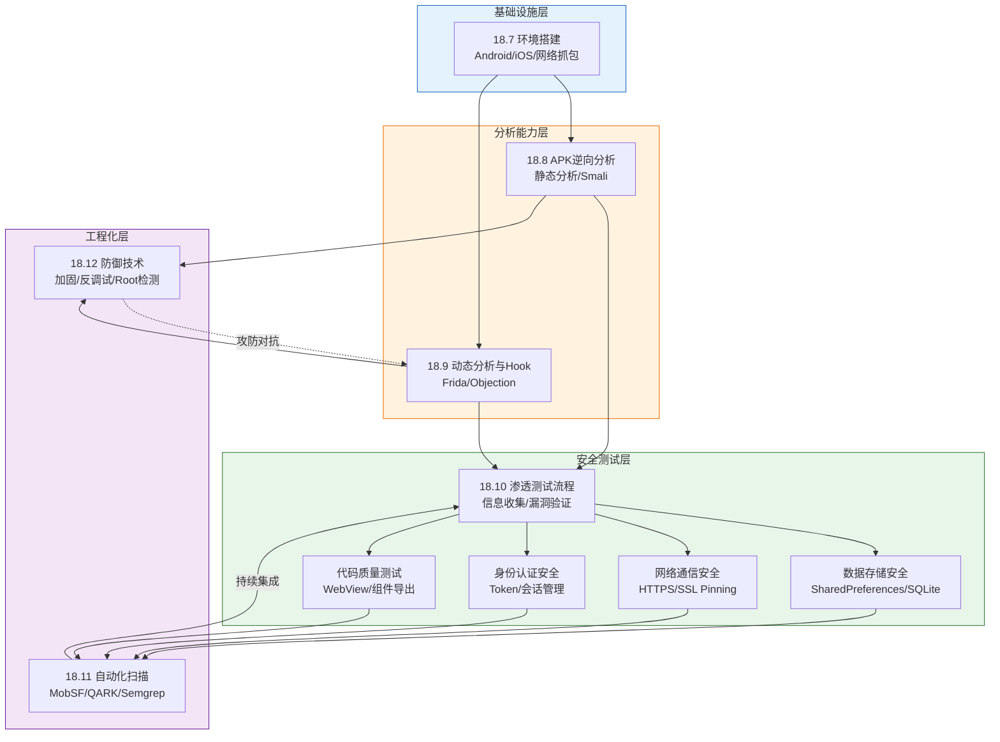
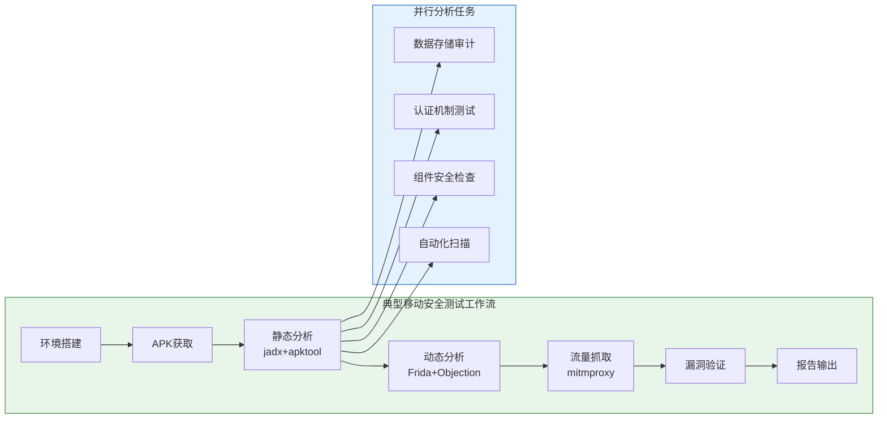

## 本节小结

本节系统讲解了移动安全测试的十大核心技能领域，从环境搭建到攻防对抗，构建了一条完整的移动安全能力成长路径。下面将从知识体系总览、各模块核心要点回顾、技能关联图谱、常见误区与纠正、能力成长路线五个维度进行系统性总结。

### 知识体系总览

本节覆盖的十大模块构成了移动安全测试的完整能力栈，它们之间的逻辑关系可以用下图表示：

### 各模块核心要点回顾

#### 模块一：环境搭建（18.7）

环境搭建是所有后续工作的前提。核心要点：

| 维度 | Android | iOS |
|------|---------|-----|
| 测试设备 | Root设备（Pixel系列）+ 未Root设备 + 模拟器 | 可越狱iPhone（A11及以前）+ macOS |
| 核心工具 | ADB、apktool、jadx、Frida | Frida、class-dump、ios-deploy |
| 抓包方案 | mitmproxy + SSL Pinning绕过 | mitmproxy + 证书信任配置 |
| 关键配置 | frida-server推送与启动 | Cydia源安装Frida |

**关键技能**：Frida环境的完整配置——从`frida-server`推送到设备、启动服务、附加进程，是贯穿后续所有动态分析操作的基础。SSL Pinning绕过脚本是抓包测试的必备武器。

#### 模块二：APK逆向分析（18.8）

APK逆向是静态分析的核心能力，标准五步流程：

1. **解包**：`apktool d` 获取 smali、资源文件、AndroidManifest.xml
2. **反编译**：`jadx` 将 DEX 转为可读的 Java 源码
3. **清单分析**：权限声明、组件 exported 属性、debuggable/allowBackup 标志
4. **敏感信息搜索**：grep 硬编码的 API Key、密码、Token、HTTP 端点
5. **Smali 修改与重打包**：修改关键检查逻辑，apktool 重打包 + jarsigner/apksigner 签名

**Smali 关键能力**：理解 `.locals`、`invoke-virtual`、`move-result-object`、`const/4` 等指令，能直接修改方法返回值绕过授权检查。重打包流程（apktool b → keytool → jarsigner → zipalign）必须熟练掌握。

#### 模块三：动态分析与Hook（18.9）

动态分析是发现运行时漏洞的核心手段。三个层次：

- **Frida 基础Hook**：SSL Pinning 绕过（OkHttp3 CertificatePinner、TrustManagerFactory），是流量抓取的前置条件
- **Frida 进阶Hook**：加密操作监控（Cipher.doFinal）、SharedPreferences 读写监控，用于追踪敏感数据流向
- **Objection 封装**：`android sslpinning disable`、`android root disable`、`memory search`、`sharedpreferences export` 等一键命令，大幅降低动态分析门槛

**关键理解**：Frida 的 `Java.perform()` + `Java.use()` 是所有 Hook 脚本的基础模式。`overload()` 用于指定重载方法的参数签名，`implementation` 替换原始方法实现。

#### 模块四：渗透测试流程（18.10）

移动渗透测试的标准流程：信息收集 → 静态分析 → 动态分析 → 漏洞验证 → 报告输出。`aapt dump badging` 获取包名、SDK版本、应用标签；MobSF Docker 部署实现一键自动化分析。

#### 模块五至八：四大安全测试维度

| 测试维度 | 检查要点 | 典型漏洞 |
|----------|----------|----------|
| 数据存储 | SharedPreferences、SQLite、日志、外部存储、剪贴板 | 明文存储用户凭据、未加密数据库 |
| 网络通信 | HTTPS强制、SSL Pinning、证书验证、密码套件、认证机制 | 证书验证缺失、弱TLS配置 |
| 身份认证 | 暴力破解防护、会话管理、Token过期/刷新、生物认证绕过 | Token永不过期、生物认证可绕过 |
| 代码质量 | debuggable标志、allowBackup、WebView安全、组件导出 | WebView启用JavaScript接口、未授权组件访问 |

#### 模块九：自动化安全扫描（18.11）

三款核心工具覆盖不同使用场景：

- **MobSF**：全功能移动安全框架，Docker 一键部署，支持 REST API 集成到 CI/CD 流水线，适合团队协作和批量扫描
- **QARK**：专注 Android 的快速审查工具，`qark --apk target.apk --report-type html` 一行命令出报告
- **Semgrep**：基于规则的代码扫描，通过自定义 YAML 规则检测硬编码密钥、不安全 API 调用等模式，适合融入开发流程

#### 模块十：防御技术（18.12）

防御技术是攻击视角的镜像——理解防御才能更好地突破防御：

- **应用加固**：ProGuard/R8 代码混淆（minifyEnabled true）、NDK Native 层保护敏感逻辑
- **运行时保护**：Root/越狱检测（su 二进制文件、Build.TAGS、Magisk 包名）、反调试检测（Debug.isDebuggerConnected、/proc/self/status TracerPid）
- **攻防博弈**：每一种防御都有对应的绕过手段——Frida Hook 可以绕过绝大多数 Java 层检测，但 Native 层保护显著增加了绕过成本

### 技能关联图谱

本节各模块并非孤立存在，它们在实际测试中形成紧密的工作流：

**关键关联**：

1. **环境搭建 → 一切**：没有 Root 设备和 Frida 环境，动态分析无法启动；没有 mitmproxy 配置，网络通信安全测试无从谈起
2. **逆向分析 → 动态分析**：静态分析确定 Hook 目标（类名、方法名、参数签名），动态分析验证运行时行为
3. **防御技术 → 逆向分析**：理解 ProGuard 混淆规则才能读懂混淆后的代码；理解 Root 检测机制才能在 Root 设备上顺利测试
4. **自动化扫描 → 手动测试**：MobSF/Semgrep 快速定位可疑点，手动深入验证确认漏洞可利用性

### 常见误区与纠正

#### 误区一：只关注 Java 层，忽略 Native 层

**错误表现**：用 jadx 反编译后只看 Java 代码，忽略了 `lib/` 目录下的 `.so` 文件。

**纠正方法**：很多安全敏感操作（密钥计算、签名校验、Root 检测）被放在 NDK 层实现。使用 IDA Pro 或 Ghidra 分析 `.so` 文件，关注 `JNI_OnLoad`、`RegisterNatives` 等函数。Frida 同样支持 Native Hook：`Interceptor.attach(Module.findExportByName("libnative.so", "sensitive_func"), {...})`。

#### 误区二：Frida 脚本只跑一次，不考虑应用更新

**错误表现**：写好一个 SSL Pinning 绕过脚本就一直用，应用更新后脚本失效却不知道原因。

**纠正方法**：每次应用更新后检查 Frida 脚本的目标类和方法是否仍然存在。使用 `Java.use()` 包裹 try-catch，在类或方法不存在时输出明确的错误信息。维护多个版本的绕过脚本，覆盖不同的 SSL Pinning 实现（OkHttp3、WebViewClient、NetworkSecurityConfig）。

#### 误区三：重打包后不验证签名完整性

**错误表现**：apktool 重打包后直接安装，忽略签名验证失败的问题。

**纠正方法**：重打包后必须使用 `apksigner verify --verbose target_final.apk` 验证签名。如果目标应用有签名校验（很多银行、支付类应用都有），需要同时绕过签名校验逻辑——通常在 `PackageManager.getPackageInfo().signatures` 的 Hook 中替换为原始签名。

#### 误区四：只用自动化工具，不手动验证

**错误表现**：完全依赖 MobSF 报告，不手动验证发现的问题。

**纠正方法**：自动化工具存在误报和漏报。MobSF 报告的"硬编码密钥"可能是资源 ID 而非真实密钥；报告的"不安全的 WebView"可能已经通过 `setWebContentsDebuggingEnabled(false)` 禁用了调试。每个自动化发现都必须手动确认可利用性。

#### 误区五：忽略应用的完整性校验机制

**错误表现**：在 Root 设备上直接测试，忽略应用可能检测到 Root 环境而改变行为。

**纠正方法**：先用 Objection 的 `android root disable` 或专门的 Root 隐藏模块（Magisk Hide / Shamiko）隐藏 Root 状态。然后对比 Root 设备和非 Root 设备上应用的行为差异——有些应用在检测到 Root 后会禁用部分功能或跳转到安全提示页面。

### 能力成长路线

从入门到精通的四个阶段：

#### 第一阶段：工具上手（1-2周）

- 搭建完整的 Android 测试环境（模拟器 + ADB + Frida）
- 使用 jadx 反编译 3 个以上真实 APK，熟悉代码结构
- 使用 Objection 的内置命令完成基本的 SSL Pinning 绕过和 Root 检测绕过
- 使用 mitmproxy 抓取至少一个应用的 HTTPS 流量

#### 第二阶段：技能内化（2-4周）

- 手动编写 Frida Hook 脚本，实现加密操作监控、SharedPreferences 读写追踪
- 掌握 Smali 代码阅读和修改，完成一次完整的 APK 修改 → 重打包 → 签名 → 安装流程
- 使用 MobSF 对 5 个以上应用进行自动化扫描，理解报告中每个问题的含义
- 在靶场环境（DIVA、InsecureBankv2、OWASP UnCrackable Apps）中完成所有挑战

#### 第三阶段：实战测试（4-8周）

- 对真实应用（在授权范围内）完成完整的渗透测试流程
- 编写 Semgrep 自定义规则，检测特定的安全模式
- 学习 Native 层分析基础，使用 Ghidra 分析简单的 .so 文件
- 掌握 iOS 安全测试基础（越狱设备 + Frida + class-dump）

#### 第四阶段：攻防对抗（持续）

- 研究应用加固方案（加壳、VMP、代码虚拟化）的绕过技术
- 跟踪 Android/iOS 新版本的安全机制变化（如 Android 的 Scoped Storage、iOS 的 Pointer Authentication）
- 参与 CTF 移动安全方向竞赛，挑战高难度题目
- 贡献开源安全工具，参与社区技术交流

### 从核心技巧到实战应用

本节建立的技术栈将在后续的实战案例中得到综合运用。以"恶意应用窃取用户凭据"为例，完整的攻击链涉及：

1. **环境搭建**（模块一）→ 准备测试设备和工具链
2. **APK逆向**（模块二）→ 分析恶意应用的代码逻辑，定位数据窃取入口
3. **动态Hook**（模块三）→ 运行时追踪窃取的数据内容和外传方式
4. **网络分析**（模块六）→ 抓取外传流量，确认C2服务器地址
5. **存储审计**（模块五）→ 检查本地残留的窃取数据
6. **自动化扫描**（模块九）→ 批量检测同类恶意应用

掌握本节的十大核心技能，就拥有了系统性分析移动应用安全问题的能力框架。下一步的关键是将这些零散的技能点串联成完整的工作流，在实战中反复锤炼，直到每个步骤都成为肌肉记忆。
