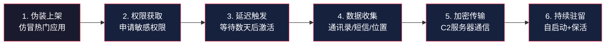

## 18.1 移动安全威胁全景

移动安全不是传统网络安全的简单延伸。移动设备在硬件形态、操作系统架构、应用分发模式、用户交互方式等方面与PC存在本质差异，这些差异塑造了一个独特的攻击面。理解这个攻击面的全貌，是学习移动安全攻防技术的第一步。

### 18.1.1 移动安全的特殊性

移动设备与传统PC在安全模型上存在五大根本性差异。每一个差异都对应一组独立的攻击向量和防御策略。

#### 差异一：物理接触攻击面

移动设备的核心特征是"随身携带"，这带来了PC时代几乎不存在的物理安全问题。

**设备丢失与被盗**：据IDC统计，全球每年约有7000万部智能手机丢失或被盗。与笔记本电脑不同，手机体积小、使用场景分散（餐厅、出租车、会议室），丢失概率远高于PC。更关键的是，许多用户未启用屏幕锁或仅使用4位PIN码——在2024年NIST发布的数字身份指南中，4位PIN已被明确列为"弱认证"。

**旁路攻击（Shoulder Surfing）**：移动设备在公共场所的使用频率远高于PC。攻击者可以在地铁、咖啡厅等场景中直接观察用户输入密码、查看敏感信息。研究表明，在拥挤环境中，旁路攻击的成功率高达73%（IEEE S&P 2023）。

**USB物理攻击**：通过USB接口可以进行多种攻击：利用ADB调试接口提取数据、通过恶意充电站注入恶意代码（"juice jacking"）、利用USB协议漏洞进行设备取证。Android设备在开启USB调试模式后，ADB shell提供了接近root级别的数据访问能力。

**防御思路**：启用强生物识别认证（指纹+面部）、开启全盘加密、配置远程擦除功能、禁用不必要的USB调试选项。

#### 差异二：封闭但可穿透的应用生态

移动应用的分发模式与PC软件有本质区别。Android和iOS分别构建了各自的应用商店体系，但"围墙花园"并非密不透风。

**官方应用商店的局限性**：

| 安全机制 | Android (Google Play) | iOS (App Store) |
|---------|----------------------|-----------------|
| 审核方式 | 自动扫描 + 人工抽检 | 人工审核 + 自动化工具 |
| 审核周期 | 数小时至数天 | 通常24-48小时 |
| 已知绕过方式 | 动态代码加载、延迟触发、服务器端下发恶意配置 | 企业证书滥用、TestFlight分发、时间差攻击 |
| 历史重大事件 | Joker恶意软件持续上架（2017-2024） | XcodeGhost感染数百款应用（2015） |

**侧载与第三方市场**：Android生态中，侧载（sideload）是合法且常见的应用安装方式。APKPure、APKMirror等第三方市场以及企业内部MDM分发渠道，都绕过了Google Play的安全审核。在中国市场，由于Google Play不可用，华为应用市场、小米应用商店、应用宝等第三方渠道是主要分发途径，各渠道的安全审核标准参差不齐。

**供应链风险**：现代移动应用平均集成15-20个第三方SDK。这些SDK的权限与应用本身相同，但开发者往往无法完全审计其代码。2023年Meta曝光的案例中，一个被超过1000款应用集成的广告SDK被发现秘密收集用户的Wi-Fi扫描历史和已安装应用列表。

#### 差异三：传感器数据暴露

移动设备搭载的传感器数量远超PC，每个传感器都可能成为隐私泄露的渠道。

**传感器攻击面全景**：

| 传感器 | 正常用途 | 恶意利用方式 | 攻击案例 |
|--------|---------|-------------|---------|
| GPS | 导航、定位 | 持续位置追踪、地理围栏 | 研究发现即使关闭GPS，仍可通过Wi-Fi扫描推断位置 |
| 麦克风 | 通话、录音 | 环境监听、语音关键词提取 | Skygofree木马通过麦克风窃听WhatsApp通话 |
| 摄像头 | 拍照、视频 | 偷拍、环境监控 | Pegasus间谍软件可静默激活前后摄像头 |
| 加速度计 | 计步、屏幕旋转 | 键盘输入推断（通过振动模式） | 学术研究证明可通过陀螺仪数据还原触摸键盘输入 |
| 光线传感器 | 自动亮度 | 环境光线模式分析，推断用户作息 | 研究通过光线传感器数据重建用户日常活动轨迹 |
| NFC | 近场通信 | 恶意NFC标签注入、数据窃取 | 通过NFC标签自动打开恶意URL |

**传感器权限的演进**：Android 12引入了传感器权限的细粒度控制，允许用户精确指定每个传感器的访问权限。iOS则从设计之初就将传感器访问与用户授权绑定。但权限模型的改进并不能完全解决问题——加速度计和陀螺仪在Android 12之前不需要任何权限即可访问，且至今仍有大量设备运行旧版本系统。

#### 差异四：复杂多变的网络环境

移动设备的网络连接模式远比PC复杂，这扩大了网络层攻击面。

**网络切换风险**：移动设备频繁在Wi-Fi、蜂窝网络、蓝牙、NFC之间切换。每次切换都可能引入新的攻击向量。例如，从受信任的家庭Wi-Fi切换到公共Wi-Fi时，如果没有VPN保护，所有未加密的网络流量都将暴露给同一网络中的攻击者。

**Wi-Fi攻击**：移动设备通常配置为自动连接已知Wi-Fi网络。攻击者可以创建与已知网络同名的恶意热点（Evil Twin），或利用WPA2的KRACK漏洞（CVE-2017-13077至13082）截获通信。2023年的一项调查显示，在主要城市的机场和酒店中，约12%的开放Wi-Fi热点实际上是恶意接入点。

**蜂窝网络安全**：2G/3G网络的加密协议已被证明存在严重缺陷。GSM的A5/1加密可以在数小时内被暴力破解。虽然4G/5G大幅提升了安全性，但降级攻击（forcing the device to use 2G）仍然有效。Android 12+提供了"禁止2G连接"的选项，但默认未启用。

**蓝牙攻击**：BlueBorne（CVE-2017-0781等）证明了无需配对即可通过蓝牙远程执行代码的可能性。BLE（蓝牙低功耗）设备的广播数据也可被用于追踪用户位置。

#### 差异五：用户行为模式差异

移动设备的使用习惯创造了PC时代不存在的社会工程攻击面。

**即时性与注意力分散**：移动设备上的通知推送频率远高于PC，用户倾向于快速点击而不仔细审查。研究表明，移动设备上的钓鱼链接点击率比PC高3倍（Proofpoint, 2024），原因在于屏幕尺寸小导致URL显示不完整，以及用户在移动场景中的注意力更加分散。

**多任务切换**：移动用户频繁在应用间切换，这使得恶意应用可以在后台执行操作而不被用户察觉。Android的"最近任务"视图会显示应用截图，可能泄露敏感信息。

**信任模型差异**：用户对移动应用的信任阈值远低于PC软件——他们更愿意授予应用各种权限，对应用的来源和安全性审查更为宽松。这一心理差异被恶意应用开发者大量利用。

### 18.1.2 威胁分类体系

移动安全威胁可以从多个维度进行分类。以下从攻击目标和攻击手法两个视角构建完整的威胁地图。

#### 按攻击目标分类

```mermaid
graph TD
    A["移动安全威胁"] --> B["针对设备的威胁"]
    A --> C["针对数据的威胁"]
    A --> D["针对通信的威胁"]
    A --> E["针对用户的威胁"]
    A --> F["针对生态的威胁"]

    B --> B1["恶意应用"]
    B --> B2["Root/越狱攻击"]
    B --> B3["物理攻击"]
    B --> B4["固件攻击"]

    C --> C1["数据窃取"]
    C --> C2["数据篡改"]
    C --> C3["数据勒索"]
    C --> C4["隐私泄露"]

    D --> D1["中间人攻击"]
    D --> D2["DNS劫持"]
    D --> D3["SSL剥离"]
    D --> D4["协议降级"]

    E --> E1["钓鱼攻击"]
    E --> E2["社会工程"]
    E --> E3["欺诈应用"]
    E --> E4["短信验证码劫持"]

    F --> F1["供应链污染"]
    F --> F2["SDK后门"]
    F --> F3["应用商店滥用"]
    F --> F4["企业证书滥用"]

    style A fill:#1a1a2e,stroke:#e94560,color:#fff
    style B fill:#16213e,stroke:#0f3460,color:#fff
    style C fill:#16213e,stroke:#0f3460,color:#fff
    style D fill:#16213e,stroke:#0f3460,color:#fff
    style E fill:#16213e,stroke:#0f3460,color:#fff
    style F fill:#16213e,stroke:#0f3460,color:#fff
```



#### 按攻击手法详解

##### 一、恶意应用（Malicious Applications）

恶意应用是移动安全威胁中最普遍、影响面最广的类别。它们的伪装手段和攻击目标各不相同。

**银行木马（Banking Trojan）**：伪装成银行、支付或系统工具类应用，通过覆盖攻击（overlay attack）在真实银行界面上方叠加伪造的登录界面，窃取用户的银行凭据。2024年最活跃的银行木马家族包括：

- **Anatsa（TeaBot）**：感染超过100万Google Play用户，针对全球650+银行应用，通过无障碍服务窃取凭据
- **Vultur**：首次使用屏幕录制+键盘记录的组合攻击方式，绕过传统覆盖检测
- **Hook**：基于RAT（远程访问木马）架构，支持实时屏幕流传输，攻击者可以像操作自己手机一样操控受害设备

**间谍软件（Spyware）**：以监控为目标，秘密收集设备上的通话记录、短信、位置信息、照片等数据。Pegasus（NSO Group开发的商业间谍软件）代表了这一领域的最高技术水平——它可以通过iMessage零点击漏洞完全接管iPhone，无需用户任何交互。2023年曝光的Operation Triangulation利用四个零日漏洞构建了另一条iPhone攻击链，通过iMessage发送的恶意附件触发，可在设备上安装后门并窃取麦克风录音、位置数据、照片等。

**广告软件（Adware）**：通过大量弹出广告、浏览器劫持、强制安装其他应用来牟利。虽然看似"危害较小"，但广告软件常被用作更严重攻击的跳板——它们通常要求大量权限，且行为模式模糊了恶意软件的边界。2024年Google Play上被移除的恶意应用中，约40%最初以广告软件形式存在，后续通过远程配置更新添加了数据窃取功能。

**勒索软件（Ransomware）**：加密设备数据或锁定设备屏幕，要求支付赎金。移动勒索软件通常通过侧载渠道传播，Android设备是主要目标。典型手法包括：利用设备管理员权限锁定屏幕、加密外部存储中的照片和文档、威胁公开用户隐私数据。

##### 二、数据泄露（Data Leakage）

数据泄露是移动应用最常见的安全问题，据统计平均每款应用存在2.3个数据泄露风险点（Synopsys, 2024）。数据泄露分为应用层面和系统层面两种。

**应用层面数据泄露**：

- **不安全的本地存储**：将敏感数据（Token、密码、个人信息）以明文形式存储在SharedPreferences（Android）或UserDefaults（iOS）中。攻击者通过root/越狱设备或备份文件即可直接读取
- **日志信息泄露**：开发阶段使用的日志语句（Android的Log.d/Log.e、iOS的NSLog）未在发布版中移除，导致敏感信息通过logcat或系统日志暴露
- **剪贴板数据泄露**：用户复制的密码、验证码等敏感数据存储在系统剪贴板中，其他应用可以无限制访问（Android 12之前）
- **备份数据泄露**：Android的android:allowBackup="true"配置允许通过ADB备份提取应用全部数据，包括SharedPreferences、SQLite数据库等
- **WebView数据泄露**：不当的WebView配置（如启用JavaScript接口但未做输入校验）可能导致本地文件被读取

**系统层面数据泄露**：

- **系统日志**：Android logcat对所有应用可读（Android 4.1之前），敏感信息可能出现在系统日志中
- **网络缓存**：HTTPS响应可能被缓存到磁盘，TLS会话信息可能被其他应用读取
- **内存残留**：敏感数据在内存中的生命周期管理不当，应用退出后数据仍驻留内存

##### 三、网络攻击（Network Attacks）

移动设备频繁的网络切换和复杂的网络环境为网络层攻击创造了条件。

**中间人攻击（Man-in-the-Middle, MitM）**：攻击者位于通信双方之间，截获并可能篡改传输数据。在移动场景中，MitM攻击的典型场景包括：

- 公共Wi-Fi环境下的ARP欺骗
- 恶意Wi-Fi热点（Evil Twin）
- DNS劫持将域名解析到恶意服务器
- 证书伪造或CA证书注入

**SSL/TLS攻击**：移动应用的SSL/TLS实现存在多种常见缺陷：

| 缺陷类型 | 具体表现 | 风险等级 | 检测方法 |
|---------|---------|---------|---------|
| 未使用HTTPS | 明文传输敏感数据 | 严重 | mitmproxy抓包 |
| 证书验证不完整 | 自定义TrustManager接受所有证书 | 严重 | 代码审计 |
| 证书固定未实现 | 依赖系统证书存储 | 中 | Frida Hook测试 |
| 允许弱密码套件 | 支持RC4、DES等弱算法 | 高 | SSLyze扫描 |
| 未禁用TLS降级 | 可被迫使用SSLv3/TLS1.0 | 高 | testssl.sh测试 |

**协议降级攻击**：强制通信双方使用安全性更低的协议版本。例如，SSL POODLE攻击利用SSLv3的CBC模式填充缺陷，在SSLv3降级场景下可以解密HTTPS Cookie。

##### 四、物理攻击（Physical Attacks）

物理接触设备后，攻击者拥有了比远程攻击更大的权限空间。

**USB调试攻击**：Android设备开启USB调试后，ADB提供了广泛的数据访问能力。攻击者可以通过物理连接执行以下操作：

```bash
# 列出设备上所有已安装的应用包名
adb shell pm list packages

# 提取应用APK文件
adb shell pm path com.target.app
adb pull /data/app/com.target.app/base.apk

# 读取应用SharedPreferences（需要root或run-as）
adb shell run-as com.target.app cat /data/data/com.target.app/shared_prefs/config.xml

# 实时查看系统日志
adb logcat | grep -i "password\|token\|key\|secret"
```

**取证工具攻击**：Cellebrite UFED、GrayKey等商业取证工具可以在物理接触设备后提取大量数据，包括已删除的短信、通话记录、照片、应用数据等。这些工具利用BootROM漏洞或未公开的系统漏洞绕过设备加密。

**SIM卡攻击**：物理接触SIM卡可以进行SIM卡克隆，获取用户的手机号码、短信和通话记录。SIM Swapping（SIM卡替换）则通过社会工程手段让运营商将目标手机号转移到攻击者控制的SIM卡上，从而绕过短信验证码保护。

##### 五、社会工程（Social Engineering）

社会工程利用人类心理弱点而非技术漏洞，在移动场景中尤为有效。

**短信钓鱼（Smishing）**：通过短信发送伪装成银行、快递、政府机构的钓鱼链接。2024年全球Smishing攻击同比增长42%（Proofpoint数据），其中伪装成快递通知的短信在中国市场占比最高。典型的攻击链为：伪造快递短信 → 点击链接 → 打开仿冒银行页面 → 输入银行卡信息 → 资金被盗。

**语音钓鱼（Vishing）**：利用VoIP技术伪装来电号码，冒充银行客服或公安机关进行电话诈骗。AI语音合成技术的成熟使得Vishing攻击更加逼真——攻击者只需几秒钟的样本即可生成目标人物的语音模型。

**通知栏钓鱼**：恶意应用可以发送伪造的系统通知，诱导用户点击并执行敏感操作。例如，伪装成"系统更新"的通知引导用户授予无障碍服务权限，从而获得设备的完全控制权。

**二维码攻击**：移动设备的摄像头天然支持二维码扫描。恶意二维码可以触发以下攻击：自动连接恶意Wi-Fi、下载恶意应用、打开钓鱼页面、执行JavaScript代码。

##### 六、供应链攻击（Supply Chain Attacks）

供应链攻击在移动生态中的影响面越来越广，因为现代移动应用高度依赖第三方组件。

**SDK后门**：第三方SDK被植入恶意代码的案例屡见不鲜。2023年曝光的案例中，一个被2000+应用集成的广告SDK被发现将用户的设备信息和位置数据发送至位于东欧的未知服务器。由于SDK以二进制形式集成，开发者很难通过代码审计发现此类问题。

**开源库漏洞**：移动应用依赖的开源库（如OkHttp、Retrofit、Realm、AFNetworking等）可能存在已知漏洞。OWASP Dependency-Check和Snyk等工具可以扫描项目依赖中的已知漏洞，但许多团队在发布前并未执行此类检查。

**构建环境污染**：攻击者入侵开发者的构建环境（如Xcode、Android Studio），在编译过程中注入恶意代码。XcodeGhost事件就是典型案例——攻击者发布了被篡改的Xcode安装包，使用该版本编译的应用会自动在代码中注入恶意逻辑。

### 18.1.3 全球移动威胁态势

#### 关键数据指标

截至2025年，全球移动安全威胁的核心数据如下：

| 指标 | 数据 | 来源 |
|------|------|------|
| 全球移动恶意软件样本 | 每月新增超过330万个 | AV-TEST Institute, 2024 |
| 移动银行木马感染数 | Anatsa单次攻击感染100万+用户 | ThreatFabric, 2024 |
| 国家级移动监控能力 | Pegasus可零点击接管iPhone | 国际特赦组织调查报告 |
| 企业移动数据泄露占比 | 60%的企业数据泄露涉及移动设备 | Verizon DBIR, 2024 |
| 移动应用漏洞密度 | 平均每个应用存在6.2个安全问题 | Synopsys, 2024 |
| 全球活跃智能手机用户 | 超过70亿 | Statista, 2025 |
| 移动应用年下载量 | 超过2550亿次 | App Annie, 2024 |

#### 威胁趋势演变

移动安全威胁在过去十年经历了三个明显的演进阶段：

**第一阶段（2012-2016）：粗放增长期**。恶意应用以"量"取胜，通过第三方市场大量分发简单的短信扣费木马和广告软件。攻击手法粗糙，主要依赖用户缺乏安全意识。

**第二阶段（2017-2021）：技术升级期**。攻击者开始使用更复杂的技术：动态代码加载绕过应用商店审核、利用无障碍服务获取设备控制权、开发商业间谍软件（Pegasus）进行国家级监控。银行木马从简单的覆盖攻击演进为支持远程控制的完整RAT。

**第三阶段（2022-至今）：AI融合期**。AI技术被同时用于攻防两端：攻击者利用AI生成高度逼真的钓鱼内容和深度伪造语音，防御者则利用机器学习检测异常应用行为。5G网络的普及扩大了移动设备的攻击面，IoT设备与手机的联动创造了新的攻击向量。

#### 地区差异

不同地区的移动安全威胁呈现显著差异：

- **中国市场**：第三方应用市场是主要分发渠道，审核标准不统一导致恶意应用传播风险更高。短信验证码是主要的身份认证方式，SIM卡劫持和短信拦截是高发威胁
- **欧美市场**：Google Play和App Store是主要分发渠道，但侧载需求（如企业MDM）仍然存在。数据隐私法规（GDPR、CCPA）对应用的数据收集行为提出了严格要求
- **东南亚市场**：移动支付普及率高但安全基础设施相对薄弱，银行木马和支付欺诈是主要威胁。预装恶意应用的山寨手机是独特的安全风险
- **中东和非洲市场**：国家级监控软件的使用较为普遍，Pegasus等间谍软件的主要目标用户集中在此区域

### 18.1.4 典型攻击链分析

理解攻击者如何将多个单一漏洞串联成完整的攻击链，比了解单个漏洞更有实战价值。以下是三个典型的移动安全攻击链。

#### 攻击链一：恶意应用从分发到数据窃取



**阶段详解**：

1. **伪装上架**：攻击者将恶意应用伪装成系统清理工具、手电筒、壁纸应用等低门槛应用，利用用户对这类应用的低警觉性。部分高级攻击会先上架一个无害的版本，在通过审核后通过远程配置更新注入恶意代码
2. **权限获取**：利用用户的"权限疲劳"心理，在首次启动时一次性请求大量权限。部分恶意应用会使用"权限与功能绑定"的话术，例如声称"需要通讯录权限才能备份联系人"
3. **延迟触发**：为了避免被应用商店的动态检测发现，恶意代码通常在安装后等待数小时甚至数天才开始执行。部分恶意应用还会检测运行环境（是否在模拟器中、是否被调试），在检测到安全分析环境时保持安静
4. **数据收集**：批量收集通讯录、短信、通话记录、GPS位置、已安装应用列表、设备标识符等信息
5. **加密传输**：使用HTTPS或自定义加密协议将窃取的数据上传到C2（Command & Control）服务器。部分高级恶意应用使用域名生成算法（DGA）动态生成C2地址，增加追踪难度
6. **持续驻留**：利用JobScheduler、WorkManager、前台服务、广播接收器等机制保持后台运行，部分应用还会利用设备管理员权限防止被卸载

#### 攻击链二：公共Wi-Fi环境下的会话劫持

1. 攻击者在咖啡厅/酒店创建与合法Wi-Fi同名的恶意热点
2. 受害者手机自动连接恶意热点（如果之前连接过同名网络）
3. 攻击者通过DNS劫持将目标应用的API域名解析到恶意服务器
4. 如果应用未实现证书固定，攻击者使用自签名证书进行中间人攻击
5. 截获用户的认证Token，使用该Token在自己的设备上登录目标应用
6. 以受害者身份执行敏感操作（转账、修改密码等）

#### 攻击链三：企业设备的横向渗透

1. 攻击者通过钓鱼邮件向企业员工发送伪装成"公司通知"的恶意应用
2. 员工在企业配发的手机上安装恶意应用
3. 恶意应用利用企业内部应用的已知漏洞获取更多权限
4. 通过VPN连接访问企业内网资源
5. 在内网中横向移动，访问文件服务器、数据库等敏感资源
6. 窃取企业机密数据并通过加密通道外传

### 18.1.5 移动安全与传统安全的对比

理解移动安全与传统Web安全、PC安全的异同，有助于安全从业者快速建立移动安全的认知框架。

| 维度 | Web安全 | PC安全 | 移动安全 |
|------|--------|--------|---------|
| 攻击面 | 浏览器+Web服务器 | 操作系统+本地应用 | 操作系统+应用+传感器+物理 |
| 应用分发 | 无需安装 | 官网/光盘/下载 | 应用商店（受限） |
| 权限模型 | 浏览器沙箱 | 用户自主控制 | 系统级权限弹窗 |
| 更新机制 | 服务端即时生效 | 用户手动/自动更新 | 应用商店审核后推送 |
| 数据存储 | 服务端为主 | 本地为主 | 本地+云端混合 |
| 网络环境 | 固定网络为主 | 固定/移动网络 | 频繁切换 |
| 物理风险 | 低 | 中 | 高 |
| 调试难度 | 中（浏览器DevTools） | 低（完整工具链） | 高（需要特殊设备和权限） |

### 18.1.6 小结

移动安全威胁的全景可以从三个维度概括：

1. **威胁来源维度**：恶意应用、网络攻击、物理攻击、社会工程、供应链攻击五大类
2. **攻击目标维度**：设备层、数据层、通信层、用户层、生态层五个层次
3. **技术演进维度**：从粗放到精细、从单一到组合、从手动到AI驱动三个阶段

本节建立了移动安全威胁的全局认知框架。后续章节将在此基础上，分别深入Android和iOS的安全架构（18.2-18.3），系统性地介绍OWASP Mobile Top 10安全风险（18.4），以及从开发和运营视角构建安全防御体系（18.5-18.6）。

> **下一节预告**：18.2节将深入解剖Android安全架构的六层安全机制——从Linux内核层的UID隔离和SELinux，到应用层的签名机制和权限模型，每一层都配有ADB命令和代码示例，让你能够亲手验证安全机制的工作原理。
