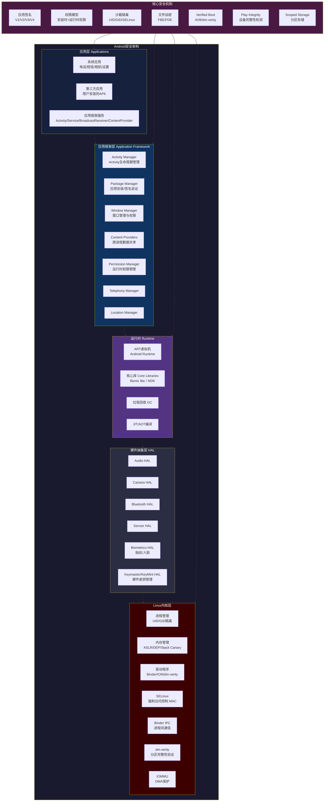
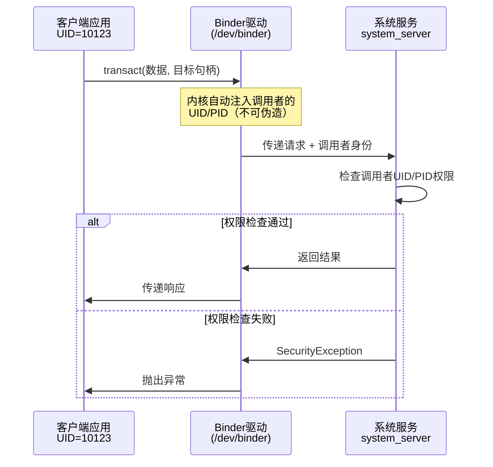
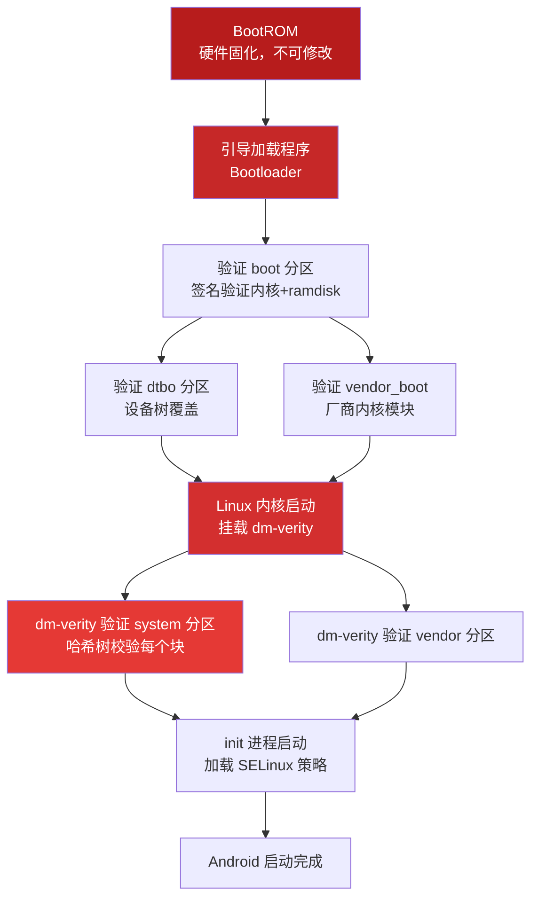
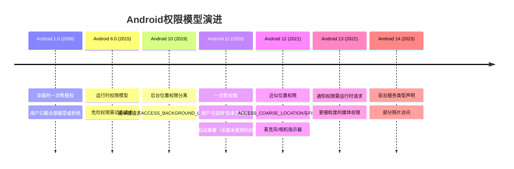
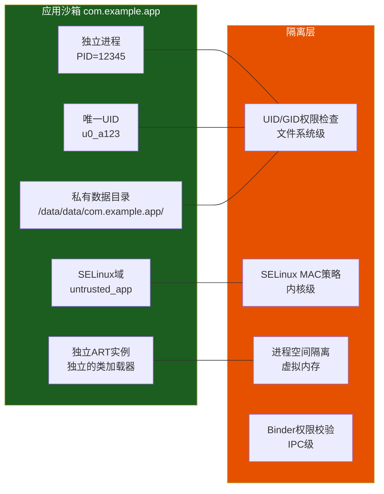
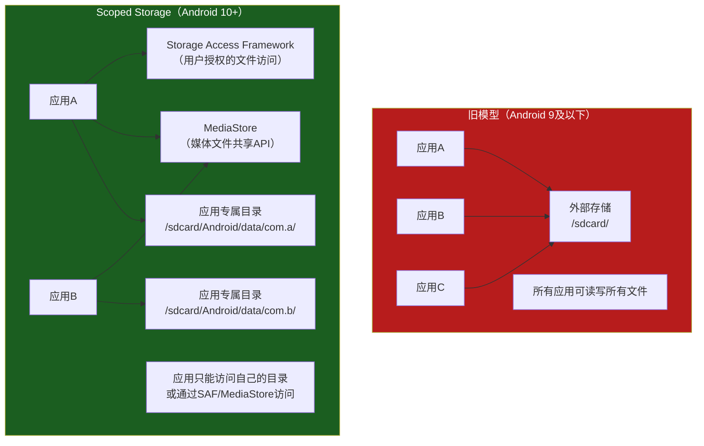
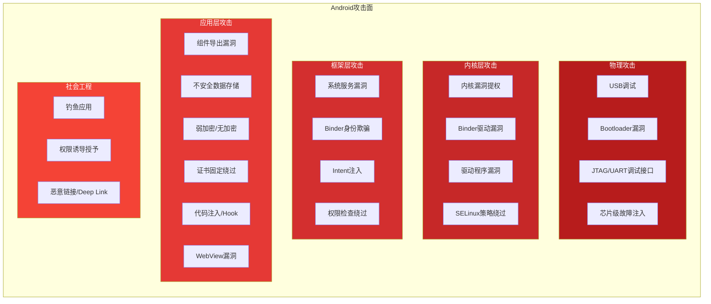

## 18.2 Android安全架构

Android的安全架构是一个多层次纵深防御体系，从Linux内核到应用层，每一层都承担着独立的安全职责。理解这个架构不仅是安全研究的基础，更是发现漏洞、绕过防护的前提。攻击者需要找到各层之间的缝隙，而防御者则需要确保每一层的策略都不被穿透。

### Android安全架构全景图



---

### 18.2.1 Linux内核层安全

Android基于Linux内核构建，内核层是整个安全架构的基石。内核层的安全机制直接决定了设备的硬件级防护能力。

#### 进程隔离与UID机制

Android继承了Linux的多用户模型，但将其改造为应用隔离机制。每个应用在安装时被分配一个唯一的Linux用户ID（UID），范围从10000（即`u0_a0`）开始。

```bash
# 查看应用进程的UID
$ adb shell ps -A | grep com.example.app
u0_a123  12345  678  1234567  123456 SyS_epoll+ 0 S com.example.app
# u0_a123 表示 UID = 10000 + 123 = 10123
# u0 表示 userId=0（主用户/机主），多用户设备会有 u10, u11 等

# 通过dumpsys查看应用的完整UID信息
$ adb shell dumpsys package com.example.app | grep userId
    userId=10123

# 查看应用进程的GID列表（包含权限组）
$ adb shell cat /proc/12345/status | grep Groups
Groups: 10123 1028 10041 3001 3002 3003
```

UID隔离的核心逻辑：

| 概念 | 含义 | 安全作用 |
|------|------|----------|
| UID（User ID） | 应用的唯一标识 | 进程级隔离，不同UID进程无法直接访问对方内存 |
| GID（Group ID） | 权限组标识 | 通过共享GID实现受控的跨应用访问 |
| sharedUserId | AndroidManifest中声明 | 已废弃，允许同签名应用共享UID |
| userId | 多用户场景下的用户ID | 工作空间/访客模式的隔离 |

**共享UID的已知风险**：`android:sharedUserId`允许声明相同`sharedUserId`且签名相同的应用共享同一UID。这在旧版本Android中被广泛使用，但存在严重的安全隐患——一旦其中一个应用被攻破，同UID的所有应用都会受到影响。Android 13已弃用此机制。

```xml
<!-- 危险的sharedUserId用法（已废弃） -->
<manifest android:sharedUserId="com.example.shared"
    package="com.example.app1">
```

#### SELinux强制访问控制

从Android 5.0（Lollipop）开始，SELinux被强制启用（Enforcing模式）。SELinux在传统的自主访问控制（DAC）之上叠加了强制访问控制（MAC），这是Android安全架构中最关键的内核级防护。

```bash
# 查看SELinux状态
$ adb shell getenforce
Enforcing

# 查看特定进程的SELinux安全上下文
$ adb shell ps -eZ | grep com.example.app
u:r:untrusted_app:s0:c123,c456 u0_a123 12345 ... com.example.app

# 上下文格式：用户:角色:类型:安全级别
# u:r:untrusted_app:s0:c123,c456
#   用户(u) = 系统用户
#   角色(r) = 运行角色
#   类型(untrusted_app) = 应用域标签
#   安全级别(s0) = MLS级别
#   类别(c123,c456) = MCS类别（用于应用间隔离）

# 查看系统应用的上下文（权限更高）
$ adb shell ps -eZ | grep system_server
u:r:system_server:s0 system 1234 ... system_server

# 查看SELinux策略中的域转换规则
$ adb shell seinfo -t | head -20
```

Android SELinux的关键域标签：

| 域标签 | 对应进程 | 访问权限 |
|--------|----------|----------|
| `untrusted_app` | 第三方应用 | 最严格，无法访问系统文件和设备节点 |
| `platform_app` | 使用平台签名的应用 | 可访问部分系统资源 |
| `system_app` | 系统应用（如设置、电话） | 可访问大部分系统API |
| `system_server` | 系统服务进程 | 高权限，但受MAC策略约束 |
| `init` | PID 1 | 启动阶段权限最高 |
| `kernel` | 内核进程 | 内核级访问 |
| `su` | root shell（如果存在） | 受限于su域策略 |
| `radio` | 基带相关进程 | 访问电话/短信功能 |
| `bluetooth` | 蓝牙进程 | 访问蓝牙硬件和协议栈 |
| `vold` | 存储管理进程 | 挂载/卸载文件系统 |

**SELinux对安全研究的影响**：即使获得了root权限，如果SELinux处于Enforcing模式，攻击者仍然受到MAC策略的限制。例如，root进程无法直接读取其他应用的私有数据目录，除非SELinux策略允许。这就是为什么在渗透测试中，除了获取root shell外，还需要关注`getenforce`的输出。

```bash
# 典型的权限拒绝场景
$ adb shell su -c "cat /data/data/com.other.app/databases/secret.db"
cat: /data/data/com.other.app/databases/secret.db: Permission denied
# 即使是root，SELinux也阻止了跨域访问

# 查看SELinux拒绝日志（audit日志）
$ adb shell dmesg | grep "avc: denied"
avc: denied { read } for pid=1234 comm="cat"
    path="/data/data/com.other.app/databases/secret.db"
    scontext=u:r:su:s0 tcontext=u:object_r:app_data_file:s0:c512,c768
    tclass=file permissive=0
```

#### Binder IPC安全

Binder是Android最核心的进程间通信（IPC）机制，几乎所有系统服务调用都通过Binder完成。Binder的安全模型建立在内核级身份验证之上。



Binder安全的核心机制：

- **身份不可伪造**：Binder驱动在内核层自动注入调用方的UID和PID，应用层无法篡改。系统服务（如`ActivityManagerService`）通过`Binder.getCallingUid()`获取调用者身份后进行权限校验。
- **权限声明**：通过`android:permission`属性限制哪些应用可以调用特定服务。
- **SELinux策略**：Binder通信受SELinux策略控制，即使UID匹配，SELinux域标签不匹配也会被拒绝。

```java
// 服务端：验证调用者身份
public class MyService extends Service {
    @Override
    public IBinder onBind(Intent intent) {
        // 获取调用者UID
        int callingUid = Binder.getCallingUid();
        // 校验调用者是否有权限
        if (callingUid != ALLOWED_UID) {
            throw new SecurityException("Unauthorized caller");
        }
        return binder;
    }
}
```

#### Verified Boot与dm-verity

Android Verified Boot（AVB）确保设备启动链的完整性，防止恶意软件在启动过程中注入代码。



dm-verity的工作原理：system分区被划分为4KB的数据块，每个块的SHA-256哈希值组成Merkle哈希树。内核在读取每个数据块时，都会沿着哈希树向上验证到根哈希值，根哈希值存储在已签名的vbmeta分区中。任何对system分区的篡改都会导致哈希不匹配，设备会拒绝启动或进入recovery模式。

```bash
# 查看设备的verified boot状态
$ adb shell getprop ro.boot.verifiedbootstate
green   # 完全验证通过
yellow  # 自定义密钥签名
orange  # Bootloader已解锁（安全研究设备）
red     # 验证失败

# 查看dm-verity状态
$ adb shell getprop ro.boot.veritymode
enforcing

# 查看vbmeta分区信息
$ adb shell avbtool info_image --image /dev/block/by-name/vbmeta
```

**安全研究意义**：Bootloader解锁（`fastboot flashing unlock`）会将verified boot状态设为`orange`，此时dm-verity对system分区的验证会被跳过。这就是为什么安全研究人员通常使用已解锁Bootloader的设备——可以修改system分区来安装自定义工具（如Frida、Magisk）。

---

### 18.2.2 应用签名机制

Android要求所有APK必须经过数字签名。签名不仅是身份标识，更是安全模型的核心——权限授予、应用更新、跨进程信任都依赖签名验证。

#### 签名方案演进

Android支持四种签名方案，它们逐步增强安全性和验证效率：

| 签名方案 | 引入版本 | 签名位置 | 特点 |
|----------|----------|----------|------|
| V1（JAR签名） | Android 1.0 | `META-INF/`目录 | 对每个文件单独签名，不保护ZIP元数据 |
| V2（APK签名方案V2） | Android 7.0 | APK Signing Block | 对整个APK文件签名，速度更快，安全性更高 |
| V3（APK签名方案V3） | Android 9.0 | APK Signing Block | 支持密钥轮换，可在不更换签名的情况下更新签名密钥 |
| V4（APK签名方案V4） | Android 11 | 独立`.idsig`文件 | 基于Merkle哈希树，支持增量安装（ADB Incremental Install） |

```bash
# 查看APK的签名信息（所有版本）
$ apksigner verify --verbose --print-certs app.apk
Verifies
Verified using v1 scheme (JAR signing): true
Verified using v2 scheme (APK Signature Scheme v2): true
Verified using v3 scheme (APK Signature Scheme v3): true
Verified using v4 scheme (APK Signature Scheme v4): false
Number of signers: 1

# 查看签名证书详情
$ keytool -printcert -jarfile app.apk
Owner: CN=Developer, OU=Engineering, O=Example Corp
Issuer: CN=Developer, OU=Engineering, O=Example Corp
Serial number: 1a2b3c4d
Valid from: Mon Jan 01 00:00:00 UTC 2024
SHA-256: AB:CD:EF:12:34:56:78:90:...

# 使用apksigner检查签名轮换链（V3+）
$ apksigner verify --print-certs --min-sdk-version 28 app.apk
```

**V1签名的已知弱点**：V1签名对每个文件单独计算签名，但ZIP文件的元数据（如文件名、注释字段）不在签名范围内。攻击者可以在这些未签名区域注入恶意内容，而不破坏签名有效性。这就是为什么Android 7.0+强制要求V2签名。

#### 签名安全在渗透测试中的意义

```bash
# 签名验证可以检测APK是否被篡改
$ original_hash=$(sha256sum original.apk | cut -d' ' -f1)
$ modified_hash=$(sha256sum modified.apk | cut -d' ' -f1)
$ [ "$original_hash" != "$modified_hash" ] && echo "APK已被修改"

# 检查APK是否使用调试签名（安全红线）
$ apksigner verify --print-certs app.apk | grep -i "debug"
# 如果出现 "androiddebugkey" 说明使用了调试密钥签名

# 检查签名是否使用弱算法
$ apksigner verify --print-certs app.apk | grep "SHA-1"
# SHA-1已被认为不安全，应使用SHA-256或更高
```

---

### 18.2.3 权限模型

Android的权限系统控制应用对系统资源和用户数据的访问。权限模型经历了从宽松到严格的演进。

#### 权限分类体系

| 权限类别 | 保护级别 | 授予时机 | 典型示例 |
|----------|----------|----------|----------|
| 普通权限（Normal） | `normal` | 安装时自动授予 | `INTERNET`, `ACCESS_NETWORK_STATE`, `VIBRATE` |
| 危险权限（Dangerous） | `dangerous` | 运行时用户授权 | `CAMERA`, `READ_CONTACTS`, `ACCESS_FINE_LOCATION` |
| 签名权限（Signature） | `signature` | 仅同签名应用可获 | `INSTALL_PACKAGES`, `DELETE_PACKAGES` |
| 签名或特权权限 | `signatureOrPrivileged` | 同签名或特权应用 | 系统预装应用的特殊权限 |
| 内部权限（internal） | `signature|privileged` | 系统内部使用 | OEM自定义的系统级权限 |

危险权限按组分类（授予同组任一权限即自动授予同组其他权限）：

```bash
# 查看所有危险权限及其分组
$ adb shell pm list permissions -g -d
Dangerous Permissions:
  group:android.permission-group.CAMERA
    permission:android.permission.CAMERA
  group:android.permission-group.CONTACTS
    permission:android.permission.READ_CONTACTS
    permission:android.permission.WRITE_CONTACTS
    permission:android.permission.GET_ACCOUNTS
  group:android.permission-group.LOCATION
    permission:android.permission.ACCESS_FINE_LOCATION
    permission:android.permission.ACCESS_COARSE_LOCATION
    permission:android.permission.ACCESS_BACKGROUND_LOCATION

# 查看某个应用已授予的权限
$ adb shell dumpsys package com.example.app | grep "permission"
    android.permission.INTERNET: granted=true
    android.permission.CAMERA: granted=true
    android.permission.READ_CONTACTS: granted=false

# 通过adb直接授予/撤销权限（渗透测试常用）
$ adb shell pm grant com.example.app android.permission.CAMERA
$ adb shell pm revoke com.example.app android.permission.CAMERA
```

#### 权限演进时间线



#### 运行时权限请求实现

```java
// 标准的运行时权限请求模式
public class MainActivity extends AppCompatActivity {

    private static final int REQUEST_CAMERA = 100;

    private void requestCameraPermission() {
        if (ContextCompat.checkSelfPermission(this, Manifest.permission.CAMERA)
                != PackageManager.PERMISSION_GRANTED) {
            // 权限未授予，需要请求
            if (ActivityCompat.shouldShowRequestPermissionRationale(
                    this, Manifest.permission.CAMERA)) {
                // 用户之前拒绝过，应先解释为什么需要此权限
                showPermissionRationaleDialog();
            } else {
                // 首次请求或用户选择了"不再询问"
                ActivityCompat.requestPermissions(this,
                    new String[]{Manifest.permission.CAMERA}, REQUEST_CAMERA);
            }
        } else {
            // 权限已授予，执行需要该权限的操作
            openCamera();
        }
    }

    @Override
    public void onRequestPermissionsResult(int requestCode,
            String[] permissions, int[] grantResults) {
        super.onRequestPermissionsResult(requestCode, permissions, grantResults);
        if (requestCode == REQUEST_CAMERA) {
            if (grantResults.length > 0
                    && grantResults[0] == PackageManager.PERMISSION_GRANTED) {
                openCamera();
            } else {
                // 用户拒绝，可以引导到设置页面
                if (!ActivityCompat.shouldShowRequestPermissionRationale(
                        this, Manifest.permission.CAMERA)) {
                    // 用户选择了"不再询问"，需要引导到设置
                    showSettingsDialog();
                }
            }
        }
    }
}
```

**安全研究中的权限分析要点**：

1. **过度权限申请**：应用申请了与其功能不相关的权限。例如，一个手电筒应用申请`READ_CONTACTS`权限。
2. **权限使用审查**：即使应用声明了权限，还要检查代码中是否真的使用了该权限保护的API。使用`aapt dump permissions app.apk`可以快速查看声明的权限。
3. **自定义权限漏洞**：开发者自定义的权限如果保护级别设置不当（如`normal`而非`signature`），可能被恶意应用获取。

```bash
# 快速分析APK的权限声明
$ aapt dump permissions app.apk
package: com.example.app
uses-permission: name='android.permission.INTERNET'
uses-permission: name='android.permission.CAMERA'
uses-permission: name='android.permission.READ_CONTACTS'
uses-permission: name='android.permission.ACCESS_FINE_LOCATION'
declared-permission: name='com.example.app.CUSTOM_PERMISSION'
    protectionLevel=0x0  # 0x0 = normal，可能是安全漏洞

# 使用androguard进行更深入的权限分析
$ androguard analyze app.apk
>>> a = APK("app.apk")
>>> a.get_permissions()
>>> a.get_requested_permissions()
>>> a.get_declared_permissions()
```

---

### 18.2.4 应用沙箱与进程安全

每个Android应用运行在独立的沙箱中，沙箱通过多层机制实现隔离。

#### 沙箱隔离的实现机制



沙箱的关键组件：

| 隔离机制 | 实现方式 | 防护目标 |
|----------|----------|----------|
| UID隔离 | 每个应用分配唯一UID | 防止直接文件系统访问 |
| 进程隔离 | 独立进程+独立虚拟内存空间 | 防止内存读取/注入 |
| SELinux | MAC策略限制系统调用和资源访问 | 即使root也受策略约束 |
| ART沙箱 | 独立的虚拟机实例和类加载器 | 防止类加载注入 |
| seccomp-bpf | 系统调用过滤 | 限制可用的系统调用 |

```bash
# 查看应用沙箱目录的权限
$ adb shell ls -la /data/data/com.example.app/
drwx------  u0_a123  u0_a123  cache
drwx------  u0_a123  u0_a123  databases
drwx------  u0_a123  u0_a123  files
drwx------  u0_a123  u0_a123  shared_prefs
# 700权限，只有属主UID可访问

# 查看应用的seccomp过滤器
$ adb shell cat /proc/12345/status | grep Seccomp
Seccomp:       2        # 2=SECCOMP_MODE_FILTER
Seccomp_filters: 1

# 查看应用的capabilities（通常为空，非特权应用无capabilities）
$ adb shell cat /proc/12345/status | grep Cap
CapInh: 0000000000000000
CapPrm: 0000000000000000
CapEff: 0000000000000000
CapBnd: 0000000000000000
```

---

### 18.2.5 应用组件安全

Android应用由四大组件构成，每种组件都有特定的攻击面和安全配置要求。组件安全是移动渗透测试的核心——大部分漏洞都出现在组件配置不当或数据校验不足的场景中。

#### Activity安全

Activity负责用户界面展示，是最常见的攻击入口。

```xml
<!-- 安全配置示例 -->
<activity
    android:name=".SensitiveActivity"
    android:exported="false"
    android:permission="com.example.SIGNATURE_PERMISSION"
    android:screenOrientation="locked"
    android:launchMode="singleTask">

    <!-- Intent过滤器：此Activity可接收特定Intent -->
    <intent-filter>
        <action android:name="com.example.VIEW_SENSITIVE" />
        <category android:name="android.intent.category.DEFAULT" />
    </intent-filter>
</activity>

<!-- 危险配置示例 -->
<activity
    android:name=".DebugActivity"
    android:exported="true">
    <!-- 没有权限保护，任何应用都可以启动 -->
    <!-- 如果是调试/管理界面，这是严重的安全漏洞 -->
</activity>
```

**Android 12+的重要变化**：Android 12（API 31）强制要求声明`android:exported`属性。如果组件包含`<intent-filter>`，则`exported`默认为`true`，必须显式声明。这是为了防止开发者无意中暴露组件。

**Activity常见攻击向量**：

- 启动未导出的Activity（通过ADB或重打包绕过）
- Intent注入（篡改Intent中的数据字段）
- Task Affinity劫持（通过`taskAffinity`属性劫持任务栈）
- Tapjacking（覆盖透明窗口误导用户点击）

```bash
# 使用ADB启动未导出的Activity（需要root或debuggable应用）
$ adb shell am start -n com.example.app/.SecretActivity

# 使用Intent注入传递恶意数据
$ adb shell am start -n com.example.app/.WebViewActivity \
    --es url "javascript:alert(document.cookie)"

# 检查应用的所有Activity（包括未导出的）
$ adb shell dumpsys package com.example.app | grep -A5 "Activity"
```

#### Service安全

Service在后台执行任务，是长时间运行操作的核心组件。

```xml
<service
    android:name=".MyService"
    android:exported="false"
    android:permission="com.example.BIND_SERVICE"
    android:foregroundServiceType="location">
    <intent-filter>
        <action android:name="com.example.MY_SERVICE" />
    </intent-filter>
</service>
```

**Service攻击面**：

1. **未授权的服务调用**：`exported=true`且无权限保护的Service可被任何应用调用。
2. **前台服务滥用**：Android 14+要求声明`foregroundServiceType`，但旧版本上攻击者可以创建任意前台服务来保持后台运行。
3. **PendingIntent劫持**：如果Service创建的`PendingIntent`使用了空白Intent，其他应用可以填充Intent来执行任意操作。

#### BroadcastReceiver安全

BroadcastReceiver接收系统和应用广播，是最容易被忽略的攻击面。

```xml
<!-- 本地广播接收器（较安全） -->
<receiver
    android:name=".LocalReceiver"
    android:exported="false" />

<!-- 全局广播接收器（需要权限保护） -->
<receiver
    android:name=".SensitiveReceiver"
    android:exported="true"
    android:permission="com.example.RECEIVE_BROADCAST" />
```

**Broadcast安全要点**：

- 使用`LocalBroadcastManager`（已废弃，但概念仍然有效）或`LiveData`替代全局广播
- 隐式广播可以被任何应用接收——敏感数据不应通过广播传递
- 有序广播可以被高优先级接收器篡改或中止
- 使用`sendBroadcast(intent, receiverPermission)`添加权限约束

```java
// 不安全：隐式广播传递敏感数据
Intent intent = new Intent("com.example.USER_LOGIN");
intent.putExtra("token", userToken);  // 任何应用都能接收！
sendBroadcast(intent);

// 安全：使用权限保护的显式广播
Intent intent = new Intent("com.example.USER_LOGIN");
intent.setPackage("com.example.receiver");  // 限定接收方
intent.putExtra("token", userToken);
sendBroadcast(intent, "com.example.RECEIVE_SECURE_BROADCAST");
```

#### ContentProvider安全

ContentProvider提供结构化的数据访问接口，是最常见的数据泄露途径。

```xml
<provider
    android:name=".MyContentProvider"
    android:authorities="com.example.provider"
    android:exported="false"
    android:readPermission="com.example.READ_DATA"
    android:writePermission="com.example.WRITE_DATA"
    android:grantUriPermissions="true">
    <!-- URI权限控制 -->
    <path-permission
        android:pathPrefix="/sensitive/"
        android:readPermission="com.example.READ_SENSITIVE"
        android:writePermission="" />
</provider>
```

**ContentProvider攻击向量**：

```bash
# 查询未受保护的ContentProvider
$ adb shell content query --uri content://com.example.provider/users
# 如果返回数据，说明provider未正确保护

# 通过ContentProvider读取应用文件（如果provider暴露了文件路径）
$ adb shell content read --uri content://com.example.provider/files/config.json

# SQL注入（如果provider使用SQLite且未做参数化查询）
$ adb shell content query --uri content://com.example.provider/users \
    --where "name='admin' OR 1=1"
```

#### 组件安全检查清单

| 检查项 | 安全标准 | 风险等级 |
|--------|----------|----------|
| `exported`属性 | 敏感组件必须为`false` | 高危 |
| 权限保护 | 导出组件必须设置`android:permission` | 高危 |
| Intent校验 | 所有输入Intent必须校验参数 | 中危 |
| PendingIntent | 使用显式Intent，设置`FLAG_IMMUTABLE` | 中危 |
| ContentProvider | 敏感数据访问需要权限控制 | 高危 |
| BroadcastReceiver | 避免隐式广播传递敏感数据 | 中危 |
| Deep Link验证 | 验证Deep Link的来源和参数 | 中危 |

---

### 18.2.6 数据存储安全

Android提供多种数据存储方式，每种方式的安全特性差异显著。选择错误的存储方式是导致数据泄露的主要原因之一。

#### 存储方式安全对比

| 存储方式 | 安全性 | 可访问范围 | 适用场景 | 已知风险 |
|----------|--------|------------|----------|----------|
| 内部存储（Internal） | 高 | 仅应用自身（UID隔离） | 敏感配置、数据库 | root可访问 |
| 外部存储（External） | 低 | 所有应用可读写 | 非敏感媒体文件 | 无访问控制 |
| SharedPreferences | 中 | 同内部存储（XML格式） | 键值对配置 | 存储为明文XML |
| SQLite数据库 | 中-高 | 取决于存储位置 | 结构化数据 | 需要SQLCipher加密 |
| KeyStore/KeyChain | 极高 | 硬件安全模块 | 密钥、证书 | 密钥不可导出 |
| EncryptedSharedPreferences | 高 | 同内部存储 | 敏感配置 | 依赖KeyStore |
| MediaStore | 低-中 | Scoped Storage限制 | 媒体文件 | 元数据可读 |

#### Android Keystore系统详解

Android Keystore提供硬件支持的密钥管理，密钥材料存储在安全硬件中（如TEE、StrongBox），永远不会暴露给应用进程。

```java
// 生成AES加密密钥（存储在AndroidKeyStore中）
KeyGenerator keyGenerator = KeyGenerator.getInstance(
    KeyProperties.KEY_ALGORITHM_AES, "AndroidKeyStore");

keyGenerator.init(new KeyGenParameterSpec.Builder("my_alias",
    KeyProperties.PURPOSE_ENCRYPT | KeyProperties.PURPOSE_DECRYPT)
    .setBlockModes(KeyProperties.BLOCK_MODE_GCM)
    .setEncryptionPaddings(KeyProperties.ENCRYPTION_PADDING_NONE)
    .setUserAuthenticationRequired(true)  // 需要用户认证（指纹/密码）
    .setUserAuthenticationParameters(300,  // 认证有效期5分钟
        KeyProperties.AUTH_BIOMETRIC_STRONG | KeyProperties.AUTH_DEVICE_CREDENTIAL)
    .setIsStrongBoxBacked(true)  // 强制使用StrongBox（硬件安全芯片）
    .build());

SecretKey secretKey = keyGenerator.generateKey();

// 使用密钥加密数据
Cipher cipher = Cipher.getInstance("AES/GCM/NoPadding");
cipher.init(Cipher.ENCRYPT_MODE, secretKey);
byte[] encrypted = cipher.doFinal(plaintext.getBytes());
byte[] iv = cipher.getIV();  // GCM模式需要保存IV
```

```bash
# 查看设备支持的KeyStore特性
$ adb shell pm list features | grep keystore
android.hardware.keystore.app_attest_key  # 应用认证密钥
android.hardware.strongbox_keystore       # StrongBox硬件支持

# 查看TEE（可信执行环境）信息
$ adb shell getprop ro.hardware.keystore
# 返回值如 "default" 或厂商特定实现

# 检查KeyStore中的密钥（需要root）
$ adb shell su -c "ls -la /data/misc/keystore/user_0/"
```

**安全硬件等级**：

| 等级 | 实现 | 安全性 | 典型设备 |
|------|------|--------|----------|
| 软件实现 | AndroidKeyStore纯软件 | 低 | 低端设备 |
| TEE（可信执行环境） | ARM TrustZone / Qualcomm QSEE | 中-高 | 主流设备 |
| StrongBox | 独立安全芯片（如Titan M, Samsung eSE） | 极高 | Pixel, Samsung旗舰 |
| Secure Element | SIM卡或独立SE芯片 | 极高 | 支付设备 |

#### Scoped Storage（分区存储）

Android 10引入的Scoped Storage是存储安全的重大变革，限制了应用对外部存储的访问范围。



```bash
# 检查应用是否请求了旧存储模式
$ aapt dump xmltree app.apk AndroidManifest.xml | grep requestLegacyExternalStorage
# Android 11+会忽略此标志

# 查看应用对外部存储的实际访问
$ adb shell dumpsys package com.example.app | grep "storage"
    storageFlags=0x0
```

#### 文件加密（FBE/FDE）

| 加密方式 | 引入版本 | 加密粒度 | 当前状态 |
|----------|----------|----------|----------|
| FDE（Full Disk Encryption） | Android 5.0 | 整个用户数据分区 | Android 10+已弃用 |
| FBE（File-Based Encryption） | Android 7.0 | 单个文件级别 | 当前标准 |
| Metadata Encryption | Android 11 | 文件系统元数据 | 增强保护 |

FBE定义了两个存储位置：

- **Credential Encrypted (CE)**：设备解锁后才可访问，存储用户敏感数据
- **Device Encrypted (DE)**：设备启动即可访问，存储闹钟、来电等即时数据

```bash
# 查看设备的加密状态
$ adb shell getprop ro.crypto.state
encrypted

# 查看FBE的加密方式
$ adb shell getprop ro.crypto.volume.filenames_mode
aes-256-cts

# 查看CE/DE存储目录
$ adb shell ls -la /data/user/0/com.example.app/
# CE存储
$ adb shell ls -la /data/user_de/0/com.example.app/
# DE存储
```

---

### 18.2.7 网络安全

移动应用的网络通信是最常见的攻击面之一。Android提供了多层网络安全机制，但配置不当仍然会导致严重的安全漏洞。

#### 网络安全配置（Network Security Configuration）

Android 7.0（API 24）引入了XML配置文件声明网络安全策略的机制：

```xml
<!-- res/xml/network_security_config.xml -->
<network-security-config>
    <!-- 基础配置：禁止所有明文流量 -->
    <base-config cleartextTrafficPermitted="false">
        <trust-anchors>
            <certificates src="system" />
            <!-- 生产环境不信任用户安装的CA证书 -->
        </trust-anchors>
    </base-config>

    <!-- 调试配置：允许调试代理 -->
    <debug-overrides>
        <trust-anchors>
            <certificates src="user" />
            <certificates src="system" />
        </trust-anchors>
    </debug-overrides>

    <!-- 域名特定配置 -->
    <domain-config>
        <domain includeSubdomains="true">api.example.com</domain>
        <pin-set expiration="2025-01-01">
            <!-- 证书固定：防止中间人攻击 -->
            <pin digest="SHA-256">7HIpactkIAq2Y49orFOOQKurWxmmSFZhBCoQYcRhJ3Y=</pin>
            <!-- 备用Pin，防止证书轮换时服务中断 -->
            <pin digest="SHA-256">fwza0LRMXouZHRC8Ei+4PyuldPDcf3UKgO/04cDM1oE=</pin>
        </pin-set>
        <!-- 允许该域名的明文流量（如内部服务） -->
        <cleartextTrafficPermitted>false</cleartextTrafficPermitted>
    </domain-config>

    <!-- 信任自签名证书（仅限特定域名，如开发环境） -->
    <domain-config>
        <domain includeSubdomains="true">dev.internal.example.com</domain>
        <trust-anchors>
            <certificates src="@raw/custom_ca" />
            <certificates src="system" />
        </trust-anchors>
    </domain-config>
</network-security-config>
```

```xml
<!-- AndroidManifest.xml中引用配置 -->
<application
    android:networkSecurityConfig="@xml/network_security_config"
    android:usesCleartextTraffic="false">
```

#### 证书固定（Certificate Pinning）

证书固定是防止中间人攻击的核心防御手段。在渗透测试中，绕过证书固定是最常见的挑战之一。

**证书固定的实现方式**：

| 实现方式 | 复杂度 | 灵活性 | 安全性 |
|----------|--------|--------|--------|
| Network Security Config | 低 | 中（XML配置） | 高 |
| OkHttp CertificatePinner | 中 | 高（代码控制） | 高 |
| 自定义TrustManager | 高 | 最高 | 中（容易实现错误） |
| TrustKit | 低 | 中 | 高 |

```java
// OkHttp证书固定配置
CertificatePinner certificatePinner = new CertificatePinner.Builder()
    .add("api.example.com",
        "sha256/AAAAAAAAAAAAAAAAAAAAAAAAAAAAAAAAAAAAAAAAAAA=")
    .add("api.example.com",
        "sha256/BBBBBBBBBBBBBBBBBBBBBBBBBBBBBBBBBBBBBBBBBBB=")  // 备用
    .build();

OkHttpClient client = new OkHttpClient.Builder()
    .certificatePinner(certificatePinner)
    .build();
```

```bash
# 使用Objection绕过证书固定（用于渗透测试）
$ objection -g com.example.app explore
com.example.app on (Android: 13) > android sslpinning disable

# 使用Frida脚本绕过证书固定
$ frida -U -f com.example.app -l ssl_bypass.js

# 使用Magisk模块 + Burp Suite
# 1. 安装 MagiskTrustUserCerts 模块
# 2. 将Burp CA证书安装到系统证书存储
# 3. 重启设备
```

#### TLS配置安全

```java
// 安全的TLS配置
ConnectionSpec spec = new ConnectionSpec.Builder(ConnectionSpec.MODERN_TLS)
    .tlsVersions(TlsVersion.TLS_1_3, TlsVersion.TLS_1_2)  // 仅允许TLS 1.2+
    .cipherSuites(
        CipherSuite.TLS_AES_128_GCM_SHA256,
        CipherSuite.TLS_AES_256_GCM_SHA384,
        CipherSuite.TLS_CHACHA20_POLY1305_SHA256)
    .build();
```

**网络安全检查清单**：

| 检查项 | 安全标准 | 检查方法 |
|--------|----------|----------|
| 明文流量 | 全部禁止HTTP | NSC配置+抓包验证 |
| TLS版本 | ≥ TLS 1.2 | SSLLabs测试 |
| 证书固定 | 关键域名实施 | 尝试中间人代理 |
| 自签名证书 | 仅限开发环境 | 检查trust-anchors |
| 域名验证 | 域名匹配检查 | 自定义证书验证 |
| 代理检测 | 适当场景使用 | 检查代理检测逻辑 |

---

### 18.2.8 Android安全机制演进

Android安全机制经历了持续的强化，每个大版本都引入了重要的安全特性：

| 版本 | 年份 | 关键安全特性 |
|------|------|-------------|
| 4.3 | 2013 | SELinux引入（Permissive模式） |
| 5.0 | 2014 | SELinux强制模式（Enforcing），FDE默认启用 |
| 6.0 | 2015 | 运行时权限模型 |
| 7.0 | 2016 | 网络安全配置，FBE，V2签名，作用域目录访问 |
| 8.0 | 2017 | 后台执行限制，后台位置限制，安全启动增强 |
| 9.0 | 2018 | V3签名（密钥轮换），HTTPS默认，DNS over TLS |
| 10 | 2019 | Scoped Storage，后台位置分离，BiometricPrompt |
| 11 | 2020 | 一次性权限，权限自动重置，V4签名，Metadata加密 |
| 12 | 2021 | 近似位置，麦克风/相机指示器，exported强制声明 |
| 13 | 2022 | 通知权限，更细粒度媒体权限，弃用sharedUserId |
| 14 | 2023 | 前台服务类型，部分照片访问，签名方案增强 |
| 15 | 2024 | 私密空间，防盗保护，应用隔离增强 |

---

### 18.2.9 常见误区与纠正

| 误区 | 事实 | 影响 |
|------|------|------|
| "root后可以为所欲为" | SELinux Enforcing模式仍然限制root进程 | 渗透测试遗漏MAC策略分析 |
| "应用签名保证安全" | 签名只保证完整性，不保证代码无漏洞 | 过度信任已签名应用 |
| "内部存储绝对安全" | root、备份提取、物理访问均可读取 | 敏感数据未加密存储 |
| "运行时权限保护用户" | 权限弹窗疲劳、社会工程可以绕过 | 用户会盲目授予权限 |
| "HTTPS通信就是安全的" | 未做证书固定仍可被中间人攻击 | 忽略证书固定验证 |
| "FBE加密保护所有数据" | 设备启动后DE分区数据始终可访问 | 敏感数据存放在DE分区 |
| "应用商店审核保证安全" | 审核不保证无漏洞，恶意应用时有发现 | 未做独立安全评估 |
| "禁用USB调试就安全了" | ADB只是攻击途径之一，网络攻击不需要USB | 忽略网络层攻击面 |

---

### 18.2.10 进阶：安全架构的攻击面分析

理解Android安全架构的最终目标是建立完整的攻击面思维模型。每一层安全机制都有其局限性，攻击者寻找的正是这些缝隙。



**关键防御要点**：

- **最小权限原则**：应用只申请必要的权限，组件默认不导出
- **纵深防御**：不依赖单一安全机制，多层防护叠加
- **默认安全**：使用安全的默认配置（HTTPS、Scoped Storage、FBE）
- **持续验证**：通过SafetyNet/Play Integrity持续验证设备和应用完整性
- **安全开发**：将安全融入SDLC，而不是事后补救

理解这些安全架构不仅是防御的基础，更是移动安全研究和渗透测试的出发点。在后续的核心技巧章节中，我们将基于这些架构知识，深入讲解具体的攻击技术和工具使用。
