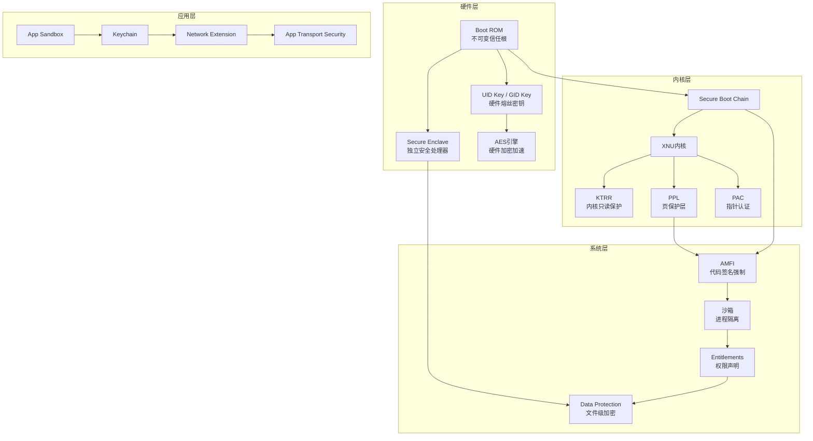
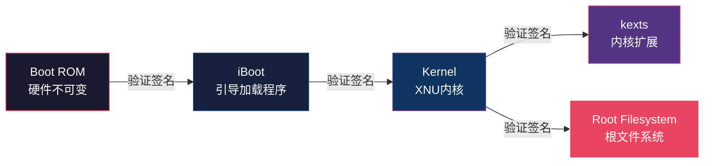
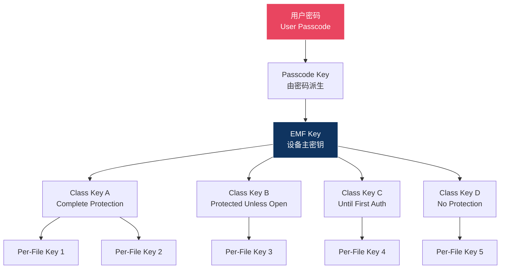

## 18.3 iOS安全架构

iOS的安全架构是业界公认的移动操作系统安全标杆。它并非单一的安全机制，而是从硬件到应用层、从启动到运行、从数据存储到网络通信的全链路纵深防御体系。理解iOS安全架构，既是移动安全研究的必修课，也是理解"安全设计"这一理念的绝佳样本。本节将从硬件信任根出发，逐层拆解iOS的安全机制，覆盖启动链、内核保护、运行时防御、数据保护、网络通信等全部关键环节。

### 18.3.1 iOS安全架构全景

iOS的安全设计遵循"信任链传递"原则——每一层只信任经过上一层验证的组件，信任的起点是硬件中的不可变代码（Boot ROM）。整个安全架构可以抽象为以下层次：



这个架构的核心设计原则是：

1. **硬件信任根**：安全的根基在硬件，软件无法篡改
2. **最小权限**：每个组件只获得完成任务所需的最小权限
3. **纵深防御**：任何单一机制被绕过，仍有其他机制兜底
4. **默认安全**：安全是默认状态，用户需要主动降低安全性

### 18.3.2 硬件安全基础

#### Boot ROM：不可变的信任根

Boot ROM是iOS安全链的起点，它是在芯片制造时直接写入硅片的代码，出厂后无法被任何软件或固件修改。Boot ROM的核心职责是：

- 验证iBoot引导加载程序的Apple签名
- 如果验证失败，将设备置于DFU（Device Firmware Upgrade）模式
- 提供AES引擎的初始化密钥派生

Boot ROM的安全意义在于：即使攻击者获得了设备的物理访问权限并替换了所有存储介质中的代码，只要Boot ROM未被物理篡改（需要芯片级攻击），设备就不会信任被篡改的系统。这也是为什么越狱社区在发现Boot ROM漏洞（如checkm8，影响A5-A11芯片）时如获至宝——Boot ROM漏洞是不可修补的硬件漏洞。

#### Secure Enclave Processor（SEP）

SEP是Apple自A7芯片起引入的独立安全协处理器，它与主应用处理器（AP）在硬件层面隔离，拥有独立的：

- **处理器核心**：基于ARM架构的独立CPU，执行专有的L4微内核（sepOS）
- **独立内存**：加密内存区域，AP无法直接访问
- **独立启动链**：SEP有自己的Boot ROM → SEPOS加载器 → SEPOS内核的完整启动链
- **真随机数发生器（TRNG）**：基于硬件噪声的随机数源

SEP负责管理以下安全敏感操作：

| 功能 | 说明 |
|------|------|
| 生物识别数据 | Touch ID/Face ID的模板数据仅存储在SEP中，永不离开 |
| 密钥管理 | 生成和存储Data Protection密钥层次的根密钥 |
| 安全计数器 | 防止回滚攻击的单调递增计数器 |
| 安全隔离 | 即使内核被完全攻破，SEP中的数据仍然安全 |
| Apple Pay | 支付令牌的生成和交易授权 |

SEP与AP之间的通信通过一个精心设计的邮箱（mailbox）机制进行，所有消息都经过加密和签名验证。AP不能直接读写SEP的内存，只能发送请求并接收响应。即使AP上运行的内核被完全攻破，攻击者也无法从SEP中提取生物识别数据或根密钥。

#### 硬件密钥与加密引擎

每台iOS设备在制造过程中被注入以下密钥，这些密钥存储在硬件熔丝（eFuse）或安全存储区域中，只能由AES硬件引擎直接使用，软件无法读取：

- **UID Key（Unique ID）**：每台设备唯一的256位AES密钥，用于设备数据加密。UID Key在制造时随机生成，Apple不记录其值，因此Apple自己也无法在不通过设备的情况下解密用户数据。
- **GID Key（Group ID）**：同一芯片型号共享的密钥，用于解密Apple的固件和系统软件。
- **Effaceable Storage**：可安全擦除的存储区域，用于存储类密钥（Class Keys）。设备擦除时，只需销毁这个区域的密钥即可使所有加密数据不可恢复，无需逐扇区覆盖。

硬件AES引擎直接连接到闪存控制器，数据在写入NAND闪存前自动加密，读取时自动解密，对上层软件透明。这意味着即使攻击者拆下闪存芯片直接读取，得到的也只是密文。

#### 防篡改与物理安全

iOS设备的硬件设计还包含多项物理安全措施：

- **温度和电压监控**：检测异常环境条件（如冷冻攻击、电压毛刺攻击）
- **调试接口禁用**：量产设备禁用JTAG/SWD调试接口
- **封装安全**：芯片采用封装级安全设计，增加物理探测难度
- **DFU模式限制**：进入DFU模式需要特定的按键组合和物理接触

### 18.3.3 安全启动链（Secure Boot Chain）

iOS的启动过程是一个逐级验证的信任链传递过程，每一级都验证下一级的签名后才允许执行：



**第一阶段：Boot ROM → iBoot**

Boot ROM从NAND闪存加载iBoot引导加载程序，使用Apple根证书验证iBoot的ECDSA签名。验证通过后，Boot ROM将执行权交给iBoot。如果签名验证失败，设备进入DFU模式等待恢复。

**第二阶段：iBoot → Kernel**

iBoot加载XNU内核镜像，验证其签名。iBoot还会验证内核启动参数的合法性，防止通过篡改启动参数绕过安全机制。在支持APRR（Apple Page Register Remapping）的设备上，iBoot还会配置内核内存的只读保护。

**第三阶段：Kernel → 用户空间**

内核启动后，验证并加载信任缓存（Trust Cache）中的签名信息。Trust Cache包含了所有Apple签名的系统二进制文件的代码签名哈希。不在Trust Cache中的二进制文件将无法通过AMFI（Apple Mobile File Integrity）的验证。

**Secure Boot Chain的安全意义**：

- 阻止持久化越狱：攻击者修改系统文件后，启动链验证失败，设备无法正常启动
- 阻止降级攻击：Apple通过SHSH签名服务器控制哪些固件版本可以被安装
- 保证系统完整性：从硬件到应用，每一层都经过密码学验证

**SHSH与签名窗口**

Apple在每次发布新iOS版本后会关闭旧版本的SHSH签名窗口。这意味着一旦Apple停止为某个版本签署SHSH blob，用户就无法再通过正常途径安装或降级到该版本。这是Apple控制设备安全状态的重要手段，但也引发了用户对自己设备控制权的讨论。

### 18.3.4 内核安全机制

#### KTRR（Kernel Text Read-only Region）

KTRR是Apple从A10芯片开始引入的硬件级内核代码保护机制。它通过内存控制器（Memory Controller）将内核代码段标记为只读，即使拥有内核级别的写权限也无法修改内核代码。

KTRR的工作原理：

- 内核启动时，iBoot配置内存控制器的只读区域寄存器
- 这些寄存器一旦设置，在运行时无法被任何软件修改（包括内核本身）
- 只有硬件复位才能重新配置这些寄存器

KTRR的设计目标是防止内核代码修补（kernel patching），这是传统越狱的核心手段。在KTRR之前，越狱工具可以通过修改内核代码来禁用代码签名验证；有了KTRR，这种攻击方式被彻底封堵。

在A11及之后的芯片上，KTRR进一步扩展为**CTRR（Configurable Text Read-only Region）**，提供了更灵活的只读区域配置。

#### APRR（Apple Page Register Remapping）

APRR是内核数据层面的保护机制，它允许内核将特定内存页面的权限动态切换为只读或不可访问。APRR的核心应用场景是：

- **内核凭据保护**：进程的凭据（credentials）在非特权代码执行时被标记为只读
- **代码签名页面保护**：代码签名相关的数据结构在运行时不可修改
- **W^X策略**：内存页不能同时具有写和执行权限

#### PPL（Page Protection Layer）

PPL是iOS 12引入的更高级内核保护机制，它将代码签名验证的关键逻辑移到了一个受保护的内存区域中，即使内核被攻破，也无法篡改代码签名页。

PPL保护的对象包括：

- 代码签名哈希页（Trust Cache）
- 页表条目（Page Table Entries）
- AMFI相关的内核数据结构

PPL通过ARM的Stage 2地址翻译（EL2 hypervisor模式）实现内存保护。内核运行在EL1，PPL的保护逻辑运行在EL2，EL1无法绕过EL2设置的内存访问限制。

#### PAC（Pointer Authentication Code）

PAC是ARMv8.3引入的指针认证机制，Apple从A12芯片开始全面启用。PAC通过在指针的高位嵌入加密签名来防止指针被篡改：

- 函数返回地址（Return Address）
- 函数指针
- 关键数据结构的指针

攻击者如果试图通过缓冲区溢出修改返回地址来劫持控制流，PAC校验会失败，触发异常。PAC有效缓解了ROP（Return-Oriented Programming）和JOP（Jump-Oriented Programming）攻击。

```c
// PAC的工作原理（概念示意）
// 原始指针: 0x00000001A2B3C4D5
// PAC签名后: 0xABCD0001A2B3C4D5
// 高位存储PAC签名，校验失败则触发异常

// PAC指令示例（ARM汇编）
// paciza x0    ; 对x0中的指针签名
// autiza x0    ; 验证并还原指针
// 如果验证失败，x0中的指针被破坏，后续使用触发异常
```

#### KTRR/APRR/PPL/PAC的协同

这四项机制共同构成了iOS内核的多层防御：

| 机制 | 保护层级 | 防护目标 | 引入芯片 |
|------|---------|---------|---------|
| KTRR/CTRR | 硬件 | 内核代码不被修改 | A10 |
| APRR | 硬件辅助 | 内核数据页权限控制 | A9 |
| PPL | 虚拟化 | 代码签名页不可篡改 | A12 |
| PAC | 硬件 | 指针不被篡改 | A12 |

### 18.3.5 代码签名与AMFI

#### 代码签名机制

iOS要求系统中所有可执行代码必须经过签名验证。代码签名体系分为两个层面：

**系统代码**：由Apple签名，通过Trust Cache验证。Trust Cache是一个哈希表，包含所有系统二进制文件的代码页哈希值，由Apple根证书签名。

**第三方应用**：由开发者签名（Developer ID），通过Provisioning Profile和Entitlements验证。开发者签名包含：
- 开发者证书（由Apple CA签发）
- 应用的Entitlements声明
- 设备的UDID列表（开发/Ad Hoc分发）
- 有效期

#### AMFI（Apple Mobile File Integrity）

AMFI是iOS内核中的核心安全模块，负责强制执行代码签名验证。AMFI的职责包括：

1. **加载时验证**：在代码页面被映射到内存时，验证其签名哈希
2. **运行时验证**：对mmap映射的代码页进行签名校验
3. **Entitlements强制**：检查进程的Entitlements是否与其签名声明一致
4. **动态库验证**：验证dylib的签名和加载路径合法性

AMFI与沙箱的协作关系：AMFI负责验证代码的身份和权限声明，沙箱负责限制代码可以访问的资源。两者共同构成了iOS应用隔离的基石。

**AMFI的绕过历史**：

AMFI并非完美无缺，历史上的越狱工具曾通过以下方式绕过AMFI：

- **伪造签名**：利用内核漏洞修改AMFI的验证逻辑（patchfinder方式）
- **Trust Cache注入**：将自定义二进制的哈希注入Trust Cache
- **amfid补丁**：修改AMFI守护进程（amfid）使其接受任意签名
- **CoreTrust漏洞**：利用CoreTrust框架的验证缺陷（如iOS 15的TrollStore利用的漏洞）

### 18.3.6 沙箱与进程隔离

#### 沙箱架构

iOS的沙箱（Sandbox，也称为Seatbelt）为每个应用创建一个独立的执行环境。每个应用被分配：

- **唯一的容器目录**：`/var/mobile/Containers/Data/Application/<UUID>/`，应用只能读写此目录
- **唯一的应用ID**：用于Keychain访问、推送通知等服务的标识
- **独立的进程空间**：与其他应用完全隔离
- **受限的系统调用**：通过沙箱Profile限制可使用的系统调用

沙箱Profile是用Scheme语言编写的规则集，定义了应用可以访问的资源和执行的操作。系统预定义了多个Profile模板：

| Profile | 说明 | 适用场景 |
|---------|------|---------|
| `container` | 完整容器隔离 | 普通第三方应用 |
| `network` | 网络服务Profile | 系统网络服务 |
| `rootless` | 受限的根文件系统访问 | 系统守护进程 |
| `noop` | 无限制 | 内核等特殊进程 |

#### 进程间通信限制

iOS严格限制应用间的IPC（进程间通信）：

- **URL Scheme**：应用可以通过注册的URL Scheme进行有限的通信
- **App Groups**：同一开发者组的应用可以共享容器目录
- **XPC**：系统级IPC机制，第三方应用只能使用系统提供的XPC服务
- **Shared Keychain**：同一App Group的应用可以共享Keychain数据

应用不能直接访问其他应用的进程内存、文件系统或网络连接。

#### 系统完整性保护

除了应用沙箱，iOS还对系统分区实施了严格的保护：

- **根文件系统只读挂载**：`/` 分区以只读方式挂载，即使是root权限也无法修改
- **系统数据保护**：系统关键文件存储在受Data Protection保护的加密卷中
- **Sealed System Volume**：iOS 15引入的密封系统卷，通过哈希树保证系统文件完整性

### 18.3.7 数据保护（Data Protection）

#### 加密架构

iOS的数据保护基于一个分层的密钥层次结构：



**密钥层次解析**：

1. **设备密钥（Hardware Key）**：UID Key，存储在硬件中，不可导出
2. **用户密码密钥（Passcode Key）**：由用户密码通过PBKDF2派生（迭代次数因设备性能而异，A9+芯片约为数十次迭代配合SEP的安全延迟机制）
3. **设备主密钥（EMF Key / Volume Key）**：整个文件系统的加密密钥
4. **类密钥（Class Key）**：四个保护等级各有一个类密钥
5. **文件密钥（Per-File Key）**：每个文件独有的随机密钥，由类密钥加密保护

#### 四个保护等级详解

Data Protection的四个等级不仅仅决定"何时可访问"，更决定了密钥在内存中的生命周期：

| 保护等级 | 文件密钥何时可用 | 设备锁定后 | 重启后 | 典型用途 |
|---------|----------------|-----------|--------|---------|
| **Complete Protection** | 设备解锁时 | 从内存清除 | 不可用 | 邮件附件、聊天记录 |
| **Protected Unless Open** | 设备解锁且文件打开 | 文件关闭后清除 | 不可用 | 正在编辑的文档 |
| **Until First Auth** | 首次解锁后一直可用 | 内存中保留 | 需重新解锁 | 数据库、应用数据 |
| **No Protection** | 始终可用 | 内存中保留 | 始终可用 | 系统文件、公开资源 |

**Complete Protection**是最高安全等级。当设备锁定后，文件密钥从内核内存中被清除。应用如果需要在后台访问Complete Protection的文件，需要请求后台解锁权限或在锁定前预加载数据。

**Protected Unless Open**允许应用在设备解锁时打开文件，即使设备随后被锁定，只要文件保持打开状态，应用仍可继续读写。关闭文件后密钥即被清除。

**Until First User Authentication**是iOS的默认保护等级。用户首次解锁设备后（重启后输入密码），文件密钥一直保留在内存中直到下次重启。这是安全性与可用性的平衡点——大多数应用数据不需要在每次锁定后都清除密钥。

#### 文件加密实现

每个文件的加密使用AES-256-XTS模式（针对文件系统），结合AES-CBC模式用于文件级别的Per-File Key加密。文件的加密密钥和保护等级信息存储在文件的元数据（Metadata）中，由内核的Data Protection模块管理。

当攻击者尝试暴力破解密码时，每次错误尝试都会被SEP的安全延迟机制阻塞：

| 连续错误次数 | 延迟时间 |
|-------------|---------|
| 1-4次 | 无延迟 |
| 5次 | 1分钟 |
| 6次 | 5分钟 |
| 7-8次 | 15分钟 |
| 9次 | 1小时 |
| 10次 | 设备擦除（若启用） |

### 18.3.8 Keychain安全机制

#### Keychain架构

Keychain是iOS的核心密码管理系统，其安全设计超越了简单的数据加密：

**存储位置**：Keychain数据存储在 `/var/Keychains/keychain-2.db`，这是一个SQLite数据库，但其中的敏感字段经过Data Protection加密。

**访问控制模型**：Keychain的每个条目都可以独立设置访问控制策略：

```swift
// 创建带访问控制的Keychain条目
var error: Unmanaged<CFError>?
let accessControl = SecAccessControlCreateWithFlags(
    kCFAllocatorDefault,
    kSecAttrAccessibleWhenPasscodeSetThisDeviceOnly,
    [.biometryCurrentSet, .privateKeyUsage],
    &error
)!

let query: [String: Any] = [
    kSecClass as String: kSecClassGenericPassword,
    kSecAttrAccount as String: "authToken",
    kSecAttrService as String: "com.example.app",
    kSecValueData as String: tokenData,
    kSecAttrAccessControl as String: accessControl
]

let status = SecItemAdd(query as CFDictionary, nil)
```

#### Keychain访问控制属性

完整的Keychain访问控制属性列表及其安全含义：

| 属性 | 设备锁定时 | 重启后 | 备份到iCloud | 备份到电脑 | 换设备 |
|------|-----------|--------|-------------|-----------|--------|
| `Always` | 可访问 | 可访问 | 可迁移 | 可迁移 | 可迁移 |
| `AlwaysThisDeviceOnly` | 可访问 | 可访问 | 不可迁移 | 不可迁移 | 不可迁移 |
| `WhenUnlocked` | 不可访问 | 需解锁 | 可迁移 | 可迁移 | 可迁移 |
| `WhenUnlockedThisDeviceOnly` | 不可访问 | 需解锁 | 不可迁移 | 不可迁移 | 不可迁移 |
| `AfterFirstUnlock` | 可访问 | 首次解锁后 | 可迁移 | 可迁移 | 可迁移 |
| `AfterFirstUnlockThisDeviceOnly` | 可访问 | 首次解锁后 | 不可迁移 | 不可迁移 | 不可迁移 |
| `WhenPasscodeSetThisDeviceOnly` | 需设置密码 | 需设置密码+解锁 | 不可迁移 | 不可迁移 | 不可迁移 |

**安全建议**：对于存储在Keychain中的认证令牌、密码等敏感数据，应使用 `WhenPasscodeSetThisDeviceOnly` 或 `WhenUnlockedThisDeviceOnly`，并结合生物识别访问控制（`SecAccessControl`），确保：

1. 数据不会被备份到其他设备
2. 设备锁定时数据不可访问
3. 访问需要用户生物识别确认

#### Keychain共享

同一开发者团队的应用可以通过Keychain Access Groups共享Keychain数据：

```xml
<!-- 在Entitlements中声明Keychain Access Group -->
<key>keychain-access-groups</key>
<array>
    <string>$(AppIdentifierPrefix)com.example.shared</string>
</array>
```

需要注意的是，Keychain共享的安全边界基于App ID Prefix（团队ID），不同开发者团队无法共享Keychain数据。

### 18.3.9 生物识别安全

#### Touch ID / Face ID安全架构

生物识别数据的安全处理是iOS安全架构中最精心设计的环节之一：

**数据存储**：生物识别模板（fingerprint data / face map）仅存储在SEP的安全存储区域中，永远不会被发送到Apple服务器、iCloud或其他设备。

**匹配过程**：

1. 用户触摸传感器/面部扫描
2. 传感器将原始数据发送到SEP
3. SEP内部进行模板匹配（不输出原始生物数据）
4. 匹配成功后，SEP解锁对应的密钥或授权操作

**安全保护措施**：

- **5次失败锁定**：连续5次生物识别失败后要求输入密码
- **48小时超时**：48小时内未使用密码解锁则要求重新输入密码
- **重启后要求密码**：设备重启后必须使用密码（非生物识别）解锁
- **Remote Action锁定**：通过"查找我的iPhone"可远程禁用生物识别
- **SOS模式**：快速按电源键5次禁用生物识别
- **Attention Aware**：Face ID要求用户注视设备（可关闭）

#### Secure Enclave的密钥保护

当生物识别验证成功后，SEP会释放一个"密钥包裹"（keybag），其中包含解密Data Protection类密钥所需的密钥。这个过程的关键设计是：

- 密钥包裹的解密需要同时满足：生物识别验证通过 + SEP内部状态正确
- 即使攻击者完全控制了AP（应用处理器），也无法从SEP中提取密钥
- Face ID的TrueDepth相机数据直接传输到SEP，AP无法访问原始面部数据

### 18.3.10 应用分发安全

#### App Store审核

Apple对App Store上架应用的安全审核是iOS安全生态的重要组成部分：

**自动化审核**：
- 静态分析：扫描代码中的私有API调用、已知恶意代码模式
- 动态分析：在沙箱环境中运行应用，监控行为
- 二进制分析：检查加密壳、反调试保护等

**人工审核**：
- 功能验证：确认应用描述与实际功能一致
- 内容审核：色情、暴力、仇恨言论等
- 隐私审核：验证隐私标签（Privacy Nutrition Label）的准确性
- 支付审核：确认应用内购买使用Apple IAP

**审核被拒常见原因**：
- 使用私有API（如`UIDevice`的`uniqueIdentifier`）
- 未声明数据收集用途
- 绕过IAP进行数字内容支付
- 功能与描述不符
- 使用废弃的UIWebView（要求WKWebView）

#### 其他分发渠道

| 渠道 | 适用场景 | 安全控制 | 限制 |
|------|---------|---------|------|
| App Store | 公开分发 | Apple审核 | 严格审查 |
| TestFlight | Beta测试 | 有限审核 | 90天有效期，1万外部测试员 |
| Ad Hoc | 小范围测试 | 开发者签名 | 最多100台设备/年 |
| 企业分发 | 企业内部 | 企业证书 | 需Apple审核企业资质 |
| MDM | 设备管理 | 管理员控制 | 需要MDM服务器 |

**企业证书滥用问题**：企业开发者证书（Enterprise Certificate）设计用于企业内部分发，但曾被大量滥用。Facebook和Google被曝使用企业证书向普通用户分发数据收集应用，导致Apple撤销其企业证书。Apple随后加强了对企业证书的审核和监控。

### 18.3.11 网络安全机制

#### App Transport Security（ATS）

ATS是iOS 9引入的网络安全强制机制，要求所有HTTP连接使用HTTPS：

```xml
<!-- Info.plist中ATS配置 -->
<key>NSAppTransportSecurity</key>
<dict>
    <!-- 全局启用ATS（默认值） -->
    <key>NSAllowsArbitraryLoads</key>
    <false/>
    <!-- 允许特定域名的例外 -->
    <key>NSExceptionDomains</key>
    <dict>
        <key>example.com</key>
        <dict>
            <key>NSExceptionMinimumTLSVersion</key>
            <string>TLSv1.2</string>
            <key>NSIncludesSubdomains</key>
            <true/>
        </dict>
    </dict>
</dict>
```

**ATS的安全要求**：
- TLS 1.2或更高版本
- 证书链验证（不允许自签名证书）
- 前向保密（Forward Secrecy）
- 密钥长度 ≥ 2048位RSA 或 ≥ 256位ECC

Apple从2017年起要求所有新应用必须支持ATS，例外情况需要在App Store审核时提供正当理由。

#### 网络安全扩展（Network Extension）

iOS提供了Network Extension框架，允许企业级应用实现：
- VPN连接（个人VPN / 企业VPN）
- DNS代理（DNS-over-HTTPS / DNS-over-TLS）
- 内容过滤（Content Filter）
- 透明代理

这些功能需要额外的Entitlements和Apple审核。

#### 证书固定（Certificate Pinning）

对于高安全需求的应用，iOS支持证书固定，防止CA被攻破后的中间人攻击：

```swift
// URLSession证书固定示例
func urlSession(_ session: URLSession,
                didReceive challenge: URLAuthenticationChallenge,
                completionHandler: @escaping (URLSession.AuthChallengeDisposition, URLCredential?) -> Void) {
    
    guard let serverTrust = challenge.protectionSpace.serverTrust,
          SecTrustEvaluateWithError(serverTrust, nil),
          let serverCertificate = SecTrustGetCertificateAtIndex(serverTrust, 0),
          let serverPublicKey = SecCertificateCopyKey(serverCertificate) else {
        completionHandler(.cancelAuthenticationChallenge, nil)
        return
    }
    
    // 比较服务器公钥与预置的固定公钥
    let pinnedPublicKeyData = SecKeyCopyExternalRepresentation(serverPublicKey, nil)! as Data
    if pinnedPublicKeyData == storedPinnedPublicKeyData {
        completionHandler(.useCredential, URLCredential(trust: serverTrust))
    } else {
        completionHandler(.cancelAuthenticationChallenge, nil)
    }
}
```

### 18.3.12 系统更新与设备证明

#### OTA更新安全

iOS的OTA（Over-The-Air）更新机制同样基于安全启动链：

1. 设备向Apple更新服务器查询可用更新
2. 下载更新包并验证Apple签名
3. 通过Secure Enclave验证更新包的完整性
4. 安装更新并重新验证启动链

更新过程中的关键安全设计：
- 更新包使用Apple的私钥签名，无法伪造
- 更新过程中SEP验证新固件的合法性
- 不允许安装比当前版本更旧的固件（防降级）

#### Device Attestation（设备证明）

从iOS 14开始，Apple引入了DeviceCheck和App Attest API，允许服务器验证：

- 请求确实来自运行正版iOS的Apple设备
- 应用未被篡改
- 设备不是越狱设备

```swift
// App Attest示例
import DeviceCheck

let service = DCAppAttestService.shared

// 1. 生成密钥对
service.generateKey { keyId, error in
    guard let keyId = keyId else { return }
    
    // 2. 获取服务器挑战值
    let challenge = fetchChallengeFromServer()
    
    // 3. 使用密钥签名挑战值
    service.attestKey(keyId, clientDataHash: challenge) { attestation, error in
        guard let attestation = attestation else { return }
        
        // 4. 将证明发送到服务器验证
        sendAttestationToServer(keyId: keyId, attestation: attestation)
    }
}
```

### 18.3.13 iOS vs Android安全架构对比

理解iOS安全架构的一个有效方法是与Android进行对比：

| 安全维度 | iOS | Android |
|---------|-----|---------|
| **信任根** | 硬件Boot ROM（不可变） | 硬件信任根（TrustZone/硬件安全模块） |
| **启动链** | 统一的Secure Boot Chain | Verified Boot（AVB），但碎片化严重 |
| **内核保护** | KTRR+PPL+PAC，硬件强制 | SELinux + dm-verity，软件强制为主 |
| **代码签名** | 强制，所有代码必须签名 | 可选（ADB侧载不需要签名） |
| **应用隔离** | 强制沙箱，不可绕过 | 沙箱 + SELinux，但有更多共享机制 |
| **权限模型** | 运行时一次性授权 + 精细控制 | 安装时授权 + 运行时权限（Android 6+） |
| **加密** | 全盘加密（默认，硬件加速） | 文件级加密（FBE，Android 10+） |
| **生物识别** | SEP独立处理，数据不出SEP | 依赖TEE/SE实现，实现因厂商而异 |
| **更新控制** | Apple统一推送 | 依赖OEM和运营商，碎片化严重 |
| **应用审核** | 严格的人工+自动审核 | Google Play Protect（自动审核为主） |
| **分发控制** | App Store为主，侧载受限 | 开放分发，允许第三方商店和侧载 |
| **越狱/Root** | 极难持久化（Secure Boot Chain） | Bootloader解锁即可Root |

**iOS安全优势**：
- 硬件与软件的垂直整合带来更强的安全保证
- 统一的更新推送确保安全补丁快速覆盖
- 严格的分发控制减少了恶意软件传播渠道

**Android安全优势**：
- 开源可审计（AOSP）
- 用户对设备有更多控制权
- 更灵活的安全模型（Work Profile、多用户）

### 18.3.14 iOS安全机制的局限与攻防

#### 已知攻击面

尽管iOS的安全架构非常强大，但仍存在以下攻击面：

**1. Boot ROM漏洞**

checkm8（2019年发现）是影响A5-A11芯片的Boot ROM漏洞，由于Boot ROM不可更新，这些设备永久存在此漏洞。攻击者可以通过USB连接利用此漏洞实现：
- 绕过Secure Boot Chain
- 安装自定义引导加载程序
- 实现不可修补的越狱（如checkra1n）

**2. WebKit漏洞**

由于iOS要求所有浏览器使用WebKit引擎（即使Chrome在iOS上也是WebKit包装），WebKit中的漏洞影响所有浏览器。Pegasus间谍软件就曾多次利用WebKit零日漏洞实现远程代码执行。

**3. 内核漏洞**

尽管有KTRR/PPL/PAC等保护，内核漏洞仍然存在。内核漏洞的利用难度随着保护机制的增强而增加，但并非不可能。iOS 15-16期间有多起内核零日漏洞被在野利用的记录。

**4. 零点击攻击**

最危险的攻击是零点击（Zero-Click）攻击，不需要用户任何交互即可实现。典型案例：
- **FORCEDENTRY**（2021年）：通过iMessage的GIF处理漏洞实现零点击攻击，利用JBIG2压缩格式构建了一个虚拟计算机架构来绕过沙箱
- **Pegasus**：NSO Group的间谍软件，多次利用零点击漏洞

**5. 供应链攻击**

攻击者可能在应用开发阶段植入恶意代码。2015年的XcodeGhost事件中，大量中国区应用因使用被篡改的Xcode而感染恶意代码。

#### 越狱的演进与安全机制的关系

越狱技术的发展史本质上是iOS安全机制的攻防史：

| 时期 | 越狱方式 | 对应安全机制 | 安全机制演进 |
|------|---------|------------|------------|
| 早期（2007-2010） | DFU模式漏洞、固件漏洞 | 基础签名验证 | 引入SHSH签名 |
| 中期（2011-2015） | 内核漏洞、沙箱绕过 | KASLR、沙箱强化 | 引入SEP、KTRR |
| 近期（2016-2019） | 内核漏洞+代码签名绕过 | KTRR、AMFI强化 | 引入PPL、PAC |
| 当前（2020至今） | 持久化越狱极为困难 | Secure Boot Chain | Rootless、SSV |

### 18.3.15 开发者安全最佳实践

对于iOS开发者，以下是利用iOS安全机制保护应用数据的关键实践：

**1. 正确使用Data Protection**

```swift
// 为文件设置正确的保护等级
let fileManager = FileManager.default
let filePath = documentsDirectory.appendingPathComponent("sensitive.dat")

// 创建文件时设置保护等级
fileManager.createFile(atPath: filePath.path,
                       contents: sensitiveData,
                       attributes: [.protectionKey: FileProtectionType.complete])

// 对于需要在后台访问的数据，使用CompleteUnlessOpen
fileManager.createFile(atPath: filePath.path,
                       contents: data,
                       attributes: [.protectionKey: FileProtectionType.completeUnlessOpen])
```

**2. 安全使用Keychain**

```swift
// 生产环境推荐的Keychain存储方式
func secureStore(key: String, data: Data) -> Bool {
    var error: Unmanaged<CFError>?
    guard let accessControl = SecAccessControlCreateWithFlags(
        kCFAllocatorDefault,
        kSecAttrAccessibleWhenPasscodeSetThisDeviceOnly,
        [.biometryCurrentSet],
        &error
    ) else { return false }
    
    let query: [String: Any] = [
        kSecClass as String: kSecClassGenericPassword,
        kSecAttrAccount as String: key,
        kSecAttrService as String: Bundle.main.bundleIdentifier!,
        kSecValueData as String: data,
        kSecAttrAccessControl as String: accessControl
    ]
    
    // 先删除旧条目
    SecItemDelete(query as CFDictionary)
    
    return SecItemAdd(query as CFDictionary, nil) == errSecSuccess
}
```

**3. 网络安全配置**

```xml
<!-- 始终启用ATS，除非有明确的技术理由 -->
<key>NSAppTransportSecurity</key>
<dict>
    <key>NSAllowsArbitraryLoads</key>
    <false/>
</dict>
```

**4. 调试信息保护**

```swift
// 在Release构建中禁用日志
#if DEBUG
    print("DEBUG: Token = \(token)")
#endif

// 使用OSLog替代print，自动管理日志级别
import os.log
let logger = Logger(subsystem: Bundle.main.bundleIdentifier!, category: "security")
logger.info("Authentication successful")
```

**5. 防调试保护**

```swift
// 检测调试器（基础方法）
import Darwin

func isDebuggerAttached() -> Bool {
    var info = kinfo_proc()
    var size = MemoryLayout<kinfo_proc>.stride
    var mib: [Int32] = [CTL_KERN, KERN_PROC, KERN_PROC_PID, getpid()]
    
    let result = sysctl(&mib, UInt32(mib.count), &info, &size, nil, 0)
    
    return result == 0 && (info.kp_proc.p_flag & P_TRACED) != 0
}
```

### 18.3.16 本节小结

iOS安全架构的核心价值在于其**纵深防御**设计——没有任何单一机制是绝对安全的，但多层机制的叠加使得攻击成本极高。从硬件信任根到应用沙箱，从启动链到运行时保护，每一层都为整体安全做出贡献。

理解iOS安全架构对于移动安全从业者的意义：

1. **攻防视角**：知道防御在哪里，才知道攻击向量在哪里
2. **设计视角**：iOS的安全设计模式值得在其他系统中借鉴
3. **取证视角**：理解加密机制对移动取证方案设计至关重要
4. **合规视角**：iOS的安全机制是许多行业合规要求的基准

iOS安全架构仍在持续演进。从A系列芯片到M系列芯片，从iPhone到Vision Pro，Apple不断将新的安全特性融入其硬件和软件生态。作为安全研究者，持续跟踪这些演进是保持专业敏锐度的必要投入。
