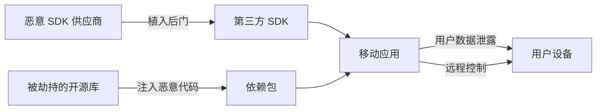
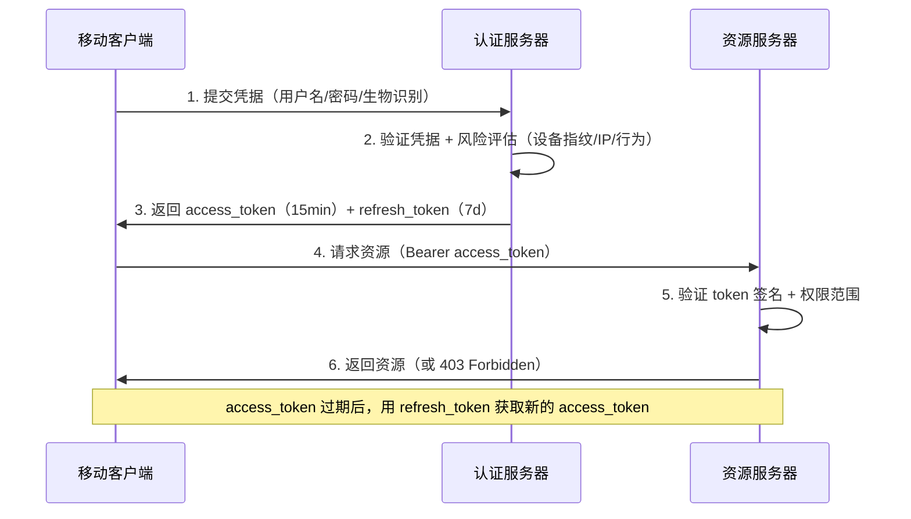
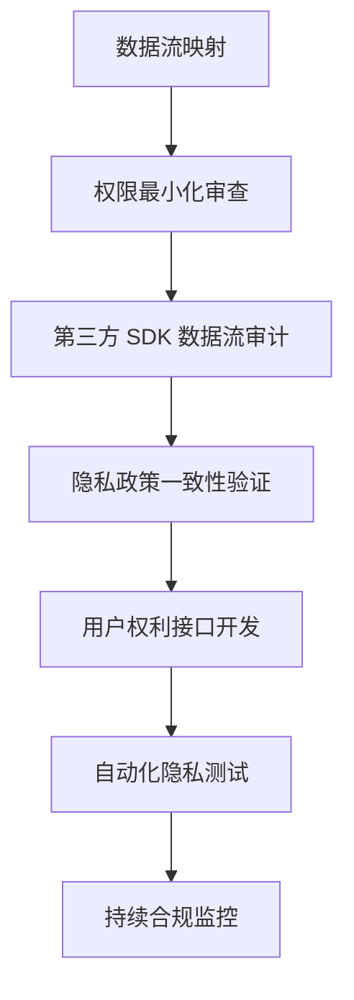
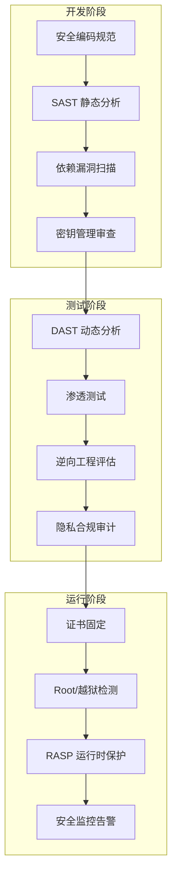

## 18.4 OWASP Mobile Top 10

OWASP Mobile Top 10 是全球移动安全领域最具权威性的风险清单，由 OWASP（Open Web Application Security Project）社区基于真实漏洞数据、安全审计报告和行业调查编制而成。理解这份清单不仅是移动安全从业者的必修课，更是构建安全移动应用的基石。

### OWASP Mobile 项目概述

#### 什么是 OWASP Mobile Top 10

OWASP Mobile Top 10 不是一份静态的检查表，而是一套持续演进的威胁建模框架。它从数千个真实移动应用漏洞中提炼出最高频、最高危的十类风险，帮助开发团队和安全审计人员聚焦最关键的安全问题。

与 OWASP Web Top 10 的区别在于，Mobile Top 10 专门针对移动平台的独特攻击面设计——客户端代码可被反编译、设备可能被 Root/越狱、应用沙箱机制、操作系统碎片化等问题在传统 Web 安全中并不存在。

#### 历史版本演进

| 版本 | 年份 | 关键变化 |
|------|------|----------|
| 2014 | 2014 | 首个正式版本，建立移动安全风险分类体系 |
| 2016 | 2016 | 新增"不充分的密码学"，强化数据保护要求 |
| 2024 | 2024 | 大幅调整：新增供应链安全、隐私控制；合并认证授权；引入二进制保护概念 |

2024 版本的变化反映了行业趋势：供应链攻击（如 SolarWinds 式事件延伸到移动端）成为新威胁，隐私合规（GDPR、CCPA、个人信息保护法）要求日益严格，客户端保护技术（RASP）逐渐成熟。

#### 风险评估方法论

OWASP 使用综合评估矩阵确定风险等级：

```text
风险值 = 可利用性 × 影响 × 普遍性

可利用性：攻击者利用该漏洞的技术门槛和所需资源
影响：漏洞被利用后对用户、数据、业务的损害程度
普遍性：该类漏洞在真实应用中出现的频率
```

每项指标按 1-3 分打分，总分范围 1-27 分，得分越高排名越靠前。

### M1: 不当的凭据使用（Improper Credential Usage）

#### 风险定义

在移动应用中以不安全的方式存储、传输或管理凭据信息。凭据包括 API 密钥、认证令牌、数据库密码、加密密钥、第三方服务凭证等。这是 2024 版的首要风险，因为在实际审计中，超过 70% 的移动应用存在凭据硬编码问题。

#### 详细攻击场景

**场景一：API 密钥硬编码**

开发者将第三方服务（如 Google Maps、AWS、Stripe）的 API Key 直接写入源代码：

```java
// 危险：API Key 硬编码在 Java 代码中
public class ApiConfig {
    public static final String API_KEY = "AIzaSyD-XXXXXXXXXXXXXXXXXXXXX";
    public static final String AWS_SECRET = "YOUR_AWS_SECRET_KEY";
    public static final String STRIPE_KEY = "YOUR_STRIPE_KEY";
}
```

攻击者使用 `jadx` 或 `apktool` 反编译 APK 后，通过 `grep -r "sk_live\|sk_test\|AIza" .` 即可在数秒内提取所有硬编码密钥。

**场景二：SharedPreferences 明文存储**

```java
// 危险：密码明文存储在 SharedPreferences
SharedPreferences prefs = getSharedPreferences("user_prefs", MODE_PRIVATE);
prefs.edit()
    .putString("password", userPassword)
    .putString("auth_token", authToken)
    .apply();
```

攻击者获取设备物理访问权限后，通过 ADB 直接读取：

```bash
adb shell run-as com.example.app cat /data/data/com.example.app/shared_prefs/user_prefs.xml
```

**场景三：日志泄露凭据**

```kotlin
// 危险：在 Debug 日志中输出凭据
Log.d("Auth", "Token: $authToken")
Log.d("Login", "Password attempt: $password")

// 发布时未关闭日志，ProGuard 配置中未移除 Log.d 调用
```

#### 防御策略

**策略一：使用 Android Keystore / iOS Keychain**

```kotlin
// Android Keystore 安全存储
val keyStore = KeyStore.getInstance("AndroidKeyStore").apply { load(null) }

val keyGenerator = KeyGenerator.getInstance(
    KeyProperties.KEY_ALGORITHM_AES, "AndroidKeyStore"
)
keyGenerator.init(
    KeyGenParameterSpec.Builder("master_key",
        KeyProperties.PURPOSE_ENCRYPT or KeyProperties.PURPOSE_DECRYPT)
        .setBlockModes(KeyProperties.BLOCK_MODE_GCM)
        .setEncryptionPaddings(KeyProperties.ENCRYPTION_PADDING_NONE)
        .setKeySize(256)
        .build()
)
val secretKey = keyGenerator.generateKey()

// 加密后存储凭据
val cipher = Cipher.getInstance("AES/GCM/NoPadding")
cipher.init(Cipher.ENCRYPT_MODE, secretKey)
val encryptedToken = cipher.doFinal(authToken.toByteArray())
// encryptedToken 可以安全存储在 SharedPreferences 中
```

**策略二：使用服务器端代理模式**

```text
┌─────────────┐     ┌──────────────┐     ┌─────────────┐
│  移动客户端   │────▶│  后端代理服务器 │────▶│  第三方 API  │
│  （无密钥）   │◀────│  （存储密钥）  │◀────│             │
└─────────────┘     └──────────────┘     └─────────────┘
```

客户端永远不持有第三方 API 密钥，所有敏感请求通过后端代理转发。

**策略三：构建时注入与混淆**

```gradle
// build.gradle - 从环境变量注入密钥（不提交到版本控制）
android {
    defaultConfig {
        buildConfigField "String", "API_KEY", "\"${System.getenv('API_KEY')}\""
    }
}

// 使用 NDK 将密钥编译进 .so 文件，增加逆向难度
// app/src/main/cpp/native-lib.cpp
#include <jni.h>
extern "C" JNIEXPORT jstring JNICALL
Java_com_example_app_NativeConfig_getApiKey(JNIEnv *env, jclass) {
    // 密钥分散存储，运行时拼接
    char key[] = {0x41, 0x49, 0x7a, 0x61, ...}; // 加密字节数组
    // 运行时解密
    return env->NewStringUTF(decrypt(key));
}
```

### M2: 不当的供应链安全（Inadequate Supply Chain Security）

#### 风险定义

移动应用依赖的第三方组件（库、SDK、框架、构建工具链）引入安全漏洞或恶意代码。随着现代移动应用平均依赖 30-50 个第三方库，供应链已成为攻击者的主要入口。

#### 典型威胁模型



#### 真实案例分析

**案例一：广告 SDK 数据窃取**

多个知名广告 SDK 在用户不知情的情况下收集通讯录、短信、通话记录甚至剪贴板内容。某国内 SDK 被曝光在初始化时静默上传完整的通讯录数据到境外服务器。

**案例二：供应链投毒事件**

攻击者向 PyPI/npm 等包仓库提交与知名包名称相似的恶意包（typosquatting），如将 `requests` 改为 `request`。移动端的 Gradle CocoaPods 依赖同样面临此风险。

**案例三：构建工具链污染**

开发者的 CI/CD 环境被入侵后，构建脚本被篡改，在最终 APK/IPA 中注入恶意代码。2015 年的 XcodeGhost 事件就是典型案例——非官方 Xcode 安装包中被植入恶意代码，影响了数万款 iOS 应用。

#### 防御措施

**措施一：依赖锁定与完整性校验**

```gradle
// build.gradle.lockfile - 锁定依赖版本和哈希
dependencies {
    implementation("com.squareup.okhttp3:okhttp:4.12.0")
    // 使用 Gradle Verification Metadata 校验完整性
}

// gradle/verification-metadata.xml
<component group="com.squareup.okhttp3" name="okhttp" version="4.12.0">
  <artifact name="okhttp-4.12.0.jar">
    <sha256 value="a]b2c3d4e5f6..." origin="Gradle"/>
  </artifact>
</component>
```

**措施二：SDK 安全审计流程**

1. **引入前评估**：检查 SDK 供应商的安全认证（SOC 2、ISO 27001）、历史漏洞记录、数据处理合规性
2. **权限审查**：分析 SDK 申请的 Android/iOS 权限是否与其功能匹配
3. **网络流量分析**：在沙箱环境中运行应用，抓包分析 SDK 的网络请求目标和数据内容
4. **定期更新**：建立依赖更新机制，及时修补已知漏洞
5. **隔离运行**：对高风险 SDK 使用独立进程或沙箱隔离

**措施三：软件物料清单（SBOM）**

```json
{
  "bomFormat": "CycloneDX",
  "components": [
    {
      "name": "okhttp",
      "version": "4.12.0",
      "purl": "pkg:maven/com.squareup.okhttp3/okhttp@4.12.0",
      "hashes": [{"alg": "SHA-256", "content": "abc123..."}]
    }
  ]
}
```

生成 SBOM 后，可自动比对 CVE 数据库，持续监控依赖漏洞。

### M3: 不安全的身份认证/授权（Insecure Authentication/Authorization）

#### 风险定义

移动应用在认证和授权环节存在缺陷，导致攻击者能够绕过身份验证、冒充其他用户或越权访问资源。2024 版将原本分离的认证和授权合并为一项，因为两者的攻击面和防御策略高度重叠。

#### 常见漏洞模式

**模式一：客户端信任模型错误**

```java
// 危险：仅在客户端判断用户角色
public boolean isAdmin() {
    SharedPreferences prefs = getSharedPreferences("user", MODE_PRIVATE);
    return prefs.getBoolean("is_admin", false); // 攻击者可直接修改此值
}

// 攻击方式：修改 SharedPreferences 中的 is_admin 字段
// 或使用 Frida hook isAdmin() 方法返回 true
```

正确做法是将权限判断放在服务端：

```python
# 服务端授权检查（Python Flask 示例）
@app.route('/admin/users')
@require_auth
def admin_users():
    if not current_user.has_role('admin'):
        return jsonify({"error": "Forbidden"}), 403
    return jsonify(get_all_users())
```

**模式二：弱会话管理**

```java
// 危险：Token 无过期时间、无法撤销
String token = UUID.randomUUID().toString();
redis.set("session:" + token, userId); // 无 TTL

// 攻击者获取 token 后可永久使用
```

安全的会话管理应包含：短期访问令牌（15-30 分钟）+ 长期刷新令牌（7-30 天）+ 令牌黑名单机制。

**模式三：生物识别认证绕过**

```java
// 危险：仅检查 BiometricPrompt 回调结果，不绑定服务端挑战
biometricPrompt.authenticate(promptInfo);
// onAuthenticationSucceeded 后直接授予完全访问权限
```

攻击者可通过 Frida 直接调用 `onAuthenticationSucceeded` 回调绕过生物识别。正确做法是将生物识别与密码学密钥绑定：

```kotlin
val keyPair = KeyPairGenerator.getInstance("RSA", "AndroidKeyStore").apply {
    initialize(
        KeyGenParameterSpec.Builder("bio_key",
            KeyProperties.PURPOSE_SIGN or KeyProperties.PURPOSE_VERIFY)
            .setUserAuthenticationRequired(true)
            .setUserAuthenticationParameters(300, // 有效期 5 分钟
                KeyProperties.AUTH_BIOMETRIC_STRONG)
            .build()
    )
}.generateKeyPair()
// 生物识别认证成功后才能使用私钥签名
```

#### 认证架构最佳实践



### M4: 不充分的输入/输出校验（Insufficient Input/Output Validation）

#### 风险定义

移动应用未对来自用户输入、外部数据源、IPC 消息、深度链接等渠道的数据进行充分验证和清洗，导致注入攻击、路径遍历、缓冲区溢出等安全问题。

#### 关键攻击向量

**向量一：WebView 中的 JavaScript 注入**

```java
// 危险：启用 JavaScript 接口且未校验来源
webView.getSettings().setJavaScriptEnabled(true);
webView.addJavascriptInterface(new WebAppInterface(), "Android");
webView.loadUrl(userProvidedUrl); // 可能加载恶意页面

public class WebAppInterface {
    @JavascriptInterface
    public String getAuthToken() {
        return authToken; // 恶意 JS 可直接调用此方法窃取 token
    }
}
```

防御：校验 WebView 加载的 URL 白名单，限制 `@JavascriptInterface` 暴露的方法，对 Android 4.2 以下版本禁用 JavaScript 接口（远程代码执行漏洞）。

**向量二：深度链接注入**

```xml
<!-- AndroidManifest.xml -->
<intent-filter>
    <action android:name="android.intent.action.VIEW" />
    <data android:scheme="myapp" android:host="product" />
</intent-filter>
```

```kotlin
// 危险：未校验深度链接参数
val productId = intent.data?.getQueryParameter("id")
// 攻击者构造 myapp://product?id=../../etc/passwd 或 SQL 注入
database.rawQuery("SELECT * FROM products WHERE id = '$productId'", null)
```

防御：使用参数化查询、严格校验参数格式（正则白名单）、避免将深度链接参数直接传递给系统命令或数据库查询。

**向量三：IPC 消息注入**

```java
// 危险：导出的 ContentProvider 未校验输入
@ExportedContentProvider
public class NoteProvider extends ContentProvider {
    @Override
    public Cursor query(Uri uri, ...) {
        // 攻击者可注入 SQL
        return db.rawQuery("SELECT * FROM notes WHERE " + uri.getQueryParameter("where"), null);
    }
}
```

#### 输入校验框架

| 校验层级 | 方法 | 适用场景 |
|----------|------|----------|
| 类型校验 | 强类型转换、JSON Schema 验证 | API 输入、配置文件 |
| 格式校验 | 正则白名单、枚举约束 | 用户名、邮箱、手机号 |
| 范围校验 | 长度限制、数值边界 | 文本字段、数字参数 |
| 语义校验 | 业务逻辑校验、关联性检查 | 订单金额、权限范围 |
| 编码校验 | HTML/URL/SQL 编码转义 | 输出到 WebView/数据库 |

### M5: 不安全的通信（Insecure Communication）

#### 风险定义

移动应用在数据传输过程中未实施足够的加密和完整性保护，导致中间人攻击（MITM）、数据窃听和数据篡改。

#### 常见漏洞及攻击

**漏洞一：允许 HTTP 明文传输**

```xml
<!-- 危险：允许明文流量 -->
<network-security-config>
    <base-config cleartextTrafficPermitted="true" />
</network-security-config>
```

攻击者在同一 Wi-Fi 网络下使用 Wireshark 或 mitmproxy 即可截获所有请求。

防御：
```xml
<!-- 安全配置：禁止明文，仅允许 HTTPS -->
<network-security-config>
    <base-config cleartextTrafficPermitted="false" />
    <domain-config>
        <domain includeSubdomains="true">api.example.com</domain>
        <pin-set expiration="2027-01-01">
            <pin digest="SHA-256">AAAAAAAAAAAAAAAAAAAAAAAAAAAAAAAAAAAAAAAAAAA=</pin>
        </pin-set>
    </domain-config>
</network-security-config>
```

**漏洞二：未实施证书固定（Certificate Pinning）**

即使使用 HTTPS，攻击者若在设备上安装自签名 CA 证书（企业监控软件常见操作），仍可实施中间人攻击。

```kotlin
// OkHttp 证书固定
val client = OkHttpClient.Builder()
    .certificatePinner(
        CertificatePinner.Builder()
            .add("api.example.com",
                "sha256/AAAAAAAAAAAAAAAAAAAAAAAAAAAAAAAAAAAAAAAAAAA=")
            .build()
    )
    .build()
```

**漏洞三：自定义 TLS 验证逻辑错误**

```java
// 危险：信任所有证书
TrustManager[] trustAllCerts = new TrustManager[]{
    new X509TrustManager() {
        public void checkClientTrusted(X509Certificate[] chain, String authType) {}
        public void checkServerTrusted(X509Certificate[] chain, String authType) {}
        public X509Certificate[] getAcceptedIssuers() { return new X509Certificate[0]; }
    }
};
SSLContext.getInstance("TLS").init(null, trustAllCerts, new SecureRandom());
// 任何证书都被接受，MITM 零门槛
```

#### 通信安全检查清单

| 检查项 | 要求 | 验证方法 |
|--------|------|----------|
| 传输协议 | 强制 TLS 1.2+ | 抓包检查协议版本 |
| 证书验证 | 系统默认验证 + 证书固定 | mitmproxy 测试 |
| 敏感数据加密 | 应用层额外加密 | 抓包分析载荷 |
| 密钥交换 | ECDHE 或更优 | 检查 cipher suite |
| 数据完整性 | HMAC 或 AEAD 模式 | 代码审计 |

### M6: 不充分的隐私控制（Inadequate Privacy Controls）

#### 风险定义

应用过度收集个人可识别信息（PII）、未按合规要求处理用户数据、缺乏数据最小化原则、未提供充分的用户数据控制权。2024 版新增此项，反映了全球隐私法规趋严的现实。

#### 核心隐私原则

| 原则 | 含义 | 实施要求 |
|------|------|----------|
| 数据最小化 | 只收集实现功能所必需的数据 | 逐项审查权限申请的必要性 |
| 目的限定 | 数据仅用于声明的目的 | 隐私政策与实际行为一致 |
| 存储限制 | 超过必要期限后删除数据 | 实施数据自动过期机制 |
| 用户知情 | 明确告知数据收集和使用方式 | 分层隐私政策、运行时提示 |
| 用户控制 | 提供数据访问、更正、删除功能 | 账户设置中的数据管理入口 |
| 跨境合规 | 遵守数据所在地法规 | 区分不同地区的数据处理策略 |

#### 常见隐私违规

**违规一：过度权限申请**

```xml
<!-- 一个手电筒应用申请的权限 —— 明显过度 -->
<uses-permission android:name="android.permission.READ_CONTACTS" />
<uses-permission android:name="android.permission.ACCESS_FINE_LOCATION" />
<uses-permission android:name="android.permission.READ_SMS" />
<uses-permission android:name="android.permission.CAMERA" />
```

**违规二：隐蔽的数据收集**

应用在后台持续收集位置信息，即使用户未使用相关功能。部分 SDK 在初始化时即开始收集设备标识符、安装应用列表等信息。

**违规三：数据泄露到日志或备份**

```xml
<!-- 危险：允许应用数据被备份 -->
<application android:allowBackup="true" android:fullBackupContent="true">
    <!-- 攻击者通过 ADB 备份获取完整应用数据 -->
</application>
```

#### 隐私合规实施框架



### M7: 不充分的二进制保护（Insufficient Binary Protections）

#### 风险定义

移动应用未实施足够的客户端保护措施，使攻击者能够轻松逆向分析、篡改应用逻辑或在受控环境中运行应用。2024 版新增此项，承认了客户端保护在纵深防御中的重要性。

#### 主要保护技术

**技术一：代码混淆**

```proguard
# ProGuard/R8 配置
-optimizationpasses 5
-obfuscationdictionary keywords.txt
-classobfuscationdictionary keywords.txt
-packageobfuscationdictionary keywords.txt

# 保留 JNI 方法和反射调用的类
-keepclasseswithmembernames class * {
    native <methods>;
}
```

混淆效果对比：

| 状态 | 类名 | 方法名 | 可读性 |
|------|------|--------|--------|
| 混淆前 | `LoginActivity` | `validatePassword()` | 极高 |
| 混淆后 | `a.b.c` | `a()` | 极低 |

但混淆不是安全措施——它只是增加逆向成本。专业攻击者使用 JADX、JEB 等工具仍可在数小时内理解混淆后的逻辑。

**技术二：Root/越狱检测**

```kotlin
fun isDeviceRooted(): Boolean {
    val paths = arrayOf(
        "/system/app/Superuser.apk", "/sbin/su", "/system/bin/su",
        "/system/xbin/su", "/data/local/xbin/su", "/data/local/bin/su",
        "/system/sd/xbin/su", "/system/bin/failsafe/su",
        "/data/local/su", "/su/bin/su"
    )
    return paths.any { File(it).exists() }
}
```

但攻击者可通过 Magisk Hide、Frida hook 绕过这些检测。更可靠的做法是使用 SafetyNet/Play Integrity API 或自研 RASP（Runtime Application Self-Protection）方案。

**技术三：调试器检测**

```kotlin
if (Debug.isDebuggerConnected() || Debug.waitingForDebugger()) {
    // 检测到调试器，清除敏感数据并退出
    clearSensitiveData()
    exitProcess(0)
}
// 还应检查 /proc/self/status 中的 TracerPid 字段
```

**技术四：完整性校验**

```kotlin
fun verifyAppIntegrity(): Boolean {
    val packageInfo = packageManager.getPackageInfo(
        packageName, PackageManager.GET_SIGNING_CERTIFICATES
    )
    val signatures = packageInfo.signingInfo.apkContentsSigners
    val certHash = MessageDigest.getInstance("SHA-256")
        .digest(signatures[0].toByteArray())
        .joinToString("") { "%02x".format(it) }
    return certHash == EXPECTED_CERT_HASH
    // 检测 APK 是否被重签名或篡改
}
```

#### 保护强度评估

| 保护层 | 技术 | 防护目标 | 绕过难度 |
|--------|------|----------|----------|
| L1 | 代码混淆 | 增加逆向成本 | 低（专业工具可解） |
| L2 | Root/越狱检测 | 限制运行环境 | 中（可被 hook 绕过） |
| L3 | 调试器检测 | 阻止动态分析 | 中（内核级调试可绕过） |
| L4 | 完整性校验 | 检测篡改 | 中高（需 patch 校验逻辑） |
| L5 | 代码虚拟化 | 保护核心算法 | 高（需理解虚拟机指令集） |
| L6 | RASP 运行时保护 | 综合防护 | 高（持续对抗） |

### M8: 安全配置错误（Security Misconfiguration）

#### 风险定义

应用或其运行环境的安全配置存在缺陷，可能被攻击者利用获取额外权限或信息。

#### 关键配置检查项

**Android 平台**

```xml
<!-- AndroidManifest.xml 检查清单 -->

<!-- 危险：Debug 模式未关闭 -->
<application android:debuggable="true">

<!-- 危险：允许备份 -->
<application android:allowBackup="true" android:fullBackupContent="@xml/backup_rules">

<!-- 危险：导出的组件无权限保护 -->
<activity android:name=".AdminActivity" android:exported="true" />

<!-- 危险：使用 HTTP 明文流量 -->
<application android:usesCleartextTraffic="true">
```

安全配置：
```xml
<application
    android:debuggable="false"
    android:allowBackup="false"
    android:networkSecurityConfig="@xml/network_security_config"
    android:usesCleartextTraffic="false">
    
    <activity
        android:name=".AdminActivity"
        android:exported="false"
        android:permission="com.example.ADMIN_ONLY" />
</application>
```

**iOS 平台**

```xml
<!-- Info.plist 检查清单 -->

<!-- 危险：允许任意 HTTP 加载 -->
<key>NSAppTransportSecurity</key>
<dict>
    <key>NSAllowsArbitraryLoads</key>
    <true/>
</dict>

<!-- 危险：禁用了 ATS（App Transport Security） -->
```

安全配置：
```xml
<key>NSAppTransportSecurity</key>
<dict>
    <key>NSAllowsArbitraryLoads</key>
    <false/>
    <key>NSExceptionDomains</key>
    <dict>
        <key>api.example.com</key>
        <dict>
            <key>NSRequiresCertificateTransparency</key>
            <true/>
        </dict>
    </dict>
</dict>
```

#### Web 安全头配置

通过 `network-security-config.xml` 或服务端响应头实施：

| 安全头 | 作用 | 推荐值 |
|--------|------|--------|
| Content-Security-Policy | 限制资源加载来源 | `default-src 'self'` |
| X-Content-Type-Options | 防止 MIME 类型嗅探 | `nosniff` |
| Strict-Transport-Security | 强制 HTTPS | `max-age=31536000; includeSubDomains` |
| X-Frame-Options | 防止点击劫持 | `DENY` |

### M9: 不安全的数据存储（Insecure Data Storage）

#### 风险定义

敏感数据以不安全的方式存储在设备上，包括明文存储、存储在不安全位置、未正确加密等。

#### 数据存储位置风险等级

| 位置 | 风险 | 说明 |
|------|------|------|
| 外部存储（SD卡） | 极高 | 任何应用可读写，用户可直接访问 |
| SharedPreferences（MODE_WORLD_READABLE） | 高 | 已废弃但仍存在旧应用中 |
| SharedPreferences（MODE_PRIVATE） | 中 | Root 后可读取，明文存储 |
| 内部数据库（SQLite） | 中 | Root 后可读取，需加密 |
| Android Keystore | 低 | 硬件支持的密钥存储 |
| iOS Keychain | 低 | 硬件支持的安全存储 |

#### 常见错误及修复

**错误一：SQLite 明文存储敏感数据**

```kotlin
// 危险：明文存储用户健康数据
val db = writableDatabase
db.execSQL("INSERT INTO health_records (heart_rate, blood_pressure) VALUES ('$hr', '$bp')")
```

修复：使用 SQLCipher 加密数据库：

```kotlin
val db = SupportFactory(passphrase).create(dbOpenHelper.writableDatabase)
// 整个数据库文件被 AES-256 加密
```

**错误二：日志中记录敏感信息**

```kotlin
// 危险
Log.i("Payment", "Processing payment: card=4111-1111-1111-1111, amount=$99.99")

// 安全：生产环境移除所有日志，或仅记录脱敏信息
if (BuildConfig.DEBUG) {
    Log.d("Payment", "Processing payment: card=****-****-****-${cardLast4}, amount=$amount")
}
```

**错误三：临时文件未清理**

```kotlin
// 危险：临时文件包含敏感数据且未及时删除
val tempFile = File(cacheDir, "temp_export.json")
tempFile.writeText(generateExportData())
// 处理完成后忘记删除
```

修复：使用 `try-finally` 确保清理，或使用 `deleteOnExit()`。

### M10: 不充分的密码学（Insufficient Cryptography）

#### 风险定义

使用过时、弱或不当的加密算法、加密模式或密钥管理方式，导致加密保护形同虚设。

#### 常见密码学错误

| 错误 | 示例 | 攻击方式 | 修复 |
|------|------|----------|------|
| 使用 MD5/SHA-1 | `MessageDigest.getInstance("MD5")` | 碰撞攻击 | 使用 SHA-256 或更高 |
| ECB 模式 | `Cipher.getInstance("AES/ECB/PKCS5Padding")` | 模式识别攻击 | 使用 GCM 或 CBC+HMAC |
| 硬编码密钥 | `SecretKeySpec("MySecretKey12345".getBytes(), "AES")` | 反编译提取 | 使用 Keystore/Keychain 生成 |
| 自研加密算法 | `myCustomEncrypt(data)` | 密码学分析 | 使用标准算法 |
| 随机数可预测 | `Random().nextInt()` | 种子预测 | 使用 `SecureRandom()` |
| 短密钥 | AES-128（可接受）/ DES（不可接受） | 暴力破解 | AES-256 |

#### 正确的加密实践

**对称加密：AES-256-GCM**

```kotlin
fun encrypt(plaintext: ByteArray, key: SecretKey): ByteArray {
    val cipher = Cipher.getInstance("AES/GCM/NoPadding")
    val iv = ByteArray(12).also { SecureRandom().nextBytes(it) }
    cipher.init(Cipher.ENCRYPT_MODE, key, GCMParameterSpec(128, iv))
    val ciphertext = cipher.doFinal(plaintext)
    return iv + ciphertext // IV 不需要保密，附加在密文前面
}

fun decrypt(data: ByteArray, key: SecretKey): ByteArray {
    val iv = data.copyOfRange(0, 12)
    val ciphertext = data.copyOfRange(12, data.size)
    val cipher = Cipher.getInstance("AES/GCM/NoPadding")
    cipher.init(Cipher.DECRYPT_MODE, key, GCMParameterSpec(128, iv))
    return cipher.doFinal(ciphertext)
}
```

**密码哈希：Argon2id**

```kotlin
// 使用 Argon2id 对用户密码进行哈希（比 bcrypt 更适合移动端）
// 推荐参数：内存 64MB，迭代 3 次，并行度 4
val hash = Argon2Factory.create().hash(3, 65536, 4, password.toCharArray())
```

### 综合防御框架

将 OWASP Mobile Top 10 的防御措施整合为一个分层安全架构：



### 自动化检测工具链

| 阶段 | 工具 | 功能 | 覆盖的 Top 10 项 |
|------|------|------|-------------------|
| 静态分析 | MobSF | 自动化安全扫描 | M1, M3, M8, M9, M10 |
| 静态分析 | Semgrep | 自定义规则扫描 | M1, M4, M5 |
| 依赖扫描 | Dependency-Check | CVE 漏洞检查 | M2 |
| 动态分析 | Burp Suite | HTTP 流量拦截 | M5 |
| 动态分析 | Frida | 运行时 Hook | M3, M7 |
| 逆向分析 | jadx | DEX 反编译 | M1, M7 |
| 完整审计 | OWASP MASTG | 移动安全测试指南 | 全部 |

### 常见误区与纠正

| 误区 | 真相 |
|------|------|
| "混淆等于安全" | 混淆只增加逆向成本，不能替代加密和认证 |
| "iOS 不需要安全加固" | iOS 同样面临 MITM、数据泄露、逻辑漏洞等风险 |
| "用了 HTTPS 就安全了" | HTTPS 只保护传输层，不保护存储和客户端逻辑 |
| "安全是上线前的事" | 安全是持续过程，运行时保护和监控同样重要 |
| "开源代码更安全" | 开源需要主动审计，不是"别人看了所以安全" |
| "Root 检测没用，总能绕过" | 多层检测 + 服务端校验可显著提高绕过成本 |

### OWASP MASTG 测试映射

OWASP Mobile Application Security Testing Guide (MASTG) 为每项 Top 10 风险提供了详细的测试用例：

| Top 10 项 | MASTG 测试 ID | 测试内容概述 |
|-----------|---------------|-------------|
| M1 | MSTG-STORAGE-12 | 检查硬编码凭据 |
| M2 | MSTG-CODE-2 | 检查第三方库漏洞 |
| M3 | MSTG-AUTH-1~8 | 认证授权机制测试 |
| M4 | MSTG-PLATFORM-1~7 | 输入校验和 IPC 安全 |
| M5 | MSTG-NETWORK-1~5 | 网络通信加密测试 |
| M6 | MSTG-STORAGE-1~7 | 数据存储和隐私测试 |
| M7 | MSTG-RESILIENCE-1~4 | 二进制保护评估 |
| M8 | MSTG-PLATFORM-2 | 平台安全配置检查 |
| M9 | MSTG-STORAGE-1~5 | 敏感数据存储审计 |
| M10 | MSTG-CRYPTO-1~6 | 加密实现正确性验证 |
