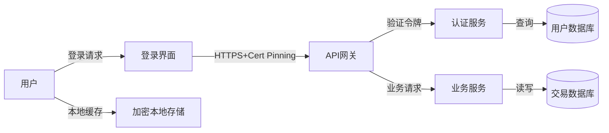

## 18.5 移动应用安全开发生命周期

移动应用安全不是上线前的一次性检查，而是贯穿需求、设计、编码、测试、发布和运维全流程的系统工程。传统Web应用的SDLC（Software Development Lifecycle）无法直接套用到移动场景——移动应用运行在不可信的终端设备上，面临逆向工程、设备Root/越狱、本地数据提取、应用篡改与重打包等独特威胁，必须在每个开发阶段嵌入针对性的安全控制。

本节从安全需求、安全设计、安全编码、安全测试、发布与运维五个阶段展开，结合威胁建模方法论和工具链实践，构建完整的移动应用安全开发生命周期。

### 18.5.1 安全需求阶段

安全需求是整个安全开发生命周期的起点。需求阶段的遗漏会以十倍甚至百倍的代价在后续阶段暴露。移动应用的安全需求必须在功能需求确定的同时明确，并作为验收标准的一部分纳入需求文档。

#### 数据分类与保护要求

移动应用处理的数据类型远比Web应用复杂——除传统的用户凭据和业务数据外，还包括设备标识符（IMEI、Android ID、IDFA）、传感器数据（GPS、摄像头、麦克风）、生物特征数据（指纹、面部识别）和通讯录、短信等个人敏感信息。

数据分类应遵循以下四级模型：

| 数据级别 | 定义 | 保护要求 | 移动端典型数据 |
|---------|------|---------|--------------|
| L1-公开 | 可公开访问的数据 | 完整性保护 | 应用图标、公开API响应 |
| L2-内部 | 仅限内部使用的数据 | 传输加密+访问控制 | 设备型号、应用版本 |
| L3-机密 | 泄露会造成损害的数据 | 存储加密+传输加密+最小权限 | 用户个人信息、交易记录 |
| L4-绝密 | 泄露会造成严重损害的数据 | 硬件级加密+零信任访问 | 生物特征、支付凭据、私钥 |

对于L3及以上数据，移动应用必须使用平台提供的安全存储机制：Android的EncryptedSharedPreferences或Android Keystore，iOS的Keychain或Data Protection API。

#### 合规性要求

移动应用需要满足的合规框架因地区和行业而异，以下是最常见的要求：

- **GDPR**（欧盟通用数据保护条例）：要求数据最小化、用户同意机制、数据可携带权、被遗忘权。移动应用必须实现细粒度的权限同意弹窗，且不能在用户拒绝后反复请求。
- **CCPA/CPRA**（加州消费者隐私法）：要求披露数据收集范围、提供"不出售我的个人信息"选项。
- **个人信息保护法**（中国）：要求明示收集目的和方式，敏感个人信息需单独同意，跨境传输需安全评估。
- **PCI DSS**（支付卡行业数据安全标准）：处理支付卡数据的移动应用不得在本地存储完整的卡号、CVV或磁条数据。
- **HIPAA**（健康保险可携性和责任法案）：医疗健康类移动应用需对PHI数据进行端到端加密和审计日志记录。

合规性需求应转化为具体的可验证技术要求，例如"应用不得在日志中输出用户手机号"或"生物特征数据仅存储在Secure Enclave中，不得传输到服务端"。

#### 认证与授权需求

移动应用的认证需求包括：

- 服务端认证：基于OAuth 2.0 / OpenID Connect的标准化认证流程，禁止客户端自行实现密码验证逻辑
- 多因素认证（MFA）：结合密码、生物特征、OTP短信或硬件令牌
- 设备绑定：将认证会话与设备指纹绑定，防止凭据被盗用
- 会话管理：令牌过期策略、刷新令牌轮换、并发登录限制
- 离线认证：在无网络环境下允许有限功能访问，使用本地加密缓存

授权需求应明确：所有权限校验必须在服务端完成，客户端的权限控制仅用于UI展示，不作为安全边界。

#### 通信安全需求

移动应用的通信安全需求覆盖三个层面：

- **传输层安全**：所有网络通信强制使用TLS 1.2+，实施证书锁定（Certificate Pinning）防止中间人攻击，支持证书透明度（Certificate Transparency）
- **应用层安全**：敏感API请求附加请求签名（HMAC），防止请求篡改和重放攻击
- **本地通信安全**：应用间通信使用显式Intent（Android）或Universal Links（iOS），禁止通过Broadcast/Content Provider泄露敏感数据

### 18.5.2 安全设计阶段

安全设计阶段的核心任务是进行威胁建模（Threat Modeling），识别应用面临的安全风险，并在架构层面设计防御机制。安全设计必须在编码开始前完成，否则架构层面的缺陷将难以通过后续的代码修复弥补。

#### 威胁建模方法论

移动应用推荐使用STRIDE模型进行威胁建模：

| 威胁类型 | 全称 | 移动端典型场景 |
|---------|------|-------------|
| S-仿冒 | Spoofing | 恶意应用伪装成合法应用，钓鱼攻击窃取用户凭据 |
| T-篡改 | Tampering | APK/IPA被反编译修改后重新打包分发 |
| R-抵赖 | Repudiation | 用户否认操作行为，缺乏审计日志 |
| I-信息泄露 | Information Disclosure | 本地数据库明文存储敏感信息，日志泄露 |
| D-拒绝服务 | Denial of Service | 恶意输入导致应用崩溃，资源耗尽 |
| E-权限提升 | Elevation of Privilege | 利用组件导出漏洞获取未授权访问 |

威胁建模的具体步骤：

1. **绘制数据流图（DFD）**：识别应用的外部实体（用户、第三方服务、推送服务）、进程（Activity/Fragment/ViewController）、数据存储（SQLite、SharedPreferences/UserDefaults、Keychain/Keystore）和数据流
2. **应用STRIDE分析**：对每个数据流和数据存储逐一分析六种威胁类型
3. **风险评估**：使用DREAD模型（Damage、Reproducibility、Exploitability、Affected Users、Discoverability）对每项威胁评分
4. **制定缓解措施**：针对高风险威胁设计具体的防御方案

以下是一个典型移动银行应用的威胁建模范例：



针对上述数据流的威胁分析：

| 数据流/存储 | 仿冒 | 篡改 | 抵赖 | 信息泄露 | 拒绝服务 | 权限提升 |
|------------|------|------|------|---------|---------|---------|
| 登录请求 | 钓鱼应用 | 请求参数篡改 | — | 凭据明文传输 | 暴力破解 | — |
| API网关 | 伪造服务端证书 | 响应篡改 | — | TLS降级 | DDoS | — |
| 加密本地存储 | — | 数据文件篡改 | — | Root/越狱设备提取 | — | 跨应用读取 |

#### 安全架构原则

移动应用的安全架构应遵循以下原则：

**最小权限原则**：AndroidManifest.xml中仅声明必需的权限，运行时权限（Runtime Permissions）在功能触发时按需申请而非启动时全部请求。iOS的Info.plist中仅配置实际使用的权限描述。权限申请时必须向用户说明具体用途。

**纵深防御**：安全机制不应依赖单一层次。以用户认证为例，应同时实施传输层加密（TLS）、应用层令牌验证（JWT）、设备层绑定（Device ID）和生物特征二次确认，任一层次被突破不会导致全面沦陷。

**默认安全**：应用首次安装后的默认配置应是最安全的状态。例如：默认关闭调试日志、默认启用屏幕截图保护、默认使用生物特征锁定敏感操作。安全等级的降低应需要用户主动操作。

**失败安全**：当系统出错时应采用安全的默认行为。网络请求超时应返回错误而非默认放行，证书验证失败应中断连接而非降级到HTTP，本地数据解密失败应清除数据而非以明文显示。

**组件最小暴露**：Android的四大组件（Activity、Service、BroadcastReceiver、ContentProvider）默认对外导出，必须在AndroidManifest中显式设置`exported="false"`，仅对需要跨应用调用的组件设置为true并添加自定义权限保护。iOS通过App Sandbox和ATS（App Transport Security）实现天然的组件隔离。

#### 安全设计模式

移动应用常用的安全设计模式包括：

**令牌模式（Token Pattern）**：使用短生命周期的Access Token（15-30分钟）配合长生命周期的Refresh Token，Refresh Token存储在安全存储中（Keychain/Keystore），Access Token仅保留在内存中。令牌轮换机制确保每次刷新时旧的Refresh Token立即失效。

**代理模式（Proxy Pattern）**：通过BFF（Backend For Frontend）层代理所有后端API调用，BFF层负责认证令牌验证、请求速率限制、敏感数据脱敏和响应格式统一，避免移动应用直接暴露后端服务的内部接口。

**安全沙箱模式（Secure Sandbox Pattern）**：将高风险操作（如WebView加载远程内容、第三方SDK初始化）隔离在独立的沙箱进程中，防止漏洞扩散到应用的主业务逻辑。

### 18.5.3 安全编码阶段

安全编码是将安全设计转化为代码实现的阶段。移动应用的安全编码需要同时考虑Android和iOS两个平台的特性差异。

#### 输入验证与输出编码

移动应用的输入源比Web应用更多样：用户输入、Intent/URL Scheme参数、Deep Link、Push Notification payload、WebView JavaScript回调、Content Provider数据、剪贴板内容等，每一个都是潜在的攻击入口。

输入验证规则：

- **白名单验证**：对所有外部输入定义允许的格式、范围和长度，拒绝不符合预期的数据
- **服务端二次验证**：客户端的输入验证仅用于用户体验优化，所有安全关键的验证必须在服务端重复执行
- **WebView输入隔离**：加载用户可控内容的WebView必须启用JavaScript接口白名单，禁止使用`addJavascriptInterface`暴露敏感原生功能（Android）或谨慎使用`WKScriptMessageHandler`（iOS）
- **Deep Link验证**：对所有Deep Link和Custom URL Scheme参数进行严格的类型校验和长度限制，防止通过恶意链接注入数据

#### 安全存储实现

不同敏感级别的数据应使用不同的存储机制：

```java
// Android: 使用EncryptedSharedPreferences存储敏感配置
// 依赖: androidx.security:security-crypto:1.1.0-alpha06
MasterKey masterKey = new MasterKey.Builder(context)
    .setKeyScheme(MasterKey.KeyScheme.AES256_GCM)
    .build();

SharedPreferences securePrefs = EncryptedSharedPreferences.create(
    context,
    "secure_prefs",
    masterKey,
    EncryptedSharedPreferences.PrefKeyEncryptionScheme.AES256_SIV,
    EncryptedSharedPreferences.PrefValueEncryptionScheme.AES256_GCM
);
securePrefs.edit().putString("auth_token", token).apply();
```

```swift
// iOS: 使用Keychain存储敏感数据
// 依赖: Security.framework
func saveToKeychain(key: String, data: Data) -> Bool {
    let query: [String: Any] = [
        kSecClass as String: kSecClassGenericPassword,
        kSecAttrAccount as String: key,
        kSecValueData as String: data,
        kSecAttrAccessible as String: kSecAttrAccessibleWhenUnlockedThisDeviceOnly
    ]
    SecItemDelete(query as CFDictionary) // 先删除旧值
    let status = SecItemAdd(query as CFDictionary, nil)
    return status == errSecSuccess
}
```

绝对禁止的存储方式：SharedPreferences/UserDefaults明文存储密码或令牌，SQLite明文存储敏感字段，将密钥硬编码在源代码或资源文件中，将敏感数据写入应用外部存储（Android SD卡、iOS共享目录）。

#### 安全的加密实践

移动应用开发中最常见的加密错误不是选择了错误的算法，而是错误地使用了正确的算法。以下是关键规则：

- **禁止自行实现加密算法**：使用平台提供的标准加密库（Android: javax.crypto / Android Keystore API；iOS: CommonCrypto / CryptoKit）
- **禁止使用ECB模式**：ECB模式会泄露数据模式，应使用CBC或GCM模式
- **IV/Nonce必须随机生成**：每次加密操作使用新的随机IV/Nonce，禁止使用固定值
- **密钥不得硬编码**：使用平台安全硬件（Android StrongBox/TEE，iOS Secure Enclave）生成和存储密钥
- **弃用不安全算法**：MD5和SHA-1仅用于非安全场景（如缓存键），安全场景必须使用SHA-256以上；DES和3DES已弃用，使用AES-256

```java
// Android: 使用Android Keystore生成和使用密钥
KeyGenerator keyGen = KeyGenerator.getInstance(
    KeyProperties.KEY_ALGORITHM_AES, "AndroidKeyStore");
keyGen.init(new KeyGenParameterSpec.Builder("my_alias",
    KeyProperties.PURPOSE_ENCRYPT | KeyProperties.PURPOSE_DECRYPT)
    .setBlockModes(KeyProperties.BLOCK_MODE_GCM)
    .setEncryptionPaddings(KeyProperties.ENCRYPTION_PADDING_NONE)
    .setKeySize(256)
    .build());
SecretKey secretKey = keyGen.generateKey();
```

#### 安全会话管理

移动应用的会话管理面临独特挑战：移动网络不稳定、应用频繁在前台后台切换、用户可能长时间不使用应用。安全的会话管理应包括：

- Access Token有效期控制在15-30分钟，过期后使用Refresh Token刷新
- Refresh Token采用一次一换策略（Rotation），每次刷新时服务端签发新的Refresh Token并废弃旧的
- 敏感操作（支付、修改密码）要求二次验证，即使会话处于活跃状态
- 应用进入后台超过一定时间（建议5分钟）后，恢复前台时要求重新验证身份
- 登出时同时清除本地存储的令牌和服务端的会话记录

#### 代码审计与静态分析

安全编码阶段应同步进行代码审计，将安全问题消灭在编码阶段：

**自动化SAST工具集成**：将静态分析工具集成到CI/CD流水线中，每次代码提交自动触发扫描：

```yaml
# GitLab CI 示例：集成MobSF静态扫描
security-sast:
  stage: security
  script:
    - docker run -v $(pwd):/work mobsf/mobsfscan /work
      --type android
      --rules-dir /work/.security-rules
      --severity WARNING,ERROR
  artifacts:
    reports:
      sast: gl-sast-report.json
```

**关键SAST检查项**：

| 检查类别 | 具体规则 | 工具支持 |
|---------|---------|---------|
| 硬编码凭据 | 源代码中的API密钥、密码、私钥 | MobSF、Semgrep、Gitleaks |
| 不安全加密 | ECB模式、固定IV、弱哈希算法 | MobSF、FindSecBugs |
| 组件导出 | Android组件未设置exported=false | MobSF、APKLeaks |
| 日志泄露 | Log.d/NSLog输出敏感信息 | Semgrep自定义规则 |
| WebView漏洞 | setJavaScriptEnabled+addJavascriptInterface | MobSF、QARK |

### 18.5.4 安全测试阶段

安全测试是验证安全设计和编码有效性的关键阶段。移动应用的安全测试需要多维度、多层次的综合方法，单一测试手段无法覆盖所有攻击面。

#### 静态应用安全测试（SAST）

SAST在不运行应用的情况下分析源代码或编译产物，发现潜在的安全漏洞。优势是覆盖面广、可早期介入、可自动化；劣势是误报率高、无法发现运行时逻辑漏洞。

Android平台SAST工具链：

| 工具 | 类型 | 检测能力 | 集成方式 |
|------|------|---------|---------|
| MobSF | 开源 | 综合扫描（代码+配置+权限） | Docker/API/CI |
| FindSecBugs | 开源 | Java/Kotlin安全漏洞 | Gradle插件 |
| QARK | 开源 | Android特有漏洞模式 | CLI |
| Semgrep | 开源 | 自定义规则匹配 | CLI/CI |
| Fortify | 商业 | 企业级全面扫描 | IDE/CI |

iOS平台SAST工具链：

| 工具 | 类型 | 检测能力 | 集成方式 |
|------|------|---------|---------|
| MobSF | 开源 | IPA综合扫描 | Docker/API/CI |
| Semgrep | 开源 | Swift/ObjC安全规则 | CLI/CI |
| Clang Static Analyzer | 内置 | 内存安全、逻辑错误 | Xcode集成 |
| Checkmarx | 商业 | 企业级全面扫描 | IDE/CI |

#### 动态应用安全测试（DAST）

DAST在应用运行时进行测试，模拟真实攻击场景。优势是能发现运行时漏洞、误报率低；劣势是覆盖范围有限、依赖测试用例质量。

DAST测试的核心内容：

1. **网络流量拦截与分析**：使用代理工具（Burp Suite、Charles、mitmproxy）拦截应用的网络通信，检查是否使用了不安全的HTTP连接、是否存在证书锁定绕过、API响应中是否泄露敏感信息
2. **本地数据存储检查**：在Root/越狱设备上检查应用的文件系统，验证敏感数据是否加密存储、日志文件是否包含敏感信息、数据库文件是否可被直接读取
3. **组件安全测试**：通过adb和Intent fuzzing测试Android导出组件的安全性，通过URL Scheme注入测试iOS应用的输入处理
4. **认证绕过测试**：尝试修改认证令牌、篡改服务端响应、绕过生物特征认证

#### 交互式应用安全测试（IAST）

IAST结合了SAST和DAST的优势，在应用运行时通过插桩（Instrumentation）实时监控代码执行路径和数据流。IAST能精确定位漏洞的代码行号，误报率远低于SAST，但需要对应用进行插桩改造，不适用于生产环境。

#### 渗透测试

渗透测试是人工安全评估的最终手段，应由专业的安全团队执行。移动应用渗透测试的标准流程：

1. **信息收集**：反编译APK/IPA，分析应用架构、第三方库、API端点
2. **威胁面分析**：识别所有攻击入口——导出组件、Deep Link、WebView、网络API
3. **漏洞利用**：针对识别的威胁面进行实际攻击尝试
4. **后渗透分析**：评估漏洞的实际影响范围和业务风险
5. **报告输出**：按风险等级分类，提供复现步骤和修复建议

渗透测试应至少覆盖OWASP Mobile Top 10的所有风险类别，并在重大版本发布前执行。

### 18.5.5 发布与运维阶段

应用的安全责任并不在发布时结束——发布后的安全运维同样重要。

#### 应用完整性保护

防止应用被篡改和重新打包是移动应用发布的首要安全任务：

**Android完整性保护措施**：

- 启用Google Play App Signing，由Google管理签名密钥
- 实施Play Integrity API（原SafetyNet Attestation），检测设备是否Root、应用是否被篡改
- 使用R8/ProGuard进行代码混淆，增加逆向工程难度
- 集成商业级加固方案（如梆梆安全、爱加密、腾讯乐固）进行DEX加密、SO保护和反调试

**iOS完整性保护措施**：

- 利用App Store的FairPlay DRM保护机制
- 启用App Transport Security（ATS）强制HTTPS
- 使用Objective-C/Swift混淆工具增加反编译难度
- 实施越狱检测（但不应仅依赖此措施作为安全边界）

#### 运行时应用自我保护（RASP）

RASP在应用运行时实时检测和阻止攻击行为：

- **调试检测**：检测ptrace附加、LLDB/GDB连接、frida-server进程
- **Hook框架检测**：检测Xposed、Substrate、Frida等Hook框架的注入
- **环境检测**：检测模拟器、Root/越狱环境、多开应用
- **完整性校验**：运行时校验APK/IPA签名和关键文件的哈希值

RASP检测到异常后的响应策略应分级处理：低风险异常（如模拟器环境）记录日志并降低功能权限，中风险异常（如Hook框架检测）要求用户二次验证，高风险异常（如代码篡改检测）立即终止应用并清除敏感数据。

#### 安全事件监控与响应

建立完善的安全监控体系：

- **崩溃监控**：集成Firebase Crashlytics或自建崩溃收集系统，监控异常崩溃模式（可能表示正在被攻击）
- **网络异常监控**：监控异常的API调用频率、来源IP分布、响应错误码分布
- **版本监控**：监控第三方应用商店和论坛上是否出现应用的篡改版本
- **漏洞响应SLA**：建立漏洞分级响应机制——严重漏洞24小时内发布修复版本，高危漏洞72小时内修复，中低危漏洞纳入下一版本迭代

#### 漏洞赏金计划

对于用户规模较大的移动应用，应建立漏洞赏金计划（Bug Bounty Program）：

- 通过HackerOne、Bugcrowd等平台或自建平台接收安全研究者提交的漏洞
- 明确测试范围和规则——哪些测试行为是被允许的，哪些是禁止的
- 根据漏洞严重性设置赏金等级：严重漏洞（RCE、大规模数据泄露）$5000-$50000，高危漏洞（认证绕过、权限提升）$1000-$5000，中低危漏洞（信息泄露、CSRF）$250-$1000
- 建立快速响应机制——在收到漏洞报告后24小时内确认、72小时内评估、修复后及时通知报告者

### 18.5.6 安全DevOps（DevSecOps）实践

将安全融入CI/CD流水线是现代移动应用开发的最佳实践。安全不应是开发完成后的独立阶段，而应是每次代码提交、每次构建、每次发布的自动化检查点。

典型的移动应用DevSecOps流水线：


每个阶段的安全门禁规则：

| 阶段 | 工具 | 门禁规则 |
|------|------|---------|
| Pre-commit | git-secrets、pre-commit | 阻止提交包含密钥的代码 |
| 代码审查 | Gerrit、GitHub PR | 安全相关代码必须有安全团队审批 |
| SAST | MobSF、Semgrep | 无高危及以上漏洞方可通过 |
| 依赖扫描 | Dependabot、OWASP Dep-Check | 无已知高危CVE的依赖 |
| 构建签名 | Android App Bundle、Xcode Archive | 使用正式签名证书，禁止debug签名发布 |
| DAST | Burp Suite自动化 | 无OWASP Top 10漏洞 |
| 安全门禁 | 自定义脚本 | 综合所有安全检查结果，不通过则阻断发布 |

### 18.5.7 常见误区与纠正

**误区一：安全测试只在上线前做一次。**
纠正：安全是持续过程。每次代码变更都可能引入新的漏洞，安全检查应集成到CI/CD中自动化执行，而非上线前的突击检查。

**误区二：使用了HTTPS就安全了。**
纠正：HTTPS仅保护传输层安全。数据在终端设备上、在应用内存中、在服务端数据库中都面临泄露风险。安全需要端到端的保护。

**误区三：iOS应用比Android应用安全，不需要额外安全措施。**
纠正：iOS的安全沙箱确实提供了更强的系统级保护，但应用层的安全漏洞（如不安全的网络通信、硬编码凭据、业务逻辑缺陷）在两个平台上同样存在。iOS应用同样需要完整的安全开发生命周期。

**误区四：代码混淆就是安全。**
纠正：代码混淆（ProGuard/R8）只是增加了逆向工程的成本和时间，并非不可突破。安全不应依赖混淆作为唯一防线，关键的安全控制应放在服务端实现。

**误区五：第三方SDK的安全由SDK提供商负责。**
纠正：使用第三方SDK的安全责任在于应用开发者。SDK中的漏洞会直接影响宿主应用，开发者必须评估SDK的安全性、监控其漏洞公告，并及时更新到修复版本。

### 18.5.8 总结

移动应用安全开发生命周期是一个系统工程，需要在每个开发阶段嵌入安全控制：

- **需求阶段**：明确数据分类、合规要求和安全功能需求
- **设计阶段**：通过威胁建模识别风险，制定安全架构方案
- **编码阶段**：遵循安全编码规范，使用SAST工具持续检查
- **测试阶段**：多维度安全测试（SAST+DAST+IAST+渗透测试）
- **发布阶段**：应用完整性保护、RASP防护、安全监控
- **运维阶段**：持续监控、漏洞响应、定期安全评估

安全开发生命周期的目标不是消除所有漏洞（这在实践中不可能），而是将安全风险控制在可接受的范围内，并在漏洞被发现时能够快速响应和修复。投资安全开发生命周期的回报远大于事后修补的成本——据IBM的研究，在设计阶段修复安全漏洞的成本仅为生产环境修复成本的1/100。
