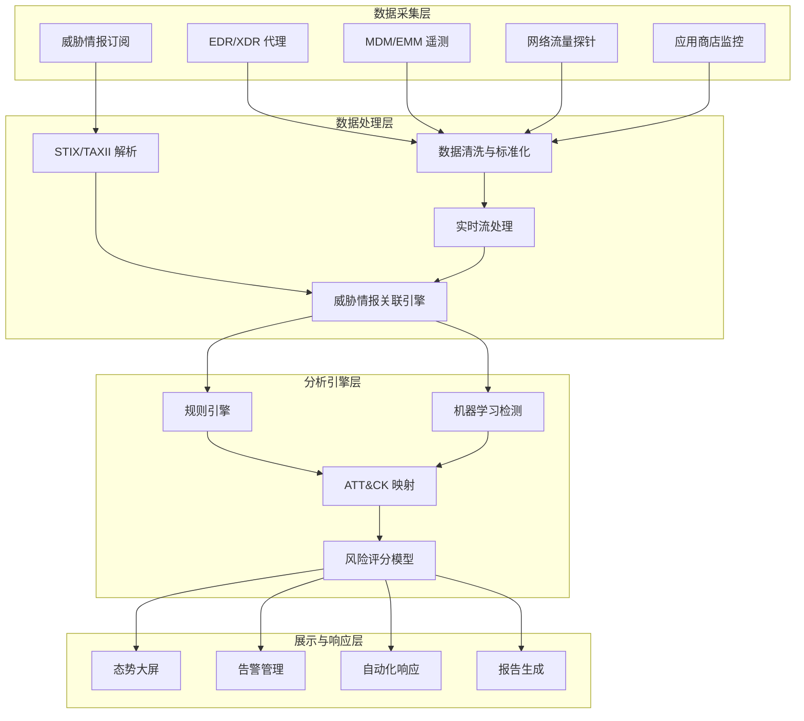
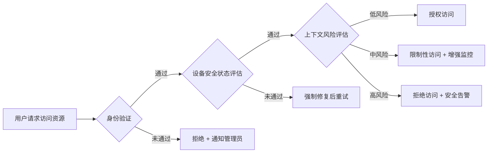

## 18.6 移动威胁情报与态势感知

移动威胁情报（Mobile Threat Intelligence, MTI）是对针对移动设备、移动应用及移动网络生态的威胁进行收集、处理、分析和分发的系统性过程。态势感知则是在威胁情报基础上构建的"看见—理解—预判"能力闭环。两者结合，使安全团队能够从被动响应转向主动防御，在攻击链的早期阶段识别并阻断移动威胁。

本节从威胁情报基础理论出发，覆盖移动恶意软件演进趋势、情报收集与分析方法论、情报共享协议体系、态势感知架构设计、企业移动安全管理体系，以及实战案例与工具链，帮助读者建立完整的移动威胁情报知识框架。

---

### 18.6.1 移动威胁情报基础理论

#### 什么是威胁情报

NIST SP 800-150 将威胁情报定义为"关于威胁行为者的能力、机会和意图的、基于证据的知识，包括上下文、机制、指标、影响和可操作建议"。威胁情报不是原始数据（如 IP 黑名单），也不是信息（如漏洞公告），而是经过分析后能直接指导防御决策的知识产品。

威胁情报的四个层级：

| 层级 | 名称 | 内容 | 消费者 | 典型产出 |
|------|------|------|--------|---------|
| L1 | 战略情报（Strategic） | 威胁趋势、地缘政治影响、行业风险画像 | CISO、高管 | 年度威胁报告、风险简报 |
| L2 | 战术情报（Tactical） | 攻击者的 TTP（战术、技术、过程） | 安全架构师 | MITRE ATT&CK 映射、防御建议 |
| L3 | 运营情报（Operational） | 具体攻击活动的详细信息 | 事件响应团队 | 攻击活动分析报告、IOC 列表 |
| L4 | 技术情报（Technical） | 可机读的指标和特征 | SOC 分析师、自动化系统 | YARA 规则、STIX 包、签名库 |

#### 移动威胁情报的特殊性

移动威胁情报与传统 IT 威胁情报存在显著差异，源于移动生态的特殊架构：

**分发渠道复杂性**：移动应用通过官方商店（Google Play、Apple App Store）、第三方市场、企业 MDM 推送、侧载（sideloading）等多种渠道分发，每种渠道都有不同的安全审查机制和攻击面。攻击者利用审核薄弱的第三方市场投放恶意应用，或通过社会工程诱导用户开启"未知来源"安装。

**沙箱隔离机制**：iOS 和 Android 的应用沙箱机制限制了传统恶意软件的横向移动能力，但同时催生了权限滥用型攻击——恶意应用通过请求过多权限获取敏感数据，而不是直接感染系统。

**碎片化生态**：Android 的设备碎片化（不同厂商、不同版本、不同安全补丁级别）使得统一的安全基线难以建立。同一漏洞在不同设备上的可利用性差异巨大。

**端到端加密通信**：移动应用大量使用 HTTPS 和证书固定（certificate pinning），使得传统的网络流量监控手段效果大打折扣。威胁情报收集需要更多依赖设备端的遥测数据。

**隐私法规约束**：移动设备承载大量个人隐私数据，威胁情报收集必须在安全需求与用户隐私之间取得平衡。GDPR、CCPA 等法规对数据收集范围施加了严格限制。

#### MITRE ATT&CK Mobile 框架

MITRE ATT&CK for Mobile 是移动威胁情报分析的核心参考框架，它将攻击者针对移动设备的战术和技术进行了系统化分类。截至 2025 年，该框架覆盖 14 个战术类别、超过 100 种技术：


各战术下的关键移动专属技术：

| 战术 | 典型技术 | 移动端表现 |
|------|---------|-----------|
| 初始访问 | 恶意应用、钓鱼短信、水坑攻击 | 木马化应用上架应用商店、smishing 链接指向恶意 APK |
| 执行 | 利用客户端漏洞、原生代码执行 | WebView 漏洞利用、Binder IPC 注入 |
| 持久化 | 新安装应用、修改系统进程 | 假冒系统应用、利用设备管理员 API |
| 提权 | 利用漏洞获取 root | 内核漏洞利用（如 Dirty Pipe）、Mediaserver 漏洞 |
| 防御绕过 | 禁用/修改安全软件、混淆文件或信息 | 动态代码加载、反射调用隐藏恶意行为 |
| 收据访问 | 输入捕获、凭据转储 | 键盘记录器、Accessibility Service 滥用 |
| 收集 | 剪贴板数据、屏幕截图、音频捕获 | MediaProjection API 录屏、麦克风常驻监听 |
| 数据泄露 | 通过 C2 通道、DNS 隐蔽通道 | 利用合法云服务（Google Drive、Telegram）传输数据 |

---

### 18.6.2 移动恶意软件发展趋势与分类

#### 恶意软件分类体系

移动恶意软件按行为模式可划分为以下主要家族：

**银行木马（Banking Trojan）**：针对金融应用的凭据窃取类恶意软件。典型代表包括：

- **Anatsa（TeaBot）**：2024 年活动高峰期通过 Google Play 感染超过 100 万用户，利用 Accessibility Service 覆盖登录页面窃取银行凭据，支持超过 650 家金融机构。其核心攻击流程是：诱导用户安装"PDF阅读器"等工具类应用 → 应用下载远程配置文件 → 利用 Accessibility Service 监控前台应用 → 当检测到目标银行应用时注入钓鱼覆盖层。
- **Cerberus**：2020 年源码泄露后衍生出多个变种，具备键盘记录、屏幕录制、双因素认证绕过（拦截短信 OTP）等完整功能套件。
- **Vultur**：首次被发现利用无障碍服务实现远程屏幕控制的银行木马，攻击者能实时观察并操作受害者的银行界面。

**间谍软件（Spyware）**：以情报收集为主要目的的高级威胁。

- **Pegasus（NSO Group）**：国家级间谍软件的标杆。通过零点击（zero-click）漏洞利用链（如 FORCEDENTRY，利用 iMessage 的 PDF 解析漏洞）在无需用户交互的情况下完成全设备控制。能力包括：读取加密即时通讯消息（WhatsApp、Signal、iMessage）、激活麦克风和摄像头、获取 GPS 位置、导出浏览器历史和照片。2021 年的 Forbidden Stories 项目揭露了其在全球范围内的滥用情况。
- **Predator（Cytrox/Intellexa）**：与 Pegasus 同级别的商业化间谍软件，2023 年被发现在多个国家用于监控记者和政治活动人士。
- **FinSpy（FinFisher）**：老牌商业间谍软件，支持 iOS 和 Android，通过水坑攻击或运营商层面注入进行分发。

**勒索软件（Ransomware）**：移动端勒索软件主要通过锁屏或文件加密勒索赎金。

- **Simplocker**：首个被确认的 Android 文件加密勒索软件（2014），使用 AES 加密用户文件并索要比特币赎金。
- **Charger**：伪装成 Flash Player 更新的勒索软件，窃取联系人和短信数据并威胁公开。

**广告软件与灰色软件（Adware/Grayware）**：不直接造成破坏但严重影响用户体验和隐私的软件类别。

- **HiddenAd 家族**：大量通过 Google Play 上架的广告软件，在后台频繁弹出广告、静默下载其他应用，2023 年 Google Play Protect 每月检测到超过 10 万次此类安装。

**移动僵尸网络（Mobile Botnet）**：将大量移动设备纳入僵尸网络用于 DDoS、代理中继或点击欺诈。

- **Mazar BOT**：通过短信传播的 Android 僵尸网络，能够接收远程命令、发送短信（可用于发送付费短信进行欺诈）、通过 Tor 匿名通信。

#### 2024—2025 年关键趋势

**零点击攻击的常态化**：以 Pegasus 的 FORCEDENTRY 为标志，零点击攻击已从国家级能力向更广泛的攻击者扩散。iOS 和 Android 均已出现不需要用户任何交互的完整利用链。这意味着仅靠"不要点击可疑链接"的用户教育已不足够。

**供应链投毒上升**：攻击者不再仅仅投毒第三方市场，而是开始尝试污染官方应用商店的 SDK 供应链。2023 年的 iRecorder 事件中，一个合法的屏幕录制应用在更新中被植入 AhRAT 远控木马，SDK 供应链是关键入口。

**AI 驱动的攻击**：利用大型语言模型生成高度定制化的钓鱼短信和社交工程脚本，使得传统基于关键词的检测手段失效。深度伪造音视频也被用于移动端的高级社工攻击。

**5G 与 IoT 融合攻击面**：移动设备作为 IoT 控制中心（智能家居 App、车载系统 App），成为攻击者进入 IoT 网络的跳板。5G 网络切片的安全隔离如果不当配置，可能允许横向跨越不同的网络切片。

---

### 18.6.3 移动威胁情报收集与分析

#### 情报收集源

移动威胁情报的收集需要建立多源信息汇聚体系：

**开放源情报（OSINT）**：
- 安全厂商博客和研究报告（Lookout、Zimperium、CrowdStrike、卡巴斯基 GReAT 团队）
- 学术论文和会议演讲（Black Hat、DEF CON、Virus Bulletin）
- CVE/NVD 漏洞数据库中移动相关条目
- GitHub 和 Pastebin 上的恶意代码样本和泄露工具
- VirusTotal、MalwareBazaar 等样本共享平台

**商业情报源**：
- 专业移动安全厂商的威胁情报订阅服务（Lookout Threat Intelligence、Zimperium z9）
- 安全信息与事件管理（SIEM）平台的集成情报源
- 行业 ISAC（信息共享与分析中心）的移动威胁共享

**暗网和地下论坛监控**：
- 移动恶意软件即服务（MaaS）市场的价格和功能变化
- 零日漏洞交易平台上的移动漏洞报价（iOS 完整利用链的报价通常在 50 万至 200 万美元）
- 泄露的 API 密钥、企业证书和签名密钥

**设备端遥测数据**：
- EDR/XDR 平台的移动代理收集的设备行为数据
- MDM/EMM 系统收集的设备合规状态和应用安装日志
- 移动应用商店的审核反馈和用户举报数据

#### 情报分析方法论

**钻石模型（Diamond Model）分析法**：钻石模型将入侵事件分解为四个核心要素——对手（Adversary）、能力（Capability）、基础设施（Infrastructure）、受害者（Victim），以及它们之间的关系。在移动威胁分析中的应用：

- **对手→能力**：追踪特定 APT 组织使用过的移动恶意软件家族和漏洞利用链
- **能力→基础设施**：分析恶意应用连接的 C2 命令与控制服务器分布
- **基础设施→受害者**：通过 C2 服务器的地理位置和域名注册信息推断目标行业和地域
- **受害者→对手**：从受害企业的行业属性和地理位置反推可能的对手归属

**MITRE ATT&CK 映射法**：将捕获的移动恶意样本的行为映射到 ATT&CK Mobile 矩阵中，识别攻击者的能力范围和成熟度：

```text
恶意样本行为 → ATT&CK 技术编号 → 战术归属 → 防御措施匹配
```

例如，一个银行木马的行为映射：
- 监控前台应用 → T1418（应用发现）→ 发现阶段
- 注入覆盖层 → T1516（输入注入）→ 收集阶段
- 拦截短信 → T1412（短信拦截）→ 凭据访问阶段
- 发送数据到 C2 → T1437（标准应用层协议）→ C2 阶段

**YARA 规则编写实战**：YARA 是移动恶意软件分析中的核心特征匹配工具。以下是检测常见 Android 木马行为模式的 YARA 规则示例：

```yara
rule Android_BankingTrojan_Accessibility {
    meta:
        description = "Detects Android banking trojan using Accessibility Service abuse"
        author = "Security Analyst"
        date = "2025-01"
        severity = "high"
    
    strings:
        $accessibility = "AccessibilityService" ascii
        $overlay_type = "TYPE_APPLICATION_OVERLAY" ascii
        $sms_read = "content://sms/inbox" ascii
        $crypto_class = "javax.crypto" ascii
        $base64_encode = "android.util.Base64" ascii
        
        // Known banking overlay package patterns
        $bank1 = "com.banking" ascii nocase
        $bank2 = "com.paypal" ascii nocase
        
    condition:
        uint16(0) == 0x4B50 and // ZIP/APK magic bytes
        ($accessibility and $overlay_type) and
        ($sms_read or ($crypto_class and $base64_encode)) and
        any of ($bank*)
}
```

**动态沙箱分析**：当静态分析无法确定样本行为时，需要在沙箱环境中执行样本并记录其行为。Android 分析的典型流程：

```bash
# 1. 启动 Android 模拟器
emulator -avd analysis_device -no-snapshot -writable-system

# 2. 安装 Frida Server（动态插桩）
adb push frida-server /data/local/tmp/
adb shell chmod 755 /data/local/tmp/frida-server
adb shell /data/local/tmp/frida-server &

# 3. 安装待分析的 APK
adb install malicious_sample.apk

# 4. 使用 Frida Hook 关键 API 调用
frida -U -f com.target.app -l hook_script.js --no-pause

# 5. hook_script.js 中监控的关键行为：
#    - 网络连接（OkHttp、Retrofit、原生 Socket）
#    - 文件读写操作
#    - 短信发送/读取
#    - 联系人/通话记录访问
#    - 位置信息获取
#    - 加密 API 调用
```

#### STIX/TAXII 标准协议

移动威胁情报的标准化共享依赖于两个核心协议：

**STIX（Structured Threat Information Expression）**：定义威胁情报的数据模型和序列化格式（JSON）。STIX 2.1 定义了 18 种 SDO（STIX Domain Objects）和 14 种 SRO（STIX Relationship Objects），移动威胁情报常用的包括：

- **Malware**：描述移动恶意软件的名称、家族、类型（ransomware、trojan 等）
- **Indicator**：包含移动恶意应用的哈希值、C2 域名、证书指纹等
- **Attack-Pattern**：对应 ATT&CK Mobile 中的技术
- **Vulnerability**：移动端 CVE 漏洞描述
- **Observed-Data**：设备端收集的原始遥测数据

**TAXII（Trusted Automated eXchange of Indicator Information）**：定义威胁情报的传输协议，支持三种服务模式：

- **Collection 模式**：订阅者主动从提供者的情报集合中拉取最新情报
- **Channel 模式**：提供者将情报推送到频道，订阅者从频道中消费
- **Discovery 模式**：发现可用的情报源和服务端点

一个典型的 STIX 2.1 移动威胁指标示例：

```json
{
  "type": "indicator",
  "spec_version": "2.1",
  "id": "indicator--a1b2c3d4-e5f6-7890-abcd-ef1234567890",
  "created": "2025-01-15T08:30:00.000Z",
  "modified": "2025-01-15T08:30:00.000Z",
  "name": "Anatsa Banking Trojan APK Hash",
  "description": "SHA-256 hash of Anatsa trojan disguised as PDF viewer",
  "pattern": "[file:hashes.'SHA-256' = 'a1b2c3d4e5f6...']",
  "pattern_type": "stix",
  "valid_from": "2025-01-15T00:00:00.000Z",
  "indicator_types": ["malicious-activity"]
}
```

---

### 18.6.4 移动态势感知体系构建

#### 态势感知的三个层次

Endsley 的态势感知理论将态势感知分为三个层次，映射到移动安全领域：

**第一层：感知（Perception）——"看见"**

这一层的核心任务是建立全面的移动环境可见性：

- **资产发现**：识别所有接入企业网络的移动设备，包括 BYOD 设备、IoT 移动控制设备、企业配发设备。需要持续扫描设备指纹（OS 版本、安全补丁级别、已安装应用列表、root/越狱状态）。
- **威胁检测**：通过 EDR 代理、网络流量分析、应用商店监控等手段发现已知和未知威胁。关键指标包括：异常应用安装行为、异常权限请求、异常网络连接模式、异常电池和流量消耗。
- **漏洞评估**：持续评估设备和应用的漏洞暴露面，包括 OS 内核漏洞、预装应用漏洞、第三方 SDK 漏洞、Webview 组件漏洞。

**第二层：理解（Comprehension）——"看懂"**

将原始数据转化为可理解的安全态势：

- **威胁关联分析**：将孤立的告警关联成完整的攻击链。例如，一个设备上的异常应用安装 + 短信拦截权限授予 + 向可疑 IP 发送加密数据，三者关联后构成一个完整的间谍软件攻击链。
- **风险评估**：基于设备安全状态、用户行为模式和威胁情报，计算设备级别的风险评分。评分因素包括：设备是否 root/越狱、安全补丁是否及时更新、是否有高风险应用、用户是否经常访问高风险网络。
- **攻击阶段判定**：基于 MITRE ATT&CK 框架，判定当前检测到的活动处于攻击链的哪个阶段，从而确定响应的紧急程度。

**第三层：预测（Projection）——"预判"**

基于当前态势预测未来的威胁发展：

- **趋势预测**：结合行业威胁情报和历史数据，预测下一个可能的攻击向量。例如，如果近期发现多个利用 WebView 漏洞的攻击样本，应预见类似的攻击将在短期内增加。
- **脆弱性预测**：识别当前安全架构中的薄弱环节，预测攻击者可能利用的路径。例如，如果企业的 MDM 策略未覆盖个人设备，应预见 BYOD 设备可能成为下一个突破口。
- **攻击者意图评估**：通过 TTP 分析和受害者画像，推断攻击者的下一步行动目标和方式。

#### 态势感知平台架构

一个完整的移动态势感知平台（Mobile Security Posture Management, MSPM）应包含以下组件：



#### 关键能力指标（KPI）

衡量态势感知体系有效性的核心指标：

| 指标 | 定义 | 目标值 | 意义 |
|------|------|--------|------|
| MTTD（平均检测时间） | 从威胁出现到被检测到的时间 | < 4 小时 | 衡量感知层的灵敏度 |
| MTTR（平均响应时间） | 从检测到威胁到完成处置的时间 | < 24 小时 | 衡量响应层的效率 |
| IOC 覆盖率 | 已知威胁指标的匹配检测比例 | > 95% | 衡量情报库的完整性 |
| 误报率 | 告警中误报的比例 | < 10% | 衡量分析引擎的精度 |
| 设备合规率 | 满足安全基线要求的设备比例 | > 95% | 衡量安全基线的执行力 |
| 情报新鲜度 | 情报源的平均更新延迟 | < 1 小时 | 衡量情报分发的时效性 |

---

### 18.6.5 企业移动安全管理体系

#### MDM/MAM/UEM 架构

企业移动安全管理经历了从单一设备管理到统一端点管理的演进：

**MDM（Mobile Device Management）**：聚焦设备层面的管理与控制。
- 设备注册与配置：通过 OTA（Over-The-Air）推送配置文件，设置 Wi-Fi、VPN、邮件、证书等企业配置。
- 设备合规策略：设定密码复杂度、屏幕锁定超时、加密要求、root/越狱检测。
- 远程操作：远程锁定、远程擦除（支持选择性擦除，仅删除企业数据而保留个人数据）、远程定位。
- 局限性：仅管理设备级别，无法细粒度控制单个应用的行为和数据。

**MAM（Mobile Application Management）**：聚焦应用层面的管理与保护。
- 应用分发：企业应用商店（Enterprise App Store），集中管理内部应用的发布和版本更新。
- 应用封装（App Wrapping）：通过策略注入在不修改应用源代码的情况下为应用添加安全策略，如禁止复制粘贴、禁止截屏、强制通过 VPN 访问。
- 应用级 VPN（Per-App VPN）：仅为企业应用建立 VPN 通道，不影响个人应用的网络流量。
- 应用黑名单/白名单：控制用户可安装和使用的应用范围。

**UEM（Unified Endpoint Management）**：整合 MDM、MAM、MIM 的统一管理平台，同时覆盖移动设备、桌面设备、IoT 设备。代表产品包括 Microsoft Intune、VMware Workspace ONE、Ivanti UEM、Jamf（专注 Apple 生态）。

#### 零信任移动安全架构

零信任模型在移动安全领域的应用遵循"永不信任、始终验证"原则：



**设备信任评估的关键因子**：
- 设备型号和 OS 版本是否在支持范围内
- 安全补丁级别是否及时更新（通常要求不超过 90 天）
- 是否存在 root/越狱迹象
- 是否开启了全盘加密
- 是否启用了生物识别或强密码
- 是否安装了已知的恶意或高风险应用
- 设备的网络环境（是否连接了不安全的公共 Wi-Fi）

**持续自适应信任评估**：不是一次验证后就永久信任，而是在会话期间持续评估风险。当检测到异常行为（如设备位置突然变化、安装了新的高风险应用、网络环境异常），立即降低信任等级并触发重新验证。

#### BYOD 安全策略

BYOD（Bring Your Own Device）是企业移动安全管理中最大的挑战之一。核心矛盾在于企业安全需求与员工隐私保护之间的平衡：

**容器化隔离方案**：将企业数据和应用隔离在安全容器中，与个人数据完全分离。技术实现包括：
- Android Work Profile：Android 原生的工作配置文件机制，在设备上创建独立的企业空间。
- iOS User Enrollment：iOS 13 引入的用户注册模式，为 BYOD 场景提供更轻量的管理方式。
- 第三方容器方案：如 Samsung Knox、BlackBerry Dynamics 等，提供更深层的隔离和保护。

**隐私保护策略**：
- MDM 仅收集设备合规状态信息（OS 版本、安全补丁级别、设备加密状态），不收集个人应用列表、浏览历史、位置信息。
- 企业擦除操作必须支持选择性擦除（selective wipe），仅删除企业配置和数据，保留个人数据。
- 透明的隐私政策：明确告知员工哪些数据会被收集、如何使用、保留多久。

---

### 18.6.6 移动威胁情报工具与平台

#### 开源工具

**MISP（Malware Information Sharing Platform）**：
最广泛使用的开源威胁情报共享平台，支持 STIX 2.0/2.1 格式的 IOC 管理和分发。MISP 提供 Web 界面和 REST API，支持自动化情报共享和关联分析。在移动威胁情报场景中，MISP 用于管理移动恶意应用哈希、C2 域名/IP、恶意证书指纹等 IOC。

```bash
# MISP 安装（Docker 方式）
docker pull misp/misp-docker
docker-compose up -d

# 通过 API 创建移动恶意软件事件
curl -X POST https://misp.example.com/events \
  -H "Authorization: YOUR_API_KEY" \
  -H "Content-Type: application/json" \
  -d '{
    "Event": {
      "info": "Anatsa Banking Trojan - New Campaign 2025",
      "distribution": 1,
      "threat_level_id": 4,
      "analysis": 2,
      "Attribute": [
        {
          "type": "sha256",
          "category": "Payload delivery",
          "value": "a1b2c3d4e5f6..."
        },
        {
          "type": "domain",
          "category": "Network activity",
          "value": "malicious-c2.example.com"
        }
      ]
    }
  }'
```

**OpenCTI（Open Cyber Threat Intelligence）**：
基于 STIX 2.1 标准构建的开源威胁情报平台，提供比 MISP 更强的知识图谱和关联分析能力。支持将 MITRE ATT&CK、CVE、恶意软件家族、攻击者组织等多维信息关联成统一的知识图谱。

**YARA 规则引擎**：
用于文件特征匹配的开源工具，在移动恶意软件检测中广泛使用。可通过 VirusTotal Retrohunt 对历史样本进行批量扫描。

**Frida**：
动态插桩工具，在移动威胁情报分析中用于运行时 hook 和行为监控。可以在不修改应用代码的情况下监控应用的网络通信、API 调用、文件操作等行为。

**MobSF（Mobile Security Framework）**：
开源的移动应用安全分析平台，支持 Android 和 iOS 应用的静态分析和动态分析。提供 Web 界面，可自动化地生成安全评估报告，包括权限分析、代码漏洞检测、网络通信分析等。

#### 商业平台

**Lookout Mobile Endpoint Security**：
全球最大的移动安全数据集之一，保护超过 2 亿台设备。其 Lookout Threat Graph 利用机器学习分析应用行为和设备状态，提供实时威胁检测和响应。核心能力包括应用信誉评估、网络钓鱼防护、设备威胁检测。

**Zimperium zIPS/z9**：
基于设备端机器学习的移动威胁防护方案。z9 引擎在设备上运行，不需要将数据发送到云端即可检测恶意应用、网络攻击和设备漏洞，适合隐私敏感场景。

**CrowdStrike Falcon for Mobile**：
将 CrowdStrike 的威胁情报和 EDR 能力扩展到移动设备，与桌面端共享同一威胁图谱，提供跨平台的统一威胁视图。

---

### 18.6.7 实战案例分析

#### 案例一：Pegasus 的检测与溯源

**背景**：2021 年，Forbidden Stories 和 Amnesty International 发布了 Pegasus 项目调查报告，揭露 NSO Group 的 Pegasus 间谍软件在全球范围内被用于监控记者、人权活动家和政治人物。

**检测方法**：
Amnesty International 开发了 MVT（Mobile Verification Toolkit），通过分析 iOS 备份文件和 Android 文件系统来检测 Pegasus 感染痕迹。关键检测逻辑包括：

```bash
# 使用 MVT 分析 iOS 备份
mvt-ios check-backup --indicators pegasus_stix2.json /path/to/backup

# MVT 检测的关键指标：
# - 异常的 DataUsage.sqlite 记录（已知 Pegasus C2 域名的流量记录）
# - 异常的 SMS 附件（包含利用链的恶意 iMessage 附件）
# - 异常的 Safari 浏览历史（水坑攻击的重定向记录）
# - IOStorageFamily 中的异常快照（Pegasus 留下的文件系统痕迹）
```

**ATT&CK 映射**：
Pegasus 完整利用链覆盖了 ATT&CK Mobile 矩阵的大部分战术，从初始访问（零点击 iMessage 利用）到数据泄露（加密通道传输数据），展现了国家级攻击者的全栈能力。

**防御启示**：零点击攻击的防御不能依赖用户行为，必须在设备和操作系统层面建立防线。Apple 在 iOS 16 中引入了 Lockdown Mode，大幅限制了消息附件处理、JIT 编译等 Pegasus 利用的功能入口。

#### 案例二：企业 MDM 策略缺失导致的数据泄露

**背景**：某科技公司的 500 名员工使用个人手机访问企业应用（邮件、代码仓库、内部文档），但公司未部署 MDM/MAM 方案。一名员工在第三方市场下载了伪装成"系统清理工具"的木马应用，该应用获取了 Accessibility Service 权限后监控屏幕内容，截获了员工访问代码仓库时的登录凭据，进而导致核心源代码被窃取。

**根因分析**：
- 无 BYOD 安全策略：员工可以随意安装任何应用
- 无应用白名单/黑名单机制：无法阻止已知的恶意应用
- 无设备合规检查：root/越狱设备也能访问企业资源
- 无应用级隔离：企业应用和个人应用共用同一环境
- 无异常行为检测：木马应用的屏幕录制行为未被发现

**改进方案**：
1. 部署 UEM 平台，强制所有接入企业资源的设备注册
2. 实施 Work Profile / App Wrapping，隔离企业数据
3. 配置应用合规策略，自动阻止已知恶意应用
4. 启用设备安全状态检查，不合规设备限制访问权限
5. 部署移动 EDR 代理，实时监控设备和应用行为
6. 零信任网络接入：每次访问都验证身份、设备和上下文

---

### 18.6.8 常见误区与最佳实践

#### 常见误区

**误区一："移动设备不会被攻击"**
许多企业和个人仍然认为移动设备比桌面设备更安全，因为 iOS/Android 的沙箱机制。事实是：沙箱确实限制了传统恶意软件的行为，但攻击者已经转向权限滥用型攻击（利用合法 API 实现恶意目的）和零点击漏洞利用，这些攻击完全可以在沙箱环境下工作。

**误区二："应用商店是安全的"**
Google Play 和 App Store 的审核机制并非万无一失。Google Play Protect 每月检测数百万次恶意安装，说明大量恶意应用能够通过审核。许多恶意应用在上架时是正常的，通过后续更新下载恶意组件（延迟投放策略），绕过审核。

**误区三："威胁情报就是 IOC 黑名单"**
仅依赖 IOC（哈希值、IP 地址、域名）的威胁情报过于表层，这些指标的生命周期很短（C2 域名可能每天更换）。高价值的威胁情报应该关注 TTP 层面——攻击者如何行动，而不仅仅是他们使用的基础设施是什么。

**误区四："MDM 等于移动安全"**
MDM 仅提供设备层面的管理能力，无法应对应用层面的威胁（恶意应用、SDK 供应链攻击）和网络层面的威胁（中间人攻击、恶意 Wi-Fi）。完整的移动安全需要 MDM + MAM + 移动 EDR + 网络防护的多层体系。

#### 最佳实践

1. **建立移动威胁情报订阅机制**：至少订阅 2-3 个不同来源的威胁情报，包括一个商业源和一个开源/社区源，确保情报覆盖的广度和深度。
2. **定期更新 MITRE ATT&CK 映射**：将移动安全控制措施与 ATT&CK Mobile 矩阵对照，识别防御盲区。
3. **实施持续的设备合规监控**：不是注册时检查一次，而是在整个设备生命周期中持续验证安全状态。
4. **开展红蓝对抗演练**：定期进行移动安全红蓝对抗，验证防御体系的有效性。
5. **建立自动化响应能力**：对高置信度的威胁实现自动化处置（如自动隔离受感染设备、自动阻止已知恶意 C2 通信）。
6. **保持安全补丁的及时更新**：移动 OS 的安全补丁通常在漏洞公开后数天到数周内发布，缩短从补丁发布到设备更新的窗口期是减少暴露面的关键。
7. **定期进行移动应用安全审计**：对企业自研移动应用进行 SAST/DAST/IAST 安全测试，同时对使用的第三方 SDK 进行安全评估。
