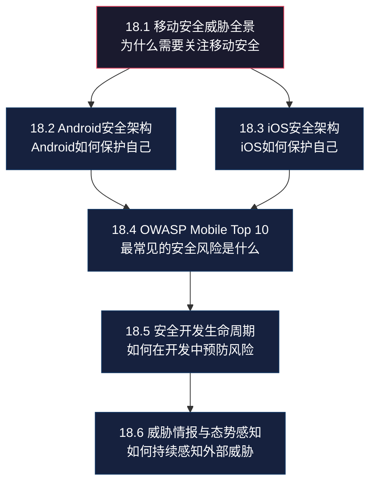
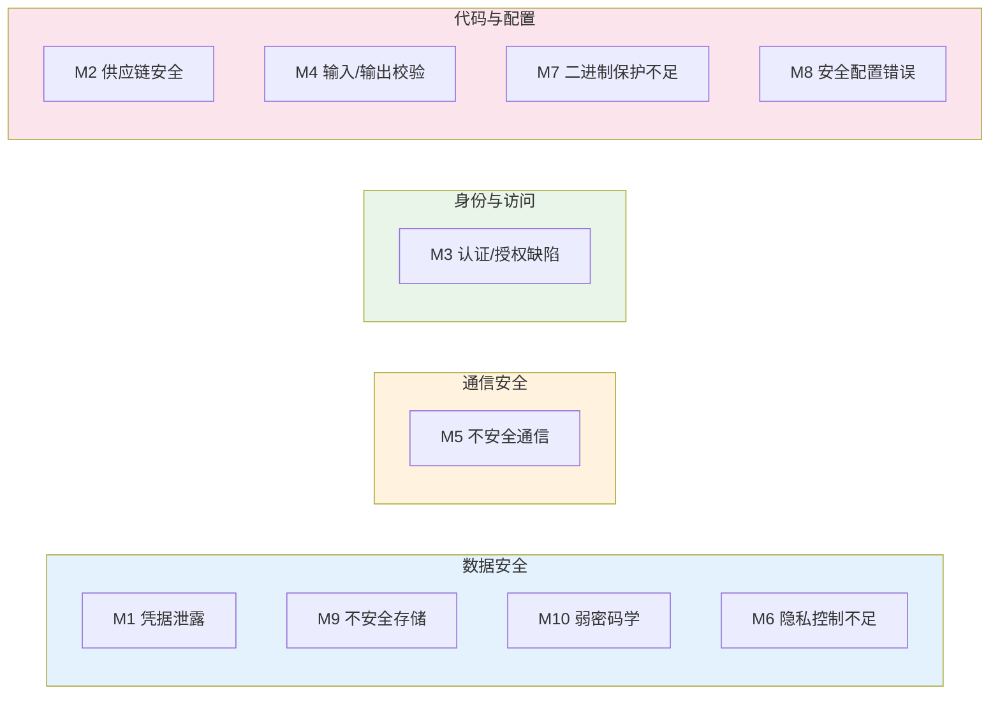
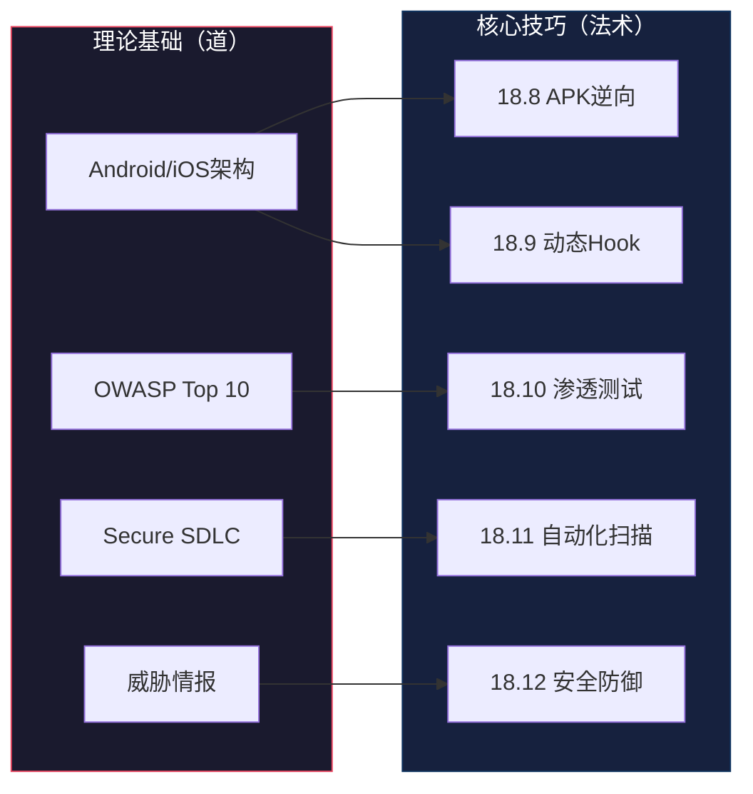

## 本节小结：移动安全理论基础全景回顾

理论基础是全章的根基。本节从18.1到18.6，构建了移动安全的完整认知框架——从威胁全景到平台架构，从行业标准到开发流程，再到态势感知。在进入核心技巧（法术）之前，有必要对本节的知识脉络进行系统梳理，确保每一个理论节点都扎实可靠。

### 知识体系总览

本节六个小节形成了层层递进的知识结构：

这条知识链回答了五个核心问题：**威胁是什么→系统如何防御→常见风险有哪些→如何在开发中预防→如何持续感知外部变化**。缺少任何一个环节，后续的实操技术都将失去方向感。

---

### 各小节核心要点回顾

#### 18.1 移动安全威胁全景 — 认知起点

移动安全的特殊性源于移动设备与传统PC在安全模型上的五个根本差异：设备便携性（物理攻击面大）、应用生态封闭性（第三方市场和侧载风险）、传感器数据暴露（GPS/摄像头/麦克风滥用）、持续网络连接（中间人攻击窗口大）、用户行为模式（安全意识相对薄弱）。

威胁分为五大类：恶意应用、数据泄露、网络攻击、物理攻击、社会工程。每一类威胁都对应着不同的攻击手法和防御策略，后续章节将逐一深入。

**关键认知**：移动安全不是一个独立领域，它是网络安全、应用安全、物理安全和社会工程学的交叉地带。理解这一点，才能避免"只关注技术漏洞而忽视人为因素"的片面思维。

#### 18.2 Android安全架构 — 开放生态的安全博弈

Android基于Linux内核构建，采用"开放+权限控制"的安全哲学，形成了六层防御体系：

| 安全层 | 核心机制 | 安全作用 | 已知局限 |
|--------|---------|---------|---------|
| 内核层 | UID/GID隔离、SELinux、Binder IPC | 进程隔离、强制访问控制 | Root漏洞可绕过内核保护 |
| 框架层 | Permission Manager、Package Manager | 权限管控、应用签名验证 | 运行时权限可被用户误授予 |
| 运行时 | ART虚拟机、核心库 | 内存安全、代码执行隔离 | JNI层缺乏内存安全保护 |
| HAL层 | 硬件抽象 | 硬件访问隔离 | HAL接口本身可能成为攻击面 |
| 应用层 | 应用沙箱、四大组件 | 应用间隔离 | Content Provider导出可被滥用 |
| 验证层 | Verified Boot、dm-verity | 启动链完整性 | 解锁Bootloader后保护失效 |

**关键认知**：Android的安全架构是一个"层层叠加但层层可被绕过"的体系。理解每一层的保护机制固然重要，但更重要的是理解每一层的边界条件——在什么条件下保护会失效。这正是后续逆向分析和渗透测试的理论基础。

APK签名机制经历了v1→v2→v3→v4的演进，每次升级都修复了前一版本的安全缺陷。v2/v3引入了全文件签名，防止APK文件被篡改；v3增加了密钥轮换机制，解决签名密钥泄露后的恢复问题。

#### 18.3 iOS安全架构 — 封闭体系的信任链

Apple采用"硬件+软件深度集成"的安全哲学，核心设计理念是**硬件信任根**：

- **Secure Enclave Processor（SEP）**：独立安全协处理器，拥有独立启动链和加密内存，即使主处理器被攻破，SEP中的密钥和生物识别数据依然安全
- **UID Key**：工厂注入的256位AES密钥，存储在熔丝中，任何软件都无法读取
- **四级数据保护**：Complete Protection → Protected Unless Open → Protected Until First User Authentication → No Protection，每个文件独立加密
- **代码签名强制执行**：所有可执行代码必须经过Apple签名，系统启动时逐页验证
- **Keychain安全存储**：基于硬件加密的密码管理系统，支持多种访问控制属性

**Android vs iOS安全哲学对比**：

| 对比维度 | Android | iOS |
|---------|---------|-----|
| 设计哲学 | 开放生态 + 权限控制 | 封闭生态 + 硬件信任根 |
| 应用分发 | 多源分发（官方+第三方+侧载） | 单一渠道（App Store） |
| 权限模型 | 运行时动态授权 | 安装时静态声明 + 运行时弹窗 |
| 加密基础 | 软件为主（Keystore） | 硬件为主（SEP + UID Key） |
| 代码签名 | 验证但允许自签名 | 强制Apple签名或认证开发者 |
| 越狱/Root难度 | 相对较低（Bootloader可解锁） | 相对较高（硬件安全链） |
| 安全更新 | 碎片化严重（厂商定制） | 统一推送（覆盖率高） |

**关键认知**：iOS的"安全优势"并非绝对，而是建立在"封闭换安全"的取舍之上。Pegasus间谍软件和Operation Triangulation攻击已经证明，即使是最封闭的系统也可能被国家级攻击者突破。安全架构分析的目标不是判断"哪个更安全"，而是理解"各自在什么条件下会被突破"。

#### 18.4 OWASP Mobile Top 10 — 行业安全标尺

OWASP Mobile Top 10（2024版）是移动应用安全评估的核心参考框架。十大风险可以归纳为四个维度：

**关键认知**：OWASP Top 10不是简单的"漏洞清单"，而是一个**风险评估框架**。在实际安全测试中，应按照这个框架系统性地评估应用的每个维度，而不是随机地寻找漏洞。后续核心技巧中的渗透测试流程将直接映射到这十大风险。

#### 18.5 安全开发生命周期 — 从事后补救到安全左移

Secure SDLC将安全活动嵌入软件开发的五个阶段：

1. **安全需求**：数据分类、合规要求（GDPR/CCPA/个人信息保护法）、认证授权需求
2. **安全设计**：最小权限、纵深防御、默认安全、失败安全四大原则
3. **安全编码**：输入验证、安全加密、安全存储、会话管理、代码审查
4. **安全测试**：SAST（源码扫描）→ DAST（运行时分析）→ IAST（混合模式）→ 渗透测试（人工评估）
5. **发布监控**：完整性保护、RASP、安全事件响应、漏洞赏金

**关键认知**：安全左移（Shift Left）的核心理念是"越早发现漏洞，修复成本越低"。在需求阶段发现一个设计缺陷的修复成本是1x，在测试阶段发现是10x，在生产环境被利用是100x。这个成本模型是说服开发团队投入安全资源的最有力论据。

#### 18.6 威胁情报与态势感知 — 动态安全的前沿

移动恶意软件的三大演进趋势：

- **木马化应用增长**：攻击者将恶意代码注入合法应用的破解版，通过第三方渠道分发（Anatsa银行木马感染100万+用户）
- **间谍软件商业化**：Pegasus展示了国家级攻击能力，商业化间谍软件降低了攻击门槛
- **5G/IoT融合风险**：移动设备作为IoT控制中心，成为攻击IoT网络的跳板

企业移动安全管理的四层模型：MDM（设备管理）→ MAM（应用管理）→ MIM（数据管理）→ UEM（统一端点管理）。

**关键认知**：威胁情报不是"知道最近发生了什么攻击"，而是**建立预测能力**——通过分析攻击趋势、攻击者TTP（战术、技术、流程），提前布局防御策略。态势感知则是将威胁情报转化为可执行的安全决策的过程。

---

### 核心概念速查表

以下表格汇总本节涉及的所有核心概念，方便快速回顾和查阅：

| 概念 | 定义 | 所属小节 | 与后续章节的关联 |
|------|------|---------|----------------|
| 应用沙箱 | 每个应用运行在独立的UID空间，无法直接访问其他应用数据 | 18.2/18.3 | 18.8 逆向分析中需要绕过沙箱限制 |
| SELinux | Linux内核的强制访问控制机制，Android用它限制进程权限 | 18.2 | 18.9 Hook技术需要理解SELinux策略 |
| APK签名 | v1(JAR签名)→v2(全文件签名)→v3(密钥轮换)→v4(流式签名) | 18.2 | 18.8 反编译与重打包、18.12 完整性校验 |
| Secure Enclave | iOS独立安全协处理器，处理密钥和生物识别 | 18.3 | 18.9 iOS动态分析中的安全边界 |
| 数据保护等级 | iOS四级文件加密体系，基于硬件加密引擎 | 18.3 | 核心技巧中的数据存储安全测试 |
| Keychain | iOS密码管理系统，基于硬件加密 | 18.3 | 身份认证安全测试中的Token提取 |
| OWASP Top 10 | 移动应用十大安全风险评估框架 | 18.4 | 18.10 渗透测试流程的评估标尺 |
| SAST/DAST/IAST | 三种应用安全测试方法论 | 18.5 | 18.11 自动化安全扫描的理论基础 |
| RASP | 运行时应用自我保护，在应用内部检测攻击 | 18.5 | 18.12 移动安全防御技术 |
| MDM/MAM/UEM | 企业移动安全管理的层次模型 | 18.6 | 实战案例三：MDM安全缺陷利用 |
| 威胁情报 | 收集、分析、应用威胁信息以提升防御能力 | 18.6 | 深度拓展中的移动恶意软件分析 |

---

### 从理论到实践的桥梁

理论基础（道）为后续的核心技巧（法术）提供了必要的知识铺垫。以下是理论知识到实操技能的映射关系：

| 理论知识 | 对应实操技能 | 关键联系 |
|---------|------------|---------|
| Android安全架构 | APK逆向分析（18.8） | 理解APK结构和签名机制是逆向分析的前提 |
| Android安全架构 | 动态分析与Hook（18.9） | 理解SELinux、Binder、沙箱才能编写有效的Hook脚本 |
| iOS安全架构 | iOS动态分析 | 理解SEP、Keychain、代码签名才能定位iOS应用的安全边界 |
| OWASP Top 10 | 移动渗透测试（18.10） | Top 10是渗透测试的检查清单和评估框架 |
| Secure SDLC | 自动化安全扫描（18.11） | SAST/DAST/IAST是SDLC中安全测试阶段的工具化实现 |
| 威胁情报 | 安全防御技术（18.12） | 了解攻击趋势才能设计有针对性的防御方案 |

---

### 自检清单

在进入核心技巧之前，用以下问题检验自己对理论基础的掌握程度：

- [ ] 能否说出移动设备与PC在安全模型上的五个核心差异？
- [ ] 能否画出Android安全架构的六层结构，并说明每层的核心机制？
- [ ] 能否解释iOS Secure Enclave的工作原理及其安全意义？
- [ ] 能否逐一列出OWASP Mobile Top 10（2024版）的十大风险并给出至少一个典型场景？
- [ ] 能否描述安全左移的理念，以及SAST、DAST、IAST三种测试方法的区别？
- [ ] 能否对比Android和iOS在安全哲学、权限模型、加密基础三个维度的差异？
- [ ] 能否说明MDM、MAM、MIM、UEM四层企业移动安全管理模型的区别？
- [ ] 能否解释为什么"应用商店审核不等于安全"？

如果以上问题中有两个以上无法清晰回答，建议回顾对应小节后再继续。理论基础不扎实，后续的实操技术将沦为"照葫芦画瓢"——知道怎么做，但不知道为什么这样做，遇到变通场景就束手无策。

下一节将聚焦于实际的攻击和防御技术，包括测试环境搭建、APK逆向分析、动态调试、渗透测试流程和自动化安全扫描的具体方法。有了本节的理论铺垫，这些实操技术将不再是孤立的工具操作，而是有理论支撑的系统化能力。
