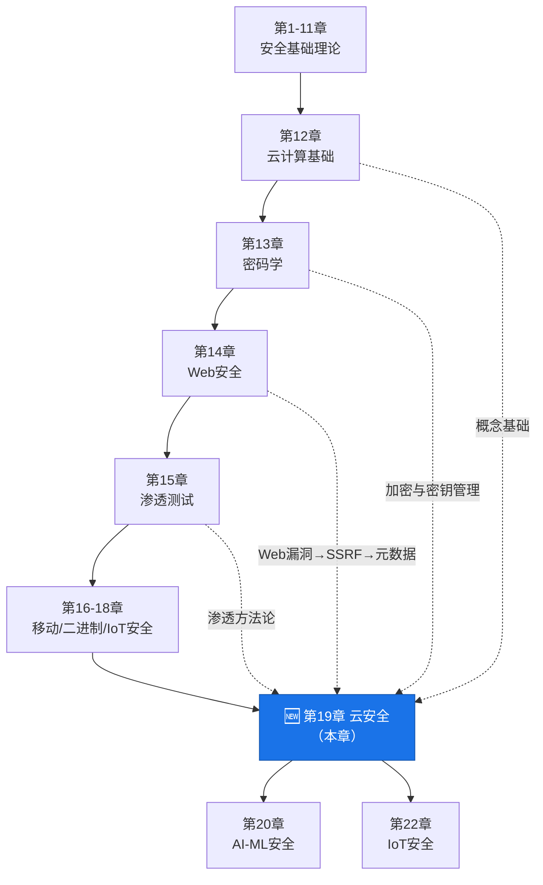
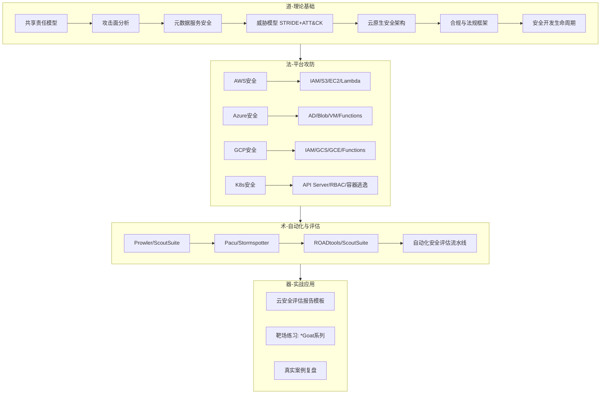
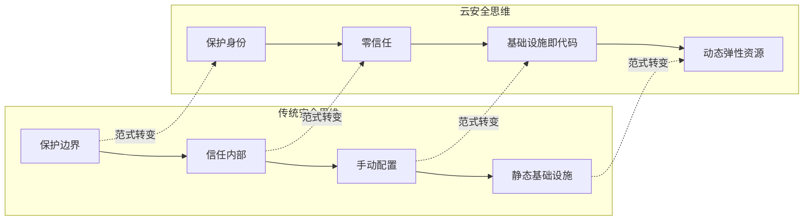

# 第19章 云安全 — 章节概览

## 19.0.1 为什么云安全是当下最重要的安全领域

2019年Capital One数据泄露事件影响了1.06亿客户，攻击者利用了一个配置错误的WAF角色，通过SSRF攻击获取了AWS元数据服务中的临时凭据，最终窃取了存储在S3桶中的大量个人财务数据。这起事件的直接损失超过1.5亿美元，而根本原因只有两个字：**配置**。

这不是孤例。以下是近年来最具代表性的云安全事件：

| 时间 | 事件 | 根因 | 影响范围 |
|------|------|------|----------|
| 2019年 | Capital One数据泄露 | WAF角色过度授权 + SSRF | 1.06亿客户，损失$1.5亿+ |
| 2021年 | Twitch源代码泄露 | AWS密钥硬编码在配置文件中 | 全部源代码和创作者收入数据 |
| 2022年 | Okta供应链攻击 | 第三方Laptop Support工程师账号被劫持 | 影响约366个客户 |
| 2022年 | Toyota源代码泄露 | GitHub仓库访问密钥暴露在公开代码库中 | 源代码泄露长达5年未被发现 |
| 2023年 | Microsoft SAS令牌泄露 | Azure Blob Storage SAS令牌通过AI研究人员泄露 | 3.8万条内部消息和密钥 |
| 2023年 | MOVEit供应链攻击 | 第三方文件传输组件漏洞 | 超过2600个组织受影响 |

这些事件的共同特征是什么？**没有一个是因为云提供商的基础设施被攻破**。每一个都源于客户侧的配置错误、密钥管理失误或权限设计缺陷。这恰恰印证了云安全的核心逻辑：**云提供商负责"云本身的安全"（Security of the Cloud），客户负责"在云中的安全"（Security in the Cloud）**。

### 行业现状与数据

云安全市场的爆炸性增长反映了这一领域的战略重要性：

- **市场规模**：全球云安全市场规模从2020年的345亿美元增长至2025年的超过680亿美元，年复合增长率超过14%。到2028年预计将突破1200亿美元。
- **云渗透率**：全球超过94%的企业至少使用一种云服务，平均每个企业使用2.6个公有云平台和2.7个私有云环境（多云已成为常态而非例外）。
- **安全事件频率**：根据IBM《2024年数据泄露成本报告》，云环境相关数据泄露的平均成本为481万美元，高于全球平均水平的445万美元。从发现到控制泄露的平均时间为258天。
- **人才缺口**：Cloud Security Alliance（CSA）的调查显示，云安全岗位的供需比约为1:3，即每3个职位只有1个合格候选人。AWS Security Specialty、AZ-500、CKS等认证持有者的平均年薪比无认证同行高30-50%。
- **合规压力**：GDPR对云中数据泄露的最高罚款为全球营收的4%，HIPAA对云违规行为的罚款上限为每项违规150万美元，PCI-DSS 4.0明确要求对云环境进行持续安全监控。

这些数据清晰地表明：云安全不是一个"可选技能"，而是现代安全从业者的**必备能力**。

## 19.0.2 本章在全书中的定位



本章是《网络安全攻防指南》中**"新兴技术安全"**部分的开篇章节，处于全书知识体系的关键转折点：

- **向下承接**：第12章云计算基础提供了IaaS/PaaS/SaaS概念框架，第13章密码学提供了加密和密钥管理基础，第14章Web安全中的SSRF/XSS等漏洞直接关联云元数据服务攻击，第15章渗透测试的方法论为云渗透提供方法论框架。
- **向上延展**：第20章AI-ML安全中，绝大多数AI工作负载（模型训练、推理服务）都运行在云平台上，云安全是AI安全的前提条件；第22章IoT安全中，物联网设备的后端几乎无一例外地依赖云平台进行数据处理和设备管理。
- **横向关联**：社会工程学（第23章）中的钓鱼攻击在云环境中有特殊变体——针对云控制台登录页的钓鱼、针对OAuth授权流程的钓鱼等。

简而言之，**云安全是连接传统安全与新兴技术安全的桥梁**。掌握了云安全，后续章节中的AI安全、IoT安全才有坚实的基础。

## 19.0.3 知识架构全景图

本章的知识体系按照**"道→法→术→器"**的层次组织：



### 各节内容与学习目标对照表

| 节号 | 主题 | 核心知识点 | 技能目标 | 难度 |
|------|------|-----------|----------|------|
| 19.1 | 共享责任模型 | IaaS/PaaS/SaaS责任边界、灰色地带、密钥管理责任划分 | 能清晰界定任何云服务中的安全责任归属 | ⭐⭐ |
| 19.2 | 云环境攻击面分析 | IAM攻击面、存储攻击面、计算攻击面、网络攻击面、供应链攻击面 | 能系统枚举一个云环境的所有潜在攻击入口 | ⭐⭐⭐ |
| 19.3 | 云元数据服务安全 | IMDSv1/v2、SSRF→凭据获取链、三大平台元数据API差异 | 能利用或防御元数据服务相关的攻击向量 | ⭐⭐⭐ |
| 19.4 | 云安全威胁模型 | STRIDE在云中的映射、MITRE ATT&CK Cloud Matrix | 能使用标准化框架进行云威胁建模 | ⭐⭐⭐⭐ |
| 19.5 | 云原生安全架构 | 零信任架构、纵深防御、自动化安全、治理框架 | 能设计或评审一个云安全架构方案 | ⭐⭐⭐⭐ |
| 19.6 | 云安全合规与法规 | GDPR/HIPAA/PCI-DSS在云中的具体要求、审计要点 | 能将合规要求映射到具体的云安全配置 | ⭐⭐⭐ |
| 19.7 | 云安全开发生命周期 | DevSecOps、IaC安全扫描、容器镜像安全、CI/CD安全 | 能在开发流程中嵌入安全检查点 | ⭐⭐⭐ |
| 19.8 | AWS安全核心技巧 | IAM策略分析、S3桶枚举、EC2实例元数据利用、Pacu实战 | 能对AWS环境进行完整安全评估 | ⭐⭐⭐⭐ |
| 19.9 | Azure安全核心技巧 | Azure AD攻击链、Blob SAS令牌分析、ROADtools使用 | 能对Azure环境进行完整安全评估 | ⭐⭐⭐⭐ |
| 19.10 | GCP安全核心技巧 | GCP IAM分析、GCS桶安全、服务账号密钥管理 | 能对GCP环境进行完整安全评估 | ⭐⭐⭐⭐ |
| 19.11 | Kubernetes安全核心技巧 | API Server安全、RBAC配置审计、容器逃逸技术 | 能对K8s集群进行安全评估并利用常见漏洞 | ⭐⭐⭐⭐⭐ |
| 19.12 | 自动化安全评估 | Prowler/ScoutSuite/GCP自定义评估脚本 | 能构建自动化云安全评估流水线 | ⭐⭐⭐⭐ |
| 19.13 | 实战案例集 | S3数据泄露、SSRF→凭据、Azure AD提权、K8s集群接管、供应链攻击 | 能独立完成从侦察到利用到报告的全流程 | ⭐⭐⭐⭐⭐ |

### 三大云平台安全机制对比速览

在深入各平台之前，先建立一个高阶对比框架：

| 维度 | AWS | Azure | GCP |
|------|-----|-------|-----|
| **身份服务** | IAM (Users/Roles/Groups) | Azure AD (Entra ID) + RBAC | Cloud IAM + Service Accounts |
| **存储安全** | S3 Bucket Policies + ACLs | Blob SAS Tokens + RBAC | GCS Bucket IAM + ACLs |
| **元数据服务** | IMDS (v1/v2) | Instance Metadata Service | Metadata Server |
| **密钥管理** | KMS + Secrets Manager | Key Vault | Cloud KMS + Secret Manager |
| **审计日志** | CloudTrail | Azure Activity Log + Diagnostic Logs | Cloud Audit Logs |
| **网络隔离** | VPC + Security Groups + NACLs | VNet + NSGs + Azure Firewall | VPC + Firewall Rules |
| **Serverless安全** | Lambda Execution Roles | Function App Managed Identity | Cloud Functions Service Account |
| **容器安全** | EKS + ECS | AKS | GKE + Workload Identity |
| **默认安全立场** | S3默认私有（2023年后） | 存储账户默认公共访问 | GCS默认私有 |
| **合规认证** | 143项安全标准 | 100+项合规认证 | 80+项合规认证 |

**关键差异总结**：

1. **IAM模型**：AWS使用JSON策略语言（显式Allow/Deny），Azure基于Entra ID的角色定义（更接近传统AD模型），GCP使用资源层级的IAM绑定（组织→文件夹→项目→资源）。
2. **默认安全**：AWS在2023年后将S3新桶的默认公共访问设为禁用（"Block Public Access"默认开启），但存量桶仍可能配置不当。Azure存储账户的公共访问默认开启（需手动禁用）。GCS的默认行为最为安全，桶默认私有。
3. **元数据安全**：AWS的IMDSv2通过PUT请求+TTL有效防御SSRF，但许多实例仍在使用IMDSv1。Azure和GCP的元数据服务需要特定请求头（`Metadata: true` / `Metadata-Flavor: Google`），但这些头部同样可以通过SSRF注入。
4. **审计能力**：AWS CloudTrail是默认不开通的（需手动开启），Azure Activity Log默认保留90天，GCP Cloud Audit Logs对Admin Activity默认开启。这是一个关键的安全差异——新接触AWS的团队经常忘记开启CloudTrail。

## 19.0.4 三种读者的学习路径

### 路径A：零基础入门者（需要2-3个月）

如果你没有任何云安全经验，按照以下路径循序渐进：

```text
第1周：建立基础认知
├── 阅读 19.1 共享责任模型 → 理解"谁负责什么"
├── 阅读 19.2 云环境攻击面分析 → 建立攻击面思维
└── 动手：注册AWS免费账户，熟悉控制台基本操作

第2-3周：理解威胁与防御
├── 阅读 19.3 元数据服务安全 → 理解SSRF→凭据获取链
├── 阅读 19.4 威胁模型 → 学会用STRIDE和ATT&CK分析云威胁
├── 阅读 19.5 安全架构 → 建立纵深防御思维
└── 动手：部署一个简单的Web应用到AWS，尝试从攻击者视角发现问题

第4-6周：深入AWS安全（从一个平台开始）
├── 阅读 19.8 AWS安全核心技巧
├── 动手：使用AWSGoat靶场练习
├── 学习使用Prowler进行安全评估
└── 目标：能够独立完成AWS环境的基础安全评估

第7-8周：Kubernetes入门安全
├── 阅读 19.11 Kubernetes安全核心技巧
├── 动手：部署Kubernetes Goat，练习基础攻防
└── 目标：理解K8s安全模型，识别常见配置问题

第9-12周：综合实战
├── 完成实战案例（19.13节中的案例一和案例二）
├── 尝试自动化安全评估
└── 目标：能够独立编写云安全评估报告
```

### 路径B：有传统安全基础的渗透测试人员（需要1-2个月）

如果你已经有渗透测试经验，你的重点是学习云特有的攻击面和工具：

```cpp
第1-2周：快速建立云安全思维框架
├── 精读 19.1-19.3 → 理解云环境与传统环境的本质差异
├── 重点理解共享责任模型如何改变渗透测试的范围和方法
└── 理解元数据服务——这是云渗透的核心攻击向量

第3-4周：掌握至少一个云平台的攻防技术
├── 选择你工作中最可能遇到的平台（推荐AWS）
├── 精读对应的章节，重点是IAM策略分析和常见错误配置
├── 动手练习：Pacu（AWS攻防框架）/ Stormspotter（Azure）
└── 目标：能够在授权渗透测试中有效利用云特有漏洞

第5-6周：Kubernetes安全
├── 精读 19.11 → 容器逃逸、RBAC绕过、API Server未授权访问
├── 动手练习：Kubernetes Goat + kube-hunter
└── 目标：能够评估K8s集群安全并编写专业报告

第7-8周：多平台扩展与自动化
├── 快速浏览其他两个云平台的核心差异
├── 学习自动化评估工具链（Prowler + ScoutSuite + 自定义脚本）
└── 目标：能够构建多云环境的安全评估自动化流水线
```

### 路径C：云架构师/DevOps工程师（需要3-4周）

如果你已经在使用云平台，你的重点是从防御者视角强化安全：

```cpp
第1周：安全思维升级
├── 精读 19.2 攻击面分析 → 用攻击者思维审视你的架构
├── 精读 19.4 威胁模型 → 为你的系统建立正式的威胁模型
└── 精读 19.7 安全开发生命周期 → 在现有CI/CD中嵌入安全检查

第2周：IAM深度优化
├── 使用Prowler/ScoutSuite评估现有环境
├── 识别过度授权的IAM策略并制定收敛计划
├── 实施密钥轮换策略和短期凭据方案
└── 目标：完成一次全面的IAM权限审计

第3周：容器与Kubernetes安全加固
├── 精读 19.11 → 聚焦于加固而非攻击
├── 实施Pod Security Standards
├── 配置Network Policies和RBAC最小权限
└── 目标：完成K8s集群的安全加固并持续监控

第4周：合规与持续监控
├── 精读 19.6 合规框架 → 将合规要求转化为自动化检查
├── 建立云安全态势管理（CSPM）的监控流水线
├── 配置告警规则（异常登录、权限变更、资源创建）
└── 目标：建立持续运行的云安全监控体系
```

## 19.0.5 核心概念速查表

在正式开始学习之前，先熟悉以下核心概念。这些术语将在本章中反复出现：

### 基础概念

| 术语 | 定义 | 为什么重要 |
|------|------|-----------|
| **共享责任模型** | 云提供商和客户之间的安全责任划分框架 | 不理解这个模型，就不知道该保护什么、该检查什么 |
| **IAM（身份与访问管理）** | 云平台中控制"谁能对什么资源做什么操作"的系统 | 云安全事件的80%以上与IAM配置不当有关 |
| **最小权限原则** | 只授予完成任务所需的最小权限 | 过度授权是云安全事故的首要根因 |
| **IMDS（实例元数据服务）** | 云实例获取自身信息（包括临时凭据）的本地HTTP服务 | SSRF→IMDS→凭据获取是云渗透的经典攻击链 |
| **CSPM（云安全态势管理）** | 持续监控和评估云资源配置安全性的工具类别 | 自动化发现错误配置，是企业云安全的基础工具 |
| **CWPP（云工作负载保护平台）** | 保护云中运行的工作负载（VM、容器、Serverless）的工具 | 传统端点安全无法覆盖云工作负载的特殊需求 |
| **CASB（云访问安全代理）** | 位于用户和云服务之间的安全策略执行点 | 控制影子IT和SaaS应用的安全使用 |

### 攻击向量术语

| 术语 | 定义 | 典型利用场景 |
|------|------|-------------|
| **SSRF** | 服务端请求伪造，让服务器向内部服务发起请求 | 通过Web应用SSRF访问169.254.169.254获取IAM凭据 |
| **容器逃逸** | 从容器内部突破到宿主机系统 | 特权容器、挂载宿主机文件系统、内核漏洞利用 |
| **横向移动** | 在云环境中从一个资源扩展到其他资源 | 从一个过度授权的Lambda函数横向访问其他AWS服务 |
| **权限提升** | 从低权限身份获取更高权限 | 利用IAM信任关系、AssumeRole链式提权 |
| **供应链攻击** | 通过第三方组件（镜像、模块、依赖）注入恶意代码 | 恶意Terraform模块、被污染的Docker镜像 |
| **加密货币劫持** | 利用被入侵的云资源进行加密货币挖矿 | 通过过度权限创建大量GPU实例进行挖矿 |
| **资源删除/勒索** | 删除或加密云中的数据和资源 | 删除S3桶、加密RDS数据库、销毁EBS快照 |

### 工具速查

| 工具 | 平台 | 用途 | 学习优先级 |
|------|------|------|-----------|
| **Prowler** | AWS/Azure/GCP | CIS基准自动化安全评估 | ⭐⭐⭐⭐⭐ |
| **ScoutSuite** | AWS/Azure/GCP | 多云安全态势评估 | ⭐⭐⭐⭐ |
| **Pacu** | AWS | AWS攻防框架（攻击模拟） | ⭐⭐⭐⭐⭐ |
| **CloudMapper** | AWS | AWS环境可视化和安全分析 | ⭐⭐⭐ |
| **S3Scanner** | AWS | S3桶公开访问扫描 | ⭐⭐⭐ |
| **Stormspotter** | Azure | Azure AD攻击路径可视化 | ⭐⭐⭐⭐ |
| **ROADtools** | Azure | Azure AD数据枚举和分析 | ⭐⭐⭐⭐ |
| **kube-hunter** | Kubernetes | K8s集群渗透测试 | ⭐⭐⭐⭐ |
| **kubeaudit** | Kubernetes | K8s安全配置审计 | ⭐⭐⭐ |
| **Falco** | Kubernetes | 运行时安全监控 | ⭐⭐⭐⭐ |
| **Trivy** | 多平台 | 容器镜像和IaC安全扫描 | ⭐⭐⭐⭐⭐ |

## 19.0.6 云安全与传统网络安全的关键差异

如果你从传统安全领域转到云安全，以下差异是你必须理解的：



### 七大关键差异详解

**1. 从"保护网络边界"到"保护身份"**

传统安全的核心是防火墙、IDS/IPS、DMZ——一切围绕网络边界展开。云环境中，**身份就是新的边界**。当你的一台EC2实例通过IAM角色可以访问S3桶中的敏感数据时，网络边界已经无关紧要——真正的访问控制发生在IAM策略层。

**2. 从"信任内部"到"零信任"**

传统企业网络中，一旦通过VPN进入内网，通常被视为"可信"。云环境中不存在"内网"的概念（或者更准确地说，"内网"的定义需要被重新审视）。每一项资源之间的访问都应经过身份验证和授权。

**3. 从"手动配置"到"基础设施即代码"**

传统环境中，服务器配置由运维人员手动完成（或通过脚本）。云环境中，基础设施通过Terraform、CloudFormation、Pulumi等工具以代码形式定义。这意味着安全配置也需要代码化——IaC模板中的一个错误可能在几分钟内创建数千个不安全的资源。

**4. 从"静态资产"到"动态弹性资源"**

传统环境中，服务器数量相对固定，安全团队有充足时间进行资产管理和安全评估。云环境中，Auto Scaling可以在几分钟内将实例从1台扩展到100台，Serverless函数可能每秒执行数千次。安全评估必须是**持续的、自动化的**。

**5. 从"物理控制"到"责任共担"**

传统环境中，企业完全掌控从物理机房到应用程序的每一层。云环境中，物理基础设施的安全由提供商负责——你无法走进AWS的数据中心检查服务器（事实上，连AWS的大部分员工都不能）。

**6. 从"渗透测试自由"到"受控的安全测试"**

传统环境中，你可以在自己的网络上自由进行渗透测试。云环境中，各平台对安全测试有明确的政策限制。例如AWS的渗透测试政策允许你测试自己的资源，但禁止对AWS基础设施本身进行测试，也禁止某些类型的测试（如DoS测试）。不了解这些边界，你的"合法测试"可能违反服务条款。

**7. 从"事后取证"到"实时可观测性"**

传统安全事件的取证通常在事后进行——分析日志、内存转储、磁盘镜像。云环境中，许多资源是临时性的（Spot实例、Lambda函数执行完成后即销毁），取证窗口极为短暂。云安全更依赖**实时的可观测性**——CloudTrail、VPC Flow Logs、CloudWatch Logs等必须在事件发生前就配置好。

## 19.0.7 学习建议与实操环境准备

### 推荐实操环境

学习云安全不能只靠阅读，必须动手。以下是推荐的靶场和实验环境：

| 环境 | 平台 | 难度 | 说明 |
|------|------|------|------|
| **AWSGoat** | AWS | ⭐⭐-⭐⭐⭐⭐ | OWASP维护，模拟真实AWS环境的安全漏洞 |
| **AzureGoat** | Azure | ⭐⭐-⭐⭐⭐⭐ | 模拟Azure环境的安全漏洞，含ARM模板部署 |
| **GCPGoat** | GCP | ⭐⭐-⭐⭐⭐⭐ | 模拟GCP环境的安全漏洞 |
| **Kubernetes Goat** | Kubernetes | ⭐⭐⭐-⭐⭐⭐⭐⭐ | 涵盖容器逃逸、RBAC绕过等10+场景 |
| **flAWS.cloud** | AWS | ⭐⭐-⭐⭐⭐ | 专注AWS S3和IAM安全的CTF挑战 |
| **flAWS2.cloud** | AWS | ⭐⭐⭐-⭐⭐⭐⭐ | flAWS的进阶版，包含VPC和Lambda场景 |
| **Thunder CTF** | GCP | ⭐⭐-⭐⭐⭐⭐ | Google官方的GCP安全CTF |
| **Sadcloud** | AWS | ⭐⭐ | Terraform定义的不安全AWS基础设施，用于学习识别错误配置 |
| **CloudFox** | 多平台 | ⭐⭐⭐ | 在已有访问权限的情况下枚举可攻击的资源 |

### 免费账户注意事项

三大云平台都提供免费账户，但有重要限制：

- **AWS Free Tier**：12个月免费，部分服务有永久免费额度。注意：某些安全测试工具（如大量枚举API调用）可能产生少量费用。建议设置账单告警（Billing Alert）并在实验结束后清理所有资源。
- **Azure Free Account**：$200信用额度（30天），部分服务12个月免费。Azure AD免费版功能有限，某些攻击技术需要Azure AD P2许可证。
- **GCP Free Tier**：$300信用额度（90天），部分服务永久免费。GCP的组织层级结构（Organization → Folder → Project）在免费账户中可能受限。

**重要提醒**：在免费账户上练习时，永远不要使用生产环境的凭据。为实验创建独立的IAM用户/角色，并在实验结束后立即删除。

### 日常学习习惯

1. **关注CVE和安全公告**：订阅AWS Security Bulletins、Azure Security Updates、GCP Security Bulletins的邮件通知。
2. **阅读公开的安全事件报告**：Mandiant、CrowdStrike、Wiz等安全公司发布的云安全事件报告是最佳学习材料。
3. **跟踪关键安全研究者**：关注Chris Farris、Scott Piper (@0xdabbado)、Nick Frichette等云安全研究者的博客和Twitter。
4. **参与社区**：Cloud Security Alliance（CSA）、OWASP Cloud-Native Security Project等社区提供最新的研究和最佳实践。

## 19.0.8 免责声明

> 本章所有技术仅用于合法的安全研究和教育目的。在进行任何安全测试之前，请确保：
>
> 1. 拥有目标环境的**书面授权**
> 2. 了解并遵守对应云平台的**安全测试政策**（如AWS渗透测试政策、Azure安全测试政策）
> 3. 不对**共享基础设施**和**其他租户**造成影响
> 4. 不进行**拒绝服务攻击**相关的测试
> 5. 遵守所在国家和地区的**相关法律法规**
>
> 未经授权访问他人云资源是违法行为，可能导致刑事和民事责任。
