# 第19章 云安全 — 常见误区

云安全领域充斥着大量似是而非的认知。这些误区并非来自无知，而是源于对云安全模型的片面理解、对传统安全思维的路径依赖，以及云厂商营销话术的误导。一个错误的安全假设，足以让整套防护体系形同虚设。

本章梳理云安全中最常见的13个误区，每个误区都从"错误认知→底层原理→真实案例→正确做法→代码实操"五个维度展开，帮助你建立正确的云安全心智模型。

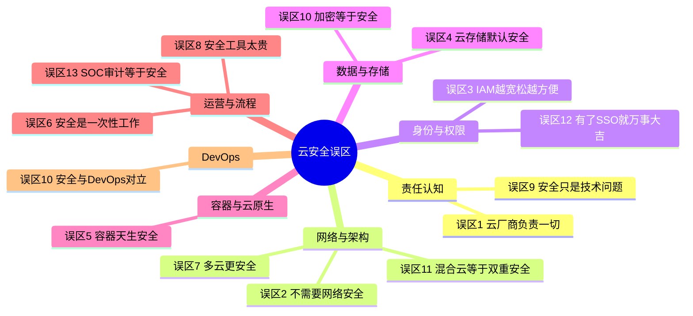

## 误区一：云提供商负责所有安全问题

### 错误认知

"我们用的是AWS/Azure/GCP，出了安全问题找云厂商就行了。"

这是云安全中最普遍也最危险的误解。它源自一个隐含假设：**把系统搬到云上，安全责任也一并转移了**。事实上恰好相反——云迁移意味着你在获得更多灵活性的同时，也承担了更多的安全责任。

### 底层原理：共享责任模型

共享责任模型（Shared Responsibility Model）是理解云安全的第一块基石。云提供商和客户的安全责任边界因服务模型而异：

| 服务模型 | 云提供商负责 | 客户负责 | 典型服务 |
|----------|-------------|---------|---------|
| **IaaS** | 物理安全、网络基础设施、虚拟化层 | 操作系统、中间件、应用、数据、网络配置、IAM | EC2、VM、GCE |
| **PaaS** | IaaS全部 + 操作系统、运行时环境 | 应用代码、数据、IAM、部分网络配置 | Lambda、App Engine、Azure Functions |
| **SaaS** | PaaS全部 + 应用层安全 | 数据分类、IAM、合规、客户端安全 | S3、RDS、DynamoDB |

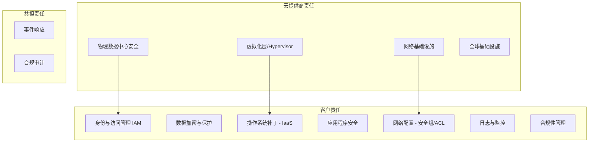

**关键洞察**：即便是SaaS服务，客户仍然对数据安全、访问控制和合规性负有不可推卸的责任。云厂商负责"云的安全"（Security **of** the Cloud），客户负责"云中的安全"（Security **in** the Cloud）。

### 真实案例

**案例一：Capital One数据泄露（2019年）**

2019年7月，Capital One遭黑客入侵，超过1亿用户数据泄露。攻击者利用的并非AWS基础设施漏洞，而是Capital One自身的WAF配置错误和IAM权限过大。攻击路径：

1. 攻击者发现Capital One的WAF存在SSRF漏洞
2. 通过SSRF获取EC2实例的IAM角色临时凭据
3. 该IAM角色被授予了过大的S3访问权限
4. 攻击者列出并下载了700多个S3桶中的数据

**损失**：8000万美元罚款，CISO被起诉，超过1亿美元的补救成本。

**案例二：Microsoft SAS Token泄露（2023年）**

微软AI研究团队在GitHub上发布开源训练数据时，意外暴露了38TB的私有数据。原因是Azure Storage Account的SAS Token权限配置错误（设为"Account"级别而非"Container"级别），且Token未设过期时间。

**根因**：不是Azure平台有漏洞，而是客户侧的权限配置失误。

**案例三：S3桶公开访问事件**

UpGuard在2017年发现美国国防部的承包商将包含美军情报分析数据的S3桶配置为公开可访问。该桶包含全球各地敏感设施的监控数据和分析报告。

### 正确做法

1. **绘制责任矩阵**：在云迁移前，按服务和数据分类，明确每一层的安全责任归属

```markdown
# 云安全责任矩阵示例

| 组件 | 安全责任方 | 具体措施 | 审计频率 |
|------|-----------|---------|---------|
| EC2实例操作系统 | 客户 | 自动化补丁管理(SSM Patch Manager) | 每周 |
| S3存储桶策略 | 客户 | Block Public Access + 桶策略审计 | 每日 |
| RDS数据库 | 共担 | 客户负责IAM/加密,厂商负责引擎补丁 | 每月 |
| VPC网络 | 客户 | Flow Logs + 安全组审计 | 持续 |
| 物理数据中心 | 云厂商 | SOC2/ISO27001审计 | 年度 |
```

2. **自动化合规扫描**：使用Prowler、ScoutSuite等工具定期扫描

```bash
# Prowler扫描AWS安全配置
pip install prowler

# 扫描所有安全检查项
prowler aws --checks-level cis_level2

# 只扫描S3相关检查
prowler aws --checks s3_bucket_public_access

# 输出HTML报告
prowler aws -M html -o /tmp/reports/

# ScoutSuite扫描多云环境
scout aws --report-dir /tmp/scout-report
scout azure --report-dir /tmp/scout-report
```

3. **建立云安全团队**：指定Cloud Security Architect，负责安全架构评审
4. **定期培训**：每季度对云运维团队进行共享责任模型培训，通过实际案例测试理解程度

---

## 误区二：云环境不需要网络安全

### 错误认知

"网络安全是传统IDC的事，云上网络由云厂商管理，我们不用操心。"

### 底层原理

云环境的网络安全本质上是一个**虚拟化网络**的安全问题。虽然云厂商管理了底层物理网络，但虚拟网络（VPC/VNet）的配置完全由客户负责。更关键的是，云环境引入了传统IDC不存在的网络攻击面：

- **元数据服务**：`http://169.254.169.254` 可被SSRF利用获取临时凭据
- **跨账户流量**：共享VPC、VPC Peering中的信任关系
- **Serverless冷启动**：Lambda等函数可能获取到被复用的执行环境
- **服务端点**：未使用VPC Endpoint的服务流量经过公网

### 真实案例

**案例一：MongoDB Atlas公开数据库（2023年）**

安全研究人员发现大量MongoDB Atlas集群配置为允许从任意IP（0.0.0.0/0）访问。这不是MongoDB的安全漏洞，而是客户在创建集群时未正确配置网络访问控制。超过100个集群的数据因此暴露。

**案例二：Elasticsearch集群暴露**

大量部署在AWS/GCP上的Elasticsearch集群因安全组配置允许公网访问（端口9200开放），导致索引数据被搜索引擎Shodan发现。2019年，一个包含27亿条邮箱记录的Elasticsearch数据库因安全组配置错误而被公开。

**案例三：数据库端口暴露导致勒索**

2017年起，大量MongoDB、Elasticsearch、Redis实例因公网暴露遭黑客勒索。攻击者扫描开放端口后删除数据并留下勒索信息。根本原因是云安全组或防火墙规则配置过于宽松。

### 正确做法

**网络分段设计（Defense in Depth）**

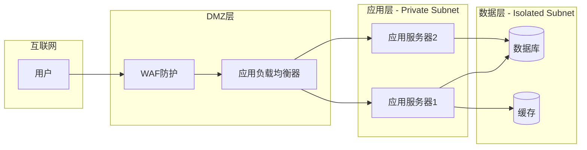

**Terraform安全组配置示例：**

```hcl
# 安全组：只允许来自ALB的HTTP流量到达应用层
resource "aws_security_group" "app_sg" {
  name        = "app-server-sg"
  description = "Application server security group"
  vpc_id      = aws_security_group.main_vpc.id

  ingress {
    description     = "HTTP from ALB only"
    from_port       = 8080
    to_port         = 8080
    protocol        = "tcp"
    security_groups = [aws_security_group.alb_sg.id]  # 仅允许ALB访问
  }

  egress {
    description = "Allow HTTPS to VPC endpoints"
    from_port   = 443
    to_port     = 443
    protocol    = "tcp"
    cidr_blocks = [var.vpc_endpoint_cidr]
  }

  tags = { Name = "app-server-sg" }
}

# 数据库安全组：只允许应用层访问
resource "aws_security_group" "db_sg" {
  name        = "database-sg"
  description = "Database security group"
  vpc_id      = aws_security_group.main_vpc.id

  ingress {
    description     = "MySQL from app servers only"
    from_port       = 3306
    to_port         = 3306
    protocol        = "tcp"
    security_groups = [aws_security_group.app_sg.id]  # 仅允许应用层
  }

  # 无出口规则 — 数据库不应主动连接外部
}

# VPC Endpoint：避免S3流量经过公网
resource "aws_vpc_endpoint" "s3" {
  vpc_id       = aws_vpc.main.id
  service_name = "com.amazonaws.${var.region}.s3"
  vpc_endpoint_type = "Gateway"
  route_table_ids   = [aws_route_table.private.id]
}
```

**VPC Flow Logs分析：**

```bash
# 启用VPC Flow Logs
aws ec2 create-flow-logs \
  --resource-type VPC \
  --resource-ids vpc-0123456789abcdef0 \
  --traffic-type ALL \
  --log-destination-type cloud-watch-logs \
  --log-group-name /aws/vpc/flowlogs \
  --deliver-logs-permission-arn arn:aws:iam::role/vpc-flowlogs-role

# 查询异常流量（拒绝的入站连接）
aws logs filter-log-events \
  --log-group-name /aws/vpc/flowlogs \
  --filter-pattern '[version, account_id, interface_id, srcaddr, dstaddr, srcport, dstport, protocol, packets, bytes, start, end, action="REJECT", log_status]'
```

---

## 误区三：IAM策略配置越宽松越方便

### 错误认知

"给开发者 `AdministratorAccess` 权限，省得他们天天找我开权限。"

这是"便利性vs安全性"的经典博弈，而在云安全领域，过度授权是**后果最严重**的配置错误之一。

### 底层原理：权限爆炸半径

IAM过度授权的核心问题是**爆炸半径（Blast Radius）扩大**。当一个凭据被泄露时，攻击者能造成的损害取决于该凭据拥有的权限范围：

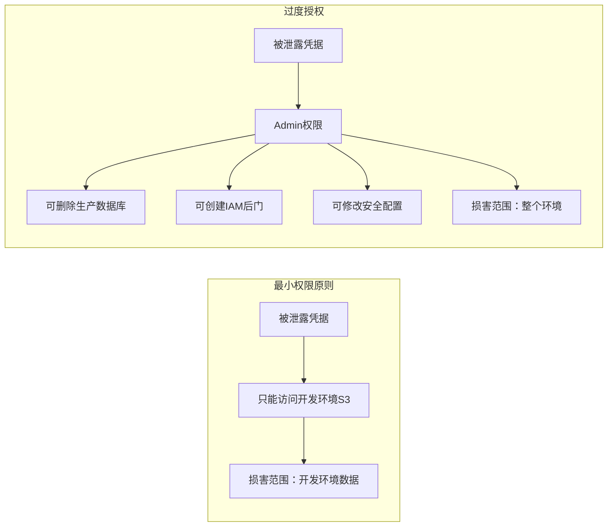

**AWS IAM权限评估流程**：当一个请求到达时，AWS按以下顺序评估：
1. **显式Deny**（最高优先级，不可覆盖）
2. **SCP/Deny Policy**
3. **显式Allow**（需要至少一个策略允许）
4. **默认Deny**（隐式拒绝）

### 真实案例

**案例一：Uber数据泄露（2016年）**

2016年Uber遭遇数据泄露，5700万用户数据被盗。攻击者从一个私有GitHub仓库中发现了AWS IAM凭据，该凭据拥有对S3的广泛访问权限。攻击者用这个凭据下载了包含用户个人信息和司机驾照数据的S3对象。

**根因**：IAM凭据硬编码在代码仓库中，且权限过大。

**案例二：Shopify内部威胁（2020年）**

两名Shopify员工利用过度授予的客户数据访问权限，访问了约200名商家的订单数据。虽然Shopify的IAM策略在技术上"正确"，但权限粒度不够细，员工可以访问远超其工作范围的数据。

**案例三：Capital One IAM角色过度授权**

回到Capital One泄露案——攻击者使用的EC2 IAM角色拥有对S3的 `ListBucket` 和 `GetObject` 权限，且作用域覆盖了所有S3桶。如果该角色只被授权访问特定桶，即使被泄露，损害范围也会大幅缩小。

### 正确做法

**1. 基于身份的策略设计**

```json
// 推荐：细粒度IAM策略 — 只允许对特定S3桶的读写
{
  "Version": "2012-10-17",
  "Statement": [
    {
      "Sid": "AllowSpecificBucketAccess",
      "Effect": "Allow",
      "Action": [
        "s3:GetObject",
        "s3:PutObject",
        "s3:ListBucket"
      ],
      "Resource": [
        "arn:aws:s3:::my-app-data-bucket",
        "arn:aws:s3:::my-app-data-bucket/*"
      ],
      "Condition": {
        "StringEquals": {
          "aws:RequestedRegion": "us-east-1"
        },
        "IpAddress": {
          "aws:SourceIp": ["203.0.113.0/24", "198.51.100.0/24"]
        }
      }
    }
  ]
}
```

**2. 权限边界（Permission Boundary）**

权限边界定义了一个IAM实体**可以拥有的最大权限**，即使其附加的策略允许更多操作：

```json
// 权限边界：限制开发者的最大权限范围
{
  "Version": "2012-10-17",
  "Statement": [
    {
      "Sid": "AllowDevServices",
      "Effect": "Allow",
      "Action": [
        "s3:*",
        "ec2:*",
        "lambda:*",
        "logs:*"
      ],
      "Resource": "*",
      "Condition": {
        "StringEquals": {
          "aws:RequestedRegion": ["us-east-1", "us-west-2"]
        }
      }
    },
    {
      "Sid": "DenyProductionAccess",
      "Effect": "Deny",
      "Action": "*",
      "Resource": "*",
      "Condition": {
        "StringLike": {
          "aws:ResourceTag/Environment": "production"
        }
      }
    },
    {
      "Sid": "DenyIAMChanges",
      "Effect": "Deny",
      "Action": [
        "iam:CreateUser",
        "iam:CreateRole",
        "iam:AttachUserPolicy",
        "iam:PutRolePolicy"
      ],
      "Resource": "*"
    }
  ]
}
```

**3. 定期权限审查**

```bash
# 使用AWS IAM Access Analyzer找出未使用的权限
aws iam generate-service-last-accessed-details \
  --arn arn:aws:iam::123456789012:role/DeveloperRole

# 获取报告
aws iam get-service-last-accessed-details \
  --job-id <job-id>

# 使用cloudsplaining分析IAM策略风险
pip install cloudsplaining
aws iam get-account-authorization-details > iam_data.json
cloudsplaining scan --input-file iam_data.json --exclusions-file exclusions.yml

# 输出示例：
# Policy: DeveloperPolicy
#   - CRITICAL: Allows 'iam:*' (full IAM access)
#   - HIGH: Allows 'ec2:*' without resource constraint
#   - MEDIUM: No MFA condition
```

**4. Just-in-Time（JIT）访问**

```hcl
# 使用AWS SSO + Permission Sets实现JIT访问
# 开发者默认只有只读权限，需要时临时提升

# Terraform配置
resource "aws_ssoadmin_permission_set" "readonly" {
  name             = "ReadOnly"
  instance_arn     = aws_ssoadmin_instance.main.arn
  session_duration = "PT8H"  # 8小时会话
}

resource "aws_ssoadmin_permission_set" "admin_jit" {
  name             = "AdminJIT"
  instance_arn     = aws_ssoadmin_instance.main.arn
  session_duration = "PT1H"  # JIT：仅1小时
}
```

---

## 误区四：云存储默认就是安全的

### 错误认知

"云存储是云厂商提供的服务，默认配置应该是安全的。"

### 底层原理

云存储服务的安全性**完全取决于客户的配置**。虽然主流云厂商在近年逐步收紧了默认设置（如AWS在2023年默认启用S3 Block Public Access），但以下关键安全特性仍需显式配置：

| 安全特性 | 默认状态 | 需要手动配置 | 不配置的风险 |
|---------|---------|-------------|------------|
| 服务器端加密（SSE） | 部分默认（SSE-S3） | SSE-KMS需手动启用 | 无法控制加密密钥生命周期 |
| 访问日志 | 关闭 | 需手动启用 | 无法追踪谁访问了数据 |
| 版本控制 | 关闭 | 需手动启用 | 误删数据无法恢复 |
| 生命周期策略 | 无 | 需手动配置 | 数据永久保留，增加泄露面 |
| 公开访问阻止 | 2023年后默认开启 | 老桶需手动开启 | 数据意外公开 |
| 对象锁定 | 关闭 | 需手动启用 | 数据可被篡改或删除 |
| 跨区域复制 | 关闭 | 需手动配置 | 区域故障导致数据丢失 |

### 真实案例

**案例一：Facebook 5.4亿条记录泄露（2019年）**

UpGuard研究人员发现两个第三方应用开发者将包含5.4亿条Facebook用户数据的记录存储在公开可访问的Amazon S3桶中。数据包括用户姓名、Facebook ID、点赞记录、好友列表等。

**案例二：Verizon 600万用户数据泄露（2017年）**

Verizon的一家合作伙伴将600万用户数据存储在未受保护的AWS S3桶中。数据包括用户姓名、电话号码和PIN码。该S3桶配置为匿名公开访问。

**案例三：Accenture S3桶公开（2017年）**

埃森哲的多个S3桶配置为公开可访问，包含敏感的API数据、认证凭据、加密密钥和客户数据。安全研究人员发现时，这些桶已经暴露了数月。

### 正确做法

**1. 启用全面加密**

```bash
# 启用S3默认加密（SSE-KMS）
aws s3api put-bucket-encryption \
  --bucket my-secure-bucket \
  --server-side-encryption-configuration '{
    "Rules": [
      {
        "ApplyServerSideEncryptionByDefault": {
          "SSEAlgorithm": "aws:kms",
          "KMSMasterKeyID": "alias/s3-encryption-key"
        },
        "BucketKeyEnabled": true
      }
    ]
  }'

# 强制所有上传对象使用HTTPS
aws s3api put-bucket-policy \
  --bucket my-secure-bucket \
  --policy '{
    "Version": "2012-10-17",
    "Statement": [
      {
        "Sid": "DenyNonHTTPSAccess",
        "Effect": "Deny",
        "Principal": "*",
        "Action": "s3:*",
        "Resource": [
          "arn:aws:s3:::my-secure-bucket",
          "arn:aws:s3:::my-secure-bucket/*"
        ],
        "Condition": {
          "Bool": {
            "aws:SecureTransport": "false"
          }
        }
      }
    ]
  }'
```

**2. 启用访问日志和版本控制**

```bash
# 启用版本控制
aws s3api put-bucket-versioning \
  --bucket my-secure-bucket \
  --versioning-configuration Status=Enabled

# 启用访问日志
aws s3api put-bucket-logging \
  --bucket my-secure-bucket \
  --bucket-logging-status '{
    "LoggingEnabled": {
      "TargetBucket": "s3-access-logs-central",
      "TargetPrefix": "my-secure-bucket/"
    }
  }'

# 启用对象锁定（防篡改）
aws s3api put-object-lock-configuration \
  --bucket my-secure-bucket \
  --object-lock-configuration '{
    "ObjectLockEnabled": true,
    "Rule": {
      "DefaultRetention": {
        "Mode": "COMPLIANCE",
        "Days": 365
      }
    }
  }'
```

**3. Terraform标准化配置**

```hcl
module "secure_s3_bucket" {
  source  = "terraform-aws-modules/s3-bucket/aws"
  version = "~> 3.0"

  bucket = "my-secure-bucket"

  # 阻止公开访问
  block_public_acls       = true
  block_public_policy     = true
  ignore_public_acls      = true
  restrict_public_buckets = true

  # 版本控制
  versioning = { enabled = true }

  # 加密
  server_side_encryption_configuration = {
    rule = {
      apply_server_side_encryption_by_default = {
        sse_algorithm     = "aws:kms"
        kms_master_key_id = aws_kms_key.s3_key.arn
      }
      bucket_key_enabled = true
    }
  }

  # 访问日志
  logging = {
    target_bucket = aws_s3_bucket.logs.id
    target_prefix = "s3-access-logs/"
  }

  # 生命周期
  lifecycle_rule = [
    {
      id     = "archive-old-objects"
      status = "Enabled"
      transition = [
        { days = 90, storage_class = "GLACIER" },
        { days = 365, storage_class = "DEEP_ARCHIVE" }
      ]
      expiration = { days = 2555 }  # 7年后删除
    }
  ]
}
```

---

## 误区五：容器和Kubernetes是天生安全的

### 错误认知

"容器提供了进程隔离，Docker和Kubernetes都经过了大规模验证，应该是安全的。"

### 底层原理

容器的隔离性**远弱于虚拟机**。容器共享宿主机内核，依赖Linux命名空间（namespaces）和控制组（cgroups）实现隔离，而非硬件虚拟化。这意味着：

- **内核漏洞**可导致容器逃逸（如CVE-2022-0185、CVE-2022-0492）
- **特权容器**直接拥有宿主机的全部能力
- **容器镜像**可能包含已知漏洞、恶意代码或硬编码凭据
- **Kubernetes默认配置**在安全性上并不保守（如默认允许Service Account访问API Server）

Kubernetes攻击面的分层模型：

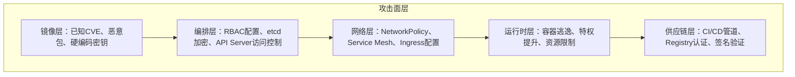

### 真实案例

**案例一：Tesla Kubernetes挖矿事件（2018年）**

攻击者入侵了Tesla的Kubernetes管理控制台，发现管理面板未设置密码保护。攻击者通过Kubernetes Dashboard获取了AWS S3存储桶的访问凭据（以Kubernetes Secret形式存储），并部署了加密货币挖矿程序。

**根因**：Kubernetes Dashboard暴露在公网、未启用认证、Secret中的AWS凭据未加密存储。

**案例二：Azure Cosmos DB ChaosDB（2021年）**

Wiz安全团队发现Azure Cosmos DB的Jupyter Notebook功能存在漏洞，允许任何Azure用户读取同一区域内其他客户的Cosmos DB主密钥。影响了3000多个Azure客户。虽然这不是容器漏洞，但它说明了云原生服务（包括容器化服务）的安全假设可能被打破。

**案例三：Kubernetes RBAC提权链（2022-2024年）**

多个真实攻击链展示了从Pod到集群管理员的路径：
1. 漏洞Pod获取Service Account Token
2. Service Account拥有过度的RBAC权限（如 `list secrets`）
3. 攻击者列举所有Namespace的Secrets
4. 获取到具有 `cluster-admin` 权限的Service Account Token
5. 控制整个集群

### 正确做法

**1. 镜像安全扫描**

```bash
# Trivy扫描镜像漏洞
trivy image --severity HIGH,CRITICAL myapp:latest

# 扫描结果示例：
# myapp:latest (debian 11.6)
# Total: 42 (HIGH: 28, CRITICAL: 14)
# ┌──────────────┬───────────────┬──────────┬──────────────────┐
# │   Library    │ Vulnerability │ Severity │  Fixed Version   │
# ├──────────────┼───────────────┼──────────┼──────────────────┤
# │ libssl1.1    │ CVE-2023-0286 │ CRITICAL │ 1.1.1n-0+deb11u4 │
# │ zlib1g       │ CVE-2022-37434 │ CRITICAL │ 1:1.2.11.dfsg-2+ │
# └──────────────┴───────────────┴──────────┴──────────────────┘

# 在CI/CD中集成镜像扫描
# .github/workflows/image-scan.yml
```

```yaml
# GitHub Actions镜像扫描
name: Container Image Scan
on:
  push:
    branches: [main]

jobs:
  scan:
    runs-on: ubuntu-latest
    steps:
      - uses: actions/checkout@v4
      - name: Build image
        run: docker build -t myapp:${{ github.sha }} .
      - name: Run Trivy scanner
        uses: aquasecurity/trivy-action@master
        with:
          image-ref: myapp:${{ github.sha }}
          severity: 'CRITICAL,HIGH'
          exit-code: '1'  # 发现高危漏洞则失败
```

**2. Pod安全标准配置**

```yaml
# Pod Security Standards - Restricted级别
apiVersion: v1
kind: Pod
metadata:
  name: secure-pod
  labels:
    pod-security.kubernetes.io/enforce: restricted
spec:
  securityContext:
    runAsNonRoot: true
    seccompProfile:
      type: RuntimeDefault
  containers:
    - name: app
      image: myapp:latest@sha256:abc123...  # 使用镜像摘要，不使用latest标签
      securityContext:
        allowPrivilegeEscalation: false
        readOnlyRootFilesystem: true
        runAsUser: 1000
        runAsGroup: 1000
        capabilities:
          drop:
            - ALL  # 移除所有Linux Capabilities
      resources:
        limits:
          cpu: "500m"
          memory: "256Mi"
        requests:
          cpu: "100m"
          memory: "128Mi"
      volumeMounts:
        - name: tmp
          mountPath: /tmp
  volumes:
    - name: tmp
      emptyDir:
        sizeLimit: "100Mi"
```

**3. NetworkPolicy限制Pod间通信**

```yaml
# 默认拒绝所有Pod间通信
apiVersion: networking.k8s.io/v1
kind: NetworkPolicy
metadata:
  name: default-deny-all
  namespace: production
spec:
  podSelector: {}
  policyTypes:
    - Ingress
    - Egress

---
# 只允许Web Pod访问数据库Pod的3306端口
apiVersion: networking.k8s.io/v1
kind: NetworkPolicy
metadata:
  name: allow-web-to-db
  namespace: production
spec:
  podSelector:
    matchLabels:
      app: mysql
  policyTypes:
    - Ingress
  ingress:
    - from:
        - podSelector:
            matchLabels:
              app: web
      ports:
        - protocol: TCP
          port: 3306
```

**4. 外部Secret管理**

```yaml
# 使用External Secrets Operator从AWS Secrets Manager获取密钥
apiVersion: external-secrets.io/v1beta1
kind: ExternalSecret
metadata:
  name: app-secrets
  namespace: production
spec:
  refreshInterval: 1h
  secretStoreRef:
    name: aws-secretsmanager
    kind: ClusterSecretStore
  target:
    name: app-secrets
    creationPolicy: Owner
  data:
    - secretKey: database-password
      remoteRef:
        key: production/database
        property: password
    - secretKey: api-key
      remoteRef:
        key: production/api-keys
        property: main-key
```

---

## 误区六：云安全是一次性工作

### 错误认知

"我们上线前做了安全评估和渗透测试，现在配置都正确了，可以不用管了。"

### 底层原理

云环境是一个**动态系统**——资源不断创建和销毁、配置不断变更、新漏洞不断被发现。安全配置的"漂移"（Drift）是不可避免的：

- **配置漂移**：某人临时修改了安全组规则"为了调试"，然后忘记改回来
- **新服务上线**：团队部署了新服务但未纳入安全扫描范围
- **供应商更新**：云厂商更新了默认行为，可能影响现有安全配置
- **新漏洞披露**：Log4Shell、Spring4Shell等零日漏洞可能影响云中的应用
- **合规变化**：GDPR、CCPA等法规更新要求调整安全配置

### 真实案例

**案例一：配置漂移导致的持续暴露**

某金融公司在2021年的安全审计中发现，其AWS环境中有一个安全组在过去6个月中被临时添加了 `0.0.0.0/0` 的入站规则（开发者为了远程调试），之后一直未被移除。审计还发现15个IAM用户的访问密钥超过90天未轮换。

**案例二：Log4Shell漏洞（2021年12月）**

Log4Shell（CVE-2021-44228）影响了全球大量云工作负载。很多团队在漏洞披露后数周甚至数月才完成修复。如果缺乏持续监控和漏洞管理流程，这些暴露的系统可能在修复前已被利用。

### 正确做法

**1. 持续合规监控**

```bash
# AWS Config规则 — 持续监控安全组变更
aws configservice put-config-rule \
  --config-rule '{
    "ConfigRuleName": "restricted-ssh",
    "Source": {
      "Owner": "AWS",
      "SourceIdentifier": "INCOMING_SSH_DISABLED"
    },
    "Scope": {
      "ComplianceResourceTypes": ["AWS::EC2::SecurityGroup"]
    }
  }'

# AWS Config规则 — 监控S3桶公开访问
aws configservice put-config-rule \
  --config-rule '{
    "ConfigRuleName": "s3-bucket-public-read-prohibited",
    "Source": {
      "Owner": "AWS",
      "SourceIdentifier": "S3_BUCKET_PUBLIC_READ_PROHIBITED"
    }
  }'
```

**2. 自动化修复（EventBridge + Lambda）**

```python
# 自动修复公开的S3桶
import boto3

def lambda_handler(event, context):
    """当AWS Config检测到S3桶公开访问时自动修复"""
    config = boto3.client('config')
    s3 = boto3.client('s3')

    # 获取违规资源
    config_item = event['configurationItem']
    bucket_name = config_item['resourceName']

    # 自动阻止公开访问
    s3.put_public_access_block(
        Bucket=bucket_name,
        PublicAccessBlockConfiguration={
            'BlockPublicAcls': True,
            'IgnorePublicAcls': True,
            'BlockPublicPolicy': True,
            'RestrictPublicBuckets': True
        }
    )

    # 发送告警
    sns = boto3.client('sns')
    sns.publish(
        TopicArn='arn:aws:sns:us-east-1:123456789:security-alerts',
        Subject=f'[AUTO-REMEDIATED] S3 Bucket Public Access: {bucket_name}',
        Message=f'S3桶 {bucket_name} 被检测为公开访问，已自动修复。'
    )

    return {'statusCode': 200}
```

**3. 安全即代码（Security as Code）**

```hcl
# 使用Terraform + Sentinel实现策略即代码
# sentinel-policies/s3-no-public.sentinel

import "tfplan/v2" as tfplan

# 检查所有S3桶是否阻止公开访问
s3_buckets = filter tfplan.resource_changes as _, rc {
    rc.type is "aws_s3_bucket_public_access_block" and
    rc.mode is "managed" and
    (rc.change.actions contains "create" or rc.change.actions contains "update")
}

main = rule {
    all s3_buckets as _, bucket {
        bucket.change.after.block_public_acls is true and
        bucket.change.after.block_public_policy is true and
        bucket.change.after.ignore_public_acls is true and
        bucket.change.after.restrict_public_buckets is true
    }
}
```

**4. 漏洞管理流程**

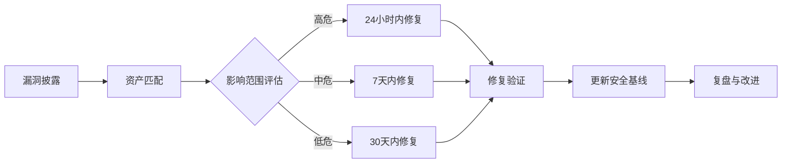

---

## 误区七：多云环境更安全

### 错误认知

"我们同时用AWS和Azure，一个云出问题，另一个还能用，天然的灾备。"

### 底层原理

多云架构确实提供了**供应商锁定的灵活性**和**一定程度的可用性冗余**，但它在安全层面引入了显著的复杂性：

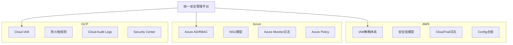

**多云安全的三大挑战：**

1. **策略不一致**：每个云平台的IAM模型、网络模型、加密模型完全不同，安全策略难以统一
2. **跨云网络**：云间连接（VPN/专线）引入新的攻击面，流量需要加密且受限
3. **监控盲区**：攻击者可以利用一个云平台的弱配置作为跳板攻击另一个云平台

### 真实案例

**案例一：跨云横向移动**

某企业同时使用AWS和GCP。AWS环境的安全配置较好，但GCP环境因为是"试验环境"而配置较松。攻击者先入侵了GCP中一个未修补的VM，然后通过共享的Service Account密钥横向移动到AWS环境。

**案例二：跨云身份联邦漏洞**

某企业使用Azure AD作为统一身份提供商，通过SAML/OIDC联邦到AWS和GCP。攻击者通过Azure AD的配置漏洞获取了联邦凭据，从而获得了对所有三个云平台的访问权限。

### 正确做法

**1. 统一身份管理**

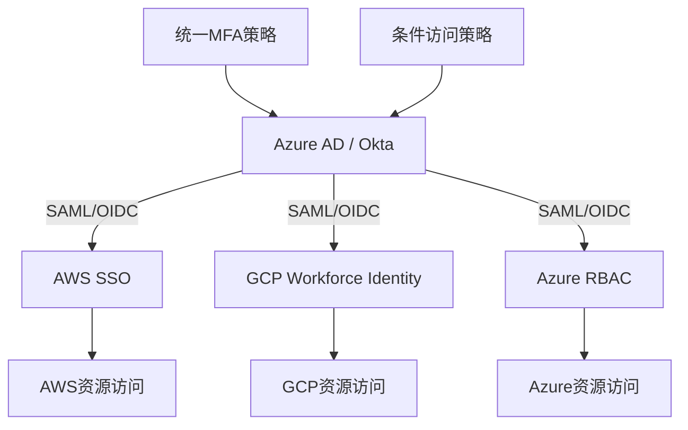

**2. 基础设施即代码统一配置**

```hcl
# 使用Terraform统一管理多云安全基线

# AWS安全基线
module "aws_security_baseline" {
  source  = "nozaq/secure-baseline/aws"
  version = "~> 0.16"

  # 启用CloudTrail
  cloudtrail_enabled = true
  
  # 启用Config
  config_enabled = true
  
  # 密码策略
  minimum_password_length = 14
  require_lowercase_characters = true
  require_numbers = true
  require_symbols = true
  require_uppercase_characters = true
}

# Azure安全基线
module "azure_security_baseline" {
  source  = "aztfmod/caf/azurerm"
  version = "~> 5.0"

  # 启用Azure Security Center
  security_center = {
    tier = "Standard"
    auto_provision = "On"
  }
}

# GCP安全基线
module "gcp_security_baseline" {
  source  = "terraform-google-modules/project-factory/google"
  version = "~> 14.0"

  # 启用Security Command Center
  activate_apis = [
    "securitycenter.googleapis.com",
    "cloudaudit.googleapis.com"
  ]
}
```

**3. 集中日志和监控**

```bash
# 将多云日志集中到SIEM（以Splunk为例）

# AWS CloudTrail → S3 → Splunk
# Azure Monitor → Event Hub → Splunk
# GCP Cloud Logging → Pub/Sub → Splunk

# 统一告警规则示例（Splunk SPL）
# 检测跨云异常登录
index=cloud sourcetype IN ("aws:cloudtrail", "azure:aad", "gcp:gcp_audit")
| eval cloud_provider=case(
    sourcetype="aws:cloudtrail", "AWS",
    sourcetype="azure:aad", "Azure",
    sourcetype="gcp:gcp_audit", "GCP"
)
| stats dc(cloud_provider) as cloud_count, values(cloud_provider) as clouds by user
| where cloud_count > 2
| where NOT [search index=cloud_user_baseline user=* | fields user]
```

---

## 误区八：云安全工具太贵，小企业用不起

### 错误认知

"Wiz一年要几十万，Orca也不便宜，我们小公司根本用不起企业级安全工具。"

### 底层原理

云安全工具的成本光谱远比想象的宽广。从免费到企业级，每个阶段都有适用的工具：

| 层级 | 工具类型 | 代表工具 | 成本 | 适用场景 |
|------|---------|---------|------|---------|
| **L1 基础合规** | 云厂商免费工具 | AWS Security Hub, Azure Defender, GCP SCC | 免费/低成本 | 基础合规检查 |
| **L2 开源扫描** | CLI扫描工具 | Prowler, ScoutSuite, kube-bench | 完全免费 | 深度安全评估 |
| **L3 CI/CD安全** | DevSecOps工具 | Trivy, Checkov, tfsec, KICS | 完全免费 | 开发阶段安全 |
| **L4 CSPM** | 云安全平台 | Wiz, Orca, Prisma Cloud | 企业级定价 | 全面云安全管理 |
| **L5 CNAPP** | 云原生保护 | CrowdStrike Falcon, Palo Alto | 企业级定价 | 全栈云原生保护 |

### 真实案例

**案例一：开源工具发现高危漏洞**

某初创公司使用Prowler进行首次AWS安全扫描，发现7个严重问题：3个S3桶公开可访问、2个IAM用户拥有Admin权限、1个RDS实例未加密、1个安全组允许SSH从任意IP访问。修复这些问题的成本为零（配置更改），但可能避免了数百万美元的数据泄露损失。

### 正确做法

**1. 免费工具链搭建**

```bash
#!/bin/bash
# 免费云安全扫描套件 - 安装和配置脚本

# Prowler - AWS安全扫描
pip install prowler
prowler aws --checks-level cis_level2 -M html -o ./reports/

# ScoutSuite - 多云安全扫描
pip install scoutsuite
scout aws --report-dir ./reports/scout-aws/
scout azure --report-dir ./reports/scout-azure/

# kube-bench - Kubernetes CIS基准检查
kubectl apply -f https://raw.githubusercontent.com/aquasecurity/kube-bench/main/job.yaml
kubectl logs -l app=kube-bench

# Trivy - 容器镜像漏洞扫描
trivy image --severity HIGH,CRITICAL myapp:latest

# Checkov - IaC安全扫描
pip install checkov
checkov -d ./terraform/
checkov -d ./kubernetes/

# tfsec - Terraform安全扫描
tfsec ./terraform/

# 成本：全部免费
```

**2. 按风险优先级分配预算**

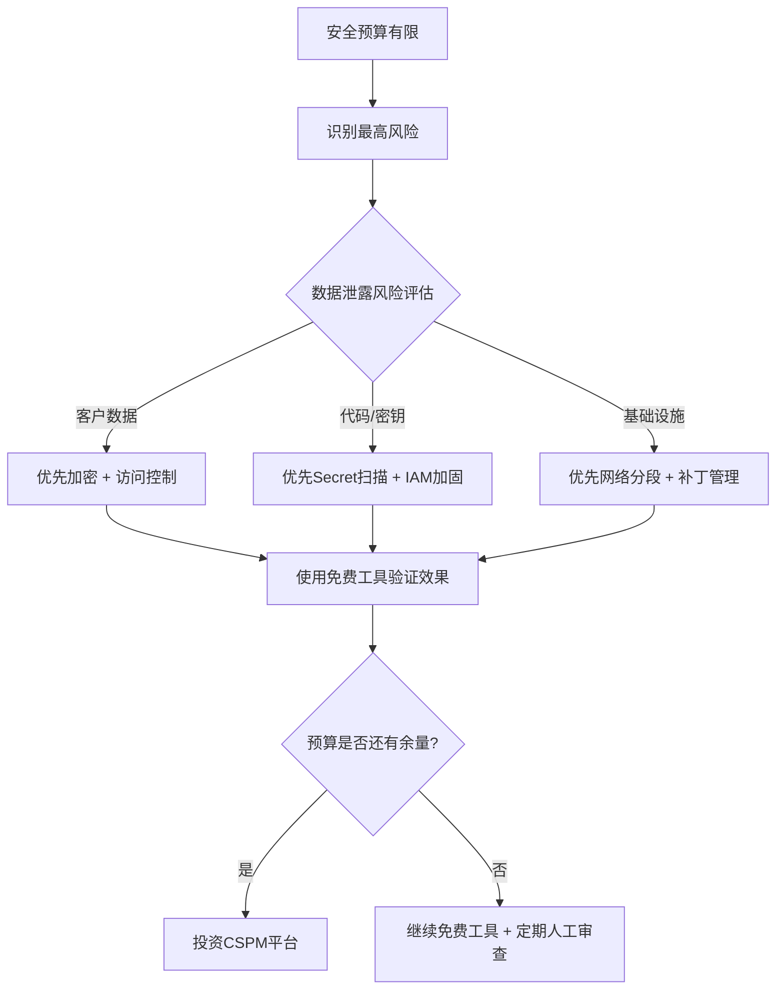

**3. GitHub Actions免费安全扫描流水线**

```yaml
# .github/workflows/security-scan.yml
name: Security Scan
on: [push, pull_request]

jobs:
  # IaC安全扫描
  iac-scan:
    runs-on: ubuntu-latest
    steps:
      - uses: actions/checkout@v4
      - name: Run Checkov
        uses: bridgecrewio/checkov-action@v12
        with:
          directory: ./terraform/
          framework: terraform

  # 容器镜像扫描
  image-scan:
    runs-on: ubuntu-latest
    steps:
      - uses: actions/checkout@v4
      - name: Build image
        run: docker build -t myapp:test .
      - name: Run Trivy
        uses: aquasecurity/trivy-action@master
        with:
          image-ref: myapp:test
          severity: 'CRITICAL,HIGH'

  # Secret检测
  secret-scan:
    runs-on: ubuntu-latest
    steps:
      - uses: actions/checkout@v4
        with:
          fetch-depth: 0
      - name: Run Gitleaks
        uses: gitleaks/gitleaks-action@v2
        env:
          GITHUB_TOKEN: ${{ secrets.GITHUB_TOKEN }}
```

---

## 误区九：云安全只是技术问题

### 错误认知

"买几个安全工具，配置好防火墙和IAM，云安全就搞定了。"

### 底层原理

云安全是**人、流程、技术**三个维度的综合问题。根据SANS Institute的研究，超过60%的安全事件与人为因素有关（配置错误、社会工程、内部威胁），而非纯粹的技术漏洞。

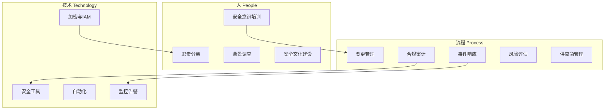

### 真实案例

**案例一：内部威胁 — Shopify员工（2020年）**

如前所述，两名Shopify员工利用其合法访问权限窃取商家数据。这不是技术漏洞，而是**人员管理和流程控制**的失败——缺乏数据访问审计和异常行为检测。

**案例二：社会工程 — LastPass（2022年）**

LastPass在2022年遭遇数据泄露，攻击者通过社会工程获取了DevOps工程师的凭据，进而访问了云存储中的备份数据。技术防护（加密、MFA）虽然存在，但**人的因素**（社会工程防护不足）导致了防线被突破。

**案例三：流程缺失 — Uber泄露（2016年）**

Uber的AWS凭据泄露到GitHub仓库，根因是**代码审查流程**未能检测到硬编码的密钥，以及**密钥轮换流程**的缺失。

### 正确做法

**1. 安全事件响应流程**

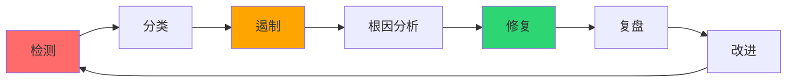

**2. 变更管理流程**

```markdown
# 云安全变更管理检查清单

## 变更前
- [ ] 安全影响评估完成
- [ ] 变更已获得安全团队审批
- [ ] 回滚计划已制定
- [ ] 变更窗口已通知相关方

## 变更中
- [ ] 使用IaC执行变更（非手动控制台操作）
- [ ] 变更过程已记录
- [ ] 关键指标正在监控

## 变更后
- [ ] 安全配置验证通过（Prowler/Config扫描）
- [ ] 功能测试通过
- [ ] 变更已记录到CMDB
- [ ] 48小时内进行安全回归检查
```

**3. 安全培训矩阵**

| 角色 | 培训频率 | 培训内容 | 考核方式 |
|------|---------|---------|---------|
| 开发人员 | 每季度 | 安全编码、Secret管理、IAM基础 | 在线考试 + 代码审查 |
| 运维人员 | 每月 | 安全配置、事件响应、合规要求 | 桌面演练 + 实操考核 |
| 管理层 | 每半年 | 安全风险、合规义务、预算规划 | 案例分析报告 |
| 新员工 | 入职时 | 安全政策、基础安全意识、工具使用 | 入职考试 |

---

## 误区十：云安全与DevOps是对立的

### 错误认知

"安全团队总是阻塞我们的发布流程，安全检查拖慢了开发速度。"

### 底层原理

这种对立源于一个错误的二元假设：**安全和速度是零和博弈**。实际上，DevSecOps的核心理念是：通过自动化和工具化，将安全检查嵌入开发流程的每个阶段，既不降低速度，也不牺牲安全。

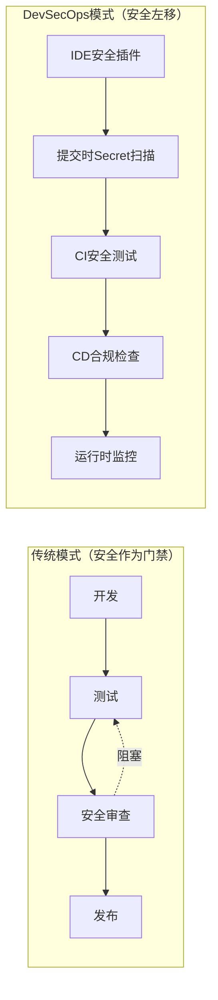

**安全左移的ROI**：根据IBM的研究，在开发阶段发现并修复一个安全问题的成本是生产环境的**1/100**。

### 真实案例

**案例一：某金融科技公司DevSecOps转型**

该公司在实施DevSecOps前，平均安全审查周期为2周，导致发布频率为每月1次。实施DevSecOps后：
- 代码提交时自动扫描（Semgrep、Gitleaks）：0分钟延迟
- CI阶段安全测试（Trivy、Checkov）：5分钟
- CD阶段合规检查（OPA/Gatekeeper）：2分钟
- 发布频率提升到每周3次
- 安全漏洞数量下降65%

### 正确做法

**1. CI/CD安全流水线设计**

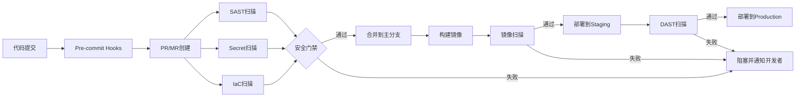

**2. 安全门禁配置示例**

```yaml
# GitLab CI安全门禁
stages:
  - security
  - build
  - deploy

secret-detection:
  stage: security
  script:
    - gitleaks detect --source . --report-format json --report-path gl-secret-detection-report.json
  artifacts:
    reports:
      secret_detection: gl-secret-detection-report.json
  allow_failure: false  # 发现Secret则阻塞

sast:
  stage: security
  script:
    - semgrep --config auto --json --output semgrep-results.json .
  artifacts:
    reports:
      sast: semgrep-results.json
  allow_failure: false

container-scan:
  stage: build
  script:
    - trivy image --exit-code 1 --severity HIGH,CRITICAL $CI_REGISTRY_IMAGE:$CI_COMMIT_SHA
  allow_failure: false

iac-scan:
  stage: security
  script:
    - checkov -d terraform/ --output junitxml --output-file checkov-results.xml
  artifacts:
    reports:
      junit: checkov-results.xml
  allow_failure: false
```

**3. 安全度量指标**

| 指标 | 计算方式 | 目标值 | 说明 |
|------|---------|-------|------|
| 漏洞修复时间（MTTR） | 发现到修复的时间 | 高危<24h, 中危<7d | 衡量响应速度 |
| 安全门禁通过率 | 首次通过的PR比例 | >90% | 衡量开发者安全能力 |
| Secret泄露次数 | Gitleaks发现的Secret数 | 0 | 硬编码凭据防控 |
| 镜像漏洞密度 | 每个镜像的高危CVE数 | <5 | 容器镜像安全 |
| IaC合规率 | Checkov检查通过率 | >95% | 基础设施配置安全 |
| 安全事件数量 | 每月安全事件数 | 逐月下降 | 整体安全态势 |

---

## 误区十一：混合云等于双重安全

### 错误认知

"核心数据放私有云，其他放公有云，既安全又灵活。"

### 底层原理

混合云的真正挑战在于**连接点的安全性**。私有云和公有云之间的网络连接、身份同步、数据传输，每一个都是潜在的攻击面：

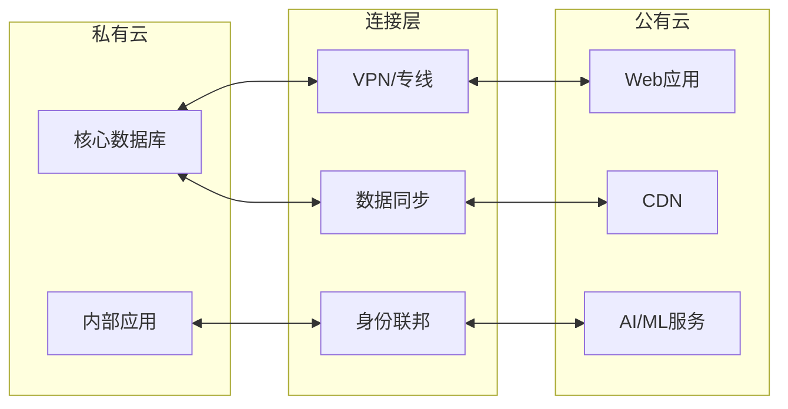

**关键风险点**：

1. **网络连接**：VPN配置错误可能导致公有云直接访问私有云内部网络
2. **身份同步**：如果联邦身份的私钥泄露，攻击者可以从公有云伪造私有云的身份
3. **数据传输**：未加密的同步通道可能导致数据在传输过程中被截获
4. **配置不一致**：两边的安全策略可能不同步，导致保护间隙

### 正确做法

```hcl
# 混合云VPN连接安全配置
resource "aws_vpn_connection" "hybrid" {
  vpn_gateway_id      = aws_vpn_gateway.main.id
  customer_gateway_id = aws_customer_gateway.onprem.id
  type                = "ipsec.1"

  # 启用VPN隧道加密
  tunnel1_preshared_key = var.vpn_psk
  tunnel1_inside_cidr   = "169.254.10.0/30"

  # 启用DPD（Dead Peer Detection）
  tunnel1_dpd_timeout_action   = "restart"
  tunnel1_dpd_timeout_seconds  = 30
}

# 限制VPN流量范围 — 只允许特定子网通信
resource "aws_network_acl_rule" "vpn_ingress" {
  network_acl_id = aws_network_acl.private.id
  rule_number    = 100
  egress         = false
  protocol       = "tcp"
  rule_action    = "allow"
  cidr_block     = "10.0.0.0/8"  # 只允许私有云网段
  from_port      = 443
  to_port        = 443
}
```

---

## 误区十二：有了SSO就万事大吉

### 错误认知

"我们用了Okta/Azure AD做SSO，所有身份都集中管理了，安全没问题。"

### 底层原理

SSO（Single Sign-On）解决了**身份统一**问题，但引入了**单点故障**风险。如果SSO系统本身被攻破，攻击者将获得所有下游应用的访问权限。

**SSO安全的关键维度**：

| 维度 | 风险 | 缓解措施 |
|------|------|---------|
| 凭据强度 | 弱密码、密码重用 | 强密码策略 + MFA |
| 会话管理 | 会话劫持、Token泄露 | 短会话超时 + Token绑定 |
| 联邦信任 | 过度信任外部IdP | 最小化信任范围 + 条件访问 |
| 应用注册 | 过度授权的OAuth应用 | 定期审查应用权限 |
| 降级路径 | MFA绕过、密码重置流程 | 消除降级路径 |

### 真实案例

**案例一：Okta Lapsus$入侵（2022年）**

Lapsus$黑客组织入侵了Okta的内部系统，虽然Okta声称影响有限，但事件暴露了SSO提供商作为单点故障的风险。部分Okta客户的配置数据被访问。

**案例二：Microsoft Azure AD Token伪造（2023年）**

安全研究人员发现Azure AD中存在漏洞（CVE-2023-21529），允许攻击者伪造访问Token。该漏洞影响了使用Azure AD作为SSO的所有下游服务。

### 正确做法

```yaml
# 条件访问策略 — 强化SSO安全
# Azure AD条件访问示例（概念）

条件访问策略:
  - 名称: "高风险登录阻断"
    条件:
      - 用户风险级别: High
      - 位置: 非受信网络
    控制:
      - 阻止访问
      - 要求密码重置

  - 名称: "敏感应用MFA"
    条件:
      - 应用: 生产环境所有应用
      - 用户: 所有用户
    控制:
      - 要求MFA（仅限FIDO2/Windows Hello）
      - 会话超时: 1小时

  - 名称: "OAuth应用审查"
    条件:
      - 应用注册: 新注册的OAuth应用
    控制:
      - 管理员审批
      - 权限范围审查
```

---

## 误区十三：通过SOC审计就等于安全

### 错误认知

"我们通过了SOC 2 Type II审计，说明我们的安全是合规的，没问题。"

### 底层原理

审计合规（Compliance）和实际安全（Security）是两个不同的概念：

- **合规**是满足特定框架的最低要求，是**基线**
- **安全**是抵御真实威胁的能力，是**持续实践**

合规审计有以下局限性：
1. **时间点审计**：审计只检查特定时间点的配置，不代表日常状态
2. **范围有限**：审计只覆盖特定范围，可能遗漏新系统或临时变更
3. **基线而非最佳实践**：合规要求是最低标准，远低于最佳安全实践
4. **自报材料**：部分审计依赖客户自报，存在信息不对称

### 真实案例

**案例一：Equifax数据泄露（2017年）**

Equifax在泄露发生前通过了PCI DSS合规审计。然而，攻击者利用了Equifax未修补的Apache Struts漏洞（CVE-2017-5638，披露已2个月），导致1.47亿用户数据泄露。审计合规 ≠ 实际安全。

**案例二：Target数据泄露（2013年）**

Target在泄露前同样通过了PCI DSS审计，但攻击者通过HVAC供应商的网络凭据进入内网，安装了POS恶意软件，窃取了4000万张信用卡数据。

### 正确做法

**合规 + 安全的双轨策略**

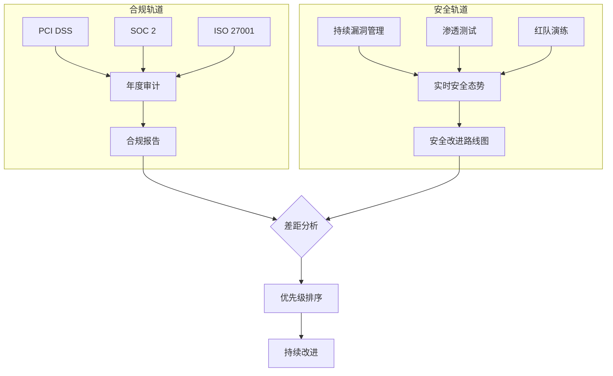

**实际操作**：

```bash
# 超越合规的安全实践

# 1. 持续漏洞扫描（而非审计时才扫描）
# 使用Nessus/OpenVAS定期扫描
nessuscli scan --targets "10.0.0.0/8" --schedule weekly

# 2. 红队演练（超越渗透测试）
# 定期模拟真实攻击场景，而非检查清单式测试

# 3. 安全基准超越合规
# SOC 2要求"日志保留90天" → 你保留365天
# PCI DSS要求"密码8位" → 你要求14位+MFA
# 等保要求"访问控制" → 你实施零信任架构

# 4. 自动化合规持续验证
# 使用AWS Config + Conformance Packs持续验证合规
aws configservice put-organization-conformance-pack \
  --organization-conformance-pack-name soc2-baseline \
  --template-body file://soc2-conformance-pack.yaml
```

---

## 总结：云安全误区的根因分析与纠正框架

这13个误区的根因可以归为三类：

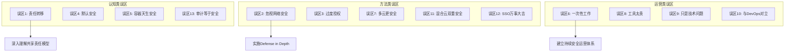

**纠正框架**：

| 阶段 | 行动 | 具体措施 | 成本 |
|------|------|---------|------|
| **立即** | 止血 | Prowler全量扫描、修复高危问题、启用MFA | 0（人力） |
| **1个月内** | 基线 | IaC标准化、CI/CD安全门禁、Secret扫描 | 低 |
| **3个月内** | 体系化 | 安全事件响应流程、定期权限审查、安全培训 | 中 |
| **6个月内** | 成熟化 | CSPM平台、零信任架构、红队演练 | 中高 |
| **持续** | 优化 | 安全度量驱动、自动化修复、安全文化建设 | 持续投入 |

**最后的忠告**：云安全不是一个"完成"的状态，而是一个持续演进的过程。不存在银弹——没有任何单一工具、流程或配置能让你"安全了"。真正的云安全来自于对这些误区的清醒认知，以及将安全融入日常运营每一个环节的持续努力。

不要等到数据泄露后才明白这些道理。
