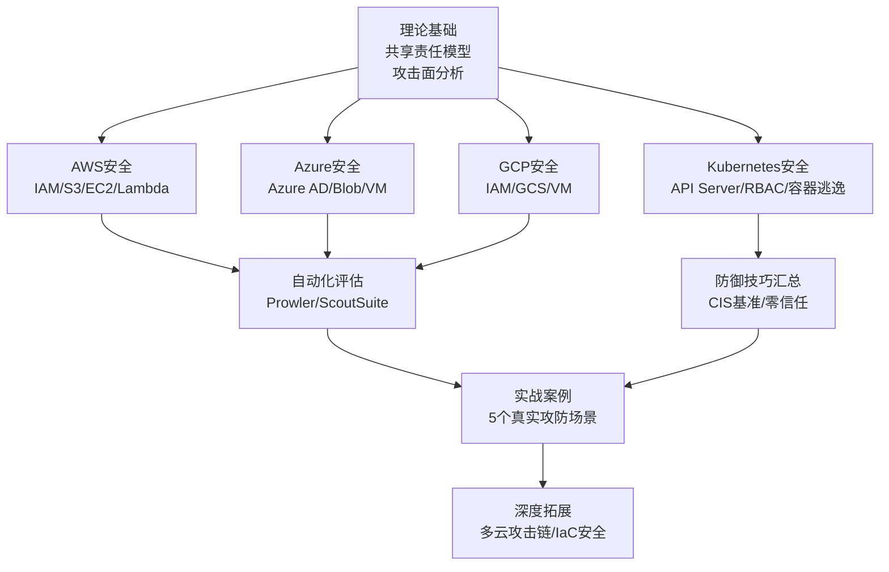
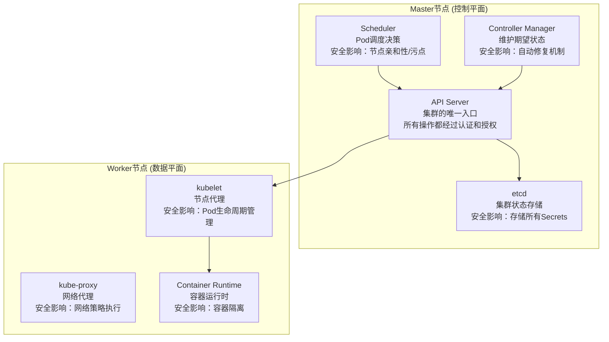
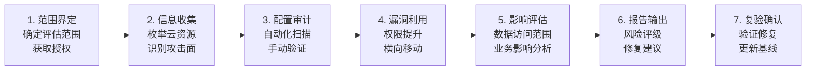
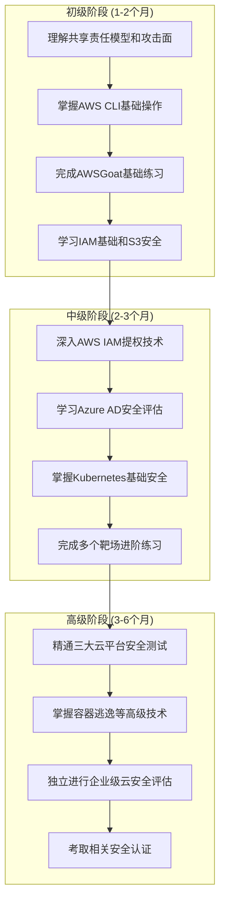

# 第19章 云安全 - 本章小结

## 本章知识体系全景

云安全是一个横跨身份管理、数据保护、网络安全、容器安全等多个子领域的综合性学科。本章从理论到实战，系统地构建了云安全攻防的完整知识体系。下面这张知识图谱展示了本章各节之间的逻辑关系和知识递进路径：



本章的核心论点可以归纳为一句话：**云安全事故中超过90%源于配置错误和权限管理不当，而非云平台本身的漏洞**。这一结论贯穿整章的每一个技术主题——从IAM策略的过度授权，到S3桶的公开访问，再到Kubernetes的RBAC配置错误。理解这一点，就抓住了云安全攻防的核心。

---

## 一、核心理论回顾与深化

### 1.1 共享责任模型：一切的起点

共享责任模型不仅是理论概念，更是实际工作中划分安全责任的法律和合同依据。本章19.1节详细阐述了这一模型，这里补充几个实操中容易踩坑的关键认知：

**责任边界的三个常见误区：**

| 误区 | 正确理解 | 实际影响 |
|------|----------|----------|
| "云提供商负责所有安全" | 客户对自身数据、IAM、应用层安全负全责 | 数据泄露事件中，客户无法以"云提供商负责"为由免责 |
| "PaaS模式下不需要关心安全" | 客户仍需负责应用代码安全、数据加密、访问控制 | Lambda函数的环境变量泄露敏感信息仍然是客户的责任 |
| "云安全等于传统安全的延伸" | 云环境有独特的攻击面（元数据服务、API驱动、共享基础设施） | 用传统防火墙思维管理云安全会遗漏大量攻击面 |

**实操检验清单：**
- 你的团队能否清晰画出本组织在云环境中的责任边界？
- 每个云服务的安全配置是否有明确的责任人？
- 安全事件发生时，响应流程是否根据共享责任模型划分了职责？

### 1.2 云环境攻击面：五大维度的系统认知

本章19.2节将云环境攻击面归纳为五大维度：身份与访问管理、数据存储、计算资源、网络、供应链。每个维度的攻击技术和防御方法在后续各平台章节中都有详细展开。这里补充一个关键的统计视角：

根据Gartner的预测，到2025年99%的云安全故障都将源于客户的配置错误。具体到攻击向量的分布：

| 攻击向量 | 占比 | 典型案例 | 核心防御 |
|----------|------|----------|----------|
| IAM配置错误 | ~40% | 过度授权的IAM策略、泄露的访问密钥 | 最小权限原则、定期审计、MFA强制 |
| 存储配置错误 | ~25% | 公开的S3桶、不当的Blob访问控制 | 默认拒绝、自动化扫描、数据分类 |
| 元数据服务利用 | ~15% | SSRF获取临时凭据 | IMDSv2、网络隔离、输入验证 |
| 容器/K8s逃逸 | ~12% | 特权容器、挂载点滥用 | Pod安全标准、只读根文件系统 |
| 供应链攻击 | ~8% | 恶意Docker镜像、被篡改的IaC模块 | 镜像签名验证、依赖扫描 |

### 1.3 云元数据服务：从理论到攻击链

元数据服务是云安全中最具特色的攻击面之一。19.3节介绍了IMDSv1与IMDSv2的区别，这里补充一个完整的攻击链思维模型：

**SSRF→元数据→横向移动的完整攻击链：**

```text
发现SSRF漏洞 → 探测元数据端点 → 获取IAM临时凭据
       ↓                                    ↓
  验证凭据有效性 → 枚举IAM权限 → 利用过度授权的策略
       ↓                                    ↓
  访问S3/数据库 → 获取更多凭据 → 跨账户/跨服务横向移动
```

**IMDSv1 vs IMDSv2的关键安全差异：**

| 特性 | IMDSv1 | IMDSv2 |
|------|--------|--------|
| 请求方式 | 简单HTTP GET | 先PUT获取Token，再用Token请求 |
| SSRF防护 | 无防护，可直接通过SSRF访问 | Token与实例IP绑定，SSRF无法获取Token |
| 头部要求 | 无 | 需要`X-aws-ec2-metadata-token`头部 |
| 默认状态 | 仍可使用（向后兼容） | 推荐强制使用 |
| 配置方式 | `HttpTokens: optional` | `HttpTokens: required` |

**强制IMDSv2的命令：**
```bash
# 强制实例使用IMDSv2
aws ec2 modify-instance-metadata-options \
  --instance-id i-1234567890abcdef0 \
  --http-tokens required \
  --http-endpoint enabled

# 验证配置
aws ec2 describe-instances \
  --instance-ids i-1234567890abcdef0 \
  --query 'Reservations[*].Instances[*].MetadataOptions'
```

---

## 二、三大云平台安全技能精要

### 2.1 AWS安全：最成熟的攻击面

AWS作为市场份额最大的云平台，其安全攻防技术也最为成熟。本章19.2节覆盖了IAM安全、S3桶安全、EC2安全、Lambda安全等核心主题。

**IAM安全的三层防御体系：**

| 层级 | 防御措施 | 检测工具 | 检测频率 |
|------|----------|----------|----------|
| 预防 | 最小权限策略、SCP限制、权限边界 | IAM Access Analyzer | 持续 |
| 检测 | CloudTrail日志分析、异常登录告警 | GuardDuty、Prowler | 实时+每日 |
| 响应 | 自动禁用异常账户、密钥轮换 | Lambda自动响应 | 事件触发 |

**S3桶安全评估的关键检查项：**

1. **公开访问配置**：检查`BlockPublicAccess`是否启用
2. **桶策略分析**：使用IAM Policy Simulator验证策略效果
3. **ACL审查**：确保ACL未授予`Everyone`或`AuthenticatedUsers`权限
4. **加密配置**：验证服务器端加密（SSE-S3、SSE-KMS、SSE-C）
5. **版本控制**：启用版本控制以防止意外删除
6. **日志记录**：启用S3访问日志和CloudTrail日志

**AWS安全评估的核心工具链：**

```bash
# Prowler：全面的AWS安全评估
prowler -M json -S -F prowler-report

# ScoutSuite：多云安全审计
scout aws --report-dir ./reports

# Pacu：AWS渗透测试框架
pacu
Pacu> run iam__enum_permissions
Pacu> run iam__privesc_scan
Pacu> run s3__bucket_finder
```

### 2.2 Azure安全：身份驱动的攻防

Azure的安全模型以Azure AD（现Entra ID）为核心，所有资源访问都通过Azure AD进行身份验证和授权。

**Azure AD攻击的完整攻击链：**

```text
枚举用户和租户 → 密码喷洒攻击 → 获取初始访问
       ↓                              ↓
  枚举服务主体 → 发现过度权限的应用注册
       ↓                              ↓
  OAuth权限提升 → 获取高权限令牌 → 访问Azure资源
       ↓                              ↓
  横向移动到其他服务 → 数据访问 → 持久化后门
```

**Azure安全评估的关键检查项：**

| 检查领域 | 具体项目 | 工具 |
|----------|----------|------|
| Azure AD | 用户枚举、条件访问策略、MFA状态 | ROADtools、AADInternals |
| RBAC | 角色分配审查、自定义角色权限 | Azure CLI、Stormspotter |
| Blob Storage | 容器访问级别、SAS令牌过期时间 | MicroBurst、ScoutSuite |
| Key Vault | 访问策略、密钥轮换策略 | Azure CLI |
| Network | NSG规则、私有端点配置 | ScoutSuite |

### 2.3 GCP安全：项目层级的权限管理

GCP的安全模型以项目（Project）为核心组织单元，IAM策略在组织（Organization）→文件夹（Folder）→项目（Project）→资源（Resource）四个层级继承。

**GCP安全评估的关键命令：**
```bash
# 枚举项目IAM策略
gcloud projects get-iam-policy PROJECT_ID

# 检查服务账户密钥
gcloud iam service-accounts keys list \
  --iam-account=SA_EMAIL --format=json

# 枚举GCS桶
gsutil ls -p PROJECT_ID

# 检查公开的GCS桶
gsutil iam get gs://BUCKET_NAME

# 使用GCPBucketBrute进行自动化扫描
python gcpbucketbrute.py -k KEY_FILE -g
```

### 2.4 三大平台对比：安全模型的核心差异

| 对比维度 | AWS | Azure | GCP |
|----------|-----|-------|-----|
| 身份系统 | IAM Users/Roles/Groups | Azure AD (Entra ID) | Cloud IAM + Service Accounts |
| 权限粒度 | 策略JSON（Action/Resource/Effect） | 角色定义 + 角色分配 | 角色绑定（条件+成员） |
| 存储安全 | S3桶策略+ACL+Block Public Access | Blob容器访问级别+SAS令牌 | GCS桶IAM+ACL（已弃用） |
| 元数据服务 | IMDS (169.254.169.254) | Instance Metadata Service | Metadata Server (metadata.google.internal) |
| 审计日志 | CloudTrail | Azure Monitor / Activity Log | Cloud Audit Logs |
| 密钥管理 | KMS + Secrets Manager | Key Vault | KMS + Secret Manager |
| 默认安全策略 | 较严格（S3 Block Public Access默认启用） | 中等（需手动配置条件访问） | 较严格（默认拒绝公开访问） |

---

## 三、Kubernetes安全：容器编排的安全挑战

### 3.1 架构安全的核心认知

Kubernetes的安全模型建立在其架构之上。理解每个组件的安全含义是进行安全评估的前提：



### 3.2 Kubernetes安全评估的核心技能

**RBAC配置审查：**
```bash
# 查看集群角色绑定
kubectl get clusterrolebindings -o json | \
  jq '.items[] | select(.subjects[]?.name=="system:anonymous")'

# 查找过度授权的角色
kubectl get clusterroles -o json | \
  jq '.items[] | select(.rules[]?.verbs[]=="*" and .rules[]?.resources[]=="*")'

# 检查Service Account权限
kubectl auth can-i --list --as=system:serviceaccount:default:default
```

**容器逃逸的五条经典路径：**

| 逃逸路径 | 利用条件 | 防御措施 |
|----------|----------|----------|
| 特权容器 | Pod运行在privileged模式 | 禁止特权容器，使用Pod Security Standards |
| 挂载宿主机文件系统 | hostPath挂载了敏感目录 | 限制hostPath使用，使用只读挂载 |
| 内核漏洞 | 宿主机内核存在漏洞（如Dirty Pipe） | 及时更新内核，使用gVisor/Kata |
| 容器运行时漏洞 | containerd/CRI-O存在漏洞 | 及时更新运行时版本 |
| Service Account Token滥用 | SA Token挂载到Pod且权限过大 | 使用TokenRequest API，绑定最小权限 |

**Kubernetes安全评估工具链：**
```bash
# kube-hunter：集群漏洞扫描
kube-hunter --remote K8S_API_SERVER

# kube-bench：CIS基准检查
kube-bench run --targets master,node,etcd,policies

# peirates：Kubernetes渗透工具
peirates
```

---

## 四、安全评估方法论总结

### 4.1 云安全评估的标准流程

经过本章的学习，一个完整的云安全评估应遵循以下流程：



### 4.2 自动化评估工具矩阵

| 评估阶段 | 工具 | 适用平台 | 输出格式 |
|----------|------|----------|----------|
| 资源枚举 | ScoutSuite | AWS/Azure/GCP | HTML报告 |
| 合规检查 | Prowler | AWS | JSON/CSV/HTML |
| 漏洞扫描 | Pacu | AWS | 会话记录 |
| 图分析 | Stormspotter | Azure | Neo4j图数据库 |
| 基准检查 | kube-bench | Kubernetes | JSON/文本 |
| 综合评估 | CloudSploit | AWS/Azure/GCP | JSON |

### 4.3 攻击链思维模型

云安全攻防不同于传统渗透测试，其核心是**身份驱动的攻击链**。一个典型的云环境攻击链包括：

1. **初始访问**：泄露的访问密钥、过度授权的服务账户、SSRF到元数据服务
2. **权限枚举**：识别当前身份的权限边界，发现可利用的过度授权
3. **权限提升**：利用IAM策略的`*`权限、信任关系、跨服务权限
4. **横向移动**：从一个服务移动到另一个服务，从一个账户移动到另一个账户
5. **数据访问**：访问敏感数据、窃取知识产权
6. **持久化**：创建后门账户、修改IAM策略、植入恶意镜像

---

## 五、关键工具速查表

### 5.1 各平台核心工具

| 平台 | 工具名称 | 主要功能 | 安装方式 |
|------|----------|----------|----------|
| AWS | Prowler | 全面安全评估（CIS基准+自定义检查） | `pip install prowler` |
| AWS | Pacu | AWS渗透测试框架（模块化） | `pip install pacu` |
| AWS | ScoutSuite | 多云安全审计（HTML报告） | `pip install scoutsuite` |
| AWS | CloudMapper | AWS环境可视化和分析 | `pip install cloudmapper` |
| Azure | ROADtools | Azure AD数据收集和分析 | `pip install roadrecon` |
| Azure | Stormspotter | Azure AD攻击路径可视化 | GitHub Release |
| Azure | MicroBurst | Azure安全评估工具集 | PowerShell模块 |
| Azure | AADInternals | Azure AD高级操作和攻击 | PowerShell模块 |
| GCP | GCPBucketBrute | GCS桶枚举和权限检查 | `pip install gcpbucketbrute` |
| GCP | ScoutSuite | 多云安全审计 | `pip install scoutsuite` |
| K8s | kube-hunter | 集群漏洞扫描 | `pip install kube-hunter` |
| K8s | kube-bench | CIS Kubernetes基准检查 | 二进制/Docker |
| K8s | peirates | K8s渗透工具（提权+横向移动） | Go编译 |
| K8s | kubectl | 官方CLI（权限枚举+资源审计） | 各平台包管理器 |
| 多云 | Steampipe | 多云资源查询（SQL语法） | `steampipe` |

### 5.2 靶场环境

| 靶场 | 平台 | 难度 | 部署方式 |
|------|------|------|----------|
| AWSGoat | AWS | 初-中 | CloudFormation/Terraform |
| AzureGoat | Azure | 初-中 | ARM模板 |
| GCPGoat | GCP | 初-中 | Terraform |
| Kubernetes Goat | K8s | 中-高 | Helm/kubectl |
| CTFKube | K8s | 中-高 | Docker Compose |
| ThunderCTF | GCP | 中-高 | 在线平台 |

---

## 六、学习路径与认证规划

### 6.1 分阶段学习路径



### 6.2 认证路径详解

| 认证名称 | 适用平台 | 难度 | 前置要求 | 备考时间 | 年薪影响 |
|----------|----------|------|----------|----------|----------|
| AWS Security Specialty (SCS-C02) | AWS | 中高 | 建议先有AWS SAA认证 | 2-3个月 | +15-25% |
| AZ-500 | Azure | 中 | 建议先有AZ-900基础 | 1-2个月 | +10-20% |
| CCSK | 多云 | 中 | 无 | 1个月 | +5-15% |
| CKS | Kubernetes | 高 | 必须先持有CKA | 2-3个月 | +15-25% |
| CCSP | 多云 | 高 | 5年IT经验（3年安全） | 3-4个月 | +20-30% |

**认证选择建议：**

- **以AWS为主攻方向**：先考AWS SAA → 再考AWS Security Specialty → 补充CKS
- **以Azure为主攻方向**：先考AZ-900 → 再考AZ-500 → 补充CCSK
- **以Kubernetes为主攻方向**：先考CKA → 再考CKS → 补充CCSP
- **追求综合能力**：CCSK（入门）→ AWS Security Specialty（深度）→ CKS（容器）→ CCSP（顶级）

---

## 七、常见错误与纠正

本章04-常见误区一节详细列举了云安全中的认知误区。这里从"本章小结"的角度，总结读者在学习和实践中最容易犯的错误：

### 7.1 学习阶段的常见错误

| 错误 | 正确做法 |
|------|----------|
| 只看理论不动手 | 每学完一个知识点，立即在靶场或免费账户上实操验证 |
| 同时学三个云平台 | 先精通一个平台（推荐AWS），再横向扩展到其他平台 |
| 忽视IAM直接学漏洞利用 | IAM是云安全的核心，必须先理解权限模型再学攻击技术 |
| 只学攻击不学防御 | 理解防御措施才能更好地理解攻击面和攻击价值 |
| 忽视自动化工具 | 手动检查无法应对云环境的规模，必须掌握自动化评估工具 |

### 7.2 实践阶段的常见错误

| 错误 | 后果 | 正确做法 |
|------|------|----------|
| 使用生产环境练习 | 可能导致服务中断或数据泄露 | 使用免费账户或专用测试环境 |
| 不清理测试资源 | 产生意外费用 | 使用Terraform管理资源，测试完立即销毁 |
| 访问密钥硬编码在脚本中 | 密钥泄露风险 | 使用环境变量或AWS profiles |
| 未配置MFA | 账户被暴力破解风险 | 所有账户强制启用MFA |
| 忽视日志和监控 | 攻击行为无法被发现和审计 | 启用CloudTrail/Azure Monitor/Cloud Audit Logs |

---

## 八、从本章到实战：能力自检清单

学习完本章后，用以下清单检验自己的掌握程度。每个技能点都对应了本章的具体章节：

### 8.1 理论基础（对应19.1-19.4节）

- [ ] 能够清晰解释共享责任模型在IaaS/PaaS/SaaS模式下的差异
- [ ] 能够画出云环境的五大攻击面及对应的攻击技术
- [ ] 能够描述IMDSv1和IMDSv2的安全差异及IMDSv2的防护原理
- [ ] 能够使用STRIDE模型分析云环境中的威胁
- [ ] 能够查阅MITRE ATT&CK Cloud Matrix识别云特有的攻击技术

### 8.2 AWS安全（对应19.2节）

- [ ] 能够使用`aws sts get-caller-identity`确认当前身份
- [ ] 能够识别过度授权的IAM策略并提供建议
- [ ] 能够使用Prowler对AWS环境进行安全评估
- [ ] 能够检查S3桶的公开访问配置和加密设置
- [ ] 能够利用元数据服务获取临时凭据（在授权环境中）

### 8.3 Azure安全（对应19.3节）

- [ ] 能够使用ROADtools枚举Azure AD用户和组
- [ ] 能够识别SAS令牌的过度授权问题
- [ ] 能够使用Stormspotter可视化Azure资源关系
- [ ] 能够评估Azure条件访问策略的配置

### 8.4 GCP安全（对应19.4节）

- [ ] 能够使用gcloud CLI枚举IAM策略和服务账户
- [ ] 能够检查GCS桶的公开访问设置
- [ ] 能够理解GCP IAM策略的层级继承机制

### 8.5 Kubernetes安全（对应19.5节）

- [ ] 能够使用kubectl枚举集群资源和权限
- [ ] 能够检查RBAC配置中的过度授权问题
- [ ] 能够描述至少三种容器逃逸路径及其利用条件
- [ ] 能够使用kube-bench进行CIS基准检查
- [ ] 能够理解etcd未授权访问的影响和防护措施

### 8.6 综合能力（对应19.6-19.7节）

- [ ] 能够独立规划一个企业云安全评估的范围和方法
- [ ] 能够设计一个多云环境的安全评估方案
- [ ] 能够根据评估结果编写包含风险评级和修复建议的报告
- [ ] 能够识别常见的云安全配置误区并提供纠正方案

---

## 九、行业趋势与持续学习

### 9.1 云安全领域的最新趋势

| 趋势 | 描述 | 对安全从业者的启示 |
|------|------|-------------------|
| 多云/混合云普及 | 企业同时使用多个云平台成为常态 | 需要掌握多平台安全评估能力 |
| 云原生安全 | 安全左移，从基础设施层深入到应用层 | 需要理解容器、Service Mesh、GitOps的安全含义 |
| AI驱动的安全 | AI/ML用于威胁检测和自动化响应 | 需要理解AI安全工具的能力和局限 |
| 零信任架构 | 从"信任但验证"到"永不信任" | 需要理解微分段、持续验证的技术实现 |
| 无密码认证 | Passkeys、FIDO2取代传统密码 | 需要理解新认证机制的安全特性 |

### 9.2 持续学习资源

**在线资源：**
- **Hacking the Cloud** (hackingthe.cloud)：云安全攻击技巧百科，覆盖AWS/Azure/GCP/K8s
- **Cloud Security Wiki** (cloudsecuritywiki.com)：云安全知识库
- **MITRE ATT&CK Cloud Matrix**：云环境攻击技术参考
- **CIS Benchmarks**：各平台的安全配置基准

**靶场环境：**
- AWSGoat、AzureGoat、GCPGoat、Kubernetes Goat：专门为安全学习设计的靶场
- CloudGoat (Rhino Security Labs)：AWS安全练习靶场
- Terragoat (Bridgecrew)：包含安全错误配置的Terraform示例

**社区与会议：**
- Cloud Security Alliance (CSA)：云安全联盟，发布研究报告和最佳实践
- re:Inforce (AWS)、RSA Conference：云安全相关会议
- OWASP Cloud-Native Application Security Top 10：云原生应用安全风险

---

## 十、下一章预告

在第20章中，我们将进入AI与ML安全领域。随着大型语言模型（LLM）、计算机视觉、自动驾驶等AI技术的广泛应用，AI系统面临着独特的安全挑战：

- **对抗性攻击**：通过精心构造的输入欺骗AI模型做出错误决策
- **模型窃取**：通过查询接口逆向工程出模型的架构和参数
- **数据投毒**：在训练数据中注入恶意样本，影响模型行为
- **隐私攻击**：从模型输出中推断训练数据中的敏感信息
- **提示注入**：针对LLM的新型攻击，通过构造恶意提示绕过安全限制

AI安全与云安全有着密切的关联——大多数AI工作负载运行在云平台上，云环境的IAM配置、网络隔离、数据保护直接影响AI系统的安全。本章学习的云安全知识将为下一章的AI安全学习奠定基础。
