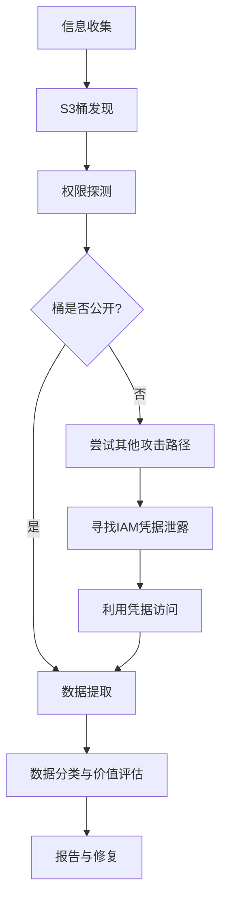

## 案例一：某电商平台AWS S3桶数据泄露事件

云存储服务的安全配置错误是当今互联网最常见的数据泄露原因之一。根据IBM《2025年数据泄露成本报告》，云配置错误导致的数据泄露平均修复成本达到480万美元，且平均发现时间超过200天。本案例以一家中型电商平台的AWS S3桶数据泄露事件为蓝本，完整还原从攻击侦察到数据泄露的全过程，并深入分析防御策略。

### 19.8.1 背景与场景设定

#### 目标企业概况

某中型电商平台（以下简称"TargetShop"），日活用户约50万，年交易额超过2亿元。技术栈如下：

| 组件 | 技术选型 | 说明 |
|------|---------|------|
| 前端 | React + CDN | 静态资源托管在S3 + CloudFront |
| 后端 | Java Spring Boot | 部署在EC2实例集群 |
| 数据库 | RDS MySQL + Redis | 订单和用户数据 |
| 文件存储 | AWS S3 | 用户头像、商品图片、订单附件、系统备份 |
| CI/CD | Jenkins + GitHub | 自动化部署流水线 |

#### 为什么S3桶成为高价值目标

S3（Simple Storage Service）是AWS最核心的对象存储服务，企业通常用它存储以下敏感数据：

- **用户个人信息**：姓名、地址、手机号、身份证号
- **订单交易数据**：订单详情、收货地址、支付记录
- **系统备份文件**：数据库dump、配置文件、密钥文件
- **日志数据**：访问日志、审计日志、应用日志
- **静态资源**：前端代码、API配置、环境变量

S3桶的安全配置完全由客户负责（共享责任模型），AWS只保证底层基础设施的安全。桶策略（Bucket Policy）、ACL（Access Control List）、公开访问阻止（Public Access Block）等配置的每一处疏忽，都可能导致海量数据暴露在公网上。

#### 真实世界中的S3泄露事件

本案例虽然是教学化的合成场景，但其模式与以下真实事件高度一致：

- **2017年 Verizon**：第三方供应商NICE Systems的S3桶配置错误，泄露600万用户数据
- **2017年 Uber**：S3桶中存储的GitHub凭据被用于访问源代码，泄露5700万用户数据
- **2019年 Capital One**：前AWS员工利用WAF配置漏洞+SSRF攻击S3桶，泄露1亿用户数据
- **2023年 Microsoft AI**：SAS Token配置错误导致38TB S3数据意外公开

这些事件的共同特征是：**不是AWS自身被攻破，而是客户的安全配置出了问题**。

### 19.8.2 攻击全景

攻击过程分为五个阶段，整体流程如下：



### 19.8.3 阶段一：信息收集与子域名枚举

#### 子域名枚举

攻击的第一步是尽可能多地发现目标组织的互联网资产。子域名枚举可以揭示组织使用的各种服务，包括可能直接指向S3桶的CNAME记录。

```bash
# 使用Amass进行子域名枚举（OWASP官方工具）
amass enum -d targetshop.com -o subdomains.txt

# 使用subfinder进行快速枚举
subfinder -d targetshop.com -silent -o subdomains_subfinder.txt

# 使用assetfinder补充发现
assetfinder --subs-only targetshop.com > subdomains_assetfinder.txt

# 合并去重
cat subdomains*.txt | sort -u > all_subdomains.txt
```

发现的子域名列表：

```text
cdn.targetshop.com        # → CloudFront（可能指向S3桶）
api.targetshop.com        # API网关
static.targetshop.com     # 静态资源（S3托管）
images.targetshop.com     # 图片服务（S3+CloudFront）
backup.targetshop.com     # 备份服务（需重点关注）
staging.targetshop.com    # 预发布环境
```

#### DNS记录分析

通过分析DNS记录，可以直接发现S3桶的CNAME指向：

```bash
# 查询CNAME记录
dig CNAME cdn.targetshop.com +short
# 输出：d1234abcd.cloudfront.net

dig CNAME static.targetshop.com +short
# 输出：s3-website-us-east-1.amazonaws.com  ← 直接指向S3

# 查询TXT记录（可能包含SPF/DKIM等信息）
dig TXT targetshop.com +short
```

#### 证书透明度日志查询

通过证书透明度（Certificate Transparency）日志，可以发现更多关联域名和子域名：

```bash
# 使用crt.sh查询
curl -s "https://crt.sh/?q=%25.targetshop.com&output=json" | \
  jq -r '.[].name_value' | sort -u

# 使用证书搜索发现通配符证书覆盖的域名
curl -s "https://crt.sh/?q=targetshop.com&output=json" | \
  jq -r '.[].common_name' | sort -u
```

### 19.8.4 阶段二：S3桶发现

发现S3桶是攻击的关键环节。有多种方法可以找到目标组织使用的S3桶名称。

#### 方法一：网页源代码分析

Web应用的前端代码中经常硬编码S3桶URL：

```bash
# 抓取首页并搜索S3引用
curl -s https://targetshop.com | grep -oE 'https?://[a-z0-9.-]+\.s3[.-][a-z0-9-]+\.amazonaws.com[^"]*'

# 分析JavaScript文件
curl -s https://targetshop.com/static/js/main.js | \
  grep -oE '[a-z0-9-]+\.s3[.-]amazonaws.com'

# 深度爬取所有JS文件
for js_url in $(curl -s https://targetshop.com | \
    grep -oE 'src="[^"]*\.js[^"]*"' | \
    sed 's/src="//;s/"//'); do
  echo "=== $js_url ==="
  curl -s "$js_url" | grep -oiE '[a-z0-9-]+\.s3[.-]amazonaws.com'
done
```

在目标站点的JavaScript文件中发现以下S3桶引用：

```text
https://targetshop-assets.s3.amazonaws.com/      # 静态资源
https://targetshop-backup.s3.amazonaws.com/       # 备份文件
https://targetshop-orders.s3.amazonaws.com/       # 订单数据
https://targetshop-logs.s3.amazonaws.com/         # 日志文件
```

#### 方法二：错误页面分析

访问不存在的S3资源，从错误响应中提取桶信息：

```bash
# S3的错误响应会泄露桶名和区域信息
curl -s https://targetshop-assets.s3.amazonaws.com/nonexistent-file.txt

# 典型错误响应：
# <?xml version="1.0" encoding="UTF-8"?>
# <Error>
#   <Code>NoSuchKey</Code>
#   <Message>The specified key does not exist.</Message>
#   <BucketName>targetshop-assets</BucketName>
#   <Region>us-east-1</Region>
# </Error>
```

#### 方法三：搜索引擎与公开数据源

```bash
# Google Dork搜索S3桶
# site:s3.amazonaws.com "targetshop"
# site:s3.amazonaws.com "targetshop.com"
# intext:"targetshop" site:github.com "s3" OR "bucket"

# GitHub代码搜索（查找泄露的桶名）
# 搜索开发者可能意外提交的配置文件
# 在GitHub上搜索：org:targetshop "s3://"
# 搜索：org:targetshop "bucket_name" OR "BUCKET_NAME"

# 使用GrayHatWarfare搜索公开S3桶
# https://buckets.grayhatwarfare.com/
# 搜索关键词：targetshop
```

#### 方法四：工具自动化发现

```bash
# 使用cloud_enum进行多云资产枚举
python3 cloud_enum.py -k targetshop -l targetshop_cloud_enum.txt

# 使用S3Scanner扫描桶权限
python3 s3scanner.py --bucket targetshop-assets
python3 s3scanner.py --bucket targetshop-backup
python3 s3scanner.py --bucket targetshop-orders

# 使用bucket-finder批量探测
ruby bucket_finder.rb --wordlist targetshop_buckets.txt
```

### 19.8.5 阶段三：访问控制与权限检查

发现S3桶后，需要逐个检查其访问权限配置。这是判断数据是否可被未授权访问的关键步骤。

#### ACL（访问控制列表）检查

```bash
# 检查桶ACL配置
aws s3api get-bucket-acl --bucket targetshop-assets

# 输出结果分析：
# {
#   "Grants": [
#     {
#       "Grantee": {
#         "Type": "CanonicalUser",
#         "DisplayName": "targetshop-admin"
#       },
#       "Permission": "FULL_CONTROL"
#     },
#     {
#       "Grantee": {
#         "Type": "Group",
#         "URI": "http://acs.amazonaws.com/groups/global/AllUsers"  ← 全局可读！
#       },
#       "Permission": "READ"  ← 所有人都有读取权限
#     }
#   ]
# }
```

关键权限类型说明：

| 权限 | 含义 | 风险等级 |
|------|------|---------|
| READ | 列出桶内容和读取对象 | 严重 — 泄露所有文件 |
| WRITE | 上传/删除/覆盖文件 | 严重 — 可篡改或删除数据 |
| READ_ACP | 读取ACL配置 | 中 — 信息泄露 |
| WRITE_ACP | 修改ACL配置 | 严重 — 可将桶设为公开 |
| FULL_CONTROL | 完全控制 | 严重 — 最高权限 |

#### 桶策略检查

```bash
# 获取桶策略
aws s3api get-bucket-policy --bucket targetshop-backup --output text

# 发现的危险策略：
# {
#   "Version": "2012-10-17",
#   "Statement": [
#     {
#       "Sid": "PublicRead",
#       "Effect": "Allow",
#       "Principal": "*",           ← 允许所有人！
#       "Action": "s3:GetObject",   ← 可读取所有对象
#       "Resource": "arn:aws:s3:::targetshop-backup/*"
#     }
#   ]
# }
```

桶策略中常见的危险配置模式：

```text
# 危险模式1：Principal设为 "*"
"Principal": "*"  # 允许任何人访问

# 危险模式2：Condition过于宽松
"Condition": {
  "StringLike": {"aws:Referer": "*"}  # 任何Referer都通过

# 危险模式3：Resource范围过大
"Resource": "arn:aws:s3:::*"  # 覆盖所有桶

# 危险模式4：Allow + NotPrincipal
"NotPrincipal": {"AWS": "arn:aws:iam::123456789:root"}
# 意思是除了这个账户，其他所有人都允许——逻辑反转陷阱
```

#### 公开访问阻止配置检查

```bash
# 检查S3 Block Public Access设置
aws s3api get-public-access-block --bucket targetshop-assets

# 输出：
# {
#   "PublicAccessBlockConfiguration": {
#     "BlockPublicAcls": false,           ← 未阻止公开ACL
#     "IgnorePublicAcls": false,          ← 未忽略公开ACL
#     "BlockPublicPolicy": false,         ← 未阻止公开策略
#     "RestrictPublicBuckets": false      ← 未限制公开桶
#   }
# }

# 如果返回 NoSuchPublicAccessBlockConfiguration
# 说明该桶完全没有启用公开访问阻止——这是最危险的配置
```

S3 Block Public Access的四个开关：

| 开关 | 作用 | 推荐设置 |
|------|------|---------|
| BlockPublicAcls | 阻止设置公开ACL | true |
| IgnorePublicAcls | 忽略已有的公开ACL | true |
| BlockPublicPolicy | 阻止包含公开访问的桶策略 | true |
| RestrictPublicBuckets | 限制对公开桶的匿名访问 | true |

**最佳实践**：四个开关全部设置为 `true`。AWS自2023年起默认对新桶启用这些设置，但存量桶不受影响。

#### 服务器端加密检查

```bash
# 检查默认加密配置
aws s3api get-bucket-encryption --bucket targetshop-assets

# 检查是否有默认加密
# 如果返回 ServerSideEncryptionConfigurationNotFoundError
# 说明该桶未启用默认加密

# 检查对象级别的加密状态
aws s3api head-object --bucket targetshop-assets --key config/database.yml
# 查看 ServerSideEncryption 字段
```

#### 版本控制与日志检查

```bash
# 检查版本控制状态
aws s3api get-bucket-versioning --bucket targetshop-assets
# 如果返回空对象或 "Status": "Suspended"，说明未启用版本控制

# 检查是否启用了访问日志
aws s3api get-bucket-logging --bucket targetshop-assets
# 如果返回空对象，说明未启用访问日志——意味着无法追溯谁访问了数据

# 检查生命周期配置
aws s3api get-bucket-lifecycle-configuration --bucket targetshop-assets
# 了解数据保留策略
```

### 19.8.6 阶段四：数据提取与分析

确认S3桶存在公开访问权限后，可以进行数据提取。

#### 列出桶内容

```bash
# 列出targetshop-orders桶的所有对象
aws s3 ls s3://targetshop-orders/ --recursive --human-readable

# 输出示例：
# 2024-03-15 14:23:01   2.3 MB orders/2024/Q1/orders_20240101.csv
# 2024-03-15 14:23:05   1.8 MB orders/2024/Q1/orders_20240102.csv
# 2024-06-20 09:15:33   567.2 KB users/user_profiles_202403.json
# 2024-08-10 22:01:45  12.4 MB backup/db_backup_20240810.sql.gz
# 2024-09-01 03:00:12  890.3 KB logs/access_log_20240831.log

# 统计桶内对象数量和总大小
aws s3 ls s3://targetshop-orders/ --recursive --summarize | tail -2
# Total Objects: 15,847
# Total Size: 45.6 GiB
```

#### 下载敏感数据

```bash
# 同步订单数据
aws s3 sync s3://targetshop-orders/ ./evidence/orders/ --exclude "*.tmp"

# 单独下载特定高价值文件
aws s3 cp s3://targetshop-backup/db_backup_20240810.sql.gz ./evidence/

# 下载用户数据
aws s3 sync s3://targetshop-orders/users/ ./evidence/users/
```

#### 数据分类与敏感度评估

提取到的数据按敏感度分为以下几类：

| 数据类别 | 敏感度 | 示例内容 | 法律影响 |
|---------|--------|---------|---------|
| 用户身份信息（PII） | 极高 | 姓名、手机号、身份证号、地址 | 违反《个人信息保护法》 |
| 支付信息 | 极高 | 银行卡号（部分）、支付账户 | 违反PCI DSS |
| 订单交易数据 | 高 | 订单详情、商品信息、价格 | 商业机密泄露 |
| 系统备份 | 高 | 数据库dump、配置文件 | 可能包含凭据和密钥 |
| 访问日志 | 中 | IP地址、User-Agent、请求路径 | 间接暴露用户行为 |
| 商品图片 | 低 | 商品展示图、用户头像 | 版权问题 |

实际提取到的敏感数据统计：

```text
用户个人信息：
  - 姓名 + 手机号：23万条
  - 收货地址：18万条
  - 身份证号（实名认证用户）：3.2万条

支付信息：
  - 银行卡后四位：8.7万条
  - 支付宝/微信OpenID：15万条

订单数据：
  - 完整订单记录：89万条
  - 订单金额总计：约2.3亿元

系统备份：
  - 数据库完整备份：3份（含用户表、订单表、支付表）
  - 应用配置文件：12份（含数据库连接串、API密钥）
```

### 19.8.7 发现的漏洞全景

| 漏洞编号 | 漏洞类型 | 严重性 | 影响范围 | 描述 |
|---------|---------|--------|---------|------|
| VULN-001 | S3桶公开可读 | 严重 | targetshop-orders | 匿名用户可读取全部订单和用户数据 |
| VULN-002 | 桶策略过于宽松 | 严重 | targetshop-backup | Principal设为"*"，任何人可读备份文件 |
| VULN-003 | 未启用公开访问阻止 | 高 | 所有桶 | 四个Block Public Access开关全部关闭 |
| VULN-004 | 缺乏服务器端加密 | 高 | targetshop-assets | 敏感数据明文存储 |
| VULN-005 | 未启用访问日志 | 中 | 所有桶 | 无法追溯数据访问记录 |
| VULN-006 | 未启用版本控制 | 低 | 所有桶 | 无法恢复被篡改或删除的数据 |
| VULN-007 | 备份文件含凭据 | 严重 | targetshop-backup | 数据库备份中包含明文数据库密码和API密钥 |
| VULN-008 | 无数据分类标签 | 中 | 所有桶 | 无法区分敏感数据和普通数据，无法实施差异化保护 |

### 19.8.8 影响分析

#### 业务影响

- **数据泄露规模**：约23万用户的个人信息、89万条订单记录
- **财务损失**：
  - 监管罚款（根据《个人信息保护法》，最高5000万元或上年营收5%）
  - 用户赔偿和诉讼费用
  - 安全加固和审计费用
  - 业务中断损失
- **声誉损失**：用户信任度下降，可能导致10%-20%的用户流失

#### 合规影响

| 法规 | 违规条款 | 可能后果 |
|------|---------|---------|
| 《个人信息保护法》 | 第51条（安全保护义务） | 罚款5000万以下或营收5% |
| 《网络安全法》 | 第42条（数据安全保护） | 罚款100万以下，责任人处罚 |
| 《数据安全法》 | 第27条（数据安全保护义务） | 罚款200万以下，停业整顿 |
| PCI DSS | 要求3（保护存储的持卡人数据） | 丧失支付资质，罚款5000-10万美元/月 |
| GDPR（如有欧盟用户） | 第32条（处理安全） | 罚款2000万欧元或营收4% |

### 19.8.9 完整修复方案

#### 紧急修复（0-24小时内）

```bash
# 1. 立即启用Block Public Access（账户级别）
aws s3control put-public-access-block \
  --account-id 123456789012 \
  --public-access-block-configuration \
  "BlockPublicAcls=true,IgnorePublicAcls=true,BlockPublicPolicy=true,RestrictPublicBuckets=true"

# 2. 对每个桶单独启用Block Public Access
for bucket in targetshop-assets targetshop-backup targetshop-orders targetshop-logs; do
  aws s3api put-public-access-block \
    --bucket "$bucket" \
    --public-access-block-configuration \
    "BlockPublicAcls=true,IgnorePublicAcls=true,BlockPublicPolicy=true,RestrictPublicBuckets=true"
done

# 3. 删除危险的桶策略
aws s3api delete-bucket-policy --bucket targetshop-backup

# 4. 重置ACL为私有
aws s3api put-bucket-acl --bucket targetshop-assets --acl private

# 5. 撤销已泄露的凭据
# 立即轮换数据库密码、API密钥等备份中暴露的凭据
aws iam update-access-key --user-name backup-service --access-key-id AKIA... --status Inactive
```

#### 短期修复（1-7天）

```bash
# 1. 启用服务器端加密（SSE-S3）
for bucket in targetshop-assets targetshop-backup targetshop-orders; do
  aws s3api put-bucket-encryption \
    --bucket "$bucket" \
    --server-side-encryption-configuration '{
      "Rules": [
        {
          "ApplyServerSideEncryptionByDefault": {
            "SSEAlgorithm": "aws:kms",
            "KMSMasterKeyID": "alias/s3-encryption-key"
          },
          "BucketKeyEnabled": true
        }
      ]
    }'
done

# 2. 启用访问日志
aws s3api put-bucket-logging \
  --bucket targetshop-orders \
  --bucket-logging-status '{
    "LoggingEnabled": {
      "TargetBucket": "targetshop-logs",
      "TargetPrefix": "s3-access-logs/orders/"
    }
  }'

# 3. 启用版本控制
for bucket in targetshop-assets targetshop-backup targetshop-orders; do
  aws s3api put-bucket-versioning \
    --bucket "$bucket" \
    --versioning-configuration Status=Enabled
done

# 4. 启用对象锁定（防篡改）
aws s3api put-object-lock-configuration \
  --bucket targetshop-backup \
  --object-lock-configuration '{
    "ObjectLockEnabled": true,
    "Rule": {
      "DefaultRetention": {
        "Mode": "COMPLIANCE",
        "Days": 90
      }
    }
  }'
```

#### 长期修复（7-30天）

**1. 实施最小权限桶策略**

```json
{
  "Version": "2012-10-17",
  "Statement": [
    {
      "Sid": "AllowAppRoleReadOnly",
      "Effect": "Allow",
      "Principal": {
        "AWS": "arn:aws:iam::123456789012:role/app-production-role"
      },
      "Action": ["s3:GetObject", "s3:ListBucket"],
      "Resource": [
        "arn:aws:s3:::targetshop-assets",
        "arn:aws:s3:::targetshop-assets/*"
      ],
      "Condition": {
        "StringEquals": {
          "aws:RequestedRegion": "us-east-1"
        },
        "IpAddress": {
          "aws:SourceIp": ["10.0.0.0/8", "172.16.0.0/12"]
        }
      }
    }
  ]
}
```

**2. 建立IAM策略审查流程**

```yaml
# CloudFormation模板：S3合规基线
Resources:
  S3ComplianceBucket:
    Type: AWS::S3::Bucket
    Properties:
      BucketName: targetshop-orders
      VersioningConfiguration:
        Status: Enabled
      BucketEncryption:
        ServerSideEncryptionConfiguration:
          - ServerSideEncryptionByDefault:
              SSEAlgorithm: aws:kms
              KMSMasterKeyID: !Ref S3EncryptionKey
            BucketKeyEnabled: true
      PublicAccessBlockConfiguration:
        BlockPublicAcls: true
        IgnorePublicAcls: true
        BlockPublicPolicy: true
        RestrictPublicBuckets: true
      LoggingConfiguration:
        DestinationBucketName: targetshop-logs
        LogFilePrefix: s3-access-logs/orders/
      ObjectLockEnabled: true
      Tags:
        - Key: DataClassification
          Value: Confidential
        - Key: Owner
          Value: order-service-team
```

**3. 启用AWS Config合规规则**

```bash
# 创建Config规则，持续监控S3合规状态
aws configservice put-config-rule --config-rule '{
  "ConfigRuleName": "s3-bucket-public-read-prohibited",
  "Source": {
    "Owner": "AWS",
    "SourceIdentifier": "S3_BUCKET_PUBLIC_READ_PROHIBITED"
  }
}'

aws configservice put-config-rule --config-rule '{
  "ConfigRuleName": "s3-bucket-public-write-prohibited",
  "Source": {
    "Owner": "AWS",
    "SourceIdentifier": "S3_BUCKET_PUBLIC_WRITE_PROHIBITED"
  }
}'

aws configservice put-config-rule --config-rule '{
  "ConfigRuleName": "s3-bucket-server-side-encryption-enabled",
  "Source": {
    "Owner": "AWS",
    "SourceIdentifier": "S3_BUCKET_SERVER_SIDE_ENCRYPTION_ENABLED"
  }
}'

aws configservice put-config-rule --config-rule '{
  "ConfigRuleName": "s3-bucket-logging-enabled",
  "Source": {
    "Owner": "AWS",
    "SourceIdentifier": "S3_BUCKET_LOGGING_ENABLED"
  }
}'
```

**4. 使用AWS Security Hub集中管理**

```bash
# 启用Security Hub
aws securityhub enable-security-hub \
  --enable-default-standards \
  --tags '{"Environment":"production"}'

# 启用S3相关的安全标准
aws securityhub batch-enable-standards \
  --standards-subscription-requests '[{
    "StandardsArn": "arn:aws:securityhub:::standards/aws-foundational-security-best-practices/v/1.0.0"
  }]'
```

**5. 建立数据分类与标签体系**

```bash
# 为桶添加数据分类标签
aws s3api put-bucket-tagging \
  --bucket targetshop-orders \
  --tagging '{
    "TagSet": [
      {"Key": "DataClassification", "Value": "PII"},
      {"Key": "RetentionPeriod", "Value": "365"},
      {"Key": "Compliance", "Value": "PIPL,CSL"},
      {"Key": "Owner", "Value": "order-team"},
      {"Key": "Environment", "Value": "production"},
      {"Key": "CostCenter", "Value": "CC-2024-ECOM"}
    ]
  }'
```

### 19.8.10 S3安全检查自动化脚本

以下脚本可自动化检查所有S3桶的安全配置：

```bash
#!/bin/bash
# s3_security_audit.sh — S3桶安全审计脚本
# 用法：./s3_security_audit.sh [AWS_PROFILE]

set -euo pipefail

PROFILE="${1:-default}"
REPORT_FILE="s3_audit_$(date +%Y%m%d_%H%M%S).txt"

echo "=== S3安全审计报告 ===" | tee "$REPORT_FILE"
echo "审计时间：$(date)" | tee -a "$REPORT_FILE"
echo "AWS Profile：$PROFILE" | tee -a "$REPORT_FILE"
echo "" | tee -a "$REPORT_FILE"

# 获取所有桶
buckets=$(aws s3api list-buckets --query 'Buckets[].Name' --output text --profile "$PROFILE")

for bucket in $buckets; do
  echo "--- 检查桶：$bucket ---" | tee -a "$REPORT_FILE"

  # 检查公开访问阻止
  pab=$(aws s3api get-public-access-block --bucket "$bucket" --output json 2>/dev/null || echo "NOT_CONFIGURED")
  if echo "$pab" | grep -q "NOT_CONFIGURED"; then
    echo "  [严重] 未配置公开访问阻止" | tee -a "$REPORT_FILE"
  else
    block_acls=$(echo "$pab" | jq -r '.PublicAccessBlockConfiguration.BlockPublicAcls')
    if [ "$block_acls" != "true" ]; then
      echo "  [高] BlockPublicAcls 未启用" | tee -a "$REPORT_FILE"
    fi
  fi

  # 检查桶ACL
  acl_grants=$(aws s3api get-bucket-acl --bucket "$bucket" --query 'Grants[].Grantee.URI' --output text 2>/dev/null || echo "")
  if echo "$acl_grants" | grep -q "AllUsers"; then
    echo "  [严重] 桶ACL包含AllUsers组权限" | tee -a "$REPORT_FILE"
  fi
  if echo "$acl_grants" | grep -q "AuthenticatedUsers"; then
    echo "  [高] 桶ACL包含AuthenticatedUsers组权限" | tee -a "$REPORT_FILE"
  fi

  # 检查桶策略
  policy=$(aws s3api get-bucket-policy --bucket "$bucket" --output text 2>/dev/null || echo "")
  if echo "$policy" | grep -q '"Principal": "*"'; then
    echo "  [严重] 桶策略允许所有人访问 (Principal: *)" | tee -a "$REPORT_FILE"
  fi

  # 检查加密
  encryption=$(aws s3api get-bucket-encryption --bucket "$bucket" --output json 2>/dev/null || echo "NOT_CONFIGURED")
  if echo "$encryption" | grep -q "NOT_CONFIGURED"; then
    echo "  [高] 未启用服务器端加密" | tee -a "$REPORT_FILE"
  fi

  # 检查版本控制
  versioning=$(aws s3api get-bucket-versioning --bucket "$bucket" --query 'Status' --output text 2>/dev/null || echo "")
  if [ "$versioning" != "Enabled" ]; then
    echo "  [中] 未启用版本控制" | tee -a "$REPORT_FILE"
  fi

  # 检查访问日志
  logging=$(aws s3api get-bucket-logging --bucket "$bucket" --output json 2>/dev/null || echo "{}")
  if echo "$logging" | grep -q "{}"; then
    echo "  [中] 未启用访问日志" | tee -a "$REPORT_FILE"
  fi

  # 检查生命周期
  lifecycle=$(aws s3api get-bucket-lifecycle-configuration --bucket "$bucket" --output json 2>/dev/null || echo "NOT_CONFIGURED")
  if echo "$lifecycle" | grep -q "NOT_CONFIGURED"; then
    echo "  [低] 未配置生命周期策略" | tee -a "$REPORT_FILE"
  fi

  echo "" | tee -a "$REPORT_FILE"
done

echo "审计完成。报告保存至：$REPORT_FILE"
```

### 19.8.11 防御深度策略

S3安全应采用纵深防御（Defense in Depth）策略，不依赖单一安全措施：

```mermaid
graph TB
    subgraph 网络层
        A[VPC Endpoint] --> B[限制S3访问来源IP]
    end
    subgraph 账户层
        C[账户级Block Public Access] --> D[IAM策略最小权限]
    end
    subgraph 桶层
        E[桶策略白名单] --> F[桶级Block Public Access]
        F --> G[服务器端加密]
        G --> H[版本控制]
        H --> I[对象锁定]
    end
    subgraph 对象层
        J[对象ACL限制] --> K[预签名URL临时访问]
    end
    subgraph 监控层
        L[CloudTrail审计] --> M[S3访问日志]
        M --> N[AWS Config规则]
        N --> O[Security Hub告警]
    end
```



| 防御层 | 措施 | 工具/服务 |
|--------|------|----------|
| 网络层 | 通过VPC Endpoint访问S3 | AWS PrivateLink |
| 网络层 | 限制访问来源IP段 | 桶策略Condition |
| 账户层 | 账户级Block Public Access | S3 Console / CLI |
| IAM层 | 最小权限原则 | IAM策略 + SCP |
| IAM层 | MFA强制 | IAM条件键 |
| 桶层 | 桶策略白名单 | S3 Bucket Policy |
| 桶层 | 默认加密 | SSE-S3 / SSE-KMS |
| 桶层 | 版本控制 | S3 Versioning |
| 桶层 | 对象锁定 | S3 Object Lock |
| 对象层 | 预签名URL | S3 Presigned URLs |
| 监控层 | API调用审计 | CloudTrail |
| 监控层 | 访问模式分析 | S3 Server Access Logging |
| 监控层 | 合规检测 | AWS Config + Config Rules |
| 监控层 | 集中告警 | Security Hub + GuardDuty |
| 数据层 | 客户端加密 | AWS Encryption SDK |
| 数据层 | 数据脱敏 | Macie自动发现敏感数据 |

### 19.8.12 关键工具速查

| 工具 | 用途 | 安装/来源 |
|------|------|----------|
| AWS CLI | S3桶管理和审计 | `pip install awscli` |
| ScoutSuite | 多云安全审计 | `pip install scoutsuite` |
| Prowler | AWS安全评估 | `pip install prowler-cloud` |
| S3Scanner | S3桶权限扫描 | `pip install s3scanner` |
| cloud_enum | 多云资产枚举 | `pip install cloud_enum` |
| Pacu | AWS渗透测试框架 | `pip install pacu` |
| CloudMapper | AWS可视化分析 | GitHub: duo-labs/cloudmapper |
| CloudTracker | IAM权限差距分析 | GitHub: duo-labs/cloudtracker |
| Bucket Finder | S3桶内容发现 | GitHub: weev3/BucketFinder |
| GrayHatWarfare | 公开S3桶搜索引擎 | https://buckets.grayhatwarfare.com/ |

### 19.8.13 常见误区与纠正

**误区一："我的桶里没有敏感数据，不需要安全配置"**

纠正：即使是存储商品图片的桶，如果配置为公开可写，攻击者也可以上传恶意文件（如钓鱼页面、恶意脚本），利用你的域名信誉发起攻击。任何S3桶都应遵循最小权限原则。

**误区二："启用了Block Public Access就万事大吉"**

纠正：Block Public Access只阻止通过桶策略和ACL的公开访问。如果IAM用户或角色的密钥泄露，攻击者仍可通过API凭据访问数据。安全配置必须是多层次的。

**误区三："S3加密会影响性能，不值得启用"**

纠正：SSE-S3和SSE-KMS的服务器端加密对性能影响微乎其微（增加延迟通常<5ms），且AWS KMS支持自动密钥轮换。在合规要求下，加密是必须的而非可选的。

**误区四："IAM策略中用Deny就够了，不需要桶策略"**

纠正：IAM策略控制"谁可以做什么"，桶策略控制"这个桶允许什么操作"。两者是互补关系，不是替代关系。最佳实践是同时配置IAM策略和桶策略，并以Block Public Access作为最后一道防线。

**误区五："我们用了CloudFront，S3桶设为公开也没关系"**

纠正：如果S3桶本身公开，攻击者可以直接访问S3桶URL绕过CloudFront的WAF和访问控制。应使用Origin Access Control（OAC）让CloudFront独占S3访问权限，同时将S3桶设为私有。

### 19.8.14 进阶：Capital One事件深度复盘

2019年的Capital One数据泄露事件是S3安全领域最具教学意义的真实案例。攻击者Paige Thompson利用以下组合漏洞获取了1亿用户数据：

1. **WAF配置漏洞**：Capital One使用开源WAF ModSecurity，其EC2实例的IAM角色拥有过多的S3权限
2. **SSRF攻击**：通过WAF的元数据请求转发漏洞访问EC2元数据服务
3. **IAM权限过大**：WAF角色的IAM策略包含 `s3:ListBucket` 和 `s3:GetObject`，覆盖了所有S3桶
4. **数据未加密**：部分S3桶未启用默认加密

关键教训：
- **IAM角色权限应精确到桶级别**，而非使用 `Resource: "*"` 通配符
- **EC2元数据服务应使用IMDSv2**（需要Token认证），而非IMDSv1
- **WAF等安全设备本身也需要安全加固**
- **数据分类和加密应从架构设计阶段就纳入**

### 19.8.15 案例总结

本案例揭示了S3安全配置中最常见的几类问题：桶公开可读、策略过于宽松、缺少加密和审计。这些问题的根本原因是：

1. **安全左移不足**：开发阶段未将安全配置纳入CI/CD流水线
2. **缺乏自动化审计**：依赖人工检查，容易遗漏
3. **共享责任模型理解不足**：误以为AWS会保护一切
4. **最小权限原则未落实**：为图方便使用宽泛权限

修复这些问题不仅需要技术手段（Block Public Access、加密、日志），更需要流程保障（定期审计、合规监控、安全培训）和组织文化（安全是每个人的责任，而非仅安全团队的职责）。

> **核心原则**：在云环境中，默认不信任任何配置。每个S3桶都应假设它可能被公开，因此必须通过多层防御确保即使配置错误也不会导致数据泄露。
