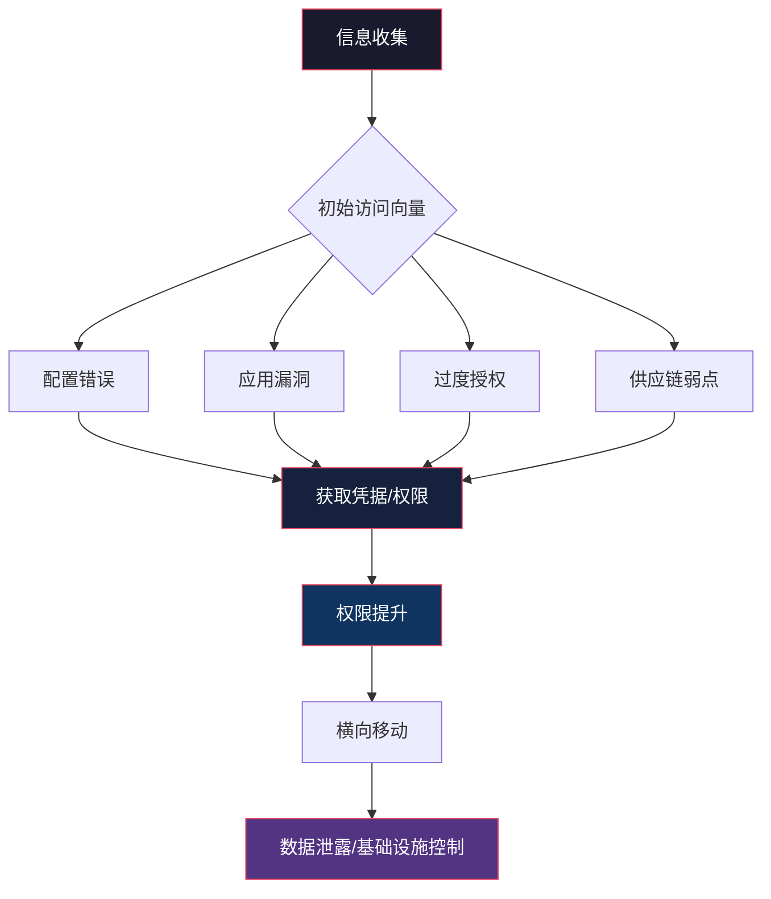
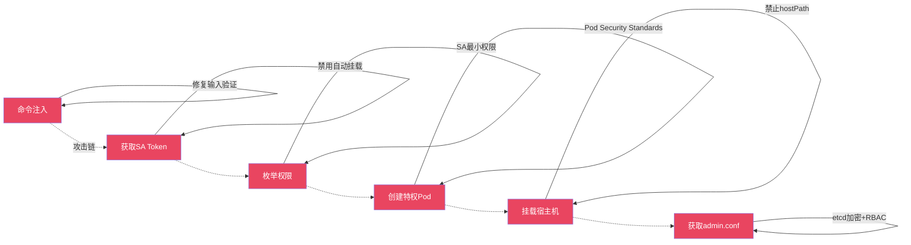
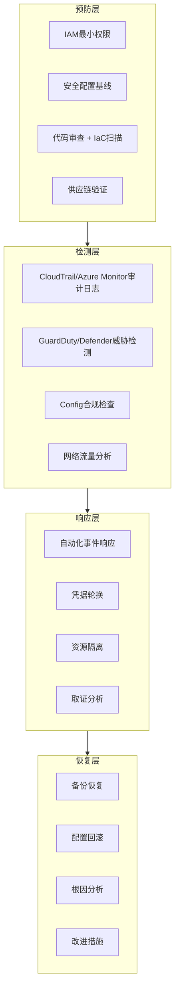
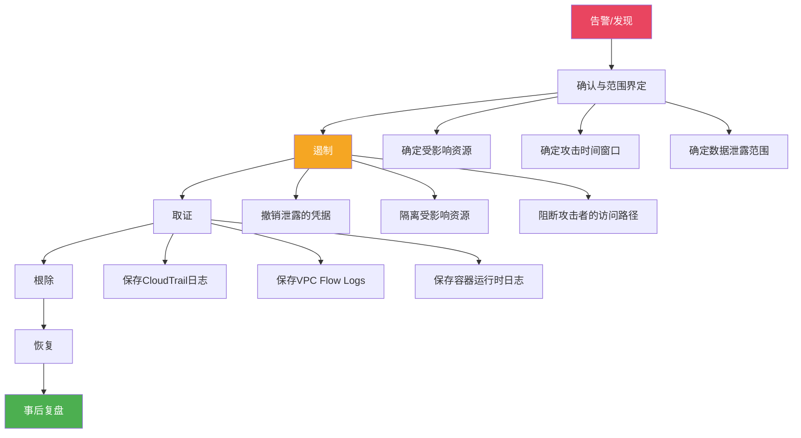

## 案例总结：云安全攻防全景复盘

本节对前五个实战案例进行深度复盘，从攻击向量、利用链条、防御盲区三个维度提炼共性规律，并给出可落地的分层防御框架。这不是简单的"要点回顾"，而是将五个独立案例打通后形成的系统性认知——理解这些规律，才能在面对真实云环境时做到举一反三。

---

### 一、五个案例的攻击路径全景

#### 1.1 案例攻击链对比

以下表格将五个案例的攻击路径拆解为标准化阶段，便于横向对比：

| 案例 | 初始入口 | 信息收集 | 权限获取 | 横向移动 | 最终影响 |
|------|----------|----------|----------|----------|----------|
| 案例一：S3数据泄露 | 子域名枚举 | JS源码分析发现S3桶名 | 匿名ACL读取 | 无需横向移动 | 用户PII、订单数据、部分支付信息泄露 |
| 案例二：SSRF获取凭据 | Web应用SSRF漏洞 | 内网探测→元数据端点 | 获取IAM临时凭据 | 凭据→S3→数据库凭据→RDS | 数据库全量用户数据泄露 |
| 案例三：Azure AD提权 | 应用注册过度授权 | Azure CLI枚举应用 | OAuth Token获取 | Token→Graph API→创建后门用户→加入管理员组 | 目录完全控制 |
| 案例四：K8s集群接管 | 命令注入漏洞 | Pod内SA Token读取 | SA创建特权Pod | 特权Pod→宿主机→admin.conf | 整个K8s集群管理员权限 |
| 案例五：供应链攻击 | 公开GitHub仓库 | Terraform代码分析 | 植入Lambda后门 | Lambda→IAM→S3/EC2/iam:* | 多云基础设施完全控制 |

#### 1.2 攻击路径的共性模式



五个案例共享一个核心模式：**信息收集→凭据获取→权限提升→横向移动**。区别仅在于初始入口不同。这说明云安全攻防的本质不是保护单一入口，而是**打断攻击链中的任何一个环节**。

---

### 二、攻击向量深度分类

#### 2.1 按攻击面分类

| 攻击面 | 对应案例 | 攻击手法 | 防御关键点 |
|--------|----------|----------|------------|
| **存储安全** | 案例一 | S3桶ACL/策略配置错误导致公开可读 | Block Public Access + 桶策略审计 |
| **计算安全** | 案例二 | SSRF→IMDSv1→临时凭据泄露 | IMDSv2 + URL白名单 + 网络分段 |
| **身份安全** | 案例三 | OAuth应用过度授权→Graph API滥用 | 最小权限 + 条件访问 + PIM |
| **容器安全** | 案例四 | 命令注入→SA Token→特权容器→宿主机逃逸 | Pod安全标准 + SA最小权限 + 网络策略 |
| **供应链安全** | 案例五 | 公开IaC代码→恶意Terraform模块→Lambda后门 | 代码审查 + 模块签名 + 私有仓库 |

#### 2.2 按根本原因分类

深入分析五个案例的根本原因（Root Cause），可以归纳为三类：

**第一类：配置错误（案例一、二、四）**

配置错误是云安全事故中最常见的根本原因，占比超过70%。具体表现为：

- **默认不安全的配置被保留**：案例一中S3桶的ACL允许AllUsers读取，这是开发者在测试阶段设置的，但从未在生产部署前修复。这类"遗留配置"在快速迭代的团队中极为常见。
- **安全功能未启用**：案例二中EC2实例未强制IMDSv2，使得IMDSv1的简单HTTP GET请求即可获取凭据。IMDSv2要求使用PUT请求获取Token，从协议层面阻断了SSRF利用。
- **安全边界未建立**：案例四中Pod未启用Pod Security Standards，允许创建特权容器并挂载宿主机根文件系统。Kubernetes的默认配置是"允许一切"，安全策略需要显式建立。

**第二类：权限过度（案例三、四、五）**

过度授权是攻击者完成横向移动的关键推手：

- 案例三中应用被授予 `User.ReadWrite.All`，而非仅需的 `User.ReadBasic.All`。这意味着攻击者获取Token后可以直接修改目录对象。
- 案例四中Service Account被授予创建Pod的权限，且未限制Pod的securityContext。最小权限的SA即使被利用也无法创建特权容器。
- 案例五中Lambda函数的IAM策略包含 `s3:*`、`ec2:*`、`iam:*`，这是灾难性的过度授权。一个仅需读取特定S3桶的函数被授予了对整个AWS账户的控制权。

**第三类：信任边界模糊（案例五）**

案例五揭示了一个更深层的问题：**信任链的每一环都可能被污染**。企业信任了公开的Terraform模块，但模块仓库被攻击者注入了恶意代码。这不是技术问题，而是信任管理问题——供应链安全的核心是验证每一环的可信度。

#### 2.3 按攻击难度和影响评估

| 案例 | 攻击难度 | 技术门槛 | 影响范围 | 业务影响 | CVSS近似评分 |
|------|----------|----------|----------|----------|-------------|
| 案例一：S3泄露 | 低 | 低（CLI操作） | 大量用户数据 | 声誉损害 + 合规罚款 | 7.5 |
| 案例二：SSRF凭据 | 中 | 中（需要发现SSRF） | S3 + 数据库 | 数据泄露 + 横向渗透 | 8.1 |
| 案例三：AD提权 | 中 | 中（需要了解Azure AD） | 整个目录 | 身份基础设施沦陷 | 8.5 |
| 案例四：K8s接管 | 中高 | 高（多阶段利用） | 整个集群 | 全部微服务沦陷 | 9.0 |
| 案例五：供应链 | 低 | 低（代码审查发现） | 多云基础设施 | 完全控制 | 9.8 |

案例五的攻击难度虽然低（攻击者只需要提交一个PR），但影响却是灾难性的。这正是供应链攻击的可怕之处——**攻击成本极低，防御成本极高**。

---

### 三、攻击手法技术深度解析

#### 3.1 元数据服务利用的技术演进

案例二中利用的IMDSv1攻击是云安全领域最经典的技术之一，但其防御机制的演进过程本身就是一个值得深入理解的案例：

| 特性 | IMDSv1 | IMDSv2 |
|------|--------|--------|
| 请求方式 | 简单HTTP GET | 需要先PUT获取Token |
| Token有效期 | 无（凭据本身就是Token） | 6小时（可配置） |
| SSRF可利用性 | 直接可利用 | 需要PUT方法（大多数SSRF不支持） |
| 请求头要求 | 无特殊要求 | 必须携带`X-aws-ec2-metadata-token`头 |
| 启用方式 | 默认 | 需要设置`HttpTokens=required` |

**防御纵深**：仅启用IMDSv2是不够的。攻击者可能通过更复杂的SSRF变体（如支持PUT方法的SSRF、DNS重绑定等）绕过IMDSv2。因此还需要：
- Web应用层面的URL白名单验证
- 网络层面限制对169.254.169.254的访问
- IAM角色层面的最小权限配置

#### 3.2 Kubernetes权限提升的技术链条

案例四展示的攻击链是Kubernetes安全中最典型的提权路径，每个环节都有对应的防御措施：



**关键防御节点**：

1. **禁用SA Token自动挂载**：在Pod spec中设置 `automountServiceAccountToken: false`，即使Pod被攻破也无法获取SA Token。
2. **实施Pod Security Standards**：使用 `restricted` 级别的Pod安全标准，禁止特权容器、hostPID、hostNetwork。
3. **RBAC精细化**：确保SA仅有 `list` 和 `get` 权限，不含 `create`、`delete` 等写权限。

#### 3.3 供应链攻击的隐蔽性分析

案例五中的Terraform后门之所以难以发现，是因为它利用了几个容易被忽视的信任盲区：

- **模块来源信任**：开发团队信任了自定义模块仓库，但没有对模块内容进行代码审查。`git::` 引用指向的是一个活跃维护的仓库，但这不等于每个commit都经过安全审查。
- **资源命名伪装**：后门Lambda被命名为 `system-monitor`，这是一个看起来完全合法的名称。在大型IaC代码库中，这类伪装资源很容易逃过人工审查。
- **权限声明分散**：Lambda的IAM策略是一个独立的 `aws_iam_role_policy` 资源，与Lambda函数本身不在同一个代码块中。审查者需要跨文件追踪才能发现权限与函数的关联。

**防御策略**：

```bash
# 使用tfsec进行Terraform安全扫描
tfsec .

# 使用checkov进行策略合规检查
checkov -d . --framework terraform

# 使用infracost检测资源配置异常
infracost breakdown --path .

# 使用Terrascan进行自定义规则扫描
terrascan scan -i terraform -d .
```

---

### 四、系统性防御框架

#### 4.1 纵深防御模型

基于五个案例的教训，构建云环境的纵深防御体系需要覆盖以下层次：



#### 4.2 针对每个案例的具体防御措施

| 防御维度 | 案例一 | 案例二 | 案例三 | 案例四 | 案例五 |
|----------|--------|--------|--------|--------|--------|
| **预防** | S3 Block Public Access全账户启用 | 强制IMDSv2 | 应用权限季度审查 | Pod Security Standards | Terraform模块签名验证 |
| **检测** | S3访问日志 + Macie敏感数据发现 | VPC Flow Logs + GuardDuty异常检测 | Azure AD登录异常告警 | kube-audit日志 + Falco运行时检测 | GitHub Dependabot + 代码扫描 |
| **响应** | 自动撤销公开ACL | 自动轮换受影响凭据 | 自动禁用可疑应用 | 自动驱逐异常Pod | 自动回滚IaC变更 |
| **恢复** | 从版本控制恢复数据 | 重建受影响EC2实例 | 重置目录对象 | 重建集群节点 | 重新部署干净基础设施 |

#### 4.3 云安全成熟度自评模型

基于五个案例暴露的问题维度，建立以下成熟度模型供自评：

| 等级 | 存储安全 | 计算安全 | 身份安全 | 容器安全 | 供应链安全 |
|------|----------|----------|----------|----------|------------|
| **L1 - 初始** | 无加密，可能公开 | 默认配置运行 | 共享管理员账号 | 无镜像扫描 | 无代码审查 |
| **L2 - 基础** | 加密启用，有基本ACL | IMDSv2启用 | 角色分离，有MFA | 基础镜像扫描 | PR审查流程 |
| **L3 - 定义** | 自动化合规检查 | 网络分段完成 | 最小权限策略 | Pod安全标准 | IaC安全扫描 |
| **L4 - 管理** | 持续监控 + 自动修复 | 运行时威胁检测 | 条件访问 + PIM | 运行时策略（Falco） | 模块签名 + SBOM |
| **L5 - 优化** | 自适应数据分类 | 零信任网络 | 持续身份验证 | 服务网格安全 | 完整供应链可追溯 |

大多数企业的云安全成熟度在L1-L2之间，而五个案例中的受害企业全部处于L1级别。达到L3即可防御绝大多数已知攻击向量。

---

### 五、关键数据指标与度量

#### 5.1 云安全事故统计

根据行业数据和本章案例分析，以下是云安全领域的关键统计数据：

- **70%以上的云安全事故源于配置错误**，而非云平台本身的漏洞。案例一、二、四均为配置问题。
- **平均发现时间（MTTD）超过200天**。案例一中的S3桶可能已经公开数月才被发现。配置漂移的检测依赖自动化工具，人工检查无法覆盖。
- **IAM相关事故占比超过40%**。案例二（凭据泄露）和案例三（过度授权）都属于IAM范畴。
- **供应链攻击增长率超过300%**（2020-2024年）。案例五揭示的Terraform后门只是冰山一角，Docker Hub上的恶意镜像、npm/PyPI中的恶意包都是同一类威胁。

#### 5.2 安全投入回报指标

| 安全措施 | 实施成本 | 覆盖的案例 | 预防效果 | ROI评估 |
|----------|----------|------------|----------|---------|
| S3 Block Public Access | 极低（一行配置） | 案例一 | 100%预防S3公开泄露 | 极高 |
| IMDSv2强制启用 | 低（需验证应用兼容性） | 案例二 | 阻断IMDS凭据获取路径 | 极高 |
| IAM季度审查 | 中（需要人工投入） | 案例二、三、五 | 发现并修复过度权限 | 高 |
| Pod Security Standards | 中（需要Pod spec调整） | 案例四 | 禁止特权容器创建 | 高 |
| IaC安全扫描 | 低（CI/CD集成） | 案例五 | 发现配置错误和后门 | 极高 |
| 全面日志监控 | 高（需要SIEM投入） | 全部案例 | 缩短MTTD到小时级 | 高 |

---

### 六、从攻击者视角看防御优先级

攻击者在选择目标时遵循**最小阻力路径**原则——优先攻击防御最薄弱的环节。根据五个案例的攻击难度和影响评估，以下是攻击者视角下的优先级排序：

**第一优先级（低难度高回报）**：
- 公开可访问的存储桶（案例一）
- 过度授权的IAM角色/应用（案例二、三）
- 公开仓库中的敏感代码和配置（案例五）

**第二优先级（中等难度高回报）**：
- SSRF漏洞利用元数据服务（案例二）
- OAuth/SSO配置错误（案例三）
- 容器环境中的命令注入（案例四）

**第三优先级（高难度高回报）**：
- 供应链攻击（需要预先布局）（案例五）
- Kubernetes集群逃逸（需要多步骤利用）（案例四）

**防御启示**：优先修复第一优先级的问题，因为攻击者也优先利用它们。一个S3桶的公开访问修复可能比部署一套复杂的SIEM系统更能降低实际风险。

---

### 七、事件响应：当攻击已经发生

五个案例都展示了"发现漏洞"后的修复路径，但在真实场景中，你往往是在攻击已经发生后才介入。以下是基于这些案例的事件响应框架：

#### 7.1 通用响应流程



#### 7.2 针对每个案例的响应要点

**案例一响应（S3数据泄露）**：
1. 立即启用Block Public Access（账户级和桶级）
2. 检查S3访问日志确认数据是否已被下载
3. 使用AWS Macie扫描桶中的敏感数据类型
4. 通知受影响的用户（根据GDPR等法规要求）

**案例二响应（SSRF凭据泄露）**：
1. 立即撤销受影响IAM角色的所有临时凭据
2. 轮换S3中泄露的数据库凭据
3. 检查CloudTrail确认凭据的使用范围
4. 修复SSRF漏洞并启用IMDSv2

**案例三响应（Azure AD提权）**：
1. 立即撤销可疑应用的API权限
2. 删除攻击者创建的后门用户
3. 审查Azure AD审计日志中的异常操作
4. 启用条件访问策略限制应用访问

**案例四响应（K8s集群接管）**：
1. 轮换集群的所有Service Account Token
2. 重建受影响的节点（admin.conf可能已泄露）
3. 实施Pod Security Standards
4. 审查并收紧所有RBAC绑定

**案例五响应（供应链攻击）**：
1. 立即删除后门Lambda函数
2. 撤销Lambda关联的所有IAM角色和策略
3. 审查所有Terraform模块的安全性
4. 将基础设施代码仓库设为私有

---

### 八、学习者行动指南

#### 8.1 初学者（1-3个月）

**目标**：理解云安全基础概念，能够在受控环境中复现案例一和案例二。

1. **建立基础认知**：
   - 在AWS免费账户中创建S3桶，体验不同的ACL和策略配置
   - 使用CloudGoat或AWSGoat靶场练习S3桶枚举和利用
   - 理解IAM策略的基本语法（Effect/Action/Resource）

2. **动手实验**：
   - 在EC2实例上启动一个带IMDSv1的实例，通过curl命令获取元数据
   - 使用AWS CLI检查不同IAM策略下的权限边界
   - 在本地环境使用MinIO模拟S3安全配置

3. **推荐靶场**：
   - CloudGoat（Rhino Security Labs）
   - AWSGoat
   - FlAWS（flaws.cloud）

#### 8.2 中级实践者（3-6个月）

**目标**：掌握多平台云安全评估，能够独立复现案例三和案例四。

1. **深化技术能力**：
   - 学习Azure AD的OAuth流程，理解应用注册、服务主体、权限授予的关系
   - 使用ROADtools和Stormspotter进行Azure AD安全评估
   - 在Kubernetes集群中练习Pod创建、RBAC配置、Service Account管理

2. **工具链建设**：
   - 部署Prowler对AWS账户进行自动化安全评估
   - 使用ScoutSuite进行多云环境安全审计
   - 学习kube-bench和kube-hunter的使用

3. **综合练习**：
   - 在AzureGoat中完成完整的攻击链
   - 在Kubernetes Goat中练习从Pod到集群管理员的提权
   - 尝试组合利用多个低危漏洞构建完整攻击链

#### 8.3 高级研究者（6个月以上）

**目标**：具备企业级云安全评估能力，能够发现和分析新型攻击向量。

1. **高级技术研究**：
   - 研究IMDSv2的绕过技术（DNS重绑定、TOCTOU攻击）
   - 分析Kubernetes中的高级逃逸技术（内核漏洞利用、eBPF逃逸）
   - 研究多云环境中的跨平台攻击链

2. **防御体系构建**：
   - 设计企业级云安全监控架构
   - 编写自定义的IaC安全规则（Checkov、tfsec、OPA）
   - 构建云安全事件自动化响应流程

3. **社区贡献**：
   - 向CloudGoat等靶场贡献新的攻击场景
   - 在安全会议中分享云安全攻防研究成果
   - 参与云安全基准（CIS Benchmarks）的更新讨论

---

### 九、核心教训提炼

通过五个案例的深度复盘，以下是必须铭记的核心教训：

**教训一：配置漂移是最大的敌人**

云环境的动态性意味着安全配置会随时间漂移。今天安全的配置，明天可能因为一次紧急部署而变得不安全。唯一的解决方案是**持续自动化监控**——人工审计频率永远跟不上环境变化的速度。

**教训二：最小权限不是建议，是底线**

案例二、三、四、五都涉及过度授权。最小权限原则的实施确实会增加运维复杂度，但对比攻击者利用过度权限造成的损失，这点复杂度微不足道。具体做法：
- 新创建的IAM角色/Service Account默认零权限
- 通过实际使用日志逐步添加必要权限
- 每季度审查并移除90天内未使用的权限

**教训三：信任需要验证**

案例五的核心教训是：不要信任任何未经验证的组件。这适用于第三方库、开源模块、容器镜像、IaC模块。具体措施：
- 使用签名验证和哈希校验
- 建立内部可信镜像仓库
- 对所有外部依赖进行安全扫描

**教训四：安全是连续的，不是离散的**

五个案例中的受害企业都有一个共同特点：安全是在某个时间点"完成"的，而不是持续进行的。云安全是一个持续的过程，需要：
- 将安全检查集成到CI/CD流水线
- 建立安全配置的版本控制和变更审计
- 定期进行红蓝对抗演练

**教训五：攻击链比单点漏洞更重要**

单独看每个案例中的漏洞，有些可能被评为"中危"甚至"低危"。但当它们串联成攻击链时，影响是灾难性的。防御思维应该从"修复单个漏洞"转变为"打断攻击链"——识别攻击路径上的关键节点，优先加固这些节点。

---

### 十、下一步学习方向

本章的五个案例覆盖了云安全的主要攻击面，但云安全领域远不止这些。以下是建议的深入方向：

| 方向 | 推荐资源 | 关联案例 |
|------|----------|----------|
| Serverless安全 | AWS Lambda安全最佳实践、Serverless Goat | 案例二、五 |
| 云原生安全 | CNCF安全白皮书、Falco、OpenPolicyAgent | 案例四 |
| 多云安全管理 | Wiz、Orca Security、云安全态势管理（CSPM） | 案例五 |
| 云取证与事件响应 | AWS CloudTrail分析、Azure Sentinel、GCP Chronicle | 全部案例 |
| 零信任架构 | NIST SP 800-207、BeyondCorp | 全部案例 |
| 合规与治理 | AWS Config Rules、Azure Policy、CIS Benchmarks | 全部案例 |

掌握云安全攻防技术的最终目标不是成为攻击者，而是**用攻击者的思维构建更坚固的防御**。每一个成功利用的漏洞，都对应着一个可以被提前消除的风险。系统化地学习攻击技术，才能系统化地构建防御体系。
