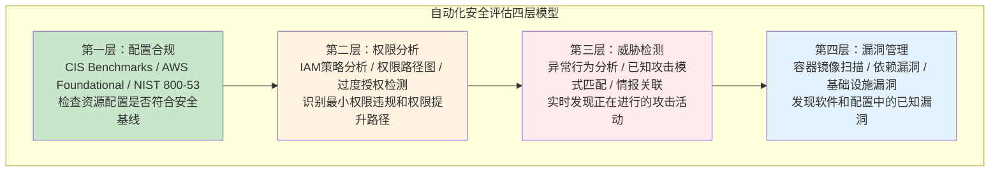
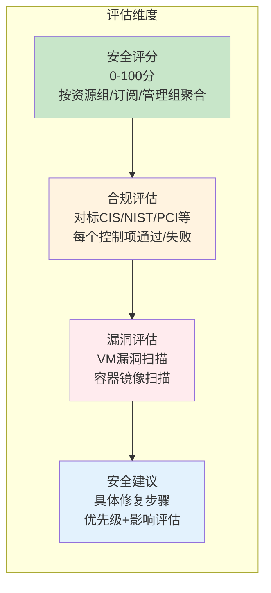
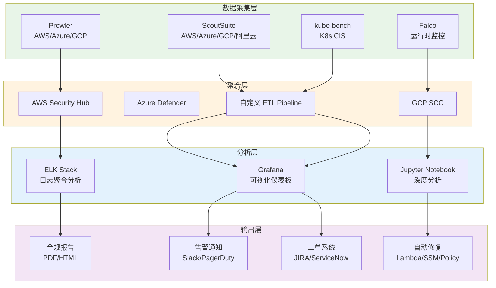
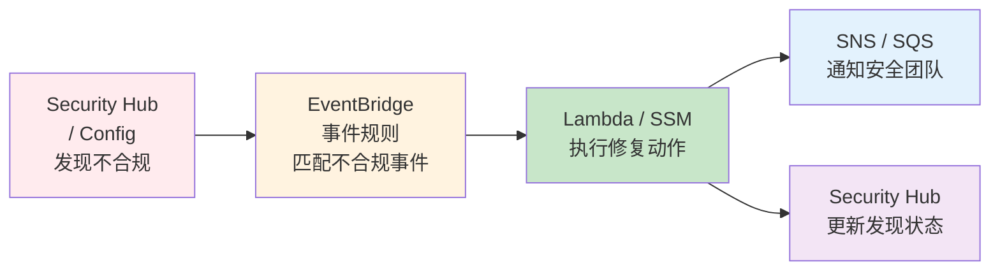
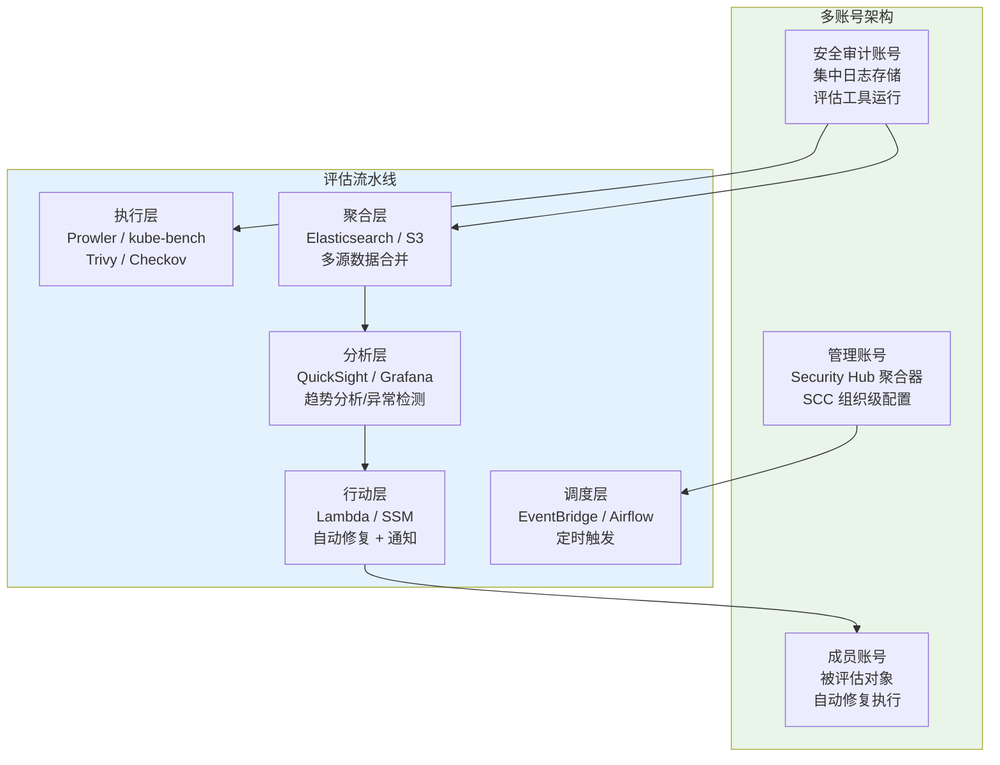

## 19.5 自动化安全评估

手动逐项检查云环境的安全配置既低效又容易遗漏。当你的云资产规模从几十台实例增长到上千台、跨多个账号和区域时，人工审计已经不再现实。自动化安全评估通过程序化方式持续扫描云环境，对照安全基线检测配置偏差，并生成结构化报告，是现代云安全运营的基石。

本节从评估方法论出发，依次覆盖 AWS、Azure、GCP、Kubernetes 四大主流环境的评估工具链，然后讲解多云统一评估、CI/CD 集成、自定义规则编写和自动修复闭环。

### 19.5.1 自动化安全评估的方法论

#### 为什么需要自动化评估

| 维度 | 手动评估 | 自动化评估 |
|------|---------|-----------|
| 覆盖范围 | 抽样检查，遗漏率高 | 全量扫描，覆盖所有资源 |
| 频率 | 季度或年度审计 | 持续/每日/每次部署 |
| 一致性 | 依赖检查人员经验 | 规则标准化，结果可复现 |
| 响应速度 | 发现到修复周期长 | 实时告警，分钟级响应 |
| 成本 | 人力密集 | 工具一次性投入，长期低成本 |
| 合规证据 | 手工收集，易出错 | 自动生成审计报告和证据链 |

#### 评估层次模型



每一层解决不同问题：配置合规是基础，确保"房子的地基没问题"；权限分析解决"谁能进哪个房间"；威胁检测是"有人闯入时警报响不响"；漏洞管理是"墙上的裂缝有没有被利用的风险"。成熟的评估体系需要四层全覆盖。

#### 主流安全基准框架

| 基准框架 | 适用场景 | 条目数量 | 维护方 |
|---------|---------|---------|-------|
| CIS Benchmarks | 通用云安全基线，AWS/Azure/GCP/K8s 各有专门版本 | 每个平台 50-300+ 条 | Center for Internet Security |
| AWS Foundational Security Best Practices | AWS 原生服务的安全检查 | 200+ 条 | AWS |
| NIST 800-53 | 美国联邦系统安全控制 | 1000+ 条 | NIST |
| SOC 2 | 服务组织审计报告 | 信任服务准则 | AICPA |
| PCI DSS | 支付卡行业数据安全 | 12 大类 300+ 子项 | PCI SSC |
| ISO 27001 | 信息安全管理体系 | 114 条控制措施 | ISO |

大多数自动化评估工具内置了上述框架的映射关系。选择基准时，从业务合规需求出发——如果处理支付数据，PCI DSS 是底线；如果面向美国联邦客户，NIST 不可回避；CIS Benchmarks 作为通用基线适合所有场景。

### 19.5.2 AWS 安全评估

AWS 拥有最成熟的第三方评估工具生态。下面从官方工具和开源工具两个维度展开。

#### AWS Security Hub — 集中式安全仪表板

Security Hub 是 AWS 原生的安全聚合服务，它从 GuardDuty、Inspector、Macie、IAM Access Analyzer 等数十个 AWS 服务收集安全发现，统一在一个控制台展示，并支持自动化修复（通过 EventBridge 触发 Lambda 或 SSM Runbook）。

```bash
# 启用 Security Hub（当前区域）
aws securityhub enable-security-hub \
  --enable-default-standards \
  --tags '{"Environment":"Production"}'

# 启用 CIS Benchmark 标准
aws securityhub batch-enable-standards \
  --standards-subscription-requests '[{"StandardsArn":"arn:aws:securityhub:::ruleset/cis-aws-foundations-benchmark/v/1.4.0"}]'

# 启用 AWS Foundational 标准
aws securityhub batch-enable-standards \
  --standards-subscription-requests '[{"StandardsArn":"arn:aws:securityhub:::standards/aws-foundational-security-best-practices/v/1.0.0"}]'

# 查询所有 CRITICAL 级别的发现
aws securityhub get-findings \
  --filters '{"SeverityLabel":[{"Value":"CRITICAL","Comparison":"EQUALS"}],"RecordState":[{"Value":"ACTIVE","Comparison":"EQUALS"}]}' \
  --max-items 50

# 查询特定资源类型的失败检查
aws securityhub get-findings \
  --filters '{"ComplianceStatus":[{"Value":"FAILED","Comparison":"EQUALS"}],"ResourceType":[{"Value":"AwsIamRole","Comparison":"EQUALS"}]}'
```

**跨账号聚合配置**：生产环境通常有多个 AWS 账号。在 Organizations 的管理账号上启用 Security Hub 作为聚合器，成员账号自动将发现上报：

```bash
# 在管理账号上启用组织级别的 Security Hub
aws securityhub create-configuration-aggregator \
  --name "org-aggregator" \
  --organization-sources '[{"RoleArn":"arn:aws:iam::ACCOUNT:role/AWSCloudFormationStackSetExecutionRole","OrganizationalUnits":["ou-xxxx-xxxxxxxx"]}]'
```

#### AWS Config — 持续合规监控

Config 持续记录 AWS 资源配置变更，并通过 Config Rules 评估合规性。它是 Security Hub 的底层数据源之一，也可以独立使用。

```bash
# 启用 Config Recorder
aws configservice put-configuration-recorder \
  --configuration-recorder name=default,roleARN=arn:aws:iam::ACCOUNT:role/aws-service-role/config.amazonaws.com/AWSServiceRoleForConfig \
  --recording-group allSupported=true,includeGlobalResourceTypes=true

# 启用托管规则：检查 S3 桶是否公开
aws configservice put-config-rule \
  --config-rule '{
    "ConfigRuleName": "s3-bucket-public-read-prohibited",
    "Source": {
      "Owner": "AWS",
      "SourceIdentifier": "S3_BUCKET_PUBLIC_READ_PROHIBITED"
    }
  }'

# 启用托管规则：检查安全组是否允许 0.0.0.0/0 入站
aws configservice put-config-rule \
  --config-rule '{
    "ConfigRuleName": "vpc-sg-open-only-to-authorized-ports",
    "Source": {
      "Owner": "AWS",
      "SourceIdentifier": "VPC_SG_OPEN_ONLY_TO_AUTHORIZED_PORTS"
    }
  }'

# 查询所有不合规资源
aws configservice get-compliance-details-by-config-rule \
  --config-rule-name s3-bucket-public-read-prohibited \
  --compliance-types NON_COMPLIANT
```

#### Prowler — 最全面的开源 AWS 安全评估工具

Prowler 是 AWS 安全评估领域的事实标准开源工具，内置 300+ 检查项，覆盖 CIS Benchmarks、AWS Foundational、NIST、PCI DSS、HIPAA 等多个框架。它通过 AWS API 直接读取配置，无需安装 agent。

```bash
# 安装
pip install prowler

# 运行所有检查（默认输出 CSV + HTML）
prowler aws

# 运行特定检查组（CIS 2.0 Level 1）
prowler aws --compliance cis_2.0_aws_level1

# 运行特定检查
prowler aws --checks check11 check12 check21

# 按严重级别过滤
prowler aws --severity critical high

# 指定输出格式（HTML + JSON + CSV）
prowler aws -M html,json,csv -o /tmp/prowler-report

# 扫描特定区域
prowler aws --region us-east-1 us-west-2

# 扫描特定服务
prowler aws --services s3 ec2 iam

# 使用自定义检查
prowler aws --checks-folder /path/to/custom/checks
```

**Prowler 检查分类解析**：

| 检查前缀 | 覆盖领域 | 典型检查内容 |
|---------|---------|------------|
| `check1` | IAM | 根账号 MFA、密码策略、访问密钥轮换 |
| `check2` | 日志 | CloudTrail 启用、日志加密、日志文件验证 |
| `check3` | 监控 | GuardDuty 启用、CloudWatch 告警配置 |
| `check4` | 网络 | 安全组规则、VPC Flow Logs、网络 ACL |
| `check5` | 存储 | S3 桶公开访问、加密、版本控制 |
| `check7` | 数据库 | RDS 加密、快照公开性、多 AZ 部署 |
| `check11` | EC2 | 实例元数据 v2、EBS 加密、AMI 共享 |
| `check13` | EKS | 集群日志、网络策略、Secret 加密 |

```bash
# 实战：运行 CIS AWS Foundations 1.5 Level 1 检查并生成报告
prowler aws \
  --compliance cis_1.5_aws_level1 \
  -M html,json \
  -o /var/reports/prowler/$(date +%Y%m%d) \
  --verbose

# 将发现推送到 AWS Security Hub
prowler aws --security-hub
```

#### CloudSploit — 轻量级多平台评估

CloudSploit（现为 Aqua Security 旗下）提供更轻量的评估方式，适合快速扫描：

```bash
# 安装
npm install cloudsploit

# 运行扫描
node index.js --config config.js

# 配置文件示例 config.js
cat > config.js << 'EOF'
module.exports = {
    credentials: {
        aws: {
            accessKeyId: process.env.AWS_ACCESS_KEY_ID,
            secretAccessKey: process.env.AWS_SECRET_ACCESS_KEY
        }
    },
    regions: ['us-east-1', 'us-west-2'],
    plugins: ['s3BucketPublic', 'iamUserMfa', 'openSSH']
};
EOF
```

#### IAM Access Analyzer — 权限路径分析

IAM Access Analyzer 是 AWS 官方的权限分析工具，能够发现哪些资源（S3 桶、KMS 密钥、IAM 角色等）被共享到了外部：

```bash
# 创建分析器（每个区域一个）
aws accessanalyzer create-analyzer \
  --analyzer-name org-analyzer \
  --type ORGANIZATION

# 查看所有外部访问发现
aws accessanalyzer list-findings \
  --analyzer-arn arn:aws:access-analyzer:us-east-1:ACCOUNT:analyzer/org-analyzer \
  --filter '{"isPublic":{"eq":["true"]}}'

# 验证 IAM 策略（生成最小权限策略）
aws iam generate-service-last-accessed-details \
  --arn arn:aws:iam::ACCOUNT:role/MyRole

# 获取生成的最小权限建议
aws iam get-service-last-accessed-details \
  --job-id JOB_ID
```

### 19.5.3 Azure 安全评估

#### Microsoft Defender for Cloud — 原生安全中心

Defender for Cloud（原 Azure Security Center）是 Azure 的一站式安全评估平台，提供安全评分、合规评估和威胁防护。

```bash
# 启用 Defender for Cloud 标准版（所有资源类型）
az security pricing create \
  -n default \
  --tier Standard

# 启用特定资源类型的 Defender
az security pricing create -n VirtualMachines --tier Standard
az security pricing create -n SqlServers --tier Standard
az security pricing create -n AppServices --tier Standard
az security pricing create -n StorageAccounts --tier Standard
az security pricing create -n KeyVaults --tier Standard
az security pricing create -n Containers --tier Standard

# 启用自动配置（自动部署 Log Analytics agent）
az security auto-provisioning-setting update \
  -n default \
  --autoProvision On

# 添加合规标准（NIST SP 800-53）
az security regulatory-compliance-standards create \
  -n "NIST SP 800-53 Rev. 4"

# 查看安全建议
az security assessment list --query "[?status.code=='Unhealthy']" -o table

# 查看安全评分
az security secure-scores list -o table
```

**Defender for Cloud 的三层评估**：



#### Azure Policy — 配置合规引擎

Azure Policy 是 Azure 的配置合规引擎，能够强制执行、审计和自动修复资源的配置偏差：

```bash
# 列出所有内置策略定义
az policy definition list --query "[?policyType=='Builtimal']" -o table

# 分配策略：禁止创建没有标签的资源
az policy assignment create \
  --name "require-tags" \
  --policy "/providers/Microsoft.Authorization/policyDefinitions/96670d01-0a4d-4649-9c89-2d3abc0a5025" \
  --params '{"tagName":{"value":"Environment"}}' \
  --scope "/subscriptions/SUB_ID"

# 分配策略：加密所有存储账户
az policy assignment create \
  --name "storage-encryption" \
  --policy "404c3081-a854-4457-ae30-26a93ef643f9" \
  --scope "/subscriptions/SUB_ID"

# 查看合规性状态
az policy state list \
  --filter "ComplianceState eq 'NonCompliant'" \
  --query "[].{Resource:resourceId,Policy:policyDefinitionName,State:complianceState}" \
  -o table

# 创建自定义策略（JSON 格式）
cat > deny-public-ip.json << 'EOF'
{
  "if": {
    "allOf": [
      {
        "field": "type",
        "equals": "Microsoft.Network/publicIPAddresses"
      },
      {
        "field": "Microsoft.Network/publicIPAddresses/publicIPAllocationMethod",
        "equals": "Static"
      }
    ]
  },
  "then": {
    "effect": "deny"
  }
}
EOF

az policy definition create \
  --name "deny-static-public-ip" \
  --rules deny-public-ip.json \
  --mode All
```

#### ScoutSuite — Azure 多服务审计

```bash
# 安装
pip install scoutsuite

# 使用 Azure CLI 凭据扫描
az login
scout azure

# 指定订阅扫描
scout azure --subscriptions sub-id-1 sub-id-2

# 指定服务
scout azure --services aad vm storage sql

# 使用服务主体认证
scout azure \
  --user-account-auth \
  --tenant TENANT_ID \
  --subscription SUBSCRIPTION_ID

# 报告默认生成在 scout-report/ 目录，用浏览器打开
python -m http.server 8080 -d scout-report/
```

### 19.5.4 GCP 安全评估

#### Security Command Center — GCP 安全中枢

SCC 是 GCP 的原生安全管理和风险评估平台，整合了 Security Health Analytics、Event Threat Detection、Web Security Scanner 等多个数据源。

```bash
# 列出组织下的所有安全发现
gcloud scc findings list organizations/ORG_ID \
  --filter="state=\"ACTIVE\" AND severity=\"HIGH\"" \
  --format="table(name,category,severity,eventTime)"

# 列出特定项目的发现
gcloud scc findings list projects/PROJECT_ID \
  --filter="state=\"ACTIVE\"" \
  --format="table(name,category,severity)"

# 按类别过滤
gcloud scc findings list organizations/ORG_ID \
  --filter="category=\"OPEN_FIREWALL\"" \
  --format="json"

# 启用 Security Health Analytics（自动扫描）
gcloud scc sources describe organizations/ORG_ID/sources/SOURCE_ID

# 查看扫描结果摘要
gcloud scc findings list organizations/ORG_ID \
  --filter="sourceProperties.sourceId=\"SECURITY_HEALTH_ANALYTICS\"" \
  --group-by="category" \
  --format="table(category,count(finding))"
```

#### Forseti — 开源 GCP 安全治理

Forseti 是 Google 开源的 GCP 安全治理工具套件，提供资产清单、配置审计、规则引擎等功能（注：Forseti 已逐渐被 SCC 取代，但仍在许多组织中使用）：

```bash
# Forseti 主要通过 Terraform 部署，核心组件包括：
# - forseti-server：服务端，负责扫描和审计
# - forseti-client：客户端，CLI 工具
# - forseti-inventory：资源清单
# - forseti-scanner：规则扫描
# - forseti-enforcer：策略强制执行

# 使用 forseti client 运行扫描
forseti scanner run

# 列出所有扫描器
forseti scanner list

# 查看违规
forseti model use MODEL_ID
forseti scanner run
forseti violation list --scanner IAM_POLICY_SCANNER
```

#### Prowler 支持 GCP（v4+）

```bash
# 使用 Prowler 扫描 GCP
prowler gcp --project-id PROJECT_ID

# 使用服务账户认证
export GOOGLE_APPLICATION_CREDENTIALS="/path/to/service-account.json"
prowler gcp --project-id PROJECT_ID --compliance cis_2.0_gcp_level1
```

### 19.5.5 Kubernetes 安全评估

Kubernetes 集群的安全评估需要覆盖控制平面配置、工作节点、网络策略、RBAC 和运行时安全。

#### kube-bench — CIS Benchmark 自动检查

kube-bench 是 Aqua Security 开发的 Kubernetes CIS Benchmark 检查工具，是 K8s 安全评估的事实标准：

```bash
# 使用 Docker 在节点上直接运行
docker run --pid=host -v /etc:/node/etc:ro -v /var:/node/var:ro \
  --net=host -ti aquasec/kube-bench:latest

# 使用 kubectl 作为 Job 运行（适合集群级扫描）
kubectl apply -f https://raw.githubusercontent.com/aquasecurity/kube-bench/main/job.yaml

# 查看扫描结果
kubectl logs kube-bench

# 检查特定节点类型
kube-bench --check-type=master    # 控制平面节点
kube-bench --check-type=worker    # 工作节点
kube-bench --check-type=etcd      # etcd 配置
kube-bench --check-type=policies  # Pod 安全策略

# 只运行特定 CIS 章节
kube-bench run --targets=1.1,1.2

# 输出 JSON 格式
kube-bench run --json

# 输出 JUnit XML（用于 CI 集成）
kube-bench run --junit
```

**kube-bench 检查覆盖领域**：

| 章节 | 主题 | 典型发现 |
|------|------|---------|
| 1 | 控制平面节点配置 | API Server 不安全端口开启、匿名认证未禁用 |
| 2 | etcd 配置 | etcd 未加密通信、peer-auto-tls 未启用 |
| 3 | 控制平面配置 | 审计日志未启用、ServiceAccount 自动挂载 |
| 4 | 工作节点配置 | kubelet 匿名认证、只读端口未关闭 |
| 5 | RBAC 和 Service Accounts | 集群管理员角色绑定过多、默认 SA 权限过大 |
| 6 | Pod 安全策略/标准 | 容器以 root 运行、特权容器未限制 |
| 7 | 网络策略和 CNI | 默认允许所有网络策略缺失 |
| 8 | Secret 管理 | Secret 未加密存储、环境变量泄露 |

#### kube-hunter — 主动攻击面发现

与 kube-bench 的配置检查不同，kube-hunter 主动探测集群的攻击面：

```bash
# 安装
pip install kube-hunter

# 远程扫描（从集群外部探测）
kube-hunter --remote <cluster-ip>

# 内部扫描（从 Pod 内部探测）
kubectl run kube-hunter --rm -it --image=aquasec/kube-hunter -- --interface

# 列出所有检测模块
kube-hunter --list

# 扫描特定端口范围
kube-hunter --remote <cluster-ip> --cidr 10.0.0.0/24

# 输出 JSON 报告
kube-hunter --remote <cluster-ip> --json
```

kube-hunter 能发现的攻击面包括：暴露的 API Server 端口（6443/8080）、未认证的 etcd、kubelet 只读端口（10255）、Dashboard 公网暴露、Kubelet API 未授权访问等。

#### Falco — 运行时威胁检测

Falco 是 CNCF 毕业项目，通过系统调用监控检测容器运行时的异常行为：

```bash
# 使用 Helm 安装
helm repo add falcosecurity https://falcosecurity.github.io/charts
helm install falco falcosecurity/falco \
  --namespace falco --create-namespace \
  --set falcosidekick.enabled=true

# 使用 Docker 运行
docker run --rm -it \
  --privileged \
  -v /var/run/docker.sock:/host/var/run/docker.sock \
  -v /proc:/host/proc:ro \
  falcosecurity/falco:latest

# 查看实时告警
falco -r /etc/falco/falco_rules.yaml

# 使用自定义规则
cat > custom-rules.yaml << 'EOF'
- rule: Detect Crypto Mining
  desc: Detect crypto mining processes in containers
  condition: >
    spawned_process and container and
    (proc.name in (xmrig, minerd, cpuminer, cgminer) or
     proc.cmdline contains "stratum+tcp://")
  output: >
    Crypto mining detected (user=%user.name container=%container.name
    process=%proc.name command=%proc.cmdline)
  priority: CRITICAL
  tags: [crypto, mining, container]
EOF

falco -r custom-rules.yaml
```

#### kubectl 安全审计命令集

除了专用工具，kubectl 本身也提供了大量安全审计能力：

```bash
# 检查集群安全配置
kubectl auth can-i --list                           # 当前用户的所有权限
kubectl auth can-i create deployments --all-namespaces  # 能否跨命名空间创建 Deployment
kubectl auth can-i '*' '*'                           # 是否有集群管理员权限

# 检查 RBAC 配置
kubectl get clusterrolebindings -o json | \
  jq '.items[] | select(.roleRef.name=="cluster-admin") | .subjects'

kubectl get roles,rolebindings --all-namespaces -o wide

# 检查 Pod 安全配置
kubectl get pods --all-namespaces -o json | \
  jq '.items[] | select(.spec.hostPID==true or .spec.hostNetwork==true or .spec.containers[].securityContext.privileged==true)' \
  | jq '.metadata.namespace + "/" + .metadata.name'

# 检查未加密的 Secrets
kubectl get secrets --all-namespaces -o json | \
  jq '.items | length'

# 检查 NetworkPolicy（应该每个命名空间都有）
for ns in $(kubectl get ns -o jsonpath='{.items[*].metadata.name}'); do
  count=$(kubectl get networkpolicies -n $ns --no-headers 2>/dev/null | wc -l)
  echo "$ns: $count network policies"
done

# 检查 ServiceAccount token 挂载
kubectl get pods --all-namespaces -o json | \
  jq '.items[] | select(.spec.automountServiceAccountToken != false) | .metadata.namespace + "/" + .metadata.name'
```

### 19.5.6 多云统一评估

当你的基础设施横跨多个云平台时，需要统一的评估视角。

#### ScoutSuite — 跨云扫描

ScoutSuite 支持 AWS、Azure、GCP、阿里云、Oracle Cloud 等多个平台：

```bash
# 安装
pip install scoutsuite

# 扫描 AWS
scout aws --services ec2 s3 iam rds

# 扫描 Azure
scout azure --subscriptions target-sub

# 扫描 GCP
scout gcp --project target-project

# 扫描阿里云
scout aliyun --services ecs oss ram

# 查看报告（自动生成 HTML 报告在 scout-report/ 目录）
python -m http.server 8080 -d scout-report/
```

ScoutSuite 的报告以颜色编码展示风险等级：红色（高危）、橙色（中危）、黄色（低危）、绿色（安全），并且对每个发现提供了详细的解释和修复建议。

#### Prowler v4 — 多云支持

Prowler v4 已经扩展到支持 AWS、Azure、GCP 三个平台：

```bash
# AWS 扫描
prowler aws

# Azure 扫描
prowler azure

# GCP 扫描
prowler gcp

# 通用选项
prowler aws -M html,json,csv --output-directory /reports
prowler aws --checks-folder /custom/checks
prowler aws --severity critical high
```

#### 多云评估仪表板架构



### 19.5.7 CI/CD 安全评估集成

将安全评估左移（Shift Left）到 CI/CD 流水线中，在代码部署前就发现安全问题。

#### GitHub Actions 示例

```yaml
# .github/workflows/security-scan.yml
name: Cloud Security Assessment

on:
  schedule:
    - cron: '0 6 * * 1'  # 每周一早上6点
  workflow_dispatch:

jobs:
  prowler-scan:
    runs-on: ubuntu-latest
    steps:
      - uses: actions/checkout@v4

      - name: Configure AWS Credentials
        uses: aws-actions/configure-aws-credentials@v4
        with:
          role-to-assume: ${{ secrets.AWS_SECURITY_ROLE_ARN }}
          aws-region: us-east-1

      - name: Install Prowler
        run: pip install prowler

      - name: Run Prowler Scan
        run: |
          prowler aws \
            --compliance cis_2.0_aws_level1 \
            -M json,html \
            -o ./reports

      - name: Check for Critical Findings
        run: |
          critical=$(cat reports/output.json | jq '[.[] | select(.Status=="FAIL" and .Severity=="critical")] | length')
          if [ "$critical" -gt 0 ]; then
            echo "::error::Found $critical critical security findings!"
            exit 1
          fi

      - name: Upload Report
        uses: actions/upload-artifact@v4
        with:
          name: prowler-report
          path: reports/

  k8s-bench:
    runs-on: ubuntu-latest
    steps:
      - name: Run kube-bench
        uses: aquasecurity/kube-bench-action@v0.2.0
        with:
          version: v0.6.0

      - name: Fail on Critical
        run: |
          fail_count=$(cat output.json | jq '.Controls[].tests[].results[] | select(.status=="FAIL") | .test_number' | wc -l)
          if [ "$fail_count" -gt 5 ]; then
            echo "::error::kube-bench found $fail_count failures"
            exit 1
          fi
```

#### Terraform + Checkov — 基础设施即代码安全

在 Terraform Plan 阶段就发现安全问题，比运行时检查更早：

```bash
# 安装 Checkov
pip install checkov

# 扫描 Terraform 目录
checkov -d ./terraform/

# 扫描并输出特定格式
checkov -d ./terraform/ --output junitxml --output-file checkov-results.xml

# 跳过特定检查
checkov -d ./terraform/ --skip-check CKV_AWS_18,CKV_AWS_20

# 使用配置文件 .checkov.yaml
cat > .checkov.yaml << 'EOF'
directory:
  - terraform/
framework:
  - terraform
skip-check:
  - CKV_AWS_18  # S3 access logging
output:
  - junitxml
output-file: checkov-results.xml
compact: true
quiet: true
EOF

# 生成 baseline（记录当前已知失败，新 PR 只报新增问题）
checkov -d ./terraform/ --compact --quiet --output baseline --output-file .checkov.baseline
```

#### 容器镜像安全扫描

```bash
# Trivy — 最流行的容器镜像扫描器
trivy image myregistry/myapp:latest
trivy image --severity HIGH,CRITICAL myregistry/myapp:latest

# 扫描 Kubernetes 集群中的所有镜像
kubectl get pods --all-namespaces -o jsonpath='{range .items[*]}{.spec.containers[*].image}{"\n"}{end}' | \
  sort -u | while read image; do
    echo "=== Scanning $image ==="
    trivy image --severity HIGH,CRITICAL "$image"
  done

# Grype — 另一个选择
grype myregistry/myapp:latest --only-fixed
```

### 19.5.8 自定义评估规则编写

当内置检查项无法满足你的业务特定安全需求时，需要编写自定义规则。

#### Prowler 自定义检查

Prowler 的检查模块遵循固定结构：

```python
# prowler/checks/custom/s3_bucket_tagging.py
"""检查 S3 桶是否具有必需标签"""

from prowler.lib.check import Check
from prowler.lib.check.models import Check_Report_AWS
from prowler.providers.aws.services.s3.s3_client import s3_client

class s3_bucket_tagging(Check):
    def execute(self):
        findings = []
        required_tags = ["Environment", "Owner", "CostCenter"]

        for bucket in s3_client.buckets:
            report = Check_Report_AWS(self.metadata())
            report.resource_id = bucket.name
            report.resource_arn = bucket.arn
            report.region = bucket.region

            if bucket.tags:
                missing_tags = [t for t in required_tags if t not in bucket.tags]
                if missing_tags:
                    report.status = "FAIL"
                    report.status_extended = f"S3 bucket {bucket.name} is missing required tags: {', '.join(missing_tags)}"
                else:
                    report.status = "PASS"
                    report.status_extended = f"S3 bucket {bucket.name} has all required tags"
            else:
                report.status = "FAIL"
                report.status_extended = f"S3 bucket {bucket.name} has no tags"

            findings.append(report)

        return findings
```

#### OPA/Rego 策略编写

Open Policy Agent（OPA）是云原生环境最流行的策略引擎，Rego 是其声明式策略语言：

```bash
# 检查 Kubernetes Pod 是否以 root 用户运行
cat > no_root_containers.rego << 'EOF'
package kubernetes.admission

deny[msg] {
    input.request.kind.kind == "Pod"
    container := input.request.object.spec.containers[_]
    not container.securityContext.runAsNonRoot
    msg := sprintf("Container %v must set runAsNonRoot to true", [container.name])
}

deny[msg] {
    input.request.kind.kind == "Pod"
    container := input.request.object.spec.containers[_]
    container.securityContext.privileged == true
    msg := sprintf("Container %v must not run in privileged mode", [container.name])
}

deny[msg] {
    input.request.kind.kind == "Pod"
    container := input.request.object.spec.containers[_]
    not container.resources.limits.memory
    msg := sprintf("Container %v must have memory limits", [container.name])
}
EOF

# 使用 conftest 测试策略
conftest test deployment.yaml --policy no_root_containers.rego

# 在 AWS 中使用 OPA 评估 Config 规则
cat > ec2_no_public_ip.rego << 'EOF'
package rules.ec2_no_public_ip

deny[msg] {
    instance := input.configuration.root_module.resources[_]
    instance.type == "aws_instance"
    instance.values.associate_public_ip_address == true
    msg := sprintf("EC2 instance %v should not have a public IP", [instance.name])
}
EOF
```

### 19.5.9 自动修复（Auto-Remediation）

发现问题是第一步，自动修复才能形成安全闭环。

#### AWS 自动修复架构



```python
# Lambda 函数：自动修复公开的 S3 桶
import boto3

def lambda_handler(event, context):
    s3 = boto3.client('s3')

    # 从 Security Hub 发现中提取桶名
    detail = event['detail']
    resource_id = detail['findings'][0]['Resources'][0]['Id']
    bucket_name = resource_id.split('/')[-1]

    # 禁用公开访问
    s3.put_public_access_block(
        Bucket=bucket_name,
        PublicAccessBlockConfiguration={
            'BlockPublicAcls': True,
            'IgnorePublicAcls': True,
            'BlockPublicPolicy': True,
            'RestrictPublicBuckets': True
        }
    )

    # 加密存储桶
    s3.put_bucket_encryption(
        Bucket=bucket_name,
        ServerSideEncryptionConfiguration={
            'Rules': [{'ApplyServerSideEncryptionByDefault': {'SSEAlgorithm': 'aws:kms'}}]
        }
    )

    # 更新 Security Hub 发现状态
    hub = boto3.client('securityhub')
    hub.batch_update_findings(
        FindingIdentifiers=[{
            'Id': detail['findings'][0]['Id'],
            'ProductArn': detail['findings'][0]['ProductArn']
        }],
        Note={'Text': 'Auto-remediated: public access blocked and encryption enabled', 'UpdatedBy': 'auto-remediation-lambda'},
        Workflow={'Status': 'RESOLVED'}
    )

    return {'statusCode': 200, 'body': f'Remediated bucket {bucket_name}'}
```

```bash
# 创建 EventBridge 规则，捕获 S3 公开访问发现
aws events put-rule \
  --name "securityhub-s3-public" \
  --event-pattern '{
    "source": ["aws.securityhub"],
    "detail-type": ["Security Hub Findings - Imported"],
    "detail": {
      "findings": {
        "Severity": {"Label": ["CRITICAL", "HIGH"]},
        "Title": [{"prefix": "S3"}],
        "Compliance": {"Status": ["FAILED"]}
      }
    }
  }'

# 将规则指向 Lambda
aws events put-targets \
  --rule "securityhub-s3-public" \
  --targets "Id"="remediation-lambda","Arn"="arn:aws:lambda:REGION:ACCOUNT:function:s3-auto-remediation"
```

#### Azure Policy 自动修复

Azure Policy 的修正任务（Remediation Task）可以自动将不合规的资源修正到合规状态：

```bash
# 创建修正任务
az policy remediation create \
  --name "remediate-storage-encryption" \
  --policy-assignment "/subscriptions/SUB_ID/providers/Microsoft.Authorization/policyAssignments/ASSIGNMENT_ID" \
  --definition-reference-id "storageEncryptionEffect"

# 查看修正任务进度
az policy remediation show \
  --name "remediate-storage-encryption"

# 列出所有修正任务
az policy remediation list -o table
```

### 19.5.10 评估报告与度量体系

自动化评估的价值不仅在于发现问题，更在于持续跟踪改进趋势。

#### 关键安全度量指标

| 指标 | 定义 | 目标值 | 度量方式 |
|------|------|-------|---------|
| 安全评分趋势 | Security Hub/Defender 综合评分 | > 80 分 | 每周记录，趋势上升 |
| 关键发现数量 | CRITICAL 级别的活跃发现 | 0 | 每日统计 |
| 平均修复时间（MTTR） | 从发现到修复的平均时间 | < 24 小时（关键） | 发现时间 vs 修复时间 |
| 合规通过率 | 通过的检查项 / 总检查项 | > 95% | 每周统计 |
| 自动修复覆盖率 | 自动修复的发现 / 总发现 | > 60% | 每月统计 |
| 新资源合规率 | 新创建资源首次检查通过率 | > 99% | CI/CD 门禁统计 |
| 配置漂移率 | 生产环境配置与基线偏差 | < 2% | Config/Policy 监控 |

#### 自动生成合规报告

```bash
#!/bin/bash
# 周度安全评估报告生成脚本

REPORT_DIR="/var/reports/security/$(date +%Y%m%d)"
mkdir -p "$REPORT_DIR"

# Prowler 评估
prowler aws \
  --compliance cis_2.0_aws_level1 \
  -M html,json \
  -o "$REPORT_DIR/prowler"

# kube-bench 评估
docker run --pid=host -v /etc:/node/etc:ro -v /var:/node/var:ro \
  aquasec/kube-bench:latest --json > "$REPORT_DIR/kube-bench.json"

# 汇总关键指标
echo "=== Weekly Security Assessment Summary ===" > "$REPORT_DIR/summary.txt"
echo "Date: $(date)" >> "$REPORT_DIR/summary.txt"
echo "" >> "$REPORT_DIR/summary.txt"

# Prowler 统计
total=$(cat "$REPORT_DIR/prowler/"*.json | jq 'length')
passed=$(cat "$REPORT_DIR/prowler/"*.json | jq '[.[] | select(.Status=="PASS")] | length')
failed=$(cat "$REPORT_DIR/prowler/"*.json | jq '[.[] | select(.Status=="FAIL")] | length')
critical=$(cat "$REPORT_DIR/prowler/"*.json | jq '[.[] | select(.Status=="FAIL" and .Severity=="critical")] | length')

echo "Prowler: $passed passed / $failed failed / $critical critical (Total: $total)" >> "$REPORT_DIR/summary.txt"

# Security Hub 统计
hub_critical=$(aws securityhub get-findings \
  --filters '{"SeverityLabel":[{"Value":"CRITICAL","Comparison":"EQUALS"}],"RecordState":[{"Value":"ACTIVE","Comparison":"EQUALS"}]}' \
  --query 'length(findings)')

echo "Security Hub Critical Findings: $hub_critical" >> "$REPORT_DIR/summary.txt"

# 上传报告
aws s3 sync "$REPORT_DIR" "s3://security-reports-bucket/weekly/$(date +%Y%m%d)/"

# 发送通知
aws sns publish \
  --topic-arn "arn:aws:sns:REGION:ACCOUNT:security-alerts" \
  --message "file://$REPORT_DIR/summary.txt" \
  --subject "Weekly Security Report - $(date +%Y-%m-%d)"
```

### 19.5.11 常见误区与纠正

| 误区 | 问题 | 正确做法 |
|------|------|---------|
| 只运行一次扫描就认为安全 | 云环境是动态的，新资源不断创建 | 建立持续评估机制（每日/每次部署） |
| 只看安全评分不看具体发现 | 评分是聚合指标，掩盖了关键细节 | 同时关注 CRITICAL 发现的绝对数量和具体修复项 |
| 所有检查都设为同等优先级 | 资源有限，不可能同时修复所有问题 | 按风险等级和业务影响排优先级 |
| 只在生产环境评估 | 开发/测试环境的配置问题会流入生产 | 全环境覆盖，CI/CD 门禁拦截 |
| 使用默认规则不自定义 | 默认规则可能包含不适用于你的场景的检查 | 根据业务需求排除误报，添加自定义检查 |
| 发现问题但不修复 | 扫描报告变成"合规文档"而非改进工具 | 建立修复 SLA 和责任人机制 |
| 忽视工具自身的安全性 | 评估工具的凭据如果泄露，就是最大的安全风险 | 使用最小权限的 IAM 角色，密钥定期轮换 |

### 19.5.12 进阶：构建企业级评估平台

对于大型组织，需要构建统一的安全评估平台：



**关键设计决策**：

1. **评估工具的 IAM 角色设计**：使用跨账号角色，管理账号中的评估工具通过 AssumeRole 访问成员账号，权限精确到只读
2. **评估频率策略**：关键资源（IAM、安全组、S3）每小时扫描；一般资源每日扫描；低频变更资源（VPC、RDS）每周扫描
3. **报告存储与保留**：评估报告存储在审计账号的加密 S3 桶中，保留期按合规要求设定（通常 1-7 年）
4. **告警分级路由**：CRITICAL → PagerDuty 立即通知；HIGH → Slack 安全频道；MEDIUM → 工单系统排期；LOW → 周报汇总
