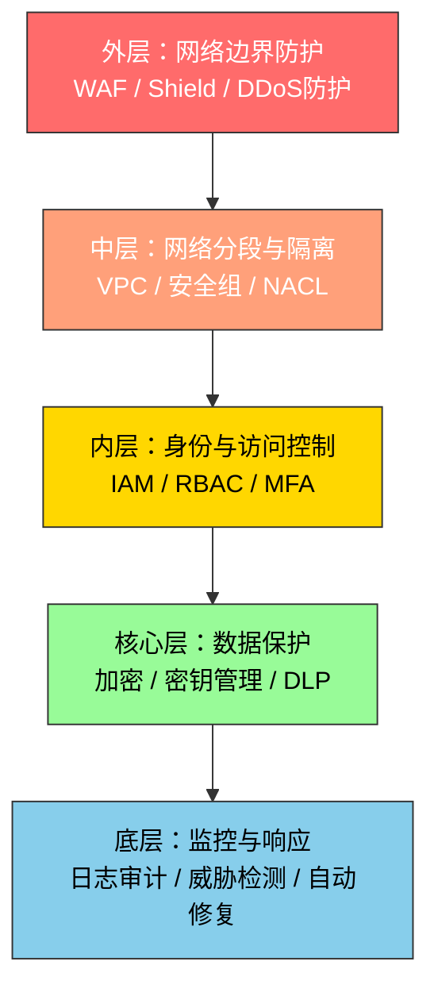
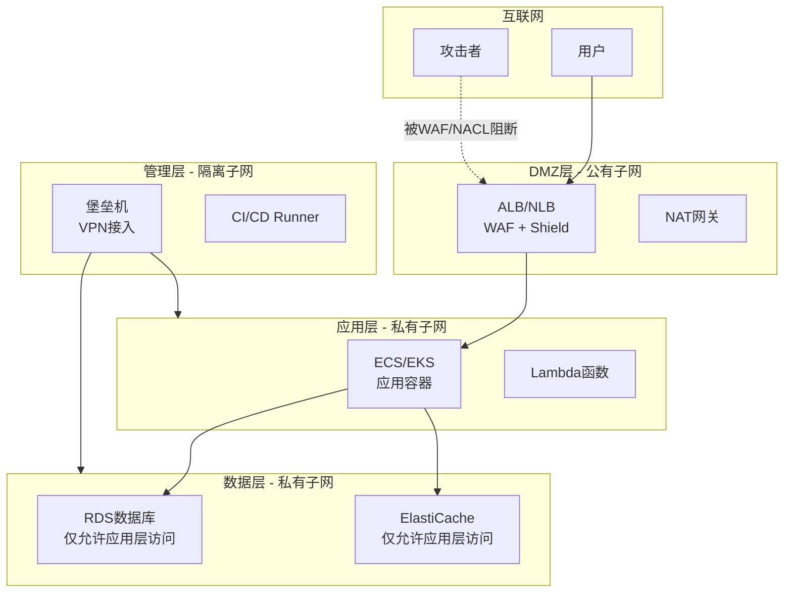
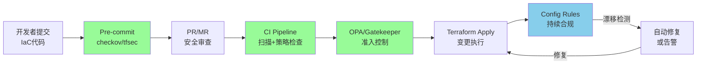
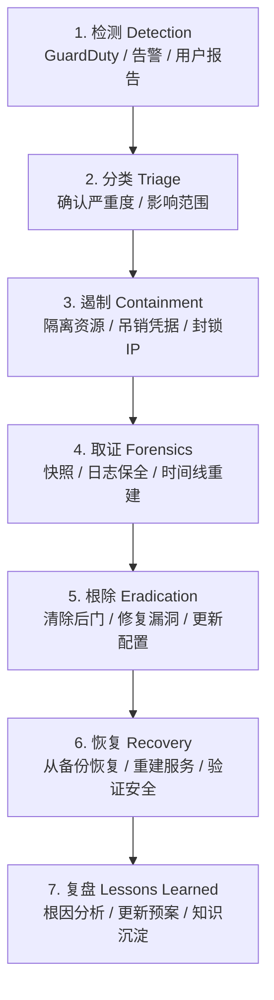
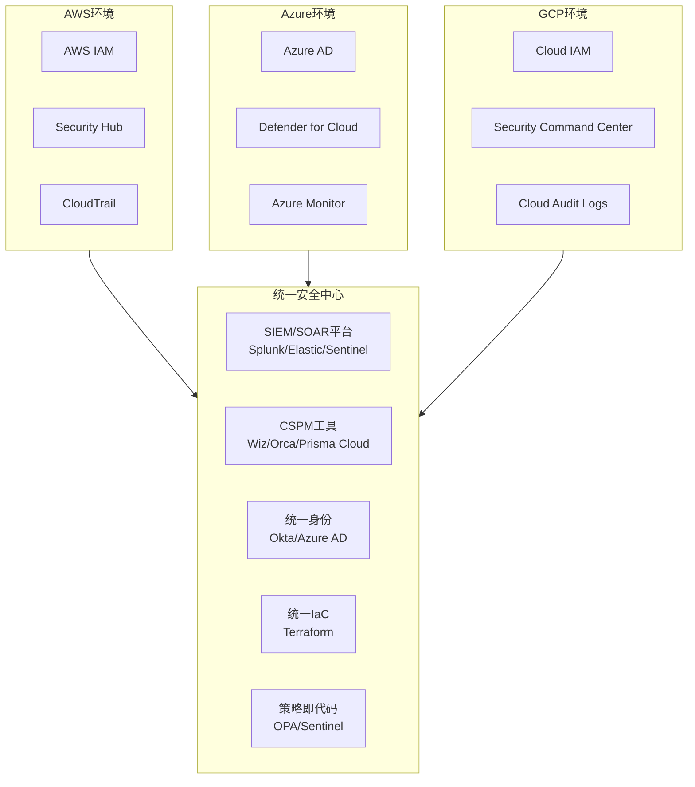

## 19.6 防御技巧汇总

本节是第19章的防御技术总纲。前五节分别从攻击者视角剖析了AWS、Azure、GCP和Kubernetes的安全弱点，本节则从防御者视角出发，将分散的防御措施整合为一套可落地的云安全防护体系。内容按照"防御哲学→分层架构→七大领域→自动化运维→成熟度评估"的逻辑展开，既可作为日常运维的速查手册，也可作为安全体系建设的路线图。

---

### 19.6.1 云安全防御哲学

在进入具体技术之前，必须先建立正确的防御思维模式。云环境与传统数据中心的本质区别在于：**边界消失、身份即边界、配置即代码、自动化是唯一出路**。

#### 核心原则一：零信任（Zero Trust）

零信任不是一个产品，而是一种架构理念。其核心假设是：**网络内部的任何实体都不应被默认信任，每一次访问请求都必须经过验证**。

零信任在云环境中的三层含义：

| 层次 | 传统思维 | 零信任思维 |
|------|----------|------------|
| 网络层 | 内网即安全，外网才需要防护 | 所有网络流量都需要加密和验证，无论内外 |
| 身份层 | 通过网络位置判断信任 | 每次请求都验证身份、设备状态、上下文 |
| 数据层 | 物理隔离即可保护数据 | 数据本身需要加密、标记、审计，独立于存储位置 |

实施路径：

1. **消除隐式信任**：VPC对等连接、安全组放行0.0.0.0/0、同一账号内资源互相可访问——这些都是隐式信任的来源，需要逐一审查和收紧。
2. **持续验证**：不仅在入口点验证，而是在服务间调用的每一个环节都进行身份验证和授权检查（如mTLS、Service Mesh）。
3. **最小权限**：权限只授予完成当前任务所需的最小集合，且设有时效性。

#### 核心原则二：纵深防御（Defense in Depth）

单点防御必然被突破。纵深防御要求在攻击链的每个阶段都设置独立的防线，任何一道防线被突破后仍有后续防线阻挡。



每一层都有独立的防御能力，即使攻击者突破了WAF，仍然面对网络隔离；即使突破了网络隔离，仍然面对严格的IAM策略；即使获取了身份凭据，数据仍然加密保护。

#### 核心原则三：安全左移（Shift Left）

安全不是部署之后才考虑的事情，而是从设计阶段就要嵌入的属性。在云环境中，"安全左移"意味着：

- **设计阶段**：威胁建模（STRIDE/LINDDUN），识别架构层面的风险
- **开发阶段**：SAST/DAST扫描，依赖项漏洞检查，密钥泄露检测
- **构建阶段**：镜像签名验证，基础镜像安全扫描，策略即代码校验
- **部署阶段**：IaC模板安全审查（Terraform Plan + OPA/Checkov），变更审批流程
- **运行阶段**：CWPP运行时保护，配置漂移检测，持续合规监控

#### 核心原则四：假设已被入侵（Assume Breach）

成熟的防御体系不会假设自己能阻挡所有攻击，而是假设攻击者已经存在于环境内部，据此设计检测和响应能力。

具体体现：
- 部署蜜罐和诱饵资源（如AWS Canary Token、Kubernetes蜜罐Pod）
- 建立完整的日志采集和关联分析能力
- 制定并定期演练事件响应计划（IR Plan）
- 维护详细的资产清单，确保异常行为可被发现

---

### 19.6.2 分层防御架构

将防御能力映射到攻击链的每个阶段，形成PDCER（预防-检测-遏制-根除-恢复）闭环。

```mermaid
graph LR
    subgraph 预防["预防 Prevention"]
        P1["IAM策略"]
        P2["网络隔离"]
        P3["加密"]
        P4["安全基线"]
    end
    
    subgraph 检测["检测 Detection"]
        D1["日志审计"]
        D2["威胁检测"]
        D3["配置监控"]
        D4["异常告警"]
    end
    
    subgraph 遏制["遏制 Containment"]
        C1["网络隔离封锁"]
        C2["凭据吊销"]
        C3["资源快照取证"]
    end
    
    subgraph 根除["根除 Eradication"]
        E1["漏洞修复"]
        E2["恶意资源清除"]
        E3["配置修正"]
    end
    
    subgraph 恢复["恢复 Recovery"]
        R1["备份恢复"]
        R2["服务重建"]
        R3["事后复盘"]
    end
    
    预防 --> 检测 --> 遏制 --> 根除 --> 恢复
    恢复 -.->|"反馈改进"| 预防
```



下面逐一展开每个阶段的具体防御措施。

---

### 19.6.3 身份与访问管理（IAM）防御

IAM是云安全的核心中的核心。在云环境中，身份就是新的边界——攻击者获取一个高权限IAM角色的密钥，就等于拿到了进入整个环境的钥匙。

#### 19.6.3.1 最小权限原则落地

最小权限听起来简单，实践中却是最难落实的原则。以下是经过验证的实施方法：

**策略审计与收紧流程**：

```bash
# AWS：获取IAM实体的实际使用权限
# 第一步：收集CloudTrail中过去90天的实际API调用
aws cloudtrail lookup-events \
  --lookup-attributes AttributeKey=Username,AttributeValue=<user> \
  --start-time $(date -d '90 days ago' --iso-8601) \
  --output json | jq '.Events[].eventSource' | sort -u

# 第二步：对比当前策略允许的权限与实际使用的权限
# 使用IAM Access Analyzer生成最小策略
aws iam create-access-preview \
  --configurations '{"iamRole":{"trustPolicy":"..."}}'

# 第三步：生成基于使用记录的最小权限策略
# 推荐工具：iamlive（监听CloudTrail生成最小策略）
iamlive --mode cloudtrail --profile prod
```

**Azure最小权限实践**：

```bash
# 使用Azure RBAC的条件访问策略限制权限范围
az role assignment create \
  --assignee <principal-id> \
  --role "Virtual Machine Contributor" \
  --scope "/subscriptions/<sub-id>/resourceGroups/<rg-name>" \
  --condition "@Resource[Microsoft.Compute/virtualMachines/tags.Environment] == 'dev'"

# 使用Azure PIM（Privileged Identity Management）实现即时提权
az rest --method POST \
  --uri "https://graph.microsoft.com/v1.0/identityGovernance/privilegedAccess/roleAssignmentScheduleRequests" \
  --body '{
    "action": "selfActivate",
    "principalId": "<user-id>",
    "roleDefinitionId": "<role-id>",
    "directoryScopeId": "/",
    "scheduleInfo": {"startDateTime": "2026-01-01T00:00:00Z", "expiration": {"type": "afterDuration", "duration": "PT4H"}}
  }'
```

**GCP最小权限实践**：

```bash
# 使用IAM Recommender分析过度授权的权限
gcloud recommender recommendations list \
  --project=<project-id> \
  --location=global \
  --recommender=google.iam.policy.Recommender \
  --format="table(name,description,primaryImpact.category)"

# 批量应用推荐的权限缩减
gcloud recommender recommendations list \
  --recommender=google.iam.policy.Recommender \
  --filter="recommenderSubtype=REMOVE_ROLE" \
  --format="value(name)" | \
  while read rec; do
    gcloud recommender recommendations mark-claimed "$rec" \
      --insight-message="Approved by security team"
  done
```

#### 19.6.3.2 多因素认证（MFA）强制策略

MFA是最有效的凭据防护措施，能阻止绝大多数凭据泄露导致的安全事件。

```bash
# AWS：强制所有IAM用户启用MFA
# 使用Service Control Policy（SCP）在组织级别强制
cat > deny-no-mfa.json << 'EOF'
{
  "Version": "2012-10-17",
  "Statement": [
    {
      "Sid": "DenyActionsWithoutMFA",
      "Effect": "Deny",
      "NotAction": [
        "iam:CreateVirtualMFADevice",
        "iam:EnableMFADevice",
        "iam:GetUser",
        "iam:ListMFADevices",
        "iam:ListVirtualMFADevices",
        "iam:ResyncMFADevice",
        "sts:GetSessionToken",
        "signin:*"
      ],
      "Resource": "*",
      "Condition": {
        "BoolIfExists": {
          "aws:MultiFactorAuthPresent": "false"
        }
      }
    }
  ]
}
EOF

# 将SCP附加到组织根
aws organizations attach-policy \
  --policy-id <policy-id> \
  --target-id <root-id>
```

**硬件安全密钥进阶**：对于高权限账户（如OrganizationAccountAccessRole的使用者），建议强制使用FIDO2硬件安全密钥（如YubiKey），而非虚拟MFA设备。硬件密钥能抵抗钓鱼攻击，虚拟MFA不能。

```bash
# AWS Identity Center（原SSO）配置FIDO2强制策略
aws sso-admin create-permission-set \
  --instance-arn <sso-instance-arn> \
  --name "HardwareMFARequired" \
  --session-duration PT8H
```

#### 19.6.3.3 凭据生命周期管理

| 阶段 | 措施 | 具体实现 |
|------|------|----------|
| 创建 | 使用IAM角色而非长期密钥 | EC2/ECS/Lambda全部使用Instance Profile/Task Role |
| 存储 | 密钥不写入代码或配置文件 | 使用Secrets Manager / Vault / 环境变量注入 |
| 使用 | 限制密钥的使用范围 | IP限制、VPC Endpoint限制、条件键约束 |
| 轮换 | 自动定期轮换 | Access Key最长90天，DB密码使用Rotation Lambda |
| 吊销 | 泄露时立即吊销 | 建立自动化吊销流程（见下文） |

```bash
# AWS：自动轮换IAM Access Key
# 步骤1：创建新密钥
NEW_KEY=$(aws iam create-access-key --user-name <user> --output json)
echo $NEW_KEY | jq -r '.AccessKey.AccessKeyId'

# 步骤2：更新应用程序使用新密钥（通过Secrets Manager）
aws secretsmanager update-secret \
  --secret-id app/credentials/<app-name> \
  --secret-string "{\"AccessKeyId\":\"$(echo $NEW_KEY | jq -r '.AccessKey.AccessKeyId')\",\"SecretAccessKey\":\"$(echo $NEW_KEY | jq -r '.AccessKey.SecretAccessKey')\"}"

# 步骤3：验证新密钥工作正常后，停用旧密钥
aws iam update-access-key \
  --user-name <user> \
  --access-key-id <old-key-id> \
  --status Inactive

# 步骤4：观察7天无异常后删除
aws iam delete-access-key --user-name <user> --access-key-id <old-key-id>
```

**凭据泄露应急响应自动化**：

```python
#!/usr/bin/env python3
"""
credential_compromise_response.py
当检测到凭据泄露时的自动响应脚本
"""
import boto3
import json

def respond_to_compromised_key(user_name, compromised_key_id):
    iam = boto3.client('iam')
    sts = boto3.client('sts')
    
    # 第一步：立即停用泄露的密钥
    iam.update_access_key(
        UserName=user_name,
        AccessKeyId=compromised_key_id,
        Status='Inactive'
    )
    print(f"[+] 停用密钥: {compromised_key_id}")
    
    # 第二步：删除该密钥
    iam.delete_access_key(
        UserName=user_name,
        AccessKeyId=compromised_key_id
    )
    print(f"[+] 删除密钥: {compromised_key_id}")
    
    # 第三步：强制终止该用户的所有会话
    iam.put_user_policy(
        UserName=user_name,
        PolicyName='EmergencyDenyAll',
        PolicyDocument=json.dumps({
            "Version": "2012-10-17",
            "Statement": [{"Effect": "Deny", "Action": "*", "Resource": "*"}]
        })
    )
    print(f"[+] 已禁止用户 {user_name} 的所有操作")
    
    # 第四步：检查CloudTrail中该密钥的最近活动
    cloudtrail = boto3.client('cloudtrail')
    events = cloudtrail.lookup_events(
        LookupAttributes=[{
            'AttributeKey': 'AccessKeyId',
            'AttributeValue': compromised_key_id
        }],
        MaxResults=50
    )
    print(f"\n[!] 以下是泄露密钥的最近活动记录（共{len(events['Events'])}条）:")
    for event in events['Events']:
        print(f"  - {event['EventTime']}: {event['EventName']} by {event['Username']}")
    
    return events
```

#### 19.6.3.4 跨账号访问安全

云环境中的跨账号访问是常见的架构需求，也是常见的安全盲区。

```bash
# AWS：安全的跨账号角色配置
# 要求源账号的特定角色才能AssumeRole，并限制条件
cat > cross-account-role.json << 'EOF'
{
  "Version": "2012-10-17",
  "Statement": [
    {
      "Effect": "Allow",
      "Principal": {
        "AWS": "arn:aws:iam::123456789012:role/AllowedRole"
      },
      "Action": "sts:AssumeRole",
      "Condition": {
        "StringEquals": {
          "sts:ExternalId": "unique-external-id-for-this-trust"
        },
        "IpAddress": {
          "aws:SourceIp": ["203.0.113.0/24"]
        },
        "StringLike": {
          "aws:RequestedRegion": "us-east-1"
        }
      }
    }
  ]
}
EOF
```

**跨账号安全检查清单**：

- [ ] 每个跨账号信任关系都有唯一的ExternalId
- [ ] 信任的Principal限定到具体角色/用户，不使用账号根ARN
- [ ] 设置条件键限制来源IP、区域、时间窗口
- [ ] 定期审查Organizations中的信任关系
- [ ] 使用AWS RAM（Resource Access Manager）替代直接跨账号资源共享

---

### 19.6.4 网络安全防御

#### 19.6.4.1 网络分段与隔离

网络分段是阻止攻击横向移动的关键手段。云环境中的网络隔离需要在多个层次实施。



**VPC安全配置最佳实践**：

```bash
# 1. 创建VPC时禁用自动分配公网IP
aws ec2 create-vpc --cidr-block 10.0.0.0/16 \
  --tag-specifications 'ResourceType=vpc,Tags=[{Key=Name,Value=production-vpc}]'

# 2. 配置NACL（Network ACL）作为额外的网络层防护
# Web子网的NACL - 仅允许HTTP/HTTPS和临时端口返回
aws ec2 create-network-acl-entry \
  --network-acl-id <nacl-id> \
  --rule-number 100 \
  --protocol tcp \
  --port-range From=443,To=443 \
  --cidr-block 0.0.0.0/0 \
  --rule-action allow \
  --ingress

# 3. 配置VPC Endpoint避免流量经过公网
aws ec2 create-vpc-endpoint \
  --vpc-id <vpc-id> \
  --service-name com.amazonaws.<region>.s3 \
  --route-table-ids <rtb-id> \
  --policy-document file://s3-endpoint-policy.json

# 4. 启用VPC Flow Logs
aws ec2 create-flow-logs \
  --resource-type VPC \
  --resource-ids <vpc-id> \
  --traffic-type ALL \
  --log-destination-type cloud-watch-logs \
  --log-group-name /vpc/flowlogs \
  --deliver-logs-permission-arn <iam-role-arn>
```

#### 19.6.4.2 安全组与防火墙规则管理

安全组是云环境中的虚拟防火墙，其配置直接决定了网络暴露面。

```bash
# 审计所有开放的安全组规则
aws ec2 describe-security-groups \
  --query 'SecurityGroups[?IpPermissions[?IpRanges[?CidrIp==`0.0.0.0/0`]]].[GroupId,GroupName,IpPermissions]' \
  --output table

# 使用AWS Config自动检测不合规的安全组
aws configservice put-config-rule \
  --config-rule '{
    "ConfigRuleName": "restricted-ssh",
    "Source": {
      "Owner": "AWS",
      "SourceIdentifier": "INCOMING_SSH_DISABLED"
    }
  }'

# 使用Config Remediation自动修复
aws configservice put-remediation-configurations \
  --remediation-configurations '[{
    "ConfigRuleName": "restricted-ssh",
    "TargetType": "SSM_DOCUMENT",
    "TargetId": "AWS-DisablePublicAccessForSecurityGroup",
    "TargetVersion": "1",
    "Parameters": {
      "AutomationAssumeRole": {"StaticValue": {"Values": ["<role-arn>"]}},
      "GroupId": {"ResourceValue": {"Value": "RESOURCE_ID"}}
    },
    "MaximumAutomaticAttempts": 3,
    "RetryAttemptSeconds": 60
  }]'
```

**安全组设计模式**：

| 环境类型 | 设计模式 | 说明 |
|----------|----------|------|
| 生产环境 | 三层隔离 | Web层、App层、DB层各自独立安全组，逐层放行 |
| 预发布环境 | 生产镜像 | 与生产相同的安全组配置，但允许测试IP访问 |
| 开发环境 | 宽松但有界 | 允许开发团队访问，但禁止访问生产环境 |
| 跨账号 | 中心化管理 | 使用AWS Firewall Manager统一管理所有账号的安全组 |

#### 19.6.4.3 DDoS防护与WAF配置

```bash
# AWS WAF规则配置示例：防护OWASP Top 10
aws wafv2 create-web-acl \
  --name "ProductionWebACL" \
  --scope REGIONAL \
  --default-action '{"Allow":{}}' \
  --rules '[
    {
      "Name": "AWS-AWSManagedRulesCommonRuleSet",
      "Priority": 1,
      "Statement": {
        "ManagedRuleGroupStatement": {
          "VendorName": "AWS",
          "Name": "AWSManagedRulesCommonRuleSet"
        }
      },
      "Action": {"Block":{}},
      "VisibilityConfig": {
        "SampledRequestsEnabled": true,
        "CloudWatchMetricsEnabled": true,
        "MetricName": "CommonRuleSet"
      }
    },
    {
      "Name": "RateLimitRule",
      "Priority": 2,
      "Statement": {
        "RateBasedStatement": {
          "Limit": 2000,
          "AggregateKeyType": "IP"
        }
      },
      "Action": {"Block":{}},
      "VisibilityConfig": {
        "SampledRequestsEnabled": true,
        "CloudWatchMetricsEnabled": true,
        "MetricName": "RateLimit"
      }
    },
    {
      "Name": "BlockKnownBadIPs",
      "Priority": 3,
      "Statement": {
        "IPSetReferenceStatement": {
          "Arn": "<ip-set-arn>"
        }
      },
      "Action": {"Block":{}},
      "VisibilityConfig": {
        "SampledRequestsEnabled": true,
        "CloudWatchMetricsEnabled": true,
        "MetricName": "BadIPs"
      }
    }
  ]' \
  --visibility-config '{
    "SampledRequestsEnabled": true,
    "CloudWatchMetricsEnabled": true,
    "MetricName": "ProductionWebACL"
  }'
```

**Azure WAF配置**：

```bash
# Azure Front Door WAF策略
az network front-door waf-policy create \
  --name "ProductionWAF" \
  --resource-group <rg-name> \
  --sku Premium_AzureFrontDoor \
  --mode Prevention

# 启用OWASP规则集
az network front-door waf-policy managed-rule-set add \
  --policy-name "ProductionWAF" \
  --resource-group <rg-name> \
  --type OWASP \
  --version 3.2

# 配置自定义速率限制
az network front-door waf-policy rule create \
  --policy-name "ProductionWAF" \
  --resource-group <rg-name> \
  --name "RateLimit" \
  --rule-type RateLimitRule \
  --action Block \
  --priority 1 \
  --match-condition RemoteAddr IP MatchAny 203.0.113.0/24 \
  --rate-limit-threshold 1000 \
  --rate-limit-duration 1
```

---

### 19.6.5 数据安全防御

#### 19.6.5.1 加密策略全覆盖

数据加密是云安全的最后一道防线——即使攻击者获取了存储介质的访问权，没有密钥就无法读取数据。

**加密状态全景**：

| 数据状态 | 加密方式 | AWS实现 | Azure实现 | GCP实现 |
|----------|----------|---------|-----------|---------|
| 传输中（In Transit） | TLS 1.2+ / mTLS | ALB HTTPS监听、VPC Endpoint | Application Gateway TLS | Cloud Load Balancer TLS |
| 静态（At Rest） | AES-256 / KMS | S3 SSE-KMS、EBS加密 | Storage Service Encryption | CMEK for GCS/BQ |
| 使用中（In Use） | 内存加密 / 可信执行 | Nitro Enclaves | Confidential Computing | Confidential VMs |

```bash
# AWS：全账户默认加密策略
# 第一步：启用S3默认加密（Bucket级别）
aws s3api put-bucket-encryption \
  --bucket <bucket-name> \
  --server-side-encryption-configuration '{
    "Rules": [
      {
        "ApplyServerSideEncryptionByDefault": {
          "SSEAlgorithm": "aws:kms",
          "KMSMasterKeyID": "alias/s3-data-key"
        },
        "BucketKeyEnabled": true
      }
    ]
  }'

# 第二步：启用EBS默认加密（账户级别）
aws ec2 enable-ebs-encryption-by-default

# 第三步：要求所有新RDS实例默认加密
aws rds create-db-instance \
  --db-instance-identifier encrypted-db \
  --storage-encrypted \
  --kms-key-id alias/rds-data-key \
  --db-instance-class db.t3.micro \
  --engine mysql
```

#### 19.6.5.2 密钥管理最佳实践

密钥管理是加密体系的基石。密钥管理不当，加密形同虚设。

```bash
# KMS密钥策略：实施职责分离
# 密钥管理员只能管理密钥，不能使用密钥加密/解密数据
# 数据使用者只能使用密钥，不能管理密钥
cat > kms-key-policy.json << 'EOF'
{
  "Version": "2012-10-17",
  "Statement": [
    {
      "Sid": "KeyAdmins",
      "Effect": "Allow",
      "Principal": {"AWS": "arn:aws:iam::123456789012:role/KeyAdmin"},
      "Action": [
        "kms:Create*","kms:Describe*","kms:Enable*","kms:List*",
        "kms:Put*","kms:Update*","kms:Revoke*","kms:Disable*",
        "kms:Get*","kms:Delete*","kms:TagResource","kms:UntagResource",
        "kms:ScheduleDeletion","kms:CancelKeyDeletion"
      ],
      "Resource": "*"
    },
    {
      "Sid": "KeyUsers",
      "Effect": "Allow",
      "Principal": {"AWS": "arn:aws:iam::123456789012:role/AppRole"},
      "Action": [
        "kms:Encrypt","kms:Decrypt","kms:ReEncrypt*",
        "kms:GenerateDataKey*","kms:DescribeKey"
      ],
      "Resource": "*",
      "Condition": {
        "StringEquals": {
          "kms:ViaService": "s3.<region>.amazonaws.com"
        }
      }
    }
  ]
}
EOF
```

**密钥轮换策略**：

| 密钥类型 | 轮换周期 | 实施方式 |
|----------|----------|----------|
| KMS CMK（客户管理密钥） | 1年（自动轮换） | KMS内置自动轮换功能 |
| 数据库密码 | 90天 | Secrets Manager Rotation Lambda |
| IAM Access Key | 90天 | 自动化脚本 + 告警 |
| TLS证书 | 90天（推荐） | ACM自动续期 / cert-manager |
| SSH密钥 | 180天 | 堡垒机密钥管理 |

#### 19.6.5.3 敏感数据发现与分类

不了解数据在哪里，就无法保护它。敏感数据发现是数据安全的前提。

```bash
# AWS Macie：自动发现和分类S3中的敏感数据
aws macie2 create-classification-job \
  --name "QuarterlySensitiveDataScan" \
  --job-type SCHEDULED \
  --s3-job-definition '{
    "bucketDefinitions": [
      {
        "accountId": "123456789012",
        "buckets": ["prod-data-bucket", "customer-docs-bucket"]
      }
    ]
  }' \
  --schedule-frequency '{"weeklySchedule": {"dayOfWeek": "SUNDAY"}}' \
  --managed-data-identifier-selector "ALL"

# 检查Macie发现的敏感数据
aws macie2 find-findings \
  --finding-criteria '{
    "criterion": {
      "severity.score": {"gte": 7},
      "category": {"eq": "CLASSIFICATION"}
    }
  }' \
  --sort-criteria '{"attributeName":"severity","orderBy":"DESC"}'
```

---

### 19.6.6 计算安全防御

#### 19.6.6.1 EC2/VM实例安全加固

```bash
# AWS Systems Manager：自动化实例补丁管理
# 创建Patch Baseline
aws ssm create-patch-baseline \
  --name "ProductionPatchBaseline" \
  --operating-system AMAZON_LINUX_2 \
  --approval-rules '{
    "PatchRules": [
      {
        "PatchFilterGroup": {
          "PatchFilters": [{"Key":"CLASSIFICATION","Values":["Security","Bugfix"]}]
        },
        "ApproveAfterDays": 7,
        "ComplianceLevel": "CRITICAL"
      }
    ]
  }'

# 按计划执行补丁
aws ssm create-maintenance-window \
  --name "WeeklyPatching" \
  --schedule "cron(0 2 ? * SUN *)" \
  --duration 4 \
  --cutoff 1 \
  --allow-unassociated-targets
```

**实例安全检查清单**：

```bash
# 实例安全加固脚本（适用于Amazon Linux 2/Ubuntu）
#!/bin/bash

# 1. 更新系统补丁
yum update -y --security

# 2. 禁用不需要的服务
systemctl disable telnet xinetd rsh rlogin 2>/dev/null

# 3. 配置SSH安全
cat >> /etc/ssh/sshd_config << 'SSHEOF'
PermitRootLogin no
PasswordAuthentication no
MaxAuthTries 3
ClientAliveInterval 300
ClientAliveCountMax 2
Protocol 2
AllowAgentForwarding no
AllowTcpForwarding no
X11Forwarding no
SSHEOF
systemctl restart sshd

# 4. 配置防火墙
iptables -P INPUT DROP
iptables -P FORWARD DROP
iptables -P OUTPUT ACCEPT
iptables -A INPUT -i lo -j ACCEPT
iptables -A INPUT -m state --state ESTABLISHED,RELATED -j ACCEPT
iptables -A INPUT -p tcp --dport 22 -j ACCEPT

# 5. 配置审计日志
cat >> /etc/audit/rules.d/audit.rules << 'AUDITEOF'
-w /etc/passwd -p wa -k identity
-w /etc/shadow -p wa -k identity
-w /etc/sudoers -p wa -k identity
-w /var/log/ -p wa -k logs
AUDITEOF
systemctl restart auditd

# 6. 安装和配置主机入侵检测
yum install -y aide
aide --init
mv /var/lib/aide/aide.db.new.gz /var/lib/aide/aide.db.gz
```

#### 19.6.6.2 Lambda/Serverless安全

Serverless架构带来了新的攻击面和防御需求。

```python
# Lambda函数安全配置示例
import json
import os
import re
from botocore.config import Config

def lambda_handler(event, context):
    """
    安全的Lambda函数模板
    包含：输入验证、最小权限、密钥管理、日志记录
    """
    # 1. 输入验证（防止注入攻击）
    user_input = event.get('queryStringParameters', {}).get('query', '')
    if not re.match(r'^[a-zA-Z0-9\s\-_]{1,100}$', user_input):
        return {
            'statusCode': 400,
            'body': json.dumps({'error': 'Invalid input'})
        }
    
    # 2. 使用环境变量存储配置，不硬编码
    table_name = os.environ['DYNAMODB_TABLE']  # 非敏感配置用环境变量
    
    # 3. 敏感配置从Secrets Manager获取
    secret = get_secret(os.environ['SECRET_ARN'])
    
    # 4. 使用最小权限的boto3配置
    config = Config(
        retries={'max_attempts': 2, 'mode': 'standard'},
        connect_timeout=5,
        read_timeout=10
    )
    
    # 5. 业务逻辑...
    
    # 6. 日志中不记录敏感信息
    print(f"Request processed. Input length: {len(user_input)}")
    
    return {'statusCode': 200, 'body': json.dumps({'result': 'ok'})}
```

**Lambda安全配置检查**：

```bash
# 检查所有Lambda函数的安全配置
aws lambda list-functions --query 'Functions[].{
  Name: FunctionName,
  Runtime: Runtime,
  VPC: VpcConfig.VpcId,
  EnvVars: Environment.Variables,
  Timeout: Timeout,
  MemorySize: MemorySize,
  ReservedConcurrentExecutions: ReservedConcurrentExecutions
}' --output table

# 检查过时的运行时版本（如Python 2.7、Node.js 12等）
aws lambda list-functions \
  --query 'Functions[?Runtime==`python2.7` || Runtime==`nodejs12.x`].[FunctionName,Runtime]' \
  --output table
```

---

### 19.6.7 容器与Kubernetes安全防御

#### 19.6.7.1 容器镜像安全

容器镜像是供应链攻击的主要入口。从镜像构建到运行的每一步都需要安全控制。

```bash
# 1. 使用最小基础镜像
# 不要用 ubuntu:latest，使用 distroless 或 alpine
FROM gcr.io/distroless/static-debian12:nonroot
COPY --from=builder /app/server /server
USER nonroot:nonroot
ENTRYPOINT ["/server"]

# 2. 使用Trivy扫描镜像漏洞
trivy image --severity HIGH,CRITICAL --exit-code 1 myapp:latest

# 3. 使用Cosign签名验证镜像来源
cosign sign --key cosign.key myregistry.io/myapp:v1.0
cosign verify --key cosign.pub myregistry.io/myapp:v1.0

# 4. 使用OPA/Gatekeeper在K8s层面强制镜像策略
cat > image-policy.yaml << 'EOF'
apiVersion: constraints.gatekeeper.sh/v1beta1
kind: K8sAllowedRepos
metadata:
  name: allowed-repos
spec:
  match:
    kinds:
      - apiGroups: [""]
        kinds: ["Pod"]
  parameters:
    repos:
      - "gcr.io/mycompany/"
      - "gcr.io/distroless/"
EOF
```

#### 19.6.7.2 Kubernetes集群安全加固

```yaml
# Pod Security Standards（PSS）- 在namespace级别强制
apiVersion: v1
kind: Namespace
metadata:
  name: production
  labels:
    pod-security.kubernetes.io/enforce: restricted
    pod-security.kubernetes.io/audit: restricted
    pod-security.kubernetes.io/warn: restricted
---
# 安全的Pod模板
apiVersion: v1
kind: Pod
metadata:
  name: secure-pod
spec:
  automountServiceAccountToken: false  # 不自动挂载SA Token
  securityContext:
    runAsNonRoot: true
    runAsUser: 65534
    runAsGroup: 65534
    fsGroup: 65534
    seccompProfile:
      type: RuntimeDefault
  containers:
  - name: app
    image: gcr.io/mycompany/app:v1.0
    securityContext:
      allowPrivilegeEscalation: false
      readOnlyRootFilesystem: true
      capabilities:
        drop:
          - ALL
    resources:
      limits:
        cpu: "500m"
        memory: "256Mi"
      requests:
        cpu: "100m"
        memory: "128Mi"
    volumeMounts:
    - name: tmp
      mountPath: /tmp
  volumes:
  - name: tmp
    emptyDir:
      sizeLimit: "100Mi"
```

**Kubernetes安全加固检查脚本**：

```bash
#!/bin/bash
# k8s-security-audit.sh - Kubernetes安全审计脚本

echo "=== 1. 检查特权容器 ==="
kubectl get pods --all-namespaces -o json | \
  jq -r '.items[] | select(.spec.containers[].securityContext.privileged==true) | 
  "\(.metadata.namespace)/\(.metadata.name)"'

echo "=== 2. 检查hostPID/hostNetwork/hostIPC ==="
kubectl get pods --all-namespaces -o json | \
  jq -r '.items[] | select(.spec.hostPID==true or .spec.hostNetwork==true or .spec.hostIPC==true) | 
  "\(.metadata.namespace)/\(.metadata.name)"'

echo "=== 3. 检查默认ServiceAccount自动挂载 ==="
kubectl get serviceaccounts --all-namespaces -o json | \
  jq -r '.items[] | select(.automountServiceAccountToken!=false) | 
  "\(.metadata.namespace)/\(.metadata.name)"'

echo "=== 4. 检查Secret是否以环境变量方式挂载 ==="
kubectl get pods --all-namespaces -o json | \
  jq -r '.items[] | .spec.containers[] | 
  select(.env[]?.valueFrom.secretKeyRef) | 
  "ENV: \(.name)"'

echo "=== 5. 检查RBAC过度授权 ==="
kubectl get clusterrolebindings -o json | \
  jq -r '.items[] | select(.subjects[]?.name=="system:anonymous") | 
  "CRB: \(.metadata.name) -> \(.roleRef.name)"'

echo "=== 6. 检查etcd加密配置 ==="
kubectl get apiserver -o json | \
  jq -r '.items[0].spec.encryption | 
  if . then "Encryption: Enabled" else "Encryption: NOT CONFIGURED" end' 2>/dev/null || \
  echo "无法检查etcd加密配置（需要集群管理员权限）"

echo "=== 7. 检查网络策略 ==="
for ns in $(kubectl get namespaces -o jsonpath='{.items[*].metadata.name}'); do
  np_count=$(kubectl get networkpolicies -n $ns --no-headers 2>/dev/null | wc -l)
  if [ "$np_count" -eq 0 ]; then
    echo "WARNING: 命名空间 $ns 没有NetworkPolicy"
  fi
done
```

#### 19.6.7.3 Service Mesh安全（mTLS）

Service Mesh（如Istio、Linkerd）能在服务间自动实施mTLS，确保所有Pod间通信都是加密和认证的。

```yaml
# Istio：强制全局mTLS
apiVersion: security.istio.io/v1beta1
kind: PeerAuthentication
metadata:
  name: default
  namespace: istio-system  # 根命名空间 = 全局策略
spec:
  mtls:
    mode: STRICT
---
# 细粒度授权策略
apiVersion: security.istio.io/v1beta1
kind: AuthorizationPolicy
metadata:
  name: productpage-policy
  namespace: default
spec:
  selector:
    matchLabels:
      app: productpage
  rules:
  - from:
    - source:
        principals: ["cluster.local/ns/default/sa/bookinfo-reviews"]
    to:
    - operation:
        methods: ["GET"]
        paths: ["/api/v1/products"]
```

---

### 19.6.8 日志、监控与威胁检测

#### 19.6.8.1 日志采集架构

没有日志就没有检测能力。云环境的日志需要覆盖控制面、数据面和应用面三个层次。

```mermaid
graph LR
    subgraph Sources["日志来源"]
        CloudTrail["CloudTrail<br/>控制面API"]
        VPCFlow["VPC Flow Logs<br/>网络流量"]
        S3Access["S3 Access Logs<br/>存储访问"]
        WAF["WAF Logs<br/>Web攻击"]
        App["应用日志<br/>Stdout/File"]
        K8s["K8s审计日志<br/>集群操作"]
    end
    
    subgraph Processing["日志处理"]
        CW["CloudWatch<br/>日志组"]
        Firehose["Kinesis Firehose<br/>实时流"]
    end
    
    subgraph Storage["日志存储"]
        S3Log["S3日志桶<br/>长期存储（加密+不可变）"]
        OpenSearch["OpenSearch<br/>实时检索"]
    end
    
    subgraph Analysis["分析与告警"]
        Athena["Athena<br/>SQL查询"]
        GuardDuty["GuardDuty<br/>威胁检测"]
        SIEM["SIEM<br/>关联分析"]
    end
    
    Sources --> Processing
    Processing --> Storage
    Storage --> Analysis
```



```bash
# 配置CloudTrail全区域追踪，日志不可篡改
aws cloudtrail create-trail \
  --name "org-trail" \
  --s3-bucket-name "org-cloudtrail-logs" \
  --is-multi-region-trail \
  --enable-log-file-validation \
  --kms-key-id alias/cloudtrail-key \
  --is-organization-trail

# 启用S3日志桶的Object Lock（防止日志被删除）
aws s3api put-object-lock-configuration \
  --bucket org-cloudtrail-logs \
  --object-lock-configuration '{
    "ObjectLockEnabled": true,
    "Rule": {
      "DefaultRetention": {
        "Mode": "COMPLIANCE",
        "Years": 2
      }
    }
  }'
```

#### 19.6.8.2 威胁检测服务配置

```bash
# 启用Amazon GuardDuty
aws guardduty create-detector \
  --enable \
  --finding-publishing-frequency FIFTEEN_MINUTES \
  --data-sources '{
    "S3Logs": {"Enable": true},
    "Kubernetes": {"AuditLogs": {"Enable": true}},
    "MalwareProtection": {"ScanEc2InstanceWithFindings": {"EbsVolumes": {"Enable": true}}}
  }'

# 配置GuardDuty发现的自动响应
# 当检测到高严重度发现时，自动隔离受影响资源
cat > guardduty-response-lambda.py << 'PYEOF'
import boto3
import json

def lambda_handler(event, context):
    finding = event['detail']
    severity = finding['severity']
    finding_type = finding['type']
    
    if severity >= 7:  # 高严重度
        ec2 = boto3.client('ec2')
        
        # 提取受影响的实例ID
        resource = finding['resource'].get('instanceDetails', {})
        instance_id = resource.get('instanceId')
        
        if instance_id:
            # 隔离实例：移入隔离安全组
            ec2.modify_instance_attribute(
                InstanceId=instance_id,
                Groups=['sg-isolation']  # 仅允许出站到日志服务器
            )
            print(f"[ALERT] 实例 {instance_id} 已隔离，原因: {finding_type}")
            
            # 创建实例快照用于取证
            volumes = ec2.describe_volumes(
                Filters=[{'Name': 'attachment.instance-id', 'Values': [instance_id]}]
            )['Volumes']
            for vol in volumes:
                ec2.create_snapshot(
                    VolumeId=vol['VolumeId'],
                    Description=f'Forensic snapshot - GuardDuty finding {finding["id"]}'
                )
PYEOF
```

#### 19.6.8.3 告警与响应矩阵

| 告警类型 | 严重度 | 响应时间 | 自动化响应 | 人工确认 |
|----------|--------|----------|------------|----------|
| Root账户登录 | P0-紧急 | 立即 | 页面通知+Slack+冻结会话 | 必须 |
| 新Region创建资源 | P1-高 | 15分钟 | 隔离资源+页面通知 | 必须 |
| 安全组开放0.0.0.0/0 | P1-高 | 15分钟 | 自动回滚配置变更 | 事后审查 |
| 异常API调用模式 | P2-中 | 1小时 | Slack通知+记录 | 排班确认 |
| 密钥即将过期 | P3-低 | 24小时 | Jira工单+邮件 | 自动处理 |
| 配置漂移（非关键） | P4-信息 | 72小时 | 周报汇总 | 季度审查 |

---

### 19.6.9 基础设施即代码（IaC）安全

#### 19.6.9.1 IaC安全扫描

云配置错误是云安全事件的首要原因。将安全检查嵌入IaC流程，能在部署前就拦截配置问题。

```bash
# Checkov：扫描Terraform/CloudFormation模板
checkov -d terraform/ --framework terraform \
  --check CKV_AWS_18,CKV_AWS_20,CKV_AWS_57 \
  --output junitxml > checkov-results.xml

# tfsec：专注于Terraform的安全扫描
tfsec terraform/ \
  --exclude aws-s3-enable-bucket-logging \
  --format json --out tfsec-results.json

# OPA/Conftest：自定义策略即代码
cat > policy/s3_bucket.rego << 'REGO'
package main

deny[msg] {
    resource := input.resource_changes[_]
    resource.type == "aws_s3_bucket"
    resource.change.after.acl == "public-read"
    msg := sprintf("S3 bucket '%s' has public-read ACL", [resource.name])
}

deny[msg] {
    resource := input.resource_changes[_]
    resource.type == "aws_s3_bucket"
    not resource.change.after.server_side_encryption_configuration
    msg := sprintf("S3 bucket '%s' missing encryption configuration", [resource.name])
}
REGO

# 在CI/CD中集成
conftest test terraform/tfplan.json --policy policy/
```

#### 19.6.9.2 GitOps安全流程



---

### 19.6.10 事件响应（Incident Response）

#### 19.6.10.1 云安全事件响应流程



#### 19.6.10.2 事件响应工具箱

```bash
# 工具1：快速取证 - 冻结并快照受影响实例
forensic_isolate() {
    local INSTANCE_ID=$1
    
    # 记录实例当前状态
    aws ec2 describe-instances --instance-ids $INSTANCE_ID > /tmp/pre-isolation-$INSTANCE_ID.json
    
    # 隔离到取证安全组
    aws ec2 modify-instance-attribute \
        --instance-id $INSTANCE_ID \
        --groups sg-forensic-isolation
    
    # 创建所有附加卷的快照
    for VOL in $(aws ec2 describe-volumes \
        --filters "Name=attachment.instance-id,Values=$INSTANCE_ID" \
        --query 'Volumes[].VolumeId' --output text); do
        aws ec2 create-snapshot --volume-id $VOL \
            --description "Forensic: $INSTANCE_ID $(date --iso-8601)"
    done
    
    # 停止实例（保存内存状态在EBS中）
    aws ec2 stop-instances --instance-ids $INSTANCE_ID --hibernate
    
    echo "[+] 实例 $INSTANCE_ID 已隔离并快照"
}

# 工具2：日志时间线重建
build_timeline() {
    local START_TIME=$1
    local END_TIME=$2
    local PRINCIPAL=$3
    
    echo "=== API调用时间线 ==="
    aws cloudtrail lookup-events \
        --start-time "$START_TIME" \
        --end-time "$END_TIME" \
        --lookup-attributes "AttributeKey=Username,AttributeValue=$PRINCIPAL" \
        --query 'Events[].{Time:EventTime,Event:EventName,Source:EventSource,Resources:Resources}' \
        --output table
    
    echo "=== 网络连接记录 ==="
    aws logs filter-log-events \
        --log-group-name /vpc/flowlogs \
        --start-time $(date -d "$START_TIME" +%s000) \
        --end-time $(date -d "$END_TIME" +%s000) \
        --filter-pattern "{$.srcAddr = \"$PRINCIPAL_IP\"}" \
        --output table
}

# 工具3：快速凭据吊销
emergency_revoke_all() {
    local USER_NAME=$1
    
    # 删除所有Access Key
    for KEY in $(aws iam list-access-keys --user-name $USER_NAME \
        --query 'AccessKeyMetadata[].AccessKeyId' --output text); do
        aws iam delete-access-key --user-name $USER_NAME --access-key-id $KEY
    done
    
    # 删除所有控制台密码
    aws iam delete-login-profile --user-name $USER_NAME 2>/dev/null
    
    # 吊销所有活跃会话
    aws iam put-user-policy --user-name $USER_NAME \
        --policy-name EmergencyDeny \
        --policy-document '{"Version":"2012-10-17","Statement":[{"Effect":"Deny","Action":"*","Resource":"*"}]}'
    
    echo "[+] 用户 $USER_NAME 的所有凭据和会话已吊销"
}
```

---

### 19.6.11 多云环境统一防御

多云架构增加了防御的复杂度。以下是跨云统一防御的关键策略。

#### 19.6.11.1 多云安全架构



**多云安全核心原则**：

1. **统一身份提供者**：选择一个主身份源（如Azure AD），其他平台通过SAML/OIDC联邦认证，避免在每个平台维护独立的IAM用户。
2. **统一策略引擎**：使用OPA（Open Policy Agent）或HashiCorp Sentinel编写跨云通用策略，在CI/CD和运行时两个层面执行。
3. **统一日志聚合**：将三个平台的安全日志统一汇聚到一个SIEM中，建立跨云关联规则。
4. **统一资产清单**：使用CSPM工具维护跨云资产清单，持续监控配置漂移。

---

### 19.6.12 安全成熟度评估

将云安全能力分为五个等级，帮助组织评估当前状态并规划改进路线。

| 等级 | 名称 | 特征 | 关键指标 |
|------|------|------|----------|
| L1 | 初始级 | 安全工作被动响应，无标准流程 | 事件响应时间 > 24h，无自动化 |
| L2 | 基础级 | 有基本的安全策略和工具 | MFA覆盖率 > 80%，日志采集覆盖核心服务 |
| L3 | 规范级 | 安全流程标准化，有自动化检测 | IaC覆盖 > 60%，平均检测时间 < 1h |
| L4 | 优化级 | 安全左移，持续改进 | 自动化修复率 > 50%，安全事件 < 1次/月 |
| L5 | 卓越级 | 安全即代码，自适应防御 | 全面零信任，MTTD < 5min，MTTR < 30min |

**快速自评检查清单**：

```text
□ IAM
  □ 所有账户启用MFA（包括Root账户）
  □ 定期审查并清理未使用的IAM角色和策略
  □ 使用IAM角色替代长期Access Key
  □ 跨账号访问有ExternalId和条件限制

□ 网络
  □ 生产环境VPC有完整的网络分段
  □ 安全组不允许0.0.0.0/0入站（除80/443）
  □ VPC Flow Logs已启用
  □ 内部服务通过VPC Endpoint访问AWS服务

□ 数据
  □ 所有S3桶已启用Block Public Access
  □ 所有存储（S3/EBS/RDS）已启用加密
  □ 敏感数据有分类标记和访问审计
  □ 密钥按周期自动轮换

□ 计算
  □ 实例通过SSM管理，不开放SSH
  □ 容器镜像有漏洞扫描和签名验证
  □ Lambda使用最小权限角色
  □ 运行时有CWPP保护

□ 监控
  □ CloudTrail覆盖所有区域和账户
  □ 日志不可篡改（Object Lock / Immutable Storage）
  □ 威胁检测服务已启用（GuardDuty / Defender）
  □ 有明确的告警升级和响应流程

□ 流程
  □ IaC覆盖主要基础设施
  □ CI/CD流水线集成安全扫描
  □ 事件响应计划已文档化并定期演练
  □ 安全培训覆盖所有云操作人员
```

---

### 19.6.13 常见防御误区与纠正

| 误区 | 为什么是错的 | 正确做法 |
|------|-------------|----------|
| "安全组就是防火墙" | 安全组是状态的、基于实例的，无法检测应用层攻击 | 安全组 + NACL + WAF 多层防护 |
| "加密就安全了" | 加密只解决数据泄露，不解决访问控制和密钥管理 | 加密是必要条件但非充分条件，配合IAM和审计 |
| "云厂商负责安全" | 共享责任模型下，客户负责安全**在**云上 | 明确职责边界，云厂商负责安全**of**云 |
| "用了Kubernetes就自动安全" | K8s默认配置有很多安全弱点 | 必须主动加固（PSS、RBAC、NetworkPolicy等） |
| "我们太小不会被攻击" | 自动化攻击工具不区分目标大小 | 小型企业更容易成为供应链攻击的跳板 |
| "安全是安全团队的事" | 云环境中每个开发者都在操作基础设施 | 安全是全员责任，DevSecOps文化 |
| "配置一次就够了" | 云环境持续变化，配置漂移不可避免 | 持续合规监控 + 自动化修复 |
| "多云 = 更安全" | 多云增加攻击面和管理复杂度 | 多云可以提升可用性，但安全性需要额外投入 |

---

### 19.6.14 防御措施速查总表

以下是按攻击向量分类的完整防御措施对照表，整合了本章所有攻防内容：

| 攻击向量 | 攻击手法概述 | 核心防御措施 | 深度防御补充 | 检测手段 |
|----------|-------------|-------------|-------------|----------|
| IAM过度授权 | 利用过度权限执行未授权操作 | 最小权限原则，定期IAM审查 | SCP限制权限上限，PIM即时提权 | CloudTrail异常API调用告警 |
| S3公开访问 | 通过公开桶策略或ACL读取数据 | 启用Block Public Access | 桶策略审查，Macie敏感数据发现 | Config Rule检测公开桶 |
| 元数据服务利用 | SSRF攻击获取临时凭据 | 强制IMDSv2，设置hop limit | 限制EC2角色权限，网络层拦截 | GuardDuty检测异常元数据访问 |
| 容器逃逸 | 利用特权容器或内核漏洞逃逸 | 禁用特权模式，Pod Security Standards | Seccomp、AppArmor、只读根文件系统 | Falco运行时异常检测 |
| etcd未授权 | 直接访问etcd获取集群数据 | 启用认证和TLS加密 | etcd数据加密、网络隔离、定期备份 | K8s审计日志异常查询 |
| 密钥泄露 | 代码仓库、日志中泄露密钥 | 使用Secrets Manager，禁止硬编码 | pre-commit钩子扫描密钥、定期轮换 | GitGuardian/AWS密钥扫描 |
| 跨账号攻击 | 利用信任关系横向移动 | ExternalId、最小信任范围 | 条件键限制、定期审查信任关系 | CloudTrail跨账号AssumeRole监控 |
| 供应链攻击 | 恶意镜像/依赖/模板 | 镜像签名验证、依赖项扫描 | 私有镜像仓库、SBOM、版本锁定 | 镜像异常检测、运行时完整性检查 |
| DNS劫持 | 篡改Route53/CloudFlare记录 | DNSSEC、托管区锁定 | 多DNS提供商冗余 | DNS查询异常监控 |
| 控制台劫持 | 凭据泄露后控制台登录 | MFA + 条件访问策略 | IP限制、设备合规检查 | 异常登录地理位置/时间告警 |
| 横向移动 | 攻破一台主机后扩展范围 | 网络分段、最小权限服务账号 | 零信任网络、mTLS服务间通信 | 网络流量基线异常检测 |
| 持久化后门 | 创建隐藏用户、定时任务等 | 配置漂移检测、IAM变更监控 | 不可变基础设施、定期基线扫描 | Config Rules、CloudTrail IAM变更告警 |

---

### 19.6.15 本节小结

云安全防御不是一个单点问题，而是一个系统工程。本节从五个维度构建了完整的防御体系：

1. **理念层**：零信任、纵深防御、安全左移、假设已被入侵——这四个原则指导所有技术决策。
2. **架构层**：网络分段、身份即边界、IaC安全——这是防御的骨架。
3. **技术层**：IAM、网络、数据、计算、容器五大领域的具体防御措施——这是防御的肌肉。
4. **运营层**：日志监控、威胁检测、事件响应——这是防御的神经系统。
5. **治理层**：成熟度评估、多云统一、持续改进——这是防御的大脑。

记住：**完美的防御不存在，但攻击者的成本是可以不断提高的**。每多一层防御，每多一个自动化检查，都会让攻击者付出更多的时间和资源。当攻击成本超过目标价值时，攻击就失去了经济意义。这就是云安全防御的终极目标。
