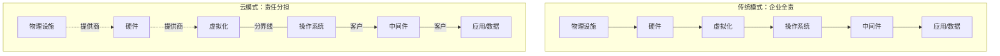
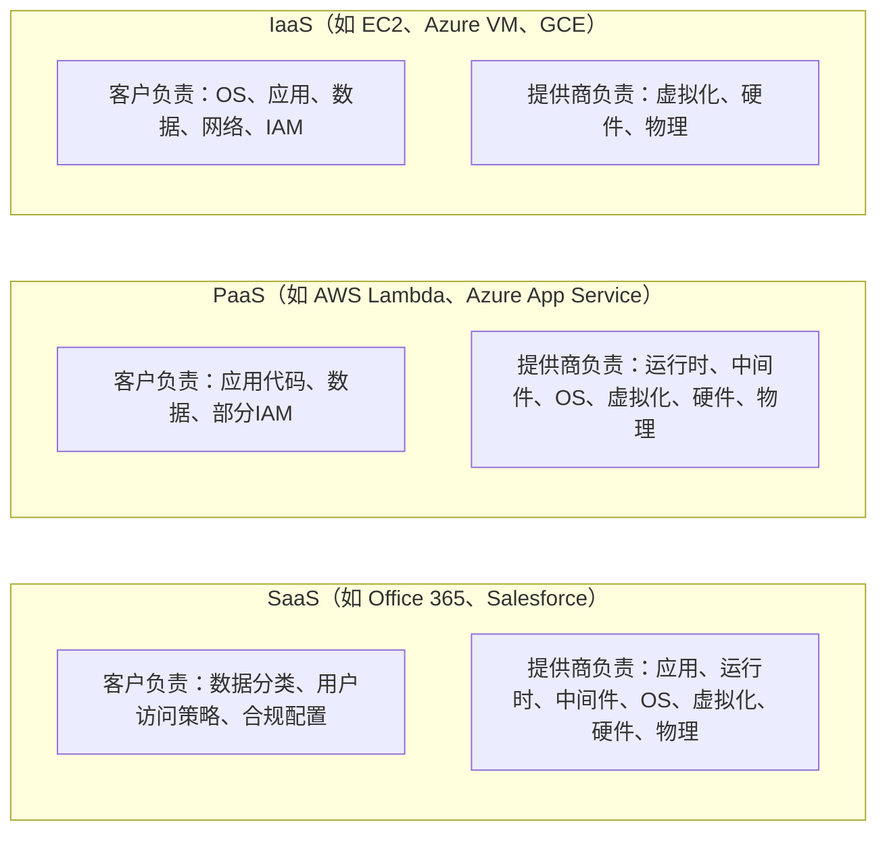
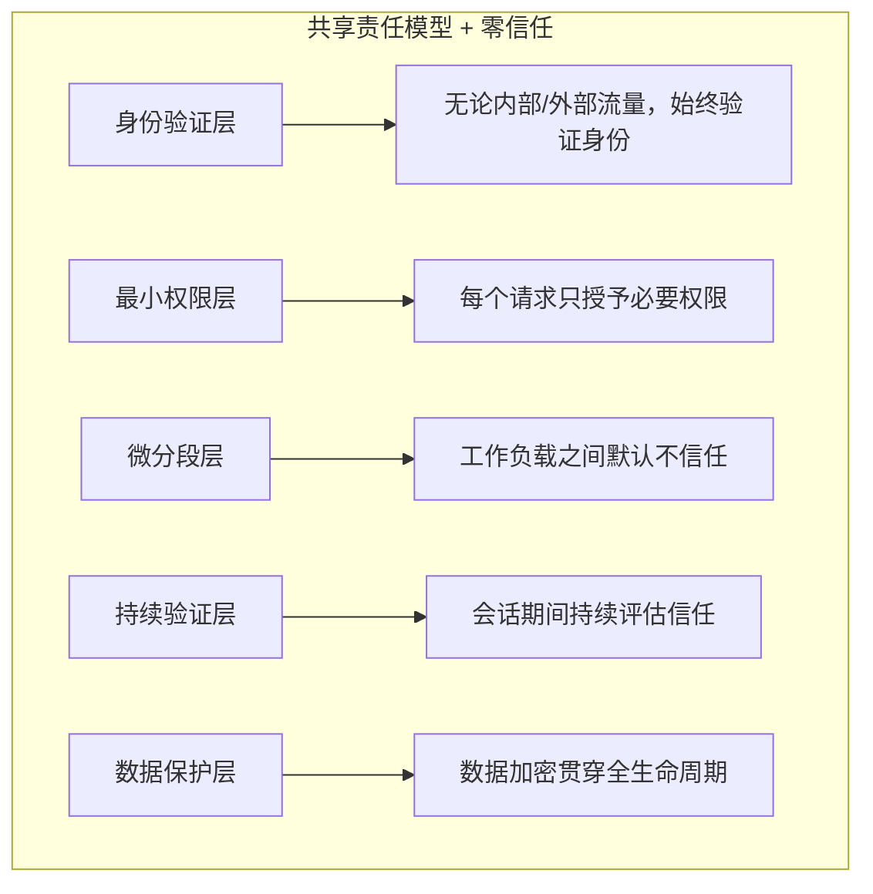

## 19.1 共享责任模型

共享责任模型（Shared Responsibility Model）是云安全的基石概念。它回答了一个看似简单却极易被忽视的问题：**在云环境中，谁对什么负责？** 这个问题的答案直接决定了安全事件发生时，责任归属于云提供商还是客户，也决定了安全架构设计的根本方向。

理解共享责任模型不仅是合规要求，更是实战前提。2019 年 Capital One 数据泄露事件中，攻击者利用 SSRF 漏洞获取了 AWS EC2 实例的 IAM 角色凭据，最终泄露了超过 1 亿用户的个人信息。该事件的责任方是 Capital One（客户侧），而非 AWS——因为 WAF 配置错误和过度宽松的 IAM 策略都属于客户责任范围。这一案例深刻说明：**上云不等于安全外包**。

### 19.1.1 从传统数据中心到云：责任的迁移

在传统自建数据中心（On-Premises）模式下，企业对整个技术栈拥有完全控制权，同时也承担全部安全责任：

```text
传统数据中心 —— 企业承担全部安全责任
┌─────────────────────────────────────────┐
│  物理设施（机房、门禁、电力）           │ ← 企业负责
│  硬件设备（服务器、存储、网络设备）     │ ← 企业负责
│  虚拟化层（Hypervisor / 容器运行时）    │ ← 企业负责
│  操作系统（补丁、加固、配置）           │ ← 企业负责
│  中间件与运行时（数据库、Web服务器）    │ ← 企业负责
│  应用程序（代码、依赖、配置）           │ ← 企业负责
│  数据（分类、加密、备份、销毁）         │ ← 企业负责
│  身份与访问管理（IAM）                  │ ← 企业负责
└─────────────────────────────────────────┘
```

迁移到云之后，底层基础设施的安全责任转移给了云提供商，但上层应用、数据和访问管理的安全责任仍由客户承担。这种责任划分不是"谁更努力"的问题，而是由**控制权**决定的——谁控制了某个层面，谁就有能力也有义务保障该层面的安全。



### 19.1.2 IaaS / PaaS / SaaS 三层模型详解

不同服务模式下，责任边界的划分截然不同。核心原则是：**你使用的服务层级越高，你负责的层面越少，但对数据和身份的责任始终属于你**。



下面用表格精确列出各层级的责任归属：

| 安全层面 | IaaS | PaaS | SaaS |
|---------|------|------|------|
| **物理设施** | 云提供商 | 云提供商 | 云提供商 |
| **网络基础设施** | 云提供商 | 云提供商 | 云提供商 |
| **虚拟化/Hypervisor** | 云提供商 | 云提供商 | 云提供商 |
| **操作系统** | **客户** | 云提供商 | 云提供商 |
| **中间件/运行时** | **客户** | 云提供商（部分客户可配置） | 云提供商 |
| **应用程序** | **客户** | **客户** | 云提供商 |
| **数据** | **客户** | **客户** | **客户** |
| **身份与访问管理** | **客户** | **客户** | **客户** |
| **网络配置** | **客户** | **客户**（安全组/ACL） | 云提供商（基本） |
| **日志与监控** | **客户** | **客户**（部分由提供商采集） | **客户**（审计日志） |
| **加密与密钥管理** | **客户** | **客户**（可用提供商KMS） | **客户**（可用提供商KMS） |

**关键洞察**：无论采用何种服务模式，**数据安全**和**身份与访问管理**始终是客户的责任。这意味着即使你使用最"省心"的 SaaS 服务，仍然需要关注数据分类、加密策略、用户权限管理和审计日志。

### 19.1.3 容器与 Serverless：新兴模型的责任边界

传统三层模型在容器化和 Serverless 架构下需要进一步细化。

#### 容器服务（CaaS）

以 Amazon EKS、Azure AKS、GCP GKE 为代表的托管 Kubernetes 服务，责任边界如下：

| 安全层面 | 自建 K8s | 托管 K8s（EKS/AKS/GKE） |
|---------|---------|------------------------|
| 物理/网络基础设施 | 企业 | 云提供商 |
| Kubernetes 控制平面 | 企业 | 云提供商（托管） |
| Worker 节点 OS | 企业 | 企业（或提供商管理节点组） |
| 容器镜像安全 | 企业 | 企业 |
| Pod 安全策略/标准 | 企业 | 企业 |
| Secrets 管理 | 企业 | 企业 |
| 服务网格安全 | 企业 | 企业 |
| Ingress/Egress 控制 | 企业 | 企业 |

**常见误区**：很多团队使用托管 Kubernetes 后认为"云提供商管了 K8s 就安全了"，忽略了工作负载、镜像和 RBAC 都是自己的责任。实际环境中，错误的 RBAC 配置、未扫描的容器镜像、未限制的 Pod 权限是容器安全事故的三大主因。

#### Serverless 服务

以 AWS Lambda、Azure Functions、Google Cloud Functions 为代表，提供商承担了更多责任：

```text
Serverless 责任划分
────────────────────────────────────────────
提供商负责：
  - 运行时环境（函数执行引擎）
  - OS 补丁与安全更新
  - 自动扩缩容
  - 底层基础设施安全
  - 事件源集成的安全隔离

客户负责：
  - 函数代码安全（注入、反序列化等漏洞）
  - 函数 IAM 角色与权限（最小权限原则）
  - 输入验证与输出编码
  - 依赖库安全（供应链风险）
  - 环境变量中的敏感数据保护
  - API Gateway 认证与限流
  - 日志与异常监控
────────────────────────────────────────────
```

Serverless 虽然大幅降低了运维负担，但也引入了新的攻击面：事件注入（Event Injection）、过度宽松的函数执行角色、依赖库漏洞、以及临时凭据泄露。详见 19.2 节"云环境攻击面分析"。

### 19.1.4 三大云厂商的模型对比

AWS、Azure 和 GCP 对共享责任模型的表述略有不同，理解各厂商的细微差异有助于在多云环境中准确划分责任。

#### AWS 的表述

AWS 将共享责任模型描述为"Security **of** the Cloud"（云本身的安全）与"Security **in** the Cloud"（云中的安全）：

- **AWS 负责（Security of the Cloud）**：全球基础设施（Region/AZ/Edge）、硬件设备、虚拟化层、管理服务的运行时环境
- **客户负责（Security in the Cloud）**：客户数据、平台与应用管理、操作系统（IaaS）、网络与防火墙配置、客户端与服务端加密、网络流量保护、身份与访问管理

AWS 特有注意事项：
- EC2 实例的 AMI 安全由客户负责（包括社区 AMI 的可信性）
- S3 桶策略和 ACL 的默认配置由客户控制（曾导致大量公开桶泄露事件）
- IAM 策略的精细程度完全取决于客户设计

#### Azure 的表述

Microsoft Azure 使用"Cloud capabilities"与"Customer responsibilities"的框架，并特别强调了**联合责任**（Joint Responsibility）的概念：

- **Azure 负责**：物理数据中心、网络、主机、底层 Azure Fabric
- **客户负责**：身份与目录基础设施、信息与数据、应用、网络控制、操作系统
- **联合责任**：端点保护、账户与访问管理、身份与目录基础设施（部分场景下 Azure AD 的安全配置由双方共同负责）

Azure 特有注意事项：
- Azure AD（现 Entra ID）的条件访问策略是客户核心责任
- Azure Policy 和 Security Center 的配置直接影响安全态势评分
- 资源组和订阅层级的权限设计需客户规划

#### GCP 的表述

Google Cloud 采用"Google's responsibility"与"Customer's responsibility"的简洁划分，并额外引入了**分层服务协议**（Layered Service Agreements）：

- **GCP 负责**：全球网络、数据中心物理安全、硬件、底层软件栈（Borg/容器运行时）
- **客户负责**：GCP 项目配置、IAM 策略、数据加密选项、VPC 防火墙规则、应用安全
- **共同责任**：合规认证（GCP 提供基础合规，客户需在自身业务层面满足）

GCP 特有注意事项：
- Organization → Folder → Project 的层级 IAM 继承机制需精心设计
- 默认 VPC 的开放规则需客户收紧
- BigQuery 数据集的访问控制完全由客户管理

#### 三大厂商关键差异对比表

| 维度 | AWS | Azure | GCP |
|------|-----|-------|-----|
| 核心表述 | "of the Cloud" vs "in" | 联合责任模型 | 分层服务协议 |
| IAM 服务 | IAM（策略JSON） | Entra ID（RBAC+条件访问） | Cloud IAM（层级继承） |
| 密钥管理 | KMS / CloudHSM | Key Vault | Cloud KMS / Cloud HSM |
| 安全态势工具 | Security Hub / GuardDuty | Defender for Cloud | Security Command Center |
| 合规框架 | Artifact | Compliance Manager | Compliance Reports Manager |
| 默认安全理念 | 安全由客户配置（灵活但需谨慎） | 偏"安全默认"（更多默认保护） | 安全由组织策略集中管控 |

### 19.1.5 责任边界的灰色地带

在实际云环境中，有些安全责任并非非黑即白，而是处于"灰色地带"。这些区域是最容易出问题的地方，因为双方可能都认为对方负责，结果谁都没有做。

#### 灰色地带一：加密密钥管理

云提供商提供 KMS（Key Management Service），但客户的使用方式决定了实际安全水平：

- 云提供商负责：KMS 服务的可用性、密钥存储的物理安全、HSM 硬件维护
- 客户负责：密钥轮换策略、密钥使用权限控制、信封加密的实现、BYOK（Bring Your Own Key）的密钥生命周期管理
- 灰色地带：当使用"提供商管理密钥"（AWS 托管密钥、Azure 平台管理密钥）时，密钥的轮换策略由提供商默认设置，但客户是否审查过这些默认策略？默认 365 天轮换一次是否足够？

#### 灰色地带二：日志与审计

- 云提供商负责：日志服务的可用性和持久性（如 CloudTrail、Azure Monitor、GCP Audit Logs）
- 客户负责：启用日志记录（很多服务默认不开启审计日志）、日志的分析和告警、日志存储的安全与保留策略
- 灰色地带：日志格式和字段的变更由提供商控制，客户需要跟进适配；日志完整性验证（是否被篡改）的工具和方法因提供商而异

#### 灰色地带三：网络分段

- 云提供商负责：底层网络基础设施、VPC 的隔离能力
- 客户负责：子网划分、安全组/ACL 规则、NACL 配置、路由表设计
- 灰色地带：默认 VPC 的配置（如 AWS 默认 VPC 的所有子网都有公网路由）是否应由提供商设置为更安全的默认值？

#### 灰色地带四：合规与数据主权

- 云提供商负责：基础设施层面的合规认证（SOC 2、ISO 27001、FedRAMP）
- 客户负责：业务层面的合规（GDPR 数据处理、HIPAA 医疗数据保护、PCI DSS 支付数据安全）
- 灰色地带：当客户选择的区域（Region）涉及跨境数据传输时，合规责任如何划分？提供商是否应阻止客户在不合规的区域存储敏感数据？

### 19.1.6 真实案例：共享责任模型的失败教训

#### 案例一：Capital One 数据泄露（2019）

- **事件**：攻击者利用部署在 AWS 上的 WAF 配置错误，通过 SSRF 获取了 EC2 实例的 IAM 角色凭据，访问了 S3 桶中的 1 亿+ 用户数据
- **责任归属**：客户侧（Capital One）
- **根因分析**：
  - WAF 规则未正确过滤 SSRF 请求（应用层安全 — 客户责任）
  - IAM 角色权限过大，允许列出和读取 S3 桶（IAM 设计 — 客户责任）
  - S3 桶中存储了未加密的敏感数据（数据保护 — 客户责任）
- **教训**：AWS 提供了所有安全工具（IAM、KMS、GuardDuty），但工具的正确配置是客户的责任

#### 案例二：Azure Blob Storage 公开访问（多次发生）

- **事件**：多个企业的 Azure Blob Storage 因"允许匿名访问"设置被误开启，导致敏感数据公开暴露
- **责任归属**：客户侧
- **根因分析**：Azure 在 2019 年之前默认允许匿名访问（后改为默认关闭），但已有存储账户的设置不会自动更新
- **教训**：即使是提供商的默认配置变更，已有资源的安全状态也需要客户主动审查

#### 案例三：Cloud Provider 侧 — Azure Cosmos DB 漏洞（ChaosDB，2021）

- **事件**：Azure Cosmos DB 的 Jupyter Notebook 功能存在漏洞，允许任何 Azure 用户获取其他客户的 Cosmos DB 访问密钥
- **责任归属**：提供商侧（Microsoft）
- **根因分析**：Jupyter Notebook 集成中的逻辑漏洞导致跨租户密钥泄露
- **教训**：提供商侧的安全漏洞虽然不常见，但一旦发生影响范围极广。客户应实施"零信任"原则，不完全依赖提供商的安全承诺

### 19.1.7 实操：如何在组织中落地共享责任模型

#### 第一步：资产清单与责任映射

创建一份资产清单，将每项资产映射到共享责任模型中的归属方：

```yaml
# 资产清单示例（assets_inventory.yaml）
cloud_resources:
  - name: "生产 Web 应用"
    service: "AWS EC2 + RDS"
    model: "IaaS"
    customer_responsibilities:
      - "EC2 实例 OS 补丁管理"
      - "RDS 参数组安全配置"
      - "应用代码安全审计"
      - "IAM 角色最小权限设计"
      - "安全组规则配置"
      - "VPC 子网隔离"
    provider_responsibilities:
      - "物理数据中心安全"
      - "Hypervisor 安全"
      - "底层网络基础设施"
      - "硬件故障修复"

  - name: "内部管理系统"
    service: "Salesforce"
    model: "SaaS"
    customer_responsibilities:
      - "用户访问权限管理"
      - "数据分类与标记"
      - "集成 API 的认证安全"
      - "审计日志查看与告警"
    provider_responsibilities:
      - "应用安全与可用性"
      - "基础设施安全"
      - "合规认证维护"
```

#### 第二步：建立安全控制矩阵

将 NIST CSF（网络安全框架）或 CIS Controls 映射到共享责任模型：

```python
# 安全控制矩阵生成脚本
nist_csf_mapping = {
    "ID.AM": {
        "name": "资产管理",
        "customer_controls": [
            "维护云资源清单",
            "标记和分类数据资产",
            "识别所有对外暴露的服务"
        ],
        "provider_controls": [
            "提供资源发现 API（如 AWS Config、Azure Resource Graph）"
        ],
        "tools": ["AWS Config", "Azure Resource Graph", "GCP Asset Inventory"]
    },
    "PR.AC": {
        "name": "身份与访问管理",
        "customer_controls": [
            "实施最小权限原则",
            "启用 MFA",
            "定期审查 IAM 策略",
            "实施条件访问策略"
        ],
        "provider_controls": [
            "提供 IAM 服务的可用性和安全性",
            "维护 MFA 硬件/软件令牌的安全"
        ],
        "tools": ["AWS IAM Access Analyzer", "Azure Entra ID", "GCP IAM Recommender"]
    },
    "PR.DS": {
        "name": "数据安全",
        "customer_controls": [
            "配置静态加密（At Rest）",
            "配置传输加密（In Transit）",
            "实施数据分类策略",
            "配置密钥轮换策略"
        ],
        "provider_controls": [
            "KMS 服务可用性",
            "HSM 物理安全",
            "默认加密能力提供"
        ],
        "tools": ["AWS KMS", "Azure Key Vault", "GCP Cloud KMS"]
    }
}
```

#### 第三步：自动化合规检查

使用基础设施即代码（IaC）工具和策略即代码（Policy-as-Code）工具持续验证共享责任边界：

```bash
# 使用 Open Policy Agent (OPA) 检查 S3 桶是否加密
cat << 'EOF' > s3_encryption.rego
package s3_encryption

deny[msg] {
    resource := input.resource_changes[_]
    resource.type == "aws_s3_bucket"
    not resource.change.after.server_side_encryption_configuration
    msg := sprintf("S3 桶 '%s' 未配置服务端加密（客户责任）", [resource.name])
}

deny[msg] {
    resource := input.resource_changes[_]
    resource.type == "aws_s3_bucket"
    resource.change.after.acl == "public-read"
    msg := sprintf("S3 桶 '%s' ACL 设置为公开访问（客户责任）", [resource.name])
}
EOF

# 使用 Checkov 扫描 IaC 模板的安全配置
checkov -d terraform/ --framework terraform --check-type CUSTOM

# 使用 AWS Security Hub 检查安全态势
aws securityhub get-findings \
    --filters '{"ComplianceStatus":[{"Value":"FAILED","Comparison":"EQUALS"}]}' \
    --max-items 50
```

#### 第四步：定期审查与演练

| 审查项目 | 频率 | 负责人 | 工具 |
|---------|------|--------|------|
| IAM 策略审查 | 每月 | 安全团队 | AWS IAM Access Analyzer / Azure Entra ID 访问评审 |
| 存储桶/存储账户公开访问检查 | 每周（自动化） | DevOps | AWS Config Rules / Azure Policy |
| 容器镜像漏洞扫描 | 每次 CI/CD | 开发团队 | Trivy / Snyk / Aqua Security |
| 安全组/ACL 规则审查 | 每月 | 网络团队 | Prowler / ScoutSuite |
| 密钥轮换状态检查 | 每季度 | 安全团队 | AWS Config / Azure Key Vault |
| 日志完整性验证 | 每季度 | 审计团队 | CloudTrail 日志文件验证 / Azure 诊断日志 |
| 共享责任矩阵更新 | 每半年 | CISO 办公室 | 人工审查 |

### 19.1.8 常见误区与纠正

#### 误区一："上了云就安全了"

**错误认知**：云提供商有专业安全团队和合规认证，所以迁移到云后安全问题就不需要操心了。

**纠正**：云提供商的安全能力保护的是"云本身"，而不是"你在云上的东西"。这就像租了一栋安保完善的写字楼，但你办公室的门锁、文件柜和访客登记仍然是你自己的责任。你需要配置 IAM、加密数据、加固操作系统、审查应用代码——这些都不会因为上云而自动完成。

#### 误区二："提供商的安全工具就是安全保障"

**错误认知**：启用了 AWS GuardDuty 或 Azure Defender 就等于有了安全保障。

**纠正**：安全工具提供的是"能力"，不是"结果"。GuardDuty 检测到异常后，你需要有流程来响应告警；Azure Defender 发现漏洞后，你需要有机制来修复它们。工具的价值取决于你的运营能力——如果你没有安全运营中心（SOC）来处理告警，这些工具就只是产生噪音的源头。

#### 误区三："SaaS 服务不需要关注安全"

**错误认知**：使用 SaaS 服务（如 Google Workspace、Salesforce）时，安全完全由提供商负责。

**纠正**：即使在 SaaS 模式下，以下事项仍然完全是客户的责任：
- 用户账户的生命周期管理（入职开通、离职注销）
- 多因素认证（MFA）的启用和强制策略
- 数据分类和共享策略（哪些文件可以对外分享）
- 第三方应用/插件的审批和权限控制
- 审计日志的定期审查

#### 误区四："容器安全等同于虚拟机安全"

**错误认知**：容器只是轻量级虚拟机，安全策略和虚拟机一样就行。

**纠正**：容器的安全模型与虚拟机有本质区别。容器共享宿主机内核，容器逃逸（Container Escape）是特有的攻击向量。容器安全需要关注：镜像供应链安全（基础镜像可信性）、运行时安全（seccomp、AppArmor、SELinux 配置）、编排平台安全（Kubernetes RBAC、NetworkPolicy、PodSecurityPolicy/Standards）。这些在传统虚拟机安全中并不需要特别关注。

#### 误区五："默认配置就是安全配置"

**错误认知**：云提供商的默认配置应该是安全的，不需要额外调整。

**纠正**：云提供商出于易用性考虑，很多服务的默认配置偏向"开放"而非"安全"。例如：
- AWS 早期 S3 桶默认允许公开访问（现已改为默认私有）
- AWS 默认 VPC 的所有子网都有互联网网关路由
- Azure 早期存储账户默认允许 Blob 匿名访问
- GCP 默认服务账户拥有项目编辑者权限

**原则**：永远不要信任默认配置，始终按照安全基线进行加固。

### 19.1.9 进阶：零信任与共享责任模型的融合

零信任架构（Zero Trust Architecture, ZTA）与共享责任模型并不矛盾，而是互补关系。共享责任模型定义了"谁负责什么"，零信任架构定义了"如何验证一切"。

在共享责任模型中融入零信任原则：



在实践层面，这意味着：

1. **IAM 层面**：不再使用长期凭据，改用短期令牌（AWS STS AssumeRole、Azure Managed Identity、GCP Workload Identity Federation）
2. **网络层面**：不再依赖网络边界（VPC）作为安全屏障，而是在每个服务间实施 mTLS 和细粒度授权（服务网格如 Istio/Linkerd）
3. **数据层面**：不再信任存储层的安全，对所有数据实施客户端加密（Client-Side Encryption），密钥由客户完全控制
4. **监控层面**：不再只监控边界流量，而是对所有东西向（East-West）流量进行审计和异常检测

### 19.1.10 共享责任模型成熟度评估

组织可以根据以下成熟度模型评估自身在共享责任落实方面的水平：

| 成熟度等级 | 特征描述 | 典型问题 |
|-----------|---------|---------|
| **L1 - 初始级** | 无明确责任划分，安全依赖个人经验 | 不知道谁负责 OS 补丁；IAM 策略都是通配符 `*` |
| **L2 - 基础级** | 有基本责任认知，但未文档化 | 知道"云提供商管基础设施"，但没有资产清单和责任映射 |
| **L3 - 规范级** | 责任边界已文档化，有基本安全基线 | 有共享责任矩阵文档；IaC 模板包含基本安全检查 |
| **L4 - 管理级** | 自动化合规检查，持续监控 | CI/CD 流水线集成策略检查；安全态势仪表板实时展示 |
| **L5 - 优化级** | 安全左移，零信任落地，持续改进 | 安全设计审查嵌入开发流程；零信任架构全面实施；自动化红队演练 |

### 19.1.11 本节小结

共享责任模型不是一个抽象的理论概念，而是直接影响安全架构设计、事件响应流程和合规审计的实操框架。本节的核心要点：

1. **责任由控制权决定**：谁控制某个层面，谁就对该层面的安全负责
2. **数据和身份永远是你的责任**：无论 IaaS、PaaS 还是 SaaS，数据安全和 IAM 始终由客户负责
3. **灰色地带需要主动管理**：加密密钥管理、日志审计、网络分段等区域需要与提供商明确约定
4. **默认配置不等于安全配置**：永远按照安全基线加固，不信任任何默认设置
5. **工具不等于能力**：安全工具的价值取决于你的运营能力

在接下来的 19.2 节中，我们将基于共享责任模型，深入分析云环境中的各类攻击面，帮助你从攻击者视角理解客户侧责任的具体风险。
