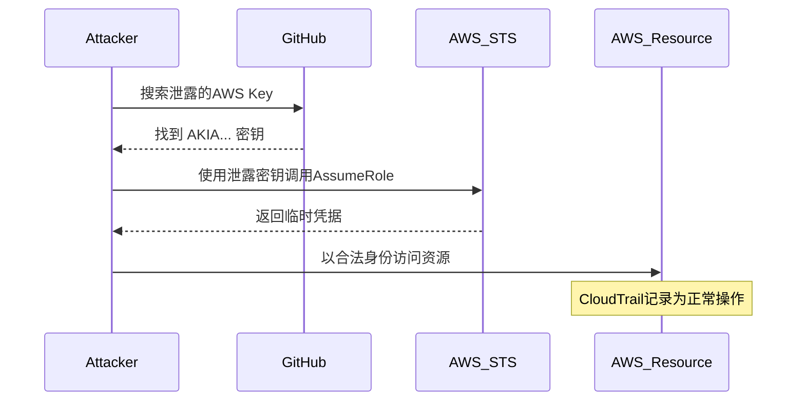
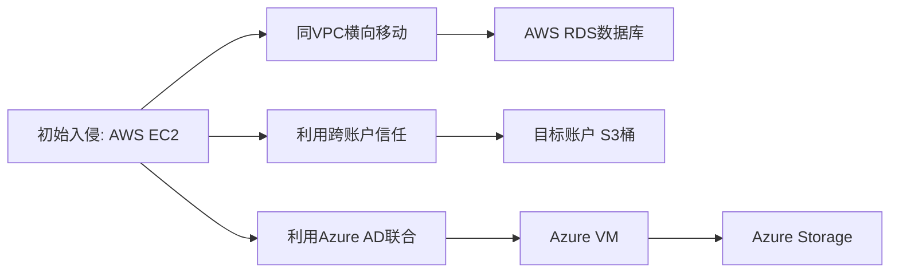
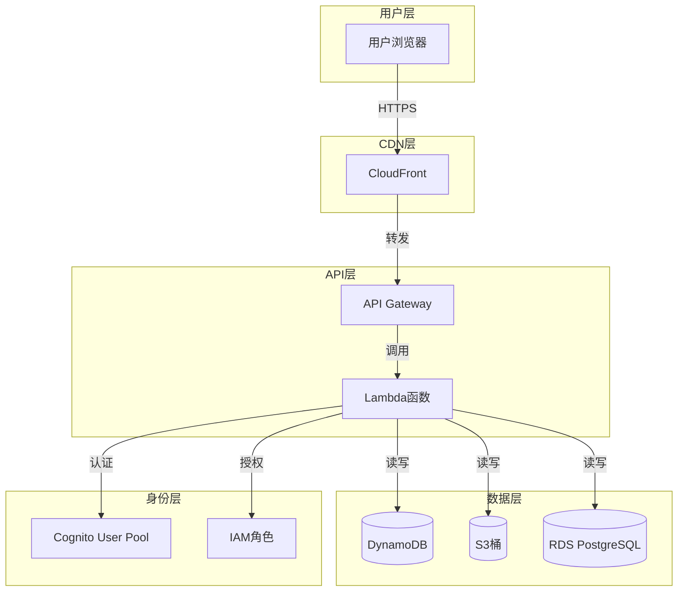

## 19.4 云安全威胁模型

威胁模型是安全工作的起点——它回答"我们到底在防什么"这个根本问题。在传统IT环境中，威胁模型的边界相对清晰：物理机房、网络边界、操作系统的安全控制。但在云环境中，这些边界全部被打散重组。你不再拥有基础设施，不再控制物理网络，甚至不再管理操作系统补丁。威胁模型必须随之进化。

本节将系统性地介绍云安全威胁建模的理论框架、实操方法和常见陷阱，帮助你建立一套可落地的云安全威胁分析能力。

### 19.4.1 为什么云环境需要专门的威胁模型

传统威胁模型基于一个隐含假设：**你拥有从物理层到应用层的完整控制权**。云环境打破了这个假设，带来了四个根本性变化：

**控制权的重新分配**：云服务提供商（CSP）接管了大量底层安全责任，但上层安全仍由租户负责。这种责任分割意味着威胁模型必须明确标注"谁的责任区"——一个在传统环境中不存在的维度。

**攻击面的维度爆炸**：云环境引入了API控制面、元数据服务、IAM信任链、Serverless函数、容器编排等全新攻击面。一个Lambda函数的攻击面包括：函数代码、触发器配置、执行角色、环境变量、VPC配置、Lambda层依赖——这还只是一个资源。

**身份成为新边界**：在云环境中，网络边界已经模糊甚至消失。一个泄露的IAM密钥可以让攻击者从世界任何角落访问你的全部资源，完全绕过网络安全组、WAF等边界防护。身份（Identity）取代了网络，成为云安全的核心边界。

**共享责任的灰色地带**：共享责任模型划定了CSP和租户各自的安全职责，但在实际操作中，这条线经常模糊。例如，AWS RDS的底层操作系统补丁由AWS负责，但数据库参数组的安全配置由租户负责。威胁模型必须清晰标注这些灰色地带中的风险归属。

### 19.4.2 STRIDE威胁模型在云环境中的应用

STRIDE是微软提出的经典威胁分类模型，包含六类威胁：欺骗（Spoofing）、篡改（Tampering）、否认（Repudiation）、信息泄露（Information Disclosure）、拒绝服务（Denial of Service）、权限提升（Elevation of Privilege）。在云环境中，每一类威胁都有其独特的表现形式和攻击路径。

#### 欺骗（Spoofing）——冒充合法身份

云环境中的欺骗攻击围绕身份展开，核心目标是获取合法凭据或冒充可信实体。

**IAM凭据窃取**是最常见的欺骗手段。攻击者通过以下路径获取凭据：

- **代码仓库泄露**：开发者不小心将AWS Access Key提交到GitHub。据GitGuardian统计，2024年在公开仓库中发现了超过1200万个云凭据密钥。
- **钓鱼攻击**：伪造AWS Console或Azure Portal的登录页面，诱导用户输入凭据。
- **元数据服务利用**：通过SSRF漏洞访问云实例的元数据服务（如AWS IMDSv1），获取临时安全凭据。2019年Capital One数据泄露事件正是利用这一路径。
- **供应链攻击**：入侵CI/CD管道，从环境变量或Secret Manager中提取凭据。

**服务账户冒用**同样危险。云环境中通常存在大量服务账户（Service Account），这些账户往往拥有宽泛的权限且缺乏MFA保护。攻击者一旦获取服务账户的密钥，就可以长期潜伏而不被发现。



**防御措施**：
- 启用IMDSv2（强制要求session token），阻断元数据凭据窃取路径
- 对所有人类用户强制MFA，使用硬件安全密钥（FIDO2/WebAuthn）
- 实施密钥轮换策略，Access Key最长90天轮换
- 使用AWS IAM Identity Center或Azure Entra ID进行集中式身份管理
- 部署凭据扫描工具（如truffleHog、git-secrets）在CI/CD管道中自动检测泄露

#### 篡改（Tampering）——修改数据或配置

云环境中的篡改攻击不仅针对数据本身，还针对基础设施即代码（IaC）模板和运行时环境。

**数据篡改**发生在存储层面。攻击者获得写权限后，可以：
- 修改S3对象存储桶中的文件（植入后门、替换合法文件）
- 篡改DynamoDB表中的业务数据（修改账户余额、变更交易记录）
- 替换Secret Manager中的密钥值，劫持下游服务

**IaC模板篡改**的影响范围更大。攻击者修改CloudFormation模板、Terraform状态文件或Kubernetes YAML配置，可以在下次部署时植入持久化后门。例如，在Terraform配置中添加一个额外的IAM策略：

```hcl
# 攻击者在resource "aws_iam_role_policy" 中注入
resource "aws_iam_role_policy" "backdoor" {
  name = "app-policy"  # 看似合法的名称
  role = aws_iam_role.app.id

  policy = jsonencode({
    Version = "2012-10-17"
    Statement = [
      {
        Effect   = "Allow"
        Action   = "*"          # 全部权限
        Resource = "*"          # 所有资源
      }
    ]
  })
}
```

**运行时篡改**包括对Lambda函数代码的注入、EC2用户数据的修改、容器镜像的替换等。

**防御措施**：
- 对所有存储桶启用版本控制（Versioning），保留修改历史
- 使用S3 Object Lock防止对象被删除或覆盖
- IaC模板存储在受保护的Git仓库中，启用分支保护和签名提交
- 部署运行时完整性监控（如AWS CloudTrail Lake、Azure Monitor）
- 使用Cosign或Notary对容器镜像进行签名验证

#### 否认（Repudiation）——抵赖操作行为

在云环境中，否认攻击的核心目标是**销毁或篡改审计证据**，使攻击者的行为无法追溯。

**日志破坏**是主要手段：
- 删除CloudTrail日志或禁用CloudTrail跟踪
- 清空VPC Flow Logs
- 删除CloudWatch Logs日志组
- 修改日志投递配置，将日志发送到攻击者控制的目标

**匿名操作**增加了溯源难度：
- 使用未关联到具体个人的服务账户执行操作
- 通过多个跳板账户链式操作，混淆真实来源
- 利用临时凭据（自动过期，难以长期追踪）

**时间线混淆**：攻击者可能修改系统时钟或在非工作时间执行操作，增加关联分析的难度。

**防御措施**：
- 启用CloudTrail日志文件完整性验证（Log File Integrity Validation）
- 将日志集中投递到独立的审计账户（Organization Trail），普通用户无法访问
- 启用S3 Object Lock保护日志存储桶，设置WORM（Write Once Read Many）模式
- 配置日志告警：任何对CloudTrail本身的修改操作立即触发告警
- 使用AWS Config记录所有资源配置变更

#### 信息泄露（Information Disclosure）——敏感数据暴露

信息泄露是云环境中发生频率最高、影响范围最广的威胁类型。

**存储桶公开访问**是最臭名昭著的云安全事故。从2017年的Verizon（1.4亿客户数据）到2019年的Facebook（5.4亿用户记录），S3桶泄露事件层出不穷。根本原因通常是：

```bash
# 危险的桶策略——允许所有人读取
{
  "Effect": "Allow",
  "Principal": "*",
  "Action": "s3:GetObject",
  "Resource": "arn:aws:s3:::company-backups/*"
}
```

**元数据服务泄露**是另一条高危路径。EC2实例的元数据服务（`http://169.254.169.254`）包含实例的角色临时凭据、用户数据脚本、安全组配置等敏感信息。如果应用存在SSRF漏洞，攻击者可以通过应用间接访问元数据服务：

```python
# 攻击者通过SSRF获取临时凭据
import requests

# 通过应用的SSRF漏洞访问元数据服务
ssrf_url = "http://169.254.169.254/latest/meta-data/iam/security-credentials/app-role"
response = requests.get(f"http://vulnerable-app.com/proxy?url={ssrf_url}")
credentials = response.json()
# 返回 AccessKeyId, SecretAccessKey, Token
```

**配置泄露**包括：
- 安全组规则允许0.0.0.0/0访问内部服务端口
- RDS数据库实例设置为公网可达
- Kubernetes API Server暴露在公网
- 环境变量中包含数据库密码和API密钥

**防御措施**：
- 强制启用S3 Block Public Access（账户级别）
- 部署AWS Config规则自动检测公开存储桶
- 启用IMDSv2，要求PUT请求获取session token
- 使用AWS Macie或Azure Purview自动发现和分类敏感数据
- 定期运行ScoutSuite、Prowler等工具进行安全配置审计

#### 拒绝服务（Denial of Service）——资源耗尽与服务中断

云环境中的DoS攻击有两种独特形式：**技术性拒绝服务**和**经济性拒绝服务（账单爆炸）**。

**技术性DoS**与传统类似，但云环境有其特殊性：
- 攻击暴露的云服务端点（API Gateway、ALB、CloudFront）
- 耗尽Lambda并发限制，阻止合法函数执行
- 填满SQS队列，阻塞消息处理管道
- 耗尽EIP（Elastic IP）配额，阻止新实例获取公网IP

**账单爆炸（Billing Shock）**是云环境特有的DoS攻击。攻击者获取写权限后，可以：
- 创建大量高规格EC2实例进行挖矿
- 启动数千个Lambda函数并发执行
- 生成海量S3请求产生请求费用
- 创建大量NAT Gateway流量产生数据传输费用

2021年，一个攻击者利用泄露的GitHub Actions密钥，在受害者的Azure订阅中创建了大量VM进行挖矿，产生了数万美元的账单。

**防御措施**：
- 设置AWS Budgets告警，当支出超过阈值时立即通知
- 使用Service Quotas限制资源创建数量
- 配置AWS Shield / Azure DDoS Protection
- 为Lambda设置reserved concurrency限制
- 使用IAM策略中的条件键限制资源创建（如`ec2:InstanceType`限制只能创建t3.micro）

#### 权限提升（Privilege Escalation）——突破权限边界

权限提升是云攻击链中最关键的一步——攻击者从低权限身份跃升到管理员权限。

**IAM策略过度授权**是最常见的提权路径。CloudSploit的研究显示，超过70%的AWS环境中存在拥有`iam:PassRole`和`lambda:CreateFunction`权限的IAM角色，攻击者可以组合使用这两个权限将管理员角色传递给新创建的Lambda函数：

```json
// 攻击者的提权步骤
// 1. 创建Lambda函数，指定admin-role作为执行角色
{
  "FunctionName": "backdoor",
  "Role": "arn:aws:iam::123456789:role/admin-role",
  "Code": {"ZipFile": "<恶意代码>"}
}
// 2. 调用Lambda函数，继承admin-role的全部权限
```

**跨账户信任提权**利用AssumeRole的信任关系。如果账户A的角色信任账户B，而攻击者已控制账户B的某个身份，就可以跨账户提权。

**元数据服务提权**：通过SSRF获取实例角色凭据后，如果实例角色拥有高于攻击者当前权限的权限，就实现了提权。

**防御措施**：
- 实施最小权限原则，定期使用IAM Access Analyzer审查权限
- 限制`iam:PassRole`只能传递给指定的角色ARN
- 使用权限边界（Permission Boundary）限制角色的最大权限
- 定期运行Prowler、ScoutSuite检测过度授权
- 使用AWS IAM Identity Center的权限集（Permission Set）进行集中管理

### 19.4.3 MITRE ATT&CK Cloud Matrix 实战分析

MITRE ATT&CK Cloud Matrix将云攻击分解为14个战术阶段和数百个具体技术。与STRIDE的"威胁分类"视角不同，ATT&CK提供的是"攻击者行为"视角——它描述攻击者在实际入侵中会做什么。

#### 初始访问（Initial Access）

初始访问是攻击链的起点。云环境中的主要入口：

| 技术ID | 技术名称 | 攻击方式 | 检测方法 |
|---------|---------|---------|---------|
| T1078 | 有效账户 | 使用泄露的凭据（API Key、密码） | CloudTrail异常登录、地理位置异常 |
| T1190 | 面向公众的应用 | 利用Web应用漏洞（SQL注入、SSRF） | WAF日志、应用日志异常 |
| T1566 | 钓鱼 | 伪造登录页面获取云凭据 | 邮件网关检测、异常MFA挑战 |
| T1199 | 信任关系 | 通过共享服务或供应链入侵 | 跨账户访问日志审计 |

**真实案例——Snowflake凭据泄露事件（2024年）**：攻击者从暗网购买了大量Snowflake客户的凭据（源于信息窃取恶意软件），然后使用这些凭据直接登录客户环境。AT&T、Ticketmaster、桑坦德银行等多家大型企业受影响，超过5.6亿条记录泄露。这个案例完美诠释了T1078（有效账户）的威力——没有零日漏洞，没有复杂攻击链，仅凭泄露的用户名和密码就造成了灾难性后果。

#### 持久化（Persistence）

攻击者在初始访问后建立持久化机制，确保即使凭据被轮换也能保持访问：

**账户操纵（T1098）**是最常见的持久化手段。攻击者可能：
- 为自己创建新的IAM用户或服务账户
- 修改现有用户的密码或Access Key
- 为IAM角色添加新的信任策略
- 向现有策略中追加高危权限

```bash
# 攻击者创建持久化后门用户
aws iam create-user --user-name "svc-backup-agent"
aws iam attach-user-policy --user-name "svc-backup-agent" \
  --policy-arn "arn:aws:iam::aws:policy/AdministratorAccess"
aws iam create-access-key --user-name "svc-backup-agent"
```

**基础设施植入（T1525）**包括：
- 植入包含后门的AMI镜像或容器镜像
- 修改EC2用户数据脚本，在实例启动时执行恶意代码
- 在Lambda层（Layer）中注入恶意依赖
- 修改CloudFormation栈模板，在后续更新中执行恶意操作

**防御与检测**：
- 使用AWS Config检测IAM用户和策略变更
- 监控`CreateUser`、`AttachUserPolicy`、`CreateAccessKey`等高危API调用
- 定期审计IAM用户列表，与HR系统中的员工名单对比
- 对容器镜像实施签名和完整性验证

#### 横向移动（Lateral Movement）

云环境中的横向移动包括在云资源之间和跨云账户的移动：

**资源间移动**：攻击者从一个被入侵的EC2实例出发，利用VPC网络访问同子网内的其他实例，或通过服务角色访问RDS数据库、DynamoDB表等。

**跨账户移动**：如果组织使用多账户架构（如AWS Organizations），攻击者可以通过跨账户IAM信任关系或共享的网络连接（VPC Peering、Transit Gateway）在账户间移动。

**跨云移动**：在多云环境中，攻击者可能从AWS移动到Azure或GCP，利用共享的身份联合（如使用相同的Azure AD租户）或网络连接。



#### 渗出（Exfiltration）

数据渗出是攻击链的最终目标之一。云环境中的渗出路径：

**直接传输到外部（T1567）**：攻击者将数据从S3桶复制到自己控制的S3桶，或通过HTTPS上传到外部服务器。由于S3到S3传输是AWS内部网络流量，不会触发传统DLP的网络监控。

**利用合法服务（T1537）**：攻击者将数据传输到自己的云账户——例如创建一个新的S3桶并将数据复制过去，或者使用AWS DataSync将数据同步到外部。

**DNS渗出**：将编码后的数据通过DNS查询发送到攻击者控制的域名服务器。

**检测方法**：
- 监控S3桶的`PutObject`操作中目标桶是否为外部账户
- 使用VPC Flow Logs检测异常的出站流量模式
- 部署AWS GuardDuty，它内置了数据渗出检测规则
- 配置S3访问日志分析，识别异常的批量下载模式

### 19.4.4 其他云威胁建模框架

除了STRIDE和MITRE ATT&CK，还有几个框架在特定场景下有独特价值。

#### PASTA（Process for Attack Simulation and Threat Analysis）

PASTA是一个以风险为中心的七阶段威胁建模方法，特别适合云环境：

| 阶段 | 名称 | 云环境中的应用 |
|------|------|--------------|
| I | 定义业务目标 | 理解云部署的业务目的和数据敏感度 |
| II | 定义技术范围 | 识别所有云资源：VPC、EC2、RDS、Lambda等 |
| III | 分解应用 | 绘制数据流图，标注云服务边界和信任边界 |
| IV | 分析威胁 | 结合ATT&CK Cloud Matrix识别威胁场景 |
| V | 漏洞分析 | 使用CSPM工具扫描配置漏洞 |
| VI | 攻击建模 | 构建攻击树，模拟真实攻击路径 |
| VII | 风险与影响分析 | 量化风险，优先排序修复事项 |

PASTA的优势在于它**从业务风险出发**而非从技术威胁出发，这使得安全投入能够与业务目标对齐。

#### LINDDUN

LINDDUN专注于**隐私威胁建模**，在云环境中处理个人数据（PII）时特别有用。它定义了七类隐私威胁：

- **关联（Linking）**：将不同数据集中的记录关联到同一个人
- **可识别性（Identifiability）**：从匿名数据中识别个人身份
- **不可否认性（Non-repudiation）**：证明某人执行了某个操作
- **检测（Detectability）**：确定某条记录是否存在于数据集中
- **信息泄露（Disclosure of information）**：获取关于个人的敏感信息
- **不合规（Unawareness）**：数据处理不符合隐私法规要求

在GDPR、CCPA等隐私法规日益严格的背景下，LINDDUN为云中的数据处理提供了结构化的隐私风险分析方法。

#### VAST（Visual, Agile, and Simple Threat）

VAST是专为DevOps和敏捷环境设计的威胁建模方法。它的核心创新是将威胁模型分为两类：

- **应用威胁模型**：面向开发团队，关注单个应用的安全风险
- **基础设施威胁模型**：面向运维团队，关注云平台和网络的安全风险

VAST的这种分层设计与云环境中的DevOps实践高度契合——开发团队关注自己的微服务安全，平台团队关注基础架构安全，两者通过统一的威胁模型框架协作。

### 19.4.5 云威胁建模实操方法论

理论框架需要落地为可执行的流程。以下是经过实践验证的云威胁建模六步法。

#### 第一步：绘制云资产清单与数据流图

威胁建模的基础是清楚知道"有什么"和"数据怎么流动"。在云环境中，这一步的挑战在于资源的动态性和规模。

**资产清单**应包括：
- 计算资源：EC2实例、Lambda函数、ECS/EKS集群、App Runner服务
- 存储资源：S3桶、RDS数据库、DynamoDB表、ElastiCache集群
- 网络资源：VPC、子网、安全组、NACL、负载均衡器、API Gateway
- 身份资源：IAM用户、角色、策略、服务控制策略（SCP）
- 代码与配置：IaC模板、CI/CD管道、容器镜像仓库



**数据流图（DFD）**应标注：
- 信任边界（Trust Boundary）：租户与CSP之间、VPC与公网之间、不同安全域之间
- 数据分类：公开数据、内部数据、机密数据、受限数据
- 通信协议和端口

#### 第二步：识别威胁场景

基于资产清单和数据流图，针对每个组件和数据流识别威胁。推荐使用**STRIDE-per-element**方法——对数据流图中的每个元素（进程、数据存储、数据流、外部实体）逐一应用STRIDE：

| 元素类型 | S（欺骗） | T（篡改） | R（否认） | I（泄露） | D（拒绝服务） | E（提权） |
|---------|----------|----------|----------|----------|-------------|----------|
| 进程（Lambda） | 冒充执行身份 | 修改函数代码 | 无法追踪执行者 | 环境变量泄露 | 并发耗尽 | 越权角色 |
| 数据存储（S3） | 伪造访问身份 | 修改对象内容 | 无法追踪访问者 | 公开访问泄露 | 请求限流 | 策略提权 |
| 数据流（HTTPS） | 中间人攻击 | 传输中篡改 | 缺少请求签名 | 响应数据泄露 | 连接耗尽 | 协议降级 |
| 外部实体（用户） | 账户接管 | 输入注入 | 操作不可追溯 | 凭据泄露 | 恶意请求洪泛 | 权限滥用 |

#### 第三步：评估风险等级

使用**DREAD模型**对每个威胁进行量化评分：

| 维度 | 说明 | 评分标准（1-10） |
|------|------|-----------------|
| **D**amage（损害） | 攻击成功后的损害程度 | 1=仅影响攻击者，10=全面业务中断 |
| **R**eproducibility（可复现性） | 攻击的可重复程度 | 1=需要极端条件，10=随时可复现 |
| **E**xploitability（可利用性） | 实施攻击的难度 | 1=需要国家级资源，10=浏览器即可完成 |
| **A**ffected users（影响范围） | 受影响的用户比例 | 1=几乎无人受影响，10=全部用户受影响 |
| **D**iscoverability（可发现性） | 漏洞被发现的难度 | 1=几乎不可能发现，10=显而易见 |

**风险分 = (D + R + E + A + D) / 5**

- 高风险（≥7）：立即修复
- 中风险（4-6.9）：计划修复
- 低风险（<4）：接受或监控

#### 第四步：制定缓解措施

针对每个高风险和中风险威胁，制定具体的缓解措施。缓解措施应遵循**纵深防御**原则——不依赖单一控制措施。

以"S3桶数据泄露"为例：

| 防御层 | 控制措施 | 实现方式 |
|--------|---------|---------|
| 预防 | 阻止公开访问 | 启用S3 Block Public Access（账户级） |
| 预防 | 最小权限访问 | S3桶策略仅允许指定IAM角色 |
| 检测 | 配置合规监控 | AWS Config规则：s3-bucket-public-read-prohibited |
| 检测 | 访问日志分析 | 启用S3 Server Access Logging + Athena查询 |
| 响应 | 自动修复 | Lambda函数自动将公开桶设为私有 |
| 恢复 | 数据备份 | 跨区域复制（CRR）+ 版本控制 |

#### 第五步：验证与测试

威胁模型不是写完就束之高阁的文档，它需要持续验证：

**自动化验证**：
- 使用ScoutSuite、Prowler扫描云配置是否符合威胁模型中定义的安全基线
- 使用PacBot、Cloud Custodian实施持续合规检查
- 在CI/CD管道中集成Checkov、tfsec等IaC安全扫描工具

**手动验证**：
- 定期进行红队演练，验证威胁模型中识别的攻击路径是否被有效阻断
- 使用Stratus Red Team（专门针对云环境的攻击模拟工具）执行针对性测试

```bash
# 使用Stratus Red Team模拟IAM提权攻击
stratus detonate aws.privilege-escalation.iam-user-create-access-key

# 使用ScoutSuite扫描AWS安全配置
scout aws --ruleset ./custom-ruleset.json --report-dir ./reports
```

#### 第六步：持续更新

云环境是动态变化的——新服务上线、旧服务下线、配置变更、威胁态势演进。威胁模型必须随之更新：

- **变更驱动更新**：每次重大架构变更（新服务部署、网络拓扑调整、IAM策略变更）后重新审视威胁模型
- **事件驱动更新**：安全事件或行业披露新攻击手法后更新威胁模型
- **定期审查**：至少每季度进行一次全面审查

### 19.4.6 云威胁建模工具链

工欲善其事，必先利其器。以下是威胁建模各阶段的推荐工具：

#### 威胁建模与分析工具

| 工具 | 类型 | 适用场景 | 特点 |
|------|------|---------|------|
| OWASP Threat Dragon | 开源 | 通用威胁建模 | Web界面、支持DFD绘制 |
| Microsoft Threat Modeling Tool | 免费 | STRIDE建模 | 自动化威胁识别 |
| IriusRisk | 商业 | 自动化威胁建模 | 与CI/CD集成、自动推荐控制措施 |
| ThreatModeler | 商业 | 企业级威胁建模 | 支持多云环境、自动化工作流 |

#### 云安全配置扫描工具

```bash
# Prowler — AWS安全评估（支持Azure和GCP）
prowler aws --checks-extra check113,check114,check115

# ScoutSuite — 多云安全审计
scout aws --services iam,s3,ec2

# Checkov — IaC安全扫描
checkov -d ./terraform/ --framework terraform

# CloudSploit — 云配置合规检查
node index.js --config config.js
```

#### 攻击模拟工具

```bash
# Stratus Red Team — 云攻击模拟
stratus list --platform aws --tactic privilege-escalation
stratus detonate aws.persistence.iam-admin-role

# Pacu — AWS攻击框架
pacu
Pacu> run iam__enum_permissions
Pacu> run iam__privesc_scan

# CloudFox — 云环境可攻击面发现
cloudfox aws --profile target-account all-checks
```

### 19.4.7 常见误区与纠正

**误区一："我们用了CSP的安全服务，所以不需要威胁模型"**

纠正：CSP的安全服务（如GuardDuty、Security Hub、Azure Defender）提供的是**通用检测能力**，它们不了解你的业务逻辑和数据流。威胁模型提供的是**针对你的具体架构和业务的风险分析**——两者互补而非替代。GuardDuty可以检测异常的API调用，但无法判断"这个Lambda函数有权访问生产数据库是否合理"。

**误区二："威胁模型是一次性工作"**

纠正：威胁模型是**活文档**。云环境每周都在变化——新的Lambda函数部署、新的S3桶创建、IAM策略调整。威胁模型必须与环境同步更新。建议将威胁模型存储在版本控制系统中，与IaC代码一起维护。

**误区三："威胁模型越详细越好"**

纠正：威胁模型的价值在于**覆盖关键风险**而非穷举所有可能。一个覆盖了10个最高风险场景并制定了有效缓解措施的威胁模型，远比一个列举了500个理论威胁但没有行动计划的文档更有价值。遵循帕累托原则——20%的威胁场景覆盖80%的风险。

**误区四："只有安全团队需要参与威胁建模"**

纠正：威胁建模是**跨团队协作**活动。开发团队了解应用逻辑和数据流，运维团队了解基础设施配置，安全团队了解威胁态势，业务团队了解数据价值和合规要求。缺少任何一方的参与都会导致威胁模型的盲区。

**误区五："多云环境只需一个统一的威胁模型"**

纠正：不同云平台的威胁模型有显著差异。AWS的IAM模型与Azure AD的RBAC模型完全不同，GCP的组织层级与AWS Organizations也不一样。在多云环境中，需要为每个平台维护专门的威胁分析，再叠加跨平台的威胁场景（如跨云横向移动、统一身份管理的单点故障）。

### 19.4.8 本节核心要点

1. **云环境的根本变化**：控制权重新分配、攻击面维度爆炸、身份成为新边界、共享责任灰色地带，这些变化要求专门的云威胁模型。

2. **STRIDE在云中的映射**：欺骗围绕身份展开、篡改扩展到IaC模板、否认聚焦日志销毁、信息泄露以存储桶公开为典型、DoS增加账单爆炸维度、提权利用IAM策略过度授权。

3. **ATT&CK Cloud Matrix**：提供攻击者行为视角，14个战术阶段覆盖完整攻击链。重点关注T1078（有效账户）、T1098（账户操纵）、T1537（数据传输到云账户）。

4. **多框架互补**：STRIDE用于威胁分类、ATT&CK用于攻击行为分析、PASTA用于风险驱动建模、LINDDUN用于隐私威胁、VAST用于敏捷团队协作。

5. **六步实操法**：绘制资产清单与DFD → 识别威胁场景 → DREAD风险评估 → 制定缓解措施 → 验证测试 → 持续更新。

6. **工具链**：Prowler/ScoutSuite用于配置扫描、Stratus Red Team用于攻击模拟、Checkov/tfsec用于IaC安全扫描、Threat Dragon用于威胁建模绘制。

7. **常见误区**：安全服务不能替代威胁模型、威胁模型是活文档不是一次性工作、覆盖关键风险比穷举更重要、需要跨团队协作、多云环境需要分层建模。
