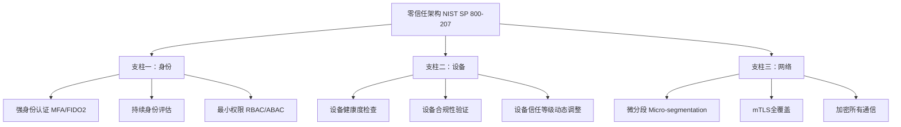
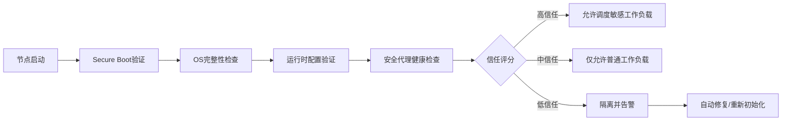
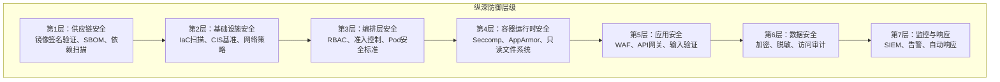
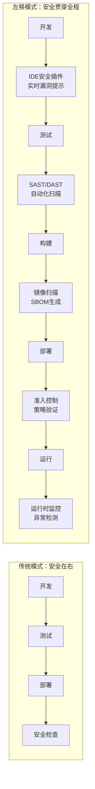
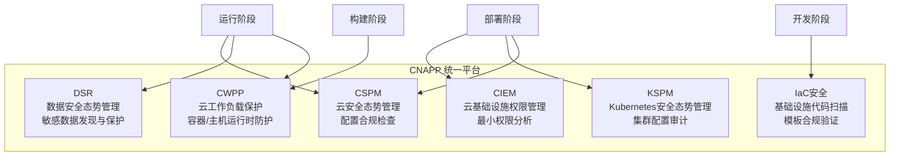
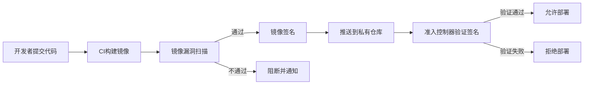
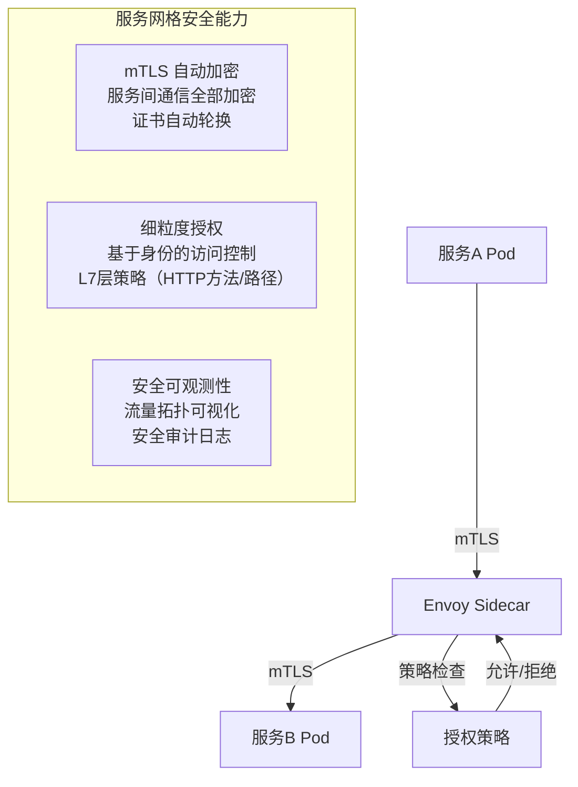
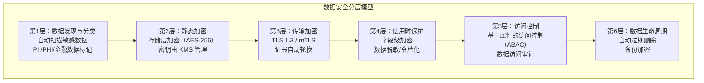
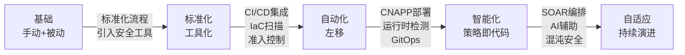
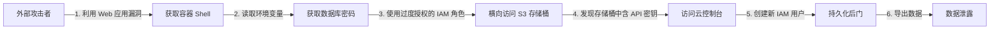

## 19.5 云原生安全架构

云原生安全架构是将安全能力深度嵌入云原生技术栈（容器、Kubernetes、微服务、服务网格、Serverless）的体系化设计方法。它不是传统安全工具的简单搬迁，而是围绕云原生"不可变基础设施、声明式API、自动化编排"三大特征重新构建的安全范式。

### 19.5.1 云原生安全与传统安全的本质差异

传统安全模型基于"边界防护"假设——防火墙以内可信，以外不可信。云原生环境彻底打破了这一假设：容器每秒启停、Pod跨节点漂移、微服务间通信密如蛛网，根本不存在固定的"边界"。

| 维度 | 传统安全 | 云原生安全 |
|------|---------|-----------|
| 防护边界 | 网络边界清晰（DMZ/内网） | 边界模糊，东西向流量为主 |
| 资产形态 | 长期运行的虚拟机/物理机 | 短暂存活的容器/Pod（秒级~分钟级） |
| 变更频率 | 周/月级发布 | 每日数十次部署 |
| 配置方式 | 手动/脚本配置 | 声明式IaC（Terraform/Helm） |
| 安全左移 | 安全在部署后介入 | 安全贯穿开发→构建→运行全生命周期 |
| 可见性 | 主机级日志 | 云API审计+容器运行时+编排层事件 |
| 信任模型 | 基于网络位置 | 基于身份和策略（零信任） |

关键认知转变：在云原生环境中，**安全不是加在应用外面的一层壳，而是应用运行时的内在属性**。就像免疫系统不是穿在身体外面的盔甲，而是血液循环中自带的防御机制。

### 19.5.2 零信任架构在云环境中的深度实践

零信任的核心原则是 **"永不信任，始终验证"（Never Trust, Always Verify）**。NIST SP 800-207 将其定义为三大支柱：



**1. 身份验证与授权**

在云原生环境中，"身份"不仅是用户身份，还包括工作负载身份（Workload Identity）。每一个Pod、每一个服务调用都需要有可验证的身份。

```yaml
# 示例：Kubernetes ServiceAccount 绑定最小权限 RBAC
apiVersion: v1
kind: ServiceAccount
metadata:
  name: order-service-sa
  namespace: production
  annotations:
    # 绑定到云提供商的 Workload Identity（以 GCP 为例）
    iam.gke.io/gcp-service-account: order-sa@my-project.iam.gserviceaccount.com
---
apiVersion: rbac.authorization.k8s.io/v1
kind: Role
metadata:
  name: order-service-role
  namespace: production
rules:
  - apiGroups: [""]
    resources: ["configmaps"]
    verbs: ["get", "list"]    # 只允许读取配置，不允许写入
  - apiGroups: [""]
    resources: ["secrets"]
    resourceNames: ["order-db-credentials"]  # 只能访问特定的 Secret
    verbs: ["get"]
---
apiVersion: rbac.authorization.k8s.io/v1
kind: RoleBinding
metadata:
  name: order-service-binding
  namespace: production
subjects:
  - kind: ServiceAccount
    name: order-service-sa
    namespace: production
roleRef:
  kind: Role
  name: order-service-role
  apiGroup: rbac.authorization.k8s.io
```

这段配置实现了三层最小权限控制：
- **命名空间隔离**：ServiceAccount 只在 production 命名空间有效
- **资源级限制**：只能读取 configmap 和特定的 secret
- **云身份绑定**：通过 Workload Identity 绑定 GCP IAM 角色，避免使用静态密钥

**2. 设备信任评估**

在云原生环境中，"设备"指的是运行容器的节点（Node）。节点信任评估需要持续进行：



GKE 的 Shielded Nodes 和 AWS 的 Nitro Enclaves 就是节点信任评估的工程实现。它们通过 TPM（可信平台模块）芯片验证节点固件和启动链的完整性。

**3. 网络微分段**

网络微分段是零信任在网络层面的核心手段。传统的 VLAN 分段粒度粗（按子网划分），微分段可以精确到单个 Pod。

```yaml
# Calico NetworkPolicy：只允许前端访问后端的 API 端口
apiVersion: projectcalico.org/v3
kind: NetworkPolicy
metadata:
  name: backend-api-policy
  namespace: production
spec:
  selector: app == 'backend-api'
  types:
    - Ingress
    - Egress
  ingress:
    - action: Allow
      protocol: TCP
      source:
        selector: app == 'frontend'
      destination:
        ports:
          - 8080    # 只开放 8080 端口
  egress:
    - action: Allow
      protocol: TCP
      destination:
        selector: app == 'database'
        ports:
          - 5432    # 只允许访问数据库的 5432 端口
    - action: Allow
      protocol: UDP
      destination:
        ports:
          - 53      # 允许 DNS 查询
```

微分段的关键实践：
- **默认拒绝所有流量**：先建立 deny-all 策略，再逐条开放必要通信
- **按应用标签而非 IP 地址定义策略**：IP 会变，标签稳定
- **东西向和南北向分别控制**：入口流量（Ingress）和内部服务间流量（East-West）需要不同的策略
- **加密所有服务间通信**：使用 mTLS（双向 TLS），即使是集群内部流量也不信任

### 19.5.3 云安全架构设计原则

**1. 纵深防御（Defense in Depth）**

纵深防御的核心思想是：任何单一层级的安全控制都可能被突破，因此需要在多个层级叠加防御，形成"漏斗效应"——攻击者突破一层后面临下一层。



每一层的具体实施：

| 层级 | 安全控制 | 工具示例 | 检测能力 |
|------|---------|---------|---------|
| 供应链 | 镜像签名、SBOM生成 | Cosign, Syft, Trivy | 阻止未经验证的镜像部署 |
| 基础设施 | IaC扫描、CIS加固 | Checkov, kube-bench | 配置漂移检测 |
| 编排层 | 准入控制、OPA策略 | Kyverno, Gatekeeper | 部署时策略拦截 |
| 运行时 | 系统调用过滤、进程白名单 | Falco, Seccomp, AppArmor | 异常行为实时告警 |
| 应用层 | WAF、API限流 | ModSecurity, Kong | 攻击流量识别 |
| 数据层 | 加密、密钥轮换 | Vault, SOPS | 异常数据访问检测 |
| 监控层 | 日志聚合、威胁检测 | ELK, Wazuh, Datadog | 全局威胁关联分析 |

**2. 安全左移（Shift Left）**

安全左移是指将安全检查从运维阶段前移到开发阶段。在云原生环境中，这意味着：



在CI/CD管道中嵌入安全检查的具体配置示例（GitLab CI）：

```yaml
# .gitlab-ci.yml - 安全左移的完整流水线
stages:
  - lint
  - test
  - security-scan
  - build
  - deploy

# 阶段1：代码安全扫描（SAST）
sast-scan:
  stage: security-scan
  image: semgrep/semgrep:latest
  script:
    - semgrep --config=auto --sarif --output=semgrep.sarif .
  artifacts:
    paths: [semgrep.sarif]

# 阶段2：依赖漏洞扫描（SCA）
dependency-scan:
  stage: security-scan
  image: aquasec/trivy:latest
  script:
    - trivy fs --severity HIGH,CRITICAL --exit-code 1 .

# 阶段3：容器镜像扫描
image-scan:
  stage: build
  image: aquasec/trivy:latest
  script:
    - trivy image --severity HIGH,CRITICAL --exit-code 1 $CI_REGISTRY_IMAGE:$CI_COMMIT_SHA
    - trivy image --format cyclonedx --output sbom.json $CI_REGISTRY_IMAGE:$CI_COMMIT_SHA
  artifacts:
    paths: [sbom.json]

# 阶段4：IaC 安全扫描
iac-scan:
  stage: security-scan
  image: bridgecrew/checkov:latest
  script:
    - checkov -d . --framework kubernetes terraform --compact --quiet
```

**3. 不可变基础设施（Immutable Infrastructure）**

不可变基础设施是云原生安全的基石：一旦部署，绝不修改正在运行的实例。需要变更时，构建新实例替换旧实例。

这种模式的安全价值：
- **消除配置漂移**：攻击者对运行中容器的修改在重启后自动消失
- **简化审计**：审计对象从"运行时状态"简化为"镜像+配置文件"
- **加速响应**：发现入侵后，直接替换实例即可清除恶意代码，无需逐个排查

```bash
#!/bin/bash
# 不可变基础设施的安全实践：检测容器是否被篡改

# 1. 检查容器文件系统是否被修改（对比镜像层）
for container in $(docker ps --format '{{.ID}}'); do
    echo "=== 容器 $container 文件系统变更检测 ==="
    # docker diff 返回 A(新增)、C(修改)、D(删除) 的文件
    changes=$(docker diff $container)
    if [ -n "$changes" ]; then
        echo "WARNING: 容器文件系统存在变更："
        echo "$changes"
        # 生产环境中应触发告警并自动替换该容器
    else
        echo "OK: 文件系统无变更"
    fi
done

# 2. 验证正在运行的镜像签名（使用 Cosign）
IMAGE="registry.example.com/myapp:v1.2.3"
cosign verify --key cosign.pub $IMAGE
if [ $? -ne 0 ]; then
    echo "ALERT: 镜像签名验证失败！可能存在供应链攻击"
    exit 1
fi
```

### 19.5.4 云原生应用保护平台（CNAPP）

CNAPP（Cloud-Native Application Protection Platform）是 Gartner 在 2021 年提出的概念，它将多种云安全能力整合到一个统一平台中，取代了碎片化的安全工具链。



CNAPP 各组件详解：

| 组件 | 全称 | 核心能力 | 典型工具 |
|------|------|---------|---------|
| CSPM | Cloud Security Posture Management | 云资源配置合规检查、错误配置检测、合规基准（CIS/PCI-DSS）评估 | Prisma Cloud, Wiz, Prowler |
| CWPP | Cloud Workload Protection Platform | 容器镜像扫描、运行时威胁检测、恶意软件防护、漏洞管理 | Aqua, Sysdig, Falco |
| CIEM | Cloud Infrastructure Entitlement Management | 权限分析、过度授权检测、访问路径可视化、权限最小化建议 | Ermetic, Sonrai, Zscaler |
| KSPM | Kubernetes Security Posture Management | RBAC审计、网络策略检查、Pod安全标准合规、etcd加密验证 | Kubescape, Armo, NeuVector |
| DSR | Data Security Posture Management | 敏感数据发现、分类标记、访问审计、泄露风险评估 | BigID, Varonis, Normalyze |

选择 CNAPP 的关键考量：
- **上下文关联能力**：能否将漏洞、错误配置、过度授权、网络暴露等风险关联起来，形成攻击路径分析
- **开发集成深度**：是否支持 PR 级别的安全反馈（而非只在部署后告警）
- **运行时检测能力**：是否具备 eBPF 级别的内核态监控（而非只做静态分析）
- **多云支持**：是否覆盖所有使用的云平台

### 19.5.5 容器与 Kubernetes 安全架构

容器和 Kubernetes 是云原生的核心基础设施，其安全架构需要覆盖整个生命周期。

**1. 供应链安全：从源头把控镜像安全**



镜像安全的关键实践：

```dockerfile
# 安全的 Dockerfile 示例
# 使用最小基础镜像（无 shell、无包管理器）
FROM gcr.io/distroless/static-debian12:nonroot

# 多阶段构建：构建阶段和运行阶段分离
FROM golang:1.22 AS builder
WORKDIR /app
COPY go.mod go.sum ./
RUN go mod download
COPY . .
RUN CGO_ENABLED=0 GOOS=linux go build -ldflags="-s -w" -o /app/server

# 运行阶段：只复制编译好的二进制
FROM gcr.io/distroless/static-debian12:nonroot
COPY --from=builder /app/server /server
# 使用非 root 用户（distroless 的 nonroot 标签已默认 UID 65532）
USER nonroot:nonroot
EXPOSE 8080
ENTRYPOINT ["/server"]
```

安全 Dockerfile 的要点：
- **distroless 基础镜像**：没有 shell、没有包管理器，攻击者即使进入容器也无法安装工具
- **多阶段构建**：编译工具链不进入最终镜像，减少攻击面
- **非 root 用户**：即使容器逃逸，攻击者也没有 root 权限
- **最小二进制**：`-ldflags="-s -w"` 去除调试信息和符号表

**2. 准入控制：部署时的安全门卫**

Kubernetes 准入控制器（Admission Controller）是部署阶段的安全守门员。Kyverno 是一个 Kubernetes 原生的策略引擎，使用 YAML 而非编程语言定义策略：

```yaml
# Kyverno 策略：禁止特权容器
apiVersion: kyverno.io/v1
kind: ClusterPolicy
metadata:
  name: disallow-privileged-containers
  annotations:
    policies.kyverno.io/title: Disallow Privileged Containers
    policies.kyverno.io/severity: high
spec:
  validationFailureAction: Enforce  # Enforce=阻断，Audit=仅告警
  background: true
  rules:
    - name: deny-privileged
      match:
        any:
          - resources:
              kinds: ["Pod"]
      validate:
        message: "禁止运行特权容器。特权容器可以访问主机所有设备，存在严重的容器逃逸风险。"
        pattern:
          spec:
            containers:
              - =(securityContext):
                  =(privileged): "false"
            =(initContainers):
              - =(securityContext):
                  =(privileged): "false"

---
# Kyverno 策略：强制要求镜像签名验证
apiVersion: kyverno.io/v1
kind: ClusterPolicy
metadata:
  name: verify-image-signature
spec:
  validationFailureAction: Enforce
  webhookTimeoutSeconds: 30
  rules:
    - name: verify-cosign-signature
      match:
        any:
          - resources:
              kinds: ["Pod"]
      verifyImages:
        - imageReferences: ["registry.example.com/*"]
          attestors:
            - entries:
                - keys:
                    publicKeys: |-
                      -----BEGIN PUBLIC KEY-----
                      MFkwEwYHKoZIzj0CAQYIKoZIzj0DAQcDQgAE...
                      -----END PUBLIC KEY-----
```

**3. 运行时安全：检测正在发生的攻击**

Falco 是 CNCF 毕业项目，通过监控 Linux 系统调用来检测容器运行时的异常行为：

```yaml
# Falco 规则：检测容器内的可疑活动
- rule: 容器内启动 Shell
  desc: 检测在容器内启动 shell 的行为（可能是攻击者进入了容器）
  condition: >
    spawned_process and container and
    proc.name in (bash, sh, zsh, csh) and
    not proc.pname in (entrypoint.sh, healthcheck.sh)
  output: >
    容器内检测到 Shell 启动
    (用户=%user.name 容器=%container.name
     镜像=%container.image.repository 进程=%proc.name
     命令行=%proc.cmdline 父进程=%proc.pname)
  priority: WARNING
  tags: [container, shell, mitre_execution]

- rule: 容器内访问敏感文件
  desc: 检测容器内读取 /etc/shadow、SSH 密钥等敏感文件
  condition: >
    open_read and container and
    (fd.name startswith /etc/shadow or
     fd.name startswith /root/.ssh or
     fd.name startswith /home and fd.name contains .ssh)
  output: >
    容器内敏感文件访问
    (文件=%fd.name 用户=%user.name 容器=%container.name
     进程=%proc.name 命令行=%proc.cmdline)
  priority: CRITICAL
  tags: [container, credential_access, mitre_credential_access]
```

**4. Pod 安全标准（Pod Security Standards）**

Kubernetes 1.25+ 内置了三个安全级别：

| 级别 | 说明 | 限制 |
|------|------|------|
| **Privileged** | 不受限 | 无安全限制，仅用于系统级组件 |
| **Baseline** | 最低限度限制 | 禁止特权容器、hostPID、hostNetwork 等已知危险配置 |
| **Restricted** | 严格限制 | 在 Baseline 基础上，强制 runAsNonRoot、readOnlyRootFilesystem、drop ALL capabilities |

```yaml
# 为命名空间强制执行 Restricted 安全标准
apiVersion: v1
kind: Namespace
metadata:
  name: production
  labels:
    pod-security.kubernetes.io/enforce: restricted
    pod-security.kubernetes.io/audit: restricted
    pod-security.kubernetes.io/warn: restricted
```

### 19.5.6 服务网格安全

服务网格（如 Istio、Linkerd）在基础设施层面为微服务间通信提供安全保障，应用代码无需修改。

**服务网格提供的安全能力：**



Istio 授权策略示例：

```yaml
# Istio AuthorizationPolicy：只允许订单服务访问支付服务的 /pay 路径
apiVersion: security.istio.io/v1
kind: AuthorizationPolicy
metadata:
  name: payment-service-policy
  namespace: production
spec:
  selector:
    matchLabels:
      app: payment-service
  action: ALLOW
  rules:
    - from:
        - source:
            principals: ["cluster.local/ns/production/sa/order-service-sa"]
      to:
        - operation:
            methods: ["POST"]
            paths: ["/api/v1/pay", "/api/v1/refund"]
    - from:
        - source:
            principals: ["cluster.local/ns/production/sa/admin-dashboard-sa"]
      to:
        - operation:
            methods: ["GET"]
            paths: ["/api/v1/transactions/*"]
```

### 19.5.7 Serverless 安全

Serverless（如 AWS Lambda、阿里云函数计算）带来了独特的安全挑战：函数生命周期极短（毫秒级）、攻击面从服务器转移到函数入口和依赖。

**Serverless 安全风险矩阵：**

| 风险类别 | 具体风险 | 防御措施 |
|---------|---------|---------|
| 事件注入 | 通过 API Gateway/SQS/S3 事件注入恶意数据 | 输入验证、参数化查询、Content-Type 严格检查 |
| 过度授权 | Lambda 执行角色权限过大（如 `*` 通配符） | 按函数粒度分配 IAM 角色，定期审计 |
| 依赖漏洞 | 第三方包引入供应链风险 | 依赖锁定（lockfile）、SCA 扫描、最小依赖原则 |
| 配置泄露 | 环境变量中硬编码密钥/Token | 使用 Secrets Manager、临时凭据 |
| DoS | 大量并发调用耗尽资源/预算 | 并发限制、请求速率限制、预算告警 |
| 横向移动 | 攻破一个函数后利用 IAM 角色访问其他资源 | 最小权限、VPC 隔离、条件键限制 |

```python
# AWS Lambda 安全编码示例
import json
import os
import re
from typing import Any

import boto3
from botocore.exceptions import ClientError

def lambda_handler(event: dict, context: Any) -> dict:
    """
    安全的 Lambda 函数示例：展示安全编码实践
    """

    # 1. 输入验证：拒绝不合规的请求
    body = event.get("body")
    if not body:
        return {"statusCode": 400, "body": json.dumps({"error": "请求体为空"})}

    # 解析并验证 JSON
    try:
        data = json.loads(body)
    except json.JSONDecodeError:
        return {"statusCode": 400, "body": json.dumps({"error": "无效的 JSON 格式"})}

    # 白名单验证：只接受预期的字段和格式
    order_id = data.get("order_id", "")
    if not re.match(r'^ORD-[0-9]{8}$', order_id):
        return {"statusCode": 400, "body": json.dumps({"error": "订单号格式不正确"})}

    # 2. 使用参数化查询防止注入
    dynamodb = boto3.resource('dynamodb')
    table = dynamodb.Table(os.environ['ORDERS_TABLE'])  # 表名从环境变量获取

    try:
        response = table.get_item(Key={'order_id': order_id})
    except ClientError as e:
        # 不将内部错误详情返回给客户端
        print(f"DynamoDB 查询失败: {e}")  # 内部日志
        return {"statusCode": 500, "body": json.dumps({"error": "服务内部错误"})}

    # 3. 响应中不泄露敏感信息
    item = response.get('Item', {})
    safe_item = {
        'order_id': item.get('order_id'),
        'status': item.get('status'),
        'created_at': item.get('created_at'),
        # 不返回内部字段如 user_pii、internal_notes 等
    }

    return {
        "statusCode": 200,
        "headers": {
            "Content-Type": "application/json",
            "X-Content-Type-Options": "nosniff",
            "Cache-Control": "no-store",
        },
        "body": json.dumps(safe_item)
    }
```

### 19.5.8 基础设施即代码（IaC）安全

IaC 是云原生的核心实践，但错误的 IaC 配置会自动化地批量复制安全漏洞。

**常见 IaC 安全错误及修正：**

```hcl
# ❌ 错误：S3 存储桶公开可读
resource "aws_s3_bucket" "data" {
  bucket = "my-app-data"
  # 缺少加密、版本控制、公共访问阻止
}

# ✅ 正确：安全的 S3 存储桶配置
resource "aws_s3_bucket" "data" {
  bucket = "my-app-data"
}

# 阻止所有公共访问
resource "aws_s3_bucket_public_access_block" "data" {
  bucket                  = aws_s3_bucket.data.id
  block_public_acls       = true
  block_public_policy     = true
  ignore_public_acls      = true
  restrict_public_buckets = true
}

# 启用服务端加密
resource "aws_s3_bucket_server_side_encryption_configuration" "data" {
  bucket = aws_s3_bucket.data.id
  rule {
    apply_server_side_encryption_by_default {
      sse_algorithm = "aws:kms"
    }
    bucket_key_enabled = true
  }
}

# 启用版本控制（防误删/防勒索）
resource "aws_s3_bucket_versioning" "data" {
  bucket = aws_s3_bucket.data.id
  versioning_configuration {
    status = "Enabled"
  }
}

# 启用访问日志
resource "aws_s3_bucket_logging" "data" {
  bucket        = aws_s3_bucket.data.id
  target_bucket = aws_s3_bucket.audit_logs.id
  target_prefix = "s3-access-logs/my-app-data/"
}
```

IaC 安全扫描工具对比：

| 工具 | 支持的 IaC 语言 | 特点 | 集成方式 |
|------|----------------|------|---------|
| **Checkov** | Terraform, CloudFormation, K8s, Helm, Dockerfile | 规则最多（1000+），支持自定义策略 | CLI、CI/CD、IDE 插件 |
| **tfsec** | Terraform（专用） | 速度快，误报率低 | CLI、pre-commit hook |
| **KICS** | Terraform, CloudFormation, Ansible, Dockerfile | 开源，多语言支持 | CLI、Docker、CI/CD |
| **Terrascan** | Terraform, K8s, Helm, Kustomize | 支持 OPA/Rego 自定义策略 | CLI、Admission Controller |

### 19.5.9 密钥管理与数据安全

**1. 密钥管理最佳实践**

在云原生环境中，密钥管理的优先级顺序：

```text
最佳 → 最差：
云原生密钥管理（AWS Secrets Manager / GCP Secret Manager / Azure Key Vault）
  → 外部密钥管理（HashiCorp Vault）
    → Kubernetes Secrets + 加密（SOPS + KMS）
      → Kubernetes Secrets + etcd 加密（静态加密）
        → 环境变量注入（❌ 不推荐）
          → 代码/配置文件硬编码（❌❌ 严重违规）
```

使用 HashiCorp Vault 的动态密钥示例：

```bash
# Vault 可以为每个 Pod 动态生成数据库凭据，过期自动撤销
# 1. 配置 Vault 的数据库密钥引擎
vault write database/config/mydb \
    plugin_name=mysql-database-plugin \
    connection_url="{{username}}:{{password}}@tcp(mysql:3306)/" \
    allowed_roles="readonly" \
    username="admin" \
    password="rootpassword"

# 2. 定义角色：生成只读、1小时过期的凭据
vault write database/roles/readonly \
    db_name=mydb \
    creation_statements="CREATE USER '{{name}}'@'%' IDENTIFIED BY '{{password}}'; \
        GRANT SELECT ON mydb.* TO '{{name}}'@'%';" \
    default_ttl="1h" \
    max_ttl="24h"

# 3. Pod 通过 Vault Agent 注入器自动获取凭据
# Pod 注解：
# vault.hashicorp.com/agent-inject: "true"
# vault.hashicorp.com/role: "readonly"
# vault.hashicorp.com/agent-inject-secret-db-creds: "database/creds/readonly"
```

**2. 数据安全分层**



### 19.5.10 云安全治理框架

**1. 国际标准与框架**

| 框架 | 组织 | 适用场景 | 核心内容 |
|------|------|---------|---------|
| **CIS Benchmarks** | CIS | 各云平台/容器的安全基线配置 | 具体的配置检查项，可自动化扫描 |
| **CSA CCM** | CSA | 云安全控制体系评估 | 16个域、197个控制项，覆盖IaaS/PaaS/SaaS |
| **NIST SP 800-53** | NIST | 美国联邦系统安全控制 | 20个控制族，适用于所有IT系统 |
| **NIST SP 800-207** | NIST | 零信任架构实施指南 | 三大支柱、逻辑组件、部署模型 |
| **ISO 27017** | ISO | 云服务信息安全控制 | 基于ISO 27001的云扩展控制 |
| **SOC 2 Type II** | AICPA | 服务组织安全审计 | 五大信任原则：安全、可用、处理完整性、机密、隐私 |

**2. 中国云安全合规要求**

| 法规/标准 | 核心要求 | 适用范围 |
|----------|---------|---------|
| **等保 2.0（GB/T 22239-2019）** | 云计算安全扩展要求，含基础设施、虚拟化、管理平台安全 | 所有在中国运营的云服务 |
| **数据安全法** | 数据分类分级、重要数据出境评估、数据安全审查 | 处理中国境内数据的所有组织 |
| **个人信息保护法** | 个人信息处理规则、跨境传输限制、个人权利保障 | 处理中国公民个人信息的所有组织 |
| **关键信息基础设施保护条例** | 关键基础设施识别、安全保护义务、安全审查 | 关键信息基础设施运营者 |
| **云计算服务安全评估办法** | 云服务安全审查（党政机关采购云服务前必须通过） | 为党政机关提供云服务的厂商 |

**3. 合规自动化实践**

```bash
#!/bin/bash
# 使用 Prowler 自动化评估 AWS 安全合规（CIS Benchmark）

# 安装 Prowler
pip install prowler

# 运行 CIS AWS Foundations Benchmark v3.0 全部检查
prowler aws --compliance cis_3.0_aws --output-format json --output-directory ./compliance-report

# 只检查特定类别
prowler aws --checks-directory cis_3.0_aws \
    --services s3 ec2 iam \
    --output-format html

# 使用 Checkov 扫描 Terraform 代码的合规性
checkov -d ./terraform/ \
    --framework terraform \
    --check-type CIS_AWS_1.5 \
    --compact \
    --output junitxml > compliance-results.xml
```

### 19.5.11 云原生安全成熟度模型

评估和提升组织的云原生安全成熟度：

| 级别 | 名称 | 特征 | 关键实践 |
|------|------|------|---------|
| L1 | **基础** | 手动安全、被动响应 | 基础IAM策略、安全组规则、手动漏洞修补 |
| L2 | **标准化** | 安全流程标准化、工具化 | CIS基准扫描、镜像扫描、集中日志 |
| L3 | **自动化** | 安全自动化、左移 | CI/CD安全集成、IaC扫描、准入控制 |
| L4 | **智能化** | 威胁检测自动化、策略即代码 | 运行时检测（Falco）、CNAPP、GitOps安全 |
| L5 | **自适应** | 持续自适应安全、AI辅助 | 自动响应编排（SOAR）、攻击面管理、混沌安全工程 |

从 L1 到 L5 的演进路径：



### 19.5.12 常见误区与纠正

**误区 1：云厂商负责安全，我不需要操心**
- **现实**：云厂商负责"云的安全"（物理设施、虚拟化层），你负责"云中的安全"（操作系统、应用、数据、IAM配置）。SaaS/PaaS/IaaS 的责任划分完全不同，参见 19.1 共享责任模型。
- **纠正**：明确责任边界，将共享责任模型细化为可执行的安全控制清单。

**误区 2：Kubernetes 网络策略默认安全**
- **现实**：Kubernetes 默认允许所有 Pod 间通信（零网络隔离）。没有 NetworkPolicy 的集群等于所有服务都在同一个平坦网络中。
- **纠正**：部署 CNI 插件（Calico/Cilium）后，第一步就是创建默认拒绝所有流量的 NetworkPolicy，然后逐条开放必要通信。

**误区 3：容器镜像扫描就够了，不需要运行时安全**
- **现实**：镜像扫描只能发现构建时已知的漏洞。零日漏洞、运行时注入攻击、内存中的恶意代码、配置漂移——这些只有运行时安全工具才能检测到。
- **纠正**：镜像扫描（构建时）+ 准入控制（部署时）+ 运行时检测（运行时），三者缺一不可。

**误区 4：零信任 = 全部加密 = 安全**
- **现实**：加密只是零信任的一个组件。即使所有通信都加密了，如果授权策略过于宽松（任何服务都能调用任何服务），攻击者获取一个服务的凭据后仍然可以横向移动。
- **纠正**：零信任的核心是"最小授权"而非"全加密"。加密保护传输安全，授权策略控制访问范围。

**误区 5：安全策略一次配置，永久有效**
- **现实**：云原生环境持续变化——新服务上线、旧服务下线、团队调整、权限变更。静态的安全策略会快速过时，产生大量误报或漏报。
- **纠正**：安全策略应该版本化管理（GitOps），定期审查和更新，通过 CI/CD 自动部署。每次基础设施变更都应触发策略评估。

### 19.5.13 进阶：攻击路径分析与威胁建模

云原生环境中的攻击路径通常是多步骤的链式攻击。理解攻击路径有助于优先修复最关键的风险。

**典型云原生攻击路径示例：**



每个环节对应的防御措施：

| 攻击环节 | 攻击技术 | 防御措施 |
|---------|---------|---------|
| 入侵容器 | Web漏洞利用（SQL注入/XSS） | WAF、输入验证、SAST/DAST |
| 读取凭据 | 环境变量/文件系统搜索 | Secrets Manager、不使用环境变量存密钥 |
| 横向移动 | IAM 角色过度授权 | CIEM 最小权限、条件键限制 |
| 数据访问 | S3 公开访问/错误策略 | 阻止公共访问、VPC Endpoint、访问日志 |
| 持久化 | 创建 IAM 用户/后门 | CloudTrail 告警、IAM 变更审批 |
| 数据外泄 | 大量数据导出 | DLP、异常流量检测、出口流量控制 |

**STRIDE 威胁建模在云原生环境中的应用：**

| 威胁类型 | 全称 | 云原生场景示例 | 防御措施 |
|---------|------|-------------|---------|
| **S** | Spoofing（欺骗） | 伪造 Pod 身份/API Token | mTLS、ServiceAccount Token 投影 |
| **T** | Tampering（篡改） | 修改容器镜像/配置文件 | 镜像签名、不可变基础设施 |
| **R** | Repudiation（抵赖） | 匿名操作无法追溯 | 全面审计日志、不可篡改日志链 |
| **I** | Information Disclosure（信息泄露） | 错误配置导致数据暴露 | 加密、最小权限、DLP |
| **D** | Denial of Service（拒绝服务） | 资源耗尽攻击 | 资源配额、限流、自动扩缩容 |
| **E** | Elevation of Privilege（权限提升） | 容器逃逸获取主机权限 | 安全上下文限制、Seccomp、只读根文件系统 |

### 19.5.14 实战检查清单

部署云原生应用前的安全自查清单：

```markdown
## 供应链安全
- [ ] 基础镜像来自可信来源（官方/私有仓库）
- [ ] Dockerfile 使用多阶段构建，最终镜像不含构建工具
- [ ] 镜像已签名（Cosign/Notary）
- [ ] SBOM 已生成并归档
- [ ] 依赖扫描无 CRITICAL/HIGH 漏洞
- [ ] 使用固定版本标签（不用 :latest）

## Kubernetes 安全
- [ ] Pod 运行在 Restricted 安全标准下
- [ ] 非 root 用户运行（runAsNonRoot: true）
- [ ] 只读根文件系统（readOnlyRootFilesystem: true）
- [ ] 丢弃所有 Linux Capabilities（drop: ALL）
- [ ] 设置资源限制（CPU/Memory limits）
- [ ] NetworkPolicy 已部署，默认拒绝所有入站流量
- [ ] ServiceAccount 权限最小化（无 cluster-admin）

## 密钥与数据
- [ ] 无硬编码密钥（扫描通过）
- [ ] 使用外部密钥管理（Vault/云KMS）
- [ ] 数据库连接使用 TLS
- [ ] 敏感数据已加密存储
- [ ] 日志中无敏感信息（密码/Token/PII）

## 网络安全
- [ ] 服务间通信使用 mTLS
- [ ] 入口流量通过 WAF/API Gateway
- [ ] 出口流量限制到必要的目标地址
- [ ] 集群内部 DNS 安全策略已启用

## 监控与响应
- [ ] 审计日志已启用（K8s Audit Log + 云 API 日志）
- [ ] 运行时威胁检测已部署（Falco/Sysdig）
- [ ] 安全告警通道已配置（Slack/PagerDuty/钉钉）
- [ ] 事件响应剧本已准备
```

---

> **总结**：云原生安全架构不是购买一堆安全产品然后堆砌在一起，而是围绕"身份、网络、数据、工作负载"四大核心，将安全能力嵌入到开发、构建、部署、运行的全生命周期中。从零信任的身份验证，到供应链的镜像签名，到编排层的准入控制，到运行时的威胁检测，每一层都在增加攻击者的成本。目标不是"绝对安全"（这不存在），而是让攻击的成本远高于收益。
