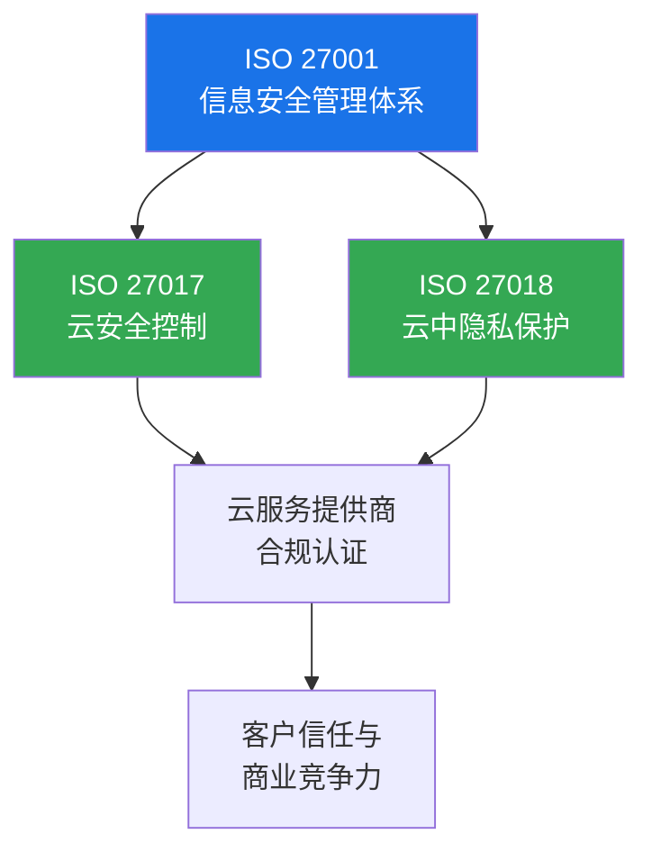
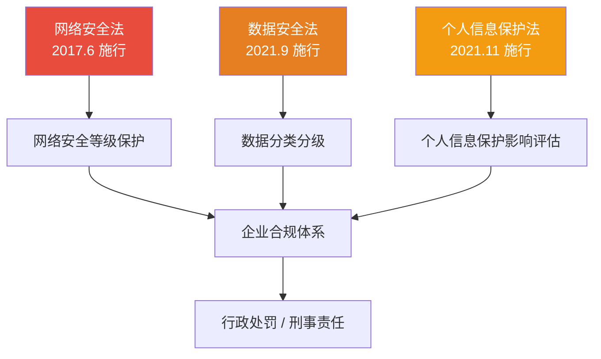
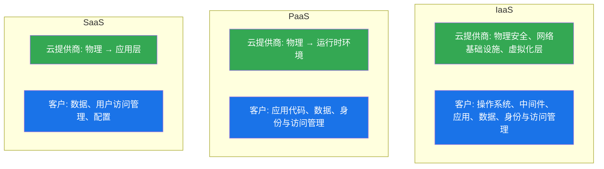
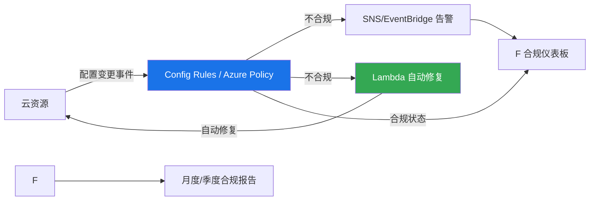
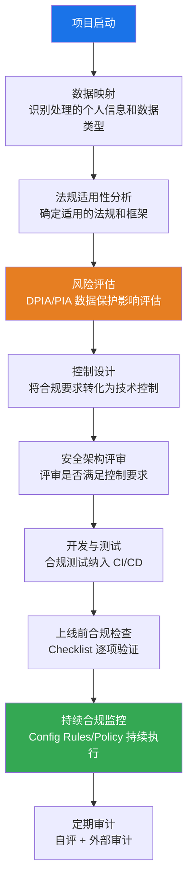

## 19.6 云安全合规与法规

云安全合规不是一个"选做题"——它是企业使用云服务的法律底线。一次合规违规可能导致数千万美元罚款（GDPR 最高可达全球年营收 4%）、业务牌照吊销甚至刑事责任。本节系统梳理全球主要合规框架、中国本土法规体系、云环境特有的合规挑战，以及从手动审计到合规即代码的工程化落地方法。

### 19.6.1 合规的基本概念与核心原则

#### 什么是合规

合规（Compliance）指组织的行为、系统和流程符合适用的法律法规、行业标准和内部政策的要求。在云安全领域，合规的核心问题是：**当数据和计算资源不再完全由你控制时，如何证明你仍然满足监管要求？**

合规与安全的关系：

| 维度 | 安全（Security） | 合规（Compliance） |
|------|-----------------|-------------------|
| 目标 | 保护资产免受威胁 | 满足外部监管要求 |
| 驱动力 | 风险评估 | 法律/合同/标准 |
| 标准 | 动态、持续演进 | 相对固定、版本化 |
| 验证方式 | 渗透测试、红队演练 | 审计、认证、检查 |
| 最低要求 | 无明确底线（取决于风险偏好） | 明确的合规基线 |

关键认知：**合规是安全的下限，不是上限。** 满足合规不等于安全，但不满足合规则意味着存在已知的安全缺陷未被修复。

#### 合规的三大支柱

1. **预防（Preventive）**：通过策略、配置基线和技术控制防止违规发生。例如：在 Terraform 中硬编码加密要求，使未加密的 S3 存储桶无法创建。
2. **检测（Detective）**：持续监控和审计，发现已发生的违规。例如：AWS Config 规则检测到公开的 S3 存储桶时触发告警。
3. **响应（Responsive）**：违规发生后的处置流程——修复、报告、取证。例如：GDPR 要求 72 小时内向监管机构报告数据泄露。

### 19.6.2 全球主要合规框架

#### GDPR（通用数据保护条例）

GDPR 是欧盟制定的数据保护和隐私法规，2018 年 5 月 25 日生效。它是全球最具影响力的数据保护法规，其核心理念已渗透到后续各国立法中。

**适用范围（长臂管辖）**：
- 在欧盟设有机构的组织
- 向欧盟居民提供商品或服务的组织（无论是否在欧盟）
- 监控欧盟居民行为的组织（如网站分析）

这意味着一家中国的跨境电商，只要面向欧洲用户销售，就必须遵守 GDPR。

**核心原则**：

| 原则 | 含义 | 云环境体现 |
|------|------|-----------|
| 合法性、公平性、透明性 | 数据处理须有合法基础，对用户透明 | 隐私政策中须说明使用了哪些云服务 |
| 目的限制 | 只能为特定、明确的目的收集数据 | 不能将 A 业务收集的数据用于 B 业务的 AI 训练 |
| 数据最小化 | 只收集必要的数据 | 日志中不应记录完整的信用卡号 |
| 准确性 | 数据应准确且及时更新 | 用户数据同步机制 |
| 存储限制 | 保留不超过必要期限 | S3 生命周期策略自动删除过期数据 |
| 完整性与机密性 | 必须有适当的安全措施 | 加密、访问控制、网络隔离 |
| 问责制 | 控制者须能证明合规 | 完整的审计日志和文档 |

**关键条款**：

- **第 25 条——设计和默认数据保护**：系统从设计阶段就应内置隐私保护。在云架构设计时就需要考虑数据分类、加密、访问控制，而不是上线后补救。
- **第 28 条——处理者义务**：云服务提供商（AWS、Azure、GCP）作为数据处理者，必须提供充分的保障措施。使用云服务前必须签订数据处理协议（DPA）。
- **第 33/34 条——泄露通知**：发现个人数据泄露后，须在 72 小时内通知监管机构；如果泄露可能对个人权利和自由造成高风险，还须直接通知受影响的数据主体。
- **第 44-49 条——跨境数据传输**：向欧盟以外传输个人数据，须确保接收方提供"充分保护"。标准合同条款（SCCs）和具有约束力的公司规则（BCRs）是常用的传输机制。

**违规处罚**：
- 一般违规：最高 1000 万欧元或全球年营收 2%（取较高者）
- 严重违规：最高 2000 万欧元或全球年营收 4%（取较高者）
- 典型案例：Amazon（7.46 亿欧元，2021）、Meta（12 亿欧元，2023，跨境数据传输违规）

#### HIPAA（健康保险流通与责任法案）

HIPAA 是美国的医疗健康数据保护法规，适用于"受保护健康信息"（PHI）的创建、接收、维护和传输。

**关键组成部分**：

- **隐私规则（Privacy Rule）**：定义谁可以访问和披露 PHI。规定患者的知情同意权和访问权。
- **安全规则（Security Rule）**：针对电子 PHI（ePHI）的技术、物理和管理保障措施。
  - 技术保障：访问控制、审计控制、传输安全（TLS）、完整性控制
  - 物理保障：设施访问控制、工作站安全、设备和介质控制
  - 管理保障：风险分析、风险管理、人员安全、应急计划
- **泄露通知规则（Breach Notification Rule）**：泄露影响 500+ 个人须在 60 天内通知媒体和 HHS。

**云环境中的 HIPAA 合规要点**：

1. **业务伙伴协议（BAA）**：使用 AWS/Azure/GCP 处理 ePHI 前，必须签订 BAA。BAA 明确云提供商作为业务伙伴的责任。
2. **加密要求**：ePHI 在传输和静态存储时必须加密（AES-256 为推荐标准）。
3. **访问控制**：最小权限原则，所有 ePHI 访问必须有唯一用户标识和审计记录。
4. **留存期限**：HIPAA 相关文档须保留 6 年。
5. **违规处罚**：故意忽视最高 150 万美元/年/违规类别；刑事违规最高 25 万美元罚款和 10 年监禁。

**HIPAA 合规的云服务选择**：并非所有 AWS/Azure/GCP 服务都适用于 ePHI。AWS 维护了[HIPAA 合规服务列表](https://aws.amazon.com/compliance/hipaa-eligible-services-reference/)，只有列表中的服务才能用于处理 ePHI。例如：Amazon S3（加密存储）✓、Amazon Rekognition（默认不合规）✗。

#### PCI-DSS（支付卡行业数据安全标准）

PCI-DSS 由 PCI SSC（支付卡行业安全标准委员会）制定，适用于所有存储、处理或传输持卡人数据的组织。

**12 项核心要求**：

```text
构建和维护安全的网络和系统
  1. 安装和维护网络安全控制（防火墙/WAF）
  2. 对所有系统组件使用安全配置（禁用默认密码）

保护账户数据
  3. 保护存储的账户数据（加密、令牌化、截断）
  4. 使用强加密保护传输中的持卡人数据

维护漏洞管理计划
  5. 保护所有系统和网络免受恶意软件侵害
  6. 开发和维护安全的系统和软件（安全开发生命周期）

实施强访问控制措施
  7. 按业务需求限制对系统组件的访问（最小权限）
  8. 标识用户并验证对系统组件的访问（唯一 ID、MFA）
  9. 限制对持卡人数据的物理访问

定期监控和测试网络
  10. 记录和监控对系统组件的所有访问（日志、SIEM）
  11. 定期测试安全系统和流程（漏洞扫描、渗透测试）

维护信息安全策略
  12. 支持信息安全的组织政策和程序
```

**PCI-DSS 合规等级**：

| 等级 | 年交易量 | 要求 |
|------|---------|------|
| Level 1 | > 600 万笔 | 年度现场审计（QSA）+ 季度网络扫描 |
| Level 2 | 100-600 万笔 | 年度 SAQ + 季度网络扫描 |
| Level 3 | 2-100 万笔（电商） | 年度 SAQ + 季度网络扫描 |
| Level 4 | < 2 万笔（电商）/ < 100 万笔 | 年度 SAQ + 季度网络扫描（推荐） |

**云环境中的 PCI-DSS 实践**：

- **令牌化替代存储**：使用 Stripe、Adyen 等支付网关的令牌化服务，避免直接存储卡号。PCI 范围从整个系统缩减到支付网关集成点。
- **网络分段**：将处理持卡人数据的系统隔离到独立的 VPC/子网中，缩小 PCI 审计范围。
- **云提供商的 PCI 认证**：AWS、Azure、GCP 均通过了 Level 1 PCI-DSS 认证，但**提供商合规不等于客户合规**——你仍需确保自己的应用和配置符合要求。

#### SOC 2（服务组织控制）

SOC 2 由 AICPA（美国注册会计师协会）制定，基于信任服务标准（TSC），适用于 SaaS/云服务提供商。

**五大信任服务标准**：

1. **安全性（Security）**：系统受到保护，免受未授权访问。这是必选标准。
2. **可用性（Availability）**：系统按承诺可用。需有 SLA、灾难恢复、容量管理。
3. **处理完整性（Processing Integrity）**：系统处理完整、准确、及时、经过授权。需有数据校验、错误处理。
4. **机密性（Confidentiality）**：受限制的信息受到保护。需有数据分类、加密、访问控制。
5. **隐私（Privacy）**：个人信息的收集、使用、保留、披露和处置符合隐私声明。

**SOC 2 Type I vs Type II**：

| 维度 | Type I | Type II |
|------|--------|--------|
| 范围 | 某一时点的控制设计 | 一段时间内（通常 6-12 个月）的控制有效性 |
| 审计内容 | 控制是否设计适当 | 控制是否设计适当且持续有效 |
| 适用场景 | 初次建立合规体系 | 证明持续合规能力 |
| 价值 | 较低（只看设计） | 较高（看实际执行） |

**实践建议**：客户（尤其是企业客户）在采购 SaaS 服务时通常要求 SOC 2 Type II 报告。如果你是一家 SaaS 公司，SOC 2 Type II 是商业竞争力的一部分，不仅仅是合规成本。

#### ISO 27001 / 27017 / 27018

- **ISO 27001**：信息安全管理体系（ISMS）国际标准。要求组织建立、实施、维护和持续改进 ISMS。通过认证需要经过两阶段外部审计。
- **ISO 27017**：云服务信息安全控制实践准则。基于 ISO 27001 的控制措施，增加了云特有的控制（如共享环境中的客户隔离、云数据删除确认）。
- **ISO 27018**：公有云中个人身份信息（PII）保护的实践准则。规定了云提供商处理 PII 的透明度、数据返还和删除等要求。



#### NIST 网络安全框架（CSF）

NIST CSF 是美国国家标准与技术研究院发布的自愿性框架，广泛用于全球各行业。最新版本 CSF 2.0（2024）包含六大功能：

1. **治理（Govern）**：建立网络安全战略和监督
2. **识别（Identify）**：理解资产、风险和业务环境
3. **保护（Protect）**：实施安全控制保护关键服务
4. **检测（Detect）**：发现安全事件
5. **响应（Respond）**：对检测到的事件采取行动
6. **恢复（Recover）**：恢复因事件受损的服务

NIST CSF 的优势在于它是**框架而非标准**——不要求通过认证，而是提供一套可自适应的风险管理语言，组织可以根据自身情况选择实现层级。

#### CSA STAR

云安全联盟（CSA）的 STAR（Security, Trust, Assurance and Risk）认证专门针对云服务提供商：

- **Level 1（自评估）**：提供商填写 CAIQ（共识评估倡议问卷），公开发布
- **Level 2（第三方审计）**：基于 CSA CCM（云控制矩阵）的独立审计，对应 ISO 27001 或 SOC 2
- **Level 3（持续监控）**：自动化持续验证（目前仍在发展中）

选择云服务时，查看其 CSA STAR 认证等级是评估提供商安全性的重要参考。

### 19.6.3 中国云安全法规体系

中国的网络安全和数据保护法规体系近年来快速完善，形成了以"三法一条例"为核心的法律框架。对于在中国运营的企业，这些法规具有强制约束力。

#### 核心法律架构



#### 网络安全法

2017 年 6 月 1 日施行，是中国网络安全领域的基础性法律。

**关键要求**：
- **网络安全等级保护制度（等保）**：网络运营者必须按照网络安全等级保护制度要求，履行安全保护义务。等保 2.0 将系统分为五个安全保护等级（自主保护、指导保护、监督保护、强制保护、专控保护）。
- **关键信息基础设施（CII）保护**：公共通信和信息服务、能源、交通、水利、金融、公共服务、电子政务以及国防科技工业等重要行业和领域的基础设施，运营者须设置专门安全管理机构，进行年度安全检测评估。
- **数据本地化**：关键信息基础设施的运营者在境内运营中收集和产生的个人信息和重要数据应当在境内存储。确需向境外提供的，须经安全评估。
- **实名制**：网络运营者为用户办理网络接入、域名注册等服务时，应当要求用户提供真实身份信息。

**等保 2.0 云环境要求**：

等保 2.0 在传统网络安全要求基础上，增加了云计算安全扩展要求：

| 等级 | 适用对象 | 云安全特殊要求 |
|------|---------|---------------|
| 第二级 | 一般系统 | 云租户隔离、虚拟化安全、数据备份 |
| 第三级 | 重要系统 | 云平台安全审计、租户数据加密、安全管理中心 |
| 第四级 | 关键系统 | 云平台安全管理机构、资源隔离检测、同城/异地灾备 |
| 第五级 | 极关键系统 | 国家级安全管控（一般企业不涉及） |

#### 数据安全法

2021 年 9 月 1 日施行，确立了数据分类分级保护制度。

**核心机制**：
- **数据分类分级**：根据数据在经济社会发展中的重要程度以及一旦遭到篡改、破坏、泄露或者非法获取、非法利用，对国家安全、公共利益或者个人、组织合法权益造成的危害程度，对数据实行分类分级保护。
- **重要数据目录**：国家数据安全工作协调机制统筹协调有关部门制定重要数据目录。各地区、各部门确定本地区、本部门以及相关行业、领域的重要数据具体目录。
- **数据安全审查**：对影响或者可能影响国家安全的数据处理活动进行国家安全审查。2022 年 2 月施行的《数据出境安全评估办法》是其重要配套。
- **数据交易管理**：数据交易中介服务机构应当要求数据提供方说明数据来源，审核交易双方身份。

**企业需要做的事**：
1. 梳理数据资产，建立数据清单
2. 按照分类分级标准标注数据等级
3. 重要数据的处理须进行风险评估
4. 数据出境须通过安全评估（符合条件时）

#### 个人信息保护法（PIPL）

2021 年 11 月 1 日施行，被称为"中国版 GDPR"。

**与 GDPR 的关键对比**：

| 维度 | PIPL | GDPR |
|------|------|------|
| 适用范围 | 中国境内处理自然人个人信息 | 向 EU 居民提供服务或监控其行为 |
| 合法基础 | 同意、合同、法定义务、公共利益等 7 项 | 同意、合同、法定义务、正当利益等 6 项 |
| 单独同意 | 处理敏感信息、跨境传输等须"单独同意" | 无"单独同意"概念，但有条件同意 |
| 数据出境 | 安全评估 / 标准合同 / 个人信息保护认证 | 充分性认定 / SCCs / BCRs |
| 处罚力度 | 最高 5000 万元或上年营收 5%；可禁止从业 | 最高 2000 万欧元或全球年营收 4% |
| 数据主体权利 | 知情、决定、查阅、复制、更正、删除等 | 知情、访问、更正、删除、限制处理、可携带等 |
| DPO 要求 | 处理达到规定数量须指定个人信息保护负责人 | 大规模处理或公共机构须指定 DPO |

**云环境中 PIPL 的关键实践**：
- **告知同意**：使用云服务处理个人信息时，须在隐私政策中告知用户使用了哪些云服务、存储位置、跨境传输情况。
- **敏感信息**：生物识别、宗教信仰、特定身份、医疗健康、金融账户、行踪轨迹等，以及不满 14 周岁未成年人的个人信息，须取得单独同意。
- **跨境传输**三条路径：
  1. 通过国家网信部门组织的安全评估
  2. 经专业机构进行个人信息保护认证
  3. 按照国家网信部门制定的标准合同与境外接收方订立合同

#### 密码法与商用密码应用

2020 年 1 月 1 日施行的《密码法》要求：
- 关键信息基础设施必须使用商用密码进行保护
- 商用密码产品须经检测认证
- 云环境中使用密码技术须符合 GM/T 系列标准（如 SM2/SM3/SM4 国密算法）

在云环境中落地国密要求时，需要注意云服务商是否支持国密算法（如阿里云、腾讯云均支持 SM2/SM3/SM4），以及 TLS 1.3 的国密改造进展。

### 19.6.4 云环境合规的特殊挑战

#### 共享责任模型下的合规划分

云安全的共享责任模型（Shared Responsibility Model）直接影响合规责任的划分：



**关键陷阱**：云提供商通过了 ISO 27001 或 SOC 2 认证，只证明**云平台本身**合规。你的应用、配置、数据处理方式的合规，仍然是你的责任。

常见合规缺口：
- S3 存储桶策略配置不当导致数据公开泄露——提供商的基础设施安全，你的配置不安全
- IAM 策略过于宽松，违反最小权限——提供商的 IAM 服务功能正常，你的使用方式有问题
- 数据未加密存储——提供商支持加密功能，你没有启用

#### 数据驻留与跨境传输

数据驻留（Data Residency）要求数据存储在特定地理位置，这在多云和全球化架构中极具挑战。

**主要国家/地区的数据驻留要求**：

| 国家/地区 | 法规 | 要求 |
|----------|------|------|
| 中国 | 网络安全法、数据安全法 | CII 运营者境内存储；数据出境须安全评估 |
| 欧盟 | GDPR | 向第三国传输须充分性认定或保障措施 |
| 俄罗斯 | 联邦法律第 242-FZ 号 | 俄罗斯公民个人数据须在境内存储和处理 |
| 印度 | DPDP Act 2023 | 政府可指定禁止传输的数据类别 |
| 巴西 | LGPD | 跨境传输须满足特定条件 |
| 印度尼西亚 | PDP Law 2022 | 跨境传输须确保接收国同等保护水平 |

**工程化应对**：

1. **区域化架构设计**：在架构设计阶段就确定数据的地理边界。使用 Terraform 的 `provider` 别名隔离不同区域的资源。
2. **数据分类标签**：在数据创建时打上地理位置标签（如 `data-jurisdiction: CN`），通过策略引擎自动决定存储位置和传输路径。
3. **传输控制网关**：在数据跨区域流动的路径上部署数据网关，自动拦截违反数据驻留策略的传输。

#### 审计追踪的云环境适配

云环境的动态性（自动扩缩容、无服务器函数、临时资源）给传统审计带来挑战：

1. **资源生命周期短暂**：Lambda 函数执行仅几百毫秒，传统定期审计无法覆盖。需要**实时日志流**（CloudTrail → CloudWatch Logs → SIEM）。
2. **多账户/多云**：企业使用多个 AWS 账户、Azure 订阅或跨云部署时，日志分散在各处。需要集中化日志聚合（如 AWS Organizations 的 CloudTrail 集中化、Azure Monitor 的跨订阅日志查询）。
3. **API 驱动的一切操作**：所有配置变更都是 API 调用。必须确保 CloudTrail（AWS）、Activity Log（Azure）、Cloud Audit Logs（GCP）覆盖所有管理操作和数据事件。
4. **日志防篡改**：将日志写入不可变存储（如 S3 Object Lock、Azure Immutable Blob Storage），并设置日志保留策略符合法规要求（PCI-DSS 要求至少 1 年，其中 3 个月在线可查）。

### 19.6.5 合规工程化：从手动审计到自动化

#### 合规即代码（Compliance as Code）

传统的合规审计是"事后打勾"——先建好系统，再请审计师来检查。合规即代码将合规要求嵌入开发和运维流程，在资源创建时就强制执行合规策略。

**工具链**：

| 阶段 | 工具 | 作用 |
|------|------|------|
| 编码时 | Checkov、tfsec | 在 Terraform/CloudFormation 代码中扫描合规问题 |
| 部署时 | OPA/Rego、AWS Service Control Policies | 策略即代码，在 API 调用时拦截不合规资源 |
| 运行时 | AWS Config Rules、Azure Policy、GCP Organization Policy | 持续监控已部署资源的合规状态 |
| 审计时 | AWS Audit Manager、Vanta、Drata | 自动收集证据、生成审计报告 |

**示例：用 OPA/Rego 策略阻止未加密的 S3 存储桶创建**：

```rego
# policy/s3_encryption.rego
package terraform.s3

deny[msg] {
    resource := input.planned_values.root_module.resources[_]
    resource.type == "aws_s3_bucket"
    not has_encryption(resource)
    msg := sprintf("S3 bucket '%s' 缺少服务端加密配置", [resource.name])
}

has_encryption(resource) {
    resource.values.server_side_encryption_configuration[_]
}
```

在 CI/CD 流水线中集成：

```yaml
# .github/workflows/compliance.yml
name: Compliance Check
on: [pull_request]
jobs:
  compliance:
    runs-on: ubuntu-latest
    steps:
      - uses: actions/checkout@v4
      - name: Run Checkov
        uses: bridgecrewio/checkov-action@v12
        with:
          directory: terraform/
          framework: terraform
          check: CKV_AWS_18,CKV_AWS_19,CKV_AWS_20
      - name: OPA Policy Check
        run: |
          terraform plan -out=tfplan
          terraform show -json tfplan > tfplan.json
          opa eval --data policy/ --input tfplan.json "data.terraform.deny[x]"
```

#### 持续合规监控

合规不是一次性的事情。配置漂移（Configuration Drift）可能在任何时候使合规状态变为不合规。

**持续合规架构**：



**AWS Config 自动修复示例**：

```json
{
  "ConfigRuleName": "s3-bucket-server-side-encryption-enabled",
  "Source": {
    "Owner": "AWS",
    "SourceIdentifier": "S3_BUCKET_SERVER_SIDE_ENCRYPTION_ENABLED"
  },
  "RemediationConfigurations": [
    {
      "TargetId": "AWS-EnableS3BucketEncryption",
      "TargetType": "SSM_DOCUMENT",
      "Parameters": {
        "AutomationAssumeRole": {
          "StaticValue": {
            "Values": ["arn:aws:iam::role/ConfigRemediationRole"]
          }
        },
        "BucketName": {
          "ResourceValue": {
            "Value": "RESOURCE_ID"
          }
        }
      },
      "MaximumAutomaticAttempts": 3,
      "RetryAttemptSeconds": 60
    }
  ]
}
```

#### 合规证据收集与审计自动化

传统审计中，证据收集是最耗时的环节。自动化工具可以持续收集和整理合规证据。

**关键证据类型**：
- 配置快照（各资源的安全配置状态）
- 访问日志（谁在什么时候访问了什么）
- 变更记录（配置变更的历史和审批链）
- 漏洞扫描结果（定期扫描的输出报告）
- 培训记录（员工安全培训完成证明）

**AWS Audit Manager 工作流程**：
1. 选择合规框架（如 PCI-DSS、GDPR、HIPAA）
2. Audit Manager 自动映射框架要求到 AWS 资源
3. 持续收集证据（配置快照、API 日志、评估结果）
4. 自动生成审计就绪报告
5. 审计师可直接在控制台审核证据

#### 第三方合规管理

云合规不仅涉及自己的系统，还涉及第三方供应商和开源依赖。

**供应链合规管理**：
1. **SBOM（软件物料清单）**：维护完整的依赖清单，包含开源组件的许可证和已知漏洞。
2. **供应商安全评估**：对使用云服务的第三方供应商进行安全和合规评估（问卷、SOC 2 报告审查）。
3. **数据处理协议（DPA）**：与所有处理个人数据的供应商签订 DPA，明确责任和数据处理方式。
4. **持续监控**：使用 SecurityScorecard、BitSight 等工具持续监控供应商的安全评级。

### 19.6.6 典型合规事件与教训

#### 案例 1：Capital One 数据泄露（2019）

- **事实**：前 AWS 员工利用 WAF 配置漏洞和 SSRF 攻击获取了 EC2 实例的 IAM 角色凭证，访问了 1.06 亿客户的 S3 存储数据。
- **合规教训**：Capital One 通过了 PCI-DSS 和 SOC 2 审计，但**审计是定期的快照，不是持续的验证**。WAF 的过于宽松配置在两次审计之间产生。AWS 事后新增了 IMDSv2（强制使用令牌而非 IP 获取元数据），但客户有责任启用它。
- **改进措施**：启用 IMDSv2、收紧 WAF 规则、实施 S3 数据访问监控（Macie）。

#### 案例 2：某跨国企业中国子公司数据出境违规（2023）

- **事实**：一家跨国企业的中国子公司将员工个人信息通过内部系统直接传输至海外总部的 HR 系统，未进行数据出境安全评估。
- **合规教训**：PIPL 要求跨境传输个人信息须通过安全评估（或认证/标准合同），**集团内部传输同样适用**。内部系统架构不能豁免合规义务。
- **改进措施**：进行数据出境安全评估、部署数据网关控制跨境传输、建立本地化 HR 数据处理流程。

#### 案例 3：万豪国际数据泄露（2018）

- **事实**：喜达屋酒店预订系统被入侵，影响约 3.83 亿客户记录。ICO 处以 1840 万英镑罚款（从最初的 9900 万英镑下调）。
- **合规教训**：收购喜达屋时未充分进行网络安全尽职调查，**遗留系统的安全债务会随收购转移**。GDPR 下，数据控制者对数据的安全负全责，即使风险来自被收购方的系统。

### 19.6.7 合规实施路线图

#### 新项目的合规嵌入流程



#### 合规成熟度模型

| 级别 | 特征 | 典型做法 |
|------|------|---------|
| L1 初始级 | 合规靠人记忆和手动检查 | 无文档化流程，审计前突击准备 |
| L2 基础级 | 有基本的合规文档和流程 | 制定了安全策略，有年度培训 |
| L3 定义级 | 合规流程标准化、文档化 | 标准化检查清单、定期风险评估 |
| L4 管理级 | 合规度量和量化管理 | KPI 仪表板、自动化证据收集 |
| L5 优化级 | 持续改进、合规即代码 | CI/CD 集成合规检查、自动修复、实时合规仪表板 |

#### 合规落地 Checklist

**启动阶段**：
- [ ] 识别所有适用的法规和标准（考虑运营地区、行业、数据类型）
- [ ] 进行数据映射：哪些数据在哪里、被谁处理、流向何处
- [ ] 确定合规负责人和团队（DPO/个人信息保护负责人）
- [ ] 签署云服务提供商的 DPA 和 BAA（如适用）

**实施阶段**：
- [ ] 建立数据分类分级制度并执行
- [ ] 实施加密（传输中和静态存储，考虑国密算法）
- [ ] 配置访问控制（最小权限、MFA、定期审查）
- [ ] 部署日志和监控（覆盖所有数据访问和配置变更）
- [ ] 建立事件响应计划（包含合规通知时限要求）
- [ ] 编写隐私政策和数据处理记录

**持续运营**：
- [ ] 定期进行合规自评和差距分析
- [ ] 持续合规监控和自动修复
- [ ] 员工安全和合规意识培训（至少年度）
- [ ] 供应商合规评估和持续监控
- [ ] 准备并维护审计证据包

### 19.6.8 进阶：合规的未来趋势

1. **AI 监管合规**：欧盟 AI Act（2024）将 AI 系统按风险等级分类监管。高风险 AI 系统须满足透明度、可解释性、人类监督等要求。使用云 AI 服务（如 GPT、Claude）的企业需关注其合规影响。

2. **零信任与合规融合**：零信任架构（永不信任、持续验证）与合规的最小权限要求天然契合。NIST SP 800-207 提供了零信任架构参考，正在成为合规评估的新基准。

3. **合规自动化与 AI**：GRC（治理、风险与合规）平台开始使用 AI 自动解读法规变化、评估影响范围、生成控制建议。Vanta、Drata、Anecdotes 等工具已实现 80%+ 的证据自动收集。

4. **密码学合规升级**：NIST 后量子密码标准（2024 发布首批标准）将逐步影响合规要求。中国的国密算法替代要求也在持续推进。

5. **数据主权与数据本地化**：全球数据本地化趋势加强，多云/分布式架构中的数据驻留控制将成为核心合规能力。

### 19.6.9 常见误区与纠正

| 误区 | 纠正 |
|------|------|
| "云提供商合规了，我也合规了" | 云提供商只负责其平台层面。你的应用配置、数据处理、访问控制仍需自行合规 |
| "通过审计等于安全" | 审计是时间点快照。合规状态可能在审计后立即因配置漂移改变 |
| "合规是法务部门的事" | 合规需要技术、法务、业务三方协作。技术控制是合规落地的核心 |
| "GDPR 只影响欧洲公司" | GDPR 的长臂管辖适用于任何处理 EU 居民数据的组织，包括中国公司 |
| "数据加密了就安全了" | 加密是必要条件但不是充分条件。密钥管理、访问控制、数据分类同样关键 |
| "等保过了就可以不管了" | 等保要求持续运营。系统变更后需要重新评估，不合规可能面临行政处罚 |
| "小公司不需要合规" | 小公司同样受法规约束。PIPL 对违规的处罚不因公司规模而减轻 |

### 19.6.10 总结

云安全合规是一个**持续过程**而非一次性项目。关键要点：

1. **法规先行**：在架构设计阶段就识别适用的法规，将合规要求转化为技术控制。
2. **共享责任清晰化**：明确自己和云提供商的合规边界，不留灰色地带。
3. **工程化落地**：使用合规即代码、策略引擎、自动修复将合规融入 DevOps 流程。
4. **持续监控**：配置漂移随时可能发生，合规状态需要实时验证。
5. **本地化重点**：在中国运营必须重点关注等保 2.0、数据安全法、PIPL 和密码法的要求。
6. **审计准备常态化**：证据收集自动化，避免审计前的突击整理。

合规不是阻碍创新的枷锁，而是企业长期运营的安全底线。将合规内嵌到工程实践中，既能满足监管要求，也能提升整体安全水位。
