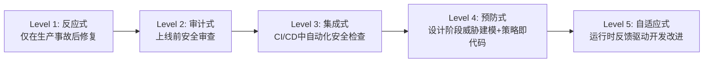
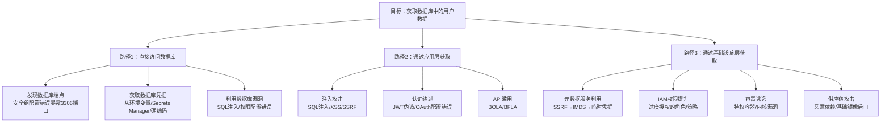
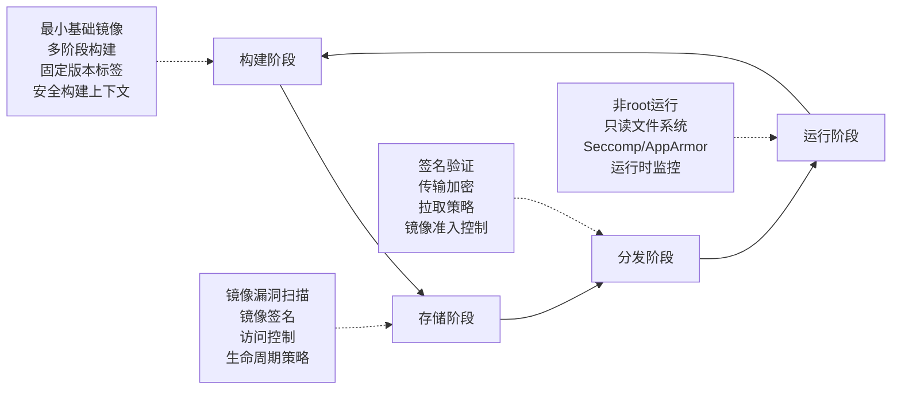

## 19.7 云安全开发生命周期

传统的软件开发生命周期（SDLC）将安全视为上线前的最后一道关卡——在测试阶段做一次渗透测试，修复几个高危漏洞，然后部署上线。这种模式在云原生时代已经彻底失效：基础设施以代码形式定义，容器镜像每天构建数十次，微服务通过 API 网关相互调用，任何一个环节的安全缺陷都可能在几分钟内被自动化攻击工具利用。

云安全开发生命周期（Cloud Security SDLC）的核心理念是**将安全能力嵌入从设计到退役的每一个阶段**，形成持续的安全反馈循环。本节将从理论框架、各阶段实践方法、自动化工具链三个维度，系统性地展开这个主题。

### 19.7.1 安全左移：从理念到工程实践

"安全左移"（Shift Left Security）是云安全 SDLC 的核心范式。其含义不是简单地把安全测试提前，而是**在开发生命周期的每个阶段都注入相应的安全能力**，让安全问题在产生的当下就被发现和修复。

#### 为什么必须左移

IBM System Science Institute 的研究数据表明：在设计阶段发现并修复一个安全缺陷的成本为 1x，在编码阶段为 6.5x，在测试阶段为 15x，在生产环境则飙升到 100x。在云环境中这个倍数更大，因为：

- **基础设施即代码**（IaC）的安全缺陷会通过自动化流水线被快速复制到所有环境
- **容器镜像**一旦构建完成并推送到镜像仓库，不安全的基础镜像会被下游数百个服务引用
- **IAM 策略**的过度授权在云环境中呈指数扩散——一个过度授权的角色可能被数百个 Lambda 函数或 EC2 实例使用
- **云资源配置错误**可在数秒内暴露敏感数据，攻击者使用自动化扫描工具（如 S3 桶扫描器）的发现速度以分钟计

#### 安全左移的成熟度模型

安全左移不是一个二元状态，而是一个渐进成熟的过程：



| 级别 | 特征 | 典型组织表现 | 安全缺陷逃逸率 |
|------|------|-------------|---------------|
| L1 反应式 | 安全团队是"灭火队"，只在出事后介入 | 没有安全测试，依赖 WAF 和防火墙 | > 60% 缺陷进入生产 |
| L2 审计式 | 上线前进行人工安全审查或渗透测试 | 季度/年度渗透测试，安全审查阻塞发布 | 30-60% |
| L3 集成式 | SAST/DAST/SCA 集成到 CI/CD 管道 | 每次构建自动运行安全扫描 | 10-30% |
| L4 预防式 | 设计阶段威胁建模，IaC 策略引擎阻止不安全配置 | PR 合并前强制安全检查门禁 | 5-10% |
| L5 自适应式 | 运行时安全事件自动反馈到开发流程 | 安全事件自动生成修复任务 | < 5% |

大多数企业级云用户处于 L2-L3 阶段。达到 L4 需要组织级别的工程投入，L5 则需要完整的安全可观测性平台支撑。

### 19.7.2 设计阶段：威胁建模与安全架构

设计阶段是安全左移的起点，也是投入产出比最高的阶段。在这个阶段发现一个架构级安全缺陷，比在生产环境中被攻击者利用后才修复，节省的成本可达 100 倍以上。

#### 云环境威胁建模方法论

威胁建模的核心问题是："这个系统可能受到哪些攻击？攻击路径是什么？我们如何防御？"

在云环境中，威胁建模需要额外考虑以下维度：

**1. STRIDE 模型的云扩展**

微软的 STRIDE 模型是威胁建模的经典框架，在云环境中需要针对每个云服务类型进行扩展：

| 威胁类型 | 传统含义 | 云环境扩展含义 |
|----------|---------|---------------|
| **S**poofing（仿冒） | 伪造用户身份 | 伪造云服务身份（如 Lambda 伪装成 EC2 发起请求）、IMDS 欺骗、STS Token 冒用 |
| **T**ampering（篡改） | 修改数据 | 篡改 S3 对象、修改 Lambda 环境变量、污染容器镜像仓库 |
| **R**epudiation（抵赖） | 否认操作 | 利用 CloudTrail 日志缺失或被禁用来否认操作、跨账户操作溯源困难 |
| **I**nformation Disclosure（信息泄露） | 数据泄露 | 元数据服务泄露临时凭据、公开的 S3/GCS 桶、日志中暴露密钥 |
| **D**enial of Service（拒绝服务） | 资源耗尽 | API 速率限制耗尽、Lambda 并发限制滥用、费用耗尽攻击 |
| **E**levation of Privilege（权限提升） | 越权操作 | IAM 角色链式提升、跨账户信任策略滥用、Kubernetes RBAC 逃逸 |

**2. 数据流图（DFD）的云化改造**

传统 DFD 只关注进程、数据存储和数据流。云环境的 DFD 需要增加以下元素：

- **信任边界**：不仅包括网络边界，还包括账户边界、VPC 边界、Kubernetes 命名空间边界
- **管理平面与数据平面**：区分 API 控制操作和实际数据流
- **第三方依赖**：SaaS API、CDN、DNS 提供商的交互点
- **临时凭据传播路径**：STS AssumeRole 链、OIDC Token 交换路径

**3. 攻击树的构建示例**

以一个典型的云原生 Web 应用为例，从攻击者视角构建攻击树：



#### 安全架构评审清单

在设计阶段的安全评审中，以下是必须覆盖的检查项：

```yaml
# 云安全架构评审清单模板
security_architecture_review:
  identity_and_access:
    - 是否使用最小权限原则配置 IAM？
    - 是否避免使用 root/admin 账户执行日常操作？
    - 敏感操作是否启用 MFA？
    - 是否使用短期临时凭据而非长期访问密钥？
    - 服务间的调用是否使用 IAM 角色而非共享凭据？
    - 是否有定期的权限审查和清理流程？

  network:
    - 是否使用 VPC/VNet 进行网络隔离？
    - 是否遵循最小开放端口原则？
    - 是否使用私有子网部署后端服务？
    - 跨服务通信是否加密（TLS/mTLS）？
    - 是否有网络流量监控和异常检测？

  data_protection:
    - 数据是否按敏感度分类？
    - 静态数据是否加密？密钥如何管理？
    - 传输中数据是否使用 TLS 1.2+？
    - 数据备份是否加密且定期测试恢复？
    - 是否有数据生命周期管理策略？

  compute:
    - 容器镜像是否来自受信任的基础镜像？
    - 是否实施镜像签名和验证？
    - 运行时是否使用最小权限（非 root 用户）？
    - 是否有资源限制（CPU/Memory）防止资源耗尽？
    - 无服务器函数是否配置了最小执行权限？

  logging_and_monitoring:
    - 是否启用云平台审计日志（CloudTrail/Activity Log）？
    - 日志是否集中存储且不可篡改？
    - 是否有安全事件告警规则？
    - 日志保留周期是否满足合规要求？
```

### 19.7.3 开发阶段：安全编码实践

开发阶段的安全实践决定了代码层面的安全基线。云原生应用有其独特的安全编码挑战，主要来自三个方面：云服务 API 的安全调用、敏感数据的处理、以及第三方依赖的安全管理。

#### 云原生安全编码规范

**1. 凭据管理**

云环境中最常见的安全反模式是硬编码凭据。以下是正确的做法：

```python
# ❌ 错误：硬编码凭据
import boto3
client = boto3.client(
    's3',
    aws_access_key_id='YOUR_AWS_KEY_ID',
    aws_secret_access_key='YOUR_AWS_SECRET_KEY'
)

# ✅ 正确：使用 SDK 默认凭据链
import boto3
# SDK 自动按以下顺序查找凭据：
# 1. 环境变量 (AWS_ACCESS_KEY_ID / AWS_SECRET_ACCESS_KEY)
# 2. 共享凭据文件 (~/.aws/credentials)
# 3. IAM 角色（EC2/ECS/Lambda 运行时）
# 4. OIDC Token（用于 GitHub Actions 等 CI/CD 环境）
client = boto3.client('s3')

# ✅ 正确：需要显式指定角色时使用 STS AssumeRole
import boto3
sts = boto3.client('sts')
credentials = sts.assume_role(
    RoleArn='arn:aws:iam::123456789012:role/S3ReadOnly',
    RoleSessionName='data-pipeline'
)['Credentials']
s3 = boto3.client(
    's3',
    aws_access_key_id=credentials['AccessKeyId'],
    aws_secret_access_key=credentials['SecretAccessKey'],
    aws_session_token=credentials['SessionToken']
)
```

**2. 敏感数据处理**

```python
# ❌ 错误：将敏感信息写入日志
logger.info(f"Processing order for user {user.email}, "
            f"credit_card={user.credit_card}")

# ✅ 正确：脱敏后记录
logger.info(f"Processing order for user {mask_email(user.email)}, "
            f"payment_method=credit_card_ending_{user.credit_card[-4:]}")

def mask_email(email: str) -> str:
    """将 email 脱敏显示"""
    local, domain = email.split('@')
    if len(local) <= 2:
        masked_local = local[0] + '***'
    else:
        masked_local = local[0] + '***' + local[-1]
    return f"{masked_local}@{domain}"

# ❌ 错误：将 secrets 存储在环境变量明文中
os.environ['DB_PASSWORD'] = 'Myyour_password123'

# ✅ 正确：从 Secrets Manager 获取
import json, boto3
def get_secret(secret_name: str) -> dict:
    client = boto3.client('secretsmanager')
    response = client.get_secret_value(SecretId=secret_name)
    return json.loads(response['SecretString'])
```

**3. SSRF 防护**

SSRF（服务端请求伪造）是云环境中最危险的漏洞类型之一，因为它可以直接访问元数据服务获取临时凭据：

```python
import ipaddress, urllib.parse
from urllib.parse import urlparse

# SSRF 防护：验证目标 URL
BLOCKED_CIDRS = [
    ipaddress.ip_network('10.0.0.0/8'),
    ipaddress.ip_network('172.16.0.0/12'),
    ipaddress.ip_network('192.168.0.0/16'),
    ipaddress.ip_network('169.254.169.254/32'),  # AWS IMDS
    ipaddress.ip_network('fd00:ec2::254/128'),    # AWS IMDSv6 (link-local)
]

def validate_url(url: str) -> bool:
    """验证 URL 是否安全，防止 SSRF 攻击"""
    parsed = urlparse(url)

    # 只允许 http/https 协议
    if parsed.scheme not in ('http', 'https'):
        return False

    # 获取主机名并解析为 IP
    hostname = parsed.hostname
    try:
        import socket
        ip = socket.gethostbyname(hostname)
        ip_addr = ipaddress.ip_address(ip)
    except (socket.gaierror, ValueError):
        return False

    # 检查是否在黑名单中
    for cidr in BLOCKED_CIDRS:
        if ip_addr in cidr:
            return False

    return True

# 使用示例
import requests
def safe_fetch(url: str) -> str:
    if not validate_url(url):
        raise ValueError(f"URL blocked by SSRF protection: {url}")
    response = requests.get(url, timeout=10, allow_redirects=False)
    return response.text
```

#### 依赖项安全管理

现代云原生应用通常有数百个直接依赖和数千个传递依赖，任何一个存在已知漏洞都可能成为攻击入口。

**依赖安全扫描工具对比：**

| 工具 | 类型 | 扫描范围 | 集成方式 | 开源/商业 |
|------|------|---------|---------|----------|
| Snyk | SCA | CVE + 可利用性分析 | CI/CD、IDE、Git | 商业（有免费层） |
| Trivy | SCA + 容器 | CVE + 配置 + 密钥 | CLI、CI/CD | 开源 |
| OWASP Dependency-Check | SCA | CVE（NVD 数据库） | Maven/Gradle/CI | 开源 |
| npm audit / pip audit | SCA | 包管理器特定漏洞 | CLI | 内置 |
| Socket.dev | 供应链 | 恶意行为检测（非 CVE） | CI/CD、Git | 商业 |
| Dependabot | SCA | CVE + 自动修复 PR | GitHub 原生 | GitHub 内置 |

**依赖安全最佳实践：**

```yaml
# GitHub Actions 中的依赖安全检查示例
name: Dependency Security
on:
  pull_request:
  schedule:
    - cron: '0 6 * * 1'  # 每周一早上扫描

jobs:
  dependency-check:
    runs-on: ubuntu-latest
    steps:
      - uses: actions/checkout@v4

      # Trivy 扫描文件系统依赖
      - name: Trivy FS Scan
        uses: aquasecurity/trivy-action@master
        with:
          scan-type: 'fs'
          scan-ref: '.'
          severity: 'CRITICAL,HIGH'
          exit-code: '1'  # 发现高危漏洞时失败

      # 锁定文件完整性检查
      - name: Verify lockfile integrity
        run: |
          npm ci --ignore-scripts  # 使用 ci 而非 install 确保一致性
          pip install --require-hashes -r requirements.txt
```

### 19.7.4 测试阶段：多层次安全验证

测试阶段的安全活动是左移策略中自动化的重点。在云环境中，安全测试需要覆盖四个层面：代码（SAST）、运行时（DAST）、依赖（SCA）、以及基础设施配置（IaC Scanning）。

#### SAST（静态应用安全测试）

SAST 在不运行代码的情况下分析源代码，发现潜在的安全漏洞。

**主流 SAST 工具对比：**

| 工具 | 支持语言 | 特点 | 适用场景 |
|------|---------|------|---------|
| Semgrep | 30+ 语言 | 规则灵活，支持自定义模式匹配 | 团队安全规则标准化 |
| CodeQL | Java/C++/Python/JS/Go/C#/Ruby | 深度数据流分析，GitHub 原生集成 | GitHub 项目首选 |
| SonarQube | 30+ 语言 | 安全 + 代码质量一体化 | 企业级代码质量管理 |
| Bandit | Python | Python 专项安全分析 | Python 项目必备 |
| ESLint + security 插件 | JavaScript/TypeScript | 集成到现有 lint 流程 | JS/TS 项目最低成本方案 |
| gosec | Go | Go 专项安全分析 | Go 项目必备 |

**自定义 Semgrep 规则示例（检测云环境常见安全问题）：**

```yaml
# .semgrep/cloud-security-rules.yaml
rules:
  # 检测硬编码的 AWS 访问密钥
  - id: aws-hardcoded-keys
    patterns:
      - pattern-either:
          - pattern: |
              aws_access_key_id = "AKIA..."
          - pattern: |
              $VAR = "AKIA..."
    message: >
      检测到硬编码的 AWS 访问密钥。
      请使用 IAM 角色、环境变量或 Secrets Manager。
    severity: ERROR
    languages: [python, javascript, typescript, java, go]
    metadata:
      category: security
      subcategory: cloud-credentials

  # 检测不安全的 S3 存储桶策略
  - id: s3-public-bucket-policy
    patterns:
      - pattern: |
          {
            "Principal": "*",
            ...
          }
    message: >
      S3 存储桶策略允许公开访问。请确保不是有意为之。
    severity: WARNING
    languages: [json]

  # 检测 SSRF 风险：未验证的用户输入传递给 HTTP 请求
  - id: ssrf-risk
    patterns:
      - pattern: |
          requests.get($URL, ...)
      - pattern-not: |
          requests.get(validate_url(...), ...)
    message: >
      检测到潜在的 SSRF 风险：用户可控的 URL 未经验证。
    severity: ERROR
    languages: [python]
```

#### DAST（动态应用安全测试）

DAST 在应用运行时发送攻击载荷，检测实际可利用的漏洞。DAST 的优势在于误报率低于 SAST，因为它验证的是真实行为而非代码模式。

**DAST 在 CI/CD 中的集成模式：**

```yaml
# 使用 OWASP ZAP 在 staging 环境进行 DAST 扫描
name: DAST Security Scan
on:
  deployment_status:
    environment: staging

jobs:
  zap-scan:
    runs-on: ubuntu-latest
    if: github.event.deployment_status.state == 'success'
    steps:
      - name: ZAP Full Scan
        uses: zaproxy/action-full-scan@v0.7.0
        with:
          target: ${{ secrets.STAGING_URL }}
          rules_file_name: '.zap/rules.tsv'
          cmd_options: '-a -j -l WARN -z "-config api.disablekey=true"'
          allow_issue_writing: false

      # 将结果上传到安全仪表盘
      - name: Upload results
        uses: actions/upload-artifact@v4
        with:
          name: zap-report
          path: zap-report.*
```

**DAST 扫描的局限性和应对：**

DAST 不是万能的。在云原生环境中，DAST 面临以下挑战：

- **API 驱动的应用**：传统的基于浏览器的爬虫无法覆盖 REST/gRPC API。解决方案：结合 API 规范（OpenAPI/Swagger）进行 API 安全测试
- **异步处理**：消息队列驱动的后端处理流程不会被 HTTP 请求触发。解决方案：使用专门的 API 安全测试工具如 Postman + Newman
- **认证复杂性**：OAuth2/OIDC 流程、多因子认证增加了自动扫描的难度。解决方案：预配置认证令牌，使用 ZAP 的认证插件

#### IaC 安全扫描

基础设施即代码的安全扫描是云安全 SDLC 中最具特色的环节。IaC 模板中的配置错误会直接导致云资源暴露。

```yaml
# 不安全的 Terraform 示例：S3 桶公开可读
resource "aws_s3_bucket" "data" {
  bucket = "my-app-data-bucket"
}

resource "aws_s3_bucket_public_access_block" "data" {
  bucket = aws_s3_bucket.data.id
  # ❌ 所有公开访问限制都被关闭
  block_public_acls       = false
  block_public_policy     = false
  ignore_public_acls      = false
  restrict_public_buckets = false
}

# ✅ 修复后的安全配置
resource "aws_s3_bucket" "data" {
  bucket = "my-app-data-bucket"
}

resource "aws_s3_bucket_public_access_block" "data" {
  bucket                  = aws_s3_bucket.data.id
  block_public_acls       = true
  block_public_policy     = true
  ignore_public_acls      = true
  restrict_public_buckets = true
}

resource "aws_s3_bucket_server_side_encryption_configuration" "data" {
  bucket = aws_s3_bucket.data.id
  rule {
    apply_server_side_encryption_by_default {
      sse_algorithm = "aws:kms"
    }
  }
}
```

**IaC 安全扫描工具：**

| 工具 | 支持平台 | 扫描能力 | 集成方式 |
|------|---------|---------|---------|
| Checkov | Terraform/CloudFormation/K8s/Docker | 1000+ 内置策略 | CLI、CI/CD、PR 评论 |
| tfsec | Terraform | AWS/Azure/GCP 专项策略 | CLI、CI/CD |
| KICS | Terraform/CloudFormation/Azure ARM/K8s/Docker | 多 IaC 格式统一扫描 | CLI、CI/CD |
| cfn-lint | CloudFormation | CloudFormation 语法和安全验证 | CLI、pre-commit |
| Terrascan | Terraform/K8s/Helm | OPA Rego 策略引擎 | CLI、Admission Controller |

**Checkov 在 CI/CD 中的集成：**

```yaml
# GitLab CI 中的 IaC 安全扫描
iac_security:
  stage: security
  image: bridgecrew/checkov:latest
  script:
    # 扫描 Terraform 目录
    - checkov -d terraform/ --framework terraform --output junitxml > checkov-tf.xml
    # 扫描 Kubernetes 清单
    - checkov -d k8s/ --framework kubernetes --output junitxml > checkov-k8s.xml
    # 扫描 Dockerfile
    - checkov -f Dockerfile --framework dockerfile --output junitxml > checkov-docker.xml
  artifacts:
    reports:
      junit: checkov-*.xml
  allow_failure: false  # 安全扫描失败则阻塞部署
```

### 19.7.5 部署阶段：安全配置验证与运行时保护

部署阶段是安全左移策略的最后一道防线。即使通过了所有前置安全检查，运行时仍可能因为配置漂移、零日漏洞或供应链攻击而出现安全问题。

#### 部署阶段安全检查清单

```yaml
# 部署前安全门禁（示例：ArgoCD Sync Hook）
apiVersion: batch/v1
kind: Job
metadata:
  name: pre-deploy-security-check
  annotations:
    argocd.argoproj.io/hook: PreSync
spec:
  template:
    spec:
      containers:
        - name: security-check
          image: security-checker:latest
          command:
            - /bin/sh
            - -c
            - |
              echo "=== 部署前安全检查 ==="

              # 1. 镜像签名验证
              cosign verify --key cosign.pub ${IMAGE}

              # 2. 漏洞扫描（允许部署无 CRITICAL 漏洞的镜像）
              trivy image --exit-code 1 --severity CRITICAL ${IMAGE}

              # 3. K8s 清单安全检查
              kubesec scan k8s/deployment.yaml

              # 4. 密钥泄露检查
              trufflehog filesystem --directory /manifests --fail

              echo "=== 安全检查通过 ==="
      restartPolicy: Never
```

#### 运行时安全保护

运行时安全是云安全 SDLC 中唯一不依赖代码变更的阶段，但它产生的安全发现应该反馈回开发流程：

**1. 容器运行时安全**

```yaml
# Kubernetes Pod Security Standards (PSS) - Restricted 级别
apiVersion: v1
kind: Pod
metadata:
  name: secure-app
spec:
  # 强制非 root 用户
  securityContext:
    runAsNonRoot: true
    runAsUser: 1000
    runAsGroup: 1000
    fsGroup: 1000
    seccompProfile:
      type: RuntimeDefault
  containers:
    - name: app
      image: myapp:v1.0.0@sha256:abc123...  # 使用 digest 而非 tag
      securityContext:
        allowPrivilegeEscalation: false
        readOnlyRootFilesystem: true
        capabilities:
          drop:
            - ALL
      resources:
        limits:
          cpu: "500m"
          memory: "256Mi"
        requests:
          cpu: "100m"
          memory: "128Mi"
      volumeMounts:
        - name: tmp
          mountPath: /tmp
  volumes:
    - name: tmp
      emptyDir:
        sizeLimit: "100Mi"
```

**2. 云平台运行时监控**

```python
# 使用 CloudWatch + EventBridge 监控敏感操作
# 当检测到不安全操作时自动触发修复

import boto3
import json

def lambda_handler(event, context):
    """
    EventBridge 规则触发：
    检测到 S3 桶公开访问策略变更时自动修复
    """
    detail = event['detail']
    bucket_name = detail['requestParameters']['bucketName']

    s3 = boto3.client('s3')
    s3control = boto3.client('s3control')

    # 立即阻止公开访问
    s3.put_public_access_block(
        Bucket=bucket_name,
        PublicAccessBlockConfiguration={
            'BlockPublicAcls': True,
            'IgnorePublicAcls': True,
            'BlockPublicPolicy': True,
            'RestrictPublicBuckets': True
        }
    )

    # 发送告警通知
    sns = boto3.client('sns')
    sns.publish(
        TopicArn='arn:aws:sns:us-east-1:123456789012:security-alerts',
        Subject=f'[安全告警] S3 桶公开访问已自动修复',
        Message=json.dumps({
            'bucket': bucket_name,
            'action': 'auto-remediated',
            'event_time': detail['eventTime'],
            'user_identity': detail.get('userIdentity', {})
        }, indent=2)
    )

    return {'statusCode': 200, 'body': 'Remediated'}
```

### 19.7.6 DevSecOps 工程实践

DevSecOps 不是一个独立的阶段，而是将安全能力贯穿整个开发运维流程的工程实践。以下是云环境中 DevSecOps 的三大核心领域。

#### 策略即代码（Policy as Code）

策略即代码是云安全 SDLC 中最强大的工程实践之一。它将安全策略从人脑中的规则转化为机器可执行的代码，实现安全策略的版本化、自动化和一致性执行。

```python
# 使用 OPA（Open Policy Agent）定义 Kubernetes 安全策略
# policy.rego - 拒绝特权容器和 root 用户
package kubernetes.admission

deny[msg] {
    input.request.kind.kind == "Pod"
    container := input.request.object.spec.containers[_]
    container.securityContext.privileged == true
    msg := sprintf("容器 '%s' 不允许以特权模式运行", [container.name])
}

deny[msg] {
    input.request.kind.kind == "Pod"
    not input.request.object.spec.securityContext.runAsNonRoot
    msg := "Pod 必须设置 runAsNonRoot: true"
}

deny[msg] {
    input.request.kind.kind == "Pod"
    container := input.request.object.spec.containers[_]
    not container.resources.limits.memory
    msg := sprintf("容器 '%s' 必须设置内存限制", [container.name])
}

deny[msg] {
    input.request.kind.kind == "Pod"
    container := input.request.object.spec.containers[_]
    endswith(container.image, ":latest")
    msg := sprintf("容器 '%s' 不允许使用 latest 标签", [container.name])
}
```

```yaml
# 使用 Gatekeeper 将 OPA 策略部署为 Kubernetes 准入控制器
apiVersion: constraints.gatekeeper.sh/v1beta1
kind: K8sPSPPrivilegedContainer
metadata:
  name: prevent-privileged-containers
spec:
  match:
    kinds:
      - apiGroups: [""]
        kinds: ["Pod"]
    namespaces:
      - "!kube-system"  # 排除系统命名空间
  parameters:
    allowPrivileged: false
```

#### CI/CD 管道安全

CI/CD 管道本身是高价值攻击目标——它拥有对源代码、构建环境、镜像仓库、甚至生产环境的访问权限。

**CI/CD 安全威胁模型：**

| 攻击面 | 威胁描述 | 防御措施 |
|--------|---------|---------|
| 代码仓库 | 恶意 PR 注入后门代码 | 分支保护规则、代码审查、自动安全扫描 |
| 构建环境 | 构建脚本被篡改、构建缓存投毒 | 沙箱化构建、固定工具版本、缓存签名 |
| 依赖供应链 | 恶意包注入（typosquatting） | 锁定文件验证、私有镜像仓库、依赖审计 |
| Secrets | CI/CD 中的凭据泄露 | OIDC 临时凭据、最小权限、Secrets 扫描 |
| 产物 | 构建产物被篡改 | 产物签名（cosign/Sigstore）、不可变标签 |
| 部署 | 未授权部署到生产环境 | 环境保护规则、审批门禁、部署审计日志 |

**GitHub Actions 安全管道完整示例：**

```yaml
name: Secure CI/CD Pipeline
on:
  push:
    branches: [main]
  pull_request:
    branches: [main]

permissions:
  contents: read  # 最小权限原则

jobs:
  # 阶段 1：代码安全扫描
  sast:
    runs-on: ubuntu-latest
    steps:
      - uses: actions/checkout@v4
        with:
          persist-credentials: false

      - name: Semgrep SAST
        uses: semgrep/semgrep-action@v1
        with:
          config: >-
            p/security-audit
            p/secrets
            p/owasp-top-ten
          generateSarif: true

      - name: Upload SARIF
        uses: github/codeql-action/upload-sarif@v3
        with:
          sarif_file: semgrep.sarif

  # 阶段 2：依赖安全扫描
  sca:
    runs-on: ubuntu-latest
    steps:
      - uses: actions/checkout@v4

      - name: Trivy Filesystem Scan
        uses: aquasecurity/trivy-action@master
        with:
          scan-type: 'fs'
          severity: 'CRITICAL,HIGH'
          format: 'sarif'
          output: 'trivy-fs.sarif'

  # 阶段 3：构建并扫描容器镜像
  container:
    runs-on: ubuntu-latest
    needs: [sast, sca]
    if: github.ref == 'refs/heads/main'
    permissions:
      contents: read
      packages: write
      id-token: write  # OIDC 用于 cosign 签名
    steps:
      - uses: actions/checkout@v4

      # 使用 OIDC 认证推送到 GHCR（无长期密钥）
      - name: Login to GHCR
        uses: docker/login-action@v3
        with:
          registry: ghcr.io
          username: ${{ github.actor }}
          password: ${{ secrets.GITHUB_TOKEN }}

      - name: Build and Push
        id: build
        uses: docker/build-push-action@v5
        with:
          push: true
          tags: ghcr.io/${{ github.repository }}:${{ github.sha }}

      # 容器漏洞扫描
      - name: Trivy Container Scan
        uses: aquasecurity/trivy-action@master
        with:
          image-ref: ghcr.io/${{ github.repository }}:${{ github.sha }}
          severity: 'CRITICAL'
          exit-code: '1'

      # 镜像签名（Sigstore keyless signing）
      - name: Install Cosign
        uses: sigstore/cosign-installer@v3

      - name: Sign Image
        run: |
          cosign sign --yes \
            ghcr.io/${{ github.repository }}@${{ steps.build.outputs.digest }}

  # 阶段 4：部署到 Staging + 安全测试
  deploy-staging:
    runs-on: ubuntu-latest
    needs: [container]
    environment: staging
    steps:
      - name: Deploy to Staging
        run: |
          # 部署并等待就绪
          kubectl apply -f k8s/staging/
          kubectl rollout status deployment/app -n staging --timeout=300s

      - name: DAST Scan
        run: |
          docker run --rm \
            -v $(pwd):/zap/wrk/ \
            owasp/zap2docker-stable zap-full-scan.py \
            -t ${{ vars.STAGING_URL }} \
            -r zap-report.html
```

#### 容器镜像安全全生命周期

容器安全贯穿构建、存储、分发和运行四个阶段：



**安全 Dockerfile 最佳实践：**

```dockerfile
# 阶段 1：构建阶段（使用完整镜像编译）
FROM python:3.12-slim AS builder

WORKDIR /build
COPY requirements.txt .
# 使用 pip wheel 构建所有依赖（离线安装）
RUN pip wheel --no-cache-dir --wheel-dir /build/wheels -r requirements.txt

# 阶段 2：运行阶段（最小化镜像）
FROM python:3.12-slim AS runtime

# 安全元数据
LABEL org.opencontainers.image.source="https://github.com/org/app"
LABEL org.opencontainers.image.description="Secure App"

# 安装最小运行时依赖 + 创建非 root 用户
RUN apt-get update && \
    apt-get install -y --no-install-recommends \
        tini && \
    rm -rf /var/lib/apt/lists/* && \
    groupadd -r appuser && \
    useradd -r -g appuser -d /app -s /sbin/nologin appuser

WORKDIR /app

# 先复制依赖再复制代码（利用 Docker 层缓存）
COPY --from=builder /build/wheels /tmp/wheels
COPY requirements.txt .
RUN pip install --no-cache-dir --no-index --find-links=/tmp/wheels \
        -r requirements.txt && \
    rm -rf /tmp/wheels

COPY --chown=appuser:appuser . .

# 切换到非 root 用户
USER appuser

# 使用 tini 作为 PID 1（正确处理信号和僵尸进程）
ENTRYPOINT ["tini", "--"]
CMD ["python", "-m", "uvicorn", "app.main:app", "--host", "0.0.0.0", "--port", "8080"]

# 健康检查
HEALTHCHECK --interval=30s --timeout=3s --start-period=5s \
    CMD python -c "import urllib.request; urllib.request.urlopen('http://localhost:8080/health')"
```

### 19.7.7 安全度量与持续改进

云安全 SDLC 的有效性需要通过量化指标来衡量和改进。以下是关键的安全度量维度：

#### 核心安全指标

| 指标 | 定义 | 目标值 | 意义 |
|------|------|--------|------|
| MTTR（平均修复时间） | 从发现漏洞到修复的平均时间 | CRITICAL: < 24h, HIGH: < 7d | 衡量安全响应速度 |
| 漏洞逃逸率 | 进入生产环境的已知漏洞占比 | < 5% | 衡量左移策略有效性 |
| 安全扫描覆盖率 | CI/CD 中执行安全扫描的管道占比 | 100% | 衡量安全自动化程度 |
| 密钥泄露响应时间 | 从密钥泄露到吊销的平均时间 | < 1h | 衡量凭据管理能力 |
| 安全策略合规率 | 通过策略即代码检查的部署占比 | > 95% | 衡量策略执行一致性 |
| 依赖更新率 | 依赖项保持最新安全补丁的占比 | > 90% | 衡量供应链安全 |

#### 安全度量仪表盘设计

```python
# 安全度量收集示例：从多个数据源聚合指标
import boto3
from datetime import datetime, timedelta

def collect_security_metrics():
    """聚合云安全 SDLC 各阶段的度量指标"""
    metrics = {}

    # 1. CI/CD 安全扫描指标
    # 从 GitHub API 获取最近的安全告警统计
    metrics['sast_findings'] = {
        'critical': 3,
        'high': 12,
        'medium': 45,
        'trend': 'decreasing'  # 趋势：减少
    }

    # 2. 容器镜像漏洞
    # 从 ECR 获取镜像扫描结果
    ecr = boto3.client('ecr')
    scan_results = ecr.describe_image_scan_findings(
        repositoryName='my-app',
        imageId={'imageTag': 'latest'}
    )
    metrics['container_vulnerabilities'] = {
        'critical': 0,  # 目标：0 个 CRITICAL 漏洞
        'high': 5,
        'scan_coverage': '100%'
    }

    # 3. IaC 合规率
    # 从 Checkov/Prisma 获取策略检查结果
    metrics['iac_compliance'] = {
        'pass_rate': 0.97,  # 97% 的 IaC 通过安全策略
        'top_violations': [
            'S3 bucket without encryption',
            'Security group allows 0.0.0.0/0'
        ]
    }

    # 4. 平均修复时间
    metrics['mttr'] = {
        'critical_hours': 8,    # CRITICAL 漏洞平均 8 小时修复
        'high_hours': 72,       # HIGH 漏洞平均 72 小时修复
        'target_critical': 24,  # 目标：< 24 小时
        'target_high': 168      # 目标：< 7 天
    }

    return metrics
```

### 19.7.8 常见误区与纠正

在实施云安全 SDLC 的过程中，组织经常陷入以下误区：

**误区一：安全扫描等于安全**

错误认知：只要在 CI/CD 中集成了 SAST/DAST/SCA，就实现了 DevSecOps。

纠正：安全扫描只是安全 SDLC 的一个环节。没有威胁建模、安全架构设计、策略即代码和运行时保护的配合，扫描结果会被淹没在大量误报中，安全团队会变成"告警疲劳"的受害者。完整的 DevSecOps 需要覆盖设计、编码、测试、部署、运行、响应六个阶段。

**误区二：安全左移意味着安全团队全权负责**

错误认知：安全左移后，所有安全责任都转移到安全团队。

纠正：安全左移的真正含义是**将安全责任分摊到每个开发阶段的执行者身上**。设计阶段的安全由架构师负责，编码阶段的安全由开发者负责，运维阶段的安全由 SRE 负责。安全团队的角色从"执行者"转变为"赋能者"——提供工具、培训和策略框架。

**误区三：零信任意味着不信任任何人**

错误认知：零信任架构导致所有操作都需要复杂的认证流程，严重影响开发效率。

纠正：零信任的核心是**基于上下文的动态信任评估**，而非无差别地拒绝所有请求。正确的零信任实施是：对低风险操作（如读取公开配置）使用简化流程，对高风险操作（如访问生产数据库）实施严格验证。技术手段包括：基于属性的访问控制（ABAC）、风险自适应认证、持续的身份验证。

**误区四：容器安全就是镜像扫描**

错误认知：只要镜像通过了漏洞扫描，容器就是安全的。

纠正：镜像扫描只覆盖了构建阶段。容器安全的完整范围包括：构建安全（Dockerfile 安全、最小化镜像）、分发安全（镜像签名、仓库访问控制）、编排安全（K8s RBAC、网络策略、Pod 安全标准）、运行时安全（系统调用监控、异常行为检测、文件完整性监控）。一个通过了漏洞扫描的容器，仍然可能因为配置错误（如以 root 运行、特权模式、挂载 hostPath）而存在严重安全风险。

**误区五：多云 = 更安全**

错误认知：使用多个云提供商可以避免单点故障，因此更安全。

纠正：多云架构实际上**增加了安全复杂度**。每个云平台有不同的 IAM 模型、网络概念、安全服务和 API。多云环境需要统一的安全策略管理层、跨平台的身份联邦、以及一致的安全监控。如果没有这些基础能力就贸然采用多云，安全策略的不一致性和管理盲区反而会增加攻击面。正确的做法是先在一个平台上建立完善的安全能力，再有计划地扩展到多云。

### 19.7.9 进阶：安全反馈循环与自动化修复

L5 自适应式安全的核心是**运行时安全事件自动反馈到开发流程**，形成闭环。以下是实现这一目标的工程方案：

```python
# 安全反馈循环：运行时安全事件 → 自动创建修复任务
# 架构：EventBridge → Lambda → Jira/GitHub Issue + 自动修复 PR

import boto3, json, requests

def security_feedback_handler(event, context):
    """
    处理运行时安全事件，自动创建修复任务
    支持的事件类型：
    - GuardDuty 发现
    - Config 规则违规
    - 容器运行时告警（Falco/Sysdig）
    """
    detail = event['detail']
    event_type = event['source']

    # 解析安全事件
    finding = parse_security_finding(event_type, detail)

    # 根据严重级别决定处理策略
    if finding['severity'] == 'CRITICAL':
        # CRITICAL：自动创建紧急修复任务 + 触发 PagerDuty
        create_urgent_issue(finding)
        trigger_incident_response(finding)

        # 如果有预定义的自动修复方案，直接执行
        if finding['auto_remediation']:
            execute_auto_remediation(finding)

    elif finding['severity'] == 'HIGH':
        # HIGH：创建标准修复任务并关联到代码仓库
        create_security_issue(finding)
        # 尝试生成自动修复 PR
        if finding.get('remediation_template'):
            create_auto_fix_pr(finding)

    elif finding['severity'] in ('MEDIUM', 'LOW'):
        # MEDIUM/LOW：添加到安全待办列表
        add_to_security_backlog(finding)

    return {'statusCode': 200}

def parse_security_finding(event_type, detail):
    """解析不同来源的安全事件为统一格式"""
    if event_type == 'aws.guardduty':
        return {
            'title': detail['title'],
            'severity': map_guardduty_severity(detail['severity']),
            'resource': detail['resource'],
            'description': detail['description'],
            'auto_remediation': get_remediation(detail['type']),
            'remediation_template': get_fix_template(detail['type'])
        }
    # ... 其他事件源的解析逻辑
```

### 19.7.10 工具链全景

以下是云安全 SDLC 各阶段推荐的工具链：

| 阶段 | 开源工具 | 商业工具 | 云原生服务 |
|------|---------|---------|-----------|
| **设计** | OWASP Threat Dragon、pytm | IriusRisk、ThreatModeler | AWS Threat Composer |
| **编码** | Semgrep、ESLint-Security、Bandit | Snyk Code、Checkmarx SAST | GitHub Code Scanning |
| **依赖** | Trivy、OWASP Dependency-Check | Snyk、Mend（WhiteSource） | GitHub Dependabot |
| **IaC** | Checkov、tfsec、KICS | Prisma Cloud、Bridgecrew | AWS Config Rules |
| **容器** | Trivy、Grype、Dockle | Snyk Container、Aqua | AWS ECR Scanning、Azure Defender |
| **DAST** | OWASP ZAP、Nuclei | Burp Suite、HCL AppScan | AWS DAST |
| **密钥** | TruffleHog、Gitleaks、detect-secrets | GitGuardian、Snyk Secrets | AWS Secrets Manager |
| **运行时** | Falco、Open Policy Agent | Prisma Cloud、Aqua Runtime | AWS GuardDuty、Azure Defender |
| **编排** | Gatekeeper、Kyverno | Prisma Cloud、NeuVector | EKS Pod Identity、AKS Workload Identity |

### 19.7.11 本节小结

云安全开发生命周期的本质是将安全从"上线前的最后检查"转变为"贯穿全流程的持续工程实践"。其核心要点：

1. **安全左移不是口号，而是工程方法**：需要明确每个阶段的安全活动、负责角色和质量门禁
2. **策略即代码是关键基础设施**：将安全策略从人脑中的规则转化为机器可执行的代码，实现一致性执行
3. **自动化是可扩展性的前提**：人工安全审查无法跟上云原生的部署速度，必须依赖自动化安全工具链
4. **度量驱动持续改进**：MTTR、漏洞逃逸率、扫描覆盖率等指标是衡量安全 SDLC 有效性的标尺
5. **安全反馈闭环**：运行时安全发现必须能够自动反馈到开发流程，形成 L5 自适应式安全能力

安全不是阻碍开发速度的障碍，而是保障速度可持续的基础设施。正如 DevOps 不是运维团队的工作而是整个团队的文化，DevSecOps 也不是安全团队的专属——它是每个参与软件交付的人的共同责任。
