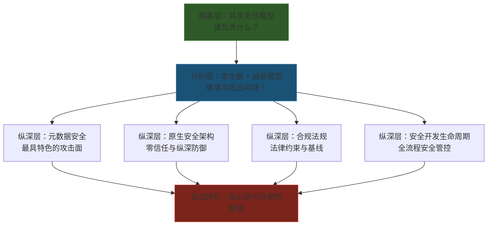

## 19.8 本章小结

本节从七个维度系统构建了云安全的理论框架：共享责任模型、云环境攻击面分析、云元数据服务安全、云安全威胁模型、云原生安全架构、云安全合规与法规、云安全开发生命周期。这七个主题并非孤立存在，它们共同构成了一棵从根到枝的知识树——共享责任模型是根基，攻击面分析和威胁模型是主干，元数据安全、原生架构、合规法规和开发生命周期是四条核心枝干。下面逐一回顾每个主题的关键认知，并将它们串联为一个可操作的思维框架。

### 19.8.1 七大核心主题回顾

#### 一、共享责任模型：划分边界，明确归属

共享责任模型是所有云安全策略的逻辑起点。它回答了一个最根本的问题：**谁该为哪一层的安全负责？**

本章19.1节详细解析了IaaS、PaaS、SaaS三种服务模型下责任边界的变化规律——随着抽象层次的提高，云提供商承担的安全责任越来越多，客户承担的越来越少，但客户对数据安全和访问控制的责任**始终不变**。这是贯穿整章的第一原则。

关键认知提炼：

| 维度 | IaaS | PaaS | SaaS |
|------|------|------|------|
| 物理安全 | 云提供商 | 云提供商 | 云提供商 |
| 网络安全 | 共担（客户管理安全组/NACL） | 共担（偏云提供商） | 云提供商 |
| 操作系统 | **客户** | 云提供商 | 云提供商 |
| 应用安全 | **客户** | **客户** | 云提供商 |
| 数据安全 | **客户** | **客户** | **客户** |
| 身份与访问 | **客户** | **客户** | **客户**（部分委托） |

核心启示：无论使用哪种服务模型，**数据安全和身份管理始终是客户的责任**。Capital One事件中泄露1.06亿客户数据的根本原因不是AWS的漏洞，而是客户侧IAM角色的过度授权——这正是共享责任模型在真实世界中的注脚。

#### 二、云环境攻击面分析：五维度系统认知

19.2节将云环境的攻击面归纳为五大维度，为后续各平台的攻防实践提供了统一的分析框架：

1. **身份与访问管理（IAM）攻击面**——过度授权的IAM策略、泄露的访问密钥（GitHub硬编码）、弱密码/无MFA、服务账户滥用。这是占比最大的攻击向量，约40%的云安全事件源于IAM配置错误。

2. **数据存储攻击面**——公开的S3桶/Blob Storage、不当的访问控制列表（ACL）、未加密的静态数据、跨账户共享配置错误。约25%的云安全事件与存储配置相关。

3. **计算资源攻击面**——EC2/VM实例元数据服务利用、Lambda环境变量泄露、容器逃逸（特权容器、挂载点滥用）、镜像供应链投毒。

4. **网络攻击面**——安全组规则过于宽松（0.0.0.0/0）、VPC对等连接配置错误、负载均衡器暴露内部服务、DNS劫持。

5. **供应链攻击面**——恶意Docker镜像、被篡改的Terraform/CloudFormation模块、第三方SaaS集成OAuth过度授权、CI/CD管道中的密钥泄露。

这五个维度不是彼此独立的。真实的云攻击链往往横跨多个维度，例如：从GitHub泄露的IAM密钥（维度1）→ 访问S3桶获取敏感数据（维度2）→ 利用S3中的配置文件发现内网IP（维度4）→ 横向移动到EC2实例（维度3）。

#### 三、云元数据服务安全：最具特色的攻击面

19.3节聚焦云安全中最具特色的攻击面之一——元数据服务（Metadata Service）。所有主流云提供商都在`169.254.169.254`这个链路本地地址上提供实例元数据服务，允许运行在云实例上的应用获取实例信息和临时凭据。

IMDSv1与IMDSv2的对比是本节的核心：

| 特性 | IMDSv1 | IMDSv2 |
|------|--------|--------|
| 请求方式 | 简单GET请求 | 先PUT获取Token，再用Token发GET请求 |
| SSRF防护 | **无**——攻击者可通过SSRF直接访问 | **有效**——PUT请求无法通过SSRF发起 |
| Token保护 | 不适用 | Token绑定到发起PUT请求的源IP |
| 跳数限制 | 不适用 | 默认限制1跳（阻止IP转发攻击） |
| 状态 | 遗留模式，AWS推荐禁用 | AWS推荐强制使用 |

核心启示：SSRF攻击链（Web漏洞→元数据服务→临时凭据→云资源访问）是Capital One事件的完整攻击路径。强制使用IMDSv2是阻断这条攻击链的关键防御措施。但IMDSv2并非万能——如果攻击者已经在实例内部（通过RCE获得代码执行权限），他们仍然可以直接调用元数据服务。因此，IAM角色的最小权限原则是更根本的防御。

#### 四、云安全威胁模型：STRIDE框架的云化应用

19.4节将经典的STRIDE威胁模型映射到云环境，为系统化的威胁分析提供了结构化方法：

| STRIDE类别 | 云环境中的具体威胁 | 攻击示例 |
|-----------|-------------------|---------|
| **S**poofing（欺骗） | IAM凭据窃取、服务账户冒充、控制台钓鱼 | 窃取GitHub硬编码的AWS密钥冒充合法用户 |
| **T**ampering（篡改） | 存储桶数据篡改、IaC模板注入、Lambda代码注入 | 篡改CloudFormation模板植入后门资源 |
| **R**epudiation（否认） | CloudTrail日志删除、审计记录篡改 | 攻击者在入侵后删除CloudTrail以掩盖痕迹 |
| **I**nformation Disclosure（信息泄露） | 元数据凭据泄露、存储桶公开访问、日志中敏感信息 | 通过SSRF获取IAM临时凭据并访问S3 |
| **D**enial of Service（拒绝服务） | API限速滥用、资源耗尽、配额攻击 | 创建大量资源耗尽账户配额阻止正常部署 |
| **E**levation of Privilege（权限提升） | IAM策略升级、角色链利用、K8s RBAC绕过 | 利用PassRole权限将高权限角色附加到可控资源 |

核心启示：STRIDE不是一个理论工具，而是实际渗透测试中的检查清单。在进行云安全评估时，对每个云服务逐一枚举STRIDE六类威胁，可以系统性地发现配置盲区。

#### 五、云原生安全架构：零信任与纵深防御

19.5节介绍了云原生安全的两大架构范式——零信任架构和纵深防御：

**零信任架构的核心原则：**

- **永不信任，始终验证**：所有访问无论来源（内网/外网）都需要身份验证
- **最小权限访问**：每次请求只授予完成当前任务所需的最小权限
- **假设已被攻破**：设计时假设网络内部已经存在攻击者，因此需要持续验证

**纵深防御的层次模型：**

```text
┌─────────────────────────────────────────────┐
│ 第7层：数据安全（加密、DLP、分类标记）         │
├─────────────────────────────────────────────┤
│ 第6层：应用安全（WAF、API网关、输入验证）       │
├─────────────────────────────────────────────┤
│ 第5层：计算安全（容器安全、镜像扫描、运行时防护）│
├─────────────────────────────────────────────┤
│ 第4层：网络安全（VPC、安全组、NACL、微分段）     │
├─────────────────────────────────────────────┤
│ 第3层：身份安全（IAM、MFA、SSO、条件策略）      │
├─────────────────────────────────────────────┤
│ 第2层：平台安全（配置基线、CIS Benchmark）       │
├─────────────────────────────────────────────┤
│ 第1层：物理安全（云提供商负责）                 │
└─────────────────────────────────────────────┘
```

核心启示：零信任不是某个产品，而是一种架构理念。在云环境中实施零信任的关键技术支撑是：身份感知代理（Identity-Aware Proxy）、微分段（Micro-segmentation）、持续自适应风险评估（CARTA）。没有单一产品能实现零信任，它需要在身份、网络、数据、应用各层协同落地。

#### 六、云安全合规与法规：法律层面的安全约束

19.6节梳理了影响云安全实践的主要合规框架。这些框架不是"纸面文章"——违规的代价是真金白银：

| 合规框架 | 适用领域 | 核心要求 | 违规处罚 |
|---------|---------|---------|---------|
| GDPR | 欧盟个人数据处理 | 数据最小化、知情同意、72小时泄露通知 | 全球营收4%或2000万欧元（取高者） |
| HIPAA | 美国医疗健康信息 | PHI加密、访问审计、BAA协议 | 每项违规最高150万美元/年 |
| PCI-DSS | 支付卡数据处理 | 持卡人数据加密、网络分段、定期渗透测试 | 每月$5,000-$100,000罚款直到合规 |
| SOC 2 | 服务组织安全控制 | 信任服务准则（安全性、可用性、机密性等） | 合同违约、客户流失 |
| 等保2.0 | 中国网络安全 | 分级保护、安全审计、数据分类分级 | 行政处罚、业务暂停、刑事责任 |
| ISO 27001 | 信息安全管理体系 | 风险评估、安全控制、持续改进 | 认证撤销、客户信任损失 |

核心启示：合规不是安全的替代品，但合规框架提供了安全控制的基线。对于渗透测试人员而言，理解合规要求有助于：（1）在报告中引用合规条款增强说服力；（2）识别组织因合规压力而特别关注的安全薄弱点；（3）理解数据分类和保护要求，避免测试过程中触犯法律红线。

#### 七、云安全开发生命周期：安全左移的实践路径

19.7节介绍了将安全融入开发全流程的"安全左移"（Shift Left）理念——越早发现安全问题，修复成本越低：

```text
发现阶段        设计→开发→测试→部署→运行
修复成本        $1 → $5 → $15 → $60 → $100+
                 ↑ 最便宜              ↑ 最昂贵
```

安全左移在各阶段的具体实践：

- **需求与设计阶段**：威胁建模（STRIDE/PASTA）、安全架构评审、合规需求分析
- **开发阶段**：安全编码规范（OWASP Top 10防护）、IDE安全插件实时提示、依赖项漏洞扫描（Dependabot/Snyk）
- **构建阶段**：SAST静态代码分析、容器镜像扫描（Trivy/Grype）、IaC安全检查（Checkov/tfsec）
- **测试阶段**：DAST动态安全测试、IAST交互式安全测试、渗透测试
- **部署阶段**：基础设施合规检查、密钥和配置审计、运行时策略注入
- **运行阶段**：CSPM持续监控、SIEM日志分析、漏洞赏金计划

核心启示：对于渗透测试人员，理解安全开发生命周期意味着：（1）知道在哪个阶段最容易发现问题（通常是开发和部署阶段的配置错误）；（2）能够评估目标组织的安全成熟度（是否有SAST/DAST流程、是否实施了IaC安全检查）；（3）在报告中建议修复措施时，指向具体的发展阶段而非泛泛而谈。

### 19.8.2 知识体系串联：从理论到实战的思维框架

上述七个主题可以被压缩为一个三层思维框架：



**实际运用示例**——以Capital One事件为例串联七个主题：

1. **共享责任模型**：WAF由客户管理，AWS提供IAM和元数据服务基础设施——客户需为IAM角色配置错误负责。
2. **攻击面分析**：攻击面跨越IAM（过度授权的角色）、网络（WAF配置允许SSRF）、元数据（IMDSv1未禁用）三个维度。
3. **元数据安全**：通过SSRF访问`169.254.169.254`获取IAM临时凭据——IMDSv2可阻断此路径。
4. **威胁模型**：属于STRIDE中的Information Disclosure（凭据泄露）和Elevation of Privilege（利用窃取的凭据访问S3）。
5. **原生安全架构**：零信任要求"假设已被攻破"——如果S3桶默认加密且IAM角色有数据分类限制，即使凭据泄露也能控制损害范围。
6. **合规法规**：泄露1.06亿客户的个人财务数据，涉及PCI-DSS（支付卡数据）和多国数据保护法，最终罚款超过1.5亿美元。
7. **安全开发生命周期**：WAF角色的过度授权本应在设计阶段的威胁建模中被识别，IAM策略本应在CI/CD管道中被静态分析工具标记。

### 19.8.3 理论基础自检清单

在进入核心技巧和实战案例之前，用以下清单检验自己对理论基础的掌握程度：

**基础认知层（必须掌握）：**
- [ ] 能够清晰画出IaaS/PaaS/SaaS三种模型下的责任边界
- [ ] 能够列举云环境的五大攻击面维度并各举一个实例
- [ ] 能够解释IMDSv1与IMDSv2的技术差异及安全意义
- [ ] 能够使用STRIDE框架对一个云服务进行系统化的威胁分析
- [ ] 能够解释零信任架构的三个核心原则

**进阶理解层（应当掌握）：**
- [ ] 理解共享责任模型在多云环境中的复杂性（不同提供商的责任划分差异）
- [ ] 能够构造一条完整的云攻击链（跨多个攻击面维度）
- [ ] 理解元数据服务在不同云提供商中的实现差异（AWS IMDS、GCP、Azure IMDS）
- [ ] 能够将STRIDE映射到具体的云安全控制措施
- [ ] 理解零信任在技术实现层面的关键支撑组件

**专家应用层（高级目标）：**
- [ ] 能够为一个组织设计基于共享责任模型的安全治理框架
- [ ] 能够进行完整的云环境攻击面评估并输出风险矩阵
- [ ] 能够设计元数据服务的安全加固方案并评估残余风险
- [ ] 能够主导一次基于STRIDE的云安全威胁建模工作坊
- [ ] 能够评估一个组织的安全开发生命周期成熟度并给出改进建议

### 19.8.4 常见认知误区

| 误区 | 正确理解 |
|------|---------|
| "云提供商负责所有安全" | 客户对数据、IAM、应用层安全负全责。共享责任模型中，客户的责任不会因为使用云服务而消失 |
| "PaaS/SaaS不需要关心安全" | 即使在SaaS模式下，客户仍需负责数据分类、访问控制、用户管理。OAuth过度授权就是SaaS模式下的典型风险 |
| "IMDSv2能解决所有元数据安全问题" | IMDSv2阻断了SSRF路径，但如果攻击者已在实例内部（通过RCE），仍可直接访问元数据服务。IAM最小权限才是根本 |
| "零信任是一个产品" | 零信任是架构理念，需要身份管理、网络分段、持续验证等多个组件协同实现，没有单一产品能"买到零信任" |
| "合规等于安全" | 合规提供安全基线，但合规检查通常是周期性的，而攻击是持续的。通过合规审计不代表没有安全漏洞 |
| "安全左移意味着开发团队全权负责安全" | 安全左移是让安全团队更早介入，同时赋能开发团队使用安全工具，而非把安全责任完全推给开发 |
| "云安全和传统安全完全不同" | 核心安全原则（最小权限、纵深防御、最小信任）不变，变化的是实施方式和攻击面。传统安全经验仍然有价值 |

### 19.8.5 延伸阅读与学习路径

**认证路径推荐：**

| 认证 | 侧重点 | 难度 | 适合人群 |
|------|--------|------|---------|
| AWS Security Specialty (SCS-C02) | AWS平台深度安全 | ★★★★ | 有AWS经验的安全工程师 |
| AZ-500 (Azure Security Engineer) | Azure安全配置与运营 | ★★★☆ | Azure环境安全工程师 |
| Google Professional Cloud Security Engineer | GCP安全架构 | ★★★☆ | GCP环境安全架构师 |
| CKS (Certified Kubernetes Security Specialist) | K8s安全加固与攻防 | ★★★★ | 容器安全工程师 |
| CCSP (Certified Cloud Security Professional) | 多云安全治理与架构 | ★★★★★ | 云安全架构师/管理者 |
| CCSK (Certificate of Cloud Security Knowledge) | CSA云安全知识体系 | ★★☆☆ | 云安全入门者 |

**权威资源：**
- **CSA（Cloud Security Alliance）**：发布CCM（Cloud Controls Matrix）和STAR认证，是云安全治理的行业标准
- **NIST SP 800-210**：通用访问控制指南在云环境中的实施
- **CIS Benchmarks**：AWS/Azure/GCP/K8s的安全配置基线，是渗透测试中"合规检查"的核心参考
- **OWASP Cloud-Native Application Security Top 10**：云原生应用安全风险排行

### 19.8.6 通往实战的桥梁

理论基础的价值在于为实战提供思维框架和分析工具。在接下来的章节中，这些理论将转化为具体的攻防技能：

- **核心技巧篇（19.1-19.6）**：AWS、Azure、GCP、Kubernetes四大平台的安全评估方法、自动化工具使用、防御技巧——每一条技巧都可以回溯到本节的某个理论主题
- **实战案例篇（案例一至案例五）**：五个真实攻防场景将贯穿本节的七大主题——从攻击面识别（19.2）到威胁建模（19.4），从元数据利用（19.3）到合规影响分析（19.6）
- **深度拓展篇**：多云攻击链、IaC安全、供应链安全等前沿话题——需要本节的理论基础作为理解前提

学习建议：在进入实战章节时，随时回到本节的自检清单和思维框架。当你在AWS中发现一个IAM过度授权问题时，试着用STRIDE分析它属于哪类威胁，用共享责任模型判断谁该为此负责，用安全开发生命周期思考它应该在哪个阶段被发现和修复。这种理论与实践的反复印证，才是真正内化云安全知识的过程。
