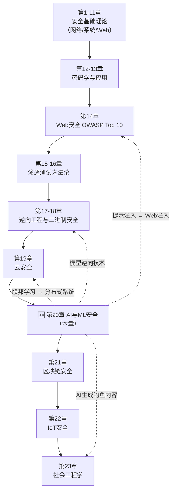

# 第20章 AI与ML安全 — 章节概览

## 20.0.1 为什么AI/ML安全是网络安全的下一个主战场

2023年3月，三星半导体部门员工将公司机密源代码粘贴到ChatGPT中寻求代码优化，导致核心知识产权永久泄露至OpenAI的训练数据流中。三星随即全面禁止内部使用生成式AI工具——但这只是冰山一角。

这不是科幻小说中的情节。以下是近年来最具代表性的AI/ML安全事件：

| 时间 | 事件 | 攻击类型 | 影响范围 |
|------|------|----------|----------|
| 2022年 | Toyota自动驾驶系统被对抗性贴纸欺骗 | 对抗性物理攻击 | 车辆误识别限速标志，安全隐患 |
| 2023年 | Samsung员工将源代码粘贴至ChatGPT | 数据泄露/模型记忆 | 三起独立事件，核心IP永久泄露 |
| 2023年 | ChatGPT数据泄露事件（Redis bug） | 侧信道/缓存漏洞 | 1.2% Plus用户的支付信息和聊天记录暴露 |
| 2023年 | Stanford Alpaca模型被诱导生成有害内容 | 提示注入/越狱 | 大语言模型安全边界问题引发全行业关注 |
| 2024年 | Microsoft AI研究人员泄露38TB内部数据 | 配置错误/AI供应链 | Azure存储密钥、3.8万条内部消息泄露 |
| 2024年 | Deepfake实时换脸绕过银行人脸验证 | 深度伪造攻击 | 金融KYC系统大规模欺诈 |
| 2024年 | GPT商店插件被发现存在提示注入漏洞 | LLM应用层攻击 | 影响数百万用户会话安全 |

这些事件揭示了一个核心事实：**AI/ML系统的安全威胁已经从学术研究走向了真实世界的规模化攻击**。与传统软件漏洞不同，AI安全问题往往根植于模型本身的数学特性——你无法通过打补丁"修复"对抗性样本的固有存在性。

### 行业现状与关键数据

AI/ML安全市场的爆发性增长反映了这一领域的战略重要性：

- **市场规模**：全球AI安全市场从2022年的15亿美元增长至2025年的超过52亿美元，年复合增长率超过35%。到2030年预计将突破180亿美元（Grand View Research, 2024）。
- **研究产出**：NeurIPS 2024收到超过15,000篇投稿，其中AI安全相关论文占比超过12%。USENIX Security、IEEE S&P、ACM CCS三大安全顶会自2020年起均设立了专门的AI安全分会场。
- **人才缺口**：根据ISC²报告，全球网络安全人才缺口达400万，而AI安全方向的缺口尤为突出——LinkedIn数据显示AI安全工程师岗位数量在2023-2024年增长了220%，但合格候选人供给仅增长45%。
- **薪资溢价**：Glassdoor数据显示，AI/ML安全工程师的平均年薪（美国市场）为$185,000-$245,000，比传统应用安全工程师高出40-60%。
- **政策压力**：欧盟AI法案（EU AI Act, 2024年生效）要求高风险AI系统必须通过安全评估；美国NIST于2023年发布AI风险管理框架（AI RMF）；中国《生成式人工智能服务管理暂行办法》明确要求安全评估和算法备案。
- **攻击成本下降**：公开可用的对抗性攻击工具（如Foolbox、ART、CleverHans）使得发动AI攻击的技术门槛从"博士级研究者"降低到"会写Python的初学者"。

这些数据清晰地表明：AI/ML安全不是一个"未来话题"，而是**每一个安全从业者现在就必须建立的能力**。

## 20.0.2 AI安全与传统安全的本质区别

传统软件安全遵循确定性逻辑：给定相同输入，程序产生相同输出。漏洞通常源于实现错误——缓冲区溢出、SQL注入、XSS——可以通过修复代码来消除。但AI/ML系统的安全问题具有根本性的不同：

| 维度 | 传统软件安全 | AI/ML安全 |
|------|-------------|-----------|
| **确定性** | 相同输入 → 相同输出 | 相同输入 → 可能不同输出（概率性） |
| **漏洞来源** | 代码实现缺陷 | 模型数学特性 + 数据 + 架构 |
| **攻击面** | 接口、协议、配置 | 输入空间、模型参数、训练数据、推理API |
| **修复方式** | 打补丁、修改配置 | 对抗性训练、架构重设计、数据清洗（无法完全消除） |
| **可解释性** | 代码逻辑可审计 | 黑盒决策，难以解释错误原因 |
| **测试方法** | 确定性测试用例 | 无法穷举高维输入空间 |
| **供应链** | 代码依赖库 | 预训练模型 + 数据集 + 训练框架 + 硬件 |

这种本质差异意味着：**你不能用传统安全思维来解决AI安全问题**。一个"修复"了对抗性样本的模型可能在另一种扰动模式下依然脆弱——这就是AI安全的根本挑战。

## 20.0.3 本章在全书中的定位



**前置依赖关系**：
- **第8章 Python编程**：本章所有代码示例基于Python，需要熟练使用NumPy、Pandas、PyTorch/TensorFlow
- **第13章 密码学**：差分隐私、同态加密、安全聚合等概念需要密码学基础
- **第14章 Web安全**：LLM提示注入与Web注入有概念上的相似性，供应链安全思路相通

**后续延伸关系**：
- **第21章 区块链安全**：智能合约审计中的形式化验证方法可迁移到AI模型验证
- **第23章 社会工程学**：深度伪造（Deepfake）技术正在重塑社会工程学的攻击手段
- **第25章 数字取证**：AI生成内容（AIGC）的溯源检测是数字取证的新前沿

## 20.0.4 学习目标

通过本章的学习，读者将能够：

**基础层（知道是什么）**：
1. 理解AI/ML系统面临的安全威胁全景，建立AI安全的思维框架
2. 掌握对抗性机器学习的核心理论，理解对抗性样本存在的数学原因
3. 了解主流的AI安全评估框架（MITRE ATLAS、NIST AI RMF、OWASP ML Top 10）

**技术层（知道怎么做）**：
4. 实现白盒对抗性攻击算法（FGSM、PGD、C&W），理解梯度在攻击中的作用
5. 实现黑盒对抗性攻击方法（迁移攻击、基于查询的攻击），掌握无梯度攻击策略
6. 执行模型窃取攻击，通过API查询重建替代模型
7. 实施数据投毒攻击，理解训练数据污染的影响机制
8. 检测和复现后门攻击，理解触发器植入的技术细节

**应用层（知道在哪里用）**：
9. 对实际部署的ML系统进行安全评估，识别暴露面和攻击向量
10. 评估LLM应用的安全性，识别提示注入、越狱和数据泄露风险
11. 实施对抗性训练等防御策略，理解防御的局限性

**战略层（知道为什么）**：
12. 从攻防对抗的角度理解AI安全的经济博弈
13. 评估组织AI系统的安全成熟度，制定安全治理策略
14. 跟踪AI安全前沿研究，判断新兴威胁的严重性和紧迫性

## 20.0.5 知识结构

本章内容按照"道法术器"的逻辑层层递进：

| 节次 | 主题 | 核心内容 | 难度 | 预计学时 |
|------|------|----------|------|----------|
| 20.1 | 理论基础 | ML/DL基础回顾、安全威胁模型、对抗性ML理论、数据安全理论、评估框架 | ⭐⭐ | 2-3周 |
| 20.2 | 核心技巧 | 对抗性攻击实现、模型窃取技术、后门攻击、差分隐私实现、防御技巧 | ⭐⭐⭐ | 3-4周 |
| 20.3 | 实战案例 | 图像对抗样本、API模型窃取、联邦学习梯度泄露、Deepfake检测、提示注入 | ⭐⭐⭐⭐ | 2-3周 |
| 20.4 | 常见误区 | AI安全认知偏差、工具使用陷阱、评估方法误区 | ⭐⭐ | 1周 |
| 20.5 | 练习方法 | 靶场环境搭建、CTF竞赛路径、自主实验方案 | ⭐⭐⭐ | 1-2周 |
| 20.6 | 本章小结 | 知识图谱总结、学习路径回顾 | ⭐ | 1天 |
| 20.7 | 深度拓展 | 前沿研究方向、产业趋势、职业发展路径 | ⭐⭐⭐⭐⭐ | 持续 |

### 各节核心内容预览

**20.1 理论基础 — 建立认知框架**

从机器学习的三大范式（监督/无监督/强化学习）出发，回顾深度学习的核心架构（CNN/RNN/Transformer），然后进入AI安全的核心理论：威胁模型分类（按阶段/按知识/按目标）、对抗性样本的数学定义与存在性证明、差分隐私的形式化框架、联邦学习的安全威胁与防御。最后介绍三大评估框架（MITRE ATLAS、NIST AI RMF、OWASP ML Top 10）。

**20.2 核心技巧 — 掌握攻防技术**

这一节是本章的技术核心。攻击侧覆盖：白盒对抗性攻击（FGSM、PGD、C&W三种算法的原理、实现和对比）、黑盒攻击（迁移攻击与查询攻击）、模型窃取（架构窃取与参数窃取）、后门攻击（BadNets、Trojan攻击）、数据投毒（针对性投毒与非针对性投毒）。防御侧覆盖：对抗性训练、输入检测与净化、认证鲁棒性、模型水印与指纹。

**20.3 实战案例 — 从理论到实践**

五个真实场景的深度分析与复现：图像分类器对抗性样本攻击、基于API的模型窃取、联邦学习中的梯度泄露攻击、Deepfake检测绕过、聊天机器人提示注入攻击。每个案例包含完整的攻击流程、代码实现、防御建议和复盘分析。

**20.4 常见误区 — 避免认知陷阱**

包括但不限于：将对抗性攻击等同于噪声添加、认为模型准确率高就安全、忽视物理世界攻击场景、过度依赖单一防御手段、混淆隐私攻击与安全攻击、低估LLM安全的特殊性等。

**20.5 练习方法 — 构建实战能力**

提供从零开始的练习路径：环境搭建（GPU服务器配置、框架安装、数据集准备）、靶场训练（IBM Adversarial Robustness Toolbox Playground、HuggingFace安全挑战）、CTF竞赛路径（Kaggle对抗性学习挑战、DEFCON AI Village CTF）、自主实验方案（针对公开模型的红队测试）。

## 20.0.6 前置知识要求

学习本章需要具备以下基础知识，建议在开始前进行自评：

| 知识领域 | 具体要求 | 自评方式 | 推荐补救资源 |
|----------|----------|----------|-------------|
| **Python编程** | 熟练使用NumPy数组操作、Pandas数据处理、Matplotlib可视化；理解装饰器、生成器、上下文管理器 | 能独立实现一个CNN图像分类器 | Python for Data Analysis (Wes McKinney) |
| **机器学习** | 理解监督/无监督/强化学习的区别；掌握交叉验证、过拟合/欠拟合、正则化、损失函数等概念 | 能用Scikit-learn完成一个完整的ML流水线 | Andrew Ng Machine Learning Specialization |
| **深度学习** | 理解前向传播、反向传播、梯度下降的原理；掌握CNN/RNN/Transformer的基本架构 | 能用PyTorch或TensorFlow搭建并训练一个简单的CNN | Deep Learning (Goodfellow et al.) 第6-8章 |
| **线性代数** | 矩阵运算、特征值分解、奇异值分解、范数计算 | 理解为什么梯度方向是函数值增长最快的方向 | MIT 18.06 Linear Algebra (Gilbert Strang) |
| **微积分** | 偏导数、链式法则、多元函数优化 | 能手动推导两层神经网络的反向传播 | Khan Academy Multivariable Calculus |
| **概率统计** | 贝叶斯定理、概率分布、假设检验、最大似然估计 | 理解交叉熵损失的概率含义 | All of Statistics (Larry Wasserman) |
| **安全思维** | 理解攻防对抗的本质、威胁建模的基本方法 | 能用STRIDE模型分析一个系统 | 本书第1-5章 |

> **自评标准**：如果上述7个领域中有3个以上无法达到要求，建议先补充相关基础知识再开始本章学习。强行跳过基础只会导致后续内容"看得懂文字，理解不了原理"。

## 20.0.7 核心概念速览

在正式学习之前，先建立对以下核心概念的直觉理解：

### 对抗性样本（Adversarial Example）

对输入数据添加人眼几乎不可察觉的微小扰动，就能让模型犯下严重的错误。想象你在一张熊猫的照片上加了一层几乎看不见的"雪花"，但AI突然以99%的置信度认为这是一只长臂猿。这不是科幻——这是2014年Ian Goodfellow等人首次系统性描述的现象。

```python
# 最简单的对抗性攻击示意（FGSM）
import torch

# 假设 model 已训练好，x 是输入图像，y 是真实标签
epsilon = 0.03  # 扰动预算（像素值范围 0-1）

x.requires_grad = True
output = model(x)
loss = loss_fn(output, y)
loss.backward()

# 沿梯度符号方向添加扰动
x_adv = x + epsilon * x.grad.sign()
x_adv = torch.clamp(x_adv, 0, 1)  # 保持像素值合法
```

### 模型窃取（Model Stealing）

攻击者通过反复查询目标模型的API，收集输入-输出对，然后训练一个功能等价的"替代模型"。这相当于有人通过不断品尝你的菜品来逆向还原你的独家配方——不需要进入你的厨房，只需要不断点外卖。

### 提示注入（Prompt Injection）

LLM时代的新型注入攻击。攻击者在输入中嵌入恶意指令，覆盖系统提示（System Prompt），使模型执行非预期行为。这与SQL注入在概念上高度相似——都是通过操纵输入来改变系统的执行逻辑。

### 数据投毒（Data Poisoning）

攻击者在模型训练数据中混入恶意样本，使训练出的模型在特定输入上产生错误输出，或者植入隐藏的"后门"。这就像在一本教科书中偷偷篡改了几页内容——读者学完后会在特定问题上给出错误答案，但对其他问题表现正常。

### 差分隐私（Differential Privacy）

数学上严格定义隐私保护的框架。核心思想：无论某个人的数据是否包含在数据集中，分析结果的分布几乎没有变化。这保证了单条数据的"存在或不存在"不会被推断出来。

## 20.0.8 行业评估框架速览

本章将详细介绍三大AI安全评估框架，这里先建立全局认知：

### MITRE ATLAS — AI威胁的"ATT&CK"

MITRE ATLAS（Adversarial Threat Landscape for AI Systems）是MITRE在ATT&CK框架成功经验基础上，专门针对AI系统构建的威胁知识库。它将AI攻击分解为14个战术阶段（从侦察到影响），记录了超过50种具体技术。安全从业者可以使用ATLAS来系统性地评估AI系统的暴露面，就像用ATT&CK评估传统IT系统一样。

### NIST AI RMF — AI风险治理的"ISO 27001"

美国国家标准与技术研究院（NIST）于2023年发布的AI风险管理框架，定义了四个核心功能：治理（Govern）、映射（Map）、测量（Measure）、管理（Manage）。它不是技术标准，而是治理框架——帮助企业建立系统化的AI风险管理流程。

### OWASP ML Top 10 — ML安全的"OWASP Top 10"

OWASP于2023年更新的机器学习安全十大风险清单，从输入操纵攻击到访问控制不足，覆盖了ML系统生命周期中的关键安全风险。对于已经熟悉Web安全OWASP Top 10的从业者来说，这是进入AI安全最自然的切入点。

## 20.0.9 工具生态预览

本章实战部分将涉及的核心工具：

| 工具 | 类型 | 用途 | GitHub Stars |
|------|------|------|-------------|
| **IBM ART (Adversarial Robustness Toolbox)** | 综合平台 | 对抗性攻击/防御/评估的统一框架 | 4.8k+ |
| **Foolbox** | 攻击库 | PyTorch/TensorFlow/JAX模型的对抗性攻击 | 2.7k+ |
| **CleverHans** | 攻击库 | 经典对抗性攻击算法的参考实现 | 3.2k+ |
| **TextAttack** | NLP攻击 | 文本对抗性攻击框架 | 2.5k+ |
| **Microsoft Counterfit** | 评估工具 | AI模型安全评估的命令行工具 | 1.3k+ |
| **Garak** | LLM探测 | LLM漏洞扫描器（前身：python-promptinject） | 4k+ |
| **Robust Intelligence (RIME)** | 商业平台 | AI防火墙，实时检测对抗性输入 | N/A |
| **HuggingFace SafeTensors** | 安全工具 | 安全的模型序列化格式，防止pickle反序列化攻击 | 3k+ |

## 20.0.10 学习路径建议

### 入门路径（零基础 → 能理解攻击原理）

```text
Week 1-2:  补充ML/DL基础（如已有基础可跳过）
           ↳ 推荐: fast.ai Practical Deep Learning
Week 3:    阅读20.1理论基础，建立安全威胁全景认知
           ↳ 重点关注: 威胁分类框架 + 攻击者能力模型
Week 4:    跟随20.2核心技巧中FGSM实现，完成第一个对抗性攻击
           ↳ 目标: 用PyTorch实现FGSM并观察效果
```

### 进阶路径（能理解 → 能独立实施）

```text
Week 5-6:  深入20.2的PGD和C&W攻击，对比不同攻击方法的效果
           ↳ 实验: 在CIFAR-10上比较三种攻击的攻击成功率
Week 7-8:  学习模型窃取和后门攻击技术
           ↳ 实验: 通过查询API训练替代模型
Week 9-10: 完成20.3实战案例，每个案例独立复现
           ↳ 重点: 联邦学习梯度泄露和提示注入攻击
```

### 精通路径（能独立 → 能创新研究）

```text
Week 11+:  阅读20.7深度拓展中的前沿论文
           ↳ 目标: 理解认证鲁棒性、可证明安全等高级主题
持续:      参与开源项目（ART、Garak等），提交PR
           ↳ 通过贡献代码深化对工具和方法的理解
持续:      在Kaggle/CTF中实战，积累攻防经验
           ↳ 推荐: NIST AI Risk Management挑战赛
```

### 研究路径（面向学术和前沿探索）

```text
精读论文路线:
1. Goodfellow et al. (2015) "Explaining and Harnessing Adversarial Examples"
   ↳ 对抗性攻击的开山之作，理解FGSM的理论基础
2. Madry et al. (2018) "Towards Deep Learning Models Resistant to Adversarial Attacks"
   ↳ PGD攻击和对抗性训练的里程碑论文
3. Carlini & Wagner (2017) "Towards Evaluating the Robustness of Neural Networks"
   ↳ C&W攻击，最强优化攻击方法之一
4. Tramèr et al. (2016) "Stealing Machine Learning Models via Prediction APIs"
   ↳ 模型窃取攻击的经典论文
5. Gu et al. (2019) "BadNets: Identifying Vulnerabilities in the Machine Learning Model Supply Chain"
   ↳ 后门攻击的开创性工作
6. McMahan et al. (2017) "Communication-Efficient Learning of Deep Networks from Decentralized Data"
   ↳ 联邦学习基础，理解分布式ML的安全挑战
7. Carlini et al. (2021) "Extracting Training Data from Large Language Models"
   ↳ LLM隐私泄露的实证研究
8. Perez & Ribeiro (2022) "Ignore This Title and HackAPrompt"
   ↳ 提示注入攻击的系统性研究
```

## 20.0.11 预计学习时间

根据不同的学习目标和基础水平，建议的时间安排如下：

| 学习目标 | 适用人群 | 总学时 | 每日投入 | 总周期 |
|----------|----------|--------|----------|--------|
| 理解概念 | 安全管理者、项目经理 | 40-60小时 | 1-2小时 | 4-6周 |
| 掌握技术 | 应用安全工程师 | 100-150小时 | 2-3小时 | 8-12周 |
| 精通攻防 | AI安全研究员/红队成员 | 200-300小时 | 3-4小时 | 16-24周 |
| 论文级 | 学术研究者 | 300+小时 | 4+小时 | 6个月+ |

> **重要提示**：以上时间为"有效学习时间"，不包括环境配置、依赖安装、调试报错等时间。实际项目中，环境问题可能消耗总时间的20-30%。建议在开始前一次性完成环境搭建（GPU服务器、PyTorch/TensorFlow、ART等库的安装和测试）。

## 20.0.12 学习建议

1. **从代码出发，不从理论出发**：先跑通一个FGSM攻击的Demo，看到效果后再回过头理解原理。直观感受比数学公式更能建立直觉。

2. **复现论文，不是只读论文**：每读一篇核心论文，至少复现其核心实验。只读论文不写代码，理解永远停留在表面。

3. **建立攻击-防御的对应思维**：每学一种攻击，同时思考"如果我是防御者，我怎么检测和缓解这种攻击"。这种双向思维是安全从业者的必备素质。

4. **关注LLM安全的特殊性**：传统ML安全（对抗样本、模型窃取）和LLM安全（提示注入、越狱、数据泄露）有重叠但也有本质区别。2024年以后，LLM安全的重要性将超过传统ML安全。

5. **使用真实模型做实验**：不要只在玩具数据集上练习。尝试对HuggingFace上的公开模型进行安全评估——这更接近真实场景。

6. **记录和分享**：建立自己的AI安全实验笔记，记录每次攻击/防御实验的配置、结果和心得。技术博客或GitHub仓库都是好的记录形式。

7. **加入社区**：AI Village（DEFCON）、OWASP AI Security Project、MITRE ATLAS社区、r/MachineLearning等社区是获取最新研究和实践的重要渠道。

## 20.0.13 法律与伦理边界

> **本章所有技术仅用于合法的安全研究和教育目的。** 在进行任何AI安全测试之前，必须明确以下法律边界：

**合法行为**：
- 在自己拥有的模型和数据上进行攻击实验
- 在获得书面授权的第三方系统上进行安全测试
- 参加官方组织的Bug Bounty和CTF竞赛
- 在公开数据集和开源模型上进行学术研究
- 按照负责任披露流程报告发现的漏洞

**违法行为**：
- 未经授权对第三方AI系统进行攻击测试
- 使用深度伪造技术进行身份欺诈
- 利用对抗性样本绕过安全系统（如安防、金融验证）实施犯罪
- 窃取他人模型用于商业竞争
- 在未获同意的情况下从模型中提取训练数据中的个人信息

**灰色地带（需要专业判断）**：
- 对公开API进行压力测试以评估其鲁棒性边界
- 在开源模型上发现漏洞后公开披露的时间和方式
- 使用AI工具进行渗透测试时的授权范围

> **建议**：在开始任何AI安全研究之前，咨询法律专业人士，确保你的研究活动符合所在司法管辖区的法律法规。不同国家对AI安全研究的法律保护程度不同——美国有CFAA的"好撒玛利亚人"条款倾向，但中国和欧盟的法律框架目前对安全研究者的保护相对有限。

***

**准备好了吗？** 从下一节"理论基础"开始，我们将正式进入AI与ML安全的技术世界。先打好理论基础，再动手实践——这是最高效的学习路径，也是唯一能让你"知其然且知其所以然"的路径。
