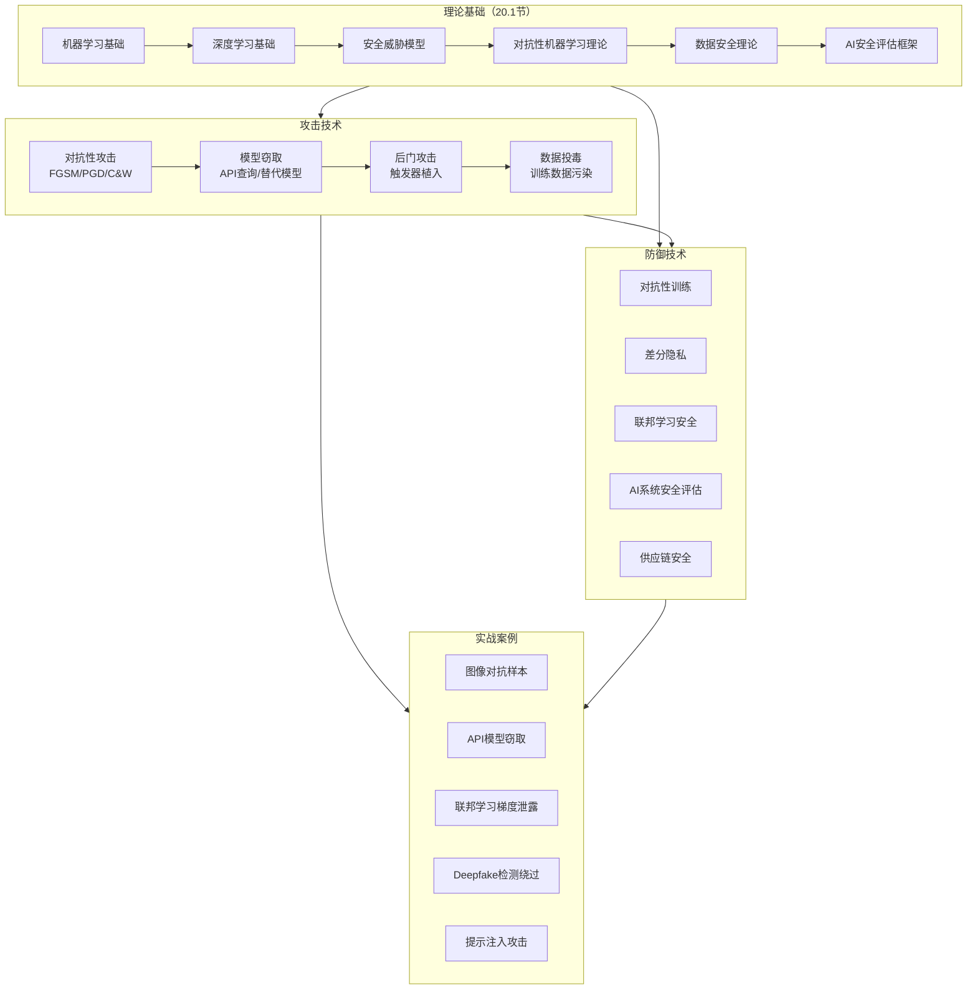
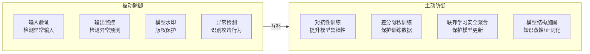

# 第20章 AI与ML安全 - 本章小结

## 全章知识图谱

本章围绕"AI/ML安全攻防"这一核心主题，从理论基础到攻击技术，从防御策略到实战案例，构建了一个完整的知识体系。以下全景图展示了各节内容之间的逻辑关系：

## 核心知识体系回顾

### 一、AI/ML安全威胁全景

本章建立的威胁模型从三个维度对AI/ML安全风险进行了系统分类，这是理解全部后续内容的基石。

**按攻击阶段划分：**

| 阶段 | 攻击类型 | 攻击目标 | 典型手段 |
|------|---------|---------|---------|
| 训练阶段 | 数据投毒、后门攻击、模型中毒 | 模型的决策逻辑 | 注入恶意训练样本、修改训练流程 |
| 推理阶段 | 对抗性样本、模型窃取、成员推断 | 模型的输入输出接口 | 梯度计算、API查询、输出分析 |
| 部署阶段 | 模型逆向、侧信道攻击、物理攻击 | 模型的完整信息 | 逆向工程、硬件监控、物理扰动 |

**按攻击者知识划分：**

| 攻击类型 | 攻击者掌握的信息 | 典型场景 | 攻击效果 |
|---------|----------------|---------|---------|
| 白盒攻击 | 模型架构、参数、训练数据 | 内部人员、开源模型 | 最高，可精确计算梯度 |
| 灰盒攻击 | 模型架构或部分信息 | 逆向分析已知架构 | 中等，可利用架构特征 |
| 黑盒攻击 | 仅输入输出关系 | 面向公开API | 最低但最现实 |

这三个维度的组合构成了本章所有攻击和防御技术的分析框架。掌握这个框架后，面对任何AI/ML系统，读者都能系统地评估其安全风险。

### 二、对抗性攻击：从理论到实践

对抗性攻击是本章的核心内容之一，涵盖了白盒和黑盒两大类攻击方法。

**白盒攻击三板斧：**

| 方法 | 全称 | 核心原理 | 扰动范数 | 计算开销 | 攻击成功率 |
|------|------|---------|---------|---------|-----------|
| FGSM | Fast Gradient Sign Method | 沿梯度符号方向一步扰动 | L∞ | 极低（单次前向+反向） | 中等 |
| PGD | Projected Gradient Descent | 多次迭代梯度投影到ε球内 | L∞/L₂ | 中等（多次迭代） | 高 |
| C&W | Carlini & Wagner | 优化问题求解最小扰动 | L₂/L₀/L∞ | 高（需要优化求解） | 极高 |

FGSM的核心公式为 `x_adv = x + ε · sign(∇ₓL(x, y))`，其优势在于速度——单次梯度计算即可生成对抗样本，适合大规模批量生成。PGD是FGSM的迭代增强版，每次迭代后将扰动投影回ε约束球内，攻击能力显著提升。C&W将对抗样本生成转化为优化问题，通过调节目标函数中的置信度参数κ精确控制攻击强度，是学术研究中评估防御方法的标准基准。

**黑盒攻击策略：**

- **迁移攻击**：在替代模型上生成对抗样本，利用对抗样本的跨模型迁移性攻击目标模型。这是最实用的黑盒攻击方式，因为不需要对目标模型进行任何查询。迁移性的根本原因在于不同模型对同一数据分布学习到的决策边界具有相似性。
- **查询攻击**：通过大量查询目标模型，利用输出概率值估计梯度方向（基于分数的攻击），或仅利用最终分类标签估计梯度（基于决策的攻击）。查询次数从数千到数万不等，是攻击成本与效果之间的权衡。
- **基于决策的攻击（Boundary Attack / HopSkipJump）**：从一个已知的对抗样本出发，沿决策边界逐步逼近原始样本，仅需要模型的最终决策（top-1标签），是最接近真实场景的攻击方式。

**关键工具对比：**

| 工具 | 开发方 | 支持框架 | 核心特点 | 适用场景 |
|------|-------|---------|---------|---------|
| ART (Adversarial Robustness Toolbox) | IBM | PyTorch, TensorFlow, Keras, Scikit-learn | 攻击+防御+评估一体化，150+算法 | 企业级安全评估、研究 |
| Foolbox | Uni Tübingen | PyTorch, TensorFlow, JAX | API简洁，与NumPy风格一致 | 快速原型实验 |
| CleverHans | Google/Goodfellow团队 | TensorFlow, PyTorch | 学术权威性高 | 论文复现、基准测试 |
| Advertorch | 加拿大MILA | PyTorch | 专注对抗性攻击实现 | 纯攻击研究 |

### 三、模型安全：窃取、后门与隐私推断

**模型窃取攻击的完整流程：**

模型窃取攻击的目标是通过有限的API查询，复制目标模型的功能。其核心流程为：收集（输入-输出）配对 → 训练替代模型 → 评估保真度。影响窃取效果的关键因素包括查询数据的多样性（覆盖输入空间的程度）、目标模型的复杂度（决策边界越简单越容易窃取）、以及API返回的信息粒度（概率向量比硬标签泄露更多信息）。

防御模型窃取的方法包括：在API输出中添加噪声（降低信息泄露量）、限制查询频率（增加攻击成本）、监控异常查询模式（检测窃取行为）、水印技术（在模型中嵌入所有权标记以便事后追溯）。

**后门攻击的威胁模型：**

后门攻击是一种训练阶段攻击，攻击者在训练数据中植入带有特定触发器（trigger）的样本，并将其标签修改为目标类别。训练完成后，模型在正常输入上表现正常，但当输入包含触发器时，会输出攻击者指定的目标类别。

触发器的设计空间极为丰富：

| 触发器类型 | 示例 | 隐蔽性 | 鲁棒性 |
|-----------|------|--------|--------|
| 像素补丁 | 图像角落的特定色块 | 低 | 高 |
| 空间变换 | 微小的平移或旋转 | 中 | 中 |
| 频域扰动 | 特定频率的噪声叠加 | 高 | 中 |
| 样式迁移 | 改变图像风格但保留内容 | 高 | 低 |
| 自然触发器 | 特定物体或纹理 | 极高 | 高 |

**成员推断攻击原理：**

成员推断攻击利用模型对训练数据的"记忆"效应——模型对训练样本的预测置信度通常高于非训练样本。攻击者训练一个二分类器（称为"影子模型"），判断目标模型对特定样本的输出模式是否符合"该样本在训练集中"的特征。这种攻击的威胁在于：如果模型是在医疗数据上训练的，攻击者可以推断某人是否患有特定疾病（如果该数据参与了训练）。

### 四、数据安全：投毒、联邦学习与差分隐私

**数据投毒攻击的分类：**

| 攻击类型 | 攻击者能力 | 攻击目标 | 投毒比例 | 实际威胁 |
|---------|-----------|---------|---------|---------|
| 随机投毒 | 注入随机噪声样本 | 降低整体准确率 | 高（>10%） | 中 |
| 定向投毒 | 注入精心设计的样本 | 特定输入的分类结果 | 低（<1%） | 高 |
| 后门投毒 | 植入触发器样本 | 触发特定行为 | 低（<1%） | 极高 |
| 标签翻转 | 修改已有样本标签 | 决策边界偏移 | 中（5-10%） | 中 |

**联邦学习安全的核心矛盾：**

联邦学习的初衷是保护数据隐私（数据不出本地），但它引入了新的攻击面——模型更新本身携带了大量训练数据的信息。具体威胁包括：

1. **梯度泄露**：从共享的模型梯度中恢复训练数据。研究表明，即使只共享梯度而非原始数据，攻击者仍可以通过优化方法重建训练图像、文本等敏感信息。
2. **拜占庭攻击**：恶意参与方发送经过篡改的模型更新，影响全局模型的收敛方向或植入后门。
3. **模型投毒**：与数据投毒类似，但在联邦学习场景下通过模型更新而非直接修改训练数据来实现。

**差分隐私的工程权衡：**

差分隐私通过向数据或计算过程中添加校准噪声来保护隐私。其核心参数ε（隐私预算）直接控制隐私保护强度与数据可用性之间的权衡：

| ε值 | 隐私保护强度 | 数据可用性 | 适用场景 |
|-----|-----------|-----------|---------|
| ε < 1 | 极强 | 严重下降 | 高敏感数据（医疗、金融） |
| 1 ≤ ε ≤ 10 | 强 | 适度下降 | 一般隐私保护需求 |
| ε > 10 | 弱 | 接近原始 | 低敏感场景 |

在机器学习中，差分隐私通过DP-SGD（差分隐私随机梯度下降）实现：每个训练样本的梯度先被裁剪（限制单样本影响），然后添加高斯噪声，最后聚合。这种机制保证了训练完成后的模型满足(ε,δ)-差分隐私。

### 五、AI系统安全评估框架

本章介绍了三个主流的AI安全评估框架，它们从不同角度构建了AI安全的评估体系：

**MITRE ATLAS（Adversarial Threat Landscape for AI Systems）：**

ATLAS是MITRE基于ATT&CK框架方法论，专门为AI系统构建的威胁知识库。它将AI系统的攻击战术分为14个阶段（从侦察到影响），每个阶段下列举了具体的技术和子技术。ATLAS的独特价值在于：它将传统网络安全的攻击模式映射到AI系统上，帮助安全团队用熟悉的框架理解AI威胁。

**NIST AI风险管理框架（AI RMF）：**

NIST AI RMF提供了组织层面的AI风险管理方法论，包含四个核心功能：
- **治理（Govern）**：建立AI风险管理的组织结构、政策和流程
- **映射（Map）**：识别AI系统上下文中的风险因素
- **测量（Measure）**：评估和量化已识别风险的严重程度和发生概率
- **管理（Manage）**：制定和实施风险缓解策略

**OWASP机器学习安全Top 10：**

OWASP ML Top 10将AI/ML安全风险按优先级排序，前五项为：输入操纵攻击（ML01）、数据投毒（ML02）、模型逆向工程（ML03）、模型窃取（ML04）、供应链攻击（ML05）。这五个风险覆盖了本章讨论的大部分攻击类型，是AI安全评估的实用检查清单。

### 六、实战案例深度复盘

本章的五个实战案例覆盖了AI/ML安全中最典型的攻击场景，每个案例都揭示了独特的安全教训：

| 案例 | 攻击类型 | 关键技术 | 核心教训 |
|------|---------|---------|---------|
| 案例一：图像分类器对抗样本 | 对抗性攻击 | FGSM/PGD生成扰动 | 深度学习模型对微小扰动极度敏感，模型置信度高不代表可靠 |
| 案例二：API模型窃取 | 模型窃取 | 查询+替代模型训练 | 仅暴露概率向量的API仍可能被窃取，信息泄露面比预期大 |
| 案例三：联邦学习梯度泄露 | 隐私攻击 | 梯度优化重建数据 | "数据不出本地"不等于隐私安全，梯度本身是信息载体 |
| 案例四：Deepfake检测绕过 | 攻防对抗 | 对抗性扰动欺骗检测器 | AI安全是攻防博弈，防御系统本身也是攻击目标 |
| 案例五：提示注入攻击 | LLM安全 | 构造恶意提示词 | 大语言模型的指令遵循机制存在根本性的安全缺陷 |

这五个案例共同揭示了一个核心事实：AI/ML系统的攻击面远比传统软件广泛。传统安全关注的是代码逻辑漏洞（如缓冲区溢出、SQL注入），而AI安全需要同时考虑数据层面（投毒、污染）、模型层面（窃取、逆向）、推理层面（对抗样本、提示注入）和系统层面（供应链、部署配置）的威胁。

### 七、防御技术总览

本章涉及的防御技术可分为被动防御和主动防御两大类：

| 防御技术 | 防御目标 | 实现方式 | 防御效果 | 性能代价 |
|---------|---------|---------|---------|---------|
| 对抗性训练 | 对抗性样本 | 在训练数据中加入对抗样本 | 对已知攻击有效，对新攻击不确定 | 模型准确率下降2-5%，训练时间增加3-10倍 |
| 差分隐私训练 | 成员推断、数据泄露 | DP-SGD添加噪声 | 有数学保证，但噪声影响模型质量 | 模型准确率下降5-15% |
| 输入预处理 | 对抗性样本 | JPEG压缩、随机缩放、位深度降低 | 对简单攻击有效，对自适应攻击无效 | 推理延迟增加 |
| 模型集成 | 多种攻击 | 多模型投票/混合决策 | 提高攻击难度 | 计算成本线性增加 |
| 检测器 | 对抗性样本 | 训练专门的检测模型 | 对已知攻击类型有效 | 可能被自适应攻击绕过 |
| 安全聚合 | 联邦学习中的梯度泄露和拜占庭攻击 | 加密聚合+鲁棒聚合算法 | 保护模型更新隐私 | 通信和计算开销增加 |

**防御的根本困境：** AI/ML安全防御面临一个根本性挑战——没有通用防御。任何防御方法都可能被自适应攻击者（知道防御机制的攻击者）绕过。这与传统软件安全中"打补丁修复漏洞"的模式截然不同。在AI安全中，攻防是持续的博弈过程，防御者需要不断更新策略。

## 关键工具速查表

| 工具 | 类型 | 支持框架 | 核心能力 | 入门难度 |
|------|------|---------|---------|---------|
| ART (Adversarial Robustness Toolbox) | 综合平台 | PyTorch, TF, Keras, Sklearn | 150+攻击/防御/评估算法 | 中 |
| Foolbox | 攻击库 | PyTorch, TF, JAX | 简洁API，快速实验 | 低 |
| CleverHans | 攻击库 | TF, PyTorch | 学术权威基准 | 低 |
| Advertorch | 攻击库 | PyTorch | 专注攻击实现 | 低 |
| TensorFlow Privacy | 隐私训练 | TensorFlow | DP-SGD实现 | 中 |
| PySyft | 联邦学习 | PyTorch | 安全计算+联邦学习 | 高 |
| Opacus | 隐私训练 | PyTorch | Meta开发的DP-SGD | 低 |
| TextAttack | NLP攻击 | PyTorch, TF | 文本对抗攻击 | 低 |
| SecML | 安全ML | Scikit-learn | 安全机器学习库 | 中 |

## 学习路径建议

### 初级阶段：建立基础认知（1-2个月）

**目标：** 理解AI/ML安全的威胁全景，能用工具进行基本的攻击实验。

**学习内容：**
1. 复习机器学习和深度学习基础，确保理解模型训练和推理的完整流程
2. 阅读Goodfellow等人2015年的论文《Explaining and Harnessing Adversarial Examples》，理解对抗性样本的线性假说
3. 安装ART或Foolbox，运行FGSM攻击的示例代码，在MNIST或CIFAR-10数据集上生成对抗样本
4. 使用TensorFlow Privacy的教程实现DP-SGD训练，观察不同ε值对模型准确率的影响

**验证标准：**
- 能够解释为什么微小的输入扰动会导致模型预测大幅变化
- 能够用FGSM生成视觉上不可察觉但欺骗模型的对抗样本
- 能够解释差分隐私的直觉含义和ε参数的作用

### 中级阶段：掌握攻防技术（2-4个月）

**目标：** 深入理解各类攻击的原理和实现，掌握基本防御方法。

**学习内容：**
1. 实现PGD和C&W攻击，对比不同攻击方法的效果和计算开销
2. 实现模型窃取攻击：训练替代模型，评估窃取保真度
3. 实现简单的后门攻击：设计触发器，植入后门，验证激活效果
4. 阅读MITRE ATLAS文档，理解AI系统的威胁分类体系
5. 实现对抗性训练，评估防御效果

**验证标准：**
- 能够根据场景选择合适的攻击方法并解释原因
- 能够实现完整的模型窃取攻击流程
- 能够使用ART进行AI系统安全评估

### 高级阶段：前沿研究与实战（3-6个月）

**目标：** 掌握最新攻防技术，具备独立研究能力。

**学习内容：**
1. 研读最新AI安全论文（NeurIPS、ICML、S&P、CCS等顶会）
2. 研究LLM安全（提示注入、越狱攻击、对齐税等）
3. 研究多模态模型的安全问题（视觉语言模型的跨模态攻击）
4. 参与Kaggle对抗性攻击竞赛或AI安全挑战赛
5. 尝试在NIST AI RMF框架下对一个AI系统进行完整的安全评估

**验证标准：**
- 能够独立复现最新AI安全论文中的攻击方法
- 能够设计新的攻击或防御策略
- 能够撰写AI安全评估报告

## 认证与职业发展

当前AI/ML安全领域的专业认证尚处于发展初期，以下认证可以作为能力补充：

| 认证 | 颁发机构 | 核心内容 | 难度 | 与AI安全相关度 |
|------|---------|---------|------|-------------|
| Google Professional ML Engineer | Google | ML系统设计、部署、优化 | 中高 | 高 |
| AWS Machine Learning Specialty | Amazon | ML工程实践 | 中 | 中 |
| Microsoft Azure AI Engineer | Microsoft | Azure AI服务设计 | 中 | 中 |
| CISSP（含AI安全模块） | (ISC)² | 综合信息安全管理 | 高 | 中 |
| GIAC Machine Learning Security | SANS | ML安全攻防 | 高 | 极高（计划中） |

**职业方向：**

- **AI安全研究员**：在高校或企业研究院从事AI安全基础研究，发表顶会论文
- **AI红队工程师**：对AI系统进行安全测试和渗透测试，发现和报告漏洞
- **AI安全架构师**：设计和实现AI系统的安全防护体系
- **AI合规顾问**：帮助组织满足AI安全相关的法规要求（如欧盟AI法案）

## 常见误区警示

| 误区 | 正确认知 |
|------|---------|
| "模型准确率高就安全" | 准确率和鲁棒性是两个独立维度，高准确率的模型可能更容易被对抗样本欺骗 |
| "黑盒模型比白盒模型更安全" | 模型的黑盒特性保护的是模型本身，不是系统——攻击者可以通过查询接口进行黑盒攻击 |
| "数据不出本地就安全了" | 联邦学习中，梯度更新仍然携带大量训练数据信息，可以通过梯度泄露攻击重建原始数据 |
| "加了噪声就隐私安全了" | 差分隐私需要严格的数学分析，随意添加噪声不等于差分隐私，可能既降低了模型质量又没有真正保护隐私 |
| "对抗性训练是万能防御" | 对抗性训练只能防御已知类型的攻击，对新型攻击方法（如自适应攻击）效果有限，且会显著降低模型在干净数据上的准确率 |
| "AI安全只关乎技术" | AI安全同时涉及伦理、法律和社会影响，需要跨学科视角 |
| "提示注入只影响聊天机器人" | 任何使用LLM的系统（搜索引擎、代码助手、客服系统）都面临提示注入风险 |

## 与后续章节的衔接

本章为读者建立了AI/ML安全的完整知识框架，以下关联章节可以帮助读者进一步拓展：

- **第17章 逆向工程**：模型逆向技术需要逆向工程的基础知识，特别是对二进制分析和调试技术的理解
- **第19章 云安全**：AI系统通常部署在云环境中，云安全的IAM、网络安全知识直接影响AI系统的部署安全
- **第21章 区块链安全**：区块链中的AI应用（如链上预言机、智能合约中的ML模型）面临独特的安全挑战
- **第23章 社会工程学**：AI生成的钓鱼内容（深度伪造音视频、AI生成文本）正在成为社会工程学攻击的新工具

## 进一步学习资源

**经典教材：**
- 《Adversarial Machine Learning》（Goodfellow, Papernot等）—— 对抗性机器学习领域的奠基性教材
- 《Privacy-Preserving Machine Learning》—— 隐私保护机器学习的系统性论述
- 《Trustworthy Machine Learning》—— 可信机器学习的全面框架

**权威框架与标准：**
- MITRE ATLAS —— AI系统威胁知识库，持续更新的攻击技术目录
- NIST AI Risk Management Framework —— 组织级AI风险管理方法论
- OWASP Machine Learning Security Top 10 —— ML安全风险优先级清单

**在线学习平台：**
- Papers with Code - Adversarial Attack —— 对抗性攻击论文和对应代码实现
- Adversarial Robustness Toolbox官方文档 —— ART的完整教程和示例
- Kaggle Adversarial Attack Competition —— 实战型对抗性攻击竞赛

**必读论文：**
- Goodfellow et al., 2015 —— 《Explaining and Harnessing Adversarial Examples》（对抗性样本的线性假说）
- Carlini & Wagner, 2017 —— 《Towards Evaluating the Robustness of Neural Networks》（C&W攻击）
- Madry et al., 2018 —— 《Towards Deep Learning Models Resistant to Adversarial Attacks》（PGD攻击与对抗性训练）
- Shokri et al., 2017 —— 《Membership Inference Attacks Against Machine Learning Models》（成员推断攻击）
- Gu et al., 2019 —— 《BadNets: Identifying Vulnerabilities in the Machine Learning Model Supply Chain》（后门攻击）

## 下一章预告

在第21章中，我们将进入区块链安全领域。区块链技术的安全挑战与AI/ML安全既有差异又有交集——智能合约中的漏洞利用是确定性的代码审计问题，而DeFi协议中的经济攻击则涉及博弈论和机制设计。随着AI技术在区块链领域的应用（如链上ML模型、AI驱动的MEV策略），AI安全和区块链安全的交叉地带将成为新的研究热点。
