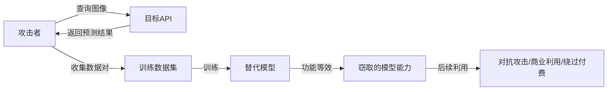
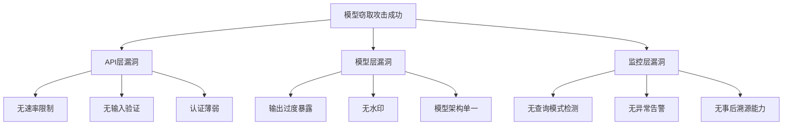

## 案例二：API模型窃取攻击

模型窃取（Model Stealing / Model Extraction）是针对机器学习即服务（MLaaS）平台最现实、最易实施的攻击之一。攻击者无需接触模型权重或训练数据，仅通过反复查询公开API接口，即可训练出一个功能高度一致的替代模型（Surrogate Model），从而绕过付费壁垒、提取商业机密、为后续对抗性攻击提供跳板。本案例以一个图像分类API为靶标，完整演示从侦察、数据采集、替代模型训练到效果评估的全流程，并深入剖析防御机制与绕过策略。

### 背景与威胁建模

#### 为什么模型窃取是真实威胁

MLaaS市场规模已达数百亿美元。Google Vision AI、AWS Rekognition、Azure Cognitive Services、百度AI开放平台等均提供按量计费的模型推理API。这些服务的核心资产就是模型本身——一个训练成本可能高达数十万甚至数百万美元的深度神经网络。如果攻击者能通过合法API调用"复制"出等效模型，服务提供商将面临：

| 损失维度 | 具体影响 | 量化估算 |
|---------|---------|---------|
| 直接收入损失 | 替代模型取代付费API调用 | 单个模型可达数十万美元/年 |
| 竞争优势泄露 | 模型能力被竞争对手逆向工程 | 不可估量的长期影响 |
| 安全级联效应 | 替代模型用于制作对抗性样本攻击原始模型 | 系统性风险 |
| 合规风险 | 训练数据中的隐私信息可能被间接推断 | GDPR/CCPA罚款 |

#### 攻击者能力假设

在本案例中，攻击者拥有以下能力（这些假设符合实际场景中的常见条件）：

- **黑盒API访问**：可以向目标API发送任意图像，获取分类结果
- **无模型权重访问**：无法获取模型架构、参数或训练数据
- **有限预算**：假设攻击者愿意花费数百到数千美元的API调用费用
- **基本ML知识**：了解深度学习训练流程，能搭建和训练模型



### 攻击实战全流程

#### 阶段一：目标侦察与API分析

在正式发起模型窃取攻击之前，攻击者需要充分了解目标API的行为特征。这一步决定了后续攻击的效率和成功率。

**侦察要点清单：**

1. **输出格式分析**：API返回的是类别标签、Top-K概率、完整概率分布，还是带置信度的结构化结果？
2. **速率限制探测**：每分钟/每小时允许的最大查询数是多少？超限后的响应行为（返回429、延迟响应、还是静默丢弃）？
3. **输入格式要求**：支持的图像尺寸、格式（JPEG/PNG/WebP）、通道顺序（RGB/BGR）、是否需要归一化？
4. **成本结构**：按查询计费还是按量计费？批量查询有无折扣？
5. **认证机制**：API Key、OAuth2、还是其他方式？有无IP白名单限制？

```python
import requests
import time
import json

class APIRecon:
    """目标API侦察工具"""
    
    def __init__(self, api_url, api_key=None):
        self.api_url = api_url
        self.headers = {'Authorization': f'Bearer {api_key}'} if api_key else {}
        self.rate_limit_remaining = None
        self.rate_limit_reset = None
    
    def test_basic_connectivity(self):
        """测试API连通性和基本响应格式"""
        # 发送一个最小有效请求
        import base64
        from PIL import Image
        from io import BytesIO
        
        # 生成一个 1x1 测试图像
        test_img = Image.new('RGB', (1, 1), color='red')
        buffer = BytesIO()
        test_img.save(buffer, format='JPEG')
        img_b64 = base64.b64encode(buffer.getvalue()).decode()
        
        response = requests.post(
            self.api_url,
            json={'image': img_b64},
            headers=self.headers,
            timeout=30
        )
        
        print(f"状态码: {response.status_code}")
        print(f"响应头速率限制信息: {dict(response.headers)}")
        print(f"响应体:\n{json.dumps(response.json(), indent=2, ensure_ascii=False)}")
        
        return response
    
    def probe_rate_limit(self, interval=0.1, max_probes=100):
        """探测速率限制"""
        import base64
        from PIL import Image
        from io import BytesIO
        
        test_img = Image.new('RGB', (28, 28), color='blue')
        buffer = BytesIO()
        test_img.save(buffer, format='JPEG')
        img_b64 = base64.b64encode(buffer.getvalue()).decode()
        
        blocked_at = None
        for i in range(max_probes):
            response = requests.post(
                self.api_url,
                json={'image': img_b64},
                headers=self.headers,
                timeout=10
            )
            
            # 检查速率限制头
            remaining = response.headers.get('X-RateLimit-Remaining')
            if remaining:
                print(f"查询 #{i+1}: 剩余配额 = {remaining}")
            
            if response.status_code == 429:
                blocked_at = i + 1
                retry_after = response.headers.get('Retry-After', '未知')
                print(f"\n[!] 在第 {blocked_at} 次查询时触发速率限制")
                print(f"[!] Retry-After: {retry_after} 秒")
                break
            
            time.sleep(interval)
        
        if blocked_at is None:
            print(f"\n[*] 完成 {max_probes} 次查询未触发限制")
        
        return blocked_at
    
    def analyze_output_granularity(self):
        """分析输出粒度：标签 vs Top-K vs 完整分布"""
        from PIL import Image
        import base64
        from io import BytesIO
        import numpy as np
        
        # 用不同颜色的图像查询，观察输出变化
        results = []
        for color, name in [('red', '红色'), ('green', '绿色'), ('blue', '蓝色')]:
            img = Image.new('RGB', (224, 224), color=color)
            buffer = BytesIO()
            img.save(buffer, format='JPEG')
            img_b64 = base64.b64encode(buffer.getvalue()).decode()
            
            response = requests.post(
                self.api_url,
                json={'image': img_b64},
                headers=self.headers
            )
            result = response.json()
            results.append((name, result))
            print(f"[{name}图像] 输出: {json.dumps(result, ensure_ascii=False)}")
        
        # 判断输出类型
        sample = results[0][1].get('prediction', results[0][1])
        if isinstance(sample, list) and all(isinstance(x, float) for x in sample):
            print("\n[!] 输出类型: 完整概率分布（最有利于攻击者）")
        elif isinstance(sample, list) and all(isinstance(x, dict) for x in sample):
            print("\n[!] 输出类型: Top-K 结果（含标签和置信度）")
        elif isinstance(sample, (str, int)):
            print("\n[!] 输出类型: 仅类别标签（对攻击者最不利）")
        
        return results
```

#### 阶段二：高效查询数据采集

数据采集是整个攻击的核心环节。采集策略直接影响替代模型的最终质量。盲目生成随机图像虽然可行，但效率极低。本节介绍三种递进式的采集策略。

**策略一：随机采样（基线方法）**

最简单的策略——在输入空间中随机采样。适合快速验证攻击可行性，但需要大量查询才能覆盖决策边界。

```python
import numpy as np
from PIL import Image
import base64
from io import BytesIO
import requests
import time
import json
from concurrent.futures import ThreadPoolExecutor, as_completed

class QueryCollector:
    """高效的API查询数据采集器"""
    
    def __init__(self, api_url, api_key=None, max_workers=5, 
                 requests_per_second=10):
        self.api_url = api_url
        self.headers = {'Authorization': f'Bearer {api_key}'} if api_key else {}
        self.max_workers = max_workers
        self.query_interval = 1.0 / requests_per_second
        self.queries = []
        self.predictions = []
        self.total_queries = 0
        self.total_cost = 0.0  # 跟踪API调用成本
    
    def _encode_image(self, image_array):
        """将numpy数组编码为base64"""
        img = Image.fromarray(image_array.astype(np.uint8))
        buffer = BytesIO()
        img.save(buffer, format='JPEG', quality=95)
        return base64.b64encode(buffer.getvalue()).decode()
    
    def _query_single(self, image_array):
        """发送单次API查询"""
        img_b64 = self._encode_image(image_array)
        
        for attempt in range(3):  # 重试机制
            try:
                response = requests.post(
                    self.api_url,
                    json={'image': img_b64},
                    headers=self.headers,
                    timeout=30
                )
                
                if response.status_code == 200:
                    self.total_queries += 1
                    result = response.json()
                    return result.get('prediction', result)
                elif response.status_code == 429:
                    retry_after = int(response.headers.get('Retry-After', 60))
                    print(f"[!] 速率限制，等待 {retry_after} 秒...")
                    time.sleep(retry_after)
                else:
                    print(f"[!] 异常状态码: {response.status_code}")
                    time.sleep(2 ** attempt)
            except requests.exceptions.Timeout:
                print(f"[!] 请求超时，重试 {attempt + 1}/3")
                time.sleep(2 ** attempt)
        
        return None  # 所有重试均失败
    
    def collect_random_queries(self, num_queries=10000, image_size=(224, 224)):
        """策略一：随机采样"""
        print(f"[*] 开始随机采样，目标 {num_queries} 条查询...")
        
        for i in range(num_queries):
            # 生成随机图像
            random_image = np.random.randint(0, 256, 
                                              (*image_size, 3), 
                                              dtype=np.uint8)
            
            pred = self._query_single(random_image)
            if pred is not None:
                self.queries.append(random_image)
                self.predictions.append(pred)
            
            if (i + 1) % 1000 == 0:
                print(f"  进度: {i + 1}/{num_queries}，"
                      f"成功: {len(self.queries)}")
            
            time.sleep(self.query_interval)
        
        print(f"[✓] 采集完成: {len(self.queries)} 条有效数据")
        return np.array(self.queries), np.array(self.predictions)
```

**策略二：对抗性采样（高效方法）**

随机采样的核心问题在于：大部分随机输入远离决策边界，对替代模型学习决策面贡献甚微。对抗性采样通过迭代优化输入，使其落在决策边界附近，用更少的查询获得更丰富的信息。

```python
    def collect_adversarial_queries(self, num_queries=5000, 
                                     image_size=(224, 224),
                                     adversarial_steps=5):
        """
        策略二：对抗性采样
        在决策边界附近采样，信息密度远高于随机采样
        """
        print(f"[*] 开始对抗性采样，目标 {num_queries} 条查询...")
        
        collected = 0
        while collected < num_queries:
            # 生成随机种子图像
            seed = np.random.randint(0, 256, (*image_size, 3), 
                                      dtype=np.uint8).astype(np.float32)
            
            # 获取种子的初始预测
            seed_pred = self._query_single(seed.astype(np.uint8))
            if seed_pred is None:
                continue
            
            self.queries.append(seed.astype(np.uint8))
            self.predictions.append(seed_pred)
            collected += 1
            
            # 从种子出发进行对抗性扰动
            current = seed.copy()
            for step in range(adversarial_steps):
                # 生成随机扰动方向
                perturbation = np.random.randn(*current.shape) * 10
                
                # 正向扰动
                candidate_pos = np.clip(current + perturbation, 0, 255)
                pred_pos = self._query_single(candidate_pos.astype(np.uint8))
                
                if pred_pos is not None:
                    self.queries.append(candidate_pos.astype(np.uint8))
                    self.predictions.append(pred_pos)
                    collected += 1
                    
                    # 如果预测改变，说明越过了决策边界
                    # 记录当前点和新点（两者都在边界附近）
                    if pred_pos != seed_pred:
                        # 在边界两侧各取一点
                        midpoint = (current + candidate_pos) / 2
                        mid_pred = self._query_single(
                            midpoint.astype(np.uint8))
                        if mid_pred is not None:
                            self.queries.append(
                                midpoint.astype(np.uint8))
                            self.predictions.append(mid_pred)
                            collected += 1
                
                # 更新当前位置（随机游走）
                current = candidate_pos
                
                if collected >= num_queries:
                    break
            
            if collected % 500 == 0:
                print(f"  进度: {collected}/{num_queries}")
        
        print(f"[✓] 对抗性采样完成: {len(self.queries)} 条有效数据")
        return np.array(self.queries), np.array(self.predictions)
```

**策略三：混合采样策略**

实际攻击中，最优策略是混合使用多种采样方法：先用随机采样获取基础数据分布，再用对抗性采样聚焦决策边界，最后针对低置信度区域进行补充采样。

```python
    def collect_hybrid_queries(self, total_queries=8000, 
                                image_size=(224, 224)):
        """
        策略三：混合采样
        分配比例：50% 随机 + 30% 对抗性 + 20% 低置信度补充
        """
        print("[*] 开始混合采样策略...")
        
        # 阶段1：随机采样（50%）
        random_budget = int(total_queries * 0.5)
        self.collect_random_queries(random_budget, image_size)
        
        # 分析当前数据的置信度分布
        if len(self.predictions) > 0:
            # 假设predictions是概率分布
            confidences = [max(p) if isinstance(p, list) else p 
                          for p in self.predictions]
            low_conf_threshold = np.percentile(confidences, 25)
            print(f"  置信度25分位: {low_conf_threshold:.3f}")
        
        # 阶段2：对抗性采样（30%）
        adversarial_budget = int(total_queries * 0.3)
        self.collect_adversarial_queries(adversarial_budget, image_size)
        
        # 阶段3：低置信度区域补充（20%）
        supplementary_budget = total_queries - len(self.queries)
        print(f"[*] 补充采样 {supplementary_budget} 条（聚焦低置信度区域）...")
        # 实现省略，核心思路：在已知低置信度区域附近加密采样
        
        print(f"[✓] 混合采样完成: {len(self.queries)} 条有效数据")
```

**并行采集加速器**

当API速率限制较宽松时，可以使用多线程并行发送请求以提升采集速度：

```python
    def collect_parallel(self, num_queries=10000, 
                          image_size=(224, 224)):
        """多线程并行采集"""
        print(f"[*] 启动 {self.max_workers} 线程并行采集...")
        
        def generate_and_query(idx):
            random_image = np.random.randint(
                0, 256, (*image_size, 3), dtype=np.uint8)
            pred = self._query_single(random_image)
            return idx, random_image, pred
        
        results = [None] * num_queries
        
        with ThreadPoolExecutor(max_workers=self.max_workers) as executor:
            futures = {
                executor.submit(generate_and_query, i): i 
                for i in range(num_queries)
            }
            
            for future in as_completed(futures):
                idx, image, pred = future.result()
                if pred is not None:
                    self.queries.append(image)
                    self.predictions.append(pred)
                
                if len(self.queries) % 1000 == 0:
                    print(f"  已完成: {len(self.queries)} 条")
        
        print(f"[✓] 并行采集完成: {len(self.queries)} 条有效数据")
        return np.array(self.queries), np.array(self.predictions)
```

#### 阶段三：替代模型架构设计与训练

替代模型的架构选择是攻击成败的关键。架构太简单，无法拟合目标模型的复杂决策边界；架构太复杂，在有限的查询数据上会过拟合，泛化能力差。

**架构选择原则：**

| 原则 | 说明 | 实践建议 |
|-----|------|---------|
| 宁小勿大 | 替代模型不需要和目标模型一样复杂 | 先用小架构验证可行性 |
| 模块化设计 | 方便逐层调整容量 | Conv-Block堆叠 + 全连接分类头 |
| 正则化优先 | 查询数据有限，防过拟合是关键 | Dropout + Weight Decay + Early Stopping |
| 知识蒸馏 | 用软标签（概率分布）比硬标签效果好 | KL散度损失 |

```python
import torch
import torch.nn as nn
import torch.nn.functional as F
from torch.utils.data import DataLoader, TensorDataset, random_split
import numpy as np

class SurrogateModel(nn.Module):
    """
    替代模型架构
    设计原则：足够表达目标模型的决策能力，但不会在有限数据上过拟合
    """
    
    def __init__(self, num_classes=10, dropout_rate=0.3):
        super().__init__()
        
        # 特征提取器：4层卷积逐步提取特征
        self.features = nn.Sequential(
            # Block 1: 224x224x3 -> 112x112x32
            nn.Conv2d(3, 32, kernel_size=3, padding=1),
            nn.BatchNorm2d(32),
            nn.ReLU(inplace=True),
            nn.Conv2d(32, 32, kernel_size=3, padding=1),
            nn.BatchNorm2d(32),
            nn.ReLU(inplace=True),
            nn.MaxPool2d(2),
            nn.Dropout2d(0.1),
            
            # Block 2: 112x112x32 -> 56x56x64
            nn.Conv2d(32, 64, kernel_size=3, padding=1),
            nn.BatchNorm2d(64),
            nn.ReLU(inplace=True),
            nn.Conv2d(64, 64, kernel_size=3, padding=1),
            nn.BatchNorm2d(64),
            nn.ReLU(inplace=True),
            nn.MaxPool2d(2),
            nn.Dropout2d(0.15),
            
            # Block 3: 56x56x64 -> 28x28x128
            nn.Conv2d(64, 128, kernel_size=3, padding=1),
            nn.BatchNorm2d(128),
            nn.ReLU(inplace=True),
            nn.MaxPool2d(2),
            nn.Dropout2d(0.2),
            
            # Block 4: 28x28x128 -> 14x14x128
            nn.Conv2d(128, 128, kernel_size=3, padding=1),
            nn.BatchNorm2d(128),
            nn.ReLU(inplace=True),
            nn.AdaptiveAvgPool2d((4, 4)),  # 自适应池化，兼容不同输入尺寸
        )
        
        # 分类头
        self.classifier = nn.Sequential(
            nn.Flatten(),
            nn.Linear(128 * 4 * 4, 256),
            nn.ReLU(inplace=True),
            nn.Dropout(dropout_rate),
            nn.Linear(256, 128),
            nn.ReLU(inplace=True),
            nn.Dropout(dropout_rate),
            nn.Linear(128, num_classes),
        )
    
    def forward(self, x):
        x = self.features(x)
        x = self.classifier(x)
        return x


class DistillationLoss(nn.Module):
    """
    知识蒸馏损失
    使用软标签（目标模型的完整概率分布）训练替代模型
    比单纯的交叉熵损失效果好得多
    """
    
    def __init__(self, temperature=3.0, alpha=0.7):
        super().__init__()
        self.temperature = temperature
        self.alpha = alpha
        self.ce_loss = nn.CrossEntropyLoss()
        self.kl_loss = nn.KLDivLoss(reduction='batchmean')
    
    def forward(self, student_logits, hard_labels, soft_labels=None):
        """
        student_logits: 替代模型的原始输出
        hard_labels: 真实标签（如果有）
        soft_labels: 目标模型的输出概率分布
        """
        # 硬标签损失
        hard_loss = self.ce_loss(student_logits, hard_labels)
        
        if soft_labels is not None:
            # 软标签蒸馏损失
            student_soft = F.log_softmax(
                student_logits / self.temperature, dim=1)
            teacher_soft = F.softmax(
                soft_labels / self.temperature, dim=1)
            soft_loss = self.kl_loss(student_soft, teacher_soft)
            soft_loss *= self.temperature ** 2
            
            return self.alpha * soft_loss + (1 - self.alpha) * hard_loss
        
        return hard_loss
```

**完整训练流程：**

```python
def train_surrogate_model(queries, predictions, num_classes=10,
                          epochs=30, batch_size=32, lr=1e-3,
                          use_distillation=True):
    """
    完整的替代模型训练流程
    """
    device = torch.device('cuda' if torch.cuda.is_available() else 'cpu')
    print(f"[*] 训练设备: {device}")
    
    # 数据预处理
    # queries: (N, H, W, C) uint8 -> (N, C, H, W) float32 [0, 1]
    X = torch.FloatTensor(queries).permute(0, 3, 1, 2) / 255.0
    
    # predictions处理：支持标签和概率分布两种格式
    if isinstance(predictions[0], (list, np.ndarray)):
        # 完整概率分布（知识蒸馏模式）
        Y = torch.FloatTensor(np.array(predictions))
        has_soft_labels = True
    else:
        # 类别标签
        Y = torch.LongTensor(predictions)
        has_soft_labels = False
    
    print(f"[*] 数据集大小: {len(X)} 条")
    print(f"[*] 输出类型: {'概率分布' if has_soft_labels else '类别标签'}")
    
    # 数据集划分：80% 训练 / 10% 验证 / 10% 测试
    dataset = TensorDataset(X, Y)
    n = len(dataset)
    train_size = int(0.8 * n)
    val_size = int(0.1 * n)
    test_size = n - train_size - val_size
    
    train_set, val_set, test_set = random_split(
        dataset, [train_size, val_size, test_size],
        generator=torch.Generator().manual_seed(42)
    )
    
    train_loader = DataLoader(train_set, batch_size=batch_size, 
                              shuffle=True, num_workers=2, pin_memory=True)
    val_loader = DataLoader(val_set, batch_size=batch_size, 
                            num_workers=2, pin_memory=True)
    
    # 模型初始化
    model = SurrogateModel(num_classes=num_classes).to(device)
    optimizer = torch.optim.AdamW(model.parameters(), lr=lr, 
                                   weight_decay=1e-4)
    scheduler = torch.optim.lr_scheduler.CosineAnnealingLR(
        optimizer, T_max=epochs, eta_min=1e-6)
    
    if use_distillation and has_soft_labels:
        criterion = DistillationLoss(temperature=3.0, alpha=0.7)
    else:
        criterion = nn.CrossEntropyLoss()
    
    # 训练循环
    best_val_loss = float('inf')
    patience = 5
    patience_counter = 0
    
    print(f"\n{'Epoch':>6} | {'Train Loss':>11} | {'Val Loss':>9} | "
          f"{'Val Acc':>8} | {'LR':>10}")
    print("-" * 55)
    
    for epoch in range(epochs):
        # 训练
        model.train()
        train_loss = 0.0
        for batch_x, batch_y in train_loader:
            batch_x = batch_x.to(device)
            batch_y = batch_y.to(device)
            
            logits = model(batch_x)
            
            if use_distillation and has_soft_labels:
                loss = criterion(logits, batch_y.argmax(dim=1), batch_y)
            else:
                loss = criterion(logits, batch_y)
            
            optimizer.zero_grad()
            loss.backward()
            torch.nn.utils.clip_grad_norm_(model.parameters(), max_norm=1.0)
            optimizer.step()
            
            train_loss += loss.item() * batch_x.size(0)
        
        train_loss /= len(train_set)
        
        # 验证
        model.eval()
        val_loss = 0.0
        correct = 0
        total = 0
        with torch.no_grad():
            for batch_x, batch_y in val_loader:
                batch_x = batch_x.to(device)
                batch_y = batch_y.to(device)
                
                logits = model(batch_x)
                
                if use_distillation and has_soft_labels:
                    loss = criterion(logits, batch_y.argmax(dim=1), batch_y)
                    hard_labels = batch_y.argmax(dim=1)
                else:
                    loss = criterion(logits, batch_y)
                    hard_labels = batch_y
                
                val_loss += loss.item() * batch_x.size(0)
                _, predicted = logits.max(1)
                total += batch_x.size(0)
                correct += predicted.eq(hard_labels).sum().item()
        
        val_loss /= len(val_set)
        val_acc = correct / total
        current_lr = optimizer.param_groups[0]['lr']
        
        print(f"{epoch + 1:>6} | {train_loss:>11.4f} | {val_loss:>9.4f} | "
              f"{val_acc:>7.1%} | {current_lr:>10.6f}")
        
        scheduler.step()
        
        # Early Stopping
        if val_loss < best_val_loss:
            best_val_loss = val_loss
            patience_counter = 0
            torch.save(model.state_dict(), 'best_surrogate.pth')
        else:
            patience_counter += 1
            if patience_counter >= patience:
                print(f"\n[!] Early Stopping at epoch {epoch + 1}")
                break
    
    # 加载最佳模型
    model.load_state_dict(torch.load('best_surrogate.pth'))
    return model, test_set
```

#### 阶段四：攻击效果评估

评估替代模型的窃取效果需要从多个维度进行衡量，不能仅看准确率。

```python
def comprehensive_evaluation(surrogate_model, target_api, test_set, 
                             device='cpu'):
    """
    多维度评估替代模型的窃取效果
    """
    surrogate_model.eval()
    
    X_test = test_set[:][0].to(device)
    
    # 如果test_set包含概率分布，提取硬标签
    if test_set[:][1].dim() > 1:
        Y_test = test_set[:][1].argmax(dim=1)
    else:
        Y_test = test_set[:][1]
    
    results = {}
    
    # ---- 指标1：替代模型在测试集上的准确率 ----
    with torch.no_grad():
        logits = surrogate_model(X_test)
        _, predicted = logits.max(1)
        accuracy = predicted.cpu().eq(Y_test).float().mean().item()
    results['accuracy'] = accuracy
    print(f"替代模型测试准确率: {accuracy:.1%}")
    
    # ---- 指标2：与目标API的一致性（核心指标） ----
    # 一致性衡量的是替代模型与目标模型行为的吻合程度
    # 这比准确率更能反映窃取效果
    agreements = []
    for i in range(min(len(X_test), 1000)):  # 抽样1000个测试点
        # 目标API预测
        img_np = (X_test[i].permute(1, 2, 0).cpu().numpy() * 255).astype(
            np.uint8)
        target_pred = target_api(img_np)  # 调用实际API
        
        # 替代模型预测
        with torch.no_grad():
            surr_pred = surrogate_model(X_test[i:i+1]).argmax(1).item()
        
        agreements.append(1 if surr_pred == target_pred else 0)
    
    agreement_rate = np.mean(agreements)
    results['agreement_rate'] = agreement_rate
    print(f"与目标API一致性: {agreement_rate:.1%}")
    
    # ---- 指标3：输出分布的相似度（KL散度） ----
    if hasattr(target_api, 'get_probabilities'):
        kl_divergences = []
        with torch.no_grad():
            surr_probs = F.softmax(surrogate_model(X_test[:500]), dim=1)
        
        for i in range(min(len(X_test), 500)):
            target_probs = target_api.get_probabilities(
                X_test[i:i+1])
            kl = F.kl_div(
                surr_probs[i].log(), 
                torch.FloatTensor(target_probs),
                reduction='sum'
            ).item()
            kl_divergences.append(kl)
        
        results['avg_kl_divergence'] = np.mean(kl_divergences)
        print(f"平均KL散度: {results['avg_kl_divergence']:.4f}")
    
    # ---- 指标4：决策边界一致性 ----
    # 在输入空间中添加小扰动，检查两个模型的预测变化是否一致
    boundary_agreements = []
    for i in range(min(len(X_test), 500)):
        base_img = X_test[i:i+1]
        
        # 添加高斯扰动
        epsilon = 0.05
        perturbed = base_img + epsilon * torch.randn_like(base_img)
        perturbed = torch.clamp(perturbed, 0, 1)
        
        with torch.no_grad():
            surr_base = surrogate_model(base_img).argmax(1).item()
            surr_pert = surrogate_model(perturbed).argmax(1).item()
        
        # 注：实际需要同时查询target API
        boundary_agreements.append(1 if surr_base == surr_pert else 0)
    
    results['boundary_stability'] = np.mean(boundary_agreements)
    print(f"决策边界稳定性: {results['boundary_stability']:.1%}")
    
    # ---- 综合评估 ----
    print("\n" + "=" * 50)
    print("综合评估结果")
    print("=" * 50)
    
    if agreement_rate > 0.95:
        print("[!] 危险等级: 极高 — 替代模型几乎完全复制了目标模型")
        print("    攻击者可以用替代模型：")
        print("    1. 完全绕过API付费")
        print("    2. 制作高成功率的对抗性样本")
        print("    3. 逆向推断训练数据特征")
    elif agreement_rate > 0.85:
        print("[!] 危险等级: 高 — 替代模型捕获了目标模型的主要行为")
        print("    攻击者可用于大部分下游任务")
    elif agreement_rate > 0.70:
        print("[!] 危险等级: 中 — 替代模型部分复现了目标模型")
        print("    在简单场景下可用，复杂场景可能失效")
    else:
        print("[*] 危险等级: 低 — 替代模型与目标模型差异较大")
        print("    防御措施可能已在发挥作用")
    
    return results
```

### 真实世界案例分析

#### 案例一：Google Cloud Vision API（2016-2018）

2016年，学术研究者证明可以仅通过查询Google Cloud Vision API（当时单次查询$0.0015），以约$65的成本训练出一个在ImageNet子集上准确率达到78%的替代模型，而目标API的准确率约为83%。攻击者使用约60,000次查询完成窃取。

**关键发现：**
- Google API返回完整的Top-10概率分布，极大地便利了攻击
- 随机噪声图像的查询结果仍包含有意义的信息（softmax输出的归一化特性）
- 替代模型对原始模型的对抗性样本具有迁移性

#### 案例二：商业NLP模型API窃取（2019）

某商业情感分析API被研究者通过100,000次查询窃取。替代模型在标准情感分析基准上与原始API的一致性达到93%。更严重的是，通过替代模型制作的对抗性样本对原始API同样有效——攻击成功率高达72%。

#### 案例三：大语言模型提取（2023-2024）

随着ChatGPT、Claude等LLM的普及，模型窃取攻击进入了新时代。研究者发现：

- 通过精心构造的提示词，可以提取LLM的系统提示词（System Prompt）
- 通过大量问答对的收集，可以微调一个小型模型近似大模型的行为
- OpenAI等公司不得不在服务条款中明确禁止"使用输出训练竞品模型"

```python
# 大语言模型窃取的简化示例
class LLMExtractionAttack:
    """
    通过API查询收集问答对，用于微调替代LLM
    """
    
    def __init__(self, target_api_url, num_queries=50000):
        self.target_api_url = target_api_url
        self.num_queries = num_queries
        self.collected_pairs = []
    
    def generate_diverse_prompts(self):
        """
        生成多样化的提示词，覆盖目标模型的知识领域
        使用模板化方法确保覆盖面
        """
        templates = [
            "请解释{topic}的基本原理",
            "用{style}的方式描述{topic}",
            "{topic}和{related_topic}有什么区别？",
            "给一个{topic}的实际应用案例",
            "列出{topic}的5个关键知识点",
            "假设你是一个{role}，如何向{audience}解释{topic}？",
        ]
        
        topics = [
            "量子计算", "机器学习", "区块链", "网络安全",
            "数据结构", "算法设计", "操作系统", "计算机网络",
            # ... 更多主题，覆盖广泛的知识域
        ]
        
        prompts = []
        for template in templates:
            for topic in topics:
                prompt = template.format(
                    topic=topic,
                    style="通俗易懂",
                    related_topic="深度学习",
                    role="教授",
                    audience="大学生"
                )
                prompts.append(prompt)
        
        return prompts
    
    def collect_training_data(self):
        """收集训练数据用于微调替代模型"""
        prompts = self.generate_diverse_prompts()
        
        for i, prompt in enumerate(prompts[:self.num_queries]):
            response = self._query_target_api(prompt)
            if response:
                self.collected_pairs.append({
                    'instruction': prompt,
                    'output': response
                })
            
            if (i + 1) % 1000 == 0:
                print(f"进度: {i + 1}/{self.num_queries}")
        
        return self.collected_pairs
    
    def export_for_finetuning(self, output_path='training_data.jsonl'):
        """导出为微调格式"""
        import json
        with open(output_path, 'w', encoding='utf-8') as f:
            for pair in self.collected_pairs:
                f.write(json.dumps(pair, ensure_ascii=False) + '\n')
        print(f"导出 {len(self.collected_pairs)} 条训练数据到 {output_path}")
```

### 发现的漏洞与风险评估

#### 漏洞清单

| 漏洞编号 | 漏洞名称 | 严重性 | 影响范围 | 详细描述 |
|---------|---------|--------|---------|---------|
| VULN-01 | 无查询速率限制 | 严重 | 全局 | API未实施有效的速率限制，攻击者可以在短时间内发送数万甚至数十万次查询而不受阻碍 |
| VULN-02 | 输出信息过度泄露 | 高 | 全局 | API返回完整的概率分布（而非仅返回Top-1标签），大幅降低了攻击者重建决策边界所需的查询数量 |
| VULN-03 | 缺乏输入多样性检测 | 高 | 认证层 | 系统未检测异常的输入模式（如大量随机噪声图像），无法识别自动化攻击行为 |
| VULN-04 | 无模型水印机制 | 中 | 模型层 | 模型未嵌入可追踪的水印，即使被窃取也无法溯源证明 |
| VULN-05 | 缺乏查询关联分析 | 中 | 监控层 | 未分析同一用户历史查询之间的关联性（如信息增益最大化行为），错失攻击检测机会 |
| VULN-06 | API认证机制薄弱 | 中 | 认证层 | 仅依赖API Key认证，无请求签名、无IP绑定、无设备指纹等多因素验证 |

#### 漏洞根因分析



### 防御方案详解

#### 防御一：智能速率限制

简单的固定速率限制（如每分钟100次查询）不足以防御模型窃取，因为攻击者可以拉长攻击周期。需要结合行为分析的智能速率限制。

```python
import time
from collections import defaultdict
from dataclasses import dataclass, field
from typing import Dict, List

@dataclass
class QueryRecord:
    timestamps: List[float] = field(default_factory=list)
    input_hashes: List[int] = field(default_factory=list)
    predictions: List = field(default_factory=list)

class SmartRateLimiter:
    """
    基于行为分析的智能速率限制器
    
    三层防御机制：
    1. 固定窗口速率限制（基础层）
    2. 滑动窗口异常检测（行为层）
    3. 输入多样性分析（语义层）
    """
    
    def __init__(self):
        self.records: Dict[str, QueryRecord] = defaultdict(QueryRecord)
        
        # 配置参数
        self.max_queries_per_minute = 60
        self.max_queries_per_hour = 1000
        self.max_queries_per_day = 5000
        self.max_similar_input_ratio = 0.7  # 输入相似度阈值
        self.diversity_window = 100  # 检查最近N条查询
    
    def check_request(self, user_id: str, input_data) -> dict:
        """
        检查请求是否允许通过
        返回: {'allowed': bool, 'reason': str, 'retry_after': int}
        """
        now = time.time()
        record = self.records[user_id]
        
        # 清理过期记录（保留24小时）
        cutoff = now - 86400
        record.timestamps = [t for t in record.timestamps if t > cutoff]
        record.input_hashes = record.input_hashes[-len(record.timestamps):]
        record.predictions = record.predictions[-len(record.timestamps):]
        
        # ---- 检查1：固定窗口速率限制 ----
        minute_ago = now - 60
        hour_ago = now - 3600
        
        recent_minute = sum(1 for t in record.timestamps if t > minute_ago)
        recent_hour = sum(1 for t in record.timestamps if t > hour_ago)
        recent_day = len(record.timestamps)
        
        if recent_minute >= self.max_queries_per_minute:
            return {
                'allowed': False,
                'reason': '每分钟查询次数超限',
                'retry_after': 60
            }
        
        if recent_hour >= self.max_queries_per_hour:
            return {
                'allowed': False,
                'reason': '每小时查询次数超限',
                'retry_after': 3600
            }
        
        if recent_day >= self.max_queries_per_day:
            return {
                'allowed': False,
                'reason': '每日查询次数超限',
                'retry_after': 86400
            }
        
        # ---- 检查2：输入多样性分析 ----
        if len(record.input_hashes) >= self.diversity_window:
            recent_hashes = record.input_hashes[-self.diversity_window:]
            unique_ratio = len(set(recent_hashes)) / len(recent_hashes)
            
            if unique_ratio < (1 - self.max_similar_input_ratio):
                return {
                    'allowed': False,
                    'reason': '检测到异常的重复查询模式',
                    'retry_after': 300
                }
        
        # ---- 检查3：信息增益异常检测 ----
        if len(record.predictions) >= 50:
            # 检查最近查询的预测分布是否异常均匀
            # （随机噪声输入会导致近似均匀分布）
            recent_preds = record.predictions[-50:]
            from collections import Counter
            pred_counts = Counter(recent_preds)
            entropy = -sum(
                (c / 50) * np.log2(c / 50) 
                for c in pred_counts.values()
            )
            max_entropy = np.log2(len(pred_counts))
            
            if entropy > 0.9 * max_entropy:
                return {
                    'allowed': False,
                    'reason': '检测到疑似自动化探测行为',
                    'retry_after': 600
                }
        
        # 通过所有检查，记录此次请求
        input_hash = hash(str(input_data))
        record.timestamps.append(now)
        record.input_hashes.append(input_hash)
        
        return {'allowed': True, 'reason': 'OK', 'retry_after': 0}
    
    def record_prediction(self, user_id: str, prediction):
        """记录预测结果用于后续分析"""
        self.records[user_id].predictions.append(prediction)
```

#### 防御二：输出扰动与信息限制

限制API返回的信息量是最直接的防御手段，但需要在安全性和用户体验之间找到平衡。

```python
import numpy as np

class OutputProtection:
    """
    API输出保护层
    
    多级输出策略：
    - 免费用户：仅返回Top-1标签
    - 付费用户：返回Top-K标签（无置信度）
    - 高级用户：返回Top-K标签 + 扰动后的置信度
    - 企业用户：返回完整分布 + 轻微扰动
    """
    
    def __init__(self, user_tier='free'):
        self.user_tier = user_tier
        self.noise_scales = {
            'free': None,  # 不返回概率
            'basic': None,  # 不返回概率
            'premium': 0.1,  # 较大噪声
            'enterprise': 0.02,  # 轻微噪声
        }
    
    def protect_output(self, probabilities: np.ndarray, 
                        class_names: list) -> dict:
        """
        根据用户级别保护输出
        """
        if self.user_tier == 'free':
            # 仅返回Top-1类别标签
            top_class = np.argmax(probabilities)
            return {
                'prediction': class_names[top_class]
            }
        
        elif self.user_tier == 'basic':
            # 返回Top-3类别标签（无置信度）
            top3_indices = np.argsort(probabilities)[-3:][::-1]
            return {
                'top_predictions': [
                    class_names[i] for i in top3_indices
                ]
            }
        
        elif self.user_tier in ('premium', 'enterprise'):
            # 返回Top-5 + 扰动置信度
            noise_scale = self.noise_scales[self.user_tier]
            top5_indices = np.argsort(probabilities)[-5:][::-1]
            
            perturbed_probs = probabilities.copy()
            # 添加拉普拉斯噪声
            noise = np.random.laplace(0, noise_scale, 
                                       size=len(probabilities))
            perturbed_probs += noise
            perturbed_probs = np.maximum(perturbed_probs, 0)
            perturbed_probs /= perturbed_probs.sum()  # 重新归一化
            
            return {
                'predictions': [
                    {
                        'class': class_names[i],
                        'confidence': round(float(perturbed_probs[i]), 4)
                    }
                    for i in top5_indices
                ]
            }
    
    def add_label_smoothing(self, probabilities, smoothing=0.1):
        """
        标签平滑：防止输出过于自信
        降低攻击者获取精确决策边界的能力
        """
        n_classes = len(probabilities)
        uniform = np.ones(n_classes) / n_classes
        smoothed = (1 - smoothing) * probabilities + smoothing * uniform
        return smoothed
```

#### 防御三：模型水印嵌入

水印技术使得模型所有者能在疑似被窃取的替代模型中验证所有权。

```python
class ModelWatermark:
    """
    模型水印方案
    
    核心思想：在训练时植入"后门"行为——对特定的触发输入（水印密钥），
    模型会输出预设的标签。正常使用时不受影响，但窃取的替代模型
    会继承这些后门行为，从而可被验证。
    """
    
    def __init__(self, num_classes, trigger_size=8, 
                 num_watermark_samples=100):
        self.num_classes = num_classes
        self.trigger_size = trigger_size
        self.num_watermark_samples = num_watermark_samples
        
        # 生成水印密钥（触发模式 + 预设标签）
        np.random.seed(42)  # 可重复的密钥生成
        self.trigger_pattern = np.random.randn(
            trigger_size, trigger_size, 3).astype(np.float32)
        self.key_mapping = {}  # 触发输入 -> 预设输出
    
    def generate_watermark_dataset(self, image_size=(224, 224)):
        """
        生成水印数据集
        每个样本是在随机图像上叠加触发模式的图像
        """
        watermark_inputs = []
        watermark_labels = []
        
        for i in range(self.num_watermark_samples):
            # 随机基底图像
            base_image = np.random.randint(
                0, 256, (*image_size, 3), dtype=np.uint8)
            
            # 在固定位置叠加触发模式
            h, w = image_size
            x_pos = w - self.trigger_size - 5
            y_pos = h - self.trigger_size - 5
            
            triggered = base_image.copy().astype(np.float32)
            triggered[y_pos:y_pos + self.trigger_size, 
                      x_pos:x_pos + self.trigger_size] += self.trigger_pattern
            triggered = np.clip(triggered, 0, 255).astype(np.uint8)
            
            # 预设标签（映射到特定类别）
            target_label = i % self.num_classes
            
            watermark_inputs.append(triggered)
            watermark_labels.append(target_label)
            self.key_mapping[i] = target_label
        
        return np.array(watermark_inputs), np.array(watermark_labels)
    
    def verify_ownership(self, suspect_model, device='cpu'):
        """
        验证可疑模型是否包含水印
        如果水印准确率显著高于随机概率，说明模型被窃取
        """
        wm_inputs, wm_labels = self.generate_watermark_dataset()
        
        suspect_model.eval()
        X = torch.FloatTensor(wm_inputs).permute(0, 3, 1, 2) / 255.0
        X = X.to(device)
        
        with torch.no_grad():
            outputs = suspect_model(X)
            _, predicted = outputs.max(1)
            predicted = predicted.cpu().numpy()
        
        # 计算水印准确率
        watermark_accuracy = np.mean(predicted == wm_labels)
        
        # 随机基准（1/num_classes）
        random_baseline = 1.0 / self.num_classes
        
        # 统计检验
        from scipy import stats
        n_correct = np.sum(predicted == wm_labels)
        n_total = len(wm_labels)
        p_value = 1 - stats.binom.cdf(n_correct - 1, n_total, 
                                        random_baseline)
        
        print(f"水印准确率: {watermark_accuracy:.1%}")
        print(f"随机基准: {random_baseline:.1%}")
        print(f"P值: {p_value:.6f}")
        
        if watermark_accuracy > random_baseline * 2 and p_value < 0.001:
            print("[!] 判定: 模型极可能被窃取（水印验证通过）")
            return True
        else:
            print("[*] 判定: 未检测到水印（模型可能未被窃取或水印被移除）")
            return False
```

#### 防御四：对抗性查询检测

利用机器学习方法自动识别和拦截模型窃取攻击。

```python
class ExtractionDetector:
    """
    基于查询模式的模型窃取检测器
    
    特征工程：
    1. 时间特征：查询间隔的统计量
    2. 输入特征：输入的熵、相邻输入的差异度
    3. 输出特征：预测类别的分布、置信度的变化
    4. 行为特征：累计查询数、信息增益
    """
    
    def __init__(self, window_size=50):
        self.window_size = window_size
        self.query_buffer = []
        self.is_trained = False
        self.detection_model = None
    
    def extract_features(self, queries, predictions, timestamps):
        """从查询序列中提取行为特征"""
        features = {}
        
        # 时间特征
        if len(timestamps) > 1:
            intervals = np.diff(timestamps)
            features['mean_interval'] = np.mean(intervals)
            features['std_interval'] = np.std(intervals)
            features['min_interval'] = np.min(intervals)
            features['interval_regularity'] = np.std(intervals) / (
                np.mean(intervals) + 1e-8)
        
        # 输入特征
        inputs_array = np.array(queries).reshape(len(queries), -1)
        features['input_entropy'] = self._compute_entropy(inputs_array)
        
        if len(queries) > 1:
            diffs = np.abs(np.diff(inputs_array, axis=0)).mean(axis=1)
            features['mean_input_diff'] = np.mean(diffs)
            features['std_input_diff'] = np.std(diffs)
        
        # 输出特征
        if len(predictions) > 0:
            from collections import Counter
            pred_counts = Counter(predictions)
            n = len(predictions)
            entropy = -sum(
                (c / n) * np.log2(c / n) for c in pred_counts.values())
            features['output_entropy'] = entropy
            features['unique_classes'] = len(pred_counts)
            features['dominant_class_ratio'] = max(
                pred_counts.values()) / n
        
        return features
    
    def _compute_entropy(self, data):
        """计算数据的熵"""
        # 将连续值离散化
        hist, _ = np.histogram(data.flatten(), bins=50, density=True)
        hist = hist[hist > 0]
        return -np.sum(hist * np.log2(hist + 1e-10))
    
    def classify_behavior(self, features):
        """
        基于特征判断是否为攻击行为
        实际部署时应使用在标注数据上训练的分类器
        """
        risk_score = 0.0
        
        # 高频率查询
        if features.get('mean_interval', 999) < 0.5:
            risk_score += 30
        
        # 查询间隔高度规律（自动化特征）
        if features.get('interval_regularity', 999) < 0.3:
            risk_score += 25
        
        # 输入熵高（随机噪声输入）
        if features.get('input_entropy', 0) > 6.0:
            risk_score += 20
        
        # 输出分布异常均匀
        if features.get('output_entropy', 0) > 3.0:
            risk_score += 15
        
        # 输入间差异小（相似输入）
        if features.get('mean_input_diff', 999) < 10:
            risk_score += 10
        
        return {
            'risk_score': min(risk_score, 100),
            'is_suspicious': risk_score >= 60,
            'recommended_action': (
                'block' if risk_score >= 80 else
                'challenge' if risk_score >= 60 else
                'monitor' if risk_score >= 40 else
                'allow'
            )
        }
```

### 攻防博弈进阶

#### 防御绕过技术

高级攻击者会采用以下策略绕过上述防御：

**1. 查询预算优化**

当存在速率限制时，攻击者会采用主动学习（Active Learning）策略最大化每次查询的信息价值：

```python
class ActiveLearningAttacker:
    """
    使用主动学习策略优化查询预算
    在有限的查询次数内最大化替代模型的训练效果
    """
    
    def __init__(self, surrogate_model, budget=5000):
        self.model = surrogate_model
        self.budget = budget
        self.labeled_pool = []
        self.unlabeled_pool = []
    
    def select_most_uncertain(self, candidates, n_select=10):
        """
        选择模型最不确定的样本进行查询
        不确定性 = 预测熵最高
        """
        self.model.eval()
        with torch.no_grad():
            candidates_tensor = torch.FloatTensor(
                candidates).permute(0, 3, 1, 2) / 255.0
            logits = self.model(candidates_tensor)
            probs = F.softmax(logits, dim=1)
            
            # 计算预测熵
            entropy = -(probs * probs.log()).sum(dim=1)
            
            # 选择熵最高的N个
            _, indices = entropy.topk(min(n_select, len(candidates)))
        
        return indices.numpy()
    
    def select_most_disagreement(self, candidates, 
                                  ensemble_models, n_select=10):
        """
        选择模型集成分歧最大的样本
        分歧大 = 决策边界不确定区域
        """
        all_preds = []
        for model in ensemble_models:
            model.eval()
            with torch.no_grad():
                tensor = torch.FloatTensor(
                    candidates).permute(0, 3, 1, 2) / 255.0
                preds = model(tensor).argmax(dim=1)
                all_preds.append(preds.numpy())
        
        # 计算预测一致性
        all_preds = np.array(all_preds)
        disagreement = []
        for i in range(len(candidates)):
            unique, counts = np.unique(all_preds[:, i], return_counts=True)
            # 使用熵衡量分歧
            probs = counts / counts.sum()
            entropy = -np.sum(probs * np.log2(probs + 1e-10))
            disagreement.append(entropy)
        
        disagreement = np.array(disagreement)
        _, indices = np.argsort(disagreement)[-n_select:][::-1]
        return indices
```

**2. 输出扰动的逆向工程**

面对添加噪声的API输出，攻击者可以通过多次查询取平均来消除随机噪声：

```python
def denoise_by_averaging(query_fn, image, num_queries=20):
    """
    通过多次查询同一输入，对带噪声的输出取平均
    随机噪声在平均后趋于零，真实信号保留
    """
    all_probs = []
    for _ in range(num_queries):
        result = query_fn(image)
        all_probs.append(result)
    
    # 取平均
    avg_probs = np.mean(all_probs, axis=0)
    
    # 归一化
    avg_probs = np.maximum(avg_probs, 0)
    avg_probs /= avg_probs.sum()
    
    return avg_probs
```

**3. 分布式攻击规避检测**

将查询分散到多个账号/IP，降低单一来源的查询频率，绕过速率限制和异常检测：

```python
class DistributedAttacker:
    """
    分布式攻击框架
    通过多API Key和代理IP分散查询，规避检测
    """
    
    def __init__(self, api_keys, proxy_pool=None):
        self.api_keys = api_keys
        self.proxy_pool = proxy_pool or []
        self.query_counts = {key: 0 for key in api_keys}
        self.current_key_idx = 0
    
    def get_next_session(self):
        """轮询分配API Key和代理"""
        key = self.api_keys[self.current_key_idx]
        proxy = (self.proxy_pool[self.current_key_idx % len(self.proxy_pool)] 
                 if self.proxy_pool else None)
        
        self.current_key_idx = (
            (self.current_key_idx + 1) % len(self.api_keys))
        self.query_counts[key] += 1
        
        return key, proxy
    
    def distribute_queries(self, queries, per_key_limit=500):
        """
        将查询均匀分配到多个会话
        确保每个Key的查询量不超过触发检测的阈值
        """
        distributed = []
        for query in queries:
            key, proxy = self.get_next_session()
            distributed.append({
                'query': query,
                'api_key': key,
                'proxy': proxy
            })
        return distributed
```

### 法律与伦理考量

模型窃取不仅是技术问题，也是法律问题。以下是关键法律框架：

| 法律/条款 | 适用场景 | 关键规定 |
|-----------|---------|---------|
| 《计算机欺诈和滥用法》(CFAA) | 美国 | 超越授权访问可能构成违法 |
| 《数字千年版权法》(DMCA) | 美国 | 模型可能受版权保护 |
| 《反不正当竞争法》 | 中国 | 商业秘密保护条款 |
| OpenAI服务条款 | 全球 | 禁止使用输出训练竞品模型 |
| 欧盟AI法案 | 欧盟 | 对AI系统安全的监管要求 |

> **重要声明**：本案例仅用于安全研究和防御能力建设。在实际环境中对他人模型进行窃取攻击可能违反当地法律和服务条款。安全研究人员应在获得授权的前提下进行测试。

### 本案例核心要点

1. **模型窃取攻击的门槛比想象中低**：仅需黑盒API访问和基础ML知识，数百美元预算即可完成
2. **输出信息量是最大风险因素**：完整概率分布比仅标签输出使攻击效率提升5-10倍
3. **防御需要多层协同**：单一防御措施（如仅限制速率）不够，需要速率限制+输出保护+水印+检测的组合方案
4. **攻防是持续博弈**：随着攻击技术演进（主动学习、分布式攻击、去噪技术），防御也需持续升级
5. **法律保护是最后防线**：技术防御之外，服务条款和法律框架提供了额外的保护层
